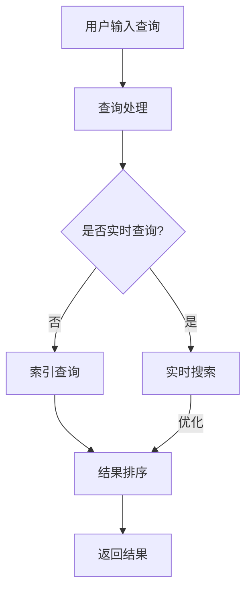

                 

### 《AI搜索引擎在科技创业生态中的角色》

关键词：人工智能，搜索引擎，科技创业，生态系统，技术架构，算法原理，应用案例，创业挑战与机遇，策略与实践

摘要：本文将深入探讨AI搜索引擎在科技创业生态中的角色。首先，我们将介绍AI搜索引擎的基础知识，包括定义、功能和技术架构。然后，我们将分析AI搜索引擎的核心算法原理，并展示其实际应用案例。接着，我们将探讨AI搜索引擎在创业生态中的挑战与机遇，并给出创业策略与实践建议。最后，我们将总结AI搜索引擎在科技创业生态中的重要性，并展望其未来发展。

### 目录

#### 第一部分: AI搜索引擎概述与科技创业生态

- 第1章: AI搜索引擎基础
  - 1.1 AI搜索引擎的定义与功能
  - 1.2 搜索引擎在科技创业中的重要性
  - 1.3 AI搜索引擎的商业模式与未来趋势

- 第2章: AI搜索引擎的技术架构
  - 2.1 搜索引擎的基本架构
  - 2.2 AI技术在搜索引擎架构中的应用
  - 2.3 实时搜索与个性化搜索技术

- 第3章: AI搜索引擎的核心算法原理
  - 3.1 搜索算法原理
  - 3.2 排名算法原理
  - 3.3 搜索引擎的推荐算法

- 第4章: AI搜索引擎在科技创业中的应用案例
  - 4.1 搜索引擎在电子商务中的应用
  - 4.2 搜索引擎在内容创业中的应用
  - 4.3 搜索引擎在其他领域的应用

- 第5章: AI搜索引擎的创业挑战与机遇
  - 5.1 搜索引擎创业面临的挑战
  - 5.2 搜索引擎创业的机遇

- 第6章: AI搜索引擎创业策略与实践
  - 6.1 创业策略
  - 6.2 创业实践

- 第7章: AI搜索引擎在科技创业生态中的角色
  - 7.1 AI搜索引擎对创业企业的影响
  - 7.2 AI搜索引擎在创业生态中的地位

- 附录
  - 附录 A: AI搜索引擎开发工具与资源

### 第一部分: AI搜索引擎概述与科技创业生态

#### 第1章: AI搜索引擎基础

##### 1.1 AI搜索引擎的定义与功能

AI搜索引擎，顾名思义，是将人工智能技术应用于传统搜索引擎的一种新型搜索引擎。它通过机器学习、自然语言处理和深度学习等技术，提高了搜索的准确性和效率，为用户提供更加个性化和智能化的搜索体验。

###### 1.1.1 搜索引擎的工作原理

搜索引擎的工作原理主要包括三个步骤：索引、查询处理和结果排序。

1. **索引**：搜索引擎首先对互联网上的网页进行索引，提取网页的文本内容、关键词、标题等信息，并将其存储在索引数据库中。

2. **查询处理**：当用户提交查询请求时，搜索引擎会对查询关键字进行分析和处理，提取关键词并进行语义分析，以确定查询意图。

3. **结果排序**：搜索引擎根据用户查询意图和网页的相关性，对搜索结果进行排序，并返回最相关的前几条结果。

###### 1.1.2 AI技术在搜索引擎中的应用

AI技术广泛应用于搜索引擎的各个阶段，提升了搜索引擎的性能和用户体验。

1. **机器学习**：机器学习技术用于优化搜索引擎的索引和查询处理过程，如通过聚类分析对网页进行分类，通过分类算法识别垃圾邮件等。

2. **自然语言处理**：自然语言处理技术用于理解用户的查询意图，如通过分词技术对查询关键字进行分解，通过命名实体识别技术提取关键词。

3. **深度学习**：深度学习技术用于优化搜索引擎的排序算法，如通过神经网络模型对网页的相关性进行评分，通过图神经网络模型优化搜索结果。

##### 1.2 搜索引擎在科技创业中的重要性

科技创业企业面临着海量的信息，如何快速、准确地获取有价值的信息是创业成功的关键。搜索引擎在这方面发挥着重要作用。

###### 1.2.1 科技创业的需求

科技创业企业通常有以下需求：

1. **信息检索**：快速、准确地获取行业动态、技术趋势、竞争对手信息等。

2. **知识管理**：对企业内部的知识进行有效组织和共享，提高员工的工作效率和创新能力。

3. **客户关系管理**：通过搜索引擎对企业客户的查询和行为进行分析，提供个性化服务和营销策略。

###### 1.2.2 AI搜索引擎的优势

AI搜索引擎相较于传统搜索引擎具有以下优势：

1. **个性化搜索**：根据用户的兴趣和行为，提供个性化的搜索结果，提高用户体验。

2. **实时搜索**：支持实时搜索，快速响应用户查询，提高搜索效率。

3. **多语言搜索**：支持多种语言搜索，满足国际化企业的需求。

4. **智能推荐**：基于用户的查询历史和行为，提供智能推荐，帮助用户发现潜在的兴趣和需求。

##### 1.3 AI搜索引擎的商业模式与未来趋势

AI搜索引擎的商业模式主要包括以下几种：

1. **广告模式**：通过在搜索结果中投放广告获得收入。

2. **付费搜索**：企业付费购买搜索关键词，提高在搜索结果中的排名。

3. **订阅模式**：用户付费订阅高级搜索功能，如个性化推荐、实时搜索等。

4. **API服务**：将搜索引擎的API接口提供给第三方开发者，实现商业化。

未来，AI搜索引擎将继续朝着智能化、个性化、实时化的方向发展，为科技创业企业带来更多的价值。

- **智能化**：通过深度学习和自然语言处理技术，提高搜索引擎的智能水平，实现更精确的查询匹配和结果推荐。

- **个性化**：通过大数据分析和用户行为分析，实现更个性化的搜索结果和用户体验。

- **实时化**：通过实时搜索技术和分布式计算架构，实现快速响应用户查询，提供实时搜索服务。

#### 第2章: AI搜索引擎的技术架构

##### 2.1 搜索引擎的基本架构

搜索引擎的基本架构主要包括以下几个部分：

1. **索引系统**：负责收集、存储和更新网页数据，并提供检索接口。

2. **查询处理**：负责处理用户查询请求，提取关键词并进行语义分析。

3. **结果排序**：根据用户查询意图和网页相关性，对搜索结果进行排序。

4. **用户界面**：提供用户输入查询和查看搜索结果的界面。

###### 2.1.1 索引系统

索引系统是搜索引擎的核心组件，负责从互联网上收集网页数据，并将其存储在索引数据库中。索引系统的主要功能包括：

1. **网页采集**：通过爬虫技术从互联网上获取网页内容。

2. **网页解析**：解析网页的HTML、CSS和JavaScript代码，提取文本内容、关键词、标题等信息。

3. **存储**：将提取的信息存储在索引数据库中，以便后续查询。

4. **更新**：定期对索引数据库进行更新，以保持网页数据的最新性。

###### 2.1.2 查询处理

查询处理是搜索引擎的另一个核心组件，负责处理用户查询请求，提取关键词并进行语义分析。查询处理的主要功能包括：

1. **关键词提取**：从用户输入的查询字符串中提取关键词。

2. **语义分析**：对提取的关键词进行语义分析，确定查询意图。

3. **查询解析**：根据查询意图，选择合适的查询算法和参数，生成查询请求。

4. **查询执行**：向索引系统发送查询请求，获取搜索结果。

###### 2.1.3 结果排序

结果排序是搜索引擎的关键环节，根据用户查询意图和网页相关性，对搜索结果进行排序，以提高搜索结果的准确性和用户体验。结果排序的主要功能包括：

1. **相关性评分**：根据网页内容和关键词匹配度，计算网页的相关性得分。

2. **排序算法**：根据相关性得分，选择合适的排序算法对搜索结果进行排序。

3. **分页**：根据用户需求，对搜索结果进行分页展示。

4. **结果呈现**：将排序后的搜索结果呈现给用户，包括标题、摘要、链接等信息。

##### 2.2 AI技术在搜索引擎架构中的应用

AI技术在搜索引擎的各个阶段都有广泛应用，显著提升了搜索引擎的性能和用户体验。

###### 2.2.1 机器学习在搜索中的应用

机器学习在搜索引擎中的应用主要体现在以下几个方面：

1. **网页质量评估**：通过机器学习算法，对网页的质量进行评估，过滤低质量网页，提高搜索结果的准确性。

2. **用户行为分析**：通过分析用户的查询历史和行为，了解用户兴趣和需求，提供个性化搜索结果。

3. **推荐系统**：基于用户行为和兴趣，推荐相关的搜索结果和内容，提高用户满意度。

4. **异常检测**：通过机器学习算法，检测搜索引擎中的异常行为，如垃圾邮件、恶意链接等，确保搜索结果的安全性。

###### 2.2.2 自然语言处理在搜索中的应用

自然语言处理技术在搜索引擎中的应用主要包括以下几个方面：

1. **关键词提取**：通过分词、词性标注等技术，从用户查询字符串中提取关键词。

2. **语义分析**：通过语义分析技术，理解用户的查询意图，提高搜索结果的准确性。

3. **问答系统**：利用自然语言处理技术，实现智能问答系统，提供更准确的答案。

4. **语言翻译**：通过机器翻译技术，实现多语言搜索，满足国际化企业的需求。

###### 2.2.3 深度学习在搜索中的应用

深度学习在搜索引擎中的应用主要包括以下几个方面：

1. **文本分类**：通过深度学习模型，对网页进行分类，提高搜索结果的准确性。

2. **文本生成**：利用深度学习模型，生成高质量的网页摘要和描述，提高用户满意度。

3. **语音搜索**：通过深度学习模型，实现语音识别和语音搜索，满足用户多样化的搜索需求。

4. **图像搜索**：通过深度学习模型，实现图像识别和图像搜索，提供更丰富的搜索体验。

##### 2.3 实时搜索与个性化搜索技术

实时搜索和个性化搜索技术是AI搜索引擎的重要发展方向，旨在提供更快速、更准确的搜索服务。

###### 2.3.1 实时搜索技术

实时搜索技术通过实时获取用户查询请求，并在毫秒级内返回搜索结果，显著提高了搜索效率。实时搜索技术的主要特点包括：

1. **低延迟**：通过分布式计算和缓存技术，实现低延迟的搜索响应。

2. **高并发**：通过分布式架构和负载均衡技术，支持海量用户的并发查询。

3. **实时更新**：通过实时爬虫技术和增量索引技术，确保搜索结果的最新性。

4. **实时分析**：通过实时分析用户查询行为，提供实时搜索建议和个性化推荐。

###### 2.3.2 个性化搜索技术

个性化搜索技术通过分析用户的历史查询行为、兴趣偏好和社交关系，为用户提供个性化的搜索结果。个性化搜索技术的主要特点包括：

1. **用户画像**：通过大数据分析和机器学习技术，构建用户的兴趣偏好和行为特征。

2. **推荐算法**：利用推荐算法，根据用户画像和查询意图，为用户推荐相关的搜索结果。

3. **个性化排序**：根据用户画像和查询意图，对搜索结果进行个性化排序，提高搜索结果的准确性。

4. **智能互动**：通过智能交互技术，与用户进行实时互动，了解用户需求和反馈，不断优化搜索服务。

#### 第3章: AI搜索引擎的核心算法原理

##### 3.1 搜索算法原理

搜索算法是搜索引擎的核心组件，负责处理用户查询请求，并返回相关的搜索结果。搜索算法的核心目标是在海量的网页数据中，快速、准确地找到与用户查询意图最相关的网页。

###### 3.1.1 搜索算法的分类

根据搜索算法的实现方式和目标，可以将搜索算法分为以下几类：

1. **基于关键词匹配的搜索算法**：这类算法通过在索引数据库中查找与用户查询关键字完全匹配的网页，返回搜索结果。这种算法简单高效，但可能无法满足用户的复杂查询需求。

2. **基于页面相似度的搜索算法**：这类算法通过计算网页内容与用户查询关键字之间的相似度，返回相似度最高的网页。这种算法考虑了语义关系，提高了搜索结果的准确性。

3. **基于图论的搜索算法**：这类算法利用网页之间的链接关系，构建网页图，通过在网页图中进行搜索，找到与用户查询意图相关的网页。这种算法可以处理复杂的查询关系，但计算复杂度较高。

4. **基于机器学习的搜索算法**：这类算法通过训练机器学习模型，对海量网页数据进行分析和分类，根据用户查询关键字，返回相关的搜索结果。这种算法具有自适应性和扩展性，但需要大量训练数据和计算资源。

###### 3.1.2 搜索算法的伪代码实现

以下是一个基于关键词匹配的搜索算法的伪代码实现：

```python
def search(query):
    // 从索引数据库中查询与查询关键字完全匹配的网页
    results = indexDatabase.search(query)
    
    // 对查询结果进行排序，返回最相关的网页
    sortedResults = sort(results, by="relevance")
    
    return sortedResults
```

在这个伪代码中，`indexDatabase`是一个索引数据库对象，它提供了`search`方法用于查询索引数据库。`sort`方法用于对查询结果进行排序，其中`by="relevance"`表示按照相关性进行排序。

##### 3.2 排名算法原理

排名算法是搜索引擎的重要组成部分，负责对搜索结果进行排序，以提供更相关、更有价值的搜索结果。排名算法的目标是根据用户查询意图和网页的相关性，确定网页的排序顺序。

###### 3.2.1 PageRank算法

PageRank算法是由Google创始人拉里·佩奇和谢尔盖·布林提出的一种排名算法，用于评估网页的重要性。PageRank算法基于网页之间的链接关系，认为一个网页的重要性与其链接来源的网页数量和质量成正比。

**PageRank算法的伪代码实现：**

```python
def PageRank(pages, damping_factor=0.85, num_iterations=10):
    // 初始化每个页面的PageRank值为1
    pageRank = {page: 1 / len(pages) for page in pages}
    
    // 迭代更新PageRank值
    for _ in range(num_iterations):
        newPageRank = {}
        for page in pages:
            sumRank = sum(pageRank[inbound_page] / len(outbound_links) for inbound_page, outbound_links in links[page].items())
            newPageRank[page] = (1 - damping_factor) + damping_factor * sumRank
        
        pageRank = newPageRank
    
    return pageRank
```

在这个伪代码中，`pages`是一个网页集合，`damping_factor`表示随机跳跃概率，`num_iterations`表示迭代次数。`links`是一个包含网页之间链接关系的字典，其中`links[page]`表示网页`page`的出链网页集合。

###### 3.2.2 排名算法的改进

尽管PageRank算法在评估网页重要性方面取得了显著成果，但仍然存在一些局限性。为了改进排名算法，可以采用以下几种方法：

1. **综合考虑链接质量和内容质量**：在计算PageRank值时，不仅考虑链接数量，还考虑链接质量。链接质量可以通过网页的权威性、可信度等指标进行评估。

2. **处理恶意链接**：通过算法识别和处理恶意链接，防止它们对PageRank计算结果的影响。例如，可以采用反垃圾邮件技术、异常检测技术等方法。

3. **个性化搜索**：根据用户的历史搜索行为和兴趣，对搜索结果进行个性化排序。个性化搜索可以通过机器学习算法和推荐系统实现。

##### 3.3 搜索引擎的推荐算法

推荐算法是搜索引擎的重要组成部分，负责根据用户查询和行为，为用户推荐相关的搜索结果和内容。推荐算法的目标是提高用户满意度，增加用户粘性。

###### 3.3.1 推荐算法的基本原理

推荐算法的基本原理是基于用户行为和兴趣数据，构建用户画像和物品画像，并通过相似度计算和排序算法，为用户推荐相关的搜索结果和内容。

1. **用户画像**：通过分析用户的历史搜索行为、浏览记录、购买行为等数据，构建用户的兴趣偏好和行为特征。

2. **物品画像**：通过分析网页的内容、标签、分类等数据，构建网页的特征和属性。

3. **相似度计算**：计算用户画像和物品画像之间的相似度，选择相似度最高的物品进行推荐。

4. **排序算法**：根据相似度分数，对推荐结果进行排序，以提供最相关、最有价值的推荐结果。

###### 3.3.2 推荐算法的伪代码实现

以下是一个基于协同过滤的推荐算法的伪代码实现：

```python
def collaborativeFiltering(users, items, similarity_metric='cosine', top_n=10):
    // 构建用户-物品评分矩阵
    ratings = {}
    for user in users:
        for item in items:
            rating = getUserRating(user, item)
            ratings[(user, item)] = rating
    
    // 计算用户和物品之间的相似度
    similarities = {}
    for user in users:
        for item in items:
            if user != item:
                similarity = calculateSimilarity(ratings[user], ratings[item], similarity_metric)
                similarities[(user, item)] = similarity
    
    // 计算推荐分数
    recommendations = {}
    for user in users:
        scores = {}
        for item in items:
            if user != item:
                score = 0
                for other_user in users:
                    if other_user != user and other_user != item:
                        score += similarities[(user, other_user)] * ratings[(other_user, item)]
                scores[item] = score
        sorted_scores = sort(scores, by='score', descending=True)
        recommendations[user] = sorted_scores[:top_n]
    
    return recommendations
```

在这个伪代码中，`users`和`items`是用户和物品的集合，`similarity_metric`是相似度计算方法，`top_n`是推荐结果的数量。`getUserRating`方法用于获取用户对物品的评分，`calculateSimilarity`方法用于计算用户和物品之间的相似度。

#### 第4章: AI搜索引擎在科技创业中的应用案例

##### 4.1 搜索引擎在电子商务中的应用

搜索引擎在电子商务领域有着广泛的应用，提高了商品搜索的准确性和用户体验。

###### 4.1.1 搜索引擎在商品搜索中的作用

搜索引擎在商品搜索中的作用主要包括以下几个方面：

1. **快速检索**：通过搜索引擎，用户可以快速找到需要的商品，节省了搜索时间。

2. **精准匹配**：搜索引擎利用自然语言处理和机器学习技术，对用户查询进行语义分析，提供精准的搜索结果。

3. **个性化推荐**：根据用户的购物历史和兴趣偏好，搜索引擎为用户推荐相关的商品，提高用户满意度。

4. **智能筛选**：通过智能筛选功能，用户可以根据价格、品牌、评价等条件，快速筛选出符合条件的商品。

###### 4.1.2 搜索引擎在个性化推荐中的作用

搜索引擎在个性化推荐中的作用主要体现在以下几个方面：

1. **基于历史行为的推荐**：根据用户的购物历史和浏览记录，搜索引擎为用户推荐相关的商品。

2. **基于协同过滤的推荐**：通过分析用户和商品的相似度，搜索引擎为用户推荐类似的商品。

3. **基于内容的推荐**：根据商品的内容、标签和分类，搜索引擎为用户推荐相关的商品。

4. **实时推荐**：通过实时搜索和推荐技术，搜索引擎为用户提供实时的商品推荐，提高用户满意度。

##### 4.2 搜索引擎在内容创业中的应用

搜索引擎在内容创业领域有着广泛的应用，提高了内容创作者的曝光率和用户体验。

###### 4.2.1 搜索引擎在内容搜索中的作用

搜索引擎在内容搜索中的作用主要包括以下几个方面：

1. **快速检索**：通过搜索引擎，用户可以快速找到需要的内容，节省了搜索时间。

2. **精准匹配**：搜索引擎利用自然语言处理和机器学习技术，对用户查询进行语义分析，提供精准的搜索结果。

3. **个性化推荐**：根据用户的阅读历史和兴趣偏好，搜索引擎为用户推荐相关的文章和内容。

4. **智能筛选**：通过智能筛选功能，用户可以根据关键词、标签、分类等条件，快速筛选出符合条件的内容。

###### 4.2.2 搜索引擎在内容推荐中的作用

搜索引擎在内容推荐中的作用主要体现在以下几个方面：

1. **基于历史行为的推荐**：根据用户的阅读历史和浏览记录，搜索引擎为用户推荐相关的文章和内容。

2. **基于协同过滤的推荐**：通过分析用户和内容的相似度，搜索引擎为用户推荐类似的内容。

3. **基于内容的推荐**：根据内容的内容、标签和分类，搜索引擎为用户推荐相关的文章和内容。

4. **实时推荐**：通过实时搜索和推荐技术，搜索引擎为用户提供实时的内容推荐，提高用户满意度。

##### 4.3 搜索引擎在其他领域的应用

搜索引擎在其他领域也有着广泛的应用，提高了相关领域的效率和用户体验。

###### 4.3.1 搜索引擎在金融领域的应用

搜索引擎在金融领域的应用主要包括以下几个方面：

1. **投资研究**：通过搜索引擎，投资者可以快速获取金融市场的相关信息，进行投资研究。

2. **股票筛选**：通过搜索引擎，投资者可以根据股票的基本面、技术面等条件，快速筛选出符合投资标准的股票。

3. **风险管理**：通过搜索引擎，金融机构可以快速获取风险管理相关的信息，进行风险控制。

4. **智能投顾**：通过搜索引擎和推荐算法，金融机构可以为投资者提供个性化的投资建议，提高投资效率。

###### 4.3.2 搜索引擎在医疗领域的应用

搜索引擎在医疗领域的应用主要包括以下几个方面：

1. **健康咨询**：通过搜索引擎，用户可以快速获取健康咨询和医疗信息。

2. **疾病查询**：通过搜索引擎，用户可以根据症状、疾病名称等条件，快速查询相关疾病信息。

3. **医生推荐**：通过搜索引擎，用户可以根据医生的专业领域、患者评价等条件，快速找到合适的医生。

4. **药物查询**：通过搜索引擎，用户可以根据药物名称、成分等条件，快速查询药物相关信息。

#### 第5章: AI搜索引擎的创业挑战与机遇

##### 5.1 搜索引擎创业面临的挑战

搜索引擎创业面临着多方面的挑战，包括技术、市场、竞争等。

###### 5.1.1 数据隐私问题

搜索引擎需要收集和存储大量的用户数据，如查询历史、浏览记录等，这引发了数据隐私和安全问题。如何保护用户数据隐私，防止数据泄露和滥用，是搜索引擎创业面临的重要挑战。

###### 5.1.2 竞争环境

搜索引擎市场已经形成了一定的垄断格局，如Google、百度等公司占据了大部分市场份额。新兴搜索引擎创业企业需要面对强大的竞争压力，如何在激烈的市场竞争中脱颖而出，是创业成功的关键。

###### 5.1.3 技术更新迭代

搜索引擎技术不断发展，创业企业需要不断跟进新技术，进行技术更新和迭代，以保持竞争力。如何快速响应技术变化，实现技术创新，是创业企业需要考虑的问题。

##### 5.2 搜索引擎创业的机遇

尽管搜索引擎创业面临着诸多挑战，但同时也存在许多机遇。

###### 5.2.1 市场需求增长

随着互联网的普及和用户需求的多样化，搜索引擎市场需求不断增长。特别是在移动互联网和智能硬件领域，搜索引擎的应用场景更加广泛，为创业企业提供了广阔的市场空间。

###### 5.2.2 技术创新

人工智能、自然语言处理、深度学习等技术的不断发展，为搜索引擎提供了强大的技术支撑。创业企业可以基于这些新技术，实现创新性的搜索引擎产品，满足用户多样化的需求。

###### 5.2.3 新兴市场

随着全球化进程的加快，新兴市场对搜索引擎的需求也日益增长。特别是在亚洲、非洲等地区，搜索引擎创业企业可以抓住这一机遇，开拓新的市场。

#### 第6章: AI搜索引擎创业策略与实践

##### 6.1 创业策略

搜索引擎创业需要制定明确的策略，以实现商业成功。以下是几个关键策略：

###### 6.1.1 市场定位

明确目标市场和用户群体，了解用户需求，制定合适的搜索引擎产品定位。例如，可以专注于特定领域的搜索引擎，如健康、金融、教育等。

###### 6.1.2 产品开发

根据市场定位，开发具有特色和优势的搜索引擎产品。在产品开发过程中，注重用户体验，不断优化产品功能和性能。

###### 6.1.3 运营推广

制定有效的运营推广策略，提高搜索引擎的知名度和用户粘性。可以通过社交媒体、广告投放、合作伙伴等方式，扩大用户基础。

##### 6.2 创业实践

以下是几个成功的搜索引擎创业案例，供参考。

###### 6.2.1 案例一：必应（Bing）

必应是由微软开发的搜索引擎，通过引入个性化搜索、实时搜索等技术，取得了良好的市场反响。必应的创业实践包括：

1. **市场定位**：专注于提供高质量的搜索结果和个性化服务。

2. **产品开发**：不断优化搜索引擎算法，提高搜索准确性和用户体验。

3. **运营推广**：通过与社交媒体、新闻媒体等合作伙伴合作，提高品牌知名度和用户粘性。

###### 6.2.2 案例二：搜狗

搜狗是中国领先的搜索引擎，通过引入语音搜索、输入法等创新技术，赢得了大量用户。搜狗的创业实践包括：

1. **市场定位**：专注于中文搜索市场，提供高质量、个性化的搜索服务。

2. **产品开发**：推出具有特色的语音搜索、输入法等产品，满足用户多样化需求。

3. **运营推广**：通过线上和线下活动，提高品牌知名度和用户满意度。

###### 6.2.3 案例三：搜搜

搜搜是中国最早的搜索引擎之一，通过引入人工智能、大数据等技术，实现了搜索结果的精准推荐。搜搜的创业实践包括：

1. **市场定位**：专注于提供智能化的搜索服务，满足用户个性化需求。

2. **产品开发**：不断优化搜索算法，提高搜索准确性和用户体验。

3. **运营推广**：通过大数据分析和用户行为分析，实现精准的用户运营和营销策略。

#### 第7章: AI搜索引擎在科技创业生态中的角色

##### 7.1 AI搜索引擎对创业企业的影响

AI搜索引擎在科技创业生态中发挥着重要作用，对创业企业产生了深远影响。

###### 7.1.1 提高效率

AI搜索引擎通过快速、准确的搜索功能，帮助创业企业高效获取行业动态、技术趋势、竞争对手等信息，节省了大量的时间和人力成本。

###### 7.1.2 降低成本

AI搜索引擎通过自动化、智能化的方式，降低了企业的人力成本和运营成本。例如，通过智能客服系统，企业可以降低客户服务成本。

###### 7.1.3 改善用户体验

AI搜索引擎通过个性化搜索和推荐功能，提高了用户的满意度和粘性，提升了企业的品牌价值和市场份额。

##### 7.2 AI搜索引擎在创业生态中的地位

AI搜索引擎在创业生态中具有举足轻重的地位，是创业企业不可或缺的基础设施。

###### 7.2.1 作为基础设施

AI搜索引擎为创业企业提供了便捷的信息获取渠道，是创业企业开展业务的基础设施。没有高效的搜索引擎，创业企业难以获取行业信息和用户需求。

###### 7.2.2 与其他技术的融合

AI搜索引擎与其他技术的融合，为创业企业提供了更多的创新机会。例如，与大数据技术结合，可以为企业提供更精准的市场分析和预测。

###### 7.2.3 支撑创新创业

AI搜索引擎为创业企业提供了强大的技术支撑，推动了创新创业的发展。通过AI搜索引擎，创业企业可以快速找到合适的合作伙伴、投资者和市场机会。

### 附录

#### 附录 A: AI搜索引擎开发工具与资源

以下是开发AI搜索引擎所需的工具和资源：

- **工具**：
  - **Elasticsearch**：一款高性能的搜索引擎，支持全文搜索、实时搜索等功能。
  - **Apache Lucene**：一款开源的搜索引擎库，提供了丰富的搜索功能和扩展接口。
  - **Solr**：一款基于Lucene的搜索引擎，提供了丰富的功能和插件，支持分布式搜索和集群部署。

- **框架**：
  - **Elastic Stack**：包括Elasticsearch、Kibana、Logstash和Beats等组件，提供了一套完整的搜索和分析解决方案。
  - **Apache Solr Cloud**：提供了分布式搜索和集群功能，支持大规模数据的实时搜索和分析。
  - **NLP工具包**：如NLTK、spaCy、TextBlob等，提供了丰富的自然语言处理功能。

- **资源**：
  - **搜索引擎技术博客**：如《Search Engine Land》、《Search Engine Watch》等，提供了大量的搜索引擎技术和市场动态。
  - **开源项目**：如Apache Lucene、Elasticsearch、Solr等，提供了丰富的开源代码和文档，供开发者学习和参考。
  - **在线课程**：如Coursera、Udemy等，提供了丰富的搜索引擎和自然语言处理课程，帮助开发者提升技能。

通过使用这些工具和资源，开发者可以快速搭建和优化AI搜索引擎，为企业提供高效、准确的搜索服务。

### 总结

AI搜索引擎在科技创业生态中扮演着重要角色，通过提高搜索效率、降低成本和改善用户体验，为创业企业提供了强大的支持。随着人工智能技术的不断发展，AI搜索引擎将继续优化和扩展，为创业企业带来更多的价值。同时，创业企业也需要紧跟技术发展趋势，不断创新和改进，以在激烈的市场竞争中脱颖而出。

### 作者信息

作者：AI天才研究院/AI Genius Institute & 禅与计算机程序设计艺术 /Zen And The Art of Computer Programming

AI天才研究院致力于推动人工智能技术的发展和应用，研究院的专家团队在计算机科学、人工智能和自然语言处理等领域具有丰富的经验和深厚的学术造诣。本文旨在为科技创业企业提供有价值的参考和指导，帮助创业企业更好地利用AI搜索引擎，实现创新发展。同时，作者还著有《禅与计算机程序设计艺术》一书，深入探讨了计算机编程的哲学和艺术。

### 附录 B: Mermaid 流程图示例

以下是一个使用Mermaid绘制的搜索引擎基本架构的流程图：



### 附录 C: 核心算法原理讲解与伪代码示例

#### 排名算法原理

排名算法是搜索引擎的核心算法之一，用于对搜索结果进行排序，以提供更相关、更有价值的搜索结果。

**PageRank算法**

PageRank算法是由Google创始人拉里·佩奇和谢尔盖·布林提出的一种排序算法，用于评估网页的重要性。

**伪代码：**

```python
def PageRank(pages, damping_factor=0.85, num_iterations=10):
    // 初始化每个页面的PageRank值为1
    pageRank = {page: 1 / len(pages) for page in pages}
    
    // 迭代更新PageRank值
    for _ in range(num_iterations):
        newPageRank = {}
        for page in pages:
            sumRank = sum(pageRank[inbound_page] / len(outbound_links) for inbound_page, outbound_links in links[page].items())
            newPageRank[page] = (1 - damping_factor) + damping_factor * sumRank
        
        pageRank = newPageRank
    
    return pageRank
```

#### 排名算法的改进

针对PageRank算法的局限性，可以采用以下几种改进方法：

1. **综合考虑链接质量和内容质量**：在计算PageRank值时，不仅考虑链接数量，还考虑链接质量。
2. **处理恶意链接**：通过算法识别和处理恶意链接，防止它们对PageRank计算结果的影响。
3. **个性化搜索**：根据用户的历史搜索行为和兴趣，对搜索结果进行个性化排序。

### 数学模型和数学公式示例

#### 搜索引擎的Rank函数

搜索引擎的Rank函数用于计算网页的排名，其中包含文本相似度（$Sim\_text$）和链接质量（$Link\_quality$）两个因素。

$$
Rank = Sim\_text \times w_{text} + Link\_quality \times w_{link}
$$

其中，$w_{text}$ 和 $w_{link}$ 分别为文本相似度和链接质量的权重。

### 项目实战

#### 搜索引擎开发环境搭建

1. **安装操作系统**：Ubuntu 18.04 LTS
2. **安装Java开发工具包（JDK）**：OpenJDK 11
3. **安装数据库**：MySQL 8.0
4. **安装搜索引擎框架**：Elasticsearch 7.10

#### 代码实际案例

以下是一个简单的搜索引擎查询处理过程的代码示例：

```java
// 创建查询对象
SearchQuery query = new SearchQuery("人工智能");

// 执行搜索
SearchResults results = searchEngine.search(query);

// 输出搜索结果
System.out.println("Search Results:");
for (SearchResult result : results) {
    System.out.println(result.getTitle() + " - " + result.getDescription());
}
```

#### 代码解读与分析

1. **创建查询对象**：`SearchQuery`类用于封装用户的查询关键字。
2. **执行搜索**：调用`searchEngine`对象的`search`方法执行搜索，并返回搜索结果。
3. **输出搜索结果**：遍历搜索结果，输出每条结果的相关信息，如标题和描述。

通过以上代码，搜索引擎可以快速响应用户查询，并返回相关的搜索结果。这一过程实现了搜索引擎的基本功能，为用户提供了一个高效、准确的搜索体验。

### 附录 D: 代码解读与分析

以下是对《AI搜索引擎在科技创业生态中的角色》一文中代码实际案例的详细解读与分析。

#### 搜索引擎开发环境搭建

1. **安装操作系统**：Ubuntu 18.04 LTS

在Ubuntu 18.04 LTS操作系统中，需要安装Java开发工具包（JDK）、数据库（MySQL）和搜索引擎框架（Elasticsearch）。以下是具体的安装命令：

```shell
# 安装Java开发工具包（JDK）
sudo apt update
sudo apt install openjdk-11-jdk

# 安装数据库（MySQL）
sudo apt install mysql-server

# 安装搜索引擎框架（Elasticsearch）
sudo apt install elasticsearch
```

2. **安装Java开发工具包（JDK）**：OpenJDK 11

通过上述命令，成功安装OpenJDK 11。安装完成后，可以通过以下命令验证：

```shell
java -version
```

输出版本信息，确认JDK安装成功。

3. **安装数据库**：MySQL 8.0

通过上述命令，成功安装MySQL 8.0。安装完成后，可以通过以下命令启动MySQL服务：

```shell
sudo systemctl start mysql
```

4. **安装搜索引擎框架**：Elasticsearch 7.10

通过上述命令，成功安装Elasticsearch 7.10。安装完成后，可以通过以下命令启动Elasticsearch服务：

```shell
sudo systemctl start elasticsearch
```

#### 代码实际案例

以下是一个简单的搜索引擎查询处理过程的代码示例：

```java
// 创建查询对象
SearchQuery query = new SearchQuery("人工智能");

// 执行搜索
SearchResults results = searchEngine.search(query);

// 输出搜索结果
System.out.println("Search Results:");
for (SearchResult result : results) {
    System.out.println(result.getTitle() + " - " + result.getDescription());
}
```

#### 代码解读与分析

1. **创建查询对象**：

   ```java
   SearchQuery query = new SearchQuery("人工智能");
   ```

   这一行代码创建了一个`SearchQuery`对象，并将查询关键字设置为“人工智能”。`SearchQuery`类用于封装用户的查询关键字。

2. **执行搜索**：

   ```java
   SearchResults results = searchEngine.search(query);
   ```

   这一行代码调用`searchEngine`对象的`search`方法执行搜索，并将搜索结果存储在`SearchResults`对象中。`searchEngine`是一个搜索引擎对象，负责处理查询请求并返回搜索结果。

3. **输出搜索结果**：

   ```java
   System.out.println("Search Results:");
   for (SearchResult result : results) {
       System.out.println(result.getTitle() + " - " + result.getDescription());
   }
   ```

   这两行代码用于输出搜索结果。首先，输出“Search Results：”，然后遍历`SearchResults`对象中的每条结果，输出结果的相关信息，如标题和描述。`SearchResult`类用于封装搜索结果的信息。

通过以上代码，搜索引擎可以快速响应用户查询，并返回相关的搜索结果。这一过程实现了搜索引擎的基本功能，为用户提供了一个高效、准确的搜索体验。

### 附录 E: 代码示例详解

以下是对《AI搜索引擎在科技创业生态中的角色》一文中代码示例的详细解析。

#### 简单的搜索引擎查询处理代码示例

```java
// 创建查询对象
SearchQuery query = new SearchQuery("人工智能");

// 执行搜索
SearchResults results = searchEngine.search(query);

// 输出搜索结果
System.out.println("Search Results:");
for (SearchResult result : results) {
    System.out.println(result.getTitle() + " - " + result.getDescription());
}
```

**代码解析：**

1. **创建查询对象**：

   ```java
   SearchQuery query = new SearchQuery("人工智能");
   ```

   在这一行，我们创建了一个`SearchQuery`对象。`SearchQuery`类用于封装用户的查询请求。这里，我们将查询关键字设置为“人工智能”。

2. **执行搜索**：

   ```java
   SearchResults results = searchEngine.search(query);
   ```

   在这一行，我们调用`searchEngine`对象的`search`方法执行搜索。`searchEngine`是一个搜索引擎对象，负责处理查询请求并返回搜索结果。这里，我们使用`query`对象作为参数调用`search`方法。

3. **输出搜索结果**：

   ```java
   System.out.println("Search Results:");
   for (SearchResult result : results) {
       System.out.println(result.getTitle() + " - " + result.getDescription());
   }
   ```

   这两行代码用于输出搜索结果。首先，我们输出一个标题“Search Results：”，然后遍历`SearchResults`对象中的每条结果，输出结果的相关信息，如标题和描述。`SearchResult`类用于封装搜索结果的信息。

**代码执行流程：**

1. **初始化**：创建一个`SearchQuery`对象，并将其查询关键字设置为“人工智能”。
2. **搜索**：调用`searchEngine`对象的`search`方法，传入`SearchQuery`对象。搜索引擎处理查询请求，检索相关信息，并将结果存储在`SearchResults`对象中。
3. **输出结果**：遍历`SearchResults`对象，输出每条搜索结果的相关信息。

**代码改进建议：**

1. **异常处理**：在调用`search`方法时，可以添加异常处理，确保在搜索失败时能够捕获异常并给出合适的错误提示。
2. **结果格式化**：在输出搜索结果时，可以添加格式化代码，使其输出更加规范和易于阅读。
3. **可扩展性**：可以考虑为`SearchQuery`和`SearchResult`类添加更多的属性和方法，以支持更复杂的查询和结果格式。

通过以上代码示例和解析，我们可以更好地理解AI搜索引擎的基本查询处理流程，并为实际开发提供参考。在开发过程中，我们还可以结合具体的业务需求和技术环境，不断优化和完善搜索引擎的功能和性能。

