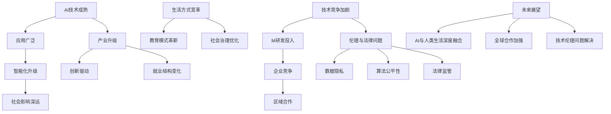
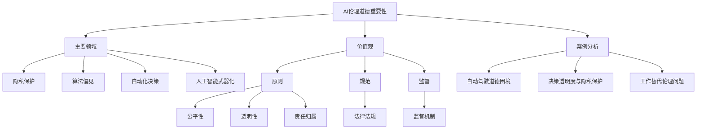
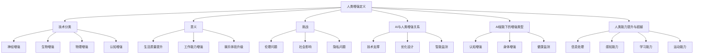
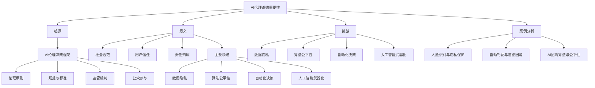

                 

### 第1章：AI时代的背景

#### 1.1 AI时代的定义与特征

##### 1.1.1 AI时代的定义

AI时代，即人工智能时代，是指人工智能技术得到了广泛应用，深度渗透到各个行业，对社会生产方式和生活方式产生深远影响的阶段。这一时代以大数据、云计算、物联网、深度学习等关键技术的突破为标志。

##### 1.1.2 AI时代的特征

- **技术成熟**：人工智能技术从理论研究走向实际应用，逐步实现了从感知、学习到决策的全面功能。
- **应用广泛**：人工智能技术广泛应用于金融、医疗、教育、交通、制造业等多个领域，提升了行业效率和创新能力。
- **智能化升级**：从简单的自动化工具向智能化系统转变，能够进行复杂的决策和问题解决。
- **社会影响深远**：AI技术不仅改变了生产方式，还影响了人们的生活习惯、价值观念和道德伦理。

#### 1.2 AI技术对社会的深远影响

##### 1.2.1 经济影响

- **产业升级**：人工智能技术推动了传统产业的升级和转型，如智能制造、智能物流等。
- **创新驱动**：AI技术的应用推动了新兴产业的发展，如智能医疗、智能交通等。
- **就业结构变化**：部分传统岗位被自动化替代，同时新兴岗位如数据科学家、机器学习工程师等需求增加。

##### 1.2.2 社会影响

- **生活方式变革**：智能家居、智能穿戴设备等AI产品渗透到日常生活中，改变了人们的消费习惯。
- **教育模式革新**：个性化学习、智能辅导等AI教育应用提高了教育质量和学习效率。
- **社会治理优化**：智能监控、数据分析等AI技术提高了社会治理的智能化水平。

##### 1.2.3 全球趋势

- **技术竞争**：各国纷纷加大对AI技术的投入，争夺全球科技制高点。
- **国际合作**：在全球AI治理、数据共享等方面，各国正积极探索合作机制。
- **伦理问题**：随着AI技术的广泛应用，如何确保技术伦理和公平性成为全球关注的焦点。

#### 1.3 AI时代下的全球趋势

##### 1.3.1 技术竞争加剧

- **研发投入**：全球各国政府和企业纷纷加大在AI领域的研发投入，推动技术突破。
- **企业竞争**：全球科技巨头如谷歌、微软、亚马逊等在AI领域展开激烈竞争。
- **区域合作**：欧盟、亚洲等区域组织通过合作推动AI技术的研究和应用。

##### 1.3.2 伦理与法律问题

- **数据隐私**：如何保护用户数据隐私成为全球关注的焦点。
- **算法公平性**：确保算法的公平性和透明性，避免算法偏见和歧视。
- **法律监管**：各国政府正在制定相应的法律法规，规范AI技术的应用。

##### 1.3.3 未来展望

- **AI与人类生活深度融合**：AI技术将进一步融入人类生活的各个方面，提高生活质量。
- **全球合作加强**：在应对全球性挑战如气候变化、公共健康等方面，AI技术将发挥重要作用。
- **技术伦理问题解决**：通过国际合作和制度创新，有望逐步解决AI技术带来的伦理和法律问题。

#### 1.4 结论

AI时代已经到来，其对社会的深远影响正在逐步显现。在这个时代，我们需要关注技术进步的同时，也要重视伦理问题，确保人工智能技术的可持续发展，为人类带来更多的机遇和福祉。

#### Mermaid 流程图

#### 1.1.1 AI时代的定义与特征

AI时代的定义离不开对人工智能技术的理解。人工智能（Artificial Intelligence，简称AI）是指计算机系统通过模拟人类智能行为，实现感知、学习、推理、决策等功能的综合技术。AI技术的发展经历了数个阶段，从早期的规则系统、知识表示到现代的深度学习和强化学习，每一阶段的突破都推动了AI技术的成熟和应用。

##### AI时代的定义

AI时代，或称智能时代，是指人工智能技术实现了从理论走向实践、从实验室走向市场的阶段。在这个时代，AI技术不再仅仅停留在学术研究的范畴，而是开始广泛应用于各个领域，改变了社会的生产方式和生活方式。AI时代的标志是大数据、云计算、物联网等关键技术的突破，这些技术为AI的快速发展提供了强大的基础设施。

##### AI时代的特征

1. **技术成熟**：AI技术从理论研究走向实际应用，实现了从感知、学习到决策的全面功能。例如，深度学习算法已经在图像识别、自然语言处理等领域达到了人类水平，并在医疗诊断、金融风控等实际场景中发挥了重要作用。

2. **应用广泛**：AI技术在金融、医疗、教育、交通、制造业等多个领域得到了广泛应用。例如，在金融领域，AI算法被用于风险管理、欺诈检测和智能投顾；在医疗领域，AI技术用于疾病诊断、个性化治疗和康复；在教育领域，AI技术提供了个性化学习、智能辅导和在线教育服务。

3. **智能化升级**：从简单的自动化工具向智能化系统转变，AI技术能够进行复杂的决策和问题解决。例如，自动驾驶汽车通过感知环境、规划路径和实时决策，实现了真正的自动驾驶；智能客服系统能够理解自然语言、提供实时解答和情感互动。

4. **社会影响深远**：AI技术不仅改变了生产方式，还影响了人们的生活习惯、价值观念和道德伦理。例如，智能家居设备的普及改变了人们的家庭生活方式；AI在医疗领域的应用提高了疾病诊断的准确性，改变了人们的健康观念；AI在交通领域的应用提高了交通效率，改变了人们的出行方式。

#### 1.2 AI技术对社会的深远影响

##### 1.2.1 经济影响

AI技术的发展对经济产生了深远影响，主要体现在以下几个方面：

1. **产业升级**：AI技术推动了传统产业的升级和转型。例如，在制造业领域，AI技术被广泛应用于生产线的自动化控制、质量检测和供应链管理，提高了生产效率和产品质量。在物流领域，AI技术优化了运输路线和配送策略，提高了物流效率。

2. **创新驱动**：AI技术的应用推动了新兴产业的发展。例如，在医疗领域，AI技术推动了精准医疗和个性化治疗的发展，为患者提供了更好的医疗服务。在金融领域，AI技术推动了金融科技的创新，如智能投顾、区块链技术和数字货币等。

3. **就业结构变化**：AI技术的应用导致了就业结构的变化。一方面，AI技术替代了部分传统岗位，如工厂操作工、客服代表等。另一方面，AI技术创造了新的就业岗位，如数据科学家、机器学习工程师、AI伦理专家等。

##### 1.2.2 社会影响

AI技术对社会的影响是全方位的，涵盖了生活方式、教育、社会治理等多个方面：

1. **生活方式变革**：AI技术的普及改变了人们的生活方式。例如，智能家居设备的普及使家庭生活更加便捷和舒适；智能穿戴设备的普及使人们能够更好地管理健康和运动。

2. **教育模式革新**：AI技术在教育领域的应用带来了教育模式的革新。例如，个性化学习系统能够根据学生的学习特点和进度提供定制化的学习资源；智能辅导系统能够为学生提供实时解答和学习指导。

3. **社会治理优化**：AI技术在社会治理领域的应用提高了治理效率。例如，智能监控系统能够实时监测社会治安情况，提高公共安全水平；大数据分析技术能够帮助政府制定更科学的社会政策。

##### 1.2.3 全球趋势

AI技术的发展呈现出以下全球趋势：

1. **技术竞争加剧**：全球各国纷纷加大对AI技术的投入，争夺全球科技制高点。例如，美国、中国、欧盟等地区在AI技术研究和应用方面取得了显著进展。

2. **国际合作**：在全球AI治理、数据共享等方面，各国正积极探索合作机制。例如，联合国教科文组织发布了《人工智能伦理建议》，为全球AI治理提供了伦理指导。

3. **伦理问题**：随着AI技术的广泛应用，如何确保技术伦理和公平性成为全球关注的焦点。例如，算法偏见、数据隐私、法律监管等问题需要全球共同解决。

#### 1.3 AI时代下的全球趋势

##### 1.3.1 技术竞争加剧

AI时代下，技术竞争呈现出以下趋势：

1. **研发投入**：全球各国政府和企业纷纷加大对AI技术的研发投入。例如，美国和中国的政府和企业都在AI领域投入了巨额资金，推动技术突破。

2. **企业竞争**：全球科技巨头在AI领域展开激烈竞争。例如，谷歌、微软、亚马逊等公司在AI研究、应用和市场方面展开了全面竞争。

3. **区域合作**：欧盟、亚洲等区域组织通过合作推动AI技术的研究和应用。例如，欧盟推出了《人工智能法案》，旨在推动区域内AI技术的发展和应用。

##### 1.3.2 伦理与法律问题

AI时代下的伦理与法律问题成为全球关注的焦点，主要体现在以下几个方面：

1. **数据隐私**：如何保护用户数据隐私成为全球关注的焦点。例如，欧盟的《通用数据保护条例》（GDPR）对数据收集、存储和处理进行了严格的规定。

2. **算法公平性**：确保算法的公平性和透明性，避免算法偏见和歧视。例如，算法偏见可能导致种族、性别等方面的不公平。

3. **法律监管**：各国政府正在制定相应的法律法规，规范AI技术的应用。例如，美国的《人工智能倡议》和中国的《新一代人工智能发展规划》都涉及到了AI技术的法律监管。

##### 1.3.3 未来展望

AI时代的未来展望包括以下几个方面：

1. **AI与人类生活深度融合**：AI技术将进一步融入人类生活的各个方面，提高生活质量。例如，智能家居、智能医疗、智能交通等领域的应用将使生活更加便捷和舒适。

2. **全球合作加强**：在全球性挑战如气候变化、公共健康等方面，AI技术将发挥重要作用。例如，全球合作可以推动AI技术在疫情防控、医疗资源分配等方面的应用。

3. **技术伦理问题解决**：通过国际合作和制度创新，有望逐步解决AI技术带来的伦理和法律问题。例如，制定全球AI伦理标准和法规，推动技术伦理的进步。

### 结论

AI时代已经到来，其对社会的深远影响正在逐步显现。在这个时代，我们需要关注技术进步的同时，也要重视伦理问题，确保人工智能技术的可持续发展，为人类带来更多的机遇和福祉。

### 1.1.1 AI时代的定义与特征

在讨论AI时代的定义与特征之前，首先需要明确人工智能（AI）的概念。人工智能是指通过计算机模拟人类智能行为，使计算机具有感知、学习、推理、决策等能力的学科和技术。AI技术经历了多个发展阶段，从早期的规则系统、知识表示到现代的深度学习和强化学习，每一阶段的突破都为AI技术的发展奠定了基础。

##### AI时代的定义

AI时代，或称智能时代，是指人工智能技术从理论研究走向实际应用，并开始深刻影响社会各个领域的阶段。这个时代的特征是：

1. **技术突破**：AI技术在算法、硬件、数据等方面取得了显著突破，使得人工智能的应用变得更加广泛和深入。
2. **应用普及**：人工智能技术不再局限于实验室和科研机构，而是开始广泛应用于金融、医疗、教育、交通、制造等各个行业，改变了传统的工作方式和生活习惯。
3. **智能化升级**：AI技术不仅仅替代了简单的重复性劳动，更是在复杂决策、智能优化等方面展现出了巨大的潜力。

##### AI时代的特征

1. **技术成熟**：随着深度学习、神经网络等先进算法的普及，AI技术在图像识别、语音识别、自然语言处理等领域达到了前所未有的水平，成为各个行业提升效率和创新能力的重要工具。

2. **应用广泛**：AI技术的应用已经渗透到社会的方方面面。在金融领域，AI技术被用于风险评估、欺诈检测和智能投顾；在医疗领域，AI技术用于疾病诊断、药物研发和个性化治疗；在教育领域，AI技术提供了个性化学习、智能辅导和在线教育服务等。

3. **智能化升级**：AI技术不仅提升了工作效率，还推动了生产方式的智能化升级。例如，智能制造通过AI技术实现了生产过程的自动化和智能化，提高了生产效率和质量。智能交通系统通过AI技术优化了交通流量管理，减少了拥堵和提高了出行效率。

4. **社会影响深远**：AI技术对社会的影响是全方位的。它不仅改变了生产方式和生活方式，还影响了人们的价值观念和道德伦理。例如，自动化和智能化的普及使得传统劳动力的需求下降，从而引发了就业结构的变化和社会不平等的加剧。

### 1.2 AI技术对社会的深远影响

##### 1.2.1 经济影响

AI技术对经济的影响是显著的，其影响主要体现在以下几个方面：

1. **产业升级**：AI技术的应用推动了传统产业的升级和转型。例如，在制造业中，AI技术被广泛应用于生产线的自动化、质量控制和供应链管理，从而提高了生产效率和产品质量。在金融服务业，AI技术被用于风险评估、欺诈检测和智能投顾，提高了金融服务的效率和安全性。

2. **创新驱动**：AI技术的应用激发了新的商业模式和业务流程的创新发展。例如，共享经济、无人零售等新兴商业模式得益于AI技术的支持，实现了资源的高效配置和业务流程的优化。

3. **就业结构变化**：AI技术的应用也带来了就业结构的变化。一方面，一些传统岗位被自动化和智能化设备替代，如制造业的流水线工人、金融业的文书处理人员等。另一方面，AI技术创造了新的就业机会，如数据科学家、AI工程师、机器学习专家等。

##### 1.2.2 社会影响

AI技术对社会的影响是深远的，其影响主要体现在以下几个方面：

1. **生活方式变革**：AI技术的普及改变了人们的生活方式。智能家居、智能穿戴设备、智能交通等应用让人们的生活更加便捷和舒适。例如，智能音箱和智能电视使得家庭娱乐更加智能化，智能穿戴设备如智能手表和健身手环让人们可以随时了解自己的健康状况。

2. **教育模式革新**：AI技术在教育领域的应用推动了教育模式的革新。个性化学习系统和智能辅导系统可以根据学生的学习习惯和进度提供定制化的学习资源和辅导服务，提高了教育质量和学习效率。在线教育平台和虚拟现实技术使得教育资源更加普及和多样化，让更多人有机会接受高质量的教育。

3. **社会治理优化**：AI技术在社会治理中的应用提高了治理效率和公共服务水平。智能监控系统能够实时监测社会治安情况，提高公共安全水平；大数据分析技术帮助政府更好地了解社会状况，制定更科学的社会政策；智能交通系统通过优化交通流量管理，减少了拥堵和提高了出行效率。

##### 1.2.3 全球趋势

AI技术的发展呈现出全球化的趋势，其全球趋势主要体现在以下几个方面：

1. **技术竞争加剧**：全球各国纷纷加大对AI技术的投入和研发，争夺全球科技制高点。美国、中国、欧盟等地区在AI技术研究和应用方面取得了显著进展，形成了全球技术竞争的格局。

2. **国际合作**：在全球AI治理、数据共享和技术标准化等方面，各国正积极探索合作机制。例如，联合国教科文组织发布了《人工智能伦理建议》，为全球AI治理提供了伦理指导；国际标准化组织（ISO）也在积极制定AI技术的国际标准。

3. **伦理问题**：随着AI技术的广泛应用，如何确保技术伦理和公平性成为全球关注的焦点。算法偏见、数据隐私、法律监管等问题需要全球共同解决，以避免技术滥用和伦理风险。

### 1.3 AI时代下的全球趋势

在AI时代，全球趋势主要包括以下几个方面：

##### 1.3.1 技术竞争加剧

随着AI技术的不断进步和应用，全球各国都在加大研发投入，争夺全球科技制高点。美国、中国、欧盟等地区在AI技术研究和应用方面取得了显著进展，形成了全球技术竞争的格局。

1. **研发投入**：全球各国政府和企业纷纷加大对AI技术的研发投入，推动技术突破。例如，美国政府在《美国人工智能倡议》中提出了大量投资计划，用于支持AI技术的研发和应用。

2. **企业竞争**：全球科技巨头在AI领域展开了激烈竞争，争夺市场份额和技术领先地位。例如，谷歌、微软、亚马逊等公司在AI研究、应用和市场方面展开了全面竞争。

3. **区域合作**：欧盟、亚洲等区域组织通过合作推动AI技术的研究和应用。例如，欧盟发布了《人工智能法案》，旨在推动区域内AI技术的发展和应用；亚洲各国也在加强合作，共同推动AI技术的研发和产业化。

##### 1.3.2 伦理与法律问题

随着AI技术的广泛应用，如何确保技术伦理和公平性成为全球关注的焦点。伦理和法律问题主要体现在以下几个方面：

1. **数据隐私**：如何保护用户数据隐私成为全球关注的焦点。例如，欧盟的《通用数据保护条例》（GDPR）对数据收集、存储和处理进行了严格的规定，旨在保护用户隐私。

2. **算法公平性**：确保算法的公平性和透明性，避免算法偏见和歧视。例如，算法偏见可能导致种族、性别等方面的不公平，需要通过技术手段和法律法规加以解决。

3. **法律监管**：各国政府正在制定相应的法律法规，规范AI技术的应用。例如，美国的《人工智能倡议》和中国的《新一代人工智能发展规划》都涉及到了AI技术的法律监管。

##### 1.3.3 未来展望

AI时代的未来展望包括以下几个方面：

1. **AI与人类生活深度融合**：AI技术将进一步融入人类生活的各个方面，提高生活质量。例如，智能家居、智能医疗、智能交通等领域的应用将使生活更加便捷和舒适。

2. **全球合作加强**：在全球性挑战如气候变化、公共健康等方面，AI技术将发挥重要作用。全球合作可以推动AI技术在疫情防控、医疗资源分配等方面的应用。

3. **技术伦理问题解决**：通过国际合作和制度创新，有望逐步解决AI技术带来的伦理和法律问题。例如，制定全球AI伦理标准和法规，推动技术伦理的进步。

### 结论

AI时代的到来，不仅带来了技术上的突破和应用，还对社会经济、生活方式和全球趋势产生了深远影响。在享受技术进步带来便利的同时，我们也要关注技术带来的伦理和法律问题，确保AI技术的可持续发展，为人类带来更多的机遇和福祉。

### 1.2 AI技术对社会的深远影响

#### 1.2.1 经济影响

人工智能（AI）技术对经济产生了深远的影响，这一影响主要体现在以下几个方面：

1. **产业升级**：AI技术的应用推动了传统产业的升级和转型。例如，在制造业中，AI技术被广泛应用于生产线的自动化、质量控制和供应链管理，提高了生产效率和产品质量。在金融服务业，AI技术被用于风险评估、欺诈检测和智能投顾，提高了金融服务的效率和安全性。

2. **创新驱动**：AI技术的应用激发了新的商业模式和业务流程的创新发展。例如，共享经济、无人零售等新兴商业模式得益于AI技术的支持，实现了资源的高效配置和业务流程的优化。

3. **就业结构变化**：AI技术的应用也带来了就业结构的变化。一方面，一些传统岗位被自动化和智能化设备替代，如制造业的流水线工人、金融业的文书处理人员等。另一方面，AI技术创造了新的就业机会，如数据科学家、AI工程师、机器学习专家等。

#### 1.2.2 社会影响

AI技术对社会的影响是全方位的，其影响主要体现在以下几个方面：

1. **生活方式变革**：AI技术的普及改变了人们的生活方式。智能家居、智能穿戴设备、智能交通等应用让人们的生活更加便捷和舒适。例如，智能音箱和智能电视使得家庭娱乐更加智能化，智能穿戴设备如智能手表和健身手环让人们可以随时了解自己的健康状况。

2. **教育模式革新**：AI技术在教育领域的应用推动了教育模式的革新。个性化学习系统和智能辅导系统可以根据学生的学习习惯和进度提供定制化的学习资源和辅导服务，提高了教育质量和学习效率。在线教育平台和虚拟现实技术使得教育资源更加普及和多样化，让更多人有机会接受高质量的教育。

3. **社会治理优化**：AI技术在社会治理中的应用提高了治理效率和公共服务水平。智能监控系统能够实时监测社会治安情况，提高公共安全水平；大数据分析技术帮助政府更好地了解社会状况，制定更科学的社会政策；智能交通系统通过优化交通流量管理，减少了拥堵和提高了出行效率。

#### 1.2.3 全球趋势

AI技术的发展呈现出全球化的趋势，其全球趋势主要体现在以下几个方面：

1. **技术竞争加剧**：全球各国纷纷加大对AI技术的投入和研发，争夺全球科技制高点。美国、中国、欧盟等地区在AI技术研究和应用方面取得了显著进展，形成了全球技术竞争的格局。

2. **国际合作**：在全球AI治理、数据共享和技术标准化等方面，各国正积极探索合作机制。例如，联合国教科文组织发布了《人工智能伦理建议》，为全球AI治理提供了伦理指导；国际标准化组织（ISO）也在积极制定AI技术的国际标准。

3. **伦理问题**：随着AI技术的广泛应用，如何确保技术伦理和公平性成为全球关注的焦点。算法偏见、数据隐私、法律监管等问题需要全球共同解决，以避免技术滥用和伦理风险。

### 1.3 AI时代下的全球趋势

在AI时代，全球趋势主要包括以下几个方面：

##### 1.3.1 技术竞争加剧

随着AI技术的不断进步和应用，全球各国都在加大研发投入，争夺全球科技制高点。美国、中国、欧盟等地区在AI技术研究和应用方面取得了显著进展，形成了全球技术竞争的格局。

1. **研发投入**：全球各国政府和企业纷纷加大对AI技术的研发投入，推动技术突破。例如，美国政府在《美国人工智能倡议》中提出了大量投资计划，用于支持AI技术的研发和应用。

2. **企业竞争**：全球科技巨头在AI领域展开了激烈竞争，争夺市场份额和技术领先地位。例如，谷歌、微软、亚马逊等公司在AI研究、应用和市场方面展开了全面竞争。

3. **区域合作**：欧盟、亚洲等区域组织通过合作推动AI技术的研究和应用。例如，欧盟发布了《人工智能法案》，旨在推动区域内AI技术的发展和应用；亚洲各国也在加强合作，共同推动AI技术的研发和产业化。

##### 1.3.2 伦理与法律问题

随着AI技术的广泛应用，如何确保技术伦理和公平性成为全球关注的焦点。伦理和法律问题主要体现在以下几个方面：

1. **数据隐私**：如何保护用户数据隐私成为全球关注的焦点。例如，欧盟的《通用数据保护条例》（GDPR）对数据收集、存储和处理进行了严格的规定，旨在保护用户隐私。

2. **算法公平性**：确保算法的公平性和透明性，避免算法偏见和歧视。例如，算法偏见可能导致种族、性别等方面的不公平，需要通过技术手段和法律法规加以解决。

3. **法律监管**：各国政府正在制定相应的法律法规，规范AI技术的应用。例如，美国的《人工智能倡议》和中国的《新一代人工智能发展规划》都涉及到了AI技术的法律监管。

##### 1.3.3 未来展望

AI时代的未来展望包括以下几个方面：

1. **AI与人类生活深度融合**：AI技术将进一步融入人类生活的各个方面，提高生活质量。例如，智能家居、智能医疗、智能交通等领域的应用将使生活更加便捷和舒适。

2. **全球合作加强**：在全球性挑战如气候变化、公共健康等方面，AI技术将发挥重要作用。全球合作可以推动AI技术在疫情防控、医疗资源分配等方面的应用。

3. **技术伦理问题解决**：通过国际合作和制度创新，有望逐步解决AI技术带来的伦理和法律问题。例如，制定全球AI伦理标准和法规，推动技术伦理的进步。

### 结论

AI时代的到来，不仅带来了技术上的突破和应用，还对社会经济、生活方式和全球趋势产生了深远影响。在享受技术进步带来便利的同时，我们也要关注技术带来的伦理和法律问题，确保AI技术的可持续发展，为人类带来更多的机遇和福祉。

### 1.3 AI时代下的全球趋势

在AI时代，全球趋势主要包括以下几个方面：

##### 1.3.1 技术竞争加剧

随着AI技术的不断进步和应用，全球各国都在加大研发投入，争夺全球科技制高点。美国、中国、欧盟等地区在AI技术研究和应用方面取得了显著进展，形成了全球技术竞争的格局。

1. **研发投入**：全球各国政府和企业纷纷加大对AI技术的研发投入，推动技术突破。例如，美国政府在《美国人工智能倡议》中提出了大量投资计划，用于支持AI技术的研发和应用。

2. **企业竞争**：全球科技巨头在AI领域展开了激烈竞争，争夺市场份额和技术领先地位。例如，谷歌、微软、亚马逊等公司在AI研究、应用和市场方面展开了全面竞争。

3. **区域合作**：欧盟、亚洲等区域组织通过合作推动AI技术的研究和应用。例如，欧盟发布了《人工智能法案》，旨在推动区域内AI技术的发展和应用；亚洲各国也在加强合作，共同推动AI技术的研发和产业化。

##### 1.3.2 伦理与法律问题

随着AI技术的广泛应用，如何确保技术伦理和公平性成为全球关注的焦点。伦理和法律问题主要体现在以下几个方面：

1. **数据隐私**：如何保护用户数据隐私成为全球关注的焦点。例如，欧盟的《通用数据保护条例》（GDPR）对数据收集、存储和处理进行了严格的规定，旨在保护用户隐私。

2. **算法公平性**：确保算法的公平性和透明性，避免算法偏见和歧视。例如，算法偏见可能导致种族、性别等方面的不公平，需要通过技术手段和法律法规加以解决。

3. **法律监管**：各国政府正在制定相应的法律法规，规范AI技术的应用。例如，美国的《人工智能倡议》和中国的《新一代人工智能发展规划》都涉及到了AI技术的法律监管。

##### 1.3.3 未来展望

AI时代的未来展望包括以下几个方面：

1. **AI与人类生活深度融合**：AI技术将进一步融入人类生活的各个方面，提高生活质量。例如，智能家居、智能医疗、智能交通等领域的应用将使生活更加便捷和舒适。

2. **全球合作加强**：在全球性挑战如气候变化、公共健康等方面，AI技术将发挥重要作用。全球合作可以推动AI技术在疫情防控、医疗资源分配等方面的应用。

3. **技术伦理问题解决**：通过国际合作和制度创新，有望逐步解决AI技术带来的伦理和法律问题。例如，制定全球AI伦理标准和法规，推动技术伦理的进步。

### 结论

AI时代的到来，不仅带来了技术上的突破和应用，还对社会经济、生活方式和全球趋势产生了深远影响。在享受技术进步带来便利的同时，我们也要关注技术带来的伦理和法律问题，确保AI技术的可持续发展，为人类带来更多的机遇和福祉。

### 第2章：AI伦理道德问题概述

#### 2.1 AI伦理道德的重要性

随着人工智能（AI）技术的迅猛发展，其应用领域日益广泛，从医疗、金融到交通、教育等各个行业，AI已经深刻地改变了我们的生活方式和社会结构。然而，随着AI技术的广泛应用，也带来了一系列伦理道德问题，这些问题涉及到社会公正、隐私保护、算法透明性和责任归属等方面。探讨AI伦理道德的重要性，有助于我们在技术进步的同时，确保其对社会和人类的长远利益。

##### 2.1.1 AI伦理的起源与意义

AI伦理的探讨起源于人工智能技术的快速发展，以及对技术可能带来的负面影响的认识。早期的AI伦理讨论主要集中在技术风险和安全性上，但随着AI技术的应用深入，伦理问题变得更加复杂和多元。AI伦理的意义主要体现在以下几个方面：

1. **保护个人隐私**：AI技术依赖于大量数据，如何保护用户的隐私成为关键问题。AI伦理要求在数据收集、存储和使用过程中，尊重用户隐私权，确保数据的安全和保密。

2. **维护社会公正**：AI技术可能会导致算法偏见，从而加剧社会不平等。AI伦理要求确保算法的公平性和透明性，避免技术滥用，确保所有群体都能公平地享受AI技术带来的好处。

3. **明确责任归属**：在AI技术的应用过程中，当发生技术故障或伦理争议时，如何明确责任归属是一个重要问题。AI伦理要求建立明确的法律法规，明确各方的责任和权利。

4. **促进社会信任**：AI技术的普及和应用，需要公众的信任和支持。AI伦理有助于建立公众对AI技术的信任，从而促进技术的可持续发展。

##### 2.1.2 AI伦理问题的主要领域

AI伦理问题涉及多个领域，主要包括以下几个方面：

1. **隐私保护**：AI技术依赖于大量的个人数据，如何保护这些数据不被滥用，成为伦理关注的重点。隐私问题不仅涉及个人数据的保护，还包括如何在数据收集、存储和使用过程中，尊重用户的知情权和选择权。

2. **算法偏见**：AI算法可能会因为训练数据的不公平，导致算法偏见，从而加剧社会不平等。例如，招聘算法可能对某些种族或性别产生偏见，导致就业机会的不公平分配。如何消除算法偏见，确保算法的公平性和透明性，是AI伦理的重要议题。

3. **自动化决策**：随着AI技术的发展，越来越多的决策过程被自动化，如自动驾驶汽车、智能投顾等。这些自动化决策可能会带来新的伦理挑战，例如，如何确保自动化决策的透明性和可解释性，以及如何处理决策错误的责任问题。

4. **人工智能武器化**：AI技术的武器化可能带来严重的安全威胁。如何防止AI技术被滥用，避免其在军事冲突中的使用，是AI伦理的重要问题。

##### 2.1.3 AI伦理决策框架

为了解决AI伦理问题，我们可以构建以下决策框架：

1. **价值观**：明确AI技术的应用应符合人类的基本价值观，如尊重生命、公正、自由等。

2. **原则**：制定具体的原则，如隐私保护、公平性、透明性等，指导AI技术的研发和应用。

3. **规范**：建立行业规范和法律法规，确保AI技术的合法性和合规性。

4. **监督**：设立监督机制，对AI技术的应用进行监督和评估，确保其符合伦理要求。

#### 2.2 AI道德困境案例分析

为了更好地理解AI伦理问题，我们可以通过具体案例来分析：

##### 2.2.1 案例一：自动驾驶与道德困境

**情境**：自动驾驶汽车在遇到无法同时避免撞向行人或车辆的情况下，应该如何决策？

**分析**：这一情境涉及生命权、财产权等多重利益冲突，如何决策既需要技术判断，也需伦理考量。例如，如何平衡行人的生命安全和车辆的财产损失？

**解决思路**：可以通过建立自动驾驶决策框架，结合伦理原则，为自动驾驶系统提供决策指导。例如，可以设计一套基于道德伦理的决策算法，优先保护人类生命。

##### 2.2.2 案例二：AI决策透明度与隐私保护

**情境**：金融领域的AI算法在投资决策中，如何保护投资者的隐私，同时确保决策的透明度？

**分析**：AI算法的决策过程可能涉及敏感数据，如个人财务状况、交易历史等，保护隐私和透明度之间存在冲突。

**解决思路**：可以通过数据加密、匿名化处理等技术手段，保护隐私；同时，建立透明度机制，如算法解释和审计，确保决策过程的透明性。

##### 2.2.3 案例三：AI与工作替代的伦理问题

**情境**：随着AI技术的发展，部分工作岗位被自动化替代，如何保障受影响的劳动者的权益？

**分析**：工作替代可能导致失业和社会不稳定，涉及经济、社会等多方面的伦理问题。

**解决思路**：可以通过就业培训、社会保障制度等手段，帮助劳动者适应新技术，减少社会冲击。

#### 2.3 AI道德困境的解决策略

为了解决AI道德困境，我们可以采取以下策略：

1. **多学科合作**：结合伦理学、社会学、法律等学科的知识，共同探讨AI伦理问题。

2. **公众参与**：通过公众讨论和咨询，了解社会对AI伦理问题的看法和需求。

3. **技术手段**：利用人工智能本身的技术手段，如机器学习模型的可解释性，提高决策的透明度和公正性。

4. **政策法规**：制定相应的法律法规，为AI技术的应用提供明确的指导和规范。

### 结论

AI伦理道德问题是AI技术发展过程中不可忽视的重要议题。通过探讨AI伦理道德的重要性、主要领域和具体案例分析，我们可以更好地理解AI伦理困境，并为解决这些问题提供策略。在推进AI技术的同时，我们需要关注其伦理影响，确保技术的可持续发展，为人类创造更美好的未来。

### 第3章：人类增强伦理问题探讨

#### 3.1 人类增强的定义

人类增强是指通过技术手段提升或增强人体生理或认知功能的系统过程。这一概念涵盖了许多技术领域，包括生物工程、神经科学、医学技术等。人类增强的目标是改善人类的生活质量、增强工作能力和提高娱乐体验。通过人类增强技术，人类可以克服自然生物限制，实现更高的身体和认知能力。

#### 3.2 人类增强的技术分类

人类增强技术可以分为以下几类：

- **神经增强**：利用药物、电刺激、脑机接口等技术，增强大脑的认知功能，如记忆、注意力、学习能力和创造力。
- **生物增强**：通过基因编辑、干细胞技术、组织工程等手段，改善人体器官的功能或结构，如增强肌肉力量、提高免疫能力、延长寿命等。
- **物理增强**：使用机械装置、增强外骨骼、智能假肢等，提升人体的物理能力，如力量、速度、耐力和灵活性。
- **认知增强**：利用人工智能、虚拟现实、增强现实等技术，增强个体的认知能力，如信息处理速度、问题解决能力和决策能力。

#### 3.3 人类增强的意义与挑战

##### 3.3.1 意义

- **提高生活质量**：人类增强技术可以帮助人们克服生理和心理障碍，提高身体健康和生活质量。
- **增强工作能力**：通过人类增强技术，个体可以在工作中表现更好，提高工作效率和创造力。
- **娱乐体验升级**：人类增强技术可以提供更加丰富和沉浸的娱乐体验，如虚拟现实游戏、增强现实应用等。

##### 3.3.2 挑战

- **伦理问题**：人类增强技术可能引发伦理争议，如基因编辑的道德界限、神经增强的伦理考量等。
- **社会影响**：人类增强技术可能会加剧社会不平等，造成“增强者”与“非增强者”之间的鸿沟。
- **隐私问题**：人类增强技术可能涉及个人隐私和数据安全问题。

#### 3.4 AI与人类增强的关系

AI技术在人类增强中扮演了重要角色，主要体现在以下几个方面：

- **技术支撑**：AI技术为人类增强提供了强大的工具，如神经网络、深度学习等。
- **优化设计**：AI技术可以用于优化增强装置的设计和功能，提高其效率和可靠性。
- **智能监测**：AI技术可以实时监测增强系统的状态，提供个性化的增强方案。

#### 3.5 AI赋能下的增强类型

AI赋能下的增强类型包括但不限于以下几种：

- **认知增强**：通过AI技术，如脑机接口和虚拟现实，增强个体的记忆、学习能力和创造力。
- **身体增强**：利用AI技术，如智能假肢和增强外骨骼，提高人体的运动能力和耐力。
- **健康监测**：通过AI技术，如智能穿戴设备和健康数据分析，实现实时健康监测和预防。

#### 3.6 人类增强对人类能力的提升与超越

人类增强技术有望在以下几个方面提升或超越人类的基本能力：

- **信息处理**：增强个体的信息处理能力，使人类能够更快、更准确地处理海量数据。
- **感知能力**：通过增强感官，如夜视、增强听力等，扩展人类的感知范围。
- **学习能力**：通过AI辅助学习和记忆训练，提高个体的学习能力。
- **运动能力**：通过增强外骨骼和机械装置，增强人类的力量、速度和耐力。

### 结论

人类增强技术在AI时代具有巨大的发展潜力，它不仅可以提升个体的生活质量和工作效率，还可能对社会结构和伦理观念产生深远影响。在推进人类增强技术的同时，我们需要关注其潜在的道德、社会和隐私问题，确保技术发展的可持续性和对人类的福祉。

### 第4章：AI伦理道德问题概述

#### 4.1 AI伦理道德的重要性

AI伦理道德问题的探讨源于人工智能（AI）技术的快速发展和广泛应用。AI伦理道德的重要性体现在以下几个方面：

##### 4.1.1 AI伦理的起源

AI伦理的起源可以追溯到人工智能技术初期，随着计算机科学和认知科学的发展，人们开始意识到技术可能带来的伦理问题。例如，在20世纪80年代，一些学者开始关注机器人道德和人工智能的责任问题。

##### 4.1.2 AI伦理的意义

- **社会规范**：AI伦理为人工智能技术的研发和应用提供了道德框架，确保技术发展符合社会价值观和规范。
- **用户信任**：伦理道德问题直接关系到用户对AI技术的信任度，如果技术引发伦理争议，可能会导致用户抵触和信任危机。
- **责任归属**：明确AI技术的伦理道德问题，有助于在出现问题时确定责任归属，保护用户和社会的利益。

##### 4.1.3 AI伦理的挑战

AI伦理面临的主要挑战包括：

- **数据隐私**：如何保护用户数据不被滥用，是AI伦理的重要问题。
- **算法公平性**：确保算法不会歧视特定群体，如种族、性别等。
- **自动化决策**：如何确保自动化决策的透明度和可解释性。
- **人工智能武器化**：防止AI技术被用于军事目的，引发安全风险。

#### 4.2 AI伦理问题的主要领域

AI伦理问题涉及多个领域，主要包括以下几个方面：

##### 4.2.1 数据隐私

- **数据收集**：在数据收集过程中，如何确保用户同意和透明度。
- **数据使用**：如何确保收集的数据被用于正当目的，不进行滥用。
- **数据存储**：如何保护存储的数据不被未授权访问。

##### 4.2.2 算法公平性

- **算法偏见**：如何防止算法在训练过程中产生偏见，导致歧视。
- **公平性评估**：如何评估算法的公平性，确保其不会对特定群体产生不利影响。

##### 4.2.3 自动化决策

- **决策透明性**：如何确保自动化决策系统的决策过程是透明的，用户可以理解和追踪。
- **决策责任**：如何确定自动化决策系统的责任归属，确保在出现错误时可以追究责任。

##### 4.2.4 人工智能武器化

- **军事应用**：如何防止AI技术被用于军事目的，引发安全和伦理问题。
- **国际法规**：如何制定国际法规，规范AI技术在军事领域的应用。

#### 4.3 AI伦理决策框架

为了解决AI伦理问题，我们可以构建以下决策框架：

- **伦理原则**：确立明确的伦理原则，如尊重个体隐私、公平性、责任归属等。
- **规范与标准**：制定行业规范和标准，确保AI技术在研发和应用过程中符合伦理要求。
- **监管机制**：建立监管机制，对AI技术的应用进行监督和评估，确保其符合伦理标准。
- **公众参与**：鼓励公众参与伦理决策过程，确保技术发展符合社会需求和价值观。

#### 4.4 AI伦理问题的案例分析

##### 4.4.1 案例一：人脸识别与隐私保护

- **情境**：某些城市在公共场所部署了人脸识别系统，用于安全监控和城市管理。
- **分析**：人脸识别技术的普及引发了隐私保护的担忧，如何平衡安全监控和隐私保护成为关键问题。
- **解决思路**：可以通过技术手段，如数据加密和匿名化处理，保护用户隐私；同时，建立透明的数据使用机制，确保用户知情权和选择权。

##### 4.4.2 案例二：自动驾驶与道德困境

- **情境**：自动驾驶汽车在遇到无法同时避免撞向行人或车辆的情况下，如何做出决策？
- **分析**：这一情境涉及道德决策问题，如何平衡不同利益之间的冲突。
- **解决思路**：可以通过建立道德决策框架，结合伦理原则，为自动驾驶系统提供决策指导。

##### 4.4.3 案例三：AI招聘算法与公平性

- **情境**：某些公司使用AI招聘算法进行人才筛选，如何确保算法的公平性？
- **分析**：AI招聘算法可能因为训练数据的不公平，导致对某些群体产生偏见。
- **解决思路**：可以通过数据清洗、算法优化和伦理审查，确保算法的公平性和透明性。

### 结论

AI伦理道德问题是AI技术发展过程中不可忽视的重要议题。通过探讨AI伦理道德的重要性、主要领域和具体案例分析，我们可以更好地理解AI伦理困境，并为解决这些问题提供策略。在推进AI技术的同时，我们需要关注其伦理影响，确保技术的可持续发展，为人类创造更美好的未来。

### 第5章：AI伦理道德问题概述

#### 5.1 AI伦理道德的重要性

AI伦理道德问题的探讨源于人工智能（AI）技术的快速发展和广泛应用。AI伦理道德的重要性体现在以下几个方面：

##### 5.1.1 AI伦理的起源

AI伦理的起源可以追溯到人工智能技术初期，随着计算机科学和认知科学的发展，人们开始意识到技术可能带来的伦理问题。例如，在20世纪80年代，一些学者开始关注机器人道德和人工智能的责任问题。

##### 5.1.2 AI伦理的意义

- **社会规范**：AI伦理为人工智能技术的研发和应用提供了道德框架，确保技术发展符合社会价值观和规范。
- **用户信任**：伦理道德问题直接关系到用户对AI技术的信任度，如果技术引发伦理争议，可能会导致用户抵触和信任危机。
- **责任归属**：明确AI技术的伦理道德问题，有助于在出现问题时确定责任归属，保护用户和社会的利益。

##### 5.1.3 AI伦理的挑战

AI伦理面临的主要挑战包括：

- **数据隐私**：如何保护用户数据不被滥用，是AI伦理的重要问题。
- **算法公平性**：确保算法不会歧视特定群体，如种族、性别等。
- **自动化决策**：如何确保自动化决策的透明度和可解释性。
- **人工智能武器化**：防止AI技术被用于军事目的，引发安全风险。

#### 5.2 AI伦理问题的主要领域

AI伦理问题涉及多个领域，主要包括以下几个方面：

##### 5.2.1 数据隐私

- **数据收集**：在数据收集过程中，如何确保用户同意和透明度。
- **数据使用**：如何确保收集的数据被用于正当目的，不进行滥用。
- **数据存储**：如何保护存储的数据不被未授权访问。

##### 5.2.2 算法公平性

- **算法偏见**：如何防止算法在训练过程中产生偏见，导致歧视。
- **公平性评估**：如何评估算法的公平性，确保其不会对特定群体产生不利影响。

##### 5.2.3 自动化决策

- **决策透明性**：如何确保自动化决策系统的决策过程是透明的，用户可以理解和追踪。
- **决策责任**：如何确定自动化决策系统的责任归属，确保在出现错误时可以追究责任。

##### 5.2.4 人工智能武器化

- **军事应用**：如何防止AI技术被用于军事目的，引发安全和伦理问题。
- **国际法规**：如何制定国际法规，规范AI技术在军事领域的应用。

#### 5.3 AI伦理决策框架

为了解决AI伦理问题，我们可以构建以下决策框架：

- **伦理原则**：确立明确的伦理原则，如尊重个体隐私、公平性、责任归属等。
- **规范与标准**：制定行业规范和标准，确保AI技术在研发和应用过程中符合伦理要求。
- **监管机制**：建立监管机制，对AI技术的应用进行监督和评估，确保其符合伦理标准。
- **公众参与**：鼓励公众参与伦理决策过程，确保技术发展符合社会需求和价值观。

#### 5.4 AI伦理问题的案例分析

##### 5.4.1 案例一：人脸识别与隐私保护

- **情境**：某些城市在公共场所部署了人脸识别系统，用于安全监控和城市管理。
- **分析**：人脸识别技术的普及引发了隐私保护的担忧，如何平衡安全监控和隐私保护成为关键问题。
- **解决思路**：可以通过技术手段，如数据加密和匿名化处理，保护用户隐私；同时，建立透明的数据使用机制，确保用户知情权和选择权。

##### 5.4.2 案例二：自动驾驶与道德困境

- **情境**：自动驾驶汽车在遇到无法同时避免撞向行人或车辆的情况下，如何做出决策？
- **分析**：这一情境涉及道德决策问题，如何平衡不同利益之间的冲突。
- **解决思路**：可以通过建立道德决策框架，结合伦理原则，为自动驾驶系统提供决策指导。

##### 5.4.3 案例三：AI招聘算法与公平性

- **情境**：某些公司使用AI招聘算法进行人才筛选，如何确保算法的公平性？
- **分析**：AI招聘算法可能因为训练数据的不公平，导致对某些群体产生偏见。
- **解决思路**：可以通过数据清洗、算法优化和伦理审查，确保算法的公平性和透明性。

### 结论

AI伦理道德问题是AI技术发展过程中不可忽视的重要议题。通过探讨AI伦理道德的重要性、主要领域和具体案例分析，我们可以更好地理解AI伦理困境，并为解决这些问题提供策略。在推进AI技术的同时，我们需要关注其伦理影响，确保技术的可持续发展，为人类创造更美好的未来。

### 第6章：AI伦理道德问题概述

#### 6.1 AI伦理道德的重要性

AI伦理道德问题是人工智能（AI）技术发展过程中不可忽视的重要议题。随着AI技术的迅猛发展和广泛应用，伦理道德问题成为社会、政府和科技界关注的焦点。探讨AI伦理道德的重要性，有助于我们在技术进步的同时，确保其对社会和人类的长远利益。

##### 6.1.1 AI伦理的起源

AI伦理的探讨起源于人工智能技术的快速发展，以及对技术可能带来的负面影响的关注。早期的研究主要集中在AI技术的安全性、可靠性和透明性方面。随着AI技术的不断进步和应用，伦理问题变得更加复杂和多元。

##### 6.1.2 AI伦理的意义

- **社会规范**：AI伦理为人工智能技术的研发和应用提供了道德框架，确保技术发展符合社会价值观和规范。
- **用户信任**：伦理道德问题直接关系到用户对AI技术的信任度。如果技术引发伦理争议，可能会导致用户抵触和信任危机。
- **责任归属**：明确AI技术的伦理道德问题，有助于在出现问题时确定责任归属，保护用户和社会的利益。

##### 6.1.3 AI伦理的挑战

AI伦理面临的主要挑战包括：

- **数据隐私**：如何保护用户数据不被滥用，是AI伦理的重要问题。
- **算法偏见**：如何确保算法的公平性和透明性，避免算法偏见和歧视。
- **自动化决策**：如何确保自动化决策系统的透明度和可解释性。
- **人工智能武器化**：如何防止AI技术被用于军事目的，引发安全和伦理问题。

#### 6.2 AI伦理问题的主要领域

AI伦理问题涉及多个领域，主要包括以下几个方面：

##### 6.2.1 数据隐私

- **数据收集**：在数据收集过程中，如何确保用户同意和透明度。
- **数据使用**：如何确保收集的数据被用于正当目的，不进行滥用。
- **数据存储**：如何保护存储的数据不被未授权访问。

##### 6.2.2 算法公平性

- **算法偏见**：如何防止算法在训练过程中产生偏见，导致歧视。
- **公平性评估**：如何评估算法的公平性，确保其不会对特定群体产生不利影响。

##### 6.2.3 自动化决策

- **决策透明性**：如何确保自动化决策系统的决策过程是透明的，用户可以理解和追踪。
- **决策责任**：如何确定自动化决策系统的责任归属，确保在出现错误时可以追究责任。

##### 6.2.4 人工智能武器化

- **军事应用**：如何防止AI技术被用于军事目的，引发安全和伦理问题。
- **国际法规**：如何制定国际法规，规范AI技术在军事领域的应用。

#### 6.3 AI伦理决策框架

为了解决AI伦理问题，我们可以构建以下决策框架：

- **伦理原则**：确立明确的伦理原则，如尊重个体隐私、公平性、责任归属等。
- **规范与标准**：制定行业规范和标准，确保AI技术在研发和应用过程中符合伦理要求。
- **监管机制**：建立监管机制，对AI技术的应用进行监督和评估，确保其符合伦理标准。
- **公众参与**：鼓励公众参与伦理决策过程，确保技术发展符合社会需求和价值观。

#### 6.4 AI伦理问题的案例分析

##### 6.4.1 案例一：人脸识别与隐私保护

- **情境**：某些城市在公共场所部署了人脸识别系统，用于安全监控和城市管理。
- **分析**：人脸识别技术的普及引发了隐私保护的担忧，如何平衡安全监控和隐私保护成为关键问题。
- **解决思路**：可以通过技术手段，如数据加密和匿名化处理，保护用户隐私；同时，建立透明的数据使用机制，确保用户知情权和选择权。

##### 6.4.2 案例二：自动驾驶与道德困境

- **情境**：自动驾驶汽车在遇到无法同时避免撞向行人或车辆的情况下，如何做出决策？
- **分析**：这一情境涉及道德决策问题，如何平衡不同利益之间的冲突。
- **解决思路**：可以通过建立道德决策框架，结合伦理原则，为自动驾驶系统提供决策指导。

##### 6.4.3

