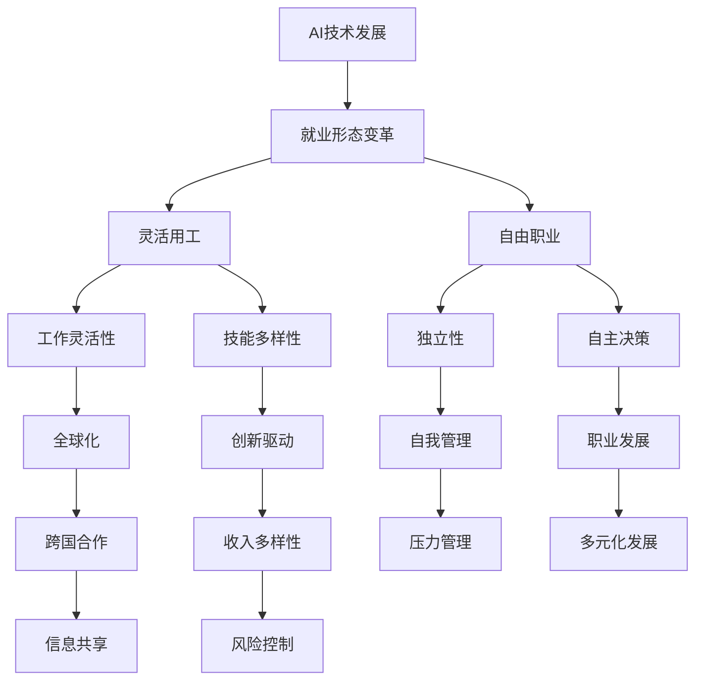

                 

# AI时代的就业形态变革：灵活用工和自由职业

## 关键词
- AI时代
- 就业形态变革
- 灵活用工
- 自由职业
- 职业发展
- 劳动力市场

## 摘要
本文将探讨AI时代下就业形态的深刻变革，特别是灵活用工和自由职业的发展趋势。我们将首先概述AI对就业市场的影响，随后详细分析灵活用工和自由职业的特征、优势与挑战，并提供职业规划与适应策略。此外，文章还将探讨法律与政策对AI时代就业的影响，通过案例分析与实践指导，帮助读者理解并适应这一新趋势。

## 引言
在人工智能（AI）飞速发展的今天，全球劳动力市场正经历前所未有的变革。AI技术的应用不仅改变了传统的工作内容和流程，也催生了全新的就业模式，如灵活用工和自由职业。这些新模式不仅为劳动者提供了更多选择，也对企业的人力资源管理提出了新的挑战。本文旨在深入探讨AI时代就业形态的变革，分析灵活用工和自由职业的发展趋势，为读者提供实用的职业规划建议。

### AI技术的发展历程

人工智能的概念最早可以追溯到20世纪50年代。从最初的符号逻辑和规则推理，到后来的神经网络和深度学习，AI技术经历了数次重要的技术飞跃。特别是近年来，随着计算能力的提升、大数据技术的发展以及算法的优化，AI已经从理论研究走向实际应用，成为推动社会进步的重要力量。

在商业领域，AI技术已经被广泛应用于客户服务、风险管理、供应链优化等多个方面。例如，基于AI的客户服务机器人可以24/7不间断地与客户进行交互，提高服务效率；AI算法可以分析海量的金融数据，帮助金融机构进行风险管理；AI技术在供应链优化中的应用，可以实现实时监控和调整，提高物流效率。

在医疗领域，AI技术的应用也越来越广泛。从辅助诊断、疾病预测到个性化治疗，AI正在改变传统医疗模式。例如，AI可以分析大量的医学影像数据，提高疾病诊断的准确率；基于AI的药物研发平台，可以加速新药的发现和开发。

此外，AI技术还在教育、农业、制造等多个领域展现了巨大的潜力。例如，AI驱动的教育平台可以根据学生的学习情况和兴趣，提供个性化的学习资源；AI技术在农业中的应用，可以实现精准种植、智能灌溉，提高农业产量。

### 就业形态变革的概念解读

随着AI技术的不断进步，就业形态也在发生深刻变革。传统的就业模式逐渐向灵活用工和自由职业转变。灵活用工和自由职业分别代表了两种不同的就业模式，它们各有特点，但都在应对AI时代的变化中发挥着重要作用。

灵活用工是指一种非永久性的工作关系，劳动者可以在多个不同的雇主之间自由切换，从事各种短期或临时性的工作。这种模式通常通过在线平台进行匹配，例如众包平台、临时工平台等。灵活用工模式的特点包括灵活性高、工作自由、能够快速适应市场需求等。

自由职业则是指独立从事某种职业，不依赖于某个特定雇主。自由职业者通常是自我雇佣的，他们可以通过线上或线下的方式为客户提供服务。自由职业的特点包括独立性、自主决策、能够根据自己的时间和兴趣安排工作等。

### 灵活用工与自由职业的特征

灵活用工和自由职业在AI时代具有以下主要特征：

1. **工作灵活性**：灵活用工和自由职业都提供了更高的工作灵活性，劳动者可以根据自己的需求和工作情况进行选择，这在AI时代尤为重要。

2. **技能多样性**：AI技术的发展使得工作技能要求越来越高，灵活用工和自由职业模式要求劳动者具备多样化的技能，以适应不同的工作需求。

3. **全球化**：互联网的普及使得灵活用工和自由职业不再受地域限制，劳动者和雇主可以在全球范围内进行合作，拓展职业发展空间。

4. **自我管理**：灵活用工和自由职业模式要求劳动者具备良好的自我管理能力，包括时间管理、任务分配和项目跟踪等。

5. **创新驱动**：灵活用工和自由职业模式鼓励创新，劳动者可以根据市场需求和个人兴趣开发新的服务或产品。

### 灵活用工模式的定义与类型

灵活用工模式是指劳动者与雇主之间建立的一种非永久性的工作关系，劳动者可以在多个不同的雇主之间灵活切换，从事各种短期或临时性的工作。这种模式通常通过在线平台进行匹配，例如众包平台、临时工平台等。

根据灵活用工的特点，可以将灵活用工模式分为以下几类：

1. **临时工**：临时工是一种短期的工作模式，通常是为了应对特定的工作需求，如季节性高峰、项目需求等。

2. **兼职**：兼职是一种非全职的工作模式，劳动者可以同时为多个雇主工作，适合需要平衡家庭和工作时间的人。

3. **远程工作**：远程工作是一种无需到工作地点工作的模式，劳动者可以在任何地方通过互联网进行工作，适合需要灵活安排工作时间和地点的人。

4. **众包**：众包是一种通过互联网平台将工作分配给大量自由职业者的模式，适合需要处理大量重复性任务的企业。

### 灵活用工的优势与挑战

灵活用工模式具有以下优势：

1. **提高工作效率**：灵活用工模式可以快速响应市场需求，提高工作效率。
2. **降低成本**：企业可以通过灵活用工模式减少固定成本，如工资、福利等。
3. **提升员工满意度**：灵活用工模式提供更多工作选择，提高员工满意度。

然而，灵活用工模式也面临一些挑战：

1. **稳定性问题**：灵活用工模式可能导致劳动者的工作稳定性降低。
2. **福利保障**：灵活用工模式下，劳动者的福利保障可能不如全职员工。
3. **沟通协作**：远程工作和众包模式可能增加沟通和协作的难度。

### 灵活用工模式的全球趋势

灵活用工模式在全球范围内正呈上升趋势。以下是一些主要趋势：

1. **技术推动**：随着互联网和移动设备的普及，灵活用工模式得以快速发展。
2. **企业需求**：企业为了提高效率和降低成本，越来越多地采用灵活用工模式。
3. **政策支持**：许多国家政府正在出台相关政策，鼓励灵活用工模式的发展。

### 自由职业的定义与特征

自由职业是指独立从事某种职业，不依赖于某个特定雇主。自由职业者通常是自我雇佣的，他们可以通过线上或线下的方式为客户提供服务。自由职业的特点包括独立性、自主决策、能够根据自己的时间和兴趣安排工作等。

自由职业者可能从事以下职业：

1. **自由撰稿人**：为多个媒体或个人提供写作服务。
2. **自由设计师**：为企业或个人提供设计服务。
3. **自由咨询师**：为企业或个人提供专业咨询服务。
4. **自由开发者**：为企业或个人提供软件开发服务。

### 自由职业的优势与劣势

自由职业具有以下优势：

1. **工作灵活性**：自由职业者可以根据自己的时间和兴趣安排工作，享受更高的工作自由度。
2. **收入多样性**：自由职业者可以通过多种渠道获取收入，提高收入稳定性。
3. **职业发展**：自由职业者可以根据市场需求和个人兴趣，灵活调整职业方向。

然而，自由职业也面临一些劣势：

1. **收入不稳定**：自由职业者的收入可能受到市场需求和个人能力的波动。
2. **缺乏福利保障**：自由职业者通常需要自行承担医疗保险、养老保险等福利保障。
3. **压力较大**：自由职业者需要自我管理，可能会面临工作压力和孤独感。

### 自由职业者的职业发展路径

自由职业者的职业发展路径通常包括以下几个阶段：

1. **初级阶段**：自由职业者通常在某个领域有一定的专业知识和技能，开始接受一些简单的项目。
2. **发展阶段**：随着经验和声誉的积累，自由职业者可以接受更复杂和有挑战性的项目，收入水平也会逐渐提高。
3. **成熟阶段**：成熟阶段的自由职业者通常已经建立了稳定的客户群体，可以在多个领域提供专业服务。
4. **拓展阶段**：自由职业者可以考虑创办自己的公司，提供更全面的服务，或者通过培训和指导帮助其他自由职业者成长。

### 职业教育与培训的变革

在AI时代，职业教育与培训正在经历深刻的变革。传统职业教育注重知识和技能的传授，而现代职业教育更加注重技能的实用性和针对性。以下是一些职业教育与培训的变革趋势：

1. **技能导向**：现代职业教育更加注重培养实际操作能力，通过案例分析、项目实践等方式提高学生的技能水平。
2. **定制化培训**：针对不同职业需求，提供定制化的培训课程，以满足企业和个人的多样化需求。
3. **线上线下融合**：线上线下教育相结合，提供灵活的学习方式，满足不同学习者的需求。
4. **跨学科培训**：跨学科培训可以帮助学生掌握多种技能，提高其适应不同工作岗位的能力。
5. **终身学习**：鼓励终身学习，提供持续的职业发展和技能提升机会。

### 职业规划与个人发展

在AI时代，职业规划与个人发展变得尤为重要。以下是一些建议：

1. **明确职业目标**：明确自己的职业目标和兴趣，制定具体的职业规划。
2. **持续学习**：保持持续学习的态度，跟上行业发展的步伐，不断提升自己的技能水平。
3. **多元化发展**：尝试掌握多种技能，提高自己的适应能力和竞争力。
4. **建立人脉**：积极参与行业活动，建立广泛的人脉，为职业发展创造更多机会。
5. **灵活调整**：在职业发展过程中，根据市场需求和个人兴趣，灵活调整职业方向。

### 跨界合作与多元发展

在AI时代，跨界合作与多元发展成为职业发展的新趋势。以下是一些建议：

1. **跨行业合作**：积极寻找跨行业的合作机会，通过跨行业的资源整合，实现互利共赢。
2. **多元化技能**：掌握多种技能，提高自己的多元化发展能力，成为行业的复合型人才。
3. **创新思维**：培养创新思维，不断探索新的商业模式和解决方案，推动职业发展。
4. **跨领域学习**：参加跨领域的培训和学习，拓宽视野，提高跨领域的协作能力。

### 法律与政策对AI时代就业的影响

在AI时代，法律与政策对就业的影响日益重要。以下是一些关键方面：

1. **劳动法规**：政府应完善劳动法规，保护劳动者的合法权益，确保灵活用工和自由职业模式下的劳动者得到公平待遇。
2. **社会保障**：政府应建立健全的社会保障体系，为灵活用工和自由职业者提供必要的医疗保险、养老保险等保障。
3. **税收政策**：政府应制定合理的税收政策，鼓励企业和个人参与灵活用工和自由职业模式，降低其税收负担。
4. **人才引进**：政府应制定人才引进政策，吸引全球优秀人才，为AI时代的就业市场注入新的活力。
5. **职业培训**：政府应加大对职业培训的投入，提高劳动者的技能水平，适应AI时代的发展需求。

### 国际合作与AI时代就业政策

在国际合作方面，各国政府应加强合作，共同应对AI时代带来的就业挑战。以下是一些建议：

1. **信息共享**：建立国际信息共享平台，及时分享AI技术的发展动态和就业政策，为各国政府和企业提供决策支持。
2. **政策协调**：加强政策协调，确保各国就业政策的一致性和协同性，减少跨国就业障碍。
3. **人才交流**：促进人才跨国流动，鼓励优秀人才在全球范围内进行交流和合作，提高全球就业市场的竞争力。
4. **技能培训**：开展跨国技能培训项目，提高全球劳动者的技能水平，适应AI时代的发展需求。

### 案例分析：成功转型案例

以下是一个成功从传统就业模式转型到灵活用工和自由职业的案例：

李先生是一名有着多年工作经验的软件工程师。在AI时代，他发现传统的工作模式越来越难以满足他的职业发展和生活需求。于是，他决定转型到灵活用工和自由职业模式。

首先，李先生通过一个知名的众包平台，找到了一些短期项目，积累了丰富的实践经验。接着，他开始为客户提供定制化的软件开发服务，通过线上渠道拓展客户群体。此外，他还积极参与行业活动，提升自己的知名度和技能水平。

在短短几年内，李先生成功实现了从传统就业模式到灵活用工和自由职业模式的转型，不仅实现了更高的收入，还获得了更多的职业满足感。

### 实践指导：灵活用工与自由职业实践

以下是一些具体的实践指导，帮助读者成功转型到灵活用工和自由职业模式：

1. **建立个人品牌**：通过社交媒体、个人网站等渠道，展示自己的专业能力和成果，建立个人品牌。
2. **寻找合适平台**：选择适合自己的在线平台，如众包平台、自由职业者社区等，寻找合适的项目和客户。
3. **持续学习**：保持持续学习的态度，跟上行业发展的步伐，不断提升自己的技能水平。
4. **时间管理**：制定合理的时间管理计划，确保工作和生活的平衡。
5. **风险控制**：制定风险管理计划，应对可能出现的收入波动和风险。

### 未来就业趋势预测与建议

在未来，AI技术将继续推动就业形态的变革。以下是对未来就业趋势的预测和建议：

1. **灵活用工将进一步普及**：随着AI技术的发展，灵活用工模式将更加普及，成为就业市场的重要形式。
2. **自由职业将成为主流**：自由职业者将在未来的就业市场中占据重要地位，成为推动经济增长的重要力量。
3. **技能需求多样化**：AI技术将推动技能需求多样化，劳动者需要具备跨领域的技能，以适应不断变化的就业市场。
4. **终身学习成为必备**：在AI时代，终身学习将成为劳动者必备的能力，只有不断学习和更新知识，才能在竞争中脱颖而出。
5. **政府支持至关重要**：政府应加大对灵活用工和自由职业的支持，提供政策支持和保障，促进就业形态的健康发展。

### AI与就业形态变革的Mermaid流程图

以下是一个简单的Mermaid流程图，展示了AI与就业形态变革的关系：



### 监督学习算法

监督学习是机器学习中的一种常见算法，其基本思想是通过已知的输入和输出数据，训练出一个模型，使其能够预测新的输入数据的输出。以下是监督学习算法的伪代码：

```plaintext
输入：训练数据集D，模型参数θ
输出：训练好的模型θ*

初始化模型参数θ
for i = 1 to num_iterations do
    for each训练样本(x, y) in D do
        计算模型预测值ŷ = f(x; θ)
        计算损失函数L(ŷ, y)
        更新模型参数θ = θ - α * ∇L(ŷ, y)
    end for
end for
```

### 无监督学习算法

无监督学习是机器学习中的另一种算法，其基本思想是从未标记的数据中学习特征和模式。以下是K均值聚类算法的伪代码：

```plaintext
输入：数据集D，聚类个数k
输出：聚类中心μ*

初始化k个聚类中心μ*
for i = 1 to num_iterations do
    计算每个数据点x∈D与聚类中心μ*的相似度
    根据相似度将数据点分配到不同的聚类中
    重新计算每个聚类的中心μ*
end for
```

### 强化学习算法

强化学习是机器学习中的另一种算法，其基本思想是通过与环境的交互，学习最优策略。以下是Q学习算法的伪代码：

```plaintext
输入：环境S，动作集A，奖励函数R，学习率α，折扣因子γ
输出：策略π*

初始化Q(s, a)为随机值
for each episode do
    初始化状态s
    while s ≠ 终止状态 do
        选择动作a = ε-贪心策略(s, Q)
        执行动作a，观察新状态s'和奖励r
        更新Q(s, a) = Q(s, a) + α * (r + γ * max(Q(s', a')) - Q(s, a))
        更新状态s = s'
    end while
end for
```

### 数据预处理方法

在数据挖掘和机器学习项目中，数据预处理是一个关键步骤。以下是一些常见的数据预处理方法：

1. **数据清洗**：处理缺失值、异常值和重复值，确保数据质量。
2. **数据转换**：将数据转换为适合模型训练的格式，如归一化、标准化和离散化。
3. **特征选择**：从大量特征中筛选出有用的特征，减少数据维度。
4. **特征工程**：通过创建新的特征或变换现有特征，提高模型性能。

### 常见预测模型介绍

在数据挖掘和机器学习中，常见的预测模型包括：

1. **线性回归模型**：用于预测连续值。
2. **逻辑回归模型**：用于预测二分类问题。
3. **决策树模型**：通过树形结构对数据分类或回归。
4. **随机森林模型**：通过集成多个决策树来提高预测性能。
5. **支持向量机模型**：用于分类和回归问题。

### 预测模型的评估与优化

评估预测模型性能的常用指标包括：

1. **准确率**：预测正确的样本数占总样本数的比例。
2. **召回率**：预测正确的正样本数占所有正样本数的比例。
3. **F1分数**：综合考虑准确率和召回率，平衡二者的性能。

优化预测模型的方法包括：

1. **交叉验证**：通过将数据集划分为多个子集，评估模型性能。
2. **超参数调优**：通过调整模型参数，提高模型性能。
3. **集成学习**：结合多个模型来提高预测性能。

### 劳动力供给与需求模型

劳动力供给与需求模型是经济学中用于分析劳动力市场的重要工具。以下是一个简化的劳动力供给与需求模型的数学模型：

1. **劳动力供给模型**：
   - 劳动力供给函数：`L_s(w) = L_0 + β * w`
     - `L_s`：劳动力供给
     - `L_0`：基准劳动力供给
     - `β`：工资弹性
     - `w`：工资水平

2. **劳动力需求模型**：
   - 劳动力需求函数：`L_d(p, z) = L_0 - α * p + ζ * z`
     - `L_d`：劳动力需求
     - `L_0`：基准劳动力需求
     - `α`：价格弹性
     - `p`：产品价格
     - `ζ`：技术进步或劳动力生产率

3. **劳动力市场动态模型**：
   - 劳动力平衡方程：`L_s(w) = L_d(p, z)`
     - 通过求解上述方程，可以得到均衡工资水平`w*`和均衡劳动力需求`L_d*(w*)`。

### 职业匹配模型

职业匹配模型是用于分析劳动力市场中劳动者与工作岗位之间匹配效率的模型。以下是一个简化的职业匹配模型：

1. **劳动者偏好模型**：
   - 劳动者价值函数：`V(L, J) = U(L) + β * J`
     - `V`：劳动者对职业的总体价值
     - `U`：劳动者的内在价值
     - `J`：工作岗位的质量

2. **工作岗位供给模型**：
   - 工作岗位价值函数：`V(J, L) = W + γ * L`
     - `V`：雇主对工作岗位的总体价值
     - `W`：工作岗位的工资水平
     - `γ`：劳动者的技能水平

3. **职业匹配效率**：
   - 匹配效率：`Efficiency = ∑(V(L, J) * P(L, J))`
     - `P`：劳动者与工作岗位的匹配概率
     - 通过最大化匹配效率，可以找到最优的职业匹配方案。

### 预测模型的评估与优化

预测模型的评估与优化是提高模型性能的关键步骤。以下是一些常用的评估指标和方法：

1. **评估指标**：
   - 准确率：预测正确的样本数占总样本数的比例。
   - 召回率：预测正确的正样本数占所有正样本数的比例。
   - F1分数：综合考虑准确率和召回率的指标。
   - ROC曲线和AUC值：评估分类模型的性能。

2. **优化方法**：
   - 交叉验证：通过将数据集划分为多个子集，评估模型在不同子集中的性能，选择最优模型。
   - 超参数调优：通过调整模型参数，提高模型性能。
   - 集成学习：结合多个模型来提高预测性能。

### 数据采集与预处理

在AI时代，数据采集与预处理是构建高质量预测模型的关键步骤。以下是一个典型的数据采集与预处理流程：

1. **数据采集**：
   - 收集原始数据，如通过API、爬虫或数据库查询。
   - 确保数据来源的多样性和准确性。

2. **数据清洗**：
   - 填补缺失值：使用统计方法或基于规则的方法填补缺失值。
   - 处理异常值：识别并处理异常值，如删除或使用统计方法修正。
   - 删除重复值：确保数据集的一致性和准确性。

3. **数据转换**：
   - 特征工程：创建新的特征或变换现有特征，提高模型性能。
   - 数据归一化或标准化：将数据转换为适合模型训练的格式。

4. **数据集划分**：
   - 将数据集划分为训练集、验证集和测试集，用于模型训练、验证和测试。

### 数据分析工具与环境搭建

在AI时代，数据分析工具与环境搭建是进行有效数据分析的关键步骤。以下是一个典型的数据分析工具与环境搭建流程：

1. **工具选择**：
   - 选择合适的数据分析工具，如Python、R、Spark等。
   - 确保工具具备数据处理、分析和可视化的能力。

2. **环境搭建**：
   - 安装Python和必要的库，如Pandas、NumPy、Matplotlib等。
   - 配置Jupyter Notebook或RStudio，提供交互式数据分析环境。

3. **数据处理**：
   - 使用Pandas库进行数据清洗、转换和预处理。
   - 使用NumPy库进行高效的数值计算。

4. **数据分析**：
   - 使用Matplotlib或Seaborn库进行数据可视化。
   - 使用统计方法进行数据分析和预测。

5. **模型训练与评估**：
   - 使用Scikit-learn库进行机器学习模型的训练与评估。

### 数据分析案例解析

以下是一个数据分析案例，用于预测某公司员工的离职率。通过这个案例，我们将展示如何进行数据采集、预处理、分析和模型训练。

1. **数据采集**：
   - 从公司数据库中收集员工数据，包括性别、年龄、职位、工作年限、部门、绩效评估等。

2. **数据预处理**：
   - 填补缺失值：使用均值、中位数或前向填充方法填补缺失值。
   - 处理异常值：删除明显偏离正常范围的异常值。
   - 删除重复值：确保数据集的一致性和准确性。
   - 特征工程：创建新的特征，如工作压力指数、工作满意度等。

3. **数据分析**：
   - 使用Pandas库进行数据探索性分析，了解数据的基本统计信息。
   - 使用Matplotlib或Seaborn库进行数据可视化，分析不同特征与离职率的关系。

4. **模型训练与评估**：
   - 选择适合的机器学习模型，如逻辑回归、决策树或随机森林。
   - 使用Scikit-learn库进行模型训练和评估，计算准确率、召回率和F1分数等指标。

5. **模型优化**：
   - 使用交叉验证方法进行模型调优，提高预测性能。
   - 调整模型参数，如正则化参数、树深度等。

6. **结果分析**：
   - 分析模型预测结果，了解哪些特征对离职率有显著影响。
   - 根据分析结果，提出改进措施，降低员工离职率。

### 系统需求分析

在开发灵活用工系统时，系统需求分析是关键的第一步。以下是系统需求分析的详细步骤和内容：

1. **需求收集**：
   - 与系统的主要用户（如雇主、自由职业者、项目管理员等）进行访谈，了解他们的需求和使用场景。
   - 分析现有市场中的竞品系统，了解其优点和不足。

2. **功能需求**：
   - 用户注册与登录：支持雇主和自由职业者的注册、登录和账户管理。
   - 项目发布与管理：雇主可以发布项目需求，自由职业者可以浏览和投标项目。
   - 消息通知：系统应能够发送消息通知，提醒用户项目进展、投标结果等。
   - 评价与反馈：用户可以对项目完成情况进行评价和反馈，提高服务质量。
   - 数据分析：系统应具备数据分析功能，帮助雇主和自由职业者了解市场趋势和用户行为。

3. **非功能需求**：
   - 性能要求：系统应能快速响应用户请求，支持大规模用户并发访问。
   - 可靠性要求：系统应具备高可靠性，确保数据安全和业务连续性。
   - 可扩展性要求：系统应具备良好的可扩展性，支持未来功能的增加和系统升级。
   - 安全性要求：系统应具备严格的用户身份验证和数据加密机制，确保用户隐私和数据安全。

4. **用户角色与权限**：
   - 雇主：可以发布项目、管理项目、查看项目报告、评价自由职业者。
   - 自由职业者：可以查看项目、投标项目、管理个人账户、查看项目评价。
   - 项目管理员：负责系统维护、数据分析、用户支持等。

### 系统设计

在系统设计阶段，我们需要明确系统的整体架构、模块划分、接口设计等关键内容。以下是灵活用工系统设计的详细步骤：

1. **整体架构设计**：
   - 采用微服务架构，将系统划分为多个独立的服务模块，提高系统的可维护性和可扩展性。
   - 服务模块包括用户管理、项目管理、消息通知、数据分析和权限管理。

2. **模块划分**：
   - 用户管理模块：负责用户的注册、登录、账户管理和权限控制。
   - 项目管理模块：负责项目的发布、投标、评价和管理。
   - 消息通知模块：负责消息的发送、接收和通知提醒。
   - 数据分析模块：负责数据的采集、存储和分析，为系统提供决策支持。
   - 权限管理模块：负责用户角色的权限分配和权限控制。

3. **接口设计**：
   - 用户管理接口：提供用户注册、登录、个人信息管理等接口。
   - 项目管理接口：提供项目发布、投标、评价等接口。
   - 消息通知接口：提供消息发送、接收和通知提醒接口。
   - 数据分析接口：提供数据采集、存储和分析接口。
   - 权限管理接口：提供角色权限分配和权限控制接口。

4. **技术选型**：
   - 后端技术：采用Spring Boot框架，支持快速开发和部署。
   - 数据库：使用MySQL数据库，确保数据存储的可靠性和性能。
   - 前端技术：采用Vue.js框架，实现用户友好的界面和交互体验。

### 系统实现与部署

在系统实现和部署阶段，我们需要根据系统设计文档，逐步实现各个模块，并进行集成测试和部署。以下是系统实现与部署的详细步骤：

1. **实现各个模块**：
   - 用户管理模块：实现用户注册、登录、个人信息管理等功能。
   - 项目管理模块：实现项目发布、投标、评价和管理等功能。
   - 消息通知模块：实现消息发送、接收和通知提醒等功能。
   - 数据分析模块：实现数据采集、存储和分析等功能。
   - 权限管理模块：实现角色权限分配和权限控制等功能。

2. **集成测试**：
   - 对各个模块进行单元测试，确保每个模块的功能正确。
   - 对整个系统进行集成测试，确保各个模块之间的接口正确无误。

3. **部署**：
   - 部署后端服务，包括Spring Boot应用和MySQL数据库。
   - 部署前端应用，包括Vue.js框架和前端界面。
   - 配置负载均衡和缓存，提高系统的性能和稳定性。

4. **监控与维护**：
   - 监控系统的运行状态，包括服务器负载、数据库性能等。
   - 定期进行系统维护和升级，确保系统的稳定性和安全性。

### 平台功能规划

在搭建自由职业平台时，功能规划是至关重要的。以下是一个典型的自由职业平台功能规划的详细步骤：

1. **用户注册与登录**：
   - 支持用户通过手机号、邮箱等多种方式注册和登录。
   - 实现用户身份验证，确保用户信息的真实性。

2. **个人资料管理**：
   - 用户可以编辑和更新个人资料，包括姓名、头像、联系方式等。
   - 显示用户的认证状态，如实名认证、资质认证等。

3. **技能标签与分类**：
   - 允许用户添加和管理个人技能标签，便于雇主快速找到合适的自由职业者。
   - 对技能标签进行分类管理，提高平台的可搜索性。

4. **项目发布与管理**：
   - 雇主可以发布项目需求，包括项目名称、描述、预算、截止日期等。
   - 显示项目状态，如招标中、进行中、已完成等。

5. **投标与管理**：
   - 自由职业者可以查看并投标感兴趣的项目。
   - 支持查看项目详情、竞标历史和雇主评价。

6. **消息通知**：
   - 系统自动发送消息通知，提醒用户项目进展、投标结果等。
   - 支持消息推送和邮件通知。

7. **评价与反馈**：
   - 用户可以对完成的项目进行评价和反馈，提高服务质量。
   - 显示用户的评价历史和信用评分。

8. **数据分析**：
   - 提供数据分析功能，帮助用户了解市场趋势和用户行为。
   - 支持数据导出和可视化。

### 技术选型与架构设计

在搭建自由职业平台时，技术选型和架构设计是关键环节。以下是一个典型的自由职业平台技术选型和架构设计的详细步骤：

1. **前端技术选型**：
   - 使用Vue.js框架，实现响应式和用户友好的界面。
   - 采用Element UI组件库，提高开发效率和界面美观度。

2. **后端技术选型**：
   - 使用Spring Boot框架，实现后端服务的快速开发和部署。
   - 采用RESTful API设计，提供前后端的数据接口。

3. **数据库选型**：
   - 使用MySQL数据库，确保数据存储的可靠性和性能。
   - 使用Redis缓存，提高系统的响应速度。

4. **架构设计**：
   - 采用微服务架构，将系统划分为多个独立的服务模块，提高系统的可维护性和可扩展性。
   - 服务模块包括用户管理、项目管理、消息通知、数据分析和权限管理。

5. **缓存与负载均衡**：
   - 使用Redis缓存，提高系统的响应速度和性能。
   - 使用Nginx负载均衡，确保系统的稳定性和高可用性。

### 平台开发与运营策略

在自由职业平台的开发与运营过程中，制定合理的开发计划和运营策略至关重要。以下是一个典型的平台开发与运营策略的详细步骤：

1. **开发计划**：
   - 制定详细的项目开发计划，包括需求分析、设计、开发、测试和部署等阶段。
   - 按照敏捷开发方法，进行迭代开发和持续集成。

2. **功能迭代**：
   - 根据用户反馈和市场变化，不断优化和迭代平台功能。
   - 实施A/B测试，验证新功能的可行性和用户满意度。

3. **用户增长**：
   - 通过线上广告、社交媒体推广、合作伙伴渠道等手段，扩大用户基础。
   - 提供优惠券、推荐奖励等激励机制，提高用户活跃度。

4. **内容运营**：
   - 发布高质量的内容，如行业资讯、成功案例等，提升平台权威性。
   - 建立活跃的用户社区，促进用户互动和口碑传播。

5. **数据监控**：
   - 建立完善的数据监控系统，实时监控平台性能和用户行为。
   - 根据数据反馈，进行运营策略调整和优化。

6. **风险管理**：
   - 制定风险管理策略，防范潜在的法律风险、网络安全风险等。
   - 定期进行安全审计和漏洞修复，确保平台安全稳定运行。

### 附录A：常用AI开发工具与资源

以下是一些常用的AI开发工具和资源，供读者参考：

1. **编程语言**：
   - Python：Python是AI开发中常用的编程语言，具有丰富的库和框架。
   - R：R语言在统计学和数据科学领域有广泛应用，适合进行数据分析和建模。

2. **深度学习框架**：
   - TensorFlow：由Google开发，是当前最流行的深度学习框架之一。
   - PyTorch：由Facebook开发，具有灵活的动态计算图，适合研究和新模型开发。

3. **数据分析库**：
   - NumPy：提供高性能的数组操作和数学计算。
   - Pandas：提供数据清洗、转换和分析功能。
   - Matplotlib/Seaborn：提供数据可视化工具。

4. **机器学习库**：
   - Scikit-learn：提供丰富的机器学习算法和工具。
   - XGBoost：提供高效的梯度提升树算法。

5. **在线平台**：
   - Kaggle：提供大量的数据集和竞赛，适合学习和实践。
   - Coursera：提供各种AI和数据科学课程。

6. **书籍**：
   - 《深度学习》（Ian Goodfellow、Yoshua Bengio、Aaron Courville著）：深度学习的经典教材。
   - 《Python机器学习》（Sebastian Raschka著）：Python在机器学习领域的实战指南。

### 附录B：参考文献与进一步阅读材料

以下是一些参考文献和进一步阅读材料，供读者深入研究和了解AI时代的就业形态变革：

1. **学术论文**：
   - "The Age of AI: And Our Human Future" by Nick Bostrom
   - "AI Superpowers: China, Silicon Valley, and the New World Order" by Michael Research
   - "The Second Machine Age: Work, Progress, and Prosperity in a Time of Brilliant Technologies" by Erik Brynjolfsson and Andrew McAfee

2. **书籍**：
   - "AI: The New Intelligent Era" by Wei Liang
   - "AI and the Modern Organization: A Practical Guide to Implementing AI in the Workplace" by Tom Davenport
   - "The Future is Now: Artificial Intelligence in Business" by Mark McDonald

3. **网站与报告**：
   - World Economic Forum: https://www.weforum.org/
   - McKinsey & Company: https://www.mckinsey.com/
   - AI Policy Report by the European Commission: https://ec.europa.eu/

4. **在线课程与研讨会**：
   - Coursera: https://www.coursera.org/
   - edX: https://www.edx.org/
   - AI Workshop and Conferences: https://aiworkshop.com/

作者：AI天才研究院/AI Genius Institute & 禅与计算机程序设计艺术 /Zen And The Art of Computer Programming

