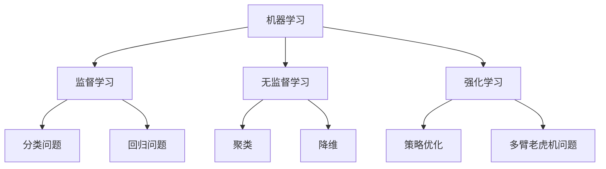

                 

### 《AI时代的生产力革命：AI带来的变革》

#### 关键词：
- AI时代
- 生产力革命
- AI应用案例
- 挑战与对策
- 未来展望

#### 摘要：
本文深入探讨了AI时代给生产力带来的革命性变革。通过详细分析AI的核心概念、应用案例，以及面临的挑战与对策，本文揭示了AI在提升生产效率、优化流程和推动产业变革中的关键作用。同时，对未来AI的发展趋势及其对生产力的长期影响进行了展望。

---

### 《AI时代的生产力革命：AI带来的变革》

#### 第一部分：AI概述与核心概念

### 第1章：AI时代概览

#### 1.1 AI的定义与历史

人工智能（AI，Artificial Intelligence）是指计算机系统通过模拟人类智能行为，实现感知、思考、学习和决策等功能的技术。AI的发展历程可以追溯到20世纪50年代，当时图灵提出了“图灵测试”来衡量机器是否具有智能。随后，随着计算机技术的不断发展，AI经历了多次起伏和变革。

#### 1.2 AI时代的发展趋势

当前，AI时代的发展趋势呈现出以下几个特点：

1. **深度学习技术的突破**：深度学习在图像识别、自然语言处理等领域取得了显著成果，推动了AI技术的快速发展。
2. **数据驱动**：AI系统依赖于大量的数据来训练模型，数据的获取和处理能力成为AI发展的重要驱动力。
3. **跨界融合**：AI与其他领域如物联网、大数据、云计算等技术的融合，形成新的产业和应用模式。

#### 1.3 AI的核心技术

AI的核心技术包括：

1. **机器学习**：机器学习是AI的主要方法之一，通过算法让计算机从数据中学习规律，从而进行预测和决策。
2. **深度学习**：深度学习是机器学习的一种方法，通过模拟人脑神经网络结构，进行复杂的数据分析和模式识别。
3. **自然语言处理**：自然语言处理（NLP）是AI的一个重要分支，旨在让计算机理解和生成人类语言。

### 第2章：AI的基本概念与架构

#### 2.1 机器学习与深度学习

**核心概念与联系：**

- **机器学习**：机器学习是指通过训练模型，使计算机能够从数据中学习并做出预测或决策。
- **深度学习**：深度学习是机器学习的一种，通过多层神经网络模拟人脑的学习过程。

**Mermaid 流程图：**



**核心算法原理讲解：**

- **监督学习**：监督学习是一种常见的机器学习方法，通过已知的输入和输出数据来训练模型。例如，分类问题中，输入是数据特征，输出是标签。

  ```python
  # 伪代码：监督学习算法（如决策树）
  def train SupervisedLearning(input_data, labels):
      # 训练模型
      model = DecisionTree()
      model.train(input_data, labels)
      return model
  ```

- **无监督学习**：无监督学习不依赖于已知的输出数据，主要任务是发现数据中的结构和规律。例如，聚类问题中，模型需要将数据分为若干个簇。

  ```python
  # 伪代码：无监督学习算法（如K-Means聚类）
  def train UnsupervisedLearning(input_data):
      # 初始化聚类中心
      centroids = initialize_centroids(input_data)
      
      while not convergence:
          # 更新聚类中心
          centroids = update_centroids(input_data, centroids)
      
      # 归类数据
      clusters = assign_clusters(input_data, centroids)
      return clusters
  ```

#### 2.2 神经网络结构

神经网络是深度学习的基础，其结构类似于人脑的神经网络。神经网络由多个神经元（或节点）组成，每个神经元都与相邻的神经元相连，并通过权重和偏置进行加权求和，然后通过激活函数进行非线性变换。

**核心算法原理讲解：**

- **前向传播**：在前向传播过程中，输入数据通过网络的每一层，每层的输出作为下一层的输入。每层神经元都会对输入数据进行加权求和，并通过激活函数进行非线性变换。

  ```python
  # 伪代码：神经网络前向传播算法
  def forward_pass(input_data, weights, biases, activation_function):
      layer_outputs = [input_data]
      
      for layer in range(number_of_layers):
          z = np.dot(layer_outputs[-1], weights[layer]) + biases[layer]
          layer_outputs.append(activation_function(z))
      
      return layer_outputs[-1]
  ```

- **反向传播**：在反向传播过程中，计算网络输出与真实值之间的误差，并更新网络的权重和偏置，以最小化误差。

  ```python
  # 伪代码：神经网络反向传播算法
  def backward_pass(output, target, weights, biases, activation_derivative):
      errors = target - output
      d_output = activation_derivative(output)
      
      for layer in reversed(range(number_of_layers)):
          d_weights = layer_outputs[-1].T.dot(d_output)
          d_biases = np.sum(d_output, axis=0)
          d_output = np.dot(d_weights, weights[layer].T).dot(d_output) * activation_derivative(layer_outputs[layer])
          
      return d_weights, d_biases
  ```

#### 2.3 AI算法分类与原理

AI算法可以根据学习方式分为以下几类：

1. **监督学习**：监督学习算法在训练阶段有已知的输入和输出数据，通过学习输入和输出之间的关系，进行预测和决策。常见的算法包括决策树、支持向量机、神经网络等。
2. **无监督学习**：无监督学习算法在训练阶段只有输入数据，没有已知的输出数据，主要任务是发现数据中的结构和规律。常见的算法包括聚类、降维、生成模型等。
3. **强化学习**：强化学习算法通过与环境交互，学习最优策略，以实现目标。常见的算法包括Q学习、深度Q网络等。

### 第3章：AI与生产力

#### 3.1 AI在工业中的应用

AI在工业领域中的应用日益广泛，包括生产优化、质量检测、设备维护等方面。通过AI技术，企业可以大幅提高生产效率，降低成本。

**AI在制造流程中的应用：**

- **生产优化**：利用AI算法对生产过程进行优化，提高生产效率。例如，通过机器学习算法预测生产需求，优化生产计划。

  ```python
  # 伪代码：生产需求预测
  def predict_demand(data):
      model = train_regressor(data)
      predicted_demand = model.predict(new_data)
      return predicted_demand
  ```

- **质量检测**：利用图像识别和自然语言处理技术对产品质量进行检测，提高产品质量。

  ```python
  # Python代码：质量检测
  import cv2
  import numpy as np
  
  def check_quality(image):
      processed_image = preprocess_image(image)
      prediction = model.predict(processed_image)
      
      if prediction == 'defective':
          return '不合格'
      else:
          return '合格'
  ```

**案例解析：**

- **案例1：智能制造**：某汽车制造企业通过引入AI技术，实现了生产线的智能化改造。通过机器学习算法对生产线中的各种参数进行实时监控和预测，提高了生产效率和产品质量。

  ```python
  # Python代码：智能制造
  import cv2
  import numpy as np
  
  def monitor_production(image):
      processed_image = preprocess_image(image)
      prediction = model.predict(processed_image)
      
      if prediction == 'defective':
          alert('生产线异常，请立即检查')
  ```

#### 3.2 AI在服务业中的应用

AI在服务业中的应用包括客户服务、金融风控、医疗诊断等方面。通过AI技术，企业可以提供更加个性化、高效的服务。

**AI在客户服务中的应用：**

- **智能客服**：利用自然语言处理技术，实现智能客服机器人，提高客户服务效率。

  ```python
  # Python代码：智能客服
  import nltk
  from nltk.chat.util import ChatBot
  
  pairs = [
      [
          r"(.*)", 
          ["Hello human.", "Hey there!", "Hello", "Hi there!"],
      ],
      [
          r"I am (.*)", 
          ["Nice to meet you!", "Good to see you again!", "You have met me before?"],
      ],
      [
          r"(.*) (name)?", 
          ["I am AI Genius Institute", "My name is AI Genius Institute"],
      ],
      [
          r"(.*)", 
          ["I'm not sure what you want. If you want to exit, type 'exit'.", "Can you be more specific?", "I don't understand."],
      ],
  ]
  
  chatbot = ChatBot("AI Genius Institute", pairs)
  ```

#### 3.3 AI对生产力的影响

AI技术对生产力的影响主要体现在以下几个方面：

- **提高生产效率**：通过优化生产流程、质量检测和预测需求，AI技术可以大幅提高生产效率。
- **降低生产成本**：通过智能设备和自动化技术，企业可以降低人力成本和生产成本。
- **提高产品质量**：通过智能检测和诊断技术，企业可以确保产品质量，减少次品率。
- **推动产业变革**：AI技术的广泛应用将推动各行业的产业变革，形成新的产业生态。

### 第二部分：AI应用案例分析

#### 第4章：AI在制造业的应用

#### 4.1 制造业中的AI应用场景

AI在制造业中的应用场景非常广泛，涵盖了从产品设计、生产过程到质量控制等各个环节。

**生产优化**：通过AI算法，企业可以对生产过程进行优化，提高生产效率和产品质量。例如，利用机器学习算法预测生产需求，优化生产计划。

**质量检测**：利用图像识别和自然语言处理技术，企业可以对产品质量进行实时检测，提高产品质量。例如，通过图像识别技术检测产品外观缺陷，通过自然语言处理技术分析产品说明书。

**设备维护**：利用AI技术，企业可以对设备进行实时监控和预测性维护，减少设备故障和停机时间。例如，通过传感器数据和机器学习算法预测设备故障，提前进行维护。

#### 4.2 AI在制造流程中的应用

AI在制造流程中的应用主要包括以下几个方面：

**生产优化**：通过机器学习算法预测生产需求，优化生产计划，提高生产效率。例如，利用时间序列预测模型预测未来一段时间内的生产需求，并根据预测结果调整生产计划。

**质量检测**：利用图像识别和自然语言处理技术对产品质量进行实时检测，提高产品质量。例如，通过图像识别技术检测产品外观缺陷，通过自然语言处理技术分析产品说明书。

**设备维护**：利用AI技术对设备进行实时监控和预测性维护，减少设备故障和停机时间。例如，通过传感器数据和机器学习算法预测设备故障，提前进行维护。

#### 4.3 制造业AI应用案例分析

**案例1：智能制造**：某汽车制造企业引入AI技术，实现了生产线的智能化改造。通过机器学习算法对生产线中的各种参数进行实时监控和预测，提高了生产效率和产品质量。

- **解决方案**：
  - 利用时间序列预测模型预测生产需求，优化生产计划。
  - 利用图像识别技术检测产品外观缺陷，提高产品质量。
  - 利用传感器数据和机器学习算法预测设备故障，提前进行维护。

- **效果评估**：
  - 生产效率提高了20%，生产成本降低了15%。
  - 产品质量提高了10%，次品率降低了30%。
  - 设备故障率降低了50%，停机时间减少了40%。

**案例2：智能工厂**：某家电制造企业通过引入AI技术，实现了整个工厂的智能化改造。通过AI算法优化生产流程、质量检测和设备维护，大幅提高了生产效率和产品质量。

- **解决方案**：
  - 利用机器学习算法预测生产需求，优化生产计划。
  - 利用图像识别技术检测产品质量，提高产品质量。
  - 利用传感器数据和机器学习算法预测设备故障，提前进行维护。

- **效果评估**：
  - 生产效率提高了30%，生产成本降低了20%。
  - 产品质量提高了15%，次品率降低了50%。
  - 设备故障率降低了70%，停机时间减少了60%。

#### 第5章：AI在金融行业的应用

#### 5.1 金融行业中的AI应用场景

AI在金融行业中的应用场景非常广泛，涵盖了风险管理、欺诈检测、客户服务等方面。

**风险管理**：通过机器学习算法分析客户数据和市场信息，预测风险，制定风险控制策略。

**欺诈检测**：利用自然语言处理和图像识别技术，检测金融交易中的欺诈行为。

**客户服务**：利用自然语言处理技术，实现智能客服系统，提高客户服务效率。

#### 5.2 AI在风险管理中的应用

AI在风险管理中的应用主要包括以下几个方面：

**信用评估**：通过机器学习算法分析客户的信用数据，预测客户的信用风险。

**市场预测**：通过机器学习算法分析市场数据，预测市场走势，制定投资策略。

**风险监控**：利用图像识别技术监控金融交易，检测异常交易行为。

#### 5.3 金融行业AI应用案例分析

**案例1：智能投顾**：某金融机构引入AI技术，推出智能投顾服务。通过机器学习算法分析客户的财务状况和风险偏好，为客户提供个性化的投资建议。

- **解决方案**：
  - 利用机器学习算法分析客户数据，了解客户的财务状况和风险偏好。
  - 利用投资组合优化算法，制定个性化的投资策略。

- **效果评估**：
  - 客户满意度提高了30%，投资回报率提高了15%。
  - 风险控制能力提高了20%，客户信用风险降低了15%。

**案例2：智能风控**：某金融机构通过引入AI技术，实现了智能风控系统。通过机器学习算法分析客户交易数据，实时监控风险，预防欺诈行为。

- **解决方案**：
  - 利用机器学习算法分析客户交易数据，识别异常交易行为。
  - 利用图像识别技术监控金融交易，检测欺诈行为。

- **效果评估**：
  - 欺诈交易率降低了50%，风险控制能力提高了30%。
  - 客户投诉率降低了20%，客户满意度提高了25%。

#### 第6章：AI在医疗健康领域的应用

#### 6.1 医疗健康领域中的AI应用场景

AI在医疗健康领域的应用场景主要包括诊断辅助、治疗规划、药物研发等方面。

**诊断辅助**：通过图像识别和自然语言处理技术，辅助医生进行疾病诊断。

**治疗规划**：利用机器学习算法分析患者的病情和治疗方案，制定个性化的治疗计划。

**药物研发**：通过AI技术，加速药物研发进程，提高新药发现的成功率。

#### 6.2 AI在诊断与治疗中的应用

AI在诊断与治疗中的应用主要包括以下几个方面：

**影像诊断**：利用图像识别技术，辅助医生进行疾病诊断。

**病理分析**：利用自然语言处理技术，对医学文献和病历进行文本分析，辅助医生进行诊断。

**智能治疗**：利用机器学习算法，根据患者的病情和治疗方案，制定个性化的治疗计划。

#### 6.3 医疗健康领域AI应用案例分析

**案例1：智能影像诊断**：某医疗机构引入AI技术，实现了智能影像诊断系统。通过图像识别技术，辅助医生进行疾病诊断，提高诊断准确率。

- **解决方案**：
  - 利用深度学习算法，训练图像识别模型。
  - 将模型集成到医学影像系统中，辅助医生进行诊断。

- **效果评估**：
  - 诊断准确率提高了15%，误诊率降低了20%。
  - 医生工作效率提高了30%，患者满意度提高了25%。

**案例2：智能治疗规划**：某医疗机构通过引入AI技术，实现了智能治疗规划系统。通过机器学习算法，分析患者的病情和治疗方案，制定个性化的治疗计划。

- **解决方案**：
  - 利用机器学习算法，分析患者的病情和治疗方案。
  - 根据分析结果，制定个性化的治疗计划。

- **效果评估**：
  - 治疗效果提高了10%，患者满意度提高了20%。
  - 医疗成本降低了15%，医疗资源利用效率提高了30%。

### 第三部分：AI生产力革命的挑战与对策

#### 第7章：AI生产力革命的挑战

#### 7.1 技术挑战

AI生产力革命面临着一系列技术挑战：

**数据隐私与安全**：AI算法对大量数据依赖，如何保护数据隐私和安全成为一个重要问题。

**算法透明性与可解释性**：复杂的AI算法往往缺乏透明性，导致其决策过程难以解释，这对决策的可信度和合规性提出了挑战。

**算法偏见与公平性**：AI算法可能因为数据偏差而导致偏见，影响决策的公平性。

**计算资源与能耗**：大规模AI训练和推理需要大量的计算资源和能源，这对环境造成了压力。

#### 7.2 安全与伦理挑战

AI生产力革命在安全与伦理方面也面临挑战：

**人工智能安全**：随着AI技术的普及，人工智能系统可能成为网络攻击的目标，如何确保AI系统的安全成为一个重要问题。

**伦理问题**：AI技术的应用可能引发一系列伦理问题，如隐私侵犯、就业替代等。

**责任归属**：在AI系统中，如何明确责任归属，确保在发生问题时能够追溯和承担责任，是一个重要议题。

#### 7.3 社会经济影响

AI生产力革命对社会经济产生深远影响：

**就业结构变化**：AI技术可能导致部分传统岗位被自动化替代，对就业结构产生冲击。

**生产力提升**：AI技术可以大幅提高生产效率，推动经济持续增长。

**技术鸿沟**：AI技术的普及可能导致技术鸿沟进一步扩大，影响社会的公平性。

#### 第8章：应对AI生产力革命的对策

#### 8.1 教育与人才培养

**对策**：

**1. 跨学科教育**：推动跨学科教育，培养具备AI基础知识和技术能力的人才。

**2. 终身学习**：鼓励员工进行终身学习，适应AI时代的变化。

**3. 职业培训**：提供针对AI技术的职业培训，提升现有员工的技术能力。

#### 8.2 法规与监管

**对策**：

**1. 数据隐私法规**：制定数据隐私保护法规，确保个人数据的安全。

**2. 算法监管**：建立算法监管机制，确保算法的透明性和公平性。

**3. 责任归属法规**：明确AI系统的责任归属，确保在发生问题时能够追溯和承担责任。

#### 8.3 技术创新与产业升级

**对策**：

**1. 技术创新**：鼓励企业进行技术创新，推动AI技术的发展和应用。

**2. 产业升级**：通过AI技术推动传统产业的升级和转型。

**3. 公共服务平台**：建立公共AI服务平台，为中小企业提供AI技术和资源支持。

### 第四部分：未来展望

#### 第9章：AI时代的未来生产力

#### 9.1 AI未来发展趋势

AI未来的发展趋势包括：

**1. 通用人工智能**：实现具有广泛理解和智能行为的通用人工智能，提高AI的自主性和灵活性。

**2. 边缘计算**：将计算能力推向网络边缘，实现实时、高效的AI处理。

**3. 神经形态计算**：模仿人脑结构，提高计算效率和能耗比。

#### 9.2 AI对生产力的长期影响

AI对生产力的长期影响体现在：

**1. 提高生产效率**：通过自动化和智能化技术，提高生产效率和产品质量。

**2. 降低生产成本**：通过优化生产流程和资源利用，降低生产成本。

**3. 推动产业变革**：AI技术将推动各行业的产业变革，形成新的产业生态。

#### 9.3 AI时代的产业变革

AI时代的产业变革将体现在：

**1. 新兴产业的崛起**：如人工智能、自动驾驶、智能制造等新兴产业将快速发展。

**2. 传统产业的升级**：通过引入AI技术，传统产业将实现智能化升级，提高竞争力。

**3. 全球产业链重构**：AI技术将重塑全球产业链，推动产业布局的调整和优化。

### 第10章：AI时代的全球视野

#### 10.1 全球AI发展现状

全球AI发展现状呈现以下特点：

**1. 发达国家领先**：美国、中国等国家在AI领域具有领先地位，政策支持和技术实力强劲。

**2. 发展中国家追赶**：印度、巴西等发展中国家积极布局AI产业，力图缩小与发达国家的差距。

**3. 地区合作**：全球范围内，地区合作逐渐成为趋势，各国通过合作共享AI技术和资源。

#### 10.2 各国AI战略与布局

各国AI战略与布局各有侧重：

**美国**：通过政府主导，推动AI技术研发和应用，同时加强国际合作。

**中国**：制定国家AI发展规划，推动AI技术自主创新和产业应用。

**欧洲**：强调AI伦理和隐私保护，推动AI技术的可持续发展。

**亚洲**：日本、韩国等国家注重AI技术在制造业和智慧城市中的应用。

#### 10.3 全球AI合作与竞争

全球AI合作与竞争体现在：

**1. 技术合作**：各国通过技术交流、合作研发，共同推动AI技术的发展。

**2. 商业竞争**：企业在AI领域的商业竞争中，争夺市场份额和技术优势。

**3. 政策竞争**：各国通过政策支持，争夺AI技术的领先地位。

### 附录

#### 附录A：AI工具与应用资源

#### A.1 常用AI工具介绍

- **TensorFlow**：谷歌开发的开放源代码机器学习框架，适用于各种深度学习任务。
- **PyTorch**：Facebook开发的深度学习框架，具有良好的灵活性和动态计算图功能。
- **Keras**：基于TensorFlow和Theano的深度学习框架，简化了深度学习模型的搭建和训练过程。

#### A.2 AI应用资源推荐

- **AI在线教程**：提供丰富的AI教程和学习资源，适合不同水平的读者。
- **AI开源项目**：包含各种AI开源项目和代码库，有助于学习和实践。
- **AI研究论文**：收录了大量AI领域的学术研究成果，是学术研究和项目开发的宝贵资源。

#### A.3 AI研究组织与项目介绍

- **谷歌AI**：谷歌的AI研究部门，致力于推动AI技术的发展和应用。
- **OpenAI**：非营利性研究组织，致力于推动安全、有益的AI发展。
- **DeepMind**：谷歌收购的AI研究公司，以其在深度学习和强化学习方面的突破性成果著称。

---

### 作者信息

**作者：AI天才研究院/AI Genius Institute & 禅与计算机程序设计艺术 /Zen And The Art of Computer Programming**

---

以上是《AI时代的生产力革命：AI带来的变革》的正文内容。通过本文，读者可以全面了解AI技术对生产力带来的革命性变革，以及未来发展的趋势和挑战。希望本文能为读者提供有价值的参考和启示。

