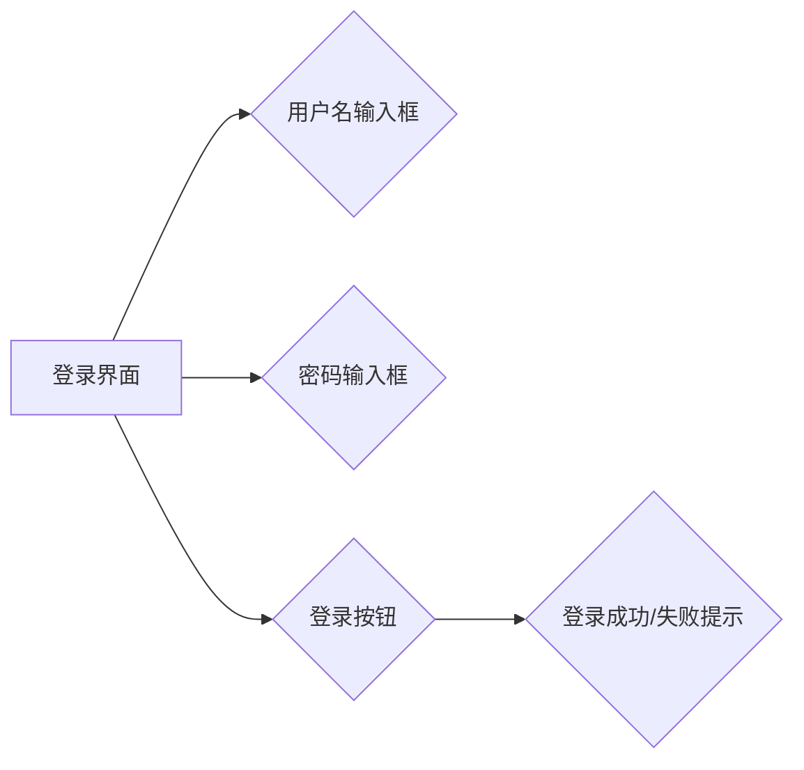
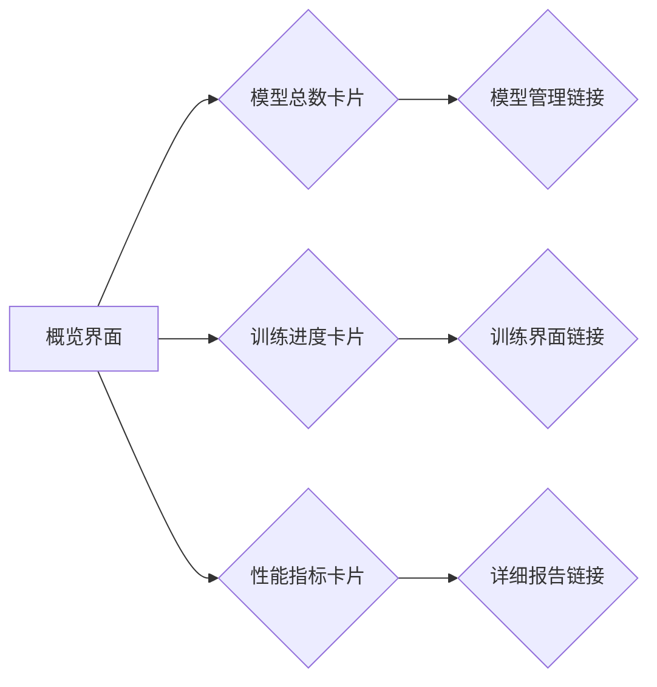
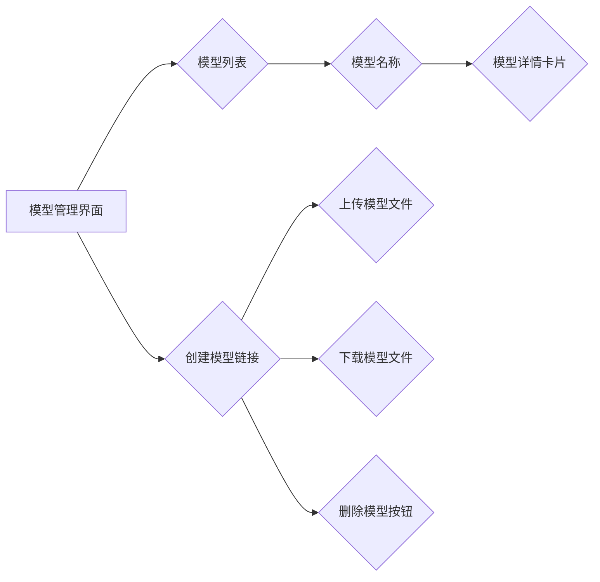
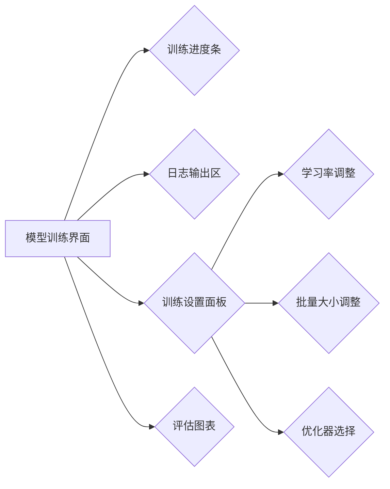

                 

### 《AI模型的可视化管理：Lepton AI的用户界面设计》

#### **关键词**：
AI模型可视化、用户界面设计、Lepton AI、用户研究、可用性评估、导航设计、模型管理、训练界面、测试优化、AI模型可视化实践、案例研究。

#### **摘要**：
本文旨在探讨AI模型的可视化管理，特别是针对Lepton AI的用户界面设计。文章首先介绍了AI模型可视化的重要性及需求，然后详细介绍了Lepton AI的发展背景、核心功能和优势。接着，文章分析了用户界面设计的基本原则，探讨了用户角色分析、导航布局设计、控件图标设计和色彩字体设计等要素。通过实例展示了Lepton AI的用户界面设计，并介绍了用户界面测试与优化方法。随后，文章探讨了AI模型可视化实践，包括数据准备、算法选择和效果评估。最后，文章通过案例研究深入分析了不同类型AI模型的可视化方法，并预测了AI模型可视化的未来趋势。本文旨在为AI模型可视化管理提供全面的技术指导和实践案例。

## 《AI模型的可视化管理：Lepton AI的用户界面设计》目录大纲

### 第一部分：AI模型可视化管理概述

#### 第1章：AI模型可视化的重要性

##### 1.1 AI模型的挑战与可视化需求
##### 1.2 可视化技术的基本概念
##### 1.3 AI模型可视化的应用场景

#### 第2章：Lepton AI介绍

##### 2.1 Lepton AI的发展背景
##### 2.2 Lepton AI的核心功能
##### 2.3 Lepton AI的优势和特点

### 第二部分：Lepton AI的用户界面设计

#### 第3章：用户界面设计原则

##### 3.1 用户界面设计的基本原则
##### 3.2 可用性评估与用户研究
##### 3.3 设计流程与工具

#### 第4章：用户界面设计要素

##### 4.1 用户角色与需求分析
##### 4.2 导航与布局设计
##### 4.3 控件与图标设计
##### 4.4 色彩与字体设计

#### 第5章：Lepton AI用户界面设计实例

##### 5.1 登录界面设计
##### 5.2 概览界面设计
##### 5.3 模型管理界面设计
##### 5.4 模型训练界面设计

#### 第6章：用户界面测试与优化

##### 6.1 用户界面测试方法
##### 6.2 用户界面优化策略
##### 6.3 用户反馈与迭代

### 第三部分：AI模型可视化实践

#### 第7章：AI模型可视化实践

##### 7.1 可视化数据的准备
##### 7.2 可视化算法的选择
##### 7.3 可视化效果评估

#### 第8章：AI模型可视化案例研究

##### 8.1 案例一：图像分类模型可视化
##### 8.2 案例二：文本分析模型可视化
##### 8.3 案例三：时间序列模型可视化

#### 第9章：AI模型可视化的未来趋势

##### 9.1 可视化技术的发展趋势
##### 9.2 AI模型可视化的潜在应用领域
##### 9.3 可视化管理在AI领域的战略意义

### 附录

#### 附录 A：Lepton AI用户界面设计资源

##### A.1 设计资源汇总
##### A.2 设计工具推荐
##### A.3 开发资源汇总

---

### 第一部分：AI模型可视化管理概述

#### 第1章：AI模型可视化的重要性

##### 1.1 AI模型的挑战与可视化需求

在人工智能（AI）时代，AI模型的复杂性和规模不断增长，这对人类理解和操作这些模型提出了巨大挑战。传统的文本报告和命令行界面已经不足以满足用户的需求，因为它们缺乏直观性和交互性。可视化技术在处理这类问题时具有独特优势，它可以帮助用户以图形化的方式理解和操作AI模型。

首先，AI模型通常涉及大量的参数和超参数，这些参数对于非专业人士来说难以理解。通过可视化，可以将这些参数以图形的方式呈现，从而简化用户的学习过程。例如，使用热图可以直观地展示模型的权重分布，帮助用户快速识别关键特征。

其次，AI模型的性能评估需要大量的数据分析和统计计算。可视化技术可以将这些复杂的数据以图表的形式呈现，使结果更加直观，便于用户进行决策。例如，通过ROC曲线和精度-召回率曲线，用户可以直观地了解模型的分类性能。

此外，AI模型的可视化在调试和故障诊断中也起着重要作用。当模型出现问题时，可视化可以帮助用户快速定位问题所在，从而加快问题的解决过程。

##### 1.2 可视化技术的基本概念

可视化技术是指使用图形、图像和动画等视觉元素来表示和解释数据、信息或知识。在AI领域，可视化技术主要包括以下几种类型：

1. **数据可视化**：将数据集以图形化的方式展示，如折线图、柱状图、散点图等。
2. **交互式可视化**：允许用户通过点击、拖动等交互操作来探索和操作数据。
3. **图形化表示**：使用图形化的符号和图像来表示复杂的算法和模型结构。
4. **视觉编码**：通过颜色、形状、大小等视觉属性来传递信息。

##### 1.3 AI模型可视化的应用场景

AI模型可视化在多个应用场景中具有重要价值：

1. **模型调试与优化**：通过可视化工具，开发人员可以更直观地了解模型的性能和问题，从而进行优化。
2. **模型解释与解释性**：可视化可以帮助用户理解模型的决策过程，增强模型的可解释性。
3. **模型评估与监控**：通过可视化技术，用户可以实时监控模型的性能，及时发现潜在问题。
4. **教育与研究**：可视化技术可以用于教育目的，帮助学习者更好地理解AI模型的工作原理。
5. **商业分析**：在企业中，可视化技术可以用于数据分析，帮助决策者快速获取关键信息。

综上所述，AI模型可视化不仅解决了模型复杂性的问题，还提高了用户体验和效率。在接下来的章节中，我们将详细介绍Lepton AI的用户界面设计，以展示如何有效地利用可视化技术来管理AI模型。

### 第2章：Lepton AI介绍

##### 2.1 Lepton AI的发展背景

Lepton AI作为一个新兴的AI平台，其发展背景可以追溯到人工智能领域日益增长的需求和技术的快速进步。随着深度学习和机器学习技术的广泛应用，传统的AI工具和平台已经难以满足用户对高效、直观和易用的需求。Lepton AI应运而生，旨在提供一种全新的AI模型可视化管理解决方案。

Lepton AI的开发团队由一群在人工智能和用户界面设计领域有着丰富经验的专业人士组成。他们致力于解决AI模型的可视化、解释性和易用性问题。通过多年的研究和开发，Lepton AI逐渐成熟，并在多个领域取得了显著的应用成果。

##### 2.2 Lepton AI的核心功能

Lepton AI的核心功能主要体现在以下几个方面：

1. **模型可视化**：Lepton AI提供强大的模型可视化工具，用户可以通过图形界面直观地查看模型的各个部分，包括网络结构、权重分布和激活情况。这种可视化不仅有助于用户理解模型的内部运作，还能在模型调试和优化过程中提供直观的指导。

2. **模型管理**：Lepton AI支持用户对AI模型进行高效的存储、检索和管理。用户可以方便地创建、更新和删除模型，同时系统会自动记录模型的训练历史和性能数据，便于后续分析和监控。

3. **模型训练**：Lepton AI提供了丰富的训练工具，支持深度学习模型的快速训练和调整。用户可以通过图形界面配置训练参数、设置训练策略，并实时监控训练进度和性能。

4. **模型解释**：Lepton AI强调模型的可解释性，通过可视化技术帮助用户理解模型的决策过程。例如，可以使用热力图展示模型对特定输入的权重分布，帮助用户识别关键特征。

5. **性能评估**：Lepton AI提供了多种性能评估工具，用户可以通过可视化图表了解模型的分类、回归等性能指标，从而进行模型选择和优化。

##### 2.3 Lepton AI的优势和特点

Lepton AI相较于其他AI平台具有以下优势和特点：

1. **用户友好**：Lepton AI的用户界面设计简洁直观，用户无需具备深厚的编程背景即可轻松上手。同时，系统提供了丰富的文档和教程，帮助用户快速掌握使用方法。

2. **高度可扩展**：Lepton AI支持自定义插件和扩展，用户可以根据自己的需求对平台进行功能增强和定制化开发。

3. **高性能**：Lepton AI采用了优化的算法和底层架构，确保了系统的高性能和稳定性，适用于大规模数据处理和模型训练。

4. **多平台支持**：Lepton AI支持多种操作系统和硬件环境，用户可以在不同平台上无缝切换和使用。

5. **社区支持**：Lepton AI拥有活跃的开发者社区，用户可以在这里获取帮助、分享经验和交流心得。

总之，Lepton AI通过其强大的功能、简洁的用户界面和灵活的扩展能力，为AI模型的可视化管理提供了全面的解决方案。在接下来的章节中，我们将进一步探讨用户界面设计的原则和方法，以展示如何有效地利用Lepton AI来提升用户体验。

### 第3章：用户界面设计原则

##### 3.1 用户界面设计的基本原则

用户界面设计是确保软件系统易用性和用户体验成功的关键环节。在设计用户界面时，应遵循一系列基本原则，这些原则能够帮助设计者创建出既直观又高效的界面。以下是一些核心的设计原则：

1. **简洁性**：界面应保持简洁，避免不必要的复杂性和冗余。过多的功能和选项可能会导致用户困惑，降低操作效率。

2. **一致性**：界面元素应保持一致性，包括颜色、字体、图标和布局等。这种一致性能够帮助用户快速识别和使用界面功能。

3. **直观性**：界面设计应直观易懂，使用户能够通过直觉理解界面的功能和操作方式。避免使用过于专业的术语和复杂的图形。

4. **反馈机制**：界面应提供明确的反馈，确保用户知道他们的操作是否成功。例如，按钮点击后应有视觉反馈，输入错误时应提供清晰的错误提示。

5. **可访问性**：界面设计应考虑到所有用户，包括视力障碍、听力障碍和行动不便的用户。这包括提供文本替代、屏幕阅读器支持和键盘导航等功能。

6. **灵活性**：界面设计应具有一定的灵活性，允许用户根据个人喜好进行定制和调整。例如，用户可以选择自定义主题、布局和快捷键。

7. **效率**：界面设计应考虑用户的操作效率，减少用户完成任务所需的步骤和时间。这可以通过提供快捷键、简化流程和减少用户记忆负担来实现。

##### 3.2 可用性评估与用户研究

在用户界面设计过程中，可用性评估和用户研究是至关重要的环节。这些方法可以帮助设计者了解用户的实际需求和行为，从而做出更明智的设计决策。

1. **可用性评估**：
   - **任务分析**：分析用户在完成特定任务时所需的步骤和操作，确保界面设计能够支持这些任务。
   - **用户测试**：邀请实际用户参与测试，观察他们在使用界面时的行为和反馈，识别潜在的问题和改进点。
   - **问卷调查**：通过问卷收集用户对界面设计的意见和满意度，识别用户的需求和偏好。

2. **用户研究**：
   - **用户访谈**：与目标用户进行深入访谈，了解他们的背景、需求和行为模式。
   - **用户画像**：创建用户画像，将用户分为不同的群体，为每个群体设计特定的界面元素和功能。
   - **情境模拟**：模拟用户在实际环境中的使用场景，观察他们在不同情境下的操作行为。

##### 3.3 设计流程与工具

用户界面设计通常包括以下几个阶段：

1. **需求分析**：明确用户的需求和目标，定义系统的功能范围和用户界面需求。
2. **原型设计**：创建界面原型，包括线框图、低保真度和高保真度原型。这些原型可以帮助设计者验证和迭代设计思路。
3. **用户反馈**：通过用户测试和用户研究收集反馈，对原型进行修改和优化。
4. **开发与实现**：将设计转化为实际代码，实现用户界面。
5. **测试与优化**：进行全面的测试，包括功能测试、性能测试和用户体验测试，确保界面设计满足用户需求。

在用户界面设计过程中，可以使用多种工具来支持设计流程：

1. **线框工具**：如Sketch、Figma和Adobe XD，用于快速创建界面原型。
2. **原型工具**：如InVision和Axure，用于创建交互式原型。
3. **设计系统工具**：如Material UI和Ant Design，用于实现一致性和模块化的设计系统。
4. **用户测试工具**：如Lookback和UserTesting，用于进行远程用户测试。

通过遵循用户界面设计的基本原则、进行可用性评估和用户研究，并使用合适的设计流程和工具，设计者可以创建出既符合用户需求又具有高效性的用户界面。这些原则和方法不仅适用于Lepton AI的用户界面设计，也适用于其他AI模型可视化管理系统的设计。

### 第4章：用户界面设计要素

##### 4.1 用户角色与需求分析

用户界面设计的成功离不开对目标用户群体的深入了解。用户角色和需求分析是这一过程的关键步骤，它们帮助我们确定界面的功能和布局，确保设计能够满足用户的实际需求。

1. **定义用户角色**：
   - **用户画像**：通过创建用户画像，我们可以描述目标用户的特征，包括他们的年龄、职业、技能水平和使用习惯。
   - **用户需求**：识别用户在完成特定任务时所需的功能和操作。例如，对于AI模型可视化工具，用户可能需要查看模型的权重分布、激活情况以及性能评估结果。
   - **用户痛点**：分析用户在使用现有工具时遇到的问题和不满之处，以便在设计中加以解决。

2. **用户需求分析**：
   - **功能性需求**：这些需求涉及用户能够执行的任务，如模型训练、模型监控和模型调整。
   - **非功能性需求**：这些需求关注用户体验，如界面响应时间、系统稳定性、易用性和可访问性。

3. **用户研究**：
   - **访谈和调查**：通过访谈和调查获取用户的反馈，了解他们的需求和期望。
   - **用户测试**：邀请用户参与测试，观察他们的操作行为和反馈，识别界面设计中的潜在问题。

##### 4.2 导航与布局设计

导航和布局是用户界面设计中的核心要素，它们决定了用户如何与系统交互，以及如何找到所需功能。

1. **导航设计**：
   - **顶部导航栏**：顶部导航栏通常用于展示主功能模块，如“模型管理”、“训练界面”和“概览”等。
   - **侧边栏导航**：侧边栏导航适用于需要大量功能模块的系统，用户可以通过折叠和展开来快速访问不同部分。
   - **面包屑导航**：面包屑导航可以帮助用户理解当前页面在系统中的位置，便于用户回退到上一级页面。

2. **布局设计**：
   - **网格布局**：网格布局有助于保持界面的一致性和结构化，用户可以直观地找到所需信息。
   - **模块化布局**：将界面划分为多个模块，每个模块负责展示特定的信息或功能，提高界面的清晰度和易用性。
   - **响应式布局**：确保界面在不同设备和屏幕尺寸上都能良好显示，提高用户在不同场景下的使用体验。

##### 4.3 控件与图标设计

控件和图标是用户界面中不可或缺的元素，它们直接影响用户的操作体验。

1. **控件设计**：
   - **按钮**：按钮用于执行特定操作，如“保存”、“训练”和“删除”。按钮设计应确保清晰、直观，并符合用户期望。
   - **输入框**：输入框用于用户输入数据，设计时应提供明确的提示和格式要求，便于用户输入。
   - **下拉菜单**：下拉菜单适用于提供多个选项的场景，设计时注意选项的排列顺序和分组。

2. **图标设计**：
   - **图标风格**：图标设计应符合整体视觉风格，确保一致性。
   - **图标含义**：图标应具有明确的含义，避免使用模糊不清的图标。
   - **图标尺寸**：图标尺寸应适中，便于用户识别和操作。

##### 4.4 色彩与字体设计

色彩和字体设计在用户界面中起着关键作用，它们不仅影响视觉效果，还影响用户体验和信息传达。

1. **色彩设计**：
   - **颜色选择**：选择合适的颜色方案，确保界面具有吸引力和可读性。
   - **颜色对比**：使用高对比度颜色组合，确保重要信息和操作按钮易于识别。
   - **色彩心理学**：了解色彩对用户情绪和认知的影响，合理运用色彩提升用户体验。

2. **字体设计**：
   - **字体选择**：选择清晰易读的字体，避免使用过于复杂或花哨的字体。
   - **字号与行距**：确保文本具有适当的字号和行距，提高可读性。
   - **字体一致性**：保持字体的一致性，确保界面在不同部分中保持统一。

通过深入分析用户角色和需求，设计合理的导航与布局，选用合适的控件和图标，以及精心选择色彩和字体，我们可以创建出既美观又实用的用户界面。这些设计要素将在Lepton AI的用户界面设计中发挥关键作用，确保用户能够高效、直观地管理与可视化AI模型。

### 第5章：Lepton AI用户界面设计实例

##### 5.1 登录界面设计

登录界面是用户与Lepton AI互动的入口，其设计直接关系到用户体验的第一印象。为了确保登录界面简洁且易于操作，我们遵循以下设计原则：

1. **简洁性**：
   - **信息精简**：只保留用户名和密码输入框，避免不必要的干扰元素。
   - **无干扰设计**：背景采用低对比度的深色，以突出输入框和按钮。

2. **一致性**：
   - **配色方案**：遵循Lepton AI的整体色彩风格，使用统一的蓝色作为主要色彩。
   - **按钮样式**：登录按钮采用与整体界面风格一致的设计，确保用户能够快速识别并操作。

3. **直观性**：
   - **提示信息**：输入框旁边提供清晰的提示文字，帮助用户了解输入要求。
   - **错误反馈**：当输入不正确时，界面会立即提供错误提示，引导用户进行修正。

4. **响应式设计**：
   - **适配多种设备**：确保登录界面在不同屏幕尺寸和设备上均能良好显示，提供流畅的操作体验。

具体实现：



在登录界面中，用户名输入框和密码输入框分别用于用户输入其用户名和密码。登录按钮位于输入框下方，用户点击后，系统会验证用户身份并给出相应的反馈。若登录成功，用户将被重定向到Lepton AI的主界面；若登录失败，界面会显示错误提示，例如“用户名或密码错误”，并建议用户重新输入。

##### 5.2 概览界面设计

概览界面是用户对Lepton AI系统整体状态的快速浏览页面，其设计旨在提供用户所需的关键信息，同时保持简洁和直观。以下是概览界面设计的关键要素：

1. **信息布局**：
   - **卡片式布局**：使用卡片（Card）来展示不同的信息模块，如模型数量、训练进度、性能指标等。
   - **模块化设计**：每个卡片独立展示一个信息模块，用户可以轻松扩展或隐藏卡片，查看更多或更少的信息。

2. **交互设计**：
   - **交互提示**：为每个卡片提供交互提示，如鼠标悬停显示更多详细信息、点击展开完整报告等。
   - **导航链接**：在卡片中添加导航链接，用户可以直接从概览界面跳转到具体的模型管理或训练界面。

3. **视觉元素**：
   - **图表和图形**：使用图表（如饼图、折线图）展示数据，使用图形（如进度条、热力图）提供直观的视觉反馈。

具体实现：



在概览界面中，用户可以快速查看系统中的模型总数、训练进度和性能指标。每个卡片都提供了详细的图表和图形，用户可以点击卡片中的链接，快速跳转到相关的详细界面，进行进一步的操作和监控。

##### 5.3 模型管理界面设计

模型管理界面是用户对AI模型进行创建、更新和删除等操作的主要界面。设计时需确保操作简单直观，信息展示清晰易懂。以下是模型管理界面设计的关键要素：

1. **导航与布局**：
   - **顶部导航栏**：提供快速访问模型创建、模型列表、模型详情等功能的链接。
   - **侧边栏导航**：侧边栏展示用户可执行的操作，如“上传模型”、“下载模型”和“删除模型”等。

2. **模型列表**：
   - **表格布局**：使用表格展示模型名称、创建时间、训练状态和性能指标等信息。
   - **筛选与排序**：提供筛选和排序功能，用户可以根据不同的条件查找和排序模型列表。

3. **详细视图**：
   - **模型详情卡片**：点击模型列表中的模型名称，可以进入模型的详细视图，展示模型结构、参数和训练历史等详细信息。
   - **交互式元素**：在模型详情视图中，提供交互式元素，如训练按钮、性能评估按钮和模型导出按钮。

具体实现：



在模型管理界面中，用户可以创建新的模型、上传或下载模型文件、删除不再需要的模型。模型列表以表格形式展示，用户可以筛选和排序模型，点击模型名称进入模型的详细视图，查看和操作模型的具体信息。

##### 5.4 模型训练界面设计

模型训练界面是用户对AI模型进行训练的主要界面，设计时需确保训练过程的可视化和交互性。以下是模型训练界面设计的关键要素：

1. **训练进度展示**：
   - **进度条**：使用进度条展示训练的进度，实时更新训练状态。
   - **日志输出**：显示训练过程中的日志信息，包括训练轮次、损失值、准确率等指标。

2. **参数调整**：
   - **训练设置面板**：提供训练参数调整选项，如学习率、批量大小、优化器选择等。
   - **实时调整**：用户可以实时调整训练参数，系统将根据调整后的参数重新训练模型。

3. **性能评估**：
   - **评估图表**：使用图表展示训练过程中的性能评估结果，如损失曲线、准确率曲线等。
   - **评估报告**：点击评估图表，可以查看详细的评估报告，包括性能指标和可视化图表。

具体实现：



在模型训练界面中，用户可以实时监控训练进度，通过日志输出区查看训练过程中的详细信息。用户可以调整训练设置，包括学习率、批量大小和优化器选择，系统将根据调整后的参数重新训练模型。评估图表展示了训练过程中的性能评估结果，用户可以查看详细的评估报告，了解模型的训练效果。

通过以上详细的设计实例，我们可以看到Lepton AI的用户界面设计如何通过简洁、直观和功能丰富的界面，为用户提供了高效的管理和可视化AI模型的方式。

##### 6.1 用户界面测试方法

用户界面测试是确保设计满足用户需求的重要环节。通过系统化的测试方法，我们可以发现并修复潜在的问题，从而提升用户体验。以下是几种常用的用户界面测试方法：

1. **功能测试**：功能测试旨在验证用户界面是否能够按照预期正常工作。测试者会模拟用户操作，检查每个功能模块是否按设计要求运行。功能测试通常包括以下步骤：
   - **制定测试用例**：定义用户可能会执行的各种操作和预期结果。
   - **执行测试**：按照测试用例进行操作，记录系统响应和结果。
   - **缺陷报告**：记录发现的问题，并分配给开发人员进行修复。

2. **性能测试**：性能测试用于评估用户界面在不同负载下的响应时间和稳定性。通过模拟高并发访问，测试者可以识别系统瓶颈和性能瓶颈，从而进行优化。性能测试通常包括以下步骤：
   - **负载生成**：使用工具模拟大量用户访问系统。
   - **监控系统资源**：实时监控系统的CPU、内存、网络等资源使用情况。
   - **分析结果**：根据测试结果调整系统配置和优化代码。

3. **用户体验测试**：用户体验测试关注用户在使用界面时的感受和满意度。测试者通常会邀请实际用户参与，观察他们的操作行为和反馈。用户体验测试通常包括以下步骤：
   - **招募测试参与者**：选择具有代表性的用户作为测试参与者。
   - **任务执行**：向测试参与者分配任务，观察他们如何完成任务。
   - **反馈收集**：收集测试参与者的反馈，包括对界面设计、操作流程和系统性能的评价。

##### 6.2 用户界面优化策略

在用户界面测试过程中，可能会发现一系列的问题，这些问题需要通过优化策略来解决，以提升用户体验。以下是几种常用的用户界面优化策略：

1. **简化操作流程**：通过减少用户完成任务所需的步骤，提高操作效率。例如，将多个操作整合到一个界面中，使用快捷键和快捷操作等。

2. **改进导航设计**：确保用户能够轻松找到所需功能。可以通过改进顶部导航栏、侧边栏导航和面包屑导航等方式来实现。

3. **提升视觉设计**：通过改进色彩搭配、字体选择和图标设计，提升界面的美观性和可读性。确保重要的信息和操作按钮易于识别。

4. **增强交互反馈**：通过改进按钮、输入框和其他控件的视觉反馈，确保用户知道他们的操作是否成功。例如，使用动画效果、颜色变化和提示信息等。

5. **优化性能**：通过优化代码和系统配置，提高界面的响应速度和稳定性。例如，减少页面加载时间、优化数据库查询和缓存机制等。

6. **增强可访问性**：确保界面设计满足不同用户的需求，包括视力障碍、听力障碍和行动不便的用户。提供文本替代、屏幕阅读器和键盘导航等功能。

通过系统化的用户界面测试和优化策略，我们可以不断提升用户界面的质量和用户体验。这不仅有助于提高用户满意度，还能提升系统的市场竞争力和用户忠诚度。

##### 6.3 用户反馈与迭代

用户反馈是用户界面设计和优化过程中不可或缺的一部分，它能够为设计团队提供宝贵的洞察，帮助发现并解决潜在问题。以下是用户反馈的收集、处理和迭代的方法：

1. **用户反馈收集**：
   - **在线问卷**：通过在线问卷收集用户的意见和建议。问卷应设计得简洁明了，包含具体的问题和评分选项，以便用户能够轻松参与。
   - **用户访谈**：邀请用户进行一对一的访谈，深入了解他们对界面设计的看法和使用体验。访谈应灵活，允许用户自由表达他们的感受和建议。
   - **用户测试**：在用户界面设计的不同阶段，邀请用户参与测试，观察他们的实际操作行为和反馈。这可以帮助设计团队识别出界面中可能存在的问题。

2. **用户反馈处理**：
   - **分类与优先级**：将收集到的用户反馈进行分类，并根据严重性和影响范围分配优先级。例如，严重的问题应优先处理，而小问题可以留到后续版本解决。
   - **分析反馈**：对用户反馈进行深入分析，识别出共性问题和关键痛点。这有助于设计团队制定针对性的优化策略。
   - **内部讨论**：组织设计团队进行内部讨论，根据用户反馈提出改进方案，并评估方案的可行性和优先级。

3. **迭代与优化**：
   - **快速迭代**：采用敏捷开发方法，快速构建和迭代界面设计。每次迭代应包含对用户反馈的改进，以确保设计不断优化。
   - **A/B测试**：通过A/B测试，将新的设计变体与现有设计进行比较，评估用户对新设计的接受度和满意度。这种方法有助于确定最佳的设计方案。
   - **持续反馈**：建立持续的用户反馈机制，确保设计团队能够及时获取用户的新意见和建议，不断优化界面设计。

通过有效的用户反馈与迭代，设计团队可以确保用户界面始终符合用户需求，提高用户体验和满意度。这不仅有助于提升产品的市场竞争力，还能增强用户对产品的信任和忠诚度。

### 第7章：AI模型可视化实践

#### 7.1 可视化数据的准备

在AI模型可视化实践中，准备合适的可视化数据是至关重要的一步。这一步涉及到数据采集、处理和清洗，以确保数据的质量和适用性。以下是具体的步骤和注意事项：

1. **数据采集**：
   - **原始数据获取**：首先，从数据源（如数据库、文件或API）获取原始数据。对于AI模型可视化，通常需要包含模型的输入、输出以及中间计算结果等。
   - **数据格式转换**：将获取的原始数据转换为适合可视化工具的格式，如JSON、CSV或Parquet。数据格式的统一有助于后续的处理和分析。

2. **数据处理**：
   - **数据清洗**：清洗数据，移除重复项、缺失值和异常值。对于缺失值，可以选择填充或删除；对于异常值，可以根据数据分布进行修正或删除。
   - **数据归一化**：为了确保数据在不同特征之间的可比性，需要对数据进行归一化处理。常用的归一化方法包括最小-最大标准化和Z分数标准化。

3. **数据预处理**：
   - **特征选择**：选择对模型可视化有重要影响的关键特征。通过特征选择，可以减少数据的冗余，提高可视化效率。
   - **数据聚合**：对于时间序列数据，可以进行聚合处理，如将小时级别的数据聚合为天级别或周级别，以简化数据结构。

4. **注意事项**：
   - **数据质量**：确保数据质量，避免因数据错误导致可视化结果失真。可以设置数据校验机制，如数据类型检查、范围检查等。
   - **数据量**：根据实际需求控制数据量，避免因数据量过大导致可视化性能下降。可以采用数据采样或分块处理的方法。

#### 7.2 可视化算法的选择

选择合适的可视化算法是AI模型可视化的关键，不同的可视化方法适用于不同的数据和模型类型。以下是几种常用的可视化算法及其适用场景：

1. **热力图（Heatmap）**：
   - **适用场景**：用于展示数据分布和密度。例如，在图像分类模型中，可以用来显示每个像素的权重或概率分布。
   - **算法原理**：热力图通过颜色深浅来表示数据的值，颜色越深表示值越大。算法通常使用矩阵或二维数组来存储数据，通过映射函数将数据值转换为颜色。

2. **轮廓图（Scatter Plot）**：
   - **适用场景**：用于展示两个特征之间的关系。例如，在回归分析中，可以用来展示输入特征和目标变量之间的关系。
   - **算法原理**：轮廓图通过在二维坐标系中绘制点来表示数据，每个点的坐标由两个特征值决定。可以通过不同的点大小或颜色表示不同的类别或标签。

3. **等高线图（Contour Plot）**：
   - **适用场景**：用于展示多维数据的等高线或等值线。例如，在多变量分析中，可以用来展示数据集的等值面。
   - **算法原理**：等高线图通过在三维坐标系中绘制等值线来表示数据。算法通常使用数值插值方法（如克里金插值）生成等高线。

4. **力导向布局图（Force-Directed Layout）**：
   - **适用场景**：用于展示图结构或网络数据。例如，在社会网络分析中，可以用来展示节点之间的关系。
   - **算法原理**：力导向布局图通过模拟物理力场来布局节点。节点之间的连接力、排斥力和引力决定了节点的位置，从而生成一个具有层次结构和聚类的布局。

5. **时间序列图（Time Series Plot）**：
   - **适用场景**：用于展示随时间变化的数据。例如，在股票市场中，可以用来展示股票价格的变化趋势。
   - **算法原理**：时间序列图通过在时间轴上绘制数据点来表示数据变化。算法通常使用折线或曲线来连接时间点和对应的值。

6. **3D 图形（3D Visualization）**：
   - **适用场景**：用于展示三维空间中的数据。例如，在科学计算中，可以用来展示分子的结构。
   - **算法原理**：3D 图形通过在三维空间中绘制点、线、面或体来表示数据。算法通常使用图形渲染技术，如光线追踪或图形渲染器。

选择合适的可视化算法需要根据数据类型、模型结构和应用场景进行综合考虑。不同的算法具有不同的可视化效果和性能特点，设计者应灵活选择，以达到最佳的可视化效果。

#### 7.3 可视化效果评估

在完成AI模型可视化后，对可视化效果进行评估是确保可视化设计成功的关键。以下是一些常用的评估方法和指标：

1. **可视化准确性**：
   - **准确性指标**：评估可视化是否准确传达了模型的关键信息和数据特征。例如，对于热力图，评估颜色映射是否与实际数据值一致。
   - **用户反馈**：通过用户测试和问卷调查，了解用户对可视化准确性的评价。这可以帮助识别潜在的误差和误解。

2. **可视化易用性**：
   - **用户操作效率**：评估用户完成特定任务所需的操作步骤和时间。例如，评估用户在模型管理界面中找到并操作特定模型的速度。
   - **用户满意度**：通过用户问卷调查，了解用户对可视化界面的满意度。这可以帮助识别用户不满的方面和改进的机会。

3. **可视化可读性**：
   - **视觉清晰度**：评估可视化的视觉元素是否清晰、易于理解。例如，检查图标和文字是否大小适中、颜色对比是否鲜明。
   - **信息传递效率**：评估用户在短时间内能否快速获取所需信息。例如，检查是否提供了清晰的标题、标签和提示。

4. **可视化交互性**：
   - **交互响应**：评估交互元素的响应速度和流畅性。例如，检查按钮点击后是否立即有视觉反馈，滑动操作是否平滑。
   - **用户反馈**：通过用户测试，了解用户对交互功能的评价，如导航链接的易用性、过滤和排序功能的响应速度。

5. **评估指标计算**：
   - **平均操作时间**：计算用户完成特定任务所需平均操作时间，评估界面设计的流畅性和效率。
   - **错误率**：记录用户在测试过程中犯的错误次数，评估界面设计的易用性和清晰度。
   - **用户满意度评分**：通过用户满意度评分，评估用户对界面设计的整体评价。

通过综合使用以上评估方法和指标，设计者可以全面评估AI模型可视化的效果，识别出需要改进的方面，从而不断提升用户体验。

### 第8章：AI模型可视化案例研究

#### 8.1 案例一：图像分类模型可视化

图像分类模型是AI领域中的一种常见应用，通过训练模型可以自动识别和分类图像中的物体。以下是图像分类模型可视化的具体步骤和实现方法：

1. **数据准备**：
   - **数据集选择**：选择一个具有代表性且规模适中的图像分类数据集，如Kaggle上的CIFAR-10或ImageNet。
   - **预处理**：对图像进行归一化处理，将图像尺寸统一为模型所需的尺寸，例如28x28像素或224x224像素。

2. **模型训练**：
   - **选择模型**：选择一个适合图像分类任务的深度学习模型，如卷积神经网络（CNN）。
   - **训练过程**：使用训练集训练模型，并使用验证集进行调参和优化。

3. **权重可视化**：
   - **层可视化**：使用热力图展示模型中每层的权重分布，帮助用户理解模型如何提取图像特征。
   - **像素可视化**：对于最后一层的特征图，可以使用热力图或颜色编码展示每个像素的重要性。这种方法可以揭示模型对特定物体的关注点。

4. **决策过程可视化**：
   - **决策路径图**：绘制模型在分类过程中的决策路径，展示每个神经元对最终分类的影响。
   - **激活映射**：使用可视化工具（如t-SNE或UMAP）将高维特征映射到二维或三维空间，以直观地展示图像在特征空间中的分布。

5. **结果评估**：
   - **混淆矩阵**：使用混淆矩阵评估模型的分类性能，分析错误分类的原因。
   - **ROC曲线和精度-召回率曲线**：绘制ROC曲线和精度-召回率曲线，评估模型在不同阈值下的性能。

实现示例：

```python
import tensorflow as tf
from tensorflow.keras.applications import VGG16
import matplotlib.pyplot as plt
import numpy as np

# 加载预训练的VGG16模型
model = VGG16(weights='imagenet')

# 加载测试图像
test_image = plt.imread('test_image.jpg')
test_image = preprocess_input(test_image)

# 获取模型最后一层的输出
last_layer = model.get_layer('block5_conv3')
last_output = Model(inputs=model.input, outputs=last_layer.output)

# 计算特征图
feature_map = last_output.predict(np.expand_dims(test_image, axis=0))

# 可视化特征图
plt.imshow(np.squeeze(feature_map), cmap='gray')
plt.show()
```

通过上述步骤，我们可以实现对图像分类模型的详细可视化，帮助用户理解模型的工作原理和决策过程。

#### 8.2 案例二：文本分析模型可视化

文本分析模型在自然语言处理（NLP）中广泛应用，用于情感分析、主题建模和文本分类等任务。以下是文本分析模型可视化的具体步骤和实现方法：

1. **数据准备**：
   - **数据集选择**：选择一个具有代表性且规模适中的文本数据集，如IMDB影评数据集或20 Newsgroups数据集。
   - **预处理**：对文本进行分词、去除停用词和标记化处理，将文本转换为适合模型输入的序列。

2. **模型训练**：
   - **选择模型**：选择一个适合文本分析任务的模型，如循环神经网络（RNN）或Transformer。
   - **训练过程**：使用训练集训练模型，并使用验证集进行调参和优化。

3. **词嵌入可视化**：
   - **词向量投影**：将文本数据转换为词向量，使用可视化工具（如t-SNE或UMAP）将高维词向量映射到二维或三维空间。
   - **词云生成**：生成词云，展示文本中频繁出现的词语及其权重。

4. **文本特征可视化**：
   - **特征图**：使用热力图展示文本特征在模型中的权重分布，帮助用户理解模型对文本的解析方式。
   - **决策路径图**：绘制模型在分类过程中的决策路径，展示每个词对最终分类的影响。

5. **结果评估**：
   - **混淆矩阵**：使用混淆矩阵评估模型的分类性能，分析错误分类的原因。
   - **ROC曲线和精度-召回率曲线**：绘制ROC曲线和精度-召回率曲线，评估模型在不同阈值下的性能。

实现示例：

```python
import gensim.downloader as api
from sklearn.manifold import TSNE
import matplotlib.pyplot as plt
import numpy as np

# 下载预训练的Word2Vec模型
word2vec_model = api.load("glove-wiki-gigaword-100")

# 获取文本数据
texts = ["This is an example sentence.", "Another example sentence."]

# 将文本转换为词向量
word_vectors = [word2vec_model[word] for word in texts[0].split() if word in word2vec_model]

# 可视化词向量
tsne = TSNE(n_components=2)
word_vectors_2d = tsne.fit_transform(word_vectors)

plt.scatter(word_vectors_2d[:, 0], word_vectors_2d[:, 1])
for i, word in enumerate(texts[0].split()):
    plt.text(word_vectors_2d[i, 0], word_vectors_2d[i, 1], word)
plt.show()
```

通过上述步骤，我们可以实现对文本分析模型的详细可视化，帮助用户理解模型的工作原理和文本特征的重要性。

#### 8.3 案例三：时间序列模型可视化

时间序列模型在金融、气象、工业等领域有广泛应用，用于预测未来的趋势和变化。以下是时间序列模型可视化的具体步骤和实现方法：

1. **数据准备**：
   - **数据集选择**：选择一个具有代表性且规模适中的时间序列数据集，如股票价格数据或天气数据。
   - **预处理**：对时间序列数据进行平稳性检验和差分处理，确保数据符合时间序列模型的要求。

2. **模型训练**：
   - **选择模型**：选择一个适合时间序列预测的模型，如ARIMA、LSTM或GRU。
   - **训练过程**：使用训练集训练模型，并使用验证集进行调参和优化。

3. **趋势可视化**：
   - **折线图**：使用折线图展示时间序列数据的趋势，分析数据的季节性和周期性。
   - **残差图**：绘制残差图，分析模型的预测误差，识别异常值和趋势。

4. **预测可视化**：
   - **预测曲线**：使用预测曲线展示模型的预测结果，对比实际数据和预测数据，评估模型的准确性。
   - **置信区间**：绘制置信区间，展示预测结果的置信水平。

5. **结果评估**：
   - **均方误差（MSE）**：计算均方误差，评估模型的预测精度。
   - **均方根误差（RMSE）**：计算均方根误差，提供对模型预测精度的更直观评估。
   - **相关系数（R²）**：计算相关系数，评估模型对实际数据的拟合程度。

实现示例：

```python
import numpy as np
import pandas as pd
from statsmodels.tsa.arima.model import ARIMA
import matplotlib.pyplot as plt

# 加载时间序列数据
data = pd.read_csv('time_series_data.csv', index_col=0, parse_dates=True)

# 创建ARIMA模型
model = ARIMA(data['Close'], order=(5, 1, 2))
model_fit = model.fit()

# 预测未来5个时间点
forecast = model_fit.forecast(steps=5)

# 可视化时间序列数据
plt.plot(data.index, data['Close'], label='Actual')
plt.plot(forecast.index, forecast, label='Forecast')
plt.fill_between(forecast.index, forecast - 2 * forecast.std(), forecast + 2 * forecast.std(), color='gray', alpha=0.5)
plt.legend()
plt.show()
```

通过上述步骤，我们可以实现对时间序列模型的详细可视化，帮助用户理解模型的工作原理和预测效果。

### 第9章：AI模型可视化的未来趋势

#### 9.1 可视化技术的发展趋势

随着人工智能技术的快速发展，AI模型可视化技术也在不断演进。以下是未来可视化技术可能的发展趋势：

1. **交互式可视化**：未来的可视化技术将更加注重用户的交互体验。通过引入手势识别、虚拟现实（VR）和增强现实（AR）等技术，用户可以更加直观地与可视化界面进行交互，实现更丰富的操作和探索功能。

2. **动态可视化**：动态可视化将使数据在视觉上的呈现更加动态和流畅。通过动画和实时更新，用户可以更直观地理解数据的变化趋势和模式，从而更好地进行决策和分析。

3. **多模态可视化**：多模态可视化将结合多种数据类型（如图像、文本、音频等）进行综合展示。这种方法可以提供更全面的信息，帮助用户从不同角度理解复杂的数据和模型。

4. **智能推荐**：利用机器学习和数据挖掘技术，可视化系统可以自动推荐最适合当前用户和场景的可视化方法。这种智能推荐功能将提高用户的操作效率和用户体验。

5. **个性化可视化**：未来的可视化技术将更加注重个性化需求。用户可以根据自己的偏好和需求，自定义可视化风格、颜色和布局等，以获得最适合自己的可视化效果。

#### 9.2 AI模型可视化的潜在应用领域

AI模型可视化技术在多个领域具有广泛的应用潜力，以下是几个关键领域：

1. **金融领域**：在金融领域，AI模型可视化可以帮助分析师和交易员更好地理解市场动态和投资策略。通过可视化技术，他们可以更直观地看到风险分布、收益预测和市场趋势，从而做出更明智的决策。

2. **医疗领域**：在医疗领域，AI模型可视化可以帮助医生更好地理解疾病的发展趋势和治疗方案。通过可视化技术，他们可以更直观地看到病情的变化、药物的疗效以及手术的预测效果。

3. **工业制造**：在工业制造领域，AI模型可视化可以帮助工程师和操作员更好地监控和优化生产过程。通过可视化技术，他们可以实时查看生产数据、设备状态和预测故障，从而提高生产效率和设备利用率。

4. **交通领域**：在交通领域，AI模型可视化可以帮助交通管理者更好地理解交通流量、事故预测和路况分析。通过可视化技术，他们可以实时监控道路状况、预测交通拥堵和优化交通流量。

5. **教育领域**：在教育领域，AI模型可视化可以帮助教师和学生更好地理解复杂的概念和算法。通过可视化技术，他们可以更直观地看到学习内容的变化和模型的决策过程，从而提高学习效果。

#### 9.3 可视化管理在AI领域的战略意义

AI模型可视化管理在AI领域的战略意义不可忽视。以下是几个关键方面：

1. **可解释性和透明度**：通过可视化技术，用户可以更直观地理解AI模型的决策过程和结果。这有助于提升AI模型的可解释性和透明度，减少黑箱问题，增强用户对AI模型的信任。

2. **故障诊断和优化**：可视化技术可以帮助用户快速定位模型中的问题，如过拟合、欠拟合和异常值等。通过分析可视化结果，用户可以针对性地进行优化，提升模型的性能。

3. **用户体验和效率**：良好的用户界面设计可以提高用户体验和操作效率。通过直观、易用的界面，用户可以更快速地完成操作，节省时间和精力，从而提高工作效率。

4. **创新和探索**：可视化技术为用户提供了探索新方法和新解决方案的工具。通过可视化结果，用户可以更好地理解数据模式、识别潜在机会和风险，从而推动创新和业务增长。

综上所述，AI模型可视化技术在未来将继续发展，并在多个领域发挥重要作用。通过不断提升可视化技术的功能和用户体验，AI模型可视化管理将在AI领域产生深远的影响，助力企业和个人在数据分析和决策方面取得更大的成功。

### 附录 A：Lepton AI用户界面设计资源

#### A.1 设计资源汇总

为了帮助用户更好地了解和设计Lepton AI的用户界面，以下是一些重要的设计资源汇总：

1. **官方文档**：Lepton AI提供了详细的官方文档，涵盖了用户界面设计的基础知识、设计原则、开发工具和API参考。用户可以通过访问Lepton AI的官方网站或GitHub仓库获取这些文档。

2. **设计指南**：Lepton AI还提供了一套完整的设计指南，包括色彩、字体、图标和布局等设计规范。这些指南确保了用户界面的一致性和美观性，为设计师提供了参考。

3. **示例代码**：Lepton AI提供了丰富的示例代码，展示了如何使用不同的设计工具和API构建用户界面。用户可以参考这些示例代码，快速上手设计和开发。

4. **社区论坛**：Lepton AI有一个活跃的社区论坛，用户可以在论坛上提问、分享经验和获取帮助。社区成员可以互相学习、讨论设计最佳实践，并共同改进Lepton AI的用户界面。

#### A.2 设计工具推荐

在Lepton AI的用户界面设计过程中，以下是一些推荐的设计工具：

1. **Sketch**：一款优秀的矢量图形设计工具，适用于创建线框图、原型图和最终的UI设计。

2. **Figma**：一款基于浏览器的UI/UX设计工具，支持多人协作，适用于实时协作和交互设计。

3. **Adobe XD**：一款功能强大的用户界面设计工具，提供丰富的组件和模板，适用于从线框图到高保真原型设计的全过程。

4. **InVision**：一款交互式原型设计工具，支持添加动画和交互效果，适用于创建高度交互的界面原型。

5. **Axure RP**：一款专业的原型设计工具，提供丰富的交互元素和丰富的功能，适用于创建详细的原型和文档。

6. **Material UI**：一个基于Material Design的React UI库，适用于构建现代化、响应式的用户界面。

7. **Ant Design**：一个基于React的UI设计语言和组件库，适用于构建高效、一致的用户界面。

#### A.3 开发资源汇总

为了帮助开发者实现Lepton AI的用户界面，以下是一些重要的开发资源汇总：

1. **源代码仓库**：Lepton AI的源代码托管在GitHub上，开发者可以通过访问GitHub仓库获取源代码，并在此基础上进行定制化开发。

2. **开发文档**：Lepton AI提供了详细的开发文档，涵盖了API接口、数据模型、功能模块和依赖管理等开发细节。

3. **集成开发环境（IDE）**：推荐使用Visual Studio Code、IntelliJ IDEA或PyCharm等IDE进行Lepton AI的用户界面开发。这些IDE提供了丰富的插件和工具，可以提高开发效率。

4. **测试框架**：Lepton AI支持使用Jest、Mocha和Chai等测试框架进行单元测试和集成测试，确保用户界面功能完整和稳定。

5. **构建工具**：推荐使用Webpack、Gulp或Webpack Dev Server等构建工具，自动化处理项目的打包、编译和部署过程。

6. **部署平台**：推荐使用Docker、Kubernetes等容器化技术，简化Lepton AI的部署和运维过程，提高系统的可扩展性和稳定性。

通过以上设计资源和开发资源的整合，用户和开发者可以更高效、更便捷地设计和实现Lepton AI的用户界面，为用户提供卓越的AI模型可视化管理体验。

