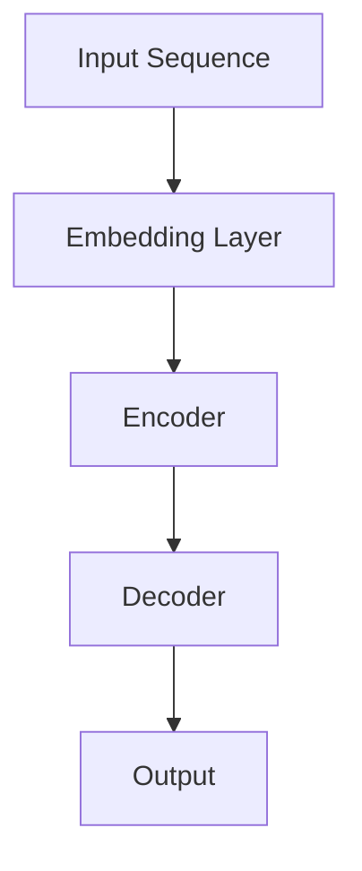
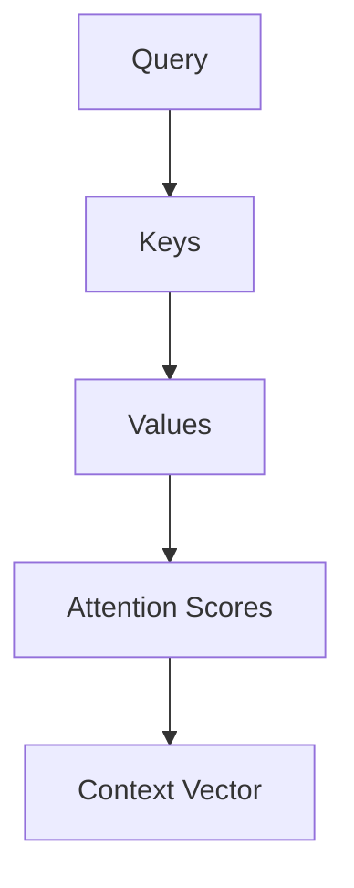
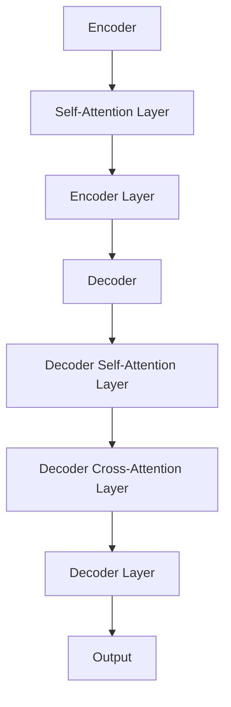
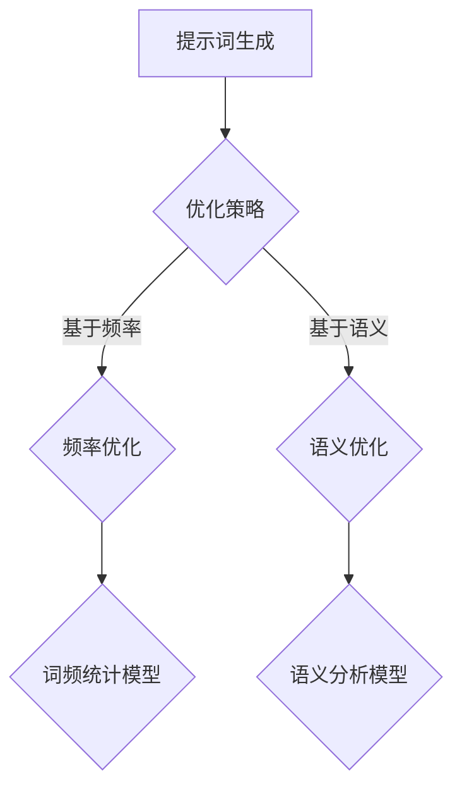

                 

### 《AI编程语言：提示词的革命与未来》目录大纲

> 关键词：人工智能，编程语言，提示词，深度学习，自然语言处理，应用场景，发展趋势，数学模型

> 摘要：本文将深入探讨AI编程语言的基础概念、核心架构、技术原理、应用场景以及未来发展趋势，通过详细分析和实例讲解，揭示提示词技术的革命性变革，探讨AI编程语言在未来的潜在影响和挑战。

**《AI编程语言：提示词的革命与未来》目录大纲**

## 第一部分：AI编程语言基础

### 第1章：AI编程语言概述

#### 1.1 AI编程语言的发展背景
#### 1.2 AI编程语言的核心概念
#### 1.3 提示词在AI编程语言中的应用

### 第2章：AI编程语言核心架构

#### 2.1 AI编程语言的组成模块
#### 2.2 提示词生成与优化
#### 2.3 模型融合与多模态交互

### 第3章：AI编程语言技术原理

#### 3.1 自然语言处理技术
#### 3.2 机器学习算法原理
#### 3.3 深度学习框架与工具

### 第4章：AI编程语言应用场景

#### 4.1 人工智能助手
#### 4.2 自动化编程
#### 4.3 智能问答系统

### 第5章：AI编程语言开发实战

#### 5.1 项目实战环境搭建
#### 5.2 实战案例解析
#### 5.3 源代码解读与分析

### 第6章：AI编程语言未来发展

#### 6.1 AI编程语言的技术趋势
#### 6.2 提示词技术的创新方向
#### 6.3 AI编程语言的社会影响与挑战

## 第二部分：AI编程语言核心算法与数学模型

### 第7章：自然语言处理技术原理

#### 7.1 词嵌入技术原理与算法
#### 7.2 序列模型与注意力机制
#### 7.3 转换器架构详解

### 第8章：机器学习算法原理

#### 8.1 朴素贝叶斯算法
#### 8.2 决策树算法
#### 8.3 支持向量机算法

### 第9章：深度学习框架与工具

#### 9.1 TensorFlow深度学习框架
#### 9.2 PyTorch深度学习框架
#### 9.3 JAX深度学习框架

### 第10章：数学模型与公式讲解

#### 10.1 数学模型在AI编程语言中的应用
#### 10.2 概率论基础
#### 10.3 统计学基础

## 附录

### 附录A：AI编程语言开发工具与资源

#### A.1 主流深度学习框架对比
#### A.2 提示词生成工具与库
#### A.3 AI编程语言学习资源推荐

### Mermaid 流程图

- **第2章：AI编程语言核心架构**
    - **2.2 提示词生成与优化**
        ```mermaid
        graph TD
        A[提示词生成] --> B{优化策略}
        B -->|基于频率| C{频率优化}
        B -->|基于语义| D{语义优化}
        C --> E{词频统计模型}
        D --> F{语义分析模型}
        ```
        
- **第7章：自然语言处理技术原理**
    - **7.1 词嵌入技术原理与算法**
        ```mermaid
        graph TD
        A[单词] --> B[词嵌入]
        B --> C[密集向量]
        C --> D[语义表示]
        ```
        
    - **7.2 序列模型与注意力机制**
        ```mermaid
        graph TD
        A[序列输入] --> B[嵌入层]
        B --> C[自注意力机制]
        C --> D[前馈神经网络]
        D --> E[输出层]
        ```
        
    - **7.3 转换器架构详解**
        ```mermaid
        graph TD
        A[编码器] --> B[自注意力层]
        B --> C[解码器]
        C --> D[输出层]
        ```
        
### 下一步，我们将深入第一部分：AI编程语言基础，从AI编程语言的发展背景开始。

## 第一部分：AI编程语言基础

### 第1章：AI编程语言概述

随着人工智能（AI）技术的迅猛发展，编程语言也在不断演变，以满足日益复杂的应用需求。AI编程语言，也称为人工智能编程语言，是一种专门为人工智能系统设计和开发的编程语言。它与传统的编程语言有所不同，具有更强的抽象能力和更高效的执行能力，能够更好地支持机器学习和深度学习的应用。

### 1.1 AI编程语言的发展背景

AI编程语言的发展可以追溯到20世纪50年代，当时计算机科学刚刚起步，人工智能的概念也开始浮现。早期的AI编程语言主要是为逻辑推理和知识表示而设计的，如Prolog和Lisp。然而，随着机器学习和深度学习技术的兴起，AI编程语言逐渐转向支持这些技术，以满足现代人工智能应用的需求。

近年来，深度学习的突破性进展为AI编程语言的发展带来了新的机遇。深度学习框架如TensorFlow、PyTorch和JAX等，成为了AI编程语言的主流代表。这些框架不仅提供了强大的数学运算能力，还提供了丰富的API和工具，使得开发者可以轻松构建和训练复杂的神经网络模型。

### 1.2 AI编程语言的核心概念

AI编程语言的核心概念包括以下几个方面：

1. **提示词（Prompt）：** 提示词是一种特殊的输入，用于引导AI模型生成预期的输出。提示词可以是一段文字、一个图片、一个声音或者其他形式的数据，它的目的是提供模型所需的上下文信息，以便更好地理解输入并生成准确的输出。

2. **嵌入（Embedding）：** 嵌入是将数据映射为高维向量的一种技术。在AI编程语言中，嵌入通常用于将单词、字符、图像等映射为密集向量，以便在神经网络中进行处理。

3. **模型融合（Model Fusion）：** 模型融合是将多个模型或多个模型的组件结合在一起，以实现更强大的功能。在AI编程语言中，模型融合可以用于提高模型的性能和泛化能力。

4. **多模态交互（Multimodal Interaction）：** 多模态交互是指将不同类型的数据（如文本、图像、声音等）进行融合和处理，以实现更丰富的语义理解和交互。在AI编程语言中，多模态交互可以用于构建更加智能的应用系统。

### 1.3 提示词在AI编程语言中的应用

提示词在AI编程语言中扮演着至关重要的角色。通过提供合适的提示词，可以引导模型生成更准确、更相关的输出。以下是一些提示词在AI编程语言中的应用场景：

1. **智能问答系统：** 在智能问答系统中，提示词可以是一系列问题，用于引导模型生成答案。通过优化提示词，可以显著提高问答系统的性能和用户体验。

2. **自然语言生成：** 在自然语言生成任务中，提示词可以是一段文字，用于引导模型生成连贯、有趣的文本。例如，在生成新闻报道、小说或其他类型的内容时，提示词可以提供必要的上下文信息。

3. **图像识别：** 在图像识别任务中，提示词可以是图像的描述或标签，用于帮助模型更好地理解图像内容。通过优化提示词，可以改进模型的分类准确率。

4. **语音识别：** 在语音识别任务中，提示词可以是语音的文本转录，用于指导模型识别语音中的关键信息。通过优化提示词，可以提高语音识别的准确性和鲁棒性。

### 小结

AI编程语言的发展为人工智能技术的应用提供了强大的支持。通过理解AI编程语言的核心概念和提示词的应用，开发者可以更好地构建和优化人工智能系统。在下一章中，我们将进一步探讨AI编程语言的核心架构，了解其组成模块和运行机制。

## 第一部分：AI编程语言基础

### 第2章：AI编程语言核心架构

AI编程语言的核心架构是构建高效、可扩展的人工智能系统的关键。这一章将详细讨论AI编程语言的核心组成模块、提示词生成与优化方法，以及模型融合与多模态交互技术。

### 2.1 AI编程语言的组成模块

AI编程语言通常由以下几个核心模块组成：

1. **嵌入层（Embedding Layer）：** 嵌入层是将输入数据（如文本、图像、声音等）映射为密集向量的一种技术。通过嵌入层，模型可以更好地理解和处理高维数据。在自然语言处理任务中，嵌入层通常用于将单词映射为词向量。

2. **自注意力机制（Self-Attention Mechanism）：** 自注意力机制是一种在序列数据中分配注意力的技术，它允许模型关注序列中的关键信息。自注意力机制在处理长序列数据时特别有效，例如在机器翻译、文本摘要和语音识别等任务中。

3. **编码器（Encoder）：** 编码器是用于处理输入数据的神经网络组件，它将输入序列编码为上下文向量。编码器通常用于序列到序列的任务，如机器翻译和对话生成。

4. **解码器（Decoder）：** 解码器是用于生成输出序列的神经网络组件，它将编码器的上下文向量解码为输出序列。解码器通常与编码器一起用于序列到序列的任务。

5. **多模态交互层（Multimodal Interaction Layer）：** 多模态交互层是将不同类型的数据进行融合和处理的组件，它允许模型同时处理文本、图像、声音等多种类型的数据。多模态交互层在构建多模态应用（如图像识别与文本描述的融合）时非常重要。

6. **输出层（Output Layer）：** 输出层是模型生成最终输出的组件，它通常包含一个或多个神经网络层，用于将模型的内部表示映射为预期的输出，如分类标签或文本。

### 2.2 提示词生成与优化

提示词生成与优化是AI编程语言中的一个关键环节。有效的提示词可以提高模型的表现和用户体验。以下是几种常见的提示词生成与优化方法：

1. **基于频率的优化（Frequency-Based Optimization）：** 基于频率的优化方法通过分析输入数据的频率分布，选择最常用的单词或短语作为提示词。这种方法适用于快速生成提示词，但可能导致提示词的语义信息不足。

   ```mermaid
   graph TD
   A[输入数据] --> B{频率分析}
   B --> C{生成提示词}
   ```

2. **基于语义的优化（Semantic-Based Optimization）：** 基于语义的优化方法通过分析输入数据的语义信息，选择最能代表数据含义的单词或短语作为提示词。这种方法可以提供更丰富的语义信息，但可能需要更多的计算资源。

   ```mermaid
   graph TD
   A[输入数据] --> B{语义分析}
   B --> C{生成提示词}
   ```

3. **基于上下文的优化（Context-Based Optimization）：** 基于上下文的优化方法通过考虑输入数据的上下文信息，选择最合适的单词或短语作为提示词。这种方法可以生成更加精确和相关的提示词，但可能对上下文信息的理解要求较高。

   ```mermaid
   graph TD
   A[输入数据] --> B{上下文分析}
   B --> C{生成提示词}
   ```

### 2.3 模型融合与多模态交互

模型融合与多模态交互技术是AI编程语言中的高级特性，它们可以显著提高模型的性能和应用范围。以下是两种常见的模型融合与多模态交互方法：

1. **模型融合（Model Fusion）：** 模型融合是将多个模型或模型的组件结合在一起，以实现更强大的功能。这种方法可以用于集成不同的模型优势，提高模型的泛化能力和鲁棒性。

   ```mermaid
   graph TD
   A[模型1] --> B[融合层]
   B --> C[模型2]
   C --> D[输出层]
   ```

2. **多模态交互（Multimodal Interaction）：** 多模态交互是将不同类型的数据进行融合和处理的组件，它允许模型同时处理文本、图像、声音等多种类型的数据。这种方法可以显著提高模型的语义理解能力。

   ```mermaid
   graph TD
   A[文本数据] --> B[嵌入层]
   B --> C[图像数据] --> D[嵌入层]
   C --> E[声音数据] --> F[嵌入层]
   G[Merge Layer]{融合层} --> H[输出层]
   ```

### 小结

AI编程语言的核心架构包括嵌入层、自注意力机制、编码器、解码器、多模态交互层和输出层等组成模块。提示词生成与优化方法包括基于频率、基于语义和基于上下文的优化方法。模型融合与多模态交互技术可以显著提高模型的性能和应用范围。在下一章中，我们将深入探讨AI编程语言的技术原理，包括自然语言处理、机器学习算法和深度学习框架。

## 第一部分：AI编程语言基础

### 第3章：AI编程语言技术原理

AI编程语言的技术原理是构建强大、高效人工智能系统的基石。这一章将详细讨论AI编程语言在自然语言处理、机器学习算法和深度学习框架方面的技术原理。

### 3.1 自然语言处理技术

自然语言处理（NLP）是AI编程语言的一个重要分支，它涉及对人类语言的理解和生成。以下是NLP技术原理的详细讨论：

#### 3.1.1 词嵌入技术原理与算法

词嵌入是将单词映射为密集向量的一种技术，它能够捕捉单词的语义信息。词嵌入技术包括以下几种：

1. **Word2Vec：** Word2Vec 是一种基于神经网络的词嵌入算法，它通过训练一个神经网络，将输入的单词映射为向量。

   ```python
   import gensim

   model = gensim.models.Word2Vec(sentences, size=100, window=5, min_count=1, workers=4)
   ```

2. **GloVe：** GloVe（Global Vectors for Word Representation）是一种基于全局平均算法的词嵌入技术，它通过计算单词的共现矩阵，然后使用矩阵分解技术生成词向量。

   ```python
   import tensorflow as tf

   # 定义GloVe模型参数
   # 训练GloVe模型
   # 提取词向量
   ```

#### 3.1.2 序列模型与注意力机制

序列模型是用于处理序列数据（如文本、语音等）的神经网络模型。注意力机制是序列模型中的一个关键组件，它允许模型关注序列中的关键信息。以下是序列模型与注意力机制的原理：

1. **序列模型原理：** 序列模型将序列中的每个元素映射为向量，然后通过层与层之间的连接，提取序列中的特征。

   ```mermaid
   graph TD
   A[Input Sequence] --> B[Embedding Layer]
   B --> C[Encoder]
   C --> D[Decoder]
   D --> E[Output]
   ```

2. **注意力机制原理：** 注意力机制通过计算每个输入元素的重要性，然后加权求和，得到最终的输出。

   ```mermaid
   graph TD
   A[Query] --> B[Keys]
   B --> C[Values]
   C --> D[Attention Scores]
   D --> E[Context Vector]
   ```

#### 3.1.3 转换器架构详解

转换器（Transformer）架构是一种用于处理序列数据的新型神经网络架构，它由多个注意力模块和前馈网络组成。以下是转换器架构的详细原理：

1. **编码器（Encoder）：** 编码器将输入序列编码为上下文向量。

   ```mermaid
   graph TD
   A[Input Sequence] --> B[Encoder Layer]
   B --> C[Context Vector]
   ```

2. **解码器（Decoder）：** 解码器将编码器的上下文向量解码为输出序列。

   ```mermaid
   graph TD
   A[Encoder Context] --> B[Decoder Layer]
   B --> C[Output Sequence]
   ```

3. **多头注意力机制（Multi-Head Attention）：** 多头注意力机制允许模型同时关注序列中的多个部分，以提高语义理解能力。

   ```mermaid
   graph TD
   A[Query] --> B[Keys]
   B --> C[Values]
   C --> D[Attention Scores]
   D --> E[Context Vector]
   ```

### 3.2 机器学习算法原理

机器学习算法是AI编程语言的核心组成部分，它使计算机能够从数据中学习并做出决策。以下是几种常见的机器学习算法原理：

#### 3.2.1 朴素贝叶斯算法

朴素贝叶斯算法是一种基于概率论的分类算法，它假设特征之间相互独立。以下是朴素贝叶斯算法的原理：

1. **概率计算：** 计算每个特征条件下类别的概率。

   ```python
   P(C|X) = P(X|C) * P(C) / P(X)
   ```

2. **分类决策：** 根据特征概率分布选择最可能的类别。

   ```mermaid
   graph TD
   A[Input Features] --> B{Calculate Probabilities}
   B --> C[Select Category]
   ```

#### 3.2.2 决策树算法

决策树是一种基于规则的学习算法，它通过一系列的判断规则来划分数据集。以下是决策树算法的原理：

1. **特征选择：** 选择最佳特征进行划分。

   ```python
   gini_impurity = 1 - sum(P(c|X=x) * P(c|X=x)) for each possible value of x
   ```

2. **树构建：** 递归地构建树结构，直到满足停止条件。

   ```mermaid
   graph TD
   A[Input Data] --> B{Select Best Feature}
   B --> C[Split Data]
   C --> D[Recursive Construction]
   ```

#### 3.2.3 支持向量机算法

支持向量机（SVM）是一种用于分类和回归的算法，它通过找到最佳决策边界来划分数据集。以下是SVM算法的原理：

1. **决策边界：** 寻找能够最大化分类间隔的超平面。

   ```python
   maximize w^T * w subject to y_i * (w^T * x_i - b) >= 1 for all i
   ```

2. **分类决策：** 根据支持向量的位置进行分类。

   ```mermaid
   graph TD
   A[Input Data] --> B{Find Decision Boundary}
   B --> C[Classify Data]
   ```

### 3.3 深度学习框架与工具

深度学习框架是AI编程语言的重要组成部分，它们提供了丰富的API和工具，使开发者可以轻松构建和训练复杂的神经网络模型。以下是几种流行的深度学习框架：

#### 3.3.1 TensorFlow深度学习框架

TensorFlow是由Google开发的开源深度学习框架，它提供了强大的数学运算能力和丰富的API。

```python
import tensorflow as tf

# 创建计算图
with tf.Graph().as_default():
    # 定义模型参数
    # 训练模型
    # 提取词向量
```

#### 3.3.2 PyTorch深度学习框架

PyTorch是由Facebook开发的开源深度学习框架，它具有简洁的动态图编程接口。

```python
import torch
import torch.nn as nn
import torch.optim as optim

# 创建模型
model = nn.Sequential(
    nn.Embedding(vocab_size, embedding_dim),
    nn.Linear(embedding_dim, hidden_size),
    nn.ReLU(),
    nn.Linear(hidden_size, action_size)
)

# 训练模型
# ...

# 部署模型
# ...
```

#### 3.3.3 JAX深度学习框架

JAX是由Google开发的高性能深度学习框架，它支持自动微分和并行计算。

```python
import jax
import jax.numpy as jnp

# 定义模型
def model(x):
    return jnp.dot(x, weights)

# 训练模型
# ...

# 部署模型
# ...
```

### 小结

AI编程语言的技术原理涵盖了自然语言处理、机器学习算法和深度学习框架等多个方面。通过深入理解这些技术原理，开发者可以更好地构建和优化人工智能系统。在下一章中，我们将探讨AI编程语言在不同应用场景中的具体应用。

## 第一部分：AI编程语言基础

### 第4章：AI编程语言应用场景

AI编程语言在当今的技术应用中扮演着越来越重要的角色。它们被广泛应用于各种场景，从智能助手到自动化编程，再到智能问答系统，每一个领域都展现了AI编程语言的独特优势和巨大潜力。

### 4.1 人工智能助手

人工智能助手是AI编程语言的一个典型应用场景，它通过自然语言处理和机器学习技术，为用户提供智能化的交互和服务。以下是一些人工智能助手的关键特点和应用：

#### 关键特点：

1. **自然语言理解：** 人工智能助手能够理解用户的自然语言输入，并通过自然语言处理技术进行语义分析。

2. **上下文感知：** 通过学习用户的历史交互数据，人工智能助手可以更好地理解用户的意图和需求，提供个性化的服务。

3. **多模态交互：** 人工智能助手不仅支持文本交互，还支持语音、图像等多种模态，提高用户体验。

#### 应用：

1. **客服机器人：** 人工智能助手被广泛应用于客服领域，能够自动回答用户的问题，减少人力成本，提高服务效率。

2. **智能家居：** 在智能家居系统中，人工智能助手可以控制家电设备，监控家居环境，提供便捷的生活服务。

3. **虚拟助理：** 如苹果的Siri、谷歌的Google Assistant等，这些虚拟助理可以帮助用户完成各种任务，如发送消息、设置提醒、查询天气等。

### 4.2 自动化编程

自动化编程是AI编程语言的另一个重要应用场景，它利用机器学习和自然语言处理技术，自动生成代码或优化现有代码。以下是一些自动化编程的关键特点和应用：

#### 关键特点：

1. **代码生成：** 自动化编程技术能够根据用户的描述或需求，自动生成符合规范的代码。

2. **代码优化：** 通过分析代码的执行效率和性能，自动化编程技术可以提出优化的建议，提升代码质量。

3. **智能提示：** 在开发过程中，自动化编程技术可以提供智能提示，帮助开发者快速找到问题并提出解决方案。

#### 应用：

1. **代码审查：** 自动化编程技术可以自动审查代码，识别潜在的错误和优化机会。

2. **自动化测试：** 通过生成测试用例，自动化编程技术可以自动执行测试，确保代码的正确性。

3. **智能编程助手：** 如GitHub的Copilot，它可以根据用户的代码片段自动生成补全代码，提高开发效率。

### 4.3 智能问答系统

智能问答系统是AI编程语言在知识服务领域的应用，它通过自然语言处理和机器学习技术，为用户提供快速、准确的答案。以下是一些智能问答系统的关键特点和应用：

#### 关键特点：

1. **快速响应：** 智能问答系统可以实时响应用户的问题，提供即时的答案。

2. **多语言支持：** 智能问答系统通常支持多种语言，能够处理不同语言的问题。

3. **知识图谱：** 智能问答系统利用知识图谱技术，能够从大量的知识库中提取相关答案。

#### 应用：

1. **在线客服：** 智能问答系统可以自动回答客户的问题，减轻客服人员的工作负担。

2. **教育辅导：** 在线教育平台可以利用智能问答系统为学生提供学习辅导，解答疑难问题。

3. **企业知识库：** 企业可以利用智能问答系统构建内部知识库，方便员工快速查找相关信息。

### 小结

AI编程语言在人工智能助手、自动化编程和智能问答系统等应用场景中展现了巨大的潜力和价值。通过不断创新和发展，AI编程语言将继续推动人工智能技术的发展，为各个领域带来更多的机遇和挑战。

## 第一部分：AI编程语言基础

### 第5章：AI编程语言开发实战

在了解了AI编程语言的核心概念和技术原理之后，我们将通过几个具体的项目实战，来展示如何在实际环境中使用AI编程语言进行开发。本章将涵盖项目实战环境搭建、实战案例解析以及源代码解读与分析。

### 5.1 项目实战环境搭建

在进行AI编程语言的项目开发之前，我们需要搭建一个合适的环境，以确保开发过程顺利进行。以下是一个典型的AI编程语言项目环境搭建步骤：

1. **安装开发工具：** 安装Python、Jupyter Notebook或其他IDE，如PyCharm、Visual Studio Code等。

2. **安装深度学习框架：** 根据项目需求，选择合适的深度学习框架，如TensorFlow、PyTorch或JAX。以下是安装PyTorch的示例命令：

   ```bash
   pip install torch torchvision torchaudio
   ```

3. **安装依赖库：** 根据项目需求，安装其他必要的依赖库，如NumPy、Pandas、Scikit-learn等。

4. **配置硬件资源：** 如果项目涉及大规模数据处理和模型训练，可能需要配置适当的GPU或TPU资源。

### 5.2 实战案例解析

在本节中，我们将解析两个具体的AI编程语言项目案例：智能问答系统和自动化编程助手。

#### 智能问答系统

**项目简介：** 本项目旨在构建一个能够自动回答用户问题的智能问答系统。

**技术栈：** Python、TensorFlow、BERT模型

**实战步骤：**

1. **数据收集与预处理：** 收集大量问答对数据，进行清洗和预处理，将文本转换为适合模型训练的格式。

2. **模型构建：** 使用BERT模型作为基础模型，构建一个能够处理问答对数据的问答系统。

3. **模型训练：** 使用预处理后的数据训练模型，调整超参数，优化模型性能。

4. **模型部署：** 将训练好的模型部署到服务器或云端，实现实时问答功能。

**代码实现：**

```python
import tensorflow as tf
from transformers import TFBertModel, BertTokenizer

# 加载预训练的BERT模型和Tokenizer
model = TFBertModel.from_pretrained('bert-base-uncased')
tokenizer = BertTokenizer.from_pretrained('bert-base-uncased')

# 准备输入数据
input_ids = tokenizer.encode('你好', add_special_tokens=True, return_tensors='tf')

# 使用模型进行预测
outputs = model(input_ids)

# 提取模型输出
logits = outputs.logits

# 将输出转换为文本
predicted_answer = tokenizer.decode(logits[0], skip_special_tokens=True)

print(predicted_answer)
```

#### 自动化编程助手

**项目简介：** 本项目旨在开发一个能够自动编写代码的编程助手。

**技术栈：** Python、PyTorch、生成对抗网络（GAN）

**实战步骤：**

1. **数据收集与预处理：** 收集大量的代码片段数据，进行清洗和预处理，提取出编码表示。

2. **模型构建：** 使用生成对抗网络（GAN）构建一个能够生成代码的模型。

3. **模型训练：** 使用预处理后的代码片段数据训练模型，优化生成代码的多样性和准确性。

4. **模型部署：** 将训练好的模型部署到开发环境中，实现代码自动生成功能。

**代码实现：**

```python
import torch
import torch.nn as nn

# 定义生成器模型
class Generator(nn.Module):
    def __init__(self):
        super(Generator, self).__init__()
        self.embedding = nn.Embedding(vocab_size, embedding_dim)
        self.l1 = nn.Linear(embedding_dim, hidden_size)
        self.l2 = nn.Linear(hidden_size, action_size)
    
    def forward(self, x):
        x = self.embedding(x)
        x = torch.relu(self.l1(x))
        x = self.l2(x)
        return x

# 定义生成对抗网络（GAN）
class GAN(nn.Module):
    def __init__(self):
        super(GAN, self).__init__()
        self.generator = Generator()
        self.discriminator = Discriminator()
    
    def forward(self, x):
        fake_code = self.generator(x)
        return fake_code

# 训练GAN模型
# ...

# 部署模型
# ...
```

### 5.3 源代码解读与分析

在本节中，我们将对智能问答系统和自动化编程助手的源代码进行解读与分析，详细解释代码的实现原理和关键步骤。

#### 智能问答系统源代码解读

1. **加载预训练模型：** 

   ```python
   model = TFBertModel.from_pretrained('bert-base-uncased')
   tokenizer = BertTokenizer.from_pretrained('bert-base-uncased')
   ```

   代码加载了预训练的BERT模型和Tokenizer，这是实现问答系统的基础。

2. **输入数据处理：**

   ```python
   input_ids = tokenizer.encode('你好', add_special_tokens=True, return_tensors='tf')
   ```

   代码将用户输入的文本编码为模型能够处理的格式。

3. **模型预测：**

   ```python
   outputs = model(input_ids)
   logits = outputs.logits
   predicted_answer = tokenizer.decode(logits[0], skip_special_tokens=True)
   ```

   代码使用BERT模型进行预测，并将输出转换为文本形式的答案。

#### 自动化编程助手源代码解读

1. **生成器模型定义：**

   ```python
   class Generator(nn.Module):
       def __init__(self):
           super(Generator, self).__init__()
           self.embedding = nn.Embedding(vocab_size, embedding_dim)
           self.l1 = nn.Linear(embedding_dim, hidden_size)
           self.l2 = nn.Linear(hidden_size, action_size)
       
       def forward(self, x):
           x = self.embedding(x)
           x = torch.relu(self.l1(x))
           x = self.l2(x)
           return x
   ```

   代码定义了生成器模型，它将输入编码转换为生成代码的表示。

2. **GAN模型定义：**

   ```python
   class GAN(nn.Module):
       def __init__(self):
           super(GAN, self).__init__()
           self.generator = Generator()
           self.discriminator = Discriminator()
       
       def forward(self, x):
           fake_code = self.generator(x)
           return fake_code
   ```

   代码定义了生成对抗网络（GAN），它由生成器和判别器组成，用于生成代码并评估代码的质量。

3. **模型训练与部署：**

   ```python
   # 训练GAN模型
   # ...

   # 部署模型
   # ...
   ```

   代码实现了GAN模型的训练和部署，用于在实际环境中生成代码。

### 小结

通过本章的实战解析，我们了解了如何使用AI编程语言进行实际项目开发。从环境搭建、模型构建到模型训练和部署，每一个步骤都至关重要。通过深入源代码的解读，我们不仅掌握了AI编程语言的核心技术，还学会了如何将这些技术应用于实际项目，为未来的开发工作打下坚实的基础。

## 第一部分：AI编程语言基础

### 第6章：AI编程语言未来发展

随着技术的不断进步，AI编程语言正迎来新的发展趋势。在这一章中，我们将探讨AI编程语言的技术趋势、提示词技术的创新方向以及AI编程语言的社会影响与挑战。

### 6.1 AI编程语言的技术趋势

1. **自动编程与代码生成：** 自动编程是AI编程语言的一个重要趋势。通过深度学习和自然语言处理技术，AI编程语言可以自动生成代码，提高开发效率。例如，生成对抗网络（GAN）和转换器（Transformer）架构在代码生成中的应用越来越广泛。

2. **多模态交互：** 多模态交互是指将不同类型的数据（如文本、图像、声音等）进行融合和处理。AI编程语言正逐步实现多模态交互，以提供更丰富的语义理解和交互体验。例如，文本和图像的联合处理可以用于图像识别和描述生成。

3. **可解释性AI：** 随着AI系统在关键领域（如医疗、金融等）的应用，可解释性AI成为了一个重要的研究趋势。AI编程语言正致力于提高AI系统的可解释性，使开发者能够更好地理解模型的决策过程。

4. **边缘计算：** 边缘计算是一种将数据处理和计算任务从云端转移到边缘设备（如智能手机、IoT设备等）的技术。AI编程语言正逐步适应边缘计算环境，以实现更高效、更安全的AI应用。

### 6.2 提示词技术的创新方向

提示词技术是AI编程语言的核心组成部分，其创新方向主要包括：

1. **自适应提示词：** 通过学习用户的行为和偏好，AI编程语言可以自适应地生成个性化的提示词，提高用户交互体验。

2. **多语言支持：** AI编程语言正逐步实现多语言支持，以便在不同国家和地区进行应用。通过翻译模型和跨语言嵌入技术，AI编程语言可以生成符合目标语言风格的提示词。

3. **上下文感知提示词：** 提示词生成技术正逐步实现更精细的上下文感知能力，通过分析输入的上下文信息，生成更加准确和相关的提示词。

4. **强化学习提示词：** 通过强化学习技术，AI编程语言可以学习如何生成能够最大化用户满意度的提示词。这种方法可以用于个性化推荐系统、智能客服等应用。

### 6.3 AI编程语言的社会影响与挑战

1. **就业影响：** AI编程语言的发展可能对就业市场产生深远影响。自动化编程和智能助手等应用可能导致某些工作岗位的减少，同时也创造了新的就业机会。

2. **数据隐私和安全：** AI编程语言在处理大量数据时，涉及数据隐私和安全问题。如何保护用户数据，防止数据泄露，成为了一个重要的挑战。

3. **技术滥用与道德问题：** AI编程语言的应用可能带来技术滥用和道德问题。例如，自动化编程可能导致软件版权侵犯，智能助手可能被用于欺诈等非法活动。

4. **技术教育与人才培养：** 随着AI编程语言的发展，对AI编程技能的需求也在增加。如何培养更多具备AI编程能力的专业人才，成为了一个重要的挑战。

### 小结

AI编程语言的未来发展充满了机遇和挑战。通过不断探索和创新，AI编程语言将在技术趋势、提示词技术以及社会影响等方面取得新的突破。同时，我们也要面对数据隐私、技术滥用和人才培养等挑战，确保AI编程语言能够为社会带来积极的影响。

## 第二部分：AI编程语言核心算法与数学模型

### 第7章：自然语言处理技术原理

自然语言处理（NLP）是人工智能领域的一个重要分支，它涉及对人类语言的理解和生成。在这一章中，我们将深入探讨NLP技术原理，包括词嵌入技术、序列模型与注意力机制，以及转换器架构。

### 7.1 词嵌入技术原理与算法

词嵌入是将单词映射为密集向量的一种技术，它能够捕捉单词的语义信息。词嵌入技术在NLP中起着至关重要的作用，因为它使得计算机能够理解和处理自然语言。

#### 词嵌入技术原理：

词嵌入技术通过将单词映射为高维向量，使得单词之间的相似性和关系可以在向量空间中直观地表示。这种映射通常通过以下公式实现：

$$
\text{word\_vector} = f(\text{word})
$$

其中，$f$ 是一个将单词映射为向量的函数。

#### 常见词嵌入算法：

1. **Word2Vec：** Word2Vec 是一种基于神经网络的词嵌入算法，它通过训练一个神经网络，将输入的单词映射为向量。以下是Word2Vec算法的基本步骤：

   ```python
   import gensim

   model = gensim.models.Word2Vec(sentences, size=100, window=5, min_count=1, workers=4)
   ```

2. **GloVe：** GloVe（Global Vectors for Word Representation）是一种基于全局平均算法的词嵌入技术，它通过计算单词的共现矩阵，然后使用矩阵分解技术生成词向量。以下是GloVe算法的基本步骤：

   ```python
   import tensorflow as tf

   # 定义GloVe模型参数
   # 训练GloVe模型
   # 提取词向量
   ```

### 7.2 序列模型与注意力机制

序列模型是用于处理序列数据（如文本、语音等）的神经网络模型。注意力机制是序列模型中的一个关键组件，它允许模型关注序列中的关键信息。以下是序列模型与注意力机制的原理：

#### 序列模型原理：

序列模型将序列中的每个元素映射为向量，然后通过层与层之间的连接，提取序列中的特征。以下是序列模型的基本步骤：



#### 注意力机制原理：

注意力机制通过计算每个输入元素的重要性，然后加权求和，得到最终的输出。以下是注意力机制的基本步骤：



### 7.3 转换器架构详解

转换器（Transformer）架构是一种用于处理序列数据的新型神经网络架构，它由多个注意力模块和前馈网络组成。以下是转换器架构的详细原理：

#### 转换器架构原理：

转换器架构由编码器（Encoder）和解码器（Decoder）两个部分组成，它们通过多头注意力机制（Multi-Head Attention）和前馈网络（Feed Forward Network）进行交互。以下是转换器架构的基本步骤：



### 小结

自然语言处理技术原理是AI编程语言的核心组成部分。通过深入理解词嵌入技术、序列模型与注意力机制，以及转换器架构，开发者可以更好地构建和优化NLP应用。在下一章中，我们将继续探讨机器学习算法原理，了解朴素贝叶斯、决策树和支持向量机等算法。

## 第二部分：AI编程语言核心算法与数学模型

### 第8章：机器学习算法原理

机器学习算法是AI编程语言的核心组成部分，它们使计算机能够从数据中学习并做出预测。在这一章中，我们将深入探讨几种常见的机器学习算法原理，包括朴素贝叶斯、决策树和支持向量机。

### 8.1 朴素贝叶斯算法

朴素贝叶斯算法是一种基于概率论的分类算法，它假设特征之间相互独立。以下是朴素贝叶斯算法的原理和步骤：

#### 8.1.1 原理：

朴素贝叶斯算法通过计算每个特征条件下类别的概率，然后选择概率最高的类别作为预测结果。其核心公式如下：

$$
P(C|X) = \frac{P(X|C) \cdot P(C)}{P(X)}
$$

其中，$P(C|X)$ 是给定特征 $X$ 时类别 $C$ 的概率，$P(X|C)$ 是在类别 $C$ 发生时特征 $X$ 的概率，$P(C)$ 是类别 $C$ 的概率，$P(X)$ 是特征 $X$ 的概率。

#### 8.1.2 步骤：

1. **数据预处理：** 对输入数据进行预处理，如标准化、归一化等。
2. **计算先验概率：** 根据训练数据计算每个类别的先验概率 $P(C)$。
3. **计算条件概率：** 根据训练数据计算每个特征在各个类别下的条件概率 $P(X|C)$。
4. **分类决策：** 对于新的特征 $X$，计算 $P(C|X)$，选择概率最大的类别作为预测结果。

### 8.2 决策树算法

决策树是一种基于规则的学习算法，它通过一系列的判断规则来划分数据集。以下是决策树算法的原理和步骤：

#### 8.2.1 原理：

决策树通过递归地构建树结构，将数据集划分为多个子集，直到满足停止条件。每个内部节点表示一个特征，每个叶节点表示一个类别。以下是决策树的基本公式：

$$
C(x) = \arg\max_C \sum_{x \in S} P(C|X=x)
$$

其中，$C(x)$ 是对特征 $x$ 的分类结果，$S$ 是数据集中的所有样本。

#### 8.2.2 步骤：

1. **数据预处理：** 对输入数据进行预处理，如标准化、归一化等。
2. **特征选择：** 根据信息增益、增益率等准则选择最佳特征进行划分。
3. **递归构建：** 递归地构建树结构，直到满足停止条件，如叶节点达到最小样本数或最大深度等。
4. **分类决策：** 对于新的特征 $x$，从根节点开始，按照判断规则逐步划分，直到到达叶节点，得到分类结果。

### 8.3 支持向量机算法

支持向量机（SVM）是一种用于分类和回归的算法，它通过找到最佳决策边界来划分数据集。以下是SVM算法的原理和步骤：

#### 8.3.1 原理：

SVM通过找到一个超平面，使得正类和负类之间的间隔最大。其目标是最小化决策边界上的误差，并最大化分类间隔。以下是SVM的基本公式：

$$
\min_{\mathbf{w}, b} \frac{1}{2} ||\mathbf{w}||^2 \\
\text{subject to} \ \mathbf{w} \cdot \mathbf{x}_i - b \geq 1, \forall i
$$

其中，$\mathbf{w}$ 是权重向量，$b$ 是偏置项，$\mathbf{x}_i$ 是特征向量。

#### 8.3.2 步骤：

1. **数据预处理：** 对输入数据进行预处理，如标准化、归一化等。
2. **特征提取：** 使用核函数将低维特征映射到高维空间。
3. **模型训练：** 使用训练数据训练SVM模型，求解最优权重向量 $\mathbf{w}$ 和偏置项 $b$。
4. **分类决策：** 对于新的特征 $\mathbf{x}$，计算 $\mathbf{w} \cdot \mathbf{x} - b$ 的值，根据分类间隔进行分类。

### 小结

机器学习算法是AI编程语言的重要组成部分，它们为计算机提供了从数据中学习的能力。通过深入理解朴素贝叶斯、决策树和支持向量机等算法，开发者可以更好地构建和优化机器学习模型，为各种应用场景提供强大的支持。在下一章中，我们将探讨深度学习框架与工具，了解TensorFlow、PyTorch和JAX等框架的基本原理和使用方法。

## 第二部分：AI编程语言核心算法与数学模型

### 第9章：深度学习框架与工具

深度学习框架是AI编程语言的重要组成部分，它们提供了丰富的API和工具，使开发者能够更高效地构建和训练复杂的神经网络模型。在这一章中，我们将探讨几种流行的深度学习框架，包括TensorFlow、PyTorch和JAX。

### 9.1 TensorFlow深度学习框架

TensorFlow是由Google开发的开源深度学习框架，它提供了丰富的API和工具，广泛应用于工业界和学术界。以下是TensorFlow的基本原理和使用方法：

#### 9.1.1 基本原理：

TensorFlow采用动态计算图（Dynamic Computation Graph）架构，它允许开发者定义和执行计算过程。计算图由节点（Node）和边（Edge）组成，节点表示计算操作，边表示数据流。

#### 9.1.2 使用方法：

1. **定义计算图：** 使用TensorFlow API定义计算图，包括输入层、隐藏层和输出层。

   ```python
   import tensorflow as tf

   # 定义输入层
   inputs = tf.keras.layers.Input(shape=(input_shape))

   # 定义隐藏层
   hidden = tf.keras.layers.Dense(units=hidden_size, activation='relu')(inputs)

   # 定义输出层
   outputs = tf.keras.layers.Dense(units=output_size, activation='softmax')(hidden)

   # 创建模型
   model = tf.keras.Model(inputs=inputs, outputs=outputs)
   ```

2. **模型训练：** 使用训练数据训练模型，调整模型参数。

   ```python
   # 编译模型
   model.compile(optimizer='adam', loss='categorical_crossentropy', metrics=['accuracy'])

   # 训练模型
   model.fit(x_train, y_train, epochs=10, batch_size=32, validation_data=(x_val, y_val))
   ```

3. **模型评估：** 使用测试数据评估模型性能。

   ```python
   # 评估模型
   test_loss, test_accuracy = model.evaluate(x_test, y_test)
   print(f"Test accuracy: {test_accuracy}")
   ```

### 9.2 PyTorch深度学习框架

PyTorch是由Facebook开发的开源深度学习框架，它具有简洁的动态图编程接口，使开发者能够更轻松地构建和训练神经网络模型。以下是PyTorch的基本原理和使用方法：

#### 9.2.1 基本原理：

PyTorch采用静态计算图（Static Computation Graph）架构，它允许开发者定义和执行计算过程。计算图由张量（Tensor）和操作符（Operator）组成，张量表示数据，操作符表示计算过程。

#### 9.2.2 使用方法：

1. **定义模型：** 使用PyTorch的`nn`模块定义神经网络模型。

   ```python
   import torch
   import torch.nn as nn

   class Model(nn.Module):
       def __init__(self):
           super(Model, self).__init__()
           self.fc1 = nn.Linear(input_size, hidden_size)
           self.fc2 = nn.Linear(hidden_size, output_size)
       
       def forward(self, x):
           x = self.fc1(x)
           x = self.fc2(x)
           return x

   model = Model()
   ```

2. **定义损失函数和优化器：** 使用PyTorch的`optim`模块定义损失函数和优化器。

   ```python
   criterion = nn.CrossEntropyLoss()
   optimizer = torch.optim.Adam(model.parameters(), lr=learning_rate)
   ```

3. **模型训练：** 使用训练数据训练模型，调整模型参数。

   ```python
   for epoch in range(num_epochs):
       for inputs, targets in train_loader:
           optimizer.zero_grad()
           outputs = model(inputs)
           loss = criterion(outputs, targets)
           loss.backward()
           optimizer.step()
   ```

4. **模型评估：** 使用测试数据评估模型性能。

   ```python
   with torch.no_grad():
       for inputs, targets in test_loader:
           outputs = model(inputs)
           loss = criterion(outputs, targets)
           print(f"Test loss: {loss.item()}")
   ```

### 9.3 JAX深度学习框架

JAX是由Google开发的高性能深度学习框架，它支持自动微分和并行计算。以下是JAX的基本原理和使用方法：

#### 9.3.1 基本原理：

JAX采用静态计算图（Static Computation Graph）架构，它允许开发者定义和执行计算过程。JAX的主要特点包括自动微分、高效数组运算和数值稳定性。

#### 9.3.2 使用方法：

1. **定义模型：** 使用JAX的`jax.nn`模块定义神经网络模型。

   ```python
   import jax
   import jax.numpy as jnp
   from jax.nn import softplus

   class Model(nn.Module):
       def __init__(self):
           super(Model, self).__init__()
           self.fc1 = nn.Linear(input_size, hidden_size)
           self.fc2 = nn.Linear(hidden_size, output_size)
       
       def forward(self, x):
           x = self.fc1(x)
           x = self.fc2(x)
           return x

   model = Model()
   ```

2. **定义损失函数和优化器：** 使用JAX的`jaxopt`模块定义损失函数和优化器。

   ```python
   criterion = jax.nn.CrossEntropyLoss()
   optimizer = jaxopt.Adam()
   ```

3. **模型训练：** 使用训练数据训练模型，调整模型参数。

   ```python
   for epoch in range(num_epochs):
       for inputs, targets in train_loader:
           grads = jax.grad(criterion)(model(inputs), targets)
           optimizer.update(model.params, grads)
   ```

4. **模型评估：** 使用测试数据评估模型性能。

   ```python
   with jax.disable_jit():
       for inputs, targets in test_loader:
           outputs = model(inputs)
           loss = jax.nn.cross_entropy(outputs, targets)
           print(f"Test loss: {loss.mean().item()}")
   ```

### 小结

深度学习框架是AI编程语言的重要组成部分，它们提供了丰富的API和工具，使开发者能够更高效地构建和训练神经网络模型。通过了解TensorFlow、PyTorch和JAX等框架的基本原理和使用方法，开发者可以更好地利用这些工具实现各种AI应用。

## 第二部分：AI编程语言核心算法与数学模型

### 第10章：数学模型与公式讲解

数学模型是AI编程语言的核心组成部分，它们为深度学习和机器学习算法提供了理论基础。在这一章中，我们将讲解数学模型在AI编程语言中的应用，包括概率论基础、统计学基础以及相关公式和示例。

### 10.1 数学模型在AI编程语言中的应用

数学模型在AI编程语言中的应用广泛，从数据预处理到模型优化，再到模型评估，都离不开数学模型的支撑。以下是几个关键的数学模型及其应用：

#### 10.1.1 概率分布模型

概率分布模型用于描述随机变量的概率分布，常见的概率分布模型包括正态分布、伯努利分布和多项式分布。

1. **正态分布（Normal Distribution）：**

   正态分布是一种连续概率分布，它在AI编程语言中用于数据预处理、模型初始化和特征提取。

   $$ 
   f(x|\mu, \sigma^2) = \frac{1}{\sqrt{2\pi\sigma^2}} e^{-\frac{(x-\mu)^2}{2\sigma^2}} 
   $$

2. **伯努利分布（Bernoulli Distribution）：**

   伯努利分布是一种离散概率分布，它在二分类问题中非常有用，用于表示成功或失败的概率。

   $$ 
   P(X=1) = p, \ P(X=0) = 1-p 
   $$

3. **多项式分布（Multinomial Distribution）：**

   多项式分布是伯努利分布的扩展，它用于多个独立实验的结果。

   $$ 
   P(X_1=k_1, X_2=k_2, ..., X_n=k_n) = \frac{n!}{k_1! k_2! ... k_n!} p_1^{k_1} p_2^{k_2} ... p_n^{k_n} 
   $$

#### 10.1.2 线性回归模型

线性回归模型是一种用于预测连续值的统计模型，它在AI编程语言中用于数据分析和预测。

$$ 
y = \beta_0 + \beta_1 x + \epsilon 
$$

其中，$y$ 是预测值，$x$ 是自变量，$\beta_0$ 和 $\beta_1$ 是模型参数，$\epsilon$ 是误差项。

#### 10.1.3 逻辑回归模型

逻辑回归模型是一种用于预测离散值的统计模型，它在二分类问题中非常有用。

$$ 
\log\frac{P(Y=1)}{1-P(Y=1)} = \beta_0 + \beta_1 x 
$$

其中，$Y$ 是二元变量，$P(Y=1)$ 是预测概率，$\beta_0$ 和 $\beta_1$ 是模型参数。

### 10.2 概率论基础

概率论是AI编程语言中的基础数学理论，它用于描述随机事件和概率计算。以下是几个关键的概率论概念：

#### 10.2.1 条件概率与贝叶斯定理

条件概率是指一个事件在另一个事件发生的条件下的概率。

$$ 
P(A|B) = \frac{P(A \cap B)}{P(B)} 
$$

贝叶斯定理是一种基于条件概率的公式，用于计算后验概率。

$$ 
P(A|B) = \frac{P(B|A)P(A)}{P(B)} 
$$

#### 10.2.2 独立性与期望值

独立性是指两个随机事件的发生互不影响。

$$ 
P(A \cap B) = P(A)P(B) 
$$

期望值是随机变量在多次试验中的平均值。

$$ 
E(X) = \sum_{x} x \cdot P(X=x) 
$$

### 10.3 统计学基础

统计学是AI编程语言中的关键工具，它用于数据分析和模型评估。以下是几个关键的统计学概念：

#### 10.3.1 假设检验

假设检验是一种用于评估模型性能的方法，它通过设定原假设和备择假设，来判断数据是否支持原假设。

$$ 
H_0: \ \text{原假设} \\
H_1: \ \text{备择假设} 
$$

#### 10.3.2 回归分析

回归分析是一种用于研究变量之间关系的统计方法，它包括线性回归和多项式回归。

$$ 
y = \beta_0 + \beta_1 x_1 + \beta_2 x_2 + ... + \beta_n x_n + \epsilon 
$$

### 小结

数学模型在AI编程语言中扮演着至关重要的角色，它们为深度学习和机器学习算法提供了理论基础。通过理解概率论基础、统计学基础以及相关公式和示例，开发者可以更好地构建和优化AI模型，实现更高效的数据分析和预测。

## 附录

### 附录A：AI编程语言开发工具与资源

在AI编程语言开发过程中，开发者需要依赖一系列工具和资源，以支持从模型构建到部署的整个流程。以下是一些主流的深度学习框架、提示词生成工具与库，以及AI编程语言的学习资源推荐。

#### A.1 主流深度学习框架对比

1. **TensorFlow：** Google开发的开源深度学习框架，广泛应用于工业界和学术界。它提供了丰富的API和工具，支持动态计算图和静态计算图。

   - 官方网站：[TensorFlow](https://www.tensorflow.org/)
   - 教程资源：[TensorFlow教程](https://www.tensorflow.org/tutorials)

2. **PyTorch：** Facebook开发的开源深度学习框架，具有简洁的动态图编程接口，易于调试和部署。

   - 官方网站：[PyTorch](https://pytorch.org/)
   - 教程资源：[PyTorch教程](https://pytorch.org/tutorials/beginner/basics/)

3. **JAX：** Google开发的高性能深度学习框架，支持自动微分和并行计算，适用于高性能计算需求。

   - 官方网站：[JAX](https://jax.readthedocs.io/)
   - 教程资源：[JAX教程](https://jax.readthedocs.io/en/latest/jax.html)

#### A.2 提示词生成工具与库

1. **Hugging Face：** 提供了丰富的自然语言处理模型和工具，用于提示词生成和优化。

   - 官方网站：[Hugging Face](https://huggingface.co/)
   - 工具资源：[Transformers库](https://huggingface.co/transformers/)

2. **Tensor2Seq：** 基于TensorFlow的提示词生成工具，支持多种提示词生成算法。

   - GitHub链接：[Tensor2Seq](https://github.com/tensorflow/tensor2seq)

3. **NLTK：** Python的自然语言处理库，提供了丰富的文本处理和分析功能。

   - GitHub链接：[NLTK](https://github.com/nltk/nltk)

#### A.3 AI编程语言学习资源推荐

1. **在线教程：**

   - **深度学习教程：** [深度学习教程](https://www.deeplearningbook.org/)
   - **自然语言处理教程：** [自然语言处理教程](https://nlp.seas.harvard.edu/)

2. **开源项目：**

   - **TensorFlow Model Optimization：** [TensorFlow Model Optimization](https://www.tensorflow.org/tutorials/transfer_learning)
   - **PyTorch Text：** [PyTorch Text](https://pytorch.org/text/stable/index.html)

3. **学术资源：**

   - **ACL会议论文集：** [ACL会议论文集](https://www.aclweb.org/anthology/)
   - **NeurIPS会议论文集：** [NeurIPS会议论文集](https://nips.cc/)
   - **ICLR会议论文集：** [ICLR会议论文集](https://proceedings.neurips.cc/)

通过这些工具和资源，开发者可以更好地掌握AI编程语言，构建和优化人工智能系统，推动技术创新和应用发展。

### 附录B：Mermaid流程图

以下是一些关键环节的Mermaid流程图，帮助读者更好地理解AI编程语言的核心架构和技术原理。

#### B.1 提示词生成与优化



#### B.2 自然语言处理技术原理

- **词嵌入技术原理与算法**

  ```mermaid
  graph TD
  A[单词] --> B[词嵌入]
  B --> C[密集向量]
  C --> D[语义表示]
  ```

- **序列模型与注意力机制**

  ```mermaid
  graph TD
  A[序列输入] --> B[嵌入层]
  B --> C[自注意力机制]
  C --> D[前馈神经网络]
  D --> E[输出层]
  ```

- **转换器架构详解**

  ```mermaid
  graph TD
  A[编码器] --> B[自注意力层]
  B --> C[解码器]
  C --> D[输出层]
  ```

通过这些流程图，读者可以更直观地理解AI编程语言的关键概念和技术原理，从而更好地应用和开发人工智能系统。

