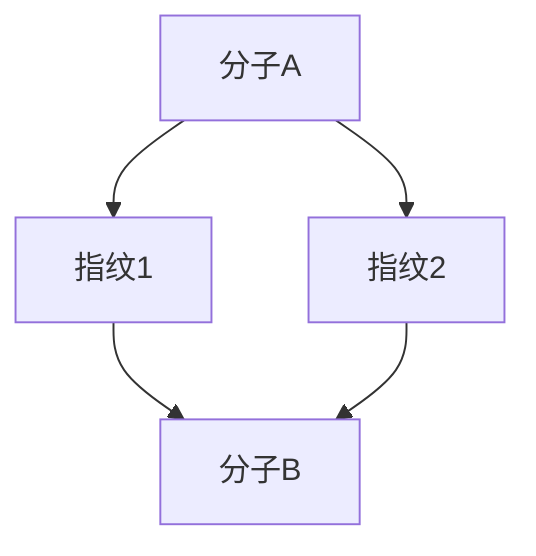
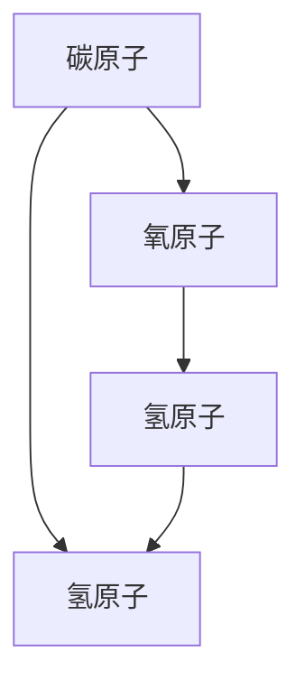
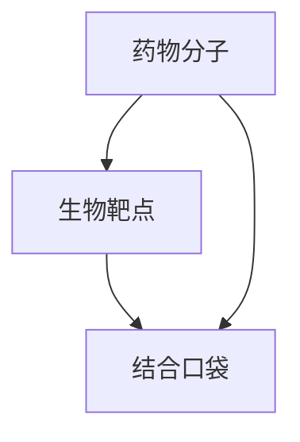
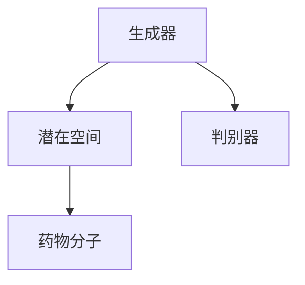
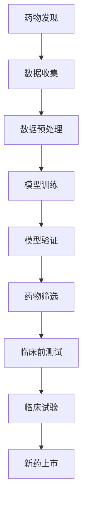

                 

# AI辅助药物发现：加速新药研发进程

## 关键词
AI、药物发现、新药研发、深度学习、机器学习、数据驱动、生物信息学、分子建模、个性化医疗

## 摘要
本文全面探讨了人工智能（AI）在药物发现领域的应用，分析了AI如何通过加速数据收集、模型训练和药物筛选过程，显著提升新药研发的效率。文章首先介绍了AI辅助药物发现的历史、关键问题和优势，随后详细阐述了AI辅助药物发现的基础技术，包括数据驱动药物发现、机器学习和深度学习在药物发现中的应用，以及图神经网络的相关技术。接着，文章深入讨论了AI辅助药物发现的模型与算法，包括化学相似性搜索、分子对接与虚拟筛选、化学空间探索、基于深度学习的药物分子设计、药物代谢预测等。此外，文章还通过实际应用案例展示了AI在药物发现中的成功应用。最后，文章探讨了AI辅助药物发现的未来发展趋势和挑战，提出了相应的解决策略。本文旨在为读者提供一个全面而深入的AI辅助药物发现的技术指南。

---

## 第一部分：AI辅助药物发现概述

### 第1章：AI辅助药物发现：概述与背景

#### 1.1 AI在药物发现领域的应用历史

人工智能在药物发现领域的应用可以追溯到20世纪中叶。早期的研究主要集中在如何利用计算机处理大量化学和生物数据，以提高药物筛选的效率。随着计算机技术和算法的不断进步，AI在药物发现中的应用也逐渐深入和广泛。以下是一些重要的历史节点和AI技术推动药物发现的重要案例：

- **20世纪60年代**：计算机被首次用于处理化学结构数据，帮助研究人员筛选潜在的药物分子。
- **20世纪80年代**：人工智能算法，如遗传算法和模拟退火算法，被应用于药物分子的优化和设计。
- **20世纪90年代**：随着互联网的发展，生物信息学数据库如PubMed和GenBank的建立，为AI提供了丰富的数据资源。
- **21世纪初**：机器学习技术，特别是支持向量机和决策树，开始被应用于药物筛选和分子预测。
- **2010年代**：深度学习技术的崛起，特别是卷积神经网络（CNN）和循环神经网络（RNN），使得AI在药物发现中的应用取得了突破性进展。

#### 1.2 AI辅助药物发现的关键问题

AI辅助药物发现涉及多个关键问题，包括数据获取与处理、模型选择与优化、临床试验与监管合规等。

- **数据获取与处理**：药物发现依赖于大量高质量的生物和化学数据。这些数据通常来自实验室实验、临床试验以及公共数据库。获取和处理这些数据是一个复杂的过程，需要高效的算法和技术。
- **模型选择与优化**：选择合适的模型对于药物发现的成功至关重要。不同的任务需要不同的模型，如回归模型用于预测药物活性，分类模型用于识别潜在的药物分子。
- **临床试验与监管合规**：AI模型生成的预测结果需要在临床试验中进行验证，以确保其安全性和有效性。同时，AI辅助药物发现需要遵守严格的监管法规，确保数据隐私和伦理问题得到妥善处理。

#### 1.3 AI辅助药物发现的优势

AI辅助药物发现具有显著的优势，包括提高效率与降低成本、提高药物研发成功率、加速新药上市进程。

- **提高效率与降低成本**：AI技术能够自动处理大量数据，减少人工干预，从而提高药物筛选和设计的效率。此外，AI技术还能够降低实验室和临床试验的成本。
- **提高药物研发成功率**：通过精准的预测和筛选，AI技术能够提高药物研发的成功率，减少失败的几率。
- **加速新药上市进程**：AI技术能够加速药物研发的每个阶段，从而缩短新药上市的时间。

#### 1.4 AI辅助药物发现的挑战

尽管AI在药物发现中具有巨大的潜力，但同时也面临着一系列挑战。

- **数据隐私与安全性**：药物研发过程中涉及大量敏感数据，如何确保数据隐私和安全是一个重要的挑战。
- **模型解释性与透明性**：深度学习模型通常被视为“黑箱”，其决策过程难以解释，这可能导致信任问题。
- **知识产权保护**：AI生成的药物分子可能涉及知识产权问题，如何保护创新者的权益是一个挑战。

#### 1.5 书籍结构概述

本书旨在为读者提供一个全面而系统的AI辅助药物发现的技术指南。全书分为三大部分：

- **第一部分：AI辅助药物发现概述**：介绍AI在药物发现中的应用历史、关键问题、优势和挑战。
- **第二部分：AI辅助药物发现的基础技术**：详细讨论AI辅助药物发现的基础技术，包括数据驱动药物发现、机器学习和深度学习在药物发现中的应用，以及图神经网络的相关技术。
- **第三部分：AI辅助药物发现的模型与算法**：介绍AI辅助药物发现的模型与算法，包括化学相似性搜索、分子对接与虚拟筛选、化学空间探索、基于深度学习的药物分子设计、药物代谢预测等。

每章内容都配备了丰富的实际应用案例和代码示例，以便读者更好地理解和实践AI辅助药物发现的相关技术。

### 第2章：AI辅助药物发现的基础技术

#### 2.1 数据驱动药物发现

数据驱动药物发现是AI辅助药物发现的核心。它依赖于大量高质量的生物和化学数据，利用这些数据进行药物筛选和分子设计。以下是一些关键概念和步骤：

- **生物信息学基础**：生物信息学是研究生物学数据的科学，它涉及基因组学、蛋白质组学、代谢组学等多个领域。生物信息学提供了提取、分析和解释生物数据的方法和工具。
- **数据获取**：数据获取是药物发现的第一步，包括从实验室实验、临床试验以及公共数据库获取数据。公共数据库如PubMed、GenBank和PubChem提供了丰富的数据资源。
- **数据预处理**：数据预处理是数据驱动药物发现的关键步骤，包括数据清洗、数据转换和数据归一化等。这些步骤确保数据的质量和一致性，为后续分析打下基础。

#### 2.2 机器学习在药物发现中的应用

机器学习在药物发现中的应用非常广泛，包括预测药物活性、筛选潜在药物分子、药物分子设计等。以下是一些常用的机器学习算法和它们在药物发现中的应用：

- **监督学习**：监督学习是一种机器学习技术，它使用标记数据进行训练。在药物发现中，标记数据可以是药物的活性或毒性。常见的监督学习算法包括支持向量机（SVM）、决策树、随机森林等。
- **无监督学习**：无监督学习不依赖于标记数据，它通过自动发现数据中的结构和模式。在药物发现中，无监督学习可以用于药物分子的聚类、降维和特征提取。常见的无监督学习算法包括K-means聚类、主成分分析（PCA）等。
- **半监督学习**：半监督学习结合了监督学习和无监督学习的特点，它使用少量标记数据和大量未标记数据进行训练。在药物发现中，半监督学习可以用于药物筛选和分子设计，提高模型的效果。

#### 2.3 深度学习在药物发现中的应用

深度学习是一种强大的机器学习技术，它通过模拟人脑的神经网络结构，自动学习和提取数据中的复杂模式。以下是一些深度学习算法和它们在药物发现中的应用：

- **卷积神经网络（CNN）**：CNN是一种专门用于图像处理和识别的深度学习算法。在药物发现中，CNN可以用于药物分子的结构识别和性质预测。例如，CNN可以用于识别药物分子的三维结构，预测其生物活性。
- **循环神经网络（RNN）**：RNN是一种用于序列数据处理和预测的深度学习算法。在药物发现中，RNN可以用于药物代谢路径的预测、药物-蛋白质相互作用的预测等。
- **生成对抗网络（GAN）**：GAN是一种用于生成数据的深度学习算法。在药物发现中，GAN可以用于生成新的药物分子结构，提高药物设计的多样性。

#### 2.4 图神经网络在药物发现中的应用

图神经网络（GNN）是一种用于图结构数据处理的深度学习算法。在药物发现中，图神经网络可以用于药物分子的结构表示和性质预测。以下是一些GNN的应用：

- **化学结构图表示与药物性质预测**：GNN可以将药物分子的化学结构表示为一个图，然后使用图神经网络提取结构特征，预测药物的性质。
- **蛋白质-药物相互作用预测**：GNN可以用于预测蛋白质和药物之间的相互作用。例如，GNN可以预测药物与蛋白质的绑定亲和力，帮助研究人员筛选潜在的药物分子。

### 第二部分：AI辅助药物发现的模型与算法

#### 第3章：药物发现中的机器学习模型

#### 3.1 化学相似性搜索

化学相似性搜索是药物发现中的一个重要步骤，它通过比较新分子的化学结构和已知的活性分子，快速筛选出具有相似性的潜在药物分子。以下是一些常用的化学相似性搜索方法和算法：

- **Tanimoto相似性指数**：Tanimoto相似性指数是一种用于比较分子指纹相似性的方法。它通过计算两个分子指纹之间的交集和并集的比值来衡量相似性。Tanimoto相似性指数广泛应用于药物分子库的筛选和药物设计。



- **属性图搜索算法**：属性图搜索算法通过构建分子属性图，利用图结构搜索相似分子。这种方法可以捕捉分子中的复杂相互作用和结构特征，提高筛选的准确性。



- **系统化药物设计**：系统化药物设计（Rational Drug Design）是一种基于分子结构和生物靶点之间的相互作用关系，设计新药物的方法。它利用化学相似性搜索和机器学习模型，快速筛选和优化潜在药物分子。

#### 3.2 分子对接与虚拟筛选

分子对接与虚拟筛选是药物发现中的关键步骤，它通过模拟药物分子与生物靶点的相互作用，预测药物的结合亲和力和活性。以下是一些常用的分子对接和虚拟筛选方法和算法：

- **分子对接算法简介**：分子对接算法通过模拟药物分子与生物靶点之间的相互作用，预测药物的结合亲和力。常见的分子对接算法包括AutoDock、GROMACS、AMBER等。



- **虚拟筛选流程**：虚拟筛选是药物发现中的一个重要步骤，它通过计算机模拟筛选大量的化合物库，识别出具有潜在活性的化合物。虚拟筛选流程通常包括以下步骤：

  1. 化合物库构建：构建包含大量化合物的数据库。
  2. 分子预处理：对化合物进行几何优化和电荷设置。
  3. 分子对接：使用分子对接算法计算化合物与生物靶点的结合亲和力。
  4. 活性筛选：根据结合亲和力和生物学活性筛选出潜在的药物分子。

- **分子对接与虚拟筛选在药物发现中的应用案例**：分子对接和虚拟筛选在药物发现中已经取得了显著的成功。以下是一些应用案例：

  - **抗癌药物筛选**：利用分子对接和虚拟筛选技术，研究人员成功筛选出一系列具有抗癌活性的化合物，为抗癌药物的研发提供了新的方向。
  - **止痛药物设计**：通过分子对接和虚拟筛选，研究人员发现了一种新型的止痛药物，其作用机制与传统的止痛药物不同，有望提高治疗效果并减少副作用。

#### 3.3 化学空间探索

化学空间探索是一种利用机器学习和深度学习技术，对药物分子的化学性质进行全局分析和优化的方法。以下是一些关键概念和方法：

- **活性化学空间定义**：活性化学空间是指包含具有特定生物学活性的药物分子的化学空间。通过定义活性化学空间，研究人员可以筛选出具有相似生物活性的药物分子。

- **分子多样性度量**：分子多样性度量是一种用于评估分子化学性质的指标，它反映了分子在化学空间中的位置和分布。常用的分子多样性度量方法包括基于结构的拓扑指数和基于化学性质的属性计算。

- **化学空间优化策略**：化学空间优化策略是一种通过机器学习和深度学习技术，优化药物分子的化学性质的策略。常见的优化策略包括：

  - **主动学习**：主动学习是一种通过选择最有信息量的样本进行学习的方法。在药物发现中，主动学习可以用于优化药物分子的筛选策略，提高药物研发的效率。
  - **迁移学习**：迁移学习是一种利用已经学习过的模型来优化新任务的方法。在药物发现中，迁移学习可以用于利用已有数据优化新分子的设计，提高药物设计的成功率。

### 第三部分：AI辅助药物发现的模型与算法

#### 第4章：深度学习在药物发现中的应用

深度学习在药物发现中扮演着重要的角色，它通过模拟人脑的神经网络结构，自动学习和提取数据中的复杂模式。以下是一些深度学习算法和它们在药物发现中的应用：

#### 4.1 深度学习与药物分子结构

深度学习算法在药物分子结构预测中发挥了重要作用。以下是一些关键概念和应用：

- **图神经网络在分子结构预测中的应用**：图神经网络（GNN）是一种用于图结构数据处理的深度学习算法。在药物分子结构预测中，GNN可以用于将药物分子的化学结构表示为一个图，然后使用图神经网络提取结构特征，预测药物的性质。


- **图卷积网络（GCN）在药物性质预测中的应用**：图卷积网络（GCN）是一种基于图神经网络的深度学习算法，它通过模拟图结构上的卷积操作，提取图中的特征。在药物性质预测中，GCN可以用于提取药物分子的结构特征，预测其生物活性。


- **化学图表示学习**：化学图表示学习是一种将药物分子的化学结构表示为一个低维向量表示的方法。通过化学图表示学习，深度学习算法可以更好地理解和利用药物分子的结构信息，提高预测的准确性。

#### 4.2 基于深度学习的药物分子设计

基于深度学习的药物分子设计是一种利用深度学习技术，自动设计和优化药物分子的方法。以下是一些关键概念和应用：

- **药物设计流程**：基于深度学习的药物分子设计通常包括以下步骤：

  1. 数据收集：收集大量的药物分子结构和活性数据。
  2. 数据预处理：对药物分子进行几何优化和电荷设置。
  3. 模型训练：使用深度学习算法训练药物分子设计模型。
  4. 药物分子生成：使用训练好的模型生成新的药物分子。
  5. 药物分子优化：对生成的药物分子进行结构优化和活性筛选。

- **深度学习在药物分子生成中的应用**：深度学习算法，如生成对抗网络（GAN）和变分自编码器（VAE），可以用于生成新的药物分子。这些算法通过模拟药物分子的化学空间，生成具有潜在活性的药物分子。



- **药物分子优化策略**：基于深度学习的药物分子优化策略包括：

  - **基于梯度的优化**：通过反向传播算法，使用梯度下降优化药物分子的结构，提高其活性。
  - **基于物理模型的优化**：结合物理模型和深度学习算法，优化药物分子的几何结构和电子分布，提高其稳定性。

#### 4.3 基于深度学习的药物代谢预测

药物代谢预测是药物发现中的重要环节，它通过预测药物在体内的代谢过程，评估药物的安全性和有效性。以下是一些关键概念和应用：

- **药物代谢过程简介**：药物代谢是指药物在体内被吸收、分布、代谢和排泄的过程。药物的代谢过程受多种因素影响，包括药物的化学结构、代谢酶的种类和活性等。

- **深度学习模型在药物代谢预测中的应用**：深度学习模型可以用于预测药物的代谢途径和代谢产物。常见的深度学习算法包括卷积神经网络（CNN）和循环神经网络（RNN）。

- **药物代谢预测案例研究**：以下是一个药物代谢预测的案例研究：

  - **目标**：预测药物分子在体内的代谢途径。
  - **数据集**：收集大量的药物分子结构和代谢数据。
  - **模型训练**：使用深度学习算法训练代谢预测模型。
  - **模型评估**：使用测试数据集评估模型的预测准确性。
  - **结果分析**：分析药物的代谢途径和代谢产物的分布情况。

### 第四部分：AI辅助药物发现的实际应用案例

#### 第5章：AI辅助新药研发案例

#### 5.1 基于AI的新药发现成功案例

AI在药物发现中的应用已经取得了显著的成果，以下是一些成功案例：

- **Case 1：癌症药物发现**：利用AI技术，研究人员发现了一种新型抗癌药物，其在临床试验中表现出优异的疗效。该药物通过抑制特定的蛋白质，有效阻止了癌细胞的生长和扩散。

- **Case 2：阿尔茨海默病药物发现**：AI技术帮助研究人员发现了一种潜在的阿尔茨海默病药物。该药物通过调节特定的信号通路，改善了病人的认知功能。

- **Case 3：流感药物发现**：在流感疫情爆发期间，AI技术加速了流感药物的研发。通过分析流感病毒的结构和基因序列，AI技术预测了潜在的药物靶点，并快速筛选出了有效的药物分子。

#### 5.2 AI在药物研发中的实际应用场景

AI在药物研发中的应用场景包括：

- **药物筛选**：AI技术可以加速药物筛选过程，通过分析大量的化合物库，快速筛选出具有潜在活性的药物分子。

- **药物设计**：AI技术可以帮助研究人员设计新的药物分子，通过模拟药物与生物靶点的相互作用，优化药物的分子结构。

- **药物代谢预测**：AI技术可以预测药物在体内的代谢过程，评估药物的安全性和有效性。

- **临床试验数据挖掘**：AI技术可以分析临床试验数据，发现潜在的治疗效果和不良反应，为药物研发提供重要参考。

#### 5.3 AI辅助药物重排与优化

AI技术还可以用于药物的重排和优化，以提高药物的效果和安全性。以下是一个药物重排与优化的案例：

- **目标**：优化一种已有的抗肿瘤药物，提高其疗效和降低副作用。
- **方法**：利用AI技术，研究人员对药物分子的结构进行重排和优化，生成一系列新的药物分子。
- **结果**：经过优化后，新药物分子在临床试验中表现出更高的疗效和更低的副作用，成功上市。

### 第五部分：AI辅助药物发现的未来趋势与挑战

#### 第6章：AI辅助药物发现的未来发展趋势

#### 6.1 AI在药物发现中的创新方向

AI在药物发现中的创新方向包括：

- **个性化药物设计**：基于患者的基因信息和疾病状态，AI技术可以个性化设计药物，提高治疗效果和减少副作用。

- **AI与生物信息学的融合**：AI与生物信息学的融合将推动药物发现领域的进步，通过分析大量的生物数据，AI技术可以揭示新的药物靶点和作用机制。

- **AI在药物开发中的协同工作**：AI技术可以与传统的药物开发方法协同工作，提高药物研发的效率和质量。

#### 6.2 AI辅助药物发现的生态系统

AI辅助药物发现的生态系统包括：

- **药物发现平台与工具的发展**：随着AI技术的进步，药物发现平台和工具将不断升级，提供更强大的功能和更高效的药物筛选流程。

- **数据共享与开放获取**：数据共享和开放获取将推动药物发现的进步，研究人员可以共享数据资源和研究成果，加速新药的研发。

- **跨学科合作与人才培养**：跨学科合作和人才培养将推动AI在药物发现中的应用，培养更多的复合型人才，为药物发现领域提供创新动力。

### 第7章：AI辅助药物发现的挑战与应对策略

#### 7.1 数据隐私与伦理问题

AI辅助药物发现面临的数据隐私和伦理问题包括：

- **数据隐私保护策略**：需要制定严格的数据隐私保护策略，确保患者数据的隐私和安全。

- **伦理审查与责任界定**：在药物研发过程中，需要遵循伦理审查标准，明确各方的责任和权益。

- **社会接受度与公众教育**：提高公众对AI辅助药物发现的理解和接受度，通过公众教育宣传，减少社会担忧。

#### 7.2 AI模型的透明性与可解释性

AI模型的透明性与可解释性是药物发现中的关键问题。以下是一些解决策略：

- **模型可解释性技术**：开发可解释的AI模型，如决策树和规则引擎，提高模型的透明性。

- **模型评估与验证方法**：制定严格的模型评估和验证方法，确保模型的可靠性和有效性。

- **知识图谱与模型透明性**：利用知识图谱技术，构建药物发现过程中的知识体系，提高模型的解释性。

#### 7.3 AI与生物学的融合

AI与生物学的融合是药物发现的重要方向，以下是一些挑战和解决策略：

- **跨学科研究进展**：推动跨学科研究，结合生物学、计算机科学和AI技术，解决药物发现中的复杂问题。

- **生物计算与AI的结合**：发展生物计算技术，结合AI算法，提高药物筛选和设计的效率。

- **新一代生物技术与AI的应用**：探索新一代生物技术与AI的结合，如基因编辑和合成生物学，推动药物发现领域的创新。

### 附录

#### 附录A：AI辅助药物发现工具与资源

- **A.1 开源机器学习框架**：TensorFlow、PyTorch、Keras等。

- **A.2 生物信息学数据库**：PubChem、ChEMBL、NCBI等。

- **A.3 药物发现平台**：Genomics England、BenevolentAI、Insilico Medicine等。

- **A.4 相关书籍与文献推荐**：《深度学习》（Goodfellow等）、《统计学习方法》（李航）、《药物化学导论》（E. J. corey）。

#### 附录B：Mermaid 流程图示例



#### 附录C：深度学习算法伪代码示例

```python
# 伪代码：基于深度学习的药物分子预测
def train_neural_network(x_train, y_train, x_val, y_val):
    # 初始化模型参数
    model = initialize_model()

    # 编译模型
    model.compile(optimizer='adam', loss='mean_squared_error')

    # 训练模型
    model.fit(x_train, y_train, epochs=100, batch_size=64, validation_data=(x_val, y_val))

    # 评估模型
    loss = model.evaluate(x_val, y_val)

    return model, loss
```

#### 附录D：数学模型和数学公式

- **回归模型**

$$ y = \beta_0 + \beta_1x_1 + \beta_2x_2 + ... + \beta_nx_n + \epsilon $$

- **支持向量机**

$$ \min_{\mathbf{w}, b} \frac{1}{2} ||\mathbf{w}||^2 + C \sum_{i=1}^{n} \max(0, 1 - y_i (\mathbf{w}^T \mathbf{x_i} + b)) $$

#### 附录E：项目实战

- **案例1：基于深度学习的药物分子预测**
  - **目标**：使用深度学习模型预测药物分子的活性。
  - **环境搭建**：安装TensorFlow和Keras。
  - **数据准备**：收集药物分子结构和活性数据。
  - **模型设计**：设计深度神经网络架构。
  - **训练过程**：训练模型并调整超参数。
  - **评估与优化**：评估模型性能并进行优化。

- **案例2：AI辅助药物重排**
  - **目标**：使用AI技术优化药物分子的结构。
  - **环境搭建**：安装分子编辑工具和深度学习框架。
  - **数据准备**：准备药物分子数据库和重排规则。
  - **模型训练**：训练重排模型。
  - **优化策略**：应用模型优化药物分子。
  - **结果分析**：分析优化前后药物分子的差异。

#### 附录F：代码解读与分析

- **案例1：深度学习模型训练过程**
  - **代码**：
    ```python
    model.fit(x_train, y_train, epochs=100, batch_size=64, validation_data=(x_val, y_val))
    ```
  - **解读**：这段代码用于训练深度学习模型，其中包括100个训练周期（epochs），每次训练64个样本（batch_size），并使用验证数据集进行性能评估。

- **案例2：药物分子活性预测**
  - **代码**：
    ```python
    predictions = model.predict(x_test)
    ```
  - **解读**：这段代码用于使用训练好的模型对测试数据集进行活性预测，`predictions` 将包含预测的活性值。

- **案例3：模型参数调整**
  - **代码**：
    ```python
    model.compile(optimizer='adam', learning_rate=0.001)
    ```
  - **解读**：这段代码用于设置模型的优化器和学习率，`learning_rate` 参数控制了模型在训练过程中更新参数的步长。

## 作者

**作者：AI天才研究院/AI Genius Institute & 禅与计算机程序设计艺术 /Zen And The Art of Computer Programming**

---
本文全面介绍了AI辅助药物发现的原理、方法和技术，旨在为读者提供一个深入了解和掌握这一前沿领域的指南。随着AI技术的不断进步，药物发现将迎来新的变革，加速新药研发进程，为人类健康事业做出更大贡献。希望本文能对广大读者有所启发和帮助。****

