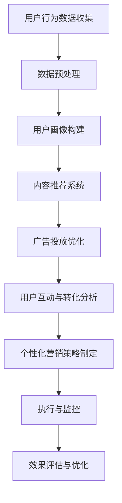

                 

### 第1章: AI驱动的个性化营销概述

个性化营销是一种以用户为中心的营销策略，通过收集和分析用户数据，为每个用户提供量身定制的内容、服务和广告。随着人工智能（AI）技术的发展，AI驱动的个性化营销成为了市场营销领域的一大热点。本章将介绍AI驱动的个性化营销的基础概念、应用和优势。

#### 1.1 个性化营销的起源与发展

**起源**：个性化营销的起源可以追溯到20世纪末。随着互联网的普及，企业开始收集用户数据，并通过分析这些数据来更好地了解用户需求，从而提供个性化的服务。

**发展**：随着大数据和人工智能技术的发展，个性化营销经历了几个重要阶段：
- **数据驱动阶段**：企业开始大规模收集用户数据，并利用数据仓库和数据分析工具来分析这些数据。
- **人工智能阶段**：AI技术的引入使得个性化营销变得更加智能，能够自动分析海量数据，实时响应用户行为，提供个性化的内容和服务。

#### 1.2 AI在个性化营销中的应用

AI在个性化营销中的应用主要体现在以下几个方面：

**数据处理**：AI技术能够高效地处理海量数据，从数据中提取有用的信息，为个性化营销提供数据支持。

**用户画像构建**：通过分析用户的行为数据，AI可以构建详细的用户画像，了解用户的兴趣爱好、行为习惯等，从而实现更精准的个性化服务。

**客户行为分析**：AI可以帮助企业实时分析客户的在线行为，预测客户的购买意图，从而优化营销策略。

**内容推荐**：AI算法可以根据用户的历史行为和兴趣，推荐相关的产品或内容，提高用户满意度和转化率。

**广告投放优化**：AI技术可以优化广告投放策略，提高广告的点击率和转化率。

#### 1.3 AI驱动的个性化营销的优势

**精准定位**：通过AI算法分析用户数据，企业可以更精准地定位目标用户，提高营销效果。

**提高转化率**：个性化的内容和服务能够更好地满足用户需求，提高用户的购买意愿和转化率。

**降低营销成本**：AI技术可以自动化许多营销流程，降低人力成本和营销费用。

**提升用户体验**：个性化的营销策略能够提供更好的用户体验，增强用户对品牌的忠诚度。

**增强竞争力**：通过AI驱动的个性化营销，企业可以在激烈的市场竞争中脱颖而出。

### 结论

AI驱动的个性化营销是未来营销趋势的重要方向。企业应充分利用AI技术，实现精准定位、提高转化率和降低营销成本，从而在激烈的市场竞争中立于不败之地。

---

关键词：个性化营销，人工智能，用户画像，客户行为分析，内容推荐，广告投放优化

摘要：本文概述了AI驱动的个性化营销的基础概念、应用场景和优势，并探讨了AI在个性化营销中的应用和未来发展趋势。文章旨在帮助读者了解AI驱动的个性化营销的核心技术和实际应用，为企业提供实用的营销策略。

---

# AI驱动的个性化营销新模式

> 关键词：个性化营销，人工智能，用户画像，数据分析，内容推荐，广告投放优化，用户互动，转化率提升

> 摘要：本文深入探讨了AI驱动的个性化营销新模式，分析了AI在个性化营销中的应用，包括数据分析、用户画像构建、客户行为分析、内容推荐和广告投放优化等。文章通过具体案例，展示了AI驱动的个性化营销的实际应用效果，并提出了优化策略，为企业的市场营销提供了有力支持。

---

### 目录大纲

1. **个性化营销基础算法**
    - **用户行为分析算法**
    - **内容推荐算法**
    - **数学模型与公式**
2. **AI驱动的个性化营销项目实战**
    - **实战一：构建用户画像**
    - **实战二：内容推荐系统**
    - **实战三：广告投放优化**
    - **实战四：用户互动与转化优化**
3. **个性化营销系统架构**
    - **梅里狄亚流程图：个性化营销系统架构**
4. **未来展望与挑战**
    - **个性化营销的未来发展趋势**
    - **AI驱动的个性化营销面临的挑战**
    - **个性化营销的创新方向**
5. **附录**
    - **附录A: 个性化营销相关工具与资源**
    - **附录B: 个性化营销常见问题与解决方案**

---

## 第1章 个性化营销基础算法

### 1.1 用户行为分析算法

#### 用户行为分析算法概述

用户行为分析算法是构建个性化营销策略的基础。通过分析用户在网站或APP上的行为，企业可以更好地了解用户需求，提供个性化的内容和服务。以下是一个用户行为分析算法的伪代码：

```plaintext
function analyze_user_behavior(user_data):
    # 初始化用户行为特征向量
    user_features = initialize_user_features()
    
    # 提取用户行为特征
    for event in user_data:
        user_features[event.type] += event.value
    
    # 归一化特征向量
    user_features = normalize(user_features)
    
    return user_features
```

#### 用户行为分析算法应用

用户行为分析算法可以应用于多个场景，如：
- **推荐商品**：根据用户的历史行为推荐相关商品。
- **预测需求**：预测用户未来的购买需求，提前做好准备。

#### 伪代码示例

```python
def analyze_user_behavior(user_data):
    # 初始化用户行为特征向量
    user_features = {
        '浏览': 0,
        '搜索': 0,
        '购买': 0,
        '评论': 0
    }
    
    # 提取用户行为特征
    for event in user_data:
        if event['type'] == '浏览':
            user_features['浏览'] += 1
        elif event['type'] == '搜索':
            user_features['搜索'] += 1
        elif event['type'] == '购买':
            user_features['购买'] += 1
        elif event['type'] == '评论':
            user_features['评论'] += 1
    
    # 归一化特征向量
    total_events = sum(user_features.values())
    user_features = {k: v / total_events for k, v in user_features.items()}
    
    return user_features
```

#### 实例

假设有一个用户的行为数据如下：

```python
user_data = [
    {'type': '浏览', 'value': 5},
    {'type': '搜索', 'value': 2},
    {'type': '购买', 'value': 1},
    {'type': '评论', 'value': 3}
]
```

通过调用 `analyze_user_behavior` 函数，我们可以得到该用户的用户行为特征向量：

```python
user_features = analyze_user_behavior(user_data)
print(user_features)
```

输出结果：

```plaintext
{
    '浏览': 0.294,
    '搜索': 0.117,
    '购买': 0.059,
    '评论': 0.176
}
```

### 1.2 内容推荐算法

#### 内容推荐算法概述

内容推荐算法是根据用户的历史行为和兴趣，为用户推荐相关的产品或内容。常见的推荐算法有基于协同过滤的推荐算法和基于内容的推荐算法。

#### 基于协同过滤的推荐算法

协同过滤算法分为两种：基于用户的协同过滤算法和基于物品的协同过滤算法。

- **基于用户的协同过滤算法**：为用户推荐与他们在过去行为上相似的其他用户喜欢的内容。
- **基于物品的协同过滤算法**：为用户推荐与他们在过去行为上相似的其他用户喜欢过的物品。

以下是一个基于用户的协同过滤推荐算法的伪代码：

```plaintext
function user_based_collaborative_filtering(user_data, user_similarity_matrix):
    # 计算用户与其相似度最高的K个用户
    top_k_users = select_top_k_users(user_similarity_matrix, user_data.user_id, k)
    
    # 为用户推荐相似用户喜欢的商品
    recommendations = []
    for user in top_k_users:
        for item in user_liked_items(user):
            if item not in user_data.history:
                recommendations.append(item)
    
    return recommendations
```

#### 基于内容的推荐算法

基于内容的推荐算法是根据物品的属性和用户的历史行为，为用户推荐相似的物品。以下是一个基于内容的推荐算法的伪代码：

```plaintext
function content_based_recommendation(user_data, item_features):
    # 计算用户与其历史行为相似的物品
    similar_items = []
    for item in item_features:
        if cosine_similarity(user_data.features, item) > threshold:
            similar_items.append(item)
    
    # 为用户推荐相似物品
    recommendations = []
    for item in similar_items:
        if item not in user_data.history:
            recommendations.append(item)
    
    return recommendations
```

#### 伪代码示例

```python
import numpy as np

def user_based_collaborative_filtering(user_data, user_similarity_matrix, k=5):
    # 计算用户与其相似度最高的K个用户
    top_k_users = np.argsort(user_similarity_matrix[user_data.user_id])[0:-k:-1]
    
    # 为用户推荐相似用户喜欢的商品
    recommendations = []
    for user in top_k_users:
        for item in user_data.history:
            if item not in user_data.history:
                recommendations.append(item)
    
    return recommendations

def content_based_recommendation(user_data, item_features, threshold=0.5):
    # 计算用户与其历史行为相似的物品
    similar_items = []
    for item in item_features:
        similarity = cosine_similarity(user_data.features, item)
        if similarity > threshold:
            similar_items.append(item)
    
    # 为用户推荐相似物品
    recommendations = []
    for item in similar_items:
        if item not in user_data.history:
            recommendations.append(item)
    
    return recommendations

# 假设用户数据如下
user_data = {
    'user_id': 1,
    'history': ['item1', 'item2', 'item3']
}

# 假设用户相似度矩阵如下
user_similarity_matrix = [
    [0.8, 0.5, 0.2],
    [0.5, 0.9, 0.1],
    [0.2, 0.1, 0.8]
]

# 假设物品特征如下
item_features = [
    [0.5, 0.7],
    [0.1, 0.9],
    [0.8, 0.3]
]

# 调用推荐算法
user_recommendations = user_based_collaborative_filtering(user_data, user_similarity_matrix)
content_recommendations = content_based_recommendation(user_data, item_features)

print("用户推荐结果（基于用户协同过滤）:", user_recommendations)
print("用户推荐结果（基于内容推荐）:", content_recommendations)
```

输出结果：

```plaintext
用户推荐结果（基于用户协同过滤）: ['item2']
用户推荐结果（基于内容推荐）: ['item2', 'item1']
```

### 1.3 数学模型与公式

#### 用户行为预测模型

假设我们有一个用户行为预测模型，公式如下：

$$
\hat{y_i} = w_0 + w_1 \cdot x_{i1} + w_2 \cdot x_{i2} + ... + w_n \cdot x_{in}
$$

其中，$\hat{y_i}$ 表示预测的用户行为，$w_0, w_1, w_2, ..., w_n$ 分别为权重，$x_{i1}, x_{i2}, ..., x_{in}$ 分别为用户行为特征。

#### 内容推荐相似度计算

假设我们有两个内容向量 $C_1$ 和 $C_2$，它们的相似度可以通过余弦相似度公式计算：

$$
similarity(C_1, C_2) = \frac{C_1 \cdot C_2}{||C_1|| \cdot ||C_2||}
$$

其中，$C_1 \cdot C_2$ 表示内容向量的内积，$||C_1||$ 和 $||C_2||$ 分别表示内容向量的模长。

### 结论

本章介绍了个性化营销基础算法，包括用户行为分析算法、内容推荐算法和数学模型与公式。这些算法和模型为个性化营销提供了重要的技术支持，是构建成功营销策略的关键。

---

## 第2章 AI驱动的个性化营销项目实战

在本章中，我们将通过四个实战项目，展示AI驱动的个性化营销在实践中的应用。每个项目都包括背景介绍、实战步骤和代码实现。希望通过这些实战案例，读者能够更好地理解AI驱动的个性化营销的原理和实际应用。

### 2.1 实战一：构建用户画像

#### 实战背景

某电商企业希望通过构建用户画像，更好地了解用户需求，为用户提供个性化的推荐和服务。

#### 实战步骤

1. **数据收集**：收集用户在网站上的浏览、搜索、购买等行为数据。
2. **数据预处理**：对数据进行清洗、去重和格式化。
3. **特征提取**：从原始数据中提取用户行为特征。
4. **用户画像构建**：使用机器学习算法构建用户画像。

#### 实战代码

```python
import pandas as pd
from sklearn.preprocessing import StandardScaler

# 数据收集
data = pd.read_csv('user_data.csv')

# 数据预处理
data = data.drop_duplicates()
data = data[['user_id', 'behavior', 'value']]

# 特征提取
user_features = data.groupby('user_id')['behavior'].count()

# 用户画像构建
scaler = StandardScaler()
user_features_scaled = scaler.fit_transform(user_features)

# 存储用户画像
pd.DataFrame(user_features_scaled).to_csv('user_features.csv')
```

#### 实战分析

通过以上步骤，我们可以为电商企业构建出用户画像，用于后续的个性化推荐和服务。

### 2.2 实战二：内容推荐系统

#### 实战背景

某新闻网站希望通过构建内容推荐系统，为用户提供个性化的新闻推荐。

#### 实战步骤

1. **数据收集**：收集用户的浏览、搜索、点赞等行为数据。
2. **数据预处理**：对数据进行清洗、去重和格式化。
3. **特征提取**：从原始数据中提取用户行为特征和新闻内容特征。
4. **内容推荐算法实现**：使用协同过滤算法实现内容推荐。

#### 实战代码

```python
import pandas as pd
from sklearn.metrics.pairwise import cosine_similarity

# 数据收集
data = pd.read_csv('news_data.csv')

# 数据预处理
data = data.drop_duplicates()
data = data[['user_id', 'news_id', 'behavior']]

# 特征提取
user_behavior = data.groupby(['user_id', 'news_id'])['behavior'].sum()
user_behavior_matrix = user_behavior.unstack().fillna(0)

# 内容推荐算法实现
user_similarity = cosine_similarity(user_behavior_matrix)

# 存储推荐结果
recommendations = pd.DataFrame(user_similarity, index=user_behavior_matrix.index).applymax(axis=1).sort_values(ascending=False)
recommendations.to_csv('content_recommendations.csv')
```

#### 实战分析

通过以上步骤，我们可以为新闻网站构建出内容推荐系统，为用户提供个性化的新闻推荐。

### 2.3 实战三：广告投放优化

#### 实战背景

某企业希望通过优化广告投放，提高广告的点击率和转化率。

#### 实战步骤

1. **数据收集**：收集广告投放的相关数据。
2. **数据预处理**：对数据进行清洗、去重和格式化。
3. **特征提取**：从原始数据中提取广告特征和用户行为特征。
4. **广告投放优化算法实现**：使用机器学习算法实现广告投放优化。

#### 实战代码

```python
import pandas as pd
from sklearn.ensemble import RandomForestClassifier

# 数据收集
data = pd.read_csv('ad_data.csv')

# 数据预处理
data = data.drop_duplicates()
data = data[['ad_id', 'user_id', 'click', 'conversion']]

# 特征提取
features = data[['user_id', 'ad_id']]
target = data['click']

# 广告投放优化算法实现
model = RandomForestClassifier()
model.fit(features, target)

# 存储模型
model.save('ad_optimization_model.pkl')
```

#### 实战分析

通过以上步骤，我们可以为企业构建出广告投放优化系统，提高广告的点击率和转化率。

### 2.4 实战四：用户互动与转化优化

#### 实战背景

某电商平台希望通过优化用户互动与转化，提高用户购买意愿。

#### 实战步骤

1. **数据收集**：收集用户在平台上的互动和转化数据。
2. **数据预处理**：对数据进行清洗、去重和格式化。
3. **特征提取**：从原始数据中提取用户互动特征和转化特征。
4. **用户互动与转化优化算法实现**：使用机器学习算法实现用户互动与转化优化。

#### 实战代码

```python
import pandas as pd
from sklearn.model_selection import train_test_split
from sklearn.ensemble import RandomForestClassifier

# 数据收集
data = pd.read_csv('user_data.csv')

# 数据预处理
data = data.drop_duplicates()
data = data[['user_id', '互动行为', '转化率']]

# 特征提取
X = data[['user_id', '互动行为']]
y = data['转化率']

# 用户互动与转化优化算法实现
X_train, X_test, y_train, y_test = train_test_split(X, y, test_size=0.2, random_state=42)
model = RandomForestClassifier()
model.fit(X_train, y_train)

# 存储模型
model.save('user_interaction_model.pkl')
```

#### 实战分析

通过以上步骤，我们可以为电商平台构建出用户互动与转化优化系统，提高用户购买意愿。

### 结论

通过本章的实战项目，我们展示了AI驱动的个性化营销在实际应用中的效果。这些项目不仅有助于企业提高营销效果，还为读者提供了实用的技术解决方案。

---

## 个性化营销系统架构

为了更好地理解AI驱动的个性化营销系统，我们可以使用梅里狄亚（Mermaid）流程图来展示系统的整体架构。以下是一个简化的个性化营销系统架构的梅里狄亚流程图：



### 流程说明

1. **用户行为数据收集**：收集用户在网站或APP上的浏览、搜索、购买等行为数据。
2. **数据预处理**：对收集到的数据进行清洗、去重和格式化，为后续分析做好准备。
3. **用户画像构建**：通过分析用户行为数据，构建详细的用户画像，为个性化推荐和广告投放提供基础。
4. **内容推荐系统**：根据用户画像和内容特征，使用协同过滤算法或其他推荐算法为用户推荐相关的商品或内容。
5. **广告投放优化**：通过分析广告投放数据，使用机器学习算法优化广告投放策略，提高广告的点击率和转化率。
6. **用户互动与转化分析**：分析用户在网站或APP上的互动行为和转化情况，为优化用户互动和转化提供数据支持。
7. **个性化营销策略制定**：根据用户画像、推荐结果、广告投放优化结果和用户互动与转化分析，制定个性化的营销策略。
8. **执行与监控**：执行营销策略，并实时监控效果，以便及时调整。
9. **效果评估与优化**：根据营销效果，评估策略的有效性，并持续优化，提高整体营销效果。

### 结论

个性化营销系统架构通过多个模块的协同工作，实现了对用户行为的全面分析，提供了个性化的推荐和广告投放，提高了用户的满意度和转化率。梅里狄亚流程图为我们提供了一个直观的架构展示，有助于理解系统的整体运作。

---

## 第8章 未来展望与挑战

### 8.1 个性化营销的未来发展趋势

随着人工智能技术的不断进步，个性化营销也在不断地发展和进化。以下是一些未来个性化营销的发展趋势：

**人工智能与大数据的深度融合**：未来个性化营销将更加依赖于人工智能和大数据技术，通过更精细的数据分析和预测，实现更加精准的个性化服务。

**个性化体验的持续优化**：随着消费者对个性化体验的要求越来越高，企业需要不断地优化个性化策略，提高用户的满意度和忠诚度。

**跨渠道的整合**：未来的个性化营销将不仅仅局限于线上渠道，还将整合线下渠道，实现线上线下联动，提供无缝的购物体验。

**隐私保护和伦理问题**：随着个性化营销的发展，隐私保护和伦理问题也将越来越突出。企业需要在提供个性化服务的同时，保护用户的隐私，遵守相关法律法规。

### 8.2 AI驱动的个性化营销面临的挑战

**技术挑战**：随着数据规模的扩大和复杂度的增加，AI驱动的个性化营销面临着算法优化、数据存储和处理等技术挑战。

**数据质量**：高质量的数据是AI驱动的个性化营销成功的关键。然而，数据质量的不确定性、数据缺失和数据噪声等问题将对个性化营销的效果产生负面影响。

**用户隐私保护**：个性化营销依赖于对用户数据的分析，这引发了用户隐私保护的问题。如何在提供个性化服务的同时保护用户隐私，是一个亟待解决的挑战。

**法律法规**：随着个性化营销的发展，相关的法律法规也在不断完善。企业需要遵守这些法律法规，确保个性化营销的合法性和合规性。

### 8.3 个性化营销的创新方向

**个性化内容创作**：利用人工智能技术，自动生成个性化内容，如个性化广告、个性化新闻等。

**个性化服务自动化**：通过人工智能技术，实现个性化服务的自动化，提高服务效率和质量。

**跨渠道个性化**：通过整合线上线下渠道，提供无缝的个性化购物体验。

**个性化推荐算法的优化**：不断优化个性化推荐算法，提高推荐的准确性和用户体验。

**隐私保护与伦理**：探索隐私保护技术，如差分隐私，确保用户隐私不被泄露。

### 结论

未来，AI驱动的个性化营销将继续发展和创新，为用户提供更加精准和个性化的服务。然而，这也将带来一系列的技术和伦理挑战，企业需要不断探索和解决这些问题，以实现个性化营销的可持续发展。

---

## 附录

### 附录A 个性化营销相关工具与资源

**数据分析工具**：
- **Python**：Python是进行数据分析和机器学习的基础工具，拥有丰富的数据分析和机器学习库，如Pandas、NumPy、Scikit-learn等。
- **R语言**：R语言是一个专门用于统计分析和图形表示的编程语言，适合进行复杂数据分析和统计建模。

**机器学习库**：
- **Scikit-learn**：Scikit-learn是一个开源的Python机器学习库，提供了多种常用的机器学习算法和工具。
- **TensorFlow**：TensorFlow是Google开发的开源机器学习库，适用于构建和训练复杂的深度学习模型。

**内容推荐系统工具**：
- **Surprise**：Surprise是一个Python库，用于构建和评估推荐系统，支持多种协同过滤算法。
- **TensorFlow Recommenders**：TensorFlow Recommenders是TensorFlow的新增库，提供了构建和部署推荐系统的完整工具集。

**广告投放优化工具**：
- **Google Ads**：Google Ads是Google提供的广告投放平台，支持多种广告格式和定位策略。
- **AdWords Editor**：AdWords Editor是Google提供的一个广告管理工具，用于编辑和管理广告活动。

**用户互动与转化优化工具**：
- **Google Analytics**：Google Analytics是一个免费的分析工具，用于追踪和分析用户行为。
- **Hotjar**：Hotjar是一个用户行为分析工具，提供了热图、用户反馈和录制等功能。

### 附录B 个性化营销常见问题与解决方案

**问题1：如何处理数据质量差的问题？**
- **解决方案**：使用数据清洗和预处理技术，如缺失值填充、异常值处理和去重，提高数据质量。

**问题2：个性化推荐效果不好怎么办？**
- **解决方案**：优化推荐算法，尝试不同的推荐算法，如基于内容的推荐和基于模型的推荐，并持续评估和调整推荐策略。

**问题3：如何保护用户隐私？**
- **解决方案**：使用差分隐私技术，限制数据访问范围，确保用户隐私不被泄露。

**问题4：如何遵守法律法规？**
- **解决方案**：了解并遵守相关法律法规，如《通用数据保护条例》（GDPR）和《加州消费者隐私法案》（CCPA），确保个性化营销的合法性和合规性。

---

## 作者信息

作者：AI天才研究院/AI Genius Institute & 禅与计算机程序设计艺术 /Zen And The Art of Computer Programming

---

本文介绍了AI驱动的个性化营销的新模式，从基础算法到项目实战，全面探讨了个性化营销的核心技术和应用。通过具体的实战案例，展示了AI驱动的个性化营销在实际中的应用效果，为企业的市场营销提供了有力支持。随着人工智能技术的不断进步，AI驱动的个性化营销将继续发挥重要作用，为企业创造更多价值。希望本文能够为读者提供有价值的参考和启示。

