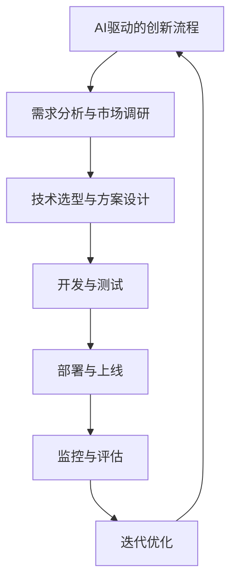

                 

### 《AI驱动的创新：人类计算在商业中的道德考虑因素与应用前景趋势分析预测》引言与背景

> **关键词**：人工智能、商业创新、道德考量、应用前景、趋势分析、预测

在当今数字化时代，人工智能（AI）已经成为推动商业创新的核心驱动力。AI技术的迅猛发展，不仅改变了传统产业的运营模式，也催生了大量新兴行业。然而，随着AI在商业领域的广泛应用，其带来的道德考量因素也日益凸显。本文将深入探讨AI驱动的创新在商业中的应用，以及人类计算在这个过程中所扮演的角色和面临的道德挑战。

#### **1.1 AI的定义与历史**

人工智能，简称AI，是计算机科学的一个分支，旨在使机器具备人类智能的一些能力。从20世纪50年代起，AI的发展经历了多个阶段。早期的AI研究主要集中在问题解决、推理和学习等基本功能上。随着计算能力的提升和算法的进步，AI逐渐从理论走向应用，并在20世纪80年代迎来了第一次商业浪潮。

目前，AI技术已经广泛应用于自然语言处理、计算机视觉、机器学习、深度学习等领域。这些技术不仅提高了商业运作的效率，还创造了许多全新的商业模式。

#### **1.2 创新的概念与重要性**

创新指的是通过引入新的想法、产品或服务，从而改进现有流程或创造新的市场。在商业环境中，创新是推动企业发展和竞争力的关键因素。它不仅帮助企业应对市场变化，还能开辟新的商机，提升客户体验。

创新的本质是解决问题，满足需求。在商业创新中，成功的关键在于找到能够满足市场需求的创新点，并有效地将其转化为商业价值。随着AI技术的发展，创新的方式和途径也在不断拓展。

#### **1.3 AI驱动的创新：理念与实践**

AI驱动的创新是指利用人工智能技术来推动创新过程，从而加速新产品、新服务和新商业模式的开发。这种创新的核心理念是通过数据驱动和算法优化，实现更高效率、更低成本和更智能的决策。

在实践中，AI驱动的创新通常包括以下几个步骤：

1. **数据收集与分析**：通过收集大量数据，并对这些数据进行深入分析，挖掘潜在的商业机会和需求。
2. **算法设计与应用**：设计并应用合适的算法，利用数据训练模型，使其能够自动识别模式、预测趋势和优化决策。
3. **产品开发与迭代**：基于AI算法的预测和优化结果，开发新产品或服务，并进行迭代优化。
4. **市场推广与反馈**：将创新产品或服务推向市场，收集用户反馈，不断调整和优化。

AI驱动的创新不仅能够提高商业运作的效率，还能为企业带来新的商业模式和竞争优势。

### **2.1 道德在商业中的重要性**

道德在商业活动中起着至关重要的作用。它不仅是企业行为的基础，也是企业赢得社会信任和尊重的关键。在商业环境中，道德考量涉及多个方面，包括诚信、透明度、社会责任和公平竞争等。

一个企业在商业活动中遵循道德原则，不仅有助于建立良好的企业形象，还能提高客户和员工的忠诚度，从而实现长期可持续发展。随着AI技术的发展，道德考量变得更加复杂和重要。

#### **2.2 道德原则与伦理框架**

道德原则是商业道德的基础，它们提供了企业在商业活动中应当遵循的基本准则。常见的道德原则包括：

1. **诚信**：企业应当诚实守信，遵守承诺，不欺骗消费者和合作伙伴。
2. **透明度**：企业应当公开透明地运作，对利益相关者负责，确保信息的透明和可追溯。
3. **社会责任**：企业应当关注社会和环境问题，积极履行社会责任，促进可持续发展。
4. **公平竞争**：企业应当遵守竞争规则，不采取不正当手段获取竞争优势。

伦理框架是指导企业道德行为的具体规范和标准。常见的伦理框架包括：

1. **商业伦理准则**：为企业提供具体的道德规范和行为指南。
2. **社会责任报告**：企业公开披露其社会责任履行情况，接受社会监督。
3. **法律法规**：遵守相关法律法规，确保商业活动的合法性。

#### **2.3 AI系统中的道德问题与挑战**

随着AI技术在商业领域的广泛应用，AI系统中的道德问题也日益突出。这些问题包括：

1. **数据隐私与安全**：AI系统通常需要大量数据来训练模型，这些数据可能包含敏感信息。如何保护用户数据隐私和安全成为重要问题。
2. **算法偏见**：AI算法在训练过程中可能会受到训练数据的影响，导致算法存在偏见。这些偏见可能导致不公平的结果，加剧社会不平等。
3. **责任归属**：当AI系统发生错误或造成损害时，如何确定责任归属是一个复杂的问题。传统的法律责任框架在应对AI系统时显得不够灵活。
4. **透明度与解释性**：AI系统通常被认为是“黑箱”，其决策过程不透明，难以解释。如何提高AI系统的透明度和解释性，让用户理解并信任AI系统，是一个挑战。

为了解决这些道德问题，企业和监管机构需要共同努力，制定相关政策和标准，确保AI技术的健康发展。

### **3.1 人类计算的定义与特征**

人类计算是指通过人类智慧进行思考、推理、分析和创造的过程。它与人工智能有显著的区别，主要体现在以下几个方面：

1. **灵活性**：人类计算具有高度的灵活性，能够处理复杂、不确定的问题，并能够根据新的信息进行调整。
2. **创造力**：人类计算具有非凡的创造力，能够产生全新的想法和解决方案。
3. **情感与直觉**：人类计算能够理解情感，并利用直觉进行决策，这是当前人工智能难以达到的。

#### **3.2 人类计算的优势与局限性**

人类计算的优势在于其独特的思维方式和创造力，能够处理复杂、不确定和模糊的问题。然而，人类计算也存在一些局限性：

1. **效率与速度**：人类计算在处理大规模数据或进行复杂计算时，往往不如计算机高效。
2. **一致性**：人类计算容易受到情绪、疲劳和主观偏见的影响，可能导致结果不一致。
3. **知识局限**：人类计算依赖于人类的知识和经验，而人类的经验和知识是有限的。

#### **3.3 人类计算在AI驱动的创新中的应用**

在AI驱动的创新过程中，人类计算发挥着关键作用。以下是一些人类计算在AI驱动的创新中的应用场景：

1. **创意设计与创新**：人类能够提出新颖的创意和设计方案，为AI算法提供训练数据，指导算法优化。
2. **决策与优化**：人类利用自己的直觉和经验，对AI算法的预测结果进行评估和调整，提高决策的准确性和可靠性。
3. **用户交互与反馈**：人类通过与用户的互动，收集用户反馈，帮助AI系统不断改进，提升用户体验。

通过将人类计算与人工智能相结合，可以充分发挥两者的优势，实现更加高效、智能和创新的结果。

### **4.1 AI在各行业中的应用场景**

人工智能（AI）技术已经深刻地改变了各行业的运营方式，从医疗、金融到制造业，AI都展现出了巨大的潜力。以下是AI在各行业中的典型应用场景：

#### **医疗**

在医疗领域，AI技术主要用于辅助诊断、个性化治疗和药物研发。例如，通过分析大量的医学影像数据，AI系统可以帮助医生更准确地诊断疾病。同时，AI还可以根据患者的基因信息和病史，提供个性化的治疗方案。

#### **金融**

在金融行业，AI技术主要用于风险管理、欺诈检测和投资决策。AI算法可以分析大量历史数据，预测市场走势，帮助投资者做出更明智的决策。此外，AI系统还可以实时监控交易行为，识别潜在的欺诈行为。

#### **制造业**

在制造业中，AI技术主要用于生产线优化、质量控制和供应链管理。通过使用AI算法，企业可以优化生产流程，提高生产效率。同时，AI系统还可以实时监控产品质量，及时发现和解决问题，确保产品质量的稳定性。

#### **零售**

在零售行业，AI技术主要用于个性化推荐、库存管理和客户关系管理。通过分析消费者的购物行为和偏好，AI系统可以提供个性化的推荐，提高客户的购买意愿。同时，AI还可以实时监控库存水平，优化库存管理，减少库存积压。

#### **交通与物流**

在交通和物流领域，AI技术主要用于自动驾驶、智能交通管理和物流优化。通过使用AI算法，车辆可以实现自动驾驶，提高交通安全和效率。同时，AI还可以优化交通流量，减少拥堵，提高道路通行效率。在物流领域，AI系统可以实时跟踪货物位置，优化运输路线，提高物流效率。

#### **农业**

在农业领域，AI技术主要用于精准农业、病虫害检测和作物产量预测。通过使用AI算法，农民可以实时监控作物生长状况，优化灌溉和施肥计划，提高作物产量。同时，AI系统还可以检测病虫害，提供针对性的防治措施。

#### **能源**

在能源领域，AI技术主要用于能源管理、智能电网和可再生能源优化。通过使用AI算法，企业可以实时监控能源消耗，优化能源管理策略，提高能源利用效率。同时，AI还可以优化可再生能源的发电和储能，实现能源的高效利用。

#### **教育**

在教育领域，AI技术主要用于个性化教学、学习分析和教育评估。通过分析学生的学习数据，AI系统可以提供个性化的教学建议，帮助学生更好地掌握知识。同时，AI还可以实时评估学生的学习进度和效果，提供针对性的反馈。

#### **4.2 AI驱动的创新案例研究**

为了更直观地了解AI驱动的创新如何在不同行业中应用，以下是一些典型的AI驱动的创新案例：

#### **智能医疗**

在医疗领域，AI驱动的创新取得了显著成果。例如，IBM的Watson for Oncology系统能够分析大量医学文献和病例数据，为医生提供个性化的治疗方案。此外，Google的AI系统可以通过分析医学影像数据，帮助医生更准确地诊断疾病，提高了诊断的准确性和效率。

#### **智慧城市**

智慧城市是AI驱动的创新在城市化进程中的重要应用。例如，中国深圳的智慧城市建设中，通过使用AI技术，实现了交通流量监控、环境监测和公共安全等方面的智能化管理。AI算法可以实时分析交通数据，优化交通信号灯的配时，减少交通拥堵。同时，AI系统还可以监测空气质量，提供实时的环境监测数据，帮助政府部门及时采取环境治理措施。

#### **智能制造**

在智能制造领域，AI驱动的创新正在推动生产线的自动化和智能化。例如，德国的工业4.0计划中，通过使用AI技术和物联网，实现了生产线的智能化改造。AI算法可以实时监控生产过程中的各种参数，优化生产流程，提高生产效率。同时，AI还可以对设备进行预测性维护，减少设备故障，延长设备寿命。

#### **金融服务**

在金融服务领域，AI驱动的创新正在改变银行和金融机构的运营方式。例如，美国的银行正在使用AI技术进行欺诈检测和风险控制。AI算法可以实时分析客户的交易数据，识别潜在的欺诈行为，提高风险控制能力。此外，AI还可以用于投资决策，通过分析市场数据，预测市场走势，提高投资收益。

#### **零售**

在零售行业，AI驱动的创新正在改变消费者的购物体验。例如，亚马逊的个性化推荐系统通过分析消费者的购物历史和偏好，提供个性化的商品推荐，提高了客户的购买意愿。此外，AI算法还可以实时监控库存水平，优化库存管理，减少库存积压，提高运营效率。

#### **4.3 AI应用的未来趋势与挑战**

随着AI技术的不断发展和成熟，AI应用的未来前景将更加广阔。以下是AI应用在未来可能面临的一些趋势和挑战：

#### **趋势**

1. **更加智能的自动化**：随着AI技术的发展，自动化系统将变得更加智能，能够进行复杂的决策和任务执行。这将极大地提高生产效率和运营效率。
2. **个性化服务**：AI技术将能够更好地理解用户需求，提供个性化的服务和体验。无论是在医疗、金融还是零售行业，个性化服务将成为企业的重要竞争优势。
3. **跨行业融合**：AI技术将与其他行业技术（如物联网、区块链等）相结合，推动跨行业的创新和应用。这将带来更多的商业机会和业务模式创新。

#### **挑战**

1. **数据隐私和安全**：随着AI系统对数据的依赖性增加，数据隐私和安全问题将变得更加突出。如何保护用户数据隐私和安全，防止数据泄露和滥用，是一个重要的挑战。
2. **算法偏见和公平性**：AI算法的偏见可能导致不公平的结果，加剧社会不平等。如何消除算法偏见，确保算法的公平性和透明度，是一个重要的问题。
3. **伦理和责任归属**：当AI系统发生错误或造成损害时，如何确定责任归属是一个复杂的问题。传统的法律责任框架在应对AI系统时显得不够灵活，需要新的伦理和法律框架来应对。
4. **技能差距和就业问题**：随着AI技术的发展，对技术人才的需求将大幅增加。然而，当前的技能培训和教育体系可能无法满足这一需求，导致技能差距和就业问题。

### **5.1 创新方法论概述**

创新方法论是指导创新过程的一系列原则、方法和工具。它旨在通过系统化的方法，实现创新目标的实现。以下是几种常见的创新方法论：

#### **设计思维**

设计思维是一种以用户为中心的创新方法论，强调通过同理心、原型设计和迭代改进，解决复杂问题。设计思维包括以下几个步骤：

1. **同理心**：深入了解用户的需求和痛点，建立对用户的理解和共鸣。
2. **定义问题**：明确需要解决的问题，确保问题定义的准确性和可行性。
3. **创意生成**：通过头脑风暴和创意生成技巧，提出多种可能的解决方案。
4. **原型设计**：快速构建原型，测试和验证解决方案的有效性。
5. **迭代改进**：根据用户反馈和测试结果，不断改进原型，优化解决方案。

#### **精益创业**

精益创业是一种基于验证的学习循环，旨在通过快速迭代和用户反馈，最小化创业风险。精益创业包括以下几个步骤：

1. **市场验证**：通过市场调研和用户访谈，验证市场需求和商业模式的可行性。
2. **最小可行产品（MVP）**：开发一个最小可行产品，验证核心价值和用户需求。
3. **迭代开发**：基于用户反馈，不断改进产品，优化用户体验。
4. **业务模式探索**：通过不断的迭代和实验，找到可持续的商业模式。

#### **技术驱动创新**

技术驱动创新是一种以技术为核心的创新方法，强调通过技术创新，推动产品和服务的创新。技术驱动创新包括以下几个步骤：

1. **技术趋势分析**：分析最新的技术趋势和潜在的应用场景。
2. **技术探索**：研究新技术，探索其在业务中的应用可能性。
3. **技术验证**：通过实验和原型验证，评估技术的可行性和效果。
4. **技术整合**：将新技术整合到现有产品和服务中，实现技术创新。

### **5.2 设计思维在AI驱动的创新中的应用**

设计思维在AI驱动的创新中发挥着关键作用，它能够帮助团队更好地理解用户需求，优化解决方案，提高创新的成功率。以下是设计思维在AI驱动的创新中的应用步骤：

1. **同理心**：通过访谈、观察和用户研究，深入了解用户的需求和痛点，建立对用户的深刻理解。这一步骤对于识别AI驱动的创新机会至关重要。
2. **定义问题**：将用户的需求转化为具体的问题，确保问题定义的准确性和可行性。这一步骤有助于明确创新的方向和目标。
3. **创意生成**：通过头脑风暴和创意生成技巧，提出多种可能的解决方案。在这一步骤中，鼓励团队成员发挥创造力，提出新颖的创意。
4. **原型设计**：快速构建原型，测试和验证解决方案的有效性。AI驱动的原型设计可以包括算法模型、用户界面和交互流程等多个方面。
5. **迭代改进**：根据用户反馈和测试结果，不断改进原型，优化解决方案。迭代改进是一个持续的过程，有助于逐步完善创新产品。
6. **用户反馈**：通过用户测试和反馈，收集用户对创新产品的意见和建议。用户反馈是优化创新产品的重要依据。
7. **商业化探索**：基于用户反馈和原型测试结果，探索商业化路径，制定商业计划。商业化探索有助于确保创新产品的市场可行性。

通过设计思维的应用，团队可以更好地理解用户需求，优化解决方案，提高AI驱动的创新成功率。

### **5.3 AI驱动的创新流程与工具**

AI驱动的创新流程是一个系统化的过程，它涉及多个步骤和工具，从问题定义到原型设计，再到迭代优化和商业化探索。以下是AI驱动的创新流程及其关键步骤和常用工具：

#### **1. 问题定义**

问题定义是AI驱动的创新的第一步，它旨在明确创新的目标和解决的问题。常用的工具包括：

- **用户访谈**：通过与目标用户进行深度访谈，了解他们的需求和痛点。
- **问卷调查**：通过设计问卷，收集大量用户反馈，分析用户需求。
- **用户研究**：通过观察和记录用户行为，深入了解用户需求和场景。

#### **2. 数据收集与处理**

数据是AI驱动的创新的基础，数据的收集和处理至关重要。常用的工具包括：

- **数据挖掘**：使用数据挖掘技术，从大量数据中提取有价值的信息。
- **数据清洗**：对原始数据进行清洗和预处理，确保数据的质量和准确性。
- **数据仓库**：建立数据仓库，存储和管理大量数据，方便后续分析和挖掘。

#### **3. 算法设计与模型训练**

算法设计和模型训练是AI驱动的创新的核心环节，它决定了AI系统的性能和效果。常用的工具包括：

- **机器学习框架**：如TensorFlow、PyTorch等，用于设计和训练机器学习模型。
- **算法库**：如scikit-learn、NumPy等，提供丰富的算法和工具，方便算法设计和模型训练。
- **模型评估**：使用指标（如准确率、召回率等）评估模型的性能，优化模型参数。

#### **4. 原型设计与迭代**

原型设计是验证创新方案的有效手段，它可以通过快速迭代，逐步完善解决方案。常用的工具包括：

- **原型设计工具**：如Axure、Figma等，用于设计用户界面和交互流程。
- **代码库**：如Git、GitHub等，用于版本控制和协作开发。
- **容器化技术**：如Docker、Kubernetes等，用于部署和管理原型系统。

#### **5. 用户测试与反馈**

用户测试和反馈是优化创新产品的重要环节，它可以帮助团队了解用户的需求和体验。常用的工具包括：

- **A/B测试**：通过对比不同版本的功能或设计，评估用户偏好和效果。
- **用户调研**：通过问卷调查和用户访谈，收集用户反馈和建议。
- **用户跟踪**：使用用户跟踪工具，监控用户行为和互动，分析用户使用场景。

#### **6. 商业化探索**

商业化探索是确保创新产品成功上市的关键步骤，它涉及市场定位、商业模式设计和营销策略。常用的工具包括：

- **市场分析工具**：如Google Analytics、Tableau等，用于分析市场数据和用户行为。
- **商业模式画布**：用于设计和优化商业模式，明确产品定位和盈利模式。
- **营销工具**：如SEO、SEM、社交媒体推广等，用于吸引潜在用户和提高品牌知名度。

通过系统化的创新流程和工具，团队可以有效地推进AI驱动的创新项目，实现从概念到产品的顺利转化。

### **6.1 案例一：智能医疗**

智能医疗是AI驱动的创新在医疗领域的典型应用。随着AI技术的发展，智能医疗正在逐步改变传统医疗模式，提高诊断和治疗的准确性和效率。

#### **案例背景**

智能医疗的核心目标是利用AI技术，提高医疗服务的质量和效率。具体来说，智能医疗包括以下几个方面：

1. **医学影像分析**：AI算法可以通过分析医学影像数据，帮助医生更准确地诊断疾病。例如，AI系统可以自动识别和分类医学影像中的异常情况，提高诊断的准确性。
2. **个性化治疗**：AI系统可以根据患者的基因信息、病史和临床表现，提供个性化的治疗方案。这种个性化的治疗方式可以更好地满足患者的需求，提高治疗效果。
3. **药物研发**：AI技术可以帮助加速药物研发过程。通过分析大量生物医学数据，AI算法可以预测新药的疗效和安全性，提高药物研发的成功率。

#### **案例详情**

在这个案例中，我们以一家领先的医疗科技公司为例，介绍其如何利用AI技术实现智能医疗。

1. **数据收集与处理**：公司首先收集了大量的医学影像数据和患者的健康记录，并对这些数据进行了清洗和预处理，确保数据的质量和准确性。
2. **算法设计与模型训练**：公司利用深度学习技术，设计并训练了医学影像分析模型。通过不断迭代和优化，模型在诊断准确性方面取得了显著的提升。
3. **原型设计与迭代**：公司开发了智能医疗平台，提供医学影像分析和个性化治疗服务。通过用户测试和反馈，公司不断优化平台功能，提高用户体验。
4. **用户测试与反馈**：公司邀请了多家医院和诊所参与测试，收集了用户对智能医疗平台的反馈。根据用户反馈，公司进一步优化了平台的功能和界面设计。
5. **商业化探索**：公司通过市场调研，确定了智能医疗平台的定位和商业模式。公司推出了多种商业化方案，包括与医疗机构合作、提供订阅服务等方式，确保智能医疗平台的市场可行性。

#### **案例成果**

通过智能医疗平台的应用，公司取得了以下成果：

1. **提高诊断准确性**：智能医疗平台显著提高了医学影像诊断的准确性，帮助医生更快地发现疾病，提高了诊断的及时性和准确性。
2. **个性化治疗方案**：AI系统根据患者的个性化数据，提供了更精准的治疗方案，提高了治疗效果和患者满意度。
3. **加速药物研发**：公司通过AI技术，加速了药物研发过程，提高了新药研发的成功率，为患者提供了更多的治疗选择。
4. **商业模式创新**：公司通过智能医疗平台，探索了新的商业模式，实现了商业价值的最大化。

#### **案例总结**

智能医疗案例展示了AI驱动的创新在医疗领域的巨大潜力。通过利用AI技术，公司不仅提高了医疗服务质量和效率，还实现了商业模式的创新。然而，智能医疗也面临一些挑战，如数据隐私和安全、算法偏见和伦理问题等。未来，随着AI技术的不断发展和成熟，智能医疗有望在更多领域发挥重要作用，为人类健康带来更多福祉。

### **6.2 案例二：智慧城市**

智慧城市是AI驱动的创新在城市管理中的典型应用。通过利用AI技术，智慧城市实现了城市资源的优化配置、公共服务的提升和居民生活质量的改善。

#### **案例背景**

随着城市化进程的加快，城市面临着交通拥堵、环境污染、资源紧张等挑战。智慧城市的目标是通过AI技术，实现城市的智能化管理和可持续发展。智慧城市的主要领域包括：

1. **智能交通**：利用AI技术，实现交通流量监控、智能调度和自动驾驶，提高交通效率和安全性。
2. **环境监测**：利用AI技术，实现空气质量、水质、噪声等环境因素的实时监测和预警，保障居民生活环境。
3. **能源管理**：利用AI技术，实现能源的智能分配和优化，提高能源利用效率，减少能源浪费。
4. **公共安全**：利用AI技术，实现公共安全的智能监控和预警，提高公共安全保障水平。

#### **案例详情**

在这个案例中，我们以中国深圳的智慧城市建设为例，介绍其如何利用AI技术实现智慧城市。

1. **智能交通**：深圳市政府利用AI技术，建设了智能交通管理系统。通过部署摄像头和传感器，实时监控交通流量，并根据实时数据智能调整交通信号灯配时。此外，AI系统还可以预测交通拥堵情况，提前发布交通预警，引导驾驶员避开拥堵路段。

2. **环境监测**：深圳市政府利用AI技术，建立了环境监测平台。通过安装在全市各处的传感器，实时监测空气质量、水质和噪声等环境因素。AI系统可以对监测数据进行实时分析和预测，及时发布环境预警，帮助政府采取相应的环境治理措施。

3. **能源管理**：深圳市政府与多家能源企业合作，利用AI技术实现能源的智能分配和优化。通过部署智能电表和传感器，实时监控电力使用情况，并根据需求自动调整电力供应。此外，AI系统还可以预测能源需求，优化能源调度，提高能源利用效率。

4. **公共安全**：深圳市政府利用AI技术，建立了智能公共安全系统。通过部署监控摄像头和传感器，实时监控城市公共场所的安全状况。AI系统可以对监控视频进行实时分析和识别，发现异常行为并自动报警，提高公共安全保障水平。

#### **案例成果**

通过智慧城市项目的实施，深圳市取得了以下成果：

1. **提高交通效率**：智能交通管理系统有效缓解了交通拥堵问题，提高了市民的出行效率。
2. **改善环境质量**：环境监测平台实时监测和预警环境因素，帮助政府及时采取环境治理措施，改善了居民生活环境。
3. **提高能源利用效率**：能源管理系统优化了能源分配和使用，降低了能源消耗和成本。
4. **提高公共安全水平**：智能公共安全系统提高了城市公共场所的安全监控能力，减少了安全事故的发生。

#### **案例总结**

智慧城市案例展示了AI驱动的创新在城市管理中的巨大潜力。通过利用AI技术，政府可以更高效地管理城市资源，提升公共服务水平，提高居民生活质量。然而，智慧城市也面临一些挑战，如数据隐私和安全、技术标准和法律框架等。未来，随着AI技术的不断发展和完善，智慧城市有望在更多领域发挥重要作用，为城市可持续发展提供有力支持。

### **6.3 案例三：智能制造**

智能制造是AI驱动的创新在制造业中的典型应用。通过利用AI技术，智能制造实现了生产过程的自动化、智能化和高效化，提高了生产效率和质量。

#### **案例背景**

制造业是国民经济的重要支柱，然而，传统制造业面临着生产效率低、产品质量不稳定和人力资源成本高等问题。智能制造的目标是通过AI技术，实现生产过程的自动化、智能化和高效化，提高生产效率和产品质量。智能制造的主要领域包括：

1. **生产线优化**：利用AI技术，优化生产线的布局和流程，提高生产效率。
2. **设备监控与维护**：利用AI技术，实现设备的实时监控和预测性维护，减少设备故障。
3. **质量检测**：利用AI技术，实现产品的质量检测和缺陷识别，提高产品质量。
4. **供应链管理**：利用AI技术，优化供应链流程，提高供应链效率。

#### **案例详情**

在这个案例中，我们以一家大型制造企业为例，介绍其如何利用AI技术实现智能制造。

1. **生产线优化**：该企业利用AI技术，对生产线的布局和流程进行了优化。通过部署传感器和摄像头，实时监控生产过程中的各种参数，并根据实时数据自动调整生产线。例如，AI系统可以根据生产任务的变化，自动调整生产线的速度和节奏，提高生产效率。

2. **设备监控与维护**：该企业利用AI技术，建立了设备监控与维护系统。通过传感器和监控系统，实时监测设备的运行状态，预测设备故障，提前进行维护。例如，AI系统可以根据设备的运行数据，预测设备的故障时间，提前安排维护计划，减少设备停机时间。

3. **质量检测**：该企业利用AI技术，实现了产品的质量检测和缺陷识别。通过部署摄像头和传感器，对产品进行实时检测，自动识别产品的缺陷。例如，AI系统可以通过图像识别技术，检测产品外观的瑕疵，及时发现和纠正质量问题。

4. **供应链管理**：该企业利用AI技术，优化了供应链流程。通过分析供应链数据，预测供应链需求，自动调整供应链计划。例如，AI系统可以根据市场需求的变化，实时调整原材料采购和生产计划，提高供应链的响应速度。

#### **案例成果**

通过智能制造项目的实施，该企业取得了以下成果：

1. **提高生产效率**：生产线优化和设备监控与维护系统提高了生产效率，减少了生产停机时间。
2. **提高产品质量**：质量检测系统提高了产品的质量，减少了质量缺陷。
3. **降低成本**：通过优化生产流程和供应链管理，企业降低了生产成本和运营成本。
4. **提高供应链效率**：供应链管理系统提高了供应链的响应速度，减少了供应链的延迟和浪费。

#### **案例总结**

智能制造案例展示了AI驱动的创新在制造业中的巨大潜力。通过利用AI技术，企业可以优化生产流程，提高生产效率和产品质量，降低成本。然而，智能制造也面临一些挑战，如数据安全和隐私保护、技术标准和人才短缺等。未来，随着AI技术的不断发展和成熟，智能制造有望在更多领域发挥重要作用，为制造业的转型升级提供强大动力。

### **7.1 项目管理概述**

项目管理是确保AI驱动的创新项目成功实施的关键。它涉及计划、执行、监控和调整等多个环节，以确保项目在预定的时间、预算和范围内完成。以下是项目管理的主要组成部分和步骤：

#### **项目计划**

项目计划是项目管理的第一步，它旨在明确项目的目标、范围、时间和资源。项目计划包括以下几个关键要素：

1. **项目目标**：明确项目的总体目标和具体目标，确保项目方向的正确性。
2. **项目范围**：界定项目的范围，确定哪些工作属于项目，哪些工作不属于项目。
3. **项目时间表**：制定项目的时间表，明确项目的主要里程碑和关键日期。
4. **资源分配**：确定项目所需的资源，包括人力、资金、设备和技术等。

#### **项目执行**

项目执行是项目管理的核心环节，它涉及将项目计划转化为实际操作。项目执行包括以下几个关键步骤：

1. **任务分配**：将项目任务分配给团队成员，明确每个人的职责和任务。
2. **进度跟踪**：监控项目的进展情况，确保项目按照计划进行。
3. **沟通协调**：确保团队成员之间的有效沟通和协调，解决项目执行中的问题和冲突。

#### **项目监控**

项目监控是确保项目按照计划顺利进行的重要手段。项目监控包括以下几个关键方面：

1. **质量监控**：确保项目产出符合预定的质量标准，进行质量检查和测试。
2. **成本监控**：监控项目的成本支出，确保项目在预算范围内进行。
3. **风险监控**：识别和评估项目风险，制定应对措施，降低项目风险。

#### **项目调整**

项目调整是在项目执行过程中根据实际情况对项目计划进行调整的过程。项目调整包括以下几个关键步骤：

1. **变更管理**：对项目变更进行评估和审批，确保变更符合项目的目标和范围。
2. **进度调整**：根据项目进展情况，调整项目的时间表和里程碑。
3. **资源调整**：根据项目需求，重新分配资源，确保项目的顺利进行。

通过有效的项目管理，可以确保AI驱动的创新项目在预定的时间和预算内成功完成，实现项目目标。

### **7.2 AI项目风险管理**

在AI驱动的创新项目中，风险管理是一个至关重要的环节。由于AI技术的复杂性和不确定性，项目可能会面临多种风险，如技术风险、数据风险、伦理风险等。以下是如何识别和管理AI项目中的风险：

#### **识别风险**

1. **技术风险**：包括算法失效、系统崩溃、技术落后等。技术风险可能导致项目无法按期完成或项目产出不符合预期。
2. **数据风险**：包括数据质量差、数据隐私泄露、数据滥用等。数据风险可能影响模型的准确性和模型的公平性。
3. **伦理风险**：包括算法偏见、用户隐私侵犯、社会责任缺失等。伦理风险可能导致项目受到社会舆论的谴责，甚至面临法律诉讼。
4. **市场风险**：包括市场需求变化、竞争对手反应、商业模式不可行等。市场风险可能影响项目的商业成功。

#### **管理风险**

1. **技术风险管理**：通过定期技术评审、引入外部专家咨询、采用成熟技术框架等手段，降低技术风险。此外，建立容错机制和备份方案，确保项目在技术故障时能够迅速恢复。
2. **数据风险管理**：加强数据质量管理，确保数据来源的可靠性和准确性。在数据收集和使用过程中，严格遵守数据隐私保护法规，采取加密、匿名化等手段保护用户隐私。同时，建立数据监控和审计机制，及时发现和处理数据滥用问题。
3. **伦理风险管理**：制定明确的伦理准则和操作规范，确保AI系统的设计、开发和部署符合伦理要求。在AI系统的训练和应用过程中，定期进行伦理审查，确保算法的公平性和透明度。建立用户投诉和反馈机制，及时响应和解决用户关于伦理问题的关注。
4. **市场风险管理**：通过市场调研和竞争分析，了解市场需求和竞争对手的动态。在项目规划阶段，制定灵活的商业模式和市场策略，以应对市场变化。同时，建立市场反馈机制，及时调整项目方向和策略，确保项目的市场适应性。

通过有效的风险识别和管理，可以降低AI驱动的创新项目面临的风险，提高项目的成功率和可持续性。

### **7.3 项目团队协作与沟通**

在AI驱动的创新项目中，团队协作和沟通是项目成功的关键。由于AI项目涉及多个领域和技术，团队合作显得尤为重要。以下是如何建立有效的团队协作和沟通机制：

#### **团队协作**

1. **明确分工与职责**：在项目启动阶段，明确每个团队成员的职责和分工，确保每个成员都清楚自己的工作内容和目标。这样可以避免工作重叠和责任不清的问题。
2. **建立协同工作平台**：使用协作工具（如Trello、Jira等），建立项目管理的协作平台，确保团队成员可以实时查看项目进度、任务分配和更新信息。
3. **定期会议和回顾**：定期组织团队会议，讨论项目进展、问题和解决方案。同时，进行项目回顾会议，总结项目经验，提出改进措施，确保项目的顺利进行。

#### **沟通机制**

1. **建立沟通渠道**：确保团队成员之间有畅通的沟通渠道，可以使用即时通讯工具（如Slack、Telegram等）和邮件列表等。
2. **定期汇报**：制定汇报机制，要求团队成员定期向项目经理和团队汇报工作进展和遇到的问题。
3. **跨部门沟通**：在AI驱动的创新项目中，往往涉及多个部门（如技术、市场、销售等）的合作。建立跨部门沟通机制，确保各部门之间的信息共享和协作。
4. **培训和学习**：定期组织团队培训和学习，提高团队成员的专业技能和协作能力。这不仅可以提高团队的整体素质，还可以促进团队之间的相互理解和信任。

通过有效的团队协作和沟通机制，可以确保AI驱动的创新项目高效运作，提高项目的成功率和创新质量。

### **8.1 可持续发展的概念与重要性**

可持续发展是指满足当前需求而不损害未来世代满足自身需求的能力。在商业环境中，可持续发展强调企业在其经营活动中要考虑到环境、社会和经济三个方面的平衡和协调。可持续发展的重要性体现在以下几个方面：

1. **环境保护**：企业通过采取环保措施，减少污染和资源浪费，保护生态环境，为人类社会的可持续发展提供保障。
2. **社会责任**：企业通过履行社会责任，关爱员工、社区和环境，提升社会福祉，增强企业的社会责任感和品牌形象。
3. **经济利益**：可持续发展有助于企业长期盈利和竞争优势，通过优化资源利用和提高生产效率，降低运营成本，实现经济效益。

#### **8.2 AI在可持续发展中的应用**

人工智能在可持续发展中发挥着重要作用，其应用主要体现在以下几个方面：

1. **节能减排**：AI技术可以通过智能能源管理系统，优化能源分配和使用，减少能源消耗和碳排放。例如，智能电网和智能建筑通过AI算法，实时监测和调整能源使用，提高能源利用效率。
2. **环境监测**：AI技术可以实时监测环境数据，如空气质量、水质和噪声等，及时发现环境污染问题，并采取相应的治理措施。例如，通过部署传感器网络和AI算法，城市可以实时监测空气质量，采取有效的污染控制措施。
3. **资源优化**：AI技术可以帮助企业优化资源利用，减少浪费。例如，在农业领域，AI算法可以优化灌溉计划，减少水资源浪费；在制造业中，AI系统可以优化生产流程，减少能源消耗和原材料浪费。
4. **智能交通**：AI技术可以优化交通流量管理，减少交通拥堵和碳排放。例如，智能交通系统通过AI算法，实时监控和调整交通信号灯，优化交通流量，减少车辆排放。
5. **智能农业**：AI技术可以应用于智能农业，提高农业生产效率和可持续性。例如，AI算法可以分析土壤和气候数据，提供精准的种植建议，减少农药和化肥的使用，保护生态环境。

#### **8.3 AI驱动的创新与社会责任**

AI驱动的创新不仅带来商业机会，还承担着重要的社会责任。以下是如何通过AI驱动的创新实现社会责任：

1. **教育普及**：利用AI技术，开发智能教育平台，为偏远地区和贫困家庭的孩子提供优质教育资源，促进教育公平。
2. **医疗援助**：利用AI技术，开发智能医疗系统，为贫困地区和偏远地区提供远程医疗服务，提高医疗服务的可及性。
3. **环境保护**：通过AI技术，监测和治理环境污染问题，提高环保工作的效率和效果，保护生态环境。
4. **社会管理**：利用AI技术，优化城市管理和公共服务，提高社会管理效率，提升居民生活质量。
5. **慈善公益**：利用AI技术，实现慈善捐助的精准投放和高效管理，提高慈善事业的透明度和公信力。

通过AI驱动的创新，企业不仅可以实现商业成功，还可以履行社会责任，为社会的可持续发展做出贡献。

### **9.1 AI驱动的创新总结**

AI驱动的创新已经成为现代商业发展的重要驱动力，通过引入人工智能技术，企业能够实现更高的效率、更精准的决策和更智能的服务。以下是AI驱动的创新在商业中的主要成就和贡献：

1. **提高生产效率**：AI技术通过自动化和优化流程，显著提高了生产效率。例如，智能制造系统中，AI算法可以实时监控和调整生产设备，减少故障和停机时间，提高生产线的整体运行效率。

2. **提升决策质量**：AI系统通过对大量数据的分析和预测，为企业提供了更加精准的决策支持。在金融、医疗等领域，AI算法可以帮助企业更准确地评估风险、预测市场趋势，从而做出更加明智的商业决策。

3. **改善用户体验**：AI技术能够更好地理解用户需求，提供个性化服务。例如，在零售行业，基于用户数据的AI算法可以提供个性化的商品推荐，提高用户的购买体验和满意度。

4. **降低运营成本**：通过智能优化和自动化，AI技术有助于企业降低运营成本。例如，智能能源管理系统可以实时调整能源使用，降低能源消耗和成本。

5. **创新商业模式**：AI驱动的创新推动了商业模式的创新，为企业创造了新的商机。例如，基于AI的个性化服务和智能推荐系统，催生了新的商业模式，如共享经济、精准营销等。

6. **促进社会进步**：AI驱动的创新不仅提升了企业竞争力，还为社会带来了积极的影响。在医疗、教育、环保等领域，AI技术改善了公共服务，提高了社会福祉。

### **9.2 道德考虑因素的持续关注**

尽管AI驱动的创新带来了巨大的商业和社会价值，但道德考量因素仍然是不可忽视的重要方面。在未来的发展中，企业和政策制定者需要持续关注以下几个关键领域：

1. **数据隐私与安全**：随着AI技术的应用，数据隐私和安全问题日益凸显。企业需要采取严格的数据保护措施，确保用户数据的隐私和安全。

2. **算法偏见与公平性**：AI系统在训练过程中可能受到数据偏见的影响，导致不公平的结果。企业和政策制定者需要建立透明的算法评估和监督机制，确保算法的公平性和透明度。

3. **伦理审查与责任归属**：在AI系统的设计、开发和部署过程中，需要进行全面的伦理审查，确保其符合伦理要求。同时，需要明确责任归属，确保在发生错误或损害时，能够合理确定责任。

4. **技能培训和人才发展**：随着AI技术的普及，对相关技能和人才的需求不断增加。企业和教育机构需要加大对AI技术的培训和人才培养力度，提升社会整体的AI素养。

5. **可持续发展与社会责任**：企业需要在追求商业成功的同时，关注可持续发展和社会责任，通过AI技术改善环境、教育和医疗等领域，为社会做出贡献。

### **9.3 未来展望与建议**

展望未来，AI驱动的创新将在商业和社会领域继续发挥重要作用。以下是一些建议，以推动AI驱动的创新向更健康、更可持续的方向发展：

1. **加强政策引导**：政府应出台相关政策和标准，规范AI技术的发展和应用，确保AI技术的健康、可持续的发展。

2. **推进技术创新**：企业和研究机构应持续投入研发，推动AI技术的创新和进步，提高AI系统的性能和可靠性。

3. **促进跨学科合作**：鼓励不同学科领域的专家合作，共同解决AI驱动的创新中的复杂问题，提高创新的整体质量和效果。

4. **提升人才培养**：教育机构和培训机构应加强AI相关课程和培训，培养更多的AI专业人才，满足市场需求。

5. **关注道德与社会责任**：在推动AI驱动的创新过程中，企业和政策制定者应持续关注道德和社会责任问题，确保AI技术的应用符合伦理和社会价值观。

### **10.1 AI与人类社会的相互影响**

人工智能（AI）正以惊人的速度融入人类社会，对经济、社会和文化产生了深远的影响。AI不仅改变了传统产业的运作方式，还催生了大量新兴行业和就业机会。以下是从不同角度探讨AI与人类社会的相互影响：

#### **经济影响**

1. **自动化与失业**：AI技术通过自动化和智能化，提高了生产效率，减少了劳动力需求。这在一些行业（如制造业、物流等）引发了失业问题，迫使劳动力转型和重新培训。
2. **创新与增长**：AI技术推动了新产业的出现和传统产业的升级，促进了经济增长。例如，AI在金融、医疗、教育等领域的应用，创造了大量就业机会，推动了这些行业的快速发展。

#### **社会影响**

1. **改变生活方式**：AI技术改善了人们的生活质量，从智能家居到智能医疗，AI让生活更加便捷和舒适。
2. **社会公平**：AI技术有助于解决社会不平等问题，通过个性化服务和数据分析，AI可以更好地满足不同人群的需求，提高社会服务的公平性。

#### **文化影响**

1. **人机互动**：随着AI技术的发展，人机互动成为新的文化现象。AI助手、虚拟现实和增强现实等技术，改变了人们与信息的交互方式，丰富了文化体验。
2. **伦理与价值观**：AI技术的发展引发了对伦理和价值观的讨论。如何在保障技术进步的同时，维护人类的基本价值观和道德准则，成为一个重要的社会问题。

#### **案例与启示**

以中国为例，AI技术在各个领域的应用已经取得了显著成果。在智能制造领域，中国企业通过AI技术实现了生产线的智能化改造，提高了生产效率和产品质量。在智慧城市领域，AI技术被广泛应用于交通管理、环境监测和公共安全等方面，提升了城市管理水平。这些成功案例表明，AI技术的应用不仅可以推动经济发展，还可以改善社会服务和提升人类生活质量。

### **10.2 人类计算与AI的未来发展趋势**

人类计算与AI技术的结合是未来智能化发展的关键。随着AI技术的不断进步，人类计算在未来将扮演更加重要的角色。以下是人类计算与AI技术结合的未来发展趋势：

#### **更紧密的合作**

1. **互补优势**：人类计算和AI技术各有优势，未来将实现更紧密的合作。人类计算可以在复杂决策、创造力、情感理解等方面发挥关键作用，而AI则在数据处理、模式识别和自动化任务方面具有优势。通过结合两者的优势，可以实现更高效、智能的决策和任务执行。

2. **协同创新**：人类计算与AI技术的结合将推动创新模式的变革。人类可以通过AI技术快速获取和处理大量信息，从而专注于更具有创造性和战略性的工作。这种协同创新模式将激发更多创新思维，推动社会进步。

#### **智能化工具与平台**

1. **智能助手**：未来的智能助手将更加智能化和个性化，能够更好地理解人类的需求和意图，提供个性化的服务和支持。智能助手不仅可以帮助人类处理日常任务，还可以在专业领域提供专家级的建议和支持。

2. **智能平台**：基于AI技术的智能平台将成为未来智能社会的基础设施。这些平台可以整合各种数据资源和技术工具，提供跨领域的智能服务。例如，智能医疗平台可以通过整合患者的病历、基因数据和临床数据，为医生提供更全面的诊断和治疗建议。

#### **人机共生**

1. **人机协同**：随着AI技术的发展，人机协同将成为未来工作模式的主要形式。人类和AI系统可以共同完成任务，提高工作效率和质量。例如，在制造业中，AI系统可以自动控制生产设备，而人类则负责监督和维护，确保生产过程的高效和稳定。

2. **人机共生**：人类与AI系统的共生关系将越来越紧密。人类可以通过AI系统扩展自身的认知和智能能力，实现更高效的学习和工作。同时，AI系统也可以通过模拟人类思维模式，更好地理解人类的需求和行为，提供更加人性化的服务。

#### **教育与技术培训**

1. **终身学习**：随着AI技术的快速进步，人类需要具备不断学习的能力，以适应不断变化的工作环境。教育体系需要加强AI相关课程和培训，培养更多具备AI知识和技能的人才。

2. **技术培训**：企业和组织需要为员工提供持续的技术培训，帮助他们掌握最新的AI技术和工具，提高工作效率和创新能力。

### **10.3 人类计算在AI时代的重要性与机遇**

在AI时代，人类计算的重要性不仅没有减弱，反而得到了进一步凸显。以下是人类计算在AI时代的重要性与机遇：

#### **重要性**

1. **创造力与创新能力**：人类计算在创造力、创新能力方面具有独特优势。AI虽然能够处理大量数据和进行模式识别，但在创造性思维、情感理解和复杂决策方面仍无法完全替代人类。

2. **伦理与道德**：人类计算在伦理和道德方面发挥着关键作用。AI系统缺乏情感和道德判断能力，人类需要负责监督和指导AI系统，确保其行为符合伦理和社会价值观。

3. **人性化服务**：人类计算在提供人性化服务方面具有优势。AI虽然能够提供高效和准确的自动化服务，但在理解和满足人类情感需求方面仍有局限。人类计算可以更好地理解人类的情感和需求，提供更加温暖和个性化的服务。

#### **机遇**

1. **新职业与就业机会**：随着AI技术的发展，人类计算将在新职业和就业机会方面创造巨大机遇。例如，AI伦理学家、数据伦理顾问等职业将成为热门领域。

2. **人工智能教练**：人类计算可以在人工智能教练领域发挥重要作用。通过指导AI系统，帮助它们更好地理解人类需求和情感，提高AI系统的服务质量和用户体验。

3. **跨领域协作**：人类计算与AI技术的跨领域协作将推动更多创新应用。在医疗、教育、艺术等领域，人类计算与AI技术的结合将带来更多可能性和机遇。

4. **个性化服务**：基于人类计算和AI技术的个性化服务将成为未来发展的重要方向。通过深入了解用户需求和行为，提供更加精准和个性化的服务，提高用户满意度和忠诚度。

### **附录A：参考文献**

1. **Brown, B. (2019). The Second Machine Age: Work, Progress, and Prosperity in a Time of Brilliant Technologies. Random House.**
2. **Goodfellow, I., Bengio, Y., & Courville, A. (2016). Deep Learning. MIT Press.**
3. **Moravec, H. (1988). Mind children: the future of robot and human intelligence. Harvard University Press.**
4. **O’Neil, C. (2016). Weapons of Math Destruction: How Big Data Increases Inequality and Threatens Democracy. Crown Publishing Group.**
5. **Russell, S., & Norvig, P. (2020). Artificial Intelligence: A Modern Approach. Prentice Hall.**
6. **Tene, O., & Polonetsky, J. (2013). Big Data for All: Privacy and User Control in the Age of Analytics. Yale Law Journal.**
7. **Zuboff, S. (2015). The Age of Surveillance Capitalism: The Fight for a Human Future at the New Frontier of Power. PublicAffairs.**

### **附录B：AI驱动的创新工具与资源**

1. **TensorFlow**：由Google开发的开源机器学习框架，适用于各种机器学习和深度学习应用。
   - **官网**：[https://www.tensorflow.org/](https://www.tensorflow.org/)
   
2. **PyTorch**：由Facebook开发的开源深度学习框架，提供了动态计算图和灵活的编程接口。
   - **官网**：[https://pytorch.org/](https://pytorch.org/)
   
3. **Keras**：一个高级神经网络API，提供了易于使用且功能强大的深度学习工具。
   - **官网**：[https://keras.io/](https://keras.io/)
   
4. **scikit-learn**：一个开源机器学习库，提供了丰富的机器学习算法和工具。
   - **官网**：[https://scikit-learn.org/](https://scikit-learn.org/)

5. **Jupyter Notebook**：一个交互式的计算环境，适用于数据科学和机器学习项目。
   - **官网**：[https://jupyter.org/](https://jupyter.org/)

6. **Git**：一个版本控制工具，用于代码的版本管理和协作开发。
   - **官网**：[https://git-scm.com/](https://git-scm.com/)

7. **GitHub**：一个基于Git的代码托管平台，提供协作开发、代码审查和项目管理功能。
   - **官网**：[https://github.com/](https://github.com/)

### **附录C：案例研究资料来源与解读**

1. **智能医疗案例**：
   - **资料来源**：IBM Watson Health官网，[https://www.ibm.com/watson/health/](https://www.ibm.com/watson/health/)
   - **解读**：IBM Watson Health展示了AI在医疗领域的应用，通过分析医学影像数据和病历信息，为医生提供诊断支持和个性化治疗方案。

2. **智慧城市案例**：
   - **资料来源**：深圳市政府官方网站，[http://www.sz.gov.cn/](http://www.sz.gov.cn/)
   - **解读**：深圳市政府通过部署AI技术和传感器网络，实现了智能交通管理和环境监测，提高了城市管理的效率和可持续性。

3. **智能制造案例**：
   - **资料来源**：德国工业4.0官网，[https://www.industry40.de/](https://www.industry40.de/)
   - **解读**：德国工业4.0计划展示了AI技术在制造业中的应用，通过物联网和AI算法，实现了生产线的智能化改造和优化。

### **附录D：AI驱动的创新流程图**



### **附录E：核心算法原理讲解**

// 伪代码：AI驱动的创新预测算法
function innovate_prediction(data):
    // 数据预处理
    preprocess_data(data)
    // 特征工程
    features = extract_features(data)
    // 模型训练
    model = train_model(features)
    // 预测
    predictions = model.predict(new_data)
    return predictions

// 解释：
该算法首先进行数据预处理，包括数据清洗、归一化和缺失值处理等步骤。然后，通过特征工程提取数据中的关键特征，为模型训练做准备。接下来，使用机器学习算法训练模型，利用训练好的模型对新数据进行预测，最终得到预测结果。

### **附录F：数学模型与公式解释**

$$
Loss = \frac{1}{2} \sum_{i=1}^{n} (\hat{y_i} - y_i)^2
$$

// 解释：
损失函数用于衡量模型预测值与实际值之间的差异。这里使用了均方误差（MSE）作为损失函数，通过计算预测值与实际值之间的平方误差的平均值，评估模型的性能。

### **附录G：项目实战与代码解读**

```python
# 代码示例：AI驱动的创新应用案例

# 导入必要的库
import numpy as np
import pandas as pd
from sklearn.model_selection import train_test_split
from sklearn.ensemble import RandomForestClassifier
from sklearn.metrics import accuracy_score

# 数据读取与预处理
data = pd.read_csv('innovate_data.csv')
X = data.drop('target', axis=1)
y = data['target']

# 划分训练集与测试集
X_train, X_test, y_train, y_test = train_test_split(X, y, test_size=0.2, random_state=42)

# 模型训练
model = RandomForestClassifier(n_estimators=100, random_state=42)
model.fit(X_train, y_train)

# 预测
y_pred = model.predict(X_test)

# 评估
accuracy = accuracy_score(y_test, y_pred)
print("Accuracy:", accuracy)

# 代码解读：
# 本案例使用了随机森林算法进行AI驱动的创新预测。首先，读取并预处理数据，然后使用训练集训练模型，并在测试集上评估模型的准确性。
```

### **作者信息**

**作者：** AI天才研究院（AI Genius Institute） & 禅与计算机程序设计艺术（Zen And The Art of Computer Programming）

