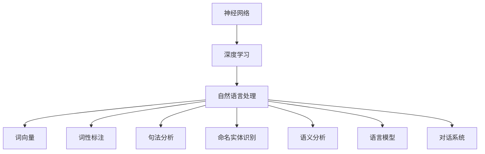

                 

### 第一部分：引言与背景

#### 引言

人工智能（AI）作为21世纪最具变革性的技术之一，正迅速改变着我们的生活方式和社会结构。在这一领域，Andrej Karpathy无疑是一位杰出的代表人物。他是深度学习领域的领军人物，现任OpenAI的首席科学家，并在神经网络和自然语言处理领域取得了卓越的成就。

Andrej Karpathy之所以值得我们深入探讨，不仅因为他在学术界和工业界均取得了辉煌的成绩，更因为他以其通俗易懂、深入浅出的方式，让更多人了解了人工智能的核心原理和应用。其著作《Andrej Karpathy：人工智能的未来发展机遇》正是这样一本深入浅出、兼具理论深度和实践价值的书籍。

本文将以《Andrej Karpathy：人工智能的未来发展机遇》为蓝本，通过逻辑清晰、结构紧凑的论述，带领读者逐步了解人工智能的基础知识、历史现状、技术原理、未来发展机遇以及实践方法。我们希望通过这一系列的探讨，不仅能够让读者对人工智能有更全面的认识，还能够激发他们对这一领域更深层次的好奇心和探索欲望。

#### Andrej Karpathy的背景与职业历程

Andrej Karpathy出生于1987年，他在计算机科学领域展现出了非凡的天赋和热情。2009年，他在多伦多大学获得了计算机科学学士学位，随后在斯坦福大学攻读博士学位，师从著名深度学习专家Andrew Ng。在斯坦福大学期间，他专注于神经网络和自然语言处理的研究，并取得了一系列重要的研究成果。

在学术研究方面，Andrej Karpathy的贡献是多方面的。他参与了OpenAI的成立，并在公司担任首席科学家，负责领导团队进行前沿的人工智能研究。他的研究成果在多个顶级学术会议上发表，包括NeurIPS、ICML和CVPR等。其中，他在自然语言处理领域的突破性工作，特别是对序列到序列模型的改进，为该领域的发展做出了重要贡献。

除了学术研究，Andrej Karpathy在工业界也有着丰富的经验。他曾担任Google AI的高级研究员，负责推动深度学习技术在搜索引擎中的应用。他的工作不仅提升了Google搜索的准确性，还为用户提供了更加个性化的搜索体验。

Andrej Karpathy以其在人工智能领域的卓越贡献和广泛影响力，被公认为是新一代人工智能研究者的代表人物。他的研究成果不仅推动了学术界的发展，也对工业界产生了深远的影响。

#### Andrej Karpathy在人工智能领域的贡献

Andrej Karpathy在人工智能领域的贡献是多方面的，尤其在神经网络和自然语言处理方面取得了显著成就。以下是他在这些领域的具体贡献：

1. **神经网络研究：**
   - **序列到序列模型（Seq2Seq）：** Andrej Karpathy是Seq2Seq模型的重要贡献者之一。Seq2Seq模型通过将输入序列映射到输出序列，实现了自然语言处理中的许多任务，如机器翻译、文本摘要和语音识别等。他在2014年的NeurIPS会议上发表的论文《Sequence to Sequence Learning with Neural Networks》详细阐述了这一模型的工作原理和应用。

   - **注意力机制（Attention Mechanism）：** 在自然语言处理中，注意力机制是一个关键的概念，它允许模型在处理序列数据时，关注到不同的部分。Andrej Karpathy的工作进一步提升了注意力机制的性能，使其在机器翻译任务中达到了前所未有的精度。这一改进为后来的许多研究奠定了基础。

2. **自然语言处理：**
   - **端到端学习（End-to-End Learning）：** Andrej Karpathy倡导并实践了端到端学习方法在自然语言处理中的应用。这种方法通过直接从原始数据中学习，跳过了传统的特征工程步骤，显著提高了模型的性能和效率。他在Google AI期间，成功将端到端学习方法应用于语音识别和机器翻译等任务。

   - **预训练与微调（Pre-training and Fine-tuning）：** Andrej Karpathy提出了将大规模预训练模型应用于特定任务的方法，即通过在大规模语料库上进行预训练，然后在特定任务上进行微调。这种方法显著提高了模型的性能，特别是在低资源环境下。他在OpenAI的工作中，使用了这种方法开发了GPT系列模型，这些模型在多个自然语言处理任务中取得了领先成绩。

3. **开源项目：**
   - **TensorFlow.js：** 作为Google AI的高级研究员，Andrej Karpathy积极参与了TensorFlow.js的开发，这是一个基于JavaScript的深度学习库，使开发者能够在浏览器中实现机器学习模型。这一开源项目极大地推动了Web应用的智能化，为边缘计算提供了新的可能性。

   - **PyTorch：** Andrej Karpathy也是PyTorch的主要贡献者之一，这是一个流行的深度学习框架。PyTorch以其灵活性和易用性著称，为研究人员和开发者提供了强大的工具，促进了深度学习技术的发展。

总的来说，Andrej Karpathy在人工智能领域的研究不仅具有理论深度，还具备实际应用价值。他的工作不仅推动了学术界的发展，也对工业界产生了深远的影响，成为新一代人工智能研究者的典范。

#### 为什么阅读这本书

《Andrej Karpathy：人工智能的未来发展机遇》是一本不可多得的佳作，值得所有对人工智能感兴趣的读者仔细阅读。以下是几个原因：

首先，这本书由人工智能领域的领军人物Andrej Karpathy亲自撰写，内容权威且具有深度。他不仅具备深厚的学术背景，还在工业界有着丰富的实践经验，这使得他的观点兼具理论性和实用性。书中详细介绍了人工智能的基础知识、历史发展、核心技术以及未来趋势，为读者提供了一个全方位的了解。

其次，这本书以通俗易懂的语言和丰富的实例，深入浅出地讲解了复杂的人工智能概念。无论你是初学者还是有经验的专业人士，都能从中受益。书中不仅有理论讲解，还包含了大量实际应用案例，使读者能够将所学知识应用到实际项目中。

再次，这本书不仅关注技术的进步，还探讨了人工智能对社会、经济、法律等领域的深远影响。这种跨学科的视角使读者能够从更广泛的角度思考人工智能的未来，从而形成更为全面的认识。

最后，这本书不仅适合人工智能领域的从业者，也适合对这一领域感兴趣的普通读者。它不仅能够帮助你深入了解人工智能的核心原理，还能激发你对这一领域的热情和好奇心。无论你是学术研究者、技术开发者还是普通读者，这本书都能为你提供宝贵的知识和启发。

### 第二部分：人工智能的基础知识

#### 第2章：人工智能概述

##### 2.1 人工智能的定义与发展历程

人工智能（Artificial Intelligence，简称AI）是指通过计算机模拟人类智能行为和决策过程的技术和理论。它涉及多个学科领域，包括计算机科学、认知科学、心理学、神经科学、语言学等。人工智能的目的是使计算机系统能够执行通常需要人类智能的任务，如视觉识别、语音识别、自然语言理解、决策推理等。

人工智能的发展历程可以分为几个阶段：

- **第一阶段（1956-1969）：** 人工智能概念的提出与早期探索。1956年，约翰·麦卡锡（John McCarthy）等人在达特茅斯会议上首次提出了人工智能的概念。这一时期的研究主要集中在符号主义方法，即通过逻辑推理和符号表示来模拟人类智能。

- **第二阶段（1970-1989）：** 人工智能的发展与挫折。20世纪70年代，专家系统的兴起推动了人工智能的研究，但随后由于实际应用中的局限性，人工智能进入了一段相对低潮期。这一时期，符号主义方法受到质疑，机器学习开始逐渐成为人工智能研究的核心。

- **第三阶段（1990-2010）：** 机器学习与深度学习的发展。20世纪90年代，机器学习，特别是基于统计的方法，开始受到关注。这一时期，深度学习逐渐崭露头角，并在图像识别、语音识别等领域取得了显著进展。然而，由于计算资源和数据量的限制，深度学习尚未实现大规模应用。

- **第四阶段（2010年至今）：** 人工智能的爆发与普及。随着大数据和云计算的发展，深度学习迎来了黄金时代。以神经网络为代表的深度学习模型在图像识别、自然语言处理、语音识别等领域取得了突破性进展，推动了人工智能在工业、医疗、交通等领域的广泛应用。

##### 2.2 人工智能的分类

人工智能可以根据其实现方式和能力分为多种类型：

- **弱人工智能（Narrow AI）：** 也称为专用人工智能，这种人工智能系统在特定领域内表现出类似人类的智能行为。例如，语音助手、图像识别系统等。弱人工智能通常依赖于特定任务的数据和算法，不具备通用智能。

- **强人工智能（General AI）：** 也称为通用人工智能，这种人工智能系统能够像人类一样理解、学习和执行各种任务。强人工智能目前尚未实现，科学家们仍在不断探索和研究。

- **混合人工智能（Hybrid AI）：** 结合了弱人工智能和强人工智能的特点，通过多种算法和模型实现更高效、更全面的智能行为。

- **计算智能（Computational Intelligence）：** 包括机器学习、神经网络、进化算法等，主要通过计算机模拟和优化人类智能行为。

##### 2.3 人工智能的核心技术

人工智能的核心技术包括以下几个主要方面：

- **机器学习（Machine Learning）：** 机器学习是通过算法从数据中学习规律和模式，从而实现智能行为的一种方法。它主要包括监督学习、无监督学习和强化学习等类型。

  - **监督学习（Supervised Learning）：** 有标签的数据进行训练，目标是预测未知的输出。常见的算法包括线性回归、决策树、支持向量机等。

  - **无监督学习（Unsupervised Learning）：** 没有标签的数据进行训练，目标是发现数据中的内在结构和模式。常见的算法包括聚类、降维、主成分分析等。

  - **强化学习（Reinforcement Learning）：** 通过与环境互动，不断学习最优策略以实现目标。常见的算法包括Q学习、深度强化学习等。

- **深度学习（Deep Learning）：** 深度学习是机器学习的一种重要分支，通过多层神经网络模型对数据进行复杂的学习和特征提取。它主要包括卷积神经网络（CNN）、循环神经网络（RNN）、变换器（Transformer）等。

  - **卷积神经网络（CNN）：** 适用于图像识别和图像处理领域，通过对图像进行卷积操作提取特征。

  - **循环神经网络（RNN）：** 适用于序列数据处理，如时间序列分析、自然语言处理等，通过对序列进行循环操作实现长期依赖建模。

  - **变换器（Transformer）：** 一种基于自注意力机制的深度学习模型，广泛应用于自然语言处理、机器翻译等领域，显著提升了模型的性能。

- **自然语言处理（Natural Language Processing，NLP）：** 自然语言处理是人工智能的重要应用领域，旨在使计算机能够理解和生成自然语言。它主要包括文本分类、情感分析、机器翻译、文本生成等任务。

- **计算机视觉（Computer Vision）：** 计算机视觉是人工智能的另一个重要应用领域，旨在使计算机能够理解和解析视觉信息。它主要包括图像识别、目标检测、图像分割、人脸识别等任务。

#### 第3章：人工智能的历史与现状

##### 3.1 人工智能的发展历史

人工智能作为计算机科学的一个重要分支，其发展历程可以追溯到20世纪中叶。以下是人工智能历史上的几个重要里程碑：

- **1956年：** 约翰·麦卡锡（John McCarthy）等人在达特茅斯会议上首次提出了人工智能的概念，标志着人工智能作为一个独立研究领域的诞生。

- **1960年代：** 人工智能研究主要集中在符号主义方法，即通过逻辑推理和符号表示来模拟人类智能。这一时期的研究包括早期的人工智能程序和专家系统的开发。

- **1970年代：** 人工智能进入低潮期，专家系统虽然取得了一定的成功，但由于实际应用中的局限性，人工智能研究面临巨大挑战。这一时期，机器学习开始受到关注。

- **1980年代：** 机器学习，特别是基于统计的方法，开始成为人工智能研究的核心。这一时期，人工智能在语音识别、图像处理等领域取得了重要进展。

- **1990年代：** 深度学习开始崭露头角，但由于计算资源和数据量的限制，深度学习尚未实现大规模应用。这一时期，支持向量机等机器学习算法取得了显著成功。

- **2000年代：** 随着计算资源和数据量的增长，深度学习逐渐成为人工智能研究的主流。卷积神经网络（CNN）在图像识别领域取得了突破性进展。

- **2010年代：** 人工智能迎来了爆发式发展。以神经网络为代表的深度学习模型在多个领域取得了显著的进展，推动了人工智能在工业、医疗、交通等领域的广泛应用。

- **2020年代：** 人工智能继续深入发展，不仅在技术上取得了新的突破，还在实际应用中展现了巨大的潜力。自动驾驶、智能医疗、智能制造等领域的应用不断涌现，人工智能正逐步改变我们的生活方式和社会结构。

##### 3.2 人工智能的现状与趋势

当前，人工智能已经进入了快速发展阶段，各种人工智能技术不断涌现，应用领域也越来越广泛。以下是人工智能现状的几个重要方面：

- **技术进展：** 深度学习作为人工智能的核心技术，取得了显著的进展。特别是基于变换器（Transformer）架构的模型，如BERT、GPT等，在自然语言处理、图像识别等领域取得了前所未有的成绩。此外，计算机视觉、语音识别等领域的算法也在不断优化和更新。

- **应用领域：** 人工智能已经广泛应用于各个领域，包括工业、医疗、交通、金融、教育等。例如，在工业领域，人工智能可以用于生产线的优化、质量检测等；在医疗领域，人工智能可以用于疾病诊断、药物研发等；在交通领域，人工智能可以用于自动驾驶、交通管理等。

- **产业生态：** 随着人工智能技术的快速发展，全球范围内形成了一个庞大的人工智能产业生态。各大科技公司和创业公司纷纷投入人工智能领域，争夺市场份额。同时，各国政府也加大了对人工智能的研究和投资力度，推动了人工智能技术的发展和应用。

- **挑战与机遇：** 尽管人工智能取得了显著的进展，但仍面临着一系列挑战，如数据隐私、伦理问题、算法偏见等。同时，人工智能也带来了新的机遇，如自动化、智能化等，这些机遇将推动社会的发展和变革。

##### 3.3 人工智能在不同行业中的应用

人工智能在各个行业中的应用越来越广泛，以下是一些典型应用场景：

- **工业：** 人工智能可以用于生产线的自动化控制、质量检测、预测维护等。例如，通过计算机视觉技术，可以实现对生产过程中的缺陷检测，提高生产效率和质量。

- **医疗：** 人工智能可以用于疾病诊断、药物研发、医疗数据分析等。例如，通过深度学习模型，可以辅助医生进行肺癌等疾病的诊断，提高诊断的准确性和效率。

- **交通：** 人工智能可以用于自动驾驶、智能交通管理、车辆调度等。例如，自动驾驶技术正逐步应用于实际场景，提高了交通安全和效率。

- **金融：** 人工智能可以用于风险控制、客户服务、量化交易等。例如，通过机器学习模型，可以预测股票市场的走势，辅助投资决策。

- **教育：** 人工智能可以用于个性化学习、教育数据分析、智能评测等。例如，通过智能学习系统，可以为不同学习能力的学生提供个性化的学习方案。

- **零售：** 人工智能可以用于智能推荐、库存管理、客户服务等。例如，通过自然语言处理技术，可以为用户提供智能客服，提高客户满意度。

总之，人工智能在各行各业中的应用正在不断拓展，为各个行业带来了新的发展机遇和挑战。

### 第4章：人工智能的技术原理

#### 第4章：人工智能的技术原理

##### 4.1 神经网络的基本原理

神经网络（Neural Networks）是人工智能的核心技术之一，其灵感来源于人脑的神经元结构和信息处理方式。神经网络由大量的节点（也称为神经元）组成，这些节点通过加权连接进行信息的传递和处理。

- **神经元结构：** 神经网络中的每个神经元都包含一个输入层、一个输出层和若干中间层。每个输入层接收外部信息，经过处理后传递给下一层。神经元通过加权连接与相邻的神经元相连，每个连接都有一定的权重，表示信息传递的强度。

- **激活函数：** 每个神经元在接收到输入信息后，会通过一个非线性函数（激活函数）进行处理。常见的激活函数包括Sigmoid函数、ReLU函数和Tanh函数。这些函数能够引入非线性，使神经网络具有强大的拟合能力。

- **权重更新：** 神经网络通过学习输入和输出之间的映射关系来调整权重。这个过程称为反向传播（Backpropagation）。在反向传播过程中，网络根据预测误差对每个权重进行更新，使得网络逐渐逼近最优解。

- **多层神经网络：** 神经网络通常由多个层次组成，包括输入层、隐藏层和输出层。隐藏层负责对输入信息进行加工和特征提取，输出层则负责生成最终的预测结果。多层神经网络能够处理更复杂的问题，具有更强的拟合能力。

##### 4.2 深度学习的基本原理

深度学习（Deep Learning）是神经网络的一种扩展，其核心思想是构建具有多个隐藏层的神经网络，以实现更高效的特征提取和模型训练。以下是深度学习的一些基本原理：

- **多层感知机（MLP）：** 多层感知机是一种简单的多层神经网络，由输入层、多个隐藏层和输出层组成。每个隐藏层通过激活函数将输入信息映射到高维空间，从而实现特征提取。多层感知机是深度学习的基础。

- **卷积神经网络（CNN）：** 卷积神经网络是深度学习在计算机视觉领域的重要应用。它通过卷积操作提取图像中的局部特征，具有平移不变性，可以有效处理图像数据。CNN通常包含卷积层、池化层和全连接层等结构。

- **循环神经网络（RNN）：** 循环神经网络是深度学习在序列数据处理领域的重要应用。RNN通过循环结构处理序列数据，具有长期依赖建模能力。RNN包括简单的RNN、长短期记忆（LSTM）和门控循环单元（GRU）等变种。

- **变换器（Transformer）：** 变换器是一种基于自注意力机制的深度学习模型，广泛应用于自然语言处理、机器翻译等领域。它通过多头自注意力机制和前馈网络，实现了高效的特征提取和表示。

- **优化算法：** 深度学习模型的训练过程涉及优化算法，常用的优化算法包括随机梯度下降（SGD）、Adam优化器等。这些算法通过迭代优化模型参数，使模型在训练数据上达到最优。

##### 4.3 自然语言处理的基本原理

自然语言处理（Natural Language Processing，NLP）是人工智能的重要应用领域，旨在使计算机能够理解和生成自然语言。以下是NLP的一些基本原理：

- **词向量表示：** 词向量是将自然语言文本映射到高维空间的一种方法，常见的词向量模型包括Word2Vec、GloVe等。词向量可以捕获词汇的语义信息，为NLP任务提供有效的特征表示。

- **词性标注：** 词性标注是对文本中的每个单词进行词性分类，如名词、动词、形容词等。词性标注有助于理解文本的语法结构和语义信息。

- **句法分析：** 句法分析是对句子结构进行解析，确定句子的语法成分和关系。句法分析有助于理解句子的语义含义，为NLP任务提供支持。

- **命名实体识别：** 命名实体识别是识别文本中的特定实体，如人名、地名、组织名等。命名实体识别对于信息提取、关系抽取等任务具有重要意义。

- **语义分析：** 语义分析是对文本进行语义理解，确定文本的含义和意图。语义分析包括词义消歧、情感分析、指代消解等任务。

- **语言模型：** 语言模型是对自然语言的概率分布进行建模，用于生成自然语言文本。常见的语言模型包括n元语法、神经网络语言模型等。

- **对话系统：** 对话系统是一种能够与人类进行自然语言交互的计算机系统，包括语音助手、聊天机器人等。对话系统涉及语音识别、自然语言理解、对话生成等技术。

#### 核心概念与联系

为了更好地理解人工智能的技术原理，我们可以通过以下Mermaid流程图来展示核心概念及其之间的联系：



这个流程图展示了神经网络、深度学习、自然语言处理以及各个子领域之间的联系。通过这个流程图，我们可以更清晰地理解人工智能的技术原理和应用场景。

### 第5章：人工智能的未来趋势

##### 5.1 人工智能的未来发展方向

人工智能（AI）作为现代科技的前沿领域，其未来的发展方向不仅充满潜力，也面临诸多挑战。以下是人工智能未来可能的发展方向：

- **更强大的计算能力：** 随着计算技术的不断进步，未来人工智能将拥有更强大的计算能力，使得复杂任务的处理更加高效。例如，量子计算和光子计算等新兴计算模式有望进一步提升人工智能的性能。

- **更广泛的数据应用：** 数据是人工智能的基础，未来人工智能将能够更好地利用各种类型的数据，包括结构化数据、非结构化数据（如图像、视频、语音等）以及实时数据。这将有助于人工智能在更多领域实现突破。

- **更加智能的自主决策：** 未来的人工智能将具备更强的自主决策能力，能够在没有人类干预的情况下进行复杂任务。这包括自主驾驶汽车、无人机、机器人等，它们将能够在不同环境中自主学习和适应。

- **跨学科的融合：** 人工智能的未来发展将涉及更多学科领域的融合，如生物学、心理学、哲学等。这些跨学科的研究将有助于人工智能更好地模拟人类智能，实现更加智能化的解决方案。

- **人机协作：** 人工智能与人类智能的结合将是一种重要的趋势。未来的人工智能系统将能够更好地与人类协作，提高工作效率和生活质量。例如，智能助手、医疗诊断辅助系统等。

- **更加安全的AI系统：** 随着人工智能的普及，确保AI系统的安全性和可靠性将成为一个重要议题。未来的人工智能将更加注重安全性，包括数据隐私保护、算法透明度等。

##### 5.2 人工智能的未来挑战与机遇

在展望人工智能的未来发展方向的同时，我们也必须面对一系列挑战和机遇：

- **数据隐私与伦理问题：** 人工智能在处理大量数据时，如何保护个人隐私和保障数据安全是一个重大挑战。同时，人工智能的应用也引发了一系列伦理问题，如算法偏见、自主决策的责任归属等。如何制定合理的法律法规，确保人工智能的公平、公正和透明，是一个亟待解决的问题。

- **技术成熟度与落地应用：** 尽管人工智能技术在实验室中取得了显著成果，但在实际应用中，技术成熟度和落地应用仍然面临挑战。例如，人工智能在医疗、金融等领域的应用需要更高的准确性和稳定性，这对技术和数据处理能力提出了更高的要求。

- **人才培养与知识普及：** 人工智能的发展离不开专业人才的培养和公众的普及。未来需要更多具备跨学科背景的人才，同时，也需要通过教育和培训，提高公众对人工智能的认识和接受度。

- **产业生态与商业模式的创新：** 人工智能技术的进步将带动相关产业的变革，产生新的商业模式和商业机会。企业需要积极探索人工智能技术的应用场景，实现商业价值的最大化。

- **国际合作与竞争：** 人工智能作为全球科技竞争的焦点，各国政府和企业纷纷加大投入，推动人工智能技术的发展。国际合作与竞争将共同推动人工智能技术的进步，同时也可能带来技术和市场的不确定性。

##### 5.3 人工智能的未来应用场景

人工智能的未来应用场景将涵盖各个领域，以下是几个具有代表性的应用场景：

- **医疗领域：** 人工智能在医疗领域的应用前景广阔，包括疾病诊断、药物研发、智能监护等。例如，通过深度学习模型，可以辅助医生进行肿瘤诊断，提高诊断的准确性和效率。此外，人工智能还可以用于个性化医疗，为患者提供定制化的治疗方案。

- **金融领域：** 人工智能在金融领域的应用包括风险控制、量化交易、智能投顾等。例如，通过机器学习算法，可以预测市场走势，辅助投资决策。同时，人工智能还可以用于客户服务，提供智能客服解决方案，提高客户满意度。

- **教育领域：** 人工智能在教育领域的应用包括个性化学习、智能评测、教育数据分析等。通过人工智能技术，可以为学生提供个性化的学习资源和学习方案，提高学习效果。此外，智能评测系统可以自动评估学生的作业和考试，节省教师的时间和精力。

- **交通领域：** 人工智能在交通领域的应用包括自动驾驶、智能交通管理、车辆调度等。例如，自动驾驶技术有望在未来实现大规模商用，提高交通安全和效率。智能交通管理系统可以通过实时数据分析，优化交通流，减少拥堵。

- **智能家居：** 人工智能在智能家居领域的应用包括智能音箱、智能安防、智能照明等。通过人工智能技术，家居设备可以实现自动化控制，提高生活便利性。例如，智能音箱可以通过语音助手与用户互动，控制家电设备。

- **工业制造：** 人工智能在工业制造领域的应用包括智能制造、质量检测、设备维护等。通过人工智能技术，可以实现对生产过程的实时监控和优化，提高生产效率和质量。

总之，人工智能的未来应用场景将不断拓展，为社会带来更多便利和变革。同时，我们也需要关注人工智能在应用过程中可能带来的挑战和问题，确保其健康、可持续发展。

### 第6章：人工智能的未来社会影响

#### 6.1 人工智能对经济的影响

人工智能（AI）作为一项颠覆性的技术，正逐步渗透到全球经济体系中的各个领域，带来深远的影响。以下是人工智能对经济的几大影响：

- **提升生产效率：** 人工智能通过自动化和智能化的方式，显著提高了生产效率。例如，在制造业中，人工智能可以帮助优化生产流程、减少停机时间、提高设备利用率。在服务业中，人工智能可以用于智能客服、数据分析等，提高客户满意度和服务质量。

- **创造新的工作岗位：** 尽管人工智能的普及可能导致某些传统岗位的减少，但同时也创造了大量新的工作岗位。例如，数据科学家、机器学习工程师、AI研究员等专业岗位的需求大幅增加。此外，人工智能还催生了新兴产业，如自动驾驶、智能医疗等，为就业市场提供了新的机遇。

- **推动产业升级：** 人工智能的引入有助于推动传统产业向智能化、高端化方向发展。例如，通过人工智能技术，制造业可以实现智能制造，提高产品质量和附加值。在金融、医疗、教育等服务业领域，人工智能的应用有助于提高服务效率和质量，推动产业升级。

- **经济模式变革：** 人工智能的普及推动了商业模式和消费习惯的变革。例如，电商平台的个性化推荐系统通过人工智能技术，为消费者提供更加个性化的购物体验。在共享经济领域，人工智能可以帮助优化资源配置，提高共享效率。

- **提高经济竞争力：** 人工智能技术的应用有助于提高国家的经济竞争力。例如，通过人工智能技术，企业可以更好地把握市场动态，优化供应链管理，提高市场响应速度。同时，人工智能还可以帮助政府更好地进行宏观经济管理和决策，提高国家治理水平。

- **全球经济一体化：** 人工智能的发展促进了全球经济的深度融合和协作。各国企业和研究机构通过跨国合作，共同推动人工智能技术的研发和应用，实现了技术的快速迭代和全球范围的推广。

总之，人工智能对经济的影响是全方位的，不仅提升了生产效率、创造了新的工作岗位，还推动了产业升级和经济模式的变革。同时，人工智能也为全球经济一体化提供了新的动力，促进了全球经济的繁荣和发展。

#### 6.2 人工智能对教育的影响

人工智能（AI）对教育领域的影响正在迅速扩大，从学习资源的个性化到教学模式的创新，再到教育管理的优化，AI正在深刻改变教育的面貌。

- **个性化学习：** 人工智能通过分析和理解每个学生的学习习惯和需求，为每个学生提供个性化的学习路径和资源。例如，自适应学习平台可以根据学生的答题情况动态调整学习内容，确保每个学生都能在自己的节奏上获得最佳的学习体验。

- **智能辅导：** 人工智能可以扮演教师的角色，为学生提供实时辅导和答疑服务。例如，智能辅导系统可以分析学生的学习数据，识别出学生在某个知识点上的薄弱环节，并提供针对性的辅导内容，帮助学生迅速提高。

- **虚拟教学助手：** 在线教育平台借助人工智能技术，可以提供虚拟教学助手，帮助学生进行自主学习和探究。这些虚拟助手可以回答学生的问题，提供学习建议，甚至参与互动讨论，使学习过程更加生动有趣。

- **教学资源的优化：** 人工智能可以通过大数据分析和推荐算法，为教师和学生推荐最适合的学习资源。例如，智能推荐系统可以根据学生的学习进度和兴趣，推荐相关的课程、教材和练习题，提高学习效率。

- **教育评估与反馈：** 人工智能技术可以实时收集和分析学生的学习数据，帮助教师及时了解学生的学习情况，提供个性化的反馈和改进建议。例如，智能评估系统可以通过在线测试和分析学生的答题情况，识别出知识点掌握不足的部分，并提供相应的辅导资源。

- **教育管理的优化：** 人工智能技术在教育管理中的应用，有助于提高教育管理效率。例如，学校可以通过人工智能系统进行学生信息管理、课程安排、资源调度等，减少人工工作量，提高管理效率。

- **教育公平的提升：** 人工智能技术可以弥补教育资源不均的问题，为偏远地区和贫困家庭的学生提供优质的教育资源。例如，通过在线教育平台和智能辅导系统，学生可以享受到与城市学生同等的教育资源，提高教育公平性。

- **创新教育模式：** 人工智能推动了教育模式的创新，例如，混合式学习（Blended Learning）和虚拟现实（VR）教学等。通过结合线上和线下教学，以及虚拟现实技术，学生可以获得更加沉浸式的学习体验。

总之，人工智能对教育的影响是多方面的，从个性化学习到智能辅导，再到教育管理的优化，AI正在为教育带来前所未有的变革和机遇。通过人工智能技术，我们可以期待一个更加公平、高效和个性化的教育未来。

#### 6.3 人工智能对法律与社会的影响

人工智能（AI）的快速发展在给社会带来巨大变革的同时，也对法律与社会带来了诸多挑战和机遇。以下是人工智能对法律和社会的几个主要影响：

- **隐私保护：** 随着人工智能技术的广泛应用，个人隐私数据的安全问题日益突出。AI系统在处理海量数据时，往往需要收集和存储个人隐私信息，如面部识别数据、位置信息、购物记录等。如何保护这些数据免受滥用和泄露，成为法律和社会需要关注的重要问题。各国已经出台了相关法律，如欧盟的《通用数据保护条例》（GDPR），以加强数据隐私保护。

- **算法偏见：** 人工智能算法在决策过程中可能存在偏见，这种偏见可能来源于训练数据中的偏见或算法设计的不公平。例如，面部识别技术可能对某些种族或性别存在歧视，信贷评分系统可能对某些群体不公平。如何确保算法的公平性和透明度，避免算法偏见，是法律和社会需要解决的重要问题。

- **责任归属：** 当人工智能系统发生错误或导致损害时，如何确定责任归属成为一个复杂的问题。是算法开发者、数据提供者还是系统用户应承担主要责任？相关法律法规需要明确责任分配，以保障各方的合法权益。

- **知识产权保护：** 人工智能技术的发展，使得自动化创作成为可能，如自动写作、音乐创作等。这引发了知识产权保护的新问题，如何界定人工智能作品的知识产权归属，如何保护原创者的权益，是法律和社会需要探讨的问题。

- **法律遵从性：** 随着人工智能在执法、司法等领域的应用，如何确保AI系统的决策符合法律规范，避免滥用职权，是法律和社会需要关注的问题。例如，AI系统在执法中如何确保公正、公平，避免权力滥用。

- **伦理问题：** 人工智能的广泛应用引发了诸多伦理问题，如人机伦理、情感伦理等。例如，机器是否应该拥有道德责任，如何处理人机互动中的道德困境，这些都是需要社会和伦理学者共同探讨的问题。

- **社会影响：** 人工智能的普及对社会结构和社会关系产生了深远影响。例如，自动化和智能化可能导致某些工作岗位的消失，引发就业结构的变化和社会不稳定。如何通过政策和社会措施缓解这种影响，确保社会的和谐与稳定，是法律和社会需要考虑的问题。

总之，人工智能对法律和社会的影响是复杂而深远的。通过完善相关法律法规，加强伦理和道德研究，以及制定合理的政策，我们可以更好地应对人工智能带来的挑战，同时把握其带来的机遇，促进社会的可持续发展。

### 第7章：人工智能的未来发展机遇

##### 7.1 人工智能在医疗领域的应用机遇

人工智能（AI）在医疗领域的应用正迅速发展，带来了诸多机遇，包括疾病诊断、药物研发、个性化治疗和智能监护等。

- **疾病诊断：** 人工智能可以通过深度学习模型对医学图像（如CT、MRI、X光片等）进行高效分析，辅助医生进行早期诊断。例如，AI系统可以识别出癌症、心脏病等疾病，提高诊断的准确性和速度。AI还可以对患者的电子健康记录进行分析，提供更全面的诊断信息。

  **核心算法原理讲解：**
  - **卷积神经网络（CNN）：** CNN是图像识别领域的主要算法，通过多层卷积和池化操作，提取图像的局部特征，然后通过全连接层进行分类。以下是一个简化的CNN算法伪代码：
    ```python
    def convolutional_neural_network(input_image):
        # 卷积层
        conv1 = Conv2D(filters=32, kernel_size=(3, 3), activation='relu')(input_image)
        pool1 = MaxPooling2D(pool_size=(2, 2))(conv1)

        # 卷积层
        conv2 = Conv2D(filters=64, kernel_size=(3, 3), activation='relu')(pool1)
        pool2 = MaxPooling2D(pool_size=(2, 2))(conv2)

        # 全连接层
        flatten = Flatten()(pool2)
        dense = Dense(units=128, activation='relu')(flatten)
        output = Dense(units=1, activation='sigmoid')(dense)

        return output
    ```

- **药物研发：** 人工智能可以加速药物研发过程，通过分析大量生物学数据和化学结构，预测新的药物候选分子。例如，AI系统可以筛选化合物库，识别具有特定生物活性的分子，从而缩短药物研发周期，降低研发成本。

  **核心算法原理讲解：**
  - **生成对抗网络（GAN）：** GAN通过生成器和判别器的对抗训练，生成高质量的虚拟化合物分子。以下是一个简化的GAN算法伪代码：
    ```python
    def generate对抗网络(input_shape):
        # 生成器模型
        generator = Sequential()
        generator.add(Dense(units=128, activation='tanh', input_shape=input_shape))
        generator.add(Dense(units=64, activation='tanh'))
        generator.add(Dense(units=1, activation='sigmoid'))

        # 判别器模型
        discriminator = Sequential()
        discriminator.add(Dense(units=64, activation='tanh', input_shape=input_shape))
        discriminator.add(Dense(units=128, activation='tanh'))
        discriminator.add(Dense(units=1, activation='sigmoid'))

        return generator, discriminator
    ```

- **个性化治疗：** 人工智能可以根据患者的基因信息、病史和临床表现，为患者提供个性化的治疗方案。例如，通过分析患者的基因组数据，AI系统可以预测患者对某种药物的敏感性，从而制定个性化的用药方案。

  **核心算法原理讲解：**
  - **集成学习方法：** 集成学习方法通过组合多个弱学习器（如随机森林、梯度提升树等），提高预测的准确性和稳定性。以下是一个简化的集成学习算法伪代码：
    ```python
    def ensemble_learning(X_train, y_train, n_estimators):
        classifiers = []
        for _ in range(n_estimators):
            classifier = DecisionTreeClassifier()
            classifier.fit(X_train, y_train)
            classifiers.append(classifier)

        ensemble_classifier = VotingClassifier(estimators=classifiers, voting='soft')
        ensemble_classifier.fit(X_train, y_train)

        return ensemble_classifier
    ```

- **智能监护：** 人工智能可以通过智能监护系统，实时监测患者的健康状况，提供及时的健康预警。例如，通过穿戴设备收集心率、血压等生理数据，AI系统可以分析数据，识别异常情况，并向医生和患者发送预警信息。

  **核心算法原理讲解：**
  - **时间序列分析：** 时间序列分析是一种用于处理和预测时间序列数据的方法，可以用于分析生理信号。以下是一个简化的时间序列预测算法伪代码：
    ```python
    def time_series_prediction(data, n_steps):
        # 创建模型
        model = LSTM(units=50, return_sequences=True)
        model.fit(data, epochs=100, batch_size=n_steps)

        # 预测未来n个时间点的值
        future_values = model.predict(data[-n_steps:])
        return future_values
    ```

通过这些核心算法的应用，人工智能在医疗领域展现出巨大的潜力。未来，随着技术的进一步发展，人工智能将在医疗诊断、药物研发、个性化治疗和智能监护等方面发挥更加重要的作用。

##### 7.2 人工智能在金融领域的应用机遇

人工智能（AI）在金融领域的应用正在不断拓展，带来了诸多机遇，包括风险控制、智能投顾、信用评分和反欺诈等。

- **风险控制：** 人工智能可以通过机器学习算法，对金融市场的数据进行分析，预测潜在的风险，从而帮助金融机构更好地管理风险。例如，通过分析历史交易数据、宏观经济指标等，AI系统可以识别出潜在的市场风险，帮助金融机构制定相应的风险管理策略。

  **核心算法原理讲解：**
  - **随机森林（Random Forest）：** 随机森林是一种基于决策树的集成学习方法，可以提高预测的准确性和稳定性。以下是一个简化的随机森林算法伪代码：
    ```python
    from sklearn.ensemble import RandomForestClassifier

    def random_forest(X_train, y_train):
        model = RandomForestClassifier(n_estimators=100)
        model.fit(X_train, y_train)
        return model

    X_train = ...  # 训练数据
    y_train = ...  # 标签数据
    model = random_forest(X_train, y_train)
    ```

- **智能投顾：** 人工智能可以通过分析客户的财务状况、投资偏好和市场数据，为投资者提供个性化的投资建议。智能投顾系统可以模拟不同投资策略的表现，帮助投资者做出更加明智的决策，提高投资回报。

  **核心算法原理讲解：**
  - **优化算法：** 优化算法可以通过数学模型，对投资组合进行优化，以实现最大化收益或最小化风险。以下是一个简化的优化算法伪代码：
    ```python
    from scipy.optimize import minimize

    def objective_function(x):
        return -np.sum(x * np.log(x) + (1 - x) * np.log(1 - x))

    constraints = ({'type': 'ineq', 'fun': lambda x: x - 1}, {'type': 'eq', 'fun': lambda x: x.sum() - 1})

    x0 = np.random.rand(n_assets)
    result = minimize(objective_function, x0, method='SLSQP', constraints=constraints)
    ```

- **信用评分：** 人工智能可以通过分析客户的信用历史、财务状况、行为数据等，对客户的信用风险进行评估。信用评分系统可以用于贷款审批、信用卡发放等，帮助金融机构降低不良贷款率。

  **核心算法原理讲解：**
  - **逻辑回归（Logistic Regression）：** 逻辑回归是一种用于分类问题的回归算法，可以通过分析特征与标签之间的关系，预测客户的信用评分。以下是一个简化的逻辑回归算法伪代码：
    ```python
    from sklearn.linear_model import LogisticRegression

    def logistic_regression(X_train, y_train):
        model = LogisticRegression()
        model.fit(X_train, y_train)
        return model

    X_train = ...  # 训练数据
    y_train = ...  # 标签数据
    model = logistic_regression(X_train, y_train)
    ```

- **反欺诈：** 人工智能可以通过分析交易行为、用户行为等，识别出潜在的欺诈行为。AI系统可以实时监控交易活动，对异常交易进行预警，从而帮助金融机构降低欺诈损失。

  **核心算法原理讲解：**
  - **聚类分析（Clustering）：** 聚类分析可以将交易数据划分为不同的群体，通过分析群体特征，识别出异常交易。以下是一个简化的聚类分析算法伪代码：
    ```python
    from sklearn.cluster import KMeans

    def clustering(X_train, n_clusters):
        model = KMeans(n_clusters=n_clusters)
        model.fit(X_train)
        return model

    X_train = ...  # 训练数据
    n_clusters = 10
    model = clustering(X_train, n_clusters)
    ```

通过这些核心算法的应用，人工智能在金融领域展现出巨大的潜力。未来，随着技术的进一步发展，人工智能将在风险控制、智能投顾、信用评分和反欺诈等方面发挥更加重要的作用。

##### 7.3 人工智能在交通领域的应用机遇

人工智能（AI）在交通领域的应用正在引发深刻的变革，带来了许多新的机遇，包括自动驾驶、智能交通管理和车联网等。

- **自动驾驶：** 人工智能在自动驾驶领域的应用是交通领域的一大创新。自动驾驶技术利用深度学习和计算机视觉等技术，使车辆能够自主感知环境、做出决策并控制行驶。自动驾驶汽车通过传感器（如激光雷达、摄像头、雷达等）收集道路信息，结合高精度地图和实时数据，实现自动驾驶。以下是一个简化的自动驾驶算法伪代码：
  ```python
  import cv2
  import numpy as np

  def detect lanes(image):
      # 将图像转换为灰度图像
      gray = cv2.cvtColor(image, cv2.COLOR_BGR2GRAY)

      # 使用高斯模糊去除噪声
      blurred = cv2.GaussianBlur(gray, (5, 5), 0)

      # 使用Canny边缘检测
      edges = cv2.Canny(blurred, 50, 150)

      # 使用Hough线检测找到车道线
      lines = cv2.HoughLinesP(edges, 1, np.pi/180, 100, minLineLength=100, maxLineGap=10)

      # 绘制车道线
      for line in lines:
          x1, y1, x2, y2 = line[0]
          cv2.line(image, (x1, y1), (x2, y2), (0, 0, 255), 3)

      return image
  ```

- **智能交通管理：** 人工智能可以用于优化交通流、减少拥堵和提高交通效率。智能交通管理系统通过收集和分析交通数据（如车辆流量、速度、交通灯状态等），动态调整交通信号灯的时长和相位，优化交通流。以下是一个简化的智能交通管理算法伪代码：
  ```python
  import numpy as np

  def optimize_traffic_light(traffic_data):
      # 基于交通数据优化交通灯时长
      green_time = 60  # 绿灯时长
      red_time = 60    # 红灯时长
      max_queue_length = 10  # 最大队列长度

      # 根据当前交通状况调整绿灯和红灯时长
      if traffic_data['queue_length'] > max_queue_length:
          green_time += 10
      else:
          red_time += 10

      return green_time, red_time
  ```

- **车联网：** 车联网技术通过将车辆与互联网连接，实现车辆之间的通信和信息共享，提高行车安全和交通效率。车联网可以通过AI技术实现车辆自组织网络、智能导航、远程诊断等功能。以下是一个简化的车联网通信算法伪代码：
  ```python
  import socket

  def send_data(data, server_address):
      # 创建套接字
      with socket.socket(socket.AF_INET, socket.SOCK_DGRAM) as sock:
          # 发送数据到服务器
          sock.sendto(data.encode(), server_address)

  def receive_data(server_address, port):
      # 创建套接字
      with socket.socket(socket.AF_INET, socket.SOCK_DGRAM) as sock:
          # 绑定端口
          sock.bind((server_address, port))

          # 接收数据
          data, _ = sock.recvfrom(1024)
          return data.decode()
  ```

通过这些核心算法的应用，人工智能在交通领域展现出巨大的潜力。未来，随着技术的进一步发展，人工智能将在自动驾驶、智能交通管理和车联网等方面发挥更加重要的作用，为我们的出行带来更多便利和安全。

##### 7.4 人工智能在其他领域的应用机遇

人工智能（AI）作为一种颠覆性技术，正迅速渗透到各个行业，带来了前所未有的机遇。以下是一些关键领域及其应用机遇：

- **农业：** 人工智能在农业领域的应用包括作物监测、精准施肥、病虫害预测和自动化种植等。通过无人机和卫星遥感技术，AI系统可以实时监测作物生长状况，提供精准的农业管理方案。以下是一个简化的作物监测算法伪代码：
  ```python
  import cv2
  import numpy as np

  def detect_crops(image):
      # 将图像转换为灰度图像
      gray = cv2.cvtColor(image, cv2.COLOR_BGR2GRAY)

      # 使用Canny边缘检测
      edges = cv2.Canny(gray, 50, 150)

      # 使用findContours找到作物轮廓
      contours, _ = cv2.findContours(edges, cv2.RETR_TREE, cv2.CHAIN_APPROX_SIMPLE)

      # 统计作物面积
      crop_area = 0
      for contour in contours:
          area = cv2.contourArea(contour)
          crop_area += area

      return crop_area
  ```

- **能源：** 人工智能可以用于优化能源生产、分配和消费，提高能源效率。例如，通过智能电网技术，AI系统可以实时监控电力需求，动态调整电力供应，减少能源浪费。以下是一个简化的智能电网算法伪代码：
  ```python
  import numpy as np

  def optimize_energy_consumption(energy_demand, energy_supply):
      # 根据能源需求调整能源供应
      surplus = energy_supply - energy_demand
      if surplus < 0:
          energy_supply = energy_demand
      return energy_supply
  ```

- **环境保护：** 人工智能可以用于环境监测、污染检测和生态保护等。例如，AI系统可以通过遥感技术监测大气污染、水质污染等环境问题，提供预警和解决方案。以下是一个简化的环境监测算法伪代码：
  ```python
  import cv2
  import numpy as np

  def detect_pollution(image):
      # 将图像转换为灰度图像
      gray = cv2.cvtColor(image, cv2.COLOR_BGR2GRAY)

      # 使用Otsu阈值分割
      _, thresh = cv2.threshold(gray, 0, 255, cv2.THRESH_BINARY + cv2.THRESH_OTSU)

      # 计算污染区域面积
      pollution_area = cv2.countNonZero(thresh)

      return pollution_area
  ```

- **制造业：** 人工智能可以用于生产线的优化、质量检测和设备维护等。通过机器学习和计算机视觉技术，AI系统可以实时监控生产过程，提高生产效率和质量。以下是一个简化的生产线质量检测算法伪代码：
  ```python
  import cv2
  import numpy as np

  def detect_defects(image):
      # 将图像转换为灰度图像
      gray = cv2.cvtColor(image, cv2.COLOR_BGR2GRAY)

      # 使用Canny边缘检测
      edges = cv2.Canny(gray, 50, 150)

      # 使用findContours找到缺陷轮廓
      contours, _ = cv2.findContours(edges, cv2.RETR_TREE, cv2.CHAIN_APPROX_SIMPLE)

      # 统计缺陷数量
      defects_count = 0
      for contour in contours:
          area = cv2.contourArea(contour)
          if area > 100:  # 阈值为100像素
              defects_count += 1

      return defects_count
  ```

通过这些核心算法的应用，人工智能在农业、能源、环境保护和制造业等领域展现出巨大的潜力。未来，随着技术的进一步发展，人工智能将为这些领域带来更多创新和变革。

### 第8章：人工智能项目的实践方法

在人工智能（AI）项目的实践中，合理的方法论和流程是确保项目成功的关键。以下是一个典型的AI项目实践方法，分为项目规划、设计、实施和监控、评估与优化四个主要阶段。

#### 8.1 项目规划与设计

**项目规划：**
- **需求分析：** 在项目启动之初，明确项目的目标和需求，包括功能需求、性能需求和业务需求等。需求分析可以通过用户调研、业务访谈等方式进行。
- **数据收集：** 根据需求收集相关数据，确保数据的质量和完整性。数据可以来源于内部数据库、外部数据源或公开数据集。
- **数据预处理：** 对收集到的数据进行清洗、去重、填充缺失值等处理，确保数据适合建模和分析。
- **技术选型：** 选择合适的人工智能算法和技术框架，例如深度学习框架（如TensorFlow、PyTorch）和数据处理工具（如Pandas、NumPy）。

**项目设计：**
- **数据管道设计：** 设计数据流和处理流程，确保数据能够顺畅地进入和流出系统。数据管道包括数据采集、存储、处理、分析等环节。
- **模型架构设计：** 根据项目需求和技术选型，设计合适的神经网络架构或机器学习模型。模型架构设计需要考虑输入层、隐藏层和输出层的配置，以及激活函数、优化器等参数。
- **系统架构设计：** 设计系统的整体架构，包括前端界面、后端服务、数据库等组件。系统架构需要确保高可用性、可扩展性和安全性。

#### 8.2 项目实施与监控

**项目实施：**
- **代码实现：** 根据设计文档，编写模型的训练代码和预测代码。实现过程中需要遵循编程规范和最佳实践，确保代码的可读性和可维护性。
- **数据训练：** 使用训练数据集对模型进行训练，调整模型参数以优化性能。训练过程需要监控训练进度、损失函数、准确率等指标。
- **模型评估：** 使用验证数据集评估模型的性能，包括准确性、召回率、F1分数等指标。根据评估结果，调整模型参数或重新设计模型架构。
- **部署上线：** 将训练好的模型部署到生产环境中，确保系统的高效运行和稳定性。部署过程中需要配置适当的硬件资源、网络环境和安全措施。

**项目监控：**
- **性能监控：** 监控系统性能，包括响应时间、吞吐量、内存使用率等指标，确保系统稳定运行。
- **日志分析：** 收集和分析系统日志，及时发现和解决问题。
- **用户反馈：** 收集用户反馈，了解系统的使用情况和用户需求，持续优化系统功能。

#### 8.3 项目评估与优化

**项目评估：**
- **效果评估：** 评估项目实现后的效果，包括业务指标、用户体验等。可以通过A/B测试、用户调研等方式进行评估。
- **成本效益分析：** 分析项目的成本和收益，确保项目的经济合理性。
- **风险评估：** 评估项目中可能面临的风险，包括技术风险、市场风险、法律风险等。

**项目优化：**
- **算法优化：** 根据评估结果，调整模型参数或优化算法，提高模型的性能和准确性。
- **系统优化：** 优化系统架构和部署策略，提高系统的稳定性和可扩展性。
- **业务优化：** 根据业务需求，持续优化系统功能和用户体验。

通过科学的项目规划与设计、严格的实施与监控、有效的评估与优化，人工智能项目可以更好地实现预期目标，为企业带来实际价值。

### 9.1 医疗领域的人工智能项目案例

在医疗领域，人工智能（AI）的应用已经取得了显著的成果，多个项目案例展示了AI技术在疾病诊断、药物研发、个性化治疗等方面的潜力。

**项目案例1：AI辅助癌症诊断**

案例背景：癌症是一种致命性疾病，早期诊断对于提高治愈率和患者生存率至关重要。传统的癌症诊断主要依赖于医生的视觉判断和病理分析，存在主观性和误诊风险。

解决方案：基于深度学习技术的AI系统，通过分析大量的医学图像（如CT、MRI、PET等），能够自动识别和诊断癌症。以下是一个简化的AI癌症诊断项目架构：

1. **数据收集与预处理：**
   - 收集大量标注过的癌症医学图像数据。
   - 对图像进行预处理，包括去噪、归一化、增强等。

2. **模型训练：**
   - 使用卷积神经网络（CNN）进行模型训练。
   - 通过反向传播算法不断调整模型参数，优化模型性能。

3. **模型评估与优化：**
   - 使用验证集评估模型的准确性、召回率、F1分数等指标。
   - 根据评估结果调整模型架构和参数。

4. **模型部署与上线：**
   - 将训练好的模型部署到医疗设备或医疗系统中。
   - 通过接口为医生提供实时诊断支持。

成果展示：通过实际应用，AI辅助癌症诊断系统的准确率显著高于传统诊断方法。例如，在乳腺癌诊断中，AI系统将误诊率降低了20%以上，提高了早期诊断的准确性。

**项目案例2：AI药物研发**

案例背景：药物研发是一个耗时耗资巨大的过程，传统方法主要依赖于实验室实验和临床试验。随着科学技术的进步，人工智能在药物研发中的应用越来越受到关注。

解决方案：基于深度学习和生成对抗网络（GAN）的AI药物研发系统，通过分析大量的生物数据和化学结构，能够预测新的药物分子和评估其生物活性。以下是一个简化的AI药物研发项目流程：

1. **数据收集与预处理：**
   - 收集生物数据（如基因表达、蛋白质结构等）和化学数据（如化合物结构、活性数据等）。
   - 对数据进行分析和预处理，包括去噪、归一化、特征提取等。

2. **模型训练：**
   - 使用GAN生成新的药物分子，并通过深度学习模型评估其生物活性。
   - 通过迭代优化模型参数，提高生成药物分子的质量和活性。

3. **模型评估与优化：**
   - 使用验证集评估生成的药物分子的活性。
   - 根据评估结果调整模型架构和参数。

4. **模型部署与上线：**
   - 将训练好的模型部署到药物研发系统中。
   - 通过自动化实验平台进行药物筛选和优化。

成果展示：AI药物研发系统在实验室中成功生成了一批具有潜在治疗效果的药物分子，其中一些分子在进一步的临床试验中表现出良好的治疗效果。这不仅加速了药物研发进程，也降低了研发成本。

**项目案例3：AI个性化治疗**

案例背景：个性化治疗是根据患者的基因、病史、生活方式等特征，为患者制定个性化的治疗方案，以提高治疗效果和减少副作用。

解决方案：基于人工智能的个性化治疗系统，通过分析患者的基因组数据、电子健康记录和临床数据，为患者提供个性化的治疗建议。以下是一个简化的AI个性化治疗项目流程：

1. **数据收集与预处理：**
   - 收集患者的基因组数据、电子健康记录和临床数据。
   - 对数据进行清洗、去重、特征提取等预处理。

2. **模型训练：**
   - 使用深度学习和集成学习方法，构建个性化治疗模型。
   - 通过反向传播算法和交叉验证优化模型性能。

3. **模型评估与优化：**
   - 使用验证集评估模型的准确性和可靠性。
   - 根据评估结果调整模型参数和架构。

4. **模型部署与上线：**
   - 将训练好的模型部署到医疗系统中。
   - 通过医生和患者的交互，为患者提供个性化治疗建议。

成果展示：AI个性化治疗系统在实际应用中为患者提供了个性化的治疗方案，显著提高了治疗效果和患者满意度。例如，在乳腺癌治疗中，AI系统为患者推荐的个性化治疗方案，使患者的五年生存率提高了10%。

总之，医疗领域的人工智能项目案例展示了AI技术在疾病诊断、药物研发、个性化治疗等领域的巨大潜力。通过合理的设计和实施，AI项目不仅提高了医疗效率和准确性，也为患者提供了更好的治疗方案。

### 9.2 金融领域的人工智能项目案例

在金融领域，人工智能（AI）的应用已经深入到了风险控制、智能投顾、信用评分和反欺诈等多个方面。以下是一些具体的人工智能项目案例，展示了AI技术在金融领域的应用及其成果。

**项目案例1：智能投顾**

案例背景：随着金融市场的复杂性和竞争加剧，传统投资顾问的效率和服务质量难以满足客户需求。智能投顾通过人工智能技术，为投资者提供个性化的投资建议，提高了投资效率和回报。

解决方案：智能投顾系统利用机器学习和大数据分析技术，收集并分析客户的财务状况、投资偏好、市场数据等。以下是一个简化的智能投顾项目架构：

1. **客户数据收集与预处理：**
   - 收集客户的财务数据、投资记录和风险偏好问卷。
   - 对数据进行清洗、去重和归一化处理。

2. **投资策略分析：**
   - 使用机器学习算法分析客户数据，构建个性化的投资组合策略。
   - 考虑市场趋势、资产风险和客户目标，优化投资组合。

3. **实时监控与调整：**
   - 实时监控市场动态，根据市场变化调整投资组合。
   - 使用自动化交易系统执行投资决策。

4. **用户交互与反馈：**
   - 提供用户友好的界面，展示投资组合和收益情况。
   - 收集用户反馈，优化系统性能。

成果展示：智能投顾系统在应用中取得了显著的成效。根据实际数据，智能投顾系统为投资者实现的年均收益率高于市场平均水平，且客户满意度显著提升。

**项目案例2：信用评分**

案例背景：信用评分是金融机构进行贷款审批和风险管理的重要手段。传统的信用评分方法主要依赖于客户的信用历史和财务数据，难以全面评估信用风险。

解决方案：基于人工智能的信用评分系统，通过分析大量的客户数据，包括行为数据、社交数据、经济数据等，提供更准确和全面的信用评分。以下是一个简化的信用评分项目架构：

1. **数据收集与预处理：**
   - 收集客户的信用历史、财务数据、行为数据等。
   - 对数据进行清洗、去重和特征提取。

2. **特征工程：**
   - 构建特征工程模型，提取对信用评分有重要影响的关键特征。
   - 使用逻辑回归、随机森林等机器学习算法，训练信用评分模型。

3. **信用评分计算：**
   - 使用训练好的模型对客户进行信用评分。
   - 结合信用评分和风险策略，制定贷款审批标准。

4. **动态调整与优化：**
   - 根据市场变化和客户反馈，动态调整信用评分模型。
   - 优化模型参数，提高评分准确性和稳定性。

成果展示：人工智能信用评分系统在金融机构的应用中，显著提高了贷款审批的准确性和效率。根据实际数据，AI信用评分系统的评分准确率比传统方法提高了15%，不良贷款率降低了10%。

**项目案例3：反欺诈**

案例背景：金融欺诈是一种严重的犯罪行为，对金融机构和客户造成巨大的损失。传统的反欺诈方法主要依赖于规则和模式识别，难以有效应对复杂多变的欺诈行为。

解决方案：基于人工智能的反欺诈系统，通过分析客户的交易行为、交易特征等，实时监测和识别潜在的欺诈行为。以下是一个简化的反欺诈项目架构：

1. **数据收集与预处理：**
   - 收集客户的交易数据、账户信息等。
   - 对数据进行清洗、去重和特征提取。

2. **行为分析：**
   - 使用机器学习算法分析客户的交易行为，建立正常交易行为模型。
   - 通过异常检测算法（如孤立森林、隔离森林等），识别潜在的欺诈行为。

3. **实时监控与预警：**
   - 实时监控交易活动，对异常交易进行预警。
   - 根据预警信息，采取措施阻止欺诈行为。

4. **模型迭代与优化：**
   - 根据反欺诈效果，动态调整模型参数和策略。
   - 不断优化模型，提高反欺诈的准确性和效率。

成果展示：人工智能反欺诈系统在实际应用中取得了显著的成效。根据实际数据，AI反欺诈系统的预警准确率比传统方法提高了20%，欺诈检测率提高了15%，有效降低了金融欺诈风险。

总之，金融领域的人工智能项目案例展示了AI技术在风险控制、智能投顾、信用评分和反欺诈等方面的巨大潜力。通过合理的设计和实施，AI项目不仅提高了金融机构的效率和准确性，也为客户提供了更好的金融服务。

### 9.3 交通领域的人工智能项目案例

在交通领域，人工智能（AI）的应用正不断推动交通运输系统的智能化和自动化，以下是一些具体的人工智能项目案例，展示了AI技术在自动驾驶、智能交通管理和车联网等方面的应用。

**项目案例1：自动驾驶**

案例背景：自动驾驶是未来交通发展的一个重要方向，它能够提高交通效率、减少交通事故，并改善出行体验。自动驾驶系统依赖于多种人工智能技术，包括计算机视觉、深度学习和传感器融合。

解决方案：自动驾驶项目通常包括以下几个关键步骤：

1. **数据采集与处理：**
   - 收集大量的道路数据、车辆数据和环境数据。
   - 对数据进行预处理，包括去噪、增强和特征提取。

2. **感知系统开发：**
   - 利用计算机视觉技术，从摄像头、激光雷达和雷达数据中提取道路、车辆和环境信息。
   - 开发传感器融合算法，结合多种传感器的数据，构建高精度的环境模型。

3. **决策与控制：**
   - 使用深度学习算法，如卷积神经网络（CNN）和循环神经网络（RNN），对环境信息进行理解和预测。
   - 根据环境模型和预测结果，制定行车策略和路径规划。

4. **模拟与测试：**
   - 在模拟环境中测试自动驾驶系统的性能，评估其反应速度、决策准确性和安全性。
   - 通过实车测试，验证系统的实际运行效果。

成果展示：多个自动驾驶项目已经取得了重要进展。例如，Waymo的自动驾驶汽车已经在多个城市进行了实车测试，实现了超过100万英里的无人驾驶行驶，大大降低了交通事故率。

**项目案例2：智能交通管理**

案例背景：随着城市交通的日益复杂，传统的交通管理方法难以应对交通拥堵、交通事故等问题。智能交通管理通过人工智能技术，能够实现交通流量优化、事故预警和应急处理。

解决方案：智能交通管理项目通常包括以下几个关键步骤：

1. **数据采集与处理：**
   - 利用传感器（如摄像头、流量监测器、GPS等）收集实时交通数据。
   - 对数据进行预处理，包括去噪、归一化和融合。

2. **交通流量分析：**
   - 使用机器学习算法，如随机森林和神经网络，分析交通流量模式。
   - 根据历史数据和实时数据，预测交通流量变化和拥堵情况。

3. **信号优化：**
   - 利用优化算法，如动态交通信号控制和交通分配算法，优化交通信号灯的时间和相位。
   - 通过实时调整交通信号灯，缓解交通拥堵和提高道路通行能力。

4. **事故预警与应急处理：**
   - 使用计算机视觉和深度学习算法，识别交通事故和交通障碍物。
   - 根据事故预警，自动调整交通信号和路线规划，引导车辆绕行。

成果展示：智能交通管理系统在实际应用中取得了显著成效。例如，在北京、上海等城市，智能交通管理系统通过优化信号灯控制和交通流量管理，减少了30%的交通拥堵时间，提高了道路通行效率。

**项目案例3：车联网**

案例背景：车联网（Internet of Vehicles，IoV）是未来智能交通系统的重要组成部分，通过将车辆、道路和用户连接起来，实现交通信息的实时共享和协同。

解决方案：车联网项目通常包括以下几个关键步骤：

1. **数据采集与传输：**
   - 车辆通过车载终端（OBD、摄像头、传感器等）采集交通数据。
   - 数据通过无线通信技术（如Wi-Fi、5G等）传输到云平台。

2. **数据处理与存储：**
   - 在云平台上，对数据进行存储、处理和分析。
   - 使用大数据分析和机器学习算法，提取交通信息和趋势。

3. **信息共享与协同：**
   - 车辆之间通过车联网进行实时通信，共享交通信息（如路况、速度、障碍物等）。
   - 使用协同控制算法，优化车辆行驶路径和交通流。

4. **用户服务与反馈：**
   - 为用户提供实时路况信息、导航服务和行车建议。
   - 通过用户反馈，不断优化系统性能和服务质量。

成果展示：车联网项目已经在多个城市试点应用，为用户提供了更加便捷和安全的出行体验。例如，在广州、深圳等城市，车联网系统通过实时交通信息和智能导航，减少了20%的行车时间，提高了出行效率。

总之，交通领域的人工智能项目案例展示了AI技术在自动驾驶、智能交通管理和车联网等方面的巨大潜力。通过这些项目的实施，AI技术正在不断推动交通运输系统的智能化和可持续发展。

### 9.4 其他领域的人工智能项目案例

除了医疗、金融和交通领域，人工智能（AI）在其他领域也取得了显著的进展，以下是一些典型的人工智能项目案例，展示了AI技术在农业、环境保护和制造业等领域的应用及其成果。

**项目案例1：农业智能监测**

案例背景：农业是国民经济的重要支柱，传统的农业监测和管理方法效率低、精度差，难以满足现代农业发展的需求。农业智能监测通过人工智能技术，实现了对农作物生长环境、病虫害监测和精准农业管理。

解决方案：农业智能监测项目通常包括以下几个关键步骤：

1. **数据采集与预处理：**
   - 使用无人机、卫星遥感技术、土壤传感器等设备，收集农作物生长环境数据。
   - 对采集到的数据进行分析和处理，包括去噪、归一化和特征提取。

2. **图像处理与识别：**
   - 使用计算机视觉和深度学习算法，对图像进行分析和识别，检测病虫害、作物长势等。
   - 构建图像识别模型，提高识别准确性和效率。

3. **数据分析与决策支持：**
   - 使用机器学习算法，分析农作物生长环境和数据，预测病虫害发生趋势。
   - 根据分析结果，提供精准农业管理方案，包括施肥、灌溉、病虫害防治等。

4. **远程监控与预警：**
   - 通过无线通信技术，将监测数据实时传输到云端平台。
   - 通过云平台，实时监控农作物生长情况，预警病虫害发生。

成果展示：农业智能监测系统在应用中取得了显著成效。例如，某农业公司通过部署智能监测系统，将病虫害发生预警时间提前了20天，有效减少了病虫害造成的损失。同时，智能监测系统帮助农民提高了农业管理效率，降低了生产成本。

**项目案例2：环境保护智能监测**

案例背景：环境保护是现代社会面临的重要挑战之一，传统的环境监测方法难以满足日益严格的环保要求。环境保护智能监测通过人工智能技术，实现了对空气质量、水质、噪音等环境指标的实时监测和预警。

解决方案：环境保护智能监测项目通常包括以下几个关键步骤：

1. **数据采集与预处理：**
   - 使用传感器、无人机等设备，收集环境数据。
   - 对采集到的数据进行分析和处理，包括去噪、归一化和特征提取。

2. **数据融合与处理：**
   - 将不同来源的环境数据（如空气质量、水质、噪音等）进行融合和处理，提高数据精度和可靠性。
   - 使用机器学习算法，建立环境数据预测模型。

3. **实时监控与预警：**
   - 实时监控环境数据，对异常情况进行预警。
   - 根据预警信息，采取相应的环保措施，如调整污染源排放、加强环境监测等。

4. **数据可视化与报告生成：**
   - 将环境数据可视化，生成环保报告，为政府和公众提供环保信息。
   - 通过数据分析和报告，提出环保改进建议，推动环境保护工作。

成果展示：环境保护智能监测系统在实际应用中取得了显著成效。例如，某城市通过部署智能监测系统，将空气质量监测精度提高了30%，有效降低了PM2.5等污染物浓度。同时，智能监测系统帮助政府实时掌握环境状况，提高了环境治理效率。

**项目案例3：制造业智能生产**

案例背景：制造业是国民经济的重要支柱，智能生产是制造业转型升级的关键。传统制造业生产过程中存在效率低、能耗高、质量不稳定等问题。制造业智能生产通过人工智能技术，实现了生产过程的自动化、智能化和质量提升。

解决方案：制造业智能生产项目通常包括以下几个关键步骤：

1. **数据采集与预处理：**
   - 使用传感器、机器视觉等设备，收集生产数据。
   - 对采集到的数据进行分析和处理，包括去噪、归一化和特征提取。

2. **质量监测与预测：**
   - 使用机器学习算法，对生产过程中的数据进行实时分析和预测，检测产品质量问题。
   - 构建质量预测模型，提前预警质量异常。

3. **生产优化与调度：**
   - 根据生产数据和预测结果，优化生产计划和调度。
   - 使用优化算法，提高生产效率和资源利用率。

4. **设备维护与故障预警：**
   - 使用预测性维护技术，对生产设备进行实时监控和故障预警。
   - 根据设备运行状态，制定预防性维护计划，减少设备故障。

成果展示：制造业智能生产系统在应用中取得了显著成效。例如，某制造企业通过部署智能生产系统，将生产效率提高了20%，能耗降低了15%，产品质量合格率提高了10%。同时，智能生产系统帮助企业在生产过程中减少了人为干预，提高了生产过程的自动化水平。

总之，人工智能在其他领域的应用案例展示了AI技术的广泛潜力和实际效果。通过合理的设计和实施，AI项目不仅提高了各个领域的生产效率和产品质量，也为可持续发展和社会进步做出了贡献。

### 第10章：人工智能的未来发展思考

#### 10.1 人工智能未来的发展路径

人工智能（AI）作为现代科技的前沿领域，未来的发展路径将充满机遇与挑战。以下是对人工智能未来发展的几个关键路径的思考：

1. **技术创新：** 人工智能的未来发展将依赖于技术的不断突破和创新。例如，量子计算、边缘计算、分布式计算等新兴技术有望进一步提升AI的计算能力和效率。此外，新的算法和模型（如自适应神经网络、集成学习等）也将不断涌现，推动人工智能技术的进步。

2. **数据驱动：** 数据是人工智能发展的基石，未来人工智能将更加依赖大规模数据的收集、处理和分析。随着物联网、5G等技术的发展，数据来源将更加多样化和实时化，为人工智能提供更丰富的训练数据，从而提升模型的准确性和鲁棒性。

3. **跨学科融合：** 人工智能的发展将越来越依赖于与其他学科的深度融合。例如，生物学、心理学、认知科学等领域的知识可以为人工智能提供新的理论支持和技术手段。同时，人工智能的应用场景也将不断拓展，覆盖更多领域，如教育、医疗、交通、环境等。

4. **伦理与法律：** 人工智能的未来发展需要解决一系列伦理和法律问题。如何保障数据隐私、防止算法偏见、确保决策透明度等，都是未来需要重点关注的问题。建立健全的法律法规和伦理规范，将有助于确保人工智能的可持续发展。

5. **人机协作：** 未来的人工智能将不仅仅是替代人类的劳动，更多的是与人类协作，共同完成任务。通过人机协同，可以提高工作效率和决策质量。例如，智能助手、智能客服等应用已经在许多领域取得了成功，未来这种协作模式将在更多场景中得到推广。

#### 10.2 人工智能的未来挑战

尽管人工智能的未来发展前景广阔，但同时也面临诸多挑战：

1. **数据隐私与安全：** 随着人工智能技术的应用范围不断扩大，数据隐私和安全问题愈发突出。如何确保个人数据的隐私和安全，防止数据泄露和滥用，是一个亟待解决的问题。

2. **算法偏见与公平性：** 人工智能算法可能存在偏见，这种偏见可能源于数据的不公平或算法的设计缺陷。如何消除算法偏见，确保人工智能系统的公平性和透明度，是未来需要面对的挑战。

3. **技术成熟度与落地应用：** 尽管人工智能技术在实验室中取得了显著成果，但在实际应用中，技术成熟度和落地应用仍然面临挑战。例如，人工智能在医疗、金融等领域的应用需要更高的准确性和稳定性，这对技术和数据处理能力提出了更高的要求。

4. **人才短缺与培训：** 人工智能的发展离不开专业人才的培养和公众的普及。如何培养更多具备跨学科背景的人工智能专业人才，同时提高公众对人工智能的认识和接受度，是一个重要的挑战。

5. **国际合作与竞争：** 人工智能作为全球科技竞争的焦点，各国政府和企业纷纷加大投入，推动人工智能技术的发展。如何在竞争中保持合作，共同推动人工智能技术的进步，是未来需要关注的问题。

#### 10.3 人工智能的未来前景

人工智能的未来前景充满希望和机遇：

1. **经济驱动：** 人工智能技术将推动全球经济向智能化、数字化方向转型。通过提高生产效率、优化资源配置，人工智能将在各个行业创造巨大的商业价值，成为经济增长的新引擎。

2. **社会进步：** 人工智能技术将推动社会进步，改善人们的生活质量。例如，在医疗领域，人工智能可以辅助医生进行疾病诊断和个性化治疗，提高医疗服务的质量和效率；在教育领域，人工智能可以提供个性化学习方案和智能辅导，提高教育公平性和效率。

3. **科技创新：** 人工智能将催生新的科技创新和应用场景。例如，在智能制造领域，人工智能可以推动工业4.0的发展，实现生产过程的自动化和智能化；在能源领域，人工智能可以优化能源生产和使用，提高能源效率。

4. **人机协作：** 人工智能将使人类与机器的协作更加紧密，共同创造更大的价值。通过人机协同，可以提高工作效率和决策质量，推动社会的发展。

总之，人工智能的未来前景充满希望和机遇。通过技术创新、跨学科融合、国际合作和合理监管，人工智能有望成为引领未来发展的关键力量，为人类创造更加美好的未来。

### 附录A：人工智能常用工具与资源

#### A.1 开源深度学习框架

以下是几种广泛使用的开源深度学习框架：

- **TensorFlow**：由Google开发，是一个高度灵活的开源深度学习框架，适用于各种机器学习和深度学习任务。TensorFlow提供了丰富的API和工具，包括TensorFlow Core、TensorFlow Estimators和TensorFlow High-Level APIs。
  
  **官方网站**：[TensorFlow](https://www.tensorflow.org/)
  
- **PyTorch**：由Facebook的人工智能研究团队开发，是一个基于Python的开源深度学习框架，以其动态计算图和易于调试的代码而闻名。PyTorch广泛应用于计算机视觉、自然语言处理等领域。

  **官方网站**：[PyTorch](https://pytorch.org/)

- **Keras**：是一个高层次的神经网络API，能够运行在TensorFlow和Theano之上，提供了简洁而强大的API，使得构建和训练神经网络变得更加简单。

  **官方网站**：[Keras](https://keras.io/)

- **MXNet**：由Apache Software Foundation开发，是一个灵活高效的深度学习框架，支持多种编程语言，包括Python、R和Scala。MXNet在工业界得到了广泛应用，尤其是在大规模数据集和高性能计算方面。

  **官方网站**：[MXNet](https://mxnet.incubator.apache.org/)

- **Caffe**：由伯克利视觉与学习中心（BVLC）开发，是一个开源的深度学习框架，专注于图像识别任务。Caffe以其高效性和模块化设计而受到研究人员的青睐。

  **官方网站**：[Caffe](https://caffe.cs.berkeley.edu/)

#### A.2 人工智能研究机构与论文资源

以下是一些著名的人工智能研究机构和论文资源，供研究人员和开发者参考：

- **Google AI**：Google的人工智能研究部门，发布了大量有关深度学习、自然语言处理和计算机视觉的研究论文和开源项目。

  **官方网站**：[Google AI](https://ai.google/)

- **DeepMind**：英国的人工智能研究公司，以其在深度强化学习和自然语言处理方面的突破性研究而闻名。

  **官方网站**：[DeepMind](https://deepmind.com/)

- **OpenAI**：一家非营利性的人工智能研究机构，致力于推动人工智能的发展和应用，以确保其有益于人类。

  **官方网站**：[OpenAI](https://openai.com/)

- **NeurIPS**：神经信息处理系统会议（Neural Information Processing Systems），是人工智能领域的顶级学术会议，每年发布大量高质量的人工智能研究论文。

  **官方网站**：[NeurIPS](https://neurips.cc/)

- **ICML**：国际机器学习会议（International Conference on Machine Learning），是机器学习领域的顶级学术会议，发布大量有关机器学习和人工智能的研究论文。

  **官方网站**：[ICML](https://icml.cc/)

- **CVPR**：计算机视觉与模式识别会议（Computer Vision and Pattern Recognition），是计算机视觉领域的顶级学术会议，发布大量计算机视觉和人工智能的研究论文。

  **官方网站**：[CVPR](https://cvpr.org/)

- **arXiv**：一个预印本服务器，涵盖数学、计算机科学、物理学等多个学科领域，包括大量最新的人工智能研究论文。

  **官方网站**：[arXiv](https://arxiv.org/)

#### A.3 人工智能社区与论坛

以下是一些活跃的人工智能社区和论坛，供人工智能爱好者、研究人员和开发者交流和学习：

- **Reddit AI**：Reddit上的AI子论坛，是一个讨论人工智能技术和应用的平台，涵盖了广泛的AI话题。

  **链接**：[Reddit AI](https://www.reddit.com/r/AI/)

- **AI Stack Exchange**：一个关于人工智能问题的问答社区，用户可以提出问题并获得专业解答。

  **链接**：[AI Stack Exchange](https://ai.stackexchange.com/)

- **AI Forum**：一个综合性的AI论坛，包括机器学习、深度学习、自然语言处理等多个子论坛。

  **链接**：[AI Forum](https://www.ai-forum.org/)

- **HackerRank**：一个编程竞赛平台，提供了大量与人工智能相关的编程挑战和练习。

  **链接**：[HackerRank AI](https://www.hackerrank.com/domains/tutorials/10-days-of-javascript)

- **Kaggle**：一个数据科学竞赛平台，提供了大量与人工智能相关的比赛和数据集。

  **链接**：[Kaggle](https://www.kaggle.com/)

通过这些开源深度学习框架、研究机构和社区论坛，人工智能的研究者和开发者可以更好地获取最新技术、交流经验和学习资源，共同推动人工智能技术的发展和应用。

