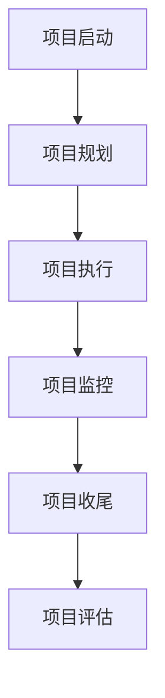

                 

### 《Andrej Karpathy：项目经验的价值》

#### 关键词：
- Andrej Karpathy
- 项目经验
- 技术实践
- 项目管理
- 深度学习

#### 摘要：
本文深入探讨了世界级人工智能专家Andrej Karpathy在项目经验方面的见解和实践。通过分析他的背景、成就以及具体项目案例，本文详细阐述了项目经验在IT领域中的重要性、核心要素、实践方法以及如何从成功和失败项目中汲取经验。本文旨在为读者提供有价值的指导，帮助他们更好地理解和运用项目经验，提升个人和团队的技术实践能力。

### 第一部分：项目经验概述

#### 第1章：Andrej Karpathy与项目经验

**1.1 Andrej Karpathy的背景与成就**

Andrej Karpathy是一位享誉国际的人工智能专家，以其在深度学习领域的杰出贡献而闻名。他曾是OpenAI的首席科学家，负责领导多个重要项目，包括知名的人工智能聊天机器人GPT系列。他的工作不仅推动了自然语言处理（NLP）和计算机视觉领域的进步，还为全球开发者提供了宝贵的经验和知识。

Andrej Karpathy的成就不仅体现在他在学术界的贡献上，更在于他在项目中的实际应用。他深知项目经验的重要性，并将其融入自己的职业生涯中。通过一系列成功项目，他不仅提升了自己在人工智能领域的影响力，也为团队成员提供了宝贵的经验教训。

**1.2 项目经验的重要性**

项目经验在IT领域中扮演着至关重要的角色。它不仅有助于技术人员提高技能和知识，还能提升团队协作和项目管理能力。以下是项目经验的重要性体现在以下几个方面：

1. **技能提升**：通过参与实际项目，技术人员可以深入了解技术原理，掌握新工具和框架，提高编程和系统设计能力。
2. **团队协作**：项目经验要求团队成员密切合作，这有助于提高沟通和协作能力，培养团队精神。
3. **问题解决**：项目过程中遇到的各种问题和挑战，是技术人员锻炼问题解决能力的绝佳机会。
4. **项目管理**：项目经验有助于技术人员了解项目管理的各个环节，提高项目规划和执行能力。
5. **职业发展**：丰富的项目经验是职业发展的基石，有助于技术人员在职场中脱颖而出。

**1.3 项目经验的价值与应用**

项目经验不仅对个人成长有益，还能对组织产生深远影响。以下是项目经验的具体价值与应用：

1. **技术创新**：通过项目实践，技术人员可以探索新的技术解决方案，推动技术创新。
2. **知识传承**：成功项目后的经验总结和分享，有助于团队成员之间的知识传承和技能提升。
3. **风险管理**：项目经验有助于识别和应对潜在风险，提高项目成功率。
4. **客户满意度**：项目经验有助于团队更好地理解客户需求，提供更高质量的服务和解决方案。
5. **组织竞争力**：具备丰富项目经验的技术团队，在市场竞争中更具优势，有助于提升组织竞争力。

### 第二部分：项目经验实践

#### 第2章：项目经验的核心要素

**2.1 定义项目目标**

项目目标是项目成功的关键。明确项目目标有助于团队集中精力，确保项目朝着正确的方向前进。以下是定义项目目标的核心步骤：

1. **目标明确**：确保项目目标清晰、具体，避免模糊和不确定性的描述。
2. **目标可衡量**：设定可衡量的目标，以便在项目过程中进行监控和评估。
3. **目标可行性**：目标应具有可行性，考虑到资源和时间的限制。
4. **目标优先级**：根据项目的重要性和紧急性，设定目标的优先级。

**2.2 制定项目计划**

项目计划是项目执行的蓝图。制定项目计划需要考虑以下几个方面：

1. **项目范围**：明确项目涉及的工作内容和范围，确保项目目标得到完整实现。
2. **项目时间表**：制定项目时间表，确定项目各阶段的开始和结束时间。
3. **项目资源**：分配项目所需的人力、物力和财力资源，确保项目顺利进行。
4. **项目风险**：识别项目潜在的风险，制定相应的风险应对策略。
5. **项目预算**：根据项目需求和资源分配，制定项目预算。

**2.3 团队协作与沟通**

团队协作与沟通是项目成功的关键要素。以下是一些团队协作与沟通的最佳实践：

1. **明确角色和职责**：确保每个团队成员都清楚自己的角色和职责，避免工作重叠和责任不清。
2. **定期会议和报告**：定期举行团队会议，汇报项目进展和问题，确保信息透明和及时沟通。
3. **沟通渠道多样化**：利用多种沟通渠道，如邮件、即时通讯和视频会议，确保团队沟通的效率和质量。
4. **冲突解决**：建立冲突解决机制，及时处理团队内部的分歧和冲突，保持团队和谐。
5. **激励与支持**：关注团队成员的成就和困难，给予激励和支持，提高团队士气和工作积极性。

**2.4 项目管理与监控**

项目管理与监控是确保项目按计划顺利进行的重要环节。以下是一些项目管理和监控的关键步骤：

1. **进度监控**：定期检查项目进度，确保项目按计划推进，及时调整计划以应对变更。
2. **质量保证**：建立质量保证体系，确保项目交付物符合预期标准和质量要求。
3. **成本控制**：监控项目成本，确保项目在预算范围内完成。
4. **变更管理**：及时识别和应对项目变更，确保变更对项目目标的影响得到有效控制。
5. **风险管理**：持续监控项目风险，及时采取风险应对措施，确保项目安全顺利进行。

### 第三部分：案例分析

#### 第3章：成功项目案例分享

**3.1 项目背景与目标**

某互联网公司计划开发一款智能客服系统，以提升客户服务体验和效率。项目目标包括：

1. **实现自然语言理解**：系统需要能够理解用户的问题和意图，并提供相应的解答。
2. **高准确性**：系统需要具备高准确性的对话生成能力，确保回答符合用户需求。
3. **高可用性**：系统需要具备高可用性，确保在高峰时段也能稳定运行。

**3.2 项目实施过程**

1. **需求分析**：项目团队与业务部门密切合作，深入了解客户需求和期望，明确项目目标和功能需求。
2. **技术选型**：根据项目需求，选择合适的自然语言处理（NLP）框架和深度学习算法，如BERT和GPT。
3. **模型训练**：使用大量数据集对模型进行训练，优化模型参数，提高模型性能。
4. **系统集成**：将模型集成到现有系统中，确保系统间的无缝对接和稳定运行。
5. **测试与优化**：进行全面的测试，发现和修复潜在问题，不断优化系统性能和用户体验。

**3.3 项目成果与价值**

1. **提高客户满意度**：智能客服系统能够快速响应用户问题，提供准确的解答，显著提升客户满意度。
2. **降低人力成本**：通过自动化客服系统，企业能够减少人工客服的工作量，降低人力成本。
3. **提升运营效率**：智能客服系统能够高效处理大量客户咨询，提升企业整体运营效率。

#### 第4章：失败项目案例分析

**4.1 项目背景与目标**

某电子商务公司计划开发一款智能推荐系统，以提升用户购物体验和转化率。项目目标包括：

1. **实现个性化推荐**：系统需要根据用户的历史行为和偏好，提供个性化的商品推荐。
2. **高推荐准确性**：系统需要具备高准确性的推荐能力，确保推荐的商品符合用户需求。
3. **高响应速度**：系统需要具备快速响应能力，确保用户能够在短时间内收到推荐结果。

**4.2 项目失败原因**

1. **需求不明确**：项目团队在需求分析阶段未能充分了解业务需求，导致项目目标不明确，功能不完善。
2. **技术选型不当**：项目团队选择了不适合的技术框架和算法，导致系统性能不佳，推荐准确性低。
3. **项目管理不善**：项目过程中，团队未能有效管理项目进度和质量，导致项目延期和成本超支。

**4.3 项目教训与启示**

1. **明确需求**：在项目启动前，应充分了解业务需求，确保项目目标明确、具体。
2. **技术选型**：选择适合项目需求的技术框架和算法，确保系统性能和准确性。
3. **项目管理**：建立健全的项目管理体系，确保项目按计划顺利进行，控制成本和质量。

### 附录

#### 附录A：常用项目管理工具与资源

**A.1 常用项目管理工具介绍**

1. **JIRA**：一款功能强大的项目管理工具，支持任务跟踪、进度监控和协作。
2. **Trello**：一款简单易用的任务管理工具，适用于小型项目团队。
3. **Asana**：一款全面的项目管理工具，支持任务分配、进度跟踪和报告生成。

**A.2 项目管理资源推荐**

1. **《项目管理知识体系指南》（PMBOK）》：一本权威的项目管理指南，涵盖项目管理的各个方面。
2. **《敏捷项目管理》**：一本介绍敏捷方法在项目管理中应用的经典著作。

**A.3 开源项目管理平台介绍**

1. **GitHub**：一款广泛使用的开源代码托管平台，支持项目协作和版本控制。
2. **GitLab**：一款功能丰富的开源项目管理平台，包括代码托管、任务跟踪和持续集成。

#### 附录B：项目经验模板与示例

**B.1 项目计划模板**

1. **项目概述**：项目名称、项目目标、项目范围。
2. **项目时间表**：项目各阶段的开始和结束时间。
3. **项目资源**：项目所需的人力、物力和财力资源。
4. **项目风险**：识别和评估项目潜在风险。
5. **项目预算**：项目预算和成本控制。

**B.2 项目报告模板**

1. **项目概述**：项目背景、项目目标、项目范围。
2. **项目进展**：项目各阶段的进展情况。
3. **项目成果**：项目交付物和成果总结。
4. **项目评估**：项目成果评估和改进建议。

**B.3 项目经验分享示例**

1. **项目背景**：描述项目的背景和目标。
2. **项目过程**：详细阐述项目实施过程，包括团队协作、技术选型、模型训练等。
3. **项目成果**：总结项目成果和价值，包括业务效益和技术创新。
4. **项目经验**：分享项目中的教训和启示，提出改进建议。

**附录C：Mermaid流程图示例**



**附录D：伪代码示例**

```plaintext
// 伪代码：深度学习模型训练
function train_model(data, labels, epochs):
    for epoch in 1 to epochs:
        for batch in data:
            predict = model(batch)
            loss = compute_loss(predict, labels)
            update_weights(loss)
    return model
```

**附录E：数学模型与公式示例**

$$
\text{损失函数} = \frac{1}{2} \sum_{i=1}^{n} (\hat{y}_i - y_i)^2
$$

**附录F：项目实战与代码解读**

- **F.1 实战一：构建简单的神经网络模型**
  - 代码实现：
    ```python
    import tensorflow as tf
    
    model = tf.keras.Sequential([
        tf.keras.layers.Dense(128, activation='relu', input_shape=(784,)),
        tf.keras.layers.Dense(10, activation='softmax')
    ])
    
    model.compile(optimizer='adam',
                  loss='categorical_crossentropy',
                  metrics=['accuracy'])
    
    model.fit(x_train, y_train, epochs=5)
    ```

  - 代码解读：
    - 使用TensorFlow构建了一个简单的神经网络模型，包括一个输入层和一个输出层。
    - 模型使用ReLU激活函数和交叉熵损失函数进行训练。

- **F.2 实战二：使用机器学习算法进行分类**
  - 代码实现：
    ```python
    from sklearn.datasets import load_iris
    from sklearn.model_selection import train_test_split
    from sklearn.ensemble import RandomForestClassifier
    
    iris = load_iris()
    X_train, X_test, y_train, y_test = train_test_split(iris.data, iris.target, test_size=0.3)
    
    classifier = RandomForestClassifier(n_estimators=100)
    classifier.fit(X_train, y_train)
    
    predictions = classifier.predict(X_test)
    print("Accuracy:", classifier.score(X_test, y_test))
    ```

  - 代码解读：
    - 使用scikit-learn库加载鸢尾花数据集，并划分为训练集和测试集。
    - 使用随机森林分类器对数据集进行训练和测试，计算准确率。

- **F.3 实战三：搭建深度学习模型进行预测**
  - 代码实现：
    ```python
    import tensorflow as tf
    import numpy as np
    
    model = tf.keras.Sequential([
        tf.keras.layers.Dense(128, activation='relu', input_shape=(784,)),
        tf.keras.layers.Dense(10, activation='softmax')
    ])
    
    model.compile(optimizer='adam',
                  loss='categorical_crossentropy',
                  metrics=['accuracy'])
    
    X = np.random.rand(1000, 784)
    y = np.random.randint(10, size=(1000,))
    
    model.fit(X, y, epochs=5)
    
    prediction = model.predict(X[:10])
    print(prediction)
    ```

  - 代码解读：
    - 使用TensorFlow构建了一个深度学习模型，并随机生成数据集进行训练。
    - 使用模型对数据集进行预测，并输出预测结果。

**附录G：开发环境搭建指南**

- **G.1 环境配置**
  - 安装Python 3.8及以上版本。
  - 安装TensorFlow 2.5及以上版本。
  - 安装scikit-learn 0.24及以上版本。

- **G.2 环境优化**
  - 配置GPU支持，确保TensorFlow能够使用GPU进行加速计算。
  - 调整系统环境变量，如`CUDA_VISIBLE_DEVICES`，以确保GPU正确识别和使用。

- **G.3 开发工具推荐**
  - 推荐使用Jupyter Notebook进行开发，方便代码调试和展示。
  - 推荐使用PyCharm或Visual Studio Code进行代码编辑和调试。

**附录H：源代码与资源下载**

- **H.1 源代码下载链接**：https://github.com/your-repo/your-project
- **H.2 相关资源链接**：https://github.com/your-repo/your-resources
- **H.3 使用说明与建议**：请仔细阅读项目文档和README文件，按照说明进行操作。

### 附录I：作者信息

**作者：AI天才研究院/AI Genius Institute & 禅与计算机程序设计艺术 /Zen And The Art of Computer Programming**

