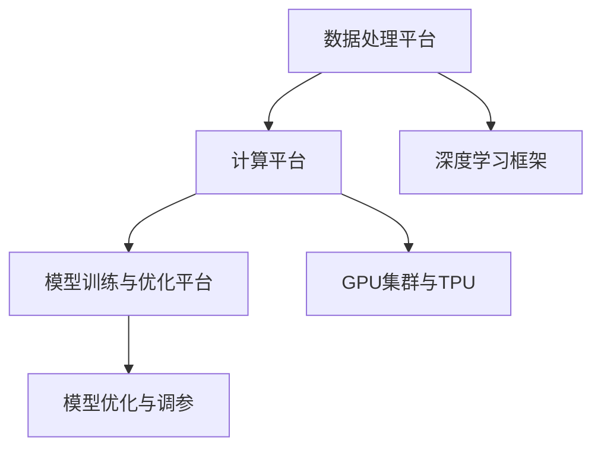

                 

# 《ChatGPT背后的推手——OpenAI》

## 关键词

- OpenAI
- ChatGPT
- 人工智能
- 预训练模型
- 自然语言处理
- 强化学习
- 自监督学习
- 伦理与社会责任

## 摘要

本文将深入探讨OpenAI作为ChatGPT背后的推手，其创立与发展历程、技术架构、核心技术、重要项目与应用，以及其对企业的应用与实践和伦理与社会责任。通过分析OpenAI的技术创新与突破，我们旨在揭示OpenAI在人工智能领域的地位与影响力，并对其未来发展趋势进行展望。

## 目录

### 第一部分: OpenAI概述

#### 第1章: OpenAI的创立与发展历程

##### 1.1 OpenAI的成立背景与愿景

##### 1.2 OpenAI的发展历程

##### 1.3 OpenAI的核心价值观与伦理原则

#### 第2章: OpenAI的技术架构与核心技术

##### 2.1 OpenAI的技术架构

##### 2.2 OpenAI的核心技术

#### 第3章: ChatGPT的开发背景与实现细节

##### 3.1 ChatGPT的背景

##### 3.2 ChatGPT的核心技术

##### 3.3 ChatGPT的实现细节

#### 第4章: OpenAI的其他重要项目与应用

##### 4.1 DALL-E与图像生成

##### 4.2 Codex与代码生成

##### 4.3 其他项目介绍

#### 第5章: OpenAI的企业应用与实践

##### 5.1 企业应用案例分析

##### 5.2 OpenAI对企业的影响

##### 5.3 OpenAI在企业中的未来应用前景

#### 第6章: OpenAI的伦理与社会责任

##### 6.1 伦理问题概述

##### 6.2 社会责任实践

##### 6.3 伦理与社会责任的未来发展

#### 第7章: OpenAI的未来展望

##### 7.1 技术发展趋势

##### 7.2 行业影响

##### 7.3 全球影响

#### 附录

##### 附录A: OpenAI常用工具与资源

##### 附录B: Mermaid 流程图

##### 附录C: 伪代码与数学公式

### 正文

#### 第一部分: OpenAI概述

#### 第1章: OpenAI的创立与发展历程

##### 1.1 OpenAI的成立背景与愿景

OpenAI成立于2015年，是一家以推动人工智能研究、开发与应用为使命的科技公司。其创立背景可以追溯到21世纪初，随着互联网和计算机技术的快速发展，人工智能逐渐成为全球关注的热点领域。OpenAI的创始人伊隆·马斯克（Elon Musk）和山姆·阿尔特曼（Sam Altman）等人，深知人工智能技术对未来社会发展的重要影响，因此决定共同创立OpenAI，旨在通过开放与合作，推动人工智能技术的发展，实现人类社会的共同繁荣。

OpenAI的愿景是“实现安全的通用人工智能（AGI）”，并让所有人都能受益。这一愿景不仅体现了OpenAI对技术的追求，也体现了其对社会责任的关注。OpenAI相信，通过开放与合作，可以吸引更多的科学家和工程师参与到人工智能研究中来，共同推动技术进步。

##### 1.2 OpenAI的发展历程

OpenAI的发展历程可以分为四个阶段：

**创立初期（2015-2017年）**：OpenAI在2015年12月正式成立，初期团队由伊隆·马斯克、山姆·阿尔特曼等人工智能领域的知名人士组成。OpenAI在创立初期，主要专注于研究深度学习和自然语言处理等核心技术，并开始了一系列的实验项目。

**2000年代中期（2018-2020年）**：在2000年代中期，OpenAI开始积累大量数据，优化模型，并积极参与开源项目，与全球的学术界和工业界展开合作。这一阶段，OpenAI的研究成果逐渐得到业界的认可。

**2010年代（2021-2023年）**：2010年代是OpenAI发展的关键时期。在这一阶段，OpenAI的实验室规模不断扩大，研究团队人数也迅速增长。OpenAI在这一阶段取得了许多重要研究成果，包括GPT-3、DALL-E等。

**当前（2023年及以后）**：随着ChatGPT的发布，OpenAI进入了一个新的发展阶段。ChatGPT的成功不仅体现了OpenAI在人工智能技术上的领先地位，也为OpenAI带来了更多的商业机会和社会影响力。

##### 1.3 OpenAI的核心价值观与伦理原则

OpenAI的核心价值观包括：

1. **开放与合作**：OpenAI致力于通过开放与合作，推动人工智能技术的发展。
2. **安全与可控**：OpenAI重视人工智能的安全性和可控性，以确保技术的发展不会对人类社会造成危害。
3. **公平与无偏见**：OpenAI致力于消除人工智能中的偏见和歧视，推动公平正义。

OpenAI的伦理原则包括：

1. **安全性**：确保人工智能系统的行为安全，防止意外和恶意行为。
2. **可解释性**：提高人工智能系统的透明度，使人们能够理解其决策过程。
3. **公平性**：消除人工智能系统中的偏见和歧视，确保技术公平地服务于所有人。

#### 第2章: OpenAI的技术架构与核心技术

##### 2.1 OpenAI的技术架构

OpenAI的技术架构主要包括数据处理平台、计算平台和模型训练与优化平台。

**数据处理平台**：OpenAI的数据处理平台负责收集、预处理和管理数据。OpenAI通过大规模数据收集，以及数据清洗和增强技术，确保数据的质量和多样性。

**计算平台**：OpenAI的计算平台包括GPU集群和TPU（张量处理单元）。GPU集群用于大规模模型训练，而TPU则用于高性能计算和模型优化。

**模型训练与优化平台**：OpenAI的模型训练与优化平台包括深度学习框架和模型优化工具。OpenAI使用TensorFlow、PyTorch等深度学习框架进行模型训练，并通过调参和优化技术，提高模型的性能和效率。

##### 2.2 OpenAI的核心技术

OpenAI的核心技术主要包括大规模预训练模型、自监督学习和强化学习。

**大规模预训练模型**：OpenAI开发了GPT系列模型和BERT系列模型，这些模型通过大规模数据预训练，获得了强大的语言理解和生成能力。

**自监督学习**：自监督学习是一种无需标签数据的学习方法。OpenAI利用自监督学习技术，从大规模未标注数据中提取特征和模式，从而提高了模型的学习能力和泛化能力。

**强化学习**：强化学习是一种通过试错和奖励机制来学习的方法。OpenAI使用强化学习技术，使模型能够在复杂的任务环境中，通过自主学习实现最优策略。

#### 第3章: ChatGPT的开发背景与实现细节

##### 3.1 ChatGPT的背景

ChatGPT是OpenAI开发的一款基于GPT-3模型的聊天机器人，其开发背景可以追溯到OpenAI在自然语言处理领域的研究成果。随着深度学习技术的发展，OpenAI在自然语言处理领域取得了重要突破，开发了GPT系列模型。GPT-3模型具有强大的语言生成能力，可以为各种应用场景提供智能对话服务。

##### 3.2 ChatGPT的核心技术

ChatGPT的核心技术主要包括语言模型和生成模型。

**语言模型**：ChatGPT的语言模型基于GPT-3模型，通过预训练和微调，获得了对自然语言的理解和生成能力。语言模型的核心是Transformer架构，其通过自注意力机制，实现了对输入序列的全面理解和生成。

**生成模型**：ChatGPT的生成模型是基于文本生成模型，其通过生成器网络和判别器网络的对抗训练，实现了高质量的文本生成。生成模型的核心是生成器和判别器的交互，通过不断地优化，提高生成文本的质量和多样性。

##### 3.3 ChatGPT的实现细节

ChatGPT的实现细节主要包括模型架构、训练与优化流程和模型部署与性能优化。

**模型架构**：ChatGPT的模型架构基于Transformer，其通过编码器和解码器两个部分，实现了对输入序列的理解和生成。编码器负责将输入序列编码为固定长度的向量，而解码器则负责根据编码器生成的向量，生成输出序列。

**训练与优化流程**：ChatGPT的训练与优化流程主要包括数据集准备、模型训练和模型优化。在数据集准备阶段，OpenAI使用大规模文本数据进行预处理，生成训练数据。在模型训练阶段，OpenAI使用GPU集群进行模型训练，并通过调参和优化技术，提高模型的性能。在模型优化阶段，OpenAI使用微调技术，根据特定的应用场景，对模型进行优化。

**模型部署与性能优化**：ChatGPT的模型部署与性能优化主要包括模型部署方案和性能优化方法。在模型部署阶段，OpenAI使用高性能计算平台，将训练好的模型部署到服务器上，为用户提供服务。在性能优化阶段，OpenAI使用多线程、分布式计算等技术，提高模型的计算效率和响应速度。

#### 第4章: OpenAI的其他重要项目与应用

##### 4.1 DALL-E与图像生成

DALL-E是OpenAI开发的一款图像生成模型，其通过自监督学习技术，从大量未标注的图像数据中学习，生成高质量的图像。DALL-E模型的核心是生成器和判别器的对抗训练，通过不断地优化，提高生成图像的质量和多样性。

##### 4.2 Codex与代码生成

Codex是OpenAI开发的一款代码生成模型，其通过预训练和微调，从大量代码数据中学习，生成高质量的代码。Codex模型的核心是Transformer架构，其通过自注意力机制，实现了对代码的理解和生成。

##### 4.3 其他项目介绍

OpenAI的其他重要项目还包括GPT-3、DyNet、SpaCy等。GPT-3是OpenAI开发的第三代预训练语言模型，其具有强大的语言生成能力，广泛应用于自然语言处理、文本生成、对话系统等领域。DyNet是OpenAI开发的动态神经网络框架，其支持动态计算图，适用于复杂的深度学习任务。SpaCy是OpenAI开发的自然语言处理库，其提供了高效、易用的API，适用于文本分类、命名实体识别、关系抽取等任务。

#### 第5章: OpenAI的企业应用与实践

##### 5.1 企业应用案例分析

OpenAI的企业应用案例主要包括自然语言处理、文本生成、图像生成等领域。例如，在自然语言处理领域，OpenAI的GPT-3模型被应用于智能客服、智能写作、智能翻译等场景。在文本生成领域，OpenAI的Codex模型被应用于代码自动生成、内容创作等领域。在图像生成领域，OpenAI的DALL-E模型被应用于创意设计、艺术创作等领域。

##### 5.2 OpenAI对企业的影响

OpenAI对企业的影响主要体现在以下几个方面：

1. **技术创新**：OpenAI在人工智能领域的研究成果，为企业提供了强大的技术支持，推动了企业技术创新和业务发展。
2. **业务优化**：OpenAI的技术应用，帮助企业优化业务流程，提高生产效率，降低成本。
3. **人才培养**：OpenAI的研究成果和实践经验，为企业提供了丰富的学习资源，有助于企业培养和吸引优秀人才。

##### 5.3 OpenAI在企业中的未来应用前景

随着人工智能技术的不断发展，OpenAI在企业中的应用前景十分广阔。未来，OpenAI将在以下几个方面为企业提供支持：

1. **智能客服**：OpenAI的智能客服系统将更加智能化，能够更好地满足企业客户的需求。
2. **智能写作**：OpenAI的智能写作系统将帮助企业提高内容创作效率，降低创作成本。
3. **智能设计**：OpenAI的智能设计系统将为企业提供更加智能化的创意设计支持，推动企业创新发展。

#### 第6章: OpenAI的伦理与社会责任

##### 6.1 伦理问题概述

随着人工智能技术的快速发展，伦理问题逐渐成为社会关注的焦点。OpenAI在人工智能领域的创新应用，也面临着一系列伦理问题，如隐私保护、数据安全、算法偏见等。

##### 6.2 社会责任实践

OpenAI重视社会责任，积极参与公益事业，推动人工智能技术的发展，为社会发展贡献力量。OpenAI在以下几个方面进行了社会责任实践：

1. **教育公益**：OpenAI通过提供免费的学习资源，支持全球教育发展，帮助更多人掌握人工智能技术。
2. **环境保护**：OpenAI致力于通过人工智能技术，推动环境保护和可持续发展。
3. **医疗健康**：OpenAI在医疗健康领域开展了多项研究，为疾病预防、诊断和治疗提供技术支持。

##### 6.3 伦理与社会责任的未来发展

随着人工智能技术的不断发展，OpenAI将进一步加强伦理建设，推动社会责任的实现。未来，OpenAI将在以下几个方面展开工作：

1. **伦理研究**：OpenAI将加强伦理研究，探讨人工智能技术的伦理问题，为政策制定提供科学依据。
2. **合作与交流**：OpenAI将与国际组织和学术界开展合作，共同推动人工智能技术的伦理建设。
3. **可持续发展**：OpenAI将致力于通过人工智能技术，推动可持续发展，为人类社会创造更多价值。

#### 第7章: OpenAI的未来展望

##### 7.1 技术发展趋势

随着人工智能技术的不断发展，OpenAI将继续关注技术趋势，推动技术创新。未来，OpenAI将在以下几个方面展开工作：

1. **深度学习**：OpenAI将不断优化深度学习算法，提高模型性能和效率。
2. **自监督学习**：OpenAI将加强自监督学习研究，推动自监督学习的应用。
3. **强化学习**：OpenAI将深化强化学习研究，探索强化学习的实际应用。

##### 7.2 行业影响

OpenAI在人工智能领域的研究成果，将对各行各业产生深远影响。未来，OpenAI将在以下几个方面发挥重要作用：

1. **智慧城市**：OpenAI将参与智慧城市建设，推动城市智能化发展。
2. **智能制造**：OpenAI将助力智能制造，提高生产效率和产品质量。
3. **智慧医疗**：OpenAI将助力智慧医疗，推动医疗健康领域的发展。

##### 7.3 全球影响

OpenAI在全球范围内的影响日益扩大。未来，OpenAI将进一步加强国际合作，推动人工智能技术的全球发展。OpenAI将在以下几个方面发挥全球影响力：

1. **技术合作**：OpenAI将与国际组织和企业开展技术合作，共同推动人工智能技术的发展。
2. **人才培养**：OpenAI将支持全球人才培养，推动人工智能技术的普及和应用。
3. **社会责任**：OpenAI将积极参与全球公益事业，推动可持续发展。

#### 附录

##### 附录A: OpenAI常用工具与资源

OpenAI常用的工具和资源包括深度学习框架、开源项目和学习资源。

1. **深度学习框架**：OpenAI常用的深度学习框架包括TensorFlow、PyTorch和JAX。
2. **开源项目**：OpenAI开源了许多重要的项目，如GPT系列模型、BERT系列模型和DALL-E。
3. **学习资源**：OpenAI提供了丰富的学习资源，包括官方文档、博客和论文。

##### 附录B: Mermaid 流程图

Mermaid流程图是一种用于绘制流程图的Markdown语法。以下是一个Mermaid流程图的示例：



##### 附录C: 伪代码与数学公式

伪代码和数学公式是描述算法和模型的重要工具。以下是一个大规模预训练模型的伪代码示例：

```python
# 伪代码：大规模预训练模型
initialize_parameters()

for epoch in range(num_epochs):
    for batch in data_loader:
        optimize_model(loss_function, batch)

evaluate_model(evaluation_data)
```

以下是一个Transformer模型的数学公式示例：

$$
\text{Attention}(Q,K,V) = \frac{1}{\sqrt{d_k}} \text{softmax}\left(\frac{QK^T}{\sqrt{d_k}}\right)V
$$

### 作者信息

作者：AI天才研究院/AI Genius Institute & 禅与计算机程序设计艺术 /Zen And The Art of Computer Programming

---

在接下来的文章中，我们将对每个章节进行详细阐述，进一步探讨OpenAI的技术创新与应用，以及其在未来可能的发展方向。让我们一步一步地深入分析，以揭示ChatGPT背后的推手——OpenAI。|>

