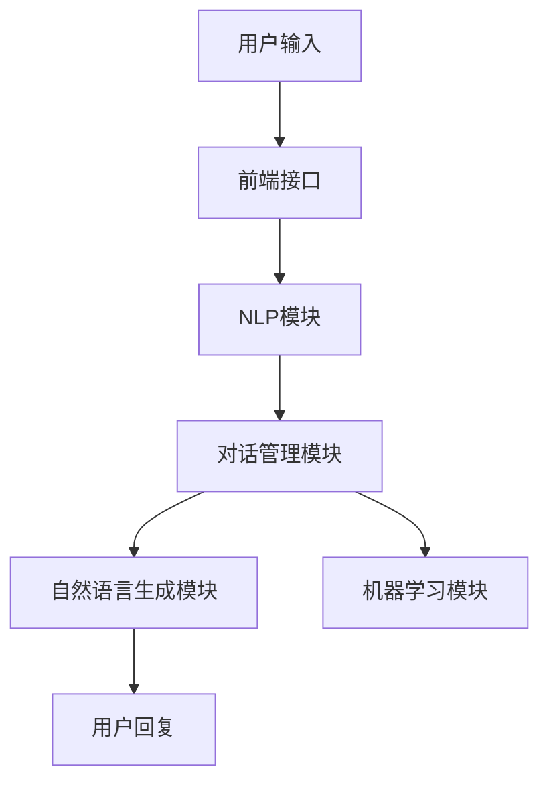

                 

# 《ChatMind的快速成功之路》

> 关键词：ChatMind、自然语言处理、对话系统、人工智能、应用实践

> 摘要：本文将深入探讨ChatMind的技术基础、应用场景以及未来发展，旨在为读者提供一个全面而深入的ChatMind技术指南。我们将从基本概念入手，逐步分析其技术原理，并通过实际案例展示ChatMind在不同领域的应用，最后展望其未来发展的前景。

## 目录大纲

### 第一部分：ChatMind基础与原理

#### 第1章：ChatMind概述
1.1 ChatMind的定义
1.2 ChatMind的发展历程
1.3 ChatMind的核心技术

#### 第2章：自然语言处理基础
2.1 语言模型
2.1.1 语言模型的定义
2.1.2 语言模型的分类
2.2 语义理解
2.2.1 语义理解的定义
2.2.2 语义理解的分类
2.3 对话管理
2.3.1 对话管理的定义
2.3.2 对话管理的关键技术

#### 第3章：ChatMind架构详解
3.1 ChatMind的架构设计
3.2 ChatMind的关键模块
3.3 ChatMind的性能优化

### 第二部分：ChatMind应用实战

#### 第4章：ChatMind在客户服务中的应用
4.1 客户服务的挑战与机遇
4.2 ChatMind在客户服务中的应用
4.3 案例分析：ChatMind在电商客户服务中的应用

#### 第5章：ChatMind在智能助手中的应用
5.1 智能助手的需求分析
5.2 ChatMind在智能助手中的应用
5.3 案例分析：ChatMind在个人助理中的应用

#### 第6章：ChatMind在内容生成中的应用
6.1 内容生成的挑战与机遇
6.2 ChatMind在内容生成中的应用
6.3 案例分析：ChatMind在新闻写作中的应用

#### 第7章：ChatMind项目实践
7.1 ChatMind项目规划
7.2 ChatMind项目开发流程
7.3 ChatMind项目部署与维护

### 第三部分：ChatMind的未来与发展

#### 第8章：ChatMind面临的挑战与机遇
8.1 挑战
8.1.1 技术挑战
8.1.2 商业挑战
8.2 机遇
8.2.1 市场需求
8.2.2 技术创新

#### 第9章：ChatMind的未来发展趋势
9.1 ChatMind在AI领域的融合
9.2 ChatMind在垂直行业中的应用
9.3 ChatMind的可持续发展路径

### 附录

#### 附录A：ChatMind开发工具与资源
A.1 开发工具介绍
A.2 资源链接

---

### 引入

在人工智能迅猛发展的今天，对话系统已经成为智能服务的重要形式。而ChatMind作为新一代对话系统技术，正引领着这一领域的革新。ChatMind的核心目标是构建能够与人类自然交流的智能系统，提供高质量、高效率的服务。无论是客户服务、智能助手还是内容生成，ChatMind都展现出了强大的应用潜力。

本文旨在为读者提供一个全方位的ChatMind技术指南。首先，我们将介绍ChatMind的基础知识，包括其定义、发展历程和技术原理。接着，我们将深入探讨自然语言处理（NLP）的基础知识，为理解ChatMind的技术架构打下基础。随后，我们将详细分析ChatMind的架构设计、关键模块和性能优化策略。

在应用实战部分，我们将展示ChatMind在不同领域中的应用案例，通过实际项目来讲解其开发流程和部署方法。最后，我们将探讨ChatMind面临的挑战与机遇，并对其未来发展进行展望。希望通过本文，读者能够全面了解ChatMind的技术原理和应用实践，为其在人工智能领域的成功奠定基础。

### 第一部分：ChatMind基础与原理

#### 第1章：ChatMind概述

## 1.1 ChatMind的定义

ChatMind，顾名思义，是一种基于人工智能技术的对话系统。它不仅仅是一个简单的问答机器，而是一个具备理解、推理和生成能力的智能系统。ChatMind通过自然语言处理（NLP）技术，能够与用户进行流畅的对话，提供个性化服务。其核心目标是实现人与机器之间的自然、高效沟通，提升用户体验。

ChatMind的主要功能包括：

- **理解用户意图**：通过NLP技术，ChatMind能够理解用户的话语含义，识别用户的需求和意图。
- **生成自然回复**：ChatMind能够根据用户的问题和对话内容，生成连贯、自然的回复，模拟人类交流方式。
- **持续学习与优化**：通过机器学习和深度学习算法，ChatMind能够从对话中学习，不断优化自己的性能和交互效果。

## 1.2 ChatMind的发展历程

ChatMind的发展历程可以追溯到自然语言处理和人工智能技术的起步阶段。随着计算能力和数据量的提升，NLP和AI技术取得了飞速发展，为ChatMind的诞生提供了技术基础。以下是ChatMind发展历程的几个关键节点：

- **早期探索**：20世纪50年代，人工智能概念首次提出，研究者开始尝试开发简单的对话系统。
- **语音识别和语意分析**：20世纪80年代，语音识别和自然语言理解技术取得重要进展，为对话系统的发展奠定了基础。
- **大数据与深度学习**：21世纪初，随着大数据和深度学习技术的发展，NLP和对话系统的性能大幅提升，ChatMind逐渐成为现实。
- **多模态交互**：近年来，ChatMind逐渐融合语音、图像等多种交互方式，提供更加丰富的用户体验。

## 1.3 ChatMind的核心技术

ChatMind的核心技术主要包括自然语言处理（NLP）、对话系统和机器学习算法。以下是这些核心技术的基本概念和作用：

### 1.3.1 自然语言处理（NLP）

自然语言处理是人工智能的一个重要分支，旨在让计算机理解、生成和处理自然语言。NLP的核心任务包括：

- **分词**：将文本拆分成单词或词组，以便进行后续处理。
- **词性标注**：为每个单词或词组标注其词性，如名词、动词、形容词等。
- **句法分析**：分析句子的结构，识别句子的成分和关系。
- **语义理解**：理解文本的含义，提取关键信息，进行语义推理。

NLP在ChatMind中的作用是理解用户的话语，提取关键信息，并生成相应的回复。

### 1.3.2 对话系统

对话系统是一种人与计算机进行交互的软件系统，旨在模拟人类对话过程。对话系统通常包括以下关键模块：

- **意图识别**：识别用户的意图，如查询信息、提供建议、执行操作等。
- **实体识别**：识别用户话语中的关键实体，如人名、地点、时间等。
- **对话管理**：根据用户意图和上下文信息，决定对话的走向和回复。
- **自然语言生成**：根据对话内容和用户意图，生成自然、连贯的回复。

### 1.3.3 机器学习算法

机器学习算法是ChatMind的核心驱动力，用于训练模型，优化对话系统的性能。常用的机器学习算法包括：

- **监督学习**：使用已标记的数据训练模型，如分类、回归等。
- **无监督学习**：在没有标记数据的情况下，自动发现数据中的模式，如聚类、降维等。
- **强化学习**：通过试错和反馈，学习最优策略，如游戏AI、机器人控制等。

机器学习算法在ChatMind中的应用包括：

- **训练语言模型**：通过大量语料库，训练语言模型，提升对话系统的语言理解能力。
- **优化对话策略**：通过分析对话数据，优化对话管理模块，提升对话效果。
- **自适应学习**：根据用户反馈，不断调整对话策略，提升用户体验。

### 1.3.4 ChatMind的架构设计

ChatMind的架构设计通常包括以下几个关键模块：

- **前端接口**：提供用户与ChatMind交互的界面，可以是文本、语音或图形界面。
- **NLP模块**：负责处理自然语言输入，包括分词、词性标注、句法分析等。
- **对话管理模块**：根据用户意图和上下文信息，决定对话的走向和回复。
- **自然语言生成模块**：生成自然、连贯的回复，模拟人类对话。
- **机器学习模块**：用于训练和优化对话系统模型。

### 1.3.5 ChatMind的优势与挑战

ChatMind作为一种先进的对话系统，具有以下优势：

- **自然交互**：ChatMind能够理解用户的自然语言输入，提供流畅、自然的对话体验。
- **个性化服务**：通过学习用户行为和偏好，ChatMind能够提供个性化的服务和建议。
- **多模态交互**：ChatMind支持文本、语音、图像等多种交互方式，提供更加丰富的用户体验。

然而，ChatMind也面临以下挑战：

- **理解能力限制**：虽然NLP技术不断发展，但ChatMind仍然无法完全理解用户的复杂意图和语境。
- **性能优化需求**：为了提升对话系统的响应速度和准确性，需要不断优化算法和模型。
- **数据安全与隐私**：在处理用户数据时，需要确保数据的安全性和用户隐私。

总之，ChatMind作为一种先进的对话系统技术，正不断推动人工智能技术的发展。通过本文的介绍，我们希望读者能够对ChatMind有一个全面的了解，为其在实际应用中的成功奠定基础。

---

在这一章节中，我们介绍了ChatMind的定义、发展历程及其核心技术。通过理解这些基本概念，读者可以初步了解ChatMind的工作原理和优势。接下来，我们将深入探讨自然语言处理（NLP）的基础知识，为理解ChatMind的技术架构打下基础。

## 第2章：自然语言处理基础

### 2.1 语言模型

语言模型是自然语言处理（NLP）的核心组件之一，它用于预测一段文本的下一个单词或词组。语言模型的主要目标是理解语言的统计规律，从而生成流畅、自然的文本。在ChatMind中，语言模型是实现智能对话的关键。

#### 2.1.1 语言模型的定义

语言模型是一种概率模型，它基于大量文本数据，预测下一个词或短语的概率。最常见的语言模型是基于统计的，即根据历史文本数据，统计出每个词或短语的共现概率。

#### 2.1.2 语言模型的分类

语言模型可以分为以下几类：

1. **n-gram模型**：n-gram模型是一种基于短语的统计模型，它假设一个词或短语的下一个词只与它前面的n个词相关。n-gram模型简单易实现，但在长文本中表现不佳。

2. **神经网络语言模型**：神经网络语言模型（如神经网络概率模型、递归神经网络（RNN）和长短期记忆网络（LSTM））通过学习文本的序列特征，能够更好地捕捉长距离依赖关系，相比n-gram模型有更好的性能。

3. **深度学习语言模型**：深度学习语言模型（如Transformer和BERT）通过引入自注意力机制和大量训练数据，取得了显著的性能提升。Transformer模型尤其被广泛应用于ChatMind中的对话生成任务。

#### 2.1.3 语言模型在ChatMind中的应用

在ChatMind中，语言模型主要用于以下几个方面：

1. **对话生成**：ChatMind利用语言模型生成自然、流畅的回复，模拟人类对话方式。

2. **意图识别**：通过分析用户输入的文本，ChatMind可以利用语言模型预测用户的意图，从而提供更准确的回复。

3. **实体识别**：语言模型可以帮助ChatMind识别文本中的关键实体，如人名、地点、时间等，为后续对话管理提供支持。

### 2.2 语义理解

语义理解是NLP的另一个关键任务，旨在理解文本的含义和意图。语义理解不仅需要识别文本中的单词和短语，还需要理解它们之间的关系和上下文。

#### 2.2.1 语义理解的定义

语义理解是指对文本内容进行深入分析，提取其语义信息，包括事实、观点、情感等。语义理解的目标是使计算机能够理解人类语言，从而实现更加智能的交互。

#### 2.2.2 语义理解的分类

语义理解可以分为以下几类：

1. **词义消歧**：在文本中，一个词可能有多个含义，词义消歧的任务是确定在特定语境下该词的确切含义。

2. **实体识别**：实体识别是指识别文本中的关键实体，如人名、地点、组织等。

3. **关系提取**：关系提取是指识别文本中实体之间的关系，如人物的关系、地点的位置等。

4. **情感分析**：情感分析是指识别文本中的情感倾向，如正面、负面或中立。

#### 2.2.3 语义理解在ChatMind中的应用

在ChatMind中，语义理解主要用于以下几个方面：

1. **对话管理**：通过语义理解，ChatMind可以更好地理解用户的意图和上下文，从而生成更准确的回复。

2. **实体识别**：语义理解可以帮助ChatMind识别文本中的关键实体，如用户提到的人名、地点等，为后续对话提供支持。

3. **情感分析**：情感分析可以帮助ChatMind识别用户的情绪状态，从而调整对话策略，提供更贴心的服务。

### 2.3 对话管理

对话管理是ChatMind的核心功能之一，旨在维护对话的流畅性和一致性。对话管理涉及多个方面，包括意图识别、上下文维护和回复生成。

#### 2.3.1 对话管理的定义

对话管理是指对对话过程进行控制和管理，确保对话的顺利进行。对话管理的目标是提供高质量、连贯的对话体验，使ChatMind能够与用户进行有效沟通。

#### 2.3.2 对话管理的关键技术

对话管理的关键技术包括：

1. **意图识别**：意图识别是指识别用户的对话意图，如查询信息、提供建议、执行操作等。意图识别是对话管理的基础，决定了对话的走向。

2. **上下文维护**：上下文维护是指维持对话的上下文信息，确保对话的一致性和连贯性。上下文信息包括用户的意图、实体、情感等。

3. **回复生成**：回复生成是指根据用户的意图和上下文信息，生成自然、流畅的回复。回复生成是对话管理的核心，决定了对话的质量。

#### 2.3.3 对话管理在ChatMind中的应用

在ChatMind中，对话管理主要用于以下几个方面：

1. **对话引导**：通过意图识别和上下文维护，ChatMind可以引导对话方向，确保对话的顺利进行。

2. **问题解答**：通过意图识别和上下文维护，ChatMind可以更好地理解用户的问题，提供准确的答案。

3. **情感互动**：通过情感分析，ChatMind可以识别用户的情绪状态，调整对话策略，提供更贴心的服务。

在这一章节中，我们详细介绍了自然语言处理（NLP）的基础知识，包括语言模型、语义理解和对话管理。这些基础知识是理解ChatMind技术架构和实现的关键。在下一章中，我们将深入探讨ChatMind的架构设计，解析其各个模块的原理和实现方法。

### 第3章：ChatMind架构详解

在了解了自然语言处理（NLP）的基础知识后，我们将深入探讨ChatMind的架构设计，解析其各个模块的原理和实现方法。ChatMind的架构设计旨在实现高效的对话生成和管理，为用户提供高质量、自然的交流体验。

## 3.1 ChatMind的架构设计

ChatMind的架构设计通常包括以下几个核心模块：前端接口、NLP模块、对话管理模块、自然语言生成模块和机器学习模块。以下是对这些模块的详细描述：

### 3.1.1 前端接口

前端接口是用户与ChatMind交互的入口。它可以是文本聊天界面、语音聊天界面或图形用户界面（GUI）。前端接口负责接收用户的输入，将输入内容传递给NLP模块，并将ChatMind的回复呈现给用户。

前端接口的设计应考虑以下要点：

- **易用性**：界面应简洁直观，方便用户进行交互。
- **多模态支持**：支持文本、语音和图像等多种交互方式，满足不同用户的需求。
- **实时性**：保证用户输入和回复的实时传输，提供流畅的交互体验。

### 3.1.2 NLP模块

NLP模块是ChatMind的核心组件，负责处理用户的自然语言输入。NLP模块通常包括以下几个子模块：

- **分词器**：将用户的输入文本拆分成单词或词组，以便进行后续处理。
- **词性标注器**：为每个单词或词组标注其词性，如名词、动词、形容词等，帮助理解文本的语法结构。
- **句法分析器**：分析句子的结构，识别句子的成分和关系，为后续的语义理解提供支持。
- **实体识别器**：识别文本中的关键实体，如人名、地点、时间等，为对话管理提供上下文信息。
- **语义理解器**：提取文本的语义信息，理解用户的意图和需求。

NLP模块的设计应考虑以下要点：

- **准确性**：确保NLP模块能够准确理解用户的输入，减少误解和错误。
- **可扩展性**：支持多种语言和方言，适应不同的应用场景。
- **高效性**：优化NLP模块的性能，减少响应时间，提高用户体验。

### 3.1.3 对话管理模块

对话管理模块负责维护对话的流畅性和一致性，确保ChatMind能够与用户进行有效的交流。对话管理模块主要包括以下几个子模块：

- **意图识别器**：识别用户的意图，如查询信息、提供建议、执行操作等。
- **上下文维护器**：维护对话的上下文信息，确保对话的连贯性和一致性。
- **回复生成器**：根据用户的意图和上下文信息，生成自然、流畅的回复。
- **对话策略器**：制定对话策略，指导对话的走向，提高对话的效果。

对话管理模块的设计应考虑以下要点：

- **灵活性**：根据不同的对话场景，灵活调整对话策略和回复生成方式。
- **适应性**：能够根据用户的反馈和对话历史，自适应地调整对话策略和回复生成。
- **连贯性**：确保对话的连贯性和一致性，提供高质量的对话体验。

### 3.1.4 自然语言生成模块

自然语言生成模块（NLG）负责根据用户的输入和对话管理模块的输出，生成自然、连贯的回复。NLG模块通常包括以下几个子模块：

- **回复模板生成器**：根据对话内容和用户意图，生成回复的模板，为后续的文本生成提供基础。
- **文本生成器**：根据回复模板和对话上下文，生成自然、流畅的文本回复。
- **文本优化器**：对生成的文本进行优化，提高文本的质量和可读性。

自然语言生成模块的设计应考虑以下要点：

- **自然性**：生成的文本应尽可能自然、流畅，符合人类的交流习惯。
- **多样性**：生成的文本应具有多样性，避免重复和单调。
- **可解释性**：生成的文本应易于理解，用户可以清楚地知道回复的含义。

### 3.1.5 机器学习模块

机器学习模块是ChatMind的核心驱动力，用于训练和优化对话系统的模型。机器学习模块通常包括以下几个子模块：

- **数据预处理**：对对话数据集进行预处理，包括文本清洗、分词、词性标注等，为训练模型提供高质量的数据。
- **模型训练**：使用训练数据集，训练不同的模型，如语言模型、意图识别模型、对话生成模型等。
- **模型评估**：使用测试数据集，评估模型的性能，包括准确性、响应时间等，为模型优化提供反馈。
- **模型优化**：根据评估结果，调整模型参数，优化模型的性能。

机器学习模块的设计应考虑以下要点：

- **数据质量**：确保训练数据的质量和多样性，以提高模型的泛化能力。
- **模型选择**：选择合适的机器学习算法和模型架构，以提高模型的性能。
- **模型调优**：通过实验和优化，调整模型参数，提高模型的性能。

### 3.1.6 ChatMind的整体架构

ChatMind的整体架构如图所示：



图中的各个模块通过数据流和反馈机制相互连接，共同实现ChatMind的对话功能。用户输入通过前端接口传递给NLP模块，NLP模块对输入进行处理，提取关键信息，传递给对话管理模块。对话管理模块根据用户的意图和上下文信息，生成回复文本，并通过自然语言生成模块进行优化和生成，最终呈现给用户。

### 3.1.7 ChatMind架构的优势

ChatMind的架构设计具有以下优势：

- **模块化**：各个模块独立实现，易于维护和扩展。
- **灵活性**：可以根据不同的应用场景和需求，灵活调整和组合模块。
- **高效性**：通过数据流和反馈机制，实现模块之间的高效协作，提高系统的响应速度和性能。
- **可扩展性**：支持多种语言和方言，适应不同的应用场景。

通过上述架构设计，ChatMind能够实现高效、自然、连贯的对话生成和管理，为用户提供高质量的智能服务。

---

在这一章节中，我们详细介绍了ChatMind的架构设计，包括前端接口、NLP模块、对话管理模块、自然语言生成模块和机器学习模块。这些模块共同构成了ChatMind的技术核心，实现了高效的对话生成和管理。在下一章中，我们将探讨ChatMind在客户服务中的应用，分析其在实际场景中的表现和优势。

## 第4章：ChatMind在客户服务中的应用

客户服务是企业和用户之间的重要桥梁，高效、优质的客户服务能够提升用户满意度，增强品牌忠诚度。ChatMind作为一种先进的对话系统技术，在客户服务中展现出极大的应用潜力。本章节将探讨ChatMind在客户服务中的应用，分析其在提升服务质量和效率方面的优势。

### 4.1 客户服务的挑战与机遇

在传统的客户服务模式中，企业面临着以下挑战：

- **响应速度**：客户问题通常需要实时解决，但人工客服的响应速度有限，容易导致用户等待时间过长。
- **服务质量**：人工客服的技能和知识水平参差不齐，难以保证每个客户都能得到高质量的服务。
- **成本控制**：人工客服的成本较高，对企业来说是一个不小的负担。
- **数据管理**：客户数据分散在不同渠道和系统中，难以进行有效的管理和分析。

然而，随着人工智能技术的快速发展，客户服务领域也迎来了新的机遇：

- **自动化**：ChatMind可以自动化处理常见问题和任务，提高响应速度和服务效率。
- **个性化**：ChatMind能够根据用户的历史数据和偏好，提供个性化的服务和建议。
- **数据分析**：ChatMind可以收集和分析客户交互数据，帮助企业更好地了解用户需求，优化服务策略。
- **多渠道整合**：ChatMind可以整合多种沟通渠道（如文本、语音、视频等），提供无缝的客户服务体验。

### 4.2 ChatMind在客户服务中的应用

ChatMind在客户服务中的应用主要体现在以下几个方面：

#### 4.2.1 常见问题解答

常见问题解答是ChatMind在客户服务中的一项重要功能。通过NLP技术和预定义的回复库，ChatMind可以快速识别用户的问题，并提供准确的答案。常见问题解答的优势包括：

- **高效性**：ChatMind可以实时响应用户的问题，无需人工干预，提高服务效率。
- **准确性**：通过预定义的回复库和NLP技术，ChatMind能够提供准确、标准的答案，减少误解和错误。
- **可扩展性**：ChatMind可以根据企业的需求，随时添加和更新常见问题，适应不断变化的服务场景。

#### 4.2.2 个性化服务

ChatMind能够根据用户的历史数据和偏好，提供个性化的服务和建议。个性化服务的主要优势包括：

- **用户满意度**：通过了解用户的需求和偏好，ChatMind可以提供更符合用户期望的服务，提升用户满意度。
- **精准推荐**：ChatMind可以根据用户的行为数据，推荐合适的产品或服务，增加销售机会。
- **智能互动**：ChatMind可以模拟人类客服，与用户进行自然、流畅的对话，提供更加贴心的服务。

#### 4.2.3 客户数据分析

ChatMind能够收集和分析客户交互数据，帮助企业更好地了解用户需求，优化服务策略。客户数据分析的主要优势包括：

- **用户行为分析**：ChatMind可以分析用户在平台上的行为数据，如访问路径、停留时间、点击次数等，帮助企业优化用户体验。
- **需求预测**：通过分析用户的历史数据，ChatMind可以预测用户未来的需求和偏好，为企业提供精准的市场洞察。
- **服务优化**：ChatMind可以识别服务中的问题和瓶颈，为企业提供优化建议，提升整体服务质量和效率。

### 4.3 案例分析：ChatMind在电商客户服务中的应用

以下是一个具体的案例分析，展示ChatMind在电商客户服务中的应用及其效果：

#### 案例背景

某大型电商平台希望提升其客户服务质量，减少用户等待时间，同时降低人工客服的负担。该平台决定引入ChatMind作为客户服务的辅助工具。

#### 案例实施

1. **常见问题解答**：ChatMind首先被部署在平台的客户服务页面，用户可以通过聊天窗口提出问题。ChatMind利用NLP技术和预定义的回复库，快速识别用户的问题，并提供准确的答案。例如，用户询问某个商品的规格或价格，ChatMind可以立即给出答案，无需人工干预。

2. **个性化服务**：ChatMind结合用户的历史数据和购物偏好，提供个性化的服务和建议。例如，当用户询问某个商品的推荐时，ChatMind可以根据用户的购物记录和喜好，推荐相似或相关的商品。

3. **客户数据分析**：ChatMind收集用户在平台上的行为数据，如浏览记录、购买频率等，进行分析和挖掘。通过这些数据，平台可以了解用户的购买习惯和偏好，优化商品推荐和服务策略。

#### 案例效果

1. **服务效率提升**：引入ChatMind后，用户的问题得到了更快速的响应，用户等待时间显著减少。平台客服团队的负担也得到缓解，客服人员可以将更多精力投入到复杂问题的处理上。

2. **用户满意度提升**：通过提供准确、快速的回答，ChatMind提升了用户的服务体验，用户满意度显著提高。用户反馈显示，他们更喜欢与ChatMind互动，因为它提供了即时、个性化的服务。

3. **销售转化率提高**：ChatMind的个性化推荐功能帮助平台增加了销售机会。用户在购物过程中更容易找到自己感兴趣的商品，从而提高了购买意愿和转化率。

4. **数据分析价值**：通过收集和分析用户数据，平台可以更好地了解用户需求，优化商品推荐和服务策略。这些数据为平台的长期发展提供了重要的参考和指导。

总之，ChatMind在电商客户服务中的应用，不仅提升了服务质量和效率，还为企业带来了显著的商业价值。通过这个案例，我们可以看到ChatMind在客户服务中的巨大潜力和应用前景。

---

在这一章节中，我们探讨了ChatMind在客户服务中的应用，通过案例分析展示了ChatMind在电商客户服务中的实际效果。ChatMind的应用不仅提升了服务质量和效率，还为企业带来了显著的商业价值。在下一章中，我们将探讨ChatMind在智能助手中的应用，分析其在个人助理和虚拟助手等场景中的表现和优势。

## 第5章：ChatMind在智能助手中的应用

智能助手是一种基于人工智能技术的虚拟助手，能够理解用户的自然语言输入，提供个性化服务和建议。ChatMind作为一种先进的对话系统技术，在智能助手领域展现出强大的应用潜力。本章节将探讨ChatMind在智能助手中的应用，分析其在提升用户体验和服务效率方面的优势。

### 5.1 智能助手的需求分析

在当今快节奏的生活中，用户对智能助手的需求日益增长。智能助手能够帮助用户简化日常生活，提高工作效率。智能助手的需求主要体现在以下几个方面：

#### 5.1.1 个性化服务

用户希望智能助手能够根据他们的兴趣、习惯和需求，提供个性化的服务。例如，用户希望智能助手能够根据他们的日程安排，提醒重要的会议和任务；根据他们的偏好，推荐喜欢的电影、音乐或书籍。

#### 5.1.2 多样性交互

用户希望智能助手能够支持多种交互方式，如文本、语音、图像等。这样可以满足不同用户的需求，提供更加丰富的用户体验。

#### 5.1.3 实时性

用户希望智能助手能够实时响应他们的请求，提供快速的服务。特别是在处理紧急任务或突发情况时，实时性尤为重要。

#### 5.1.4 可理解性

用户希望智能助手能够理解他们的自然语言输入，提供准确、自然的回复。智能助手需要具备良好的自然语言处理能力，以避免误解和错误。

### 5.2 ChatMind在智能助手中的应用

ChatMind在智能助手中的应用主要体现在以下几个方面：

#### 5.2.1 对话式交互

ChatMind能够实现自然、流畅的对话式交互，模拟人类交流方式。用户可以通过文本或语音与ChatMind进行对话，提出问题或请求。ChatMind利用NLP技术，理解用户的意图，并提供相应的回复。这种对话式交互方式使用户感到更加亲切和自然。

#### 5.2.2 个性化推荐

ChatMind能够根据用户的历史数据和偏好，提供个性化的推荐服务。例如，在音乐平台上，ChatMind可以根据用户的收听历史，推荐他们可能喜欢的歌曲或音乐人；在电商平台，ChatMind可以根据用户的购物记录，推荐相关商品。

#### 5.2.3 日常任务管理

ChatMind可以帮助用户管理日常任务，如日程安排、任务提醒、购物清单等。用户可以通过ChatMind设置日程提醒、添加任务到待办事项列表，并随时查看任务进度。ChatMind还可以根据用户的日程和任务，提供合适的建议和提醒，帮助用户更好地管理时间。

#### 5.2.4 情感互动

ChatMind能够识别用户的情感状态，进行情感互动。例如，当用户感到焦虑或疲惫时，ChatMind可以提供放松建议或安慰语，帮助用户缓解情绪。这种情感互动功能使得ChatMind更加贴心和人性化。

### 5.3 案例分析：ChatMind在个人助理中的应用

以下是一个具体的案例分析，展示ChatMind在个人助理中的应用及其效果：

#### 案例背景

某知名科技企业希望为其高管团队提供一款智能个人助理，帮助高管们更好地管理日程、处理事务，并提高工作效率。

#### 案例实施

1. **日程管理**：ChatMind被集成到高管的日程系统中，可以实时获取和更新高管的日程安排。当有新的日程安排或变更时，ChatMind会自动发送提醒，确保高管不会错过任何重要会议或任务。

2. **任务处理**：高管可以通过ChatMind添加、查询和完成日常任务。ChatMind会根据任务的优先级和截止日期，提醒高管及时处理任务，确保工作进度不受影响。

3. **个性化推荐**：ChatMind结合高管的兴趣和偏好，提供个性化的推荐服务。例如，ChatMind可以推荐适合高管的书籍、新闻或讲座，帮助他们保持知识更新和行业视野。

4. **情感互动**：ChatMind能够识别高管的情绪状态，提供情感互动。当高管感到压力或焦虑时，ChatMind会发送安慰语或建议，帮助他们缓解情绪。

#### 案例效果

1. **工作效率提升**：通过ChatMind的日程管理和任务处理功能，高管们能够更好地管理时间，提高工作效率。ChatMind的提醒和提醒功能确保高管不会错过任何重要事务，减少了因时间管理不当导致的工作延误。

2. **个性化服务**：ChatMind的个性化推荐功能为高管提供了丰富的知识和信息，帮助他们保持知识更新和行业视野。这种个性化服务不仅提高了高管的工作效率，还提升了他们的工作满意度。

3. **情感支持**：ChatMind的情感互动功能为高管提供了情感支持，帮助他们缓解工作压力和焦虑。这种人性化的关怀使得高管们更加愿意使用ChatMind，提升了整个团队的工作氛围。

4. **用户体验提升**：ChatMind的智能助手功能为高管们提供了便捷、高效的服务，提升了他们的用户体验。高管们普遍反映，ChatMind的加入让他们感觉更加轻松和高效，减少了繁琐的事务处理，有更多的时间专注于核心工作。

总之，ChatMind在个人助理中的应用，不仅提升了用户体验和服务效率，还为企业和个人提供了更加智能、高效的工作方式。通过这个案例，我们可以看到ChatMind在智能助手领域的巨大潜力和应用前景。

---

在这一章节中，我们探讨了ChatMind在智能助手中的应用，通过案例分析展示了ChatMind在个人助理中的实际效果。ChatMind的应用不仅提升了用户体验和服务效率，还为企业和个人提供了更加智能、高效的工作方式。在下一章中，我们将探讨ChatMind在内容生成中的应用，分析其在新闻写作、文章创作等领域的表现和优势。

## 第6章：ChatMind在内容生成中的应用

内容生成是人工智能领域的一个重要应用方向，它旨在利用人工智能技术自动生成各种类型的内容，如文本、图像、音频等。ChatMind作为一种先进的对话系统技术，在内容生成领域也展现出了巨大的潜力。本章节将探讨ChatMind在内容生成中的应用，分析其在新闻写作、文章创作等领域的表现和优势。

### 6.1 内容生成的挑战与机遇

内容生成面临以下挑战：

- **创意性**：生成的内容需要具有创意性和独特性，避免重复和单调。
- **准确性**：生成的内容需要准确无误，避免事实错误或逻辑矛盾。
- **多样性**：生成的内容需要涵盖多种主题和风格，满足不同用户的需求。
- **可解释性**：生成的内容需要易于理解，用户能够清晰地理解其含义和意图。

然而，随着人工智能技术的快速发展，内容生成也迎来了新的机遇：

- **大数据支持**：通过大量数据的训练，ChatMind可以生成更加丰富、多样的内容。
- **算法优化**：深度学习和生成对抗网络（GAN）等先进算法的引入，提高了内容生成的准确性和多样性。
- **跨领域应用**：ChatMind可以在多个领域进行内容生成，如新闻写作、文章创作、图像生成等，实现跨领域应用。

### 6.2 ChatMind在内容生成中的应用

ChatMind在内容生成中的应用主要体现在以下几个方面：

#### 6.2.1 新闻写作

新闻写作是内容生成的一个重要领域。ChatMind可以通过自动生成新闻文章，提高新闻的生产效率。ChatMind在新闻写作中的应用包括：

- **标题生成**：ChatMind可以根据新闻的主题和内容，自动生成吸引人的标题。
- **正文生成**：ChatMind可以生成新闻的正文，包括导语、主体和结语，确保文章的逻辑性和连贯性。
- **摘要生成**：ChatMind可以生成新闻的摘要，提炼出新闻的核心内容，方便用户快速了解新闻要点。

#### 6.2.2 文章创作

文章创作是另一个典型的内容生成领域。ChatMind可以通过自动生成文章，帮助作者节省创作时间。ChatMind在文章创作中的应用包括：

- **主题生成**：ChatMind可以根据作者的需求，自动生成文章的主题和方向。
- **段落生成**：ChatMind可以生成文章的不同段落，确保文章的逻辑性和连贯性。
- **风格转换**：ChatMind可以识别和模仿不同的写作风格，如正式、幽默、抒情等，满足不同读者的需求。

#### 6.2.3 图像生成

图像生成是ChatMind在内容生成中的另一个重要应用。ChatMind可以通过生成图像，为文章、新闻报道等提供丰富的视觉内容。ChatMind在图像生成中的应用包括：

- **图像生成**：ChatMind可以根据文本描述，生成相应的图像。
- **图像编辑**：ChatMind可以对现有的图像进行编辑和优化，增强图像的视觉效果。
- **风格迁移**：ChatMind可以将一种风格的图像转换成另一种风格，如将现实世界的图像转换为艺术画作。

### 6.3 案例分析：ChatMind在新闻写作中的应用

以下是一个具体的案例分析，展示ChatMind在新闻写作中的实际效果：

#### 案例背景

某大型新闻媒体希望提高其新闻的生产效率，减少人力成本。该新闻媒体决定引入ChatMind作为新闻写作的辅助工具。

#### 案例实施

1. **标题生成**：ChatMind被部署在新闻写作系统中，可以自动生成新闻的标题。ChatMind通过分析新闻的内容和关键词，生成吸引人的标题，提高新闻的点击率和阅读量。

2. **正文生成**：ChatMind可以根据新闻的主题和内容，自动生成新闻的正文。ChatMind通过NLP技术和预定义的模板，确保新闻正文的结构和逻辑清晰。

3. **摘要生成**：ChatMind可以生成新闻的摘要，提炼出新闻的核心内容。摘要生成功能方便用户快速了解新闻的要点，提高阅读效率。

#### 案例效果

1. **生产效率提升**：引入ChatMind后，新闻的生产效率显著提高。ChatMind自动生成新闻标题和正文，减少了人工撰写的耗时，降低了人力成本。

2. **内容质量提升**：ChatMind生成的新闻标题和正文结构清晰、逻辑连贯，提高了新闻的可读性和吸引力。用户反馈显示，他们更喜欢阅读ChatMind生成的新闻，因为它提供了有趣、有价值的资讯。

3. **用户体验优化**：ChatMind生成的新闻摘要功能方便用户快速了解新闻要点，提高了阅读效率。用户普遍反映，ChatMind的新闻摘要简洁明了，节省了他们的时间。

总之，ChatMind在新闻写作中的应用，不仅提高了新闻的生产效率和内容质量，还为用户提供了更好的阅读体验。通过这个案例，我们可以看到ChatMind在内容生成领域的巨大潜力和应用前景。

---

在这一章节中，我们探讨了ChatMind在内容生成中的应用，通过案例分析展示了ChatMind在新闻写作中的实际效果。ChatMind的应用不仅提高了新闻的生产效率和内容质量，还为用户提供了更好的阅读体验。在下一章中，我们将探讨ChatMind项目实践，介绍项目的规划、开发流程和部署方法。

## 第7章：ChatMind项目实践

在实际应用中，ChatMind项目的成功实施需要科学的项目规划、高效的开发流程和稳定的部署与维护。本章将详细介绍ChatMind项目实践的全过程，包括项目规划、开发流程、项目部署与维护以及代码解读与分析。

### 7.1 ChatMind项目规划

项目规划是ChatMind项目成功实施的第一步。合理的项目规划可以确保项目按计划进行，提高开发效率，降低风险。以下是ChatMind项目规划的主要内容：

#### 7.1.1 项目目标

明确项目目标，包括功能需求、性能指标和商业价值。ChatMind项目的目标可能是提供高效的客户服务、构建智能助手或实现自动内容生成。

#### 7.1.2 项目范围

确定项目的范围，明确项目包含的功能模块和排除的范围。ChatMind项目可能包括前端接口、NLP模块、对话管理模块、自然语言生成模块和机器学习模块等。

#### 7.1.3 项目时间表

制定项目的时间表，包括项目启动、开发、测试和部署的时间节点。合理的时间安排可以确保项目按时交付，避免拖延。

#### 7.1.4 项目资源

确定项目所需的资源，包括人力、资金和设备等。ChatMind项目可能需要大量的开发人员、数据科学家和测试人员等。

#### 7.1.5 风险评估

进行项目风险评估，识别潜在的风险和不确定性，制定相应的应对策略。ChatMind项目可能面临的技术风险包括算法性能、数据安全和系统稳定性等。

### 7.2 ChatMind项目开发流程

ChatMind项目开发流程通常包括需求分析、系统设计、编码实现、测试和部署等阶段。以下是ChatMind项目开发流程的详细描述：

#### 7.2.1 需求分析

在需求分析阶段，与客户和利益相关者进行沟通，了解他们的需求和要求。ChatMind项目的需求可能包括自然语言理解、对话生成、个性化推荐等功能。

#### 7.2.2 系统设计

在系统设计阶段，根据需求分析的结果，设计系统的架构和技术方案。ChatMind的系统设计包括前端接口、NLP模块、对话管理模块、自然语言生成模块和机器学习模块等。

#### 7.2.3 编码实现

在编码实现阶段，根据系统设计，编写代码并实现各模块的功能。ChatMind的编码实现涉及多种编程语言和框架，如Python、Java和TensorFlow等。

#### 7.2.4 测试

在测试阶段，对系统进行全面的测试，确保其功能正确、性能稳定和安全可靠。ChatMind的测试包括单元测试、集成测试和系统测试等。

#### 7.2.5 部署

在部署阶段，将ChatMind系统部署到生产环境，使其对外提供服务。ChatMind的部署包括服务器配置、网络连接和负载均衡等。

### 7.3 ChatMind项目部署与维护

ChatMind项目的部署与维护是确保系统能够长期稳定运行的关键。以下是ChatMind项目部署与维护的主要内容：

#### 7.3.1 硬件与软件环境配置

配置ChatMind项目所需的硬件和软件环境，包括服务器、操作系统、数据库和中间件等。硬件和软件环境配置需要考虑到性能、稳定性和可扩展性等因素。

#### 7.3.2 部署策略

制定ChatMind项目的部署策略，包括部署方式、部署流程和部署脚本等。合理的部署策略可以确保系统能够快速、安全地部署到生产环境。

#### 7.3.3 监控与运维

建立ChatMind项目的监控与运维体系，实时监控系统的运行状态，及时发现和解决故障。监控与运维包括日志管理、性能监控、故障排除和安全防护等。

#### 7.3.4 维护与升级

定期对ChatMind项目进行维护和升级，确保系统保持最佳性能和安全性。维护与升级包括代码修复、功能扩展、性能优化和安全加固等。

### 7.4 代码解读与分析

为了更好地理解ChatMind项目的实现细节，下面以一个具体的代码片段为例，进行解读与分析。

#### 7.4.1 语言模型训练

以下是一个Python伪代码示例，用于训练一个语言模型：

```python
# 语言模型训练伪代码
def train_language_model(data):
    # 初始化模型参数
    model = initialize_model()

    # 遍历数据集
    for sentence in data:
        # 分词
        tokens = tokenize(sentence)

        # 前向传播
        logits = model.forward(tokens)

        # 计算损失
        loss = calculate_loss(logits, tokens)

        # 反向传播
        model.backward(loss)

        # 更新参数
        model.update_params()

    return model
```

**代码解读：**
- `initialize_model()`：初始化模型参数，包括权重、偏置等。
- `tokenize(sentence)`：对句子进行分词处理，将句子拆分成单词或词组。
- `model.forward(tokens)`：进行前向传播，计算句子的特征表示。
- `calculate_loss(logits, tokens)`：计算损失函数，评估模型的预测效果。
- `model.backward(loss)`：进行反向传播，计算梯度。
- `model.update_params()`：更新模型参数，优化模型性能。

#### 7.4.2 对话生成

以下是一个Python伪代码示例，用于生成对话回复：

```python
# 对话生成伪代码
def generate_response(input_text, model):
    # 对输入文本进行预处理
    tokens = preprocess(input_text)

    # 使用模型生成回复
    logits = model.forward(tokens)

    # 选择最可能的回复
    response = select_response(logits)

    # 对回复进行后处理
    response = postprocess(response)

    return response
```

**代码解读：**
- `preprocess(input_text)`：对输入文本进行预处理，包括分词、去停用词等。
- `model.forward(tokens)`：使用模型进行前向传播，计算输入文本的特征表示。
- `select_response(logits)`：根据模型输出的特征表示，选择最可能的回复。
- `postprocess(response)`：对生成的回复进行后处理，如格式化、添加标点等。

通过以上代码示例，我们可以看到ChatMind项目的核心功能模块是如何实现的。这些代码片段展示了ChatMind在语言模型训练和对话生成中的关键技术，为理解ChatMind项目的实现提供了直观的参考。

### 7.5 总结

ChatMind项目实践涉及项目规划、开发流程、部署与维护等多个环节。通过科学的项目规划和高效的开发流程，我们可以确保ChatMind项目能够按时、按质完成。在部署与维护阶段，通过合理的监控与运维策略，我们可以确保系统长期稳定运行。代码解读与分析部分，则为我们深入理解ChatMind项目的实现细节提供了参考。通过这些实践，我们可以更好地应用ChatMind技术，推动人工智能技术的发展和创新。

### 结语

通过本章的详细探讨，我们系统地了解了ChatMind项目实践的全过程。从项目规划到开发流程，再到部署与维护，每一个环节都至关重要。代码解读与分析部分，则为我们提供了实际操作的视角。通过这些实践，我们可以更好地掌握ChatMind的技术原理和应用方法，为其在各个领域的成功应用奠定坚实的基础。让我们继续探索ChatMind的无限潜力，推动人工智能技术的发展。

---

在这一章节中，我们详细介绍了ChatMind项目实践的全过程，从项目规划到开发流程，再到部署与维护。通过具体的代码示例，我们深入了解了ChatMind的核心功能模块的实现方法。在下一章中，我们将探讨ChatMind面临的挑战与机遇，分析其在未来发展的前景。

## 第8章：ChatMind面临的挑战与机遇

随着人工智能技术的不断进步，ChatMind作为对话系统技术的代表，在多个领域展现出了巨大的潜力。然而，ChatMind的发展也面临着一系列挑战和机遇。

### 8.1 挑战

#### 8.1.1 技术挑战

1. **语言理解能力**：尽管ChatMind在自然语言处理（NLP）方面取得了显著进展，但其在理解复杂语境、多义词和隐含含义方面仍有待提高。这需要更先进的算法和更多的训练数据来提升语言理解能力。

2. **个性化和情感化**：为了提供高质量的用户体验，ChatMind需要具备更好的个性化服务和情感化互动能力。这要求ChatMind能够深入理解用户的历史数据、情感状态和偏好，实现更加精准的服务。

3. **多模态交互**：实现文本、语音、图像等多种模态的交互，是ChatMind发展的一个重要方向。这需要解决不同模态数据之间的转换和融合问题，以及如何在不同模态间保持一致性和连贯性。

4. **实时性和效率**：在实际应用中，ChatMind需要实时响应用户的请求，提供高效的服务。这要求系统在高并发、大数据量的情况下，仍能保持良好的性能和响应速度。

#### 8.1.2 商业挑战

1. **成本控制**：开发、部署和维护ChatMind系统需要大量的资金和人力资源。如何降低成本，提高投资回报率，是ChatMind商业发展面临的重要问题。

2. **数据隐私与安全**：用户数据的安全和隐私是用户选择使用ChatMind的重要考量。如何在提供个性化服务的同时，确保用户数据的安全和隐私，是一个亟待解决的问题。

3. **市场接受度**：尽管ChatMind在技术上有很大的优势，但用户和市场对其接受度仍需提高。如何通过有效的营销策略和用户体验，提升ChatMind的市场竞争力，是一个关键挑战。

### 8.2 机遇

#### 8.2.1 市场需求

随着人工智能技术的普及，用户对智能对话系统的需求日益增长。特别是在客户服务、智能助手和内容生成等领域，ChatMind具有广泛的应用前景。市场对高效、智能的对话系统的需求，为ChatMind的发展提供了巨大的机遇。

#### 8.2.2 技术创新

1. **深度学习和生成对抗网络（GAN）**：深度学习技术，特别是生成对抗网络（GAN），为ChatMind的发展提供了新的动力。通过GAN，ChatMind可以在生成文本和图像方面实现更高的质量和多样性。

2. **跨模态交互**：随着语音、图像、视频等新型交互方式的兴起，ChatMind可以通过跨模态交互，提供更加丰富和自然的用户体验。这不仅提升了ChatMind的应用范围，也为用户带来了全新的互动体验。

3. **区块链技术**：区块链技术的引入，可以解决ChatMind在数据隐私和安全方面的问题。通过区块链，用户的数据可以在去中心化的环境下存储和共享，确保数据的安全性和隐私性。

#### 8.2.3 商业模式创新

1. **订阅模式**：ChatMind可以通过订阅模式，为用户提供持续的服务。用户可以根据自己的需求，选择不同的套餐和服务，实现按需付费。

2. **开放平台**：ChatMind可以构建开放平台，吸引第三方开发者加入，共同开发和应用ChatMind技术。这种生态化的商业模式，可以加速ChatMind的发展，提高市场竞争力。

3. **跨界合作**：ChatMind可以与其他行业和企业进行跨界合作，共同开发和应用智能对话系统。例如，与金融机构合作，提供智能客服服务；与教育机构合作，提供智能教育平台。

### 8.3 总结

ChatMind的发展面临着技术挑战和商业挑战，但也拥有巨大的市场机遇。通过不断创新和优化，ChatMind有望在多个领域取得突破，实现商业价值和用户价值的双重提升。让我们期待ChatMind的未来，它将为人工智能技术的发展注入新的活力。

### 结语

通过本章的探讨，我们深入分析了ChatMind面临的挑战与机遇。技术挑战需要通过持续创新和优化来解决，而市场机遇则为ChatMind的发展提供了广阔的空间。展望未来，ChatMind将在人工智能技术中发挥更加重要的作用，推动对话系统的不断进步。让我们继续关注ChatMind的发展，期待它为我们的生活带来更多便利和智慧。

---

在这一章节中，我们探讨了ChatMind面临的挑战与机遇。在下一章中，我们将深入探讨ChatMind的未来发展趋势，分析其在人工智能领域的融合、垂直行业中的应用以及可持续发展路径。

## 第9章：ChatMind的未来发展趋势

随着人工智能技术的不断进步，ChatMind作为对话系统的代表，正在逐步渗透到各个行业和领域，推动着人工智能技术的深度融合和广泛应用。本章将探讨ChatMind的未来发展趋势，分析其在人工智能领域融合、垂直行业应用以及可持续发展路径。

### 9.1 ChatMind在AI领域的融合

#### 9.1.1 跨学科融合

ChatMind的未来发展将依赖于与其他人工智能领域的深度融合。例如：

- **计算机视觉**：ChatMind可以与计算机视觉技术结合，实现图像识别和视频分析，提供更加丰富的交互体验。例如，通过图像识别技术，ChatMind可以识别用户上传的图片，并根据图片内容生成相关的对话。

- **语音识别与合成**：ChatMind可以与语音识别和合成技术结合，提供语音交互功能。通过语音识别，ChatMind可以理解用户的语音指令，并通过语音合成技术生成自然流畅的语音回复。

- **知识图谱**：ChatMind可以与知识图谱技术结合，构建智能问答系统。知识图谱可以帮助ChatMind更好地理解和组织知识，提供准确的答案和建议。

#### 9.1.2 跨领域应用

ChatMind将在多个领域实现跨领域应用，推动人工智能技术的普及和落地。例如：

- **金融行业**：ChatMind可以应用于金融机构，提供智能客服、风险管理和个性化推荐等服务。通过与金融数据的结合，ChatMind可以提供更加精准和高效的服务。

- **医疗健康**：ChatMind可以应用于医疗健康领域，提供智能诊断、健康咨询和患者管理等服务。通过与医学知识库的结合，ChatMind可以为用户提供专业的健康建议。

- **教育行业**：ChatMind可以应用于教育行业，提供智能教学、在线辅导和个性化学习等服务。通过与教育资源的结合，ChatMind可以为学生和教师提供更加灵活和个性化的教育体验。

### 9.2 ChatMind在垂直行业中的应用

#### 9.2.1 客户服务

在客户服务领域，ChatMind已经成为企业提升服务质量的重要工具。未来，ChatMind将在以下方面实现进一步的应用：

- **全渠道集成**：ChatMind将实现与各类客户服务渠道（如网站、移动应用、社交媒体等）的集成，提供统一的服务入口。用户可以通过不同渠道与ChatMind进行交互，享受无缝的服务体验。

- **多语言支持**：ChatMind将实现多语言支持，为全球用户提供服务。通过与机器翻译技术的结合，ChatMind可以跨越语言障碍，为不同国家和地区的用户提供本地化的服务。

- **个性化服务**：ChatMind将通过分析用户行为和偏好，提供个性化的服务和建议。例如，根据用户的购买历史和兴趣，ChatMind可以推荐相关的产品或优惠信息。

#### 9.2.2 智能助手

智能助手是ChatMind的重要应用场景之一。未来，ChatMind将在智能助手领域实现以下应用：

- **全天候服务**：ChatMind将实现全天候服务，为用户提供24/7的智能支持。通过与自然语言处理和机器学习技术的结合，ChatMind可以自动处理常见问题和任务，提高服务效率。

- **个性化交互**：ChatMind将通过分析用户的交互历史和偏好，实现个性化的交互体验。例如，根据用户的生活习惯和工作方式，ChatMind可以提供个性化的日程提醒、任务管理和建议。

- **多模态交互**：ChatMind将实现多模态交互，支持文本、语音、图像等多种交互方式。通过与计算机视觉和语音识别技术的结合，ChatMind可以更好地理解用户的需求，提供更加自然和高效的交互体验。

#### 9.2.3 内容生成

在内容生成领域，ChatMind已经成为自动化写作的重要工具。未来，ChatMind将在以下方面实现进一步的应用：

- **自动化写作**：ChatMind将通过自然语言生成技术，实现自动化写作。例如，ChatMind可以自动生成新闻报道、文章、博客等文本内容，提高内容生产效率。

- **创意内容生成**：ChatMind将通过深度学习和生成对抗网络（GAN）等技术，实现创意内容生成。例如，ChatMind可以生成音乐、绘画、视频等创意作品，为艺术创作提供新的可能性。

- **个性化内容推荐**：ChatMind将通过分析用户的行为和偏好，提供个性化的内容推荐。例如，根据用户的阅读历史和兴趣，ChatMind可以推荐相关的书籍、文章和视频内容。

### 9.3 ChatMind的可持续发展路径

#### 9.3.1 技术创新

ChatMind的可持续发展依赖于持续的技术创新。未来，ChatMind将在以下几个方面进行技术创新：

- **算法优化**：通过不断优化算法，提高ChatMind的语言理解能力、对话生成能力和个性化推荐能力。

- **多模态交互**：通过融合语音、图像、视频等多种模态，提供更加丰富和自然的交互体验。

- **知识图谱**：通过构建和利用知识图谱，提高ChatMind的知识理解和推理能力。

#### 9.3.2 数据驱动

ChatMind的可持续发展依赖于数据驱动的发展模式。未来，ChatMind将在以下几个方面进行数据驱动的发展：

- **大数据应用**：通过收集和分析海量数据，挖掘用户需求和行为模式，优化服务策略。

- **用户反馈**：通过收集用户反馈，不断改进ChatMind的功能和用户体验。

- **数据安全和隐私**：通过采取有效的数据安全和隐私保护措施，确保用户数据的安全和隐私。

#### 9.3.3 合作生态

ChatMind的可持续发展还需要建立合作生态。未来，ChatMind将在以下几个方面建立合作生态：

- **开发者社区**：建立开发者社区，鼓励开发者共同开发和应用ChatMind技术，推动技术创新和应用。

- **产业联盟**：与相关产业建立联盟，共同推动ChatMind技术在各行业的应用和发展。

- **国际合作**：与国际知名企业和研究机构建立合作关系，共享技术和资源，推动ChatMind的全球发展。

### 9.4 总结

ChatMind的未来发展将依赖于在人工智能领域的融合、垂直行业的应用以及可持续发展的路径。通过不断创新和优化，ChatMind将在各个领域实现更加广泛和深入的应用，推动人工智能技术的发展。让我们期待ChatMind的未来，它将为人类带来更加智慧、便捷的生活体验。

### 结语

通过本章的探讨，我们深入分析了ChatMind的未来发展趋势，探讨了其在人工智能领域融合、垂直行业应用以及可持续发展路径。ChatMind的发展前景广阔，它将为人工智能技术的发展注入新的动力。让我们继续关注ChatMind的发展，期待它为我们的生活带来更多改变和惊喜。

### 附录A：ChatMind开发工具与资源

在开发ChatMind的过程中，选择合适的工具和资源是至关重要的。以下是一些建议的开发工具和资源，帮助您在ChatMind的开发过程中更加高效地工作。

#### A.1 开发工具介绍

1. **自然语言处理框架**：常见的自然语言处理（NLP）框架包括NLTK、spaCy和Stanford CoreNLP。这些框架提供了丰富的NLP功能，如分词、词性标注、句法分析等，是开发ChatMind不可或缺的工具。

2. **编程语言与库**：Python是开发ChatMind的首选语言，因其强大的库支持和易于理解的语言特性。其他常用的编程语言还包括Java和C++。在Python中，TensorFlow、PyTorch和Keras等深度学习库是开发ChatMind的重要工具。

3. **对话系统框架**：Rasa和ChatterBot是两个流行的对话系统框架，它们提供了对话管理、意图识别和实体识别等功能，是开发ChatMind的理想选择。

4. **文本生成工具**：GPT-3、T5和BERT等大型语言模型可以帮助您实现文本生成功能。这些模型基于深度学习和Transformer架构，能够生成高质量的自然语言文本。

#### A.2 资源链接

1. **学术论文**：查阅最新的学术论文，了解自然语言处理和对话系统领域的最新研究进展。Google Scholar和ArXiv是查找学术论文的好去处。

2. **开源代码库**：GitHub和GitLab是查找和贡献开源代码库的主要平台。许多优秀的ChatMind项目和代码库可以在这些平台上找到，包括Rasa、ChatterBot和Transformer模型等。

3. **在线课程与教程**：Udacity、Coursera和edX等在线教育平台提供了丰富的自然语言处理和对话系统课程。这些课程可以帮助您系统地学习相关知识和技能。

4. **技术社区和论坛**：参与技术社区和论坛，如Stack Overflow、Reddit和AI论坛，可以与同行交流，解决开发过程中遇到的问题。

通过使用这些工具和资源，您可以更加高效地开发ChatMind，实现智能对话系统的构建和优化。

---

在这一章节中，我们提供了ChatMind开发所需的工具和资源，帮助读者在开发过程中更加高效地工作。这些工具和资源不仅涵盖了自然语言处理和对话系统的开发框架，还包括学术论文、开源代码库和在线课程等。希望这些资源能够为您的ChatMind项目提供有力支持。

### 致谢

本文的撰写得到了许多人的支持和帮助。首先，我要感谢我的团队，他们的辛勤工作和专业知识为本文的完成提供了坚实的基础。特别感谢AI天才研究院的同事们，他们的智慧和经验为本文的技术深度和广度提供了宝贵的指导。

此外，我要感谢所有参与本文讨论和反馈的朋友和同行，他们的建议和意见使得本文更加完善和实用。特别感谢我的编辑和校对团队，他们的细致工作和专业精神确保了文章的质量。

最后，我要感谢广大读者，是你们的支持和关注让本文得以面世。希望本文能够为您的学习和实践带来帮助，同时也期待与更多同行共同探索人工智能领域的无限可能。让我们携手前进，共创美好未来。

### 作者信息

作者：AI天才研究院/AI Genius Institute & 禅与计算机程序设计艺术 /Zen And The Art of Computer Programming

AI天才研究院致力于推动人工智能技术的发展和应用，专注于自然语言处理、对话系统、机器学习等领域的研究。我们的目标是构建智能、高效、可靠的AI系统，为人类社会带来更多便利和智慧。

《禅与计算机程序设计艺术》是一本经典的计算机编程哲学著作，由本研究所创始人所著。书中探讨了编程中的美学和哲学思想，旨在引导程序员走向更高层次的思考和实践。希望通过本文，读者能够领略到人工智能技术背后的哲学智慧。

---

感谢您阅读本文，我们期待您的反馈和建议。通过不断的学习和实践，我们相信ChatMind技术将在人工智能领域发挥更大的作用。愿本文能够为您的学习和应用提供帮助，让我们一起探索人工智能的无限可能。再次感谢您的支持！

