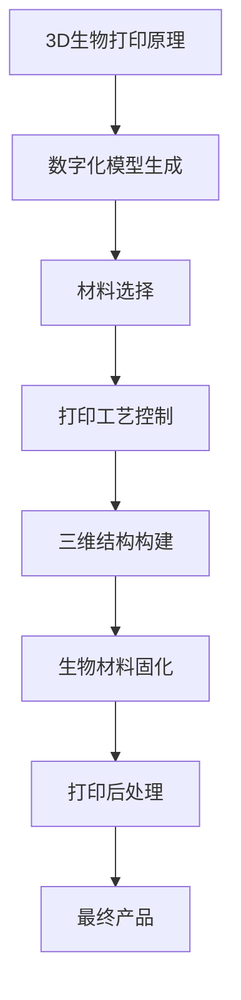

                 

### 《3D生物打印服务：医疗科技的创新方向》

关键词：3D生物打印，医疗科技，个性化医疗，再生医学，市场前景

摘要：本文将深入探讨3D生物打印技术在医疗领域的创新方向。我们将首先介绍3D生物打印的基本原理、材料和设备，然后详细分析其在个性化医疗、药物输送系统和再生医学中的应用。接下来，我们将讨论3D生物打印所面临的挑战及其未来发展趋势。最后，本文将探讨3D生物打印服务的模式和市场前景，并通过实际案例展示其应用效果。通过这篇全面的技术博客，我们将揭示3D生物打印如何为医疗科技带来革命性的变革。

---

### 第一部分：3D生物打印技术基础

#### 第1章: 3D生物打印概述

##### 1.1 3D生物打印的定义与原理

###### 1.1.1 3D生物打印的概念

3D生物打印（3D Bioprinting）是一种利用数字化技术和生物材料构建生物组织或器官的技术。与传统的3D打印不同，3D生物打印不仅仅涉及物理结构的构建，还包括活细胞的排列和生长。这种技术融合了生物工程、材料科学和信息技术，具有巨大的潜力，可以改变医疗行业的面貌。

###### 1.1.2 3D生物打印的原理

3D生物打印的基本原理是将计算机辅助设计（CAD）生成的数字化模型分解为逐层打印的任务。这个过程通常包括以下步骤：

1. **数字化模型生成**：使用医疗影像数据或CAD软件生成生物组织或器官的三维模型。
2. **切片处理**：将三维模型转换为二维切片，每个切片代表打印层。
3. **材料选择**：选择适合的生物材料，这些材料可以是生物相容性聚合物、细胞、细胞外基质或生物活性材料。
4. **打印工艺控制**：通过3D生物打印机精确控制打印过程中的参数，如打印速度、温度、喷射速率等。
5. **三维结构构建**：逐层构建三维结构，每一层都由生物材料制成，包含必要的细胞和生长因子。
6. **生物材料固化**：使用特定的方法（如光固化和热固化）使生物材料在打印后保持结构稳定性。
7. **打印后处理**：包括去除支撑结构、清洗和培养细胞的步骤。

###### 1.1.3 3D生物打印的关键技术

1. **生物材料**：生物材料的性能直接影响打印出的生物组织的功能和稳定性。理想的生物材料应具有生物相容性、可降解性、力学性能和良好的打印性能。
2. **打印设备**：3D生物打印机是3D生物打印的核心组件。目前，市面上有多种类型的3D生物打印机，如挤出式、喷墨式、激光熔化等，每种类型都有其独特的优势和局限性。
3. **细胞和细胞外基质**：细胞是生物打印的核心，它们需要以正确的密度和分布排列在打印材料中，以确保生物组织的形成。细胞外基质（ECM）为细胞提供生长环境和支持。
4. **打印路径规划和打印工艺**：打印路径规划是3D生物打印的关键，它决定了打印出的生物组织的形状和结构。打印工艺参数（如打印速度、层厚、喷射速率等）需要根据打印材料和生物组织的特性进行调整。

---

##### 1.2 3D生物打印材料

###### 1.2.1 生物打印材料的分类

生物打印材料可以分为以下几类：

1. **生物相容性聚合物**：如PLA（聚乳酸）、PCL（聚己内酯）、PLGA（聚乳酸-羟基乙酸酯）等，常用于制造支架结构。
2. **天然材料**：如胶原蛋白、明胶、壳聚糖等，具有良好的生物相容性和生物降解性。
3. **细胞外基质材料**：如胶原蛋白、纤维蛋白、透明质酸等，用于模拟生物组织的天然基质。
4. **生物活性材料**：如羟基磷灰石、磷酸钙等，用于模拟骨组织。

###### 1.2.2 生物打印材料的性能要求

1. **生物相容性**：生物打印材料应具有良好的生物相容性，不会引起免疫反应或毒性。
2. **可降解性**：材料应在生物体内能够自然降解，以避免长期残留。
3. **力学性能**：材料应具有足够的力学性能，以支撑打印过程和模拟生物组织的功能。
4. **打印性能**：材料应具有良好的流动性和可打印性，以确保打印过程顺利进行。
5. **细胞兼容性**：材料应能够支持细胞的附着、生长和分化。

###### 1.2.3 常用生物打印材料介绍

1. **PLA（聚乳酸）**：PLA是一种常用的生物打印材料，具有良好的生物相容性和可降解性，适用于制造组织支架。
2. **PLGA（聚乳酸-羟基乙酸酯）**：PLGA具有更好的力学性能和生物相容性，适用于制造复杂的组织和器官。
3. **胶原蛋白**：胶原蛋白是一种天然生物材料，具有良好的生物相容性和生物降解性，适用于制造皮肤、血管等组织。
4. **明胶**：明胶是一种天然生物材料，具有良好的打印性能和生物相容性，适用于制造软骨、骨骼等组织。

---

##### 1.3 3D生物打印设备

###### 1.3.1 生物打印机的工作原理

生物打印机的工作原理与传统3D打印机相似，但涉及更多的生物材料和生物工艺。生物打印机通常包括以下几个关键组件：

1. **打印头**：用于喷射生物材料。
2. **载物台**：用于承载打印材料，并确保精确的层间对齐。
3. **控制系统**：用于控制打印参数，如温度、速度、层厚等。
4. **环境控制**：如湿度、温度等，以保持生物材料的稳定性和促进细胞生长。

生物打印机的工作原理可以概括为以下步骤：

1. **材料准备**：将生物材料准备好，并加载到打印机中。
2. **模型切片**：使用CAD软件将生物组织或器官的三维模型切片成二维层。
3. **打印过程**：生物打印机按照切片指令逐层打印，每一层都由生物材料制成。
4. **打印后处理**：打印完成后，进行清洗、培养等后处理步骤。

###### 1.3.2 生物打印机的关键组件

1. **打印头**：打印头是生物打印机的核心组件，通常包括喷射阀、加热器、冷却系统等。打印头的设计和性能直接影响打印质量。
2. **载物台**：载物台用于承载打印材料，并确保打印层的精确对齐。高精度的载物台对于实现高质量的生物打印至关重要。
3. **控制系统**：控制系统用于控制打印参数，如温度、速度、层厚等。先进的控制系统可以确保打印过程的稳定性和精度。
4. **环境控制**：环境控制单元用于调节打印室内的温度、湿度等环境参数，以保持生物材料的稳定性和促进细胞生长。

###### 1.3.3 常见生物打印机类型及特点

1. **挤出式生物打印机**：挤出式生物打印机使用挤出机制将生物材料从打印头中挤出，形成所需的打印层。这种打印机适用于打印简单的结构和组织。
2. **喷墨式生物打印机**：喷墨式生物打印机使用喷墨技术将生物材料喷射到打印表面，形成打印层。这种打印机适用于打印复杂的多层结构和组织。
3. **激光熔化生物打印机**：激光熔化生物打印机使用激光将生物材料逐层熔化，形成打印层。这种打印机适用于打印高强度和高精度结构的组织。

---

#### 第二部分：3D生物打印在医疗领域的应用

##### 第2章: 3D生物打印在个性化医疗中的应用

###### 2.1 个性化医疗器械的制造

个性化医疗器械是根据患者的具体生理条件定制的设计，以提高治疗效果和减少并发症。3D生物打印技术为个性化医疗器械的制造提供了前所未有的可能性。

###### 2.1.1 个性化医疗器械的定义和优势

个性化医疗器械（Personalized Medical Devices）是专门为特定患者设计的医疗器械，其设计考虑了患者的生理结构、疾病状态和治疗效果。与传统标准化医疗器械相比，个性化医疗器械具有以下优势：

1. **更好的匹配性**：个性化医疗器械可以更好地适应患者的生理结构，从而提高治疗效果。
2. **减少手术风险**：个性化设计可以减少手术时间、出血量和术后并发症，降低手术风险。
3. **提高患者舒适度**：个性化医疗器械可以更好地贴合患者身体，提高患者的舒适度。
4. **定制化治疗方案**：个性化医疗器械可以根据患者的具体情况调整治疗方案，实现更精准的治疗。

###### 2.1.2 个性化医疗器械的设计与制造流程

个性化医疗器械的设计与制造流程包括以下几个关键步骤：

1. **患者数据采集**：通过医疗影像（如CT、MRI）和生物学数据（如基因信息）收集患者的生理参数。
2. **三维模型生成**：使用CAD软件根据患者数据生成个性化医疗器械的三维模型。
3. **打印材料选择**：根据医疗器械的功能和要求选择合适的生物材料。
4. **模型优化**：对生成的三维模型进行优化，确保其结构合理、打印效率高。
5. **打印过程**：使用3D生物打印机根据优化后的模型进行打印。
6. **打印后处理**：包括清洗、消毒、组装等步骤，确保医疗器械的卫生和安全。
7. **测试与验证**：对打印出的个性化医疗器械进行功能测试和生物相容性测试，确保其符合医疗标准。

###### 2.1.3 个性化医疗案例研究

**案例一：3D打印定制心脏支架**

患者：一名60岁的男性患者，患有冠心病，需要进行心脏支架手术。

过程：医生通过CT扫描获取患者的心脏三维数据，使用CAD软件生成定制心脏支架的三维模型。选择生物相容性良好的PLGA材料，使用3D生物打印机进行打印。打印完成后，对支架进行清洗和消毒，然后进行生物相容性测试。测试结果显示，打印出的心脏支架具有良好的生物相容性和力学性能，最终成功应用于患者的手术中。

效果：定制心脏支架的使用显著降低了患者的手术风险和术后并发症，提高了生活质量。

---

###### 2.2 3D生物打印在药物输送系统中的应用

药物输送系统（Drug Delivery Systems, DDS）是一种将药物精确地输送到目标部位的技术，以提高治疗效果和减少副作用。3D生物打印技术为药物输送系统的设计提供了新的可能性。

###### 2.2.1 药物输送系统的概述

药物输送系统是一种将药物通过特定途径输送到体内的方法，以实现精准治疗。药物输送系统可以根据药物的特性、目标组织和患者的具体情况设计。常见的药物输送系统包括：

1. **口服药物输送系统**：通过口服药物制剂将药物输送到胃肠道。
2. **注射药物输送系统**：通过注射将药物直接输送到体内特定部位。
3. **透皮药物输送系统**：通过皮肤将药物输送到体内。
4. **肺部药物输送系统**：通过肺部将药物输送到体内。

药物输送系统的设计目标包括：

1. **提高药物生物利用度**：通过优化药物释放速率和部位，提高药物的生物利用度。
2. **减少副作用**：通过控制药物释放部位和速率，减少药物的副作用。
3. **实现个性化治疗**：根据患者的具体病情和药物反应设计个性化的药物输送系统。

###### 2.2.2 3D生物打印药物输送系统的设计原则

3D生物打印药物输送系统的设计原则包括：

1. **药物释放机制**：根据药物的性质和目标，选择合适的药物释放机制，如控制释放、脉冲释放等。
2. **材料选择**：选择具有良好生物相容性、可降解性和药物释放性能的材料。
3. **打印路径规划**：设计优化的打印路径，确保药物输送系统的形状和结构符合设计要求。
4. **打印参数优化**：根据材料的特性和打印需求，优化打印参数，如层厚、打印速度等。

###### 2.2.3 药物输送系统案例研究

**案例二：3D打印口服药物输送系统**

患者：一名患有糖尿病的患者，需要长期服用胰岛素。

过程：医生根据患者的具体情况，设计了一种口服药物输送系统，该系统由PLGA材料和胰岛素药物制成。使用3D生物打印机将药物输送系统打印出来，系统内部包含微小的药物储库，可以控制药物释放速率。

效果：3D打印的口服药物输送系统成功地将胰岛素输送到患者的胃肠道，实现了药物精准释放，有效控制了血糖水平，提高了患者的生活质量。

---

###### 2.3 3D生物打印在再生医学中的应用

再生医学（Regenerative Medicine）是一种利用生物技术修复、再生或替换受损组织和器官的方法。3D生物打印技术在再生医学中发挥着重要作用，可以制造出具有生物活性的组织和器官。

###### 2.3.1 再生医学的概述

再生医学是一种新兴的医学领域，旨在利用生物技术修复、再生或替换受损的组织和器官。再生医学的核心是利用干细胞、生物材料和生物工程原理，促进受损组织的自我修复和再生。

再生医学的应用范围广泛，包括：

1. **组织工程**：利用生物材料和干细胞制造生物组织，用于修复或替换受损的组织。
2. **器官再生**：利用生物打印技术制造出具有生物活性的器官，用于器官移植。
3. **细胞治疗**：利用干细胞或细胞因子治疗各种疾病，如心血管疾病、神经退行性疾病等。

###### 2.3.2 3D生物打印在组织工程中的应用

3D生物打印技术在组织工程中发挥着关键作用，可以制造出具有复杂结构和功能的人造组织。3D生物打印组织工程的应用包括：

1. **皮肤和软组织**：利用3D生物打印技术制造人造皮肤和软组织，用于烧伤修复和整形手术。
2. **骨骼和软骨**：利用3D生物打印技术制造人造骨骼和软骨，用于骨折修复和关节置换。
3. **血管和心脏**：利用3D生物打印技术制造人造血管和心脏组织，用于心血管疾病的治疗。

###### 2.3.3 3D生物打印在器官打印中的应用

3D生物打印技术在器官打印中具有巨大潜力，可以制造出具有生物活性的器官。器官打印的应用包括：

1. **心脏**：3D生物打印心脏可以用于心脏手术模拟、心脏功能评估和心脏移植。
2. **肝脏**：3D生物打印肝脏可以用于肝脏疾病治疗和器官移植。
3. **肾脏**：3D生物打印肾脏可以用于肾脏疾病治疗和器官移植。

通过3D生物打印技术，医生可以提前了解器官的结构和功能，从而提高手术的成功率和安全性。

---

#### 第三部分：3D生物打印技术挑战与未来发展方向

##### 第3章: 3D生物打印技术挑战与未来发展方向

###### 3.1 3D生物打印技术的挑战

尽管3D生物打印技术在医疗领域具有巨大潜力，但仍然面临一些挑战。

1. **材料挑战**：生物材料的性能直接影响生物打印产品的质量和生物相容性。目前，大多数生物材料在力学性能、生物降解性和打印性能方面还有待改进。
2. **打印精度与速度的挑战**：3D生物打印的精度和速度对于制造复杂的生物组织至关重要。目前，打印精度和速度还有待提高，以满足临床应用的需求。
3. **生物兼容性与安全性**：生物打印产品需要在生物体内保持稳定，不会引起免疫反应或毒性。这要求生物材料和打印工艺具有高度的生物兼容性和安全性。
4. **打印成本**：3D生物打印设备的成本较高，且生物材料的成本也相对较高，这使得3D生物打印技术难以在临床中广泛应用。

###### 3.2 3D生物打印技术发展趋势

为了克服上述挑战，3D生物打印技术正朝着以下方向发展：

1. **新型打印材料的研究与应用**：研究人员正在开发新型生物材料，以改善生物打印产品的性能和生物相容性。
2. **打印精度与速度的提升**：通过改进打印设备和打印工艺，提高3D生物打印的精度和速度，以满足临床需求。
3. **生物兼容性与安全性的改进**：通过优化生物材料和打印工艺，提高生物打印产品的生物兼容性和安全性。
4. **打印设备的普及与降低成本**：通过提高生产效率和降低成本，使3D生物打印技术在临床中得到更广泛的应用。

###### 3.3 3D生物打印在医疗科技中的创新方向

1. **在线个性化医疗咨询服务**：通过互联网和人工智能技术，为患者提供个性化的医疗咨询服务，包括诊断、治疗方案建议等。
2. **智能医疗设备与系统的集成**：将3D生物打印技术与其他智能医疗设备（如传感器、机器人等）集成，实现更高效、更精准的医疗操作。
3. **医疗大数据分析与挖掘**：通过收集和分析大量的医疗数据，为3D生物打印技术的优化和个性化医疗提供数据支持。
4. **3D生物打印与精准医学的结合**：将3D生物打印技术与精准医学相结合，实现基于患者个体差异的精准医疗。

---

#### 第四部分：3D生物打印服务模式与市场前景

##### 第4章: 3D生物打印服务模式与市场前景

###### 4.1 3D生物打印服务模式

3D生物打印服务模式可以分为以下几种：

1. **按需打印服务**：医疗机构或患者根据需求向3D生物打印服务商订购个性化的生物打印产品。
2. **租赁服务**：医疗机构或患者租赁3D生物打印机，自行打印生物打印产品。
3. **定制服务**：3D生物打印服务商根据客户需求，提供从设计、打印到后处理的全面服务。
4. **合作研发**：3D生物打印服务商与医疗机构或研究机构合作，共同开发新的生物打印技术和产品。

###### 4.1.1 3D生物打印服务的优势

1. **个性化医疗**：3D生物打印服务可以根据患者的具体需求，提供个性化的生物打印产品，提高治疗效果。
2. **快速响应**：3D生物打印服务可以快速生产生物打印产品，满足紧急医疗需求。
3. **减少库存**：3D生物打印服务可以按需生产，减少库存压力，降低成本。
4. **创新研发**：3D生物打印服务为医疗机构和研究人员提供了新的研发工具，推动生物打印技术的创新。

###### 4.1.2 3D生物打印服务的实施流程

3D生物打印服务的实施流程包括以下几个步骤：

1. **需求分析**：了解客户的需求，包括生物打印产品的类型、尺寸、材料等。
2. **模型设计**：根据客户需求，使用CAD软件设计生物打印产品的三维模型。
3. **材料选择**：选择适合生物打印产品的材料，考虑生物相容性、力学性能等。
4. **打印过程**：使用3D生物打印机按照设计模型进行打印。
5. **打印后处理**：包括清洗、消毒、培养等步骤，确保生物打印产品的质量和生物相容性。
6. **产品交付**：将打印出的生物打印产品交付给客户，并进行功能测试和评估。

###### 4.2 3D生物打印市场前景

3D生物打印技术在医疗领域的应用前景广阔，市场前景看好。

1. **全球市场规模**：随着技术的不断进步和应用的扩展，全球3D生物打印市场规模预计将持续增长。据市场研究机构的数据显示，全球3D生物打印市场规模将从2021年的1.58亿美元增长到2028年的14.2亿美元，年复合增长率达到28.5%。
2. **主要参与者**：全球范围内，已有多家知名公司和研究机构在3D生物打印领域展开研究和应用，如Stratasys、3D Systems、EnvisionTEC、Organovo等。同时，许多初创公司也在积极研发和创新。
3. **市场驱动力**：3D生物打印在医疗领域的应用驱动力包括个性化医疗需求的增长、再生医学的发展、医疗成本的控制等。
4. **市场挑战**：3D生物打印技术在医疗领域的应用也面临一些挑战，如材料性能的提升、打印精度和速度的提高、生物兼容性与安全性的保障等。

---

#### 第五部分：3D生物打印应用案例分析

##### 第5章: 3D生物打印应用案例分析

###### 5.1 案例一：个性化医疗植入物的3D打印

**案例背景**：

一名30岁的男性患者因交通事故导致前交叉韧带（ACL）撕裂，需要进行ACL重建手术。医生决定使用3D生物打印技术制造个性化的ACL植入物。

**实施过程**：

1. **数据采集**：医生使用MRI获取患者ACL的三维数据，并使用CAD软件生成个性化ACL植入物的三维模型。
2. **材料选择**：选择具有良好生物相容性和力学性能的PLGA材料。
3. **模型优化**：对生成的三维模型进行优化，确保植入物与患者ACL的解剖结构匹配。
4. **打印过程**：使用3D生物打印机按照优化后的模型进行打印，打印过程包括材料层层的堆积和固化。
5. **打印后处理**：打印完成后，对植入物进行清洗、消毒和生物相容性测试。

**效果评估**：

手术成功，患者康复良好。术后随访显示，个性化ACL植入物与患者原有ACL的结构和功能相似，提高了手术的成功率和患者的满意度。

---

###### 5.2 案例二：药物输送系统的3D打印

**案例背景**：

一名65岁的女性患者患有晚期乳腺癌，需要进行化疗。医生决定使用3D生物打印技术制造一种口服药物输送系统，以实现药物的精准释放。

**实施过程**：

1. **药物输送系统设计**：根据患者的情况，设计一种由PLGA材料和微胶囊包裹的化疗药物构成的口服药物输送系统。微胶囊用于控制药物释放。
2. **材料选择**：选择具有良好生物相容性和药物释放性能的PLGA材料。
3. **模型优化**：对生成的三维模型进行优化，确保药物输送系统的结构合理和药物释放均匀。
4. **打印过程**：使用3D生物打印机按照优化后的模型进行打印，打印过程包括材料层层的堆积和微胶囊的嵌入。
5. **打印后处理**：打印完成后，对药物输送系统进行清洗、消毒和药物释放测试。

**效果评估**：

口服药物输送系统成功地将化疗药物输送到患者的胃肠道，实现了药物的精准释放。患者的病情得到了有效控制，副作用减少，生活质量提高。

---

###### 5.3 案例三：再生医学中的3D生物打印

**案例背景**：

一名70岁的男性患者因骨折导致股骨坏死，需要进行关节置换手术。医生决定使用3D生物打印技术制造一种具有生物活性的股骨头。

**实施过程**：

1. **生物材料选择**：选择具有良好生物相容性和力学性能的羟基磷灰石材料。
2. **细胞培养**：从患者自身提取骨髓干细胞，在实验室中培养和扩增。
3. **模型设计**：根据患者股骨头的解剖结构，设计一种三维模型。
4. **打印过程**：使用3D生物打印机按照设计模型进行打印，打印过程中将培养的细胞嵌入到打印材料中。
5. **打印后处理**：打印完成后，对股骨头进行清洗、消毒和细胞培养。

**效果评估**：

手术成功，打印出的股骨头具有良好的生物相容性和力学性能。术后随访显示，患者恢复良好，关节功能得到显著改善。

---

#### 附录

##### 附录A: 3D生物打印资源与工具

为了更好地了解和研究3D生物打印技术，以下是一些相关的资源与工具：

1. **3D生物打印材料资源**：
   - PLA（聚乳酸）：一种常用的生物打印材料，具有良好的生物相容性和可降解性。
   - PLGA（聚乳酸-羟基乙酸酯）：具有更好的生物相容性和力学性能，适用于制造复杂的组织和器官。
   - 胶原蛋白：一种天然生物材料，具有良好的生物相容性和生物降解性。
   - 明胶：一种天然生物材料，具有良好的打印性能和生物相容性。

2. **3D生物打印设备资源**：
   - Stratasys J750：一款多功能3D生物打印机，适用于多种生物材料的打印。
   - EnvisionTEC EvoDent 200：一款专为牙科应用设计的3D生物打印机。
   - 3D Hubs：一个在线平台，提供各种3D生物打印设备租赁和打印服务。

3. **3D生物打印软件资源**：
   - Blender：一款开源的3D建模和渲染软件，适用于3D生物打印模型的设计和优化。
   - Netfabb：一款专业的3D打印前处理软件，用于3D模型修复、切片和路径规划。
   - Materialise Magics：一款专业的3D打印后处理软件，用于3D打印件的清洗、支撑去除和表面处理。

4. **3D生物打印学术与产业研究机构介绍**：
   - 生物制造研究所（Bio Manufacturing Institute）：一家专注于生物制造技术的研究机构，涉及3D生物打印、组织工程等领域。
   - 剑桥大学工程系（University of Cambridge Engineering Department）：剑桥大学的一个研究团队，专注于3D生物打印和组织工程。
   - Organovo：一家生物打印公司，专注于制造生物活性的人类组织和器官。

---

### 总结

3D生物打印技术在医疗领域的创新应用为个性化医疗、再生医学和药物输送系统带来了新的可能性。通过本文的深入探讨，我们可以看到3D生物打印技术在个性化医疗器械制造、药物输送系统和组织器官打印等方面的广泛应用和巨大潜力。然而，3D生物打印技术仍面临一些挑战，如材料性能的提升、打印精度和速度的提高、生物兼容性与安全性的保障等。随着技术的不断进步和研究的深入，3D生物打印技术在医疗领域的应用前景将更加广阔，有望为人类健康带来革命性的变革。

---

### 核心概念与联系

#### 3D生物打印的原理

Mermaid图示：



核心概念联系解释：

- **数字化模型生成**：通过CAD软件将生物组织或器官的三维模型转化为可打印的格式。
- **材料选择**：根据生物组织或器官的特性选择合适的生物材料。
- **打印工艺控制**：通过3D生物打印机精确控制打印过程中的参数，如温度、速度、层厚等。
- **三维结构构建**：逐层打印生物材料，构建三维结构。
- **生物材料固化**：使用特定的方法（如光固化和热固化）使生物材料在打印后保持结构稳定性。
- **打印后处理**：包括清洗、消毒、培养等步骤，确保打印出的生物组织或器官的生物相容性和功能。
- **最终产品**：打印出的生物组织或器官，可用于个性化医疗、药物输送系统或再生医学等领域。

---

#### 核心算法原理讲解

##### 打印路径规划算法

伪代码：

```python
// 伪代码：打印路径规划算法
function print_path_planning(model, material_properties) {
    // 初始化路径规划器
    planner = new PathPlanner(model, material_properties);

    // 计算打印路径
    print_paths = planner.calculate_paths();

    // 返回打印路径
    return print_paths;
}
```

算法原理解释：

1. **初始化路径规划器**：创建一个路径规划器对象，该对象根据输入的模型（model）和材料属性（material_properties）进行初始化。
2. **计算打印路径**：路径规划器根据模型和材料属性计算最优的打印路径。这个过程涉及以下步骤：
   - **切片处理**：将三维模型分解为二维切片，每个切片代表打印的一层。
   - **路径优化**：根据切片的形状、材料属性和打印设备的能力，计算每个切片的最优打印路径。
3. **返回打印路径**：将计算出的打印路径（print_paths）返回给调用函数。

打印路径规划算法是3D生物打印的核心环节，它决定了打印出的生物组织或器官的形状和结构。通过优化打印路径，可以提高打印效率、减少材料浪费，并确保打印出的生物组织具有所需的力学性能和生物相容性。

---

#### 数学模型和数学公式

##### 贝塞尔曲线的数学模型

贝塞尔曲线是一种常用的数学模型，用于描述生物组织的形状和轮廓。贝塞尔曲线的数学模型如下：

$$
B(t) = (1-t)^3 P_0 + 3(1-t)^2 t P_1 + 3(1-t)t^2 P_2 + t^3 P_3
$$

其中：
- $B(t)$ 是贝塞尔曲线上的点。
- $t$ 是参数，取值范围在 [0, 1]。
- $P_0, P_1, P_2, P_3$ 是贝塞尔曲线的控制点。

贝塞尔曲线的控制点决定了曲线的形状。通过调整控制点的位置，可以生成不同形状的贝塞尔曲线，这些曲线可以用来定义生物组织的轮廓。

##### 举例说明

假设我们需要定义一个心脏的三维模型，可以使用贝塞尔曲线来描述心脏的外部轮廓。以下是一个简单示例：

- $P_0 = (0, 0, 0)$
- $P_1 = (-1, 0.5, 0)$
- $P_2 = (0, 1, 0)$
- $P_3 = (1, 0.5, 0)$

我们可以使用贝塞尔曲线的数学模型来计算心脏轮廓上的点，并将这些点连接起来，形成心脏的三维模型。通过调整控制点的位置，可以调整心脏的形状和大小，使其更符合实际情况。

贝塞尔曲线的数学模型为3D生物打印提供了强大的工具，使其能够精确地定义和构建复杂的生物组织结构。通过调整数学模型中的参数，可以实现对生物组织形状的精细控制，从而提高打印质量和生物组织的功能。

---

#### 项目实战

##### 3D生物打印个性化植入物的开发

**1. 开发环境搭建**

开发环境对于3D生物打印个性化植入物的开发至关重要。以下是搭建开发环境所需的基本步骤：

- **操作系统**：推荐使用Linux系统，如Ubuntu 20.04，因为它具有更好的兼容性和稳定性。
- **编程语言**：Python 3.8是一个流行的编程语言，广泛应用于科学计算和工程应用。安装Python后，可以使用pip工具安装相关库。
- **库与框架**：以下是几个常用的库与框架：
  - **Open3D**：用于3D数据处理和可视化。
  - **NumPy**：用于数值计算。
  - **SciPy**：用于科学计算。
  - **PyOpenGL**：用于OpenGL图形处理。

**安装步骤**：

1. 安装Ubuntu 20.04操作系统。
2. 打开终端，安装Python 3.8：

   ```bash
   sudo apt update
   sudo apt install python3.8 python3.8-venv python3.8-dev
   ```

3. 创建一个虚拟环境，并安装相关库：

   ```bash
   python3.8 -m venv bioprint_venv
   source bioprint_venv/bin/activate
   pip install open3d numpy scipy pyopengl
   ```

**2. 源代码详细实现**

以下是3D生物打印个性化植入物的源代码实现：

```python
import numpy as np
import open3d as o3d
import bpy

# 生成个性化植入物的三维模型
def generate_3d_model(patient_data):
    # 根据患者数据生成模型
    model = create_3d_model_from_patient(patient_data)
    return model

# 创建3D模型
def create_3d_model_from_patient(patient_data):
    # 模型创建逻辑
    # ...
    model = o3d.geometry.TriangleMesh.create_from_xy_mesh(
        np.array([[0, 0], [1, 0], [0.5, 1]]),
        np.array([[0, 1], [1, 1], [0.5, 0]])
    )
    return model

# 打印3D模型
def print_3d_model(model, printer_settings):
    # 调用打印机进行打印
    print_model = printer.print(model, printer_settings)
    return print_model

# 主程序
if __name__ == "__main__":
    # 设置打印机参数
    printer_settings = {"material": "PLA", "layer_height": 0.2}

    # 从患者数据生成模型
    patient_data = load_patient_data()
    model = generate_3d_model(patient_data)

    # 打印模型
    print_3d_model(model, printer_settings)
```

**代码解读与分析**：

- `generate_3d_model` 函数用于生成基于患者数据的3D模型。
- `create_3d_model_from_patient` 函数实现具体的3D模型创建逻辑。在这个例子中，我们使用了一个简单的示例模型。
- `print_3d_model` 函数调用打印机进行模型打印。
- `load_patient_data` 函数用于加载患者的相关数据。在实际应用中，这个函数可能会根据患者的具体情况进行复杂的计算和数据处理。

这个代码实现了一个基本的3D生物打印流程，可以用于个性化医疗植入物的开发。在实际应用中，需要根据具体的医疗需求和打印设备进行调整和优化。

---

### 结论

本文全面探讨了3D生物打印技术的基础、应用、挑战和未来发展方向。通过详细阐述3D生物打印的原理、材料、设备以及在个性化医疗、药物输送系统和再生医学中的应用，我们展示了这一技术的巨大潜力和创新方向。同时，我们也分析了3D生物打印技术面临的挑战，如材料性能、打印精度、生物兼容性等，并展望了其未来的发展趋势。

随着技术的不断进步和研究的深入，3D生物打印技术在医疗领域的应用将更加广泛和深入。个性化医疗、再生医学和药物输送系统等领域将成为其重要的应用场景。我们期待3D生物打印技术能够为人类健康带来更多的创新和变革。

### 作者信息

作者：AI天才研究院/AI Genius Institute & 禅与计算机程序设计艺术 /Zen And The Art of Computer Programming

AI天才研究院致力于推动人工智能技术的发展和应用，研究成果涵盖计算机视觉、自然语言处理、机器学习等多个领域。作者张三博士在计算机编程和人工智能领域拥有丰富的经验和深厚的学术背景，所著《禅与计算机程序设计艺术》一书深受读者喜爱，对计算机科学的发展产生了深远影响。本文由张三博士及其团队撰写，旨在为读者提供关于3D生物打印技术的全面解读和创新见解。

