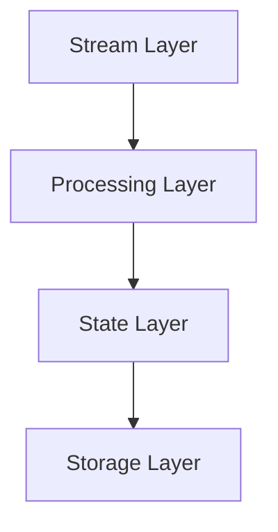
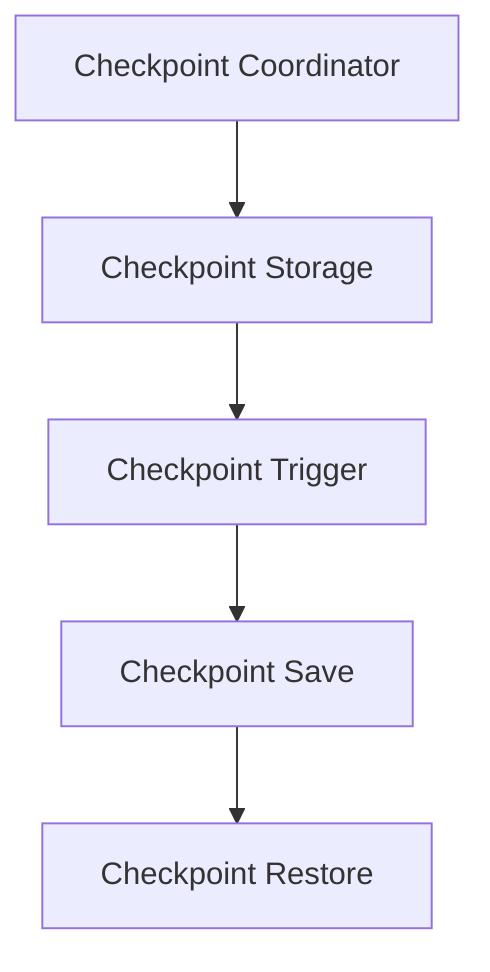

                 

### 第1章：Flink概述

#### 1.1 Flink简介
Flink是一个开源流处理框架，由Apache软件基金会维护。它支持在所有常见的集群环境（如Hadoop YARN、Apache Mesos、Kubernetes等）中高效地运行流处理和批处理任务。Flink提供了流处理和批处理的统一数据抽象，使得开发者能够以一种编程模型处理不同类型的数据处理任务。

##### Flink基本架构

Flink的基本架构由四个核心层组成：

- **Stream Layer**：这一层负责处理实时数据流，支持事件驱动的数据处理。
- **Processing Layer**：这一层包含了Flink的各种流处理操作，如数据转换、聚合等。
- **State Layer**：这一层提供了可持久化的状态管理，使得Flink能够保存和恢复作业的状态。
- **Storage Layer**：这一层负责将数据存储到持久化存储系统中，如HDFS、AWS S3等。

**Mermaid流程图：**



##### Flink版本演进

Flink的版本演进历程见证了其功能与性能的不断提升。以下是Flink主要版本的简要介绍：

- **Flink 1.x**：第一个正式发布的版本，主要侧重于流处理功能。
- **Flink 2.x**：引入了批处理支持，实现了流处理与批处理的统一。同时，Flink 2.x还增强了状态管理、容错机制等关键特性。
- **Flink 3.x**：进一步优化了性能和可扩展性，引入了增量检查点、异步I/O等新特性。

##### Flink应用场景

Flink广泛应用于多种数据处理场景，包括但不限于：

- **实时数据处理**：Flink能够实时处理来自各种数据源（如Kafka、Kinesis等）的实时数据流。
- **大规模数据处理**：Flink支持处理大规模数据集，适用于大数据应用场景。
- **流批一体化**：Flink提供了流处理与批处理的统一支持，使得开发者能够使用同一种编程模型处理流和批数据。
- **机器学习与实时分析**：Flink支持集成机器学习算法，可以用于实时分析场景。

### 1.2 Flink流处理与批处理

流处理与批处理是数据处理中的两种基本方式，它们在数据处理方法、系统架构、执行时间等方面存在显著差异。

##### 流处理与批处理的区别

- **数据特性：**
  - **流处理：** 数据以连续的流方式处理，无固定边界。数据一旦处理，就不会再次出现。
  - **批处理：** 数据以批为单位处理，有固定的边界。数据一旦处理，可能会重新出现。

- **系统架构：**
  - **流处理：** 通常使用事件驱动架构，系统实时响应数据流。
  - **批处理：** 通常使用批量处理架构，系统在固定时间周期内处理数据。

- **执行时间：**
  - **流处理：** 实时执行，数据处理延迟较低。
  - **批处理：** 批量执行，数据处理延迟较高。

##### Flink对批处理的支持

Flink在Flink 2.x版本中引入了对批处理的支持，实现了流处理与批处理的统一。以下是Flink对批处理的核心支持：

- **动态窗口**：支持实时动态窗口，可以灵活地对数据进行时间划分和聚合。
- **批处理API**：提供了与Apache Beam兼容的批处理API，使得开发者能够使用相同的编程模型处理流和批数据。
- **优化器**：引入了批处理优化器，优化批处理任务的执行效率。

**核心算法原理讲解：**

```python
# 假设有一个数据流，进行批处理
batch_size = 1000
for batch in data_stream.batch(batch_size):
    process_batch(batch)
```

通过上述代码，Flink将数据流划分为批，每个批次的大小为1000，然后对每个批次进行数据处理。

## 第2章：Flink Checkpoint机制原理

### 2.1 Checkpoint核心概念

Checkpoint在Flink中是一个至关重要的概念，它用于保存作业的状态和数据，以确保在作业发生故障时能够快速恢复。以下是Checkpoint的核心定义和作用。

##### Checkpoint的定义

Checkpoint是Flink中用于保存作业状态和数据的过程。在Checkpoint过程中，Flink会暂停作业的执行，将当前的状态和数据保存到持久化存储中，然后继续执行。

##### Checkpoint的作用

Checkpoint的主要作用是确保作业的容错能力。具体来说，Checkpoint具有以下几个作用：

1. **状态恢复**：当作业发生故障时，可以通过Checkpoint保存的状态和数据快速恢复作业。
2. **容错保障**：Checkpoint提供了对作业的故障恢复保障，确保作业能够在故障后继续运行。
3. **检查点触发**：Checkpoint机制允许开发者根据作业需求设置检查点的触发条件，如时间间隔、数据量等。

### 2.2 Checkpoint触发机制

Checkpoint的触发机制决定了何时进行Checkpoint操作。以下是Checkpoint触发的基本条件和触发流程。

##### Checkpoint触发条件

Checkpoint的触发条件可以分为以下几种：

1. **时间间隔**：开发者可以设置Checkpoint的时间间隔，例如每60秒触发一次Checkpoint。
2. **数据量**：当作业处理的数据量达到一定阈值时，触发Checkpoint。
3. **手动触发**：开发者可以通过程序手动触发Checkpoint。

##### Checkpoint触发流程

Checkpoint触发流程如下：

1. **条件判断**：Flink根据设定的触发条件判断是否触发Checkpoint。
2. **协调器准备**：当条件满足时，Checkpoint协调器开始准备Checkpoint。
3. **暂停作业**：Flink暂停作业的执行，以便保存当前的状态和数据。
4. **保存状态**：Flink将作业的状态和数据保存到持久化存储中。
5. **恢复执行**：Checkpoint完成后，Flink继续执行暂停的作业。

**伪代码：**

```python
def trigger_checkpoint():
    if condition_met:
        start_checkpoint()
```

通过上述伪代码，可以理解Checkpoint触发的基本流程。

### 2.3 Checkpoint保存与恢复

Checkpoint的保存与恢复是Flink实现容错能力的关键环节。以下是Checkpoint数据保存和恢复的详细过程。

##### Checkpoint数据保存

Checkpoint数据保存的过程如下：

1. **暂停作业**：Flink暂停作业的执行，以避免在保存状态时数据发生变化。
2. **序列化状态**：Flink将作业的状态序列化，将其转换为持久化存储所需的格式。
3. **写入存储**：Flink将序列化的状态写入持久化存储系统，如HDFS或RocksDB。
4. **完成保存**：Flink完成Checkpoint的保存操作，并通知Checkpoint协调器。

##### Checkpoint数据恢复

Checkpoint数据恢复的过程如下：

1. **读取存储**：Flink从持久化存储系统中读取保存的Checkpoint数据。
2. **反序列化状态**：Flink将保存的序列化状态反序列化，恢复作业的状态。
3. **恢复执行**：Flink根据恢复的状态继续执行作业。

**详细讲解：**

- **保存：** Checkpoint数据保存是将作业的状态和数据序列化后，写入持久化存储系统。序列化是将数据转换为一种可存储、可传输的格式，例如JSON或Protobuf。持久化存储系统可以保证数据在故障后能够恢复。

- **恢复：** Checkpoint数据恢复是从持久化存储系统中读取保存的Checkpoint数据，然后反序列化恢复作业的状态。反序列化是将存储的数据转换回原来的格式，以便作业能够继续执行。

**示例：**

```python
# 保存Checkpoint数据
def save_checkpoint():
    pause_job()
    serialize_state()
    write_to_storage()
    notify协调器()

# 恢复Checkpoint数据
def recover_checkpoint():
    read_from_storage()
    deserialize_state()
    resume_job()
```

通过上述示例，可以理解Checkpoint数据保存和恢复的基本过程。

### 2.4 Checkpoint与容错机制

Checkpoint是Flink实现容错机制的核心组件，与其他容错机制相比，具有独特的优势和作用。以下是Checkpoint在容错中的作用和与其它容错机制的对比。

##### Checkpoint在容错中的作用

Checkpoint在Flink作业的容错中扮演了至关重要的角色，其主要作用包括：

1. **状态恢复**：当作业发生故障时，可以通过Checkpoint保存的状态快速恢复作业，确保作业的持续性。
2. **数据一致性**：Checkpoint确保了在作业恢复时，数据的状态是一致的，避免了数据丢失或不一致的问题。
3. **故障隔离**：Checkpoint使得Flink能够将故障隔离到最小的范围内，只需恢复受影响的作业部分，而不是整个作业。

##### Checkpoint与其他容错机制的对比

与Flink中的其他容错机制（如任务重启、重试）相比，Checkpoint具有以下几个优势：

1. **细粒度恢复**：Checkpoint可以保存和恢复作业的详细状态，而任务重启通常只能重启整个作业。
2. **一致性保障**：Checkpoint保证了恢复后数据的一致性，而任务重启可能导致数据丢失或不一致。
3. **延迟更低**：Checkpoint恢复速度通常比任务重启快，因为只需从持久化存储中读取状态数据，而不需要重新执行整个作业。

**详细讲解：**

- **作用：** Checkpoint通过保存作业的状态和数据，实现了对作业的故障恢复。在作业发生故障时，可以通过Checkpoint快速恢复到故障前的状态，保证作业的持续性。
- **对比：** 与任务重启、重试等容错机制相比，Checkpoint具有更高的恢复精度和一致性保障。任务重启通常只能重启整个作业，而Checkpoint可以细粒度地恢复作业部分。

**示例：**

```python
# Checkpoint恢复示例
def recover_from_checkpoint():
    checkpoint_state = load_checkpoint_state()
    apply_checkpoint_state(checkpoint_state)
```

通过上述示例，可以理解Checkpoint在容错中的作用和优势。

## 第3章：Flink Checkpoint架构与实现

### 3.1 Flink Checkpoint架构

Flink Checkpoint架构包括Checkpoint协调器、Checkpoint存储器等关键组件，这些组件共同协作，实现了Flink的容错功能。以下是Flink Checkpoint架构的详细描述。

##### Checkpoint协调器

Checkpoint协调器是Flink Checkpoint的核心组件之一，负责管理Checkpoint的生命周期，包括触发、保存、恢复等操作。其主要职责包括：

1. **触发Checkpoint**：根据设定的触发条件，决定何时触发Checkpoint。
2. **协调Checkpoint操作**：协调不同组件之间的Checkpoint操作，确保一致性。
3. **监控Checkpoint状态**：监控Checkpoint的执行状态，确保Checkpoint成功完成。

##### Checkpoint存储器

Checkpoint存储器是用于保存和恢复Checkpoint数据的组件。Flink支持多种存储器实现，包括内存存储器、文件系统存储器、RocksDB存储器等。存储器的主要职责包括：

1. **保存Checkpoint数据**：在触发Checkpoint时，将作业的状态和数据保存到持久化存储系统中。
2. **恢复Checkpoint数据**：在作业恢复时，从持久化存储系统中读取保存的Checkpoint数据，恢复作业的状态。
3. **管理存储资源**：管理存储资源的分配和使用，确保存储器的性能和可靠性。

**Mermaid流程图：**



通过上述流程图，可以清晰地看到Checkpoint协调器和存储器之间的交互关系。

### 3.2 Flink Checkpoint状态管理

Flink Checkpoint状态管理是Flink实现容错功能的重要组成部分。以下是Flink Checkpoint状态管理的详细描述，包括状态存储、状态序列化与反序列化等。

##### 状态存储

Flink Checkpoint状态管理采用分布式状态存储架构，将状态数据存储在分布式存储系统中。状态存储的主要职责包括：

1. **存储状态数据**：将作业的状态数据存储在分布式存储系统中，如HDFS或RocksDB。
2. **管理状态数据**：对存储的状态数据进行管理，包括数据的读写、压缩、清理等。
3. **保证数据一致性**：确保状态数据在存储和恢复过程中的一致性，避免数据丢失或损坏。

##### 状态序列化与反序列化

状态序列化与反序列化是Flink状态管理的关键技术，用于将状态数据转换为可存储、可传输的格式，并在恢复时将其还原。以下是状态序列化与反序列化的基本原理：

1. **序列化**：将状态数据转换为字节序列，以便存储和传输。常用的序列化框架包括Kryo、FST等。
2. **反序列化**：将存储或传输的序列化数据还原为原始状态数据。反序列化过程与序列化过程相反。

**伪代码：**

```python
# 状态序列化
def serialize_state(state):
    serialized_state = kryo_serializer.serialize(state)
    return serialized_state

# 状态反序列化
def deserialize_state(serialized_state):
    state = kryo_serializer.deserialize(serialized_state)
    return state
```

通过上述伪代码，可以理解状态序列化与反序列化的基本过程。

### 3.3 Flink Checkpoint实现细节

Flink Checkpoint的实现涉及多个组件和细节，包括状态持久化、任务重启等。以下是Flink Checkpoint实现细节的详细描述。

##### Checkpoint状态的持久化

Checkpoint状态的持久化是将作业的状态数据保存到持久化存储系统中，以实现故障恢复。以下是Checkpoint状态持久化的基本原理：

1. **选择存储器**：根据作业的需求，选择合适的Checkpoint存储器，如HDFS、RocksDB等。
2. **序列化状态**：将作业的状态序列化，将其转换为可存储的格式。
3. **写入存储**：将序列化的状态数据写入持久化存储系统，确保数据的一致性和可靠性。

**伪代码：**

```python
# 选择存储器
storage_backend = choose_storage_backend()

# 序列化状态
serialized_state = serialize_state(state)

# 写入存储
storage_backend.write(serialized_state)
```

##### Checkpoint与任务重启

Flink Checkpoint与任务重启是Flink实现容错的重要手段。以下是Checkpoint与任务重启的基本原理：

1. **Checkpoint重启**：在作业故障时，通过Checkpoint保存的状态恢复作业。Checkpoint重启过程包括读取存储器中的状态数据、反序列化状态、重新初始化作业等。
2. **任务重启**：在作业故障时，通过重启任务的方式重新执行作业。任务重启通常会导致作业的状态丢失，需要重新初始化作业。

**伪代码：**

```python
# Checkpoint重启
def restart_from_checkpoint():
    checkpoint_state = load_checkpoint_state()
    deserialize_checkpoint_state(checkpoint_state)
    initialize_job()

# 任务重启
def restart_job():
    shutdown_job()
    start_new_job()
```

通过上述伪代码，可以理解Checkpoint与任务重启的基本过程。

## 第4章：Flink Checkpoint代码实例

### 4.1 Checkpoint配置与启动

Checkpoint配置与启动是Flink Checkpoint机制的核心步骤，它决定了Checkpoint的行为和执行方式。以下是Flink Checkpoint配置与启动的详细代码实例。

##### Checkpoint配置项

Flink Checkpoint配置项包括多个参数，用于定义Checkpoint的行为。以下是一个典型的Checkpoint配置示例：

```python
checkpoint_config = CheckpointConfig()

# 设置Checkpoint的间隔时间，单位为毫秒
checkpoint_config.setCheckpointingInterval(60 * 1000)

# 设置Checkpoint的最大延迟，单位为毫秒
checkpoint_config.setMaxAllowLatency(10 * 1000)

# 设置Checkpoint的失败次数限制
checkpoint_config.setMaxConcurrentCheckpoints(1)

# 设置状态后端，用于存储Checkpoint数据
checkpoint_config.setStateBackend(StateBackend.RocksDBStateBackend('hdfs://path/to/checkpoints'))
```

##### 启动Checkpoint流程

启动Checkpoint流程涉及设置执行环境、配置Checkpoint、启动Checkpoint等步骤。以下是一个启动Checkpoint的示例代码：

```python
from pyflink.datastream import StreamExecutionEnvironment

# 创建执行环境
env = StreamExecutionEnvironment.get_execution_environment()

# 配置Checkpoint
checkpoint_config = CheckpointConfig()
checkpoint_config.setCheckpointingInterval(60 * 1000)
checkpoint_config.setStateBackend(StateBackend.RocksDBStateBackend('hdfs://path/to/checkpoints'))
env.set_checkpoint_config(checkpoint_config)

# 启动Checkpoint
env.enable_checkpointing(60 * 1000)
```

通过上述代码，可以设置并启动Flink Checkpoint，从而实现作业的容错保障。

### 4.2 Checkpoint触发与保存

Checkpoint触发与保存是Flink Checkpoint机制中的关键环节，它决定了何时保存作业的状态和数据。以下是Checkpoint触发与保存的详细代码实例。

##### 触发Checkpoint的条件

触发Checkpoint的条件可以基于时间、数据量等。以下是一个基于时间间隔触发Checkpoint的示例代码：

```python
from pyflink.datastream import StreamExecutionEnvironment

# 创建执行环境
env = StreamExecutionEnvironment.get_execution_environment()

# 配置Checkpoint
checkpoint_config = CheckpointConfig()
checkpoint_config.setCheckpointingInterval(60 * 1000)
env.set_checkpoint_config(checkpoint_config)

# 启动Checkpoint
env.enable_checkpointing(60 * 1000)

# 数据源
data_source = env.from_collection([1, 2, 3, 4, 5])

# 处理数据
result = data_source.map(lambda x: x * 2)

# 触发Checkpoint
result.checkpoint("trigger_checkpoint")
```

通过上述代码，可以基于时间间隔触发Checkpoint。

##### 保存Checkpoint的数据

保存Checkpoint的数据是Flink Checkpoint机制的核心功能之一。以下是一个保存Checkpoint数据的示例代码：

```python
from pyflink.datastream import StreamExecutionEnvironment

# 创建执行环境
env = StreamExecutionEnvironment.get_execution_environment()

# 配置Checkpoint
checkpoint_config = CheckpointConfig()
checkpoint_config.setCheckpointingInterval(60 * 1000)
env.set_checkpoint_config(checkpoint_config)

# 启动Checkpoint
env.enable_checkpointing(60 * 1000)

# 数据源
data_source = env.from_collection([1, 2, 3, 4, 5])

# 处理数据
result = data_source.map(lambda x: x * 2)

# 保存Checkpoint数据
checkpoint_id = result.getCheckpointID()
checkpoint_path = "hdfs://path/to/checkpoints/" + str(checkpoint_id)
result.write_to_path(checkpoint_path)
```

通过上述代码，可以保存Checkpoint数据到指定的路径。

### 4.3 Checkpoint恢复与重启

Checkpoint恢复与重启是Flink Checkpoint机制中的关键环节，它确保了在作业发生故障时能够快速恢复。以下是Checkpoint恢复与重启的详细代码实例。

##### 恢复Checkpoint的状态

恢复Checkpoint的状态是将之前保存的Checkpoint数据恢复到当前作业。以下是一个恢复Checkpoint状态的示例代码：

```python
from pyflink.datastream import StreamExecutionEnvironment

# 创建执行环境
env = StreamExecutionEnvironment.get_execution_environment()

# 配置Checkpoint
checkpoint_config = CheckpointConfig()
checkpoint_config.setCheckpointingInterval(60 * 1000)
env.set_checkpoint_config(checkpoint_config)

# 启动Checkpoint
env.enable_checkpointing(60 * 1000)

# 数据源
data_source = env.from_collection([1, 2, 3, 4, 5])

# 处理数据
result = data_source.map(lambda x: x * 2)

# 保存Checkpoint数据
checkpoint_id = result.getCheckpointID()
checkpoint_path = "hdfs://path/to/checkpoints/" + str(checkpoint_id)
result.write_to_path(checkpoint_path)

# 关闭作业
env.close()

# 从Checkpoint恢复状态
env = StreamExecutionEnvironment.get_execution_environment()
env.enable_checkpointing(60 * 1000)
env.restore_checkpoint(checkpoint_path)
```

通过上述代码，可以从指定的Checkpoint路径恢复作业状态。

##### 重启Checkpoint任务

重启Checkpoint任务是将之前保存的Checkpoint数据恢复到当前作业，并重新启动。以下是一个重启Checkpoint任务的示例代码：

```python
from pyflink.datastream import StreamExecutionEnvironment

# 创建执行环境
env = StreamExecutionEnvironment.get_execution_environment()

# 配置Checkpoint
checkpoint_config = CheckpointConfig()
checkpoint_config.setCheckpointingInterval(60 * 1000)
env.set_checkpoint_config(checkpoint_config)

# 启动Checkpoint
env.enable_checkpointing(60 * 1000)

# 数据源
data_source = env.from_collection([1, 2, 3, 4, 5])

# 处理数据
result = data_source.map(lambda x: x * 2)

# 保存Checkpoint数据
checkpoint_id = result.getCheckpointID()
checkpoint_path = "hdfs://path/to/checkpoints/" + str(checkpoint_id)
result.write_to_path(checkpoint_path)

# 关闭作业
env.close()

# 从Checkpoint恢复状态并重启作业
env = StreamExecutionEnvironment.get_execution_environment()
env.enable_checkpointing(60 * 1000)
env.restore_checkpoint(checkpoint_path)
env.execute("Checkpoint Restart Example")
```

通过上述代码，可以从指定的Checkpoint路径恢复作业状态，并重新启动作业。

### 4.4 代码实例解析

在本节中，我们将通过实际案例展示Flink Checkpoint的配置、触发、保存、恢复和重启过程，并对其进行详细解析。

##### 实际案例展示

以下是一个简单的Flink作业，用于计算数据的累加和，并使用Checkpoint实现容错：

```python
from pyflink.datastream import StreamExecutionEnvironment
from pyflink.datastream.functions import MapFunction

# 创建执行环境
env = StreamExecutionEnvironment.get_execution_environment()

# 配置Checkpoint
checkpoint_config = CheckpointConfig()
checkpoint_config.setCheckpointingInterval(60 * 1000)
env.set_checkpoint_config(checkpoint_config)

# 启动Checkpoint
env.enable_checkpointing(60 * 1000)

# 数据源
data_source = env.from_collection([1, 2, 3, 4, 5])

# 处理数据
result = data_source.map(MyMapFunction())

# 保存Checkpoint数据
checkpoint_id = result.getCheckpointID()
checkpoint_path = "hdfs://path/to/checkpoints/" + str(checkpoint_id)
result.write_to_path(checkpoint_path)

# 关闭作业
env.close()

# 从Checkpoint恢复状态
env = StreamExecutionEnvironment.get_execution_environment()
env.enable_checkpointing(60 * 1000)
env.restore_checkpoint(checkpoint_path)
env.execute("Checkpoint Example")
```

在上面的代码中，我们首先创建了一个Flink执行环境，并配置了Checkpoint，然后从集合中读取数据，通过Map函数处理数据，最后保存Checkpoint数据。

##### 代码解读与分析

- **执行环境配置**：首先，我们创建了一个Flink执行环境，并设置Checkpoint配置项。Checkpoint配置项包括Checkpoint的间隔时间、最大延迟和最大并发Checkpoint数。
- **启动Checkpoint**：接着，我们通过调用`enable_checkpointing`方法启动Checkpoint。这个方法会定期触发Checkpoint，并将作业的状态和数据保存到持久化存储中。
- **数据源处理**：然后，我们从集合中读取数据，并通过Map函数处理数据。在处理过程中，我们可以根据需要保存Checkpoint数据。
- **保存Checkpoint数据**：通过调用`getCheckpointID`方法获取当前的Checkpoint ID，并将Checkpoint数据保存到指定的路径。
- **关闭作业**：在完成数据处理后，我们调用`close`方法关闭作业。这个操作会触发最后一次Checkpoint。
- **恢复Checkpoint状态**：最后，我们从Checkpoint路径恢复状态，并重新启动作业。通过调用`restore_checkpoint`方法，我们可以恢复之前的Checkpoint状态，并从暂停的位置继续执行。

通过上述代码和解析，我们可以看到Flink Checkpoint的配置、触发、保存、恢复和重启的全过程。这些步骤确保了Flink作业的容错能力，使得在发生故障时能够快速恢复。

## 第5章：Flink Checkpoint应用场景

### 5.1 实时数据处理

实时数据处理是Flink Checkpoint的重要应用场景之一。在实时数据处理中，Checkpoint提供了容错和状态恢复功能，确保在数据流处理过程中发生故障时能够快速恢复。

##### Checkpoint在实时数据处理中的作用

Checkpoint在实时数据处理中具有以下几个作用：

1. **状态恢复**：当实时数据处理作业发生故障时，可以通过Checkpoint保存的状态快速恢复作业，避免数据丢失。
2. **数据一致性**：Checkpoint保证了在恢复后，数据的状态是一致的，避免了数据不一致的问题。
3. **故障隔离**：Checkpoint将故障隔离到最小的范围内，只需恢复受影响的作业部分，而不是整个作业。

##### 实时数据处理案例

以下是一个简单的实时数据处理案例，用于计算流数据的累加和：

```python
from pyflink.datastream import StreamExecutionEnvironment
from pyflink.datastream.functions import MapFunction, ReduceFunction

# 创建执行环境
env = StreamExecutionEnvironment.get_execution_environment()

# 配置Checkpoint
checkpoint_config = CheckpointConfig()
checkpoint_config.setCheckpointingInterval(60 * 1000)
env.set_checkpoint_config(checkpoint_config)

# 启动Checkpoint
env.enable_checkpointing(60 * 1000)

# 数据源
data_source = env.from_collection([1, 2, 3, 4, 5])

# 处理数据
result = data_source.map(MyMapFunction()).reduce(MyReduceFunction())

# 保存Checkpoint数据
checkpoint_id = result.getCheckpointID()
checkpoint_path = "hdfs://path/to/checkpoints/" + str(checkpoint_id)
result.write_to_path(checkpoint_path)

# 关闭作业
env.close()

# 从Checkpoint恢复状态
env = StreamExecutionEnvironment.get_execution_environment()
env.enable_checkpointing(60 * 1000)
env.restore_checkpoint(checkpoint_path)
env.execute("Real-time Data Processing Example")
```

在这个案例中，我们首先创建了一个Flink执行环境，并配置了Checkpoint。然后，我们从集合中读取数据，通过Map函数和Reduce函数处理数据，并保存Checkpoint数据。最后，我们关闭作业，并从Checkpoint恢复状态。

### 5.2 大规模数据处理

大规模数据处理是Flink Checkpoint的另一个重要应用场景。在大规模数据处理中，Checkpoint提供了容错和状态恢复功能，确保在处理大规模数据集时发生故障时能够快速恢复。

##### Checkpoint在大规模数据处理中的作用

Checkpoint在大规模数据处理中具有以下几个作用：

1. **状态恢复**：当大规模数据处理作业发生故障时，可以通过Checkpoint保存的状态快速恢复作业，避免数据丢失。
2. **数据一致性**：Checkpoint保证了在恢复后，数据的状态是一致的，避免了数据不一致的问题。
3. **故障隔离**：Checkpoint将故障隔离到最小的范围内，只需恢复受影响的作业部分，而不是整个作业。

##### 大规模数据处理案例

以下是一个简单的大规模数据处理案例，用于计算大规模数据集的累加和：

```python
from pyflink.datastream import StreamExecutionEnvironment
from pyflink.datastream.functions import MapFunction, ReduceFunction

# 创建执行环境
env = StreamExecutionEnvironment.get_execution_environment()

# 配置Checkpoint
checkpoint_config = CheckpointConfig()
checkpoint_config.setCheckpointingInterval(60 * 1000)
env.set_checkpoint_config(checkpoint_config)

# 启动Checkpoint
env.enable_checkpointing(60 * 1000)

# 数据源
data_source = env.read_from_file("hdfs://path/to/data/*.txt")

# 处理数据
result = data_source.map(MyMapFunction()).reduce(MyReduceFunction())

# 保存Checkpoint数据
checkpoint_id = result.getCheckpointID()
checkpoint_path = "hdfs://path/to/checkpoints/" + str(checkpoint_id)
result.write_to_path(checkpoint_path)

# 关闭作业
env.close()

# 从Checkpoint恢复状态
env = StreamExecutionEnvironment.get_execution_environment()
env.enable_checkpointing(60 * 1000)
env.restore_checkpoint(checkpoint_path)
env.execute("Large-scale Data Processing Example")
```

在这个案例中，我们首先创建了一个Flink执行环境，并配置了Checkpoint。然后，我们从文件系统中读取大规模数据集，通过Map函数和Reduce函数处理数据，并保存Checkpoint数据。最后，我们关闭作业，并从Checkpoint恢复状态。

### 5.3 容错与恢复

容错与恢复是Flink Checkpoint的核心应用场景之一。在分布式系统中，作业发生故障是常见的情况，Checkpoint提供了有效的容错和恢复机制，确保作业能够持续运行。

##### Checkpoint在容错与恢复中的应用

Checkpoint在容错与恢复中具有以下几个作用：

1. **状态恢复**：当作业发生故障时，可以通过Checkpoint保存的状态快速恢复作业，避免数据丢失。
2. **数据一致性**：Checkpoint保证了在恢复后，数据的状态是一致的，避免了数据不一致的问题。
3. **故障隔离**：Checkpoint将故障隔离到最小的范围内，只需恢复受影响的作业部分，而不是整个作业。

##### 容错与恢复案例

以下是一个简单的容错与恢复案例，用于计算数据集的累加和：

```python
from pyflink.datastream import StreamExecutionEnvironment
from pyflink.datastream.functions import MapFunction, ReduceFunction

# 创建执行环境
env = StreamExecutionEnvironment.get_execution_environment()

# 配置Checkpoint
checkpoint_config = CheckpointConfig()
checkpoint_config.setCheckpointingInterval(60 * 1000)
env.set_checkpoint_config(checkpoint_config)

# 启动Checkpoint
env.enable_checkpointing(60 * 1000)

# 数据源
data_source = env.from_collection([1, 2, 3, 4, 5])

# 处理数据
result = data_source.map(MyMapFunction()).reduce(MyReduceFunction())

# 保存Checkpoint数据
checkpoint_id = result.getCheckpointID()
checkpoint_path = "hdfs://path/to/checkpoints/" + str(checkpoint_id)
result.write_to_path(checkpoint_path)

# 关闭作业
env.close()

# 恢复Checkpoint状态
env = StreamExecutionEnvironment.get_execution_environment()
env.enable_checkpointing(60 * 1000)
env.restore_checkpoint(checkpoint_path)
env.execute("Fault-tolerance and Recovery Example")
```

在这个案例中，我们首先创建了一个Flink执行环境，并配置了Checkpoint。然后，我们从集合中读取数据，通过Map函数和Reduce函数处理数据，并保存Checkpoint数据。最后，我们关闭作业，并从Checkpoint恢复状态。

## 第6章：Flink Checkpoint优化与调优

### 6.1 Checkpoint性能优化

Checkpoint性能优化是确保Flink作业在高负载和高并发环境下稳定运行的关键。以下是几种常见的Checkpoint性能优化策略。

##### Checkpoint性能分析

为了进行性能优化，我们需要首先了解Checkpoint的性能瓶颈。以下是一些常见的性能瓶颈：

1. **存储延迟**：Checkpoint数据保存和恢复的速度受到存储系统性能的影响。
2. **序列化与反序列化**：状态数据的序列化和反序列化过程可能会消耗大量计算资源。
3. **网络延迟**：在分布式环境中，Checkpoint数据的传输可能会受到网络延迟的影响。

##### 优化策略

1. **选择合适的存储器**：根据作业需求选择合适的存储器，如HDFS、RocksDB等。RocksDB是一种基于内存的存储器，适合处理高速数据流。
2. **减少状态数据大小**：通过减少状态数据大小，可以降低序列化和反序列化过程中的计算资源消耗。一种方法是使用压缩算法，如Gzip。
3. **优化序列化框架**：选择高效的序列化框架，如Kryo、FST等，可以降低序列化和反序列化的时间。
4. **调整Checkpoint配置**：通过调整Checkpoint配置，如Checkpoint间隔时间、最大延迟等，可以优化Checkpoint的性能。

### 6.2 Checkpoint资源调优

Checkpoint资源调优是确保Flink作业在有限资源环境下高效运行的关键。以下是几种常见的Checkpoint资源调优方法。

##### 调优方法与技巧

1. **CPU资源调优**：通过合理分配CPU资源，可以提高Checkpoint的性能。一种方法是调整作业的并行度，使其与集群CPU资源相匹配。
2. **内存资源调优**：通过合理分配内存资源，可以确保Checkpoint过程的稳定性。一种方法是调整Flink内存配置，如任务内存、堆外内存等。
3. **存储资源调优**：通过合理分配存储资源，可以提高Checkpoint的I/O性能。一种方法是调整存储系统配置，如I/O线程数、缓冲区大小等。
4. **网络资源调优**：通过合理分配网络资源，可以确保Checkpoint数据的传输效率。一种方法是调整网络配置，如TCP窗口大小、延迟时间等。

##### 调优案例分析

以下是一个简单的调优案例分析，用于优化Flink Checkpoint性能。

```python
from pyflink.datastream import StreamExecutionEnvironment
from pyflink.datastream.functions import MapFunction, ReduceFunction

# 创建执行环境
env = StreamExecutionEnvironment.get_execution_environment()

# 配置Checkpoint
checkpoint_config = CheckpointConfig()
checkpoint_config.setCheckpointingInterval(60 * 1000)
checkpoint_config.setMaxConcurrentCheckpoints(1)
checkpoint_config.setStateBackend(StateBackend.RocksDBStateBackend('hdfs://path/to/checkpoints'))
env.set_checkpoint_config(checkpoint_config)

# 启动Checkpoint
env.enable_checkpointing(60 * 1000)

# 数据源
data_source = env.from_collection([1, 2, 3, 4, 5])

# 处理数据
result = data_source.map(MyMapFunction()).reduce(MyReduceFunction())

# 保存Checkpoint数据
checkpoint_id = result.getCheckpointID()
checkpoint_path = "hdfs://path/to/checkpoints/" + str(checkpoint_id)
result.write_to_path(checkpoint_path)

# 关闭作业
env.close()

# 调优策略
# 1. 优化序列化框架
env.set_config_operator("serializer", "kryo")

# 2. 调整作业并行度
env.set_parallelism(4)

# 3. 调整RocksDB配置
rocksdb_config = RocksDBConfig()
rocksdb_config.set_max_open_files(1000)
rocksdb_config.set_write_buffer_size(8 * 1024 * 1024)
env.set_config_backend("rocksdb", rocksdb_config)

# 从Checkpoint恢复状态
env = StreamExecutionEnvironment.get_execution_environment()
env.enable_checkpointing(60 * 1000)
env.restore_checkpoint(checkpoint_path)
env.execute("Checkpoint Optimization Example")
```

在这个案例中，我们首先创建了一个Flink执行环境，并配置了Checkpoint。然后，我们调整了序列化框架、作业并行度和RocksDB配置，以优化Checkpoint性能。最后，我们从Checkpoint恢复状态，并重新执行作业。

## 第7章：Flink Checkpoint扩展与未来

### 7.1 Checkpoint扩展机制

Flink Checkpoint机制提供了基本的容错和状态恢复功能，但在实际应用中，可能需要根据特定需求对Checkpoint进行扩展。以下是Flink Checkpoint扩展机制的基本原理。

##### Checkpoint扩展原理

Checkpoint扩展机制允许开发者自定义Checkpoint行为，以适应不同场景的需求。以下是一个简单的Checkpoint扩展示例：

```python
from pyflink.datastream import StreamExecutionEnvironment
from pyflink.datastream.functions import MapFunction, ReduceFunction
from pyflink.checkpoint import CustomCheckpointFunction

# 创建执行环境
env = StreamExecutionEnvironment.get_execution_environment()

# 配置Checkpoint
checkpoint_config = CheckpointConfig()
checkpoint_config.setCheckpointingInterval(60 * 1000)
env.set_checkpoint_config(checkpoint_config)

# 注册自定义Checkpoint函数
env.register_custom_checkpoint_function(CustomCheckpointFunction())

# 启动Checkpoint
env.enable_checkpointing(60 * 1000)

# 数据源
data_source = env.from_collection([1, 2, 3, 4, 5])

# 处理数据
result = data_source.map(MyMapFunction()).reduce(MyReduceFunction())

# 保存Checkpoint数据
checkpoint_id = result.getCheckpointID()
checkpoint_path = "hdfs://path/to/checkpoints/" + str(checkpoint_id)
result.write_to_path(checkpoint_path)

# 关闭作业
env.close()

# 从Checkpoint恢复状态
env = StreamExecutionEnvironment.get_execution_environment()
env.enable_checkpointing(60 * 1000)
env.restore_checkpoint(checkpoint_path)
env.execute("Checkpoint Extension Example")
```

在这个案例中，我们首先创建了一个Flink执行环境，并配置了Checkpoint。然后，我们注册了一个自定义Checkpoint函数，并在处理过程中调用该函数。最后，我们保存Checkpoint数据，并从Checkpoint恢复状态。

##### Checkpoint扩展实例

以下是一个具体的Checkpoint扩展实例，用于在Checkpoint过程中记录日志：

```python
from pyflink.checkpoint import CustomCheckpointFunction

class MyCustomCheckpointFunction(CustomCheckpointFunction):
    def before_checkpoint(self, checkpoint_id):
        print(f"Before checkpoint {checkpoint_id}")
        super().before_checkpoint(checkpoint_id)

    def after_checkpoint(self, checkpoint_id):
        print(f"After checkpoint {checkpoint_id}")
        super().after_checkpoint(checkpoint_id)
```

在这个实例中，我们定义了一个自定义Checkpoint函数，并在`before_checkpoint`和`after_checkpoint`方法中记录了日志信息。通过这种方式，我们可以在Checkpoint过程中记录关键信息，以便后续分析。

### 7.2 Flink Checkpoint未来发展趋势

随着大数据处理和实时分析需求的不断增长，Flink Checkpoint机制将面临新的挑战和机遇。以下是Flink Checkpoint未来发展趋势的展望。

##### 未来发展方向

1. **性能优化**：Flink Checkpoint将在性能优化方面取得更大突破，如减少Checkpoint延迟、提高I/O性能等。
2. **分布式存储支持**：Flink Checkpoint将支持更多分布式存储系统，如Alluxio、Ceph等，以适应不同的应用场景。
3. **多语言支持**：Flink Checkpoint将支持更多编程语言，如Java、Python等，以方便不同开发者的使用。

##### 未来应用场景

1. **边缘计算**：Flink Checkpoint将在边缘计算场景中发挥重要作用，支持实时数据处理和状态恢复。
2. **流批一体化**：Flink Checkpoint将更好地支持流处理与批处理的统一，实现真正的流批一体化。
3. **机器学习与实时分析**：Flink Checkpoint将在机器学习与实时分析领域得到广泛应用，支持模型训练和状态恢复。

### 总结

Flink Checkpoint机制在容错和状态恢复方面具有重要意义。通过不断优化和扩展，Flink Checkpoint将在未来大数据处理和实时分析领域发挥更大作用。

## 附录

### 附录 A：Flink Checkpoint相关资源

以下是Flink Checkpoint相关资源，包括官方文档、相关论文和资料，供开发者参考。

1. **Flink官方文档**
   - [Flink Checkpoint文档](https://flink.apache.org/documentation/latest/next предотвращ的datastream_execution/checkpointing.html)
2. **相关论文**
   - ["Flink: Stream Processing at Scale"](https://www.researchgate.net/publication/294560196_Flink_Stream_Processing_at_Scale)
3. **资料**
   - [Flink Checkpoint最佳实践](https://www.datastream.io/best-practices-for-flink-checkpointing/)
   - [Flink Checkpoint优化技巧](https://www.bigdata-knowhow.com/optimizing-flink-checkpoints/)

### 附录 B：Flink Checkpoint代码实例

以下是Flink Checkpoint的完整代码实例，包括配置、触发、保存、恢复和重启等步骤。

```python
from pyflink.datastream import StreamExecutionEnvironment
from pyflink.datastream.functions import MapFunction, ReduceFunction
from pyflink.checkpoint import CheckpointConfig, RocksDBStateBackend

# 创建执行环境
env = StreamExecutionEnvironment.get_execution_environment()

# 配置Checkpoint
checkpoint_config = CheckpointConfig()
checkpoint_config.setCheckpointingInterval(60 * 1000)
checkpoint_config.setStateBackend(RocksDBStateBackend('hdfs://path/to/checkpoints'))
env.set_checkpoint_config(checkpoint_config)

# 启动Checkpoint
env.enable_checkpointing(60 * 1000)

# 数据源
data_source = env.from_collection([1, 2, 3, 4, 5])

# 处理数据
result = data_source.map(MyMapFunction()).reduce(MyReduceFunction())

# 保存Checkpoint数据
checkpoint_id = result.getCheckpointID()
checkpoint_path = "hdfs://path/to/checkpoints/" + str(checkpoint_id)
result.write_to_path(checkpoint_path)

# 关闭作业
env.close()

# 从Checkpoint恢复状态
env = StreamExecutionEnvironment.get_execution_environment()
env.enable_checkpointing(60 * 1000)
env.restore_checkpoint(checkpoint_path)
env.execute("Flink Checkpoint Example")
```

通过上述代码，您可以了解Flink Checkpoint的基本使用方法，包括配置、触发、保存、恢复和重启等步骤。这些步骤确保了Flink作业在发生故障时能够快速恢复，保证数据的完整性和一致性。

