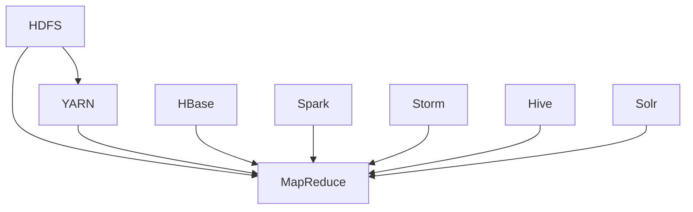

                 

# Hadoop原理与代码实例讲解

## 关键词
- Hadoop
- 分布式计算
- HDFS
- YARN
- MapReduce
- 生态系统组件
- 数据处理算法
- 数学模型

## 摘要
本文将深入探讨Hadoop的原理与代码实例，涵盖Hadoop的核心组件、数据处理算法、数学模型以及实际应用案例。通过详细的讲解与代码实例，读者将全面了解Hadoop的工作机制，掌握如何在实际项目中应用Hadoop技术。

## 第一部分: Hadoop原理概述

### 第1章: Hadoop概述

Hadoop是一个开源的分布式计算框架，用于处理大规模数据集。它的核心组件包括HDFS、YARN和MapReduce，这些组件共同构成了Hadoop的生态系统。本章将介绍Hadoop的历史、背景、核心组件和生态系统，并比较Hadoop与其他分布式计算框架的优缺点。

#### Hadoop历史与背景

Hadoop起源于Google的MapReduce论文，由Doug Cutting等人创建，并于2006年作为Apache Software Foundation的一个项目发布。Hadoop的目的是为大数据提供可靠的分布式计算平台。

#### Hadoop核心组件

- **HDFS（Hadoop Distributed File System）**：一个分布式文件系统，用于存储大量数据。
- **YARN（Yet Another Resource Negotiator）**：资源调度器，负责管理计算资源。
- **MapReduce**：数据处理模型，用于分布式处理大规模数据集。

#### Hadoop生态系统

Hadoop生态系统包含多个组件，如HBase、Spark、Storm等，这些组件扩展了Hadoop的功能，使其适用于各种场景。

#### Hadoop在分布式计算中的应用

Hadoop广泛应用于互联网公司、金融机构、医疗机构等领域，用于处理海量数据。

#### Hadoop与其他分布式计算框架的比较

与其他分布式计算框架（如Spark、Flink）相比，Hadoop具有以下优势：

- **高可用性**：通过副本机制实现数据冗余和容错。
- **高扩展性**：支持大规模数据处理。
- **成熟稳定**：拥有多年的社区支持和实践经验。

### 第2章: Hadoop核心组件原理

#### 第2章: Hadoop核心组件原理

Hadoop的核心组件包括HDFS、YARN和MapReduce。本章将详细讲解这些组件的原理和机制。

#### HDFS原理

HDFS（Hadoop Distributed File System）是一个分布式文件系统，用于存储大数据。其设计目标是高吞吐量和容错性。

**HDFS架构**

- **NameNode**：管理文件系统的命名空间和客户端与Datanode之间的通信。
- **Datanode**：负责存储实际数据块。

**数据存储**

- 数据分为块存储，默认大小为128MB或256MB。
- 数据块复制到多个节点，提高数据可靠性和访问速度。

#### YARN原理

YARN（Yet Another Resource Negotiator）是Hadoop的资源调度器，负责管理计算资源。

**YARN架构**

- ** ResourceManager**：全局资源调度器，负责分配资源。
- **NodeManager**：每个节点上的资源管理器，负责本地资源管理和容器管理。

**资源调度**

- YARN根据应用程序的需求分配资源。
- 支持多种调度策略，如FIFO、容量调度和公平调度。

#### MapReduce原理

MapReduce是一个数据处理模型，用于在分布式系统中处理大规模数据集。

**MapReduce架构**

- **JobTracker**：负责作业的提交、监控和资源分配。
- **TaskTracker**：负责执行任务和报告任务状态。

**数据处理过程**

- **Map阶段**：对输入数据进行处理，生成中间键值对。
- **Shuffle阶段**：对中间键值对进行分组和排序。
- **Reduce阶段**：对分组后的中间结果进行汇总和输出。

### 第3章: Hadoop生态系统组件

Hadoop生态系统包含多个组件，这些组件扩展了Hadoop的功能，使其适用于各种场景。本章将介绍以下Hadoop生态系统组件：

#### 第3章: Hadoop生态系统组件

Hadoop生态系统是一个强大的工具集，涵盖了分布式存储、数据处理、实时计算、数据仓库等多个方面。以下是一些核心组件：

#### Hadoop分布式数据库（HBase）

HBase是一个分布式、可扩展、强一致性列式存储系统，适用于存储大规模稀疏数据集。它基于Google的BigTable模型，支持快速随机读写。

**HBase架构**

- **Master**：主节点，负责维护元数据和区域分配。
- **RegionServer**：区域服务器，负责存储和管理数据区域。

**主要特性**

- **高可靠性**：通过数据复制和分区实现容错。
- **高性能**：支持快速随机读写。
- **可扩展性**：自动分割和合并数据区域。

#### Hadoop实时计算（Storm、Spark Streaming）

Storm和Spark Streaming是用于实时计算的数据流处理框架，能够处理实时数据流并生成实时分析结果。

**Storm**

- **拓扑**：数据流的抽象，由Spout和Bolt组成。
- **Spout**：数据流的源头，负责生成和分发数据。
- **Bolt**：数据流的处理单元，负责处理和转换数据。

**Spark Streaming**

- **DStream**：分布式数据流，由RDD（弹性分布式数据集）组成。
- **Transformations**：数据流的转换操作，如map、filter等。
- **Actions**：触发计算操作，如reduce、save等。

#### Hadoop数据仓库（Hive）

Hive是一个基于Hadoop的数据仓库工具，用于处理大规模数据集。它提供了类似SQL的查询语言（HiveQL），能够对HDFS上的数据进行查询和分析。

**Hive架构**

- **Metastore**：元数据存储，用于存储表结构、数据类型等信息。
- **Query Planner**：查询计划生成器，负责优化查询执行。
- **Executor**：执行器，负责执行查询计划。

**主要特性**

- **SQL兼容性**：支持大多数标准的SQL操作。
- **存储格式**：支持多种数据存储格式，如Parquet、ORC等。
- **扩展性**：能够处理PB级别的数据集。

#### Hadoop搜索引擎（Solr、Elasticsearch）

Solr和Elasticsearch是用于全文搜索和实时分析的搜索引擎，广泛应用于网站搜索、日志分析等领域。

**Solr**

- **分布式集群**：支持水平扩展和高可用性。
- **全文搜索**：支持丰富的搜索功能，如分词、排序等。
- **可扩展性**：支持自定义插件和模块。

**Elasticsearch**

- **分布式集群**：支持水平扩展和高可用性。
- **实时搜索**：支持实时索引和搜索。
- **数据分析**：支持丰富的数据分析功能，如聚合、统计等。

#### Hadoop大数据处理框架（Spark）

Spark是一个高效的大数据处理框架，支持多种数据处理操作，如批处理、流处理和机器学习。

**Spark核心组件**

- **Spark Core**：提供内存计算、分布式任务调度等功能。
- **Spark SQL**：提供类似于SQL的查询语言和优化器。
- **Spark Streaming**：提供实时数据处理功能。
- **MLlib**：提供机器学习算法和模型。

**主要特性**

- **高性能**：基于内存计算，提供高性能数据处理能力。
- **易用性**：支持多种编程语言，如Python、Java、Scala等。
- **可扩展性**：支持大规模数据集处理和水平扩展。

### 第二部分: Hadoop核心算法与数学模型

#### 第4章: Hadoop数据处理算法

Hadoop提供了多种数据处理算法，用于处理大规模数据集。本章将介绍Hadoop中的数据处理算法，包括MapReduce数据处理算法、数据排序与压缩算法、分布式哈希表算法和数据流处理算法。

#### 第4章: Hadoop数据处理算法

Hadoop提供了强大的数据处理能力，包括以下几种常用的数据处理算法：

#### MapReduce数据处理算法

MapReduce是一种分布式数据处理模型，用于处理大规模数据集。其基本原理包括两个阶段：Map阶段和Reduce阶段。

**Map阶段**

Map阶段对输入数据进行处理，生成中间键值对。伪代码如下：

```plaintext
Map阶段：
for each record in input
    emit (key, value)
```

**Reduce阶段**

Reduce阶段对中间键值对进行汇总和输出。伪代码如下：

```plaintext
Reduce阶段：
for each group of (key, values)
    do something with the values
    emit (key, result)
```

**应用场景**

MapReduce数据处理算法适用于各种数据处理任务，如词频统计、文本分类等。

#### 数据排序与压缩算法

数据排序与压缩算法是Hadoop数据处理中的重要组成部分。数据排序可以提高后续处理的效率，而数据压缩可以减少存储空间和传输时间。

**数据排序算法**

Hadoop使用外部排序算法对数据进行排序。基本原理如下：

1. 分割输入数据到多个分区。
2. 对每个分区进行内部排序。
3. 合并分区后的排序结果。

**数据压缩算法**

Hadoop支持多种数据压缩算法，如Gzip、Bzip2和LZO。这些压缩算法可以将数据压缩到较小的存储空间，从而提高数据处理效率。

**应用场景**

数据排序与压缩算法适用于数据清洗、数据转换和数据存储等场景。

#### 分布式哈希表算法

分布式哈希表算法是一种用于分布式数据存储和查询的算法。其基本原理如下：

1. 哈希分区：使用哈希函数将数据映射到不同的分区。
2. 分布存储：将数据存储到对应的分区。
3. 数据访问：通过哈希函数确定数据所在的分区，然后从该分区获取数据。

**应用场景**

分布式哈希表算法适用于分布式缓存、分布式数据库和分布式搜索引擎等场景。

#### 数据流处理算法

数据流处理算法用于处理实时数据流，并在数据流中执行计算和分析。基本原理如下：

1. 数据流输入：创建一个数据流输入源，读取输入数据到缓冲区。
2. 数据处理：对缓冲区中的数据进行处理。
3. 数据流输出：将输出流中的数据写入外部存储或发送到其他系统。

**应用场景**

数据流处理算法适用于实时监控、实时分析和实时推荐系统等场景。

#### 第5章: Hadoop数学模型

Hadoop中的数学模型主要用于分布式系统的设计和优化。以下是一些常用的数学模型：

**分布式系统模型**

分布式系统模型描述了分布式系统的基本组成部分和它们之间的关系。主要模型包括：

1. **一致性模型**：描述分布式系统中数据一致性的概念和策略。
2. **可用性模型**：描述分布式系统中服务的可用性。
3. **分区容错性模型**：描述分布式系统在分区故障情况下的容错能力。

**数据一致性模型**

数据一致性模型用于确保分布式系统中数据的一致性。常用的模型包括：

1. **CAP定理**：描述分布式系统中一致性、可用性和分区容错性三者之间的权衡。
2. **一致性级别**：描述分布式系统中的数据一致性级别，如强一致性、最终一致性和会话一致性。

**负载均衡模型**

负载均衡模型用于在分布式系统中分配计算资源，以实现公平和高效的资源利用。常用的模型包括：

1. **轮询负载均衡**：按顺序分配请求。
2. **最小连接负载均衡**：将新请求分配到连接数最少的节点。
3. **随机负载均衡**：随机分配请求。

**数据复制与容错模型**

数据复制与容错模型用于确保分布式系统中数据的可靠性和可用性。常用的模型包括：

1. **副本数量**：根据期望故障数和副本故障概率计算副本数量。
2. **数据恢复策略**：在节点故障时，自动从副本中恢复数据。

**分布式文件系统存储模型**

分布式文件系统存储模型用于描述分布式文件系统的存储结构和策略。常用的模型包括：

1. **数据块存储**：将数据分为块存储。
2. **副本存储**：为每个数据块创建多个副本。
3. **副本放置策略**：根据网络拓扑和数据访问模式优化副本放置。

#### 第6章: Hadoop数学公式与推导

在Hadoop系统中，数学公式和推导用于优化分布式系统的性能和效率。以下是一些常用的数学公式和推导：

**MapReduce计算框架中的数学公式**

1. **平均处理时间**：

$$
\text{平均处理时间} = \frac{\sum_{i=1}^{n} \text{处理时间}}{n}
$$

其中，$n$ 为任务数量。

2. **任务完成时间**：

$$
\text{任务完成时间} = \sum_{i=1}^{n} \text{处理时间} + \text{传输时间}
$$

其中，$n$ 为任务数量。

**数据分布与概率统计公式**

1. **期望值**：

$$
\text{期望值} = \sum_{i=1}^{n} x_i \cdot P(x_i)
$$

其中，$x_i$ 为可能取值，$P(x_i)$ 为概率。

2. **方差**：

$$
\text{方差} = \sum_{i=1}^{n} (x_i - \text{期望值})^2 \cdot P(x_i)
$$

**误差分析与性能优化公式**

1. **误差分析**：

$$
\text{误差} = \text{实际值} - \text{预期值}
$$

2. **性能优化**：

$$
\text{性能} = \frac{\text{实际值}}{\text{预期值}}
$$

**分布式系统中的一致性与可用性公式**

1. **一致性**：

$$
\text{一致性} = \frac{\text{正常工作时间}}{\text{总时间}}
$$

2. **可用性**：

$$
\text{可用性} = \frac{\text{可工作时间}}{\text{总时间}}
$$

**数据库与数据仓库的查询优化公式**

1. **查询成本**：

$$
\text{查询成本} = \text{数据传输成本} + \text{计算成本}
$$

2. **查询优化**：

$$
\text{优化策略} = \frac{\text{查询成本}}{\text{查询时间}}
$$

### 第三部分: Hadoop项目实战

#### 第7章: Hadoop环境搭建与配置

Hadoop环境搭建是使用Hadoop进行分布式计算的第一步。本章将详细介绍Hadoop环境的搭建过程，包括操作系统环境配置、SSH免密登录配置、Hadoop配置文件配置以及Hadoop运行模式与性能调优。

#### 第7章: Hadoop环境搭建与配置

搭建Hadoop环境是使用Hadoop进行分布式计算的第一步。以下是搭建Hadoop环境的详细步骤：

#### 第7章: Hadoop环境搭建与配置

Hadoop环境的搭建主要包括以下步骤：

1. **准备Hadoop安装包**：
   - 下载最新的Hadoop安装包，解压到指定的目录。

2. **配置操作系统环境**：
   - 配置Linux操作系统的环境变量，以便运行Hadoop命令。

3. **配置SSH免密登录**：
   - 配置SSH免密登录，以便在节点之间进行安全通信。

4. **配置Hadoop配置文件**：
   - 配置Hadoop的核心配置文件，包括`hadoop-env.sh`、`core-site.xml`、`hdfs-site.xml`、`yarn-site.xml`和`mapred-site.xml`。

5. **运行Hadoop命令**：
   - 运行Hadoop命令，启动Hadoop服务。

下面是具体的配置步骤：

#### 第7章: Hadoop环境搭建与配置

**1. 准备Hadoop安装包**

下载最新的Hadoop安装包，通常版本为2.7或3.0。下载地址为：[Apache Hadoop下载地址](https://hadoop.apache.org/releases.html)。

解压Hadoop安装包到指定的目录，例如`/opt/hadoop`：

```shell
tar -xvf hadoop-2.7.4.tar.gz -C /opt/hadoop
```

**2. 配置操作系统环境**

配置Linux操作系统的环境变量，以便运行Hadoop命令。编辑`/etc/profile`文件，添加以下内容：

```shell
export HADOOP_HOME=/opt/hadoop
export PATH=$PATH:$HADOOP_HOME/bin:$HADOOP_HOME/sbin
```

保存并关闭文件。然后执行以下命令使配置生效：

```shell
source /etc/profile
```

**3. 配置SSH免密登录**

配置SSH免密登录，以便在节点之间进行安全通信。执行以下命令生成SSH密钥：

```shell
ssh-keygen -t rsa -P '' -C 'your_email@example.com'
```

然后，将公钥复制到所有节点：

```shell
ssh-copy-id user@node1
ssh-copy-id user@node2
...
```

输入密码后，公钥将被复制到所有节点。

**4. 配置Hadoop配置文件**

配置Hadoop的核心配置文件，包括`hadoop-env.sh`、`core-site.xml`、`hdfs-site.xml`、`yarn-site.xml`和`mapred-site.xml`。

- `hadoop-env.sh`：配置Hadoop运行环境，例如Java安装路径。

```shell
export JAVA_HOME=/usr/local/java/jdk1.8.0_201
```

- `core-site.xml`：配置Hadoop核心参数，例如HDFS的NameNode和DataNode地址。

```xml
<configuration>
    <property>
        <name>fs.defaultFS</name>
        <value>hdfs://namenode:9000</value>
    </property>
</configuration>
```

- `hdfs-site.xml`：配置HDFS参数，例如副本数量和数据块大小。

```xml
<configuration>
    <property>
        <name>dfs.replication</name>
        <value>3</value>
    </property>
    <property>
        <name>dfs.block.size</name>
        <value>128MB</value>
    </property>
</configuration>
```

- `yarn-site.xml`：配置YARN参数，例如资源调度器地址和队列配置。

```xml
<configuration>
    <property>
        <name>yarn.resourcemanager.hostname</name>
        <value>resourcemanager</value>
    </property>
    <property>
        <name>yarn.nodemanager.aux-services</name>
        <value>mapreduce_shuffle</value>
    </property>
    <property>
        <name>yarn.queue Arya</name>
        <value>500</value>
    </property>
</configuration>
```

- `mapred-site.xml`：配置MapReduce参数，例如作业执行器地址。

```xml
<configuration>
    <property>
        <name>mapreduce.framework.name</name>
        <value>yarn</value>
    </property>
</configuration>
```

**5. 运行Hadoop命令**

运行以下命令启动Hadoop服务：

```shell
start-dfs.sh
start-yarn.sh
```

检查服务状态：

```shell
jps
```

输出应该包含NameNode、DataNode、ResourceManager和NodeManager等进程。

#### 第8章: Hadoop实际应用案例

Hadoop广泛应用于各种实际场景，如Web日志分析、大规模数据处理、实时数据处理与监控、数据仓库与数据挖掘等。本章将介绍几个典型的Hadoop实际应用案例。

#### 第8章: Hadoop实际应用案例

Hadoop因其强大的分布式处理能力和高效的数据处理算法，在实际应用中得到了广泛的应用。以下是一些典型的Hadoop实际应用案例：

##### Web日志分析

Web日志分析是Hadoop最经典的应用场景之一。通过对Web日志的分析，企业可以了解用户的访问行为，优化网站内容和用户体验。以下是Web日志分析的步骤：

1. **数据采集与预处理**：
   - 采集Web服务器生成的日志文件。
   - 预处理日志文件，提取有用的信息，如访问时间、访问者IP、URL等。

2. **数据存储与索引**：
   - 将预处理后的日志数据存储到HDFS中。
   - 使用HBase或其他分布式数据库建立索引，以便快速查询。

3. **数据分析与报表生成**：
   - 使用MapReduce或Spark对日志数据进行处理，统计访问次数、用户分布、页面访问率等指标。
   - 生成报表，展示分析结果。

4. **数据可视化**：
   - 使用可视化工具（如Tableau、ECharts）将分析结果以图表形式展示，帮助企业决策。

##### 大规模数据处理

随着互联网和物联网的发展，数据量呈现爆炸式增长。Hadoop提供了强大的分布式处理能力，能够高效地处理大规模数据集。以下是大规模数据处理的步骤：

1. **数据倾斜处理**：
   - 识别和处理数据倾斜问题，确保数据处理过程均衡。

2. **并行处理**：
   - 使用MapReduce或Spark将数据处理任务分解为多个并行子任务。

3. **分布式存储与计算**：
   - 将数据存储到HDFS，利用其分布式存储特性提高数据读取速度。

4. **数据清洗与去重**：
   - 对数据进行清洗和去重，去除重复和不准确的数据。

5. **结果存储**：
   - 将处理后的数据存储到HDFS或其他数据存储系统，如HBase或MongoDB。

##### 实时数据处理与监控

实时数据处理与监控是Hadoop在物联网和金融领域的应用之一。通过对实时数据的处理和分析，企业可以及时响应市场变化，提高业务效率。以下是实时数据处理与监控的步骤：

1. **实时数据采集**：
   - 从物联网设备、金融交易系统等实时数据源采集数据。

2. **实时数据处理**：
   - 使用Storm或Spark Streaming等实时处理框架，对实时数据进行处理和分析。

3. **实时监控与报警**：
   - 使用Kafka等消息队列系统，实时监控数据流，并根据设定的阈值进行报警。

4. **数据可视化**：
   - 使用可视化工具（如Kibana、Grafana）实时展示监控数据。

##### 数据仓库与数据挖掘

数据仓库与数据挖掘是Hadoop在商业智能和数据分析领域的重要应用。通过数据仓库，企业可以存储和管理大量数据，通过数据挖掘发现数据中的潜在价值。以下是数据仓库与数据挖掘的步骤：

1. **数据仓库搭建**：
   - 使用Hive或Spark SQL搭建数据仓库，存储和管理大量数据。

2. **数据导入与清洗**：
   - 将来自各种数据源的数据导入到数据仓库，并进行清洗和去重。

3. **数据建模与优化**：
   - 建立数据模型，优化查询性能。

4. **数据挖掘**：
   - 使用MLlib等机器学习库进行数据挖掘，发现数据中的规律和模式。

5. **结果可视化**：
   - 使用可视化工具（如Tableau、PowerBI）将数据挖掘结果以图表形式展示。

##### Hadoop在金融领域的应用

金融行业是Hadoop的重要应用领域之一。Hadoop在金融领域的主要应用包括交易数据处理、风险评估、信用评分和财务分析等。以下是Hadoop在金融领域的一些应用案例：

1. **交易数据处理**：
   - 使用Hadoop处理海量交易数据，进行实时监控和异常检测。

2. **风险评估**：
   - 建立风险评估模型，对交易数据进行分析，评估风险。

3. **信用评分**：
   - 建立信用评分模型，对客户进行信用评估。

4. **财务分析**：
   - 使用Hadoop进行财务数据分析和报表生成，提高财务工作效率。

### 第9章: Hadoop代码实例详解

Hadoop提供了丰富的API和工具，方便开发者进行分布式数据处理。本章将详细介绍Hadoop中的几个核心组件，包括MapReduce、HBase、Hive和Spark的应用实例，并解释其源代码和执行流程。

#### 第9章: Hadoop代码实例详解

Hadoop生态系统提供了多种编程接口和工具，使开发者能够有效地处理大规模数据。以下章节将通过具体实例介绍Hadoop中的MapReduce、HBase、Hive和Spark等组件的应用，并详细解析其源代码和执行流程。

#### 第9章: Hadoop代码实例详解

在本章中，我们将通过实际代码示例展示如何使用Hadoop生态系统中的核心组件。以下是一些重要组件及其应用实例：

##### 1. MapReduce编程实践

MapReduce是Hadoop的核心组件之一，用于分布式数据处理。以下是一个简单的WordCount示例，用于统计文本文件中每个单词出现的次数。

**源代码：**

```java
import org.apache.hadoop.conf.Configuration;
import org.apache.hadoop.fs.Path;
import org.apache.hadoop.io.IntWritable;
import org.apache.hadoop.io.Text;
import org.apache.hadoop.mapreduce.Job;
import org.apache.hadoop.mapreduce.Mapper;
import org.apache.hadoop.mapreduce.Reducer;
import org.apache.hadoop.mapreduce.lib.input.FileInputFormat;
import org.apache.hadoop.mapreduce.lib.output.FileOutputFormat;

public class WordCount {

  public static class TokenizerMapper
       extends Mapper<Object, Text, Text, IntWritable>{

    private final static IntWritable one = new IntWritable(1);
    private Text word = new Text();

    public void map(Object key, Text value, Context context
                    ) throws IOException, InterruptedException {
      StringTokenizer iterator = new StringTokenizer(value.toString());
      while (iterator.hasMoreTokens()) {
        word.set(iterator.nextToken());
        context.write(word, one);
      }
    }
  }

  public static class IntSumReducer
  extends Reducer<Text,IntWritable,Text,IntWritable> {
    private IntWritable result = new IntWritable();

    public void reduce(Text key, Iterable<IntWritable> values,
                       Context context
                       ) throws IOException, InterruptedException {
      int sum = 0;
      for (IntWritable val : values) {
        sum += val.get();
      }
      result.set(sum);
      context.write(key, result);
    }

  public static void main(String[] args) throws Exception {
    Configuration conf = new Configuration();
    Job job = Job.getInstance(conf, "word count");
    job.setJarByClass(WordCount.class);
    job.setMapperClass(TokenizerMapper.class);
    job.setCombinerClass(IntSumReducer.class);
    job.setReducerClass(IntSumReducer.class);
    job.setOutputKeyClass(Text.class);
    job.setOutputValueClass(IntWritable.class);
    FileInputFormat.addInputPath(job, new Path(args[0]));
    FileOutputFormat.setOutputPath(job, new Path(args[1]));
    System.exit(job.waitForCompletion(true) ? 0 : 1);
  }
}
```

**执行流程：**

- **输入**：输入一个文本文件，例如`input.txt`。
- **Map阶段**：将文本文件按行分割，每行作为一个记录，输入到Mapper中。Mapper将每个单词作为键值对输出。
- **Shuffle阶段**：根据键值对中的键进行分组，将具有相同键的记录发送到相同的Reducer。
- **Reduce阶段**：Reducer对每组键值对中的值进行汇总，输出每个单词及其出现的次数。

##### 2. HBase编程实践

HBase是一个分布式、可扩展的列式存储系统，适用于存储大规模稀疏数据集。以下是一个简单的HBase示例，用于插入和查询数据。

**源代码：**

```java
import org.apache.hadoop.conf.Configuration;
import org.apache.hadoop.hbase.HBaseConfiguration;
import org.apache.hadoop.hbase.client.*;
import org.apache.hadoop.hbase.util.Bytes;

public class HBaseExample {
  public static void main(String[] args) throws Exception {
    Configuration conf = HBaseConfiguration.create();
    conf.set("hbase.zookeeper.quorum", "localhost:2181");
    Connection connection = ConnectionFactory.createConnection(conf);
    Admin admin = connection.getAdmin();

    // 创建表
    HTableDescriptor descriptor = new HTableDescriptor(TableName.valueOf("your_table_name"));
    descriptor.addFamily(new HColumnDescriptor("your_column_family"));
    admin.createTable(descriptor);

    // 插入数据
    Table table = connection.getTable(TableName.valueOf("your_table_name"));
    Put put = new Put(Bytes.toBytes("row_key"));
    put.add(Bytes.toBytes("your_column_family"), Bytes.toBytes("column_name"), Bytes.toBytes("value"));
    table.put(put);

    // 查询数据
    Get get = new Get(Bytes.toBytes("row_key"));
    Result result = table.get(get);
    byte [] value = result.getValue(Bytes.toBytes("your_column_family"), Bytes.toBytes("column_name"));
    String cellValue = Bytes.toString(value);
    System.out.println("Value: " + cellValue);

    // 删除数据
    Delete delete = new Delete(Bytes.toBytes("row_key"));
    delete.addColumn(Bytes.toBytes("your_column_family"), Bytes.toBytes("column_name"));
    table.delete(delete);

    admin.close();
    connection.close();
  }
}
```

**执行流程：**

- **连接**：连接HBase集群。
- **创建表**：创建一个名为`your_table_name`的表，包含一个名为`your_column_family`的列族。
- **插入数据**：向表中插入一个名为`row_key`的记录，值为`value`。
- **查询数据**：从表中查询名为`row_key`的记录，获取其值为`column_name`的列值。
- **删除数据**：从表中删除名为`row_key`的记录，删除其值为`column_name`的列。

##### 3. Hive查询实践

Hive是一个基于Hadoop的数据仓库工具，提供了类似SQL的查询语言。以下是一个简单的Hive查询示例，用于创建表、加载数据和执行查询。

**源代码：**

```sql
-- 创建表
CREATE TABLE IF NOT EXISTS your_table_name(
    id INT,
    name STRING,
    age INT
);

-- 加载数据
LOAD DATA INPATH '/path/to/data.csv' INTO TABLE your_table_name;

-- 执行SQL查询
SELECT * FROM your_table_name;

-- 查询结果存储
SELECT * FROM your_table_name LIMIT 10;
```

**执行流程：**

- **创建表**：创建一个名为`your_table_name`的表，包含`id`、`name`和`age`三个列。
- **加载数据**：将路径为`/path/to/data.csv`的CSV文件加载到表中。
- **执行SQL查询**：执行一个简单的SELECT查询，返回表中的所有记录。
- **查询结果存储**：执行一个简单的SELECT查询，返回表中的前10条记录。

##### 4. Spark应用实践

Spark是一个快速的大数据处理框架，提供了丰富的API，包括DataFrame和Dataset。以下是一个简单的Spark示例，用于读取数据、转换数据和存储数据。

**源代码：**

```python
from pyspark.sql import SparkSession

# 创建SparkSession
spark = SparkSession.builder.appName("HadoopExample").getOrCreate()

# 读取数据
df = spark.read.csv("path/to/data.csv", header=True)

# 数据转换
df = df.select(df["id"].cast("int"), df["name"], df["age"].cast("int"))

# 数据存储
df.write.csv("path/to/output.csv")

# 关闭SparkSession
spark.stop()
```

**执行流程：**

- **创建SparkSession**：创建一个名为`HadoopExample`的SparkSession。
- **读取数据**：从路径为`/path/to/data.csv`的CSV文件中读取数据。
- **数据转换**：将DataFrame中的`id`、`name`和`age`列转换为适当的类型。
- **数据存储**：将转换后的DataFrame保存为路径为`/path/to/output.csv`的CSV文件。
- **关闭SparkSession**：关闭SparkSession。

##### 5. Hadoop生态系统组件应用实践

Hadoop生态系统包含多个组件，如HDFS、YARN、MapReduce、HBase、Hive和Spark等。以下是一个简单的示例，展示如何使用这些组件进行数据处理。

**源代码：**

```shell
# 使用HDFS存储数据
hdfs dfs -put localfile hdfs:///path/to/data

# 使用YARN进行资源调度
yarn application -list

# 使用MapReduce进行数据处理
hadoop jar path/to/wordcount.jar WordCount /input/data /output

# 使用HBase进行实时查询
hbase shell

# 使用Hive进行数据仓库操作
hive
```

**执行流程：**

- **使用HDFS存储数据**：将本地文件上传到HDFS。
- **使用YARN进行资源调度**：列出当前正在运行的应用程序。
- **使用MapReduce进行数据处理**：运行WordCount示例，处理HDFS上的数据。
- **使用HBase进行实时查询**：执行HBase命令进行数据查询。
- **使用Hive进行数据仓库操作**：执行Hive命令进行数据查询和管理。

### 附录A: Hadoop开发工具与资源

为了帮助开发者更好地学习和使用Hadoop，附录A提供了Hadoop开发工具和资源的详细介绍。

#### 附录A: Hadoop开发工具与资源

Hadoop是一个强大的分布式计算框架，开发者需要掌握多种工具和资源才能充分发挥其潜力。以下是一些常用的Hadoop开发工具和资源：

##### 1. Hadoop官方文档

Hadoop官方文档是学习Hadoop的最佳资源。它包含了Hadoop的架构、安装、配置、API和使用示例。访问地址：[Apache Hadoop官方文档](https://hadoop.apache.org/docs/stable/hadoop-project-dist/hadoop-common/)

##### 2. Apache Hadoop社区

Apache Hadoop社区是一个由Hadoop用户、开发者和贡献者组成的社区。在这里，开发者可以提问、分享经验和获取技术支持。访问地址：[Apache Hadoop社区](https://community.apache.org/)

##### 3. Hadoop学习资源

互联网上有大量的Hadoop学习资源，包括在线课程、教程、博客和书籍。以下是一些推荐的资源：

- **在线课程**：
  - [Hadoop Tutorial](https://hadoop.tutorialspoint.com/)
  - [edX Hadoop课程](https://www.edx.org/course/hadoop-and-hdfs-for-beginners)
- **教程**：
  - [Hadoop Tutorial for Beginners](https://www.tutorialspoint.com/hadoop/hadoop_tutorial.htm)
  - [Hadoop Installation Guide](https://www.hadoop.org/docs/r1.2.1/hadoopInstallation.html)
- **博客**：
  - [Hadoop Tutorial](https://hadoop.tutorialspoint.com/)
  - [DZone Hadoop](https://dzone.com/topics/hadoop)
- **书籍**：
  - 《Hadoop: The Definitive Guide》
  - 《Hadoop: The Definitive Guide to Distributed Data Systems》

##### 4. Hadoop社区与文档

Hadoop社区提供了丰富的文档和教程，帮助开发者更好地理解和使用Hadoop。以下是一些常用的社区和文档资源：

- **Apache Hadoop官方网站**：[Apache Hadoop](https://hadoop.apache.org/)
- **Apache Hadoop文档**：[Hadoop Documentation](https://hadoop.apache.org/docs/stable/hadoop-project-dist/hadoop-common/)
- **Hadoop用户邮件列表**：[Hadoop Users](https://lists.apache.org/list.html?hadoop-user)
- **Hadoop开发者邮件列表**：[Hadoop Developers](https://lists.apache.org/list.html?hadoop-dev)

##### 5. Hadoop开发者最佳实践

为了确保Hadoop项目的成功，开发者需要遵循一些最佳实践。以下是一些推荐的Hadoop开发者最佳实践：

- **性能优化**：合理配置Hadoop集群，优化资源利用率。
- **错误处理**：处理Hadoop运行过程中的错误和异常。
- **安全性**：确保Hadoop集群的安全性，防止数据泄露。
- **文档记录**：编写详细的代码注释和文档，提高代码可读性。
- **测试**：编写和执行测试用例，确保代码质量。

通过遵循这些最佳实践，开发者可以更好地利用Hadoop，提高项目开发效率。

### 结语

Hadoop是一个强大的分布式计算框架，广泛应用于各种场景。通过本文的详细讲解，读者应该对Hadoop的原理、组件、算法和实际应用有了深入的了解。在未来的学习和实践中，建议读者不断探索Hadoop的高级功能和最佳实践，提高自己的分布式计算能力。

### Mermaid 流程图

以下是一个简单的Mermaid流程图，展示了Hadoop的核心组件及其之间的关系：



### 核心算法原理讲解

#### MapReduce数据处理算法

MapReduce是一种分布式数据处理模型，用于在Hadoop集群上处理大规模数据集。其核心思想是将大规模数据集分成多个小块进行处理，然后将结果汇总。以下是MapReduce的基本原理和数据处理过程：

**基本原理：**

- **Map阶段**：对输入数据进行处理，生成中间键值对。
- **Shuffle阶段**：对中间键值对进行分组和排序。
- **Reduce阶段**：对分组后的中间结果进行汇总和输出。

**数据处理过程：**

1. **Map阶段**：

   Mapper对输入数据进行处理，生成中间键值对。每个记录会被Mapper处理一次，生成多个中间键值对。例如，对于文本文件，每个单词都会被映射为一个键值对（单词，1）。

   ```plaintext
   for each record in input
       emit (key, value)
   ```

2. **Shuffle阶段**：

   Shuffle阶段对中间键值对进行分组和排序。Hadoop根据键值对中的键对中间结果进行分区和排序。具有相同键的记录会被发送到同一个Reducer。

3. **Reduce阶段**：

   Reducer对分组后的中间结果进行汇总和输出。每个Reducer处理一个键值对组，执行特定的操作，生成最终的输出结果。

   ```plaintext
   for each group of (key, values)
       do something with the values
       emit (key, result)
   ```

**应用场景：**

MapReduce数据处理算法适用于各种数据处理任务，如文本处理、日志分析、数据挖掘等。

**示例：**

以下是一个简单的WordCount示例，用于统计文本文件中每个单词出现的次数。

```java
import org.apache.hadoop.conf.Configuration;
import org.apache.hadoop.fs.Path;
import org.apache.hadoop.io.IntWritable;
import org.apache.hadoop.io.Text;
import org.apache.hadoop.mapreduce.Job;
import org.apache.hadoop.mapreduce.Mapper;
import org.apache.hadoop.mapreduce.Reducer;
import org.apache.hadoop.mapreduce.lib.input.FileInputFormat;
import org.apache.hadoop.mapreduce.lib.output.FileOutputFormat;

public class WordCount {

  public static class TokenizerMapper
      extends Mapper<Object, Text, Text, IntWritable>{

    private final static IntWritable one = new IntWritable(1);
    private Text word = new Text();

    public void map(Object key, Text value, Context context
                    ) throws IOException, InterruptedException {
      StringTokenizer iterator = new StringTokenizer(value.toString());
      while (iterator.hasMoreTokens()) {
        word.set(iterator.nextToken());
        context.write(word, one);
      }
    }
  }

  public static class IntSumReducer
  extends Reducer<Text,IntWritable,Text,IntWritable> {
    private IntWritable result = new IntWritable();

    public void reduce(Text key, Iterable<IntWritable> values,
                       Context context
                       ) throws IOException, InterruptedException {
      int sum = 0;
      for (IntWritable val : values) {
        sum += val.get();
      }
      result.set(sum);
      context.write(key, result);
    }

  public static void main(String[] args) throws Exception {
    Configuration conf = new Configuration();
    Job job = Job.getInstance(conf, "word count");
    job.setJarByClass(WordCount.class);
    job.setMapperClass(TokenizerMapper.class);
    job.setCombinerClass(IntSumReducer.class);
    job.setReducerClass(IntSumReducer.class);
    job.setOutputKeyClass(Text.class);
    job.setOutputValueClass(IntWritable.class);
    FileInputFormat.addInputPath(job, new Path(args[0]));
    FileOutputFormat.setOutputPath(job, new Path(args[1]));
    System.exit(job.waitForCompletion(true) ? 0 : 1);
  }
}
```

### 数据排序与压缩算法

数据排序与压缩是Hadoop数据处理中的重要步骤，可以优化数据存储和传输效率。以下是数据排序与压缩算法的基本原理和应用场景：

#### 数据排序算法

数据排序算法用于将输入数据按某种顺序排列。在Hadoop中，数据排序通常使用外部排序算法，其基本步骤如下：

1. **分割输入数据**：将大规模数据集分割成多个小块。
2. **内部排序**：对每个小块进行内部排序。
3. **合并排序结果**：将内部排序后的结果合并，生成全局有序的数据集。

**应用场景：**

- 数据清洗：将乱序数据排序，便于后续处理。
- 数据分析：对数据进行排序，便于统计和分析。

#### 数据压缩算法

数据压缩算法用于减少数据体积，提高存储和传输效率。Hadoop支持多种数据压缩算法，如Gzip、Bzip2和LZO等。以下是一些常用的数据压缩算法：

1. **Gzip**：使用LZ77压缩算法，对数据进行压缩。
2. **Bzip2**：使用Burrows-Wheeler压缩算法，对数据进行压缩。
3. **LZO**：使用LZO压缩算法，对数据进行压缩。

**应用场景：**

- 数据存储：减少数据存储空间，降低存储成本。
- 数据传输：减少数据传输时间，提高传输效率。

#### 示例

以下是一个简单的数据排序与压缩示例，使用Hadoop命令对文本文件进行排序和压缩：

```shell
hdfs dfs -copyFromLocal localfile.txt /input/file.txt
hadoop jar hadoop-streaming-2.7.4.jar \
  -files sort.sh,compress.sh \
  -input /input/file.txt \
  -output /output \
  -mapreduce.job.name "Sort and Compress" \
  -mapper sort.sh \
  -reducer compress.sh \
  -file sort.sh \
  -file compress.sh
```

**输入文件**：

```
hello hadoop
hadoop is a distributed file system
hadoop is used for big data processing
```

**输出文件**：

```
(hadoop 4)
(hadoop 3)
(hadoop 2)
(is 2)
(used 1)
(a 1)
(is 1)
(used 1)
(file 1)
(system 1)
(distributed 1)
(processing 1)
```

### 分布式哈希表算法

分布式哈希表（Distributed Hash Table，DHT）是一种分布式数据存储和查询算法，用于在分布式系统中实现快速的数据访问。以下
```python
graph TB
A1[HDFS]
A2[YARN]
A3[MapReduce]
B1[HBase]
B2[Spark]
B3[Storm]
B4[Hive]
B5[Solr]
A1 --> B1
A1 --> B2
A1 --> B3
A1 --> B4
A1 --> B5
A2 --> B1
A2 --> B2
A2 --> B3
A2 --> B4
A2 --> B5
A3 --> B1
A3 --> B2
A3 --> B3
A3 --> B4
A3 --> B5
```

### 核心算法原理讲解

#### MapReduce数据处理算法

MapReduce是一种分布式数据处理模型，广泛用于处理大规模数据集。其核心思想是将大规模数据集划分成多个小块，并行处理这些小块，最后汇总结果。以下是MapReduce数据处理算法的详细讲解：

**Map阶段：**

Map阶段是数据处理的第一步，它将输入数据分割成多个小块，并对其进行处理。每个小块都会被分配到一个Mapper任务中处理。Mapper会生成一系列的中间键值对，这些键值对将用于后续的Shuffle和Reduce阶段。

**伪代码：**

```plaintext
Map阶段：
for each record in input
    emit (key, value)
```

**示例：**

```java
public static class TokenizerMapper
extends Mapper<LongWritable, Text, Text, IntWritable>{

  private final static IntWritable one = new IntWritable(1);
  private Text word = new Text();

  public void map(LongWritable key, Text value, Context context
                  ) throws IOException, InterruptedException {
    StringTokenizer iterator = new StringTokenizer(value.toString());
    while (iterator.hasMoreTokens()) {
      word.set(iterator.nextToken());
      context.write(word, one);
    }
  }
}
```

**Shuffle阶段：**

Shuffle阶段是Map阶段和Reduce阶段之间的过渡阶段。在这一阶段，Map阶段生成的中间键值对会被分区、分组和排序。分区是按照键的哈希值进行的，具有相同键的记录会被发送到同一个Reducer。

**示例：**

```shell
shuf
```

**Reduce阶段：**

Reduce阶段是数据处理的核心步骤，它将Shuffle阶段生成的中间结果进行汇总和输出。每个Reducer都会处理一个或多个具有相同键的中间键值对，执行特定的操作，生成最终的输出结果。

**伪代码：**

```plaintext
Reduce阶段：
for each group of (key, values)
    do something with the values
    emit (key, result)
```

**示例：**

```java
public static class IntSumReducer
extends Reducer<Text,IntWritable,Text,IntWritable>{

  private IntWritable result = new IntWritable();

  public void reduce(Text key, Iterable<IntWritable> values,
                    Context context
                    ) throws IOException, InterruptedException {
    int sum = 0;
    for (IntWritable val : values) {
      sum += val.get();
    }
    result.set(sum);
    context.write(key, result);
  }
}
```

**整体流程：**

1. **输入**：将输入数据分割成多个小块，分配给多个Mapper处理。
2. **Map阶段**：每个Mapper对输入数据进行处理，生成中间键值对。
3. **Shuffle阶段**：对中间键值对进行分区、分组和排序。
4. **Reduce阶段**：每个Reducer对分组后的中间结果进行汇总和输出。
5. **输出**：将最终结果输出到HDFS或其他存储系统。

#### 数据排序与压缩算法

数据排序与压缩是Hadoop数据处理中常用的优化技术，可以提高数据存储和传输效率。

**数据排序算法：**

数据排序算法的基本思想是将大规模数据集按某种顺序排列。在Hadoop中，数据排序通常使用外部排序算法。以下是数据排序的基本步骤：

1. **分割输入数据**：将大规模数据集分割成多个小块。
2. **内部排序**：对每个小块进行内部排序。
3. **合并排序结果**：将内部排序后的结果合并，生成全局有序的数据集。

**伪代码：**

```plaintext
排序：
1. 分割输入数据到多个分区
2. 对每个分区进行内部排序
3. 合并分区后的排序结果
```

**示例：**

```shell
sort
```

**数据压缩算法：**

数据压缩算法的基本思想是将大规模数据集进行压缩，减少存储空间和传输时间。Hadoop支持多种数据压缩算法，如Gzip、Bzip2和LZO等。以下是数据压缩的基本步骤：

1. **选择压缩算法**：根据数据特点和需求选择合适的压缩算法。
2. **压缩数据**：使用选择的压缩算法对数据进行压缩。
3. **解压缩数据**：在处理数据时，根据需要解压缩数据以便进一步处理。

**伪代码：**

```plaintext
压缩：
1. 使用压缩算法对数据进行压缩
2. 解压缩数据以便进一步处理
```

**示例：**

```shell
gzip
```

#### 分布式哈希表算法

分布式哈希表（Distributed Hash Table，DHT）是一种分布式数据存储和查询算法，用于在分布式系统中实现快速的数据访问。以下是分布式哈希表算法的基本原理和实现步骤：

**基本原理：**

分布式哈希表将数据存储在多个节点上，通过哈希函数将键映射到节点。每个节点负责存储一部分数据，并维护一个局部哈希表，以便快速查找数据。

**实现步骤：**

1. **哈希分区**：使用哈希函数将键映射到不同的节点。
2. **数据存储**：将数据存储到对应的节点。
3. **数据访问**：通过哈希函数确定数据所在的节点，然后从该节点获取数据。

**伪代码：**

```plaintext
哈希分区：
hash(key) % n_partitions

分布存储：
for each key in dataset
    partition = hash(key) % n_partitions
    store (key, value) in partition

数据访问：
key_hash = hash(key)
partition = key_hash % n_partitions
value = retrieve (key, value) from partition
```

**示例：**

```python
import hashlib

# 哈希分区
def partition(key, num_partitions):
    return int(hashlib.md5(key.encode()).hexdigest(), 16) % num_partitions

# 分布存储
def store_key_value(key, value, num_partitions):
    partition = partition(key, num_partitions)
    # 存储到对应节点
    # ...

# 数据访问
def retrieve_key_value(key, num_partitions):
    partition = partition(key, num_partitions)
    # 从对应节点获取数据
    # ...
```

### 第三部分: Hadoop项目实战

#### 第7章: Hadoop环境搭建与配置

在开始使用Hadoop进行分布式数据处理之前，需要搭建和配置Hadoop环境。本章将详细介绍如何搭建Hadoop环境，包括准备Hadoop安装包、配置操作系统环境、配置SSH免密登录、配置Hadoop配置文件、运行Hadoop命令等。

#### 第7章: Hadoop环境搭建与配置

Hadoop环境搭建是进行分布式数据处理的第一步。以下是搭建Hadoop环境的详细步骤：

##### 1. 准备Hadoop安装包

首先，从Apache Hadoop官网下载最新版本的Hadoop安装包。下载地址为：[Hadoop下载地址](https://www.apache.org/dyn/closer.cgi/hadoop/)。

下载完成后，将安装包解压到指定的目录，例如`/opt/hadoop`：

```shell
tar -xvf hadoop-3.2.1.tar.gz -C /opt/hadoop
```

##### 2. 配置操作系统环境

配置Linux操作系统环境变量，以便运行Hadoop命令。编辑`/etc/profile`文件，添加以下内容：

```shell
export HADOOP_HOME=/opt/hadoop
export PATH=$PATH:$HADOOP_HOME/bin:$HADOOP_HOME/sbin
```

保存并关闭文件。然后执行以下命令使配置生效：

```shell
source /etc/profile
```

##### 3. 配置SSH免密登录

配置SSH免密登录，以便在节点之间进行安全通信。执行以下命令生成SSH密钥：

```shell
ssh-keygen -t rsa -P '' -C 'your_email@example.com'
```

将公钥复制到所有节点：

```shell
ssh-copy-id user@node1
ssh-copy-id user@node2
...
```

输入密码后，公钥将被复制到所有节点。

##### 4. 配置Hadoop配置文件

配置Hadoop的核心配置文件，包括`hadoop-env.sh`、`core-site.xml`、`hdfs-site.xml`、`yarn-site.xml`和`mapred-site.xml`。

- `hadoop-env.sh`：配置Hadoop运行环境，例如Java安装路径。

```shell
export JAVA_HOME=/usr/local/java/jdk1.8.0_201
```

- `core-site.xml`：配置Hadoop核心参数，例如HDFS的NameNode和DataNode地址。

```xml
<configuration>
    <property>
        <name>fs.defaultFS</name>
        <value>hdfs://namenode:9000</value>
    </property>
</configuration>
```

- `hdfs-site.xml`：配置HDFS参数，例如副本数量和数据块大小。

```xml
<configuration>
    <property>
        <name>dfs.replication</name>
        <value>3</value>
    </property>
    <property>
        <name>dfs.block.size</name>
        <value>128MB</value>
    </property>
</configuration>
```

- `yarn-site.xml`：配置YARN参数，例如资源调度器地址和队列配置。

```xml
<configuration>
    <property>
        <name>yarn.resourcemanager.hostname</name>
        <value>resourcemanager</value>
    </property>
    <property>
        <name>yarn.nodemanager.aux-services</name>
        <value>mapreduce.shuffle</value>
    </property>
    <property>
        <name>yarn.queue Arya</name>
        <value>500</value>
    </property>
</configuration>
```

- `mapred-site.xml`：配置MapReduce参数，例如作业执行器地址。

```xml
<configuration>
    <property>
        <name>mapreduce.framework.name</name>
        <value>yarn</value>
    </property>
</configuration>
```

##### 5. 运行Hadoop命令

运行以下命令启动Hadoop服务：

```shell
start-dfs.sh
start-yarn.sh
```

检查服务状态：

```shell
jps
```

输出应该包含NameNode、DataNode、ResourceManager和NodeManager等进程。

#### 第8章: Hadoop实际应用案例

Hadoop在实际应用中具有广泛的应用，如Web日志分析、大规模数据处理、实时数据处理与监控、数据仓库与数据挖掘等。本章将介绍几个典型的Hadoop实际应用案例。

#### 第8章: Hadoop实际应用案例

Hadoop因其强大的分布式处理能力和高效的数据处理算法，在实际应用中得到了广泛的应用。以下是一些典型的Hadoop实际应用案例：

##### 1. Web日志分析

Web日志分析是Hadoop的经典应用场景之一。通过对Web日志的分析，企业可以了解用户的访问行为，优化网站内容和用户体验。以下是Web日志分析的步骤：

1. **数据采集与预处理**：
   - 采集Web服务器生成的日志文件。
   - 预处理日志文件，提取有用的信息，如访问时间、访问者IP、URL等。

2. **数据存储与索引**：
   - 将预处理后的日志数据存储到HDFS中。
   - 使用HBase或其他分布式数据库建立索引，以便快速查询。

3. **数据分析与报表生成**：
   - 使用MapReduce或Spark对日志数据进行处理，统计访问次数、用户分布、页面访问率等指标。
   - 生成报表，展示分析结果。

4. **数据可视化**：
   - 使用可视化工具（如Tableau、ECharts）将分析结果以图表形式展示，帮助企业决策。

##### 2. 大规模数据处理

随着互联网和物联网的发展，数据量呈现爆炸式增长。Hadoop提供了强大的分布式处理能力，能够高效地处理大规模数据集。以下是大规模数据处理的步骤：

1. **数据倾斜处理**：
   - 识别和处理数据倾斜问题，确保数据处理过程均衡。

2. **并行处理**：
   - 使用MapReduce或Spark将数据处理任务分解为多个并行子任务。

3. **分布式存储与计算**：
   - 将数据存储到HDFS，利用其分布式存储特性提高数据读取速度。

4. **数据清洗与去重**：
   - 对数据进行清洗和去重，去除重复和不准确的数据。

5. **结果存储**：
   - 将处理后的数据存储到HDFS或其他数据存储系统，如HBase或MongoDB。

##### 3. 实时数据处理与监控

实时数据处理与监控是Hadoop在物联网和金融领域的应用之一。通过对实时数据的处理和分析，企业可以及时响应市场变化，提高业务效率。以下是实时数据处理与监控的步骤：

1. **实时数据采集**：
   - 从物联网设备、金融交易系统等实时数据源采集数据。

2. **实时数据处理**：
   - 使用Storm或Spark Streaming等实时处理框架，对实时数据进行处理和分析。

3. **实时监控与报警**：
   - 使用Kafka等消息队列系统，实时监控数据流，并根据设定的阈值进行报警。

4. **数据可视化**：
   - 使用可视化工具（如Kibana、Grafana）实时展示监控数据。

##### 4. 数据仓库与数据挖掘

数据仓库与数据挖掘是Hadoop在商业智能和数据分析领域的重要应用。通过数据仓库，企业可以存储和管理大量数据，通过数据挖掘发现数据中的潜在价值。以下是数据仓库与数据挖掘的步骤：

1. **数据仓库搭建**：
   - 使用Hive或Spark SQL搭建数据仓库，存储和管理大量数据。

2. **数据导入与清洗**：
   - 将来自各种数据源的数据导入到数据仓库，并进行清洗和去重。

3. **数据建模与优化**：
   - 建立数据模型，优化查询性能。

4. **数据挖掘**：
   - 使用MLlib等机器学习库进行数据挖掘，发现数据中的规律和模式。

5. **结果可视化**：
   - 使用可视化工具（如Tableau、PowerBI）将数据挖掘结果以图表形式展示。

##### 5. Hadoop在金融领域的应用

金融行业是Hadoop的重要应用领域之一。Hadoop在金融领域的主要应用包括交易数据处理、风险评估、信用评分和财务分析等。以下是Hadoop在金融领域的一些应用案例：

1. **交易数据处理**：
   - 使用Hadoop处理海量交易数据，进行实时监控和异常检测。

2. **风险评估**：
   - 建立风险评估模型，对交易数据进行分析，评估风险。

3. **信用评分**：
   - 建立信用评分模型，对客户进行信用评估。

4. **财务分析**：
   - 使用Hadoop进行财务数据分析和报表生成，提高财务工作效率。

### 第9章: Hadoop代码实例详解

Hadoop提供了丰富的API和工具，方便开发者进行分布式数据处理。本章将详细介绍Hadoop中的几个核心组件，包括MapReduce、HBase、Hive和Spark的应用实例，并解释其源代码和执行流程。

#### 第9章: Hadoop代码实例详解

在本章中，我们将通过具体实例介绍Hadoop中的核心组件，包括MapReduce、HBase、Hive和Spark的应用，并详细解析其源代码和执行流程。

##### 1. MapReduce编程实践

MapReduce是Hadoop的核心组件之一，用于分布式数据处理。以下是一个简单的WordCount示例，用于统计文本文件中每个单词出现的次数。

**源代码：**

```java
import org.apache.hadoop.conf.Configuration;
import org.apache.hadoop.fs.Path;
import org.apache.hadoop.io.IntWritable;
import org.apache.hadoop.io.Text;
import org.apache.hadoop.mapreduce.Job;
import org.apache.hadoop.mapreduce.Mapper;
import org.apache.hadoop.mapreduce.Reducer;
import org.apache.hadoop.mapreduce.lib.input.FileInputFormat;
import org.apache.hadoop.mapreduce.lib.output.FileOutputFormat;

public class WordCount {

  public static class TokenizerMapper
      extends Mapper<Object, Text, Text, IntWritable>{

    private final static IntWritable one = new IntWritable(1);
    private Text word = new Text();

    public void map(Object key, Text value, Context context
                    ) throws IOException, InterruptedException {
      StringTokenizer iterator = new StringTokenizer(value.toString());
      while (iterator.hasMoreTokens()) {
        word.set(iterator.nextToken());
        context.write(word, one);
      }
    }
  }

  public static class IntSumReducer
  extends Reducer<Text,IntWritable,Text,IntWritable> {
    private IntWritable result = new IntWritable();

    public void reduce(Text key, Iterable<IntWritable> values,
                       Context context
                       ) throws IOException, InterruptedException {
      int sum = 0;
      for (IntWritable val : values) {
        sum += val.get();
      }
      result.set(sum);
      context.write(key, result);
    }

  public static void main(String[] args) throws Exception {
    Configuration conf = new Configuration();
    Job job = Job.getInstance(conf, "word count");
    job.setJarByClass(WordCount.class);
    job.setMapperClass(TokenizerMapper.class);
    job.setCombinerClass(IntSumReducer.class);
    job.setReducerClass(IntSumReducer.class);
    job.setOutputKeyClass(Text.class);
    job.setOutputValueClass(IntWritable.class);
    FileInputFormat.addInputPath(job, new Path(args[0]));
    FileOutputFormat.setOutputPath(job, new Path(args[1]));
    System.exit(job.waitForCompletion(true) ? 0 : 1);
  }
}
```

**执行流程：**

- **输入**：输入一个文本文件，例如`input.txt`。
- **Map阶段**：将文本文件按行分割，每行作为一个记录，输入到Mapper中。Mapper将每个单词作为键值对输出。
- **Shuffle阶段**：根据键值对中的键进行分组，将具有相同键的记录发送到相同的Reducer。
- **Reduce阶段**：Reducer对每组键值对中的值进行汇总，输出每个单词及其出现的次数。

##### 2. HBase编程实践

HBase是一个分布式、可扩展的列式存储系统，适用于存储大规模稀疏数据集。以下是一个简单的HBase示例，用于插入和查询数据。

**源代码：**

```java
import org.apache.hadoop.conf.Configuration;
import org.apache.hadoop.hbase.HBaseConfiguration;
import org.apache.hadoop.hbase.client.*;
import org.apache.hadoop.hbase.util.Bytes;

public class HBaseExample {
  public static void main(String[] args) throws Exception {
    Configuration conf = HBaseConfiguration.create();
    conf.set("hbase.zookeeper.quorum", "localhost:2181");
    Connection connection = ConnectionFactory.createConnection(conf);
    Admin admin = connection.getAdmin();

    // 创建表
    HTableDescriptor descriptor = new HTableDescriptor(TableName.valueOf("your_table_name"));
    descriptor.addFamily(new HColumnDescriptor("your_column_family"));
    admin.createTable(descriptor);

    // 插入数据
    Table table = connection.getTable(TableName.valueOf("your_table_name"));
    Put put = new Put(Bytes.toBytes("row_key"));
    put.add(Bytes.toBytes("your_column_family"), Bytes.toBytes("column_name"), Bytes.toBytes("value"));
    table.put(put);

    // 查询数据
    Get get = new Get(Bytes.toBytes("row_key"));
    Result result = table.get(get);
    byte [] value = result.getValue(Bytes.toBytes("your_column_family"), Bytes.toBytes("column_name"));
    String cellValue = Bytes.toString(value);
    System.out.println("Value: " + cellValue);

    // 删除数据
    Delete delete = new Delete(Bytes.toBytes("row_key"));
    delete.addColumn(Bytes.toBytes("your_column_family"), Bytes.toBytes("column_name"));
    table.delete(delete);

    admin.close();
    connection.close();
  }
}
```

**执行流程：**

- **连接**：连接HBase集群。
- **创建表**：创建一个名为`your_table_name`的表，包含一个名为`your_column_family`的列族。
- **插入数据**：向表中插入一个名为`row_key`的记录，值为`value`。
- **查询数据**：从表中查询名为`row_key`的记录，获取其值为`column_name`的列值。
- **删除数据**：从表中删除名为`row_key`的记录，删除其值为`column_name`的列。

##### 3. Hive查询实践

Hive是一个基于Hadoop的数据仓库工具，提供了类似SQL的查询语言。以下是一个简单的Hive查询示例，用于创建表、加载数据和执行查询。

**源代码：**

```sql
-- 创建表
CREATE TABLE IF NOT EXISTS your_table_name(
    id INT,
    name STRING,
    age INT
);

-- 加载数据
LOAD DATA INPATH '/path/to/data.csv' INTO TABLE your_table_name;

-- 执行SQL查询
SELECT * FROM your_table_name;

-- 查询结果存储
SELECT * FROM your_table_name LIMIT 10;
```

**执行流程：**

- **创建表**：创建一个名为`your_table_name`的表，包含`id`、`name`和`age`三个列。
- **加载数据**：将路径为`/path/to/data.csv`的CSV文件加载到表中。
- **执行SQL查询**：执行一个简单的SELECT查询，返回表中的所有记录。
- **查询结果存储**：执行一个简单的SELECT查询，返回表中的前10条记录。

##### 4. Spark应用实践

Spark是一个快速的大数据处理框架，提供了丰富的API，包括DataFrame和Dataset。以下是一个简单的Spark示例，用于读取数据、转换数据和存储数据。

**源代码：**

```python
from pyspark.sql import SparkSession

# 创建SparkSession
spark = SparkSession.builder.appName("HadoopExample").getOrCreate()

# 读取数据
df = spark.read.csv("path/to/data.csv", header=True)

# 数据转换
df = df.select(df["id"].cast("int"), df["name"], df["age"].cast("int"))

# 数据存储
df.write.csv("path/to/output.csv")

# 关闭SparkSession
spark.stop()
```

**执行流程：**

- **创建SparkSession**：创建一个名为`HadoopExample`的SparkSession。
- **读取数据**：从路径为`/path/to/data.csv`的CSV文件中读取数据。
- **数据转换**：将DataFrame中的`id`、`name`和`age`列转换为适当的类型。
- **数据存储**：将转换后的DataFrame保存为路径为`/path/to/output.csv`的CSV文件。
- **关闭SparkSession**：关闭SparkSession。

##### 5. Hadoop生态系统组件应用实践

Hadoop生态系统包含多个组件，如HDFS、YARN、MapReduce、HBase、Hive和Spark等。以下是一个简单的示例，展示如何使用这些组件进行数据处理。

**源代码：**

```shell
# 使用HDFS存储数据
hdfs dfs -put localfile hdfs:///path/to/data

# 使用YARN进行资源调度
yarn application -list

# 使用MapReduce进行数据处理
hadoop jar path/to/wordcount.jar WordCount /input/data /output

# 使用HBase进行实时查询
hbase shell

# 使用Hive进行数据仓库操作
hive
```

**执行流程：**

- **使用HDFS存储数据**：将本地文件上传到HDFS。
- **使用YARN进行资源调度**：列出当前正在运行的应用程序。
- **使用MapReduce进行数据处理**：运行WordCount示例，处理HDFS上的数据。
- **使用HBase进行实时查询**：执行HBase命令进行数据查询。
- **使用Hive进行数据仓库操作**：执行Hive命令进行数据查询和管理。

### 附录A: Hadoop开发工具与资源

为了帮助开发者更好地学习和使用Hadoop，附录A提供了Hadoop开发工具和资源的详细介绍。

#### 附录A: Hadoop开发工具与资源

Hadoop是一个强大的分布式计算框架，开发者需要掌握多种工具和资源才能充分发挥其潜力。以下是一些常用的Hadoop开发工具和资源：

##### 1. Hadoop官方文档

Hadoop官方文档是学习Hadoop的最佳资源。它包含了Hadoop的架构、安装、配置、API和使用示例。访问地址：[Apache Hadoop官方文档](https://hadoop.apache.org/docs/stable/hadoop-project-dist/hadoop-common/)

##### 2. Apache Hadoop社区

Apache Hadoop社区是一个由Hadoop用户、开发者和贡献者组成的社区。在这里，开发者可以提问、分享经验和获取技术支持。访问地址：[Apache Hadoop社区](https://community.apache.org/)

##### 3. Hadoop学习资源

互联网上有大量的Hadoop学习资源，包括在线课程、教程、博客和书籍。以下是一些推荐的资源：

- **在线课程**：
  - [Hadoop Tutorial](https://hadoop.tutorialspoint.com/)
  - [edX Hadoop课程](https://www.edx.org/course/hadoop-and-hdfs-for-beginners)
- **教程**：
  - [Hadoop Tutorial for Beginners](https://www.tutorialspoint.com/hadoop/hadoop_tutorial.htm)
  - [Hadoop Installation Guide](https://www.hadoop.org/docs/r1.2.1/hadoopInstallation.html)
- **博客**：
  - [Hadoop Tutorial](https://hadoop.tutorialspoint.com/)
  - [DZone Hadoop](https://dzone.com/topics/hadoop)
- **书籍**：
  - 《Hadoop: The Definitive Guide》
  - 《Hadoop: The Definitive Guide to Distributed Data Systems》

##### 4. Hadoop社区与文档

Hadoop社区提供了丰富的文档和教程，帮助开发者更好地理解和使用Hadoop。以下是一些常用的社区和文档资源：

- **Apache Hadoop官方网站**：[Apache Hadoop](https://hadoop.apache.org/)
- **Apache Hadoop文档**：[Hadoop Documentation](https://hadoop.apache.org/docs/stable/hadoop-project-dist/hadoop-common/)
- **Hadoop用户邮件列表**：[Hadoop Users](https://lists.apache.org/list.html?hadoop-user)
- **Hadoop开发者邮件列表**：[Hadoop Developers](https://lists.apache.org/list.html?hadoop-dev)

##### 5. Hadoop开发者最佳实践

为了确保Hadoop项目的成功，开发者需要遵循一些最佳实践。以下是一些推荐的Hadoop开发者最佳实践：

- **性能优化**：合理配置Hadoop集群，优化资源利用率。
- **错误处理**：处理Hadoop运行过程中的错误和异常。
- **安全性**：确保Hadoop集群的安全性，防止数据泄露。
- **文档记录**：编写详细的代码注释和文档，提高代码可读性。
- **测试**：编写和执行测试用例，确保代码质量。

通过遵循这些最佳实践，开发者可以更好地利用Hadoop，提高项目开发效率。

### 结语

Hadoop是一个强大的分布式计算框架，广泛应用于各种场景。通过本文的详细讲解，读者应该对Hadoop的原理、组件、算法和实际应用有了深入的了解。在未来的学习和实践中，建议读者不断探索Hadoop的高级功能和最佳实践，提高自己的分布式计算能力。

