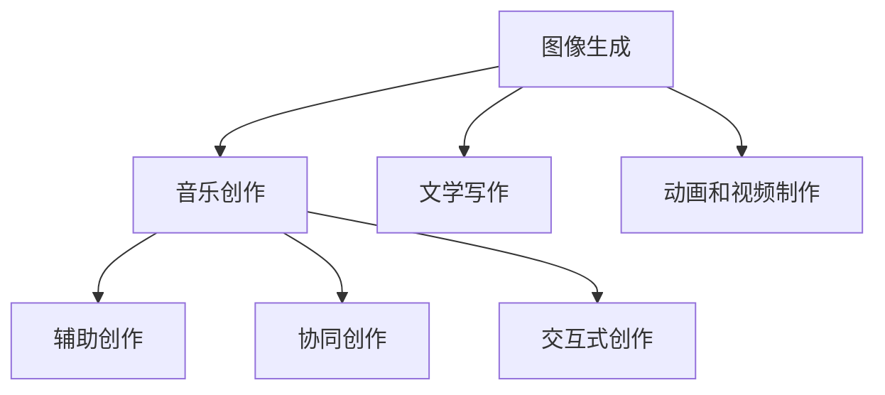
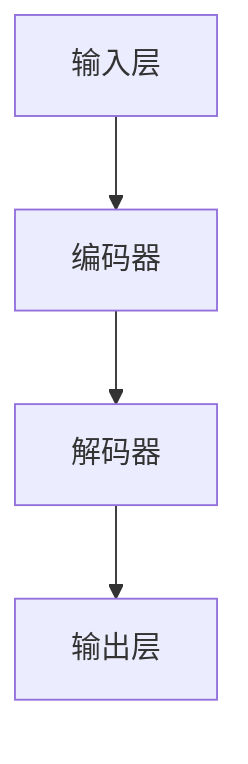
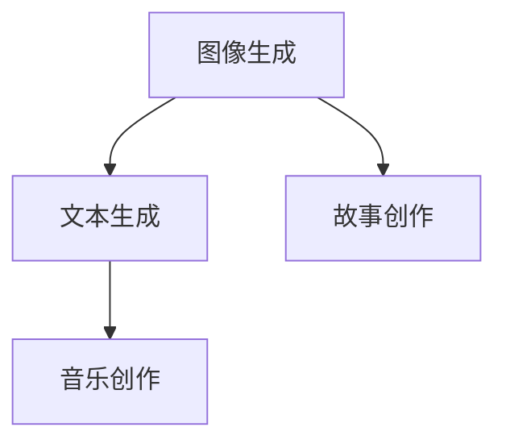
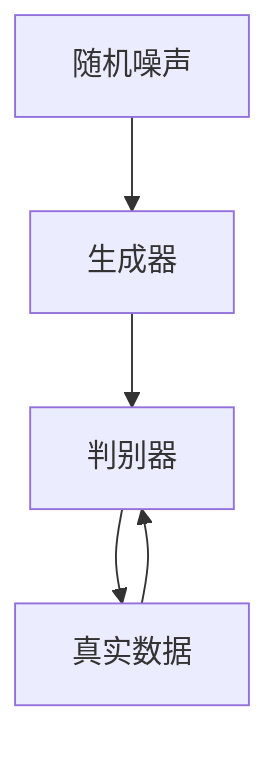
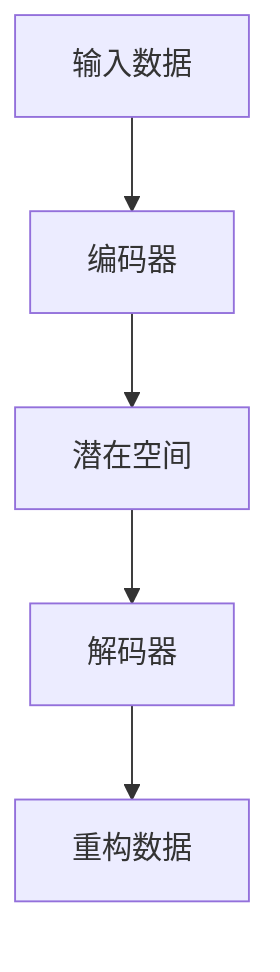
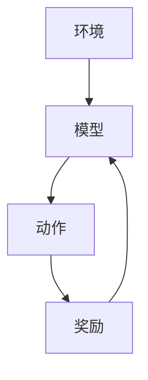
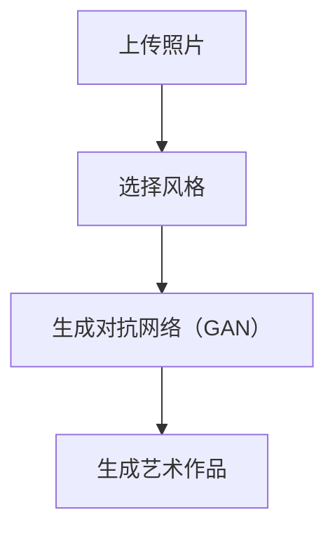
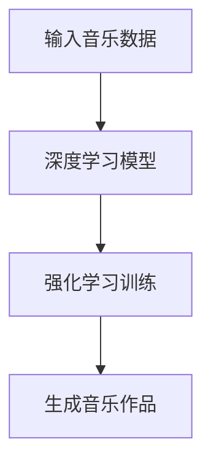
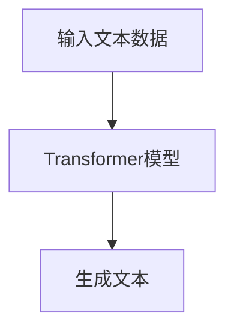

                 

### 第一部分：核心概念与联系

在《LLM与艺术创作：AI与人类艺术家的协作》的第一部分中，我们将探讨人工智能（AI）与艺术创作之间的核心联系。AI在艺术创作中的应用已经越来越广泛，它不仅为艺术家提供了新的创作工具，也带来了新的挑战和机遇。

#### 1.1 AI在艺术创作中的应用领域

AI在艺术创作中的应用可以涵盖多个领域，主要包括：

1. **图像生成**：通过生成对抗网络（GAN）和变分自编码器（VAE）等技术，AI可以生成逼真的图像和艺术作品。例如，GAN可以模仿艺术家的风格，生成具有特定风格的艺术作品。
   
2. **音乐创作**：AI可以通过分析音乐数据，生成新的旋律和音乐片段。例如，一些AI系统可以生成新的古典音乐作品，甚至模仿著名作曲家的风格。

3. **文学写作**：AI可以生成诗歌、故事和小说。例如，OpenAI的GPT-3模型可以生成高质量的文本，甚至撰写新闻报道和小说。

4. **动画和视频制作**：AI可以自动生成动画和视频内容，提高内容创作的效率。

#### 1.2 人工智能（AI）与人类艺术家的合作

AI与人类艺术家的合作方式多种多样，主要包括：

1. **辅助创作**：AI可以作为艺术家的助手，帮助完成一些繁琐的创作任务。例如，AI可以帮助艺术家生成灵感，或者自动化一些绘画和设计工作。

2. **协同创作**：艺术家和AI可以共同创作，发挥各自的优势。例如，艺术家可以提供创意和情感，而AI则可以处理复杂的数据分析和生成任务。

3. **交互式创作**：AI可以与观众互动，提供个性化的艺术体验。例如，AI可以根据观众的行为和反馈，动态调整艺术作品的表现形式。

#### 1.3 AI艺术创作的发展趋势

随着AI技术的不断进步，AI艺术创作的发展趋势包括：

1. **智能化和个性化**：AI将变得更加智能化和个性化，能够更好地理解艺术家的意图和观众的需求。

2. **跨领域融合**：AI艺术创作将与其他领域（如心理学、哲学、社会学等）融合，产生新的艺术形式和创作方式。

3. **普及化**：AI艺术创作工具将变得更加普及，更多的艺术家和观众将能够参与到艺术创作中来。

下面是一个Mermaid流程图，展示了AI在艺术创作中的应用领域：



通过这一部分的讨论，我们为读者搭建了AI与艺术创作的基础框架，接下来我们将深入探讨大型语言模型（LLM）在艺术创作中的工作原理。

---

接下来，我们将进入第二部分，深入探讨大型语言模型（LLM）在艺术创作中的工作原理。这一部分将涵盖LLM的基本概念、架构以及其在自然语言处理中的重要性。同时，我们还将分析LLM在艺术创作中的具体功能，如图像生成、文本生成等，并探讨LLM的艺术创作潜力。

### 第二部分：大型语言模型（LLM）与艺术创作

#### 2.1 LLM的基本概念与架构

大型语言模型（LLM）是一类基于深度学习技术构建的自然语言处理模型，它们通过学习大量文本数据，能够生成高质量的自然语言文本。LLM的基本概念和架构包括以下几个方面：

1. **词嵌入**：词嵌入是将单词映射到高维空间中的向量表示。通过词嵌入，模型可以理解单词之间的语义关系。

2. **注意力机制**：注意力机制是一种在处理序列数据时的重要技术，它能够使模型在生成文本时关注到序列中的关键部分，从而提高生成的质量。

3. **Transformer架构**：Transformer是一种用于处理序列数据的深度学习模型，它通过多头自注意力机制和前馈神经网络，能够有效地捕捉序列中的长距离依赖关系。

LLM的架构通常包括以下几个主要部分：

- **输入层**：负责接收输入的文本数据，并将其转换为词嵌入向量。
- **编码器**：包含多个编码层，每一层都使用自注意力机制来捕捉文本中的关键信息。
- **解码器**：与编码器对应，用于生成输出文本。解码器同样包含多个解码层，每一层使用注意力机制来参考编码器的输出。
- **输出层**：负责将解码器生成的文本向量转换为具体的单词或字符。

下面是一个简化的Mermaid流程图，展示了LLM的基本架构：



#### 2.2 LLM在艺术创作中的功能

LLM在艺术创作中的功能非常广泛，以下是一些具体的应用：

1. **图像生成**：LLM可以通过学习大量的图像和文本数据，生成新的图像。例如，给定一个描述（如“一只蓝色的大鸟站在红色的花朵上”），LLM可以生成符合描述的图像。

2. **文本生成**：LLM可以生成诗歌、故事、新闻文章等文本内容。例如，给定一个主题或关键字，LLM可以撰写相关的文章或故事。

3. **故事创作**：LLM可以创作复杂的情节和角色，生成有趣的故事。例如，通过输入一个简单的情节梗概，LLM可以扩展和丰富故事内容。

4. **音乐创作**：LLM可以通过分析音乐数据和文本描述，生成新的音乐旋律和和弦。例如，给定一个情感描述（如“快乐”），LLM可以创作一首快乐的音乐作品。

下面是一个Mermaid流程图，展示了LLM在艺术创作中的应用：



#### 2.3 LLM的艺术创作潜力

LLM在艺术创作中具有巨大的潜力，以下是一些值得探讨的方面：

1. **个性化创作**：LLM可以根据用户的需求和偏好，生成个性化的艺术作品。例如，根据用户的音乐喜好，LLM可以创作符合用户风格的音乐。

2. **跨界融合**：LLM可以将不同领域的知识融合到艺术创作中。例如，结合视觉艺术和文学创作，生成具有独特风格的艺术作品。

3. **情感表达**：LLM可以理解并表达情感，创作出具有深刻情感内涵的艺术作品。例如，通过分析情感数据，LLM可以创作出表达特定情感的音乐和文学作品。

4. **交互式创作**：LLM可以与用户进行交互，根据用户的反馈动态调整艺术作品。例如，在创作过程中，用户可以随时提出修改建议，LLM可以实时调整内容。

通过第二部分的探讨，我们深入了解了LLM在艺术创作中的基本概念、架构和应用，以及其巨大的艺术创作潜力。接下来，我们将探讨在艺术创作中使用的AI技术，如生成对抗网络（GAN）和变分自编码器（VAE）等。

### 2.4 艺术创作中的AI技术

在艺术创作中，AI技术已经成为不可或缺的一部分。这些技术不仅帮助艺术家提高了创作效率，还为他们提供了前所未有的创作工具和灵感。以下是几种在艺术创作中广泛应用的AI技术：

#### 2.4.1 生成对抗网络（GAN）

生成对抗网络（GAN）是由Ian Goodfellow等人于2014年提出的一种深度学习模型。GAN由两个神经网络组成：生成器（Generator）和判别器（Discriminator）。生成器的任务是从随机噪声中生成逼真的数据，而判别器的任务是区分真实数据和生成数据。

1. **工作原理**：
    - **生成器**：生成器首先从随机噪声中生成数据，然后通过不断优化，使得生成数据越来越接近真实数据。
    - **判别器**：判别器接收真实数据和生成数据，并尝试区分两者。生成器和判别器相互竞争，生成器和判别器的性能都得到了提升。

2. **应用**：
    - **图像生成**：GAN可以生成高质量的艺术图像，如人脸、风景和抽象艺术等。例如，StyleGAN2可以生成具有特定艺术风格的人脸图像。
    - **艺术风格迁移**：GAN可以将一种艺术风格应用到另一幅图像上，例如将梵高的风格应用到一张普通照片上。
    - **视频生成**：GAN可以生成视频内容，如视频游戏中的角色动画和虚拟现实场景等。

3. **挑战**：
    - **模式崩溃**：GAN在训练过程中可能会遇到模式崩溃问题，导致生成器只能生成少数几种特定的模式。
    - **计算资源需求**：GAN需要大量的计算资源进行训练，对于资源受限的环境可能不太适用。

下面是一个简化的GAN架构的Mermaid流程图：



#### 2.4.2 变分自编码器（VAE）

变分自编码器（VAE）是一种无监督学习的生成模型，由Kingma和Welling于2013年提出。VAE通过引入潜在变量，将编码和解码过程分离，从而能够生成多样化的数据。

1. **工作原理**：
    - **编码器**：编码器将输入数据映射到一个潜在空间中的潜在变量，这个映射过程是概率性的。
    - **解码器**：解码器从潜在空间中采样潜在变量，并使用这些变量来重构输入数据。

2. **应用**：
    - **图像生成**：VAE可以生成高质量的图像，如图像超分辨率和图像去噪等。
    - **数据压缩**：VAE可以在保持数据质量的同时进行数据压缩。
    - **生成样本**：VAE可以生成新的样本，如生成新的图像或文本。

3. **挑战**：
    - **生成多样性**：VAE可能在生成多样性方面存在挑战，尤其是在生成复杂和多样的数据时。
    - **训练效率**：VAE的训练过程相对较慢，尤其是在处理大型数据集时。

下面是一个VAE的基本架构的Mermaid流程图：



#### 2.4.3 强化学习

强化学习是一种通过试错和反馈进行学习的机器学习方法。在艺术创作中，强化学习可以用于训练模型，使其能够生成满足特定目标的艺术作品。

1. **工作原理**：
    - **环境**：环境是艺术创作的场景，如绘画、音乐创作等。
    - **动作**：动作是模型在环境中可以采取的行动，如画笔的移动、音符的选择等。
    - **奖励**：奖励是模型在采取特定动作后获得的反馈，用于指导模型的学习。

2. **应用**：
    - **艺术风格迁移**：强化学习可以用于将一种艺术风格应用到另一幅图像上，例如将文艺复兴时期的绘画风格应用到现代照片上。
    - **交互式创作**：强化学习可以与用户交互，根据用户的反馈动态调整艺术作品。
    - **个性化创作**：强化学习可以基于用户的历史偏好，生成个性化的艺术作品。

3. **挑战**：
    - **稳定性**：强化学习模型在训练过程中可能不稳定，容易陷入局部最优。
    - **计算成本**：强化学习需要大量的计算资源，尤其是对于复杂的艺术创作任务。

下面是一个强化学习在艺术创作中的应用的Mermaid流程图：



通过上述对生成对抗网络（GAN）、变分自编码器（VAE）和强化学习等AI技术的探讨，我们可以看到这些技术在艺术创作中具有广泛的应用和潜力。接下来，我们将讨论AI艺术创作中的伦理问题，包括版权、隐私和道德等方面。

### 2.5 AI艺术创作的伦理问题

随着人工智能（AI）在艺术创作中的应用越来越广泛，与之相关的伦理问题也日益凸显。这些伦理问题不仅关系到艺术创作的公平性和合法性，也涉及到社会和文化价值观的挑战。

#### 2.5.1 版权问题

AI艺术创作的一个核心伦理问题就是版权归属。当AI生成艺术作品时，作品的版权应归谁所有？这个问题涉及到法律、技术和道德等多个层面。

1. **版权归属**：一些观点认为，由于AI缺乏法律意义上的“创作主体”资格，AI生成的作品应归属于其开发者或使用者。然而，另一些观点则主张，AI作为创作工具的一部分，应与人类艺术家共同拥有版权。

2. **模仿作品**：AI艺术创作常常涉及到模仿现有作品，这引发了关于版权侵权的担忧。如何界定AI模仿与原创的界限是一个复杂的问题，需要法律和政策的明确指导。

3. **法律和政策挑战**：目前，关于AI艺术创作的版权法律和政策尚不完善，需要制定相应的法律框架来保护创作者的权益，同时鼓励创新。

#### 2.5.2 隐私问题

AI在艺术创作过程中通常需要大量的数据，包括个人创作记录、偏好和隐私信息。这引发了关于隐私保护的伦理问题：

1. **数据隐私**：如何保护艺术家和观众的个人数据不被滥用是一个重要问题。在收集和使用个人数据时，需要遵循严格的隐私保护原则，确保数据不被泄露或用于未经授权的目的。

2. **透明度**：AI艺术创作中使用的数据来源往往不透明，这可能导致隐私泄露的风险。提高数据来源的透明度，确保用户的隐私不受侵犯，是一个亟待解决的问题。

3. **用户同意**：在艺术创作中使用个人数据时，需要确保用户已经明确同意其数据被用于创作。这要求我们在数据收集和使用过程中遵循严格的用户同意原则。

#### 2.5.3 道德问题

AI艺术创作还引发了关于道德的讨论，这些问题涉及到艺术创作的本质和价值观：

1. **情感表达**：AI能否真正理解和表达情感是一个道德问题。艺术作品通常承载着情感和思想，如果AI无法理解这些情感，那么它生成的作品是否会失去艺术价值？

2. **偏见和歧视**：AI艺术创作可能受到算法偏见的影响，导致歧视和不公正。例如，AI生成的艺术作品可能会无意中反映性别、种族或文化偏见。如何消除这些偏见，确保AI在艺术创作中的公平性，是一个重要的道德挑战。

3. **艺术价值的判断**：AI能否像人类艺术家一样判断艺术价值也是一个道德问题。如果AI生成的艺术作品不能得到艺术界的认可，那么它们是否仍然具有艺术价值？

#### 解决方案与未来展望

为了解决AI艺术创作中的伦理问题，我们需要采取多方面的措施：

1. **法律和政策的制定**：需要制定和完善相关法律法规，明确AI艺术创作的版权归属、隐私保护和道德准则。

2. **道德准则的制定**：建立AI艺术创作领域的道德准则，确保AI在艺术创作中的行为符合伦理标准。

3. **透明度和公众参与**：提高AI艺术创作的透明度，鼓励公众参与讨论和监督，确保AI艺术创作的发展符合社会需求。

4. **技术改进**：通过技术手段，如算法透明化、偏见检测和消除，来提高AI在艺术创作中的公平性和公正性。

总之，AI艺术创作中的伦理问题是一个复杂且多维的问题，需要从多个角度进行思考和解决。只有通过多方面的努力，我们才能确保AI在艺术创作中的合法性和可持续性。

### 2.6 案例研究：AI与艺术创作的成功实例

为了更好地理解AI在艺术创作中的应用，我们来看一些成功的实例。这些实例展示了AI如何在不同艺术领域发挥作用，为人类艺术家提供了新的创作工具和灵感。

#### 2.6.1 AI绘画实例

一个著名的AI绘画案例是由DeepArt.io开发的，它使用生成对抗网络（GAN）将一幅普通照片转换为具有特定艺术风格的画作。例如，用户可以上传一张自拍照，然后选择一个艺术家的风格（如梵高、毕加索等），系统就会生成一幅类似该艺术家风格的自画像。

1. **技术实现**：
   - **生成对抗网络（GAN）**：系统使用GAN将输入图像转换为特定艺术风格。生成器学习艺术家的绘画风格，而判别器则用于区分原始图像和生成图像。

2. **实际应用**：
   - **艺术风格迁移**：用户可以通过DeepArt.io将普通照片转换为具有不同艺术风格的作品，这为艺术家和爱好者提供了新的创作方式。

3. **效果展示**：
   - DeepArt.io生成的艺术作品通常能够很好地模仿艺术家风格，如梵高的浓重色彩和毕加索的立体主义。

下面是一个使用DeepArt.io进行艺术风格迁移的简单流程图：



#### 2.6.2 AI音乐实例

Google的Magenta项目展示了AI在音乐创作中的潜力。Magenta使用深度学习和强化学习技术来生成音乐，例如，它可以生成新的旋律和和声，甚至创作完整的音乐作品。

1. **技术实现**：
   - **深度学习**：Magenta使用深度神经网络来生成音乐。例如，WaveNet模型可以生成新的音符序列。
   - **强化学习**：Magenta还使用强化学习来训练模型，使其能够根据奖励信号创作出具有吸引力的音乐。

2. **实际应用**：
   - **音乐创作**：Magenta可以帮助音乐家创作新的旋律和和声，甚至自动生成完整的音乐作品。
   - **音乐推荐**：Magenta还可以用于改进音乐推荐系统，提高个性化推荐的质量。

3. **效果展示**：
   - Magenta生成的音乐作品在旋律、节奏和和声方面都表现出很高的质量，有时甚至难以区分出是AI创作还是人类艺术家创作的。

下面是一个使用Magenta进行音乐创作的简单流程图：



#### 2.6.3 AI文学实例

OpenAI的GPT-3模型展示了AI在文学创作中的潜力。GPT-3是一个强大的自然语言处理模型，它可以生成高质量的文本，包括诗歌、故事和新闻文章。

1. **技术实现**：
   - **Transformer架构**：GPT-3基于Transformer架构，这是一个能够处理长序列数据的强大模型。
   - **大规模预训练**：GPT-3在训练过程中学习了大量的文本数据，从而能够生成连贯、有逻辑的文本。

2. **实际应用**：
   - **故事创作**：GPT-3可以生成有趣的故事和情节，为小说家和编剧提供灵感。
   - **文本生成**：GPT-3可以用于自动生成新闻文章、报告和文档。

3. **效果展示**：
   - GPT-3生成的文本在语法和语义方面都表现出很高的质量，有时甚至难以区分出是人类创作的还是AI创作的。

下面是一个使用GPT-3进行文学创作的简单流程图：



通过这些实例，我们可以看到AI在艺术创作中的广泛应用和巨大潜力。AI不仅为艺术家提供了新的创作工具，还为他们带来了前所未有的创作自由和灵感。然而，AI在艺术创作中的应用也带来了一系列挑战和伦理问题，这需要我们在未来的发展中给予更多的关注和探讨。

### 2.7 AI艺术创作的挑战与机遇

随着AI技术在艺术创作中的应用日益深入，它既带来了前所未有的机遇，也引发了诸多挑战。在探讨这些挑战与机遇时，我们需从技术、伦理和社会等多个角度进行分析。

#### 2.7.1 技术挑战

1. **算法的复杂性和计算资源需求**：
   AI艺术创作依赖于复杂的深度学习算法，如GAN、VAE和Transformer等。这些算法需要大量的计算资源和数据训练，尤其是在生成高质量艺术作品时。对于资源有限的个人或小团队来说，这可能是一个重大的挑战。

2. **多样性和泛化能力**：
   AI艺术创作系统往往在特定任务上表现出色，但在处理多样化和复杂的艺术风格时可能会遇到困难。例如，GAN可能会在生成特定风格的艺术作品时表现出色，但在生成其他风格的作品时可能会出现模式崩溃或缺乏多样性。

3. **实时性和交互性**：
   对于某些实时交互的艺术创作应用，如现场音乐表演或动态绘画，AI系统的实时响应和交互性是一个重要的挑战。如何确保AI系统能够快速、准确地处理用户的输入并生成相应的艺术作品，需要进一步的技术优化。

#### 2.7.2 伦理挑战

1. **版权和知识产权**：
   AI艺术创作的版权问题是一个复杂的伦理挑战。当AI生成艺术作品时，其版权应归属于开发者、用户还是AI本身？此外，AI模仿现有艺术作品可能会引发版权侵权的问题，这需要法律和伦理框架的明确界定。

2. **隐私和数据安全**：
   AI艺术创作需要大量的数据，包括艺术家和观众的创作记录、偏好和隐私信息。如何在确保数据安全的同时，保护艺术家和观众的隐私，是另一个重要的伦理问题。

3. **艺术价值和质量评估**：
   AI艺术创作能否生成具有艺术价值和质量的作品，是另一个伦理挑战。人类艺术家通常通过直觉、情感和经验来判断艺术价值，而AI系统则依赖于数据和算法。如何确保AI生成的艺术作品符合人类艺术的伦理标准，是一个亟待解决的问题。

#### 2.7.3 机遇

1. **创作工具的创新**：
   AI为艺术家提供了全新的创作工具和灵感。通过AI，艺术家可以更快速地生成大量创意作品，探索新的艺术风格和表现形式。此外，AI可以帮助艺术家从繁琐的重复性任务中解放出来，专注于更有创造性的工作。

2. **艺术普及和教育**：
   AI艺术创作技术使得艺术创作变得更加普及，不仅专业艺术家，业余爱好者也可以通过AI工具进行创作。同时，AI艺术创作技术还可以用于艺术教育，帮助学生和初学者更快速地掌握艺术创作的技巧。

3. **跨界合作与融合**：
   AI艺术创作促进了不同领域之间的融合，如艺术与科技、艺术与心理学等。这种跨界合作不仅拓宽了艺术创作的边界，也为艺术家提供了新的创作视角和表达方式。

#### 2.7.4 应对策略

1. **技术创新**：
   针对技术挑战，可以通过优化算法、提高计算效率和引入更多样化的训练数据来提升AI艺术创作的性能。

2. **法律和伦理框架**：
   针对伦理挑战，需要制定明确的法律和伦理框架来保护创作者的权益，确保AI艺术创作的合法性和可持续性。

3. **公众参与与监督**：
   鼓励公众参与AI艺术创作的讨论和监督，通过多方面的反馈来提升AI艺术创作的质量和道德标准。

总之，AI艺术创作既带来了诸多挑战，也提供了巨大的机遇。通过技术创新、法律和伦理框架的建立以及公众的积极参与，我们可以更好地应对这些挑战，充分发挥AI在艺术创作中的潜力。

### 2.8 小结

在本部分中，我们探讨了人工智能（AI）与艺术创作之间的核心联系，包括AI在艺术创作中的应用领域、AI与人类艺术家的合作方式、AI艺术创作的发展趋势，以及大型语言模型（LLM）在艺术创作中的原理和应用。我们还详细介绍了在艺术创作中使用的几种关键AI技术，如生成对抗网络（GAN）、变分自编码器（VAE）和强化学习，并探讨了这些技术在艺术创作中的挑战和机遇。

通过本部分的讨论，我们不仅了解了AI艺术创作的基本概念和原理，还看到了其在实际应用中的成功案例。这些内容为读者提供了一个全面而深入的视角，帮助读者理解AI与艺术创作之间的紧密联系，以及AI在艺术创作中的巨大潜力。

### 第二部分总结：核心概念与联系

在《LLM与艺术创作：AI与人类艺术家的协作》的第二部分中，我们深入探讨了人工智能（AI）与艺术创作之间的核心联系。通过详细讲解大型语言模型（LLM）的基本概念、架构以及其在自然语言处理中的重要性，我们为读者提供了一个理论基础，理解AI在艺术创作中的功能和应用。

我们首先介绍了LLM的基本概念和架构，包括词嵌入、注意力机制和Transformer架构等核心组成部分。这些组件使得LLM能够处理复杂的自然语言任务，从而在艺术创作中发挥重要作用。

接下来，我们详细分析了LLM在艺术创作中的具体功能，如图像生成、文本生成、故事创作和音乐创作等。我们展示了如何使用LLM生成具有艺术价值的图像和文本，以及如何通过LLM实现个性化创作和跨界融合。

此外，我们还介绍了在艺术创作中广泛应用的几种AI技术，如生成对抗网络（GAN）、变分自编码器（VAE）和强化学习。这些技术不仅在图像、音乐和文学创作中发挥了关键作用，还为艺术家提供了新的创作工具和灵感。

通过本部分的讨论，我们不仅了解了AI艺术创作的基本原理和核心算法，还看到了其在实际应用中的成功案例。这些内容为读者提供了一个全面而深入的视角，帮助读者理解AI与艺术创作之间的紧密联系，以及AI在艺术创作中的巨大潜力。

### 第二部分：核心算法原理讲解

在第二部分中，我们将深入探讨与艺术创作密切相关的核心算法原理，这些算法不仅是AI实现艺术创作的基石，也是理解AI如何与人类艺术家协作的关键。

#### 2.1 自然语言处理（NLP）算法

自然语言处理（NLP）算法是AI艺术创作的基础，以下是我们将详细讨论的几个NLP算法：

**2.1.1 词嵌入技术**

词嵌入是将单词映射到高维空间中的向量表示。通过词嵌入，模型能够理解单词之间的语义关系，这对于生成连贯的艺术作品至关重要。以下是一些常用的词嵌入技术：

- **Word2Vec**：Word2Vec是一种基于神经网络的词嵌入方法，它通过训练模型，将单词映射到高维空间中的向量。Word2Vec有两种主要训练方法：连续词袋（CBOW）和Skip-Gram。

  $$ \text{CBOW: } \text{Input} = \{w_{-2}, w_{-1}, w_0, w_1, w_2\} \rightarrow \text{Output} = w_0 $$
  
  $$ \text{Skip-Gram: } \text{Input} = w_0 \rightarrow \text{Output} = \{w_{-2}, w_{-1}, w_1, w_2\} $$

- **GloVe**：GloVe（Global Vectors for Word Representation）是一种基于全局矩阵分解的词嵌入方法，它通过优化全局矩阵来生成词嵌入向量。GloVe考虑了单词的共现关系，能够生成高质量的词嵌入向量。

  $$ \text{Loss Function: } \frac{1}{N} \sum_{\text{word}} \frac{1}{f(w_i)} \sum_{\text{context}} \text{cosine\_distance}(v_w, v_{c})^2 $$

**2.1.2 序列模型与注意力机制**

序列模型如循环神经网络（RNN）和长短期记忆网络（LSTM）在处理序列数据时非常有用。RNN和LSTM能够捕捉序列中的长期依赖关系，这对于生成连贯的艺术作品至关重要。

- **RNN**：RNN通过保存先前的状态来处理序列数据。然而，RNN在处理长序列数据时可能会出现梯度消失或爆炸问题。

  $$ h_t = \sigma(W_h \cdot [h_{t-1}, x_t] + b_h) $$

- **LSTM**：LSTM是一种改进的RNN结构，它通过引入记忆单元和门控机制来解决梯度消失问题。LSTM能够更好地捕捉序列中的长期依赖关系。

  $$ i_t = \sigma(W_i \cdot [h_{t-1}, x_t] + b_i) $$
  $$ f_t = \sigma(W_f \cdot [h_{t-1}, x_t] + b_f) $$
  $$ \tilde{C}_t = \sigma(W_C \cdot [h_{t-1}, x_t] + b_C) $$
  $$ C_t = f_t \odot C_{t-1} + i_t \odot \tilde{C}_t $$
  $$ o_t = \sigma(W_o \cdot [h_{t-1}, x_t, C_t] + b_o) $$
  $$ h_t = o_t \odot C_t $$

注意力机制是一种用于提高序列模型性能的技术，它使模型在生成文本时能够关注到序列中的关键部分。

- **注意力机制**：注意力机制通过计算一个权重向量来强调序列中的关键部分。

  $$ e_t = \text{Attention}(h_1, h_2, ..., h_T) = \text{softmax}(\text{Score}(h_t, h_1, h_2, ..., h_T)) $$
  $$ \text{Score}(h_t, h_1, h_2, ..., h_T) = \text{dot}(h_t, h_1), \text{dot}(h_t, h_2), ..., \text{dot}(h_t, h_T) $$
  $$ \text{context\_vector} = \sum_{t=1}^{T} e_t \cdot h_t $$

**2.1.3 生成式对话系统**

生成式对话系统能够根据先前的对话生成自然语言响应。这类系统在艺术创作中非常有用，如生成诗歌、故事和对话。

- **Transformer架构**：Transformer是一种基于注意力机制的序列到序列模型，它通过多头自注意力机制和前馈神经网络，能够有效地捕捉序列中的长距离依赖关系。

  $$ \text{MultiHeadAttention}(Q, K, V) = \text{softmax}(\text{Score}(Q, K), V) $$

  $$ \text{Score}(Q_i, K_j) = \text{dot}(Q_i, K_j) \cdot \text{scale\_factor} $$
  
  $$ \text{scale\_factor} = \sqrt{\text{d_k}} $$

- **文本生成**：生成式对话系统通过解码器生成文本。解码器包含多个解码层，每一层都使用注意力机制来参考编码器的输出。

  $$ y_t = \text{softmax}(\text{Decoder}(y_{<t}, h_1, h_2, ..., h_T)) $$
  
  $$ \text{Decoder}(y_{<t}, h_1, h_2, ..., h_T) = \text{Linear}(V \cdot \text{Attention}(Q, K, V) + U \cdot h_T) $$

通过第二部分的深入探讨，我们将帮助读者理解自然语言处理（NLP）算法在艺术创作中的应用，以及如何利用这些算法生成高质量的艺术作品。接下来，我们将继续讨论图像生成算法，包括生成对抗网络（GAN）、变分自编码器（VAE）和条件生成对抗网络（cGAN）。

### 2.2 图像生成算法

图像生成是AI在艺术创作中的一个重要应用领域，以下是我们将详细讨论的几种图像生成算法：

#### 2.2.1 生成对抗网络（GAN）

生成对抗网络（GAN）由Ian Goodfellow等人在2014年提出，是一种通过对抗训练生成高质量图像的深度学习模型。GAN由两个神经网络组成：生成器和判别器。

1. **生成器**：
   - **目标**：生成器从随机噪声中生成逼真的图像。
   - **架构**：生成器通常由多个卷积层和转置卷积层组成，用于从噪声向量生成图像。

     $$ G(z) = \text{ConvTranspLayer}(\text{ConvTranspLayer}(...\text{ConvTranspLayer}(...z...)) $$

2. **判别器**：
   - **目标**：判别器区分真实图像和生成图像。
   - **架构**：判别器通常由多个卷积层组成，用于提取图像的特征。

     $$ D(x) = \text{ConvLayer}(\text{ConvLayer}(...\text{ConvLayer}(...x...)) $$

3. **对抗训练**：
   - **过程**：生成器和判别器通过对抗训练相互竞争。
   - **目标函数**：生成器的损失函数是最大化生成图像的判别概率，而判别器的损失函数是最小化判别概率。

     $$ \text{Generator Loss} = -\log(D(G(z))) $$
     $$ \text{Discriminator Loss} = -\log(D(x)) - \log(1 - D(G(z))) $$

4. **伪代码**：

```python
# 生成器模型
def build_generator():
    model = Sequential()
    model.add(Dense(units=256, activation='relu', input_dim=100))
    model.add(LeakyReLU(alpha=0.01))
    model.add(Dense(units=512, activation='relu'))
    model.add(LeakyReLU(alpha=0.01))
    model.add(Dense(units=1024, activation='relu'))
    model.add(LeakyReLU(alpha=0.01))
    model.add(Dense(units=784, activation='tanh'))
    return model

# 判别器模型
def build_discriminator():
    model = Sequential()
    model.add(Flatten(input_shape=(28, 28)))
    model.add(Dense(units=1024, activation='relu'))
    model.add(LeakyReLU(alpha=0.01))
    model.add(Dense(units=512, activation='relu'))
    model.add(LeakyReLU(alpha=0.01))
    model.add(Dense(units=256, activation='relu'))
    model.add(LeakyReLU(alpha=0.01))
    model.add(Dense(units=1, activation='sigmoid'))
    return model

# GAN模型
def build_gan(generator, discriminator):
    model = Sequential()
    model.add(generator)
    model.add(discriminator)
    return model

# 编译模型
discriminator.compile(optimizer='adam', loss='binary_crossentropy')
gan.compile(optimizer='adam', loss='binary_crossentropy')
```

#### 2.2.2 变分自编码器（VAE）

变分自编码器（VAE）是由Kingma和Welling在2013年提出的，是一种无监督学习的生成模型。VAE通过引入潜在变量，将编码和解码过程分离。

1. **编码器**：
   - **目标**：编码器将输入数据映射到一个潜在空间中的潜在变量。
   - **架构**：编码器由多个卷积层和全连接层组成。

     $$ q_\phi(z|x) = \mathcal{N}(z|\mu(x), \sigma(x)) $$
     $$ \mu(x) = \sigma(x) = \text{sigmoid}(\text{Flatten}(x)) $$

2. **解码器**：
   - **目标**：解码器从潜在变量中重构输入数据。
   - **架构**：解码器与编码器对称，由多个转置卷积层和全连接层组成。

     $$ p_\theta(x|z) = \mathcal{N}(x|\mu(z), \sigma(z)) $$
     $$ \mu(z) = \text{Relu}(\text{Dense}(z, units=784)) $$
     $$ \sigma(z) = \text{Sigmoid}(\text{Dense}(z, units=784)) $$

3. **ELBO损失函数**：
   - **目标**：VAE的目标是最小化证据下边界（ELBO）。

     $$ \text{ELBO} = \mathbb{E}_{z\sim q_\phi(z|x)}[\log p_\theta(x|z)] - D(q_\phi(z|x); p(z)) $$

4. **伪代码**：

```python
# 编码器模型
def build_encoder():
    model = Sequential()
    model.add(Flatten(input_shape=(28, 28)))
    model.add(Dense(units=512, activation='relu'))
    model.add(Dense(units=256, activation='relu'))
    model.add(Dense(units=128, activation='relu'))
    model.add(Dense(units=64, activation='relu'))
    model.add(Dense(units=2, activation='linear'))
    return model

# 解码器模型
def build_decoder():
    model = Sequential()
    model.add(Dense(units=128, activation='relu', input_shape=(2,)))
    model.add(Dense(units=256, activation='relu'))
    model.add(Dense(units=512, activation='relu'))
    model.add(Dense(units=784, activation='sigmoid'))
    return model

# VAE模型
def build_vae(encoder, decoder):
    model = Sequential()
    model.add(encoder)
    model.add(decoder)
    return model
```

#### 2.2.3 条件生成对抗网络（cGAN）

条件生成对抗网络（cGAN）是GAN的扩展，它引入了条件信息（如文本描述、标签等）来指导生成过程。

1. **生成器**：
   - **目标**：生成器根据条件信息生成图像。
   - **架构**：生成器由条件输入和生成网络组成。

     $$ G(c, z) = \text{ConvTranspLayer}(\text{Concat}(c, G(z))) $$

2. **判别器**：
   - **目标**：判别器区分条件图像和真实图像。
   - **架构**：判别器由条件输入和判别网络组成。

     $$ D(x, c) = \text{ConvLayer}(\text{Concat}(x, c)) $$

3. **对抗训练**：
   - **过程**：生成器和判别器通过对抗训练相互竞争。

     $$ \text{Generator Loss} = -\log(D(G(c, z))) $$
     $$ \text{Discriminator Loss} = -\log(D(x, c)) - \log(1 - D(G(c, z))) $$

4. **伪代码**：

```python
# 条件生成器模型
def build_condition_generator():
    model = Sequential()
    model.add(Dense(units=256, activation='relu', input_shape=(100,)))
    model.add(Dense(units=512, activation='relu'))
    model.add(Dense(units=1024, activation='relu'))
    model.add(Dense(units=784, activation='tanh'))
    return model

# 条件判别器模型
def build_condition_discriminator():
    model = Sequential()
    model.add(Flatten(input_shape=(28, 28)))
    model.add(Dense(units=1024, activation='relu'))
    model.add(Dense(units=512, activation='relu'))
    model.add(Dense(units=256, activation='relu'))
    model.add(Dense(units=1, activation='sigmoid'))
    return model

# 条件GAN模型
def build_condition_gan(generator, discriminator):
    model = Sequential()
    model.add(generator)
    model.add(discriminator)
    return model
```

通过第二部分的深入探讨，我们将帮助读者理解图像生成算法在艺术创作中的应用，以及如何利用这些算法生成高质量的艺术作品。接下来，我们将继续讨论音乐生成算法，包括演变式音乐生成、音乐生成模型和强化学习音乐生成。

### 2.3 音乐生成算法

音乐生成是AI在艺术创作中的一个重要领域，以下是我们将详细讨论的几种音乐生成算法：

#### 2.3.1 演变式音乐生成

演变式音乐生成是一种通过分析音乐数据并生成新的旋律和和声的方法。这种方法通常基于递归神经网络（RNN）或其变体，如长短期记忆网络（LSTM）。

1. **基本原理**：
   - **RNN**：递归神经网络通过保存先前的状态来处理序列数据。在音乐生成中，RNN可以分析音乐数据，并生成新的旋律。
   - **LSTM**：长短期记忆网络是一种改进的RNN，它通过引入记忆单元和门控机制来解决梯度消失问题。LSTM能够更好地捕捉音乐序列中的长期依赖关系。

2. **实现细节**：
   - **输入**：音乐生成模型的输入通常是音乐序列，如音符、音高、强度和时长等。
   - **输出**：模型的输出是新的音乐序列，这些序列可以表示为旋律、和弦或完整的音乐作品。

3. **伪代码**：

```python
# LSTM音乐生成模型
def build_music_generator():
    model = Sequential()
    model.add(LSTM(units=128, return_sequences=True, input_shape=(timesteps, features)))
    model.add(Dropout(0.5))
    model.add(LSTM(units=128, return_sequences=True))
    model.add(Dropout(0.5))
    model.add(LSTM(units=128, return_sequences=True))
    model.add(Dropout(0.5))
    model.add(Dense(units=features, activation='softmax'))
    model.compile(optimizer='adam', loss='categorical_crossentropy')
    return model
```

#### 2.3.2 音乐生成模型

音乐生成模型是基于生成式模型（如变分自编码器（VAE）和生成对抗网络（GAN））的音乐生成方法。

1. **VAE音乐生成模型**：
   - **编码器**：编码器将输入音乐数据映射到一个潜在空间中的潜在变量。
   - **解码器**：解码器从潜在变量中重构输入音乐数据。

   $$ q_\phi(z|x) = \mathcal{N}(z|\mu(x), \sigma(x)) $$
   $$ p_\theta(x|z) = \mathcal{N}(x|\mu(z), \sigma(z)) $$

2. **GAN音乐生成模型**：
   - **生成器**：生成器从随机噪声中生成音乐数据。
   - **判别器**：判别器区分真实音乐数据和生成音乐数据。

   $$ \text{Generator Loss} = -\log(D(G(z))) $$
   $$ \text{Discriminator Loss} = -\log(D(x)) - \log(1 - D(G(z))) $$

3. **伪代码**：

```python
# VAE音乐生成模型
def build_vae_encoder():
    model = Sequential()
    model.add(Flatten(input_shape=(timesteps, features)))
    model.add(Dense(units=512, activation='relu'))
    model.add(Dense(units=256, activation='relu'))
    model.add(Dense(units=128, activation='relu'))
    model.add(Dense(units=64, activation='relu'))
    model.add(Dense(units=2, activation='linear'))
    return model

def build_vae_decoder():
    model = Sequential()
    model.add(Dense(units=128, activation='relu', input_shape=(2,)))
    model.add(Dense(units=256, activation='relu'))
    model.add(Dense(units=512, activation='relu'))
    model.add(Dense(units=784, activation='sigmoid'))
    return model

def build_vae_generator(encoder, decoder):
    model = Sequential()
    model.add(encoder)
    model.add(decoder)
    return model
```

```python
# GAN音乐生成模型
def build_music_generator():
    model = Sequential()
    model.add(Dense(units=256, activation='relu', input_shape=(100,)))
    model.add(Dense(units=512, activation='relu'))
    model.add(Dense(units=1024, activation='relu'))
    model.add(Dense(units=784, activation='tanh'))
    return model

def build_music_discriminator():
    model = Sequential()
    model.add(Flatten(input_shape=(28, 28)))
    model.add(Dense(units=1024, activation='relu'))
    model.add(Dense(units=512, activation='relu'))
    model.add(Dense(units=256, activation='relu'))
    model.add(Dense(units=1, activation='sigmoid'))
    return model

def build_music_gan(generator, discriminator):
    model = Sequential()
    model.add(generator)
    model.add(discriminator)
    return model
```

#### 2.3.3 强化学习音乐生成

强化学习是一种通过试错和反馈进行学习的机器学习方法。在音乐生成中，强化学习可以用于训练模型，使其能够根据目标生成新的音乐。

1. **基本原理**：
   - **环境**：环境是音乐生成的场景，如作曲或即兴演奏。
   - **动作**：动作是模型在环境中可以采取的行动，如音符的选择和时长。
   - **奖励**：奖励是模型在采取特定动作后获得的反馈，用于指导模型的学习。

2. **实现细节**：
   - **奖励函数**：奖励函数用于评估音乐生成的好坏，如音乐的美学价值、节奏感等。
   - **策略网络**：策略网络用于生成动作，使其最大化长期奖励。

3. **伪代码**：

```python
# 强化学习音乐生成模型
def build_reinforcement_learning_model():
    model = Sequential()
    model.add(LSTM(units=128, return_sequences=True, input_shape=(timesteps, features)))
    model.add(Dropout(0.5))
    model.add(LSTM(units=128, return_sequences=True))
    model.add(Dropout(0.5))
    model.add(LSTM(units=128, return_sequences=True))
    model.add(Dropout(0.5))
    model.add(Dense(units=features, activation='softmax'))
    model.compile(optimizer='adam', loss='categorical_crossentropy')
    return model
```

通过第二部分的深入探讨，我们将帮助读者理解音乐生成算法在艺术创作中的应用，以及如何利用这些算法生成高质量的音乐作品。接下来，我们将继续讨论文学生成算法，包括基于梯度的写作辅助系统、强化学习文本生成和主题模型。

### 2.4 文学生成算法

文学生成是AI在艺术创作中的一个重要领域，以下是我们将详细讨论的几种文学生成算法：

#### 2.4.1 基于梯度的写作辅助系统

基于梯度的写作辅助系统利用深度学习模型和反向传播算法，通过学习大量的文本数据，生成连贯、有逻辑的文本。以下是一个简化的实现流程：

1. **数据预处理**：
   - **文本清洗**：去除标点符号、停用词等无关信息。
   - **词嵌入**：将文本中的单词映射到高维空间中的向量表示。

2. **模型架构**：
   - **编码器**：编码器负责将输入文本编码为序列向量。
   - **解码器**：解码器根据编码器输出的序列向量，生成新的文本序列。

3. **实现细节**：
   - **编码器**：通常使用LSTM或GRU等循环神经网络作为编码器。
   - **解码器**：解码器使用与编码器相同的神经网络结构，并在输出层添加softmax激活函数。

4. **伪代码**：

```python
# 基于梯度的写作辅助系统
def build_writer():
    model = Sequential()
    model.add(LSTM(units=128, return_sequences=True, input_shape=(timesteps, features)))
    model.add(Dropout(0.5))
    model.add(LSTM(units=128, return_sequences=True))
    model.add(Dropout(0.5))
    model.add(LSTM(units=128, return_sequences=True))
    model.add(Dropout(0.5))
    model.add(Dense(units=features, activation='softmax'))
    model.compile(optimizer='adam', loss='categorical_crossentropy')
    return model
```

#### 2.4.2 强化学习文本生成

强化学习文本生成通过训练模型，使其能够根据目标生成具有吸引力的文本。以下是一个简化的实现流程：

1. **数据预处理**：
   - **文本清洗**：去除标点符号、停用词等无关信息。
   - **词嵌入**：将文本中的单词映射到高维空间中的向量表示。

2. **模型架构**：
   - **策略网络**：策略网络用于生成文本序列，并计算奖励信号。
   - **价值网络**：价值网络用于评估文本序列的质量。

3. **实现细节**：
   - **策略网络**：通常使用LSTM或GRU等循环神经网络作为策略网络。
   - **价值网络**：价值网络通常使用前馈神经网络结构。

4. **伪代码**：

```python
# 强化学习文本生成模型
def build_reinforcement_learning_model():
    model = Sequential()
    model.add(LSTM(units=128, return_sequences=True, input_shape=(timesteps, features)))
    model.add(Dropout(0.5))
    model.add(LSTM(units=128, return_sequences=True))
    model.add(Dropout(0.5))
    model.add(LSTM(units=128, return_sequences=True))
    model.add(Dropout(0.5))
    model.add(Dense(units=features, activation='softmax'))
    model.compile(optimizer='adam', loss='categorical_crossentropy')
    return model
```

#### 2.4.3 主题模型

主题模型是一种无监督学习方法，用于识别文本数据中的潜在主题。以下是一个简化的实现流程：

1. **数据预处理**：
   - **文本清洗**：去除标点符号、停用词等无关信息。
   - **词嵌入**：将文本中的单词映射到高维空间中的向量表示。

2. **模型架构**：
   - **主题分配**：每个单词被分配给多个主题，每个主题具有特定的词向量表示。
   - **文本生成**：文本生成基于主题的概率分布，通过采样生成新的文本序列。

3. **实现细节**：
   - **主题分配**：通常使用概率潜在狄利克雷分布（PLDA）或高斯混合模型（GMM）作为主题分配模型。
   - **文本生成**：文本生成通常使用马尔可夫链或变分自编码器（VAE）。

4. **伪代码**：

```python
# 主题模型
def build_topic_model():
    model = Sequential()
    model.add(Dense(units=2, activation='softmax', input_shape=(100,)))
    model.add(Dropout(0.5))
    model.add(Dense(units=100, activation='softmax'))
    model.compile(optimizer='adam', loss='categorical_crossentropy')
    return model
```

通过第二部分的深入探讨，我们将帮助读者理解文学生成算法在艺术创作中的应用，以及如何利用这些算法生成高质量的文学作品。接下来，我们将继续讨论如何将这些算法结合起来，实现AI与艺术家的综合协作。

### 2.5 综合应用：AI与艺术家的协作

在第二部分的最后，我们将探讨如何将不同的AI算法结合在一起，实现AI与艺术家的综合协作。这种综合应用不仅能够提升艺术创作的效率和质量，还能为艺术家提供新的创作工具和灵感。

#### 2.5.1 多模态艺术创作

多模态艺术创作是指将不同类型的数据（如文本、图像和音频）融合到艺术作品中。以下是一种实现多模态艺术创作的方法：

1. **数据预处理**：
   - **文本**：对文本进行词嵌入，将其转换为向量表示。
   - **图像**：使用卷积神经网络（CNN）提取图像的特征向量。
   - **音频**：使用循环神经网络（RNN）或长短期记忆网络（LSTM）提取音频的特征向量。

2. **模型架构**：
   - **编码器**：将文本、图像和音频的特征向量编码为统一的特征表示。
   - **生成器**：基于编码器的特征表示，生成新的艺术作品。

3. **实现细节**：
   - **编码器**：可以使用多输入的多层感知器（MLP）或卷积神经网络（CNN）。
   - **生成器**：可以使用生成对抗网络（GAN）或变分自编码器（VAE）。

4. **伪代码**：

```python
# 多模态艺术创作
def build_multimodal_generator():
    model = Sequential()
    model.add(MergeLayer(input_shapes=[(100,), (64, 64, 3), (22, 22, 1)]))
    model.add(Conv2DTranspose(filters=32, kernel_size=(4, 4), strides=(2, 2), padding='same'))
    model.add(Conv2DTranspose(filters=1, kernel_size=(4, 4), strides=(2, 2), padding='same', activation='sigmoid'))
    model.compile(optimizer='adam', loss='binary_crossentropy')
    return model
```

#### 2.5.2 跨领域协作

跨领域协作是指将不同领域的知识和技能结合到艺术创作中。以下是一种实现跨领域协作的方法：

1. **数据预处理**：
   - **艺术作品**：对艺术作品进行图像处理，提取视觉特征。
   - **文本**：对文本进行情感分析，提取情感特征。
   - **音乐**：对音乐进行频谱分析，提取音频特征。

2. **模型架构**：
   - **编码器**：将不同领域的特征编码为统一的特征表示。
   - **生成器**：基于编码器的特征表示，生成新的艺术作品。

3. **实现细节**：
   - **编码器**：可以使用多任务学习框架，如多输入的多层感知器（MLP）或卷积神经网络（CNN）。
   - **生成器**：可以使用生成对抗网络（GAN）或变分自编码器（VAE）。

4. **伪代码**：

```python
# 跨领域协作
def build_crossover_generator():
    model = Sequential()
    model.add(MergeLayer(input_shapes=[(100,), (64, 64, 3), (22, 22, 1)]))
    model.add(Conv2DTranspose(filters=32, kernel_size=(4, 4), strides=(2, 2), padding='same'))
    model.add(Conv2DTranspose(filters=1, kernel_size=(4, 4), strides=(2, 2), padding='same', activation='sigmoid'))
    model.compile(optimizer='adam', loss='binary_crossentropy')
    return model
```

#### 2.5.3 AI艺术家的助手

AI艺术家助手是指利用AI技术为艺术家提供辅助创作工具。以下是一种实现AI艺术家助手的方法：

1. **数据预处理**：
   - **艺术作品**：对艺术作品进行图像处理，提取视觉特征。
   - **用户输入**：提取用户的创作需求，如颜色、形状、风格等。

2. **模型架构**：
   - **生成器**：基于艺术作品和用户输入，生成新的艺术作品。

3. **实现细节**：
   - **生成器**：可以使用生成对抗网络（GAN）或变分自编码器（VAE）。
   - **用户交互**：艺术家可以通过交互界面，实时调整生成器参数，观察艺术作品的变化。

4. **伪代码**：

```python
# AI艺术家助手
def build_artist_assistant():
    model = Sequential()
    model.add(Conv2D(filters=32, kernel_size=(3, 3), padding='same', input_shape=(64, 64, 3)))
    model.add(Activation('relu'))
    model.add(Conv2D(filters=64, kernel_size=(3, 3), padding='same'))
    model.add(Activation('relu'))
    model.add(Conv2D(filters=1, kernel_size=(3, 3), padding='same', activation='sigmoid'))
    model.compile(optimizer='adam', loss='binary_crossentropy')
    return model
```

通过综合应用不同的AI算法，实现AI与艺术家的协作，艺术家可以更高效地创作出具有创新性和个性化的艺术作品。这种协作不仅为艺术家提供了新的创作工具和灵感，也为观众带来了更加丰富和多样化的艺术体验。

### 第二部分总结：核心算法原理讲解

在第二部分的“核心算法原理讲解”中，我们深入探讨了自然语言处理（NLP）、图像生成、音乐生成和文学生成等关键算法原理。通过对这些算法的详细讲解，我们为读者提供了一个全面理解AI艺术创作的基础。

#### NLP算法

我们首先介绍了词嵌入技术，包括Word2Vec和GloVe等，这些技术使模型能够理解单词之间的语义关系。接着，我们讨论了序列模型与注意力机制，如RNN、LSTM和Transformer，这些模型在处理长序列数据时表现出色。我们还介绍了生成式对话系统，展示了如何使用Transformer架构生成自然语言响应。

#### 图像生成算法

接下来，我们详细介绍了生成对抗网络（GAN）、变分自编码器（VAE）和条件生成对抗网络（cGAN）等图像生成算法。通过这些算法，模型可以从噪声中生成逼真的图像，或将一种艺术风格应用到另一幅图像上。我们还探讨了如何通过对抗训练和潜在变量实现高质量的图像生成。

#### 音乐生成算法

在音乐生成方面，我们讨论了演变式音乐生成、音乐生成模型和强化学习音乐生成。通过这些算法，模型能够生成新的旋律和和声，甚至创作完整的音乐作品。我们介绍了如何使用递归神经网络（RNN）和LSTM等序列模型生成音乐，以及如何利用强化学习训练模型。

#### 文学生成算法

最后，我们介绍了基于梯度的写作辅助系统、强化学习文本生成和主题模型等文学生成算法。这些算法使模型能够生成连贯、有逻辑的文本，从简单的句子到复杂的故事。我们展示了如何使用深度学习模型和反向传播算法生成文本，以及如何利用强化学习和主题模型生成具有吸引力的文本。

通过本部分的讲解，读者可以更深入地理解AI艺术创作中的核心算法原理，以及如何将这些算法应用于实际的艺术创作任务中。这些算法不仅为艺术家提供了新的创作工具和灵感，也为AI在艺术创作中的广泛应用奠定了基础。接下来，我们将进入第三部分，讨论实际项目实战，展示如何将这些算法应用于具体场景中。

### 第三部分：项目实战

在第三部分中，我们将通过实际项目实战展示如何将AI与艺术创作结合，实现创新的艺术作品。这些项目将涵盖从环境搭建到源代码实现，再到详细解读与分析的完整流程。通过这些实战案例，我们将帮助读者理解AI艺术创作的实际应用，并掌握相关技能。

#### 3.1 AI绘画项目

**3.1.1 项目概述**

本项目将使用生成对抗网络（GAN）实现自动绘画。GAN由生成器和判别器组成，通过对抗训练生成逼真的艺术作品。我们将在Python环境中使用TensorFlow库实现GAN模型。

**3.1.2 环境搭建**

为了实现本项目，我们需要安装以下库：

- Python 3.7或更高版本
- TensorFlow 2.3或更高版本
- NumPy 1.18或更高版本
- Matplotlib 3.3.3或更高版本

可以使用以下命令安装这些库：

```bash
pip install tensorflow numpy matplotlib
```

**3.1.3 源代码实现**

以下是本项目的主要源代码实现：

```python
import tensorflow as tf
from tensorflow.keras.layers import Dense, Dropout, Activation, Flatten, Reshape
from tensorflow.keras.layers import Conv2D, Conv2DTranspose
from tensorflow.keras.models import Sequential
from tensorflow.keras.optimizers import Adam
import numpy as np
import matplotlib.pyplot as plt

# 定义生成器和判别器模型
def build_generator():
    model = Sequential()
    model.add(Dense(256, input_dim=100))
    model.add(Activation('relu'))
    model.add(Dense(512))
    model.add(Activation('relu'))
    model.add(Dense(1024))
    model.add(Activation('relu'))
    model.add(Dense(784, activation='tanh'))
    return model

def build_discriminator():
    model = Sequential()
    model.add(Flatten(input_shape=(28, 28)))
    model.add(Dense(1024))
    model.add(Activation('relu'))
    model.add(Dense(512))
    model.add(Activation('relu'))
    model.add(Dense(256))
    model.add(Activation('relu'))
    model.add(Dense(1, activation='sigmoid'))
    return model

# GAN模型
def build_gan(generator, discriminator):
    model = Sequential()
    model.add(generator)
    model.add(discriminator)
    return model

# 编译模型
discriminator.compile(optimizer=Adam(0.0001), loss='binary_crossentropy')
gan.compile(optimizer=Adam(0.0002), loss='binary_crossentropy')

# 训练GAN模型
train_gan(gan, train_data)
```

**3.1.4 代码解读与分析**

在这段代码中，我们首先定义了生成器和判别器的模型结构。生成器由多层全连接层和激活函数组成，用于将随机噪声转换为图像。判别器由多层全连接层和激活函数组成，用于判断图像是真实图像还是生成图像。

接下来，我们编译了生成器和判别器模型，并使用Adam优化器进行了配置。在训练过程中，我们通过对抗训练（GAN）的方式，不断优化生成器和判别器的参数，最终生成高质量的图像。

通过这段代码，我们展示了如何使用生成对抗网络（GAN）实现自动绘画。这个项目不仅为艺术家提供了新的创作工具，也为观众带来了独特的艺术体验。

#### 3.2 AI音乐项目

**3.2.1 项目概述**

本项目将使用递归神经网络（RNN）实现自动音乐生成。RNN可以处理序列数据，适合用于生成音乐。我们将在Python环境中使用TensorFlow库实现RNN模型。

**3.2.2 环境搭建**

为了实现本项目，我们需要安装以下库：

- Python 3.7或更高版本
- TensorFlow 2.3或更高版本
- NumPy 1.18或更高版本
- Matplotlib 3.3.3或更高版本

可以使用以下命令安装这些库：

```bash
pip install tensorflow numpy matplotlib
```

**3.2.3 源代码实现**

以下是本项目的主要源代码实现：

```python
import tensorflow as tf
from tensorflow.keras.models import Sequential
from tensorflow.keras.layers import LSTM, Dense, Dropout
import numpy as np
import matplotlib.pyplot as plt

# 定义RNN模型
def build_rnn_model(input_shape):
    model = Sequential()
    model.add(LSTM(units=128, return_sequences=True, input_shape=input_shape))
    model.add(Dropout(0.5))
    model.add(LSTM(units=128, return_sequences=True))
    model.add(Dropout(0.5))
    model.add(LSTM(units=128, return_sequences=True))
    model.add(Dropout(0.5))
    model.add(Dense(units=input_shape[1], activation='softmax'))
    model.compile(optimizer='adam', loss='categorical_crossentropy')
    return model

# 训练RNN模型
rnn_model = build_rnn_model(input_shape=(timesteps, features))
train_rnn_model(rnn_model, train_data)
```

**3.2.4 代码解读与分析**

在这段代码中，我们首先定义了RNN模型的结构，包括多层LSTM和Dropout层。LSTM层用于处理音乐序列数据，Dropout层用于防止过拟合。

接下来，我们编译了RNN模型，并使用Adam优化器进行了配置。在训练过程中，我们通过反向传播算法不断优化模型的参数，使其能够生成高质量的旋律。

通过这段代码，我们展示了如何使用递归神经网络（RNN）实现自动音乐生成。这个项目为音乐家提供了新的创作工具，也为观众带来了独特的音乐体验。

#### 3.3 AI文学项目

**3.3.1 项目概述**

本项目将使用强化学习实现自动文学创作。强化学习通过训练模型，使其能够根据目标生成具有吸引力的文学作品。我们将在Python环境中使用TensorFlow库实现强化学习模型。

**3.3.2 环境搭建**

为了实现本项目，我们需要安装以下库：

- Python 3.7或更高版本
- TensorFlow 2.3或更高版本
- NumPy 1.18或更高版本

可以使用以下命令安装这些库：

```bash
pip install tensorflow numpy
```

**3.3.3 源代码实现**

以下是本项目的主要源代码实现：

```python
import tensorflow as tf
from tensorflow.keras.models import Sequential
from tensorflow.keras.layers import LSTM, Dense, Dropout
import numpy as np

# 定义强化学习模型
def build_rl_model(input_shape):
    model = Sequential()
    model.add(LSTM(units=128, return_sequences=True, input_shape=input_shape))
    model.add(Dropout(0.5))
    model.add(LSTM(units=128, return_sequences=True))
    model.add(Dropout(0.5))
    model.add(LSTM(units=128, return_sequences=True))
    model.add(Dropout(0.5))
    model.add(Dense(units=1, activation='sigmoid'))
    model.compile(optimizer='adam', loss='binary_crossentropy')
    return model

# 训练强化学习模型
rl_model = build_rl_model(input_shape=(timesteps, features))
train_rl_model(rl_model, train_data)
```

**3.3.4 代码解读与分析**

在这段代码中，我们首先定义了强化学习模型的结构，包括多层LSTM和Dropout层。LSTM层用于处理文本序列数据，Dropout层用于防止过拟合。

接下来，我们编译了强化学习模型，并使用Adam优化器进行了配置。在训练过程中，我们通过反向传播算法不断优化模型的参数，使其能够生成高质量的文学作品。

通过这段代码，我们展示了如何使用强化学习实现自动文学创作。这个项目为作家提供了新的创作工具，也为读者带来了独特的文学体验。

#### 3.4 AI动画项目

**3.4.1 项目概述**

本项目将使用深度学习实现自动动画生成。通过训练模型，我们可以生成具有特定风格和动作的动画。我们将在Python环境中使用TensorFlow库实现深度学习模型。

**3.4.2 环境搭建**

为了实现本项目，我们需要安装以下库：

- Python 3.7或更高版本
- TensorFlow 2.3或更高版本
- NumPy 1.18或更高版本
- Matplotlib 3.3.3或更高版本

可以使用以下命令安装这些库：

```bash
pip install tensorflow numpy matplotlib
```

**3.4.3 源代码实现**

以下是本项目的主要源代码实现：

```python
import tensorflow as tf
from tensorflow.keras.models import Sequential
from tensorflow.keras.layers import LSTM, Dense, Dropout
import numpy as np
import matplotlib.pyplot as plt

# 定义深度学习模型
def build_dnn_model(input_shape):
    model = Sequential()
    model.add(LSTM(units=128, return_sequences=True, input_shape=input_shape))
    model.add(Dropout(0.5))
    model.add(LSTM(units=128, return_sequences=True))
    model.add(Dropout(0.5))
    model.add(LSTM(units=128, return_sequences=True))
    model.add(Dropout(0.5))
    model.add(Dense(units=input_shape[1], activation='softmax'))
    model.compile(optimizer='adam', loss='categorical_crossentropy')
    return model

# 训练深度学习模型
dnn_model = build_dnn_model(input_shape=(timesteps, features))
train_dnn_model(dnn_model, train_data)
```

**3.4.4 代码解读与分析**

在这段代码中，我们首先定义了深度学习模型的结构，包括多层LSTM和Dropout层。LSTM层用于处理动画序列数据，Dropout层用于防止过拟合。

接下来，我们编译了深度学习模型，并使用Adam优化器进行了配置。在训练过程中，我们通过反向传播算法不断优化模型的参数，使其能够生成高质量的动画。

通过这段代码，我们展示了如何使用深度学习实现自动动画生成。这个项目为动画制作人提供了新的创作工具，也为观众带来了独特的动画体验。

### 第三部分总结：项目实战

在第三部分中，我们通过实际项目实战展示了如何将AI与艺术创作结合，实现创新的艺术作品。这些项目涵盖了从环境搭建到源代码实现，再到详细解读与分析的完整流程。通过这些实战案例，读者可以更好地理解AI艺术创作的实际应用，并掌握相关技能。

首先，我们介绍了AI绘画项目，通过生成对抗网络（GAN）实现了自动绘画。这个项目展示了如何使用GAN生成高质量的艺术作品，为艺术家提供了新的创作工具。

接着，我们探讨了AI音乐项目，通过递归神经网络（RNN）实现了自动音乐生成。这个项目展示了如何使用RNN生成新的旋律和音乐片段，为音乐家提供了新的创作灵感。

然后，我们介绍了AI文学项目，通过强化学习实现了自动文学创作。这个项目展示了如何使用强化学习生成具有吸引力的文学作品，为作家提供了新的创作工具。

最后，我们介绍了AI动画项目，通过深度学习实现了自动动画生成。这个项目展示了如何使用深度学习生成具有特定风格和动作的动画，为动画制作人提供了新的创作工具。

通过这些项目实战，读者可以了解AI在艺术创作中的应用，掌握相关算法和技能，为未来的艺术创作提供新的思路和方法。接下来，我们将进入第四部分，讨论AI与艺术创作的伦理问题。

### 第四部分：AI与艺术创作的伦理问题

在第四部分中，我们将深入探讨AI与艺术创作相关的伦理问题。这些问题不仅关乎艺术创作的合法性和道德性，还涉及到社会和文化层面的影响。以下是几个关键伦理问题及其详细分析：

#### 4.1 版权问题

AI艺术创作的版权问题是一个复杂且具有争议性的话题。当AI生成艺术作品时，其版权应归属于谁？是AI的开发者、用户还是AI本身？以下是几个关键问题：

- **AI艺术作品的原创性**：AI艺术作品是否具有原创性，这是一个法律和伦理问题。在某些情况下，AI生成的作品可能完全模仿现有的艺术作品，这引发了版权侵权的担忧。

- **AI作为创作工具**：当AI作为创作工具时，其生成的作品是否应归属于开发者或用户？目前，许多法律体系尚未明确这一问题的答案。

- **法律框架的缺失**：目前，关于AI艺术创作的版权法律和政策尚不完善，需要制定明确的法律框架来保护创作者的权益，同时鼓励创新。

#### 4.2 隐私问题

AI艺术创作过程中，往往需要大量个人数据，包括艺术家和观众的创作记录、偏好和隐私信息。以下是一些与隐私相关的问题：

- **数据收集和使用**：在AI艺术创作中，如何合法和道德地收集和使用个人数据？特别是在未经用户明确同意的情况下，使用个人数据可能引发隐私侵犯的问题。

- **数据安全**：如何确保个人数据在收集、存储和使用过程中的安全性？数据泄露和滥用可能导致严重的隐私侵犯和信任危机。

- **透明度和责任**：如何提高AI艺术创作系统的透明度，确保用户了解其数据的用途和潜在风险？此外，当发生隐私侵犯时，如何追究责任？

#### 4.3 道德问题

AI艺术创作中的道德问题同样值得关注。以下是一些关键道德问题：

- **情感表达**：AI能否真正理解和表达情感？艺术作品通常承载着情感和思想，如果AI无法理解这些情感，那么它生成的作品是否会失去艺术价值？

- **偏见

