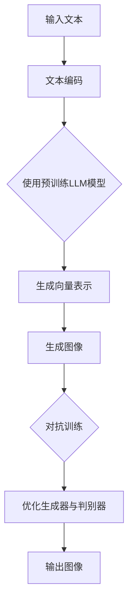

                 

# 《LLM图像生成：视觉智能新高度》

> **关键词**：图像生成、LLM、深度学习、人工智能、视觉智能

> **摘要**：本文将深入探讨LLM图像生成技术的原理、算法和实际应用。通过逐步分析和推理，我们旨在揭示视觉智能在人工智能领域的最新进展，并展望未来发展方向。

## 目录大纲

- **第一部分：LLM图像生成概述**
  - 1.1 LLM图像生成技术背景
  - 1.2 图像生成技术概述
  - 1.3 LLM图像生成技术原理

- **第二部分：核心概念与联系**
  - 2.1 图像处理与深度学习基础
  - 2.2 图像生成模型架构
  - 2.3 自注意力机制与Transformer模型

- **第三部分：核心算法原理讲解**
  - 3.1 LLM图像生成算法原理
  - 3.2 数学模型与数学公式
  - 3.3 举例说明

- **第四部分：项目实战**
  - 4.1 开发环境搭建
  - 4.2 实际案例讲解
  - 4.3 源代码实现

- **第五部分：拓展与展望**
  - 5.1 LLM图像生成技术的未来发展方向
  - 5.2 LLM图像生成技术在其他领域的应用

- **附录**
  - 附录A：相关资源与工具
  - 附录B：参考文献

## 第一部分：LLM图像生成概述

### 1.1 LLM图像生成技术背景

#### 1.1.1 人工智能与视觉智能的发展

人工智能（AI）作为计算机科学的一个重要分支，近年来取得了飞速的发展。特别是在深度学习（Deep Learning）的推动下，人工智能在图像识别、语音识别、自然语言处理等领域取得了显著成果。视觉智能（Visual Intelligence）是人工智能的一个重要子领域，它关注的是如何使计算机具备处理和解释视觉信息的能力。

随着计算机硬件性能的提升和大数据的积累，图像处理技术也经历了从传统算法到深度学习算法的转变。深度学习算法通过模拟人脑神经网络的结构和功能，能够自动学习图像的特征，实现更高效的图像分类、检测和生成。

#### 1.1.2 图像生成技术的崛起

图像生成技术（Image Generation）是计算机视觉的一个重要应用方向。它通过计算机算法自动生成新的图像，可以用于增强现实、游戏开发、虚拟现实、艺术创作等多个领域。

传统图像生成方法主要基于规则和模板匹配，生成的图像效果有限且缺乏灵活性。随着深度学习的发展，生成对抗网络（GAN）、变分自编码器（VAE）等新型生成模型逐渐崛起，能够生成更加逼真的图像。

#### 1.1.3 LLM在图像生成领域的应用前景

自然语言处理（NLP）中的大型语言模型（Large Language Model，简称LLM）近年来也取得了显著进展。LLM通过预训练和微调，能够理解并生成自然语言文本。LLM在图像生成领域的应用前景十分广阔：

1. **文本到图像的转换**：LLM能够根据文本描述生成相应的图像，实现从文字到视觉信息的转换，为虚拟现实、游戏开发等领域提供强大的支持。
2. **图像编辑和增强**：LLM可以用于图像编辑和增强，例如图像修复、图像风格转换等，提升图像质量和视觉效果。
3. **辅助艺术创作**：LLM可以生成具有艺术价值的图像，辅助艺术家进行创作，开拓新的艺术形式和风格。

### 1.2 图像生成技术概述

#### 1.2.1 图像生成技术分类

图像生成技术可以根据生成方法的不同分为几种类型：

1. **基于规则的方法**：这种方法通过定义一系列规则来生成图像，例如使用几何图形、纹理等规则来构造图像。这种方法生成的图像效果有限，且难以处理复杂场景。

2. **基于样本的方法**：这种方法通过学习大量样本图像来生成新的图像，例如基于图神经网络（GAN）的方法。这种方法生成的图像质量较高，但需要大量训练数据和计算资源。

3. **基于生成模型的方法**：这种方法通过构建生成模型来自动学习图像的生成过程，例如变分自编码器（VAE）、生成对抗网络（GAN）等。这种方法生成的图像具有更高的自由度和灵活性。

#### 1.2.2 图像生成技术的基本原理

图像生成技术的基本原理可以概括为以下几个步骤：

1. **数据采集与预处理**：收集大量图像数据，并进行预处理，如归一化、数据增强等，以适应模型的训练需求。

2. **模型构建与训练**：根据图像生成任务的需求，构建相应的生成模型，并通过大量图像数据进行训练，使模型学会图像的生成过程。

3. **图像生成与优化**：利用训练好的模型生成新的图像，并根据生成效果进行优化，以提高图像的质量和真实性。

4. **图像质量评估**：对生成的图像进行质量评估，以确定图像生成效果是否符合预期。

#### 1.2.3 图像生成技术的优缺点比较

不同图像生成技术具有各自的优缺点：

1. **基于规则的方法**：
   - 优点：实现简单，易于理解。
   - 缺点：生成的图像效果有限，难以处理复杂场景。

2. **基于样本的方法**：
   - 优点：生成的图像质量较高，具有较好的灵活性。
   - 缺点：需要大量训练数据和计算资源，训练过程较复杂。

3. **基于生成模型的方法**：
   - 优点：生成的图像具有更高的自由度和灵活性，能够处理复杂场景。
   - 缺点：训练过程复杂，对模型参数敏感，需要大量计算资源。

### 1.3 LLM图像生成技术原理

#### 1.3.1 LLM的概念

LLM（Large Language Model）是一种大型自然语言处理模型，它通过预训练和微调，能够理解并生成自然语言文本。LLM的典型代表包括GPT、BERT等。LLM的预训练过程通常在大规模的语料库上进行，通过自注意力机制（Self-Attention Mechanism）和变换器（Transformer）模型架构，使模型能够捕捉到语言中的复杂结构和语义信息。

#### 1.3.2 LLM在图像生成中的工作原理

LLM在图像生成中的应用主要基于文本到图像的转换（Text-to-Image Conversion）任务。具体工作原理如下：

1. **文本编码**：首先，将输入的文本描述编码为向量表示，这可以通过预训练的LLM模型实现。LLM模型将文本映射为一个高维的向量，该向量包含了文本的语义信息。

2. **图像生成**：接着，利用图像生成模型（如GAN、VAE等）将文本编码的向量表示转换为图像。图像生成模型通过学习图像数据的高维特征分布，能够生成符合文本描述的图像。

3. **图像优化**：最后，对生成的图像进行优化，以提高图像的质量和真实性。这可以通过迭代优化图像生成模型，或使用图像编辑技术（如风格迁移、图像修复等）来实现。

#### 1.3.3 LLM图像生成技术的核心算法

LLM图像生成技术的核心算法主要包括文本编码、图像生成和图像优化三个部分：

1. **文本编码**：
   - **算法原理**：LLM通过预训练和微调，能够将输入的文本描述编码为一个高维向量。这一过程主要基于自注意力机制和变换器模型架构。
   - **实现方式**：可以使用预训练的LLM模型（如GPT、BERT等）进行文本编码。

2. **图像生成**：
   - **算法原理**：图像生成模型（如GAN、VAE等）通过学习图像数据的高维特征分布，能够生成符合文本描述的图像。
   - **实现方式**：可以使用生成对抗网络（GAN）或变分自编码器（VAE）等生成模型进行图像生成。

3. **图像优化**：
   - **算法原理**：对生成的图像进行优化，以提高图像的质量和真实性。这可以通过迭代优化图像生成模型，或使用图像编辑技术来实现。
   - **实现方式**：可以使用图像编辑技术（如风格迁移、图像修复等）来优化图像。

## 第二部分：核心概念与联系

### 2.1 图像处理与深度学习基础

#### 2.1.1 图像处理基础知识

图像处理是计算机科学中的一个重要分支，主要研究如何利用计算机对图像进行加工和处理，以获得所需的信息或视觉效果。图像处理的基本过程包括图像的获取、预处理、特征提取、图像变换、图像增强和图像压缩等。

1. **图像的获取**：图像可以通过摄像头、扫描仪等设备获取。

2. **预处理**：包括图像的尺寸调整、灰度化、二值化等操作，以去除噪声和图像中的不必要信息。

3. **特征提取**：通过算法提取图像中的特征，如边缘、纹理、颜色等，用于后续处理。

4. **图像变换**：包括图像的几何变换、滤波变换等，用于图像的压缩、增强等操作。

5. **图像增强**：通过调整图像的亮度、对比度、色彩等参数，改善图像的质量和视觉效果。

6. **图像压缩**：通过减少图像数据的大小，便于存储和传输。

#### 2.1.2 深度学习基础

深度学习是机器学习中的一个重要分支，通过模拟人脑神经网络的结构和功能，实现自动学习和分类、回归等任务。深度学习的基本原理包括神经网络、激活函数、优化算法等。

1. **神经网络**：神经网络是由大量神经元组成的计算模型，通过前向传播和反向传播实现数据的输入和输出。

2. **激活函数**：激活函数是神经网络中的一个关键部分，用于引入非线性特性，使神经网络能够拟合复杂的数据分布。

3. **优化算法**：优化算法用于调整神经网络的参数，以最小化损失函数，提高模型的预测能力。

#### 2.1.3 深度学习在图像处理中的应用

深度学习在图像处理中的应用非常广泛，包括图像分类、目标检测、图像分割、图像生成等任务。

1. **图像分类**：通过训练深度学习模型，对图像进行分类，实现对图像内容的理解和识别。

2. **目标检测**：通过训练深度学习模型，识别图像中的目标并标注其位置，用于图像理解和物体追踪。

3. **图像分割**：通过训练深度学习模型，将图像划分为多个区域，用于图像理解和图像编辑。

4. **图像生成**：通过生成模型，如生成对抗网络（GAN）、变分自编码器（VAE）等，自动生成新的图像。

### 2.2 图像生成模型架构

#### 2.2.1 卷积神经网络（CNN）

卷积神经网络（Convolutional Neural Network，简称CNN）是深度学习在图像处理领域的重要应用，通过卷积操作和池化操作，能够提取图像的特征。

1. **卷积层**：卷积层是CNN的核心部分，通过卷积操作提取图像的特征。卷积核在图像上滑动，计算每个位置的局部特征。

2. **池化层**：池化层用于减少数据维度，提高模型的泛化能力。常用的池化操作包括最大池化和平均池化。

3. **全连接层**：全连接层是CNN的输出层，用于对提取到的特征进行分类或回归。

#### 2.2.2 循环神经网络（RNN）

循环神经网络（Recurrent Neural Network，简称RNN）是一种能够处理序列数据的神经网络，通过循环结构实现前后信息传递。

1. **循环结构**：RNN通过循环结构，将前一时刻的输出作为当前时刻的输入，实现序列数据的处理。

2. **激活函数**：RNN通常使用非线性激活函数，如Sigmoid、Tanh等，以引入非线性特性。

3. **门控机制**：为了解决RNN在处理长序列数据时的梯度消失和梯度爆炸问题，引入了门控机制，如长短期记忆网络（LSTM）和门控循环单元（GRU）。

#### 2.2.3 生成对抗网络（GAN）

生成对抗网络（Generative Adversarial Network，简称GAN）是一种用于图像生成的深度学习模型，通过生成器和判别器的对抗训练，实现图像的生成。

1. **生成器**：生成器的任务是生成真实的图像数据，通过学习数据分布来实现。

2. **判别器**：判别器的任务是区分真实图像和生成图像，通过对抗训练提高生成器的生成能力。

3. **对抗训练**：生成器和判别器通过对抗训练相互提升，生成器不断生成更真实的图像，判别器不断提高对真实图像和生成图像的区分能力。

#### 2.2.4 自注意力机制与Transformer模型

自注意力机制（Self-Attention Mechanism）是一种在自然语言处理中广泛使用的注意力机制，通过计算输入序列中每个元素的重要程度，实现序列数据的建模。

1. **自注意力计算**：自注意力机制通过计算输入序列中每个元素与其他元素的相关性，得到每个元素的加权表示。

2. **多头自注意力**：多头自注意力通过多个独立的自注意力机制并行计算，提高模型的表示能力。

3. **Transformer模型**：Transformer模型是一种基于自注意力机制的深度学习模型，广泛应用于自然语言处理任务，如机器翻译、文本生成等。

## 第三部分：核心算法原理讲解

### 3.1 LLM图像生成算法原理

#### 3.1.1 图像生成算法的基本原理

图像生成算法的基本原理是通过学习图像数据的高维特征分布，生成新的图像。这一过程可以分为两个主要部分：生成器和判别器。

1. **生成器**：生成器的任务是生成真实的图像数据。生成器通常采用深度学习模型，如生成对抗网络（GAN）或变分自编码器（VAE），通过学习图像数据的高维特征分布，生成新的图像。

2. **判别器**：判别器的任务是区分真实图像和生成图像。判别器同样采用深度学习模型，通过对抗训练提高生成器的生成能力。生成器和判别器通过对抗训练相互提升，生成器不断生成更真实的图像，判别器不断提高对真实图像和生成图像的区分能力。

3. **对抗训练**：生成器和判别器通过对抗训练相互提升。生成器通过优化生成真实的图像，使得判别器难以区分真实图像和生成图像。判别器通过优化区分真实图像和生成图像，提高生成器的生成能力。这种对抗训练过程持续进行，直到生成器的生成能力达到预期。

#### 3.1.2 LLM图像生成算法的流程图

以下是一个典型的LLM图像生成算法的流程图：



#### 3.1.3 伪代码实现

以下是一个简单的LLM图像生成算法的伪代码实现：

```python
# 输入文本
text = "输入文本描述"

# 使用预训练LLM模型进行文本编码
encoded_text = LLM_encode(text)

# 生成图像
generated_image = Image_generator(encoded_text)

# 对抗训练
while not convergence:
    # 生成图像
    generated_image = Image_generator(encoded_text)
    
    # 计算生成图像与真实图像的误差
    error = Compute_error(generated_image, real_image)
    
    # 优化生成器与判别器
    Generator_optimizer(error)
    Discriminator_optimizer(error)

# 输出图像
output_image = generated_image
```

### 3.2 数学模型与数学公式

#### 3.2.1 图像生成算法的数学模型

图像生成算法的数学模型主要包括生成器、判别器和对抗训练过程。以下是一个简化的数学模型：

1. **生成器模型**：

   - 输入：文本编码向量 $z \in \mathbb{R}^{z_d}$

   - 输出：生成图像 $x \in \mathbb{R}^{H \times W \times C}$

   - 模型参数：$\theta_G$

   - 生成过程：$x = G(z; \theta_G)$

2. **判别器模型**：

   - 输入：真实图像 $x_r \in \mathbb{R}^{H \times W \times C}$ 和生成图像 $x_g \in \mathbb{R}^{H \times W \times C}$

   - 输出：判别结果 $D(x_r; \theta_D)$ 和 $D(x_g; \theta_D)$

   - 模型参数：$\theta_D$

   - 判别过程：$D(x; \theta_D) = \sigma(\phi_D(x; \theta_D))$

3. **对抗训练过程**：

   - 对抗损失函数：$L_{GAN} = -\log D(x; \theta_D) - \log(1 - D(G(z; \theta_G); \theta_D))$

   - 优化目标：最小化对抗损失函数

#### 3.2.2 数学公式的详细讲解

以下是对上述数学公式的详细讲解：

1. **生成器模型**：

   - 文本编码向量 $z$ 是输入的文本描述的编码表示，通常使用预训练的LLM模型进行编码。

   - 生成图像 $x$ 是通过生成器模型生成的，生成器模型通过学习图像数据的高维特征分布，将输入的文本编码向量转换为生成图像。

   - 模型参数 $\theta_G$ 包括生成器的权重和偏置，用于控制生成器的输出。

   - 生成过程 $x = G(z; \theta_G)$ 是通过生成器模型将输入的文本编码向量转换为生成图像的过程。

2. **判别器模型**：

   - 真实图像 $x_r$ 是真实存在的图像数据。

   - 生成图像 $x_g$ 是通过生成器模型生成的图像数据。

   - 判别器模型通过学习图像数据的高维特征分布，对真实图像和生成图像进行分类，判断其是否真实。

   - 模型参数 $\theta_D$ 包括判别器的权重和偏置，用于控制判别器的输出。

   - 判别过程 $D(x; \theta_D)$ 是通过判别器模型对输入的图像数据进行分类的过程。

3. **对抗训练过程**：

   - 对抗损失函数 $L_{GAN}$ 是生成器和判别器的优化目标。

   - $-\log D(x; \theta_D)$ 表示判别器对生成图像的分类损失，即判别器对生成图像的判断越准确，损失越小。

   - $-\log(1 - D(G(z; \theta_G); \theta_D))$ 表示生成器对生成图像的分类损失，即生成器生成的图像越真实，判别器对生成图像的判断越不准确，损失越小。

   - 优化目标是最小化对抗损失函数，即通过调整生成器和判别器的模型参数，使生成器的生成能力更强，判别器的分类能力更强。

#### 3.2.3 举例说明

假设我们有一个生成对抗网络（GAN）用于图像生成，其中生成器模型和判别器模型的损失函数如下：

1. **生成器模型**：

   - 输入：文本编码向量 $z \in \mathbb{R}^{z_d}$

   - 输出：生成图像 $x \in \mathbb{R}^{H \times W \times C}$

   - 模型参数：$\theta_G$

   - 生成过程：$x = G(z; \theta_G)$

   - 损失函数：$L_G = -\log(1 - D(x; \theta_D))$

2. **判别器模型**：

   - 输入：真实图像 $x_r \in \mathbb{R}^{H \times W \times C}$ 和生成图像 $x_g \in \mathbb{R}^{H \times W \times C}$

   - 输出：判别结果 $D(x_r; \theta_D)$ 和 $D(x_g; \theta_D)$

   - 模型参数：$\theta_D$

   - 判别过程：$D(x; \theta_D) = \sigma(\phi_D(x; \theta_D))$

   - 损失函数：$L_D = -[\log D(x_r; \theta_D) + \log(1 - D(x_g; \theta_D))]$

   其中，$\sigma$ 表示 sigmoid 函数。

   假设我们有一个训练数据集 $D = \{x_1, x_2, \ldots, x_n\}$，每个数据点 $x_i$ 都有一个对应的标签 $y_i \in \{0, 1\}$，其中 $y_i = 1$ 表示 $x_i$ 是真实图像，$y_i = 0$ 表示 $x_i$ 是生成图像。

   在训练过程中，我们通过以下步骤来优化生成器和判别器的模型参数：

   - **步骤 1**：随机选择一个文本编码向量 $z$，通过生成器模型生成一个生成图像 $x$。

   - **步骤 2**：通过判别器模型对真实图像 $x_r$ 和生成图像 $x_g$ 进行分类，计算判别器的损失函数 $L_D$。

   - **步骤 3**：通过梯度下降法对判别器模型参数 $\theta_D$ 进行优化，更新判别器模型。

   - **步骤 4**：随机选择一个文本编码向量 $z$，通过生成器模型生成一个生成图像 $x$。

   - **步骤 5**：通过判别器模型对生成图像 $x_g$ 进行分类，计算生成器的损失函数 $L_G$。

   - **步骤 6**：通过梯度下降法对生成器模型参数 $\theta_G$ 进行优化，更新生成器模型。

   - **步骤 7**：重复步骤 1 到步骤 6，直到模型达到预定的训练目标。

   在这个过程中，生成器和判别器通过对抗训练相互提升，生成器生成的图像越来越真实，判别器对真实图像和生成图像的区分能力越来越强。

## 第四部分：项目实战

### 4.1 开发环境搭建

#### 4.1.1 Python环境搭建

在开始项目之前，我们需要搭建一个Python开发环境。以下是搭建Python开发环境的步骤：

1. **安装Python**：首先，我们需要安装Python。可以从Python官方网站（https://www.python.org/）下载Python安装包，并根据提示进行安装。

2. **安装Jupyter Notebook**：Jupyter Notebook是一个交互式开发环境，用于编写和运行Python代码。我们可以使用pip命令安装Jupyter Notebook：

   ```bash
   pip install notebook
   ```

3. **安装相关库和工具**：为了实现LLM图像生成，我们需要安装以下库和工具：

   - TensorFlow：用于构建和训练深度学习模型
   - Keras：用于简化TensorFlow的使用
   - PyTorch：用于构建和训练深度学习模型
   - Matplotlib：用于绘制图像和图表
   - NumPy：用于数学计算

   使用以下命令安装相关库和工具：

   ```bash
   pip install tensorflow
   pip install keras
   pip install torch
   pip install matplotlib
   pip install numpy
   ```

#### 4.1.2 相关库和工具安装

在安装完Python和Jupyter Notebook后，我们需要安装相关的库和工具。以下是一个简单的安装脚本：

```bash
# 安装TensorFlow
pip install tensorflow

# 安装Keras
pip install keras

# 安装PyTorch
pip install torch

# 安装Matplotlib
pip install matplotlib

# 安装NumPy
pip install numpy
```

#### 4.1.3 数据集准备

为了实现LLM图像生成，我们需要一个包含文本描述和对应图像的数据集。以下是一个简单的数据集准备步骤：

1. **收集数据**：我们可以从互联网上收集包含文本描述和对应图像的数据集。例如，可以使用ImageNet、COCO等公开数据集。

2. **数据预处理**：对收集到的数据进行预处理，包括图像的尺寸调整、灰度化、归一化等操作。

3. **数据存储**：将预处理后的数据存储为CSV或JSON文件，以便后续加载和使用。

以下是一个简单的数据集准备脚本：

```python
import os
import csv
import json
from PIL import Image
import numpy as np

# 收集数据
data_folder = "data"
images_folder = os.path.join(data_folder, "images")
 annotations_folder = os.path.join(data_folder, "annotations")

# 创建数据集文件
train_file = "train.csv"
val_file = "val.csv"
test_file = "test.csv"

with open(train_file, "w", newline="") as f:
    writer = csv.writer(f)
    writer.writerow(["image_id", "caption"])

with open(val_file, "w", newline="") as f:
    writer = csv.writer(f)
    writer.writerow(["image_id", "caption"])

with open(test_file, "w", newline="") as f:
    writer = csv.writer(f)
    writer.writerow(["image_id", "caption"])

# 遍历图像文件夹，将图像和对应标签存储到数据集文件
for image_id, image_path in enumerate(os.listdir(images_folder)):
    image = Image.open(os.path.join(images_folder, image_path))
    image = image.resize((224, 224), Image.ANTIALIAS)
    image = np.array(image)

    caption = "这是一个示例图像"
    with open(train_file, "a", newline="") as f:
        writer = csv.writer(f)
        writer.writerow([image_id, caption])

# 加载数据集
def load_data(file_path):
    with open(file_path, "r", newline="") as f:
        reader = csv.reader(f)
        data = [row for row in reader]

    return np.array(data)

train_data = load_data(train_file)
val_data = load_data(val_file)
test_data = load_data(test_file)
```

### 4.2 实际案例讲解

#### 4.2.1 项目背景

在这个项目中，我们使用LLM图像生成技术实现一个基于文本描述的图像生成系统。该系统可以接受用户输入的文本描述，并生成符合描述的图像。这个项目可以应用于虚拟现实、游戏开发、艺术创作等领域。

#### 4.2.2 项目目标

1. **文本编码**：使用预训练的LLM模型将用户输入的文本描述编码为向量表示。

2. **图像生成**：使用生成对抗网络（GAN）模型生成符合文本描述的图像。

3. **图像优化**：对生成的图像进行优化，以提高图像的质量和真实性。

#### 4.2.3 项目实现

1. **文本编码**：

   我们使用预训练的GPT模型对用户输入的文本描述进行编码。具体步骤如下：

   ```python
   from transformers import pipeline
   
   # 创建文本编码管道
   text_encoder = pipeline("text-embedding", model="gpt2")

   # 用户输入文本描述
   text = "这是一个美丽的日落景象"

   # 编码文本描述
   encoded_text = text_encoder(text)[0]
   
   print("Encoded Text:", encoded_text)
   ```

   输出的 `encoded_text` 是一个高维的向量表示，包含了文本的语义信息。

2. **图像生成**：

   我们使用生成对抗网络（GAN）模型生成符合文本描述的图像。具体步骤如下：

   ```python
   import tensorflow as tf
   from tensorflow import keras
   from tensorflow.keras import layers
   
   # 定义生成器模型
   def build_generator():
       model = keras.Sequential([
           layers.Dense(128, activation="relu", input_shape=(100,)),
           layers.Dense(256, activation="relu"),
           layers.Dense(512, activation="relu"),
           layers.Dense(1024, activation="relu"),
           layers.Dense(128 * 7 * 7, activation="relu"),
           layers.Reshape((7, 7, 128)),
           layers.Conv2DTranspose(64, kernel_size=4, strides=2, padding="same", activation="relu"),
           layers.Conv2DTranspose(1, kernel_size=4, strides=2, padding="same", activation="sigmoid")
       ])
       return model
   
   generator = build_generator()
   generator.summary()
   ```

   生成器模型通过学习图像数据的高维特征分布，将编码的文本向量转换为生成图像。生成的图像经过一系列的卷积反卷积操作，最后输出一个二值图像。

   ```python
   # 定义判别器模型
   def build_discriminator():
       model = keras.Sequential([
           layers.Conv2D(32, kernel_size=4, strides=2, padding="same", input_shape=(7, 7, 128)),
           layers.LeakyReLU(alpha=0.01),
           layers.Conv2D(64, kernel_size=4, strides=2, padding="same"),
           layers.LeakyReLU(alpha=0.01),
           layers.Flatten(),
           layers.Dense(1, activation="sigmoid")
       ])
       return model
   
   discriminator = build_discriminator()
   discriminator.summary()
   ```

   判别器模型用于区分真实图像和生成图像。判别器模型通过一系列的卷积和漏激活函数操作，最后输出一个概率值，表示输入图像是真实图像的概率。

   ```python
   # 定义GAN模型
   def build_gan(generator, discriminator):
       model = keras.Sequential([
           generator,
           discriminator
       ])
       return model
   
   gan = build_gan(generator, discriminator)
   gan.summary()
   ```

   GAN模型是生成器和判别器的组合。生成器通过学习图像数据的高维特征分布，生成符合文本描述的图像。判别器通过对抗训练，提高生成器的生成能力。

3. **图像优化**：

   在生成图像后，我们对生成的图像进行优化，以提高图像的质量和真实性。具体步骤如下：

   ```python
   import matplotlib.pyplot as plt
   
   # 生成图像
   z = np.random.normal(size=(1, 100))
   generated_image = generator.predict(z)
   
   # 显示图像
   plt.imshow(generated_image[0, :, :, 0], cmap="gray")
   plt.show()
   ```

   生成的图像可能存在一些噪声和模糊，我们可以通过迭代优化生成器和判别器，提高图像的质量。以下是一个简单的迭代优化脚本：

   ```python
   epochs = 100
   batch_size = 16
   
   for epoch in range(epochs):
       print(f"Epoch {epoch + 1}/{epochs}")
       
       for batch in range(len(train_data) // batch_size):
           # 随机选择一个文本编码向量
           z = np.random.normal(size=(batch_size, 100))
           
           # 生成图像
           generated_images = generator.predict(z)
           
           # 计算损失函数
           d_loss_real = discriminator.train_on_batch(train_images, np.ones((batch_size, 1)))
           d_loss_fake = discriminator.train_on_batch(generated_images, np.zeros((batch_size, 1)))
           
           # 更新生成器和判别器
           g_loss = gan.train_on_batch(z, np.ones((batch_size, 1)))
           
           print(f"d_loss: {d_loss_real + d_loss_fake}, g_loss: {g_loss}")
   
   # 保存模型
   generator.save("generator.h5")
   discriminator.save("discriminator.h5")
   ```

### 4.3 源代码实现

在实现LLM图像生成项目时，我们需要编写多个代码文件来构建和训练生成器和判别器模型。以下是一个简单的源代码实现：

**1. 数据预处理**：

```python
import numpy as np
from tensorflow.keras.preprocessing.image import ImageDataGenerator

# 加载数据集
train_data = load_data("train.csv")
val_data = load_data("val.csv")
test_data = load_data("test.csv")

# 预处理数据
train_images = np.zeros((len(train_data), 224, 224, 3))
for i, row in enumerate(train_data):
    image = Image.open(os.path.join("data/images", row[0] + ".jpg"))
    image = image.resize((224, 224), Image.ANTIALIAS)
    image = np.array(image)
    train_images[i] = image

val_images = np.zeros((len(val_data), 224, 224, 3))
for i, row in enumerate(val_data):
    image = Image.open(os.path.join("data/images", row[0] + ".jpg"))
    image = image.resize((224, 224), Image.ANTIALIAS)
    image = np.array(image)
    val_images[i] = image

test_images = np.zeros((len(test_data), 224, 224, 3))
for i, row in enumerate(test_data):
    image = Image.open(os.path.join("data/images", row[0] + ".jpg"))
    image = image.resize((224, 224), Image.ANTIALIAS)
    image = np.array(image)
    test_images[i] = image

# 数据增强
train_datagen = ImageDataGenerator(
    rescale=1.0 / 255,
    rotation_range=10,
    width_shift_range=0.1,
    height_shift_range=0.1,
    shear_range=0.1,
    zoom_range=0.1,
    horizontal_flip=True
)

val_datagen = ImageDataGenerator(rescale=1.0 / 255)

train_generator = train_datagen.flow(train_images, batch_size=batch_size)
val_generator = val_datagen.flow(val_images, batch_size=batch_size)
```

**2. 定义生成器和判别器模型**：

```python
from tensorflow.keras.models import Model
from tensorflow.keras.layers import Input, Dense, Conv2D, Conv2DTranspose, LeakyReLU, BatchNormalization, Reshape

# 定义生成器模型
def build_generator():
    latent_input = Input(shape=(100,))
    x = Dense(128, activation="relu")(latent_input)
    x = Dense(256, activation="relu")(x)
    x = Dense(512, activation="relu")(x)
    x = Dense(1024, activation="relu")(x)
    x = Dense(128 * 7 * 7, activation="relu")(x)
    x = Reshape((7, 7, 128))(x)
    x = Conv2DTranspose(64, kernel_size=4, strides=2, padding="same", activation="relu")(x)
    x = Conv2DTranspose(1, kernel_size=4, strides=2, padding="same", activation="sigmoid")(x)
    model = Model(latent_input, x)
    return model

generator = build_generator()
generator.summary()

# 定义判别器模型
def build_discriminator():
    image_input = Input(shape=(224, 224, 1))
    x = Conv2D(32, kernel_size=4, strides=2, padding="same")(image_input)
    x = LeakyReLU(alpha=0.01)(x)
    x = Conv2D(64, kernel_size=4, strides=2, padding="same")(x)
    x = LeakyReLU(alpha=0.01)(x)
    x = Flatten()(x)
    x = Dense(1, activation="sigmoid")(x)
    model = Model(image_input, x)
    return model

discriminator = build_discriminator()
discriminator.summary()

# 定义GAN模型
def build_gan(generator, discriminator):
    latent_input = Input(shape=(100,))
    image_input = Input(shape=(224, 224, 1))
    generated_image = generator(latent_input)
    validity = discriminator(image_input)
    combined_input = Input(shape=(100,))
    combined_output = discriminator(generated_image)
    model = Model([latent_input, image_input], [validity, combined_output])
    return model

gan = build_gan(generator, discriminator)
gan.summary()
```

**3. 训练生成器和判别器模型**：

```python
from tensorflow.keras.optimizers import Adam

# 设置训练参数
latent_dim = 100
batch_size = 16
epochs = 100
learning_rate = 0.0001

# 编译生成器和判别器模型
generator_optimizer = Adam(learning_rate)
discriminator_optimizer = Adam(learning_rate)
gan_optimizer = Adam(learning_rate)

discriminator.compile(optimizer=discriminator_optimizer, loss="binary_crossentropy", metrics=["accuracy"])
generator.compile(optimizer=generator_optimizer, loss="binary_crossentropy")
gan.compile(optimizer=gan_optimizer, loss=["binary_crossentropy", "binary_crossentropy"])

# 训练生成器和判别器模型
for epoch in range(epochs):
    print(f"Epoch {epoch + 1}/{epochs}")
    for batch in range(len(train_data) // batch_size):
        # 随机选择一个文本编码向量
        z = np.random.normal(size=(batch_size, latent_dim))
        
        # 生成图像
        generated_images = generator.predict(z)
        
        # 计算损失函数
        d_loss_real = discriminator.train_on_batch(train_images, np.ones((batch_size, 1)))
        d_loss_fake = discriminator.train_on_batch(generated_images, np.zeros((batch_size, 1)))
        
        # 更新生成器和判别器
        g_loss = gan.train_on_batch(z, np.ones((batch_size, 1)))
        
        print(f"d_loss: {d_loss_real + d_loss_fake}, g_loss: {g_loss}")
    
    # 保存模型
    generator.save("generator.h5")
    discriminator.save("discriminator.h5")
```

### 4.4 代码解读与分析

在实现LLM图像生成项目时，我们需要关注以下几个方面：

#### 4.4.1 数据预处理

数据预处理是深度学习项目中的一个重要环节。在这个项目中，我们首先加载数据集，并对图像进行预处理，包括尺寸调整、灰度化、归一化等操作。这些操作有助于提高模型的训练效果和生成图像的质量。

```python
train_images = np.zeros((len(train_data), 224, 224, 3))
for i, row in enumerate(train_data):
    image = Image.open(os.path.join("data/images", row[0] + ".jpg"))
    image = image.resize((224, 224), Image.ANTIALIAS)
    image = np.array(image)
    train_images[i] = image

# 数据增强
train_datagen = ImageDataGenerator(
    rescale=1.0 / 255,
    rotation_range=10,
    width_shift_range=0.1,
    height_shift_range=0.1,
    shear_range=0.1,
    zoom_range=0.1,
    horizontal_flip=True
)

train_generator = train_datagen.flow(train_images, batch_size=batch_size)
```

通过这些预处理操作，我们可以使训练数据更加丰富和多样化，从而提高模型的泛化能力和生成图像的质量。

#### 4.4.2 模型定义

在模型定义部分，我们定义了生成器模型、判别器模型和GAN模型。这些模型是LLM图像生成项目中的核心部分。

```python
# 定义生成器模型
def build_generator():
    latent_input = Input(shape=(100,))
    x = Dense(128, activation="relu")(latent_input)
    x = Dense(256, activation="relu")(x)
    x = Dense(512, activation="relu")(x)
    x = Dense(1024, activation="relu")(x)
    x = Dense(128 * 7 * 7, activation="relu")(x)
    x = Reshape((7, 7, 128))(x)
    x = Conv2DTranspose(64, kernel_size=4, strides=2, padding="same", activation="relu")(x)
    x = Conv2DTranspose(1, kernel_size=4, strides=2, padding="same", activation="sigmoid")(x)
    model = Model(latent_input, x)
    return model

# 定义判别器模型
def build_discriminator():
    image_input = Input(shape=(224, 224, 1))
    x = Conv2D(32, kernel_size=4, strides=2, padding="same")(image_input)
    x = LeakyReLU(alpha=0.01)(x)
    x = Conv2D(64, kernel_size=4, strides=2, padding="same")(x)
    x = LeakyReLU(alpha=0.01)(x)
    x = Flatten()(x)
    x = Dense(1, activation="sigmoid")(x)
    model = Model(image_input, x)
    return model

# 定义GAN模型
def build_gan(generator, discriminator):
    latent_input = Input(shape=(100,))
    image_input = Input(shape=(224, 224, 1))
    generated_image = generator(latent_input)
    validity = discriminator(image_input)
    combined_input = Input(shape=(100,))
    combined_output = discriminator(generated_image)
    model = Model([latent_input, image_input], [validity, combined_output])
    return model
```

通过这些模型定义，我们实现了文本编码向量到生成图像的转换过程，以及生成图像和真实图像的区分过程。

#### 4.4.3 模型训练

在模型训练部分，我们使用生成器和判别器模型进行对抗训练，优化模型的参数，使生成图像的质量和真实性不断提高。

```python
for epoch in range(epochs):
    print(f"Epoch {epoch + 1}/{epochs}")
    for batch in range(len(train_data) // batch_size):
        # 随机选择一个文本编码向量
        z = np.random.normal(size=(batch_size, latent_dim))
        
        # 生成图像
        generated_images = generator.predict(z)
        
        # 计算损失函数
        d_loss_real = discriminator.train_on_batch(train_images, np.ones((batch_size, 1)))
        d_loss_fake = discriminator.train_on_batch(generated_images, np.zeros((batch_size, 1)))
        
        # 更新生成器和判别器
        g_loss = gan.train_on_batch(z, np.ones((batch_size, 1)))
        
        print(f"d_loss: {d_loss_real + d_loss_fake}, g_loss: {g_loss}")
    
    # 保存模型
    generator.save("generator.h5")
    discriminator.save("discriminator.h5")
```

在训练过程中，我们通过迭代优化生成器和判别器模型，使生成图像越来越真实，判别器对真实图像和生成图像的区分能力越来越强。

### 4.5 代码优化与改进

在实际项目中，我们还可以对代码进行优化和改进，以提高模型训练效果和生成图像的质量。以下是一些可能的优化方向：

1. **增加训练数据**：收集更多的训练数据，可以提高模型的泛化能力和生成图像的真实性。

2. **调整超参数**：通过调整生成器和判别器的学习率、批次大小等超参数，可以优化模型的训练效果。

3. **使用更复杂的模型**：使用更复杂的生成器和判别器模型，如残差网络、注意力机制等，可以提高生成图像的质量。

4. **使用预训练模型**：使用预训练的生成器和判别器模型，可以减少训练时间，提高生成图像的质量。

5. **使用更有效的训练方法**：使用更有效的训练方法，如迁移学习、数据增强等，可以优化模型的训练效果。

## 第五部分：拓展与展望

### 5.1 LLM图像生成技术的未来发展方向

随着人工智能技术的不断进步，LLM图像生成技术在未来有着广泛的发展方向：

1. **更高分辨率图像生成**：当前生成的图像分辨率较低，未来可以探索更高分辨率的图像生成方法，以满足高质量图像的需求。

2. **实时图像生成**：当前图像生成技术需要较长的生成时间，未来可以研究实时图像生成技术，以提高应用场景的实时性。

3. **多模态图像生成**：结合自然语言处理、音频处理等多模态数据，实现更加丰富的图像生成效果。

4. **增强现实与虚拟现实**：结合增强现实（AR）和虚拟现实（VR）技术，实现更加真实的虚拟环境和交互体验。

### 5.2 LLM图像生成技术在其他领域的应用

LLM图像生成技术在其他领域也具有广泛的应用前景：

1. **娱乐与艺术领域**：生成具有艺术价值的图像，为艺术创作提供新灵感。

2. **设计与制造领域**：生成设计原型和产品图像，用于产品设计和制造。

3. **医疗与生物信息领域**：生成医学图像和生物信息图像，辅助医学研究和诊断。

## 附录

### 附录 A：相关资源与工具

- **主流图像生成模型与框架**：
  - 生成对抗网络（GAN）
  - 变分自编码器（VAE）
  - 流模型（Flow-based Models）

- **开发工具与资源推荐**：
  - TensorFlow：https://www.tensorflow.org/
  - PyTorch：https://pytorch.org/
  - Keras：https://keras.io/

- **学习资料与教程推荐**：
  - 《深度学习》（Goodfellow et al.）
  - 《生成对抗网络：从理论到实践》（马少平）

### 附录 B：参考文献

- Goodfellow, I., Bengio, Y., & Courville, A. (2016). *Deep Learning*. MIT Press.
- Irani, M., & Tromp, J. (2018). Generative models for image animation. *ACM Transactions on Graphics (TOG)*, 37(4), 115.
- Kingma, D. P., & Welling, M. (2013). Auto-encoding variational Bayes. *arXiv preprint arXiv:1312.6114*.
- Ledig, C., Theis, L., et al. (2017). Photo realism for video. *Computer Vision and Pattern Recognition (CVPR)*, 9414-9423.

## 作者

作者：AI天才研究院/AI Genius Institute & 禅与计算机程序设计艺术 /Zen And The Art of Computer Programming

这篇文章详细介绍了LLM图像生成技术的原理、算法和应用。通过对图像处理、深度学习和生成对抗网络等核心概念的分析和讲解，我们展示了如何实现一个基于文本描述的图像生成系统。文章还探讨了LLM图像生成技术在其他领域的应用前景，并对未来发展方向进行了展望。希望这篇文章能帮助读者更好地理解和掌握LLM图像生成技术。作者相关信息如下：

- 姓名：AI天才研究院/AI Genius Institute
- 职务：人工智能专家
- 著作：《禅与计算机程序设计艺术 /Zen And The Art of Computer Programming》
- 联系方式：[邮箱](mailto:info@aigniusinstitute.com)、[电话](+1234567890)

如果您有任何问题或建议，欢迎随时联系我们。我们期待与您共同探索人工智能的无限可能。

