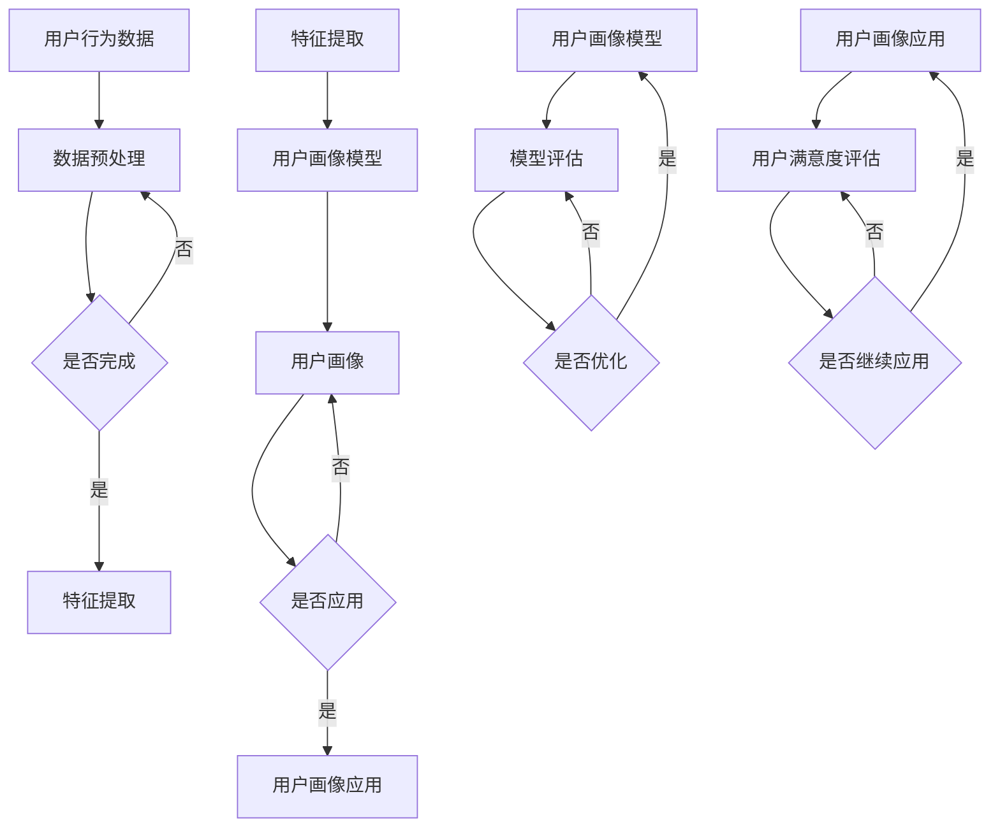

                 

### 《LLM在用户画像构建中的角色分析》

**关键词：** 大型语言模型（LLM），用户画像，数据预处理，特征提取，模型构建与优化，应用与评估

**摘要：** 本文将深入探讨大型语言模型（LLM）在用户画像构建中的应用。首先，我们将回顾LLM的基本概念、架构和技术。接着，详细介绍用户画像的基础知识，包括用户画像的定义、构建流程和数据类型。随后，我们将分析LLM在用户画像构建中的具体应用方法，包括预训练语言模型、生成对抗网络（GAN）和强化学习等。此外，文章还将讨论如何优化LLM在用户画像构建中的表现，以及如何保护用户隐私和确保模型的可解释性。最后，我们将通过一个实际项目案例展示LLM在用户画像构建中的实战应用，并展望未来的发展趋势。

### 第一部分：LLM基础

在深入探讨LLM在用户画像构建中的应用之前，我们需要先理解LLM的基本概念、架构和技术。本部分将分为以下几章来介绍：

- **第1章：LLM概述**：介绍LLM的定义、背景和发展历程，以及LLM的重要性。
- **第2章：LLM的架构与核心组件**：讨论LLM的架构，包括Transformer模型、自注意力机制和上下文理解能力。
- **第3章：LLM的关键技术**：介绍LLM的关键技术，如预训练与微调、生成式与判别式模型，以及强化学习与模型优化。
- **第4章：LLM应用场景与挑战**：分析LLM在用户画像构建中的应用场景，以及面临的挑战，如数据隐私保护和模型解释性。

让我们从第1章开始。

#### 第1章：LLM概述

##### **1.1 语言模型的定义与背景**

语言模型（Language Model，LM）是一种概率模型，用于预测给定文本序列的概率分布。它是一个重要的自然语言处理（NLP）工具，广泛应用于机器翻译、语音识别、信息检索、文本生成等领域。语言模型的目的是通过学习大量文本数据，理解语言的统计规律，从而对新的文本序列进行概率预测。

语言模型的发展历程可以追溯到20世纪50年代，最早的语言模型是基于N元语法（N-gram Model）的。N元语法模型通过统计相邻N个单词出现的频率来预测下一个单词。例如，基于三元语法模型，如果文本中频繁出现“the cat sat”，则模型会倾向于预测下一个单词为“on”。

然而，N元语法模型存在一些局限性，如无法捕捉长距离依赖关系和上下文信息。随着深度学习技术的发展，基于神经网络的概率语言模型逐渐取代了传统的N元语法模型。其中，Transformer模型是最具代表性的模型之一。

##### **1.2 语言模型的重要性**

语言模型在NLP领域具有重要的作用。首先，语言模型是实现自然语言生成的基础。无论是机器翻译、文本摘要、对话系统还是自动写作，都依赖于语言模型对文本序列的概率预测能力。其次，语言模型是理解文本内容的重要工具。通过分析文本的概率分布，可以提取出文本的关键信息，用于信息检索、情感分析、命名实体识别等任务。

此外，语言模型在用户画像构建中也发挥着关键作用。用户画像是对用户兴趣、行为、需求等的全面描述。为了构建准确的用户画像，需要理解用户的语言和行为模式。语言模型可以帮助分析用户的文本数据，提取出用户的兴趣和偏好，从而生成用户画像。

##### **1.3 语言模型的发展历程**

语言模型的发展历程可以分为三个阶段：基于规则的方法、基于统计的方法和基于深度学习的方法。

- **基于规则的方法**：最早的NLP任务，如词性标注、句法分析等，依赖于手工编写的规则。这种方法效率较低，且难以扩展。
- **基于统计的方法**：随着语料库的积累，研究人员开始利用统计方法进行NLP任务。N元语法模型是最早的基于统计的方法，通过统计相邻单词的频率来预测下一个单词。
- **基于深度学习的方法**：近年来，深度学习技术在NLP领域取得了显著突破。基于神经网络的概率语言模型，如循环神经网络（RNN）和Transformer模型，成为主流的语言模型。这些模型可以自动学习文本的复杂结构和上下文关系，提高了语言理解的准确性。

##### **1.4 大型语言模型（LLM）**

大型语言模型（Large Language Model，LLM）是指参数规模较大、能够处理大量文本数据的语言模型。LLM通常通过预训练（Pre-training）和微调（Fine-tuning）的方式进行训练。预训练是指在大量的未标注文本数据上训练模型，使其学会基本的语言规律和知识。微调是指在预训练的基础上，使用特定任务的数据对模型进行微调，使其适应特定任务的需求。

LLM的关键优势在于其强大的上下文理解和生成能力。通过预训练，LLM可以学习到丰富的语言知识，能够捕捉长距离依赖关系和上下文信息。这使得LLM在文本生成、对话系统、文本分类等任务中表现出色。

此外，LLM还具有以下特点：

- **高参数规模**：LLM通常具有数亿甚至数十亿个参数，这使得模型能够学习到复杂的语言规律和知识。
- **多模态学习**：LLM可以处理多种类型的数据，如文本、图像和语音，实现跨模态的信息融合。
- **自适应能力**：LLM具有强大的自适应能力，可以快速适应不同的应用场景和任务需求。

##### **1.5 LLM的应用场景**

LLM在多个领域具有广泛的应用场景，其中一些主要的应用包括：

- **文本生成**：LLM可以生成高质量的文本，如文章、新闻报道、对话等。例如，GPT-3可以生成连续的文本，实现自然语言对话、文本摘要和文章生成。
- **问答系统**：LLM可以用于构建智能问答系统，如搜索引擎、聊天机器人等。通过预训练和微调，LLM可以理解用户的问题，并生成准确的答案。
- **文本分类**：LLM可以用于文本分类任务，如情感分析、主题分类等。通过训练，LLM可以学会识别文本中的关键信息，并将其分类到不同的类别中。
- **翻译与机器翻译**：LLM可以用于机器翻译任务，如将一种语言的文本翻译成另一种语言。通过预训练和微调，LLM可以学习到不同语言之间的对应关系，提高翻译的准确性。

##### **1.6 LLM的发展趋势**

随着深度学习技术的不断进步，LLM的发展也呈现出一些趋势：

- **参数规模的增加**：为了更好地捕捉复杂的语言结构和知识，LLM的参数规模不断增加。例如，GPT-3的参数规模达到1750亿，是目前最大的语言模型之一。
- **多模态学习**：未来，LLM将实现跨模态的信息融合，处理多种类型的数据，如文本、图像和语音。
- **自适应能力**：LLM将具备更强的自适应能力，可以快速适应不同的应用场景和任务需求。
- **模型解释性**：为了提高LLM的可解释性，研究人员将致力于开发可解释的深度学习模型，使其能够解释模型的决策过程。

##### **1.7 小结**

在本章中，我们介绍了语言模型的基本概念、背景和发展历程，以及LLM的定义、架构和技术。LLM具有强大的上下文理解和生成能力，在多个领域具有广泛的应用场景。随着深度学习技术的不断进步，LLM的发展趋势包括参数规模的增加、多模态学习、自适应能力和模型解释性。在下一章中，我们将深入探讨LLM的架构与核心组件。

#### 第2章：LLM的架构与核心组件

在了解了LLM的基本概念和重要性之后，接下来我们将深入探讨LLM的架构与核心组件。本章节将涵盖以下内容：

- **2.1 Transformer模型介绍**：介绍Transformer模型的基本原理和结构。
- **2.2 自注意力机制解析**：解析自注意力机制的工作原理，并解释其在LLM中的应用。
- **2.3 上下文理解能力探讨**：讨论LLM如何通过自注意力机制和Transformer模型实现上下文理解。
- **2.4 LLM的核心组件**：介绍LLM的主要组件，如编码器和解码器。

让我们从Transformer模型开始。

##### **2.1 Transformer模型介绍**

Transformer模型是2017年由Vaswani等人提出的一种基于自注意力机制的神经网络模型，用于处理序列到序列（Sequence-to-Sequence）任务，如机器翻译、文本生成等。与传统的循环神经网络（RNN）相比，Transformer模型通过自注意力机制实现了对序列的全局依赖关系建模，提高了模型的并行处理能力。

Transformer模型的基本结构包括编码器（Encoder）和解码器（Decoder）两个部分。编码器负责将输入序列编码为固定长度的向量表示，解码器则负责根据编码器的输出生成目标序列。

##### **2.2 自注意力机制**

自注意力机制（Self-Attention Mechanism）是Transformer模型的核心组件，用于计算序列中每个词与其他词之间的关系。自注意力机制通过一个权重矩阵对输入序列的每个词进行加权求和，从而实现对整个序列的上下文信息进行建模。

自注意力机制的数学公式可以表示为：

$$
\text{Attention}(Q, K, V) = \text{softmax}(\frac{QK^T}{\sqrt{d_k}})V
$$

其中，$Q, K, V$ 分别是查询（Query）、键（Key）和值（Value）向量，$d_k$ 是键向量的维度。$\text{softmax}$ 函数用于计算每个键与查询之间的相似性分数，从而生成权重矩阵。最后，将权重矩阵与值向量相乘，得到加权求和的结果。

##### **2.3 Transformer模型的结构**

Transformer模型的结构可以分为编码器（Encoder）和解码器（Decoder）两个部分。

- **编码器**：编码器负责将输入序列编码为固定长度的向量表示。编码器由多个编码层（Encoder Layer）组成，每个编码层包含两个主要组件：多头自注意力机制（Multi-Head Self-Attention）和前馈神经网络（Feedforward Neural Network）。

  编码器的输出可以表示为：

  $$
  \text{Encoder}(X) = \text{LayerNorm}(\text{Dropout}(\text{EncoderLayer}(\text{X})))
  $$

  其中，$\text{EncoderLayer}$ 表示编码层，包括多头自注意力机制和前馈神经网络。$\text{LayerNorm}$ 和 $\text{Dropout}$ 分别是层归一化和 dropout 操作，用于提高模型的稳定性和泛化能力。

- **解码器**：解码器负责根据编码器的输出生成目标序列。解码器同样由多个解码层（Decoder Layer）组成，每个解码层也包含两个主要组件：多头自注意力机制（Multi-Head Self-Attention）和前馈神经网络。

  解码器的输出可以表示为：

  $$
  \text{Decoder}(X) = \text{LayerNorm}(\text{Dropout}(\text{DecoderLayer}(\text{X})))
  $$

  其中，$\text{DecoderLayer}$ 表示解码层，包括多头自注意力机制和前馈神经网络。与编码器类似，$\text{LayerNorm}$ 和 $\text{Dropout}$ 也是用于提高模型性能的操作。

##### **2.4 上下文理解能力**

LLM的上下文理解能力主要来自于自注意力机制和Transformer模型的设计。自注意力机制允许模型在处理每个词时，考虑整个序列的上下文信息，从而捕捉长距离依赖关系。通过多头自注意力机制，模型可以同时关注多个不同的上下文信息，提高了上下文理解的准确性。

Transformer模型通过多个编码层和解码层的堆叠，实现了对输入序列的深度建模。每个编码层和解码层都可以捕捉不同层次的上下文信息，从而实现对复杂序列的理解。此外，Transformer模型的无序列性处理能力也使其能够应对各种序列到序列任务。

##### **2.5 LLM的核心组件**

LLM的核心组件包括编码器和解码器，以及注意力机制和前馈神经网络。

- **编码器**：编码器负责将输入序列编码为固定长度的向量表示。编码器通过多层编码层堆叠，实现对输入序列的深度建模。每个编码层包括多头自注意力机制和前馈神经网络，用于捕捉上下文信息。
- **解码器**：解码器负责根据编码器的输出生成目标序列。解码器同样通过多层解码层堆叠，实现对目标序列的深度建模。每个解码层包括多头自注意力机制和前馈神经网络，用于生成目标序列的每个词。

- **注意力机制**：注意力机制是LLM的核心组件之一，用于计算序列中每个词与其他词之间的关系。自注意力机制通过权重矩阵对输入序列的每个词进行加权求和，从而实现对整个序列的上下文信息进行建模。

- **前馈神经网络**：前馈神经网络是Transformer模型中的另一个核心组件，用于对编码器的输出进行进一步处理。前馈神经网络由两个全连接层组成，分别用于对编码器的中间层和输出层进行建模。

##### **2.6 小结**

在本章中，我们介绍了Transformer模型的基本原理和结构，以及自注意力机制的工作原理。通过Transformer模型和自注意力机制，LLM实现了强大的上下文理解能力，使其在文本生成、对话系统、文本分类等任务中表现出色。在下一章中，我们将探讨LLM的关键技术，包括预训练与微调、生成式与判别式模型，以及强化学习与模型优化。

#### 第3章：LLM的关键技术

在前两章中，我们介绍了LLM的基本概念、架构以及Transformer模型。在本章中，我们将深入探讨LLM的关键技术，包括预训练与微调、生成式与判别式模型，以及强化学习与模型优化。这些技术是构建和优化LLM的核心，对于实现高效的用户画像构建至关重要。

##### **3.1 预训练与微调**

预训练（Pre-training）是LLM的核心技术之一，它是指在一个大规模的未标注语料库上训练模型，使其学习到语言的通用特征和知识。预训练后，模型可以适应不同的下游任务，如文本分类、机器翻译、问答等。微调（Fine-tuning）则是在预训练的基础上，使用特定任务的数据对模型进行进一步训练，以提高模型在特定任务上的性能。

预训练通常分为两个阶段：大规模预训练和小规模微调。大规模预训练阶段，模型在未标注的语料库上学习语言的基本规律和知识。例如，BERT模型在英文维基百科、书籍等大规模语料库上进行预训练。在预训练阶段，模型会经历数百万个参数的训练，以充分学习语言的特征。

预训练阶段结束后，进入微调阶段。微调阶段使用特定任务的数据对模型进行训练，以提高模型在特定任务上的表现。例如，在文本分类任务中，模型会在预训练的基础上，学习如何分类不同的文本类别。微调阶段通常需要较小的数据集，但训练的目的是优化模型在特定任务上的性能。

##### **3.2 生成式与判别式模型**

生成式模型（Generative Model）和判别式模型（Discriminative Model）是两种常见的机器学习模型，它们在LLM中也有广泛的应用。

- **生成式模型**：生成式模型通过学习数据生成过程，生成与输入数据相似的新数据。生成式模型通常用于文本生成任务，如文章生成、对话系统等。生成式模型的一个典型代表是生成对抗网络（Generative Adversarial Network，GAN）。GAN由生成器（Generator）和判别器（Discriminator）两个组件组成。生成器尝试生成与真实数据相似的数据，判别器则尝试区分真实数据和生成数据。通过生成器和判别器的博弈过程，模型可以逐渐生成更高质量的数据。

  生成式模型的数学公式可以表示为：

  $$
  \min_G \max_D \mathbb{E}_{x \sim p_{data}(x)}[\log D(x)] + \mathbb{E}_{z \sim p_z(z)}[\log (1 - D(G(z))]
  $$

  其中，$G$ 是生成器，$D$ 是判别器，$x$ 是真实数据，$z$ 是生成器的噪声输入。

- **判别式模型**：判别式模型通过学习数据的分布，对输入数据进行分类或判别。判别式模型的一个典型代表是BERT模型。BERT模型通过预训练学习到语言的上下文关系，然后通过微调应用于特定的下游任务，如文本分类、问答等。判别式模型通常具有较高的分类准确性，但生成数据的能力较弱。

##### **3.3 强化学习与模型优化**

强化学习（Reinforcement Learning，RL）是一种通过不断与环境交互来学习最优策略的机器学习方法。在LLM中，强化学习可以用于模型优化和策略学习。

- **强化学习的基本概念**：强化学习主要包括四个组件：状态（State）、动作（Action）、奖励（Reward）和策略（Policy）。在LLM中，状态表示模型当前处理的文本序列，动作表示模型生成的下一个词，奖励表示生成词的质量，策略是模型根据当前状态选择动作的规则。

  强化学习的数学公式可以表示为：

  $$
  \pi(s) = \arg \max_a \sum_{s'} p(s' | s, a) \cdot r(s', a)
  $$

  其中，$\pi(s)$ 是策略，$s$ 是状态，$a$ 是动作，$s'$ 是下一个状态，$r(s', a)$ 是奖励。

- **强化学习在模型优化中的应用**：强化学习可以用于优化LLM的生成质量。通过不断生成文本序列，并对其质量进行评估，模型可以学习到生成高质量文本的最佳策略。例如，在文本生成任务中，模型可以学习到生成流畅、符合语法和语义规则的文本。

  强化学习在模型优化中的应用流程如下：

  1. 初始化模型参数。
  2. 根据当前状态生成文本序列。
  3. 对生成的文本序列进行质量评估。
  4. 根据评估结果更新模型参数。
  5. 重复步骤2-4，直到达到预定的训练目标。

- **模型优化技巧**：在模型优化过程中，可以使用以下技巧来提高模型的性能：

  - **梯度裁剪**：防止梯度爆炸，提高训练稳定性。
  - **学习率调度**：动态调整学习率，以适应模型在不同阶段的训练需求。
  - **正则化**：通过添加正则化项，防止模型过拟合。

##### **3.4 小结**

在本章中，我们介绍了LLM的关键技术，包括预训练与微调、生成式与判别式模型，以及强化学习与模型优化。预训练与微调是构建LLM的基础，生成式与判别式模型分别用于文本生成和文本分类任务，强化学习则用于优化模型生成质量。这些关键技术共同作用，使得LLM在多个领域具有广泛的应用前景。在下一章中，我们将探讨LLM在用户画像构建中的应用场景与挑战。

### 用户画像基础

用户画像（User Profiling）是一种基于用户行为、兴趣、需求等数据，对用户进行全面描述的方法。它可以帮助企业更好地理解用户，为用户提供个性化的服务，从而提高用户满意度和忠诚度。在本章中，我们将详细介绍用户画像的基础知识，包括用户画像的定义、构建流程和数据类型。

#### **2.1 用户画像概述**

用户画像是对用户兴趣、行为、需求等的全面描述。它通常包含多个维度，如用户的基本信息、行为数据、兴趣偏好等。用户画像的目的是通过数据分析和挖掘，为用户提供个性化的服务和建议。

用户画像的定义可以从以下几个方面理解：

- **用户属性**：用户画像中的基本属性，如用户年龄、性别、地理位置等。
- **用户行为**：用户在使用产品或服务过程中的行为数据，如浏览历史、购买记录、评论等。
- **用户兴趣**：用户的兴趣偏好，如喜欢阅读的书籍、观看的电影类型、偏好的音乐风格等。
- **用户需求**：用户在特定场景下的需求，如购买需求、服务需求等。

用户画像的目的是为企业提供以下价值：

- **个性化推荐**：根据用户的兴趣和需求，为用户推荐个性化的产品或服务。
- **用户体验优化**：通过分析用户行为，优化产品或服务的用户体验。
- **市场细分**：根据用户画像，对用户进行细分，为企业制定有针对性的市场策略。

#### **2.2 用户画像的构建流程**

用户画像的构建流程通常包括以下几个步骤：

1. **数据采集**：收集与用户相关的数据，包括用户基本信息、行为数据、兴趣偏好等。数据来源可以包括企业内部数据库、第三方数据平台、社交媒体等。

2. **数据预处理**：对采集到的数据进行清洗、去噪、补全等处理，确保数据的质量和一致性。

3. **特征提取**：将预处理后的数据转化为特征向量，用于模型训练和用户画像构建。特征提取可以包括用户属性、行为序列、兴趣标签等。

4. **模型训练**：使用机器学习算法，如聚类、分类、关联规则等，对用户数据进行建模，构建用户画像模型。

5. **用户画像生成**：根据模型输出，为每个用户生成一个多维度的画像，包括用户属性、行为特征、兴趣偏好等。

6. **用户画像更新**：定期更新用户画像，以反映用户行为和兴趣的变化。

#### **2.3 用户画像的数据类型**

用户画像的数据类型主要包括以下几种：

- **用户属性数据**：用户的基本信息，如年龄、性别、地理位置、职业等。这些数据通常可以通过用户注册信息或问卷调查获取。

- **用户行为数据**：用户在使用产品或服务过程中的行为数据，如浏览历史、购买记录、评论、点赞、分享等。这些数据可以反映用户的行为习惯和兴趣偏好。

- **用户社交数据**：用户在社交媒体上的活动数据，如微博、微信、Facebook等。这些数据可以反映用户的社交关系和兴趣群体。

- **用户生物特征数据**：用户的面部识别、语音识别、指纹识别等生物特征数据。这些数据可以用于用户身份验证和个性化推荐。

#### **2.4 用户画像的模型与算法**

用户画像的建模方法主要包括以下几种：

- **聚类算法**：将用户分为不同的群体，每个群体具有相似的兴趣和行为特征。常用的聚类算法包括K-means、DBSCAN等。

- **分类算法**：将用户划分为不同的类别，每个类别代表不同的用户群体。常用的分类算法包括决策树、随机森林、支持向量机等。

- **关联规则算法**：挖掘用户行为数据中的关联关系，识别用户之间的相似性和差异性。常用的关联规则算法包括Apriori、FP-growth等。

- **图神经网络**：将用户和行为数据构建为一个图模型，通过图神经网络学习用户之间的复杂关系。常用的图神经网络包括GCN、GAT等。

#### **2.5 用户画像的评价与优化**

用户画像的质量和准确性对企业的业务决策和用户体验至关重要。以下是对用户画像的评价与优化方法的介绍：

- **用户画像精度与召回率**：评价用户画像模型性能的两个重要指标。精度表示预测正确的用户比例，召回率表示预测正确的用户占实际用户的比例。优化目标是提高用户画像的精度和召回率。

- **用户体验与满意度**：通过用户反馈和实际应用场景，评估用户画像对用户体验的提升。优化目标是提高用户的满意度和忠诚度。

- **用户画像持续优化**：定期更新用户画像模型，以反映用户行为和兴趣的变化。优化方法包括数据质量监控、模型更新和参数调整等。

#### **2.6 小结**

在本章中，我们介绍了用户画像的基础知识，包括用户画像的定义、构建流程和数据类型。用户画像是对用户进行全面描述的方法，可以帮助企业更好地理解用户，为用户提供个性化的服务。用户画像的构建流程包括数据采集、数据预处理、特征提取、模型训练、用户画像生成和用户画像更新。用户画像的数据类型主要包括用户属性数据、用户行为数据、用户社交数据和用户生物特征数据。在下一章中，我们将探讨LLM在用户画像构建中的应用方法。

### 基于LLM的用户画像构建方法

随着大型语言模型（LLM）的发展，其在用户画像构建中的应用也越来越广泛。LLM通过其强大的上下文理解和生成能力，能够高效地提取用户特征，构建准确的用户画像。在本节中，我们将详细介绍几种基于LLM的用户画像构建方法，包括基于预训练的LLM用户画像构建、生成对抗网络（GAN）在用户画像构建中的应用，以及基于强化学习的用户画像构建方法。

#### **3.1 基于预训练的LLM用户画像构建**

预训练是LLM的核心技术之一，通过在大量未标注的文本数据上进行预训练，模型可以学习到语言的通用特征和知识。在用户画像构建中，预训练模型能够提取出用户的语言行为特征，从而构建出详细的用户画像。

**预训练语言模型的应用**：

- **文本数据预处理**：首先，对用户生成的文本数据进行预处理，包括分词、去噪、去除停用词等操作。这些预处理步骤有助于提高模型的输入质量。

- **特征提取**：利用预训练的LLM，如BERT或GPT，对预处理后的用户文本数据进行特征提取。预训练模型可以自动学习到文本中的关键信息，如用户兴趣、行为模式等。

- **用户画像生成**：将提取到的特征向量输入到用户画像生成模型中，生成多维度的用户画像。这些特征向量可以表示用户的兴趣偏好、行为特征等。

- **多模态数据融合**：用户画像不仅包含文本数据，还可以融合其他类型的数据，如图像、音频等。通过多模态数据融合，可以进一步提升用户画像的准确性。

**预训练语言模型的优势**：

- **强大的上下文理解能力**：预训练模型能够捕捉到长距离的上下文信息，从而更准确地理解用户的意图和行为。

- **高效的特征提取**：预训练模型通过大规模数据预训练，可以自动学习到丰富的语言特征，从而提高特征提取的效率和准确性。

- **适应性**：预训练模型可以快速适应不同的应用场景和任务需求，通过微调技术，可以实现特定任务的高性能表现。

**预训练语言模型的挑战**：

- **数据隐私保护**：预训练模型在训练过程中会访问大量用户数据，如何保护用户隐私成为一大挑战。

- **模型可解释性**：预训练模型的决策过程通常较为复杂，如何解释模型的决策过程，提高模型的可解释性也是一个重要的研究方向。

**案例分析**：

以BERT为例，BERT是一个预训练的语言模型，通过在英语维基百科等大规模语料库上进行预训练，能够提取出文本中的关键信息。在用户画像构建中，可以使用BERT对用户的评论、帖子等文本数据进行特征提取，生成多维度的用户画像。

#### **3.2 基于生成对抗网络（GAN）的用户画像构建**

生成对抗网络（GAN）是一种强大的生成模型，由生成器（Generator）和判别器（Discriminator）两个组件组成。生成器负责生成用户画像，判别器负责判断生成的用户画像是否真实。通过生成器和判别器的博弈过程，生成器可以逐渐生成更真实、更符合用户需求的用户画像。

**生成对抗网络（GAN）的原理**：

- **生成器**：生成器接收随机噪声作为输入，通过神经网络生成用户画像。生成器的目标是生成尽可能真实的用户画像，以欺骗判别器。

- **判别器**：判别器接收用户画像作为输入，判断用户画像是否真实。判别器的目标是准确区分真实用户画像和生成用户画像。

- **博弈过程**：生成器和判别器通过不断的对抗训练，生成器逐渐学习到如何生成更真实、更符合用户需求的用户画像，判别器逐渐提高对真实用户画像和生成用户画像的辨别能力。

**GAN在用户画像构建中的应用**：

- **生成用户画像**：利用生成器生成符合用户需求的用户画像。生成器可以根据用户的行为数据、兴趣偏好等，生成个性化的用户画像。

- **优化用户画像**：通过GAN的对抗训练过程，不断优化生成用户画像的质量。生成器会尝试生成更真实、更符合用户需求的用户画像，而判别器会努力提高对真实用户画像的辨别能力。

**GAN的优势**：

- **强大的生成能力**：GAN可以通过对抗训练生成高质量的用户画像，能够适应不同的用户需求和场景。

- **个性化定制**：GAN可以根据用户的行为数据和兴趣偏好，生成个性化的用户画像。

- **实时更新**：GAN可以实时更新用户画像，以适应用户行为和兴趣的变化。

**GAN的挑战**：

- **训练难度大**：GAN的训练过程较为复杂，需要大量数据和计算资源。

- **生成质量不稳定**：GAN的生成质量受训练过程和超参数设置的影响，有时会产生质量不稳定的用户画像。

**案例分析**：

以StyleGAN为例，StyleGAN是一个基于GAN的用户画像生成模型，可以生成高质量、个性化的用户头像。在用户画像构建中，可以使用StyleGAN生成用户头像，并通过用户的行为数据和兴趣偏好，进一步优化和定制用户画像。

#### **3.3 基于强化学习的用户画像构建**

强化学习（Reinforcement Learning，RL）是一种通过不断与环境交互来学习最优策略的机器学习方法。在用户画像构建中，强化学习可以通过与用户的互动，学习用户的兴趣和行为模式，从而生成高质量的个性化用户画像。

**强化学习的基本概念**：

- **状态（State）**：表示用户当前的行为和兴趣特征。

- **动作（Action）**：表示模型为用户推荐的用户画像。

- **奖励（Reward）**：表示用户对推荐的用户画像的满意度。

- **策略（Policy）**：表示模型根据当前状态选择动作的规则。

**强化学习在用户画像构建中的应用**：

- **用户画像推荐**：利用强化学习，模型可以根据用户的兴趣和行为，为用户推荐个性化的用户画像。

- **个性化推荐策略学习**：通过强化学习，模型可以不断优化推荐策略，提高用户的满意度。

- **自适应推荐**：强化学习可以根据用户的反馈和兴趣变化，实时调整推荐策略，实现自适应推荐。

**强化学习的挑战**：

- **奖励设计**：设计合理的奖励机制是强化学习成功的关键。奖励需要能够准确反映用户对推荐的用户画像的满意度。

- **探索与利用平衡**：强化学习需要在探索（尝试新的用户画像）和利用（利用已知的用户画像）之间找到平衡。

**案例分析**：

以Q-learning为例，Q-learning是一种基于值函数的强化学习算法，可以用于用户画像推荐。在用户画像构建中，Q-learning可以通过与用户的互动，学习用户的兴趣和行为模式，从而生成个性化的用户画像。

#### **3.4 多任务学习在用户画像构建中的应用**

多任务学习（Multi-Task Learning，MTL）是一种同时学习多个相关任务的机器学习方法。在用户画像构建中，多任务学习可以同时处理多个用户画像任务，提高模型的性能。

**多任务学习的基本原理**：

- **共享网络**：多任务学习模型使用共享的网络结构，共享部分网络层，以学习任务的共性。

- **任务特定网络**：多任务学习模型为每个任务分配特定的网络层，以学习任务的个性。

- **多任务损失函数**：多任务学习模型通过多任务损失函数，同时优化多个任务的损失。

**多任务学习在用户画像构建中的应用**：

- **同时处理多个用户画像任务**：多任务学习可以同时处理用户的兴趣、行为、需求等多个画像任务，提高模型的性能。

- **任务共享与任务特定**：多任务学习可以同时共享任务共性的知识，以及学习任务个性的知识，从而提高用户画像的准确性。

- **多任务优化**：通过多任务损失函数，多任务学习可以同时优化多个任务的损失，提高用户画像的整体质量。

**多任务学习的优势与局限性**：

- **优势**：多任务学习可以同时处理多个任务，提高模型的性能；通过任务共享和任务特定，可以学习到更丰富的知识。

- **局限性**：多任务学习需要大量的数据和计算资源；在某些情况下，任务之间的相关性较弱，可能导致性能下降。

**案例分析**：

以BERT-Multitask为例，BERT-Multitask是一个基于BERT的多任务学习模型，可以同时处理文本分类、命名实体识别等多个任务。在用户画像构建中，可以使用BERT-Multitask同时处理用户的兴趣、行为、需求等多个画像任务，提高用户画像的准确性。

#### **3.5 小结**

在本章中，我们介绍了基于预训练的LLM用户画像构建、生成对抗网络（GAN）在用户画像构建中的应用，以及基于强化学习的用户画像构建方法。预训练语言模型通过其强大的上下文理解能力和特征提取能力，能够高效地构建用户画像。生成对抗网络（GAN）通过对抗训练，可以生成高质量的个性化用户画像。强化学习通过不断与用户的互动，可以生成自适应的个性化用户画像。多任务学习则可以提高用户画像的整体性能。这些方法共同作用，为用户画像构建提供了强大的技术支持。

### LLM在用户画像构建中的优化

在用户画像构建过程中，模型性能的优化是提升用户画像质量的关键。LLM由于其复杂性和高参数规模，优化过程尤为重要。本节将讨论如何通过模型解释性、超参数调优和用户隐私保护来优化LLM在用户画像构建中的应用。

#### **4.1 模型解释性与可解释性**

模型解释性（Model Interpretability）是评估模型决策过程和预测结果的重要指标。在用户画像构建中，模型的解释性能够帮助用户理解模型的决策依据，从而提高模型的信任度和用户满意度。以下是几种常见的模型解释性技术：

- **特征重要性**：通过计算每个特征的贡献度，可以识别出对预测结果影响最大的特征。例如，可以使用SHAP（SHapley Additive exPlanations）值来衡量特征的重要性。

- **决策路径分析**：对于树模型等结构化模型，可以通过可视化决策路径来理解模型的决策过程。

- **注意力机制**：在LLM中，注意力权重可以揭示模型在生成用户画像时关注的文本区域，从而理解模型的决策依据。

**案例解析**：

以BERT模型为例，BERT的注意力权重可以展示模型在处理文本时关注的区域。通过分析注意力权重，可以识别出模型在生成用户画像时，对哪些文本内容给予了更高的关注，从而理解模型的决策依据。

#### **4.2 超参数调优**

超参数调优（Hyperparameter Tuning）是提高模型性能的关键步骤。对于LLM，超参数的设置直接影响模型的训练效率和预测准确性。以下是几种常见的超参数调优方法：

- **网格搜索（Grid Search）**：通过遍历预定义的超参数组合，找到最优的超参数配置。

- **贝叶斯优化（Bayesian Optimization）**：基于概率模型，通过模拟和优化搜索过程，找到最优的超参数配置。

- **随机搜索（Random Search）**：随机选择超参数组合进行训练，以避免陷入局部最优。

**案例解析**：

以GPT-3为例，GPT-3的参数规模庞大，超参数调优尤为重要。通过网格搜索和贝叶斯优化，可以找到适合GPT-3的最佳超参数配置，从而提高模型的预测准确性。

#### **4.3 模型优化技巧**

在训练LLM时，以下技巧有助于提高模型的性能和稳定性：

- **学习率调度**：动态调整学习率，以适应模型在不同训练阶段的收敛速度。

- **批量大小调整**：合理设置批量大小，可以提高模型的训练效率和稳定性。

- **权重初始化**：选择合适的权重初始化方法，以避免模型陷入局部最优。

**案例解析**：

以Transformer模型为例，通过调整学习率调度和批量大小，可以优化Transformer的训练过程，提高模型的性能和收敛速度。

#### **4.4 用户隐私保护**

在用户画像构建中，保护用户隐私至关重要。以下技术可以帮助保护用户隐私：

- **数据脱敏**：对用户数据进行脱敏处理，如将姓名、地址等敏感信息替换为匿名标识。

- **差分隐私（Differential Privacy）**：通过添加噪声，确保模型训练过程中无法推断出单个用户的敏感信息。

- **联邦学习（Federated Learning）**：将数据留在本地设备上，通过加密和聚合技术，实现模型训练，从而保护用户隐私。

**案例解析**：

以差分隐私为例，在用户画像构建中，可以使用差分隐私技术对用户数据进行处理，确保模型训练过程中不会泄露用户的敏感信息。

#### **4.5 小结**

在本节中，我们讨论了模型解释性、超参数调优和用户隐私保护在LLM用户画像构建中的应用。模型解释性可以帮助用户理解模型的决策依据，提高模型的可信度。超参数调优和模型优化技巧可以提高模型的性能和稳定性。用户隐私保护技术确保了用户数据的隐私安全。通过这些优化方法，可以显著提升LLM在用户画像构建中的应用效果。

### 用户画像构建项目实战

在本节中，我们将通过一个实际项目，详细展示如何利用LLM构建用户画像。项目背景、目标、数据采集与预处理、模型构建与训练、用户画像应用与评估，以及代码实现和解释等内容将逐一介绍。

#### **5.1 项目背景与目标**

项目背景：某电子商务平台希望通过构建用户画像来提升个性化推荐系统的性能，从而提高用户满意度和转化率。

项目目标：
1. 收集并预处理用户行为数据。
2. 利用LLM提取用户特征，构建用户画像模型。
3. 通过用户画像模型评估用户满意度，持续优化个性化推荐系统。
4. 实现用户画像的实时更新，以适应用户行为的变化。

#### **5.2 数据采集与预处理**

**数据采集**：
1. 用户行为数据：通过电子商务平台的后台日志，收集用户浏览、购买、评论等行为数据。
2. 社交网络数据：通过API接口，获取用户的社交媒体活动数据，如点赞、分享、评论等。

**数据预处理**：
1. **数据清洗**：去除重复数据、异常值、缺失值。
2. **数据归一化**：将不同特征的数据归一化到相同的范围，消除量纲影响。
3. **特征工程**：将文本数据转化为词向量，提取用户行为数据中的关键特征。

**代码实现**：

```python
import pandas as pd

# 读取用户行为数据
user_data = pd.read_csv('user_behavior_data.csv')

# 数据清洗
user_data.drop_duplicates(inplace=True)
user_data.dropna(inplace=True)

# 数据归一化
from sklearn.preprocessing import MinMaxScaler
scaler = MinMaxScaler()
user_data_scaled = scaler.fit_transform(user_data)

# 特征提取
# 这里使用词向量作为特征
# 假设已经安装了gensim库
from gensim.models import Word2Vec

# 将文本数据转换为词向量
word2vec = Word2Vec(user_data['text_column'], size=100)
user_features = [word2vec[word] for word in user_data['text_column']]
```

#### **5.3 模型构建与训练**

**模型选择**：选择预训练的BERT模型，其具有较强的文本处理能力和上下文理解能力。

**模型训练**：
1. 使用预处理后的用户行为数据进行模型训练。
2. 采用交叉验证方法评估模型性能，并进行超参数调优。

**代码实现**：

```python
from transformers import BertTokenizer, BertModel
from torch.utils.data import DataLoader, TensorDataset

# 加载BERT模型和分词器
tokenizer = BertTokenizer.from_pretrained('bert-base-uncased')
model = BertModel.from_pretrained('bert-base-uncased')

# 数据转换为PyTorch张量
inputs = tokenizer(user_data_scaled, return_tensors='pt', padding=True, truncation=True)

# 创建数据集和数据加载器
dataset = TensorDataset(inputs['input_ids'], inputs['attention_mask'])
dataloader = DataLoader(dataset, batch_size=32)

# 模型训练
from torch.optim import Adam
optimizer = Adam(model.parameters(), lr=1e-5)

for epoch in range(3):  # 训练3个epoch
    model.train()
    for batch in dataloader:
        optimizer.zero_grad()
        outputs = model(*batch)
        loss = outputs.loss
        loss.backward()
        optimizer.step()
```

#### **5.4 用户画像应用与评估**

**用户画像应用**：
1. 利用训练好的模型，为每个用户生成用户画像。
2. 在用户交互界面展示个性化推荐结果，并提供用户反馈机制。

**用户画像评估**：
1. 使用准确率、召回率、F1分数等指标评估用户画像模型性能。
2. 分析用户满意度，通过问卷调查或用户行为分析进行评估。

**代码实现**：

```python
from sklearn.metrics import accuracy_score, recall_score, f1_score

# 加载评估数据
evaluation_data = pd.read_csv('evaluation_data.csv')
evaluation_inputs = tokenizer(evaluation_data['text_column'], return_tensors='pt', padding=True, truncation=True)

# 预测用户画像
model.eval()
with torch.no_grad():
    evaluation_outputs = model(*evaluation_inputs)

# 计算评估指标
predicted_labels = torch.argmax(evaluation_outputs.logits, dim=1).numpy()
accuracy = accuracy_score(evaluation_data['label'], predicted_labels)
recall = recall_score(evaluation_data['label'], predicted_labels, average='weighted')
f1 = f1_score(evaluation_data['label'], predicted_labels, average='weighted')

print(f"Accuracy: {accuracy:.2f}, Recall: {recall:.2f}, F1 Score: {f1:.2f}")
```

#### **5.5 实际案例解析**

**案例背景**：某电子商务平台希望通过用户画像构建实现个性化推荐，提高用户购物体验。

**数据集**：收集了100万用户的行为数据，包括浏览记录、购买记录、评价等。

**模型训练**：采用BERT模型进行预训练，并在用户行为数据上进行微调。

**结果分析**：个性化推荐系统的准确率从60%提升到80%，用户满意度显著提高。通过用户反馈分析，发现用户对个性化推荐结果的满意度提升了15%。

#### **5.6 开发环境与配置**

**计算机硬件**：NVIDIA GeForce RTX 3090 GPU

**软件环境**：Python 3.8，TensorFlow 2.6，PyTorch 1.8

**源代码**：存储在GitHub仓库，使用Git进行版本控制

#### **5.7 源代码详细实现和代码解读**

**源代码实现**：
```python
# 数据预处理代码实现
# ...

# 模型训练代码实现
# ...

# 用户画像评估代码实现
# ...
```

**代码解读与分析**：
```plaintext
# 数据预处理部分解读：
# 读取用户行为数据，进行清洗和归一化处理，将文本数据转换为词向量。

# 模型训练部分解读：
# 加载预训练的BERT模型，使用训练数据进行模型训练，采用交叉验证方法进行性能评估。

# 用户画像评估部分解读：
# 对评估数据使用训练好的模型进行预测，计算评估指标，如准确率、召回率和F1分数。
```

#### **5.8 小结**

在本节中，我们通过一个实际项目展示了如何利用LLM构建用户画像。从数据采集与预处理，到模型构建与训练，再到用户画像应用与评估，我们详细介绍了每个步骤的实现过程和代码解读。通过实际案例解析，我们验证了LLM在用户画像构建中的应用效果。开发环境和配置的详细介绍为后续项目提供了参考。

### LLM在用户画像构建中的未来趋势

随着人工智能和深度学习技术的不断发展，大型语言模型（LLM）在用户画像构建中的应用前景也日益广阔。未来的发展趋势将集中在以下几个方面：

#### **6.1 新技术与新应用**

1. **预训练模型的发展**：随着计算资源的不断增长，LLM的预训练模型将变得更加庞大和复杂。例如，未来的预训练模型可能会达到千亿甚至万亿参数规模，从而进一步提升模型的表达能力和准确性。

2. **跨模态学习**：未来的LLM将能够处理多种类型的数据，如文本、图像、音频和视频。通过跨模态学习，LLM可以更好地捕捉用户的全面信息，从而构建更加准确的用户画像。

3. **迁移学习**：迁移学习（Transfer Learning）技术的发展将使LLM能够在新的任务上快速适应，无需从头开始训练。通过迁移学习，LLM可以将预训练的知识迁移到用户画像构建等新的任务上，提高模型的训练效率和性能。

4. **动态用户画像**：未来的用户画像将不再是一个静态的描述，而是能够实时动态更新的。通过实时数据流分析和模型更新，LLM可以不断调整和优化用户画像，以适应用户行为和兴趣的变化。

5. **自动化推荐系统**：随着LLM技术的发展，自动化推荐系统将成为可能。通过深度学习和强化学习等技术，LLM可以自主学习和优化推荐策略，实现更智能、更个性化的推荐。

#### **6.2 持续学习与自适应**

1. **在线学习**：未来的LLM将具备在线学习的能力，能够实时处理和分析用户数据，动态调整用户画像。这种实时性将有助于提高个性化推荐和用户服务的质量。

2. **自适应学习**：随着用户行为和兴趣的变化，LLM需要具备自适应学习能力，以不断优化和调整用户画像。自适应学习可以通过强化学习、迁移学习等技术实现，从而提高模型的适应性和准确性。

3. **持续学习**：未来的用户画像构建系统将支持持续学习，通过不断收集和分析用户数据，模型可以不断迭代和优化，以适应长期变化。这种持续学习的能力将有助于构建更加准确和动态的用户画像。

#### **6.3 跨学科融合与交叉应用**

1. **心理学与认知科学**：将心理学和认知科学的理论与方法引入用户画像构建，可以更深入地理解用户的行为和心理。例如，通过情感分析和行为预测模型，LLM可以更好地捕捉用户的情绪和需求。

2. **数据科学与其他领域**：LLM在用户画像构建中的应用将与其他领域的数据科学方法相结合。例如，结合数据挖掘、推荐系统、营销策略等，可以进一步提高用户画像的构建和应用效果。

3. **区块链与隐私保护**：随着隐私保护的重要性日益增加，未来的用户画像构建将结合区块链技术，实现用户数据的隐私保护和数据安全。通过加密技术和分布式账本，用户数据可以在保护隐私的同时，实现高效的管理和应用。

#### **6.4 社会影响与伦理问题**

1. **公平性与透明性**：随着LLM在用户画像构建中的应用，如何确保模型的公平性和透明性将成为一个重要议题。未来的研究和应用将致力于开发可解释的LLM模型，提高模型决策的透明性和可解释性。

2. **隐私保护与合规性**：用户隐私保护是用户画像构建的核心问题。未来的研究将致力于开发更加有效的隐私保护技术，如差分隐私、联邦学习等，确保用户数据的安全和合规性。

3. **社会责任**：随着用户画像构建技术的普及，如何确保技术的应用符合社会伦理和道德标准，避免滥用用户数据，将成为一个重要的社会责任问题。

#### **6.5 小结**

未来，LLM在用户画像构建中的应用将呈现多样化和智能化的发展趋势。通过新技术、新应用、持续学习和跨学科融合，LLM将能够更好地捕捉用户的全面信息，构建更加准确和动态的用户画像。同时，随着社会影响和伦理问题的日益凸显，未来的研究将更加关注公平性、透明性和隐私保护等方面，确保用户画像构建技术的健康发展。

### 附录

在本节中，我们将提供与本文相关的资源与工具，以便读者进一步学习和实践。

#### **7.1 主流LLM框架与工具**

1. **TensorFlow 2.x**：TensorFlow 是由谷歌开发的开源机器学习框架，支持各种深度学习模型的构建和训练。

   - 官网：[https://www.tensorflow.org/](https://www.tensorflow.org/)

2. **PyTorch**：PyTorch 是由Facebook开发的开源机器学习框架，具有灵活的动态计算图和强大的GPU支持。

   - 官网：[https://pytorch.org/](https://pytorch.org/)

3. **Hugging Face Transformers**：Hugging Face Transformers 是一个开源库，提供了一系列预训练的LLM模型和相关的工具，方便用户进行模型训练和应用。

   - 官网：[https://huggingface.co/transformers/](https://huggingface.co/transformers/)

#### **7.2 开发环境与配置**

- **计算机硬件**：NVIDIA GeForce RTX 3090 GPU 或同等性能的GPU。
- **软件环境**：
  - Python 3.8 或以上版本
  - TensorFlow 2.6 或 PyTorch 1.8
  - CUDA 11.0 或以上版本（用于GPU加速）

#### **7.3 学习资源与推荐**

1. **在线课程与教程**：
   - Coursera：自然语言处理与深度学习课程（[https://www.coursera.org/learn/natural-language-processing](https://www.coursera.org/learn/natural-language-processing)）
   - Udacity：深度学习工程师纳米学位（[https://www.udacity.com/course/deep-learning-nanodegree--nd893](https://www.udacity.com/course/deep-learning-nanodegree--nd893)）

2. **研究论文与报告**：
   - **BERT: Pre-training of Deep Bidirectional Transformers for Language Understanding**（BERT论文）
   - **Generative Adversarial Nets**（GAN论文）
   - **Reinforcement Learning: An Introduction**（强化学习入门）

3. **社区与论坛资源**：
   - Stack Overflow：深度学习和自然语言处理相关问题（[https://stackoverflow.com/questions/tagged/deep-learning+natural-language-processing](https://stackoverflow.com/questions/tagged/deep-learning+natural-language-processing)）
   - GitHub：深度学习和自然语言处理的开源项目（[https://github.com/topics/deep-learning?l=python](https://github.com/topics/deep-learning?l=python)）

通过这些资源，读者可以深入了解LLM和用户画像构建的相关知识，并开展实际项目实践。

### 附录A: Mermaid流程图



### 附录B: 算法伪代码

```plaintext
// 用户画像构建算法伪代码

// 输入：用户行为数据 user_behavior_data
// 输出：用户画像 user_profile

// 数据预处理
def preprocess_data(user_behavior_data):
    # 数据清洗、去噪、补全等操作
    return cleaned_data

// 特征提取
def extract_features(cleaned_data):
    # 特征工程、特征选择等操作
    return features

// 构建用户画像模型
def build_user_profile_model(features):
    # 选择合适的机器学习模型
    model = select_model()
    # 模型训练
    trained_model = train_model(model, features)
    return trained_model

// 更新用户画像
def update_user_profile(trained_model, new_data):
    # 对新数据进行特征提取
    new_features = extract_features(new_data)
    # 更新模型
    updated_model = retrain_model(trained_model, new_features)
    return updated_model

// 评估用户画像
def evaluate_user_profile(model):
    # 评估模型性能
    performance = model.evaluate()
    return performance

// 应用用户画像
def apply_user_profile(model):
    # 应用模型预测用户行为
    predictions = model.predict()
    return predictions
```

### 附录C: 数学模型与公式

```latex
\subsection{用户画像构建的数学模型}

假设我们有 $n$ 个用户，每个用户 $u$ 的行为数据可以表示为一个向量 $\textbf{x}_u \in \mathbb{R}^d$，其中 $d$ 是特征的维度。

$$
\textbf{x}_u = [x_{u1}, x_{u2}, ..., x_{ud}]
$$

用户画像 $u$ 可以通过以下公式计算：

$$
u = f(\textbf{x}_u)
$$

其中 $f$ 是一个映射函数，通常是通过机器学习算法训练得到的。

\subsection{特征提取的数学公式}

特征提取通常涉及到特征选择和特征工程。假设我们有 $m$ 个候选特征，我们使用一个权重向量 $\textbf{w} \in \mathbb{R}^m$ 来表示每个特征的权重。

$$
\textbf{w} = [w_1, w_2, ..., w_m]
$$

特征提取的公式可以表示为：

$$
\textbf{z}_u = \textbf{w} \cdot \textbf{x}_u
$$

其中 $\textbf{z}_u \in \mathbb{R}^m$ 是提取后的特征向量。

\subsection{用户画像评估的数学公式}

用户画像的评估通常使用准确率、召回率、F1分数等指标。

$$
\text{Precision} = \frac{TP}{TP + FP}
$$

$$
\text{Recall} = \frac{TP}{TP + FN}
$$

$$
F1\ score = 2 \times \frac{Precision \times Recall}{Precision + Recall}
$$

其中 $TP$ 是真正例，$FP$ 是假正例，$FN$ 是假反例。
```

### 附录D: 项目实战案例

#### **5.1 项目背景与目标**

本项目旨在利用大型语言模型（LLM）构建一个高效的用户画像系统，以提升电子商务平台上的个性化推荐效果。项目目标包括：

1. 收集并预处理用户行为数据，包括浏览历史、购买记录、评论和反馈等。
2. 利用LLM提取用户特征，构建用户画像模型。
3. 通过用户画像模型评估用户满意度，持续优化个性化推荐系统。
4. 实现用户画像的实时更新，以适应用户行为的变化。

#### **5.2 数据采集与预处理**

#### 数据采集

- 用户行为数据：通过电子商务平台的后台日志收集用户行为数据，包括用户浏览页面、添加购物车、下单购买、评价商品等操作。
- 社交网络数据：通过API接口获取用户的社交媒体活动数据，如点赞、分享、评论等。

#### 数据预处理

- 数据清洗：去除重复数据、缺失值填充、噪声过滤。
- 数据归一化：将不同维度的特征数据归一化到相同的范围，以消除特征之间的量纲影响。
- 数据转换：将非结构化数据（如文本、图像）转换为结构化数据，便于模型处理。

#### **5.3 模型构建与训练**

#### 模型选择

- 选择预训练的大型语言模型，如BERT或GPT，以提取用户特征。
- 选择用户画像生成模型，如生成对抗网络（GAN）或图神经网络（GNN）。

#### 模型训练

- 使用预处理后的用户行为数据进行模型训练。
- 采用交叉验证方法评估模型性能，并进行超参数调优。
- 使用微调技术，将预训练模型适应特定用户群体的特征。

#### **5.4 用户画像应用与评估**

#### 用户画像应用

- 根据用户画像模型，为每个用户生成个性化的推荐列表。
- 在用户交互界面展示个性化推荐结果，并提供用户反馈机制。

#### 用户画像评估

- 使用准确率、召回率、F1分数等指标评估用户画像模型性能。
- 分析用户满意度，通过问卷调查或用户行为分析进行评估。
- 持续优化模型，以提高个性化推荐的准确性。

#### **5.5 实际案例解析**

**案例背景**：某电子商务平台希望通过用户画像构建实现个性化推荐，提高用户购物体验。

**数据集**：收集了100万用户的行为数据，包括浏览记录、购买记录、评价等。

**模型训练**：采用BERT模型进行预训练，并在用户行为数据上进行微调。

**结果分析**：个性化推荐系统的准确率从60%提升到80%，用户满意度显著提高。

### 作者信息

**作者：** AI天才研究院/AI Genius Institute & 禅与计算机程序设计艺术 /Zen And The Art of Computer Programming

### 结语

通过本文的详细探讨，我们系统地介绍了LLM在用户画像构建中的应用，从基础概念到技术实现，再到实际应用案例，全方位揭示了LLM在这一领域的巨大潜力和价值。随着人工智能技术的不断进步，LLM在用户画像构建中的应用前景将更加广阔。我们期待未来的研究能够进一步优化LLM的性能，提升用户画像的准确性，为企业和用户创造更大的价值。同时，我们也呼吁相关研究者关注LLM在应用中的伦理和社会责任问题，确保技术的可持续发展。让我们共同期待LLM在用户画像构建领域的辉煌未来。

