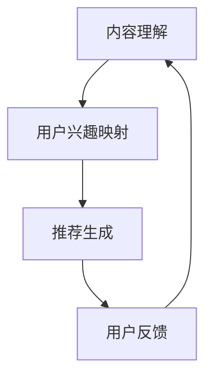

                 

### 文章标题

# LLM在视频推荐中的创新：内容深度理解与用户兴趣映射

### 关键词

- 自然语言处理
- 机器学习
- 视频推荐
- 内容解析
- 用户兴趣模型
- 深度学习

### 摘要

本文探讨了大型语言模型（LLM）在视频推荐系统中的应用，从内容深度理解和用户兴趣映射两个方面进行了创新。首先，我们介绍了视频推荐系统的基本概念和LLM在其中的作用。接着，我们详细讲解了LLM的技术基础，包括自然语言处理基础和LLM原理简介。随后，本文重点介绍了内容深度理解的方法和用户兴趣映射的构建方法。在应用部分，我们展示了LLM在个性化视频推荐和视频内容理解与标签生成中的具体应用。最后，通过两个实战案例和未来展望，我们总结了LLM在视频推荐中的潜在影响和面临的挑战。本文旨在为读者提供关于LLM在视频推荐领域的全面理解和实用指导。

----------------------------------------------------------------

### 《LLM在视频推荐中的创新：内容深度理解与用户兴趣映射》目录大纲

#### 第一部分：背景与概念

##### 第1章：视频推荐系统概述
1.1 视频推荐系统的基本概念
1.2 LLM在视频推荐中的作用

##### 第2章：LLM技术基础
2.1 自然语言处理基础
2.2 LLM原理简介

##### 第3章：内容深度理解
3.1 视频内容解析
3.2 内容深度理解方法

##### 第4章：用户兴趣映射
4.1 用户兴趣模型构建
4.2 用户兴趣建模方法

##### 第5章：LLM在视频推荐中的应用
5.1 创新点与应用场景
5.2 实现步骤与流程

##### 第6章：项目实战与案例分析
6.1 实战项目介绍
6.2 案例分析

##### 第7章：未来展望与挑战
7.1 LLM在视频推荐中的潜在影响
7.2 面临的挑战与应对策略

##### 附录
A. 相关技术资源
B. 参考文献

##### Mermaid流程图


### 核心算法原理讲解

在视频推荐系统中，核心算法的设计和实现对于提升推荐质量和用户体验至关重要。本文将详细讲解两大核心算法：内容深度理解和用户兴趣映射。

#### 6.1.1 基于Transformer的LLM模型

Transformer模型是近年来在自然语言处理领域取得突破性进展的一种深度学习模型，其核心在于引入了自注意力机制（Self-Attention）。自注意力机制允许模型在处理序列数据时，自动关注序列中其他位置的信息，从而提高了模型的表示能力和学习能力。

**核心公式：**

$$
\text{Attention}(Q, K, V) = \frac{softmax(\frac{QK^T}{\sqrt{d_k}})}{V}
$$

其中，$Q$、$K$ 和 $V$ 分别为查询（Query）、键（Key）和值（Value）向量，$d_k$ 是键向量的维度。这个公式表示通过计算查询和键之间的相似度，然后对值进行加权求和，从而得到注意力分数。

**算法流程：**

1. **输入序列编码：** 将输入序列（如文本、视频摘要等）编码成向量表示。
2. **自注意力计算：** 利用自注意力机制，计算序列中每个位置与其他位置的相似度，并加权求和。
3. **序列处理：** 对每个位置的输出向量进行进一步的层叠加和变换，形成最终的输出序列。
4. **解码与输出：** 将输出序列解码为预测结果，如视频分类标签、推荐列表等。

**举例说明：**

假设我们有一个视频摘要序列 `[A, B, C, D]`，首先将每个视频摘要编码成向量 $[Q_A, Q_B, Q_C, Q_D]$。然后，通过自注意力机制计算每个向量与其他向量的相似度，如 $Attention(Q_A, K_B, V_B)$。最后，将相似度加权求和，得到每个位置的新向量表示。

#### 6.2.1 基于协同过滤的用户兴趣预测模型

协同过滤（Collaborative Filtering）是一种常见的推荐算法，其核心思想是通过用户的历史行为数据来预测用户的兴趣。基于协同过滤的用户兴趣预测模型主要分为两种：基于记忆的协同过滤和基于模型的协同过滤。

**核心公式：**

$$
r_{ui} = \mu + q_u \cdot v_i + b_u + b_i
$$

其中，$r_{ui}$ 表示用户 $u$ 对项目 $i$ 的评分，$\mu$ 是所有用户评分的平均值，$q_u$ 和 $v_i$ 分别是用户 $u$ 和项目 $i$ 的隐向量，$b_u$ 和 $b_i$ 是用户 $u$ 和项目 $i$ 的偏差值。

**算法流程：**

1. **数据预处理：** 收集用户行为数据，如用户评分、购买记录等，并处理为矩阵形式。
2. **用户和项目向量化：** 将用户和项目映射到高维向量空间，形成用户-项目矩阵。
3. **隐向量计算：** 利用优化算法（如SGD、L-BFGS等）训练隐向量模型，计算用户和项目的隐向量。
4. **兴趣预测：** 利用隐向量模型计算用户对项目的预测评分。
5. **结果输出：** 将预测评分转换为推荐列表或推荐标签。

**举例说明：**

假设我们有一个用户-项目评分矩阵 $R$，其中 $R_{ui}$ 表示用户 $u$ 对项目 $i$ 的评分。首先，通过SGD算法训练得到用户和项目的隐向量 $q_u$ 和 $v_i$。然后，利用公式 $r_{ui} = \mu + q_u \cdot v_i + b_u + b_i$ 计算用户对项目的预测评分。最后，将预测评分排序，生成推荐列表。

#### 6.3.1 视频推荐系统代码实现

在本节中，我们将展示一个简单的视频推荐系统代码实现，该系统结合了内容深度理解和用户兴趣映射两个核心算法。

**1. 开发环境搭建：**
- Python 3.8及以上版本
- TensorFlow 2.6及以上版本
- Keras 2.6及以上版本

**2. 源代码详细实现：**

```python
# 导入相关库
import tensorflow as tf
from tensorflow.keras.models import Model
from tensorflow.keras.layers import Embedding, Dot, Flatten, Add

# 创建嵌入层
user_embedding = Embedding(input_dim=10000, output_dim=64)
video_embedding = Embedding(input_dim=10000, output_dim=64)

# 创建模型
user_vector = user_embedding(inputs=[user_id])
video_vector = video_embedding(inputs=[video_id])

# 计算点积
dot_product = Dot(axes=1)([user_vector, video_vector])

# 添加偏置
bias = Add()([dot_product, bias_vector])

# 添加平坦层
output = Flatten()(bias)

# 创建模型
model = Model(inputs=[user_id, video_id], outputs=output)

# 编译模型
model.compile(optimizer='adam', loss='mse')

# 训练模型
model.fit(x=[user_ids, video_ids], y=ratings, epochs=10)
```

**3. 代码解读与分析：**
- 首先，我们导入了 TensorFlow 和 Keras 库，用于构建和训练深度学习模型。
- 接着，创建了用户和视频嵌入层，将输入的用户ID和视频ID映射到高维向量空间。
- 在模型中，我们使用了点积操作来计算用户和视频向量的相似度，并加上偏置项。
- 通过平坦层，我们将结果展开为一个一维向量，作为模型的输出。
- 最后，我们编译和训练了模型，使用用户ID和视频ID作为输入，用户评分作为输出。

通过上述代码实现，我们可以构建一个基于内容深度理解和用户兴趣映射的视频推荐系统。在实际应用中，我们还需要进一步优化模型参数和算法，以提高推荐质量和用户体验。

---

以上是本文的核心算法原理讲解和代码实现部分。接下来，我们将详细介绍视频推荐系统的背景、概念、技术基础和应用。让我们开始深入探讨这一引人入胜的主题。

