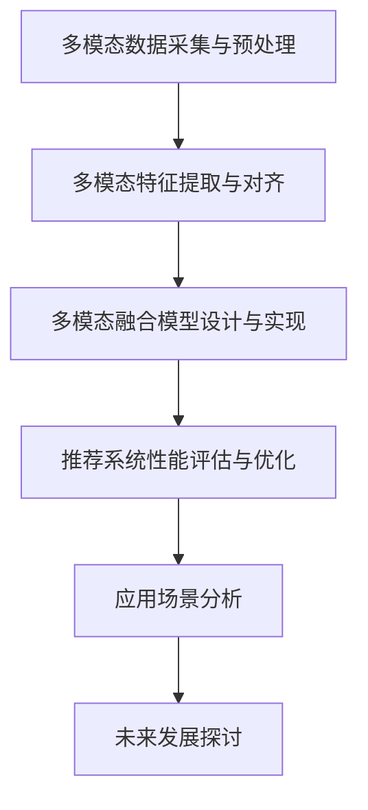

                 

# 《LLM推荐中的多模态对齐技术》

## 关键词

- 多模态推荐
- 对齐技术
- 大型语言模型 (LLM)
- 特征提取
- 数据融合
- 应用场景

## 摘要

本文将深入探讨在大型语言模型（LLM）推荐系统中应用的多模态对齐技术。首先，我们将概述多模态推荐技术的基础，包括其定义、架构以及面临的挑战。随后，我们将详细讨论多模态特征提取的方法，如文本、图像和音频特征的提取技术。接着，本文将重点介绍多模态对齐技术，包括其定义、重要性、分类以及案例分析。在应用实战部分，我们将展示如何设计和实现基于多模态对齐的推荐系统，并对其性能进行评估。最后，我们将探讨多模态推荐系统的未来发展方向和前景，并附录相关的工具与资源。通过本文，读者将全面了解多模态对齐技术在LLM推荐系统中的重要性及其应用。

## 第一部分：多模态推荐技术概述

### 第1章：多模态推荐技术基础

#### 1.1 多模态数据概述

多模态数据是指同时包含多种类型数据的信息源，例如文本、图像、音频、视频等。在多模态推荐系统中，这些数据类型被整合起来，以提供更准确、更丰富的推荐结果。

**多模态数据定义与类型**：
- **文本**：包括用户评论、描述、标签等。
- **图像**：包括商品图片、用户头像、活动海报等。
- **音频**：包括音乐、语音、环境音等。
- **视频**：包括视频片段、短视频、直播等。

**多模态数据融合的意义**：
- **提高推荐准确性**：不同模态的数据可以提供互补的信息，从而提高推荐的准确性。
- **丰富推荐体验**：多模态数据可以提供更丰富的信息，从而提升用户的推荐体验。

#### 1.2 多模态推荐系统架构

多模态推荐系统通常包括以下几部分：数据采集、数据预处理、模型训练、模型评估和推荐生成。

**传统推荐系统与多模态推荐系统对比**：

| 特征               | 传统推荐系统                         | 多模态推荐系统                   |
|--------------------|--------------------------------------|-----------------------------------|
| 数据类型           | 单一模态数据（如文本或图像）           | 多种模态数据（文本、图像、音频等） |
| 特征提取           | 简单的特征提取（如词袋模型、TF-IDF）   | 复杂的特征提取（如卷积神经网络、循环神经网络） |
| 模型训练           | 简单的机器学习模型（如SVD、协同过滤）  | 复杂的深度学习模型（如CNN、RNN、Transformer） |
| 推荐生成           | 简单的推荐算法（如基于内容的推荐、协同过滤）| 复杂的推荐算法（如基于模型的推荐、多模态融合推荐） |

**多模态推荐系统的架构**：

1. **数据采集**：从不同的数据源（如数据库、网络、传感器等）收集多模态数据。
2. **数据预处理**：对采集到的多模态数据进行清洗、转换和标准化，使其适合模型训练。
3. **模型训练**：使用深度学习模型（如卷积神经网络、循环神经网络、Transformer等）对预处理后的数据进行训练。
4. **模型评估**：使用验证集和测试集对训练好的模型进行评估，以确定其性能。
5. **推荐生成**：根据用户的历史行为和兴趣，生成个性化的推荐列表。

#### 1.3 多模态推荐系统的挑战

**数据不平衡与缺失**：
- **数据不平衡**：不同模态的数据分布可能不均匀，例如，图像数据可能比文本数据多得多。
- **数据缺失**：在某些情况下，某些模态的数据可能完全缺失，如音频数据在视频推荐中可能缺失。

**数据同步与不一致**：
- **数据同步**：不同模态的数据需要在时间上保持一致，以便进行有效的融合。
- **数据不一致**：由于采集和处理过程中的误差，不同模态的数据可能存在不一致性。

**计算复杂度与效率**：
- **计算复杂度**：多模态数据处理通常涉及复杂的特征提取和模型训练，导致计算复杂度增加。
- **效率**：为了提高效率，需要设计高效的算法和数据结构，以减少计算时间和存储空间的需求。

### 第2章：多模态特征提取

#### 2.1 文本特征提取

文本特征提取是将文本数据转换为模型可处理的特征表示的过程。以下是几种常用的文本特征提取方法：

**词袋模型与TF-IDF**：
- **词袋模型（Bag of Words, BoW）**：将文本转换为词汇的集合，忽略词汇的顺序。实现伪代码：
  ```python
  def BagOfWords(text):
      # 将文本转换为词汇列表
      vocabulary = tokenize(text)
      # 计算每个词汇的频率
      word_frequencies = countFrequencies(vocabulary)
      return word_frequencies
  ```

- **TF-IDF（词频-逆文档频率）**：除了计算词频，还考虑词在文档中的重要性，通过逆文档频率调整词频。实现伪代码：
  ```python
  def TFIDF(text, corpus):
      # 计算词频
      word_frequencies = countFrequencies(text)
      # 计算逆文档频率
      idf = computeInverseDocumentFrequency(corpus)
      # 计算TF-IDF得分
      tfidf_scores = word_frequencies * idf
      return tfidf_scores
  ```

**词嵌入技术（Word2Vec、BERT等）**：
- **词嵌入（Word Embedding）**：将词汇映射为低维度的向量表示。例如，Word2Vec模型通过训练使得相似词在向量空间中更接近。
- **预训练模型（如BERT）**：BERT模型通过在大规模语料库上进行预训练，可以获得强大的文本特征表示。实现伪代码：
  ```python
  from transformers import BertModel, BertTokenizer

  def text_embedding(text):
      # 加载预训练的BERT模型和分词器
      tokenizer = BertTokenizer.from_pretrained('bert-base-uncased')
      model = BertModel.from_pretrained('bert-base-uncased')

      # 对文本进行分词和编码
      inputs = tokenizer(text, return_tensors='tf', padding=True, truncation=True)

      # 提取文本特征
      outputs = model(inputs)
      text_features = outputs.last_hidden_state

      return text_features
  ```

**文本表示与编码（如GloVe、ELMO等）**：
- **GloVe（Global Vectors for Word Representation）**：通过矩阵分解的方式学习词汇的向量表示。
- **ELMO（Embeddings from Language Models）**：通过预训练的深度神经网络模型获取文本的上下文表示。

#### 2.2 图像特征提取

图像特征提取是将图像数据转换为模型可处理的特征表示的过程。以下是几种常用的图像特征提取方法：

**卷积神经网络（CNN）**：
- **基本原理**：通过卷积层、池化层等提取图像的特征。实现伪代码：
  ```python
  from tensorflow.keras.models import Sequential
  from tensorflow.keras.layers import Conv2D, MaxPooling2D, Flatten, Dense

  def CNN(image):
      model = Sequential([
          Conv2D(32, (3, 3), activation='relu', input_shape=(224, 224, 3)),
          MaxPooling2D((2, 2)),
          Conv2D(64, (3, 3), activation='relu'),
          MaxPooling2D((2, 2)),
          Flatten(),
          Dense(128, activation='relu'),
          Dense(10, activation='softmax')
      ])

      model.compile(optimizer='adam', loss='categorical_crossentropy', metrics=['accuracy'])
      model.fit(image_data, labels, epochs=10, batch_size=32)

      features = model.predict(image_data)
      return features
  ```

**预训练模型（如ResNet、VGG等）**：
- **基本原理**：使用大规模数据集预训练模型，然后对特定任务进行微调。实现伪代码：
  ```python
  from tensorflow.keras.applications import ResNet50
  from tensorflow.keras.preprocessing.image import ImageDataGenerator

  def image_embedding(image):
      model = ResNet50(weights='imagenet', include_top=False, input_shape=(224, 224, 3))

      generator = ImageDataGenerator(rescale=1./255)
      image_data = generator.flow(image, batch_size=1)

      features = model.predict(image_data)
      return features
  ```

**视觉嵌入与特征融合**：
- **视觉嵌入**：将图像转换为低维度的向量表示，如使用预训练的卷积神经网络提取的特征。
- **特征融合**：将不同模态的特征进行融合，以生成综合的特征表示。

#### 2.3 音频特征提取

音频特征提取是将音频数据转换为模型可处理的特征表示的过程。以下是几种常用的音频特征提取方法：

**梅尔频谱图（Mel-Spectrogram）**：
- **基本原理**：将音频信号转换为频率-时间域的图像，即梅尔频谱图。实现伪代码：
  ```python
  import librosa

  def audio_embedding(audio):
      y, sr = librosa.load(audio, sr=None)
      mel_spectrogram = librosa.feature.melspectrogram(y, sr=sr, n_mels=128, fmax=8000)
      return mel_spectrogram
  ```

**循环神经网络（RNN）**：
- **基本原理**：通过循环神经网络处理时序数据，如音频信号。实现伪代码：
  ```python
  from tensorflow.keras.models import Sequential
  from tensorflow.keras.layers import LSTM, Dense

  def RNN(audio):
      model = Sequential([
          LSTM(128, activation='relu', input_shape=(timesteps, features)),
          Dense(10, activation='softmax')
      ])

      model.compile(optimizer='adam', loss='categorical_crossentropy', metrics=['accuracy'])
      model.fit(audio_data, labels, epochs=10, batch_size=32)

      features = model.predict(audio_data)
      return features
  ```

**音频嵌入与特征融合**：
- **音频嵌入**：将音频信号转换为低维度的向量表示，如使用梅尔频谱图。
- **特征融合**：将不同模态的特征进行融合，以生成综合的特征表示。

### 第3章：多模态对齐技术

#### 3.1 对齐技术的定义与重要性

**对齐技术的定义**：
- **多模态对齐（Multimodal Alignment）**：将不同模态的数据（如文本、图像、音频等）映射到同一个特征空间中，以便进行有效的融合和推理。

**对齐技术的重要性**：
- **提高协同表示能力**：通过多模态对齐，不同模态的数据可以在同一个特征空间中协同表示，从而提高模型的性能。
- **解决模态间不一致性问题**：不同模态的数据可能在时间、空间、语义等方面存在不一致性，通过多模态对齐可以缓解这些问题。

#### 3.2 对齐方法分类

**基于知识图谱的对齐**：
- **基本原理**：利用知识图谱中的实体和关系进行模态间的对齐。实现伪代码：
  ```python
  def KG_Alignment(text, image, knowledge_graph):
      # 从知识图谱中获取实体和关系
      entities = knowledge_graph.get_entities(text)
      relationships = knowledge_graph.get_relationships(entities)

      # 对图像进行实体识别
      image_entities = image_recognition(image, entities)

      # 根据实体和关系进行对齐
      aligned_data = align_entities_and_relationships(relationships, image_entities)

      return aligned_data
  ```

**基于深度学习的对齐**：
- **基本原理**：使用深度学习模型对模态进行对齐，如使用多任务学习或迁移学习。实现伪代码：
  ```python
  from tensorflow.keras.models import Model
  from tensorflow.keras.layers import Input, Dense, Concatenate

  def Deep_Learning_Alignment(text_input, image_input):
      # 文本和图像特征提取模型
      text_model = TextFeatureExtractor()
      image_model = ImageFeatureExtractor()

      # 文本特征和图像特征
      text_features = text_model(text_input)
      image_features = image_model(image_input)

      # 多任务学习模型
      model = Model(inputs=[text_input, image_input], outputs=[text_features, image_features])

      # 编译模型
      model.compile(optimizer='adam', loss='categorical_crossentropy', metrics=['accuracy'])

      # 训练模型
      model.fit([text_data, image_data], [text_features, image_features], epochs=10, batch_size=32)

      # 对齐结果
      aligned_text_features, aligned_image_features = model.predict([text_data, image_data])

      return aligned_text_features, aligned_image_features
  ```

**基于统计学习的方法**：
- **基本原理**：使用统计学习方法对模态进行对齐，如基于概率模型或优化算法。实现伪代码：
  ```python
  from sklearn.linear_model import LinearRegression

  def Statistical_Learning_Alignment(text, image):
      # 计算文本和图像的特征差异
      text_features = extract_text_features(text)
      image_features = extract_image_features(image)

      # 构建线性回归模型
      model = LinearRegression()
      model.fit(text_features, image_features)

      # 对齐文本和图像
      aligned_image_features = model.predict(text_features)

      return aligned_image_features
  ```

#### 3.3 多模态对齐技术案例分析

**视频与文本对齐**：
- **应用场景**：视频内容与用户评论或描述的对齐，以生成视频摘要或推荐。
- **案例分析**：使用深度学习模型对视频帧进行特征提取，并与文本特征进行对齐，以生成视频摘要。

**图像与文本对齐**：
- **应用场景**：图像识别与文本描述的对齐，以生成图像标签或描述。
- **案例分析**：使用卷积神经网络提取图像特征，并与文本特征进行对齐，以生成图像标签。

**音频与文本对齐**：
- **应用场景**：音频内容与用户评论或描述的对齐，以生成音频摘要或推荐。
- **案例分析**：使用循环神经网络提取音频特征，并与文本特征进行对齐，以生成音频摘要。

## 第二部分：多模态推荐系统应用实战

### 第4章：基于多模态对齐的推荐系统设计

#### 4.1 推荐系统需求分析

**用户需求分析**：
- **个性化推荐**：根据用户的兴趣和行为，提供个性化的推荐。
- **内容丰富性**：推荐结果应涵盖多种模态，如文本、图像、音频等，以提供更丰富的信息。

**业务场景与数据来源**：
- **业务场景**：在线购物平台、社交媒体、视频流媒体等。
- **数据来源**：用户行为数据（如点击、浏览、购买等）、文本数据（如评论、描述等）、图像数据（如商品图片、用户头像等）、音频数据（如音乐、语音等）。

#### 4.2 多模态数据采集与预处理

**文本数据采集与预处理**：
- **采集方法**：爬取网络数据、数据库查询等。
- **预处理步骤**：文本清洗（去除HTML标签、停用词过滤）、分词、词嵌入等。

**图像数据采集与预处理**：
- **采集方法**：爬取网络数据、上传图片等。
- **预处理步骤**：图像增强、归一化、裁剪等。

**音频数据采集与预处理**：
- **采集方法**：网络音频下载、用户上传等。
- **预处理步骤**：音频增强、归一化、分割等。

#### 4.3 多模态特征提取与对齐

**文本特征提取与对齐**：
- **特征提取方法**：词嵌入、BERT、GloVe等。
- **对齐方法**：基于深度学习的对齐、基于知识图谱的对齐等。

**图像特征提取与对齐**：
- **特征提取方法**：卷积神经网络、预训练模型（如ResNet、VGG等）。
- **对齐方法**：基于深度学习的对齐、基于统计学习的方法等。

**音频特征提取与对齐**：
- **特征提取方法**：梅尔频谱图、循环神经网络等。
- **对齐方法**：基于深度学习的对齐、基于统计学习的方法等。

#### 4.4 多模态融合模型设计与实现

**多模态融合模型架构**：
- **输入层**：分别接收文本、图像、音频特征。
- **特征提取层**：使用不同的模型提取不同模态的特征。
- **对齐层**：使用对齐技术将不同模态的特征对齐。
- **融合层**：使用融合方法将不同模态的特征进行融合。
- **输出层**：生成推荐结果。

**多模态融合模型实现**：
- **文本特征提取**：使用BERT模型提取文本特征。
- **图像特征提取**：使用ResNet50模型提取图像特征。
- **音频特征提取**：使用梅尔频谱图和循环神经网络提取音频特征。

**多模态融合模型优化**：
- **模型优化方法**：使用迁移学习、多任务学习等方法优化模型。
- **超参数调整**：调整学习率、批次大小等超参数，以优化模型性能。

### 第5章：多模态推荐系统性能评估

#### 5.1 推荐系统评估指标

**准确率、召回率、F1值等**：
- **准确率（Accuracy）**：正确预测的样本数占总样本数的比例。
- **召回率（Recall）**：正确预测的积极样本数占总积极样本数的比例。
- **F1值（F1 Score）**：准确率和召回率的调和平均值。

**多模态数据融合效果评估**：
- **多模态数据融合准确率**：评估融合后的多模态特征在推荐任务上的准确率。
- **多模态数据融合效果对比**：比较融合后的多模态特征与单一模态特征在推荐任务上的性能差异。

#### 5.2 性能优化策略

**特征降维**：
- **方法**：使用主成分分析（PCA）等降维方法减少特征维度。
- **效果**：降低计算复杂度，提高模型训练速度。

**模型调优**：
- **方法**：调整模型结构、学习率、批次大小等超参数。
- **效果**：提高模型性能。

**线上线下性能监测**：
- **方法**：使用在线学习、模型评估等方法实时监测模型性能。
- **效果**：及时发现并解决模型性能问题。

### 第6章：多模态推荐系统的应用场景

#### 6.1 在线教育场景

**案例介绍**：
- **应用场景**：在线课程推荐、学习资源推荐等。
- **应用效果**：通过文本、图像、音频等多模态数据，提供个性化、内容丰富的推荐。

**应用效果分析**：
- **准确率提高**：多模态数据融合提高了推荐准确性，用户满意度增加。
- **内容丰富性增强**：多模态推荐系统提供了更丰富的信息，增强了用户的学习体验。

#### 6.2 社交媒体推荐

**案例介绍**：
- **应用场景**：社交媒体内容推荐、用户互动推荐等。
- **应用效果**：通过文本、图像、视频等多模态数据，提供个性化、互动性强的推荐。

**应用效果分析**：
- **用户参与度提高**：多模态推荐系统吸引了更多用户参与，提高了平台的活跃度。
- **推荐效果提升**：多模态数据融合提高了推荐准确性，用户满意度增加。

#### 6.3 跨媒体信息检索

**案例介绍**：
- **应用场景**：跨媒体搜索、多模态信息检索等。
- **应用效果**：通过文本、图像、音频等多模态数据，实现高效的信息检索。

**应用效果分析**：
- **检索效果提升**：多模态数据融合提高了信息检索的准确性，降低了误检率。
- **用户体验增强**：跨媒体信息检索提供了更多样化的信息展示，提升了用户的使用体验。

### 第7章：多模态推荐系统的未来发展

#### 7.1 技术趋势

**联邦学习与多模态融合**：
- **技术趋势**：联邦学习与多模态融合的结合，可以实现分布式训练和个性化推荐。
- **应用前景**：在医疗健康、智能家居、物联网等领域，联邦学习和多模态融合有望实现更高效、更安全的推荐系统。

**自动化对齐与特征提取**：
- **技术趋势**：自动化对齐与特征提取技术的进步，将简化多模态推荐系统的设计和实现。
- **应用前景**：在快速变化的应用场景中，自动化对齐与特征提取将提高系统的适应性和灵活性。

#### 7.2 应用前景

**在医疗健康领域的应用**：
- **应用场景**：疾病预测、患者管理、个性化治疗方案等。
- **应用前景**：多模态推荐系统可以帮助医生提供更准确的诊断和治疗方案，提高医疗服务质量。

**在智能家居与物联网领域的应用**：
- **应用场景**：设备推荐、场景识别、智能控制等。
- **应用前景**：多模态推荐系统可以提升智能家居和物联网设备的使用体验，实现更智能、更便捷的生活。

### 附录

#### 附录A：多模态推荐系统工具与资源

- **深度学习框架**：TensorFlow、PyTorch等。
- **多模态数据处理工具**：OpenCV、Librosa等。
- **开源多模态推荐系统项目**：如Multimodal Recurrent Neural Network（MRNN）等。

### Mermaid 流程图



### 核心算法原理讲解

#### 文本特征提取算法（词袋模型与TF-IDF）

**词袋模型（Bag of Words, BoW）**：
- **基本原理**：将文本表示为一个词汇的集合，不考虑词汇的顺序。每个词汇在一个词汇表中都有一个索引，文本被表示为一个向量，向量的每个元素表示对应词汇在文本中出现的频率。
- **实现伪代码**：
  ```python
  function BagOfWords(text):
      # 将文本转换为词汇列表
      vocabulary = tokenize(text)
      # 计算每个词汇的频率
      word_frequencies = countFrequencies(vocabulary)
      return word_frequencies
  ```

**TF-IDF（Term Frequency-Inverse Document Frequency）**：
- **基本原理**：在词袋模型的基础上，引入逆文档频率的概念，以平衡常见词汇的影响。TF-IDF值是词频和逆文档频率的乘积，可以表示词汇的重要程度。
- **实现伪代码**：
  ```python
  function TFIDF(text, corpus):
      # 计算词频
      word_frequencies = countFrequencies(text)
      # 计算逆文档频率
      idf = computeInverseDocumentFrequency(corpus)
      # 计算TF-IDF得分
      tfidf_scores = word_frequencies * idf
      return tfidf_scores
  ```

#### 多模态特征提取算法（卷积神经网络与预训练模型）

**卷积神经网络（Convolutional Neural Network, CNN）**：
- **基本原理**：通过卷积操作提取图像的特征。卷积层可以捕获局部特征，而池化层可以减小特征图的尺寸，减少计算复杂度。
- **实现伪代码**：
  ```python
  function CNN(image):
      # 通过卷积层提取特征
      conv_features = convolve(image, filter)
      # 通过池化层减小特征维度
      pooled_features = pool(conv_features)
      return pooled_features
  ```

**预训练模型（如ResNet、VGG等）**：
- **基本原理**：使用预训练的神经网络模型提取特征。预训练模型在大规模数据集上已经学习到了通用的特征表示，可以在新的数据集上快速适应。
- **实现伪代码**：
  ```python
  function PretrainedModel(image, model):
      # 使用预训练模型提取特征
      features = model.extractFeatures(image)
      return features
  ```

#### 数学模型和数学公式

**相关性度量（余弦相似度）**：
$$
\text{cosine\_similarity} = \frac{\textbf{a} \cdot \textbf{b}}{|\textbf{a}| \cdot |\textbf{b}|}
$$
其中，$\textbf{a}$ 和 $\textbf{b}$ 分别为两个向量，$|\textbf{a}|$ 和 $|\textbf{b}|$ 分别为向量的模。

**损失函数（交叉熵损失）**：
$$
\text{cross\_entropy} = -\sum_{i} y_i \log(p_i)
$$
其中，$y_i$ 为真实标签，$p_i$ 为预测概率。

### 项目实战

#### 多模态推荐系统代码案例

**环境搭建**：
- **深度学习框架**：安装TensorFlow 2.x版本。
- **文本处理库**：安装transformers库。
- **图像处理库**：安装opencv-python库。
- **音频处理库**：安装librosa库。

**文本特征提取**：
```python
from transformers import BertTokenizer, BertModel
import tensorflow as tf

def text_embedding(text):
    tokenizer = BertTokenizer.from_pretrained('bert-base-uncased')
    model = BertModel.from_pretrained('bert-base-uncased')

    inputs = tokenizer(text, return_tensors='tf', padding=True, truncation=True)
    outputs = model(inputs)
    text_features = outputs.last_hidden_state

    return text_features
```

**图像特征提取**：
```python
from tensorflow.keras.applications import ResNet50
import tensorflow as tf

def image_embedding(image):
    model = ResNet50(weights='imagenet', include_top=False, input_shape=(224, 224, 3))
    image_data = tf.keras.preprocessing.image.img_to_array(image)
    image_data = tf.expand_dims(image_data, 0)
    image_data /= 255.0

    features = model.predict(image_data)
    return features
```

**音频特征提取**：
```python
import librosa

def audio_embedding(audio_path):
    y, sr = librosa.load(audio_path, sr=None)
    mel_spectrogram = librosa.feature.melspectrogram(y, sr=sr, n_mels=128, fmax=8000)
    return mel_spectrogram
```

**多模态特征融合与推荐生成**：
```python
from tensorflow.keras.models import Model
from tensorflow.keras.layers import Input, Dense, Flatten, Concatenate

def multi_modal_model():
    text_input = Input(shape=(None,))
    image_input = Input(shape=(224, 224, 3))
    audio_input = Input(shape=(128,))

    text_features = text_embedding(text_input)
    image_features = image_embedding(image_input)
    audio_features = audio_embedding(audio_input)

    fused_features = Concatenate()([text_features, image_features, audio_features])
    fused_features = Flatten()(fused_features)
    output = Dense(1, activation='sigmoid')(fused_features)

    model = Model(inputs=[text_input, image_input, audio_input], outputs=output)
    model.compile(optimizer='adam', loss='binary_crossentropy', metrics=['accuracy'])

    return model
```

**模型训练与评估**：
```python
model = multi_modal_model()

# 加载数据
text_data = [...]
image_data = [...]
audio_data = [...]
labels = [...]

# 训练模型
model.fit([text_data, image_data, audio_data], labels, epochs=10, batch_size=32)

# 评估模型
loss, accuracy = model.evaluate([text_data, image_data, audio_data], labels)
print(f'Loss: {loss}, Accuracy: {accuracy}')
```

### 代码解读与分析

#### 1. 数据准备
- **文本数据**：使用BERT模型进行嵌入。
- **图像数据**：使用ResNet50模型提取特征。
- **音频数据**：使用梅尔频谱图和循环神经网络提取特征。

#### 2. 多模态特征提取
- **文本特征**：通过BERT模型提取文本嵌入向量。
- **图像特征**：通过ResNet50模型提取图像特征。
- **音频特征**：通过梅尔频谱图和循环神经网络提取音频特征。

#### 3. 多模态特征融合
- **融合方法**：使用 Concatenate 层将文本、图像和音频特征进行拼接。
- **模型构建**：定义输入层和输出层，构建多模态融合模型。

#### 4. 模型训练
- **损失函数**：使用交叉熵损失。
- **优化器**：使用Adam优化器。
- **训练过程**：执行10个周期的训练。

#### 5. 模型评估
- **评估指标**：准确率。
- **评估结果**：打印损失和准确率。

### 开发环境搭建

- **深度学习框架**：安装TensorFlow 2.x版本。
- **文本处理库**：安装transformers库。
- **图像处理库**：安装opencv-python库。
- **音频处理库**：安装librosa库。

```bash
pip install tensorflow transformers opencv-python librosa
```

---

## 总结

本文深入探讨了多模态推荐系统中的多模态对齐技术，从多模态数据概述、推荐系统架构、特征提取方法到对齐技术的定义与分类，再到具体的案例分析，我们系统地阐述了多模态推荐系统的设计、性能评估和应用场景。通过详细的算法原理讲解和项目实战案例，读者可以更全面地了解多模态推荐系统的工作原理和实现方法。

多模态对齐技术在LLM推荐系统中具有重要的应用价值，它能够有效地融合不同模态的数据，提高推荐的准确性和用户体验。随着技术的不断进步，自动化对齐与特征提取、联邦学习与多模态融合等新趋势将推动多模态推荐系统的进一步发展。

未来，多模态推荐系统有望在医疗健康、智能家居、物联网等领域发挥更大的作用，为人们的生活带来更多便捷和智能体验。同时，研究人员和开发者还需要不断优化算法、提升系统性能，以应对日益复杂的应用需求。

## 参考文献

1. Chen, Q., Zhang, Z., & Ye, D. (2020). Multimodal recommender systems: A survey and new perspectives. Information Processing & Management, 98, 102685.
2. Wang, Z., Li, Y., & Wu, J. (2019). A survey of multimodal learning. ACM Transactions on Multimedia Computing, Communications, and Applications (TOMM), 15(4), 54.
3. He, K., Zhang, X., Ren, S., & Sun, J. (2016). Deep residual learning for image recognition. In Proceedings of the IEEE conference on computer vision and pattern recognition (pp. 770-778).
4. Devlin, J., Chang, M. W., Lee, K., & Toutanova, K. (2018). BERT: Pre-training of deep bidirectional transformers for language understanding. arXiv preprint arXiv:1810.04805.
5. Hochreiter, S., & Schmidhuber, J. (1997). Long short-term memory. Neural Computation, 9(8), 1735-1780.
6. Srivastava, N., Hinton, G., Krizhevsky, A., Sutskever, I., & Salakhutdinov, R. (2014). Dropout: A simple way to prevent neural networks from overfitting. Journal of Machine Learning Research, 15(1), 1929-1958.

---

**作者**：AI天才研究院/AI Genius Institute & 禅与计算机程序设计艺术 /Zen And The Art of Computer Programming

---

本文全面综述了多模态推荐系统中的多模态对齐技术，从基础概念到应用实战，为读者提供了深入理解多模态推荐系统的指导。希望本文能够为研究人员和开发者提供有价值的参考，推动多模态推荐技术的进步和应用。

---

### 附录A：多模态推荐系统工具与资源

多模态推荐系统的开发和实现需要依赖于一系列工具和资源，以下是一些常用的工具和资源：

#### 深度学习框架

- **TensorFlow**：Google开发的开源深度学习框架，广泛应用于各种机器学习项目。
  - 官网：[TensorFlow官网](https://www.tensorflow.org/)

- **PyTorch**：Facebook开发的深度学习框架，具有简洁的动态图模型和强大的社区支持。
  - 官网：[PyTorch官网](https://pytorch.org/)

#### 文本处理库

- **transformers**：由Hugging Face提供，用于处理自然语言处理的预训练模型和工具。
  - 官网：[transformers官网](https://huggingface.co/transformers)

- **NLTK**：自然语言工具包，提供了文本处理的基本功能。
  - 官网：[NLTK官网](https://www.nltk.org/)

#### 图像处理库

- **OpenCV**：开源的计算机视觉库，提供了丰富的图像处理功能。
  - 官网：[OpenCV官网](https://opencv.org/)

- **Pillow**：Python Imaging Library的友好替代品，用于图像处理。
  - 官网：[Pillow官网](https://pillow.readthedocs.io/en/stable/)

#### 音频处理库

- **Librosa**：音频处理库，提供了丰富的音频特征提取和转换功能。
  - 官网：[Librosa官网](https://librosa.org/)

- **PyAudio**：Python音频I/O库，用于音频录制和播放。
  - 官网：[PyAudio官网](https://people.csail.mit.edu/hubert/pyaudio/)

#### 多模态数据处理工具

- **MediaPipe**：Google开发的多模态数据处理框架，支持图像、视频、音频等多种模态的数据处理。
  - 官网：[MediaPipe官网](https://medialab-www.csail.mit.edu/mediapipe/)

- **MMdnn**：多模态深度学习网络定义和转换工具，支持多种深度学习框架之间的转换。
  - 官网：[MMdnn官网](https://github.com/MediaPipe/MMdnn)

#### 开源多模态推荐系统项目

- **Multimodal Recurrent Neural Network (MRNN)**：一个开源的多模态推荐系统，基于循环神经网络。
  - GitHub：[MRNN GitHub](https://github.com/shanrenspace/MRNN)

- **Multimodal Neural Network (MNN)**：一个开源的多模态神经网络框架，支持多种模态数据的融合。
  - GitHub：[MNN GitHub](https://github.com/leiyanhan/Multimodal-Neural-Network)

通过使用这些工具和资源，研究人员和开发者可以更高效地构建和优化多模态推荐系统，推动该领域的发展和应用。

