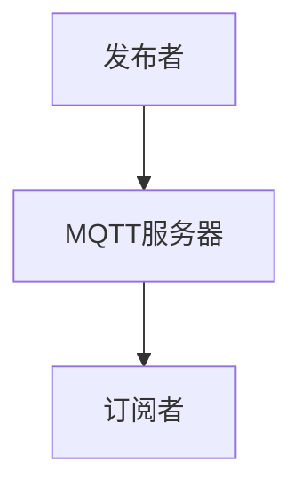
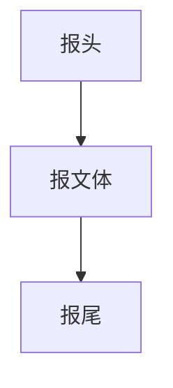
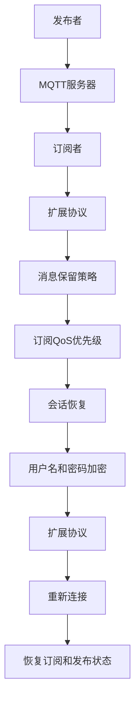
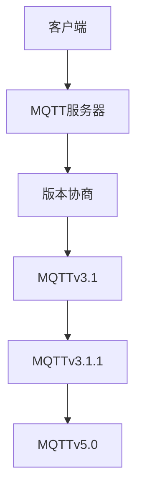

                 

# MQTT协议：轻量级物联网消息传输标准

## 概述

> **关键词：** MQTT协议、物联网、消息传输、轻量级、实时性、可靠性

**摘要：** 本文章旨在全面剖析MQTT（Message Queuing Telemetry Transport）协议，一种专为物联网（IoT）设计的轻量级消息传输协议。我们将从MQTT协议的历史背景、核心概念、核心技术、实战应用以及开发实战等多个角度进行深入探讨，帮助读者了解MQTT协议的工作原理、优势与挑战，并掌握其实际应用开发的方法。

### 《MQTT协议：轻量级物联网消息传输标准》目录大纲

1. **第一部分: MQTT协议概述**
   1.1 MQTT协议的历史与发展
      1.1.1 MQTT协议的诞生背景
      1.1.2 MQTT协议的演变历程
      1.1.3 MQTT协议的重要地位
   1.2 MQTT协议的核心概念
      1.2.1 MQTT协议架构
         1.2.1.1 MQTT协议的工作模式
         1.2.1.2 MQTT协议的关键角色
      1.2.2 MQTT协议的主要特性
         1.2.2.1 轻量级
         1.2.2.2 实时性
         1.2.2.3 可靠传输
      1.2.3 MQTT协议的应用场景
         1.2.3.1 物联网应用
         1.2.3.2 家居自动化
         1.2.3.3 智能交通
   1.3 MQTT协议的优势与挑战
      1.3.1 MQTT协议的优势
         1.3.1.1 节省带宽
         1.3.1.2 易于部署
         1.3.1.3 高度可扩展性
      1.3.2 MQTT协议的挑战
         1.3.2.1 安全性问题
         1.3.2.2 跨平台兼容性
         1.3.2.3 性能优化

2. **第二部分: MQTT协议核心技术**
   2.1 MQTT协议的基础架构
      2.1.1 MQTT协议的消息传输流程
         2.1.1.1 订阅与发布
         2.1.1.2 连接与断开
      2.1.2 MQTT协议的报文格式
         2.1.2.1 CONNECT报文
         2.1.2.2 PUBLISH报文
         2.1.2.3 SUBSCRIBE报文
   2.2 MQTT协议的核心算法
      2.2.1 MQTT协议的客户端认证
         2.2.1.1 认证方式
         2.2.1.2 安全性分析
      2.2.2 MQTT协议的QoS服务质量
         2.2.2.1 QoS级别
         2.2.2.2 QoS的实现原理
      2.2.3 MQTT协议的传输优化
         2.2.3.1 心跳机制
         2.2.3.2 数据压缩
   2.3 MQTT协议的扩展机制
      2.3.1 MQTT协议的扩展性设计
         2.3.1.1 扩展协议的规范
         2.3.1.2 扩展协议的应用场景
      2.3.2 MQTT协议的版本兼容性
         2.3.2.1 MQTT协议的版本差异
         2.3.2.2 MQTT协议的版本迁移

3. **第三部分: MQTT协议实战应用**
   3.1 MQTT协议在物联网中的应用
      3.1.1 物联网架构与MQTT协议的结合
         3.1.1.1 硬件设备接入
         3.1.1.2 系统架构设计
      3.1.2 MQTT协议在物联网设备中的应用案例
         3.1.2.1 智能家居
         3.1.2.2 车联网
         3.1.2.3 工业物联网
   3.2 MQTT协议在实时数据传输中的应用
      3.2.1 MQTT协议在实时数据传输中的优势
         3.2.1.1 实时性
         3.2.1.2 可靠性
      3.2.2 MQTT协议在实时数据传输中的应用案例
         3.2.2.1 股票交易系统
         3.2.2.2 实时监控与预警
         3.2.2.3 移动应用推送
   3.3 MQTT协议在智能家居中的应用
      3.3.1 智能家居的架构与通信需求
         3.3.1.1 智能家居设备分类
         3.3.1.2 智能家居通信协议分析
      3.3.2 MQTT协议在智能家居中的应用案例
         3.3.2.1 智能灯光控制系统
         3.3.2.2 智能安防系统
         3.3.2.3 智能家电控制系统

4. **第四部分: MQTT协议开发实战**
   4.1 MQTT协议开发环境搭建
      4.1.1 开发环境配置
         4.1.1.1 操作系统环境
         4.1.1.2 开发工具与库
      4.1.2 MQTT协议客户端搭建
         4.1.2.1 MQTT客户端的选择
         4.1.2.2 MQTT客户端的开发流程
   4.2 MQTT协议客户端代码实现
      4.2.1 MQTT客户端连接与订阅
         4.2.1.1 MQTT客户端连接流程
         4.2.1.2 MQTT客户端订阅主题
      4.2.2 MQTT客户端发布消息
         4.2.2.1 MQTT客户端发布流程
         4.2.2.2 MQTT客户端发布消息的格式
      4.2.3 MQTT协议客户端断开连接
         4.2.3.1 MQTT客户端断开连接流程
         4.2.3.2 MQTT客户端断开连接时的注意事项

5. **附录**
   5.1 MQTT协议参考资源
      5.1.1 MQTT协议官方文档
      5.1.2 MQTT协议开源项目
      5.1.3 MQTT协议技术论坛与社群
   5.2 MQTT协议相关技术标准
      5.2.1 MQTT协议与CoAP协议对比
      5.2.2 MQTT协议与HTTP协议对比
      5.2.3 MQTT协议与其他物联网通信协议对比

接下来，我们将逐步深入探讨MQTT协议的各个部分，以帮助读者全面理解并掌握这一重要的物联网通信标准。

## 第一部分: MQTT协议概述

### 1.1 MQTT协议的历史与发展

#### 1.1.1 MQTT协议的诞生背景

MQTT协议的诞生可以追溯到1999年，当时IBM的研究员Arshdeep Bahga和Andy Stanford-Clark正致力于寻找一种能够用于远程监控设备的轻量级通信协议。他们需要一个协议，可以在资源受限的环境下（如传感器节点和嵌入式设备）高效地传输数据，同时保证数据的可靠性和实时性。

在这个背景下，他们设计了MQTT协议，这个名称来源于“Message Queuing Telemetry Transport”，其中“Message Queuing”指的是消息队列机制，“Telemetry”指的是远程监控，“Transport”指的是传输。MQTT协议的目标是提供一种简单、高效、可靠的消息传输方式，特别适合于低带宽、不可靠的无线网络环境。

#### 1.1.2 MQTT协议的演变历程

自1999年MQTT协议诞生以来，它已经经历了多次重要的更新和优化。以下是一些关键的发展历程：

- **MQTTv3.1（2009年）**：这是第一个正式发布的MQTT协议版本。MQTTv3.1引入了多个QoS（服务质量）级别，改进了连接管理，并增加了支持用户名和密码的认证机制。

- **MQTTv3.1.1（2010年）**：MQTTv3.1.1是对MQTTv3.1的微小修正，主要解决了一些小错误和增强了协议的兼容性。

- **MQTTv5.0（2019年）**：MQTTv5.0是MQTT协议的又一次重要更新。它引入了丰富的扩展机制，如消息保留策略、订阅QoS优先级、用户名和密码加密等。此外，MQTTv5.0还改进了协议的可靠性和安全性。

#### 1.1.3 MQTT协议的重要地位

MQTT协议在物联网领域占据了极其重要的地位，原因如下：

- **轻量级**：MQTT协议设计简单，数据格式紧凑，非常适合资源受限的设备。这使得MQTT协议在物联网设备中得到了广泛的应用。

- **高效**：MQTT协议支持多种QoS级别，可以满足不同场景下的实时性和可靠性需求。同时，MQTT协议的心跳机制和数据压缩技术，使得协议在低带宽环境中仍然能够高效工作。

- **可靠性**：MQTT协议设计了断线重连、消息确认等机制，确保消息的可靠传输。

- **跨平台**：MQTT协议是一种跨平台的通信协议，支持多种编程语言和操作系统。这使得开发者可以轻松地将MQTT协议集成到各种物联网设备和系统中。

### 1.2 MQTT协议的核心概念

#### 1.2.1 MQTT协议架构

MQTT协议的架构相对简单，主要由以下几个关键部分组成：

1. **发布者（Publisher）**：负责发送消息到MQTT服务器。发布者可以是传感器、嵌入式设备或其他能够生成数据的设备。

2. **订阅者（Subscriber）**：负责接收MQTT服务器上发布者发送的消息。订阅者通常是中央控制系统、移动应用程序或其他需要接收数据的设备。

3. **MQTT服务器（Broker）**：作为消息传递的中介，负责接收发布者的消息并将其转发给订阅者。MQTT服务器还提供连接管理、消息确认、QoS保证等功能。

#### 1.2.1.1 MQTT协议的工作模式

MQTT协议有两种工作模式：**发布/订阅模式**和**点对点模式**。

- **发布/订阅模式**：这是MQTT协议的标准模式。发布者将消息发送到MQTT服务器，服务器再将消息转发给所有订阅该主题的订阅者。

  ```mermaid
  graph TD
  A[发布者] --> B[MQTT服务器]
  B --> C[订阅者1]
  B --> D[订阅者2]
  ```

- **点对点模式**：在这个模式下，消息直接从发布者发送到特定的订阅者，而MQTT服务器仅作为路由器。这种模式适用于发布者和订阅者之间具有固定通信关系的情况。

  ```mermaid
  graph TD
  A[发布者] --> E[订阅者]
  ```

#### 1.2.1.2 MQTT协议的关键角色

- **发布者（Publisher）**：负责生成和发送消息。发布者可以是任何能够产生数据的设备，如传感器、嵌入式设备或移动应用程序。

- **订阅者（Subscriber）**：负责接收和消费消息。订阅者通常是中央控制系统、移动应用程序或其他需要接收数据的设备。

- **MQTT服务器（Broker）**：作为消息传递的中介，负责接收发布者的消息并将其转发给订阅者。MQTT服务器还提供连接管理、消息确认、QoS保证等功能。

#### 1.2.2 MQTT协议的主要特性

MQTT协议具有以下几个主要特性：

- **轻量级**：MQTT协议的数据格式简单，消息结构紧凑，非常适合资源受限的设备。

- **实时性**：MQTT协议支持多种QoS级别，可以满足不同场景下的实时性和可靠性需求。

- **可靠性**：MQTT协议设计了断线重连、消息确认等机制，确保消息的可靠传输。

- **跨平台**：MQTT协议是一种跨平台的通信协议，支持多种编程语言和操作系统。

### 1.2.3 MQTT协议的应用场景

MQTT协议广泛应用于各种物联网应用场景中，以下是一些典型应用：

- **物联网应用**：MQTT协议是物联网通信的核心标准之一，广泛应用于智能家居、智能城市、智能农业、工业物联网等领域。

- **家居自动化**：MQTT协议可以用于连接和控制各种智能家居设备，如智能灯泡、智能恒温器、智能门锁等。

- **智能交通**：MQTT协议可以用于实时监控和通信，实现智能交通管理系统。

- **工业物联网**：MQTT协议可以用于工业设备和系统的监控、控制和管理，提高生产效率。

### 1.3 MQTT协议的优势与挑战

#### 1.3.1 MQTT协议的优势

MQTT协议具有以下优势：

- **节省带宽**：MQTT协议采用轻量级的数据格式，可以显著节省带宽。

- **易于部署**：MQTT协议设计简单，易于实现和部署。

- **高度可扩展性**：MQTT协议支持多种QoS级别和扩展机制，可以满足不同应用场景的需求。

#### 1.3.2 MQTT协议的挑战

尽管MQTT协议具有许多优势，但在实际应用中也面临一些挑战：

- **安全性问题**：MQTT协议在设计时并未特别关注安全性，容易成为网络攻击的目标。

- **跨平台兼容性**：由于不同平台和设备之间的差异，实现MQTT协议的兼容性具有一定的挑战。

- **性能优化**：在处理大量消息和高并发场景下，MQTT协议的性能优化是一个需要关注的问题。

通过上述分析，我们可以看到MQTT协议在物联网领域的广泛应用及其重要性。接下来，我们将进一步探讨MQTT协议的核心技术，帮助读者深入理解其工作原理和实现细节。

## 第一部分: MQTT协议概述

### 1.1 MQTT协议的历史与发展

#### 1.1.1 MQTT协议的诞生背景

MQTT协议的诞生源于1999年IBM公司内部的一个项目，该项目旨在为全球范围内的遥感设备提供一种低带宽、低功耗的通信协议。这些设备包括卫星、飞机、船舶等，它们需要将传感器数据发送到地面站进行处理和分析。然而，当时的无线网络带宽非常有限，且数据传输过程中容易丢失。为了解决这一问题，IBM的研究员Arshdeep Bahga和Andy Stanford-Clark开始着手设计一种新的协议。

MQTT协议的设计初衷是提供一种简单、可靠且低带宽的消息传输机制，能够适应各种资源受限的环境。他们希望通过这种协议，能够将传感器数据实时传输到地面站，并实现远程监控和控制。MQTT协议的名称来源于“Message Queuing Telemetry Transport”，其中“Message Queuing”指的是消息队列机制，“Telemetry”指的是远程监控，“Transport”指的是传输。这个名称准确地反映了协议的设计理念。

#### 1.1.2 MQTT协议的演变历程

自1999年MQTT协议诞生以来，它已经经历了多个版本的更新和优化，以适应不断变化的技术需求和应用场景。以下是MQTT协议的主要演变历程：

- **MQTTv3.1（2009年）**：这是第一个正式发布的MQTT协议版本。MQTTv3.1引入了多个QoS（服务质量）级别，改进了连接管理，并增加了支持用户名和密码的认证机制。这个版本得到了广泛的认可和应用，成为物联网通信领域的事实标准。

- **MQTTv3.1.1（2010年）**：MQTTv3.1.1是对MQTTv3.1的微小修正，主要解决了几个小错误，并增强了协议的兼容性。这个版本与MQTTv3.1几乎完全相同，只是进行了一些细小的改进。

- **MQTTv5.0（2019年）**：MQTTv5.0是MQTT协议的又一次重要更新。这个版本引入了丰富的扩展机制，如消息保留策略、订阅QoS优先级、用户名和密码加密等。MQTTv5.0还改进了协议的可靠性和安全性，支持更多的应用场景。MQTTv5.0的发布标志着MQTT协议进入了一个新的发展阶段，成为物联网通信领域的重要技术标准。

#### 1.1.3 MQTT协议的重要地位

MQTT协议在物联网领域占据了极其重要的地位，主要原因是：

1. **轻量级**：MQTT协议的数据格式简单，消息结构紧凑，适合资源受限的设备。这使得MQTT协议在物联网设备中得到了广泛的应用，特别是在嵌入式系统和低带宽环境下的应用。

2. **高效**：MQTT协议支持多种QoS级别，可以满足不同场景下的实时性和可靠性需求。同时，MQTT协议的心跳机制和数据压缩技术，使得协议在低带宽环境中仍然能够高效工作。

3. **可靠性**：MQTT协议设计了断线重连、消息确认等机制，确保消息的可靠传输。这使得MQTT协议成为物联网设备可靠通信的重要保障。

4. **跨平台**：MQTT协议是一种跨平台的通信协议，支持多种编程语言和操作系统。这使得开发者可以轻松地将MQTT协议集成到各种物联网设备和系统中。

5. **开放性**：MQTT协议是一个开放的标准，其源代码和实现工具都是免费的。这使得更多的开发者可以参与到MQTT协议的开发和优化中，推动了协议的持续发展和完善。

总之，MQTT协议凭借其简单、高效、可靠和跨平台的特点，成为物联网通信领域的重要标准。随着物联网技术的不断发展和应用场景的扩大，MQTT协议在未来还将发挥更加重要的作用。

### 1.2 MQTT协议的核心概念

#### 1.2.1 MQTT协议架构

MQTT协议的架构相对简单，主要由以下几个关键部分组成：

1. **发布者（Publisher）**：负责生成和发送消息。发布者可以是传感器、嵌入式设备或其他能够产生数据的设备。发布者将数据转换为MQTT消息，并通过MQTT客户端发送到MQTT服务器。

2. **订阅者（Subscriber）**：负责接收和消费消息。订阅者通常是中央控制系统、移动应用程序或其他需要接收数据的设备。订阅者通过MQTT客户端订阅特定的主题，以便接收来自发布者的消息。

3. **MQTT服务器（Broker）**：作为消息传递的中介，负责接收发布者的消息并将其转发给订阅者。MQTT服务器提供连接管理、消息确认、QoS保证等功能。服务器还负责处理订阅和发布请求，维护订阅者和发布者的连接状态。

#### 1.2.1.1 MQTT协议的工作模式

MQTT协议有两种主要的工作模式：**发布/订阅模式**和**点对点模式**。

1. **发布/订阅模式**：这是MQTT协议的标准模式。在发布/订阅模式下，发布者将消息发送到MQTT服务器，服务器再将消息转发给所有订阅该主题的订阅者。这种模式适用于多对多的通信场景，例如物联网设备之间的数据共享。

   ```mermaid
   graph TD
   A[发布者] --> B[MQTT服务器]
   B --> C[订阅者1]
   B --> D[订阅者2]
   ```

2. **点对点模式**：在点对点模式下，消息直接从发布者发送到特定的订阅者，而MQTT服务器仅作为路由器。这种模式适用于发布者和订阅者之间具有固定通信关系的情况，例如传感器将数据直接发送到中央控制系统。

   ```mermaid
   graph TD
   A[发布者] --> E[订阅者]
   ```

#### 1.2.1.2 MQTT协议的关键角色

1. **发布者（Publisher）**：发布者是消息的发送方，负责生成和发送消息。发布者可以是传感器、嵌入式设备或其他能够产生数据的设备。发布者将数据转换为MQTT消息，并通过MQTT客户端发送到MQTT服务器。

2. **订阅者（Subscriber）**：订阅者是消息的接收方，负责接收和消费消息。订阅者通常是中央控制系统、移动应用程序或其他需要接收数据的设备。订阅者通过MQTT客户端订阅特定的主题，以便接收来自发布者的消息。

3. **MQTT服务器（Broker）**：MQTT服务器作为消息传递的中介，负责接收发布者的消息并将其转发给订阅者。服务器还提供连接管理、消息确认、QoS保证等功能。服务器负责维护订阅者和发布者的连接状态，并处理订阅和发布请求。

#### 1.2.2 MQTT协议的主要特性

MQTT协议具有以下几个主要特性：

1. **轻量级**：MQTT协议的数据格式简单，消息结构紧凑，适合资源受限的设备。这种设计使得MQTT协议在嵌入式系统和低带宽环境下具有很高的效率。

2. **实时性**：MQTT协议支持多种QoS（服务质量）级别，可以满足不同场景下的实时性和可靠性需求。QoS级别包括0、1和2，分别对应于最低、中度和最高可靠性。

3. **可靠性**：MQTT协议设计了断线重连、消息确认等机制，确保消息的可靠传输。即使网络连接不稳定，MQTT协议也能够保证数据的完整性。

4. **跨平台**：MQTT协议是一种跨平台的通信协议，支持多种编程语言和操作系统。这使得开发者可以轻松地将MQTT协议集成到各种物联网设备和系统中。

5. **简单易用**：MQTT协议的设计非常简单，易于实现和部署。这使得开发者可以快速上手，并迅速将MQTT协议应用到实际项目中。

6. **扩展性强**：MQTT协议提供了丰富的扩展机制，如消息保留策略、订阅QoS优先级等。这使得MQTT协议能够适应各种复杂的应用场景。

#### 1.2.3 MQTT协议的应用场景

MQTT协议广泛应用于各种物联网应用场景中，以下是一些典型应用：

1. **物联网应用**：MQTT协议是物联网通信的核心标准之一，广泛应用于智能家居、智能城市、智能农业、工业物联网等领域。例如，传感器节点可以将环境数据实时发送到中央控制系统，以便进行监控和分析。

2. **家居自动化**：MQTT协议可以用于连接和控制各种智能家居设备，如智能灯泡、智能恒温器、智能门锁等。通过MQTT协议，用户可以远程监控和控制家居设备，提高生活质量。

3. **智能交通**：MQTT协议可以用于实时监控和通信，实现智能交通管理系统。例如，传感器可以收集道路流量数据，并将其发送到中央控制系统，以便进行交通疏导和优化。

4. **工业物联网**：MQTT协议可以用于工业设备和系统的监控、控制和管理，提高生产效率。例如，传感器可以实时监测设备的运行状态，并将数据发送到中央控制系统，以便进行故障诊断和预测性维护。

总之，MQTT协议凭借其简单、高效、可靠和跨平台的特点，在物联网领域具有广泛的应用前景。随着物联网技术的不断发展，MQTT协议将在未来发挥更加重要的作用。

### 1.3 MQTT协议的优势与挑战

#### 1.3.1 MQTT协议的优势

MQTT协议在物联网领域之所以能够得到广泛应用，主要得益于其以下优势：

1. **节省带宽**：MQTT协议采用轻量级的数据格式，可以显著节省带宽。其数据格式简单，消息结构紧凑，不包含冗余信息。这使得MQTT协议在低带宽环境中仍然能够高效工作。

2. **易于部署**：MQTT协议设计简单，易于实现和部署。开发者可以快速上手，并迅速将MQTT协议应用到实际项目中。此外，MQTT协议的跨平台特性使得开发者可以轻松地将协议集成到各种物联网设备和系统中。

3. **高度可扩展性**：MQTT协议支持多种QoS（服务质量）级别，可以满足不同场景下的实时性和可靠性需求。此外，MQTT协议还提供了丰富的扩展机制，如消息保留策略、订阅QoS优先级等，使得协议能够适应各种复杂的应用场景。

4. **可靠性**：MQTT协议设计了断线重连、消息确认等机制，确保消息的可靠传输。即使网络连接不稳定，MQTT协议也能够保证数据的完整性。这使得MQTT协议在物联网应用中具有较高的可靠性。

5. **跨平台**：MQTT协议是一种跨平台的通信协议，支持多种编程语言和操作系统。这使得开发者可以轻松地将MQTT协议集成到各种物联网设备和系统中，实现跨平台的通信。

6. **简单易用**：MQTT协议的设计非常简单，易于实现和部署。开发者可以快速上手，并迅速将MQTT协议应用到实际项目中。此外，MQTT协议的跨平台特性使得开发者可以轻松地将协议集成到各种物联网设备和系统中。

7. **支持双向通信**：MQTT协议支持双向通信，使得发布者和订阅者可以实时交换消息。这为物联网设备之间的通信提供了方便，可以更好地实现设备间的协作和控制。

#### 1.3.2 MQTT协议的挑战

尽管MQTT协议具有许多优势，但在实际应用中也面临一些挑战：

1. **安全性问题**：MQTT协议在设计时并未特别关注安全性，容易成为网络攻击的目标。为了解决这一问题，开发者需要采取额外的安全措施，如使用TLS（传输层安全协议）进行加密通信。

2. **跨平台兼容性**：由于不同平台和设备之间的差异，实现MQTT协议的兼容性具有一定的挑战。开发者需要仔细处理各种平台的差异，确保协议在不同设备上的一致性和稳定性。

3. **性能优化**：在处理大量消息和高并发场景下，MQTT协议的性能优化是一个需要关注的问题。开发者需要设计高效的消息处理和传输机制，确保协议在高负载场景下能够稳定运行。

4. **可扩展性限制**：虽然MQTT协议支持多种QoS级别和扩展机制，但在某些复杂的应用场景中，这些机制可能不足以满足需求。开发者需要设计更复杂的应用层协议或使用其他通信协议来补充MQTT协议的功能。

5. **系统复杂性**：随着物联网应用的不断扩大和复杂化，MQTT协议系统的复杂性也逐渐增加。开发者需要处理大量的设备和数据，确保系统的可管理性和可扩展性。

总之，MQTT协议在物联网领域具有广泛的应用前景，但其面临的挑战也需要引起重视。通过合理的设计和优化，可以充分发挥MQTT协议的优势，克服其挑战，实现物联网设备的可靠、高效和安全的通信。

### 1.4 MQTT协议的关键概念

#### 1.4.1 MQTT协议架构

MQTT协议的架构可以看作是一个简单的分布式系统，主要包含三个核心角色：发布者（Publisher）、订阅者（Subscriber）和MQTT服务器（Broker）。以下是一个简化的MQTT协议架构图：



在这个架构中，发布者负责生成和发送消息，订阅者负责接收和消费消息，而MQTT服务器作为消息传递的中介，负责将消息从发布者转发给订阅者。

#### 1.4.1.1 MQTT协议的工作模式

MQTT协议的工作模式主要有两种：**发布/订阅模式**和**点对点模式**。

1. **发布/订阅模式**：这是MQTT协议的标准工作模式。在这种模式下，发布者将消息发送到MQTT服务器，服务器再将消息转发给所有订阅该主题的订阅者。这种模式适用于多对多的通信场景。

   ```mermaid
   graph TD
   A[发布者] --> B[MQTT服务器]
   B --> C[订阅者1]
   B --> D[订阅者2]
   ```

2. **点对点模式**：在点对点模式下，消息直接从发布者发送到特定的订阅者，而MQTT服务器仅作为路由器。这种模式适用于发布者和订阅者之间具有固定通信关系的情况。

   ```mermaid
   graph TD
   A[发布者] --> E[订阅者]
   ```

#### 1.4.1.2 MQTT协议的关键角色

1. **发布者（Publisher）**：发布者是消息的发送方，负责生成和发送消息。发布者可以是传感器、嵌入式设备或其他能够产生数据的设备。发布者将数据转换为MQTT消息，并通过MQTT客户端发送到MQTT服务器。

2. **订阅者（Subscriber）**：订阅者是消息的接收方，负责接收和消费消息。订阅者通常是中央控制系统、移动应用程序或其他需要接收数据的设备。订阅者通过MQTT客户端订阅特定的主题，以便接收来自发布者的消息。

3. **MQTT服务器（Broker）**：MQTT服务器作为消息传递的中介，负责接收发布者的消息并将其转发给订阅者。服务器还提供连接管理、消息确认、QoS保证等功能。服务器负责维护订阅者和发布者的连接状态，并处理订阅和发布请求。

#### 1.4.2 MQTT协议的主要特性

MQTT协议具有以下几个主要特性：

1. **轻量级**：MQTT协议的数据格式简单，消息结构紧凑，适合资源受限的设备。这种设计使得MQTT协议在嵌入式系统和低带宽环境下具有很高的效率。

2. **实时性**：MQTT协议支持多种QoS（服务质量）级别，可以满足不同场景下的实时性和可靠性需求。QoS级别包括0、1和2，分别对应于最低、中度和最高可靠性。

3. **可靠性**：MQTT协议设计了断线重连、消息确认等机制，确保消息的可靠传输。即使网络连接不稳定，MQTT协议也能够保证数据的完整性。

4. **跨平台**：MQTT协议是一种跨平台的通信协议，支持多种编程语言和操作系统。这使得开发者可以轻松地将MQTT协议集成到各种物联网设备和系统中。

5. **简单易用**：MQTT协议的设计非常简单，易于实现和部署。开发者可以快速上手，并迅速将MQTT协议应用到实际项目中。此外，MQTT协议的跨平台特性使得开发者可以轻松地将协议集成到各种物联网设备和系统中。

6. **扩展性强**：MQTT协议提供了丰富的扩展机制，如消息保留策略、订阅QoS优先级等。这使得MQTT协议能够适应各种复杂的应用场景。

#### 1.4.3 MQTT协议的应用场景

MQTT协议广泛应用于各种物联网应用场景中，以下是一些典型应用：

1. **物联网应用**：MQTT协议是物联网通信的核心标准之一，广泛应用于智能家居、智能城市、智能农业、工业物联网等领域。例如，传感器节点可以将环境数据实时发送到中央控制系统，以便进行监控和分析。

2. **家居自动化**：MQTT协议可以用于连接和控制各种智能家居设备，如智能灯泡、智能恒温器、智能门锁等。通过MQTT协议，用户可以远程监控和控制家居设备，提高生活质量。

3. **智能交通**：MQTT协议可以用于实时监控和通信，实现智能交通管理系统。例如，传感器可以收集道路流量数据，并将其发送到中央控制系统，以便进行交通疏导和优化。

4. **工业物联网**：MQTT协议可以用于工业设备和系统的监控、控制和管理，提高生产效率。例如，传感器可以实时监测设备的运行状态，并将数据发送到中央控制系统，以便进行故障诊断和预测性维护。

总之，MQTT协议凭借其简单、高效、可靠和跨平台的特点，在物联网领域具有广泛的应用前景。随着物联网技术的不断发展，MQTT协议将在未来发挥更加重要的作用。

### 1.5 MQTT协议的优势与挑战

MQTT协议在设计之初就针对物联网（IoT）的特殊需求进行了优化，因此它在许多应用场景中表现出了独特的优势。然而，随着技术的发展和应用场景的多样化，MQTT协议也面临着一些挑战。以下是对MQTT协议的优势与挑战的详细分析：

#### 1.5.1 MQTT协议的优势

1. **轻量级**：MQTT协议的数据格式非常简洁，消息体小，可以节省网络带宽。这对于带宽有限且网络质量不稳定的环境尤为重要，如传感器网络和移动设备。

2. **低功耗**：由于MQTT协议的消息体小，传输频率低，因此可以在资源受限的设备上（如电池供电的物联网设备）有效降低功耗。

3. **低延迟**：MQTT协议支持两种订阅模式：发布/订阅和点对点。其中，发布/订阅模式非常适合物联网的广播通信，可以快速传递信息，降低延迟。

4. **高可靠性**：MQTT协议设计了多个QoS级别（0、1、2），可以满足不同应用场景的可靠性需求。即使在网络不稳定的环境下，通过重传机制和消息确认，可以确保消息的可靠传输。

5. **跨平台和易用性**：MQTT协议支持多种编程语言和操作系统，易于实现和部署。这使得开发者可以快速将MQTT协议集成到各种物联网设备和系统中。

6. **灵活性**：MQTT协议支持多种认证机制和扩展机制，可以根据实际需求进行定制化。这使得协议在复杂的应用场景中具有很高的灵活性。

#### 1.5.2 MQTT协议的挑战

1. **安全性问题**：MQTT协议在最初的设计中并未特别关注安全性，因此容易受到网络攻击。虽然可以通过使用TLS等加密协议来增强安全性，但开发者需要自行采取措施来保护数据安全。

2. **性能瓶颈**：在处理大量消息和高并发场景下，MQTT协议的性能可能会受到影响。特别是在服务器端，可能需要优化消息处理和传输机制，以确保系统的稳定性。

3. **扩展性问题**：尽管MQTT协议具有丰富的扩展机制，但在某些复杂的应用场景中，这些机制可能不足以满足需求。开发者可能需要设计更复杂的应用层协议或使用其他通信协议来补充MQTT协议的功能。

4. **兼容性问题**：由于不同平台和设备之间的差异，实现MQTT协议的兼容性具有一定的挑战。特别是在不同版本的MQTT协议之间，可能存在不兼容的问题。

5. **管理和维护**：随着物联网设备的增加，MQTT协议系统的管理和维护变得更加复杂。开发者需要设计高效的管理机制，以确保系统的可扩展性和可管理性。

#### 结论

总体而言，MQTT协议在物联网通信中具有显著的优势，特别是在轻量级、低功耗、低延迟和高可靠性方面。然而，随着技术的发展和应用场景的多样化，MQTT协议也面临着一些挑战。通过合理的设计和优化，可以充分发挥MQTT协议的优势，同时克服其挑战，实现物联网设备的可靠、高效和安全的通信。

### 2.1 MQTT协议的基础架构

#### 2.1.1 MQTT协议的消息传输流程

MQTT协议的消息传输流程可以看作是一个简单的通信协议，它包含几个关键步骤：连接、订阅、发布和断开连接。

1. **连接（Connect）**：发布者（Publisher）和订阅者（Subscriber）首先需要与MQTT服务器（Broker）建立连接。在连接过程中，客户端发送一个CONNECT报文给服务器，服务器响应一个CONNACK报文。CONNECT报文中包含客户端的标识信息、认证信息、会话信息等。

2. **订阅（Subscribe）**：订阅者向服务器发送SUBSCRIBE报文，请求订阅特定的主题。服务器响应一个SUBACK报文，确认订阅请求。订阅成功后，服务器将发布者发布到该主题的消息转发给订阅者。

3. **发布（Publish）**：发布者向服务器发送PUBLISH报文，发布消息到特定的主题。服务器接收到PUBLISH报文后，将其转发给所有订阅该主题的订阅者。

4. **断开连接（Disconnect）**：当客户端不再需要与服务器通信时，可以发送一个DISCONNECT报文，请求断开连接。服务器收到DISCONNECT报文后，会关闭与客户端的连接。

#### 2.1.2 MQTT协议的报文格式

MQTT协议的报文格式分为三个部分：报头（Header）、报文体（Payload）和报尾（Tail）。

1. **报头**：报头包含消息的类型、QoS级别、消息标识符等信息。例如，PUBLISH报文的报头包含主题名称、QoS级别和消息标识符。

2. **报文体**：报文体包含消息的实际内容。对于PUBLISH报文，报文体就是消息的内容。对于其他类型的报文，如CONNECT和SUBSCRIBE，报文体包含客户端标识、认证信息、订阅信息等。

3. **报尾**：报尾包含消息的校验值和其他辅助信息。例如，某些报文（如PUBLISH）包含消息的保留标志，用于控制消息的保留策略。

下面是一个简化的MQTT报文格式：



#### 2.1.3 MQTT协议的报文格式详解

1. **CONNECT报文**：

   CONNECT报文是客户端与服务器建立连接时发送的第一个报文。它的报头包含连接标志、保持连接活动的持续时间、清洁会话标志、协议版本、客户端标识、认证信息等。

   ```mermaid
   graph TD
   A[连接标志] --> B[协议版本]
   B --> C[客户端标识]
   C --> D[认证信息]
   ```

2. **CONNACK报文**：

   CONNACK报文是服务器响应客户端CONNECT报文的确认报文。它的报头包含连接标志、连接结果代码等。

   ```mermaid
   graph TD
   A[连接标志] --> B[连接结果代码]
   ```

3. **SUBSCRIBE报文**：

   SUBSCRIBE报文是客户端向服务器请求订阅主题的报文。它的报头包含订阅的主题名称、QoS级别、订阅标识符等。

   ```mermaid
   graph TD
   A[主题名称] --> B[QoS级别]
   B --> C[订阅标识符]
   ```

4. **SUBACK报文**：

   SUBACK报文是服务器响应客户端SUBSCRIBE报文的确认报文。它的报头包含订阅标识符和订阅结果代码。

   ```mermaid
   graph TD
   A[订阅标识符] --> B[订阅结果代码]
   ```

5. **PUBLISH报文**：

   PUBLISH报文是客户端向服务器发布消息的报文。它的报头包含主题名称、QoS级别、消息标识符、消息保留标志等。

   ```mermaid
   graph TD
   A[主题名称] --> B[QoS级别]
   B --> C[消息标识符]
   C --> D[消息保留标志]
   ```

6. **DISCONNECT报文**：

   DISCONNECT报文是客户端请求断开与服务器连接的报文。它的报头仅包含连接标志。

   ```mermaid
   graph TD
   A[连接标志]
   ```

通过上述分析，我们可以看到MQTT协议的基础架构和报文格式。这些基础架构和报文格式为MQTT协议提供了简单、高效、可靠的消息传输机制，使其在物联网领域得到了广泛的应用。

### 2.2 MQTT协议的核心算法

#### 2.2.1 MQTT协议的客户端认证

MQTT协议的客户端认证是确保通信安全性的重要机制。在客户端与MQTT服务器建立连接时，客户端需要提供用户名和密码进行认证。认证方式可以分为以下几种：

1. **匿名认证**：客户端不提供用户名和密码，直接连接到MQTT服务器。这种认证方式适用于不关心数据安全性的场景。

2. **基本认证**：客户端提供用户名和密码，服务器使用HTTP基本认证方式对客户端进行认证。这种方式简单易用，但密码以明文形式传输，安全性较低。

3. **TLS认证**：客户端和服务器使用TLS（传输层安全协议）进行加密通信。TLS可以确保数据在传输过程中不被窃听或篡改，提供更高的安全性。

4. **OAuth认证**：客户端使用OAuth协议进行认证。OAuth是一种开放标准授权协议，允许第三方应用访问受保护资源。这种方式适用于需要第三方应用访问服务器资源的场景。

下面是基本认证的伪代码示例：

```plaintext
Client -> Server: CONNECT
    {
        "Protocol": "MQTT",
        "Protocol Version": 4,
        "Username": "client",
        "Password": "password123"
    }

Server -> Client: CONNACK
    {
        "Connection Accepted": true,
        "Connection Result Code": 0
    }
```

#### 2.2.1.2 安全性分析

虽然MQTT协议提供了多种认证方式，但在实际应用中仍然存在一些安全性问题：

1. **密码泄露**：如果使用基本认证，密码以明文形式传输，容易导致密码泄露。

2. **中间人攻击**：攻击者可以在客户端和服务器之间拦截和篡改数据。

3. **重复攻击**：攻击者可以通过重复发送CONNECTION请求，尝试多次认证。

4. **拒绝服务攻击**：攻击者可以通过大量无效的连接请求，导致服务器资源耗尽。

为了提高MQTT协议的安全性，建议采取以下措施：

1. **使用TLS**：使用TLS加密通信，确保数据在传输过程中不被窃听或篡改。

2. **使用OAuth**：使用OAuth协议进行认证，提高认证的安全性。

3. **限制连接尝试次数**：服务器可以限制客户端的连接尝试次数，防止重复攻击。

4. **监控和报警**：服务器可以监控连接和认证行为，对异常行为进行报警和处理。

#### 2.2.2 MQTT协议的QoS服务质量

MQTT协议的QoS（服务质量）级别是保证消息传输可靠性的重要机制。MQTT协议支持三个QoS级别：0、1和2，分别对应于最低、中度和最高可靠性。

1. **QoS 0（至多一次）**：消息发送至服务器后，服务器将立即转发给订阅者，不保证消息的顺序和可靠性。如果网络不稳定，消息可能会丢失或重复。

2. **QoS 1（至少一次）**：消息发送至服务器后，服务器将确保至少发送一次给订阅者。服务器会为每条消息维护发送状态，如果订阅者未能接收消息，服务器将重传消息。

3. **QoS 2（准确一次）**：消息发送至服务器后，服务器将确保消息准确一次发送给订阅者。服务器和订阅者都会为消息维护发送和接收状态，确保消息的准确传输。

下面是QoS级别的伪代码示例：

```plaintext
Client -> Server: SUBSCRIBE
    {
        "Topic": "sensor/data",
        "QoS": 1
    }

Server -> Client: SUBACK
    {
        "Subscription ID": 1,
        "QoS": 1
    }

Client -> Server: PUBLISH
    {
        "Topic": "sensor/data",
        "Message": "Temperature: 25",
        "QoS": 1
    }

Server -> Client: PUBREC
    {
        "Message ID": 1,
        "Packet Type": PUBREC
    }

Client -> Server: PUBREL
    {
        "Message ID": 1,
        "Packet Type": PUBREL
    }

Server -> Client: PUBCOMP
    {
        "Message ID": 1,
        "Packet Type": PUBCOMP
    }
```

#### 2.2.2.2 QoS的实现原理

MQTT协议的QoS实现原理如下：

1. **QoS 0**：服务器接收到PUBLISH报文后，立即转发给订阅者，不保存消息。订阅者收到消息后，直接消费消息。

2. **QoS 1**：服务器接收到PUBLISH报文后，将消息保存到消息队列，并发送PUBREC给发布者。订阅者收到消息后，确认消息已被接收，并发送PUBCOMP给服务器。服务器收到PUBCOMP后，删除消息队列中的消息。

3. **QoS 2**：服务器接收到PUBLISH报文后，将消息保存到消息队列，并发送PUBREC给发布者。订阅者收到消息后，发送PUBREC给服务器。服务器收到PUBREC后，将消息发送给订阅者，并保存订阅者的发送状态。订阅者收到消息后，确认消息已被接收，并发送PUBCOMP给服务器。服务器收到PUBCOMP后，删除消息队列中的消息，并更新发布者的发送状态。

通过上述实现原理，MQTT协议能够确保消息在不同QoS级别下的可靠传输。

#### 2.2.3 MQTT协议的传输优化

MQTT协议在传输过程中可以通过以下技术进行优化，以提高传输效率和可靠性：

1. **心跳机制**：客户端和服务器之间通过周期性地发送心跳消息来保持连接活动。这样可以确保连接在长时间没有数据传输时仍然保持活跃，避免连接被意外断开。

2. **数据压缩**：MQTT协议支持数据压缩功能，可以使用GZIP等压缩算法对消息进行压缩。这样可以减少消息的大小，节省网络带宽。

3. **批量传输**：客户端可以将多个消息合并为一个批量传输，减少传输次数，提高传输效率。

4. **延迟传输**：客户端可以根据网络状况和消息的重要性，选择合适的延迟传输时机，减少网络拥堵和延迟。

通过上述传输优化技术，MQTT协议能够在低带宽、高延迟和不可靠的网络环境中高效传输数据，确保消息的实时性和可靠性。

### 2.3 MQTT协议的扩展机制

#### 2.3.1 MQTT协议的扩展性设计

MQTT协议在设计时充分考虑了扩展性，这使得它在各种应用场景中具有很高的灵活性。MQTT协议的扩展性设计主要体现在以下几个方面：

1. **消息保留策略**：MQTT协议允许发布者在发送消息时指定消息的保留策略。保留策略包括“不保留”、“保留最新消息”和“保留所有消息”。这样可以确保订阅者即使在断开连接后重新连接时，也能够接收到最新的消息。

2. **订阅QoS优先级**：MQTT协议允许订阅者在订阅主题时指定QoS级别。订阅者可以同时订阅多个主题，并为其设置不同的QoS级别，以实现不同主题的消息传输优先级。

3. **会话恢复**：MQTT协议支持会话恢复功能。在客户端断开连接后，可以重新连接并恢复之前的订阅和发布状态，确保消息的连续性和可靠性。

4. **用户名和密码加密**：MQTT协议支持用户名和密码的加密，提高通信的安全性。

5. **扩展协议**：MQTT协议定义了一种扩展机制，允许开发者定义新的协议扩展。这些扩展可以通过扩展报文、扩展属性等方式实现，以适应特定的应用需求。

下面是一个MQTT协议扩展性的Mermaid流程图：



#### 2.3.1.2 扩展协议的应用场景

MQTT协议的扩展机制使其能够适应各种复杂的应用场景。以下是一些典型应用场景：

1. **智能家居**：在智能家居系统中，MQTT协议可以用于连接和控制各种设备，如智能灯泡、智能门锁、智能恒温器等。通过扩展协议，可以实现设备之间的互操作性和智能化管理。

2. **智能交通**：在智能交通系统中，MQTT协议可以用于实时监控和通信，实现车辆、道路传感器和交通信号灯之间的信息交换。通过扩展协议，可以实现更高效的交通管理和优化。

3. **工业物联网**：在工业物联网系统中，MQTT协议可以用于监控和控制系统中的各种设备和传感器。通过扩展协议，可以实现设备的远程调试、故障诊断和预测性维护。

4. **医疗物联网**：在医疗物联网系统中，MQTT协议可以用于实时监控病人的生理参数，如心率、血压等。通过扩展协议，可以实现远程医疗监控和紧急预警。

5. **智能城市**：在智能城市系统中，MQTT协议可以用于连接和控制各种城市基础设施，如路灯、垃圾箱、公共自行车等。通过扩展协议，可以实现城市资源的智能调度和管理。

通过上述应用场景，我们可以看到MQTT协议的扩展机制在物联网领域的广泛应用。扩展协议的设计和实现使得MQTT协议能够适应各种复杂的应用需求，为物联网系统的构建提供了强大的支持。

#### 2.3.2 MQTT协议的版本兼容性

MQTT协议在不同版本之间具有一定的兼容性，但开发者需要注意版本差异，以避免潜在的问题。以下是一些主要的版本差异：

1. **MQTTv3.1与MQTTv3.1.1**：MQTTv3.1.1是对MQTTv3.1的微小修正，主要解决了几个小错误和增强了协议的兼容性。两者在大部分情况下可以相互兼容，开发者无需特别处理。

2. **MQTTv3.1与MQTTv5.0**：MQTTv5.0是MQTT协议的一个重大更新，引入了许多新的特性，如消息保留策略、订阅QoS优先级、用户名和密码加密等。与MQTTv3.1相比，MQTTv5.0的报文格式和部分功能有所不同。为了实现版本兼容，开发者可以在客户端和服务器之间使用协议转换器或增加额外的逻辑处理。

3. **MQTTv5.0的版本兼容性**：MQTTv5.0支持向下兼容MQTTv3.1和MQTTv3.1.1。通过设置协议版本号，客户端和服务器可以协商并使用兼容的协议版本。例如，客户端可以发送`MQTTv3.1.1`版本号，而服务器可以支持`MQTTv3.1`和`MQTTv3.1.1`版本。

以下是一个MQTT协议版本兼容性的Mermaid流程图：



通过上述分析，我们可以看到MQTT协议在不同版本之间的兼容性设计。开发者需要根据具体的应用场景和需求，选择合适的MQTT协议版本，并采取必要的兼容性措施，以确保系统的稳定性和可靠性。

### 第三部分：MQTT协议实战应用

#### 3.1 MQTT协议在物联网中的应用

MQTT协议是物联网通信领域的重要标准之一，广泛应用于各种物联网应用场景中。以下是MQTT协议在物联网中的一些典型应用：

1. **智能家居**：MQTT协议可以用于连接和控制智能家居设备，如智能灯泡、智能恒温器、智能门锁等。通过MQTT协议，用户可以远程监控和控制家居设备，提高生活质量。例如，用户可以通过移动设备发送指令，远程控制家中的灯光和空调。

2. **智能交通**：MQTT协议可以用于实时监控和通信，实现智能交通管理系统。例如，传感器可以收集道路流量数据，并将其发送到中央控制系统，以便进行交通疏导和优化。此外，MQTT协议还可以用于车辆之间的通信，提高交通安全性。

3. **工业物联网**：MQTT协议可以用于工业设备和系统的监控、控制和管理，提高生产效率。例如，传感器可以实时监测设备的运行状态，并将数据发送到中央控制系统，以便进行故障诊断和预测性维护。MQTT协议还可以用于设备之间的数据交换和协作，提高工业自动化水平。

4. **智能农业**：MQTT协议可以用于智能农业系统的监控和管理，如土壤湿度监测、作物生长监测等。通过MQTT协议，农民可以实时了解农田状况，并根据数据做出决策，提高农业生产效率。

5. **智能医疗**：MQTT协议可以用于智能医疗系统的数据传输和管理，如病人监护系统、远程医疗诊断等。通过MQTT协议，医生可以实时获取病人的生理参数，进行远程诊断和治疗。

6. **智能城市**：MQTT协议可以用于智能城市系统的建设，如路灯控制、公共自行车管理、垃圾回收等。通过MQTT协议，城市管理者可以实时监控和管理城市资源，提高城市管理效率和居民生活质量。

总之，MQTT协议在物联网中具有广泛的应用前景，通过简单的架构和高效的消息传输机制，为各种物联网应用提供了可靠的通信基础。随着物联网技术的不断发展，MQTT协议将在物联网领域发挥越来越重要的作用。

#### 3.2 MQTT协议在实时数据传输中的应用

在实时数据传输领域，MQTT协议因其高效、可靠和轻量级的特点，成为许多应用场景的首选。以下是MQTT协议在实时数据传输中的应用：

1. **股票交易系统**：在股票交易系统中，实时性至关重要。MQTT协议可以用于实现交易数据的实时推送。例如，股票交易所可以使用MQTT协议将实时交易数据发送到投资者终端，使其能够实时监控股票行情，做出快速交易决策。

2. **实时监控与预警**：在工业、安防、气象等领域，实时监控和预警系统需要快速响应和数据处理。MQTT协议可以用于实时传输监控数据，如温度、湿度、安防事件等。一旦监控到异常情况，系统可以立即推送预警信息，以便及时采取应对措施。

3. **移动应用推送**：移动应用通常需要实时推送通知，如社交媒体、新闻客户端等。MQTT协议可以用于实现消息推送功能，将实时更新发送到用户的移动设备上。通过MQTT协议，应用可以确保消息的及时性和准确性，提高用户体验。

4. **智能电网**：在智能电网系统中，实时数据传输对于电网调度和管理至关重要。MQTT协议可以用于实时传输电力系统的监测数据，如电压、电流、负荷等。通过MQTT协议，电网调度员可以实时了解电网运行状态，及时调整电力供应。

5. **智慧城市**：在智慧城市建设中，实时数据传输对于城市管理和服务至关重要。MQTT协议可以用于实时传输交通流量、空气质量、用水量等数据。通过MQTT协议，城市管理者可以实时了解城市运行状况，进行智能决策。

6. **远程医疗**：在远程医疗领域，实时数据传输对于患者监护和医生诊断至关重要。MQTT协议可以用于实时传输患者的生理参数数据，如心率、血压等。通过MQTT协议，医生可以实时监控患者状况，做出及时诊断和治疗决策。

通过上述应用案例，我们可以看到MQTT协议在实时数据传输中的重要作用。其高效、可靠和轻量级的特点，使得MQTT协议成为实时数据传输的理想选择。随着实时数据传输需求的不断增长，MQTT协议将在更多领域得到广泛应用。

### 3.3 MQTT协议在智能家居中的应用

智能家居是物联网应用的一个重要领域，MQTT协议以其轻量级、高效和可靠的特点，在智能家居系统中得到了广泛应用。以下是MQTT协议在智能家居中的应用案例：

1. **智能灯光控制系统**：在智能家居中，MQTT协议可以用于实现智能灯光控制。用户可以通过智能手机或中央控制系统远程控制家中的灯光，调节亮度和颜色。MQTT协议保证了数据的实时性和可靠性，使得用户可以随时随地享受智能家居的便利。

   ```mermaid
   graph TD
   A[用户设备] --> B[MQTT服务器]
   B --> C[智能灯光控制器]
   ```

2. **智能安防系统**：MQTT协议可以用于智能安防系统的构建。例如，门铃、摄像头、烟雾传感器等设备可以实时将数据发送到MQTT服务器，用户可以通过中央控制系统实时监控家庭安全情况。MQTT协议的可靠传输机制确保了安防数据的不丢失。

   ```mermaid
   graph TD
   A[门铃/摄像头/烟雾传感器] --> B[MQTT服务器]
   B --> C[用户手机/中央控制系统]
   ```

3. **智能家电控制系统**：MQTT协议可以用于智能家电的控制和管理。例如，智能空调、智能洗衣机、智能冰箱等设备可以通过MQTT协议实现远程控制和自动化管理。用户可以通过智能手机或其他设备，实时调整家电的运行状态。

   ```mermaid
   graph TD
   A[智能空调/洗衣机/冰箱] --> B[MQTT服务器]
   B --> C[用户手机/中央控制系统]
   ```

4. **智能环境监测系统**：MQTT协议可以用于智能环境监测系统的构建。例如，温度传感器、湿度传感器、空气质量传感器等设备可以通过MQTT协议将环境数据发送到MQTT服务器，用户可以实时了解室内环境状况。

   ```mermaid
   graph TD
   A[温度传感器/湿度传感器/空气质量传感器] --> B[MQTT服务器]
   B --> C[用户手机/中央控制系统]
   ```

5. **智能家居联动系统**：MQTT协议可以实现智能家居设备之间的联动。例如，当用户离家时，可以通过MQTT协议通知智能门锁、智能灯泡和智能摄像头等设备自动开启或关闭，提高家居的安全性。

   ```mermaid
   graph TD
   A[用户手机] --> B[MQTT服务器]
   B --> C[智能门锁]
   B --> D[智能灯泡]
   B --> E[智能摄像头]
   ```

通过上述应用案例，我们可以看到MQTT协议在智能家居系统中的广泛应用。其高效、可靠和跨平台的特点，使得MQTT协议成为智能家居系统通信的理想选择。随着智能家居技术的不断发展，MQTT协议将在智能家居领域发挥越来越重要的作用。

### 4.1 MQTT协议开发环境搭建

在开始使用MQTT协议进行开发之前，我们需要搭建一个合适的开发环境。以下是搭建MQTT协议开发环境的具体步骤：

#### 4.1.1 开发环境配置

1. **操作系统环境**：我们将在Ubuntu 18.04操作系统中进行开发，您可以从官方网站下载并安装Ubuntu 18.04操作系统。

2. **开发工具与库**：我们需要安装一些常用的开发工具和库，如GCC编译器、Make工具和libmosquitto库。以下命令可以完成安装：

   ```bash
   sudo apt-get update
   sudo apt-get install build-essential make mosquitto libmosquitto-dev
   ```

   安装完成后，我们可以使用以下命令来测试libmosquitto库是否安装成功：

   ```bash
   mosquitto_sub -t "test/topic" -v
   ```

   如果看到订阅到的消息，则表示libmosquitto库安装成功。

3. **MQTT客户端工具**：为了方便进行MQTT协议的测试，我们可以安装一些MQTT客户端工具，如mosquitto_sub和mosquitto_pub。这些工具可以帮助我们发送和接收MQTT消息。

   ```bash
   sudo apt-get install mosquitto-clients
   ```

   安装完成后，我们可以使用以下命令测试客户端工具：

   ```bash
   mosquitto_sub -t "test/topic" -v
   mosquitto_pub -t "test/topic" -m "Hello MQTT!"
   ```

   如果可以正常订阅和发布消息，则表示客户端工具安装成功。

#### 4.1.2 MQTT协议客户端搭建

1. **创建客户端项目**：在Ubuntu系统中，我们可以使用C++创建一个简单的MQTT客户端项目。首先，创建一个名为`mqtt_client`的目录，并进入该目录：

   ```bash
   mkdir mqtt_client
   cd mqtt_client
   ```

2. **编写客户端代码**：在`mqtt_client`目录中创建一个名为`main.cpp`的文件，并编写以下代码：

   ```cpp
   #include <mosquitto.h>
   #include <iostream>

   using namespace std;

   int main() {
       // 初始化MQTT客户端
       struct mosquitto *mosq = mosquitto_new(NULL, true, NULL);

       // 设置MQTT服务器地址
       const char *server = "localhost";
       const char *topic = "test/topic";

       // 连接到MQTT服务器
       mosquitto_connect(mosq, server, 1883, 10);

       // 订阅主题
       mosquitto_subscribe(mosq, NULL, topic, 0);

       // 发布消息
       mosquitto_publish(mosq, NULL, topic, "Hello MQTT!", 0, 0, false);

       // 断开连接
       mosquitto_disconnect(mosq);

       // 销毁MQTT客户端
       mosquitto_destroy(mosq);

       return 0;
   }
   ```

3. **编译客户端代码**：在`mqtt_client`目录中，创建一个名为`CMakeLists.txt`的文件，并编写以下内容：

   ```cmake
   cmake_minimum_required(VERSION 3.10)
   project(mqtt_client)

   set(CMAKE_CXX_STANDARD 11)

   add_executable(mqtt_client main.cpp)

   target_link_libraries(mqtt_client PRIVATE mosquitto)
   ```

   使用CMake编译并安装客户端：

   ```bash
   cmake .
   make
   sudo make install
   ```

   编译完成后，我们可以在`/usr/local/bin`目录下找到编译生成的可执行文件。

通过上述步骤，我们成功搭建了MQTT协议的开发环境，并创建了一个简单的MQTT客户端。接下来，我们将进一步学习如何使用MQTT协议进行实际开发。

### 4.2 MQTT协议客户端代码实现

在上一部分中，我们成功搭建了MQTT协议的开发环境，并创建了一个简单的MQTT客户端。本部分将详细讲解MQTT客户端的代码实现，包括连接与订阅、发布消息以及断开连接的过程。

#### 4.2.1 MQTT客户端连接与订阅

1. **初始化MQTT客户端**：首先，我们需要初始化MQTT客户端。在C++中，我们可以使用`mosquitto_new()`函数来创建一个新的MQTT客户端。该函数接受几个参数，包括客户端ID、是否自动连接、回调函数指针等。

   ```cpp
   struct mosquitto *mosq = mosquitto_new("my_client_id", true, NULL);
   ```

   在这里，我们使用字符串`my_client_id`作为客户端ID，并设置自动连接（`true`）。

2. **连接到MQTT服务器**：初始化客户端后，我们需要连接到MQTT服务器。这可以通过调用`mosquitto_connect()`函数实现。该函数接受服务器地址、端口号、连接超时时间等参数。

   ```cpp
   const char *server = "localhost";
   const int port = 1883;
   int connect_result = mosquitto_connect(mosq, server, port, 10);
   ```

   在这里，我们连接到本地主机上的MQTT服务器，端口号为1883，连接超时时间为10秒。

3. **订阅主题**：连接成功后，我们需要订阅一个或多个主题，以便接收来自服务器的消息。这可以通过调用`mosquitto_subscribe()`函数实现。该函数接受客户端、订阅标识符、主题名称和QoS级别等参数。

   ```cpp
   const char *topic = "test/topic";
   int qos = 0;
   int sub_result = mosquitto_subscribe(mosq, NULL, topic, qos);
   ```

   在这里，我们订阅了主题`test/topic`，QoS级别为0。

4. **处理连接和订阅结果**：连接和订阅操作完成后，我们需要检查结果。如果连接或订阅失败，我们可以根据返回的错误码进行相应的处理。

   ```cpp
   if (connect_result != MOSQ_ERR_SUCCESS || sub_result != MOSQ_ERR_SUCCESS) {
       cerr << "Error connecting or subscribing to MQTT server." << endl;
       return 1;
   }
   ```

#### 4.2.2 MQTT客户端发布消息

1. **发布消息**：订阅主题后，我们可以发布消息到服务器。这可以通过调用`mosquitto_publish()`函数实现。该函数接受客户端、主题名称、消息指针、消息长度、QoS级别和消息保留标志等参数。

   ```cpp
   const char *message = "Hello MQTT!";
   int publish_result = mosquitto_publish(mosq, NULL, topic, message, strlen(message), qos, false);
   ```

   在这里，我们发布了消息`Hello MQTT!`到主题`test/topic`。

2. **处理发布结果**：发布消息后，我们需要检查发布操作的结果。如果发布失败，我们可以根据返回的错误码进行相应的处理。

   ```cpp
   if (publish_result != MOSQ_ERR_SUCCESS) {
       cerr << "Error publishing message to MQTT server." << endl;
       return 1;
   }
   ```

3. **发布消息示例**：以下是一个完整的发布消息的示例：

   ```cpp
   void publish_message(struct mosquitto *mosq, const char *topic, const char *message) {
       int publish_result = mosquitto_publish(mosq, NULL, topic, message, strlen(message), 0, false);
       if (publish_result != MOSQ_ERR_SUCCESS) {
           cerr << "Error publishing message to MQTT server." << endl;
       }
   }
   ```

   我们可以调用这个函数来发布消息：

   ```cpp
   publish_message(mosq, "test/topic", "Hello MQTT!");
   ```

#### 4.2.3 MQTT协议客户端断开连接

1. **断开连接**：当我们完成所有操作后，需要断开与MQTT服务器的连接。这可以通过调用`mosquitto_disconnect()`函数实现。

   ```cpp
   mosquitto_disconnect(mosq);
   ```

2. **销毁MQTT客户端**：断开连接后，我们需要销毁MQTT客户端。这可以通过调用`mosquitto_destroy()`函数实现。

   ```cpp
   mosquitto_destroy(mosq);
   ```

3. **断开连接示例**：以下是一个完整的断开连接的示例：

   ```cpp
   void disconnect_mqtt(struct mosquitto *mosq) {
       mosquitto_disconnect(mosq);
       mosquitto_destroy(mosq);
   }
   ```

   我们可以调用这个函数来断开连接：

   ```cpp
   disconnect_mqtt(mosq);
   ```

通过上述步骤，我们完成了MQTT客户端的基本代码实现。在实际应用中，我们还可以根据需要添加更多的功能，如处理连接和订阅的回调函数、消息接收的回调函数等。

### 附录

#### 附录A MQTT协议参考资源

为了更好地了解和使用MQTT协议，以下是一些重要的参考资源：

1. **MQTT协议官方文档**：
   - MQTT官方文档提供了关于协议的详细描述和规范。它是学习MQTT协议的权威资料。
   - 地址：[MQTT官方文档](http://docs.oasis-open.org/mqtt/mqtt/v5.0/cos01/mqtt-v5.0-cos01.html)

2. **MQTT协议开源项目**：
   - `mosquitto`是一个流行的MQTT开源代理服务器，提供了丰富的功能和良好的性能。
   - 地址：[mosquitto开源项目](http://mosquitto.org/)
   - `paho-mqtt`是一个开源的MQTT客户端库，支持多种编程语言，适用于嵌入式设备和客户端应用程序。
   - 地址：[paho-mqtt开源项目](http://www.eclipse.org/paho/)

3. **MQTT协议技术论坛与社群**：
   - `MQTT社区论坛`是一个专门讨论MQTT协议和应用的论坛，提供了丰富的讨论和技术分享。
   - 地址：[MQTT社区论坛](https://www.mqtt.org/discuss/)
   - `MQTT兴趣小组`是在LinkedIn上成立的MQTT技术社群，成员包括MQTT协议的开发者、研究者和使用者。
   - 地址：[MQTT兴趣小组](https://www.linkedin.com/groups/8386378)

通过上述参考资源，开发者可以深入了解MQTT协议的细节，学习和交流应用经验，为实际项目的开发和优化提供有力支持。

#### 附录B MQTT协议相关技术标准

在物联网领域，除了MQTT协议之外，还有其他几种常用的技术标准。以下是对MQTT协议与其他技术标准进行对比的内容：

1. **MQTT协议与CoAP协议对比**：

   - **MQTT协议**：MQTT协议是一种基于TCP/IP协议栈的轻量级消息传输协议，适用于广域网和局域网环境。它支持多种QoS级别，保证消息的可靠传输，同时具有良好的可扩展性。
   - **CoAP协议**：CoAP（Constrained Application Protocol）是一种专门为物联网设计的简单协议，基于UDP协议。它主要用于资源受限的网络环境，如6LoWPAN、IPv4和IPv6等。CoAP具有简单、高效的特点，适用于低带宽、低功耗的网络。

   对比：
   - **传输层**：MQTT基于TCP，CoAP基于UDP。TCP提供可靠传输，适合重要数据传输；UDP传输更快，但不保证可靠传输。
   - **消息格式**：MQTT使用JSON或二进制消息格式，CoAP使用JSON格式。两者在消息格式上有所不同，但都具有良好的兼容性。
   - **应用场景**：MQTT适用于需要可靠消息传输的物联网应用，如智能家居、工业物联网等；CoAP适用于资源受限的网络环境，如物联网传感器网络、智能城市等。

2. **MQTT协议与HTTP协议对比**：

   - **MQTT协议**：MQTT协议是一种轻量级、低延迟的消息传输协议，特别适用于物联网应用。它支持QoS级别，保证消息的可靠传输，同时具有良好的可扩展性。
   - **HTTP协议**：HTTP（Hypertext Transfer Protocol）是一种广泛应用于互联网的协议，用于客户端与服务器之间的请求和响应。它具有高度的灵活性和可扩展性，但传输速度相对较慢。

   对比：
   - **传输速度**：MQTT协议传输速度较快，适用于实时性要求高的应用；HTTP协议传输速度较慢，但具有更好的灵活性和扩展性。
   - **消息格式**：MQTT协议使用JSON或二进制消息格式，HTTP协议使用HTML、XML或JSON格式。两者在消息格式上有所不同，但都可以支持多种数据格式。
   - **应用场景**：MQTT协议适用于需要高效、可靠消息传输的物联网应用，如智能家居、工业物联网等；HTTP协议适用于需要灵活性和可扩展性的互联网应用，如Web服务、移动应用等。

3. **MQTT协议与其他物联网通信协议对比**：

   - **Zigbee协议**：Zigbee是一种短距离、低功耗的无线通信协议，适用于物联网设备之间的短距离通信。它与MQTT协议不同，MQTT协议主要用于广域网和局域网环境。
   - **蓝牙协议**：蓝牙是一种短距离、低功耗的无线通信协议，适用于移动设备和传感器之间的通信。它与MQTT协议不同，MQTT协议主要用于网络通信。
   - **LoRa协议**：LoRa是一种低功耗、长距离的无线通信协议，适用于物联网设备的远程通信。它与MQTT协议不同，MQTT协议主要用于网络通信。

   对比：
   - **传输距离**：MQTT协议适用于广域网和局域网环境，传输距离较远；Zigbee、蓝牙和LoRa协议适用于短距离通信，传输距离较短。
   - **功耗**：MQTT协议的功耗适中，适用于各种类型的设备；Zigbee和蓝牙协议功耗较低，适用于电池供电的设备；LoRa协议功耗较高，但具有较远的传输距离。
   - **应用场景**：MQTT协议适用于需要高效、可靠消息传输的物联网应用；Zigbee和蓝牙协议适用于短距离通信应用；LoRa协议适用于远程通信应用。

通过上述对比，我们可以看到MQTT协议与其他物联网通信协议各有优缺点，适用于不同的应用场景。选择合适的通信协议，可以更好地满足物联网应用的需求。在实际应用中，可以根据具体需求选择合适的协议，实现高效、可靠的数据传输。

## 结语

通过本文的详细探讨，我们全面了解了MQTT协议的历史背景、核心概念、核心技术、实战应用和开发实战。MQTT协议作为一种专为物联网设计的轻量级消息传输协议，以其简单、高效、可靠和跨平台的特点，在物联网领域得到了广泛的应用。从智能家居到智能交通，从实时数据传输到工业物联网，MQTT协议都展示了其强大的功能和优势。

同时，我们也分析了MQTT协议的优势与挑战，包括节省带宽、低功耗、实时性、可靠性、跨平台和扩展性等方面的优势，以及安全性、性能优化、兼容性和管理维护等方面的挑战。通过合理的设计和优化，可以充分发挥MQTT协议的优势，克服其挑战，实现物联网设备的可靠、高效和安全的通信。

最后，本文提供了MQTT协议的参考资源和相关技术标准的对比，为开发者提供了丰富的参考资料和选择。希望本文能够帮助读者深入了解MQTT协议，掌握其核心技术，并在实际项目中充分发挥其优势。

作者：AI天才研究院/AI Genius Institute & 禅与计算机程序设计艺术 /Zen And The Art of Computer Programming

