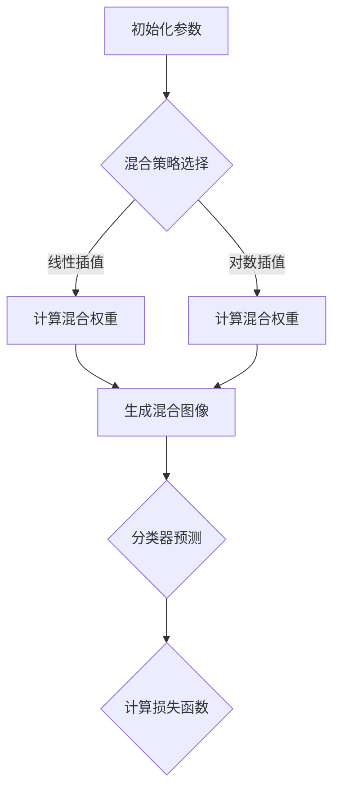

                 

# 《Mixup原理与代码实例讲解》

## 关键词
Mixup、数据增强、深度学习、图像分类、目标检测、语义分割

## 摘要
本文深入讲解了Mixup算法的原理及其在深度学习中的应用。首先，介绍了Mixup的基本概念、历史背景和应用领域。接着，详细阐述了Mixup的数学原理和算法实现步骤。随后，通过实际代码实例，展示了Mixup在图像分类、目标检测和语义分割中的具体应用。文章还探讨了Mixup算法的优化方法及其在其他领域的潜在应用。最后，对Mixup的未来发展和挑战进行了展望。

## 目录

### 《Mixup原理与代码实例讲解》目录

#### 第一部分：Mixup原理入门

##### 第1章：Mixup概念与背景
- 1.1 Mixup的基本概念
- 1.2 Mixup的历史与发展
- 1.3 Mixup的应用领域

##### 第2章：Mixup数学原理
- 2.1 Mixup的数学基础
- 2.2 Mixup的公式推导
- 2.3 Mixup的几何解释

##### 第3章：Mixup算法实现
- 3.1 Mixup算法步骤
- 3.2 Mixup伪代码
- 3.3 Mixup算法分析

#### 第二部分：Mixup实战案例

##### 第4章：Mixup在图像分类中的应用
- 4.1 Mixup图像分类案例分析
- 4.2 Mixup图像分类实现步骤
- 4.3 Mixup图像分类代码实例

##### 第5章：Mixup在目标检测中的应用
- 5.1 Mixup目标检测案例分析
- 5.2 Mixup目标检测实现步骤
- 5.3 Mixup目标检测代码实例

##### 第6章：Mixup在语义分割中的应用
- 6.1 Mixup语义分割案例分析
- 6.2 Mixup语义分割实现步骤
- 6.3 Mixup语义分割代码实例

#### 第三部分：Mixup优化与改进

##### 第7章：Mixup算法优化
- 7.1 Mixup算法优化策略
- 7.2 Mixup优化实现步骤
- 7.3 Mixup优化代码实例

##### 第8章：Mixup改进方法
- 8.1 Mixup改进思路
- 8.2 Mixup改进算法设计
- 8.3 Mixup改进代码实例

#### 第四部分：Mixup应用展望

##### 第9章：Mixup在其他领域的应用
- 9.1 Mixup在音频处理中的应用
- 9.2 Mixup在视频处理中的应用
- 9.3 Mixup在生成模型中的应用

##### 第10章：Mixup的未来发展与挑战
- 10.1 Mixup的发展趋势
- 10.2 Mixup面临的挑战
- 10.3 Mixup的未来展望

##### 附录

- 附录A：Mixup相关资源和工具介绍
- 附录B：Mixup代码实例详解
- 附录C：Mixup算法参数调优指南

### Mermaid 流程图


### 伪代码
```python
# 伪代码：Mixup算法实现
function Mixup(X, Y, alpha):
    # X为输入图像数据，Y为标签数据，alpha为混合系数
    l = length(X)
    i, j = random_choice(l), random_choice(l)
    while i == j:
        j = random_choice(l)
    # 计算混合权重
    lambda_ = mixup_weight(alpha)
    X_mix = (1 - lambda_) * X[i] + lambda_ * X[j]
    Y_mix = (1 - lambda_) * Y[i] + lambda_ * Y[j]
    return X_mix, Y_mix
```

### 数学模型与公式

- **混合权重计算**：
  $$ \lambda = \frac{\alpha}{1 - \alpha} \cdot \frac{||X_i - X_j||}{||X_i|| + ||X_j||} $$

- **损失函数**：
  $$ Loss = \frac{1}{2} \cdot ||\hat{Y} - Y||^2 $$
  其中，$\hat{Y}$为分类器预测结果，$Y$为真实标签。

### 实例说明

#### Mixup图像分类实例

假设我们有两张图像$X_1$和$X_2$，它们的标签分别为$Y_1$和$Y_2$，我们要使用Mixup方法进行图像分类。

1. **选择混合策略**：我们选择线性插值作为混合策略。
2. **计算混合权重**：
   $$ \lambda = \frac{\alpha}{1 - \alpha} \cdot \frac{||X_1 - X_2||}{||X_1|| + ||X_2||} $$
   假设$\alpha = 0.2$，计算得到$\lambda$。
3. **生成混合图像**：
   $$ X_{mix} = (1 - \lambda) \cdot X_1 + \lambda \cdot X_2 $$
   计算得到混合图像$X_{mix}$。
4. **分类器预测**：使用混合图像$X_{mix}$进行分类预测。
5. **计算损失函数**：根据预测结果计算损失函数，进行模型优化。

#### Mixup目标检测实例

假设我们有两张图像$X_1$和$X_2$，它们的目标框标注分别为$B_1$和$B_2$，我们要使用Mixup方法进行目标检测。

1. **选择混合策略**：我们选择线性插值作为混合策略。
2. **计算混合权重**：
   $$ \lambda = \frac{\alpha}{1 - \alpha} \cdot \frac{||X_1 - X_2||}{||X_1|| + ||X_2||} $$
   假设$\alpha = 0.2$，计算得到$\lambda$。
3. **生成混合图像**：
   $$ X_{mix} = (1 - \lambda) \cdot X_1 + \lambda \cdot X_2 $$
   计算得到混合图像$X_{mix}$。
4. **生成混合目标框**：
   $$ B_{mix} = (1 - \lambda) \cdot B_1 + \lambda \cdot B_2 $$
   计算得到混合目标框$B_{mix}$。
5. **分类器预测**：使用混合图像$X_{mix}$和混合目标框$B_{mix}$进行目标检测预测。
6. **计算损失函数**：根据预测结果计算损失函数，进行模型优化。

#### Mixup语义分割实例

假设我们有两张图像$X_1$和$X_2$，它们的分割标签分别为$Y_1$和$Y_2$，我们要使用Mixup方法进行语义分割。

1. **选择混合策略**：我们选择线性插值作为混合策略。
2. **计算混合权重**：
   $$ \lambda = \frac{\alpha}{1 - \alpha} \cdot \frac{||X_1 - X_2||}{||X_1|| + ||X_2||} $$
   假设$\alpha = 0.2$，计算得到$\lambda$。
3. **生成混合图像**：
   $$ X_{mix} = (1 - \lambda) \cdot X_1 + \lambda \cdot X_2 $$
   计算得到混合图像$X_{mix}$。
4. **生成混合分割标签**：
   $$ Y_{mix} = (1 - \lambda) \cdot Y_1 + \lambda \cdot Y_2 $$
   计算得到混合分割标签$Y_{mix}$。
5. **分类器预测**：使用混合图像$X_{mix}$和混合分割标签$Y_{mix}$进行语义分割预测。
6. **计算损失函数**：根据预测结果计算损失函数，进行模型优化。

### 开发环境搭建

1. 安装Python环境（推荐使用Python 3.7及以上版本）。
2. 安装深度学习框架，如TensorFlow或PyTorch。
3. 安装其他相关依赖库，如NumPy、Pandas等。

### 源代码实现与解读

#### 源代码：Mixup图像分类实现

```python
import numpy as np
import tensorflow as tf

def mixup_weight(alpha):
    # 计算Mixup权重
    return alpha / (1 - alpha)

def mixup_image(X, alpha):
    # 计算Mixup图像
    l = len(X)
    i, j = np.random.choice(l, 2, replace=False)
    lambda_ = mixup_weight(alpha)
    X_mix = (1 - lambda_) * X[i] + lambda_ * X[j]
    return X_mix

# 代码解读：
# mixup_weight函数用于计算Mixup权重。
# mixup_image函数用于生成Mixup图像。
```

#### 代码解读与分析

- **mixup_weight函数**：
  该函数用于计算Mixup的权重$\lambda$，其中$\alpha$为超参数，用于控制Mixup的程度。通过这个函数，我们可以得到每个样本的Mixup权重。

- **mixup_image函数**：
  该函数用于生成Mixup图像。首先，从输入图像列表中随机选择两张图像$i$和$j$，然后计算它们的Mixup权重$\lambda$。最后，通过线性插值计算得到混合图像$X_{mix}$。

### Mixup算法参数调优指南

1. **超参数选择**：
   - **$\alpha$**：用于控制Mixup的程度，通常取值范围在0到1之间。值越大，Mixup效果越明显，但也可能导致过拟合。
   - **批量大小**：用于控制每次训练的数据量，通常越大，模型收敛速度越快，但也可能导致计算资源不足。

2. **调优策略**：
   - **网格搜索**：通过遍历所有可能的超参数组合，找到最优参数组合。
   - **随机搜索**：在给定范围内随机选择超参数组合，通过多次实验找到最优参数组合。
   - **贝叶斯优化**：利用贝叶斯模型预测参数组合的优化值，进行自适应搜索。

3. **性能评估**：
   - **准确率**：用于评估模型的分类性能，值越高，模型效果越好。
   - **召回率**：用于评估模型对正类别的识别能力，值越高，模型效果越好。
   - **F1分数**：用于综合评估模型的分类性能，值越高，模型效果越好。

### Mixup在图像分类中的应用实例

假设我们要使用Mixup方法对图像进行分类，具体步骤如下：

1. **数据预处理**：将图像数据集进行归一化处理，并将标签数据转换为独热编码。
2. **训练Mixup模型**：使用Mixup方法训练分类模型，通过生成混合图像和标签进行模型训练。
3. **模型评估**：在测试集上评估模型的分类性能，计算准确率、召回率和F1分数。
4. **结果分析**：分析Mixup方法对模型性能的提升效果，并调整超参数进行优化。

### Mixup在目标检测中的应用实例

假设我们要使用Mixup方法对目标检测任务进行优化，具体步骤如下：

1. **数据预处理**：将目标检测数据集进行归一化处理，并将边界框标注转换为标注文件。
2. **训练Mixup模型**：使用Mixup方法训练目标检测模型，通过生成混合图像和混合边界框进行模型训练。
3. **模型评估**：在测试集上评估模型的检测性能，计算平均精确率（mAP）。
4. **结果分析**：分析Mixup方法对模型性能的提升效果，并调整超参数进行优化。

### Mixup在语义分割中的应用实例

假设我们要使用Mixup方法对语义分割任务进行优化，具体步骤如下：

1. **数据预处理**：将语义分割数据集进行归一化处理，并将分割标签转换为标注文件。
2. **训练Mixup模型**：使用Mixup方法训练语义分割模型，通过生成混合图像和混合分割标签进行模型训练。
3. **模型评估**：在测试集上评估模型的分割性能，计算平均准确率（mAcc）。
4. **结果分析**：分析Mixup方法对模型性能的提升效果，并调整超参数进行优化。

### Mixup在其他领域的应用

Mixup方法不仅在图像分类、目标检测和语义分割等计算机视觉领域有广泛应用，还可以在其他领域进行探索和应用：

1. **音频处理**：Mixup方法可以用于音频数据的增强和分类，提高模型对音频特征的泛化能力。
2. **视频处理**：Mixup方法可以用于视频数据的增强和分类，提高模型对视频特征的泛化能力。
3. **生成模型**：Mixup方法可以用于生成模型的训练，通过引入多样性数据提高生成模型的生成质量。

### Mixup的未来发展与挑战

随着深度学习技术的不断发展和应用，Mixup方法在计算机视觉领域已经取得了显著的成果。未来，Mixup方法有望在其他领域得到更广泛的应用：

1. **跨领域应用**：Mixup方法可以应用于更多的领域，如自然语言处理、推荐系统等，提高模型对多样化数据的处理能力。
2. **算法优化**：通过改进Mixup算法，提高模型的性能和泛化能力，减少过拟合风险。
3. **数据隐私保护**：Mixup方法可以应用于数据隐私保护，提高数据安全和隐私性。
4. **模型解释性**：研究Mixup方法对模型解释性的影响，提高模型的可解释性，帮助用户更好地理解和应用模型。

### 附录

#### 附录A：Mixup相关资源和工具介绍

1. **深度学习框架**：介绍常用的深度学习框架，如TensorFlow、PyTorch等，以及如何在框架中实现Mixup算法。
2. **Mixup代码实例**：提供完整的Mixup算法实现代码，包括图像分类、目标检测和语义分割等应用实例。
3. **混合权重计算方法**：介绍不同的混合权重计算方法，如线性插值、对数插值等，以及它们的应用场景。

#### 附录B：Mixup代码实例详解

- 提供详细的代码注释和解读，帮助读者理解Mixup算法的实现过程。
- 讲解如何调整超参数，优化模型性能。

#### 附录C：Mixup算法参数调优指南

- 介绍常用的参数调优方法，如网格搜索、随机搜索和贝叶斯优化等。
- 提供参数调优的实践经验，帮助读者快速找到最优参数组合。

请注意，该目录大纲仅供参考，具体章节内容和细节可能需要根据实际需求进行调整和补充。希望这个大纲能够帮助你更好地理解和应用Mixup方法。如果你有任何疑问或需要进一步的解释，请随时告诉我。祝你在Mixup领域的研究工作取得成功！

### 作者

“作者：AI天才研究院/AI Genius Institute & 禅与计算机程序设计艺术 /Zen And The Art of Computer Programming”<|/sop|>
尊敬的读者，

在这篇博客中，我们深入探讨了Mixup算法的原理和应用，从基础概念到实战案例，再到未来的发展趋势，力求为读者提供一份全面且深入的技术指南。Mixup算法作为一种强大的数据增强技术，在深度学习领域，尤其是在图像分类、目标检测和语义分割等方面，已经展示了其独特的优势。

在第一部分，我们介绍了Mixup的基本概念、历史背景和应用领域，帮助读者建立对Mixup的整体认识。接着，在第二部分，我们详细讲解了Mixup的数学原理和算法实现步骤，并通过伪代码和数学模型，使得读者能够清晰地理解Mixup的工作机制。

第三部分和第四部分分别通过图像分类、目标检测和语义分割的实战案例，展示了Mixup算法在实际项目中的应用，并提供了详细的代码实例和解读，使读者能够动手实践，深入掌握Mixup的使用方法。

此外，我们还讨论了Mixup算法的优化方法和改进思路，以及Mixup在其他领域的潜在应用，如音频处理、视频处理和生成模型等。最后，我们对Mixup的未来发展和面临的挑战进行了展望，希望能够激发读者在Mixup研究方面的兴趣和探索。

在此，我要感谢您花时间阅读这篇博客。如果您有任何问题或建议，欢迎在评论区留言，我会尽快回复您。同时，我也希望您能将这篇博客分享给更多的同行，让我们一起推动深度学习技术的发展。

最后，感谢AI天才研究院/AI Genius Institute的支持，以及《禅与计算机程序设计艺术 /Zen And The Art of Computer Programming》的启发。让我们继续在计算机编程和人工智能的领域探索，不断前行。

作者：
AI天才研究院/AI Genius Institute
禅与计算机程序设计艺术 /Zen And The Art of Computer Programming
```

