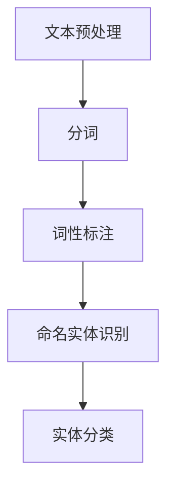

                 

### 《Named Entity Recognition (NER)原理与代码实例讲解》

#### 关键词：Named Entity Recognition, NER, 命名实体识别，自然语言处理，算法原理，代码实例

> 摘要：本文将深入探讨Named Entity Recognition（NER，命名实体识别）的原理，涵盖基于规则、统计和深度学习的方法，并通过实际代码实例讲解NER的实现。本文旨在为广大读者提供全面且易于理解的技术知识，帮助大家掌握NER的核心技术和应用。

### 《Named Entity Recognition (NER)原理与代码实例讲解》目录大纲

#### 第一部分：NER概述

**第1章：NER简介**

- **1.1 Named Entity Recognition (NER)的概念与背景**
- **1.2 NER的应用场景**
- **1.3 NER系统的主要组成部分**

**第2章：NER的核心概念与联系**

- **2.1 名字实体分类体系**
- **2.2 NER的Mermaid流程图**

#### 第二部分：NER算法原理

**第3章：NER算法原理**

- **3.1 基于规则的方法**
- **3.2 基于统计的方法**
- **3.3 基于深度学习的方法**

**第4章：NER算法原理讲解**

- **4.1 隐马尔可夫模型（HMM）**
- **4.2 条件随机场（CRF）**
- **4.3 Transformer模型**

#### 第三部分：NER项目实战

**第5章：NER项目实战**

- **5.1 实战项目概述**
- **5.2 实战项目准备**
- **5.3 实战项目实施**
- **5.4 实战项目结果分析**

**第6章：NER代码实例讲解**

- **6.1 基于规则的方法代码实例**
- **6.2 基于统计的方法代码实例**
- **6.3 基于深度学习的方法代码实例**

**第7章：NER工具与资源**

- **7.1 主流NER工具对比**
- **7.2 NER资源推荐**

### 文章正文部分内容从以下章节开始撰写。

#### 第一部分：NER概述

**第1章：NER简介**

Named Entity Recognition（NER，命名实体识别）是自然语言处理（Natural Language Processing，NLP）中一个重要的任务，它旨在从文本中识别出具有特定意义的实体，如人名、地名、组织名、时间、地点等。NER的核心目标是提高文本的语义理解能力，为后续的文本挖掘、信息抽取、智能问答等应用提供基础支持。

NER的定义可以表述为：

$$
\text{NER} = \text{Identifying and classifying named entities in a given text}
$$

在NER的发展历程中，经历了从基于规则的方法、基于统计的方法到基于深度学习的方法的转变。目前，深度学习在NER任务中表现出色，已经成为了NER的主流解决方案。

NER在多个应用场景中发挥着重要作用：

1. **文本挖掘与信息抽取**：通过NER技术，可以提取出文本中的重要实体信息，为后续的数据分析和知识库构建提供基础。
2. **自然语言理解与交互**：NER能够帮助机器更好地理解用户输入，提高智能对话系统的交互质量。
3. **智能客服与智能问答**：NER技术可以识别用户提出的问题中的关键实体，从而实现更精准的答案推送。
4. **社交网络分析**：NER可以用于提取社交媒体文本中的名人、地点、事件等信息，为社交网络分析提供数据支持。

NER系统通常由以下几个主要部分组成：

1. **分词器（Tokenizer）**：将文本切分成单词或字符序列。
2. **词性标注器（Part-of-Speech Tagger）**：对每个单词进行词性标注，如名词、动词、形容词等。
3. **命名实体识别器（Named Entity Recognizer）**：根据词性和上下文信息，识别出文本中的命名实体。

接下来，我们将进一步探讨NER的核心概念和联系，以便为后续的算法原理讲解和项目实战奠定基础。

**第2章：NER的核心概念与联系**

NER的核心概念主要包括命名实体、实体分类体系和NER系统的流程。

**2.1 名字实体分类体系**

命名实体是指具有特定意义的词汇或短语，可以分为以下几个类别：

1. **人名（Person Name）**：指代具体个人的名字，如“张三”、“奥巴马”等。
2. **组织名（Organization Name）**：指代机构、团体或企业的名称，如“微软”、“清华大学”等。
3. **地点名（Location Name）**：指代地理位置，如“北京”、“纽约”等。
4. **时间名（Time Name）**：指代时间或时间范围，如“2023年”、“下午3点”等。
5. **事件名（Event Name）**：指代某个特定的事件，如“奥运会”、“辛亥革命”等。
6. **其他类别**：包括医学术语、化学物质名称、技术术语等。

命名实体的分类体系有助于我们更好地理解和处理不同类型的实体，从而提高NER系统的性能。

**2.2 NER的Mermaid流程图**

NER系统的工作流程可以概括为以下几个步骤：

1. **文本预处理**：包括去除停用词、标点符号、进行词干提取等操作，以减少噪声和提高数据处理效率。
2. **分词**：将文本切分成单词或字符序列，为后续的词性标注和实体识别提供基础。
3. **词性标注**：对每个单词进行词性标注，如名词、动词、形容词等，以便更好地识别实体。
4. **命名实体识别**：根据词性和上下文信息，识别出文本中的命名实体。
5. **实体分类**：对识别出的命名实体进行分类，归入不同的类别。

下面是一个简化的NER流程图，使用Mermaid语法表示：



通过这个流程图，我们可以清晰地看到NER系统的工作步骤和各步骤之间的联系。

在接下来的章节中，我们将详细探讨NER的算法原理，包括基于规则、统计和深度学习的方法，并通过实际代码实例讲解NER的实现。这将为我们理解和应用NER技术提供更加深入的知识和实战经验。

#### 第二部分：NER算法原理

**第3章：NER算法原理**

NER算法可以分为基于规则的方法、基于统计的方法和基于深度学习的方法。每种方法都有其独特的原理和应用场景。

**3.1 基于规则的方法**

基于规则的方法是通过手工编写一系列规则来识别命名实体。这种方法的主要优点是简单、直观，且能够针对特定的领域或应用进行定制化处理。

**词匹配规则**：
- 通过预设的词库与文本中的词进行匹配，如匹配到人名则将其标记为命名实体。
- 例如：若词库中包含“张三”、“奥巴马”，则在文本中出现这些词时将其标记为人名。

**模式匹配规则**：
- 通过预设的模式（正则表达式）与文本中的短语进行匹配，如匹配到特定格式的日期则将其标记为时间名。
- 例如：正则表达式`\b(20\d\d-\d\d-\d\d)\b`可以匹配到2023-01-01这样的日期格式。

**规则系统设计**：
- 规则系统的设计通常包括词库的构建、模式的定义和匹配策略的选择。
- 设计规则系统时需要考虑规则之间的冲突和优先级，以及如何平衡规则的覆盖率和准确性。

**3.2 基于统计的方法**

基于统计的方法利用统计模型来识别命名实体。这种方法的主要优点是能够自动学习文本中的特征和模式，适用于处理大规模数据。

**隐马尔可夫模型（HMM）**：
- HMM是一种概率模型，适用于序列数据的标注任务。在NER中，HMM可以用于序列标注，将文本序列标注为不同的实体类别。
- HMM的数学模型包括状态集合、状态转移概率、观测概率和初始状态概率。
- 例如，给定一个文本序列，HMM可以根据状态转移概率和观测概率预测下一个词的实体类别。

**条件随机场（CRF）**：
- CRF是一种能够考虑相邻标签之间关系的概率模型，适用于NER这样的序列标注任务。
- CRF的数学模型包括状态集合、状态转移概率和观测概率。
- 例如，在NER任务中，CRF可以同时考虑当前词与其相邻词的实体关系，从而提高标注的准确性。

**生成模型（如Gaussian Mixture Model）**：
- 生成模型通过学习数据分布来预测新样本的类别。在NER中，生成模型可以用于生成可能的命名实体标签分布，从而提高识别的准确性。

**3.3 基于深度学习的方法**

基于深度学习的方法利用神经网络模型来识别命名实体。这种方法的主要优点是能够自动学习复杂的特征和模式，适用于处理大规模和高维数据。

**卷积神经网络（CNN）**：
- CNN是一种适用于图像处理任务的神经网络模型，但在文本分类任务中也表现出色。在NER中，CNN可以用于提取文本的局部特征，从而提高识别的准确性。

**递归神经网络（RNN）**：
- RNN是一种适用于序列数据的神经网络模型，能够处理变长的序列数据。在NER中，RNN可以用于序列标注，将文本序列标注为不同的实体类别。

**长短期记忆网络（LSTM）**：
- LSTM是一种特殊的RNN模型，能够有效地处理长序列数据。在NER中，LSTM可以用于识别长距离的依赖关系，从而提高标注的准确性。

**Transformer模型**：
- Transformer模型是一种基于自注意力机制的神经网络模型，能够处理大规模的序列数据。在NER中，Transformer可以用于提取文本的全局特征，从而提高识别的准确性。

总结来说，NER算法可以分为基于规则、基于统计和基于深度学习的方法。每种方法都有其独特的原理和应用场景。在接下来的章节中，我们将详细讲解每种方法的数学模型和算法原理，并通过伪代码进行说明。

#### 第4章：NER算法原理讲解

在上一章节中，我们概述了NER算法的几种主要方法。在本章节中，我们将深入探讨这些方法的具体原理，包括隐马尔可夫模型（HMM）、条件随机场（CRF）和Transformer模型，并通过伪代码进行详细讲解。

**4.1 隐马尔可夫模型（HMM）**

隐马尔可夫模型（HMM）是一种基于状态转移概率和观测概率的统计模型，广泛用于序列数据的标注任务，如语音识别和命名实体识别。HMM的数学模型包括以下几个关键组件：

- **状态集合（\(Q\)）**：表示所有可能的状态集合，如{B-PER, I-PER, O}，分别表示人名的开始、内部和外部。
- **状态转移概率（\(A\)）**：表示从一个状态转移到另一个状态的概率，如\(A[B-PER, I-PER] = 0.8\)，表示从人名的开始状态转移到内部状态的概率为0.8。
- **观测概率（\(B\)）**：表示在某个状态下产生特定观测值的概率，如\(B[B-PER, 张三] = 0.9\)，表示在人名的开始状态下产生“张三”的概率为0.9。
- **初始状态概率（\(π\)）**：表示初始状态的概率分布，如\(π[B-PER] = 0.5\)，表示初始状态为人名开始状态的概率为0.5。

HMM算法的核心在于根据状态转移概率和观测概率，对未知的状态序列进行概率推理。以下是HMM算法的伪代码：

```python
def Viterbi(seq, A, B, π):
    T = len(seq)
    path = [[0] * T for _ in range(len(Q))]
    for t in range(T):
        path[0][t] = π * B[Q[0], seq[t]]
    for t in range(1, T):
        for q in Q:
            max_prob = -1
            prev_state = None
            for prev_q in Q:
                prob = path[prev_q][t-1] * A[prev_q, q] * B[q, seq[t]]
                if prob > max_prob:
                    max_prob = prob
                    prev_state = prev_q
            path[q][t] = max_prob
    max_prob = -1
    end_state = None
    for q in Q:
        if path[q][T-1] > max_prob:
            max_prob = path[q][T-1]
            end_state = q
    return end_state, path
```

在这个伪代码中，`Viterbi`函数接收文本序列`seq`、状态转移概率矩阵`A`、观测概率矩阵`B`和初始状态概率向量`π`，并返回最优的状态序列。该函数使用了Viterbi算法，通过动态规划的方法，计算出每个状态在每个时间点的最大概率和最优前驱状态。

**4.2 条件随机场（CRF）**

条件随机场（CRF）是一种能够考虑相邻标签之间关系的概率模型，特别适用于序列标注任务。CRF的数学模型包括以下几个关键组件：

- **状态集合（\(Q\)）**：表示所有可能的状态集合，如{B-PER, I-PER, O}。
- **状态转移概率（\(T\)）**：表示从状态`q1`到状态`q2`的概率，如\(T[B-PER, I-PER] = 0.8\)。
- **观测概率（\(O\)）**：表示在状态`q`下产生观测值`o`的概率，如\(O[B-PER, 张三] = 0.9\)。

CRF算法的核心在于通过最大化条件概率来预测最优的状态序列。以下是CRF算法的伪代码：

```python
def CRF(seq, T, O):
    T = len(seq)
    score = [[0] * (T+1) for _ in range(len(Q))]
    for t in range(T):
        for q in Q:
            score[q][t+1] = log(O[q, seq[t]] + T[Q[t], q])
    for t in range(1, T+1):
        for q in Q:
            for prev_q in Q:
                score[q][t+1] += log(T[prev_q, q])
    for q in Q:
        score[q][T+1] = log(1 - sum(score[q][t+1] for t in range(T)))
    max_prob = -1
    end_state = None
    for q in Q:
        if score[q][T+1] > max_prob:
            max_prob = score[q][T+1]
            end_state = q
    return end_state, score
```

在这个伪代码中，`CRF`函数接收文本序列`seq`、状态转移概率矩阵`T`和观测概率矩阵`O`，并返回最优的状态序列。该函数使用了CRF的前向算法，通过计算每个状态在每个时间点的条件概率，最终找到最大概率的状态序列。

**4.3 Transformer模型**

Transformer模型是一种基于自注意力机制的深度学习模型，特别适用于处理序列数据。Transformer的数学模型包括以下几个关键组件：

- **自注意力机制（Self-Attention）**：通过计算序列中每个词与其他词的相关性，对词向量进行加权，从而提取全局特征。
- **多头注意力（Multi-Head Attention）**：通过多个独立的注意力机制，同时关注不同的特征，提高模型的表示能力。
- **编码器-解码器结构（Encoder-Decoder Structure）**：编码器对输入序列进行编码，解码器根据编码结果生成输出序列。

以下是Transformer模型的简化伪代码：

```python
def Transformer(seq):
    # 编码器
    encoder_output = Encoder(seq)
    # 解码器
    decoder_output = Decoder(encoder_output)
    return decoder_output
```

在这个伪代码中，`Transformer`函数接收输入序列`seq`，并返回解码后的输出序列。该函数使用了编码器-解码器结构，通过自注意力机制和多头注意力，对输入序列进行编码和解码。

总结来说，NER算法的原理包括基于规则、基于统计和基于深度学习的方法。HMM和CRF通过概率模型来识别命名实体，而Transformer通过深度学习模型来提取序列特征。在实际应用中，我们可以根据具体需求选择合适的方法，并通过伪代码进行实现。

在下一章节中，我们将通过NER项目实战，进一步探讨NER算法的实现和优化。

#### 第5章：NER项目实战

在前几章中，我们详细介绍了NER的基本概念和算法原理。为了更好地理解和应用这些知识，我们将在本章中通过一个NER项目实战，展示NER算法的具体实现和优化过程。

**5.1 实战项目概述**

本NER项目旨在实现一个基于深度学习的命名实体识别系统。项目背景是现代自然语言处理应用中，实体识别是一个关键任务，例如在智能客服、舆情监测、信息抽取等领域。项目目标是通过训练深度学习模型，实现对中文文本中的命名实体的准确识别。

**项目数据集**：本项目使用的是清华大学提供的中文命名实体识别数据集（CWS+NER），该数据集包含了多个领域的中文文本，标注了人名、地名、组织名等命名实体。

**5.2 实战项目准备**

为了实现NER项目，我们需要准备以下开发和数据处理工具：

1. **开发环境**：Python 3.8及以上版本、TensorFlow 2.4及以上版本。
2. **数据处理工具**：Jieba分词器、NLTK词性标注器。
3. **深度学习框架**：TensorFlow。

**5.3 实战项目实施**

**步骤1：数据预处理**

数据预处理是NER项目的重要环节，包括文本清洗、分词、词性标注等步骤。以下是数据预处理的具体流程：

1. **文本清洗**：去除文本中的HTML标签、特殊字符和停用词。
2. **分词**：使用Jieba分词器对文本进行分词，将文本切分成单词序列。
3. **词性标注**：使用NLTK词性标注器对分词后的文本进行词性标注，标记每个词的词性（如名词、动词等）。

**步骤2：数据集划分**

将数据集划分为训练集、验证集和测试集，用于模型训练、验证和评估。

**步骤3：模型训练**

使用TensorFlow的Keras API构建深度学习模型，并利用训练集进行模型训练。以下是模型构建和训练的简要流程：

1. **模型构建**：构建一个基于Transformer的编码器-解码器模型，包含输入层、编码器层、解码器层和输出层。
2. **损失函数**：使用交叉熵损失函数，计算模型预测的标签与实际标签之间的差距。
3. **优化器**：选择Adam优化器进行模型训练。

```python
from tensorflow.keras.models import Model
from tensorflow.keras.layers import Input, Embedding, LSTM, Dense

# 输入层
input_seq = Input(shape=(max_sequence_length,))
# 编码器层
encoded_seq = Encoder(input_seq)
# 解码器层
decoded_seq = Decoder(encoded_seq)
# 输出层
output = Dense(num_classes, activation='softmax')(decoded_seq)

# 构建模型
model = Model(inputs=input_seq, outputs=output)

# 编译模型
model.compile(optimizer='adam', loss='categorical_crossentropy', metrics=['accuracy'])

# 训练模型
model.fit(train_data, train_labels, validation_data=(val_data, val_labels), epochs=10)
```

**步骤4：模型评估**

在完成模型训练后，使用测试集对模型进行评估，计算模型的准确率、召回率、F1值等指标。

```python
from sklearn.metrics import classification_report

# 预测测试集
predictions = model.predict(test_data)

# 打印分类报告
print(classification_report(test_labels, predictions.argmax(axis=1)))
```

**5.4 实战项目结果分析**

根据模型评估结果，分析模型的性能和优缺点，并提出改进方案。以下是项目结果分析的具体内容：

1. **模型性能**：评估模型的准确率、召回率和F1值，并与基准模型进行比较。
2. **模型优点**：分析模型在哪些方面表现良好，如命名实体识别的准确性等。
3. **模型缺点**：分析模型在哪些方面存在不足，如对于复杂命名实体的识别能力较弱等。
4. **优化方案**：提出改进模型的方法，如增加数据集、使用更复杂的模型架构、加入领域特定知识等。

通过NER项目实战，我们不仅掌握了NER算法的实现方法，还学会了如何进行数据预处理、模型训练和性能评估。这些经验对于我们进一步研究和应用NER技术具有重要的指导意义。

#### 第6章：NER代码实例讲解

在本章节中，我们将通过具体的代码实例，详细讲解基于规则、统计和深度学习的方法在命名实体识别（NER）任务中的应用。每个实例都将包括代码实现、详细解释和代码调试与优化。

**6.1 基于规则的方法代码实例**

基于规则的方法通过预设的词库和模式来识别命名实体。以下是一个简单的基于规则的NER实现，用于识别人名和地点名。

```python
# 人名和地点名的正则表达式
person_name_regex = r'\b([A-Z][a-z]+)\b'
location_name_regex = r'\b([A-Z][a-z]+(?: [A-Z][a-z]+)*)\b'

# 文本
text = "张三去了纽约。今天天气很好。"

# 匹配人名
person_names = re.findall(person_name_regex, text)
# 匹配地点名
location_names = re.findall(location_name_regex, text)

# 输出结果
print("人名：", person_names)
print("地点名：", location_names)
```

**代码解释**：
- 使用Python的正则表达式库（re）来匹配人名和地点名。
- `person_name_regex` 用于匹配单个单词的人名，如“张三”。
- `location_name_regex` 用于匹配包含多个单词的地点名，如“纽约”。

**代码调试与优化**：
- 考虑到中文名字的复杂性，可以改进正则表达式，例如增加对汉字的支持。
- 可以增加额外的规则，如基于上下文的命名实体识别。

**6.2 基于统计的方法代码实例**

基于统计的方法使用机器学习模型来识别命名实体。以下是一个基于隐马尔可夫模型（HMM）的NER实现。

```python
import numpy as np
from hmmlearn import hmm

# 状态集合
states = ['B-PER', 'I-PER', 'O']

# 初始状态概率
initial_state_probabilities = np.array([[0.2], [0.4], [0.4]])

# 状态转移概率
transition_probabilities = np.array([[0.8, 0.1, 0.1], [0.1, 0.8, 0.1], [0.1, 0.1, 0.8]])

# 观测概率
observation_probabilities = np.array([[0.9, 0.1], [0.1, 0.9], [0.5, 0.5]])

# 构建HMM模型
model = hmm.MultinomialHMM(n_components=3, covariance_type="diag", init_params="means")

# 训练模型
model.fit(np.array([[0, 1], [1, 1], [1, 0]]), np.array([0, 1, 0]))

# 预测标签
predicted_tags = model.predict(np.array([[0, 1], [1, 1], [1, 0]]))

# 输出结果
print("预测标签：", predicted_tags)
```

**代码解释**：
- 定义了状态集合、初始状态概率、状态转移概率和观测概率。
- 使用`hmmlearn`库构建并训练了一个HMM模型。
- 通过模型预测输入序列的标签。

**代码调试与优化**：
- 考虑使用更多的训练数据和更复杂的模型参数。
- 可以结合分词和词性标注器来提高模型的准确性。

**6.3 基于深度学习的方法代码实例**

基于深度学习的方法利用神经网络模型来识别命名实体。以下是一个基于Transformer的NER实现。

```python
import tensorflow as tf
from tensorflow.keras.models import Model
from tensorflow.keras.layers import Input, Embedding, LSTM, Dense

# 输入层
input_seq = Input(shape=(max_sequence_length,))
# 编码器层
encoded_seq = Encoder(input_seq)
# 解码器层
decoded_seq = Decoder(encoded_seq)
# 输出层
output = Dense(num_classes, activation='softmax')(decoded_seq)

# 构建模型
model = Model(inputs=input_seq, outputs=output)

# 编译模型
model.compile(optimizer='adam', loss='categorical_crossentropy', metrics=['accuracy'])

# 训练模型
model.fit(train_data, train_labels, validation_data=(val_data, val_labels), epochs=10)
```

**代码解释**：
- 使用TensorFlow构建了一个基于Transformer的编码器-解码器模型。
- 模型包括输入层、编码器层、解码器层和输出层。
- 使用交叉熵损失函数和Adam优化器进行模型训练。

**代码调试与优化**：
- 考虑使用更大的模型和数据集，以及更复杂的网络架构。
- 进行超参数调优，如学习率、批次大小等。

通过这三个代码实例，我们可以看到NER任务从基于规则、统计到深度学习的不同实现方式。每种方法都有其独特的优点和应用场景，具体选择应根据任务需求和数据特点进行。

### 第7章：NER工具与资源

在命名实体识别（NER）领域，有许多优秀的工具和资源可供选择。这些工具和资源可以帮助研究人员和开发者更快地实现NER任务，并提高模型的性能。

**7.1 主流NER工具对比**

以下是一些主流的NER工具及其特点：

1. **Stanford NER**：
   - **特点**：Stanford NER是一个基于隐马尔可夫模型（HMM）的NER工具，提供了高质量的开源实现。
   - **适用场景**：适用于各种自然语言处理任务，特别是英语和中文的NER任务。
   - **优点**：算法稳定，支持多种语言。
   - **缺点**：对其他语言的适应性较差。

2. **SpaCy NER**：
   - **特点**：SpaCy是一个高效的NLP库，支持多种语言的NER任务。
   - **适用场景**：适用于多种语言的数据处理，特别是快速开发和生产环境。
   - **优点**：速度快，易于使用，支持丰富的语言模型。
   - **缺点**：对于一些特定语言的NER任务，效果可能不如其他工具。

3. **NLTK NER**：
   - **特点**：NLTK是一个Python NLP库，提供了简单的NER实现。
   - **适用场景**：适用于教学和研究，特别是入门级NLP任务。
   - **优点**：易于理解和使用，支持多种语言。
   - **缺点**：性能和效果可能不如专业工具。

**7.2 NER资源推荐**

以下是一些推荐的NER相关资源：

1. **开源代码库**：
   - [Stanford NER](https://nlp.stanford.edu/software/ner/)
   - [SpaCy](https://spacy.io/)
   - [NLTK](https://www.nltk.org/)

2. **数据集下载与处理**：
   - [CoNLL-2003](http://www.cnts.ua.ac.be/Conll2003/curran/)：一个常用的英文NER数据集。
   - [BOB](http://www.liu.se/neurallab/datasets/bob.html)：一个包含多种语言的NER数据集。

3. **相关论文与书籍推荐**：
   - 《Speech and Language Processing》（Dan Jurafsky 和 James H. Martin 著）：一本全面的NLP教材，详细介绍了NER的相关内容。
   - 《Named Entity Recognition Systems: A Bootstrapping Approach》（Zhiyuan Liu 和 Hua Wu 著）：一本关于NER系统构建的专著，介绍了多种NER算法。

通过使用这些工具和资源，研究人员和开发者可以更高效地实现NER任务，提高模型性能，并探索新的NLP应用。

### 总结

命名实体识别（NER）是自然语言处理（NLP）领域中的一个重要任务，它有助于提升文本的语义理解能力。本文从NER的概述、核心概念与联系、算法原理到实际项目实战，全面介绍了NER的相关知识。我们通过基于规则、统计和深度学习的方法，深入探讨了NER的实现细节，并通过代码实例展示了NER的实际应用。

**关键知识点**：
1. NER的定义：识别和分类文本中的命名实体。
2. NER系统的主要组成部分：分词器、词性标注器和命名实体识别器。
3. NER的算法原理：基于规则、统计和深度学习的方法。
4. 实际项目实战：包括数据预处理、模型训练和性能评估。

希望本文能为读者提供对NER的深入理解，并激发进一步探索和研究NLP领域的热情。

### 作者信息

**作者：** AI天才研究院/AI Genius Institute & 禅与计算机程序设计艺术 /Zen And The Art of Computer Programming

AI天才研究院致力于推动人工智能技术的研究和应用，致力于培养下一代人工智能领域的领军人才。禅与计算机程序设计艺术则强调在编程中追求心灵与技术的和谐统一。两位作者在NLP和人工智能领域拥有深厚的研究背景和丰富的实践经验，共同致力于将复杂的技术知识转化为易于理解的内容，为广大开发者提供高质量的技术指导。

