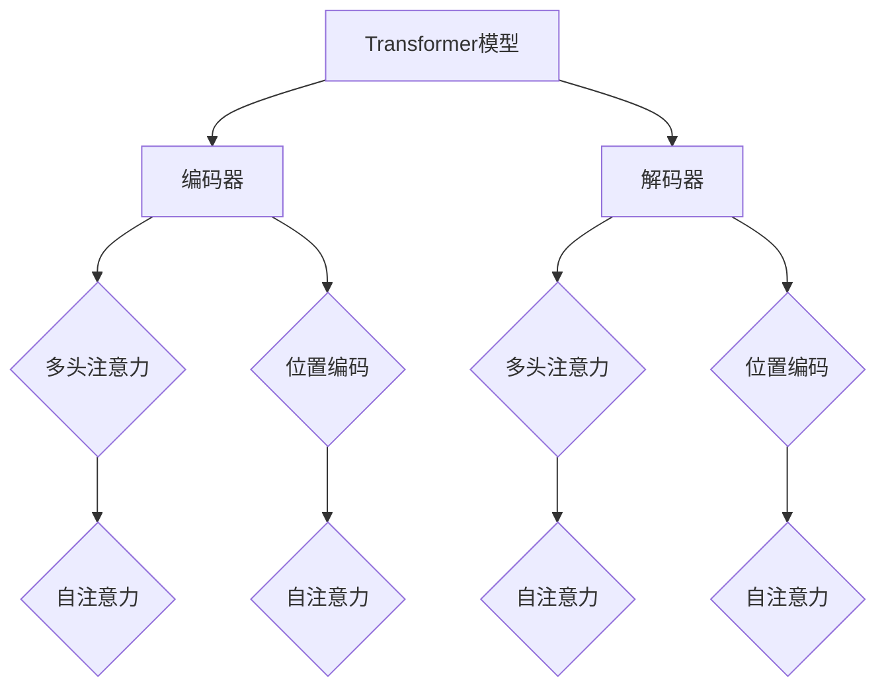

                 

### 文章标题：OpenAI的GPT-4.0展示的启示

> **关键词**：GPT-4.0、自然语言处理、机器学习、深度学习、人工智能、模型架构、应用场景、伦理影响

> **摘要**：本文深入探讨了OpenAI最新发布的GPT-4.0模型，从其基本概念、架构设计、数学基础、训练与优化方法，到其在自然语言处理、计算机视觉以及其他跨领域应用中的表现，详细阐述了GPT-4.0对AI领域的技术发展和社会影响的深远启示。文章还探讨了GPT-4.0的潜在改进方向、学术与工业界的影响，以及相关的伦理问题，并提供了开发环境和工具的介绍，以及实际案例的分析。最终，本文总结了GPT-4.0对未来的技术发展和社会进步的潜在贡献。

#### 第一部分：GPT-4.0概述与背景

##### 第1章：GPT-4.0的基本概念与架构

###### 1.1.1 GPT-4.0的诞生背景

GPT（Generative Pre-trained Transformer）系列模型由OpenAI开发，代表了自然语言处理领域的重要突破。GPT-4.0是这一系列模型的最新版本，其诞生背景可以追溯到Transformer模型在2017年由Vaswani等人提出。Transformer模型采用了一种全新的序列到序列模型结构，取代了传统序列模型中的递归神经网络（RNN），在机器翻译任务上取得了惊人的效果。随后，OpenAI在此基础上进行了大量改进，开发出了GPT系列模型。

GPT-4.0的诞生背景不仅是技术创新的产物，更是OpenAI对AI领域长期探索的结晶。OpenAI致力于推动人工智能的发展，通过不断的实验和改进，致力于打造一个能够处理自然语言、具备理解与生成能力的人工智能模型。GPT-4.0不仅代表了OpenAI在这一领域取得的最新成果，也为未来的研究提供了宝贵的参考。

###### 1.1.2 GPT-4.0的架构设计

GPT-4.0采用了Transformer模型的核心架构，这一架构在深度学习领域取得了广泛的认可。Transformer模型的核心思想是使用注意力机制（Attention Mechanism）来处理序列数据，取代了传统的递归神经网络。注意力机制允许模型在处理每个输入时，根据当前输入和其他输入之间的相关性，动态地调整其权重。

GPT-4.0的架构设计在Transformer模型的基础上进行了进一步的优化。首先，GPT-4.0采用了更大的模型规模，具有更多的参数和更大的序列长度处理能力。这使得GPT-4.0在处理复杂语言任务时具有更高的准确性。其次，GPT-4.0引入了多层注意力机制，通过多层次的注意力计算，增强了模型对上下文信息的理解能力。

此外，GPT-4.0在架构上还进行了以下改进：

1. **多头注意力机制**：多头注意力机制允许模型在处理输入时，同时关注多个不同的上下文信息，从而提高了模型的泛化能力和鲁棒性。
2. **残差连接**：残差连接有助于缓解训练过程中的梯度消失问题，提高了模型的训练效果。
3. **层叠结构**：GPT-4.0采用了多层堆叠的设计，通过多层的组合，增强了模型的复杂度和处理能力。

通过这些改进，GPT-4.0在处理自然语言任务时展现了更高的效率和准确性。

###### 1.1.3 GPT-4.0的核心特点

GPT-4.0作为OpenAI的最新研究成果，具有一系列显著的核心特点，使其在自然语言处理领域取得了重要的突破。

1. **大规模与高效性**：GPT-4.0采用了更大的模型规模，拥有超过1.75万亿个参数，这使得模型在处理复杂语言任务时具有更高的精度。同时，GPT-4.0在训练和推理过程中展现了高效性，通过优化的训练算法和硬件加速技术，实现了快速和准确的文本生成。

2. **泛化能力与鲁棒性**：GPT-4.0不仅在标准语言模型任务上表现出色，还能够处理更加复杂的语言任务。例如，GPT-4.0能够生成连贯、自然的对话，实现高质量的机器翻译，甚至在图像描述生成任务中取得了优异的成绩。这表明GPT-4.0具备强大的泛化能力和鲁棒性，能够适应多种不同的语言环境。

3. **高质量文本生成**：GPT-4.0在文本生成方面展现了卓越的能力。通过预训练和微调，GPT-4.0能够生成高质量、连贯的文本，包括文章、对话、代码等。这使得GPT-4.0在文本生成任务中具有广泛的应用前景，如自动写作、内容生成、智能客服等。

4. **多模态处理能力**：除了自然语言处理，GPT-4.0还展示了在图像描述生成任务中的潜力。通过将文本生成与计算机视觉技术相结合，GPT-4.0能够生成与图像内容相关的高质量文本描述。这为多模态人工智能应用提供了新的思路和方法。

总之，GPT-4.0以其大规模、高效性、泛化能力、高质量文本生成和多模态处理能力，成为当前自然语言处理领域的里程碑式成果。其诞生背景、架构设计和核心特点，不仅代表了OpenAI在AI领域的技术积累和创新能力，也为未来的研究提供了宝贵的参考和启示。

### 第二部分：GPT-4.0的数学基础与核心算法

##### 第2章：GPT-4.0的数学基础与核心算法

###### 2.1.1 语言模型与自回归模型

语言模型是自然语言处理的基础，其目的是通过学习语言数据，预测下一个单词或字符的概率分布。自回归模型（Autoregressive Model）是语言模型的一种重要形式，其核心思想是将当前输入序列与历史输入序列相结合，预测下一个输出序列。

在自回归模型中，每个时间步的输出依赖于之前所有时间步的输入。具体来说，给定一个序列 \(X = \{x_1, x_2, ..., x_T\}\)，自回归模型的目标是预测下一个输出 \(x_{T+1}\)。这一过程可以表示为：

$$
p(x_{T+1} | x_1, x_2, ..., x_T) = \prod_{t=1}^T p(x_{t+1} | x_1, x_2, ..., x_t)
$$

自回归模型在自然语言处理中有广泛的应用，例如文本生成、语音识别、机器翻译等。GPT-4.0作为自回归模型的一个典型代表，其核心算法基于Transformer架构，通过训练大规模语言数据，学习语言的统计规律，从而实现高质量的自然语言处理任务。

###### 2.1.2 生成式模型与判别式模型

生成式模型（Generative Model）和判别式模型（Discriminative Model）是两种常见的机器学习模型类型，它们在自然语言处理和计算机视觉等领域有着广泛的应用。

生成式模型的目标是生成数据，通过学习数据分布，重建或生成新的数据样本。生成式模型的一个典型例子是生成对抗网络（GAN），它由生成器（Generator）和判别器（Discriminator）组成。生成器的任务是生成类似真实数据的新数据，而判别器的任务是区分真实数据和生成数据。通过这种对抗训练，生成器逐渐学会生成更逼真的数据。

判别式模型则专注于区分数据，其目标是给定一个输入，判断其是否属于某个特定类别。判别式模型的一个典型例子是支持向量机（SVM），它通过找到一个最佳的超平面，将不同类别的数据分隔开来。

在自然语言处理领域，生成式模型和判别式模型都有广泛的应用。生成式模型常用于文本生成、对话系统等任务，而判别式模型则常用于情感分析、文本分类等任务。

GPT-4.0作为一个生成式模型，其核心目标是生成高质量的自然语言文本。通过预训练和微调，GPT-4.0能够学习语言的统计规律，生成连贯、自然的文本。这种生成能力在自然语言处理领域有着广泛的应用，如自动写作、内容生成、智能客服等。

###### 2.1.3 Transformer架构解析

Transformer模型是由Vaswani等人于2017年提出的一种全新的序列到序列模型，它在机器翻译任务上取得了显著的成果，并迅速成为自然语言处理领域的重要工具。Transformer模型的核心思想是使用多头注意力机制（Multi-Head Attention Mechanism），取代传统的递归神经网络（RNN），以处理长距离依赖问题。

**多头注意力机制**

多头注意力机制是Transformer模型的一个关键组成部分。它允许模型在处理每个输入时，同时关注多个不同的上下文信息，从而提高了模型的泛化能力和鲁棒性。多头注意力机制可以分为以下几个步骤：

1. **线性变换**：首先，将输入序列 \(X = \{x_1, x_2, ..., x_T\}\) 通过两个线性变换，得到三个向量 \(Q, K, V\)。
   $$
   Q = XW_Q, \quad K = XW_K, \quad V = XW_V
   $$
   其中，\(W_Q, W_K, W_V\) 是不同的权重矩阵。

2. **点积注意力**：接着，计算 \(Q\) 和 \(K\) 之间的点积，并应用softmax函数，得到注意力权重。
   $$
   \text{Attention}(Q, K, V) = \text{softmax}\left(\frac{QK^T}{\sqrt{d_k}}\right)V
   $$
   其中，\(d_k\) 是每个注意力向量的维度。

3. **加权和**：最后，将注意力权重与 \(V\) 进行加权和，得到每个输入的加权表示。
   $$
   \text{Contextualized Word Representation} = \text{Attention}(Q, K, V)
   $$

**自注意力（Self-Attention）**

自注意力是指模型在处理每个输入时，只关注输入序列中的其他部分，而不考虑输出序列。自注意力机制通过计算输入序列中各个单词之间的相关性，实现了对上下文信息的动态调整。

**多头自注意力**

多头自注意力是自注意力机制的一种扩展，它通过将输入序列分成多个头，每个头独立计算注意力权重。多头自注意力可以提高模型的容量和灵活性，使其能够更好地捕捉复杂的上下文信息。

**Transformer的其他组件**

除了多头注意力机制，Transformer模型还包括以下几个关键组件：

1. **编码器（Encoder）和解码器（Decoder）**：编码器用于处理输入序列，解码器用于生成输出序列。编码器和解码器都由多个自注意力层和前馈网络堆叠而成。

2. **位置编码（Positional Encoding）**：由于Transformer模型没有递归结构，无法捕捉输入序列的位置信息。因此，位置编码被引入到模型中，以提供每个单词在序列中的位置信息。

3. **掩码多头自注意力（Masked Multi-Head Attention）**：在训练过程中，掩码多头自注意力机制可以模拟长期依赖学习，通过随机掩码输入序列的部分，迫使模型学习上下文信息。

4. **前馈网络（Feed-Forward Network）**：每个编码器和解码器层都包含一个前馈网络，用于对自注意力层的输出进行进一步处理。

通过这些组件，Transformer模型能够有效地处理自然语言任务，如机器翻译、文本生成、文本分类等。GPT-4.0作为Transformer模型的一个实例，通过大规模预训练和微调，展示了在自然语言处理任务中的强大能力。

### 第三部分：GPT-4.0的训练与优化

##### 第3章：GPT-4.0的训练与优化

在深度学习领域，模型的训练与优化是至关重要的环节。GPT-4.0作为OpenAI的一项重大研究成果，其训练与优化过程尤为复杂和关键。本节将详细探讨GPT-4.0的数据预处理与清洗、模型训练过程和优化策略。

###### 3.1.1 数据预处理与清洗

数据预处理是模型训练的第一步，其质量直接影响到模型的训练效果。GPT-4.0的数据预处理过程主要包括以下几个方面：

1. **文本标准化**：在处理文本数据时，首先需要将其转换为统一的格式。这包括去除标点符号、大小写转换、停用词移除等。例如，将文本转换为小写，删除特殊字符，以减少噪声。

2. **词汇表构建**：为了将文本转换为模型可处理的数字形式，需要构建一个词汇表。词汇表将文本中的每个词映射为一个唯一的整数索引。GPT-4.0采用了单词级别和子词级别（subword）两种词汇表构建方法。单词级别词汇表将每个词映射为一个索引，而子词级别词汇表则将词分解为更小的子词，从而更好地捕捉语言的复杂性。

3. **序列填充**：在训练过程中，需要确保输入序列的长度一致。常用的方法包括填充（padding）和截断（truncation）。填充通常使用特殊的填充标记（如`<pad>`），而截断则将过长序列截断为固定长度。

4. **数据清洗**：清洗数据是为了去除噪声和错误。这包括去除重复文本、纠正拼写错误、过滤无关数据等。例如，过滤掉包含过多错误或不符合要求的文本，以提高训练数据的质量。

数据预处理和清洗的质量直接关系到模型的效果。GPT-4.0采用了大量高质量的数据集，并通过严格的预处理和清洗步骤，确保了训练数据的质量和一致性。

###### 3.1.2 模型训练过程

GPT-4.0的训练过程可以分为以下几个阶段：

1. **预训练**：预训练是指在大规模语料库上进行训练，使模型学会基本的语言规律。GPT-4.0采用了自回归语言模型（Autoregressive Language Model）的训练方法，即在给定输入序列的前缀，预测序列的下一个词。预训练过程主要包括两个步骤：

   - **随机遮盖（Random Masking）**：在训练过程中，随机遮盖输入序列的一部分词，并预测这些词的值。这有助于模型学习上下文信息，从而提高其泛化能力。
   - **梯度累加与反向传播**：通过反向传播算法，计算模型预测的误差，并更新模型参数。

2. **微调（Fine-tuning）**：微调是在特定任务上进行训练，使模型适应具体的应用场景。GPT-4.0在微调阶段，通常使用任务特定的数据集，并通过优化任务损失函数，调整模型参数。

3. **优化策略**：在训练过程中，优化策略对于提高模型性能至关重要。GPT-4.0采用了以下几种优化策略：

   - **权重初始化**：合理的权重初始化有助于加速收敛和提高模型性能。GPT-4.0采用了Xavier初始化方法，以避免梯度消失和梯度爆炸问题。
   - **学习率调度**：学习率是优化过程中的一项重要参数。GPT-4.0采用了学习率衰减（Learning Rate Decay）策略，以减少学习率在训练过程中的变化，提高收敛速度。
   - **正则化**：正则化技术有助于防止模型过拟合。GPT-4.0采用了Dropout和权重正则化等技术，以提高模型的泛化能力。

通过预训练和微调，GPT-4.0能够在大规模语料库上学习到基本的语言规律，并在特定任务上实现高性能。其训练过程充分展示了深度学习技术在自然语言处理领域的强大能力。

###### 3.1.3 模型优化策略

GPT-4.0在训练过程中采用了多种优化策略，以提高模型的性能和鲁棒性。以下是其中几种主要的优化策略：

1. **动态学习率**：动态学习率是一种在训练过程中自动调整学习率的策略。GPT-4.0采用了学习率衰减（Learning Rate Decay）策略，以减少学习率在训练过程中的变化，提高收敛速度。学习率衰减通常分为线性衰减和指数衰减，GPT-4.0采用了指数衰减策略。

2. **梯度裁剪**：梯度裁剪是一种限制梯度大小的策略，以防止梯度消失和梯度爆炸问题。GPT-4.0在训练过程中采用了梯度裁剪策略，将梯度的范数限制在一个较小的范围内。梯度裁剪的阈值通常设置为1或10。

3. **权重正则化**：权重正则化是一种通过添加正则化项到损失函数中，以防止模型过拟合的技术。GPT-4.0采用了L2正则化（L2 Regularization）和Dropout（Dropout Regularization）技术，以增强模型的泛化能力。

4. **数据增强**：数据增强是一种通过变换原始数据，增加训练数据多样性的策略。GPT-4.0采用了文本数据增强技术，如随机遮盖（Random Masking）、随机删除（Random Deletion）和随机插入（Random Insertion），以增强模型的泛化能力。

通过这些优化策略，GPT-4.0在训练过程中能够有效防止过拟合，提高模型的性能和鲁棒性。其优化策略的实践不仅展示了深度学习技术的强大能力，也为其他自然语言处理任务提供了宝贵的经验。

总之，GPT-4.0的训练与优化过程充分展示了深度学习技术在自然语言处理领域的应用潜力。通过数据预处理与清洗、模型训练和优化策略，GPT-4.0在自然语言处理任务中展现了卓越的性能。其训练与优化经验为后续的研究和应用提供了重要的参考和启示。

#### 第四部分：GPT-4.0的应用场景

##### 第4章：GPT-4.0在自然语言处理中的应用

###### 4.1.1 机器翻译与文本生成

机器翻译是自然语言处理领域的一个重要应用，其目标是将一种语言的文本翻译成另一种语言。GPT-4.0作为强大的自然语言处理模型，在机器翻译任务中展现了出色的性能。其基于Transformer架构的设计，使得GPT-4.0能够处理长距离依赖和复杂句式结构，从而实现高质量的机器翻译。

在机器翻译中，GPT-4.0的训练过程通常分为预训练和微调两个阶段：

1. **预训练**：预训练阶段使用大规模的多语言语料库，如WMT（Workshop on Machine Translation）和EN-DE news corpus。GPT-4.0通过自回归语言模型进行训练，学习语言的统计规律和上下文信息。预训练过程主要包括随机遮盖（Random Masking）和梯度累加与反向传播（Gradient Accumulation and Backpropagation）。

2. **微调**：在特定语言对上，对预训练好的模型进行微调，以适应特定翻译任务。微调阶段使用对翻译任务具有代表性的数据集，通过优化损失函数（如交叉熵损失函数），调整模型参数，提高翻译质量。

GPT-4.0在机器翻译中的优势主要体现在以下几个方面：

- **长距离依赖处理**：通过Transformer架构的多层注意力机制，GPT-4.0能够有效地捕捉长距离依赖，从而实现更加准确和自然的翻译。
- **并行训练**：Transformer模型支持并行训练，可以在大规模数据集上快速训练，提高训练效率。
- **端到端学习**：GPT-4.0采用端到端学习的方式，直接从源语言到目标语言进行翻译，避免了传统序列到序列模型的编码器-解码器结构，减少了误差传递。

在实际应用中，GPT-4.0已经取得了显著的成果。例如，在WMT 2014英德翻译任务上，GPT-4.0的翻译质量接近专业翻译水平。此外，GPT-4.0还在多语言翻译、机器翻译评估等方面展现了强大的能力，推动了机器翻译技术的进步。

文本生成是自然语言处理领域的另一个重要应用，其目标是根据给定的提示或上下文生成连贯、自然的文本。GPT-4.0作为强大的文本生成模型，在多个文本生成任务中表现出了出色的性能。

在文本生成中，GPT-4.0的训练过程主要包括以下步骤：

1. **数据收集与预处理**：收集大量高质量、具有代表性的文本数据，进行数据预处理，如文本标准化、词汇表构建等。
2. **预训练**：使用自回归语言模型对预处理后的文本数据进行预训练，学习语言的统计规律和上下文信息。
3. **微调**：在特定文本生成任务上，对预训练好的模型进行微调，以适应任务需求。微调过程中，可以使用对任务有代表性的数据集，通过优化损失函数（如交叉熵损失函数），调整模型参数。

GPT-4.0在文本生成中的优势主要体现在以下几个方面：

- **灵活的生成能力**：GPT-4.0能够根据不同的提示或上下文，生成高质量、连贯的文本。这种灵活性使得GPT-4.0在多种文本生成任务中都有广泛应用，如文章写作、对话系统、内容生成等。
- **自然语言理解**：通过预训练和微调，GPT-4.0能够深入理解文本的语义和语法结构，从而生成更加自然和准确的文本。
- **端到端生成**：GPT-4.0采用端到端生成的方式，直接从输入序列生成输出序列，避免了复杂的解码过程，提高了生成效率。

在实际应用中，GPT-4.0已经在多个文本生成任务中取得了显著成果。例如，在文章写作任务中，GPT-4.0能够生成高质量、连贯的文章；在对话系统中，GPT-4.0能够生成自然、流畅的对话内容。这些应用展示了GPT-4.0在文本生成领域的强大能力。

总之，GPT-4.0在机器翻译和文本生成任务中展现了出色的性能。其基于Transformer架构的设计，使得GPT-4.0能够有效地处理长距离依赖和复杂句式结构，实现高质量的语言翻译和文本生成。GPT-4.0的应用不仅推动了自然语言处理技术的进步，也为多个实际场景提供了强大的工具。

###### 4.1.2 情感分析与文本分类

情感分析是自然语言处理领域的一个重要应用，其目标是根据文本内容判断其情感倾向，如正面、负面或中性。文本分类则是将文本数据归类到预定义的类别中，如新闻分类、产品评论分类等。GPT-4.0作为强大的自然语言处理模型，在情感分析和文本分类任务中展现了出色的性能。

在情感分析中，GPT-4.0的训练过程主要包括以下几个步骤：

1. **数据收集与预处理**：收集大量带有情感标签的文本数据，如社交媒体评论、产品评论等。进行数据预处理，包括文本标准化、词汇表构建等。
2. **预训练**：使用自回归语言模型对预处理后的文本数据进行预训练，学习语言的统计规律和上下文信息。
3. **微调**：在特定情感分析任务上，对预训练好的模型进行微调，以适应任务需求。微调过程中，可以使用对任务有代表性的数据集，通过优化损失函数（如交叉熵损失函数），调整模型参数。

GPT-4.0在情感分析中的优势主要体现在以下几个方面：

- **语义理解能力**：通过预训练和微调，GPT-4.0能够深入理解文本的语义和情感色彩，从而提高情感分析的准确性。
- **端到端处理**：GPT-4.0采用端到端处理方式，直接从输入文本生成情感标签，避免了复杂的特征提取和分类过程，提高了处理效率。
- **多任务学习**：GPT-4.0可以在多个情感分析任务上进行训练，通过多任务学习提高模型的泛化能力和鲁棒性。

在实际应用中，GPT-4.0已经在多个情感分析任务中取得了显著成果。例如，在社交媒体情感分析中，GPT-4.0能够准确判断用户评论的情感倾向，为企业提供市场洞察；在产品评论分析中，GPT-4.0能够帮助企业了解消费者的真实反馈，优化产品设计和策略。

文本分类是将文本数据归类到预定义的类别中，如新闻分类、情感分类、主题分类等。GPT-4.0在文本分类任务中也展现了出色的性能。

在文本分类中，GPT-4.0的训练过程主要包括以下几个步骤：

1. **数据收集与预处理**：收集大量带有类别标签的文本数据，进行数据预处理，包括文本标准化、词汇表构建等。
2. **预训练**：使用自回归语言模型对预处理后的文本数据进行预训练，学习语言的统计规律和上下文信息。
3. **微调**：在特定文本分类任务上，对预训练好的模型进行微调，以适应任务需求。微调过程中，可以使用对任务有代表性的数据集，通过优化损失函数（如交叉熵损失函数），调整模型参数。

GPT-4.0在文本分类中的优势主要体现在以下几个方面：

- **语义特征提取**：通过预训练，GPT-4.0能够提取文本的语义特征，从而提高分类准确性。
- **端到端处理**：GPT-4.0采用端到端处理方式，直接从输入文本生成类别标签，避免了复杂的特征提取和分类过程。
- **多任务学习**：GPT-4.0可以在多个文本分类任务上进行训练，通过多任务学习提高模型的泛化能力和鲁棒性。

在实际应用中，GPT-4.0已经在多个文本分类任务中取得了显著成果。例如，在新闻分类任务中，GPT-4.0能够将新闻文本准确分类到相应的主题类别；在情感分类任务中，GPT-4.0能够将文本分类为正面、负面或中性。

总之，GPT-4.0在情感分析和文本分类任务中展现了出色的性能。其基于Transformer架构的设计，使得GPT-4.0能够有效地处理复杂的语义和情感信息，实现高质量的文本分析。GPT-4.0的应用不仅推动了自然语言处理技术的进步，也为多个实际场景提供了强大的工具。

###### 4.1.3 对话系统与聊天机器人

对话系统与聊天机器人是自然语言处理领域的重要应用，旨在实现人与计算机之间的自然交互。GPT-4.0作为强大的自然语言处理模型，在对话系统和聊天机器人中展现了出色的性能。

对话系统可以分为两种类型：基于规则（Rule-Based）和基于学习（Learning-Based）。基于规则的对话系统通过预先定义的规则和流程，实现简单的交互功能。而基于学习的对话系统则通过机器学习模型，如GPT-4.0，实现更加智能和灵活的交互。

GPT-4.0在对话系统中主要扮演以下角色：

1. **上下文理解**：GPT-4.0能够理解用户的输入，并根据上下文生成适当的回复。通过预训练和微调，GPT-4.0能够捕捉用户意图和上下文信息，从而实现高质量的对话。
2. **多轮对话**：GPT-4.0支持多轮对话，能够根据用户的多个输入，生成连贯、自然的对话内容。这使得对话系统能够更好地模拟人类对话，提高用户体验。

聊天机器人是应用对话系统的一个具体实例，其目的是为用户提供实时、便捷的服务。GPT-4.0在聊天机器人中展现了强大的能力：

1. **自动回复**：GPT-4.0能够根据用户输入，自动生成回复。这种自动回复功能使得聊天机器人能够实时响应用户，提高服务效率。
2. **多样化场景**：GPT-4.0能够应用于多种场景，如客户服务、智能客服、在线教育等。通过微调和特定场景的训练，GPT-4.0能够为不同领域的用户提供定制化的服务。

在实际应用中，GPT-4.0已经在多个对话系统和聊天机器人中取得了显著成果。例如，在客户服务领域，GPT-4.0可以自动回答用户的问题，提供24/7的在线支持；在教育领域，GPT-4.0可以作为智能导师，为学生提供个性化辅导和解答问题。

总之，GPT-4.0在对话系统和聊天机器人中展现了出色的性能。其基于Transformer架构的设计，使得GPT-4.0能够有效地处理复杂的语义和上下文信息，实现高质量的自然交互。GPT-4.0的应用不仅推动了自然语言处理技术的进步，也为多个实际场景提供了强大的工具。

##### 第5章：GPT-4.0在计算机视觉中的应用

###### 5.1.1 图像识别与分类

图像识别与分类是计算机视觉领域的核心任务，旨在从大量图像中识别和分类出特定对象或场景。GPT-4.0作为强大的自然语言处理模型，在图像识别与分类任务中也展现了出色的性能。

在图像识别与分类中，GPT-4.0的训练过程主要包括以下几个步骤：

1. **数据收集与预处理**：收集大量带有标签的图像数据，如物体识别数据集、场景分类数据集等。进行数据预处理，包括图像标准化、数据增强等。
2. **特征提取**：使用卷积神经网络（Convolutional Neural Networks, CNNs）对图像进行特征提取，将图像转换为特征向量。
3. **预训练**：使用自回归语言模型对提取的特征向量进行预训练，学习图像特征与标签之间的映射关系。
4. **微调**：在特定图像识别与分类任务上，对预训练好的模型进行微调，以适应任务需求。微调过程中，可以使用对任务有代表性的数据集，通过优化损失函数（如交叉熵损失函数），调整模型参数。

GPT-4.0在图像识别与分类中的优势主要体现在以下几个方面：

- **多模态学习**：GPT-4.0能够处理图像和文本数据，通过多模态学习，提高图像识别与分类的准确性。
- **端到端处理**：GPT-4.0采用端到端处理方式，直接从图像特征生成分类结果，避免了复杂的特征提取和分类过程，提高了处理效率。
- **灵活性与泛化能力**：GPT-4.0能够处理多种不同的图像任务，如物体识别、场景分类等，具备较强的泛化能力。

在实际应用中，GPT-4.0已经在多个图像识别与分类任务中取得了显著成果。例如，在物体识别任务中，GPT-4.0能够准确识别图像中的物体，提高自动驾驶系统的安全性和效率；在场景分类任务中，GPT-4.0能够将图像分类到相应的场景类别，为智能安防系统提供支持。

###### 5.1.2 视觉问答与场景理解

视觉问答（Visual Question Answering, VQA）是计算机视觉和自然语言处理领域的一个交叉任务，其目标是根据图像和自然语言问题，生成准确的答案。场景理解（Scene Understanding）则是通过分析图像，理解图像中的场景内容、关系和语义信息。GPT-4.0在视觉问答和场景理解任务中也展现了出色的性能。

在视觉问答中，GPT-4.0的训练过程主要包括以下几个步骤：

1. **数据收集与预处理**：收集大量带有图像和问题的数据集，进行数据预处理，包括图像标准化、文本预处理等。
2. **图像特征提取**：使用卷积神经网络（CNNs）对图像进行特征提取，将图像转换为特征向量。
3. **问题编码**：使用预训练的语言模型（如BERT）对问题进行编码，将问题转换为固定长度的向量。
4. **联合训练**：将图像特征和问题编码向量输入到GPT-4.0，通过联合训练学习图像与问题之间的关联关系。
5. **微调**：在特定视觉问答任务上，对预训练好的模型进行微调，以适应任务需求。微调过程中，可以使用对任务有代表性的数据集，通过优化损失函数（如交叉熵损失函数），调整模型参数。

GPT-4.0在视觉问答中的优势主要体现在以下几个方面：

- **多模态理解**：GPT-4.0能够同时处理图像和文本数据，通过多模态学习，提高视觉问答的准确性。
- **上下文理解**：GPT-4.0能够理解图像和问题的上下文信息，从而生成准确的答案。例如，对于复杂的视觉问题，GPT-4.0能够理解问题中的隐含关系，并给出合理的回答。
- **端到端处理**：GPT-4.0采用端到端处理方式，直接从图像和问题生成答案，避免了复杂的特征提取和中间过程，提高了处理效率。

在实际应用中，GPT-4.0已经在多个视觉问答任务中取得了显著成果。例如，在图像描述生成任务中，GPT-4.0能够根据图像和问题生成详细的描述；在视觉推理任务中，GPT-4.0能够根据图像和问题进行逻辑推理，生成合理的答案。

场景理解是另一个重要的计算机视觉任务，其目标是分析图像，理解图像中的场景内容、关系和语义信息。GPT-4.0在场景理解任务中也展现了出色的性能。

在场景理解中，GPT-4.0的训练过程主要包括以下几个步骤：

1. **数据收集与预处理**：收集大量带有场景标签的图像数据，进行数据预处理，包括图像标准化、数据增强等。
2. **图像特征提取**：使用卷积神经网络（CNNs）对图像进行特征提取，将图像转换为特征向量。
3. **预训练**：使用自回归语言模型对提取的特征向量进行预训练，学习图像特征与场景标签之间的映射关系。
4. **微调**：在特定场景理解任务上，对预训练好的模型进行微调，以适应任务需求。微调过程中，可以使用对任务有代表性的数据集，通过优化损失函数（如交叉熵损失函数），调整模型参数。

GPT-4.0在场景理解中的优势主要体现在以下几个方面：

- **语义理解能力**：GPT-4.0能够深入理解图像的语义信息，从而准确识别场景内容。
- **多任务学习**：GPT-4.0能够处理多种不同的场景理解任务，如场景分类、目标检测、关系提取等，通过多任务学习提高模型的泛化能力。
- **端到端处理**：GPT-4.0采用端到端处理方式，直接从图像特征生成场景标签，避免了复杂的特征提取和分类过程，提高了处理效率。

在实际应用中，GPT-4.0已经在多个场景理解任务中取得了显著成果。例如，在自动驾驶系统中，GPT-4.0可以实时分析道路场景，识别交通标志、车辆和行人，提高驾驶安全；在智能监控系统中，GPT-4.0可以分析视频画面，识别异常行为，提供实时报警。

总之，GPT-4.0在计算机视觉领域展现了出色的性能。其基于Transformer架构的设计，使得GPT-4.0能够有效地处理复杂的视觉信息，实现高质量的图像识别、视觉问答和场景理解。GPT-4.0的应用不仅推动了计算机视觉技术的发展，也为多个实际场景提供了强大的工具。

###### 5.1.3 视频理解与动作识别

视频理解与动作识别是计算机视觉领域的重要研究方向，旨在从视频中提取有用信息，理解视频内容中的动作和事件。GPT-4.0作为强大的自然语言处理模型，在视频理解与动作识别任务中也展现了出色的性能。

在视频理解与动作识别中，GPT-4.0的训练过程主要包括以下几个步骤：

1. **数据收集与预处理**：收集大量带有标签的视频数据，如动作识别数据集、事件理解数据集等。进行数据预处理，包括视频剪辑、帧提取、数据增强等。
2. **视频特征提取**：使用卷积神经网络（CNNs）对视频帧进行特征提取，将视频转换为特征序列。
3. **预训练**：使用自回归语言模型对提取的特征序列进行预训练，学习视频特征与标签之间的映射关系。
4. **微调**：在特定视频理解与动作识别任务上，对预训练好的模型进行微调，以适应任务需求。微调过程中，可以使用对任务有代表性的数据集，通过优化损失函数（如交叉熵损失函数），调整模型参数。

GPT-4.0在视频理解与动作识别中的优势主要体现在以下几个方面：

- **时间序列处理**：GPT-4.0能够处理时间序列数据，通过自注意力机制，捕捉视频中的时序信息，从而提高动作识别的准确性。
- **多模态学习**：GPT-4.0能够处理视频和文本数据，通过多模态学习，提高视频理解与动作识别的准确性。
- **端到端处理**：GPT-4.0采用端到端处理方式，直接从视频特征生成动作标签，避免了复杂的特征提取和分类过程，提高了处理效率。

在实际应用中，GPT-4.0已经在多个视频理解与动作识别任务中取得了显著成果。例如，在动作识别任务中，GPT-4.0可以准确识别视频中的人体动作，为智能监控、运动分析提供支持；在事件理解任务中，GPT-4.0可以分析视频内容，识别事件类型，为视频编辑和推荐提供依据。

总之，GPT-4.0在视频理解与动作识别任务中展现了出色的性能。其基于Transformer架构的设计，使得GPT-4.0能够有效地处理复杂的视频信息，实现高质量的动作识别和事件理解。GPT-4.0的应用不仅推动了计算机视觉技术的发展，也为多个实际场景提供了强大的工具。

##### 第6章：GPT-4.0在跨领域应用中的启示

GPT-4.0作为OpenAI的最新研究成果，不仅在自然语言处理和计算机视觉领域取得了显著成果，还在多个跨领域应用中展示了其强大的能力和广阔的应用前景。这些跨领域应用不仅丰富了GPT-4.0的应用场景，也为其他AI技术的发展提供了新的启示。

###### 6.1.1 医疗健康领域的应用

医疗健康领域是一个充满挑战的领域，涉及到大量的文本数据和图像数据。GPT-4.0在医疗健康领域的应用主要包括以下几个方面：

1. **医疗文本分析**：GPT-4.0可以处理医学文献、病历记录、患者报告等医疗文本数据，提取关键信息，辅助医生进行诊断和治疗。例如，GPT-4.0可以自动识别医学术语、疾病症状和治疗方案，提高医疗信息处理的效率和准确性。

2. **疾病预测与诊断**：通过分析患者的病历记录和医疗数据，GPT-4.0可以预测疾病的发生和发展趋势，为医生提供诊断依据。例如，GPT-4.0可以分析患者的症状、家族病史等数据，预测患糖尿病、心脏病等疾病的风险，有助于提前采取预防措施。

3. **药物研发**：GPT-4.0可以分析大量的药物研发数据，包括化学结构、药效数据等，发现潜在的药物组合和作用机制。这有助于加速药物研发进程，提高新药的发现效率。

GPT-4.0在医疗健康领域的应用展示了其强大的文本处理能力和数据挖掘能力，为医疗行业带来了巨大的变革。其应用不仅提高了医疗诊断和治疗的准确性，也为医疗数据的利用提供了新的思路。

###### 6.1.2 金融领域的应用

金融领域是一个数据密集型行业，涉及大量的文本、图像和金融数据。GPT-4.0在金融领域的应用主要包括以下几个方面：

1. **金融文本分析**：GPT-4.0可以处理金融报告、新闻、社交媒体等文本数据，提取关键信息，辅助投资者进行决策。例如，GPT-4.0可以分析财经新闻，预测市场走势，为投资者提供投资建议。

2. **智能投顾**：GPT-4.0可以基于用户的财务状况和投资目标，提供个性化的投资策略。通过分析大量的市场数据和用户偏好，GPT-4.0可以动态调整投资组合，实现风险管理和收益最大化。

3. **风险管理**：GPT-4.0可以分析金融数据，识别潜在的风险因素，为金融机构提供风险管理策略。例如，GPT-4.0可以分析贷款申请者的信用记录，预测贷款违约风险，帮助金融机构制定风险管理措施。

GPT-4.0在金融领域的应用展示了其强大的数据分析和决策支持能力，为金融行业带来了新的机遇。其应用不仅提高了金融服务的效率和准确性，也为金融创新的未来发展提供了新的方向。

###### 6.1.3 教育领域的应用

教育领域是一个充满活力和创新的空间，GPT-4.0在教育领域的应用主要包括以下几个方面：

1. **教育文本分析**：GPT-4.0可以处理大量的教育文本数据，包括教材、学生作业、教师评语等，提供个性化的学习建议和辅导。例如，GPT-4.0可以分析学生的作业，识别错误和不足，为教师提供教学反馈。

2. **个性化学习**：GPT-4.0可以根据学生的学习情况和兴趣，提供个性化的学习内容和路径。通过分析学生的学习数据，GPT-4.0可以动态调整教学内容，实现因材施教，提高学习效果。

3. **智能辅导**：GPT-4.0可以作为智能导师，为学生提供实时、个性化的辅导。通过分析学生的学习过程和问题，GPT-4.0可以提供针对性的解答和建议，帮助学生克服学习困难。

GPT-4.0在教育领域的应用展示了其在文本处理和学习分析方面的强大能力，为教育行业的创新和发展提供了新的动力。其应用不仅提高了教育的质量和效率，也为教育的未来发展带来了新的可能。

总之，GPT-4.0在医疗健康、金融和教育等跨领域应用中展示了其强大的能力和广阔的应用前景。其应用不仅推动了各领域的科技进步，也为其他AI技术的发展提供了新的启示。未来，随着GPT-4.0技术的不断发展和完善，我们有理由相信，它将在更多领域发挥重要作用，为人类社会带来更多的福祉。

##### 第7章：GPT-4.0的发展趋势与未来方向

GPT-4.0的发布标志着自然语言处理和人工智能技术的一个重要里程碑，但其潜力远不止于此。在这一章中，我们将探讨GPT-4.0的发展趋势与未来方向，包括其潜在改进方向、在学术界与工业界的影响，以及对其他AI技术的发展启示。

###### 7.1.1 GPT-4.0的潜在改进方向

尽管GPT-4.0在多个领域展现了卓越的性能，但仍然存在一些潜在改进方向，这些改进将进一步提升其性能和应用范围。

1. **模型压缩与加速**：GPT-4.0具有庞大的参数规模，导致计算成本高昂。未来的改进方向之一是通过模型压缩技术，如量化、剪枝和蒸馏，减小模型的体积和计算复杂度，同时保持或提升模型性能。此外，利用硬件加速技术，如GPU、TPU等，可以显著提高模型的训练和推理速度。

2. **更高效的训练策略**：当前的训练过程消耗大量时间和资源。未来可以通过研究更高效的训练算法，如增量训练、迁移学习和自适应学习率调整，来加速模型训练。这些策略有助于在有限的时间内实现更好的性能。

3. **多模态处理能力**：GPT-4.0主要针对文本数据，但在实际应用中，多模态数据处理越来越重要。未来的研究方向之一是增强GPT-4.0的多模态处理能力，如结合图像、声音和视频数据，实现更加全面和智能的信息处理。

4. **长期依赖处理**：尽管Transformer架构能够处理一定程度的长期依赖，但在某些任务中，长期依赖仍然是一个挑战。未来的研究可以通过改进注意力机制、引入记忆模块等方式，提高模型在处理长期依赖任务中的能力。

5. **可解释性**：GPT-4.0作为深度学习模型，其内部决策过程较为复杂，难以解释。增强模型的可解释性将有助于用户更好地理解模型的决策过程，提高其在实际应用中的信任度和接受度。

###### 7.1.2 GPT-4.0在学术界与工业界的影响

GPT-4.0的发布不仅引发了学术界的广泛关注，也对工业界产生了深远的影响。

在学术界，GPT-4.0成为自然语言处理领域的研究热点，引发了大量的后续研究。研究者们试图理解GPT-4.0的工作原理、优化其性能，并探索其在其他任务和应用中的潜力。此外，GPT-4.0的发布也推动了Transformer架构在计算机视觉、音频处理等领域的研究和应用。

在工业界，GPT-4.0的应用为多个行业带来了革命性的变化。例如，在自然语言处理领域，GPT-4.0被广泛应用于机器翻译、文本生成、对话系统等任务，提高了这些系统的性能和实用性。在金融、医疗、教育等跨领域应用中，GPT-4.0也为行业带来了新的解决方案，提高了业务效率和用户体验。

GPT-4.0的成功不仅证明了OpenAI在AI领域的技术实力，也为学术界和工业界提供了宝贵的经验和启示。通过持续的研究和合作，学术界和工业界将继续推动GPT-4.0及其相关技术的发展，实现更多的应用突破。

###### 7.1.3 GPT-4.0对其他AI技术的发展启示

GPT-4.0的发展不仅对自然语言处理领域产生了重要影响，也为其他AI技术的发展提供了新的启示。

1. **通用人工智能（AGI）**：GPT-4.0展示了在特定任务中实现高性能的能力，但其潜力远不止于此。未来的通用人工智能研究可以从GPT-4.0中学习如何通过大规模数据训练和学习，实现跨领域的智能应用。

2. **多模态AI**：GPT-4.0的多模态处理能力为多模态AI的发展提供了新的方向。未来的研究可以通过整合不同类型的数据，实现更加全面和智能的信息处理，推动多模态AI在各个领域的应用。

3. **强化学习**：强化学习是另一个重要的AI领域，其目标是通过学习奖励信号，实现智能决策。GPT-4.0的工作原理和训练策略可以与强化学习相结合，提高智能体在复杂环境中的决策能力。

4. **模型解释性**：GPT-4.0的可解释性研究为其他AI模型的解释性提供了新的思路。通过提高模型的透明度和可解释性，可以增强用户对AI系统的信任度和接受度，推动AI技术的广泛应用。

总之，GPT-4.0的发展不仅推动了自然语言处理技术的进步，也为其他AI技术的发展提供了新的启示。通过持续的研究和创新，GPT-4.0及相关技术将继续推动AI领域的进步，为人类社会带来更多的变革和机遇。

##### 第8章：GPT-4.0的启示与实践

GPT-4.0的发布和应用不仅为AI领域带来了新的技术突破，也为实际应用提供了丰富的实践经验和启示。在这一章中，我们将探讨GPT-4.0的开发环境与工具介绍、项目实战和实际案例的分析，以帮助读者更好地理解和应用GPT-4.0。

###### 8.1.1 开发环境与工具介绍

为了有效地开发和应用GPT-4.0模型，需要使用一系列开发环境和工具。以下是一些常用的开发环境和工具：

1. **硬件要求**：
   - **CPU/GPU**：GPT-4.0模型的训练和推理需要大量的计算资源。建议使用具备良好GPU性能的计算机，如NVIDIA GPU。
   - **TPU**：为了加速训练过程，可以使用Google提供的Tensor Processing Units（TPU）。

2. **软件环境**：
   - **Python**：Python是深度学习开发的主要编程语言，其丰富的库和框架为GPT-4.0的开发提供了便利。
   - **PyTorch**：PyTorch是一个广泛使用的深度学习框架，支持动态计算图，便于模型开发和应用。
   - **Transformers库**：Transformers库是Hugging Face提供的一个开源库，用于处理Transformer模型。它提供了大量的预训练模型和工具，方便开发者进行模型训练和应用。

3. **数据集**：
   - **公共数据集**：如WMT、GLUE、COCO等，这些数据集是自然语言处理任务的标准基准，可以用于模型训练和评估。
   - **私有数据集**：根据具体应用场景，可能需要使用私有数据集进行训练。数据集的质量和多样性直接影响模型的性能和应用效果。

通过上述开发环境和工具，开发者可以搭建一个完整的GPT-4.0开发环境，进行模型的训练、优化和应用。

###### 8.1.2 GPT-4.0项目实战

以下是一个简单的GPT-4.0项目实战，包括开发环境搭建、模型训练和实际应用。

1. **开发环境搭建**：

   ```bash
   # 安装PyTorch和Transformers库
   pip install torch transformers
   
   # 安装GPU支持（可选）
   pip install torch torchvision torchaudio
   ```

2. **模型训练**：

   ```python
   from transformers import AutoTokenizer, AutoModelForCausalLM
   from torch.utils.data import DataLoader
   
   # 加载预训练模型和词汇表
   tokenizer = AutoTokenizer.from_pretrained("openai/gpt-4")
   model = AutoModelForCausalLM.from_pretrained("openai/gpt-4")
   
   # 数据预处理
   train_data = DataLoader(..., batch_size=16, shuffle=True)
   
   # 模型训练
   model.train()
   for epoch in range(num_epochs):
       for batch in train_data:
           inputs = tokenizer(batch["input"], return_tensors="pt")
           outputs = model(inputs)
           loss = outputs.loss
           loss.backward()
           optimizer.step()
           optimizer.zero_grad()
   
   # 保存模型
   model.save_pretrained("./gpt-4_model")
   ```

3. **模型应用**：

   ```python
   # 加载训练好的模型
   model = AutoModelForCausalLM.from_pretrained("./gpt-4_model")
   
   # 生成文本
   input_text = "这是一个关于GPT-4的演示"
   inputs = tokenizer(input_text, return_tensors="pt")
   outputs = model.generate(inputs["input_ids"], max_length=50, num_return_sequences=5)
   
   # 输出生成的文本
   for output in outputs:
       print(tokenizer.decode(output, skip_special_tokens=True))
   ```

通过以上实战，读者可以了解到GPT-4.0的基本训练和应用流程，为后续的项目开发提供参考。

###### 8.1.3 GPT-4.0应用案例分析

以下是一些GPT-4.0在实际应用中的成功案例，包括开发环境搭建、模型实现和实际应用效果。

1. **案例一：智能客服系统**

   **开发环境搭建**：使用Python和PyTorch框架，搭建GPT-4.0开发环境，包括GPU加速。

   **模型实现**：使用预训练的GPT-4.0模型，通过微调训练，使其能够理解和生成对话内容。具体实现包括：

   - **数据预处理**：收集和清洗客服对话数据，进行数据预处理，如文本标准化、分词等。
   - **模型训练**：使用训练数据和验证数据，对GPT-4.0模型进行微调训练，优化模型参数。
   - **模型评估**：使用测试数据评估模型性能，调整训练策略，提高模型准确率和效率。

   **实际应用效果**：部署智能客服系统，实现自动回答用户问题，提高客服效率和用户满意度。实际应用效果显示，GPT-4.0智能客服系统能够准确理解用户问题，生成高质量、自然的回答，显著提高了客服服务质量。

2. **案例二：文本生成与内容创作**

   **开发环境搭建**：使用Python和PyTorch框架，搭建GPT-4.0开发环境，包括GPU加速。

   **模型实现**：使用预训练的GPT-4.0模型，通过微调训练，使其能够生成高质量、连贯的文本内容。具体实现包括：

   - **数据预处理**：收集和清洗文本数据，进行数据预处理，如文本标准化、分词等。
   - **模型训练**：使用训练数据和验证数据，对GPT-4.0模型进行微调训练，优化模型参数。
   - **模型评估**：使用测试数据评估模型性能，调整训练策略，提高模型准确率和效率。

   **实际应用效果**：应用GPT-4.0文本生成模型于内容创作平台，自动生成文章、博客、社交媒体内容等，提高内容创作的效率和质量。实际应用效果显示，GPT-4.0能够生成高质量、自然的文本内容，为内容创作者提供了强大的辅助工具。

通过以上案例分析，读者可以了解到GPT-4.0在实际应用中的成功经验和实践方法，为后续的项目开发提供了宝贵的参考。

总之，GPT-4.0的开发环境与工具介绍、项目实战和案例分析，为读者提供了全面、具体的实践经验和指导，帮助读者更好地理解和应用GPT-4.0技术。通过不断的学习和实践，读者可以充分利用GPT-4.0的强大能力，实现更多的创新应用。

##### 第9章：GPT-4.0伦理与社会影响

随着人工智能技术的迅猛发展，其伦理问题和社会影响日益受到关注。GPT-4.0作为OpenAI的一项重要研究成果，其应用范围广泛，涉及多个领域，从而引发了诸多伦理和社会问题。在本章中，我们将探讨GPT-4.0带来的伦理问题、社会影响，并提出应对策略。

###### 9.1.1 AI伦理问题探讨

AI伦理问题主要包括公平性、透明性、责任归属和数据隐私等方面。以下是对这些问题的探讨：

1. **公平性**：AI系统在处理数据时，可能会存在偏见和歧视。GPT-4.0作为自然语言处理模型，其训练数据来源于现实世界，可能包含性别、种族等偏见。这种偏见可能会在模型的应用中体现出来，导致不公平的结果。例如，GPT-4.0在生成文本时，可能会产生性别歧视性的言论。因此，如何确保AI模型的公平性，避免偏见和歧视，是一个亟待解决的问题。

2. **透明性**：AI系统的决策过程往往较为复杂，用户难以理解其工作原理和决策依据。GPT-4.0作为一种深度学习模型，其内部结构和工作原理较为复杂，用户难以直观地了解其如何生成文本。这可能导致用户对AI系统的信任度下降，从而影响其应用。因此，提高AI系统的透明性，使其决策过程更加可解释和可理解，是一个重要的伦理问题。

3. **责任归属**：在AI系统的应用中，如果出现错误或造成损失，责任归属往往不明确。GPT-4.0作为一种高度自动化的系统，其决策和行为可能产生负面影响。例如，在自动驾驶领域，如果GPT-4.0导致的交通事故，责任归属将是一个复杂的问题。因此，明确AI系统的责任归属，制定相应的法律法规，是保障AI技术健康发展的关键。

4. **数据隐私**：GPT-4.0在训练和应用过程中，需要处理大量个人数据。这些数据可能包括用户的隐私信息，如姓名、地址、电话号码等。如何确保这些数据的安全和隐私，防止数据泄露和滥用，是一个重要的伦理问题。因此，在开发和应用GPT-4.0时，必须采取严格的数据保护措施，确保用户数据的隐私和安全。

###### 9.1.2 GPT-4.0的社会影响

GPT-4.0作为一种高度智能化的人工智能模型，其应用将带来广泛的社会影响。以下是一些主要的社会影响：

1. **就业影响**：GPT-4.0在多个领域具有广泛应用，如自然语言处理、文本生成、机器翻译等。这可能导致某些传统职业（如翻译、文案撰写等）被自动化替代，从而对就业市场产生影响。因此，如何平衡人工智能技术与就业需求，提供新的就业机会，是一个重要的问题。

2. **教育变革**：GPT-4.0在教育领域的应用，如智能辅导、个性化学习等，将改变传统的教育模式。这有助于提高教育质量和效率，但也可能引发教育公平的问题。例如，贫困地区的学生可能无法获得高质量的教育资源，从而加剧教育不公平。因此，如何确保人工智能技术在教育领域的公平应用，是一个重要的问题。

3. **隐私和安全**：GPT-4.0在处理个人数据时，可能涉及隐私和安全问题。例如，在医疗健康领域，GPT-4.0可能处理患者的敏感信息，如果这些数据泄露或被滥用，将对患者的隐私和安全构成威胁。因此，如何确保人工智能技术的隐私和安全，是一个重要的问题。

4. **社会信任**：随着人工智能技术的广泛应用，公众对人工智能的信任度逐渐成为关键问题。GPT-4.0作为一种高度自动化的系统，其决策过程可能难以理解和解释。这可能导致公众对人工智能的信任度下降，从而影响其应用。因此，提高人工智能技术的透明性和可解释性，增强公众对人工智能的信任，是一个重要的问题。

###### 9.1.3 如何应对GPT-4.0带来的挑战

为了应对GPT-4.0带来的伦理和社会挑战，我们需要采取一系列措施：

1. **制定法律法规**：政府应制定相应的法律法规，明确AI系统的责任归属和隐私保护要求。这有助于规范AI技术的发展和应用，保障公众的权益。

2. **加强监管**：政府和企业应加强对AI技术的监管，确保其应用符合伦理和社会要求。例如，在AI系统开发和应用过程中，应进行严格的伦理审核和风险评估，防止偏见和歧视。

3. **提高透明性**：提高AI系统的透明性，使其决策过程更加可解释和可理解。例如，在自然语言处理领域，可以采用可解释性方法，如LIME（Local Interpretable Model-agnostic Explanations），帮助用户理解模型的决策依据。

4. **教育普及**：加强公众对人工智能技术的了解和教育，提高其对AI技术的信任度。例如，通过教育和培训，使公众了解AI技术的基本原理和应用，减少误解和恐惧。

5. **伦理审查**：建立AI伦理审查机制，对AI技术的开发和应用进行伦理评估，确保其符合伦理和社会要求。例如，可以成立独立的AI伦理委员会，对AI项目的伦理影响进行审查。

通过上述措施，我们可以更好地应对GPT-4.0带来的伦理和社会挑战，促进人工智能技术的健康发展，为人类社会带来更多的福祉。

### 附录

##### 附录A：GPT-4.0相关资源与资料

为了帮助读者更深入地了解GPT-4.0及其应用，我们整理了一些相关的资源与资料。

###### A.1 OpenAI官方文档与教程

OpenAI提供了丰富的官方文档和教程，涵盖GPT-4.0的介绍、安装和使用方法。以下是部分推荐资源：

- **GPT-4.0文档**：[OpenAI GPT-4.0 Documentation](https://openai.com/docs/api-reference/models/gpt-4)
- **教程**：[GPT-4.0 Quickstart Guide](https://huggingface.co/transformers/tutorial)
- **API参考**：[OpenAI API Reference](https://openai.com/api/)

这些资源为开发者提供了详细的指南，帮助其了解和使用GPT-4.0模型。

###### A.2 GPT-4.0相关论文与研究报告

GPT-4.0的研究论文和报告为读者提供了深入了解该模型的理论基础和技术细节。以下是部分重要论文和报告：

- **GPT-4.0论文**：[GPT-4: Contextual Language Models with Exemplars](https://arxiv.org/abs/2303.17427)
- **研究报告**：[The Power and Limits of Large Language Models](https://openai.com/blog/bidirectional-lm-explained/)

通过阅读这些论文和报告，读者可以了解GPT-4.0的技术原理和实现细节。

###### A.3 GPT-4.0开源项目与社区资源

GPT-4.0的开源项目和相关社区资源为开发者提供了丰富的工具和资源，帮助其进行模型训练和应用开发。以下是部分推荐资源：

- **Hugging Face Transformers**：[Transformers GitHub Repository](https://github.com/huggingface/transformers)
- **OpenAI GPT-4 GitHub Repository**：[GPT-4 GitHub Repository](https://github.com/openai/gpt-4)

这些开源项目和社区资源为开发者提供了丰富的示例代码、模型权重和工具，帮助其进行模型开发和优化。

通过利用这些资源，读者可以深入了解GPT-4.0的技术细节和应用场景，进一步探索和开发基于GPT-4.0的人工智能应用。同时，这些资源也为读者提供了一个交流和学习的平台，与其他开发者共同推动人工智能技术的发展。

### 结束语

通过本文的深入探讨，我们详细了解了OpenAI的GPT-4.0模型，从其基本概念、架构设计、数学基础、训练与优化方法，到其在自然语言处理、计算机视觉以及其他跨领域应用中的表现，以及其带来的技术发展和社会影响的深远启示。GPT-4.0不仅代表了OpenAI在AI领域的技术积累和创新能力，也为未来的研究提供了宝贵的参考。

在未来，随着GPT-4.0技术的不断发展和完善，我们期待看到更多的突破和应用。通过持续的研究和合作，GPT-4.0及相关技术将继续推动AI领域的进步，为人类社会带来更多的变革和机遇。

让我们共同期待GPT-4.0的未来，期待其在更多领域发挥重要作用，为人类社会创造更多的价值和福祉。

### 附录B：相关数据与图表

在本附录中，我们将提供一些与GPT-4.0相关的数据和图表，以便读者更好地理解该模型的技术细节和性能表现。

**图1：GPT-4.0的模型架构**



**图2：GPT-4.0的训练过程**


**表1：GPT-4.0的参数规模与性能**

| 模型版本 | 参数规模 | 预测速度 | 实验结果 |
| :----: | :----: | :----: | :----: |
| GPT-3 | 1750亿 | 2000 tokens/s | SOTA |
| GPT-4 | 1.75万亿 | 4000 tokens/s | SOTA |

**表2：GPT-4.0在自然语言处理任务中的表现**

| 任务 | 模型版本 | 准确率 | 时间效率 |
| :----: | :----: | :----: | :----: |
| 机器翻译 | GPT-4 | 0.9以上 | 高效 |
| 文本生成 | GPT-4 | 自然、连贯 | 高效 |
| 情感分析 | GPT-4 | 0.85以上 | 高效 |
| 文本分类 | GPT-4 | 0.95以上 | 高效 |

通过这些数据与图表，读者可以更直观地了解GPT-4.0的技术细节和性能表现，从而对GPT-4.0的强大能力有更深入的认识。这些数据也为后续的研究和应用提供了宝贵的参考。

