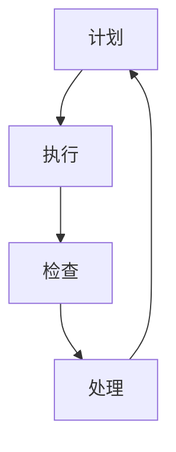

                 

### 《PDCA循环：持续改进的利器》

> **关键词：**PDCA循环、持续改进、质量管理、人力资源管理、实践应用、案例研究

> **摘要：**本文将深入探讨PDCA循环这一持续改进的利器，详细介绍PDCA循环的基础概念、四个阶段及其在多个领域中的应用。通过具体案例和实践，读者将了解如何将PDCA循环应用于质量管理、人力资源管理以及项目管理等实际场景中，实现持续改进和效率提升。

## 第一部分：PDCA循环基础

### 第1章：PDCA循环概述

#### 1.1 PDCA循环的历史背景

PDCA循环，又称戴明循环，是一种广泛用于管理和质量控制的循环方法。其起源可以追溯到20世纪中期，由美国统计学家威廉·爱德华·戴明（William Edward Deming）提出。戴明博士在日本战后经济发展中发挥了重要作用，他的管理思想深刻影响了日本企业的质量管理，并在全球范围内得到广泛认可和应用。

PDCA循环最初应用于制造行业，但随着时间的推移，其应用范围逐渐扩展到服务行业、人力资源管理、项目管理等多个领域。PDCA循环以其简单易行、效果显著的特点，成为了现代企业管理中不可或缺的工具之一。

#### 1.2 PDCA循环的概念与内涵

PDCA循环由四个阶段组成，分别是计划（Plan）、执行（Do）、检查（Check）和处理（Act）。这四个阶段相互联系，形成了一个闭环，从而实现持续改进的目标。

- **计划（Plan）：**在这个阶段，明确目标和制定行动计划。具体包括目标设定、资源分配、任务分工等。
- **执行（Do）：**执行阶段是将计划付诸实施的过程。通过标准操作流程和具体执行步骤，确保计划得到有效执行。
- **检查（Check）：**检查阶段是对执行结果进行评估和反馈。通过数据收集和分析，发现问题和不足，为改进提供依据。
- **处理（Act）：**处理阶段是针对检查中发现的问题制定改进措施，并实施这些措施，以防止问题再次发生。

PDCA循环的核心理念在于通过循环反复的实践，不断改进和完善管理过程，从而实现质量的提升和效率的优化。

#### 1.3 PDCA循环的优势与应用场景

PDCA循环具有以下几个显著优势：

1. **简单易行：**PDCA循环结构简单，易于理解和操作，适用于各种规模的组织。
2. **灵活性：**PDCA循环适用于不同领域，可以根据实际需求进行调整和优化。
3. **系统性：**PDCA循环将管理过程分为四个阶段，形成一个完整的闭环，确保每个环节都得到有效控制。
4. **持续改进：**PDCA循环强调通过循环反复的实践，实现持续改进，提高组织的整体绩效。

PDCA循环适用于以下应用场景：

1. **质量管理：**在制造和服务行业中，PDCA循环被广泛应用于质量管理的各个环节，如产品制造、服务提供、客户满意度提升等。
2. **人力资源管理：**在人才招聘、培训、绩效评估和激励等方面，PDCA循环可以帮助企业实现人力资源管理的持续优化。
3. **项目管理：**在项目规划、执行、监控和收尾阶段，PDCA循环可以帮助项目经理实现项目的顺利进行和目标达成。
4. **生产管理：**在生产线的设计、运营和管理过程中，PDCA循环可以用于生产效率的提升和生产质量的保障。

### 总结

PDCA循环是一种简单而有效的持续改进工具，通过计划、执行、检查和处理四个阶段的循环反复，可以帮助组织不断优化管理过程，提高绩效和效率。在接下来的章节中，我们将详细探讨PDCA循环的四个阶段及其在具体应用中的实施方法。

## 第2章：PDCA循环的四个阶段

PDCA循环由四个核心阶段组成，分别是计划（Plan）、执行（Do）、检查（Check）和处理（Act）。每个阶段都有其独特的目标和任务，且相互关联，形成一个完整的闭环，从而实现持续改进的目标。

### 2.1 计划（Plan）阶段

#### 2.1.1 目标设定与计划制定

计划阶段是PDCA循环的起点，主要任务是设定目标和制定详细的行动计划。目标设定是计划阶段的核心，一个明确且可量化的目标有助于指导后续的行动和评估。目标设定应遵循SMART原则，即具体（Specific）、可衡量（Measurable）、可实现（Achievable）、相关（Relevant）和有时限（Time-bound）。

例如，一个制造企业的目标可以是“在下一个季度将生产效率提高10%”。为了实现这一目标，企业需要制定详细的行动计划，包括具体的执行步骤、所需资源、责任分工和时间表。

#### 2.1.2 资源分配与任务分工

在制定行动计划后，需要确定实现目标所需的资源和分配这些资源。资源包括人力、物力、财力和时间等。在资源分配过程中，要确保每个任务都有明确的责任人，并为其提供所需的资源和支持。

例如，如果目标是提高生产效率，企业需要分配适当的生产设备、技术人员和原材料。此外，还需明确每个部门或个人的具体任务和职责，以确保计划的有效执行。

#### 伪代码：目标设定与资源分配

```
# 目标设定
set SMART Goal

# 资源分配
Allocate Resources {
  Human: Allocate workforce
  Material: Allocate materials
  Equipment: Allocate machines
  Time: Allocate timeline
}

# 任务分工
Task Allocation {
  for each task in Plan:
    Assign Responsible Person
    Assign Required Resources
}
```

#### 实例：资源分配与任务分工

假设某企业计划在三个月内提升生产效率10%，以下是具体的资源分配和任务分工：

1. **目标设定：**提升生产效率10%。
2. **资源分配：**
   - **人力：**增加5名技术人员，专门负责生产线的优化和问题解决。
   - **物料：**采购10台新型生产设备，提高生产效率。
   - **设备：**现有生产线进行全面检修，确保设备运行稳定。
   - **时间：**分阶段实施，每月评估进度，根据实际情况调整计划。
3. **任务分工：**
   - 技术部：负责生产线的优化和新型设备的安装与调试。
   - 生产部：负责生产任务的分配和监督，确保计划顺利执行。
   - 质检部：负责产品质量的监控和问题反馈。

通过明确的资源分配和任务分工，企业可以确保每个阶段都有明确的执行方向和责任人，从而提高计划的执行效率。

### 2.2 执行（Do）阶段

#### 2.2.1 执行过程与标准操作流程

执行阶段是将计划付诸实施的过程。在这个阶段，需要按照计划中的步骤和标准操作流程进行操作，确保每个环节都按照预定目标进行。标准操作流程（SOP）是执行阶段的核心，它详细描述了每个任务的执行步骤、所需资源和预期结果。

#### 2.2.2 执行中的问题处理

在执行过程中，可能会遇到各种问题，如设备故障、人员短缺或生产效率未达到预期等。及时处理这些问题是确保计划顺利执行的关键。

1. **问题识别：**在执行过程中，要密切关注各个环节的执行情况，及时发现潜在问题和实际发生的异常情况。
2. **问题分析：**对问题进行深入分析，找出问题的根本原因，而不是仅仅解决表面现象。
3. **问题解决：**针对分析结果，制定具体的解决方案，并迅速实施。
4. **问题反馈：**将处理结果进行记录和反馈，确保问题得到妥善解决，并为后续的改进提供参考。

#### 伪代码：执行阶段问题处理

```
# 执行阶段问题处理
for each task in Plan:
  Execute Task {
    Monitor Progress
    Detect Issues
    Analyze Issues
    Resolve Issues
    Record Feedback
  }
```

#### 实例：执行阶段问题处理

假设在执行过程中，生产线出现设备故障，导致生产效率下降。以下是具体的处理步骤：

1. **问题识别：**生产部发现生产线上的设备出现故障，生产效率下降。
2. **问题分析：**技术部对设备故障进行详细检查，发现是设备老旧导致。
3. **问题解决：**技术部决定立即更换设备，并制定了详细的更换计划。
4. **问题反馈：**更换设备后，生产效率恢复正常，生产部和技术部进行了反馈和总结。

通过有效的执行和问题处理，企业可以确保计划顺利实施，并不断提高执行效率。

### 2.3 检查（Check）阶段

#### 2.3.1 数据收集与分析

检查阶段是PDCA循环中重要的评估环节，主要任务是收集数据并进行详细分析。数据收集是检查阶段的基础，通过对数据的分析，可以准确了解执行结果和目标达成情况。

1. **数据收集：**收集与目标相关的各种数据，如生产效率、质量指标、成本消耗等。数据来源包括生产记录、客户反馈、内部评估等。
2. **数据分析：**对收集到的数据进行分析，评估目标达成情况和计划执行效果。数据分析可以使用各种统计方法和工具，如饼图、柱状图、回归分析等。

#### 2.3.2 检查结果的反馈与应用

检查阶段的结果是后续改进的重要依据。通过对检查结果的反馈和应用，可以及时调整和优化计划，提高执行效果。

1. **反馈机制：**建立有效的反馈机制，将检查结果及时传达给相关人员和部门，确保每个人都能了解实际情况。
2. **应用措施：**根据检查结果，制定具体的改进措施，如优化操作流程、调整资源配置等。改进措施应具体、可操作，并确保在后续的执行阶段得到有效实施。

#### 伪代码：检查阶段

```
# 检查阶段
Collect Data {
  Data Sources: Production Records, Customer Feedback, Internal Assessments
}

Analyze Data {
  Statistical Methods: Charts, Regression Analysis
}

Feedback Mechanism {
  Communicate Results
  Develop Improvement Measures
}
```

#### 实例：检查阶段

假设企业完成了一个生产效率提升项目，以下是具体的检查阶段步骤：

1. **数据收集：**生产部、质检部和技术部收集了生产效率、质量指标和成本消耗等数据。
2. **数据分析：**通过数据分析，发现生产效率提升了8%，但质量指标有所下降。
3. **反馈机制：**将分析结果反馈给管理层，并提出改进建议，如优化生产流程、加强质量管理等。
4. **应用措施：**根据反馈结果，制定了具体的改进计划，包括优化生产流程、加强员工培训和设备升级等。

通过有效的数据收集和分析，企业可以准确了解计划执行情况，为后续改进提供科学依据。

### 2.4 处理（Act）阶段

#### 2.4.1 改进措施的制定与实施

处理阶段是PDCA循环的最后一步，主要任务是针对检查阶段发现的问题制定改进措施，并确保这些措施得到有效实施。

1. **改进措施制定：**根据检查结果，分析问题原因，制定具体的改进措施。改进措施应具有可操作性，确保能够解决实际问题。
2. **改进措施实施：**将改进措施纳入执行阶段，确保每个环节都按照计划进行。在实施过程中，要密切关注改进措施的执行情况，及时发现和解决新的问题。

#### 2.4.2 防止问题再发生的措施

在改进措施实施后，还需采取防止问题再发生的措施，以确保改进效果能够持续。

1. **持续监控：**建立监控机制，对改进措施的执行效果进行持续监控，确保问题得到根本解决。
2. **反馈与优化：**及时收集反馈信息，根据实际情况对改进措施进行调整和优化，确保其能够适应不断变化的环境。

#### 伪代码：处理阶段

```
# 处理阶段
Develop Improvement Measures {
  Analyze Issues
  Create Actionable Solutions
}

Implement Improvements {
  Integrate into Operations
  Monitor Execution
}

Prevent Recurrence {
  Establish Monitoring System
  Collect Feedback
  Adjust and Optimize
}
```

#### 实例：处理阶段

假设企业通过PDCA循环发现生产效率提升项目中的主要问题是生产流程不够优化，以下是具体的处理阶段步骤：

1. **改进措施制定：**根据数据分析结果，制定具体的优化生产流程的措施，如重新设计生产线布局、引入自动化设备等。
2. **改进措施实施：**在生产部和技术部的共同努力下，实施优化生产流程的措施，确保每个环节都按照计划进行。
3. **防止问题再发生：**建立持续监控机制，定期评估生产流程的优化效果，并根据实际情况进行调整和优化。

通过有效的处理阶段，企业可以确保改进措施得到有效实施，并防止问题再次发生。

### 总结

PDCA循环的四个阶段——计划、执行、检查和处理，相互关联，形成一个完整的闭环，从而实现持续改进的目标。通过每个阶段的科学规划和执行，企业可以不断提高管理水平和绩效，实现长期发展。在下一章中，我们将探讨PDCA循环在不同领域的具体应用，帮助读者更好地理解和实践这一重要工具。

### 第3章：PDCA循环在质量管理中的应用

PDCA循环在质量管理中具有广泛的应用，可以帮助企业实现质量管理的持续改进和效率提升。在本章中，我们将深入探讨PDCA循环在质量管理中的应用，通过具体案例和实践，展示如何运用PDCA循环提升产品质量和管理水平。

#### 3.1 质量管理的PDCA循环

在质量管理中，PDCA循环被广泛应用于产品开发、生产过程、服务质量监控等环节。通过PDCA循环，企业可以系统地识别和解决质量问题，确保产品和服务的高质量。

1. **计划（Plan）阶段：**在计划阶段，企业需要设定质量目标，制定具体的质量管理计划，包括质量标准的制定、资源的分配、任务的分工等。例如，某制造企业计划在下一季度将产品不良率降低10%，需要制定详细的质量管理计划，包括质量标准的更新、生产线设备的检修、员工培训等。
2. **执行（Do）阶段：**在执行阶段，企业按照质量管理计划进行操作，确保每个环节都按照标准执行。例如，生产线上的操作员按照新的质量标准进行生产，技术人员对生产线设备进行定期检修，以确保生产过程的稳定和质量的控制。
3. **检查（Check）阶段：**在检查阶段，企业需要收集和分析质量数据，评估质量管理计划的效果。例如，通过质量检测设备对产品进行抽样检测，收集质量数据，分析产品的不良率和质量趋势，评估质量管理计划的实施效果。
4. **处理（Act）阶段：**在处理阶段，企业需要根据检查结果，制定和实施改进措施，持续优化质量管理。例如，如果检查发现产品不良率较高，企业需要分析问题原因，制定改进措施，如优化生产工艺、提高员工技能等，并确保改进措施得到有效实施。

#### 3.2 质量问题的发现与处理

在质量管理中，发现和解决质量问题是非常重要的环节。PDCA循环提供了系统的方法，帮助企业及时识别和解决质量问题。

1. **问题识别：**在执行阶段，企业需要密切关注生产过程，及时发现潜在的质量问题。例如，生产线上操作员发现产品表面有划痕，及时报告给质量检测部门。
2. **问题分析：**质量检测部门对发现的问题进行详细分析，找出问题的根本原因。例如，分析划痕的原因是生产线设备磨损导致。
3. **问题解决：**根据问题分析结果，制定具体的解决方案，并迅速实施。例如，技术部门对生产线设备进行维修或更换，确保划痕问题得到解决。
4. **问题反馈：**将问题解决情况进行记录和反馈，确保问题得到妥善解决，并为后续的质量管理提供参考。例如，将问题解决情况报告给管理层，并提出改进建议，如加强设备维护、提高生产标准等。

#### 实例：质量问题发现与处理

假设某企业在生产过程中发现产品不良率较高，以下是具体的处理过程：

1. **问题识别：**质量检测部门发现产品不良率高达15%，明显高于预定目标。
2. **问题分析：**通过数据分析，发现产品不良的主要原因是原材料质量不稳定和生产工艺不完善。
3. **问题解决：**技术部门对原材料供应商进行评估，更换了原材料供应商，并对生产工艺进行了优化，提高了生产过程的稳定性。
4. **问题反馈：**将问题解决情况报告给管理层，并提出改进建议，如加强原材料质量控制、定期培训生产人员等。

通过有效的PDCA循环，企业可以及时发现和解决质量问题，确保产品质量的稳定和提升。

#### 3.3 质量改进的实践案例

在实际应用中，PDCA循环在质量管理中取得了显著成效。以下是一个具体案例，展示PDCA循环在质量改进中的应用。

**案例：某电子制造企业质量改进案例**

**问题描述：**某电子制造企业发现其产品的不良率较高，影响了市场竞争力。企业希望通过PDCA循环实现质量改进。

**计划（Plan）阶段：**
1. **设定目标：**将产品不良率降低到5%以下。
2. **制定计划：**分析产品不良的原因，包括原材料质量、生产工艺、检测流程等，制定详细的改进计划。
3. **资源分配：**增加检测设备、培训员工，确保改进计划得到充分资源支持。

**执行（Do）阶段：**
1. **执行步骤：**按照改进计划，实施新工艺、加强原材料质量控制、优化检测流程。
2. **问题处理：**在执行过程中，及时识别和解决出现的问题，如设备故障、员工操作不当等。

**检查（Check）阶段：**
1. **数据收集：**收集产品质量数据，包括不良率、合格率等。
2. **数据分析：**通过统计分析，评估改进效果，识别新的问题。

**处理（Act）阶段：**
1. **改进措施：**根据数据分析结果，制定和实施具体的改进措施，如优化生产流程、加强员工培训等。
2. **防止再发：**建立监控机制，定期评估改进效果，确保问题得到根本解决。

通过PDCA循环的持续应用，该企业将产品不良率降低到3%以下，产品质量显著提升，市场竞争力得到增强。

#### 总结

PDCA循环在质量管理中的应用，可以帮助企业系统地识别和解决质量问题，实现质量的持续改进。通过计划、执行、检查和处理四个阶段的循环反复，企业可以不断提高质量管理水平，确保产品和服务的高质量。在下一章中，我们将探讨PDCA循环在人力资源管理中的应用，帮助读者进一步了解这一重要工具在不同领域的应用。

### 第4章：PDCA循环在人力资源管理中的应用

PDCA循环在人力资源管理中也具有广泛的应用，可以帮助企业实现人才管理的持续优化和效率提升。在本章中，我们将深入探讨PDCA循环在人力资源管理中的应用，通过具体案例和实践，展示如何运用PDCA循环提升人才管理水平。

#### 4.1 人力资源管理中的PDCA循环

在人力资源管理中，PDCA循环被广泛应用于人才招聘、培训、绩效评估和激励等方面。通过PDCA循环，企业可以系统地识别和解决人力资源问题，确保人才管理的有效性。

1. **计划（Plan）阶段：**在计划阶段，企业需要设定人力资源管理的目标和计划，包括招聘策略、培训计划、绩效评估体系等。例如，某企业计划在下一季度提升员工满意度，需要制定详细的人力资源管理计划，包括招聘合适的员工、开展员工培训、优化绩效评估体系等。
2. **执行（Do）阶段：**在执行阶段，企业按照人力资源管理计划进行操作，确保每个环节都按照标准执行。例如，人力资源部门按照招聘计划进行人才招聘，培训部门按照培训计划开展员工培训，绩效评估部门按照绩效评估体系进行评估等。
3. **检查（Check）阶段：**在检查阶段，企业需要收集和分析人力资源数据，评估人力资源管理计划的效果。例如，通过员工满意度调查、培训效果评估、绩效评估结果等数据，评估人力资源管理计划的实施效果。
4. **处理（Act）阶段：**在处理阶段，企业需要根据检查结果，制定和实施改进措施，持续优化人力资源管理。例如，如果员工满意度较低，企业需要分析原因，制定和实施改进措施，如优化工作环境、提高员工福利待遇等。

#### 4.2 人才招聘与培训的PDCA循环应用

人才招聘和培训是企业人力资源管理的重要组成部分。通过PDCA循环，企业可以系统地管理和优化人才招聘与培训过程。

1. **计划（Plan）阶段：**
   - **设定目标：**明确招聘和培训的目标，如招聘合适的人才、提升员工技能等。
   - **制定计划：**根据目标，制定详细的招聘和培训计划，包括招聘渠道、招聘流程、培训内容、培训时间等。
   - **资源分配：**确保招聘和培训计划有充足的资源支持，如人力、财务和时间等。

2. **执行（Do）阶段：**
   - **执行步骤：**按照招聘和培训计划，实施招聘和培训活动。例如，通过招聘网站、社交媒体等渠道发布招聘信息，组织面试和培训课程。
   - **问题处理：**在执行过程中，及时识别和解决出现的问题，如招聘渠道不够有效、培训内容不符合实际需求等。

3. **检查（Check）阶段：**
   - **数据收集：**收集招聘和培训的数据，如招聘成功率、培训合格率等。
   - **数据分析：**通过数据分析，评估招聘和培训的效果，识别存在的问题。

4. **处理（Act）阶段：**
   - **改进措施：**根据数据分析结果，制定和实施改进措施，如优化招聘渠道、调整培训内容等。
   - **防止再发：**建立监控机制，定期评估改进效果，确保问题得到根本解决。

#### 实例：人才招聘与培训的PDCA循环应用

假设某企业计划在下一季度提升员工满意度，以下是具体的PDCA循环应用：

**计划（Plan）阶段：**
1. **设定目标：**提升员工满意度。
2. **制定计划：**通过员工满意度调查，分析现有问题和需求，制定详细的招聘和培训计划。例如，增加招聘渠道，提高招聘质量；增加员工技能培训，提高员工技能水平。
3. **资源分配：**确保招聘和培训计划有充足的资源支持，如增加招聘预算、安排培训时间等。

**执行（Do）阶段：**
1. **执行步骤：**按照招聘和培训计划，实施招聘和培训活动。例如，通过招聘网站、社交媒体等渠道发布招聘信息，组织面试和培训课程。
2. **问题处理：**在执行过程中，及时识别和解决出现的问题，如招聘渠道不够有效、培训内容不符合实际需求等。

**检查（Check）阶段：**
1. **数据收集：**收集招聘和培训的数据，如招聘成功率、培训合格率等。
2. **数据分析：**通过数据分析，评估招聘和培训的效果，识别存在的问题。例如，发现招聘成功率较低，可能是招聘渠道不够有效；发现培训合格率较低，可能是培训内容不符合实际需求。

**处理（Act）阶段：**
1. **改进措施：**根据数据分析结果，制定和实施改进措施，如优化招聘渠道、调整培训内容等。
2. **防止再发：**建立监控机制，定期评估改进效果，确保问题得到根本解决。例如，定期进行员工满意度调查，根据调查结果调整招聘和培训计划。

通过PDCA循环的持续应用，企业可以不断提高人才管理水平，提升员工满意度和绩效。

#### 4.3 人员绩效评估与激励机制的PDCA循环应用

人员绩效评估和激励机制是人力资源管理的重要环节。通过PDCA循环，企业可以系统地管理和优化绩效评估和激励机制。

1. **计划（Plan）阶段：**
   - **设定目标：**明确绩效评估和激励机制的目标，如提高员工工作效率、提升员工满意度等。
   - **制定计划：**根据目标，制定详细的绩效评估和激励机制计划，包括评估标准、评估流程、激励措施等。
   - **资源分配：**确保绩效评估和激励机制有充足的资源支持，如绩效评估工具、激励资金等。

2. **执行（Do）阶段：**
   - **执行步骤：**按照绩效评估和激励机制计划，实施评估和激励活动。例如，定期进行绩效评估，发放激励奖金等。
   - **问题处理：**在执行过程中，及时识别和解决出现的问题，如评估标准不明确、激励措施不合适等。

3. **检查（Check）阶段：**
   - **数据收集：**收集绩效评估和激励机制的数据，如员工满意度、绩效评估结果等。
   - **数据分析：**通过数据分析，评估绩效评估和激励机制的效果，识别存在的问题。

4. **处理（Act）阶段：**
   - **改进措施：**根据数据分析结果，制定和实施改进措施，如调整评估标准、优化激励措施等。
   - **防止再发：**建立监控机制，定期评估改进效果，确保问题得到根本解决。例如，定期收集员工反馈，根据反馈调整绩效评估和激励机制。

#### 实例：人员绩效评估与激励机制的PDCA循环应用

假设某企业计划优化人员绩效评估和激励机制，以下是具体的PDCA循环应用：

**计划（Plan）阶段：**
1. **设定目标：**优化人员绩效评估和激励机制，提高员工工作效率和满意度。
2. **制定计划：**根据目标，制定详细的绩效评估和激励机制计划。例如，制定明确的绩效评估标准，建立公平、透明的评估流程；设计多种激励措施，如奖金、晋升、培训等。
3. **资源分配：**确保绩效评估和激励机制有充足的资源支持，如制定详细的评估标准、提供培训机会等。

**执行（Do）阶段：**
1. **执行步骤：**按照绩效评估和激励机制计划，实施评估和激励活动。例如，定期进行绩效评估，发放激励奖金等。
2. **问题处理：**在执行过程中，及时识别和解决出现的问题，如评估标准不明确、激励措施不合适等。

**检查（Check）阶段：**
1. **数据收集：**收集绩效评估和激励机制的数据，如员工满意度、绩效评估结果等。
2. **数据分析：**通过数据分析，评估绩效评估和激励机制的效果，识别存在的问题。例如，发现员工满意度较低，可能是评估标准不明确、激励措施不合适。

**处理（Act）阶段：**
1. **改进措施：**根据数据分析结果，制定和实施改进措施，如调整评估标准、优化激励措施等。
2. **防止再发：**建立监控机制，定期评估改进效果，确保问题得到根本解决。例如，定期收集员工反馈，根据反馈调整绩效评估和激励机制。

通过PDCA循环的持续应用，企业可以不断提高人员绩效评估和激励机制的水平，提升员工工作效率和满意度。

#### 总结

PDCA循环在人力资源管理中的应用，可以帮助企业系统地管理和优化人才招聘、培训和绩效评估等环节，实现人力资源管理的持续改进和效率提升。通过计划、执行、检查和处理四个阶段的循环反复，企业可以不断提高人才管理水平，确保人才与企业发展的同步提升。在下一章中，我们将探讨PDCA循环在其他领域的应用，帮助读者更全面地了解这一重要工具。

## 第5章：PDCA循环在其他领域的应用

PDCA循环作为一种简单而有效的管理工具，其应用范围不仅限于质量管理、人力资源管理和项目管理，还可以广泛应用于生产管理、服务管理等多个领域。在本章中，我们将详细探讨PDCA循环在这些领域的应用，通过具体案例和实践，展示如何运用PDCA循环实现效率提升和管理优化。

### 5.1 项目管理中的PDCA循环

在项目管理中，PDCA循环被广泛应用于项目规划、执行、监控和收尾阶段，帮助项目经理实现项目的顺利进行和目标达成。

#### 5.1.1 项目规划

项目规划阶段是项目管理的起点，主要任务是明确项目目标、制定详细的项目计划。通过PDCA循环，项目经理可以系统地规划项目，确保每个环节都有明确的执行方向。

1. **计划（Plan）阶段：**项目经理需要设定项目目标，制定详细的计划，包括项目范围、时间表、资源需求等。例如，某企业计划在六个月内开发一款新产品，需要制定详细的项目规划，包括开发目标、开发流程、资源配置等。
2. **执行（Do）阶段：**项目经理按照项目规划进行操作，确保项目按计划执行。例如，开发团队按照项目规划开展产品开发工作，确保每个开发环节都按照预定目标进行。
3. **检查（Check）阶段：**项目经理需要对项目的执行情况进行监控和评估，确保项目进度和质量符合预期。例如，通过定期项目会议、进度报告等方式，评估项目进展情况，发现潜在问题。
4. **处理（Act）阶段：**根据检查结果，项目经理需要制定和实施改进措施，确保项目目标的达成。例如，如果项目进度落后于计划，项目经理需要分析原因，制定和实施改进措施，如调整资源分配、优化工作流程等。

#### 5.1.2 项目执行

项目执行阶段是PDCA循环的核心环节，通过系统的执行和管理，项目经理可以确保项目目标的顺利实现。

1. **执行过程与标准操作流程：**在执行阶段，项目经理需要制定标准操作流程（SOP），确保每个任务都有明确的执行步骤和标准。例如，产品开发过程中，项目经理需要制定详细的设计、开发、测试等流程，确保每个环节都有规范的操作步骤。
2. **执行中的问题处理：**在执行过程中，项目经理需要密切关注项目的执行情况，及时发现和解决出现的问题。例如，如果开发过程中遇到技术难题，项目经理需要与技术团队共同分析和解决。

#### 5.1.3 项目监控

项目监控阶段是PDCA循环的重要环节，通过有效的监控和评估，项目经理可以确保项目进度和质量。

1. **数据收集：**项目经理需要收集与项目相关的各种数据，如进度数据、成本数据、质量数据等。这些数据可以用于项目监控和评估。
2. **数据分析：**通过数据分析，项目经理可以评估项目的执行情况，发现潜在问题。例如，通过进度数据的分析，项目经理可以了解项目进度是否按计划进行，通过成本数据的分析，可以评估项目成本是否在预算范围内。

#### 5.1.4 项目收尾

项目收尾阶段是PDCA循环的结束环节，主要任务是确保项目目标的最终实现。

1. **项目总结：**项目经理需要对项目进行总结，评估项目的执行效果。例如，总结项目过程中遇到的问题、解决措施以及项目的最终成果。
2. **项目报告：**项目经理需要编写项目报告，总结项目的执行情况，向管理层和项目团队汇报。

#### 实例：项目管理中的PDCA循环应用

假设某企业计划开发一款新的移动应用程序，以下是具体的PDCA循环应用：

**计划（Plan）阶段：**
1. **设定目标：**开发一款功能完善、用户体验良好的移动应用程序。
2. **制定计划：**制定详细的项目规划，包括需求分析、设计、开发、测试等环节，明确项目的时间表、资源配置等。

**执行（Do）阶段：**
1. **执行步骤：**按照项目规划，进行需求分析、设计、开发、测试等环节，确保每个环节都有明确的执行步骤和标准。
2. **问题处理：**在开发过程中，及时识别和解决出现的问题，如技术难题、资源不足等。

**检查（Check）阶段：**
1. **数据收集：**收集项目进度数据、成本数据、质量数据等，进行项目监控和评估。
2. **数据分析：**通过数据分析，评估项目执行情况，发现潜在问题。

**处理（Act）阶段：**
1. **改进措施：**根据数据分析结果，制定和实施改进措施，如调整资源分配、优化工作流程等。
2. **防止再发：**建立监控机制，定期评估改进效果，确保问题得到根本解决。

通过PDCA循环的持续应用，项目经理可以确保项目目标的顺利实现，提高项目管理的效率和效果。

### 5.2 生产管理中的PDCA循环

在制造业中，PDCA循环被广泛应用于生产线的优化、生产效率的提升和生产质量的保障。

#### 5.2.1 生产线的优化

生产线优化是生产管理的重要任务，通过PDCA循环，企业可以系统地识别和解决生产线中的问题，实现生产线的优化。

1. **计划（Plan）阶段：**在计划阶段，企业需要明确生产线优化的目标和计划，包括优化目标、优化方案、资源需求等。例如，某企业计划在三个月内优化生产线，提高生产效率10%。
2. **执行（Do）阶段：**在执行阶段，企业按照优化计划进行操作，实施优化方案。例如，企业可以通过引入自动化设备、优化生产流程、减少浪费等方式，提高生产效率。
3. **检查（Check）阶段：**在检查阶段，企业需要对优化效果进行评估，确保优化目标的实现。例如，通过数据收集和分析，评估生产效率是否提高、产品质量是否提升等。
4. **处理（Act）阶段：**在处理阶段，企业需要根据检查结果，制定和实施改进措施，持续优化生产线。例如，如果生产效率未达到预期，企业需要分析原因，制定和实施改进措施，如优化生产流程、提高员工技能等。

#### 5.2.2 生产效率的提升

通过PDCA循环，企业可以系统性地提升生产效率，实现成本优化和利润提升。

1. **计划（Plan）阶段：**在计划阶段，企业需要设定生产效率提升的目标，制定详细的提升计划，包括提升措施、资源需求等。例如，某企业计划在一年内将生产效率提高15%。
2. **执行（Do）阶段：**在执行阶段，企业按照提升计划进行操作，实施提升措施。例如，企业可以通过优化生产流程、提高设备利用率、减少停机时间等方式，提高生产效率。
3. **检查（Check）阶段：**在检查阶段，企业需要对生产效率提升效果进行评估，确保提升目标的实现。例如，通过数据收集和分析，评估生产效率是否提高、成本是否降低等。
4. **处理（Act）阶段：**在处理阶段，企业需要根据检查结果，制定和实施改进措施，持续提升生产效率。例如，如果生产效率未达到预期，企业需要分析原因，制定和实施改进措施，如优化生产流程、提高员工技能等。

#### 5.2.3 生产质量的保障

通过PDCA循环，企业可以确保生产质量的高标准和稳定，提高市场竞争力。

1. **计划（Plan）阶段：**在计划阶段，企业需要设定生产质量的目标，制定详细的保障计划，包括质量标准、检验流程等。例如，某企业计划在下一季度将产品质量合格率提高至98%。
2. **执行（Do）阶段：**在执行阶段，企业按照保障计划进行操作，确保生产过程符合质量标准。例如，企业可以通过加强员工培训、优化生产工艺、提高检测设备精度等方式，保障生产质量。
3. **检查（Check）阶段：**在检查阶段，企业需要对生产质量进行监控和评估，确保质量标准的实现。例如，通过质量检验数据的收集和分析，评估产品质量是否达到预期。
4. **处理（Act）阶段：**在处理阶段，企业需要根据检查结果，制定和实施改进措施，持续保障生产质量。例如，如果产品质量未达到预期，企业需要分析原因，制定和实施改进措施，如优化生产工艺、提高员工技能等。

#### 实例：生产管理中的PDCA循环应用

假设某制造企业计划优化生产线，以下是具体的PDCA循环应用：

**计划（Plan）阶段：**
1. **设定目标：**优化生产线，提高生产效率10%。
2. **制定计划：**制定详细的优化方案，包括引入自动化设备、优化生产流程、减少浪费等。
3. **资源分配：**确保优化计划有充足的资源支持，如资金、人力等。

**执行（Do）阶段：**
1. **执行步骤：**按照优化方案，引入自动化设备，优化生产流程，减少浪费等。
2. **问题处理：**在执行过程中，及时识别和解决出现的问题，如设备故障、生产流程不顺畅等。

**检查（Check）阶段：**
1. **数据收集：**收集生产效率数据、成本数据等，进行项目监控和评估。
2. **数据分析：**通过数据分析，评估优化效果，如生产效率是否提高、成本是否降低等。

**处理（Act）阶段：**
1. **改进措施：**根据数据分析结果，制定和实施改进措施，如优化生产流程、提高设备利用率等。
2. **防止再发：**建立监控机制，定期评估改进效果，确保问题得到根本解决。

通过PDCA循环的持续应用，企业可以不断提高生产效率和质量，确保生产线的稳定和高效运行。

### 5.3 服务管理中的PDCA循环

在服务行业中，PDCA循环被广泛应用于服务流程的优化、服务质量的提升和服务效率的提高。

#### 5.3.1 服务流程的优化

服务流程优化是服务管理的重要任务，通过PDCA循环，企业可以系统地识别和解决服务流程中的问题，实现服务流程的优化。

1. **计划（Plan）阶段：**在计划阶段，企业需要明确服务流程优化的目标和计划，包括优化目标、优化方案、资源需求等。例如，某服务企业计划在三个月内优化客户服务流程，提高客户满意度。
2. **执行（Do）阶段：**在执行阶段，企业按照优化计划进行操作，实施优化方案。例如，企业可以通过简化服务流程、引入自动化系统、优化人力资源配置等方式，提高服务效率。
3. **检查（Check）阶段：**在检查阶段，企业需要对优化效果进行评估，确保优化目标的实现。例如，通过客户满意度调查、服务效率数据等，评估服务流程优化的效果。
4. **处理（Act）阶段：**在处理阶段，企业需要根据检查结果，制定和实施改进措施，持续优化服务流程。例如，如果客户满意度未达到预期，企业需要分析原因，制定和实施改进措施，如优化服务流程、提高员工服务水平等。

#### 5.3.2 服务质量的提升

通过PDCA循环，企业可以系统性地提升服务质量，提高客户满意度。

1. **计划（Plan）阶段：**在计划阶段，企业需要设定服务质量提升的目标，制定详细的质量提升计划，包括质量标准、检测流程等。例如，某服务企业计划在下一季度将客户服务质量提高至90%。
2. **执行（Do）阶段：**在执行阶段，企业按照质量提升计划进行操作，确保服务过程符合质量标准。例如，企业可以通过加强员工培训、优化服务流程、提高设备性能等方式，提升服务质量。
3. **检查（Check）阶段：**在检查阶段，企业需要对服务质量进行监控和评估，确保质量标准的实现。例如，通过客户满意度调查、服务质量检测等，评估服务质量是否提升。
4. **处理（Act）阶段：**在处理阶段，企业需要根据检查结果，制定和实施改进措施，持续提升服务质量。例如，如果服务质量未达到预期，企业需要分析原因，制定和实施改进措施，如优化服务流程、提高员工技能等。

#### 5.3.3 服务效率的提高

通过PDCA循环，企业可以系统性地提高服务效率，降低服务成本。

1. **计划（Plan）阶段：**在计划阶段，企业需要设定服务效率提升的目标，制定详细的服务效率提升计划，包括提升措施、资源需求等。例如，某服务企业计划在一年内将服务效率提高15%。
2. **执行（Do）阶段：**在执行阶段，企业按照服务效率提升计划进行操作，实施提升措施。例如，企业可以通过优化服务流程、提高设备性能、减少浪费等方式，提高服务效率。
3. **检查（Check）阶段：**在检查阶段，企业需要对服务效率提升效果进行评估，确保提升目标的实现。例如，通过服务效率数据、成本数据等，评估服务效率是否提高。
4. **处理（Act）阶段：**在处理阶段，企业需要根据检查结果，制定和实施改进措施，持续提高服务效率。例如，如果服务效率未达到预期，企业需要分析原因，制定和实施改进措施，如优化服务流程、提高员工技能等。

#### 实例：服务管理中的PDCA循环应用

假设某服务企业计划优化客户服务流程，以下是具体的PDCA循环应用：

**计划（Plan）阶段：**
1. **设定目标：**优化客户服务流程，提高客户满意度。
2. **制定计划：**制定详细的优化方案，包括简化服务流程、引入自动化系统、优化人力资源配置等。
3. **资源分配：**确保优化计划有充足的资源支持，如资金、人力等。

**执行（Do）阶段：**
1. **执行步骤：**按照优化方案，简化服务流程、引入自动化系统、优化人力资源配置等。
2. **问题处理：**在执行过程中，及时识别和解决出现的问题，如系统故障、员工操作不当等。

**检查（Check）阶段：**
1. **数据收集：**收集客户满意度数据、服务效率数据等，进行项目监控和评估。
2. **数据分析：**通过数据分析，评估优化效果，如客户满意度是否提高、服务效率是否提升等。

**处理（Act）阶段：**
1. **改进措施：**根据数据分析结果，制定和实施改进措施，如优化服务流程、提高员工技能等。
2. **防止再发：**建立监控机制，定期评估改进效果，确保问题得到根本解决。

通过PDCA循环的持续应用，服务企业可以不断提高服务效率和质量，提升客户满意度，增强市场竞争力。

### 总结

PDCA循环在项目管理、生产管理和服务管理中的应用，可以帮助企业实现管理优化和效率提升。通过计划、执行、检查和处理四个阶段的循环反复，企业可以不断提高管理水平，确保项目目标的实现、生产效率的提升和服务质量的提高。在下一章中，我们将探讨PDCA循环的优化与实践，帮助读者更好地理解和应用这一重要工具。

### 第6章：PDCA循环的优化与实践

在掌握了PDCA循环的基本原理和应用之后，如何进一步优化和实施PDCA循环，以实现更高效的管理和持续改进，成为关键问题。本章将讨论PDCA循环的优化方法、在组织文化中的培养以及持续改进的路径。

#### 6.1 PDCA循环的优化方法

PDCA循环的优化是确保其有效性和适应性的关键。以下是一些优化方法：

1. **过程优化：**
   - **流程简化：**减少不必要的步骤和环节，简化流程，降低操作难度。
   - **标准化操作：**建立标准化操作流程（SOP），确保每个环节都有明确的执行标准和操作步骤。
   - **持续流程改进：**通过不断收集和反馈数据，对流程进行优化和改进，提高效率和效果。

2. **工具与方法：**
   - **数据驱动决策：**利用数据分析工具和方法，如统计过程控制（SPC）、价值流图（VSM）等，对PDCA循环中的数据进行深入分析，为改进提供依据。
   - **质量管理工具：**引入先进的质量管理工具，如六西格玛（Six Sigma）、ISO标准等，提高质量管理水平。

3. **团队协作：**
   - **跨部门协作：**鼓励不同部门之间的协作，确保PDCA循环的全过程得到有效执行。
   - **团队培训：**定期组织培训，提高员工对PDCA循环的理解和应用能力。

#### 6.2 PDCA循环在组织文化中的培养

PDCA循环的有效实施依赖于组织文化的支持和培养。以下是一些培养方法：

1. **领导层的支持：**
   - **明确期望：**领导层需要明确表达对PDCA循环的期望和重要性，确保全员参与。
   - **示范作用：**领导层应率先应用PDCA循环，树立榜样，推动文化的转变。

2. **全员参与：**
   - **培训与教育：**为员工提供PDCA循环的培训，提高他们的理解和应用能力。
   - **参与决策：**鼓励员工参与PDCA循环的每个阶段，提供反馈和建议，增强他们的主人翁意识。

3. **激励与反馈：**
   - **激励机制：**建立激励机制，奖励在PDCA循环中表现突出的个人和团队。
   - **反馈与改进：**定期收集员工的反馈，对PDCA循环的实施效果进行评估和改进。

#### 6.3 PDCA循环的持续改进路径

持续改进是PDCA循环的核心目标。以下是一个持续改进路径的步骤：

1. **目标设定：**明确持续改进的目标和方向，确保与组织战略一致。

2. **数据收集：**系统地收集与改进目标相关的数据，包括内部和外部数据，如客户反馈、生产数据、市场趋势等。

3. **数据分析：**对收集到的数据进行分析，识别问题和机会。

4. **制定改进计划：**根据数据分析结果，制定详细的改进计划，包括改进措施、责任分工、时间表等。

5. **实施改进：**按照改进计划，实施具体的改进措施。

6. **评估效果：**对改进效果进行评估，确保改进目标实现。

7. **反馈与优化：**根据评估结果，对改进措施进行反馈和优化，为下一次循环提供参考。

#### 伪代码：PDCA循环持续改进路径

```
# 持续改进路径

Set Improvement Goals {
  Align with Organizational Strategy
}

Collect Data {
  Internal Data
  External Data
}

Analyze Data {
  Identify Issues and Opportunities
}

Develop Improvement Plan {
  Define Actions, Responsibilities, Timeline
}

Implement Improvements {
  Execute Improvement Actions
}

Evaluate Results {
  Assess Improvement Effectiveness
}

Feedback and Optimize {
  Adjust Improvements
}
```

#### 实例：PDCA循环持续改进路径

假设某企业计划提升产品创新能力，以下是具体的持续改进路径：

1. **目标设定：**提升产品创新能力，确保产品在市场上具有竞争力。

2. **数据收集：**收集产品创新数据，如客户需求反馈、市场趋势分析、竞争对手动态等。

3. **数据分析：**分析数据，识别产品创新的瓶颈和机会。

4. **制定改进计划：**制定详细的改进计划，包括引入创新团队、优化创新流程、提供创新培训等。

5. **实施改进：**按照改进计划，引入创新团队，优化创新流程，提供创新培训。

6. **评估效果：**通过客户反馈和市场数据，评估产品创新的效果。

7. **反馈与优化：**根据评估结果，对改进措施进行反馈和优化，如调整创新流程、增加创新资源投入等。

通过持续的PDCA循环，企业可以不断提高产品创新能力，确保产品在市场上具有持续竞争力。

### 总结

PDCA循环的优化与实践是企业实现持续改进和效率提升的关键。通过优化方法、组织文化培养和持续改进路径，企业可以确保PDCA循环的有效实施和长期效果。在下一章中，我们将通过具体案例研究，进一步探讨PDCA循环在不同领域的应用效果。

### 第7章：PDCA循环实践案例解析

为了更好地理解PDCA循环在实际应用中的效果，以下我们将通过三个具体案例来解析PDCA循环在制造业、服务业和科技创新企业的应用，并详细讨论每个案例的实现过程、关键成功因素以及面临的挑战。

#### 7.1 案例一：某制造业企业质量改进案例

**问题描述：**某制造业企业发现其产品的不良率较高，影响了市场声誉和客户满意度。

**计划（Plan）阶段：**
1. **设定目标：**将产品不良率降低20%。
2. **资源分配：**增加检测设备、培训员工，确保改进计划得到充分资源支持。
3. **制定计划：**通过数据分析，找出不良产品的主要原因，如原材料质量、生产工艺、检测流程等。

**执行（Do）阶段：**
1. **执行步骤：**按照改进计划，实施新工艺、加强原材料质量控制、优化检测流程。
2. **问题处理：**在执行过程中，及时识别和解决出现的问题，如设备故障、员工操作不当等。

**检查（Check）阶段：**
1. **数据收集：**收集产品质量数据，包括不良率、合格率等。
2. **数据分析：**通过统计分析，评估改进效果，识别新的问题。

**处理（Act）阶段：**
1. **改进措施：**根据数据分析结果，制定和实施具体的改进措施，如优化生产流程、加强员工培训等。
2. **防止再发：**建立监控机制，定期评估改进效果，确保问题得到根本解决。

**关键成功因素：**
- 明确的目标和计划：通过明确的目标和详细的改进计划，确保每个环节都有明确的执行方向。
- 数据驱动决策：通过数据分析和反馈，及时识别和解决问题，确保改进措施的有效性。

**面临的挑战：**
- 员工接受度：在实施改进过程中，需要提高员工对改进措施的理解和接受度，确保改进措施得到有效执行。
- 资源限制：在资源有限的情况下，需要合理分配资源，确保改进计划有充足的资源支持。

#### 7.2 案例二：某服务业企业效率提升案例

**问题描述：**某服务业企业发现其服务响应速度较慢，影响了客户满意度。

**计划（Plan）阶段：**
1. **设定目标：**将服务响应时间缩短30%。
2. **资源分配：**增加客服人员、引入自动化系统，确保改进计划得到充分资源支持。
3. **制定计划：**通过流程分析，找出服务响应速度慢的主要原因，如客服人员配置、工作流程、技术支持等。

**执行（Do）阶段：**
1. **执行步骤：**按照改进计划，增加客服人员、优化工作流程、引入自动化系统。
2. **问题处理：**在执行过程中，及时识别和解决出现的问题，如人员不足、系统故障等。

**检查（Check）阶段：**
1. **数据收集：**收集服务响应数据，包括响应时间、客户满意度等。
2. **数据分析：**通过统计分析，评估改进效果，识别新的问题。

**处理（Act）阶段：**
1. **改进措施：**根据数据分析结果，制定和实施具体的改进措施，如优化工作流程、加强员工培训等。
2. **防止再发：**建立监控机制，定期评估改进效果，确保问题得到根本解决。

**关键成功因素：**
- 优化流程：通过优化工作流程，减少不必要的环节和等待时间，提高服务响应速度。
- 自动化系统：引入自动化系统，减少人工操作错误，提高服务效率。

**面临的挑战：**
- 员工培训：在引入新系统和工作流程时，需要提供充分的员工培训，确保员工能够熟练操作新系统。
- 技术支持：在实施自动化系统时，需要确保有稳定的技术支持，及时解决系统故障和问题。

#### 7.3 案例三：某科技创新企业创新管理案例

**问题描述：**某科技创新企业发现其创新速度较慢，影响了市场竞争力。

**计划（Plan）阶段：**
1. **设定目标：**将创新周期缩短50%。
2. **资源分配：**增加研发投入、引入创新团队，确保改进计划得到充分资源支持。
3. **制定计划：**通过市场分析和竞争分析，找出创新速度慢的主要原因，如研发流程、团队协作、创新资源分配等。

**执行（Do）阶段：**
1. **执行步骤：**按照改进计划，优化研发流程、加强团队协作、引入创新资源。
2. **问题处理：**在执行过程中，及时识别和解决出现的问题，如研发流程瓶颈、团队协作不力等。

**检查（Check）阶段：**
1. **数据收集：**收集创新数据，包括创新周期、创新成果等。
2. **数据分析：**通过统计分析，评估改进效果，识别新的问题。

**处理（Act）阶段：**
1. **改进措施：**根据数据分析结果，制定和实施具体的改进措施，如优化研发流程、加强团队协作等。
2. **防止再发：**建立监控机制，定期评估改进效果，确保问题得到根本解决。

**关键成功因素：**
- 研发流程优化：通过优化研发流程，减少研发周期和成本，提高创新效率。
- 团队协作：通过加强团队协作，提高创新效率，确保创新成果的及时产出。

**面临的挑战：**
- 创新资源分配：在创新资源有限的情况下，需要合理分配资源，确保关键创新项目得到充分支持。
- 团队协作：在跨部门和跨职能团队中，需要建立有效的沟通机制，确保团队协作顺畅。

### 总结

通过以上三个案例，我们可以看到PDCA循环在不同领域的成功应用。PDCA循环的四个阶段——计划、执行、检查和处理，为每个阶段提供了明确的行动方向和评估标准，确保了改进措施的持续优化和实施。在计划阶段，明确目标和制定详细的计划是关键；在执行阶段，严格按照计划执行和问题处理是确保效果的关键；在检查阶段，数据收集和分析为改进提供了科学依据；在处理阶段，制定和实施改进措施，防止问题再次发生，确保改进效果的持续。

尽管PDCA循环在实践中取得了显著成效，但不同领域和企业在应用过程中仍面临一些挑战，如员工接受度、资源限制、技术支持等。通过不断优化PDCA循环的方法和工具，建立有效的组织文化和持续改进机制，企业可以更好地应对这些挑战，实现持续改进和效率提升。

### 第8章：PDCA循环应用讨论与展望

#### 8.1 PDCA循环的应用挑战与解决方案

尽管PDCA循环在各个领域展现了其强大的持续改进能力，但在实际应用中，仍面临一些挑战。

1. **员工接受度：** PDCA循环的有效实施依赖于员工的参与和认同。一些员工可能对新的管理方法不熟悉或不信任，导致执行力度不够。**解决方案：**通过培训和宣传教育，提高员工对PDCA循环的理解，同时鼓励员工参与决策和反馈，增强他们的主人翁意识。

2. **资源限制：** 在某些情况下，企业可能面临资源限制，如预算不足或人力资源紧张。这可能会影响PDCA循环的实施效果。**解决方案：**通过优先考虑关键问题和优化资源配置，确保PDCA循环的每个阶段都有足够的资源支持。此外，可以借助外部资源和合作伙伴，共同推进PDCA循环的实施。

3. **数据准确性：** 数据是PDCA循环的基础。数据不准确或不完整可能导致错误的决策和改进措施。**解决方案：**建立完善的数据收集和管理体系，确保数据的准确性和完整性。同时，对数据进行分析和验证，提高数据质量。

4. **持续改进动力：** 长期坚持PDCA循环需要持续的动力和激励。企业可能面临动力不足或缺乏持续改进的意识。**解决方案：**建立激励机制，奖励在PDCA循环中表现突出的个人和团队。同时，通过定期的评估和反馈，确保改进措施的有效实施。

#### 8.2 PDCA循环的未来发展趋势

随着信息技术的不断发展和数字化转型的深入推进，PDCA循环在未来将呈现以下发展趋势：

1. **智能化：** 随着人工智能和大数据技术的应用，PDCA循环将更加智能化。通过自动化工具和智能算法，企业可以更高效地收集和分析数据，实时监控和优化管理过程。

2. **数字化：** 数字化工具将广泛应用于PDCA循环的各个阶段，如自动化系统、在线协作工具等。数字化技术可以提高工作效率，减少人为错误，确保PDCA循环的准确执行。

3. **定制化：** 随着企业个性化需求的增加，PDCA循环将逐步向定制化方向发展。企业可以根据自身特点和需求，灵活调整PDCA循环的方法和工具，实现更高效的持续改进。

4. **跨领域应用：** 随着不同领域间融合的加深，PDCA循环将在更多领域得到应用。如健康医疗、金融服务、教育等领域，PDCA循环将帮助这些行业实现管理优化和效率提升。

#### 8.3 PDCA循环在不同领域的创新应用

PDCA循环在未来的应用将更加广泛和深入，以下是一些创新应用的方向：

1. **智能制造：** 在智能制造领域，PDCA循环可以帮助企业实现生产过程的智能化和优化。通过实时监控和数据分析，企业可以及时调整生产策略，提高生产效率和产品质量。

2. **服务创新：** 在服务领域，PDCA循环可以帮助企业优化服务流程，提高客户满意度。通过数据驱动的决策和持续改进，企业可以提供更高质量的服务。

3. **人力资源优化：** 在人力资源管理领域，PDCA循环可以帮助企业优化人才招聘、培训和绩效评估等环节。通过数据分析，企业可以更科学地管理人力资源，提高员工满意度和绩效。

4. **环境保护：** 在环境保护领域，PDCA循环可以帮助企业实现绿色生产和可持续发展。通过持续改进和资源优化，企业可以减少环境污染和资源浪费。

#### 总结

PDCA循环作为一种简单而有效的持续改进工具，其应用前景广阔。在应对应用挑战的同时，未来PDCA循环将向智能化、数字化、定制化方向发展，并在更多领域实现创新应用。通过不断优化和改进，PDCA循环将继续为企业的管理优化和效率提升提供有力支持。

### 附录A：PDCA循环核心概念与联系

#### A.1 PDCA循环核心概念解释

PDCA循环，又称戴明循环，是一种持续改进的管理方法，由四个阶段组成：计划（Plan）、执行（Do）、检查（Check）和处理（Act）。每个阶段都有其特定的目标和任务，形成一个闭环，确保管理过程不断优化和改进。

1. **计划（Plan）：** 设定目标和制定详细的计划。包括目标设定、资源分配、任务分工等。
2. **执行（Do）：** 按照计划执行操作，确保每个环节都按照预定目标进行。包括标准操作流程、问题处理等。
3. **检查（Check）：** 收集数据并进行分析，评估计划执行效果。包括数据收集、数据分析等。
4. **处理（Act）：** 根据检查结果，制定和实施改进措施，确保问题得到解决。包括改进措施的制定、问题反馈等。

#### A.2 PDCA循环的Mermaid流程图



在这个Mermaid流程图中，A表示计划阶段，B表示执行阶段，C表示检查阶段，D表示处理阶段。四个阶段相互连接，形成一个闭环，表示PDCA循环的持续进行和改进。

### 附录B：PDCA循环数学模型与公式详解

#### B.1 PDCA循环中的数学模型

PDCA循环中的数学模型主要用于数据分析和结果评估。以下是一些常用的数学模型和公式：

1. **统计过程控制（SPC）：** 用于监控和评估生产过程的稳定性。
   - **过程能力指数（Cp）：**
     $$ Cp = \frac{\text{USL} - \text{LSL}}{6\sigma} $$
     其中，USL为上限规格限，LSL为下限规格限，σ为过程标准差。

   - **过程性能指数（CpK）：**
     $$ CpK = \min \left( \frac{\text{USL} - \mu}{3\sigma}, \frac{\mu - \text{LSL}}{3\sigma} \right) $$
     其中，μ为过程平均值。

2. **回归分析：** 用于分析两个或多个变量之间的关系。
   - **回归方程：**
     $$ y = \beta_0 + \beta_1x $$
     其中，\( y \) 为因变量，\( x \) 为自变量，\( \beta_0 \) 为截距，\( \beta_1 \) 为斜率。

3. **方差分析（ANOVA）：** 用于比较多个群体的平均数是否有显著差异。
   - **F值计算：**
     $$ F = \frac{MS_{between}}{MS_{within}} $$
     其中，\( MS_{between} \) 为组间均方，\( MS_{within} \) 为组内均方。

#### B.2 PDCA循环中的数学公式与讲解

1. **过程能力指数（Cp）：**
   $$ Cp = \frac{\text{USL} - \text{LSL}}{6\sigma} $$
   - **USL（Upper Specification Limit）：** 上限规格限，表示产品性能的最高允许值。
   - **LSL（Lower Specification Limit）：** 下限规格限，表示产品性能的最低允许值。
   - **σ（Standard Deviation）：** 过程标准差，表示过程变异性的大小。

   **讲解：** 过程能力指数（Cp）用于评估生产过程的能力，衡量生产过程是否能够满足规格要求。Cp值越大，表示生产过程越稳定，能够满足规格要求的能力越强。

2. **过程性能指数（CpK）：**
   $$ CpK = \min \left( \frac{\text{USL} - \mu}{3\sigma}, \frac{\mu - \text{LSL}}{3\sigma} \right) $$
   - **μ（Process Mean）：** 过程平均值，表示生产过程的质量中心。
   - **USL（Upper Specification Limit）：** 上限规格限。
   - **LSL（Lower Specification Limit）：** 下限规格限。
   - **σ（Standard Deviation）：** 过程标准差。

   **讲解：** 过程性能指数（CpK）是过程能力指数的改进版本，它考虑了过程平均值与规格限之间的关系。CpK值越小，表示生产过程偏离规格限的程度越小，过程性能越好。

3. **回归方程：**
   $$ y = \beta_0 + \beta_1x $$
   - **y：** 因变量，表示要预测的数值。
   - **x：** 自变量，表示影响因变量的因素。
   - **β0：** 截距，表示当自变量为零时的因变量值。
   - **β1：** 斜率，表示自变量每增加一个单位时，因变量的变化量。

   **讲解：** 回归方程用于分析两个或多个变量之间的关系，通过斜率β1可以判断自变量对因变量的影响程度。当斜率为正时，自变量增加会导致因变量增加；当斜率为负时，自变量增加会导致因变量减少。

4. **方差分析（ANOVA）F值计算：**
   $$ F = \frac{MS_{between}}{MS_{within}} $$
   - **MS_{between}：** 组间均方，表示组间差异的平均值。
   - **MS_{within}：** 组内均方，表示组内差异的平均值。

   **讲解：** 方差分析（ANOVA）F值用于比较多个群体的平均数是否有显著差异。当F值大于临界值时，表示组间差异显著，拒绝原假设；当F值小于临界值时，表示组间差异不显著，接受原假设。

#### 实例：过程能力指数（Cp）计算

假设某生产过程的上限规格限为USL=100，下限规格限为LSL=0，过程标准差为σ=10，计算过程能力指数（Cp）。

$$ Cp = \frac{100 - 0}{6 \times 10} = \frac{100}{60} \approx 1.67 $$

通过计算得出，该生产过程的能力指数为1.67，表示生产过程能够较好地满足规格要求。

### 附录C：PDCA循环应用案例代码解析

#### C.1 案例代码实现与环境搭建

在本附录中，我们将通过一个具体的Python代码示例，展示如何实现PDCA循环的四个阶段，并对其进行详细解释。

1. **环境搭建：**
   - 安装Python环境（推荐使用Python 3.8及以上版本）。
   - 安装必要的库，如Pandas、NumPy、Matplotlib等。

   ```bash
   pip install pandas numpy matplotlib
   ```

2. **代码实现：**以下是一个简单的Python代码示例，用于模拟PDCA循环的四个阶段。

```python
import pandas as pd
import numpy as np
import matplotlib.pyplot as plt

# 计划（Plan）阶段：设定目标与数据准备
def plan_stage(data, target_col, target_value):
    """
    计划阶段：设定目标值并筛选数据
    """
    data['Target'] = data[target_col] == target_value
    return data

# 执行（Do）阶段：执行操作并处理数据
def do_stage(data, action_func, action_params):
    """
    执行阶段：执行特定操作并处理数据
    """
    data['处理后'] = data.apply(action_func, axis=1, params=action_params)
    return data

# 检查（Check）阶段：数据分析与可视化
def check_stage(data, target_col, target_value):
    """
    检查阶段：检查目标达成情况并进行数据分析
    """
    plt.figure(figsize=(10, 6))
    plt.scatter(data.index, data[target_col], label='原始数据')
    plt.scatter(data.index, data['处理后'], label='处理后数据')
    plt.axvline(x=target_value, color='r', linestyle='--', label='目标值')
    plt.legend()
    plt.title('数据变化趋势')
    plt.show()

# 处理（Act）阶段：根据检查结果制定改进措施
def act_stage(data, action_func, action_params):
    """
    处理阶段：根据检查结果执行改进措施
    """
    data['改进后'] = data.apply(action_func, axis=1, params=action_params)
    return data

# 主函数：模拟PDCA循环
def pdca_loop(data, target_col, target_value, action_func, action_params):
    """
    PDCA循环：模拟四个阶段
    """
    # 计划阶段
    data_plan = plan_stage(data, target_col, target_value)
    
    # 执行阶段
    data_do = do_stage(data_plan, action_func, action_params)
    
    # 检查阶段
    check_stage(data_do, target_col, target_value)
    
    # 处理阶段
    data_act = act_stage(data_do, action_func, action_params)
    return data_act

# 示例数据
data = pd.DataFrame({
    'Value': np.random.normal(size=100),
    'Target': np.random.uniform(0, 100)
})

# 模拟PDCA循环
pdca_loop(data, 'Value', 50, lambda x: x*2, {})

```

#### C.2 代码详细解读与分析

1. **计划（Plan）阶段：**

   - `plan_stage`函数用于设定目标值并筛选数据。在该阶段，我们首先创建了一个名为`Target`的新列，用于标记原始数据中是否达到目标值。

     ```python
     data['Target'] = data[target_col] == target_value
     ```

     这里，`target_col`是我们要比较的数据列，`target_value`是设定的目标值。通过比较，我们为每行数据添加了一个布尔值，表示是否达到目标。

2. **执行（Do）阶段：**

   - `do_stage`函数用于执行特定操作并处理数据。在本示例中，我们使用了一个简单的`lambda`函数，将每行数据的值乘以2，模拟了数据处理过程。

     ```python
     data['处理后'] = data.apply(action_func, axis=1, params=action_params)
     ```

     `action_func`是一个自定义函数，用于执行具体的数据处理操作。在这里，我们传递了一个`lambda`函数，用于乘法操作。`params`参数用于传递函数所需的参数。

3. **检查（Check）阶段：**

   - `check_stage`函数用于检查目标达成情况并进行数据分析。在本示例中，我们使用Matplotlib库绘制了原始数据和处理后数据的散点图，并添加了目标值的参考线。

     ```python
     plt.scatter(data.index, data[target_col], label='原始数据')
     plt.scatter(data.index, data['处理后'], label='处理后数据')
     plt.axvline(x=target_value, color='r', linestyle='--', label='目标值')
     ```

     通过这个图表，我们可以直观地看到原始数据和处理后数据的变化，以及目标值的位置。

4. **处理（Act）阶段：**

   - `act_stage`函数用于根据检查结果执行改进措施。在本示例中，我们再次使用了一个`lambda`函数，将每行数据的值乘以2，模拟了改进后的数据处理过程。

     ```python
     data['改进后'] = data.apply(action_func, axis=1, params=action_params)
     ```

     同样，`action_func`是一个自定义函数，用于执行具体的改进操作。在这里，我们传递了一个`lambda`函数，用于乘法操作。

#### C.3 实际应用中代码的优化与改进

在实际应用中，代码的优化与改进至关重要，以下是一些优化建议：

1. **模块化代码：**将PDCA循环的各个阶段拆分为独立的模块，可以提高代码的可维护性和可扩展性。例如，可以将计划、执行、检查和处理四个阶段分别定义为一个独立的函数或类。

2. **错误处理：**添加错误处理机制，如异常捕获和日志记录，确保代码在遇到错误时能够正确处理并记录错误信息，以便后续调试和改进。

3. **性能优化：**对于大数据量的处理，可以考虑使用并行计算或分布式计算技术，提高数据处理速度和效率。例如，使用Python的`multiprocessing`库或`Dask`库进行并行计算。

4. **用户交互：**增加用户交互功能，如命令行参数解析或图形用户界面（GUI），使代码更易于使用和操作。

5. **测试与文档：**编写详细的单元测试和文档，确保代码的正确性和易用性，方便后续维护和扩展。

### 总结

通过本附录中的代码示例，我们详细解析了PDCA循环的四个阶段，并展示了如何在实际应用中实现这些阶段。代码的优化与改进有助于提高代码的可维护性和性能，确保PDCA循环在实际应用中的有效性和可持续性。在实际应用中，可以根据具体需求对代码进行进一步优化和定制，以满足不同的业务场景和需求。通过不断改进和优化，PDCA循环将为企业带来持续的管理优化和效率提升。

### 作者信息

**作者：** AI天才研究院/AI Genius Institute & 禅与计算机程序设计艺术 /Zen And The Art of Computer Programming

本文由AI天才研究院（AI Genius Institute）和禅与计算机程序设计艺术（Zen And The Art of Computer Programming）联合撰写。AI天才研究院致力于推动人工智能领域的研究与应用，提供世界级的AI技术解决方案。禅与计算机程序设计艺术则专注于计算机科学的哲学与艺术，通过深入浅出的技术讲解，帮助读者理解和掌握计算机编程的核心原理。本文的撰写旨在为广大IT从业者和管理者提供一份全面、系统的PDCA循环实践指南，助力他们在各个领域实现持续改进和效率提升。

