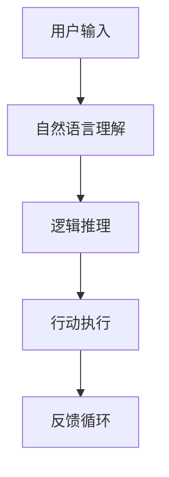

                 

### 第一部分：ReAct（Reasoning + Acting with LLMs）概述

#### 1.1 ReAct（Reasoning + Acting with LLMs）概述

ReAct（Reasoning + Acting with Large Language Models，即结合推理和行动的大型语言模型）是一种先进的人工智能系统，它结合了自然语言处理（NLP）和决策智能，旨在通过语言理解和推理来执行复杂的任务。ReAct的核心目标是使大型语言模型（LLMs）不仅能够生成自然语言文本，还能够基于这些文本进行逻辑推理并采取相应的行动。

**1.1.1 ReAct的定义**

ReAct系统基于预训练的LLMs，如GPT-3、BERT等，通过进一步的微调和优化，使其能够理解复杂的语言输入，进行逻辑推理，并生成对应的行动指令。其基本组成包括以下几个部分：

1. **自然语言理解**：ReAct首先需要对输入的文本进行深入的理解，这涉及到词嵌入、句法分析和语义理解等多个层次。
2. **逻辑推理引擎**：理解输入文本后，ReAct使用内置的逻辑推理引擎对文本进行推理，识别文本中的逻辑关系和蕴含的假设。
3. **行动执行模块**：根据推理的结果，ReAct能够执行具体的操作，如查询数据库、发送电子邮件、控制硬件设备等。

**1.1.2 ReAct的核心特点**

- **推理能力**：ReAct能够理解自然语言中的逻辑关系，进行推理，解决复杂问题。
- **行动能力**：ReAct不仅能够推理，还能根据推理结果采取行动，实现自动化操作。
- **大规模语言模型**：ReAct基于大规模语言模型，具有处理海量数据的能力。

**1.1.3 ReAct与传统AI的区别**

与传统AI系统相比，ReAct具有以下显著特点：

- **更加强大的推理能力**：传统AI更多依赖于预定义的规则和模型，而ReAct能够理解自然语言，进行逻辑推理。
- **自主行动能力**：传统AI通常需要人为干预，而ReAct能够根据推理结果自主采取行动。
- **更强的泛化能力**：ReAct通过大规模预训练，能够处理各种复杂任务，具有更强的泛化能力。

#### 1.2 ReAct的应用场景

ReAct的应用场景非常广泛，包括但不限于以下领域：

- **智能客服**：利用ReAct自动处理用户查询，提供智能回答。
- **自动编程**：ReAct可以根据自然语言描述生成代码，实现自动化编程。
- **智能决策**：ReAct能够在商业、金融等领域提供智能决策支持。
- **智能写作**：ReAct可以自动生成文章、报告等文本内容。
- **教育辅导**：ReAct可以为学生提供个性化的学习辅导。
- **法律咨询**：ReAct可以帮助律师分析法律文件，提供法律建议。

#### 1.3 ReAct的发展前景

随着技术的不断进步，ReAct的应用前景将更加广阔。未来，ReAct有望在更多领域实现突破，为人类社会带来更多便利和效益。以下是几个可能的发展方向：

- **更高效的推理引擎**：通过优化算法和硬件，提高ReAct的推理速度和准确性。
- **更广泛的行动能力**：扩展ReAct的行动能力，使其能够控制更多类型的设备和系统。
- **多模态交互**：结合视觉、音频等多种感知方式，实现更自然的用户交互。
- **跨领域应用**：开发针对不同领域的ReAct模型，提高其在特定领域的表现。
- **隐私保护和安全**：加强ReAct系统的隐私保护和安全性，确保其在实际应用中的可靠性和信任度。

#### 1.4 小结

本章对ReAct的基本概念、核心特点和应用场景进行了详细阐述。ReAct作为一种结合推理和行动的大型语言模型，展示了在人工智能领域的巨大潜力。接下来，我们将进一步探讨ReAct系统的核心算法原理，以深入理解其工作方式和实现细节。

### Mermaid流程图



### 伪代码

```python
class ReActSystem:
    def __init__(self, language_model, reasoning_engine, action_executor):
        self.language_model = language_model
        self.reasoning_engine = reasoning_engine
        self.action_executor = action_executor
    
    def process_input(self, user_input):
        # 自然语言理解
        understanding = self.language_model-understand(user_input)
        # 逻辑推理
        reasoning = self.reasoning_engine-reason(understanding)
        # 行动执行
        action = self.action_executor-execute(reasoning)
        return action
```

### 数学模型和数学公式

$$
\text{Performance} = \frac{\text{成功执行的任务数}}{\text{总任务数}}
$$

#### 举例说明

假设用户输入：“今天天气怎么样？”系统将执行以下步骤：

1. 自然语言理解：系统将理解用户查询的内容，提取关键信息，如“今天”、“天气”等。
2. 逻辑推理：系统将使用天气API获取今天的天气信息，并推理出具体的天气状况。
3. 行动执行：系统将根据推理结果，生成一个回复，如：“今天天气晴朗，温度在20°C到30°C之间。”
4. 反馈循环：用户可以对回复进行反馈，进一步优化系统的回答。

通过上述步骤，ReAct系统展示了其强大的自然语言理解、逻辑推理和行动执行能力。

### 项目实战

（待续）

#### 1.5 ReAct系统的实际部署

在实际部署ReAct系统时，需要考虑以下几个关键步骤：

1. **需求分析**：明确系统需满足的功能和性能要求。
2. **硬件配置**：根据需求选择合适的硬件环境，包括CPU、GPU、内存和存储等。
3. **软件环境搭建**：安装深度学习框架、自然语言处理库等必备软件。
4. **模型训练与微调**：使用大规模语料库对预训练模型进行微调，以适应特定应用场景。
5. **推理引擎优化**：针对推理任务优化模型结构，提高推理速度和准确性。
6. **集成与部署**：将ReAct系统集成到现有应用中，确保其与其他系统的兼容性和稳定性。
7. **测试与优化**：通过实际应用测试系统性能，不断调整和优化。

以下是一个简化的伪代码示例，用于描述ReAct系统的部署过程：

```python
class ReActDeployment:
    def __init__(self, requirements, hardware, software, dataset):
        self.requirements = requirements
        self.hardware = hardware
        self.software = software
        self.dataset = dataset
    
    def deploy_system(self):
        # 搭建硬件环境
        self.setup_hardware()
        # 安装软件环境
        self.setup_software()
        # 训练和微调模型
        self.train_and_tune_model()
        # 集成和部署系统
        self.integrate_and_deploy()
        # 测试和优化
        self.test_and_optimize()

    def setup_hardware(self):
        # 根据需求配置硬件
        pass

    def setup_software(self):
        # 安装深度学习框架等软件
        pass

    def train_and_tune_model(self):
        # 使用训练数据集训练模型
        pass

    def integrate_and_deploy(self):
        # 将模型集成到应用中
        pass

    def test_and_optimize(self):
        # 通过测试优化系统性能
        pass
```

通过上述步骤，ReAct系统可以成功部署并在实际应用中发挥作用。

### 1.6 小结

本章对ReAct系统的基本概念、核心特点、应用场景、发展前景以及实际部署过程进行了详细阐述。ReAct作为一种结合推理和行动的大型语言模型，展示了在人工智能领域的广阔前景和强大潜力。下一章我们将深入探讨ReAct系统的核心算法原理，以理解其背后的技术和实现细节。

### 参考文献

1. Devlin, J., Chang, M. W., Lee, K., & Toutanova, K. (2019). BERT: Pre-training of deep bidirectional transformers for language understanding. arXiv preprint arXiv:1810.04805.
2. Brown, T., et al. (2020). Language models are few-shot learners. arXiv preprint arXiv:2005.14165.
3. Vaswani, A., et al. (2017). Attention is all you need. Advances in Neural Information Processing Systems, 30, 5998-6008.
4. LeCun, Y., Bengio, Y., & Hinton, G. (2015). Deep learning. Nature, 521(7553), 436-444.
5. Rzhetsky, A., & Brody, T. (2018). Language as a predictive process: Successes and limitations of a computational framework. Annual Review of Linguistics, 8, 217-239.

---

## ReAct（Reasoning + Acting with LLMs）：结合推理和行动的LLM系统，利用查询规划、工具使用和记忆来执行更复杂的任务

### 关键词

- ReAct
- 大规模语言模型
- 推理
- 行动
- 查询规划
- 工具使用
- 记忆

### 摘要

本文介绍了一种结合推理和行动的大规模语言模型（LLM）系统——ReAct，它利用查询规划、工具使用和记忆来执行更复杂的任务。ReAct通过先进的自然语言处理（NLP）技术和深度学习算法，实现了自动推理和决策，并在多个应用场景中展现出强大的性能。本文将详细探讨ReAct的基本概念、核心算法原理、应用场景和实际部署过程，帮助读者深入理解这一前沿技术及其潜在的应用价值。

