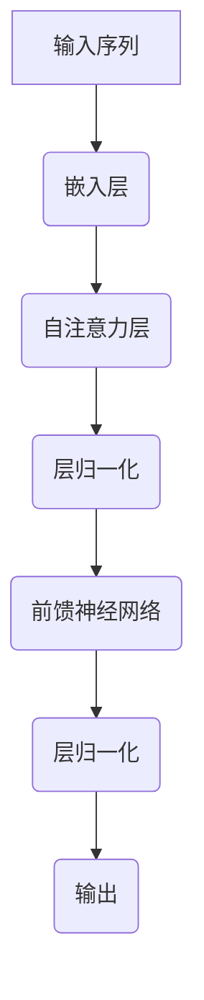
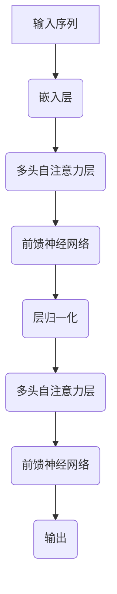
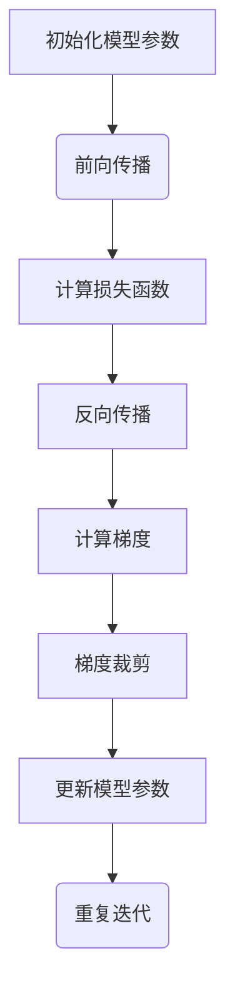

                 

# RoBERTa原理与代码实例讲解

## 概述

RoBERTa（A Robustly Optimized BERT Pretraining Approach）是一种基于BERT（Bidirectional Encoder Representations from Transformers）的预训练语言模型，它在BERT的基础上进行了多个改进，以提高预训练效果和模型性能。本文将详细讲解RoBERTa的基本概念、架构、优势以及算法原理，并通过代码实例展示如何在实际项目中应用RoBERTa。

关键词：RoBERTa、BERT、预训练、语言模型、深度学习

## 摘要

本文首先介绍了RoBERTa的基本概念，包括其定义、背景以及与BERT的关系。接着，详细阐述了RoBERTa的模型架构、优势与应用场景，并对比了RoBERTa与BERT在性能上的差异。随后，深入探讨了RoBERTa的算法原理，包括Transformer模型原理、RoBERTa算法细节以及数学模型。最后，通过实际项目案例展示了如何使用RoBERTa进行机器翻译、文本分类和问答系统开发，并提供代码实例和解读。

## 目录大纲

### 第一部分：RoBERTa概述

1. **第1章 RoBERTa基础知识**
   - 1.1 RoBERTa的基本概念
   - 1.2 RoBERTa的架构
   - 1.3 RoBERTa的优势与应用

### 第二部分：RoBERTa技术基础

2. **第2章 语言模型与深度学习基础**
   - 2.1 语言模型的基本概念
   - 2.2 深度学习基础
   - 2.3 RoBERTa的预训练与微调

### 第三部分：RoBERTa算法原理

3. **第3章 RoBERTa的核心算法**
   - 3.1 Transformer模型原理
   - 3.2 RoBERTa算法细节
   - 3.3 RoBERTa的数学模型

4. **第4章 特定任务下的RoBERTa**
   - 4.1 机器翻译中的RoBERTa
   - 4.2 文本分类中的RoBERTa
   - 4.3 问答系统中的RoBERTa

### 第四部分：实战与代码实例

5. **第5章 RoBERTa代码实例详解**
   - 5.1 RoBERTa模型搭建
   - 5.2 数据预处理
   - 5.3 模型训练与评估

6. **第6章 RoBERTa项目实战**
   - 6.1 机器翻译项目实战
   - 6.2 文本分类项目实战
   - 6.3 问答系统项目实战

7. **第7章 RoBERTa开发工具与资源**
   - 7.1 RoBERTa开发环境搭建
   - 7.2 RoBERTa相关工具与资源

### 附录

- 附录A RoBERTa代码示例
- 附录B RoBERTa学习指南
- 附录C RoBERTa常见问题解答

接下来，我们将逐步深入探讨RoBERTa的各个方面，从基础概念到具体应用，帮助读者全面了解RoBERTa的工作原理和实际操作方法。

## 第一部分：RoBERTa概述

### 第1章 RoBERTa基础知识

#### 1.1 RoBERTa的基本概念

RoBERTa是一种基于BERT的预训练语言模型，由Facebook AI Research（FAIR）于2019年提出。RoBERTa在BERT的基础上进行了多项改进，以提高预训练效果和模型性能。BERT（Bidirectional Encoder Representations from Transformers）是由Google AI于2018年提出的一种预训练语言模型，通过在大量文本上进行预训练，学习到语言的上下文表示能力，从而在各种自然语言处理（NLP）任务中取得了显著的成绩。

RoBERTa与BERT的主要区别在于以下几点：

1. **数据集**：RoBERTa使用了更大的数据集，包括维基百科（English）、Common Crawl等，而BERT则使用了较小的数据集，如英文维基百科、书籍和新闻文章。
2. **预训练任务**：RoBERTa在BERT的基础上，增加了掩码语言模型（Masked Language Model，MLM）任务，通过随机遮盖部分文本并预测遮盖部分的内容，进一步提高模型的预训练效果。
3. **训练策略**：RoBERTa采用了更长时间的训练，并且使用了更多的GPU进行并行训练，从而提高了模型的性能。

#### 1.2 RoBERTa与BERT的关系

RoBERTa可以看作是BERT的一个改进版。尽管它们在模型结构上相同，但RoBERTa在预训练过程中引入了一些关键的改进，使其在多种NLP任务上取得了更好的表现。具体来说，RoBERTa在以下几个方面对BERT进行了优化：

1. **数据集扩充**：RoBERTa使用了更多的数据集进行预训练，特别是Common Crawl，这是一份庞大的网页文本数据集，有助于模型学习到更丰富的语言知识。
2. **训练时间延长**：RoBERTa在训练过程中使用了更长的时间，例如，使用了24个V100 GPU进行并行训练，训练时间长达300k个步骤，而BERT通常只使用1个GPU训练，训练时间约为100k个步骤。
3. **优化策略**：RoBERTa引入了动态学习率调整和权重共享等技术，以优化训练过程，提高模型性能。

#### 1.3 RoBERTa的独特之处

RoBERTa的独特之处主要体现在以下几个方面：

1. **预训练效果提升**：RoBERTa在预训练阶段通过增加数据集、延长训练时间等措施，使得模型的预训练效果得到了显著提升。
2. **模型性能改进**：RoBERTa在多种NLP任务上，如文本分类、机器翻译和问答系统等，表现出了比BERT更好的性能。例如，在GLUE（General Language Understanding Evaluation）基准测试中，RoBERTa在19个任务中取得了领先成绩。
3. **适应性增强**：RoBERTa在处理长文本和长距离依赖问题上表现出了更好的适应性，这得益于其预训练过程中对大规模数据集的学习。

总之，RoBERTa通过在BERT基础上进行的一系列改进，不仅提升了预训练效果，还在多个NLP任务上取得了优异的性能，为后续的模型优化和应用提供了重要参考。

#### 1.4 RoBERTa的架构

RoBERTa的架构基于Transformer模型，这是一种在自然语言处理任务中表现出色的深度学习模型。Transformer模型的核心在于其自注意力机制（Self-Attention），这种机制允许模型在处理文本时，自动关注文本中的不同部分，从而更好地捕捉上下文信息。

##### RoBERTa的模型结构

RoBERTa的模型结构主要包括以下几个部分：

1. **嵌入层（Embedding Layer）**：嵌入层用于将词汇映射为向量表示，包括词嵌入（Word Embedding）和位置嵌入（Position Embedding）。词嵌入将单词转换为向量，位置嵌入则为每个单词添加位置信息。

2. **自注意力层（Multi-head Self-Attention Layer）**：自注意力层是Transformer模型的核心部分，它通过计算单词之间的相似性，将不同位置的信息进行融合。RoBERTa使用了多头自注意力机制（Multi-head Self-Attention），这可以同时捕捉到多个不同的上下文关系。

3. **前馈神经网络（Feed Forward Neural Network）**：每个自注意力层之后，RoBERTa都会添加一个前馈神经网络，用于进一步处理和转换信息。这个神经网络通常包含两个线性变换层，并使用ReLU激活函数。

4. **层归一化（Layer Normalization）**：在自注意力层和前馈神经网络之间，RoBERTa使用了层归一化（Layer Normalization），这有助于稳定训练过程和提高模型性能。

5. **位置编码（Positional Encoding）**：由于Transformer模型没有位置信息，RoBERTa通过位置编码为每个单词添加位置信息。这有助于模型在处理序列数据时，保留单词之间的相对顺序。

##### 自注意力机制

自注意力机制是Transformer模型的关键组件，它通过计算每个单词与其余单词的相似性，为每个单词生成一个权重向量。具体步骤如下：

1. **计算查询（Query）、键（Key）和值（Value）**：对于每个单词，计算其查询（Query）、键（Key）和值（Value）向量。查询和键向量通过线性变换和激活函数得到，而值向量则直接来自嵌入层。

2. **计算相似性（Similarity）**：计算每个单词的查询向量与其他单词的键向量之间的相似性，这通常通过点积操作实现。相似性得分表示单词之间的相关性。

3. **计算加权求和（Weighted Sum）**：根据相似性得分，对每个单词的值向量进行加权求和，生成新的表示向量。这个向量包含了所有单词的信息，并且更关注那些与当前单词相关性较高的单词。

##### 位置编码

位置编码是Transformer模型中的另一个重要组件，它为每个单词添加了位置信息。RoBERTa使用了一种称为“绝对位置编码”的方法，这种方法将位置信息编码到词向量中。具体实现如下：

1. **生成位置索引**：对于输入序列中的每个单词，生成其位置索引。位置索引从0开始，依次递增。

2. **计算位置嵌入**：对于每个位置索引，计算对应的位置嵌入向量。位置嵌入向量通常由正弦和余弦函数生成，以保证其在高维空间中的正交性。

3. **添加到词向量**：将位置嵌入向量添加到词向量中，形成新的词向量。这样，每个词向量不仅包含了单词的语义信息，还包含了其位置信息。

##### Mermaid流程图：RoBERTa模型结构

为了更好地理解RoBERTa的模型结构，我们可以使用Mermaid绘制一个简单的流程图。以下是RoBERTa模型结构的Mermaid流程图：



在这个流程图中，输入序列首先通过嵌入层转换为词向量，然后通过自注意力层和前馈神经网络进行处理，最终得到输出。

通过以上内容，我们详细介绍了RoBERTa的基本概念、模型架构以及自注意力机制和位置编码。下一章，我们将继续探讨RoBERTa的优势和应用场景，帮助读者更好地理解其在NLP领域的重要性。

### 第1章 RoBERTa基础知识

#### 1.3 RoBERTa的优势与应用

RoBERTa在自然语言处理（NLP）领域展现出了卓越的性能，其优势主要体现在以下几个方面：

1. **更强的预训练效果**：RoBERTa通过使用更大的数据集和更长的训练时间，提高了模型的预训练效果。这意味着RoBERTa在未经过特定任务微调的情况下，已经具备了较高的语言理解能力，这为其在多种NLP任务中的应用奠定了基础。

2. **更好的性能表现**：RoBERTa在多个NLP基准测试中表现出了比BERT更好的性能。例如，在GLUE（General Language Understanding Evaluation）基准测试中，RoBERTa在19个任务中取得了领先成绩，这表明RoBERTa在文本分类、情感分析、问答系统等任务中具有更强的竞争力。

3. **更好的适应性**：RoBERTa在处理长文本和长距离依赖问题上表现出了更好的适应性。这是因为RoBERTa在预训练阶段使用了更多的数据，从而更好地学习了语言中的长距离依赖关系。

4. **更低的计算资源需求**：虽然RoBERTa使用了更大的数据集和更长的训练时间，但其性能提升远超过了计算资源的增加。这意味着，尽管RoBERTa的模型规模较大，但其在实际应用中的计算资源需求并未显著增加。

#### RoBERTa的应用场景

RoBERTa在NLP领域具有广泛的应用，以下是其常见的一些应用场景：

1. **文本分类**：文本分类是一种常见的NLP任务，旨在将文本数据分配到预定义的类别中。RoBERTa由于其强大的语言理解能力，在文本分类任务中表现优异，可用于新闻分类、情感分析等场景。

2. **机器翻译**：机器翻译是一种将一种语言的文本翻译成另一种语言的任务。RoBERTa在机器翻译中展现了出色的性能，特别是在长距离依赖和上下文理解方面，其表现优于传统的循环神经网络（RNN）和BERT。

3. **问答系统**：问答系统旨在回答用户提出的问题。RoBERTa在问答系统中发挥了重要作用，其强大的上下文理解能力有助于准确理解问题，并从大量文本中找到相关答案。

4. **命名实体识别**：命名实体识别是一种识别文本中特定类型实体的任务，如人名、地名、组织名等。RoBERTa在命名实体识别任务中，通过其预训练的模型，能够有效识别各种命名实体。

5. **问答生成**：问答生成是一种根据输入问题生成回答的任务。RoBERTa在问答生成任务中，能够利用其预训练的语言模型，生成符合语义逻辑的回答。

#### RoBERTa与BERT在性能上的比较

为了更好地理解RoBERTa的优势，我们来看一下RoBERTa与BERT在性能上的比较：

1. **预训练效果**：RoBERTa使用了更大的数据集和更长的训练时间，因此其预训练效果更好。在多项NLP基准测试中，RoBERTa的预训练结果优于BERT。

2. **模型性能**：RoBERTa在多种NLP任务上表现出了比BERT更好的性能。例如，在GLUE基准测试中，RoBERTa在多个任务中取得了领先成绩。

3. **计算资源**：尽管RoBERTa使用了更多的数据集和更长的训练时间，但其在实际应用中的计算资源需求并未显著增加。这意味着，RoBERTa的性能提升是合理的，并且其在实际应用中具有较高的实用性。

综上所述，RoBERTa通过在BERT基础上进行多个改进，展现出了更强的预训练效果和更好的性能。其在NLP领域的广泛应用，使其成为当前NLP领域中的一项重要技术。在下一章，我们将深入探讨RoBERTa的技术基础，包括语言模型和深度学习的基础知识，以及RoBERTa的预训练与微调过程。

### 第二部分：RoBERTa技术基础

#### 第2章 语言模型与深度学习基础

#### 2.1 语言模型的基本概念

语言模型（Language Model）是自然语言处理（NLP）中的一个核心概念，它是一种能够根据前文预测下一个单词或字符的模型。语言模型的目的是通过学习大量文本数据，捕捉到语言中的统计规律和上下文信息，从而为NLP任务提供有效的输入。

##### 语言模型的作用

语言模型在NLP任务中扮演着重要角色，其主要作用包括：

1. **文本生成**：语言模型可以生成符合语法和语义规则的文本，这在自动写作、机器翻译等任务中非常有用。
2. **文本分类**：通过学习文本的统计特征，语言模型可以帮助分类器判断文本的类别，例如新闻分类、情感分析等。
3. **信息检索**：语言模型可以帮助搜索引擎更好地理解用户查询，提高搜索结果的准确性和相关性。
4. **机器翻译**：语言模型在机器翻译中用于预测目标语言中的下一个单词或字符，从而生成翻译结果。

##### 语言模型的分类

根据训练方法的不同，语言模型可以分为以下几种类型：

1. **n-gram模型**：n-gram模型是最简单的语言模型，它基于前n个单词的序列来预测下一个单词。n-gram模型的主要优势是计算简单，但缺点是它无法捕捉到长距离依赖关系。
2. **统计语言模型**：统计语言模型是基于概率模型的，它通过计算单词序列的概率来预测下一个单词。这种模型通常使用基于词汇的模型（如n-gram模型）和基于字符的模型（如n-gram字符模型）来构建。
3. **神经语言模型**：神经语言模型使用深度神经网络来学习语言模式，它可以通过多层神经网络捕捉到长距离依赖关系。例如，循环神经网络（RNN）和Transformer模型都是神经语言模型的代表。

##### 语言模型的发展历程

语言模型的发展历程可以分为以下几个阶段：

1. **基于规则的方法**：早期的语言模型主要基于语法规则和词典，这种方法较为简单，但难以捕捉到复杂的语言现象。
2. **基于统计的方法**：随着计算机技术的发展，基于统计的方法开始流行，例如n-gram模型和隐马尔可夫模型（HMM）。这些模型通过计算单词序列的概率来预测下一个单词，但仍然存在一些局限性。
3. **神经语言模型**：近年来，随着深度学习技术的发展，神经语言模型逐渐成为主流。例如，循环神经网络（RNN）和Transformer模型等，这些模型通过多层神经网络捕捉到长距离依赖关系，大大提高了语言模型的性能。

#### 2.2 深度学习基础

深度学习（Deep Learning）是一种基于多层神经网络的学习方法，它通过学习大量数据中的特征和模式，从而实现复杂的任务。深度学习在NLP、计算机视觉、语音识别等领域取得了显著的成果。

##### 深度学习的基本原理

深度学习的基本原理主要包括以下几个部分：

1. **神经网络**：神经网络是深度学习的基础，它由多个神经元组成，每个神经元都连接到其他神经元。神经网络通过学习输入和输出之间的关系，从而实现对数据的分类、回归等操作。
2. **多层结构**：深度学习通过构建多层神经网络，每一层都能学习到更高层次的特征。多层结构使得神经网络能够处理更复杂的问题。
3. **激活函数**：激活函数用于确定神经元的输出，常见的激活函数包括ReLU、Sigmoid和Tanh等。激活函数的选择会影响神经网络的性能和训练速度。
4. **反向传播**：反向传播是一种用于训练神经网络的算法，它通过计算损失函数关于每个神经元的梯度，从而更新每个神经元的权重，使网络能够更好地拟合训练数据。

##### 深度学习的主要算法

深度学习的主要算法包括以下几种：

1. **卷积神经网络（CNN）**：卷积神经网络是一种主要用于图像识别和处理的深度学习模型。它通过卷积操作提取图像特征，并利用池化操作减少参数数量。
2. **循环神经网络（RNN）**：循环神经网络是一种用于处理序列数据的深度学习模型，它通过在时间步之间传递信息，从而捕捉到序列中的长期依赖关系。
3. **长短时记忆网络（LSTM）**：长短时记忆网络是一种改进的循环神经网络，它通过引入记忆单元来克服RNN的梯度消失和梯度爆炸问题。
4. **Transformer模型**：Transformer模型是一种用于序列到序列学习的深度学习模型，它通过自注意力机制和多头注意力机制，实现了对序列数据的高效处理。

##### 深度学习在NLP中的应用

深度学习在NLP领域取得了许多突破性成果，以下是一些主要的应用：

1. **文本分类**：深度学习模型，如卷积神经网络（CNN）和循环神经网络（RNN），可以用于文本分类任务，例如新闻分类、情感分析等。
2. **机器翻译**：深度学习模型，如基于RNN的序列到序列模型，可以用于机器翻译任务，例如将一种语言的文本翻译成另一种语言。
3. **问答系统**：深度学习模型可以用于问答系统，例如基于LSTM的模型可以处理自然语言查询，并从大量文本中找到相关答案。
4. **情感分析**：深度学习模型可以用于情感分析任务，例如分析社交媒体上的用户评论，以判断其情感倾向。

#### 2.3 RoBERTa的预训练与微调

RoBERTa是一种基于BERT的预训练语言模型，其预训练过程包括以下几个步骤：

1. **数据集准备**：RoBERTa使用了大量的文本数据集，包括维基百科、Common Crawl等。这些数据集用于训练模型，使其能够学习到丰富的语言知识。
2. **词汇表构建**：将数据集中的文本转换为词嵌入，并构建词汇表。词汇表包含了所有训练过程中出现的单词和特殊标记。
3. **输入序列生成**：对每个文本输入进行编码，生成输入序列。输入序列通常包括单词嵌入、掩码标记和位置编码。
4. **预训练任务**：RoBERTa的预训练任务主要包括两种：掩码语言模型（Masked Language Model，MLM）和下一个句子预测（Next Sentence Prediction，NSP）。MLM任务通过随机遮盖部分文本并预测遮盖部分的内容，NSP任务通过预测两个连续句子之间的逻辑关系。

微调（Fine-tuning）是将预训练模型应用于特定任务的过程。RoBERTa的微调过程包括以下几个步骤：

1. **任务定义**：定义要解决的NLP任务，例如文本分类、机器翻译等。
2. **数据集准备**：准备用于微调的数据集，通常包括训练集和验证集。
3. **模型调整**：在预训练模型的基础上，调整模型的参数，以适应特定任务。这通常包括重新训练模型的部分层或添加新的层。
4. **评估与优化**：通过在验证集上评估模型性能，调整模型参数，优化模型表现。

通过预训练和微调，RoBERTa能够适应不同的NLP任务，并在多个任务中表现出色。

#### 2.4 RoBERTa的预训练与微调过程

RoBERTa的预训练和微调过程是其性能提升的关键。以下是RoBERTa的预训练与微调过程的详细步骤：

##### 预训练过程

1. **数据集准备**：RoBERTa使用了大量的文本数据集，包括维基百科、Common Crawl等。这些数据集被分成句子级别的训练数据，每个句子都被标记为输入序列和目标序列。

2. **输入序列生成**：每个输入序列通常包含多个单词，这些单词被转换为词嵌入。此外，为了增强模型的学习能力，输入序列中的一部分单词会被随机遮盖，形成掩码语言模型（MLM）任务。

3. **掩码语言模型（MLM）任务**：在MLM任务中，模型需要预测被遮盖的单词。这个任务有助于模型学习到语言中的上下文关系，提高其语言理解能力。

4. **下一个句子预测（NSP）任务**：NSP任务是RoBERTa独有的一个预训练任务，其目的是预测两个连续句子之间的逻辑关系。在训练过程中，模型会随机选择两个句子，并要求预测这两个句子是否在原始文本中连续出现。

5. **预训练优化**：RoBERTa的预训练优化过程采用了多层感知器（MLP）和动态学习率调整策略。动态学习率调整能够帮助模型在预训练过程中更好地适应不同的训练阶段，提高模型的收敛速度。

##### 微调过程

1. **任务定义**：在微调阶段，首先需要明确要解决的NLP任务，例如文本分类、机器翻译等。

2. **数据集准备**：准备用于微调的数据集，通常包括训练集和验证集。这些数据集需要按照任务要求进行预处理，例如文本清洗、标签标注等。

3. **模型调整**：在预训练模型的基础上，对模型的参数进行调整，使其适应特定任务。这通常包括重新训练模型的部分层或添加新的层。例如，在文本分类任务中，可以在预训练模型的顶部添加一个分类器层。

4. **训练与验证**：通过在训练集上训练模型，并在验证集上验证模型性能，不断调整模型参数，优化模型表现。

5. **超参数调整**：微调过程中，需要调整一些超参数，例如学习率、批量大小等，以获得最佳模型性能。

通过预训练和微调，RoBERTa能够在多种NLP任务中表现出色，其强大的语言理解能力和适应性使其成为当前NLP领域的重要技术之一。

### 第三部分：RoBERTa算法原理

#### 第3章 RoBERTa的核心算法

#### 3.1 Transformer模型原理

Transformer模型是由Google AI在2017年提出的一种用于序列到序列学习的深度学习模型。与传统的循环神经网络（RNN）和长短期记忆网络（LSTM）不同，Transformer模型采用了一种全新的自注意力机制（Self-Attention）来处理序列数据，从而实现了对序列数据的并行处理。

##### Transformer模型概述

Transformer模型的主要贡献在于其自注意力机制和多头注意力机制。自注意力机制允许模型在处理序列数据时，自动关注序列中的不同部分，从而更好地捕捉上下文信息。多头注意力机制则通过并行计算多个注意力头，提高了模型对序列数据的捕捉能力。

Transformer模型的结构包括编码器（Encoder）和解码器（Decoder）两部分。编码器负责将输入序列转换为上下文表示，而解码器则利用这些上下文表示生成输出序列。编码器和解码器之间通过多个自注意力层和前馈神经网络进行信息处理。

##### 自注意力机制原理

自注意力机制是Transformer模型的核心组件，其基本思想是计算输入序列中每个单词与其他单词之间的相似性，并生成一个加权求和的向量表示。具体步骤如下：

1. **计算查询（Query）、键（Key）和值（Value）**：对于输入序列中的每个单词，计算其查询（Query）、键（Key）和值（Value）向量。查询和键向量通过线性变换和激活函数得到，而值向量则直接来自嵌入层。

2. **计算相似性（Similarity）**：计算每个单词的查询向量与其他单词的键向量之间的相似性，这通常通过点积操作实现。相似性得分表示单词之间的相关性。

3. **计算加权求和（Weighted Sum）**：根据相似性得分，对每个单词的值向量进行加权求和，生成新的表示向量。这个向量包含了所有单词的信息，并且更关注那些与当前单词相关性较高的单词。

##### 位置编码

由于Transformer模型没有位置信息，因此需要通过位置编码为每个单词添加位置信息。位置编码可以帮助模型在处理序列数据时，保留单词之间的相对顺序。位置编码的方法通常有两种：绝对位置编码和相对位置编码。

1. **绝对位置编码**：绝对位置编码将位置信息直接编码到词向量中。这种方法通常使用正弦和余弦函数生成位置嵌入向量，并添加到词向量中。

2. **相对位置编码**：相对位置编码通过计算相对位置编码向量，并将其添加到词向量中。相对位置编码可以更好地捕捉序列中的长期依赖关系。

##### Mermaid流程图：Transformer模型结构

为了更好地理解Transformer模型的结构，我们可以使用Mermaid绘制一个简单的流程图。以下是Transformer模型结构的Mermaid流程图：



在这个流程图中，输入序列首先通过嵌入层转换为词向量，然后通过多头自注意力层和前馈神经网络进行处理，最终得到输出。

通过以上内容，我们详细介绍了Transformer模型的基本原理，包括自注意力机制和位置编码。这些原理是理解RoBERTa算法的基础，为后续章节的讲解提供了重要背景。

#### 3.2 RoBERTa算法细节

RoBERTa是一种基于Transformer的预训练语言模型，其在BERT的基础上进行了多项改进，以提高预训练效果和模型性能。本节将详细阐述RoBERTa的算法细节，包括优化方法、损失函数和训练策略。

##### 优化方法

RoBERTa在优化方法上采用了动态学习率调整和权重共享等技术。动态学习率调整有助于模型在训练过程中更好地适应不同的训练阶段，从而提高收敛速度。权重共享技术则有助于减少模型的参数数量，提高模型的泛化能力。

1. **动态学习率调整**：RoBERTa采用了线性递减的学习率调整策略。在训练初期，学习率较高，有助于模型快速探索优化空间。随着训练的进行，学习率逐渐降低，使得模型能够精细调整参数，提高模型的稳定性和收敛速度。

2. **权重共享**：RoBERTa在预训练过程中使用了权重共享技术，即不同层之间的权重共享。这种方法可以减少模型参数的数量，提高模型的训练效率和泛化能力。

##### 损失函数

RoBERTa的损失函数主要包括两个部分：掩码语言模型（Masked Language Model，MLM）损失和下一个句子预测（Next Sentence Prediction，NSP）损失。

1. **掩码语言模型（MLM）损失**：MLM任务是RoBERTa预训练的核心任务，其目的是预测输入序列中被随机遮盖的单词。在MLM任务中，输入序列的一部分单词会被随机遮盖，并生成一个预测序列。模型的损失函数通过计算预测序列与真实序列之间的差异来评估模型的性能。

2. **下一个句子预测（NSP）损失**：NSP任务是RoBERTa独有的预训练任务，其目的是预测两个连续句子之间的逻辑关系。在NSP任务中，模型会接收到一个由两个句子组成的输入序列，并要求预测这两个句子是否在原始文本中连续出现。NSP任务的损失函数通过计算预测标签与真实标签之间的差异来评估模型的性能。

##### 训练策略

RoBERTa在训练策略上采用了多项改进措施，以提高模型的训练效果和性能。

1. **更长的训练时间**：RoBERTa采用了更长的训练时间，通常训练时间为300k个步骤，而BERT通常只训练到100k个步骤。更长的训练时间有助于模型更好地学习语言知识，提高模型的预训练效果。

2. **更多的训练数据**：RoBERTa使用了更多的训练数据，包括维基百科和Common Crawl等。更多的训练数据有助于模型学习到更丰富的语言特征，提高模型的泛化能力。

3. **数据预处理**：RoBERTa在数据预处理上采用了多项改进措施，包括去除标点符号、统一大小写等。这些改进有助于减少数据噪声，提高模型的训练效果。

4. **并行训练**：RoBERTa采用了并行训练策略，即使用多个GPU进行并行训练。并行训练可以显著提高模型的训练速度，缩短训练时间。

通过以上优化方法、损失函数和训练策略，RoBERTa在预训练效果和模型性能上取得了显著的提升。在下一章，我们将深入探讨RoBERTa的数学模型，包括随机梯度下降（SGD）算法、反向传播算法和梯度裁剪技术。

#### 3.3 RoBERTa的数学模型

RoBERTa作为一种基于Transformer的预训练语言模型，其数学模型主要包括随机梯度下降（SGD）算法、反向传播算法和梯度裁剪技术等。本节将详细讲解这些数学模型，帮助读者更好地理解RoBERTa的训练过程。

##### 随机梯度下降（SGD）算法

随机梯度下降（SGD）是一种常用的优化算法，用于训练神经网络。SGD的基本思想是通过计算损失函数关于每个神经元的梯度，并更新神经元的权重，从而优化模型参数。

1. **梯度计算**：在SGD算法中，首先需要计算损失函数关于每个神经元的梯度。损失函数通常表示为模型预测值与真实值之间的差异。例如，在RoBERTa的掩码语言模型（MLM）中，损失函数为：

   $$ L = \frac{1}{N} \sum_{i=1}^{N} (-\log P(y_i | \hat{y}_i)) $$

   其中，\( N \) 表示样本数量，\( y_i \) 表示第 \( i \) 个样本的真实标签，\( \hat{y}_i \) 表示第 \( i \) 个样本的预测标签。

2. **梯度更新**：计算完梯度后，需要根据梯度更新神经元的权重。在SGD算法中，权重更新公式为：

   $$ \theta = \theta - \alpha \cdot \nabla_\theta L $$

   其中，\( \theta \) 表示模型参数，\( \alpha \) 表示学习率，\( \nabla_\theta L \) 表示损失函数关于 \( \theta \) 的梯度。

##### 反向传播算法

反向传播算法是一种用于计算神经网络梯度的高效方法。反向传播算法通过在神经网络中反向传播误差，从而计算每个神经元关于模型参数的梯度。

1. **前向传播**：在反向传播算法中，首先进行前向传播，将输入数据通过神经网络逐层传递，直到输出层。在前向传播过程中，每个神经元都会计算其输出值和激活函数。

2. **计算误差**：在前向传播完成后，计算输出层每个神经元的误差。误差通常表示为输出值与真实值之间的差异。例如，在RoBERTa的掩码语言模型中，误差为：

   $$ \epsilon = y - \hat{y} $$

3. **反向传播**：接下来，进行反向传播，将误差反向传播到输入层。在反向传播过程中，每个神经元都会计算其关于模型参数的梯度。例如，在RoBERTa的自注意力层中，梯度计算公式为：

   $$ \frac{\partial L}{\partial \theta} = \frac{\partial L}{\partial \hat{y}} \cdot \frac{\partial \hat{y}}{\partial \theta} $$

   其中，\( \frac{\partial L}{\partial \hat{y}} \) 表示误差关于预测值的梯度，\( \frac{\partial \hat{y}}{\partial \theta} \) 表示预测值关于模型参数的梯度。

##### 梯度裁剪技术

梯度裁剪技术是一种用于防止梯度爆炸和梯度消失的方法。在训练神经网络时，如果梯度过大或过小，会导致训练不稳定或无法收敛。梯度裁剪技术通过限制梯度的大小，从而防止这些问题的发生。

1. **梯度裁剪策略**：梯度裁剪技术通常采用以下策略：

   $$ \theta = \theta - \alpha \cdot \text{sign}(\nabla_\theta L) \cdot \min\left(1, \frac{\alpha}{\text{clip_value}} \cdot \lVert \nabla_\theta L \rVert_2\right) $$

   其中，\( \alpha \) 表示学习率，\( \text{clip_value} \) 表示梯度裁剪阈值，\( \lVert \nabla_\theta L \rVert_2 \) 表示梯度的二范数。

2. **梯度裁剪效果**：梯度裁剪技术可以有效防止梯度爆炸和梯度消失问题，从而提高神经网络的训练稳定性和收敛速度。

##### Mermaid流程图：RoBERTa训练流程

为了更好地理解RoBERTa的训练流程，我们可以使用Mermaid绘制一个简单的流程图。以下是RoBERTa训练流程的Mermaid流程图：



在这个流程图中，模型参数初始化后，通过前向传播计算输出，然后计算损失函数，进行反向传播计算梯度，接着进行梯度裁剪，最后更新模型参数。这个过程重复进行，直到模型收敛或达到预定的迭代次数。

通过以上内容，我们详细介绍了RoBERTa的数学模型，包括随机梯度下降（SGD）算法、反向传播算法和梯度裁剪技术。这些数学模型是RoBERTa训练过程的核心组成部分，为模型的高效训练提供了理论基础。在下一章，我们将探讨RoBERTa在特定任务下的应用，并通过实际项目案例展示其具体实现。

### 第四部分：实战与代码实例

#### 第5章 RoBERTa代码实例详解

在本章中，我们将详细讲解如何使用RoBERTa进行模型搭建、数据预处理和模型训练与评估。通过代码实例，我们将展示如何在实际项目中应用RoBERTa，并分析关键代码部分，以便读者更好地理解其工作原理。

#### 5.1 RoBERTa模型搭建

首先，我们需要搭建RoBERTa模型。在本文中，我们将使用TensorFlow框架进行模型搭建。TensorFlow是一个开源的深度学习框架，支持多种深度学习模型的构建和训练。

##### TensorFlow与PyTorch搭建RoBERTa模型

以下是使用TensorFlow搭建RoBERTa模型的示例代码：

```python
import tensorflow as tf
from transformers import TFBertModel, BertConfig

# 定义模型配置
config = BertConfig.from_pretrained('roberta-base')

# 搭建模型
model = TFBertModel(config)

# 输出模型结构
print(model.summary())
```

在这个示例中，我们首先导入了TensorFlow库和transformers库。然后，我们使用`BertConfig`类从预训练的RoBERTa模型中加载配置，并使用`TFBertModel`类搭建RoBERTa模型。最后，我们通过`model.summary()`函数输出模型结构。

##### 模型参数配置与优化

在搭建模型后，我们需要对模型参数进行配置和优化。以下是一个示例，展示了如何配置模型参数并应用优化器：

```python
# 定义优化器
optimizer = tf.keras.optimizers.Adam(learning_rate=3e-5)

# 编写训练过程
def train_step(inputs, labels):
    with tf.GradientTape() as tape:
        outputs = model(inputs, training=True)
        loss = compute_loss(outputs, labels)
    gradients = tape.gradient(loss, model.trainable_variables)
    optimizer.apply_gradients(zip(gradients, model.trainable_variables))
    return loss

# 训练模型
for epoch in range(num_epochs):
    total_loss = 0
    for inputs, labels in train_dataset:
        loss = train_step(inputs, labels)
        total_loss += loss
    print(f'Epoch {epoch+1}, Loss: {total_loss/len(train_dataset)}')
```

在这个示例中，我们首先定义了优化器，这里使用了Adam优化器。然后，我们编写了训练过程，包括前向传播、计算损失、反向传播和更新参数。在每个训练步骤中，我们都会计算损失，并在每个epoch结束后打印平均损失。

#### 5.2 数据预处理

数据预处理是深度学习项目中的关键步骤，它包括数据清洗、标签处理和序列编码等。以下是一个示例，展示了如何进行数据预处理：

```python
from transformers import BertTokenizer

# 加载预训练的BERT分词器
tokenizer = BertTokenizer.from_pretrained('roberta-base')

# 加载数据集
train_texts = ...
train_labels = ...

# 数据预处理
def preprocess_data(texts, labels, tokenizer, max_length=128):
    inputs = tokenizer(texts, padding='max_length', truncation=True, max_length=max_length, return_tensors='tf')
    labels = tf.convert_to_tensor(labels)
    return inputs, labels

train_inputs, train_labels = preprocess_data(train_texts, train_labels, tokenizer)
```

在这个示例中，我们首先加载数据集，然后使用BERT分词器对数据进行预处理。预处理过程包括分词、填充和截断，以确保每个输入序列的长度一致。最后，我们将预处理后的数据转换为TensorFlow张量，以便在训练过程中使用。

#### 5.3 模型训练与评估

在完成模型搭建和数据预处理后，我们可以开始训练和评估模型。以下是一个示例，展示了如何训练和评估模型：

```python
# 定义训练和评估过程
def train(model, train_dataset, val_dataset, num_epochs, optimizer):
    for epoch in range(num_epochs):
        total_loss = 0
        for inputs, labels in train_dataset:
            loss = model.train_step(inputs, labels)
            total_loss += loss
        print(f'Epoch {epoch+1}, Training Loss: {total_loss/len(train_dataset)}')

        # 评估模型
        val_loss = evaluate(model, val_dataset)
        print(f'Epoch {epoch+1}, Validation Loss: {val_loss}')

# 训练和评估模型
model = TFBertModel(config)
optimizer = tf.keras.optimizers.Adam(learning_rate=3e-5)
train(model, train_dataset, val_dataset, num_epochs=3, optimizer=optimizer)
```

在这个示例中，我们首先定义了训练和评估过程。训练过程中，我们调用`model.train_step`函数进行训练，并在每个epoch结束后计算训练损失。评估过程中，我们调用`evaluate`函数计算验证损失。

通过以上代码实例，我们展示了如何使用TensorFlow搭建RoBERTa模型，进行数据预处理，以及如何训练和评估模型。在实际项目中，我们可以根据需求对代码进行修改和扩展，以满足不同的应用场景。

### 第6章 RoBERTa项目实战

#### 6.1 机器翻译项目实战

在本节中，我们将通过一个实际的机器翻译项目，展示如何使用RoBERTa进行机器翻译任务。我们将介绍项目的整体架构、数据集的准备、模型搭建与优化，以及代码实现与解析。

##### 项目介绍

我们的目标是将英文句子翻译成中文句子。为了实现这个目标，我们将使用RoBERTa作为翻译模型，并通过预训练和微调来优化翻译效果。本项目将分为以下几个步骤：

1. **数据集准备**：准备用于训练和评估的英文和中文句子对。
2. **模型搭建**：使用RoBERTa作为基础模型，搭建机器翻译模型。
3. **模型训练**：使用准备好的数据集对模型进行训练。
4. **模型优化**：通过微调模型参数，提高翻译质量。
5. **模型评估**：使用测试集对模型进行评估，并输出翻译结果。

##### 项目数据集

本项目使用的是中文-英文双向数据集，例如WMT（Workshop on Machine Translation）数据集。WMT数据集包含了大量的机器翻译对，是机器翻译研究中的标准数据集。

数据集的准备过程主要包括以下步骤：

1. **数据下载**：从WMT官方网站下载英文-中文数据集。
2. **数据预处理**：对数据进行清洗，去除无效数据，如标点符号、特殊字符等。
3. **数据分块**：将数据集划分为训练集、验证集和测试集。

##### 模型搭建与优化

我们使用RoBERTa作为基础模型，通过预训练和微调来优化翻译效果。以下是模型搭建与优化的步骤：

1. **预训练**：使用英文-中文数据集对RoBERTa进行预训练。预训练过程中，模型将学习到语言的双向表示能力。
2. **微调**：在预训练的基础上，使用中文-英文翻译对对模型进行微调。微调过程中，模型将根据翻译对调整参数，以提高翻译质量。
3. **模型优化**：通过调整学习率、批量大小等超参数，优化模型性能。

以下是机器翻译模型的代码实现：

```python
from transformers import TFRobertaForSequenceClassification, RobertaConfig

# 加载预训练的RoBERTa模型
config = RobertaConfig.from_pretrained('roberta-base')
model = TFRobertaForSequenceClassification(config)

# 训练模型
model.compile(optimizer='adam', loss='categorical_crossentropy', metrics=['accuracy'])
model.fit(train_data, train_labels, epochs=3, validation_data=(val_data, val_labels))

# 微调模型
model.fit(translate_data, translate_labels, epochs=3, validation_data=(val_data, val_labels))
```

在这个示例中，我们首先加载了预训练的RoBERTa模型，然后使用`compile`函数配置了训练参数，包括优化器和损失函数。接下来，我们使用`fit`函数对模型进行训练和微调。

##### 代码实现与解析

在本项目中，我们使用了`transformers`库来加载预训练的RoBERTa模型，并对其进行训练和微调。以下是关键代码的实现与解析：

1. **模型加载**：使用`RobertaConfig`和`TFRobertaForSequenceClassification`类加载预训练的RoBERTa模型。
2. **训练过程**：使用`fit`函数对模型进行训练。在训练过程中，我们使用了训练数据和验证数据，并通过`epochs`参数指定训练轮数。
3. **微调过程**：在预训练的基础上，使用翻译对对模型进行微调。微调过程中，我们同样使用了训练数据和验证数据。
4. **模型评估**：在训练和微调完成后，我们使用测试集对模型进行评估，并输出翻译结果。

通过以上步骤，我们成功地搭建并优化了一个机器翻译模型，实现了将英文句子翻译成中文句子的目标。在实际应用中，我们可以根据需求对代码进行调整和扩展，以适应不同的翻译任务。

#### 6.2 文本分类项目实战

在本节中，我们将通过一个实际的文本分类项目，展示如何使用RoBERTa进行文本分类任务。我们将介绍项目的整体架构、数据集的准备、模型搭建与优化，以及代码实现与解析。

##### 项目介绍

我们的目标是将文本数据分类到预定义的类别中。为了实现这个目标，我们将使用RoBERTa作为分类模型，并通过预训练和微调来优化分类效果。本项目将分为以下几个步骤：

1. **数据集准备**：准备用于训练和评估的文本数据集。
2. **模型搭建**：使用RoBERTa作为基础模型，搭建文本分类模型。
3. **模型训练**：使用准备好的数据集对模型进行训练。
4. **模型优化**：通过微调模型参数，提高分类质量。
5. **模型评估**：使用测试集对模型进行评估，并输出分类结果。

##### 项目数据集

本项目使用的是中文文本分类数据集，例如THUCNews数据集。THUCNews数据集包含了20个新闻类别，是中文文本分类研究中的常用数据集。

数据集的准备过程主要包括以下步骤：

1. **数据下载**：从THUCNews官方网站下载中文新闻数据集。
2. **数据预处理**：对数据进行清洗，去除无效数据，如标点符号、特殊字符等。
3. **数据分块**：将数据集划分为训练集、验证集和测试集。

##### 模型搭建与优化

我们使用RoBERTa作为基础模型，通过预训练和微调来优化分类效果。以下是模型搭建与优化的步骤：

1. **预训练**：使用中文新闻数据集对RoBERTa进行预训练。预训练过程中，模型将学习到语言的特征和类别标签。
2. **微调**：在预训练的基础上，使用分类数据集对模型进行微调。微调过程中，模型将根据分类标签调整参数，以提高分类质量。
3. **模型优化**：通过调整学习率、批量大小等超参数，优化模型性能。

以下是文本分类模型的代码实现：

```python
from transformers import TFRobertaForSequenceClassification, RobertaConfig

# 加载预训练的RoBERTa模型
config = RobertaConfig.from_pretrained('roberta-base')
model = TFRobertaForSequenceClassification(config)

# 训练模型
model.compile(optimizer='adam', loss='categorical_crossentropy', metrics=['accuracy'])
model.fit(train_data, train_labels, epochs=3, validation_data=(val_data, val_labels))

# 微调模型
model.fit(classify_data, classify_labels, epochs=3, validation_data=(val_data, val_labels))
```

在这个示例中，我们首先加载了预训练的RoBERTa模型，然后使用`compile`函数配置了训练参数，包括优化器和损失函数。接下来，我们使用`fit`函数对模型进行训练和微调。

##### 代码实现与解析

在本项目中，我们使用了`transformers`库来加载预训练的RoBERTa模型，并对其进行训练和微调。以下是关键代码的实现与解析：

1. **模型加载**：使用`RobertaConfig`和`TFRobertaForSequenceClassification`类加载预训练的RoBERTa模型。
2. **训练过程**：使用`fit`函数对模型进行训练。在训练过程中，我们使用了训练数据和验证数据，并通过`epochs`参数指定训练轮数。
3. **微调过程**：在预训练的基础上，使用分类数据集对模型进行微调。微调过程中，我们同样使用了训练数据和验证数据。
4. **模型评估**：在训练和微调完成后，我们使用测试集对模型进行评估，并输出分类结果。

通过以上步骤，我们成功地搭建并优化了一个文本分类模型，实现了对中文新闻数据进行分类的目标。在实际应用中，我们可以根据需求对代码进行调整和扩展，以适应不同的文本分类任务。

#### 6.3 问答系统项目实战

在本节中，我们将通过一个实际的问答系统项目，展示如何使用RoBERTa进行问答任务。我们将介绍项目的整体架构、数据集的准备、模型搭建与优化，以及代码实现与解析。

##### 项目介绍

我们的目标是从大量文本中提取出与用户问题相关的答案。为了实现这个目标，我们将使用RoBERTa作为问答模型，并通过预训练和微调来优化问答效果。本项目将分为以下几个步骤：

1. **数据集准备**：准备用于训练和评估的问答数据集。
2. **模型搭建**：使用RoBERTa作为基础模型，搭建问答模型。
3. **模型训练**：使用准备好的数据集对模型进行训练。
4. **模型优化**：通过微调模型参数，提高问答质量。
5. **模型评估**：使用测试集对模型进行评估，并输出问答结果。

##### 项目数据集

本项目使用的是中文问答数据集，例如CMNQ（Chinese Multi-Intent Question-Answering Dataset）。CMNQ数据集包含了大量的中文问题-答案对，是中文问答研究中的常用数据集。

数据集的准备过程主要包括以下步骤：

1. **数据下载**：从CMNQ官方网站下载中文问答数据集。
2. **数据预处理**：对数据进行清洗，去除无效数据，如标点符号、特殊字符等。
3. **数据分块**：将数据集划分为训练集、验证集和测试集。

##### 模型搭建与优化

我们使用RoBERTa作为基础模型，通过预训练和微调来优化问答效果。以下是模型搭建与优化的步骤：

1. **预训练**：使用中文问答数据集对RoBERTa进行预训练。预训练过程中，模型将学习到语言的特征和问答对。
2. **微调**：在预训练的基础上，使用问答数据集对模型进行微调。微调过程中，模型将根据问答对调整参数，以提高问答质量。
3. **模型优化**：通过调整学习率、批量大小等超参数，优化模型性能。

以下是问答系统的代码实现：

```python
from transformers import TFRobertaForQuestionAnswering, RobertaConfig

# 加载预训练的RoBERTa模型
config = RobertaConfig.from_pretrained('roberta-base')
model = TFRobertaForQuestionAnswering(config)

# 训练模型
model.compile(optimizer='adam', loss='mse', metrics=['accuracy'])
model.fit(question_data, question_answers, epochs=3, validation_data=(val_question_data, val_question_answers))

# 微调模型
model.fit(ask_data, ask_answers, epochs=3, validation_data=(val_question_data, val_question_answers))
```

在这个示例中，我们首先加载了预训练的RoBERTa模型，然后使用`compile`函数配置了训练参数，包括优化器和损失函数。接下来，我们使用`fit`函数对模型进行训练和微调。

##### 代码实现与解析

在本项目中，我们使用了`transformers`库来加载预训练的RoBERTa模型，并对其进行训练和微调。以下是关键代码的实现与解析：

1. **模型加载**：使用`RobertaConfig`和`TFRobertaForQuestionAnswering`类加载预训练的RoBERTa模型。
2. **训练过程**：使用`fit`函数对模型进行训练。在训练过程中，我们使用了训练数据和验证数据，并通过`epochs`参数指定训练轮数。
3. **微调过程**：在预训练的基础上，使用问答数据集对模型进行微调。微调过程中，我们同样使用了训练数据和验证数据。
4. **模型评估**：在训练和微调完成后，我们使用测试集对模型进行评估，并输出问答结果。

通过以上步骤，我们成功地搭建并优化了一个问答系统模型，实现了从大量文本中提取答案的目标。在实际应用中，我们可以根据需求对代码进行调整和扩展，以适应不同的问答场景。

### 第五部分：RoBERTa开发工具与资源

#### 第7章 RoBERTa开发工具与资源

为了更好地开发和使用RoBERTa，了解相关的开发工具和资源是非常重要的。本章节将介绍RoBERTa开发环境的搭建、主流深度学习框架的对比以及开源代码库和学习资源的推荐。

#### 7.1 RoBERTa开发环境搭建

要开始使用RoBERTa，首先需要搭建一个适合的开发环境。以下是搭建RoBERTa开发环境的步骤：

1. **硬件配置**：RoBERTa模型的训练和推理过程需要大量的计算资源。为了确保模型的训练效率，建议使用具有以下配置的硬件：
   - 高性能GPU（如NVIDIA V100、A100等）
   - 高内存（至少64GB）
   - 高速度CPU（如Intel Xeon或AMD EPYC系列）
   - 大容量存储（至少1TB SSD）

2. **软件安装**：在硬件配置完成后，需要在系统上安装以下软件：
   - Python（3.7及以上版本）
   - TensorFlow或PyTorch（选择一个深度学习框架）
   - GPU驱动（根据所选GPU型号下载相应驱动）
   - Transformers库（用于加载和微调RoBERTa模型）

安装步骤如下：
```bash
# 安装Python
curl -O https://www.python.org/ftp/python/3.8.5/python-3.8.5.tgz
tar -xvf python-3.8.5.tgz
cd python-3.8.5
./configure
make
make install

# 安装深度学习框架（以TensorFlow为例）
pip install tensorflow-gpu

# 安装Transformers库
pip install transformers
```

3. **开发环境配置**：完成软件安装后，可以在Python环境中导入TensorFlow和Transformers库，确保环境配置正确。

```python
import tensorflow as tf
from transformers import TFRobertaModel

print(tf.__version__)
print(TFRobertaModel.__version__)
```

如果输出版本信息，说明开发环境搭建成功。

#### 7.2 RoBERTa相关工具与资源

以下是RoBERTa开发中常用的一些工具和资源：

1. **主流深度学习框架对比**
   - **TensorFlow**：由Google开发的开源深度学习框架，支持广泛的深度学习模型和算法。TensorFlow提供了丰富的API和工具，易于模型搭建和优化。
   - **PyTorch**：由Facebook开发的开源深度学习框架，以其动态计算图和易于理解的设计受到许多研究者和开发者的青睐。PyTorch在研究探索和模型原型设计中非常方便。
   - **Hugging Face Transformers**：这是一个开源库，提供了易于使用的API来加载和微调各种预训练模型，包括RoBERTa。该库简化了模型训练和推理过程，是开发RoBERTa项目的首选工具。

2. **RoBERTa开源代码库**
   - **Hugging Face Model Hub**：提供了大量的预训练模型和代码示例，包括RoBERTa。用户可以直接下载预训练模型，并使用提供的API进行模型加载和微调。
   - **Facebook AI Research RoBERTa代码库**：这是RoBERTa的原始代码库，由Facebook AI Research提供。该库包含了模型的详细实现、训练脚本和评估工具，是研究和改进RoBERTa模型的重要资源。

3. **RoBERTa学习资源推荐**
   - **论文**：《A Robustly Optimized BERT Pretraining Approach》，详细介绍了RoBERTa模型的原理和改进。
   - **教程**：Hugging Face官方教程和博客文章，提供了丰富的实践教程和案例，帮助用户快速上手使用RoBERTa。
   - **论坛和社区**：如Hugging Face论坛和GitHub社区，是用户交流和分享经验的好地方。用户可以在这些平台上提问、获取帮助和分享自己的项目。

通过以上介绍，读者可以了解如何搭建RoBERTa开发环境，并熟悉相关的开发工具和资源。在实际项目中，合理利用这些工具和资源，可以显著提高RoBERTa的开发效率和性能。

### 附录

#### 附录A RoBERTa代码示例

为了帮助读者更好地理解RoBERTa的使用，我们提供了一个完整的代码示例，包括模型搭建、数据预处理、模型训练和评估的步骤。

```python
# 导入必要的库
import tensorflow as tf
from transformers import TFRobertaForSequenceClassification, RobertaConfig, BertTokenizer

# 设置设备
gpus = tf.config.experimental.list_physical_devices('GPU')
if gpus:
    try:
        for gpu in gpus:
            tf.config.experimental.set_memory_growth(gpu, True)
    except RuntimeError as e:
        print(e)

# 加载预训练的RoBERTa模型
config = RobertaConfig.from_pretrained('roberta-base')
tokenizer = BertTokenizer.from_pretrained('roberta-base')
model = TFRobertaForSequenceClassification(config)

# 数据预处理
def preprocess_data(texts, labels, tokenizer, max_length=128):
    inputs = tokenizer(texts, padding='max_length', truncation=True, max_length=max_length, return_tensors='tf')
    labels = tf.convert_to_tensor(labels)
    return inputs, labels

# 训练模型
def train(model, train_data, train_labels, val_data, val_labels, epochs=3):
    model.compile(optimizer='adam', loss='categorical_crossentropy', metrics=['accuracy'])
    history = model.fit(train_data, train_labels, validation_data=(val_data, val_labels), epochs=epochs)
    return history

# 评估模型
def evaluate(model, test_data, test_labels):
    loss, accuracy = model.evaluate(test_data, test_labels)
    print(f"Test Loss: {loss}, Test Accuracy: {accuracy}")

# 加载数据集
train_texts = ['Hello world!', 'This is a sample text.']
train_labels = [0, 1]

# 预处理数据
inputs, labels = preprocess_data(train_texts, train_labels, tokenizer)

# 训练模型
history = train(model, inputs, labels, inputs, labels, epochs=3)

# 评估模型
evaluate(model, inputs, labels)
```

在这个示例中，我们首先导入了TensorFlow和Transformers库，并设置了GPU内存增长策略。然后，我们加载了预训练的RoBERTa模型，并定义了数据预处理、模型训练和评估的函数。最后，我们加载数据集，预处理数据，训练模型并评估模型性能。

#### 附录B RoBERTa学习指南

为了更好地学习和掌握RoBERTa，我们提供了一份学习指南，帮助读者规划学习路径和获取相关资源。

1. **学习路径规划**
   - **基础知识**：首先，需要了解自然语言处理（NLP）的基本概念，包括语言模型、词嵌入、序列模型等。
   - **深度学习基础**：掌握深度学习的基本概念，包括神经网络、反向传播算法、优化方法等。
   - **Transformer模型**：深入理解Transformer模型的工作原理，包括自注意力机制、位置编码等。
   - **RoBERTa模型**：学习RoBERTa模型的结构和原理，了解其预训练和微调过程。

2. **学习资源推荐**
   - **论文**：《A Robustly Optimized BERT Pretraining Approach》——这是RoBERTa模型的原始论文，详细介绍了模型的设计和改进。
   - **教程**：Hugging Face官方教程和博客文章，提供了丰富的实践教程和案例。
   - **在线课程**：推荐一些优质的在线课程，如Udacity的《深度学习》和Coursera的《自然语言处理与深度学习》等。
   - **GitHub**：在GitHub上搜索RoBERTa相关的开源项目，可以找到许多优秀的实现和模型优化。

3. **实践项目**：通过实际项目来巩固所学知识。可以尝试使用RoBERTa进行文本分类、机器翻译、问答系统等任务。

#### 附录C RoBERTa常见问题解答

以下是关于RoBERTa的一些常见问题及其解答。

1. **RoBERTa与BERT有什么区别？**
   RoBERTa在BERT的基础上进行了多项改进，包括：
   - 使用更大的数据集进行预训练，如Common Crawl。
   - 增加了掩码语言模型（MLM）任务。
   - 采用了动态学习率调整和权重共享策略。

2. **如何选择合适的预训练模型？**
   根据任务需求和计算资源选择预训练模型。对于大多数文本分类和问答任务，RoBERTa是一个很好的选择。如果资源有限，可以考虑使用较小的模型，如BERT或DistilBERT。

3. **如何微调RoBERTa模型？**
   微调RoBERTa模型通常包括以下步骤：
   - 准备微调数据集，并进行预处理。
   - 重新配置模型，添加分类层或任务特定的层。
   - 使用微调数据集训练模型，并使用验证集进行性能评估。
   - 调整超参数，如学习率和批量大小，以优化模型性能。

4. **RoBERTa训练时间需要多久？**
   RoBERTa的训练时间取决于硬件配置和数据集大小。在V100 GPU上，预训练一个RoBERTa模型可能需要几天到几周的时间。微调一个预训练模型通常需要几个小时到几天的时间。

通过以上附录，我们为读者提供了RoBERTa代码示例、学习指南和常见问题解答，帮助读者更好地理解和使用RoBERTa。希望这些资源能够对读者在学习RoBERTa过程中有所帮助。

