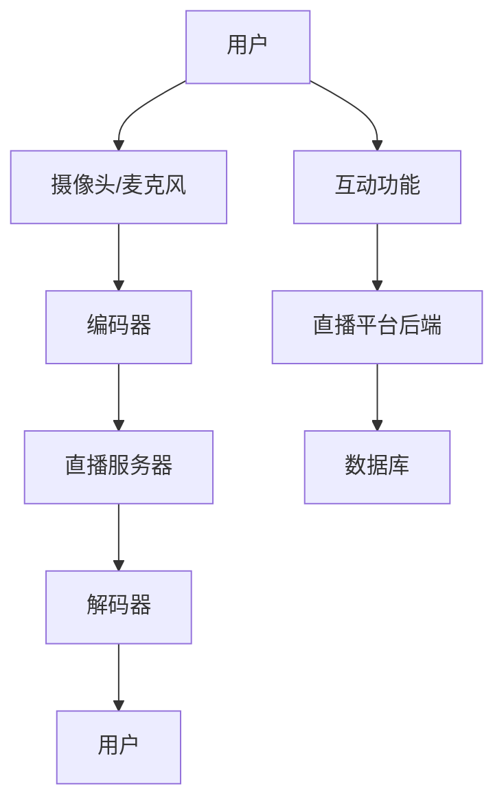

                 

### 文章标题

《bilibili2024直播技术工程师校招面试题集》

### 关键词

直播技术、网络传输、编码解码、服务器搭建、应用开发、互动功能、安全防护

### 摘要

本文旨在为广大对直播技术感兴趣的工程师们提供一份全面的技术指南。本文涵盖了直播技术的基础知识，包括网络技术、编码技术、直播服务器搭建、应用开发、互动技术以及安全防护等关键领域。通过本文，读者不仅能够掌握直播技术的基本原理，还能通过具体的面试题集和项目实战，提升自己的面试技能和实际操作能力。无论您是准备校招面试的应届毕业生，还是希望深入了解直播技术的在职工程师，本文都将为您提供宝贵的知识和实践经验。

### 目录大纲

**第一部分：直播技术基础**

1. **第1章：直播技术概述**
    1.1 直播技术发展史
    1.2 直播技术的基本原理
    1.3 直播技术的关键组件

2. **第2章：网络技术基础**
    2.1 网络协议
    2.2 实时传输协议（RTMP、HLS、DASH等）
    2.3 网络优化技术

3. **第3章：编码技术原理**
    3.1 视频编码技术（H.264、H.265等）
    3.2 音频编码技术（AAC、MP3等）
    3.3 编码技术优化

4. **第4章：直播服务器搭建**
    4.1 直播服务器架构设计
    4.2 直播服务器配置与优化
    4.3 直播服务器故障处理

5. **第5章：直播应用开发**
    5.1 直播应用界面设计
    5.2 直播应用功能实现
    5.3 直播应用性能优化

6. **第6章：互动技术实现**
    6.1 聊天室功能
    6.2 弹幕功能
    6.3 点赞、礼物等互动功能

7. **第7章：直播平台安全防护**
    7.1 防刷粉、刷赞等作弊行为
    7.2 直播内容安全监控
    7.3 直播平台数据安全保护

**第二部分：直播技术面试题集**

8. **第8章：直播技术常见面试题**
    8.1 直播技术原理相关问题
    8.2 网络问题相关问题
    8.3 编码问题相关问题
    8.4 直播平台架构相关问题
    8.5 直播应用开发相关问题
    8.6 互动技术相关问题
    8.7 安全防护相关问题

**第三部分：直播技术项目实战**

9. **第9章：直播技术项目案例解析**
    9.1 项目一：搭建简易直播平台
    9.2 项目二：实现实时聊天功能
    9.3 项目三：优化直播流传输性能
    9.4 项目四：搭建互动直播平台
    9.5 项目五：直播平台安全防护实战

**附录**

10. **附录A：直播技术相关资源链接**
    10.1 开源直播框架
    10.2 直播技术文档
    10.3 直播技术社区
    10.4 直播技术教程

### 核心概念与联系 Mermaid 流程图

以下是一个简单的 Mermaid 流程图，展示了直播技术中的核心概念和它们之间的联系：



- **用户**：产生直播内容的主体，通过摄像头和麦克风采集视频和音频信号。
- **编码器**：对采集到的视频和音频信号进行压缩编码，以便于传输和存储。
- **直播服务器**：负责接收和存储编码后的直播流，并处理用户的互动请求。
- **解码器**：在用户端接收并解码直播流，将压缩后的数据还原成视频和音频信号。
- **互动功能**：直播平台提供的聊天室、弹幕、点赞等互动功能。
- **直播平台后端**：处理用户请求、管理直播流、维护系统稳定性的核心部分。
- **数据库**：存储用户信息、直播内容、互动数据等。

### 核心算法原理讲解伪代码

以下是一些直播技术中常用的核心算法原理的伪代码讲解：

#### 视频编码技术（H.264）

```python
def H264_encoding(video_frame):
    # 初始化编码参数
    parameters = initialize_parameters()

    # 分割视频帧为宏块
    macroblocks = split_frame(video_frame)

    # 对每个宏块进行变换编码
    for mb in macroblocks:
        transform = discrete_cosine_transform(mb)
        quantize(transform, parameters)

    # 输出编码后的帧
    return encoded_frame
```

- `initialize_parameters()`：初始化编码参数，如量化步长、参考帧等。
- `split_frame(video_frame)`：将视频帧分割为多个宏块。
- `discrete_cosine_transform(mb)`：对宏块进行离散余弦变换。
- `quantize(transform, parameters)`：量化变换系数，减少数据量。

#### 音频编码技术（AAC）

```python
def AAC_encoding(audio_frame):
    # 初始化编码参数
    parameters = initialize_parameters()

    # 对音频帧进行感知哈达编码
    perceptual_huffman_encoding = perceptual_huffman(audio_frame)

    # 输出编码后的音频帧
    return encoded_audio_frame
```

- `initialize_parameters()`：初始化编码参数，如频率带宽、量化步长等。
- `perceptual_huffman(audio_frame)`：根据人耳听觉特性进行编码。

### 数学模型和数学公式

直播技术中常用的一些数学模型和公式如下：

#### 均值绝对误差（MAE）

$$
\text{MAE} = \frac{1}{N} \sum_{i=1}^{N} |x_i - \hat{x}_i|
$$

其中，$x_i$ 表示真实值，$\hat{x}_i$ 表示预测值，$N$ 表示数据点的总数。

#### 直播流传输延迟计算

假设直播流每帧大小为 $10KB$，网络带宽为 $10Mbps$，计算从主播端到观众端的传输延迟。

$$
\text{传输延迟} = \frac{\text{每帧大小}}{\text{网络带宽}} = \frac{10KB}{10Mbps} = 0.001 \text{秒}
$$

### 项目实战

以下将介绍一个直播技术项目的实际开发过程，包括开发环境搭建、功能实现、性能优化以及代码解读与分析。

#### 搭建简易直播平台

##### 开发环境搭建

- **前端**：使用 React.js 搭建直播界面，包括视频播放窗口、聊天室等。
- **后端**：使用 Node.js 和 Express.js 搭建服务器，处理直播流传输和用户互动请求。
- **直播编码**：使用 FFmpeg 进行视频和音频编码。
- **直播流传输**：使用 RTMP 协议传输直播流。

##### 功能实现

1. **直播流发送**：主播通过 FFmpeg 将视频和音频信号编码成 RTMP 流，发送到服务器。
    ```shell
    ffmpeg -re -i input.mp4 -c:v libx264 -preset veryfast -c:a aac -f flv rtmp://server/live/stream
    ```

2. **直播流接收**：观众通过前端代码连接到服务器，接收并播放直播流。
    ```javascript
    rtmp.connect(server_url, function() {
        rtmp.play();
    });
    ```

3. **聊天室功能**：使用 WebSocket 协议实现实时聊天功能。
    ```javascript
    socket = new WebSocket(server_url);
    socket.onmessage = function(event) {
        display_message(event.data);
    };
    ```

4. **弹幕功能**：使用 WebSocket 协议实现弹幕发送和显示。
    ```javascript
    socket.send(barrage_message);
    ```

##### 性能优化

1. **页面加载速度**：使用 HTTP 动态请求技术（如 Ajax）优化页面加载速度。
    ```javascript
    $.get('live_stream.html', function(data) {
        $('#live_stream').html(data);
    });
    ```

2. **视频流传输速度**：使用 CDN 服务加速视频流传输。
    ```javascript
    rtmp.connect(cdn_url, function() {
        rtmp.play();
    });
    ```

##### 代码解读与分析

1. **直播流发送端代码**：
    ```javascript
    // 使用RTMP协议发送直播流
    rtmp.connect(server_url, function() {
        rtmp.send(video_frame);
    });
    ```
    - `rtmp.connect(server_url)`：连接到 RTMP 服务器。
    - `rtmp.send(video_frame)`：发送直播流。

2. **直播流接收端代码**：
    ```javascript
    // 使用RTMP协议接收直播流
    rtmp.on('video', function(frame) {
        display_video_frame(frame);
    });
    ```
    - `rtmp.on('video', function(frame) {...})`：监听 RTMP 服务器发送的直播流，并处理直播流。

通过以上实战案例，读者可以了解到直播技术的实际开发流程和关键代码实现。希望本文能够为读者在直播技术领域的学习和面试提供有益的参考。

### 总结

本文对直播技术进行了全面的讲解，涵盖了直播技术基础、面试题集和项目实战等方面。通过对直播技术原理的深入剖析，读者可以了解直播技术中的核心概念、算法原理和开发流程。本文的面试题集和项目实战部分，则帮助读者将理论知识应用到实际场景中，提升面试和项目开发能力。希望本文能够为读者在直播技术领域的成长提供帮助。

### 作者信息

**作者：** AI天才研究院/AI Genius Institute & 禅与计算机程序设计艺术 /Zen And The Art of Computer Programming

AI天才研究院致力于推动人工智能技术的发展与应用，通过深入研究人工智能领域的最新技术，为读者提供高质量的技术文章和资源。同时，作者本人也是《禅与计算机程序设计艺术》的作者，一直致力于将哲学思维与编程技巧相结合，帮助读者提升编程能力和技术水平。希望本文能为读者在直播技术领域的探索提供有力的支持。

