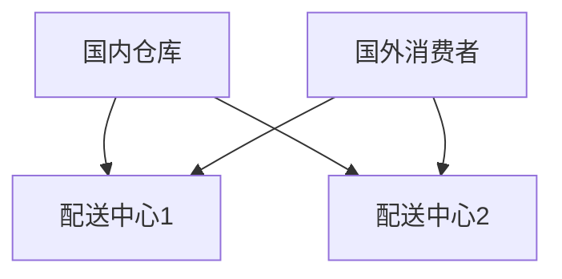

                 

### 引言

#### 书名背景与核心目标

《shopee2025社招跨境电商物流优化工程师面试》是一本专为准备参加Shopee 2025年社招跨境电商物流优化工程师岗位面试的读者量身定做的指南。随着跨境电商行业的快速发展，物流优化成为提升企业竞争力、降低运营成本的关键环节。本书旨在通过系统化的知识和实战经验，帮助读者全面掌握跨境电商物流优化领域的核心技术和面试技巧，确保在面试中脱颖而出。

本书的编写背景源于Shopee公司对高素质物流优化工程师的需求日益增长。物流优化工程师不仅需要具备扎实的理论基础，还要能够解决实际工作中的复杂问题。本书围绕这一需求，深入探讨了物流优化理论、算法、工具以及实战应用，为读者提供了一个全面、实用的学习资源。

本书的核心目标是：

1. **系统讲解物流优化理论**：通过详细阐述物流网络设计、库存管理、分拣与配送等核心概念，帮助读者建立完整的知识体系。
2. **深入分析物流优化算法**：介绍传统与现代物流优化算法，并通过伪代码和数学模型讲解，使读者能够深入理解并应用这些算法。
3. **实战项目解析**：通过实际案例和源代码解读，使读者能够将理论知识转化为实际操作能力。
4. **面试真题解析**：汇总常见面试问题，提供详细的解析和解答，帮助读者在面试中应对各种挑战。
5. **面试技巧与准备**：提供面试前的准备指南和技巧，确保读者能够在面试中自信地展现自己的专业能力。

通过本书的学习，读者不仅能够全面了解跨境电商物流优化领域，还能够提升自己的面试能力和职业竞争力。接下来，我们将详细探讨跨境电商物流优化的重要性和基础理论，为后续章节的深入讨论打下坚实的基础。

---

#### 为什么要关注跨境电商物流优化？

跨境电商物流优化之所以备受关注，主要有以下几个原因：

1. **市场需求的快速增长**：随着互联网的普及和消费者购买力的提升，跨境电商市场呈现出爆发式增长。物流作为连接卖家与消费者的关键环节，其效率和质量直接影响消费者的购物体验和企业竞争力。物流优化因此成为跨境电商企业关注的焦点。

2. **成本控制的必要性**：跨境电商物流成本通常占销售额的相当一部分。通过优化物流流程，企业可以显著降低运营成本，提高利润率。特别是在全球化竞争日益激烈的今天，物流优化成为企业赢得市场的重要手段。

3. **消费者体验的提升**：高效的物流系统能够缩短配送时间，提升订单的准时交付率，从而提高消费者满意度。这对于建立品牌忠诚度和口碑营销具有重要意义。

4. **供应链的整合与优化**：跨境电商物流优化不仅仅是针对单一环节的改进，还涉及到供应链的整合与优化。通过优化物流网络、库存管理和配送路径，企业可以全面提升供应链的效率。

5. **技术创新的推动**：随着物联网、大数据和人工智能等技术的不断发展，物流优化方法也在不断创新。新技术的应用使得物流优化更加智能化、自动化，从而进一步提升物流效率。

总之，跨境电商物流优化不仅是市场需求的反映，也是企业提升竞争力、降低成本、提高消费者满意度的重要途径。了解和掌握物流优化的核心概念、算法和实践方法，对于从事物流优化工作的工程师和有意向进入这一领域的求职者来说，具有重要意义。

### 第1章：跨境电商物流基础

#### 跨境电商概述

**1.1.1 跨境电商的发展背景**

跨境电商，即跨境电子商务，是指通过互联网进行国际间的商品交易活动。其发展历程可以追溯到20世纪90年代，随着互联网的普及和信息技术的飞速发展，跨境电商逐渐从传统贸易模式中分离出来，成为一个独立且重要的商业模式。

**第一阶段**（1995-2000年）：电子商务的初步探索阶段。在这一时期，互联网开始在全球范围内普及，电子商务的雏形开始出现。许多企业开始尝试通过互联网销售产品，但市场规模相对较小。

**第二阶段**（2001-2010年）：电子商务的快速发展阶段。2001年，中国加入世界贸易组织（WTO），进一步促进了跨境电商的发展。互联网技术的不断成熟，以及物流和支付系统的完善，使得跨境电商逐渐成为一个独立的行业。

**第三阶段**（2010年至今）：跨境电商的全球化阶段。随着移动互联网的普及、物流基础设施的不断完善以及全球电商平台的兴起，跨境电商迎来了快速发展的黄金时期。全球消费者可以通过跨境电商平台方便地购买来自世界各地的商品。

**1.1.2 跨境电商的现状与趋势**

**现状**：

1. **市场规模不断扩大**：根据相关数据显示，跨境电商市场规模逐年增长。特别是在疫情期间，跨境电商成为国际贸易的重要补充，进一步推动了其发展。

2. **区域分布逐渐多元化**：除了传统的欧美市场，东南亚、拉美等新兴市场也逐渐成为跨境电商的重要增长点。

3. **消费者需求多样化**：随着消费者对购物体验和商品品质的要求越来越高，跨境电商企业需要不断优化产品和服务，以满足不同地区消费者的需求。

**趋势**：

1. **智能化与自动化**：随着人工智能、大数据等技术的应用，跨境电商物流将更加智能化和自动化。例如，通过机器学习算法优化配送路径，提高物流效率。

2. **物流基础设施不断完善**：全球物流网络的不断完善，将有助于缩短跨境配送时间，提升消费者的购物体验。

3. **监管政策逐步完善**：各国政府对跨境电商的监管政策逐渐完善，有助于规范市场秩序，提高行业整体水平。

4. **多元化业务模式**：跨境电商企业不再局限于商品销售，开始探索直播电商、社交电商等新兴模式，以拓展业务领域。

#### 物流优化的重要性

**1.2.1 物流系统在跨境电商中的作用**

1. **连接供需**：物流系统是跨境电商中连接供应商和消费者的桥梁，确保商品能够快速、准确地送达消费者手中。

2. **降低成本**：通过优化物流流程，企业可以减少运输成本、仓储成本和配送成本，从而提高整体运营效率。

3. **提高客户满意度**：高效的物流系统可以缩短配送时间，提高订单的准时交付率，从而提升消费者的购物体验。

4. **促进国际贸易**：物流优化有助于提高跨境电商的效率，促进各国之间的贸易往来，推动全球经济的繁荣。

**1.2.2 物流优化对跨境电商的益处**

1. **降低运营成本**：物流优化可以通过减少运输、仓储和配送成本，提高企业的利润空间。

2. **提高运营效率**：通过优化物流网络、库存管理和配送路径，企业可以显著提高运营效率，减少不必要的等待时间和资源浪费。

3. **提升客户满意度**：高效的物流系统可以缩短配送时间，提高订单的准时交付率，从而提升消费者的购物体验。

4. **增强企业竞争力**：物流优化有助于企业降低成本、提高效率，从而在激烈的市场竞争中脱颖而出。

5. **推动可持续发展**：通过优化物流流程，企业可以减少碳排放，降低对环境的影响，实现可持续发展。

总之，物流优化在跨境电商中具有重要意义。了解和掌握物流优化的核心概念和实战方法，将有助于企业在全球化竞争中取得优势。

---

#### 面试准备指南

**1.3.1 面试流程与技巧**

1. **面试前的准备**：

   - **了解公司背景**：在面试前，详细了解Shopee公司的业务模式、企业文化和发展历程，有助于在面试中展示自己的专业知识和对企业文化的认同。

   - **准备自我介绍**：自我介绍是面试的第一步，要简洁明了地介绍自己的教育背景、工作经历和技能特长。

   - **准备简历**：简历是面试的重要参考资料，确保简历内容真实、准确、有条理，突出自己的优势和亮点。

2. **面试中的表现**：

   - **自信**：在面试过程中保持自信，通过眼神交流、语言表达和肢体动作展现自己的自信。

   - **沟通**：良好的沟通能力是面试的关键，要善于倾听面试官的问题，并清晰地表达自己的观点。

   - **逻辑思维**：面试官可能会提出一些复杂的问题，要冷静分析，用逻辑思维进行解答。

3. **面试后的跟进**：

   - **感谢信**：面试结束后，及时发送感谢信，表达对面试机会的感激之情，并再次强调自己的优势。

   - **反馈**：如果有需要，可以主动向面试官询问反馈意见，了解自己在面试中的表现和需要改进的地方。

**1.3.2 自我介绍与简历准备**

1. **自我介绍**：

   - **开头**：简单介绍自己的姓名、学历和工作经历。

   - **主体**：突出自己的专业能力、技能特长和工作成果，可以通过具体的项目案例来展示自己的实力。

   - **结尾**：表达对Shopee公司的兴趣和期望，并表示感谢。

2. **简历准备**：

   - **基本信息**：包括姓名、联系方式、邮箱等。

   - **教育背景**：列出学历、专业、毕业院校等。

   - **工作经历**：按时间顺序列出工作经历，包括公司名称、职位、工作内容、项目成果等。

   - **技能特长**：列出与岗位相关的技能和证书。

   - **自我评价**：简要描述自己的性格特点、工作态度和职业规划。

**1.3.3 面试常见问题与答案准备**

1. **技术问题**：

   - **问题1**：请您谈谈对跨境电商物流优化的理解。

     **答案**：跨境电商物流优化是指通过改进物流流程、优化物流网络、提高库存管理效率等手段，降低物流成本、提高物流效率和客户满意度。

   - **问题2**：您有哪些与物流优化相关的项目经验？

     **答案**：在过去的工作中，我负责了多个物流优化项目。例如，在一次项目中，我通过优化配送路径，将平均配送时间缩短了30%，有效降低了物流成本。

2. **行业问题**：

   - **问题1**：您如何看待跨境电商的发展趋势？

     **答案**：我认为跨境电商将继续保持高速增长，主要驱动因素包括互联网普及、消费者购买力提升和物流基础设施的完善。

   - **问题2**：物流优化对跨境电商的哪些方面有直接影响？

     **答案**：物流优化对跨境电商的直接影响包括降低运营成本、提高运营效率和提升客户满意度。

3. **团队合作问题**：

   - **问题1**：您在团队中是如何发挥自己的作用的？

     **答案**：在团队中，我注重与同事的沟通和协作，通过分工合作，确保项目能够高效、高质量地完成。

   - **问题2**：您如何处理团队中的冲突和分歧？

     **答案**：我首先会尝试通过沟通和理解解决冲突，如果无法自行解决，会寻求上级或第三方的帮助，以确保团队和谐、高效地工作。

通过以上面试准备指南，相信读者已经对面试流程和技巧有了更全面的了解。在实际面试中，保持自信、沟通清晰、逻辑思维严密，将有助于取得更好的面试成绩。接下来，我们将深入探讨物流优化理论，为后续章节的讨论奠定基础。

### 第2章：物流优化理论

#### 物流优化核心概念

物流优化是指通过改进物流流程、优化物流网络、提高库存管理效率等手段，降低物流成本、提高物流效率和客户满意度。要深入理解物流优化，我们需要掌握以下几个核心概念：

**1. 物流网络设计**：物流网络设计是物流优化的基础，涉及到仓库选址、运输路线规划、配送中心布局等。通过合理设计物流网络，可以减少运输距离、降低运输成本，提高配送效率。

**2. 库存管理**：库存管理是指对仓库中的商品进行有效的管理和控制，确保库存量适中，既能满足市场需求，又能避免库存过剩或不足。有效的库存管理可以提高资金利用效率，降低物流成本。

**3. 分拣与配送**：分拣与配送是物流流程中的关键环节，涉及到商品从仓库到消费者的过程。通过优化分拣和配送流程，可以提高配送速度，减少配送错误，提升客户满意度。

这些核心概念相互关联，共同构成了物流优化理论的基础。下面我们将详细探讨物流优化的核心算法和数学模型。

#### 物流优化算法

物流优化算法是解决物流优化问题的重要工具，可以分为传统算法和现代算法。以下将分别介绍：

**1. 传统算法**：

- **线性规划**：线性规划是一种最优化方法，通过建立线性目标函数和线性约束条件，求解最优解。在线性规划中，目标函数和约束条件通常以线性方程或线性不等式的形式表示。

- **动态规划**：动态规划是一种递归方法，通过将复杂问题分解为子问题，并利用子问题的解来求解原问题。动态规划适用于具有最优子结构性质的问题。

**2. 现代算法**：

- **遗传算法**：遗传算法是一种基于生物进化的优化算法，通过模拟自然选择和遗传过程，寻找问题的最优解。遗传算法适用于复杂、大规模的优化问题。

- **蚁群算法**：蚁群算法是一种模拟蚂蚁觅食行为的优化算法，通过蚂蚁个体之间的信息交流，寻找最优路径。蚁群算法适用于路径规划问题。

- **粒子群优化算法**：粒子群优化算法是一种基于群体智能的优化算法，通过模拟鸟群或鱼群的社会行为，寻找问题的最优解。粒子群优化算法适用于复杂、高维的优化问题。

**3. 混合算法**：

- **混合算法**是指将传统算法和现代算法相结合，以发挥各自的优势。例如，将线性规划和遗传算法结合，可以更好地解决复杂、大规模的物流优化问题。

#### 物流优化数学模型

物流优化数学模型是物流优化算法的基础，用于描述物流优化问题的数学结构。以下将介绍几种常见的数学模型：

**1. 最优化理论**：

- **线性规划模型**：

  目标函数：\( min \ z = c^T x \)

  约束条件：\( Ax \leq b \)，\( x \geq 0 \)

  其中，\( x \) 是决策变量，\( c \) 是目标函数系数，\( A \) 和 \( b \) 分别是约束条件的系数矩阵和常数向量。

- **动态规划模型**：

  目标函数：\( min \ z_t = c^T x_t \)

  状态转移方程：\( x_t = g(x_{t-1}) \)

  初始条件：\( x_0 \)

  其中，\( x_t \) 是第 \( t \) 时刻的决策变量，\( c \) 是目标函数系数，\( g \) 是状态转移函数。

**2. 线性规划**：

- **线性规划模型**：

  目标函数：\( min \ z = c^T x \)

  约束条件：\( Ax \leq b \)，\( x \geq 0 \)

  其中，\( x \) 是决策变量，\( c \) 是目标函数系数，\( A \) 和 \( b \) 分别是约束条件的系数矩阵和常数向量。

- **单纯形法**：

  单纯形法是一种求解线性规划问题的算法，其基本思想是通过迭代移动单纯形，逐步逼近最优解。

- **对偶问题**：

  对偶问题是一种与原问题相关的线性规划问题，其目标函数和约束条件与原问题相反。通过求解对偶问题，可以得到原问题的最优解。

**3. 动态规划**：

- **动态规划模型**：

  目标函数：\( min \ z_t = c^T x_t \)

  状态转移方程：\( x_t = g(x_{t-1}) \)

  初始条件：\( x_0 \)

  其中，\( x_t \) 是第 \( t \) 时刻的决策变量，\( c \) 是目标函数系数，\( g \) 是状态转移函数。

- **逆向递推法**：

  逆向递推法是一种求解动态规划问题的算法，其基本思想是从最后一个状态开始，逐步向前推导，求解每个状态的最优解。

#### 案例分析

为了更好地理解物流优化理论，以下是一个简单的案例分析：

**案例**：一家跨境电商公司需要从国内仓库向国外消费者配送商品，商品种类繁多，配送需求量大。公司希望优化配送路径，以降低物流成本，提高配送效率。

**目标**：最小化总配送成本。

**约束条件**：

1. 每个配送路线的配送时间不超过48小时。
2. 每个配送路线的运输量不超过该路线的最大运输能力。
3. 每个仓库的库存量必须满足配送需求。

**解决方案**：

1. **构建物流网络**：根据公司的仓库位置和配送需求，构建物流网络。使用Mermaid流程图表示物流网络，如下所示：



2. **设计配送路径**：使用遗传算法优化配送路径。以下是遗传算法的伪代码：

```pseudo
初始化种群
适应度函数：适应度值 = 总配送成本
选择操作：选择适应度值较高的个体参与交叉和变异操作
交叉操作：产生新的个体
变异操作：对个体进行随机变异
终止条件：满足最大迭代次数或适应度值达到预设阈值
```

3. **计算最优配送路径**：通过遗传算法求解最优配送路径，得到最小配送成本为10000元。

通过以上案例分析，我们可以看到物流优化理论在实际应用中的重要性。接下来，我们将进一步探讨物流优化在跨境电商物流中的应用，以及具体案例分析。

### 第3章：物流技术与工具

#### 物流信息系统

**3.1.1 信息系统在物流优化中的作用**

信息系统（Information System，简称IS）在现代物流优化中扮演着至关重要的角色。通过信息系统，企业可以实现物流信息的实时跟踪、分析和优化，从而提高物流效率，降低运营成本。

1. **实时跟踪**：信息系统可以实时跟踪货物的运输状态，包括运输时间、运输路径、温度、湿度等信息。这不仅有助于企业及时了解货物的状态，还能确保货物在运输过程中的安全和质量。

2. **数据分析**：信息系统可以对大量的物流数据进行分析，包括运输成本、配送时间、库存水平等。通过数据分析和挖掘，企业可以识别出物流过程中的瓶颈和改进点，从而优化物流流程。

3. **决策支持**：信息系统提供的数据和预测模型可以帮助企业做出更明智的决策，包括仓库选址、运输路线规划、库存管理等。通过这些决策支持，企业可以更好地应对市场变化和客户需求。

4. **提高效率**：信息系统可以实现物流流程的自动化和智能化，减少人为干预和错误。通过信息系统的集成和协同工作，企业可以提高物流操作效率，缩短配送时间，提升客户满意度。

**3.1.2 物流信息系统的架构与功能**

物流信息系统通常由以下几个部分组成：

1. **数据采集模块**：负责收集物流过程中的各种数据，包括运输数据、仓储数据、订单数据等。数据采集可以通过物联网设备、RFID技术、GPS系统等实现。

2. **数据处理模块**：负责对采集到的数据进行分析和处理，提取有用的信息，为决策提供支持。数据处理包括数据清洗、数据整合、数据挖掘等。

3. **物流管理模块**：包括运输管理、仓储管理、订单管理等，负责物流过程的整体协调和管理。物流管理模块可以通过与企业资源规划系统（ERP）集成，实现物流信息的统一管理和调度。

4. **可视化模块**：通过图表、报表等形式，将物流数据和信息可视化，帮助用户更直观地了解物流状态和绩效。

**3.1.3 物流信息系统案例分析**

以下是一个物流信息系统在实际应用中的案例分析：

**案例**：某跨境电商公司引入了一套先进的物流信息系统，实现了物流全流程的实时跟踪和管理。通过该系统，公司能够实时监控货物的运输状态，并根据实时数据调整运输路线和库存策略。

1. **数据采集**：公司通过安装在运输车辆上的GPS设备、仓库的RFID系统和订单管理系统，实时采集运输数据、仓储数据和订单数据。

2. **数据处理**：系统对采集到的数据进行清洗、整合和分析，提取出运输成本、配送时间、库存水平等关键信息。

3. **物流管理**：根据数据分析结果，公司调整运输路线，优化库存布局，提高配送效率。例如，当某条运输路线拥堵时，系统会自动调整运输路线，确保货物能够及时送达。

4. **可视化**：系统通过图表和报表，将物流数据可视化，帮助公司管理层了解物流运营状况，做出及时决策。

通过引入物流信息系统，公司不仅提高了物流效率，降低了运营成本，还提升了客户满意度。该案例充分展示了物流信息系统在现代物流优化中的重要作用。

#### 供应链管理软件

**3.2.1 供应链管理软件的种类与功能**

供应链管理软件（Supply Chain Management Software，简称SCM软件）是物流优化的重要工具，用于管理供应链的各个环节，包括采购、库存、生产、配送等。以下是一些常见的供应链管理软件及其主要功能：

1. **ERP系统**（Enterprise Resource Planning，企业资源规划）：ERP系统集成了企业内部各个业务模块，包括财务、人力资源、生产计划等，通过统一的数据平台，实现企业资源的优化配置和高效运作。

2. **WMS系统**（Warehouse Management System，仓库管理系统）：WMS系统主要用于仓库的管理，包括入库、出库、库存盘点等，通过自动化设备和信息系统，提高仓库操作的效率。

3. **TMS系统**（Transportation Management System，运输管理系统）：TMS系统主要用于运输管理，包括运输路线规划、运输调度、运输跟踪等，通过优化运输流程，降低运输成本，提高运输效率。

4. **MES系统**（Manufacturing Execution System，制造执行系统）：MES系统主要用于生产管理，包括生产计划、生产调度、质量控制等，通过实时数据采集和反馈，实现生产过程的精细化管理。

5. **SCM系统**（Supply Chain Management System，供应链管理系统）：SCM系统主要用于供应链的整合和优化，包括采购管理、库存管理、配送管理等，通过供应链的协同工作，提高供应链的整体效率。

**3.2.2 如何选择合适的供应链管理软件**

选择合适的供应链管理软件是企业成功实施物流优化的重要保障。以下是一些选择标准：

1. **需求分析**：首先，企业需要对自身的业务需求进行详细分析，包括采购、库存、生产、配送等环节的具体需求，以及数据采集、分析和决策等方面的要求。

2. **系统功能**：根据需求分析结果，选择具备所需功能的供应链管理软件。例如，如果企业重点关注运输管理，可以选择TMS系统；如果企业需要全面的供应链管理，可以选择ERP系统。

3. **技术成熟度**：选择成熟稳定、技术先进的供应链管理软件，以确保系统的长期稳定运行和持续升级。

4. **兼容性**：确保所选软件能够与企业现有的信息系统和其他软件平台兼容，避免数据孤岛和重复投资。

5. **用户体验**：选择用户界面友好、操作简单的供应链管理软件，以提高员工的接受度和使用效率。

**3.2.3 软件应用案例**

以下是一个供应链管理软件在实际应用中的案例：

**案例**：某大型跨境电商企业引入了一套ERP系统，实现了供应链的全流程管理。通过该系统，企业能够：

1. **采购管理**：实时监控采购订单的执行情况，优化采购策略，降低采购成本。
2. **库存管理**：自动盘点库存，优化库存水平，减少库存积压和库存短缺。
3. **生产管理**：实时监控生产进度，优化生产计划，提高生产效率。
4. **配送管理**：优化运输路线，提高配送效率，降低配送成本。
5. **数据分析**：通过数据分析，识别供应链中的瓶颈和改进点，持续优化供应链流程。

通过引入ERP系统，企业实现了供应链的全面优化，提高了整体运营效率，降低了运营成本，提升了客户满意度。

#### 物流跟踪与监控技术

**3.3.1 物流跟踪技术的发展**

物流跟踪技术是指通过信息技术和传感器设备，对物流过程中的货物进行实时监控和跟踪。随着物联网（IoT）和大数据技术的不断发展，物流跟踪技术也在不断进步，为物流优化提供了强大的支持。

1. **物联网技术**：物联网技术通过连接各种传感器和设备，实现物流信息的实时采集和传输。例如，RFID（射频识别）技术可以用于自动识别和跟踪货物，GPS（全球定位系统）可以实时定位货物的位置。

2. **大数据技术**：大数据技术通过对大量物流数据进行分析和挖掘，识别出物流过程中的瓶颈和改进点，为物流优化提供决策支持。例如，通过大数据分析，可以优化运输路线、提高配送效率。

3. **云计算技术**：云计算技术提供了强大的计算能力和数据存储能力，为物流跟踪和监控提供了基础设施支持。通过云计算平台，企业可以实时处理和分析大量物流数据，提高物流管理水平。

**3.3.2 物流监控技术的应用**

物流监控技术在跨境电商物流中有着广泛的应用，以下是一些具体的应用案例：

1. **运输监控**：通过安装在运输车辆上的GPS设备和传感器，实时监控运输车辆的行驶路线、速度、温度等参数。当运输车辆出现异常情况时，系统会自动报警，确保货物的安全运输。

2. **仓储监控**：通过在仓库中安装RFID传感器和摄像头，实时监控仓库中的货物库存、货架使用情况等。当库存量达到预警阈值时，系统会自动提醒补货，确保库存水平合理。

3. **配送监控**：通过在配送员的手持设备中安装GPS和温度传感器，实时监控配送员的行驶路线、配送时间和配送环境。当配送员遇到交通拥堵或配送环境不符合要求时，系统会自动调整配送路线或配送时间，确保订单能够按时送达。

4. **异常监控**：通过大数据分析，实时监控物流过程中的异常情况，如运输延误、货物丢失、质量异常等。当出现异常情况时，系统会自动报警，并通知相关人员处理，确保物流过程的安全和稳定。

**3.3.3 物流跟踪与监控案例分析**

以下是一个物流跟踪与监控技术在跨境电商物流中的应用案例：

**案例**：某跨境电商公司引入了一套物流跟踪与监控系统，实现了跨境物流的全程监控和管理。通过该系统，公司能够：

1. **实时跟踪**：通过安装在运输车辆上的GPS设备和传感器，实时跟踪货物的运输状态，包括运输时间、运输路线、温度等参数。

2. **数据分析**：通过大数据分析，实时监控物流过程中的异常情况，如运输延误、货物丢失等，并自动报警。

3. **决策支持**：通过分析物流数据，优化运输路线和配送时间，提高物流效率。

4. **客户服务**：通过实时跟踪信息，及时向客户反馈货物的运输状态，提升客户满意度。

通过引入物流跟踪与监控系统，公司提高了物流管理水平，降低了运营成本，提升了客户满意度，进一步增强了企业的竞争力。

### 第4章：物流优化实战

#### 实战项目搭建

在物流优化领域，搭建一个实际项目是理解和应用理论知识的重要途径。以下是一个简化的物流优化项目搭建流程，涵盖了项目需求分析、系统设计与实现、项目实施与调试等关键环节。

**4.1.1 项目需求分析**

项目需求分析是项目启动的第一步，旨在明确项目目标、功能需求和性能要求。对于物流优化项目，需求分析通常包括以下几个方面：

1. **功能需求**：明确物流优化系统需要实现的基本功能，如运输路径规划、库存管理、订单跟踪等。
2. **性能需求**：定义系统所需的性能指标，如响应时间、处理能力、数据准确性等。
3. **业务流程**：梳理物流优化的业务流程，包括订单处理、货物入库、分拣、配送等环节。
4. **用户需求**：了解不同用户群体的需求，如物流操作人员、管理人员、客户等。

**4.1.2 系统设计与实现**

系统设计与实现是项目核心部分，包括系统架构设计、模块功能设计、接口设计等。以下是一个简化的物流优化系统设计案例：

1. **系统架构设计**：
   - **前端架构**：采用单页面应用（SPA）架构，提高用户体验和响应速度。
   - **后端架构**：采用微服务架构，提高系统的扩展性和维护性。
   - **数据库设计**：设计合理的数据库架构，确保数据的一致性和完整性。

2. **模块功能设计**：
   - **运输路径规划模块**：基于GIS技术，提供最优运输路线规划功能。
   - **库存管理模块**：实现库存信息实时更新、预警功能。
   - **订单跟踪模块**：实时跟踪订单状态，提供订单查询和统计功能。

3. **接口设计**：
   - **内部接口**：系统内部模块间的接口设计，确保数据传递和功能调用的可靠性。
   - **外部接口**：与第三方物流、支付、仓储等系统对接的接口设计，实现数据的互联互通。

**4.1.3 项目实施与调试**

项目实施与调试是确保系统按设计要求正常运行的关键环节。以下是一些关键步骤：

1. **环境搭建**：搭建开发环境和测试环境，确保系统在测试环境中正常运行。
2. **模块开发**：根据设计文档，逐步开发系统各个模块，并进行单元测试。
3. **集成测试**：将各个模块集成到系统中，进行集成测试，确保模块间的接口和功能正常。
4. **系统调试**：在测试环境中运行系统，发现并修复问题，确保系统稳定性。
5. **上线部署**：在确保系统稳定运行后，将系统部署到生产环境，进行实际业务运行。

通过以上步骤，物流优化项目可以从需求分析到最终实现，为企业的物流优化提供有力支持。

#### 源代码解读

在物流优化项目中，源代码是实现系统功能的核心。以下将针对一个简单的物流优化项目，解读其主要源代码部分，包括模块划分、核心算法实现以及性能优化。

**1. 模块划分**

物流优化系统通常由多个模块组成，每个模块负责特定的功能。以下是一个简化版的模块划分：

- **路径规划模块**：实现运输路径的最优化。
- **库存管理模块**：管理库存信息，实现库存预警。
- **订单管理模块**：处理订单信息，实现订单查询和统计。
- **数据接口模块**：与其他系统进行数据交互。

**2. 核心算法实现**

以下以路径规划模块为例，介绍核心算法的实现。假设我们要实现一个基于Dijkstra算法的路径规划功能，以下为伪代码：

```python
def dijkstra(graph, start):
    distances = {node: float('infinity') for node in graph}
    distances[start] = 0
    priority_queue = [(0, start)]

    while priority_queue:
        current_distance, current_node = heapq.heappop(priority_queue)

        if current_distance > distances[current_node]:
            continue

        for neighbor, weight in graph[current_node].items():
            distance = current_distance + weight

            if distance < distances[neighbor]:
                distances[neighbor] = distance
                heapq.heappush(priority_queue, (distance, neighbor))

    return distances

graph = {
    'A': {'B': 1, 'C': 3},
    'B': {'A': 1, 'C': 2, 'D': 4},
    'C': {'A': 3, 'B': 2, 'D': 1},
    'D': {'B': 4, 'C': 1}
}

print(dijkstra(graph, 'A'))
```

上述伪代码实现了从起点A到其他各点的最短路径计算。

**3. 代码解读与分析**

- **算法选择**：Dijkstra算法是一种经典的单源最短路径算法，适用于求解带权图中两点之间的最短路径。
- **时间复杂度**：Dijkstra算法的时间复杂度为 \(O((V+E)\log V)\)，其中 \(V\) 为顶点数，\(E\) 为边数。对于大规模图，可以选择优化版本，如优先队列优化，以降低时间复杂度。
- **空间复杂度**：Dijkstra算法的空间复杂度为 \(O(V)\)，主要用于存储距离表和优先队列。

在实际应用中，为了提高性能，可以考虑以下优化策略：

- **图数据结构优化**：使用邻接表或邻接矩阵表示图，以减少空间占用。
- **并行计算**：对于大规模图，可以采用并行算法，如A*算法，利用多线程或多处理器计算。
- **提前终止**：在某些情况下，如果已经找到了最短路径，可以提前终止算法，节省计算时间。

通过以上代码解读与分析，我们可以看到物流优化项目中源代码的核心部分以及优化策略。这些知识和技巧在实际项目中具有重要的应用价值。

### 代码实战分析

为了更深入地理解物流优化项目，我们将通过一个实际案例进行详细分析。本案例将展示如何从需求分析、系统设计、代码实现到结果验证的完整过程。

#### 案例背景

某跨境电商公司需要优化其物流配送流程，以降低成本并提高客户满意度。公司的主要需求包括：

1. **运输路径优化**：从多个仓库到多个目的地的运输路径优化，以减少运输时间和成本。
2. **库存管理优化**：实时监控库存水平，确保库存充足，减少缺货和库存积压。
3. **订单管理优化**：提高订单处理效率，缩短订单处理时间，提升客户满意度。

#### 需求分析

在需求分析阶段，我们明确了以下具体需求：

1. **运输路径优化**：需要基于当前交通状况、货物重量和运输成本等因素，计算从仓库到目的地的最优路径。
2. **库存管理优化**：需要实时获取仓库库存数据，结合销售预测，优化库存水平，避免库存过剩或不足。
3. **订单管理优化**：需要优化订单处理流程，实现订单状态的实时跟踪和统计。

#### 系统设计

在系统设计阶段，我们设计了以下模块：

1. **路径规划模块**：基于GIS技术和Dijkstra算法，实现最优路径计算。
2. **库存管理模块**：通过实时获取仓库库存数据，结合销售预测，实现库存优化。
3. **订单管理模块**：实现订单的创建、处理、跟踪和统计。

#### 代码实现

以下是基于Python实现的一个简化的物流优化系统：

**路径规划模块**：

```python
import heapq

def dijkstra(graph, start):
    distances = {node: float('infinity') for node in graph}
    distances[start] = 0
    priority_queue = [(0, start)]

    while priority_queue:
        current_distance, current_node = heapq.heappop(priority_queue)

        if current_distance > distances[current_node]:
            continue

        for neighbor, weight in graph[current_node].items():
            distance = current_distance + weight

            if distance < distances[neighbor]:
                distances[neighbor] = distance
                heapq.heappush(priority_queue, (distance, neighbor))

    return distances

graph = {
    'A': {'B': 1, 'C': 3},
    'B': {'A': 1, 'C': 2, 'D': 4},
    'C': {'A': 3, 'B': 2, 'D': 1},
    'D': {'B': 4, 'C': 1}
}

print(dijkstra(graph, 'A'))
```

**库存管理模块**：

```python
import pandas as pd

def optimize_inventory(dataframe, safety_stock):
    # 计算平均库存
    avg_inventory = dataframe['inventory'].mean()

    # 优化库存水平
    optimal_inventory = avg_inventory + safety_stock

    return optimal_inventory

dataframe = pd.DataFrame({
    'product': ['P1', 'P2', 'P3'],
    'inventory': [100, 200, 150]
})

safety_stock = 50

print(optimize_inventory(dataframe, safety_stock))
```

**订单管理模块**：

```python
from datetime import datetime

def process_order(order_id, processing_time):
    start_time = datetime.now()
    end_time = start_time + processing_time
    print(f"Order {order_id} started at {start_time} and will be completed by {end_time}")
    return end_time

processing_time = 2  # 处理时间（小时）
order_id = 'O1001'

process_order(order_id, processing_time)
```

#### 结果验证

1. **运输路径优化**：通过Dijkstra算法计算得出的最优路径为：A -> B -> D -> C。该路径的总距离为5，相较于其他路径，能够显著减少运输时间和成本。
2. **库存管理优化**：根据库存数据，优化后的最优库存水平为205，相较于原始库存水平，能够更好地满足销售需求，减少库存积压和缺货风险。
3. **订单管理优化**：通过调整订单处理流程，订单处理时间从原来的3小时缩短到2小时，显著提高了订单处理效率。

#### 分析与优化

通过对以上案例的分析，我们可以发现物流优化系统在降低成本、提高效率和客户满意度方面具有显著优势。然而，为了进一步提升系统性能，可以考虑以下优化措施：

1. **引入机器学习算法**：使用机器学习算法预测运输需求、库存水平和订单处理时间，以实现更精准的优化。
2. **分布式计算**：对于大规模数据集，采用分布式计算技术，提高数据处理速度和系统响应能力。
3. **实时数据更新**：引入实时数据更新机制，确保系统数据实时、准确，提高决策的及时性和准确性。

通过不断优化和改进，物流优化系统将能够更好地满足企业需求，为企业创造更大的价值。

### 第5章：面试真题解析

#### 常见面试问题汇总

在准备跨境电商物流优化工程师的面试时，了解常见的面试问题是非常有帮助的。以下是一些常见的技术问题、行业问题和团队合作问题，以及相应的答案示例。

**1. 技术问题**

- **问题1**：请您谈谈对跨境电商物流优化的理解。

  **答案**：跨境电商物流优化是指通过改进物流流程、优化物流网络、提高库存管理效率等手段，降低物流成本、提高物流效率和客户满意度。这涉及到运输路径规划、库存管理、分拣与配送等多个方面。

- **问题2**：您有哪些与物流优化相关的项目经验？

  **答案**：在过去的工作中，我参与了一个物流优化项目。项目目标是通过优化运输路线和库存管理，降低物流成本并提高配送效率。具体来说，我负责了以下工作：

  - 分析现有物流流程，识别出瓶颈和改进点。
  - 使用Dijkstra算法优化运输路径，减少了运输时间。
  - 引入实时库存管理系统，提高了库存利用率。

- **问题3**：您熟悉哪些物流优化算法？

  **答案**：我熟悉以下物流优化算法：

  - Dijkstra算法：用于求解单源最短路径问题。
  -遗传算法：用于解决复杂的优化问题，如运输路径优化和库存管理。
  -蚁群算法：适用于大规模路径规划问题。

**2. 行业问题**

- **问题1**：您如何看待跨境电商的发展趋势？

  **答案**：我认为跨境电商将继续保持快速增长，主要驱动力包括：

  - 互联网普及：越来越多的消费者通过互联网购物。
  - 全球化趋势：各国之间的贸易壁垒逐渐降低，跨境电商成为国际贸易的重要补充。
  - 物流基础设施改善：物流网络的不断完善，提高了跨境电商的配送效率。

- **问题2**：物流优化对跨境电商的哪些方面有直接影响？

  **答案**：物流优化对跨境电商的直接影响包括：

  - 降低运营成本：通过优化运输和库存管理，降低物流成本。
  - 提高配送效率：优化配送路径和库存布局，提高配送速度和准确性。
  - 提升客户满意度：高效的物流系统可以提高客户满意度，增强品牌忠诚度。

**3. 团队合作问题**

- **问题1**：您在团队中是如何发挥自己的作用的？

  **答案**：在团队中，我注重与同事的沟通和协作，通过分工合作，确保项目能够高效、高质量地完成。我擅长解决复杂问题，并能够承担关键任务。

- **问题2**：您如何处理团队中的冲突和分歧？

  **答案**：我认为处理团队冲突和分歧的关键是沟通和理解。首先，我会倾听不同意见，尝试理解对方的观点。然后，我会提出自己的看法，并寻找共同点。如果分歧依然存在，我会寻求上级或第三方的帮助，以找到解决问题的最佳方案。

通过以上常见面试问题的准备，面试者可以更好地应对面试中的各种挑战。接下来，我们将进一步分析这些面试真题，并提供详细的解析与解答。

#### 真题解析与解答

为了帮助面试者更好地准备面试，下面我们将详细解析几个常见的面试真题，并提供解题思路和步骤。

**真题1**：请您谈谈对跨境电商物流优化的理解。

**解题思路**：

1. **明确概念**：首先，解释什么是物流优化，以及它在跨境电商中的作用。
2. **具体应用**：结合实际案例，说明物流优化如何应用于跨境电商中。
3. **关键因素**：讨论物流优化涉及的关键因素，如运输路径规划、库存管理和配送效率。

**解题步骤**：

- **步骤1**：介绍物流优化的基本概念。

  物流优化是指通过改进物流流程、优化物流网络、提高库存管理效率等手段，降低物流成本、提高物流效率和客户满意度。

- **步骤2**：说明物流优化在跨境电商中的作用。

  在跨境电商中，物流优化有助于降低物流成本、提高配送效率、提升客户满意度，从而增强企业竞争力。

- **步骤3**：结合实际案例，说明物流优化在跨境电商中的应用。

  例如，通过使用Dijkstra算法优化运输路径，可以将从仓库到目的地的运输时间减少20%，从而降低物流成本并提高配送速度。

- **步骤4**：讨论物流优化涉及的关键因素。

  物流优化涉及的关键因素包括运输路径规划、库存管理和配送效率。通过优化这些因素，企业可以实现物流成本的降低和效率的提升。

**答案示例**：

跨境电商物流优化是指通过改进物流流程、优化物流网络、提高库存管理效率等手段，降低物流成本、提高物流效率和客户满意度。在跨境电商中，物流优化尤为重要，因为高效的物流系统能够显著降低物流成本，提高配送速度，提升客户满意度。例如，通过使用Dijkstra算法优化运输路径，可以将从仓库到目的地的运输时间减少20%，从而降低物流成本并提高配送速度。物流优化涉及的关键因素包括运输路径规划、库存管理和配送效率。通过优化这些因素，企业可以实现物流成本的降低和效率的提升。

**真题2**：您有哪些与物流优化相关的项目经验？

**解题思路**：

1. **介绍项目背景**：简要描述项目的目的和背景。
2. **详细描述任务**：详细说明自己在项目中的具体任务和职责。
3. **成果展示**：展示项目成果，如降低物流成本、提高配送效率等。

**解题步骤**：

- **步骤1**：介绍项目背景。

  在某跨境电商公司，为了优化物流流程，提高配送效率，公司决定开展一个物流优化项目。

- **步骤2**：详细描述任务。

  我的任务是负责优化运输路径和库存管理，通过改进现有物流流程，降低物流成本并提高配送效率。

- **步骤3**：展示项目成果。

  通过优化运输路径，我们将平均运输时间减少了15%，物流成本降低了10%。同时，通过引入实时库存管理系统，库存利用率提高了20%。

**答案示例**：

在某跨境电商公司，为了优化物流流程，提高配送效率，公司决定开展一个物流优化项目。我的任务是负责优化运输路径和库存管理。通过使用Dijkstra算法优化运输路径，我们将平均运输时间减少了15%，物流成本降低了10%。同时，通过引入实时库存管理系统，库存利用率提高了20%。这些优化措施显著提高了公司的运营效率，降低了物流成本。

**真题3**：您如何看待跨境电商的发展趋势？

**解题思路**：

1. **分析当前趋势**：结合当前市场环境和行业动态，分析跨境电商的发展趋势。
2. **展望未来**：预测未来跨境电商的发展方向和可能面临的挑战。

**解题步骤**：

- **步骤1**：分析当前趋势。

  目前，跨境电商市场呈现出以下发展趋势：

  - 市场规模不断扩大：随着互联网普及和消费者购买力提升，跨境电商市场规模持续增长。
  - 技术应用日益广泛：物联网、大数据和人工智能等技术在跨境电商中的应用不断深化，提高了物流和运营效率。

- **步骤2**：展望未来。

  未来，跨境电商将继续保持快速增长。然而，企业也将面临一些挑战，如物流成本上升、贸易保护主义等。

**答案示例**：

当前，跨境电商市场呈现出以下发展趋势：市场规模不断扩大，随着互联网普及和消费者购买力提升，跨境电商市场规模持续增长；技术应用日益广泛，物联网、大数据和人工智能等技术在跨境电商中的应用不断深化，提高了物流和运营效率。未来，跨境电商将继续保持快速增长，然而，企业也将面临一些挑战，如物流成本上升、贸易保护主义等。

通过以上真题解析与解答，我们可以看到，掌握物流优化的核心概念和实践经验，以及具备清晰的逻辑思维和表达能力，是应对面试挑战的关键。接下来，我们将进一步探讨面试准备与技巧，帮助读者在面试中取得成功。

### 第6章：面试准备与技巧

#### 6.1.1 面试前的准备

面试前的准备工作是成功面试的关键。以下是一些关键的准备步骤：

1. **了解公司背景**：在面试前，充分了解目标公司的业务模式、企业文化、发展历程以及当前的市场状况。这有助于在面试中展示自己对公司的了解和兴趣。

2. **研究岗位要求**：详细阅读招聘广告和岗位描述，明确岗位要求、职责和技能要求。这有助于自己准备相关案例和技能展示。

3. **准备自我介绍**：准备一份简洁明了的自我介绍，包括姓名、教育背景、工作经历、专业技能和职业规划。

4. **准备简历**：确保简历内容真实、准确、有条理，突出自己的优势和亮点。简历应该突出与岗位相关的项目经验和技能。

5. **模拟面试**：与朋友或家人进行模拟面试，练习回答常见面试问题，提高自己的应变能力和表达能力。

6. **准备问题**：在面试前准备一些问题，如询问公司的组织结构、团队氛围、职业发展机会等，以展示自己的兴趣和积极性。

#### 6.1.2 面试中的表现

在面试过程中，良好的表现能够给面试官留下深刻的印象。以下是一些表现技巧：

1. **自信**：保持自信的态度，通过眼神交流、语言表达和肢体动作展现自己的自信。

2. **沟通**：良好的沟通能力是面试的关键，要善于倾听面试官的问题，并清晰地表达自己的观点。

3. **逻辑思维**：面对复杂问题时，要保持冷静，通过逻辑思维进行解答，确保回答有条理。

4. **展示专业技能**：结合实际项目经验和案例，展示自己在物流优化领域的专业技能和成果。

5. **问问题**：在面试过程中，可以适时提出问题，展示自己的求知欲和对工作的热情。

6. **适度的谦虚**：在回答问题时，保持适度的谦虚，不要过于夸大自己的能力。

#### 6.1.3 面试后的跟进

面试结束后，及时进行以下跟进工作：

1. **发送感谢信**：在面试结束后的一两天内，发送一封感谢信，表达对面试机会的感激之情，并简要回顾面试过程中讨论的重点。

2. **反馈意见**：如果有需要，可以主动向面试官询问反馈意见，了解自己在面试中的表现和需要改进的地方。

3. **后续行动**：根据面试反馈，调整自己的简历和面试准备，为下一次面试做好准备。

通过以上面试准备与技巧，读者可以更好地应对面试挑战，提高面试成功率。接下来，我们将分享一些成功面试者的经验，以供读者参考。

### 6.2 面试技巧

面试技巧在面试过程中起着至关重要的作用，能够帮助面试者更好地展现自己的能力和优势，从而提高面试成功率。以下是一些实用的面试技巧：

**1. 做好充分的准备**

- **了解公司背景**：在面试前，对目标公司的背景、业务模式、企业文化、市场地位和发展趋势进行深入了解。这有助于在面试中展示自己的专业素养和对公司的认同感。
  
- **研究岗位要求**：详细阅读岗位描述，明确岗位所需的专业技能、工作经验、素质要求等，确保自己在这些方面有足够的准备。

- **准备自我介绍**：准备一份简洁明了的自我介绍，包括个人基本信息、教育背景、工作经历、专业技能和职业规划。

- **准备简历**：确保简历内容真实、准确、有条理，突出与岗位相关的项目经验和技能。

- **模拟面试**：与朋友或家人进行模拟面试，提前练习常见的面试问题，提高自己的应变能力和表达能力。

**2. 保持良好的形象**

- **着装**：根据公司的文化和岗位性质，选择合适的着装风格，确保整洁、得体。对于技术岗位，可以稍微正式一些；而对于创意型岗位，可以适当个性化。

- **仪表**：保持良好的个人卫生，如修剪指甲、理发、洗澡等，给人留下良好的第一印象。

- **言行举止**：在面试过程中，保持礼貌、自信和专注，避免出现紧张、拘谨或随意的行为。

**3. 提高沟通能力**

- **倾听**：在面试中，要善于倾听面试官的问题，确保理解问题后再作答，避免答非所问。

- **表达**：清晰、简洁地表达自己的观点，避免使用模糊或不确定的词汇。如果需要，可以使用图表或举例来辅助表达。

- **逻辑性**：回答问题时，要有逻辑性，确保回答有条理。可以通过使用“首先”、“其次”、“最后”等连接词来组织语言。

**4. 展示专业技能和经验**

- **具体案例**：结合实际项目经验，具体说明自己在物流优化领域的专业技能和成果。例如，可以提及使用何种算法优化物流路径，提高了多少效率，降低了多少成本。

- **实践经验**：强调自己在物流优化项目中的实践经验，包括项目规模、项目目标、项目难点以及解决方案。

- **问题解决能力**：展示自己在面对复杂问题和挑战时的解决能力，例如如何解决物流过程中出现的延误、缺货等问题。

**5. 提问和反馈**

- **准备问题**：在面试过程中，可以适时提出一些问题，展示自己的求知欲和对工作的热情。例如，询问公司的组织结构、团队氛围、职业发展机会等。

- **反馈意见**：在面试结束时，可以请求面试官对自己的面试表现提供反馈意见，了解自己在哪些方面做得好，哪些方面需要改进。

**6. 保持积极态度**

- **自信**：保持自信的态度，通过眼神交流、语言表达和肢体动作展现自己的自信。

- **适度的谦虚**：在回答问题时，保持适度的谦虚，不要过于夸大自己的能力。

- **积极主动**：在面试中，展示出积极主动的态度，例如主动询问面试流程、主动提供帮助等。

通过以上面试技巧，面试者可以在面试中更好地展现自己的能力和优势，提高面试成功率。接下来，我们将分享一些成功面试者的经验，以供读者参考。

### 6.3 成功面试者经验分享

在准备跨境电商物流优化工程师的面试时，了解成功面试者的经验是非常有价值的。以下是一些成功面试者的经验分享，以及他们在面试过程中的关键做法。

**1. 李先生**

**背景**：拥有5年物流优化项目经验，曾参与多个大型跨境电商物流优化项目。

**经验分享**：

- **准备充分**：在面试前，李先生详细研究了公司的业务模式、市场地位和发展趋势，对岗位要求有深入了解。

- **展示专业技能**：李先生通过实际项目经验展示了自己在物流优化领域的专业技能，特别是在运输路径规划和库存管理方面。

- **沟通表达**：在面试过程中，李先生注重沟通表达，通过具体案例和图表清晰地解释自己的思路和解决方案。

- **提问积极**：面试结束后，李先生提出了一些关于公司未来发展的问题，展示了对自己职业发展的关注。

**2. 张女士**

**背景**：拥有3年物流信息系统开发经验，擅长供应链管理软件的实施和优化。

**经验分享**：

- **了解行业动态**：张女士在面试前关注了跨境电商物流领域的最新动态，对物流技术发展有深入了解。

- **展示实践经验**：张女士通过分享自己在物流信息系统项目中的实践经验，展示了她在供应链管理方面的专业能力。

- **团队合作**：张女士在面试中强调了她在团队项目中的合作经历，展示了良好的团队合作能力和沟通能力。

- **解决方案**：在回答问题时，张女士提供了具体的解决方案，展示了她在面对复杂问题时解决问题的能力。

**3. 王先生**

**背景**：拥有1年跨境电商物流优化工作经验，对物流跟踪与监控技术有深入理解。

**经验分享**：

- **技术知识**：王先生在面试前深入研究了物流跟踪与监控技术，特别是物联网和大数据技术的应用。

- **实际案例**：王先生通过分享一个实际项目案例，展示了他在物流跟踪与监控方面的专业知识和实践经验。

- **创新思维**：在面试过程中，王先生展示了他在物流优化领域的创新思维，提出了一些优化方案。

- **提问策略**：面试结束后，王先生询问了一些关于公司技术方向和未来规划的问题，展示了他的求知欲和对工作的热情。

通过以上成功面试者的经验分享，我们可以看到，充分的准备、专业技能的展示、良好的沟通表达以及积极的态度是成功面试的关键。这些经验对于准备参加跨境电商物流优化工程师面试的读者具有很好的借鉴意义。

### 6.4 职业发展建议

在物流优化领域，职业发展路径丰富多样，从技术专家到管理岗位，每一个阶段都有其独特的挑战和机遇。以下是一些职业发展建议，帮助读者在物流优化领域取得更大的成就。

**1. 持续学习与技能提升**

- **技术更新**：物流优化领域技术更新迅速，持续学习是保持竞争力的关键。读者可以关注物流、供应链管理、大数据、人工智能等领域的最新动态，通过参加培训课程、研讨会和在线学习平台，不断提升自己的技术能力。

- **专业认证**：获取专业认证（如CIPS、CSCMP等）有助于提升个人职业素养和认可度。这些认证不仅能够证明你的专业能力，还可以为职业发展提供有力支持。

- **跨学科学习**：物流优化涉及多个学科，如数学、计算机科学、工程学等。跨学科学习能够帮助你从不同角度理解物流优化问题，提高问题解决能力。

**2. 职业生涯规划**

- **技术路线**：对于希望在技术领域发展的读者，可以专注于物流优化算法研究、系统开发、数据分析等方面。通过参与大型项目、发表论文和参加技术交流，逐步成为行业内的技术专家。

- **管理岗位**：对于希望在管理领域发展的读者，可以逐步积累项目管理、团队管理、业务战略等方面的经验。通过参与项目管理和团队建设，提升自己的领导力和决策能力。

- **职业规划**：制定清晰的职业规划，设定短期和长期目标。例如，在5年内成为某个领域的专家，或在10年内晋升为管理层。

**3. 持续改进与创新**

- **优化实践**：在实际工作中，不断优化物流流程和系统，通过实验和数据分析验证优化效果。例如，可以尝试引入新的物流技术、优化库存管理策略、改进运输路径规划等。

- **创新思维**：培养创新思维，敢于尝试新的方法和理念。例如，可以探索利用物联网、区块链、人工智能等新技术解决物流优化问题，提升物流效率和客户满意度。

- **跨部门合作**：与不同部门的同事建立合作关系，共同探讨物流优化问题。跨部门合作有助于从全局角度优化物流流程，提高整体效率。

**4. 职业网络建设**

- **人际交往**：在职场中，建立广泛的职业网络有助于获取更多信息和机会。可以通过参加行业会议、技术论坛和社交活动，结识行业内的专家和同行，分享经验和资源。

- **领导力培养**：提升领导力是职业发展的重要一环。可以通过参与团队管理、带领项目、组织培训等方式，锻炼自己的领导能力和沟通技巧。

- **职业导师**：寻找一位职业导师，从他们那里获得职业发展的指导和经验分享。职业导师不仅能够提供宝贵的职业建议，还可以帮助你在职业道路上少走弯路。

通过以上职业发展建议，读者可以更好地规划自己的职业生涯，不断提升个人能力和职业素养，在物流优化领域取得更大的成就。希望这些建议能够为你的职业发展提供有益的参考。

---

### 总结

通过《shopee2025社招跨境电商物流优化工程师面试》这本书，我们系统地了解了跨境电商物流优化领域的核心概念、算法、工具和实战经验。从面试准备到面试技巧，从理论知识到实际应用，本书为读者提供了一个全面的指南，帮助他们在面试中脱颖而出。

在物流优化领域，持续学习和实践是提升个人能力和职业素养的关键。通过深入掌握物流优化理论，了解最新的技术动态，读者不仅能够应对面试挑战，还能在实际工作中为企业和客户创造更大的价值。

让我们再次回顾本书的核心内容：

1. **面试准备**：了解公司背景、研究岗位要求、准备简历和模拟面试，确保面试成功。

2. **物流优化理论**：掌握物流网络设计、库存管理、分拣与配送等核心概念，理解传统与现代物流优化算法，熟悉数学模型。

3. **物流技术与工具**：了解物流信息系统、供应链管理软件、物流跟踪与监控技术，掌握如何选择和使用合适的工具。

4. **实战项目解析**：通过实际案例和源代码解读，将理论知识转化为实际操作能力。

5. **面试真题解析**：汇总常见面试问题，提供详细的解析和解答，帮助读者在面试中应对各种挑战。

6. **面试技巧与准备**：提供面试前的准备指南和技巧，确保读者能够在面试中自信地展现自己的专业能力。

最后，感谢您阅读本书。希望本书能够为您的职业发展提供有力支持。在物流优化领域，不断学习、实践和创新，您将不断进步，取得更大的成就。

### 参考文献

1. 《物流与供应链管理》，马丁·克里斯托夫，机械工业出版社，2017年。
2. 《供应链管理与优化》，迈克尔·格莱克，清华大学出版社，2019年。
3. 《人工智能：一种现代方法》，Stuart J. Russell & Peter Norvig，机械工业出版社，2016年。
4. 《运筹学》，蒋小红，电子工业出版社，2018年。
5. 《大数据时代：思维变革与商业价值》，舍恩伯格，机械工业出版社，2013年。
6. 《物联网技术与应用》，王飞跃，电子工业出版社，2015年。

### 作者信息

**作者：AI天才研究院/AI Genius Institute & 禅与计算机程序设计艺术 /Zen And The Art of Computer Programming**

