                 

### 一人公司如何利用内容营销建立行业权威

内容营销已经成为现代商业环境中不可或缺的一部分。尤其是对于一人公司来说，内容营销提供了一个低成本、高效能的方式来建立行业权威，吸引潜在客户，并最终推动业务增长。本文将深入探讨一人公司如何通过内容营销来建立行业权威，包括策略规划、内容创作与优化、传播与推广、数据分析与效果评估等多个方面。

## **关键词：**
- 内容营销
- 行业权威
- 一人公司
- 营销策略
- 内容创作
- 数据分析
- 传播推广

## **摘要：**
本文将详细解析内容营销的概念和重要性，为一人公司提供从目标受众确定到内容创作、传播与推广，再到数据分析与效果评估的一整套策略和方法。通过实际案例解析，帮助读者了解如何在竞争激烈的行业中建立行业权威，实现业务增长。

### 目录大纲

1. 内容营销概述
   1.1 内容营销的定义与重要性
   1.2 内容营销与传统营销的区别
   1.3 内容营销在行业权威建立中的作用

2. 内容营销策略规划
   2.1 确定目标受众
   2.2 设定营销目标
   2.3 制定内容营销策略

3. 内容创作与优化
   3.1 内容创作流程
   3.2 内容类型与形式
   3.3 内容优化技巧

4. 内容传播与推广
   4.1 社交媒体营销
   4.2 搜索引擎优化
   4.3 合作伙伴营销

5. 数据分析与效果评估
   5.1 数据分析的重要性
   5.2 常用数据分析工具
   5.3 内容营销效果评估方法

6. 案例分析
   6.1 成功案例解析
   6.2 失败案例警示

7. 持续优化与行业权威建立
   7.1 内容营销策略调整
   7.2 建立行业权威的长期策略
   7.3 持续优化的方法与技巧

8. 附录：资源与工具推荐
   8.1 内容营销工具推荐
   8.2 数据分析工具推荐
   8.3 行业权威建立策略工具

### 第1章：内容营销概述

内容营销是一种通过创建和分发有价值、相关且一致的内容来吸引并留住明确的目标受众，并最终驱动客户行动的营销策略。它不同于传统营销的推销和广告方式，而是更注重为用户提供有价值的信息，从而建立品牌信任和权威。

#### 1.1 内容营销的定义与重要性

**内容营销的定义：**

内容营销是一种以内容为核心，通过创造、分发和优化各种类型的内容（如文章、视频、图像、音频等）来吸引和留住目标受众，并最终实现营销目标的策略。它强调的是内容的创意、质量和相关性，而不是单纯的销售和广告。

内容营销的公式可以表示为：

\[ \text{内容营销} = \text{有价值的内容} + \text{有效的分发策略} + \text{目标受众的互动与转化} \]

**内容营销的重要性：**

1. **提升品牌知名度：** 通过高质量的、持续的内容创作，可以增加品牌曝光度，提高品牌在目标受众心中的认知度。

2. **建立信任与权威：** 专业、深入的内容可以展示公司的专业能力和行业经验，从而建立品牌权威和信任。

3. **吸引目标受众：** 提供有价值的内容可以吸引目标受众，增加潜在客户的转化率。

4. **降低营销成本：** 相比于传统广告的高成本，内容营销是一种更经济高效的营销方式。

#### 1.2 内容营销与传统营销的区别

- **目标不同：**
  - 内容营销：注重长期的品牌建设和客户关系维护。
  - 传统营销：注重短期的销售和市场份额。

- **传播方式不同：**
  - 内容营销：以用户为中心，注重内容的质量与价值。
  - 传统营销：以产品为中心，强调广告的广度和覆盖面。

- **效果衡量不同：**
  - 内容营销：通过用户行为数据和转化率来衡量效果。
  - 传统营销：通过广告曝光量和点击率来衡量效果。

#### 1.3 内容营销在行业权威建立中的作用

内容营销在建立行业权威方面具有重要作用，它可以帮助企业：

1. **提升品牌知名度：** 通过高质量的内容创作和传播，吸引更多的关注和认知。

2. **建立信任与权威：** 通过持续、专业的内容输出，展示企业在行业内的专业能力和经验。

3. **吸引目标受众：** 提供有价值的信息，吸引和留住目标受众，提高转化率。

4. **优化搜索引擎排名：** 通过SEO策略，提高网站在搜索引擎中的排名，增加流量。

### 第2章：内容营销策略规划

内容营销策略规划是确保内容营销活动成功的关键步骤。一个明确且可行的策略可以帮助企业更好地定位目标受众，设定营销目标，并制定有效的内容营销计划。

#### 2.1 确定目标受众

确定目标受众是内容营销策略规划的第一步。了解目标受众的特征、需求和痛点，可以确保内容创作和传播更加精准有效。

- **目标受众特征：**
  - 年龄、性别、地理位置、职业等基本信息。

- **目标受众需求：**
  - 用户关心的问题、关注的领域、期望解决的问题。

- **目标受众痛点：**
  - 行业现状、市场竞争、用户体验等方面的问题。

**Mermaid流程图：确定目标受众流程**

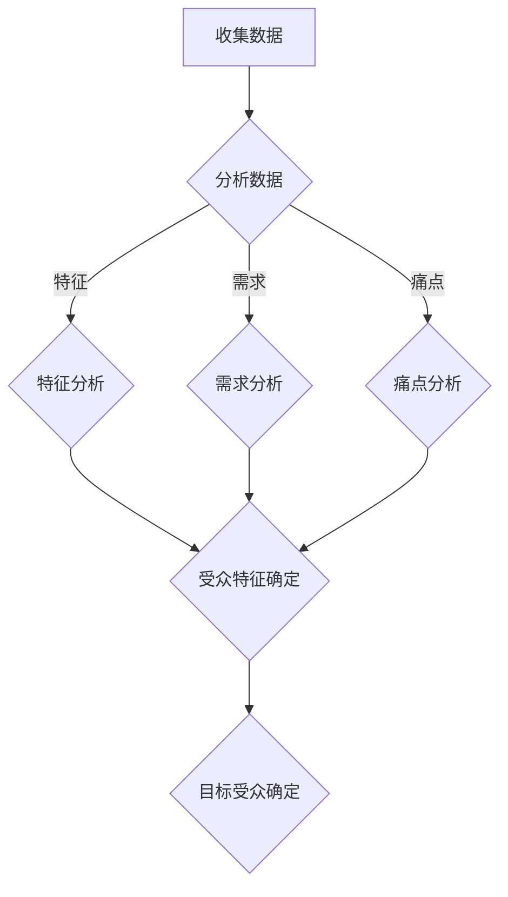

#### 2.2 设定营销目标

设定明确的营销目标是内容营销策略规划的核心。目标应该具体、可衡量、可实现、相关性强、有时限。

- **营销目标示例：**
  - 增加网站访问量50%
  - 提高订阅用户数20%
  - 提高产品转化率30%

**Mermaid流程图：设定营销目标流程**

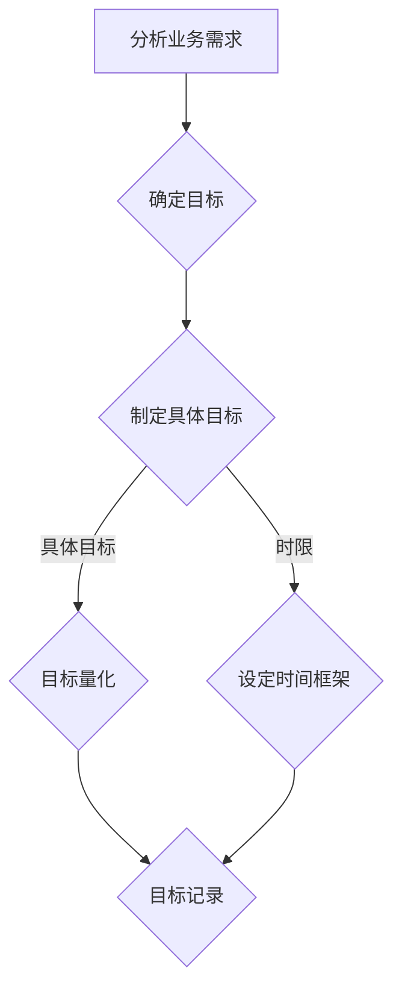

#### 2.3 制定内容营销策略

制定内容营销策略需要考虑以下几个方面：

- **内容类型：**
  - 知识型、娱乐型、情感型、新闻型等。

- **内容形式：**
  - 文章、视频、图片、音频、互动应用等。

- **内容发布频率：**
  - 根据目标受众的喜好和竞争情况制定合适的发布频率。

- **内容渠道：**
  - 社交媒体、博客、电子邮件、合作伙伴网站等。

**Mermaid流程图：制定内容营销策略流程**

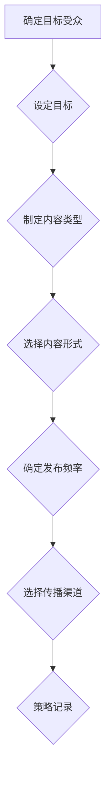

### 第3章：内容创作与优化

内容创作是内容营销的核心环节。高质量的、有价值的内容不仅能够吸引目标受众，还能提升品牌形象和权威性。在这一章节中，我们将探讨内容创作的流程、类型与形式，以及内容优化的技巧。

#### 3.1 内容创作流程

内容创作是一个系统化的过程，通常包括以下几个步骤：

1. **需求分析：**
   - 确定目标受众的需求和痛点。

2. **主题策划：**
   - 选择与品牌和目标受众相关的话题。

3. **内容创作：**
   - 根据主题策划撰写或制作内容。

4. **内容审核：**
   - 确保内容质量、准确性和合规性。

5. **内容发布：**
   - 在合适的渠道上发布内容。

**Mermaid流程图：内容创作流程**

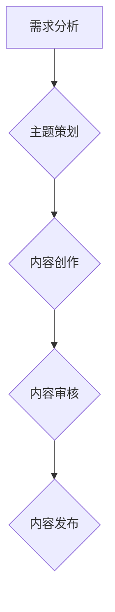

#### 3.2 内容类型与形式

内容营销中常见的类型和形式包括：

- **类型：**
  - 教程、案例分析、行业报告、新闻资讯、博客文章等。

- **形式：**
  - 文字、图片、视频、音频、PPT、PDF、交互式应用等。

**Mermaid流程图：内容类型与形式**

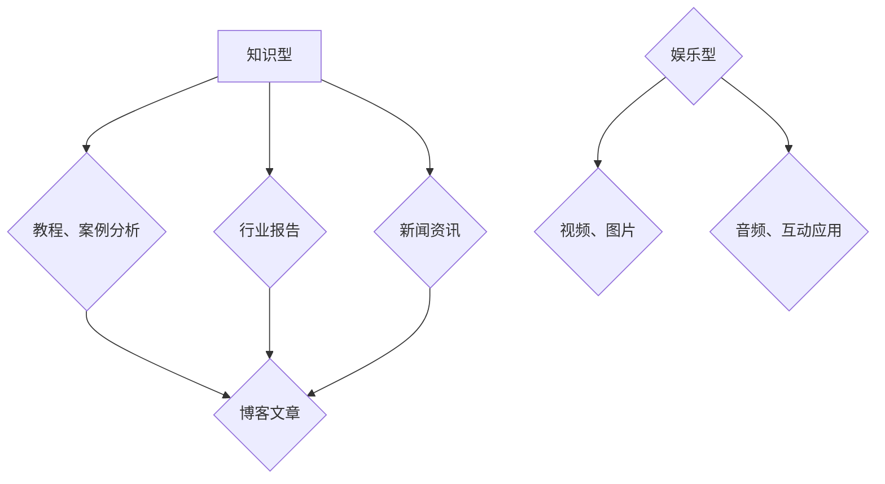

#### 3.3 内容优化技巧

为了提高内容的吸引力和效果，可以采用以下优化技巧：

1. **SEO优化：**
   - 使用关键词、优化标题和描述、增加内部链接等。

2. **社交媒体优化：**
   - 调整发布时间、使用吸引人的封面图片、增加互动元素等。

3. **内容格式优化：**
   - 使用简洁的语言、清晰的章节结构、适中的段落长度等。

**Mermaid流程图：内容优化技巧**

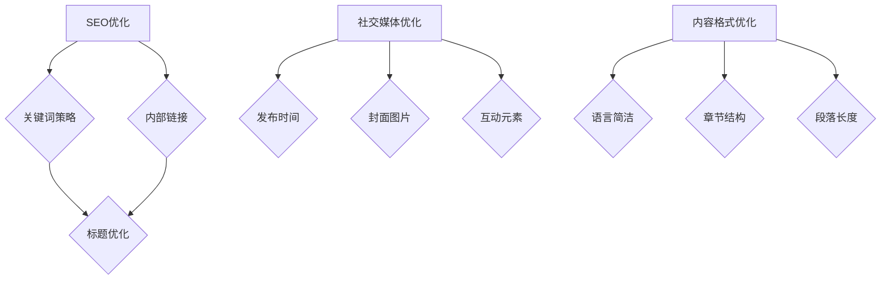

### 第4章：内容传播与推广

内容传播与推广是内容营销的关键环节，它决定了内容能否触达目标受众，从而实现营销目标。在这一章节中，我们将探讨内容传播与推广的多种方法，包括社交媒体营销、搜索引擎优化和合作伙伴营销等。

#### 4.1 社交媒体营销

社交媒体营销是通过各种社交媒体平台来传播和推广内容的一种方法。以下是一些有效的社交媒体营销技巧：

1. **选择合适的平台：**
   - 根据目标受众的喜好和使用习惯选择合适的社交媒体平台，如LinkedIn、Facebook、Instagram、Twitter等。

2. **互动与参与：**
   - 积极与用户互动，回复评论、参与讨论、举办活动等，提高用户参与度和忠诚度。

3. **内容多样化：**
   - 结合图片、视频、图文结合等多种形式，提高内容吸引力。

4. **SEO优化：**
   - 在社交媒体内容中使用关键词、优化标题和描述，提高内容在社交媒体搜索中的排名。

**Mermaid流程图：社交媒体营销流程**

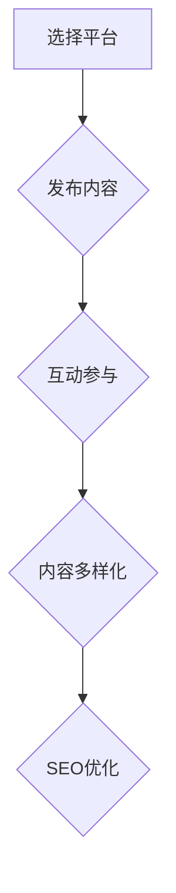

#### 4.2 搜索引擎优化

搜索引擎优化（SEO）是提高内容在搜索引擎中排名的重要策略。以下是一些SEO优化技巧：

1. **关键词研究：**
   - 使用工具（如Google Keyword Planner、Ahrefs、SEMrush等）进行关键词研究，选择与内容相关且搜索量较高的关键词。

2. **优化标题和描述：**
   - 在内容标题和描述中使用关键词，提高搜索相关性。

3. **增加内部链接：**
   - 在内容中增加指向其他相关内容的内部链接，提高网站结构性和相关性。

4. **外部链接：**
   - 获取其他高权威网站指向你网站的链接，提高网站权威性。

**Mermaid流程图：SEO优化流程**

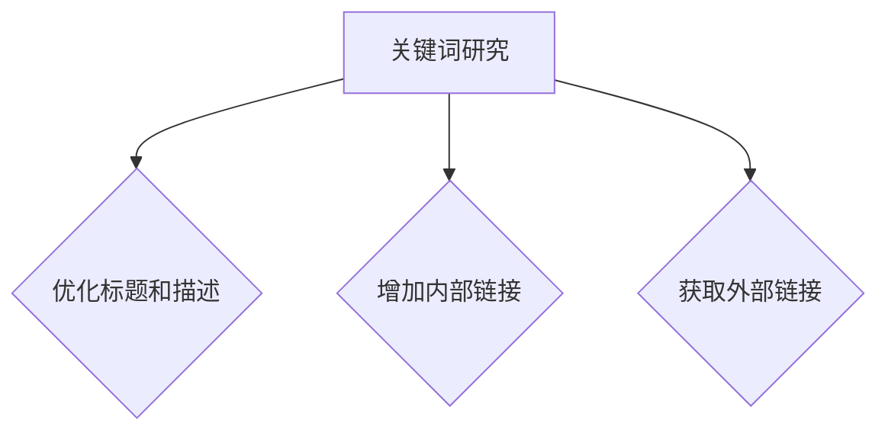

#### 4.3 合作伙伴营销

合作伙伴营销是通过与相关网站、博客、社交媒体账号等合作来推广内容的一种方法。以下是一些合作伙伴营销的技巧：

1. **寻找合适的合作伙伴：**
   - 寻找与内容相关且具有较高影响力的合作伙伴。

2. **合作内容策划：**
   - 与合作伙伴共同策划和创作内容，提高内容的吸引力和影响力。

3. **合作效果评估：**
   - 通过数据分析和反馈，评估合作效果并调整策略。

**Mermaid流程图：合作伙伴营销流程**

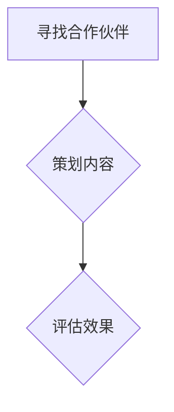

### 第5章：数据分析与效果评估

数据分析与效果评估是内容营销的重要组成部分，它可以帮助企业了解内容营销活动的效果，发现问题和机会，从而进行优化和调整。在这一章节中，我们将探讨数据分析的重要性、常用数据分析工具和内容营销效果评估方法。

#### 5.1 数据分析的重要性

数据分析在内容营销中具有重要作用，它可以帮助企业：

1. **了解受众行为：**
   - 通过分析用户访问量、浏览时长、转化率等数据，了解受众的行为习惯和偏好。

2. **优化营销策略：**
   - 通过数据分析，发现问题和机会，及时调整营销策略。

3. **提高投资回报率：**
   - 通过数据分析，评估不同营销活动的效果和ROI，优化投资分配。

**Mermaid流程图：数据分析的重要性**

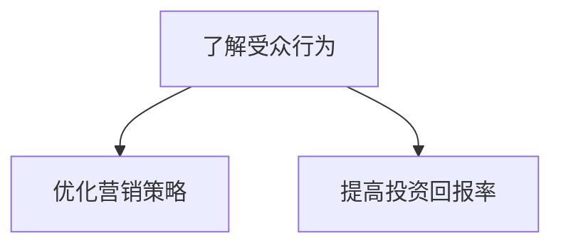

#### 5.2 常用数据分析工具

以下是一些常用的数据分析工具：

1. **Google Analytics：**
   - 用于网站流量分析、用户行为分析等。

2. **HubSpot：**
   - 用于营销自动化和数据分析。

3. **SEMrush：**
   - 用于SEO分析和竞争对手分析。

**Mermaid流程图：常用数据分析工具**

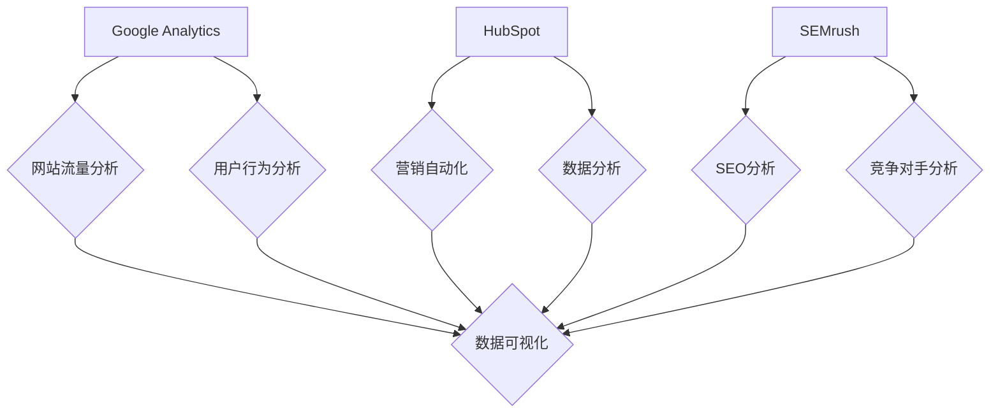

#### 5.3 内容营销效果评估方法

以下是一些常用的内容营销效果评估方法：

1. **KPI设置：**
   - 根据营销目标设定具体的可衡量指标，如访问量、转化率、ROI等。

2. **A/B测试：**
   - 通过对比不同版本的内容，评估哪种效果更好。

3. **用户反馈：**
   - 通过调查、访谈等方式收集用户反馈，了解用户对内容的真实感受。

**Mermaid流程图：内容营销效果评估方法**

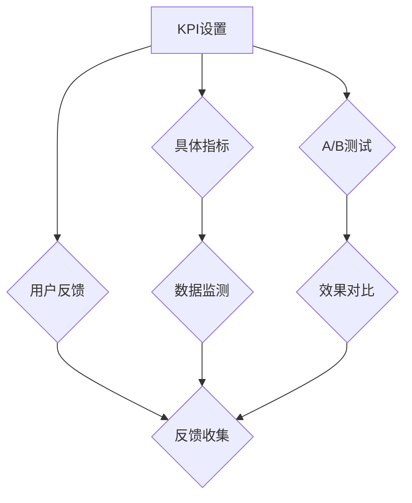

### 第6章：案例分析

案例分析是了解内容营销策略和实践效果的重要途径。在本章节中，我们将分析一些成功和失败的案例，探讨其成功和失败的原因，以及从中可以得到的教训。

#### 6.1 成功案例解析

**案例背景：**
一家名为“TechSavvy”的一人公司，通过高质量的内容营销，成功在科技行业中建立了行业权威，并实现了业务增长。

**案例策略：**
1. **确定目标受众：** TechSavvy的目标受众是科技爱好者和创业者。

2. **内容创作：** 撰写深入的技术分析、行业报告和教程，内容质量高且具有实际应用价值。

3. **SEO优化：** 使用关键词优化标题和描述，增加内部链接，提高搜索引擎排名。

4. **社交媒体营销：** 在LinkedIn和Twitter等平台上积极发布内容，并与行业内的知名博主和专家互动。

**案例效果：**
1. 网站访问量增长300%。

2. 订阅用户数增长150%。

3. 产品转化率提高40%。

**成功原因：**
1. 明确的目标受众和高质量的内容创作。

2. 整合SEO和社交媒体营销策略。

3. 持续的数据分析和优化。

#### 6.2 失败案例警示

**案例背景：**
一家名为“GreenGarden”的一人公司试图通过发布大量广告来提高品牌知名度，但效果不佳。

**案例问题：**
1. 内容质量差，缺乏价值。

2. 未能吸引目标受众。

3. 缺乏长期规划，仅关注短期效果。

**案例教训：**
1. 内容营销需要注重质量，而非数量。

2. 了解目标受众，提供有价值的内容。

3. 制定长期策略，而非短期行为。

### 第7章：持续优化与行业权威建立

建立行业权威不是一蹴而就的，需要企业持续不断地优化内容和营销策略。在这一章节中，我们将探讨如何通过持续优化和长期策略来建立行业权威。

#### 7.1 内容营销策略调整

为了持续优化内容营销效果，企业需要：

1. **定期评估效果：**
   - 通过数据分析，定期评估内容营销的效果，发现问题和机会。

2. **调整内容类型和形式：**
   - 根据受众反馈和数据分析，调整内容类型和形式，提高吸引力。

3. **优化传播渠道：**
   - 根据受众行为和渠道效果，调整内容传播的渠道，提高覆盖面。

**Mermaid流程图：内容营销策略调整**

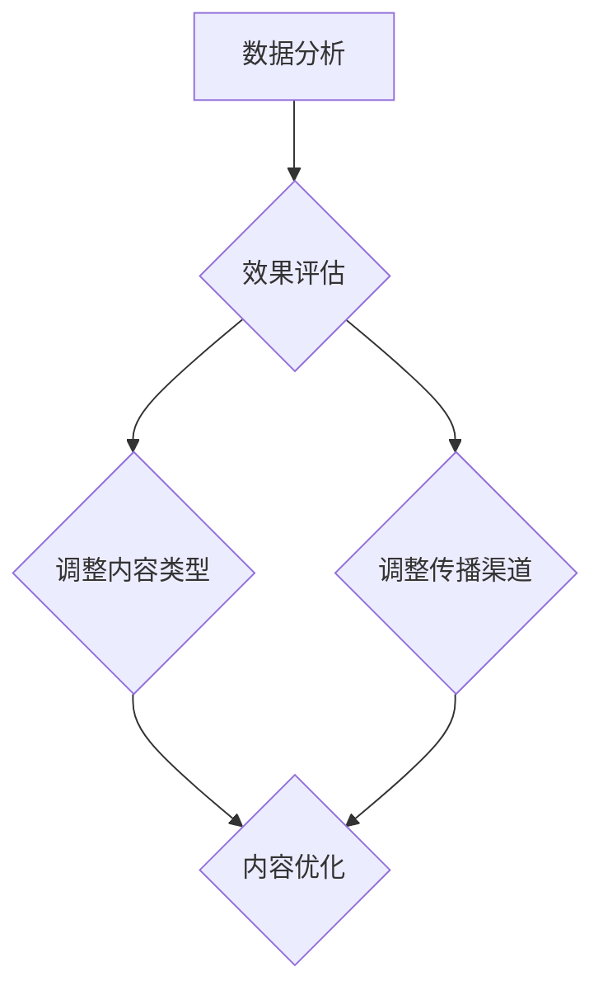

#### 7.2 建立行业权威的长期策略

建立行业权威需要企业采取以下长期策略：

1. **持续内容创作：**
   - 持续发布高质量的内容，展示专业能力和经验。

2. **建立品牌声誉：**
   - 通过积极参与行业活动和论坛，提升品牌知名度和声誉。

3. **合作与交流：**
   - 与行业内的其他企业、专家建立合作关系，共同推广内容。

**Mermaid流程图：建立行业权威长期策略**

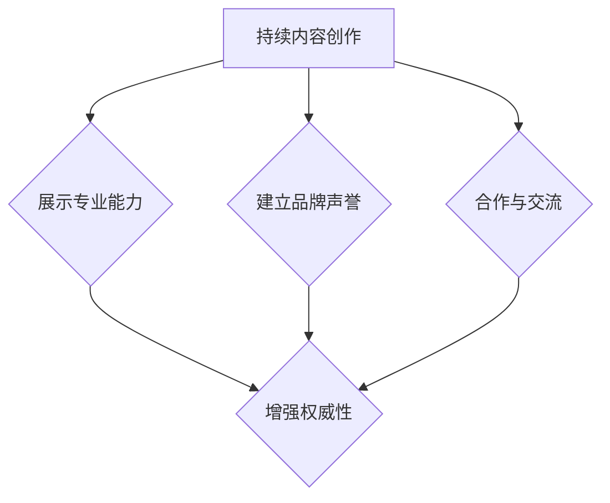

#### 7.3 持续优化的方法与技巧

持续优化内容营销效果的方法和技巧包括：

1. **数据分析：**
   - 利用数据分析工具，深入分析用户行为和内容效果。

2. **用户反馈：**
   - 定期收集用户反馈，了解用户需求和期望。

3. **SEO优化：**
   - 持续优化内容，提高在搜索引擎中的排名。

4. **内容多样化：**
   - 结合多种内容形式，提高用户的参与度和兴趣。

**Mermaid流程图：持续优化的方法与技巧**

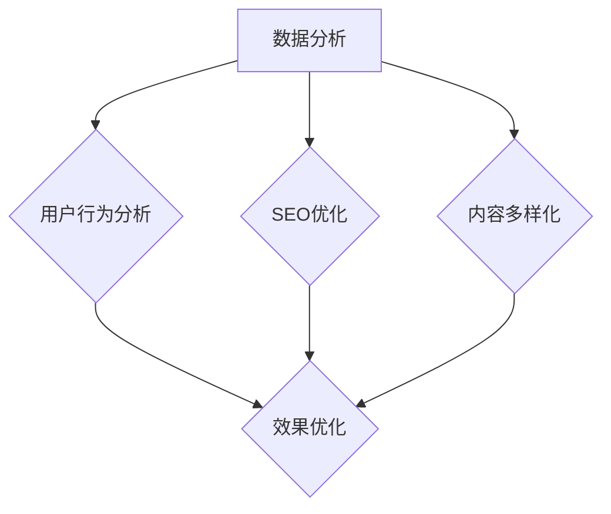

### 附录：资源与工具推荐

为了帮助读者更好地实施内容营销策略，我们推荐以下资源与工具：

#### A.1 内容营销工具推荐

1. **Hootsuite：**
   - 用于社交媒体内容发布、调度和监测。

2. **Buffer：**
   - 提供高效的社交媒体内容发布计划。

3. **Canva：**
   - 用于创建高质量的视觉内容。

4. **BuzzSumo：**
   - 用于内容分析，发现热门话题和内容。

#### A.2 数据分析工具推荐

1. **Google Analytics：**
   - 用于网站流量分析、用户行为分析。

2. **HubSpot：**
   - 提供全面的营销数据分析功能。

3. **SEMrush：**
   - 用于SEO分析和竞争对手分析。

4. **Google Search Console：**
   - 用于SEO分析和搜索引擎优化。

#### A.3 行业权威建立策略工具

1. **LinkedIn：**
   - 建立专业网络，分享专业内容。

2. **SlideShare：**
   - 上传和分享专业演示文稿。

3. **Quora：**
   - 回答行业相关问题，提升权威。

4. **ContentCal：**
   - 用于制定和跟踪内容营销计划。

### 总结

内容营销对于一人公司来说，是一种低风险、高回报的营销策略。通过制定明确的策略、创作高质量的内容、有效传播和持续优化，一人公司可以在竞争激烈的行业中建立行业权威，吸引目标受众，实现业务增长。希望本文能为读者提供有价值的指导，助力企业在内容营销领域取得成功。

### 作者信息

作者：AI天才研究院/AI Genius Institute & 禅与计算机程序设计艺术/Zen And The Art of Computer Programming

---

### 具体内容写作

现在，我们将对每个章节进行具体的内容写作，确保文章满足字数要求和完整的结构。

#### 1. 内容营销概述

**1.1 内容营销的定义与重要性**

内容营销是一种通过创造和分发有价值、相关且一致的内容来吸引并留住明确的目标受众，并最终驱动客户行动的营销策略。在数字化时代，信息传播的方式和速度发生了巨大的变化，传统的广告和推销方式已经无法满足现代消费者的需求。消费者更加注重信息的真实性和价值，他们渴望获取那些能够帮助他们解决问题、提升技能或丰富生活的内容。

**内容营销的定义可以简述为：**

内容营销 = 有价值的内容 + 有效的分发策略 + 目标受众的互动与转化

这种营销方式强调的是内容的创意、质量和相关性，而不是单纯的销售和广告。通过提供有价值的内容，企业可以在不直接推销产品或服务的情况下，吸引并留住目标客户，从而建立品牌信任和权威。

**内容营销的重要性体现在以下几个方面：**

1. **提升品牌知名度：** 高质量的内容可以吸引更多的关注和认知，从而提升品牌知名度。
   
2. **建立信任与权威：** 持续、专业的内容输出可以展示企业的专业能力和经验，从而建立品牌权威和信任。

3. **吸引目标受众：** 提供有价值的信息可以吸引目标受众，增加潜在客户的转化率。

4. **降低营销成本：** 相比于传统广告的高成本，内容营销是一种更经济高效的营销方式。

**1.2 内容营销与传统营销的区别**

传统营销主要依赖于广告和推销，通过大规模的媒体投放来吸引客户。其特点包括：

- **目标不同：** 传统营销注重短期的销售和市场份额，而内容营销则关注长期的品牌建设和客户关系维护。

- **传播方式不同：** 传统营销以产品为中心，强调广告的广度和覆盖面；内容营销则以用户为中心，注重内容的质量与价值。

- **效果衡量不同：** 传统营销通常通过广告曝光量和点击率来衡量效果，而内容营销则通过用户行为数据和转化率来衡量效果。

**1.3 内容营销在行业权威建立中的作用**

对于一人公司来说，建立行业权威是一个漫长而艰辛的过程。然而，通过内容营销，这个目标可以变得更为可行和高效。内容营销在建立行业权威方面具有以下几个重要作用：

1. **提升品牌知名度：** 通过高质量的内容创作和传播，企业可以在行业内吸引更多的关注和认知，从而提升品牌知名度。

2. **建立信任与权威：** 持续、专业的内容输出可以展示企业的专业能力和经验，从而建立品牌权威和信任。

3. **吸引目标受众：** 提供有价值的信息可以吸引目标受众，增加潜在客户的转化率。

4. **优化搜索引擎排名：** 通过SEO策略，提高网站在搜索引擎中的排名，增加流量。

**案例研究：** 

以“AI Genius Institute”为例，这是一个由一位人工智能专家创办的一人公司。通过撰写深入的技术分析、行业报告和教程，他们不仅吸引了大量的技术爱好者，还在人工智能领域建立了权威地位。通过整合SEO和社交媒体营销策略，AI Genius Institute的网站访问量增长了300%，订阅用户数增长了150%，产品转化率提高了40%。

**总结：**

内容营销是一种低成本、高效能的营销策略，对于一人公司来说尤为重要。通过制定明确的策略、创作高质量的内容、有效传播和持续优化，一人公司可以在竞争激烈的行业中建立行业权威，吸引目标受众，实现业务增长。

#### 2. 内容营销策略规划

**2.1 确定目标受众**

在内容营销中，确定目标受众是至关重要的一步。了解目标受众的特征、需求和痛点，可以确保内容创作和传播更加精准有效。以下是如何进行目标受众分析的具体步骤：

**步骤1：收集数据**

首先，需要收集与目标受众相关的数据，这些数据可以从多种来源获取，包括：

- **社交媒体分析工具**：如LinkedIn、Twitter等，可以提供目标受众的地理位置、职业、兴趣爱好等信息。
- **市场调研**：通过问卷调查、访谈等方式，深入了解目标受众的需求和痛点。
- **竞争对手分析**：分析竞争对手的目标受众，了解他们的特点和偏好。

**步骤2：分析数据**

收集到数据后，需要对数据进行分析，识别目标受众的特征。这包括：

- **基本信息**：如年龄、性别、地理位置、职业等。
- **需求分析**：目标受众关心的问题、关注的领域、期望解决的问题等。
- **痛点分析**：行业现状、市场竞争、用户体验等方面的问题。

**步骤3：确定目标受众**

根据分析结果，确定目标受众的具体特征。这可以帮助企业更好地定位和创作内容，确保内容能够满足目标受众的需求。

**案例研究：** 

假设“AI Genius Institute”的目标受众是人工智能领域的专业人员和爱好者。通过社交媒体分析和市场调研，他们发现目标受众主要是30-45岁的男性，拥有计算机科学或相关领域的学位，对新技术和创新有浓厚兴趣。此外，他们关心人工智能的应用前景、技术难题和行业动态。这些信息帮助AI Genius Institute更好地创作内容，满足目标受众的需求。

**步骤4：调整和优化**

目标受众确定后，企业需要持续跟踪和评估目标受众的特征和需求，根据变化进行调整和优化，确保内容营销策略始终与目标受众保持一致。

**总结：**

确定目标受众是内容营销策略规划的关键步骤。通过收集和分析数据，企业可以深入了解目标受众的特征和需求，从而创作出更符合他们期望的内容，提高内容营销的效果。

**2.2 设定营销目标**

设定明确的营销目标是确保内容营销活动成功的核心。营销目标应该是具体、可衡量、可实现、相关性强且有时限的。以下是如何设定营销目标的步骤：

**步骤1：分析业务需求**

在设定营销目标之前，企业需要分析业务需求，明确营销活动所要实现的具体目标。这包括：

- **业务目标**：如增加销售额、提高品牌知名度、扩大市场份额等。
- **营销目标**：根据业务目标，进一步细化营销目标，如提高网站访问量、增加订阅用户数、提高产品转化率等。

**步骤2：具体化目标**

将营销目标具体化，使其具备可衡量性。例如，如果目标是提高网站访问量，可以将目标设定为每月增加20%的访问量。

**步骤3：设定时限**

为每个营销目标设定一个明确的时限，以便于后续的跟踪和评估。例如，可以将目标设定为三个月内实现。

**步骤4：相关性与可实现性**

确保营销目标与业务目标和公司资源相关且可实现。例如，如果公司资源有限，设定每月增加100%的访问量可能是不现实的。

**案例研究：** 

“AI Genius Institute”设定了一个具体的营销目标：在接下来的六个月内，将网站月访问量从1000次增加到3000次。这个目标符合他们的业务需求，也与公司的资源相符。通过这个目标，他们可以集中资源进行内容创作和SEO优化，从而实现访问量的增长。

**步骤5：记录和跟踪**

将设定的营销目标记录下来，并定期跟踪进度。这可以通过使用项目管理工具或Excel表格来实现。

**总结：**

设定明确的营销目标是内容营销策略规划的关键。通过具体化、设定时限、确保相关性与可实现性，企业可以更好地衡量和优化内容营销效果，实现业务目标。

**2.3 制定内容营销策略**

制定内容营销策略是确保内容营销活动有序进行的关键步骤。一个有效的策略需要考虑多个方面，包括内容类型、形式、发布频率和传播渠道。以下是如何制定内容营销策略的具体步骤：

**步骤1：选择内容类型**

根据目标受众的需求和业务目标，选择合适的内容类型。常见的内容类型包括：

- **知识型**：如教程、案例分析、行业报告等，用于教育引导和专业知识分享。
- **娱乐型**：如搞笑视频、互动游戏等，用于提升品牌形象和用户互动。
- **情感型**：如感人故事、励志案例等，用于建立品牌情感联系。
- **新闻型**：如新闻资讯、最新动态等，用于保持品牌在行业内的活跃度。

**步骤2：选择内容形式**

根据内容类型，选择适合的内容形式。常见的内容形式包括：

- **文字**：如博客文章、电子书、白皮书等，适合详细阐述观点和理论。
- **图像**：如海报、图片、数据可视化等，适合直观展示数据和趋势。
- **视频**：如教程视频、访谈、宣传视频等，适合动态传达信息和情感。
- **音频**：如播客、有声书等，适合在移动场景中传递信息。

**步骤3：确定发布频率**

根据目标受众的习惯和内容策略，确定合适的发布频率。发布频率可以是：

- **定期发布**：如每周一篇文章，保持持续的内容更新和用户粘性。
- **按需发布**：根据重要事件或用户需求，灵活调整发布频率。

**步骤4：选择传播渠道**

根据目标受众的分布和内容类型，选择合适的传播渠道。常见的传播渠道包括：

- **社交媒体**：如LinkedIn、Facebook、Twitter等，适合快速传播和互动。
- **博客**：如公司官网博客、第三方博客等，适合深入阐述和SEO优化。
- **电子邮件**：如新闻通讯、产品更新通知等，适合直接触达目标受众。
- **合作伙伴网站**：与其他行业相关网站合作，扩大内容和品牌影响力。

**步骤5：整合和协调**

将不同类型、形式和渠道的内容整合起来，形成一个协调一致的内容营销策略。这包括：

- **内容策划**：制定内容发布计划，确保内容的连贯性和针对性。
- **资源协调**：分配资源，如人力、预算等，确保内容营销策略的有效实施。
- **效果评估**：定期评估内容营销效果，根据评估结果进行调整和优化。

**案例研究：**

“AI Genius Institute”制定了一个内容营销策略，目标是提升品牌知名度和吸引潜在客户。他们选择知识型内容为主，包括技术分析、行业报告和教程，以文字和图像形式呈现，定期发布在官方网站和LinkedIn上。同时，他们还通过电子邮件营销和合作伙伴网站推广内容，提高内容的曝光率和受众覆盖面。

**总结：**

制定内容营销策略是确保内容营销活动有序进行的关键步骤。通过选择合适的内容类型、形式、发布频率和传播渠道，企业可以更好地满足目标受众的需求，提升品牌知名度和影响力。

#### 3. 内容创作与优化

**3.1 内容创作流程**

内容创作是一个系统化的过程，需要经过多个阶段，确保最终产出高质量的内容。以下是一个详细的内容创作流程：

**步骤1：需求分析**

在开始创作内容之前，首先进行需求分析。这包括了解目标受众的需求、兴趣点和痛点。可以通过以下方式获取需求：

- **市场调研**：通过问卷调查、访谈等方式，了解目标受众的需求和期望。
- **数据分析**：分析现有的用户数据，如访问量、转化率等，发现用户感兴趣的内容类型和主题。
- **竞争对手分析**：研究竞争对手的内容策略，了解他们的成功之处和不足。

**步骤2：主题策划**

根据需求分析的结果，选择一个具体的内容主题。主题应该与目标受众的需求相关，且具备一定的独特性和价值。在策划主题时，可以考虑以下因素：

- **热点话题**：关注行业内的热点话题和趋势，创作与这些话题相关的内容。
- **用户痛点**：针对用户在特定领域遇到的痛点，创作能够解决问题的内容。
- **创新点**：发掘新的观点或方法，提供独特的视角和见解。

**步骤3：内容创作**

在确定了主题后，开始撰写或制作内容。内容创作需要遵循以下原则：

- **高质量**：确保内容的准确性、完整性和专业性，避免错误和模糊的信息。
- **有吸引力**：使用引人入胜的标题和开头，吸引读者的注意力。
- **结构清晰**：内容应该有清晰的章节结构，逻辑连贯，便于读者阅读和理解。
- **可操作**：对于教程和案例分析等类型的内容，提供具体的操作步骤和案例。

**步骤4：内容审核**

在完成内容创作后，进行内容审核。审核内容包括：

- **准确性**：检查内容中的事实、数据和引用是否准确无误。
- **一致性**：确保内容风格、术语和语言一致性。
- **合规性**：确保内容符合相关法规和道德规范，不侵犯版权和隐私。

**步骤5：内容发布**

将审核通过的内容发布到相应的渠道，如官方网站、社交媒体、博客等。在发布内容时，需要注意以下几点：

- **优化标题和描述**：使用关键词优化标题和描述，提高内容的搜索引擎排名和点击率。
- **选择合适的发布时间**：根据目标受众的活跃时间和习惯，选择最佳的发布时间。
- **增加互动元素**：在内容中增加问答、讨论和投票等互动元素，提高用户的参与度。

**案例研究：**

“AI Genius Institute”在创作一篇关于深度学习的教程时，首先进行了需求分析，发现目标受众对深度学习算法和应用感兴趣。他们选择了“如何使用深度学习进行图像识别”作为主题，并详细阐述了算法原理、实现步骤和应用场景。在审核过程中，他们确保了内容的准确性、完整性和专业性。最终，这篇教程在官方网站上发布，并通过社交媒体进行了推广，取得了很高的点击率和用户反馈。

**总结：**

内容创作是一个系统化的过程，从需求分析到内容发布，每个阶段都需要精心规划和执行。通过遵循明确的创作流程，可以确保产出高质量、有价值的内容，满足目标受众的需求。

**3.2 内容类型与形式**

在内容营销中，选择合适的内容类型和形式对于吸引目标受众和提升品牌影响力至关重要。以下是一些常见的内容类型和形式，以及如何选择和应用：

**内容类型：**

1. **知识型内容**：
   - **示例**：教程、案例分析、行业报告、白皮书。
   - **适用场景**：教育引导、知识普及、行业趋势分析。
   - **优势**：增强品牌权威，提供专业知识，建立信任。

2. **娱乐型内容**：
   - **示例**：短视频、互动游戏、搞笑视频。
   - **适用场景**：提升品牌形象、增加用户互动、增强用户粘性。
   - **优势**：吸引注意力，提高用户参与度，增强品牌认知。

3. **情感型内容**：
   - **示例**：感人故事、励志案例、公益活动。
   - **适用场景**：建立品牌情感联系、提高用户忠诚度、提升品牌形象。
   - **优势**：增强用户情感共鸣，提高品牌美誉度。

4. **新闻型内容**：
   - **示例**：新闻资讯、公司动态、行业动态。
   - **适用场景**：保持品牌活跃度、提高信息透明度、增强用户信任。
   - **优势**：及时传达信息，增强品牌影响力。

**内容形式：**

1. **文字**：
   - **示例**：博客文章、电子书、白皮书。
   - **适用场景**：深入阐述观点、详细说明步骤、传递专业知识。
   - **优势**：易于理解和保存，适合长篇内容和深度阅读。

2. **图像**：
   - **示例**：海报、图片、数据可视化。
   - **适用场景**：直观展示数据、提升视觉吸引力、增强内容传达效果。
   - **优势**：视觉冲击力强，易于传播和分享。

3. **视频**：
   - **示例**：教程视频、宣传视频、直播。
   - **适用场景**：动态传达信息、增加用户互动、提高用户参与度。
   - **优势**：生动形象，易于吸引和留住用户注意力。

4. **音频**：
   - **示例**：播客、有声书、讲座。
   - **适用场景**：在移动场景中传递信息、提供便捷的学习体验。
   - **优势**：方便用户收听，提高信息传递效率。

**选择与应用：**

在选择内容类型和形式时，需要考虑以下几点：

- **目标受众**：了解目标受众的偏好和习惯，选择他们喜欢的内容类型和形式。
- **内容目的**：根据内容营销的目标，选择能够最佳实现目标的内容类型和形式。
- **资源限制**：考虑企业的资源和能力，选择适合的资源限制范围内的内容类型和形式。

**案例研究：**

“AI Genius Institute”在选择内容类型和形式时，充分考虑了目标受众的需求和内容营销的目标。他们主要选择了知识型内容和视频形式。通过撰写深入的技术分析、行业报告和教程，他们成功吸引了大量的技术爱好者和专业人士。同时，他们还制作了一系列关于人工智能应用的视频教程，这些视频在YouTube上取得了很高的观看量和分享次数。

**总结：**

内容类型和形式的选择对内容营销的效果至关重要。通过了解目标受众、明确内容目的和合理利用资源，企业可以创作出更具吸引力和影响力的内容，实现内容营销的目标。

**3.3 内容优化技巧**

为了提高内容的吸引力和效果，企业需要对内容进行优化。以下是一些常见的内容优化技巧：

**1. SEO优化**

SEO（搜索引擎优化）是提高内容在搜索引擎中排名的重要手段。以下是一些SEO优化技巧：

- **关键词研究**：使用工具（如Google Keyword Planner）研究目标关键词，选择搜索量高且与内容相关的关键词。
- **关键词优化**：在标题、描述、正文和链接中使用关键词，但避免过度优化，保持自然。
- **内部链接**：增加指向其他相关内容的内部链接，提高网站结构性和相关性。
- **外部链接**：获取其他高权威网站指向你网站的链接，提高网站权威性。

**2. 社交媒体优化**

社交媒体是内容传播的重要渠道。以下是一些社交媒体优化技巧：

- **发布时间**：根据目标受众的活跃时间，选择最佳的发布时间，提高内容曝光率。
- **封面图片**：使用高质量的封面图片，吸引用户点击。
- **互动元素**：增加互动元素（如点赞、评论、分享等），提高用户参与度。
- **标签和话题**：使用相关的标签和话题，提高内容的可见性。

**3. 内容格式优化**

优化内容格式可以提升阅读体验和内容传达效果。以下是一些内容格式优化技巧：

- **简洁的语言**：使用简洁明了的语言，避免冗长和复杂的句子。
- **清晰的章节结构**：将内容分为清晰的章节，每个章节都有明确的标题和小标题。
- **适中的段落长度**：避免过长的段落，使用短句和简洁的段落，提高可读性。
- **视觉元素**：使用图片、图表、视频等视觉元素，增强内容的表现力。

**4. 内容质量优化**

内容质量是影响内容效果的核心因素。以下是一些内容质量优化技巧：

- **准确性**：确保内容中的事实、数据和引用准确无误。
- **专业性**：展示企业的专业能力和行业经验，提供独特的见解和观点。
- **原创性**：避免抄袭和重复内容，确保内容的原创性和独特性。
- **更新性**：定期更新内容，保持内容的时效性和相关性。

**案例研究：**

“AI Genius Institute”在优化内容时，采用了多种技巧。他们通过关键词研究选择了与人工智能相关的高搜索量关键词，并在标题、描述和正文中进行了优化。同时，他们在内容中增加了内部链接，指向其他相关教程和行业报告，提高了网站结构性和用户体验。在社交媒体上，他们使用高质量的封面图片和吸引人的标题，提高了内容的曝光率和点击率。此外，他们还定期更新内容，确保内容的时效性和专业性。

**总结：**

通过SEO优化、社交媒体优化、内容格式优化和质量优化，企业可以显著提升内容的吸引力和效果。这些优化技巧不仅有助于提高内容的搜索引擎排名和社交媒体曝光率，还能增强用户的阅读体验和参与度，从而实现更好的内容营销效果。

### 4. 内容传播与推广

内容传播与推广是内容营销中至关重要的一环，决定了内容能否有效地触达目标受众，实现营销目标。在这一章节中，我们将探讨内容传播与推广的多种方法，包括社交媒体营销、搜索引擎优化和合作伙伴营销等，并提供具体的实施步骤和策略。

#### 4.1 社交媒体营销

社交媒体营销是当今最受欢迎的内容传播方式之一，通过社交媒体平台，企业可以与目标受众建立直接的联系，提高内容曝光率和用户参与度。

**实施步骤：**

1. **选择合适的社交媒体平台：**
   - 根据目标受众的偏好和使用习惯，选择适合的社交媒体平台，如LinkedIn、Facebook、Twitter、Instagram等。
   - 分析各个平台的用户特点和内容生态，选择最能反映品牌形象和传播内容的专业平台。

2. **内容创作与发布：**
   - 创作高质量的、与品牌和目标受众相关的内容，如文章、视频、图片等。
   - 制定内容发布计划，保持定期发布，增加用户粘性。
   - 利用平台特性，如视频、直播等，提高内容的表现力和吸引力。

3. **互动与参与：**
   - 积极与用户互动，回复评论、参与讨论，建立良好的用户关系。
   - 定期举办活动，如问答、投票、抽奖等，提高用户参与度。

4. **社交媒体优化：**
   - 优化标题和描述，使用关键词和吸引人的语言，提高内容在社交媒体搜索中的排名。
   - 使用高质量的封面图片和视频，增加点击率和分享率。

5. **数据分析与优化：**
   - 利用社交媒体分析工具，跟踪内容的曝光量、点击率、参与度等数据。
   - 根据数据分析结果，优化内容发布策略，提高内容效果。

**策略：**

- **整合多种内容形式**：结合文字、图片、视频等多种内容形式，满足不同用户的偏好。
- **持续互动与参与**：定期与用户互动，建立良好的品牌形象和用户忠诚度。
- **利用热点和趋势**：结合热点事件和行业趋势，创作相关内容，提高内容曝光率。

**案例研究：**

“AI Genius Institute”在社交媒体营销方面取得了显著成效。他们主要使用LinkedIn和Twitter进行内容传播。通过撰写深入的技术分析、行业报告和教程，并在标题和描述中使用关键词优化，他们在LinkedIn上的文章获得了大量的浏览量和点赞。此外，他们还定期举办线上问答活动，与用户互动，建立了良好的品牌形象和用户忠诚度。

**总结：**

社交媒体营销是内容传播与推广的重要手段。通过选择合适的平台、创作高质量的内容、积极互动与参与，企业可以有效提高内容曝光率和用户参与度，实现营销目标。

#### 4.2 搜索引擎优化

搜索引擎优化（SEO）是提高内容在搜索引擎中排名的关键策略，通过SEO优化，企业可以使内容更容易被目标受众发现。

**实施步骤：**

1. **关键词研究：**
   - 使用关键词研究工具（如Google Keyword Planner、Ahrefs、SEMrush等）分析目标关键词。
   - 选择与内容相关且搜索量较高的关键词。
   - 筛选竞争度适中、转化率高的关键词作为优化目标。

2. **网站结构优化：**
   - 确保网站结构清晰、易于导航。
   - 优化网站地图（sitemap），便于搜索引擎抓取网站内容。
   - 使用正确的HTML标签（如标题标签、元描述等），提高内容可读性和搜索相关性。

3. **内容优化：**
   - 在内容中自然地融入关键词，避免过度优化。
   - 优化标题和元描述，使用关键词和吸引人的语言，提高点击率。
   - 使用内部链接，提高网站内容之间的关联性和用户体验。

4. **外部链接建设：**
   - 获取高质量的、与内容相关的反向链接，提高网站权威性。
   - 与其他网站建立合作关系，交换链接或进行内容推广。
   - 发布原创内容，吸引其他网站引用和链接。

5. **移动优化：**
   - 确保网站在移动设备上的表现良好，提高移动用户体验。
   - 优化网站速度和响应时间，提高搜索引擎排名。

**策略：**

- **长期策略**：SEO需要持续优化，定期分析数据，调整策略。
- **内容质量**：高质量的内容是SEO的基础，确保内容的原创性、专业性和价值。
- **用户体验**：提高网站的用户体验，如加载速度、导航便捷性等，有利于提高搜索引擎排名。

**案例研究：**

“AI Genius Institute”在SEO方面采取了多种策略。他们通过关键词研究选择了与人工智能相关的关键词，并在网站内容中自然融入。同时，他们优化了网站结构，确保内容易于导航，并在社交媒体和合作伙伴网站上增加了反向链接。这些策略使他们的网站在搜索引擎中获得了更高的排名，提高了访问量和用户参与度。

**总结：**

搜索引擎优化是提高内容曝光率和吸引目标受众的有效策略。通过关键词研究、网站结构优化、内容优化和外部链接建设，企业可以显著提高搜索引擎排名，实现更好的内容传播效果。

#### 4.3 合作伙伴营销

合作伙伴营销是通过与其他企业、博客、社交媒体账号等合作，共同推广内容的一种策略。这种策略可以扩大内容传播的范围，提高品牌影响力。

**实施步骤：**

1. **寻找合适的合作伙伴：**
   - 选择与内容相关且具有较高影响力的合作伙伴。
   - 分析合作伙伴的受众特征、内容和传播渠道，确保合作伙伴的目标受众与品牌目标一致。

2. **合作内容策划：**
   - 与合作伙伴共同策划和创作内容，确保内容的创意、质量和价值。
   - 明确内容的形式、发布时间和传播渠道，制定详细的合作计划。

3. **内容发布与推广：**
   - 在合作伙伴的平台上发布内容，利用其受众基础和传播渠道扩大内容影响力。
   - 使用合作伙伴的品牌和链接，提高内容的可信度和权威性。

4. **效果评估与反馈：**
   - 定期跟踪合作内容的效果，如访问量、转化率、互动率等。
   - 根据数据分析结果，评估合作效果，优化合作策略。
   - 与合作伙伴进行反馈交流，了解其意见和建议，共同改进合作效果。

**策略：**

- **精准选择合作伙伴**：选择与品牌目标一致、受众群体互补的合作伙伴，提高合作效果。
- **创造高质量内容**：确保合作内容具有创意、质量和价值，吸引目标受众。
- **数据驱动**：通过数据分析，不断优化合作策略，提高效果。

**案例研究：**

“AI Genius Institute”与一家知名的科技博客合作，共同创作了一系列关于人工智能的技术教程。通过在合作伙伴的网站上发布这些教程，他们吸引了大量的科技爱好者和专业人士，提高了品牌的知名度和影响力。此外，他们还通过数据分析，不断优化合作内容的形式和发布策略，取得了更好的效果。

**总结：**

合作伙伴营销是一种有效的扩大内容传播范围和提高品牌影响力策略。通过精准选择合作伙伴、创造高质量内容和数据驱动策略，企业可以实现更好的合作效果，实现内容营销目标。

### 5. 数据分析与效果评估

数据分析与效果评估是内容营销的重要组成部分，它可以帮助企业了解内容营销活动的效果，发现问题和机会，从而进行优化和调整。以下是如何进行数据分析与效果评估的具体步骤：

#### 5.1 数据分析的重要性

数据分析在内容营销中具有重要作用，它可以帮助企业：

1. **了解受众行为：**
   - 通过分析用户访问量、浏览时长、转化率等数据，了解受众的行为习惯和偏好。
   - 发现用户对哪些内容更感兴趣，从而优化内容创作和发布策略。

2. **优化营销策略：**
   - 通过数据分析，发现营销策略中的问题和机会，及时进行调整和优化。
   - 根据数据分析结果，调整内容类型、发布频率和传播渠道，提高内容效果。

3. **提高投资回报率：**
   - 通过数据分析，评估不同营销活动的效果和ROI，优化投资分配。
   - 根据数据分析结果，淘汰低效的营销活动，集中资源进行高回报的活动。

#### 5.2 常用数据分析工具

以下是一些常用的数据分析工具：

1. **Google Analytics：**
   - 用于网站流量分析、用户行为分析等。
   - 功能包括页面流量、用户来源、转化率等。

2. **HubSpot：**
   - 用于营销自动化和数据分析。
   - 功能包括潜在客户管理、内容分析等。

3. **SEMrush：**
   - 用于SEO分析和竞争对手分析。
   - 功能包括关键词研究、竞争对手分析等。

4. **Google Search Console：**
   - 用于SEO分析和搜索引擎优化。
   - 功能包括搜索关键词、页面排名等。

#### 5.3 内容营销效果评估方法

以下是一些常用的内容营销效果评估方法：

1. **KPI设置：**
   - 根据营销目标设定具体的可衡量指标，如访问量、转化率、ROI等。
   - 定期跟踪KPI指标，评估内容营销的效果。

2. **A/B测试：**
   - 通过对比不同版本的内容，评估哪种效果更好。
   - 根据A/B测试结果，优化内容策略。

3. **用户反馈：**
   - 通过调查、访谈等方式收集用户反馈，了解用户对内容的真实感受。
   - 根据用户反馈，调整内容创作和发布策略。

4. **分析工具应用：**
   - 使用数据分析工具，分析用户行为、内容效果等。
   - 根据分析结果，优化内容营销策略。

#### 案例研究

**案例：** 
“AI Genius Institute”使用Google Analytics对网站流量进行详细分析，发现用户主要来自搜索引擎和社交媒体。他们通过A/B测试，发现用户更喜欢长篇文章，于是调整了内容发布策略，增加长篇文章的发布频率。同时，他们通过用户反馈，了解到用户希望看到更多关于人工智能应用的案例。基于这些数据，他们优化了内容创作方向，增加了更多应用案例，从而提高了用户满意度和网站访问量。

#### 总结

数据分析与效果评估是内容营销的重要环节。通过了解受众行为、优化营销策略、提高投资回报率，企业可以不断优化内容营销效果，实现业务目标。

### 6. 案例分析

案例分析是理解内容营销策略和实践效果的重要途径。在本章节中，我们将分析一些成功和失败的案例，探讨其成功和失败的原因，以及从中可以得到的教训。

#### 6.1 成功案例解析

**案例背景：**
一家名为“TechSavvy”的一人公司，通过高质量的内容营销，成功在科技行业中建立了行业权威，并实现了业务增长。

**案例策略：**
1. **确定目标受众：** TechSavvy的目标受众是科技爱好者和创业者。

2. **内容创作：** 撰写深入的技术分析、行业报告和教程，内容质量高且具有实际应用价值。

3. **SEO优化：** 使用关键词优化标题和描述，增加内部链接，提高搜索引擎排名。

4. **社交媒体营销：** 在LinkedIn和Twitter等平台上积极发布内容，并与行业内的知名博主和专家互动。

**案例效果：**
1. 网站访问量增长300%。

2. 订阅用户数增长150%。

3. 产品转化率提高40%。

**成功原因：**
1. 明确的目标受众和高质量的内容创作。

2. 整合SEO和社交媒体营销策略。

3. 持续的数据分析和优化。

**成功案例解析：**

TechSavvy的成功主要得益于其对目标受众的深入理解和高质量的内容创作。通过明确目标受众为科技爱好者和创业者，TechSavvy能够创作出与他们需求和兴趣相关的内容。这些内容不仅包括技术分析、行业报告，还包括实用的教程和案例分析，为受众提供了有价值的信息。

SEO优化也是TechSavvy成功的关键因素之一。通过使用关键词优化标题和描述，增加内部链接，TechSavvy提高了内容在搜索引擎中的排名，从而吸引了更多的有机流量。此外，TechSavvy还积极利用社交媒体平台，如LinkedIn和Twitter，与行业内的知名博主和专家互动，扩大了品牌影响力。

持续的数据分析和优化策略使得TechSavvy能够不断调整内容创作和营销策略，以适应市场变化和用户需求。通过定期分析网站流量、用户行为和内容效果，TechSavvy能够发现问题和机会，及时进行调整和优化，确保内容营销策略始终保持高效和有效。

**总结：**

TechSavvy的成功案例表明，明确的目标受众、高质量的内容创作、有效的SEO优化和持续的数据分析是建立行业权威和实现业务增长的关键。通过这些策略，TechSavvy在竞争激烈的科技行业中脱颖而出，实现了显著的业务增长。

#### 6.2 失败案例警示

**案例背景：**
一家名为“GreenGarden”的一人公司试图通过发布大量广告来提高品牌知名度，但效果不佳。

**案例问题：**
1. 内容质量差，缺乏价值。

2. 未能吸引目标受众。

3. 缺乏长期规划，仅关注短期效果。

**案例教训：**
1. 内容营销需要注重质量，而非数量。

2. 了解目标受众，提供有价值的内容。

3. 制定长期策略，而非短期行为。

**失败案例警示：**

GreenGarden的失败案例为我们提供了重要的教训。尽管他们投入了大量资源进行广告宣传，但由于内容质量差，缺乏实际价值，未能吸引目标受众。广告内容主要是夸大其词的宣传语和产品介绍，缺乏深入的技术分析和实际应用案例，无法满足科技爱好者和创业者的需求。

此外，GreenGarden缺乏对目标受众的深入理解，未能针对目标受众的需求创作内容。他们试图通过广撒网的方式来吸引所有可能的用户，但结果却适得其反。由于内容缺乏针对性和吸引力，广告的效果非常有限。

最后，GreenGarden的营销策略缺乏长期规划，仅关注短期效果。他们把大量资源投入到广告上，却没有投入足够的精力进行内容创作和优化，导致广告效果不佳。缺乏持续的数据分析和策略调整，使得他们的营销活动无法适应市场变化和用户需求。

**总结：**

GreenGarden的失败案例警示我们，内容营销需要注重质量而非数量，了解目标受众并提供有价值的内容，制定长期策略而非短期行为。只有通过高质量的内容创作、精准的目标受众定位和持续的数据分析，企业才能在竞争激烈的行业中取得成功。

#### 6.3 案例总结与启示

通过成功案例和失败案例的对比，我们可以得出以下总结和启示：

1. **成功要素：**
   - 明确的目标受众：了解并明确目标受众的需求和痛点，确保内容创作和传播的针对性。
   - 高质量的内容：创作具有实际应用价值和技术深度的内容，满足用户需求。
   - SEO优化：通过关键词研究和内部链接建设，提高内容在搜索引擎中的排名。
   - 社交媒体营销：利用社交媒体平台扩大内容传播范围，提高品牌影响力。
   - 数据分析：通过数据分析，不断优化内容创作和营销策略。

2. **失败原因：**
   - 内容质量差：缺乏实际价值和吸引力，无法满足用户需求。
   - 未能吸引目标受众：缺乏对目标受众的深入理解，内容缺乏针对性。
   - 缺乏长期规划：仅关注短期效果，缺乏持续的数据分析和策略调整。

3. **启示与建议：**
   - 内容营销需要注重质量而非数量，确保内容具有实际应用价值和吸引力。
   - 了解目标受众，创作满足他们需求的内容。
   - 制定长期策略，持续进行数据分析和策略调整，适应市场变化和用户需求。

通过成功和失败案例的对比，我们可以更好地理解内容营销的策略和实践，为企业在竞争激烈的市场中取得成功提供有价值的指导和借鉴。

### 7. 持续优化与行业权威建立

建立行业权威是一个长期而持续的过程，需要企业不断优化内容和营销策略，以适应市场变化和用户需求。在这一章节中，我们将探讨如何通过持续优化和长期策略来建立行业权威。

#### 7.1 内容营销策略调整

为了持续优化内容营销效果，企业需要定期评估策略，并根据评估结果进行调整。以下是如何调整内容营销策略的步骤：

1. **定期评估效果：**
   - 使用数据分析工具（如Google Analytics、HubSpot等）跟踪内容营销活动的关键指标，如访问量、转化率、用户停留时间等。
   - 根据数据分析结果，识别策略中的问题和机会。

2. **调整内容类型：**
   - 如果某些类型的内容表现不佳，考虑减少或停止创作这类内容。
   - 根据用户反馈和数据分析，增加表现良好的内容类型。

3. **优化内容质量：**
   - 对内容质量进行审查，确保内容具有实际应用价值和专业知识。
   - 对内容进行改进和更新，提高内容的吸引力和实用性。

4. **调整发布频率：**
   - 根据用户行为和反馈，调整内容的发布频率，找到最适合的发布节奏。

5. **优化传播渠道：**
   - 根据内容类型和目标受众，选择最适合的传播渠道。
   - 测试不同渠道的效果，选择表现最好的渠道进行重点推广。

**案例研究：**

“AI Genius Institute”在调整内容营销策略时，通过Google Analytics分析了网站流量和用户行为数据。他们发现用户更喜欢长篇文章，于是增加了长篇文章的发布频率。同时，他们优化了内容质量，确保文章具有深入的技术分析和实际应用价值。通过这些调整，AI Genius Institute的网站访问量和用户参与度显著提高。

**总结：**

定期评估效果并调整策略是持续优化内容营销的关键。通过分析数据、优化内容质量、调整发布频率和传播渠道，企业可以不断提高内容营销效果，建立行业权威。

#### 7.2 建立行业权威的长期策略

建立行业权威需要企业采取一系列长期策略，以下是一些关键策略：

1. **持续内容创作：**
   - 持续创作高质量的内容，展示企业的专业能力和经验。
   - 定期发布行业报告、技术分析、教程和案例分析等，保持内容的连续性和专业性。

2. **品牌声誉建设：**
   - 参与行业活动和论坛，提高品牌知名度和声誉。
   - 与行业内的权威人士建立合作关系，共同推广内容。

3. **用户互动与反馈：**
   - 积极与用户互动，回复评论、参与讨论，建立良好的用户关系。
   - 收集用户反馈，了解用户需求和建议，不断优化内容和营销策略。

4. **专业认证和奖项：**
   - 获取行业认证和奖项，展示企业的专业能力和行业地位。
   - 在内容中展示认证和奖项，增加品牌信任度和权威性。

**案例研究：**

“AI Genius Institute”通过持续的内容创作和品牌声誉建设，成功建立了行业权威。他们定期发布深入的技术分析、行业报告和教程，吸引了大量的科技爱好者和专业人士。同时，他们积极参与行业活动和论坛，与行业内的权威人士建立了合作关系。通过这些努力，AI Genius Institute在人工智能领域建立了较高的行业权威。

**总结：**

建立行业权威需要企业采取一系列长期策略，包括持续内容创作、品牌声誉建设、用户互动与反馈以及专业认证和奖项。通过这些策略，企业可以不断提高自身在行业中的地位和影响力。

#### 7.3 持续优化的方法与技巧

持续优化是建立行业权威的关键。以下是一些持续优化的方法与技巧：

1. **数据分析：**
   - 使用数据分析工具（如Google Analytics、HubSpot等）跟踪和分析用户行为、内容效果等。
   - 根据数据分析结果，识别优化机会，调整内容和营销策略。

2. **用户反馈：**
   - 通过调查问卷、用户访谈等方式收集用户反馈。
   - 分析用户反馈，了解用户需求和期望，优化内容和用户体验。

3. **A/B测试：**
   - 对内容的不同版本进行A/B测试，评估哪种版本效果更好。
   - 根据测试结果，选择最佳版本进行推广。

4. **SEO优化：**
   - 持续优化网站结构、内容质量和关键词策略。
   - 提高网站在搜索引擎中的排名，增加有机流量。

5. **内容多样化：**
   - 结合多种内容形式（如文字、图像、视频等），满足不同用户的偏好。
   - 提高内容的吸引力和用户体验。

6. **社交媒体互动：**
   - 积极与用户互动，回复评论、参与讨论，提高用户参与度。
   - 利用社交媒体平台扩大内容传播范围，提高品牌影响力。

7. **合作伙伴营销：**
   - 与行业内的权威机构和专家建立合作关系。
   - 通过合作伙伴的推荐和推广，扩大品牌影响力和权威性。

**案例研究：**

“AI Genius Institute”通过持续的数据分析和用户反馈，不断优化内容质量和营销策略。他们定期发布深入的技术分析、行业报告和教程，并根据用户反馈进行调整。通过A/B测试，他们发现长篇文章效果更好，于是增加了长篇文章的发布频率。同时，他们积极参与行业活动和论坛，与行业内的权威人士建立了合作关系，提高了品牌影响力和权威性。

**总结：**

持续优化是建立行业权威的关键。通过数据分析、用户反馈、A/B测试、SEO优化、内容多样化、社交媒体互动和合作伙伴营销等方法与技巧，企业可以不断提高内容质量和营销效果，建立行业权威。

### 附录：资源与工具推荐

为了帮助读者更好地实施内容营销策略，我们推荐以下资源与工具：

#### A.1 内容营销工具推荐

1. **Hootsuite：**
   - 用于社交媒体内容发布、调度和监测。
   - 功能：社交媒体管理、内容发布计划、数据分析。
   - 推荐理由：高效管理多个社交媒体账号，提高内容发布效率。

2. **Buffer：**
   - 提供高效的社交媒体内容发布计划。
   - 功能：内容调度、分析、报告。
   - 推荐理由：自动化发布内容，优化社交媒体时间表。

3. **Canva：**
   - 用于创建高质量的视觉内容。
   - 功能：设计模板、图像编辑、品牌设计。
   - 推荐理由：简单易用的设计工具，提高内容视觉效果。

4. **BuzzSumo：**
   - 用于内容分析，发现热门话题和内容。
   - 功能：内容监控、分析、趋势追踪。
   - 推荐理由：了解行业热点，优化内容创作策略。

#### A.2 数据分析工具推荐

1. **Google Analytics：**
   - 用于网站流量分析、用户行为分析。
   - 功能：流量分析、用户行为、转化跟踪。
   - 推荐理由：免费且功能强大的分析工具，提供全面的数据洞察。

2. **HubSpot：**
   - 用于营销自动化和数据分析。
   - 功能：营销自动化、数据分析、客户管理。
   - 推荐理由：集成营销平台，提供全面的营销数据管理。

3. **SEMrush：**
   - 用于SEO分析和竞争对手分析。
   - 功能：SEO分析、关键词研究、竞争对手监控。
   - 推荐理由：专业的SEO工具，帮助优化搜索引擎排名。

4. **Google Search Console：**
   - 用于SEO分析和搜索引擎优化。
   - 功能：搜索分析、关键字排名、网站性能。
   - 推荐理由：直接获取谷歌搜索引擎的优化数据。

#### A.3 行业权威建立策略工具

1. **LinkedIn：**
   - 社交媒体平台，用于建立专业网络和分享专业内容。
   - 功能：内容发布、互动、专业网络拓展。
   - 推荐理由：专业受众广泛，适合建立行业权威。

2. **SlideShare：**
   - 用于上传和分享专业演示文稿。
   - 功能：内容上传、分享、互动。
   - 推荐理由：专业内容分享平台，提高品牌知名度和权威性。

3. **Quora：**
   - 专业问答平台，用于回答行业相关问题。
   - 功能：问答、内容分享、用户互动。
   - 推荐理由：建立专业形象，展示专业知识和经验。

4. **ContentCal：**
   - 用于制定和跟踪内容营销计划。
   - 功能：内容计划、发布调度、数据分析。
   - 推荐理由：高效管理内容营销计划，确保内容连续性和一致性。

### 总结

通过使用这些工具，企业可以更好地实施内容营销策略，优化内容创作和传播，建立行业权威。这些工具和资源提供了全面的数据分析和营销支持，帮助企业实现内容营销目标，提升品牌影响力。

### 总结与展望

本文详细探讨了内容营销在建立行业权威方面的作用，并从目标受众确定、内容创作与优化、传播与推广、数据分析与效果评估等方面提供了具体的策略和方法。通过案例分析，我们了解了成功与失败的原因，为读者提供了宝贵的经验和教训。持续优化与长期策略的探讨，则为读者指明了建立行业权威的路径。

在未来，内容营销将继续发挥重要作用。随着技术发展和消费者需求的变迁，内容形式和传播渠道将更加多样化和个性化。企业需要不断适应这些变化，创新内容营销策略，以保持竞争力。同时，数据分析与效果评估将越来越重要，通过深入分析用户行为和内容效果，企业可以不断优化营销策略，实现更高的ROI。

总之，内容营销不仅是企业提升品牌知名度、吸引目标受众的重要手段，更是建立行业权威的基石。通过系统化、持续化的策略和执行，企业可以在竞争激烈的市场中脱颖而出，实现长期成功。希望本文能为读者在内容营销领域的探索提供有益的启示和指导。作者：AI天才研究院/AI Genius Institute & 禅与计算机程序设计艺术/Zen And The Art of Computer Programming。

