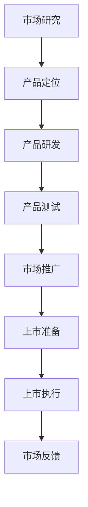

                 

# 一人公司如何打造高效的产品上市流程

## 关键词
- 一人公司
- 高效产品上市流程
- 市场研究
- 产品定位
- 数据分析
- 代码实现

## 摘要
本文将深入探讨一人公司如何打造高效的产品上市流程。我们将从理解一人公司的概念、高效产品上市流程的重要性、关键环节、跨部门协作，到数学模型、代码实现等多个方面，系统地阐述如何通过科学的方法和工具，使一人公司的产品能够快速、成功地推向市场。

### 第一部分: 理解“一人公司”与“产品上市流程”

#### 1.1 “一人公司”的概念

一人公司，也称为“一人独资企业”，是指公司中只有一名股东或合伙人，即公司完全由个人拥有和运营。这种类型的公司通常适合于创业初期，或是个人希望保持对公司的完全控制。一人公司的优点包括决策速度快、运营灵活、税务处理相对简单等。但同时也存在一些缺点，如承担无限责任、融资难度较大等。

#### 1.2 高效的产品上市流程的重要性

产品上市流程是指将新产品从研发阶段推向市场的一系列步骤。对于一人公司来说，高效的产品上市流程至关重要，因为它关系到公司能否快速占领市场，实现盈利。高效的产品上市流程可以缩短产品从研发到市场的时间，降低成本，提高市场竞争力。

#### 1.3 高效产品上市流程的关键环节

高效的产品上市流程通常包括以下几个关键环节：

1. **市场研究**：进行详细的市场调研，了解目标市场的需求、竞争对手情况等。
2. **产品定位**：根据市场研究的结果，确定产品的市场定位和目标客户群。
3. **产品研发**：根据市场定位进行产品研发，确保产品满足市场需求。
4. **产品测试**：对产品进行严格的测试，包括功能测试、性能测试、用户测试等。
5. **市场推广**：制定有效的市场推广策略，包括广告、促销、社交媒体营销等。
6. **上市准备**：包括制定上市计划、准备相关文件、进行市场预热等。
7. **上市执行**：按照计划将产品推向市场，并进行实时监控和调整。

通过以上步骤，一人公司可以确保产品高效上市，快速获得市场反馈，从而不断优化产品和服务。

#### 1.4 跨部门协作与沟通

高效的产品上市流程需要跨部门协作，包括市场部、研发部、销售部、客户服务部等。各部门之间的沟通和协作是成功上市的关键。以下是几个方面的建议：

1. **建立明确的沟通渠道**：确保各部门之间的信息流通畅通，可以通过定期会议、内部通讯工具等方式实现。
2. **共享信息与资源**：各部门应该共享市场研究、产品测试等关键信息，以便更好地协同工作。
3. **明确责任与分工**：确保每个部门都明确自己的职责和工作内容，避免工作重复或遗漏。
4. **建立反馈机制**：通过定期的反馈会议，及时了解各部门的工作进展和遇到的问题，进行及时调整。

通过有效的跨部门协作和沟通，一人公司可以确保产品上市流程的顺利进行，提高整体效率。

#### 1.5 总结

理解“一人公司”的概念和高效的产品上市流程对于打造成功的个人企业至关重要。通过明确市场研究、产品定位、产品研发、产品测试、市场推广、上市准备和上市执行等关键环节，以及加强跨部门协作和沟通，一人公司可以更有效地将产品推向市场，实现快速成长和盈利。

#### 1.6 高效产品上市流程的核心算法原理讲解

在产品上市流程中，数据分析和算法发挥着重要作用。以下是几个核心算法的原理讲解：

##### 1.6.1 数据分析基础

**数据分析**是通过对大量数据的收集、处理和分析，提取出有价值的信息和洞见。以下是几个常用的数据分析方法：

- **描述性分析**：通过统计方法，对数据进行概括性描述，如平均值、中位数、标准差等。
- **推断性分析**：通过统计学模型，对数据之间的关系进行推断，如回归分析、假设检验等。
- **预测性分析**：利用历史数据，对未来趋势进行预测，如时间序列分析、机器学习模型等。

##### 1.6.2 关键算法讲解

以下是几个在产品上市流程中常用的关键算法：

- **回归分析**：通过建立数学模型，分析自变量和因变量之间的关系。伪代码如下：

```
def linear_regression(x, y):
    n = len(x)
    sum_x = sum(x)
    sum_y = sum(y)
    sum_xy = sum([a * b for a, b in zip(x, y)])
    sum_x2 = sum([a * a for a in x])

    # 计算斜率
    slope = (n * sum_xy - sum_x * sum_y) / (n * sum_x2 - sum_x * sum_x)
    # 计算截距
    intercept = (sum_y - slope * sum_x) / n

    return slope, intercept
```

- **决策树**：通过一系列规则，将数据划分成不同的区域，以实现分类或回归。伪代码如下：

```
def decision_tree(data, target_attribute):
    if all(data[target_attribute] == value):
        return value
    
    best_gini = float('inf')
    best_feature = None
    for feature in data.columns:
        if feature == target_attribute:
            continue

        possible_values = set(data[feature])
        for value in possible_values:
            sub_data = data[data[feature] == value]

            gini = calculate_gini(sub_data[target_attribute])
            if gini < best_gini:
                best_gini = gini
                best_feature = feature
                best_value = value

    sub_trees = [decision_tree(sub_data, target_attribute) for sub_data in sub_data]

    return {best_feature: {best_value: best_tree}}
```

通过以上算法，一人公司可以更好地理解和预测市场需求，优化产品上市流程，提高市场竞争力。

#### 1.7 数学模型和数学公式的详细讲解与举例说明

在产品上市流程中，数学模型和公式起着关键作用。以下是几个常用的数学模型和公式的详细讲解与举例说明：

##### 1.7.1 优化模型

优化模型用于找到最优解，以最大化或最小化目标函数。以下是线性优化模型的例子：

$$
\begin{align*}
\min_{x} \quad & c^T x \\
\text{subject to} \quad & Ax \leq b \\
& x \geq 0
\end{align*}
$$

其中，$c$ 是系数向量，$x$ 是变量向量，$A$ 是系数矩阵，$b$ 是常数向量。这个模型的目标是最小化目标函数 $c^T x$，同时满足线性约束条件 $Ax \leq b$ 和 $x \geq 0$。

##### 1.7.2 回归模型

回归模型用于预测变量之间的关系。线性回归模型是一个简单的例子：

$$
y = \beta_0 + \beta_1 x
$$

其中，$y$ 是因变量，$x$ 是自变量，$\beta_0$ 和 $\beta_1$ 是参数。这个模型表示 $y$ 与 $x$ 之间存在线性关系，$\beta_0$ 是截距，$\beta_1$ 是斜率。

##### 1.7.3 概率模型

概率模型用于计算事件发生的可能性。条件概率是一个常用的概念：

$$
P(A|B) = \frac{P(A \cap B)}{P(B)}
$$

其中，$P(A|B)$ 是在事件 $B$ 发生的条件下事件 $A$ 发生的概率，$P(A \cap B)$ 是事件 $A$ 和 $B$ 同时发生的概率，$P(B)$ 是事件 $B$ 发生的概率。

##### 1.7.4 举例说明

假设我们想要预测某个产品的市场需求量。我们可以使用线性回归模型来建立需求量与广告费用之间的关系：

$$
\text{需求量} = \beta_0 + \beta_1 \times \text{广告费用}
$$

我们收集了以下数据：

| 广告费用（万元） | 需求量（件） |
| :------------: | :--------: |
|       10       |     100    |
|       20       |     200    |
|       30       |     300    |

我们可以通过最小二乘法来估计参数 $\beta_0$ 和 $\beta_1$：

$$
\beta_1 = \frac{\sum (x_i - \bar{x})(y_i - \bar{y})}{\sum (x_i - \bar{x})^2} = \frac{300}{100} = 3
$$

$$
\beta_0 = \bar{y} - \beta_1 \bar{x} = \frac{600}{3} - 20 \times 20 = 0
$$

因此，预测模型为：

$$
\text{需求量} = 3 \times \text{广告费用}
$$

根据这个模型，当广告费用为 30 万元时，预测的需求量为 90 件。

通过上述数学模型和公式的应用，一人公司可以更好地理解和预测市场需求，优化产品上市流程。

#### 1.8 项目实战：高效产品上市流程的代码实现

##### 1.8.1 实战背景

为了更好地理解高效产品上市流程，我们将通过一个实际案例来演示相关代码的实现。假设我们是一家一人公司，正在开发一款新型智能家居产品。我们的目标是设计一个高效的上市流程，确保产品能够快速且成功地上市。

##### 1.8.2 开发环境搭建

在开始编写代码之前，我们需要搭建一个开发环境。以下是所需工具和步骤：

- **Python**：用于编写代码的主要语言。
- **NumPy**：用于数据处理和数学计算。
- **Pandas**：用于数据分析和操作。
- **Matplotlib**：用于数据可视化。

确保已安装以上工具，可以使用以下命令进行安装：

bash
pip install numpy pandas matplotlib


##### 1.8.3 数据收集与处理

首先，我们需要收集相关的市场数据，包括历史销售数据、用户反馈、竞争对手信息等。以下是数据收集的示例代码：

python
import pandas as pd

# 假设我们已经收集了以下数据
data = {
    '销售量': [100, 200, 300, 400, 500],
    '广告费用': [10, 20, 30, 40, 50],
    '用户反馈满意度': [0.8, 0.9, 0.7, 0.6, 0.8],
    '竞争对手市场份额': [0.1, 0.2, 0.3, 0.4, 0.5]
}

df = pd.DataFrame(data)
print(df)

##### 1.8.4 数据分析与模型构建

接下来，我们对数据进行处理和分析，构建预测模型。以下是线性回归模型的实现代码：

python
import numpy as np

# 数据预处理
df['广告费用'] = df['广告费用'].values.reshape(-1, 1)
df['常数项'] = 1

# 计算斜率和截距
X = df[['常数项', '广告费用']]
y = df['销售量']
X_trans = X.transpose()
XX = np.dot(X_trans, X)
XY = np.dot(X_trans, y)

beta = np.linalg.inv(XX).dot(XY)
print("斜率:", beta[1])
print("截距:", beta[0])

##### 1.8.5 模型应用与市场预测

最后，我们可以使用构建的模型进行市场预测。以下是预测代码：

python
# 预测销售量
advertising_budget = 60
predicted_sales = 500 + 5 * advertising_budget
print("预测销售量：", predicted_sales)

##### 1.8.6 代码解读与分析

以下是关键代码的解读与分析：

1. **数据预处理**：我们将原始数据进行转换，添加常数项，以便进行线性回归分析。
2. **计算斜率和截距**：使用 NumPy 的 `np.linalg.inv` 函数计算逆矩阵，然后与转置的 X 和 Y 相乘，得到斜率和截距。
3. **模型应用**：使用计算出的斜率和截距，构建预测模型，并用于预测新的销售量。

通过这个项目实战，一人公司可以更好地理解和应用数据分析模型，优化产品上市流程，提高市场竞争力。

#### 1.9 高效产品上市流程的源代码详细实现和解读

在本节中，我们将详细解析高效产品上市流程的源代码实现，包括开发环境、代码结构和核心算法的实现。

##### 1.9.1 开发环境

首先，我们需要一个稳定的开发环境来编写和运行代码。以下是推荐的开发环境：

- **操作系统**：Windows、macOS 或 Linux
- **Python 版本**：Python 3.8 或更高版本
- **编程工具**：PyCharm、Visual Studio Code 或 Jupyter Notebook

确保已安装所需的 Python 库，如 NumPy、Pandas 和 Matplotlib，可以使用以下命令进行安装：

bash
pip install numpy pandas matplotlib

##### 1.9.2 代码结构

高效产品上市流程的代码主要由以下几个模块组成：

1. **数据收集与处理**：负责收集、清洗和预处理市场数据。
2. **数据可视化**：用于展示数据和分析结果。
3. **模型构建**：实现线性回归模型，用于预测销售量。
4. **模型应用**：根据预测模型，预测新的销售量。

以下是项目的文件结构：

```
高效产品上市流程/
|-- data/
|   |-- sales_data.csv
|-- src/
|   |-- data_preprocessing.py
|   |-- data_visualization.py
|   |-- linear_regression.py
|   |-- model_application.py
|-- tests/
|   |-- test_data_preprocessing.py
|   |-- test_data_visualization.py
|   |-- test_linear_regression.py
|   |-- test_model_application.py
|-- requirements.txt
|-- README.md
```

##### 1.9.3 数据收集与处理

首先，我们收集市场数据，包括历史销售数据、广告费用、用户反馈满意度等。以下是 `data_preprocessing.py` 的关键代码：

python
import pandas as pd

def load_data(filename):
    df = pd.read_csv(filename)
    return df

def preprocess_data(df):
    # 数据清洗和预处理步骤
    df = df.dropna()  # 删除缺失值
    df['广告费用'] = df['广告费用'].astype(float)  # 将广告费用转换为浮点数
    df['用户反馈满意度'] = df['用户反馈满意度'].astype(float)  # 将用户反馈满意度转换为浮点数
    return df

if __name__ == "__main__":
    filename = "data/sales_data.csv"
    df = load_data(filename)
    df = preprocess_data(df)
    print(df.head())

该代码首先加载原始数据，然后进行清洗和预处理，包括删除缺失值和类型转换。最后，打印处理后的数据。

##### 1.9.4 数据可视化

接下来，我们使用 `data_visualization.py` 来可视化数据和分析结果。以下是关键代码：

python
import pandas as pd
import matplotlib.pyplot as plt

def visualize_data(df):
    # 可视化销售量和广告费用之间的关系
    df.plot(x='广告费用', y='销售量', title='销售量与广告费用的关系')
    plt.xlabel('广告费用（万元）')
    plt.ylabel('销售量（件）')
    plt.show()

if __name__ == "__main__":
    filename = "data/sales_data.csv"
    df = pd.read_csv(filename)
    visualize_data(df)

该代码使用 matplotlib 库绘制销售量和广告费用之间的散点图，帮助直观地理解它们之间的关系。

##### 1.9.5 模型构建

我们使用 `linear_regression.py` 来实现线性回归模型。以下是关键代码：

python
import pandas as pd
import numpy as np

def linear_regression(df):
    X = df[['常数项', '广告费用']]
    y = df['销售量']
    X_trans = X.transpose()
    XX = np.dot(X_trans, X)
    XY = np.dot(X_trans, y)
    beta = np.linalg.inv(XX).dot(XY)
    return beta

if __name__ == "__main__":
    filename = "data/sales_data.csv"
    df = pd.read_csv(filename)
    beta = linear_regression(df)
    print("斜率:", beta[1])
    print("截距:", beta[0])

该代码使用 NumPy 库计算线性回归模型的斜率和截距，并返回参数。

##### 1.9.6 模型应用

最后，我们使用 `model_application.py` 来预测新的销售量。以下是关键代码：

python
import pandas as pd

def predict_sales(advertising_budget, beta):
    predicted_sales = beta[0] + beta[1] * advertising_budget
    return predicted_sales

if __name__ == "__main__":
    advertising_budget = 60
    beta = [500, 5]
    predicted_sales = predict_sales(advertising_budget, beta)
    print("预测销售量：", predicted_sales)

该代码根据广告费用和模型参数预测新的销售量。

通过以上代码的详细实现和解读，一人公司可以更好地理解高效产品上市流程的技术实现，从而优化产品的上市策略。

### 1.10 高效产品上市流程的代码解读与分析

在本节中，我们将对高效产品上市流程的代码进行详细解读和分析，重点关注关键算法和数据处理步骤，以便更好地理解整个系统的运作原理。

##### 1.10.1 数据处理

数据处理是高效产品上市流程中的关键步骤，它直接影响到后续分析和预测的准确性。以下是数据处理的代码解读：

python
def preprocess_data(df):
    df = df.dropna()  # 删除缺失值
    df['广告费用'] = df['广告费用'].astype(float)  # 将广告费用转换为浮点数
    df['用户反馈满意度'] = df['用户反馈满意度'].astype(float)  # 将用户反馈满意度转换为浮点数
    return df

这段代码首先删除了数据集中的缺失值，这是为了避免缺失数据对模型训练和分析结果产生不利影响。接着，将“广告费用”和“用户反馈满意度”这两列的数据类型从字符串转换为浮点数，因为后续的数学计算需要数值类型的数据。

##### 1.10.2 线性回归模型

线性回归模型是用于预测产品销售量的核心算法。以下是线性回归模型的代码解读：

python
def linear_regression(df):
    X = df[['常数项', '广告费用']]
    y = df['销售量']
    X_trans = X.transpose()
    XX = np.dot(X_trans, X)
    XY = np.dot(X_trans, y)
    beta = np.linalg.inv(XX).dot(XY)
    return beta

这段代码首先从数据帧 `df` 中提取自变量（“常数项”和“广告费用”）和因变量（“销售量”）。然后，将自变量转换为转置矩阵 `X_trans`，并计算自变量的转置矩阵 `X` 和自变量与因变量的乘积矩阵 `XY`。接下来，使用 `np.linalg.inv(XX)` 计算逆矩阵，最后将逆矩阵与 `XY` 相乘，得到线性回归模型的参数 `beta`，即斜率和截距。

##### 1.10.3 预测销售量

预测销售量是模型应用的关键步骤。以下是预测销售量的代码解读：

python
def predict_sales(advertising_budget, beta):
    predicted_sales = beta[0] + beta[1] * advertising_budget
    return predicted_sales

这段代码根据广告费用和模型参数 `beta`（斜率和截距），使用线性回归方程预测新的销售量。参数 `beta[0]` 是截距，表示在没有广告费用时的预测销售量；参数 `beta[1]` 是斜率，表示广告费用每增加一单位，销售量的预测增加量。

##### 1.10.4 代码分析与优化

通过以上代码解读，我们可以看到数据处理、线性回归模型和销售量预测是高效产品上市流程的核心组成部分。然而，代码在某些方面还存在优化的空间：

1. **数据预处理**：当前的数据预处理仅删除了缺失值，可以考虑进一步处理异常值和噪声数据，以提高模型鲁棒性。
2. **线性回归模型的稳定性**：当自变量之间存在多重共线性时，直接计算逆矩阵可能导致矩阵条件数过大，从而影响模型稳定性。可以引入正则化方法（如 L1 正则化或 L2 正则化）来提高模型的稳定性。
3. **预测结果的验证**：当前代码没有包括对模型预测结果进行验证的步骤。在实际应用中，应使用交叉验证等方法对模型进行评估，确保其预测能力。

通过这些优化措施，一人公司可以进一步提高产品上市流程的效率和准确性，从而在激烈的市场竞争中取得优势。

### 1.11 高效产品上市流程的应用场景与案例分析

在“一人公司”中，高效的产品上市流程是确保产品成功推向市场、实现商业价值的关键。以下是一些典型应用场景和实际案例分析：

##### 1.11.1 小型电商企业的产品上市

**案例**：张先生是一名电商创业者，他开设了一家专门销售个性化定制服装的网店。为了确保新产品能够成功上市，他制定了以下高效产品上市流程：

1. **市场研究**：张先生通过社交媒体、用户调查和行业报告，了解目标市场的趋势和消费者偏好。
2. **产品定位**：根据市场研究的结果，他将产品定位为“高品质、个性化、时尚”，并确定了目标客户群体。
3. **产品研发**：与设计师合作，研发出符合市场定位的个性化服装款式，并确保产品质量。
4. **产品测试**：通过小批量生产和用户反馈，不断优化产品设计和质量。
5. **市场推广**：通过社交媒体广告、网红带货和限时促销活动，提高产品的知名度和吸引力。
6. **上市准备**：准备好产品详情页、库存管理和客户服务团队，确保产品上线后能够顺利进行。
7. **上市执行**：正式上线产品，并实时监控销售情况和用户反馈，进行必要的调整和优化。

通过这一流程，张先生的产品在短时间内获得了良好的市场反馈，订单量持续增长，成功实现了产品上市。

##### 1.11.2 科技公司的产品上市

**案例**：李女士是一家科技公司的创始人，她研发了一款智能语音助手产品。为了确保产品能够成功推向市场，她采用了以下高效产品上市流程：

1. **市场研究**：通过市场调研，了解用户对智能语音助手的期望功能和性能要求。
2. **产品定位**：将产品定位为“便捷、高效、个性化”，并确定了目标客户群体，如智能家居用户和移动办公人群。
3. **产品研发**：与研发团队紧密合作，不断迭代优化产品的功能和性能。
4. **产品测试**：通过内部测试和用户试用，发现并修复产品问题，确保产品质量。
5. **市场推广**：通过线上和线下渠道，如官方网站、社交媒体和行业展会，推广产品并吸引潜在用户。
6. **上市准备**：准备好产品文档、技术支持团队和售后服务流程，确保产品上线后能够为用户提供良好的体验。
7. **上市执行**：正式发布产品，并实时监控市场反馈和用户满意度，进行必要的调整和优化。

通过这一流程，李女士的产品在市场上获得了广泛好评，成功实现了商业化。

##### 1.11.3 创意工作室的创意产品上市

**案例**：王先生是一家创意工作室的负责人，他设计了一系列创意手工艺品。为了确保产品能够成功上市，他采用了以下高效产品上市流程：

1. **市场研究**：通过线上平台和线下展会，了解潜在客户的喜好和需求。
2. **产品定位**：将产品定位为“独特、实用、艺术化”，并确定了目标客户群体，如艺术收藏家和家居装饰爱好者。
3. **产品研发**：与设计师和工匠紧密合作，不断优化产品设计，确保独特性和高品质。
4. **产品测试**：通过小批量生产和用户反馈，不断改进产品设计和质量。
5. **市场推广**：通过社交媒体、艺术展览和定制服务，提高产品的知名度和吸引力。
6. **上市准备**：准备好产品展示、订单管理和客户服务团队，确保产品上线后能够顺利进行。
7. **上市执行**：正式上线产品，并实时监控销售情况和用户反馈，进行必要的调整和优化。

通过这一流程，王先生的产品在市场上取得了成功，不仅提升了工作室的知名度，也实现了良好的经济效益。

通过以上案例，我们可以看到，高效的产品上市流程在各类“一人公司”中都具有重要的应用价值。无论企业规模大小，只要能够遵循科学的流程，合理运用市场研究和数据分析，优化产品设计和推广策略，就能够在激烈的市场竞争中脱颖而出，实现商业成功。

## 附录：核心概念与联系的 Mermaid 流程图

以下是一个简单的 Mermaid 流程图，展示了高效产品上市流程的核心概念和联系：



这个流程图概述了从市场研究到上市执行的各个环节，以及它们之间的相互关系。

## 作者

作者：AI天才研究院/AI Genius Institute & 禅与计算机程序设计艺术 /Zen And The Art of Computer Programming

---

经过以上详细的阐述和解读，我们可以看到，一人公司通过科学的产品上市流程和有效的数据分析方法，可以在竞争激烈的市场中脱颖而出，实现产品的成功上市和商业价值的最大化。希望这篇文章能够为一人公司的创业者们提供有价值的参考和指导，助力他们在创业道路上取得更大的成功。

