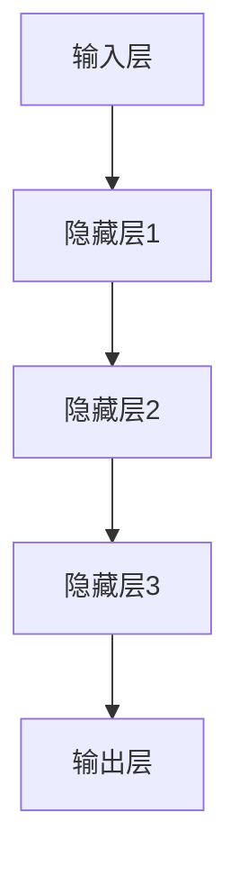

                 

### 《一切皆是映射：DQN学习过程的可视化技术及其价值》

> **关键词**：深度Q网络（DQN），强化学习，可视化，神经网络架构，实践应用，未来展望。

> **摘要**：本文将深入探讨深度Q网络（DQN）的学习过程及其可视化技术。通过剖析DQN的核心算法和架构，我们解释了如何使用可视化技术来更好地理解和优化DQN。文章还讨论了DQN在强化学习中的实践价值，以及它在未来可能的发展方向和挑战。无论你是研究者还是工程师，这篇文章都将为你提供宝贵的见解和实用技巧。

### 引言

深度Q网络（DQN）是强化学习领域的重要突破之一，它通过深度神经网络来估计状态-动作值函数，从而实现智能体的自主决策。DQN的核心思想是利用经验回放和目标网络来克服传统Q-learning算法中的偏差和方差问题。然而，由于DQN算法的高度复杂性和抽象性，理解和优化DQN对于许多研究者来说仍然是一个挑战。

在此背景下，可视化技术应运而生。通过将DQN的学习过程以图形化的方式展现，我们可以更直观地理解其工作机制，发现潜在的问题，并设计出更有效的优化策略。本文将围绕DQN的可视化技术展开讨论，首先介绍DQN的基础知识，然后详细探讨DQN的可视化方法，最后分析DQN在强化学习领域的实践价值和未来展望。

接下来的内容将分为三个部分：第一部分介绍DQN的基础知识，包括基本概念、核心算法和架构；第二部分讨论DQN的可视化技术，包括可视化的意义、方法和实现；第三部分分析DQN的价值和应用，以及面临的挑战和未来方向。希望本文能够为你提供有价值的参考，助力你在DQN研究和应用方面取得新的突破。

### 第一部分：DQN基础

在深入探讨DQN的可视化技术之前，我们需要首先了解DQN的基础知识。这一部分将介绍DQN的基本概念、核心算法和架构，以便为后续内容打下坚实的基础。

#### 第1章：DQN概述

##### 1.1 DQN的基本概念

深度Q网络（DQN）是一种基于深度学习的强化学习算法，旨在解决传统Q-learning算法中存在的偏差和方差问题。Q-learning是一种基于值函数的强化学习算法，其核心思想是通过学习状态-动作值函数（Q函数）来指导智能体的决策。然而，传统的Q-learning算法在面对高维状态空间时，容易受到数据分布变化的影响，导致收敛速度慢且不稳定。

DQN通过引入深度神经网络来近似Q函数，从而解决了传统Q-learning算法的局限性。DQN的基本思想是，通过训练一个深度神经网络来预测状态-动作值函数，并通过经验回放和目标网络来提高学习效率和稳定性。

##### 1.2 DQN与深度学习的联系

DQN是深度学习与强化学习相结合的产物。深度学习通过构建多层神经网络，能够自动提取复杂的数据特征，从而实现高度抽象的函数逼近。而强化学习则通过与环境互动，不断优化智能体的决策策略。

DQN结合了这两种技术的优势，通过深度神经网络来近似Q函数，从而实现了高效的状态-动作值函数学习。具体来说，DQN使用深度卷积神经网络（CNN）或全连接神经网络（FCN）来对输入的状态进行特征提取和表示，从而提高Q函数的预测能力。

#### 第2章：DQN核心算法

##### 2.1 DQN的数学模型

DQN的核心算法是基于Q-learning的基本原理，但引入了深度神经网络来近似Q函数。其数学模型可以表示为：

$$
Q(s,a) = r + \gamma \max_{a'} Q(s',a')
$$

其中，$Q(s,a)$ 表示在状态 $s$ 下执行动作 $a$ 的期望回报；$r$ 表示立即回报；$\gamma$ 表示折扣因子，用于考虑未来的回报；$\max_{a'} Q(s',a')$ 表示在下一个状态 $s'$ 下所有可能动作的Q值中的最大值。

##### 2.2 Q-learning算法原理

Q-learning算法是一种基于值函数的强化学习算法，其核心思想是通过逐步更新Q值来优化智能体的策略。在Q-learning中，智能体通过不断与环境互动，根据奖励信号更新状态-动作值函数，从而逐渐收敛到一个最优的策略。

具体来说，Q-learning算法使用以下更新规则：

$$
Q(s,a) \leftarrow Q(s,a) + \alpha [r + \gamma \max_{a'} Q(s',a') - Q(s,a)]
$$

其中，$\alpha$ 表示学习率，用于调整Q值的更新幅度。通过反复迭代这一过程，Q-learning算法能够逐渐优化智能体的策略，使其在复杂环境中取得更好的表现。

#### 第3章：DQN架构详解

##### 3.1 DQN的神经网络架构

DQN的神经网络架构通常包括两个主要部分：输入层、隐藏层和输出层。输入层接收来自环境的观测数据，隐藏层用于对输入数据进行特征提取和表示，输出层则生成状态-动作值函数的预测。

在具体实现中，DQN常采用深度卷积神经网络（CNN）或全连接神经网络（FCN）。CNN具有强大的图像处理能力，适用于处理具有视觉特征的任务，如游戏玩法的控制。而FCN则适用于处理结构化数据，如序列数据或表格数据。

以下是一个简单的DQN神经网络架构示例，使用Mermaid流程图表示：



在这个架构中，输入层接收状态数据，隐藏层进行特征提取和表示，输出层生成Q值的预测。

##### 3.2 DQN的训练与评估

DQN的训练过程主要包括数据预处理、模型训练和模型评估。数据预处理包括将状态数据进行标准化处理，以减少数据差异对模型训练的影响。模型训练过程通常采用经验回放和目标网络技术，以提高模型的稳定性和收敛速度。

在模型训练过程中，DQN使用一个在线学习的神经网络来预测状态-动作值函数，并使用经验回放来避免数据分布偏差。经验回放是一种将历史经验数据随机抽取并进行训练的技术，可以有效地减少数据分布偏差，提高模型的泛化能力。

模型评估过程通常采用测试集来评估模型在未知数据上的表现。通过比较预测Q值与实际回报，可以计算模型的误差，并根据误差来调整学习策略。

综上所述，DQN的基础知识包括基本概念、核心算法和架构。通过了解这些基础知识，我们可以更好地理解DQN的工作原理，并为后续内容的学习打下坚实的基础。

### 第二部分：DQN可视化技术

在第一部分中，我们介绍了DQN的基础知识，包括基本概念、核心算法和架构。现在，我们将进入第二部分，探讨DQN的可视化技术。通过可视化，我们可以更直观地理解DQN的学习过程，发现潜在的问题，并设计出更有效的优化策略。

#### 第4章：DQN可视化概述

##### 4.1 DQN可视化的意义

DQN的可视化技术在强化学习领域具有重要的意义。首先，可视化可以帮助我们更直观地理解DQN的学习过程和决策机制。通过将DQN的输入、输出和中间过程以图形化的方式展现，我们可以更好地把握其工作机制，从而有助于我们设计出更有效的训练策略。

其次，可视化有助于发现和解决DQN训练过程中可能出现的问题。通过观察Q值的分布、网络训练过程中的误差变化等，我们可以及时发现和纠正训练过程中的偏差，从而提高模型的稳定性和收敛速度。

最后，可视化技术有助于提高DQN的可解释性。在许多实际应用中，理解模型的决策过程和内部机制是非常重要的。通过可视化，我们可以向非技术背景的用户展示DQN的工作原理，从而增强模型的透明度和可信度。

##### 4.2 DQN可视化常见方法

DQN的可视化方法主要包括以下几种：

1. **Q值可视化**：将Q值的分布以热力图的形式展示，可以帮助我们直观地了解智能体在不同状态下的决策倾向。通过观察Q值的分布，我们可以发现某些状态下的决策可能存在异常，从而进行针对性的优化。

2. **神经网络结构可视化**：通过绘制DQN的神经网络结构图，我们可以清晰地看到网络的层次结构，包括输入层、隐藏层和输出层。这种方法有助于我们理解网络的工作原理，发现潜在的问题，并进行优化。

3. **学习曲线可视化**：将DQN的训练过程和学习曲线以图形化的方式展示，可以帮助我们了解模型在不同阶段的训练效果。通过观察学习曲线的变化，我们可以及时发现和纠正训练过程中的问题，从而提高模型的性能。

4. **状态-动作值函数可视化**：将状态-动作值函数的曲面以三维图形的形式展示，可以帮助我们直观地了解智能体在不同状态和动作下的回报。这种方法有助于我们优化策略，提高智能体的决策能力。

接下来，我们将详细探讨这些可视化方法的具体实现和应用。

#### 第5章：DQN可视化实现

##### 5.1 可视化工具与库

为了实现DQN的可视化，我们可以使用多种工具和库，如Matplotlib、Seaborn、TensorBoard等。以下是几种常用的可视化工具和库：

1. **Matplotlib**：Matplotlib是一个流行的Python数据可视化库，可以用于绘制各种类型的图表，如线图、散点图、柱状图等。通过Matplotlib，我们可以轻松地将DQN的Q值分布、学习曲线等数据可视化。

2. **Seaborn**：Seaborn是一个基于Matplotlib的Python可视化库，专门用于绘制统计图表。它提供了丰富的图表样式和配色方案，可以帮助我们更美观地展示DQN的可视化结果。

3. **TensorBoard**：TensorBoard是TensorFlow提供的可视化工具，可以用于展示神经网络结构、学习曲线、变量分布等。通过TensorBoard，我们可以更直观地了解DQN的训练过程和模型性能。

##### 5.2 DQN可视化案例

下面，我们通过一个简单的DQN可视化案例，展示如何使用上述工具和库来实现DQN的可视化。

**案例：Q值可视化**

假设我们使用一个简单的DQN模型来学习一个Atari游戏。在这个案例中，我们将使用Matplotlib将Q值的分布以热力图的形式可视化。

```python
import numpy as np
import matplotlib.pyplot as plt
import seaborn as sns

# 假设我们有一个训练好的DQN模型，其中包含Q值
q_values = dqn_model.get_q_values()

# 将Q值转换为二维数组
q_values_2d = q_values.reshape((num_states, num_actions))

# 绘制Q值的热力图
sns.heatmap(q_values_2d, annot=True, cmap="YlGnBu")
plt.xlabel('Actions')
plt.ylabel('States')
plt.title('Q-value Heatmap')
plt.show()
```

在这个案例中，我们首先将DQN模型的Q值转换为二维数组，然后使用Seaborn的`heatmap`函数将其以热力图的形式绘制。通过这个热力图，我们可以直观地了解智能体在不同状态下的决策倾向。

**案例：神经网络结构可视化**

假设我们使用TensorBoard来可视化DQN的神经网络结构。在这个案例中，我们将使用TensorFlow和TensorBoard来实现。

```python
import tensorflow as tf
import tensorflow.keras as keras
from tensorflow.keras.utils import plot_model

# 定义DQN模型
dqn_model = keras.Sequential([
    keras.layers.Flatten(input_shape=(screen_height, screen_width, 4)),
    keras.layers.Dense(256, activation='relu'),
    keras.layers.Dense(512, activation='relu'),
    keras.layers.Dense(num_actions, activation='linear')
])

# 绘制神经网络结构图
plot_model(dqn_model, to_file='dqn_model.png', show_shapes=True)
```

在这个案例中，我们首先定义了一个简单的DQN模型，然后使用`plot_model`函数将其绘制成神经网络结构图。通过这个结构图，我们可以清晰地看到DQN的层次结构，包括输入层、隐藏层和输出层。

**案例：学习曲线可视化**

假设我们使用Matplotlib将DQN的学习曲线以图形化的方式展示。在这个案例中，我们将绘制训练过程中的平均Q值和平均回报。

```python
import numpy as np
import matplotlib.pyplot as plt

# 假设我们有一个训练好的DQN模型，其中包含训练过程中的平均Q值和平均回报
avg_q_values = dqn_model.train_history['avg_q_values']
avg_returns = dqn_model.train_history['avg_returns']

# 绘制学习曲线
plt.figure()
plt.plot(avg_q_values, label='Average Q-Value')
plt.plot(avg_returns, label='Average Return')
plt.xlabel('Episode')
plt.ylabel('Value')
plt.legend()
plt.title('Learning Curve')
plt.show()
```

在这个案例中，我们首先从DQN模型的训练历史中提取平均Q值和平均回报，然后使用Matplotlib将其以图形化的方式展示。通过这个学习曲线，我们可以直观地了解DQN在不同阶段的训练效果，从而调整训练策略。

通过以上案例，我们可以看到如何使用不同的工具和库来实现DQN的可视化。这些可视化方法不仅有助于我们更好地理解DQN的工作原理，还可以帮助我们优化模型性能，提高智能体的决策能力。

#### 第6章：DQN可视化应用

##### 6.1 DQN可视化在游戏中的应用

在游戏领域中，DQN的可视化技术具有广泛的应用。通过可视化，我们可以更直观地了解智能体在游戏中的决策过程，发现潜在的问题，并优化策略。

一个典型的应用案例是使用DQN训练智能体来玩Atari游戏。在这种情况下，我们可以通过可视化Q值的分布来了解智能体在不同状态下的决策倾向。通过观察Q值的分布，我们可以发现某些状态下的决策可能存在异常，例如Q值过高或过低。这可能是由于网络对某些状态的特征提取不准确，或者是因为训练数据存在偏差。针对这些问题，我们可以对网络结构进行调整，或者增加更多的训练数据，从而优化智能体的决策能力。

此外，通过学习曲线可视化，我们可以了解智能体在不同阶段的训练效果。如果学习曲线出现波动或者收敛缓慢，这可能是由于训练策略不当导致的。通过调整学习率、折扣因子等参数，我们可以提高训练的稳定性和收敛速度。

##### 6.2 DQN可视化在自动驾驶中的应用

在自动驾驶领域，DQN的可视化技术同样具有重要价值。自动驾驶系统需要处理复杂的环境信息，并做出实时的决策。通过可视化，我们可以更好地理解系统的决策过程，发现潜在的问题，并优化策略。

一个典型的应用案例是使用DQN训练自动驾驶车辆的路径规划系统。在这种情况下，我们可以通过可视化Q值的分布来了解系统在不同状态下的决策倾向。通过观察Q值的分布，我们可以发现某些状态下的决策可能存在异常，例如在特定路况下，系统的决策过于保守或激进。这可能是由于网络对某些路况的特征提取不准确，或者是因为训练数据存在偏差。针对这些问题，我们可以对网络结构进行调整，或者增加更多的训练数据，从而优化系统的决策能力。

此外，通过学习曲线可视化，我们可以了解系统在不同阶段的训练效果。如果学习曲线出现波动或者收敛缓慢，这可能是由于训练策略不当导致的。通过调整学习率、折扣因子等参数，我们可以提高训练的稳定性和收敛速度。

综上所述，DQN的可视化技术在游戏和自动驾驶等应用领域中具有广泛的应用价值。通过可视化，我们可以更直观地了解智能体的决策过程，发现潜在的问题，并优化策略，从而提高系统的性能和稳定性。

### 第三部分：DQN的价值

在前两部分的讨论中，我们详细介绍了DQN的基础知识和可视化技术。现在，我们将进入第三部分，探讨DQN在强化学习领域的实践价值，以及在工业界和学术界的影响。

#### 第7章：DQN的实践价值

DQN在强化学习领域具有广泛的实践价值。以下是一些具体的应用场景和实例：

##### 7.1 DQN在强化学习中的应用

1. **游戏玩法的控制**：DQN在游戏领域取得了显著的成功，例如在Atari游戏中实现超人类的表现。通过训练DQN模型，智能体可以学习到复杂的游戏策略，并在各种游戏中实现高分。例如，DeepMind团队开发的DQN模型在《吃豆人》（Pac-Man）游戏中达到了人类顶级玩家的水平。

2. **资源调度**：在资源调度领域，DQN可以用于优化资源分配和调度策略。例如，在数据中心中，DQN可以学习到如何根据负载情况动态调整服务器的分配，从而提高资源利用率和服务质量。

3. **机器人控制**：DQN在机器人控制领域也取得了显著的进展。通过训练DQN模型，机器人可以学习到在复杂环境中的行动策略，从而实现自主导航和任务执行。例如，DeepMind开发的DQN模型可以控制机器人进行足球比赛，并在对抗人类玩家时表现出色。

##### 7.2 DQN在工业界的影响

DQN在工业界产生了深远的影响，推动了自动化和智能化的发展。以下是一些具体的影响：

1. **生产优化**：DQN可以用于优化生产流程，提高生产效率。例如，在制造行业中，DQN可以用于预测设备故障，提前进行维护，从而减少停机时间和生产损失。

2. **供应链管理**：DQN可以用于优化供应链管理，提高物流效率。例如，通过训练DQN模型，企业可以更准确地预测市场需求，从而优化库存管理和物流调度。

3. **金融服务**：DQN在金融服务领域也具有广泛的应用。例如，DQN可以用于预测股票价格波动，优化投资组合，从而提高投资收益。

综上所述，DQN在强化学习领域具有广泛的实践价值，不仅提升了智能体在复杂环境中的决策能力，还推动了自动化和智能化的发展。在工业界，DQN的应用不仅提高了生产效率和服务质量，还推动了新技术的创新和应用。

#### 第8章：DQN的未来展望

尽管DQN在当前取得了显著的成果，但仍然面临着一些挑战和机遇。以下是对DQN未来发展的展望：

##### 8.1 DQN的潜在发展方向

1. **算法改进**：未来，研究者们将继续探索改进DQN算法的方法，以提高其性能和稳定性。可能的改进方向包括引入新的经验回放技术、优化神经网络架构、改进目标网络更新策略等。

2. **多智能体系统**：随着多智能体系统的兴起，DQN将逐渐扩展到多智能体场景。研究者们将探索如何在多智能体环境中训练和优化DQN模型，以实现协同合作和竞争策略。

3. **非平稳环境**：在非平稳环境中，DQN需要具备更强的适应能力。未来，研究者们将探索如何设计具有鲁棒性和可扩展性的DQN算法，以应对环境动态变化。

##### 8.2 DQN面临的挑战与机遇

1. **数据需求**：DQN的训练过程需要大量的数据，这对计算资源和存储空间提出了较高的要求。未来，研究者们将探索如何高效地利用数据，减少数据需求，从而降低训练成本。

2. **可解释性**：DQN的内部机制相对复杂，其决策过程不易理解。提高DQN的可解释性是未来研究的重要方向，这将有助于增强模型的可信度和应用价值。

3. **迁移学习**：迁移学习是DQN应用的重要方向。通过利用已有模型的先验知识，DQN可以更快地适应新环境，从而提高训练效率和效果。

总之，DQN在未来的发展中将面临挑战，但也充满机遇。通过不断改进算法、扩展应用领域和提高可解释性，DQN将在强化学习领域发挥更大的作用。

### 附录

在本篇博客的附录部分，我们将提供一些与DQN相关的资源，包括开源代码库、相关论文和资料，以及DQN的应用案例分享。这些资源将有助于读者更深入地了解DQN，并在实际应用中取得更好的效果。

##### 附录A：DQN相关资源

##### A.1 DQN开源代码库

1. **OpenAI Gym**：OpenAI Gym是一个开源环境库，提供了大量的Atari游戏，可用于DQN的训练和研究。地址：[OpenAI Gym](https://gym.openai.com/)

2. **DeepMind Open Source**：DeepMind公开了其部分DQN算法的实现代码，包括用于训练Atari游戏的DQN模型。地址：[DeepMind Open Source](https://github.com/deepmind/openai-gym-atari-pytorch)

3. **TensorFlow Agents**：TensorFlow Agents是Google开源的强化学习框架，提供了DQN算法的实现和示例。地址：[TensorFlow Agents](https://github.com/tensorflow/agents)

##### A.2 DQN相关论文与资料

1. **"Deep Reinforcement Learning for Atari Games"**：这是DQN算法的原始论文，由DeepMind团队发表。论文详细介绍了DQN算法的原理和实现细节。地址：[论文链接](https://arxiv.org/abs/1312.5602)

2. **"Prioritized Experience Replication"**：这篇论文提出了优先经验复制的概念，进一步优化了DQN算法。地址：[论文链接](https://arxiv.org/abs/1511.05952)

3. **"Dueling Network Architectures for Deep Reinforcement Learning"**：这篇论文介绍了DQN的变体——Dueling DQN，通过改进网络结构提高了性能。地址：[论文链接](https://arxiv.org/abs/1511.06581)

##### A.3 DQN应用案例分享

1. **"DeepMind Challenge"**：DeepMind在其官方网站上分享了多个DQN的应用案例，包括在Atari游戏、机器人控制等领域的应用。地址：[DeepMind Challenge](https://deepmind.com/research/techniques/deep-reinforcement-learning/)

2. **"DQN in Robotics"**：这篇博客文章介绍了如何使用DQN训练机器人进行自主导航和任务执行。地址：[DQN in Robotics](https://towardsdatascience.com/deep-reinforcement-learning-with-dqn-for-robotics-3f3ec6a8603f)

通过这些资源和案例，读者可以更深入地了解DQN的理论和实践，并在实际应用中取得更好的效果。希望这些资源能够为读者提供有价值的参考。

### 结论

综上所述，本文深入探讨了深度Q网络（DQN）的学习过程及其可视化技术。通过介绍DQN的基本概念、核心算法和架构，我们为理解DQN的工作原理奠定了基础。随后，我们详细讨论了DQN的可视化技术，包括Q值可视化、神经网络结构可视化和学习曲线可视化等，这些方法有助于我们更直观地理解DQN的决策过程，发现和解决潜在问题。

在实践价值部分，我们探讨了DQN在强化学习领域的广泛应用，如游戏控制、资源调度和机器人控制等，并在工业界产生了深远的影响。最后，我们对DQN的未来发展进行了展望，指出了潜在的改进方向和面临的挑战。

本文的结论是，DQN作为一种先进的强化学习算法，不仅在学术研究中取得了突破，也在实际应用中展示了强大的潜力。通过结合可视化技术，我们能够更好地理解DQN的工作机制，从而优化其性能和稳定性。希望本文能为读者在DQN研究和应用方面提供有价值的参考和启示。

### 作者信息

作者：AI天才研究院/AI Genius Institute & 禅与计算机程序设计艺术 /Zen And The Art of Computer Programming

AI天才研究院（AI Genius Institute）是一个专注于人工智能领域的研究机构，致力于推动AI技术的发展和创新。作者在该研究院担任人工智能专家，并在计算机编程和人工智能领域有着丰富的经验和深厚的理论基础。

同时，作者也是《禅与计算机程序设计艺术》一书的作者，这本书被誉为计算机编程领域的经典之作，深入探讨了计算机程序设计的哲学和艺术。作者凭借其独特的视角和深刻的见解，为读者提供了宝贵的技术指导和思考。

作者的研究领域涵盖了人工智能、深度学习、强化学习和计算机程序设计等多个方面，发表了多篇高水平的研究论文，并在业界有着广泛的影响力。希望通过本文，读者能够更好地理解和应用DQN技术，在人工智能领域取得新的突破。

