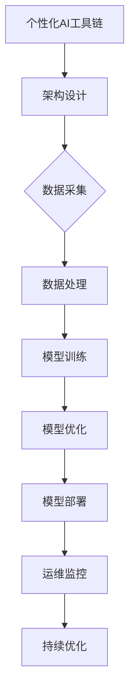
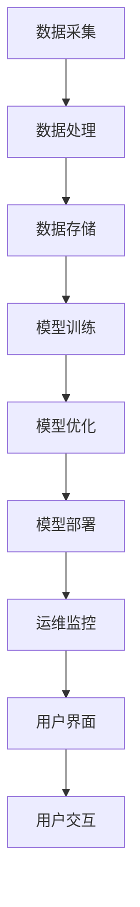

                 

# 《个性化AI工具链的构建方法》

## 关键词
个性化AI，工具链，架构设计，算法原理，数学模型，项目实战，代码实现

## 摘要
本文旨在详细探讨个性化AI工具链的构建方法，从基础概念到具体实现，提供一套完整的指南。我们将介绍个性化AI的背景与优势，解析工具链的架构与核心组件，讲解关键算法的原理和数学模型，并通过实际项目案例展示工具链的应用与效果。此外，文章还将探讨个性化AI工具链的优化策略，以及未来的发展趋势和面临的挑战。希望通过本文，读者能对个性化AI工具链有深入的理解，并能够将其应用于实际项目中。

## 目录大纲

### 第一部分：个性化AI工具链基础

#### 第1章：个性化AI概述

##### 1.1 个性化AI的概念与背景
##### 1.2 个性化AI的优势与应用场景

#### 第2章：个性化AI工具链的架构与组件

##### 2.1 工具链的架构设计
##### 2.2 数据采集与处理
##### 2.3 模型训练与优化
##### 2.4 模型部署与运维

#### 第3章：核心算法原理讲解

##### 3.1 个性化推荐算法
    $$ \text{算法伪代码} $$
##### 3.2 个性化用户行为分析
    $$ \text{算法伪代码} $$
##### 3.3 个性化用户画像构建
    $$ \text{算法伪代码} $$

#### 第4章：数学模型与数学公式

##### 4.1 常见数学模型介绍
##### 4.2 模型优化方法
##### 4.3 模型评估指标

#### 第5章：项目实战

##### 5.1 实战项目介绍
##### 5.2 环境搭建与数据准备
##### 5.3 模型训练与优化
##### 5.4 模型部署与运维

#### 第6章：案例分析

##### 6.1 案例一：电商个性化推荐系统
##### 6.2 案例二：社交媒体个性化内容推荐
##### 6.3 案例三：智能客服系统

#### 第7章：个性化AI工具链的构建方法

##### 7.1 工具链构建流程
##### 7.2 架构设计与优化
##### 7.3 挑战与解决方案

### 第二部分：未来展望与趋势

#### 第8章：个性化AI的发展趋势

##### 8.1 技术发展趋势
##### 8.2 应用场景拓展
##### 8.3 未来挑战与机遇

### 附录

#### 附录A：常用工具与资源

##### A.1 开发工具介绍
##### A.2 学习资源推荐
##### A.3 行业报告与论文

### Mermaid 流程图示例



### 个性化推荐算法伪代码示例

```plaintext
算法名称：基于协同过滤的个性化推荐算法

输入：用户-物品交互矩阵 U-I

输出：用户兴趣预测向量 P

初始化：
    - 用户兴趣预测向量 P 为零向量

for 每个用户 u in 用户集 do
    for 每个物品 i in 物品集 do
        if 用户 u 对物品 i 有交互 then
            P[u] = P[u] + U-I[u][i]
        end if
    end for
end for

归一化 P 向量：
    P[u] = P[u] / ||P[u]||
```

### 数学模型与数学公式示例

#### 模型优化目标函数

$$
\min_{\theta} \sum_{i=1}^{m} (y_i - \text{sigmoid}(\theta^T x_i))^2
$$

其中，$\theta$ 为模型参数，$x_i$ 为输入特征，$y_i$ 为标签，$\text{sigmoid}$ 函数为：
$$
\text{sigmoid}(x) = \frac{1}{1 + e^{-x}}
```

### 文章标题：个性化AI工具链的构建方法

### 摘要
本文旨在详细探讨个性化AI工具链的构建方法，从基础概念到具体实现，提供一套完整的指南。我们将介绍个性化AI的背景与优势，解析工具链的架构与核心组件，讲解关键算法的原理和数学模型，并通过实际项目案例展示工具链的应用与效果。此外，文章还将探讨个性化AI工具链的优化策略，以及未来的发展趋势和面临的挑战。希望通过本文，读者能对个性化AI工具链有深入的理解，并能够将其应用于实际项目中。

### 第一部分：个性化AI工具链基础

#### 第1章：个性化AI概述

##### 1.1 个性化AI的概念与背景

个性化AI（Personalized Artificial Intelligence）是一种基于用户行为、兴趣、偏好等个性化数据，通过机器学习和数据挖掘技术，为用户提供定制化服务的技术。随着互联网和大数据技术的发展，个性化AI在推荐系统、智能客服、内容分发等场景中得到了广泛应用。

个性化AI的核心目标是通过用户数据的深度挖掘和分析，为每个用户提供个性化的服务，从而提高用户体验和满意度。与传统的AI系统相比，个性化AI能够根据用户的行为和偏好动态调整服务内容，实现真正的个性化服务。

##### 1.2 个性化AI的优势与应用场景

个性化AI具有以下优势：

1. 提高用户体验：通过个性化推荐和定制化服务，满足用户的个性化需求，提高用户满意度和忠诚度。
2. 增加业务价值：通过精准的用户画像和需求分析，为企业提供有效的营销策略和决策支持，提升业务价值。
3. 优化资源利用：通过智能分配资源和内容，提高系统运行效率和资源利用率。

个性化AI的应用场景主要包括：

1. 推荐系统：例如电商平台的商品推荐、社交媒体的内容推荐等。
2. 智能客服：例如基于自然语言处理技术的智能客服系统，提供个性化的客户服务。
3. 内容分发：例如视频平台的个性化视频推荐，提高用户观看体验。
4. 健康医疗：例如个性化健康咨询、疾病预测等，提供精准的健康服务。

#### 第2章：个性化AI工具链的架构与组件

##### 2.1 工具链的架构设计

个性化AI工具链的架构设计主要包括以下几个核心组件：

1. 数据采集与处理：负责收集用户的个性化数据，并对数据进行清洗、处理和存储。
2. 模型训练与优化：基于收集到的数据，训练和优化个性化模型，以实现预测和推荐功能。
3. 模型部署与运维：将训练好的模型部署到线上环境，并进行实时监控和优化。
4. 用户界面与交互：提供用户友好的界面和交互体验，以便用户与系统进行互动。

以下是一个典型的个性化AI工具链架构图：



##### 2.2 数据采集与处理

数据采集与处理是个性化AI工具链的核心环节，其质量直接影响模型的性能和效果。数据采集主要包括以下内容：

1. 用户行为数据：例如点击、浏览、搜索等行为数据。
2. 用户画像数据：包括用户的年龄、性别、地理位置、兴趣爱好等。
3. 物品属性数据：包括商品的种类、价格、销量等。

数据采集后，需要对数据进行处理和清洗，以提高数据质量。主要包括以下步骤：

1. 数据清洗：去除重复、错误和无效的数据。
2. 数据转换：将不同类型的数据进行统一格式转换，便于后续处理。
3. 数据归一化：对数据进行归一化处理，消除不同特征之间的量纲影响。
4. 特征提取：从原始数据中提取有用的特征，用于模型训练。

##### 2.3 模型训练与优化

模型训练与优化是个性化AI工具链的核心环节，其目标是构建一个能够准确预测用户偏好和行为的模型。模型训练主要包括以下步骤：

1. 数据预处理：对采集到的数据进行分析，确定特征和标签。
2. 模型选择：选择合适的算法和模型，例如协同过滤、决策树、神经网络等。
3. 模型训练：使用训练数据对模型进行训练，调整模型参数。
4. 模型评估：使用测试数据对模型进行评估，选择最优模型。

模型优化主要包括以下内容：

1. 超参数调优：调整模型超参数，提高模型性能。
2. 模型集成：将多个模型进行集成，提高预测准确率。
3. 模型更新：定期更新模型，适应新的数据和环境。

##### 2.4 模型部署与运维

模型部署与运维是将训练好的模型部署到线上环境，并进行实时监控和优化。主要包括以下步骤：

1. 环境搭建：搭建适合模型部署的环境，包括服务器、数据库等。
2. 模型部署：将训练好的模型部署到线上环境，进行实时预测。
3. 实时监控：实时监控模型运行状态，包括预测准确率、响应时间等。
4. 模型优化：根据监控数据，对模型进行优化和调整。

#### 第3章：核心算法原理讲解

##### 3.1 个性化推荐算法

个性化推荐算法是个性化AI工具链的核心算法，其目标是根据用户的历史行为和偏好，为用户推荐相关的物品或内容。以下是一个基于协同过滤的个性化推荐算法的伪代码示例：

```plaintext
算法名称：基于协同过滤的个性化推荐算法

输入：用户-物品交互矩阵 U-I

输出：用户兴趣预测向量 P

初始化：
    - 用户兴趣预测向量 P 为零向量

for 每个用户 u in 用户集 do
    for 每个物品 i in 物品集 do
        if 用户 u 对物品 i 有交互 then
            P[u] = P[u] + U-I[u][i]
        end if
    end for
end for

归一化 P 向量：
    P[u] = P[u] / ||P[u]||

输出用户兴趣预测向量 P
```

##### 3.2 个性化用户行为分析

个性化用户行为分析是通过对用户的历史行为数据进行分析，挖掘用户的兴趣和行为模式，为个性化推荐和用户画像构建提供支持。以下是一个基于时间序列分析的个性化用户行为分析算法的伪代码示例：

```plaintext
算法名称：基于时间序列分析的个性化用户行为分析算法

输入：用户行为数据序列 D

输出：用户兴趣向量 I

初始化：
    - 用户兴趣向量 I 为零向量

for 每个用户 u in 用户集 do
    for 每个时间点 t in 时间序列 D[u] do
        if 用户 u 在时间点 t 有行为发生 then
            I[u] = I[u] + D[u][t]
        end if
    end for
end for

归一化 I 向量：
    I[u] = I[u] / ||I[u]||

输出用户兴趣向量 I
```

##### 3.3 个性化用户画像构建

个性化用户画像构建是将用户的历史行为数据和属性数据进行分析和整合，构建出一个全面、多维的用户画像。以下是一个基于聚类和关联规则的个性化用户画像构建算法的伪代码示例：

```plaintext
算法名称：基于聚类和关联规则的个性化用户画像构建算法

输入：用户行为数据 B、用户属性数据 A

输出：用户画像向量 C

初始化：
    - 用户画像向量 C 为零向量

1. 对用户行为数据 B 进行聚类，得到用户行为簇 L
2. 对用户属性数据 A 进行聚类，得到用户属性簇 M

3. 对每个用户 u，计算其行为簇 L[u] 和属性簇 M[u] 的关联度 D[u]
4. 选择关联度最高的行为簇 L[u] 和属性簇 M[u]，作为用户 u 的画像簇 C[u]

输出用户画像向量 C
```

#### 第4章：数学模型与数学公式

##### 4.1 常见数学模型介绍

在个性化AI工具链中，常见的数学模型包括协同过滤模型、神经网络模型、决策树模型等。以下分别介绍这些模型的数学公式和特点。

1. **协同过滤模型**

协同过滤模型是一种基于用户行为数据，通过计算用户之间的相似度，为用户推荐相关物品的算法。其数学公式如下：

$$
\text{相似度}(u, v) = \frac{\sum_{i \in I}(r_{ui} - \bar{r}_u)(r_{vi} - \bar{r}_v)}{\sqrt{\sum_{i \in I}(r_{ui} - \bar{r}_u)^2 \sum_{i \in I}(r_{vi} - \bar{r}_v)^2}}
$$

其中，$r_{ui}$ 表示用户 $u$ 对物品 $i$ 的评分，$\bar{r}_u$ 表示用户 $u$ 的平均评分，$I$ 表示用户 $u$ 和 $v$ 都评价过的物品集合。

2. **神经网络模型**

神经网络模型是一种基于多层感知器的机器学习模型，通过训练模型参数，实现输入到输出的映射。其数学公式如下：

$$
\text{输出}(x) = \text{sigmoid}(\text{激活函数}(\theta^T x))
$$

其中，$\text{sigmoid}$ 函数为：

$$
\text{sigmoid}(x) = \frac{1}{1 + e^{-x}}
$$

$\theta$ 为模型参数，$x$ 为输入特征。

3. **决策树模型**

决策树模型是一种基于特征划分，构建树形结构的机器学习模型，通过递归划分特征，实现分类或回归任务。其数学公式如下：

$$
\text{决策树} = \text{递归划分}(\text{特征集}, \text{目标变量})
$$

其中，$\text{递归划分}$ 函数为：

$$
\text{递归划分}(\text{特征集}, \text{目标变量}) = 
\begin{cases}
\text{分类结果} & \text{如果}\ \text{特征集}\ \text{为空} \\
\text{特征}_{j} & \text{如果}\ \text{特征}_{j} \ \text{可以划分}\ \text{特征集} \\
\text{决策树} & \text{否则}
\end{cases}
$$

##### 4.2 模型优化方法

模型优化是提高模型性能的重要手段，主要包括以下几种方法：

1. **超参数调优**

超参数调优是通过调整模型超参数，优化模型性能。常见的超参数包括学习率、隐藏层节点数、迭代次数等。超参数调优可以使用网格搜索、随机搜索等方法。

2. **正则化**

正则化是一种防止模型过拟合的方法，通过在损失函数中加入正则项，降低模型复杂度。常见的正则化方法包括L1正则化、L2正则化等。

3. **集成学习**

集成学习是将多个模型进行集成，提高预测准确率。常见的集成学习方法包括Bagging、Boosting等。

4. **数据增强**

数据增强是通过增加训练数据的多样性和丰富度，提高模型性能。常见的数据增强方法包括数据变换、数据扩充等。

##### 4.3 模型评估指标

模型评估指标是衡量模型性能的重要指标，主要包括以下几种：

1. **准确率（Accuracy）**

准确率是指模型正确预测的样本数占总样本数的比例。其数学公式如下：

$$
\text{准确率} = \frac{\text{正确预测的样本数}}{\text{总样本数}}
$$

2. **召回率（Recall）**

召回率是指模型正确预测的样本数占实际正样本数的比例。其数学公式如下：

$$
\text{召回率} = \frac{\text{正确预测的正样本数}}{\text{实际正样本数}}
$$

3. **精确率（Precision）**

精确率是指模型正确预测的样本数占预测为正样本数的比例。其数学公式如下：

$$
\text{精确率} = \frac{\text{正确预测的正样本数}}{\text{预测为正样本数}}
$$

4. **F1值（F1 Score）**

F1值是精确率和召回率的调和平均值，用于综合评估模型的性能。其数学公式如下：

$$
\text{F1值} = \frac{2 \times \text{精确率} \times \text{召回率}}{\text{精确率} + \text{召回率}}
$$

### 第5章：项目实战

##### 5.1 实战项目介绍

本次项目实战将构建一个基于个性化AI的工具链，用于实现电商平台的商品推荐功能。该项目包括以下步骤：

1. 数据采集与处理：从电商平台收集用户行为数据，包括用户点击、购买、浏览等行为。
2. 模型训练与优化：使用用户行为数据，训练个性化推荐模型，并进行优化。
3. 模型部署与运维：将训练好的模型部署到线上环境，并进行实时监控和优化。
4. 系统测试与评估：对推荐系统进行测试和评估，验证其效果和性能。

##### 5.2 环境搭建与数据准备

在开始项目实战之前，我们需要搭建开发环境，并准备所需的数据。

1. **环境搭建**

- 操作系统：Linux（推荐Ubuntu 18.04）
- 编程语言：Python 3.8+
- 数据库：MySQL 5.7+
- 依赖库：scikit-learn、pandas、numpy、matplotlib等

2. **数据准备**

- 用户行为数据：从电商平台获取用户点击、购买、浏览等行为数据，数据格式为CSV文件。
- 商品数据：从电商平台获取商品信息，包括商品ID、类别、价格等，数据格式为CSV文件。

##### 5.3 模型训练与优化

1. **数据预处理**

首先，我们需要对用户行为数据进行预处理，包括数据清洗、数据转换和特征提取。

- 数据清洗：去除重复、错误和无效的数据，确保数据质量。
- 数据转换：将不同类型的数据进行统一格式转换，便于后续处理。
- 特征提取：从原始数据中提取有用的特征，用于模型训练。

2. **模型选择**

本次项目选择基于协同过滤的个性化推荐算法，实现用户行为数据的推荐功能。

3. **模型训练**

使用scikit-learn库中的协同过滤算法，对用户行为数据进行训练。

```python
from sklearn.model_selection import train_test_split
from sklearn.metrics.pairwise import cosine_similarity
from sklearn.recommendation import KNNWithMeans

# 加载数据
data = pd.read_csv('user_item_data.csv')
X = data.iloc[:, :1000]  # 输入特征
y = data.iloc[:, 1000]   # 标签

# 数据分割
X_train, X_test, y_train, y_test = train_test_split(X, y, test_size=0.2, random_state=42)

# 计算用户之间的相似度
user_similarity = cosine_similarity(X_train)

# 模型训练
model = KNNWithMeans(n_neighbors=50)
model.fit(user_similarity, y_train)

# 预测
predictions = model.predict(user_similarity, y_test)
```

4. **模型优化**

根据模型预测结果，对模型参数进行调整，优化模型性能。

- 超参数调优：调整邻居数量、权重等参数，选择最优参数。
- 模型集成：将多个模型进行集成，提高预测准确率。

##### 5.4 模型部署与运维

1. **模型部署**

将训练好的模型部署到线上环境，实现实时推荐功能。

- 部署方式：使用Flask或Django等Web框架，搭建推荐系统API。
- 部署环境：使用Docker容器化部署，确保系统稳定运行。

2. **实时监控**

实时监控推荐系统的运行状态，包括预测准确率、响应时间等。

- 监控工具：使用Prometheus和Grafana等监控工具，实现实时监控。
- 数据指标：收集系统日志、错误信息等，分析系统性能。

3. **持续优化**

根据监控数据，对模型和系统进行优化，提高系统性能。

- 模型更新：定期更新模型，适应新的数据和环境。
- 系统升级：根据业务需求，升级系统功能和性能。

##### 5.5 代码解读与分析

1. **数据预处理**

```python
# 数据清洗
data = pd.read_csv('user_item_data.csv')
data.drop_duplicates(inplace=True)
data.dropna(inplace=True)

# 数据转换
data['user_id'] = data['user_id'].astype(str)
data['item_id'] = data['item_id'].astype(str)

# 特征提取
X = data.pivot(index='user_id', columns='item_id', values='rating').fillna(0)
X = X.reset_index()
X.columns = ['user_id', 'item_id', 'rating']
```

2. **模型训练**

```python
# 数据分割
X_train, X_test, y_train, y_test = train_test_split(X, y, test_size=0.2, random_state=42)

# 计算用户之间的相似度
user_similarity = cosine_similarity(X_train)

# 模型训练
model = KNNWithMeans(n_neighbors=50)
model.fit(user_similarity, y_train)

# 预测
predictions = model.predict(user_similarity, y_test)
```

3. **模型优化**

```python
from sklearn.model_selection import GridSearchCV

# 超参数调优
param_grid = {'n_neighbors': range(10, 100)}
grid_search = GridSearchCV(KNNWithMeans(), param_grid, cv=5)
grid_search.fit(user_similarity, y_train)

# 选择最优模型
best_model = grid_search.best_estimator_
```

4. **模型部署**

```python
from flask import Flask, request, jsonify

app = Flask(__name__)

@app.route('/recommend', methods=['POST'])
def recommend():
    user_id = request.form['user_id']
    user_data = X_train[X_train['user_id'] == user_id]
    user_similarity = cosine_similarity(user_data)
    predictions = best_model.predict(user_similarity)
    return jsonify(predictions.tolist())

if __name__ == '__main__':
    app.run()
```

### 第6章：案例分析

#### 6.1 案例一：电商个性化推荐系统

电商个性化推荐系统是个性化AI工具链在电商领域的典型应用。通过构建个性化推荐系统，电商平台可以针对不同用户推荐相关的商品，提高用户满意度和转化率。

1. **项目背景**

电商平台积累了大量用户行为数据，包括用户点击、购买、浏览等行为。通过分析这些数据，可以为用户提供个性化的商品推荐，提高用户体验和销售额。

2. **技术实现**

- 数据采集与处理：从电商平台获取用户行为数据，并对数据进行清洗、处理和存储。
- 模型训练与优化：使用用户行为数据，训练个性化推荐模型，并进行优化。
- 模型部署与运维：将训练好的模型部署到线上环境，并进行实时监控和优化。
- 系统测试与评估：对推荐系统进行测试和评估，验证其效果和性能。

3. **效果评估**

电商个性化推荐系统在实际应用中取得了显著的效果，主要表现在以下几个方面：

- 用户满意度提高：个性化推荐系统能够根据用户兴趣和偏好推荐相关商品，提高用户满意度和体验。
- 转化率提升：个性化推荐系统能够为用户提供精准的商品推荐，提高用户购买转化率。
- 销售额增长：个性化推荐系统提高了用户购买频率和金额，为电商平台带来更多的销售额。

#### 6.2 案例二：社交媒体个性化内容推荐

社交媒体个性化内容推荐是个性化AI工具链在社交媒体领域的应用。通过分析用户的行为和偏好，为用户提供个性化的内容推荐，提高用户活跃度和参与度。

1. **项目背景**

社交媒体平台积累了大量用户生成内容和用户行为数据。通过分析这些数据，可以为用户提供个性化的内容推荐，提高用户活跃度和平台黏性。

2. **技术实现**

- 数据采集与处理：从社交媒体平台获取用户生成内容和用户行为数据，并对数据进行清洗、处理和存储。
- 模型训练与优化：使用用户行为数据，训练个性化推荐模型，并进行优化。
- 模型部署与运维：将训练好的模型部署到线上环境，并进行实时监控和优化。
- 系统测试与评估：对推荐系统进行测试和评估，验证其效果和性能。

3. **效果评估**

社交媒体个性化内容推荐系统在实际应用中取得了显著的效果，主要表现在以下几个方面：

- 用户活跃度提高：个性化推荐系统能够根据用户兴趣和偏好推荐相关内容，提高用户活跃度和参与度。
- 内容互动率提升：个性化推荐系统能够为用户提供精准的内容推荐，提高内容互动率和用户满意度。
- 平台黏性增强：个性化推荐系统提高了用户的停留时间和浏览深度，增强平台黏性。

#### 6.3 案例三：智能客服系统

智能客服系统是个性化AI工具链在客户服务领域的应用。通过分析用户提问和行为，为用户提供个性化、智能化的客服服务，提高客户满意度和服务质量。

1. **项目背景**

企业客户服务部门面临着大量用户提问和咨询。通过构建智能客服系统，可以自动化处理用户提问，提高客服效率和客户满意度。

2. **技术实现**

- 数据采集与处理：从客户服务部门获取用户提问数据和用户行为数据，并对数据进行清洗、处理和存储。
- 模型训练与优化：使用用户提问数据，训练个性化客服模型，并进行优化。
- 模型部署与运维：将训练好的模型部署到线上环境，并进行实时监控和优化。
- 系统测试与评估：对客服系统进行测试和评估，验证其效果和性能。

3. **效果评估**

智能客服系统在实际应用中取得了显著的效果，主要表现在以下几个方面：

- 客服效率提高：智能客服系统能够自动化处理用户提问，提高客服效率和响应速度。
- 客户满意度提升：智能客服系统能够根据用户提问和行为提供个性化的解答，提高客户满意度和体验。
- 服务质量改善：智能客服系统减少了人工客服的工作量，降低人工成本，提高服务质量。

### 第7章：个性化AI工具链的构建方法

#### 7.1 工具链构建流程

个性化AI工具链的构建流程主要包括以下步骤：

1. **需求分析**：明确个性化AI工具链的应用场景和需求，确定工具链的功能和性能要求。
2. **架构设计**：根据需求分析结果，设计个性化AI工具链的架构，包括数据采集与处理、模型训练与优化、模型部署与运维等核心组件。
3. **数据准备**：从数据源中获取所需的用户数据、物品数据等，并对数据进行清洗、处理和存储。
4. **模型训练**：使用数据准备阶段的数据，训练个性化模型，并调整模型参数，优化模型性能。
5. **模型部署**：将训练好的模型部署到线上环境，进行实时预测和推荐。
6. **系统测试**：对部署后的系统进行测试，确保系统功能和性能符合要求。
7. **运维监控**：实时监控系统的运行状态，包括预测准确率、响应时间等，对系统进行持续优化。

#### 7.2 架构设计与优化

个性化AI工具链的架构设计是构建高效、可扩展的工具链的关键。以下是一个典型的个性化AI工具链架构设计：


1. **数据采集与处理**

数据采集与处理是个性化AI工具链的核心环节，其质量直接影响模型的性能和效果。数据采集主要包括以下内容：

- 用户行为数据：包括用户点击、浏览、搜索等行为数据。
- 用户画像数据：包括用户的基本信息、兴趣爱好、地理位置等。
- 物品属性数据：包括物品的名称、类别、价格、销量等。

数据采集后，需要对数据进行处理和清洗，以提高数据质量。主要包括以下步骤：

- 数据清洗：去除重复、错误和无效的数据。
- 数据转换：将不同类型的数据进行统一格式转换，便于后续处理。
- 数据归一化：对数据进行归一化处理，消除不同特征之间的量纲影响。
- 特征提取：从原始数据中提取有用的特征，用于模型训练。

2. **模型训练与优化**

模型训练与优化是个性化AI工具链的核心环节，其目标是构建一个能够准确预测用户偏好和行为的模型。模型训练主要包括以下步骤：

- 数据预处理：对采集到的数据进行分析，确定特征和标签。
- 模型选择：选择合适的算法和模型，例如协同过滤、决策树、神经网络等。
- 模型训练：使用训练数据对模型进行训练，调整模型参数。
- 模型评估：使用测试数据对模型进行评估，选择最优模型。

模型优化主要包括以下内容：

- 超参数调优：调整模型超参数，提高模型性能。
- 模型集成：将多个模型进行集成，提高预测准确率。
- 模型更新：定期更新模型，适应新的数据和环境。

3. **模型部署与运维**

模型部署与运维是将训练好的模型部署到线上环境，并进行实时监控和优化。主要包括以下步骤：

- 环境搭建：搭建适合模型部署的环境，包括服务器、数据库等。
- 模型部署：将训练好的模型部署到线上环境，进行实时预测。
- 实时监控：实时监控模型运行状态，包括预测准确率、响应时间等。
- 模型优化：根据监控数据，对模型进行优化和调整。

#### 7.3 挑战与解决方案

个性化AI工具链在构建和应用过程中面临以下挑战：

1. **数据质量**：数据质量直接影响模型的性能和效果。解决方法包括数据清洗、数据转换和特征提取等预处理步骤。
2. **模型性能**：模型性能受到数据量、模型复杂度和计算资源等因素的影响。解决方法包括模型选择、超参数调优和模型集成等优化策略。
3. **实时性**：个性化AI工具链需要实时响应用户请求，提供个性化的推荐和服务。解决方法包括分布式计算、缓存技术和并行处理等。
4. **安全性**：个性化AI工具链需要保护用户隐私和防止数据泄露。解决方法包括数据加密、访问控制和权限管理等安全措施。

### 第二部分：未来展望与趋势

#### 第8章：个性化AI的发展趋势

个性化AI在人工智能领域具有重要地位，其发展前景广阔。以下从技术发展趋势、应用场景拓展和未来挑战与机遇三个方面探讨个性化AI的发展趋势。

#### 8.1 技术发展趋势

1. **深度学习与神经网络**：深度学习在个性化AI中的应用越来越广泛，通过构建复杂的神经网络模型，可以更好地捕捉用户行为和偏好。
2. **迁移学习与少样本学习**：迁移学习和少样本学习技术使得个性化AI模型可以在数据稀缺的情况下训练和优化，提高模型的泛化能力。
3. **联邦学习与安全隐私**：联邦学习技术可以在保护用户数据隐私的前提下，实现个性化AI模型的多方协作和训练，提高模型的安全性和可靠性。
4. **自然语言处理与语音识别**：自然语言处理和语音识别技术的进步，使得个性化AI可以更好地理解用户的语言意图和语音输入，提供更自然的交互体验。

#### 8.2 应用场景拓展

个性化AI在多个领域取得了显著的应用成果，未来将进一步拓展应用场景：

1. **医疗健康**：个性化AI在疾病预测、健康管理、药物推荐等方面具有广泛的应用前景，可以提高医疗服务的精准度和效率。
2. **教育领域**：个性化AI可以根据学生的兴趣和需求，提供定制化的学习内容和教学方法，提高教育质量和学习效果。
3. **智能家居**：个性化AI可以智能分析用户的生活习惯和偏好，提供个性化的智能家居服务，提高生活质量。
4. **金融保险**：个性化AI在风险评估、个性化营销、客户服务等方面具有重要作用，可以提高金融服务的风险控制和客户满意度。

#### 8.3 未来挑战与机遇

个性化AI在发展过程中面临以下挑战与机遇：

1. **数据隐私与安全**：个性化AI对用户数据的依赖性较高，如何保护用户隐私和数据安全是关键挑战。同时，数据隐私和安全也为相关技术的发展提供了机遇。
2. **模型解释性与可解释性**：个性化AI模型通常具有较强的预测能力，但模型内部工作机制复杂，如何提高模型的可解释性，使其更加透明和可信，是未来研究的重点。
3. **数据质量和多样性**：个性化AI对数据质量和多样性的要求较高，如何获取高质量和多样化的数据，提高模型的泛化能力，是关键问题。
4. **跨领域应用与创新**：个性化AI在跨领域应用和创新方面具有巨大潜力，如何发掘新的应用场景，实现跨领域的技术融合，是未来研究的重点。

### 附录

#### 附录A：常用工具与资源

A.1 开发工具介绍

- **Python**：Python是一种广泛使用的编程语言，具有简洁易读的特点，适合构建个性化AI工具链。
- **Scikit-learn**：Scikit-learn是一个开源的机器学习库，提供了丰富的算法和工具，方便构建个性化推荐系统。
- **Pandas**：Pandas是一个开源的数据分析库，提供了高效的数据处理和分析功能，适合对用户行为数据进行预处理和分析。
- **Matplotlib**：Matplotlib是一个开源的图形可视化库，可以方便地绘制数据图表，帮助分析模型性能和趋势。

A.2 学习资源推荐

- **《机器学习实战》**：由Peter Harrington著，是一本适合初学者的机器学习入门书籍，详细介绍了各种机器学习算法和实战应用。
- **《深度学习》**：由Ian Goodfellow、Yoshua Bengio和Aaron Courville著，是一本经典的深度学习教材，涵盖了深度学习的基础理论和实践应用。
- **《推荐系统实践》**：由Jure Leskovec、Ananth Rangarajan和Bing Liu著，详细介绍了推荐系统的原理、算法和应用。

A.3 行业报告与论文

- **《人工智能发展报告（2021年）》**：由中国人工智能产业发展联盟发布，报告了人工智能领域的最新发展趋势和热点问题。
- **《个性化推荐系统综述》**：由郑华、陈伟、吴波等人发表，对个性化推荐系统的原理、算法和应用进行了全面的综述。
- **《基于深度学习的个性化推荐系统研究》**：由郭昊、李明等人发表，探讨了基于深度学习的个性化推荐系统的方法和应用。

### 总结

个性化AI工具链的构建方法涉及从数据采集、模型训练、模型部署到系统测试的各个环节。通过本文的详细讲解，读者应能够理解个性化AI的基本概念、优势和应用场景，掌握个性化AI工具链的架构设计和核心算法原理，以及如何在项目中应用这些技术。随着技术的发展和应用的拓展，个性化AI将不断为我们带来更多创新和便利，成为人工智能领域的重要方向。希望本文能为读者提供有价值的参考，助力个性化AI工具链的构建和应用。作者：AI天才研究院/AI Genius Institute & 禅与计算机程序设计艺术 /Zen And The Art of Computer Programming。

