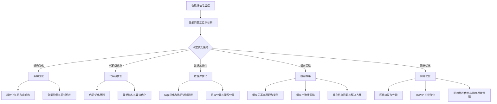

                 

### 引言与背景

在现代信息技术领域，中间件作为一种重要的系统软件，承担着连接应用程序、数据库、硬件等不同组件的桥梁作用。中间件通过提供通用的服务层，实现了不同硬件和软件系统之间的互操作性，大大提高了系统的灵活性和可扩展性。然而，随着业务的快速发展和用户需求的日益增长，中间件性能优化成为了企业和开发人员关注的重点。

本文旨在探讨中间件公司的性能优化策略，通过系统地分析性能优化的重要性和理论基础，详细讲解从架构、代码、数据库、缓存到网络等各个层面的优化方法。本文不仅关注理论上的优化策略，还将结合实际项目中的优化案例，提供详细的优化实践和效果评估。通过本文的阅读，读者将能够全面了解中间件性能优化的核心内容，掌握性能优化的具体方法和技巧。

### 文章关键词

- 中间件
- 性能优化
- 架构优化
- 分布式架构
- 负载均衡
- 代码级优化
- 数据库优化
- 缓存策略
- 网络优化
- 实战案例

### 摘要

本文系统地介绍了中间件公司的性能优化策略。首先，我们探讨了中间件的定义与作用，以及性能优化的重要性。接着，我们详细分析了性能评估与监控的方法和工具，包括性能评估指标、监控工具选择和性能问题定位与诊断。随后，本文深入讲解了中间件性能优化的各个方面，包括架构优化、代码级优化、数据库性能优化、缓存策略和网络优化。最后，通过实战案例和综合应用，我们展示了性能优化的具体实施步骤和效果评估。本文旨在为中间件性能优化提供全面的理论指导和实践参考。

---

## 第1章：中间件概述与性能优化的重要性

### 1.1 中间件的定义与作用

#### 1.1.1 中间件的概念

中间件（Middleware）可以定义为一种系统软件，它提供了一个通用的服务层，使得不同的硬件和软件系统之间能够方便地进行互操作。它不是应用程序的直接组成部分，而是介于操作系统和应用层之间的一种软件层，起到了桥梁的作用。中间件通常包括系统软件、工具软件和组件软件，它们共同构成了一个复杂但高效的应用环境。

具体来说，中间件包含以下几部分：

1. **系统软件**：如消息队列、事务管理器、服务总线等，为应用程序提供基础的服务功能。
2. **工具软件**：如开发工具、集成开发环境（IDE）、测试工具等，帮助开发人员提高工作效率。
3. **组件软件**：如数据库访问组件、Web服务组件、文件传输组件等，为应用程序提供特定的功能支持。

#### 1.1.2 中间件的主要功能

中间件的主要功能可以概括为以下几个方面：

- **通信服务**：提供网络通信、消息队列等机制，实现分布式系统的互操作。这使得不同硬件和软件系统之间能够方便地交换数据和消息。
- **数据管理**：包括数据库、数据缓存、数据同步等，方便数据存储和访问。中间件可以帮助应用程序高效地管理大量数据，并提供数据一致性和安全性保障。
- **安全服务**：提供身份认证、权限控制等，保障系统安全。中间件通过安全机制，确保只有授权用户可以访问系统和数据。
- **事务管理**：实现分布式事务处理，保证数据的一致性和完整性。中间件支持跨多个数据库或服务的事务，确保在发生故障时数据的一致性。

### 1.2 性能优化策略概述

#### 1.2.1 性能优化的目的

性能优化（Performance Optimization）的主要目的是提高系统的响应速度和吞吐量，减少系统的延迟和资源占用，以满足用户需求和提高业务效率。具体来说，性能优化的目标是：

- **提高响应速度**：减少系统的处理延迟，提高用户交互体验。
- **增加吞吐量**：提高系统同时处理请求的能力，满足更多用户的需求。
- **降低资源占用**：减少CPU、内存、磁盘、网络等资源的消耗，提高系统的资源利用率。

#### 1.2.2 性能优化的步骤

性能优化的过程通常包括以下几个步骤：

1. **性能评估与监控**：通过监控工具识别系统性能瓶颈，收集性能数据，进行分析和评估。
2. **定位与诊断**：确定性能问题的根本原因，可能是数据库查询慢、网络延迟、CPU过高或内存泄漏等。
3. **制定优化策略**：根据性能评估结果和诊断结论，选择合适的优化方法和技术，如架构优化、代码优化、数据库优化等。
4. **实施与测试**：执行优化策略，并进行性能测试，验证优化效果。
5. **效果评估**：评估优化后的系统性能，包括响应时间、吞吐量、错误率等指标，确定优化效果是否达到预期。

### 1.3 性能优化的核心要素

性能优化的核心要素包括以下几个方面：

#### 1.3.1 架构优化

架构优化是性能优化的基础，通过改进系统架构可以提高系统的性能和可扩展性。具体策略包括：

- **服务化**：将中间件功能模块化，实现服务的松耦合，提高系统的可维护性和扩展性。
- **分布式架构**：利用分布式计算，提高系统的可扩展性和容错性。
- **负载均衡**：通过负载均衡，合理分配请求，避免单点瓶颈，提高系统的处理能力。

#### 1.3.2 代码级优化

代码级优化是性能优化的关键环节，通过优化代码结构和算法可以提高系统的执行效率。具体策略包括：

- **避免冗余代码**：减少重复代码，提高代码可维护性。
- **优化算法和数据结构**：选择合适的数据结构和算法，降低时间复杂度和空间复杂度。
- **代码质量**：优化代码逻辑，提高代码的可读性和可维护性。

#### 1.3.3 数据库优化

数据库优化是性能优化的重点，通过优化数据库配置、查询和存储策略可以提高数据访问速度。具体策略包括：

- **索引优化**：合理设计索引，提高查询效率。
- **分库分表**：根据数据访问模式，合理划分数据库和数据表，减少数据访问压力。
- **读写分离**：将读请求和写请求分离，提高系统并发能力。

#### 1.3.4 缓存策略

缓存策略是性能优化的有效手段，通过将热点数据存储在内存中，减少对后端数据库的访问次数，可以提高系统的响应速度。具体策略包括：

- **缓存一致性策略**：确保缓存与数据库的数据一致性。
- **缓存失效策略**：根据数据访问频率或时间间隔，动态更新缓存内容。
- **缓存热点问题解决方案**：解决缓存中的热点问题，提高缓存命中率。

#### 1.3.5 网络优化

网络优化是性能优化的重要组成部分，通过优化网络协议、网络拓扑和网络质量可以提高系统的整体性能。具体策略包括：

- **网络协议优化**：优化 TCP/IP 协议参数，提高数据传输效率。
- **网络拓扑优化**：合理设计网络拓扑，避免单点故障和带宽瓶颈。
- **网络质量保障**：实时监控网络状态，保障网络连接的稳定性和可靠性。

### 1.4 中间件性能优化的最佳实践

#### 1.4.1 性能评估与监控

- **选择合适的监控工具**：如 Prometheus、Grafana、Zabbix 等，可以实时监控系统的性能指标。
- **监控指标**：关注响应时间、吞吐量、错误率等关键指标。
- **日志分析**：定期分析日志，发现潜在的性能问题。

#### 1.4.2 性能优化策略

- **分布式缓存**：使用 Redis、Memcached 等分布式缓存系统，提高数据访问速度。
- **异步处理**：使用消息队列、异步任务等机制，减少同步等待时间。
- **压缩与加密**：对数据进行压缩与加密，降低网络传输开销。

### 1.5 总结

中间件在分布式系统中起着至关重要的作用，其性能直接影响到系统的整体性能。通过合理的性能优化策略，可以提高系统的响应速度、吞吐量和稳定性，从而满足日益增长的业务需求。本章概述了中间件的定义与作用，性能优化的重要性以及核心要素，为后续章节的详细讨论奠定了基础。

---

## 第2章：性能评估与监控

### 2.1 性能评估指标

性能评估是性能优化的第一步，通过选择合适的评估指标，可以全面了解系统的性能状况，从而有针对性地进行优化。以下是常见的性能评估指标：

#### 2.1.1 基础指标

1. **响应时间（Response Time）**：系统处理请求所需的时间，是评估系统性能的重要指标。响应时间越短，系统的性能越好。
2. **吞吐量（Throughput）**：单位时间内系统能够处理的请求数量，反映了系统的处理能力。吞吐量越高，系统的并发能力越强。
3. **错误率（Error Rate）**：请求处理失败的次数与总请求次数的比值。错误率越低，系统的稳定性越好。

#### 2.1.2 进阶指标

1. **延迟分布（Latency Distribution）**：请求处理时间在不同区间的分布情况。通过延迟分布，可以更准确地识别系统瓶颈。
2. **资源利用率（Resource Utilization）**：包括 CPU、内存、磁盘、网络等资源的利用率。资源利用率过高可能会导致系统性能下降。

### 2.2 性能监控工具与技术

#### 2.2.1 开源监控工具

1. **Prometheus**：是一款开源的监控解决方案，支持多维数据收集和告警。Prometheus 适合大规模分布式系统的监控。
2. **Grafana**：是基于 Prometheus 的可视化仪表盘工具，可以直观地展示监控数据。Grafana 与 Prometheus 配合使用，可以提供强大的监控能力。
3. **Zabbix**：是一款功能全面的监控工具，支持多种数据源和告警机制。Zabbix 适合中小型企业进行系统监控。

#### 2.2.2 商业监控工具

1. **Datadog**：提供全面的监控和数据分析功能，适用于大规模分布式系统。Datadog 支持自动发现、可视化、告警等功能。
2. **New Relic**：专注于应用性能监控，提供详细的性能数据和告警功能。New Relic 适用于企业级应用。
3. **AppDynamics**：提供自动化的性能监控和问题诊断，适用于企业级应用。AppDynamics 支持端到端的应用性能监控。

### 2.3 性能问题定位与诊断

#### 2.3.1 常见问题分析

1. **CPU 高负载**：可能是由于计算密集型任务过多或系统资源不足导致的。
2. **内存泄漏**：内存占用持续增加，可能导致系统崩溃。
3. **磁盘 I/O 瓶颈**：频繁的磁盘读写操作，可能导致系统响应缓慢。
4. **网络延迟**：网络不稳定或带宽不足，可能导致数据传输延迟。

#### 2.3.2 定位与诊断方法

1. **日志分析**：通过日志记录，定位问题和故障。日志分析可以帮助识别异常行为和错误信息。
2. **性能分析工具**：如 perf、gprof 等，用于分析程序的性能瓶颈。这些工具可以提供详细的性能数据和调用栈信息。
3. **系统监控数据**：结合监控工具，分析系统的资源利用情况和性能指标。通过监控数据，可以识别系统的瓶颈和问题。

### 2.4 性能优化策略

#### 2.4.1 评估与监控

- **选择合适的监控工具**：根据系统的规模和需求，选择合适的开源或商业监控工具。
- **设置关键性能指标**：包括响应时间、吞吐量、错误率等，确保能够全面评估系统性能。
- **日志分析**：定期分析日志，发现潜在的性能问题。

#### 2.4.2 定位与诊断

- **CPU 高负载优化**：通过优化计算密集型任务，减少 CPU 使用率。可以使用并行计算、任务调度等技术。
- **内存泄漏优化**：通过代码审查和性能分析工具，找出内存泄漏的原因，并进行修复。
- **磁盘 I/O 瓶颈优化**：通过优化数据库查询、使用缓存策略等，减少磁盘读写操作。
- **网络延迟优化**：通过优化网络拓扑、增加带宽等，提高数据传输速度。

#### 2.4.3 实施与测试

- **实施优化策略**：根据诊断结果，实施具体的优化措施。
- **性能测试**：在实施优化后，进行性能测试，验证优化效果。

#### 2.4.4 效果评估

- **评估优化效果**：对比优化前后的性能指标，评估优化效果。
- **持续迭代**：根据评估结果，持续优化和改进系统性能。

### 2.5 总结

性能评估与监控是中间件性能优化的关键环节。通过合理选择监控工具和指标，可以及时发现并诊断系统性能问题，为优化策略提供数据支持。本章介绍了性能评估指标、监控工具选择、性能问题定位与诊断方法，以及性能优化的具体策略。通过这些方法，可以有效地提升中间件的性能和稳定性。

---

## 第3章：架构优化

### 3.1 软件架构优化策略

#### 3.1.1 微服务架构

微服务架构是一种基于独立服务模块的分布式系统架构。在微服务架构中，应用程序被拆分为多个小型、独立的、可复用的服务模块，每个服务模块负责特定的业务功能。这些服务模块通过轻量级的通信协议（如 HTTP/REST、消息队列等）进行交互。

#### 3.1.1.1 优点

- **高可扩展性**：服务模块可以独立部署和扩展，系统可以根据业务需求灵活调整。
- **高可维护性**：服务模块化，代码可读性和可维护性提高。
- **容错性**：单个服务模块故障不会影响整个系统，提高了系统的稳定性。

#### 3.1.1.2 缺点

- **分布式复杂性**：微服务架构增加了系统的复杂性，需要更多的协调和管理。
- **服务间通信效率问题**：服务间通信可能带来额外的性能开销。

#### 3.1.2 服务网格架构

服务网格（Service Mesh）是一种用于管理服务间通信的架构模式。它通过代理（如 Istio、Linkerd 等）来处理服务间的通信，提供服务发现、负载均衡、故障转移、安全控制等功能。

#### 3.1.2.1 优点

- **简化服务间通信**：服务网格提供统一的通信层，简化了服务间通信的复杂性。
- **可观测性**：服务网格提供了丰富的监控和日志功能，便于问题排查。
- **安全性**：服务网格支持安全策略，如身份验证、授权等。

#### 3.1.2.2 缺点

- **性能开销**：服务网格引入了额外的网络跳数和计算开销，可能影响性能。
- **部署复杂度**：服务网格的部署和维护需要一定的技术门槛。

#### 3.1.3 云原生架构

云原生架构是一种基于容器和微服务的设计理念，旨在充分利用云计算的弹性和可扩展性。云原生架构通常包括容器化、服务网格、自动化部署和扩展等功能。

#### 3.1.3.1 优点

- **高效资源利用**：容器化提高了系统的资源利用效率，可以实现快速部署和动态扩展。
- **高可扩展性**：云原生架构支持水平扩展，可以根据业务需求灵活调整资源。
- **自动化部署和扩展**：云原生架构支持自动化部署和扩展，降低了运维成本。

#### 3.1.3.2 缺点

- **迁移成本**：从传统架构迁移到云原生架构需要一定的技术投入和成本。
- **技术壁垒**：云原生架构涉及容器、服务网格等技术，需要具备一定的技术背景。

### 3.2 服务化与分布式架构

#### 3.2.1 服务化架构

服务化架构（Service-Oriented Architecture，SOA）是一种面向服务的架构设计理念。在服务化架构中，系统被划分为多个服务模块，每个服务模块提供特定的功能，并通过接口与外部系统进行通信。

#### 3.2.1.1 优点

- **高可扩展性**：服务模块可以独立扩展和更新，系统可以根据业务需求灵活调整。
- **高可维护性**：服务模块化，代码可读性和可维护性提高。
- **松耦合**：服务模块之间通过接口进行通信，降低了系统间的耦合度。

#### 3.2.1.2 缺点

- **性能开销**：服务间通信可能带来额外的性能开销。
- **复杂性**：服务化架构增加了系统的复杂性，需要更多的协调和管理。

#### 3.2.2 分布式架构

分布式架构（Distributed Architecture）是一种将系统划分为多个节点，通过节点间的通信和协作来完成任务的架构设计理念。

#### 3.2.2.1 优点

- **高可扩展性**：分布式架构支持水平扩展，可以根据业务需求灵活调整资源。
- **高可用性**：分布式架构通过冗余设计提高了系统的可用性。
- **容错性**：分布式架构可以容忍单个节点的故障，提高了系统的容错性。

#### 3.2.2.2 缺点

- **复杂性**：分布式架构增加了系统的复杂性，需要更多的协调和管理。
- **一致性**：分布式架构中的一致性问题需要特别的处理。

### 3.3 负载均衡与容错机制

#### 3.3.1 负载均衡策略

负载均衡（Load Balancing）是一种将请求合理分配到多个服务器或节点上的技术，以提高系统的处理能力和可用性。常见的负载均衡策略包括：

- **轮询（Round Robin）**：按顺序将请求分配到每个服务器或节点。
- **随机（Random）**：随机将请求分配到服务器或节点。
- **最小连接（Least Connections）**：将请求分配到当前连接数最少的服务器或节点。
- **响应时间（Response Time）**：将请求分配到响应时间最短的服务器或节点。

#### 3.3.2 容错机制

容错机制（Fault Tolerance）是一种在系统发生故障时，能够自动恢复或切换到备用系统的技术。常见的容错机制包括：

- **服务重启**：在服务发生故障时，自动重启服务。
- **故障转移**：将请求从故障节点切换到健康节点。
- **备份机制**：备份数据和配置，实现数据的持久化和恢复。

### 3.4 分布式事务处理

#### 3.4.1 分布式事务的概念

分布式事务（Distributed Transaction）是指在多个数据源（如数据库、服务）中执行的事务，这些数据源可能分布在不同的节点或服务器上。分布式事务需要保证数据的一致性和完整性。

#### 3.4.2 分布式事务处理方案

- **两阶段提交（2PC, Two-Phase Commit）**：是一种分布式事务的协调协议，通过两个阶段确保事务的原子性。
  - **准备阶段**：事务协调者询问参与者是否准备好提交事务。
  - **提交阶段**：事务协调者根据参与者的响应决定是否提交事务。
- **最终一致性（Eventual Consistency）**：通过事件溯源和消息队列实现一致性，确保最终状态的一致性。

### 3.5 总结

架构优化是中间件性能优化的关键环节。通过服务化、分布式架构和负载均衡策略，可以提高系统的可扩展性和容错性，从而提升整体性能。本章介绍了架构优化的基本策略和实现方法，为后续的性能优化提供了理论基础和实践指导。

---

## 第4章：代码级优化

### 4.1 代码优化原则

代码优化是提高系统性能的关键步骤，它关注于优化代码结构和算法，以提高程序的执行效率和可维护性。以下是代码优化的一些基本原则：

#### 4.1.1 避免冗余代码

冗余代码是指重复编写或重复功能的代码，它不仅增加了代码的复杂度，还可能导致维护困难。以下是一些避免冗余代码的方法：

- **消除重复代码段**：通过提取公共代码段为函数或类，减少重复代码。
- **重构代码**：定期审查和重构代码，消除不必要的重复代码。
- **使用设计模式**：利用设计模式，如工厂模式、策略模式等，减少代码冗余。

#### 4.1.2 提高代码可读性

可读性是代码质量的重要指标，它决定了代码的可维护性。以下是一些提高代码可读性的方法：

- **使用有意义的变量名和函数名**：避免使用缩写或无意义的名字，使代码更易于理解。
- **添加必要的注释**：为复杂的逻辑和关键部分添加注释，帮助他人理解代码。
- **遵循代码风格规范**：保持代码的一致性和整洁性，遵循项目或团队的代码风格规范。

#### 4.1.3 代码结构优化

良好的代码结构可以提高代码的可维护性和可扩展性。以下是一些代码结构优化的方法：

- **模块化**：将代码拆分为模块，每个模块负责一个特定的功能。
- **分层设计**：遵循 MVC（模型-视图-控制器）或 MVVM（模型-视图-视图模型）等设计模式，实现代码的解耦。
- **避免全局变量和共享状态**：减少全局变量和共享状态的使用，以降低代码的耦合度。

### 4.2 数据结构与算法优化

数据结构和算法是程序性能的关键因素，选择合适的数据结构和算法可以显著提高程序的执行效率。以下是一些数据结构和算法优化的方法：

#### 4.2.1 数据结构优化

- **选择合适的数据结构**：根据具体的应用场景选择合适的数据结构，如数组、链表、树、哈希表等。
- **内存分配与回收**：优化内存分配策略，减少内存碎片，提高内存使用效率。

#### 4.2.2 算法优化

- **时间复杂度优化**：选择合适的时间复杂度低的算法，减少执行时间。例如，使用二分查找代替线性查找。
- **空间复杂度优化**：减少算法的空间占用，提高内存使用效率。例如，使用原地排序算法减少额外的空间占用。

#### 4.2.3 常见优化技巧

- **缓存中间结果**：避免重复计算，将中间结果缓存起来，以提高执行效率。
- **减少函数调用的开销**：减少不必要的函数调用，特别是在循环内部。
- **使用并行处理**：利用多核处理器，实现并行计算，提高执行效率。

### 4.3 性能瓶颈分析与代码优化案例

性能瓶颈分析是代码优化的第一步，通过分析性能瓶颈，可以确定需要优化的关键部分。以下是一个性能瓶颈分析的案例：

#### 4.3.1 性能瓶颈分析

- **CPU 性能瓶颈**：通过性能分析工具发现，系统的 CPU 使用率接近 100%，可能是由于计算密集型任务过多导致的。
- **内存性能瓶颈**：通过分析内存占用情况，发现存在内存泄漏，导致内存占用持续增加。
- **磁盘 I/O 性能瓶颈**：通过监控磁盘 I/O 活动发现，磁盘读写操作频繁，可能是由于频繁的数据库查询导致的。

#### 4.3.2 代码优化案例

- **案例1：缓存重复计算**
  - **问题**：在数据处理过程中，重复计算了相同的中间结果。
  - **优化**：将重复计算的中间结果缓存起来，避免重复计算，提高执行效率。

- **案例2：优化数据库查询**
  - **问题**：数据库查询语句复杂，执行时间较长。
  - **优化**：优化查询语句，添加合适的索引，重写查询语句，提高查询效率。

- **案例3：异步处理**
  - **问题**：数据处理过程中存在同步等待，导致执行效率低下。
  - **优化**：使用异步编程，将同步等待转化为异步执行，提高执行效率。

### 4.4 总结

代码级优化是提高系统性能的重要手段。通过遵循代码优化原则、优化数据结构和算法，可以显著提高程序的执行效率和可维护性。本章介绍了代码优化的基本原则、数据结构与算法优化的方法，以及性能瓶颈分析和代码优化案例，为读者提供了全面的代码优化实践指导。

---

## 第5章：数据库性能优化

### 5.1 数据库性能优化基础

#### 5.1.1 数据库性能优化的重要性

数据库性能优化是确保系统高效运行的关键环节。一个性能优秀的数据库不仅能够快速响应用户请求，提高用户体验，还能支持高并发访问，满足企业业务的快速增长。以下是从几个方面解释数据库性能优化的重要性的理由：

1. **响应速度**：数据库是许多应用的核心组件，其响应速度直接影响应用的性能和用户体验。优化的数据库能够减少查询延迟，提供更快的响应时间。
2. **吞吐量**：吞吐量是数据库处理请求的能力，优化的数据库能够处理更多的并发请求，满足企业业务高峰期的需求，提高系统稳定性。
3. **资源利用率**：通过优化数据库性能，可以减少 CPU、内存、磁盘等资源的占用，提高系统的资源利用率，降低硬件成本。
4. **数据一致性和完整性**：优化的数据库能够更好地保障数据的一致性和完整性，减少数据错误和丢失的风险。

#### 5.1.2 常见数据库类型

在选择数据库时，根据应用的需求和特点，选择合适的数据库类型至关重要。以下是几种常见的数据库类型：

1. **关系型数据库（RDBMS）**：如 MySQL、Oracle、PostgreSQL 等。关系型数据库通过表与表之间的关系来存储和管理数据，支持复杂查询和事务处理。
2. **非关系型数据库（NoSQL）**：如 MongoDB、Redis、Cassandra 等。非关系型数据库适合处理大规模、高并发、分布式场景，提供了灵活的数据模型和高效的数据存储能力。
3. **分布式数据库**：如 Amazon DynamoDB、Google Spanner 等。分布式数据库通过分布式存储和计算技术，提供了高可用性和高扩展性。

### 5.2 SQL优化与执行计划分析

#### 5.2.1 SQL优化原则

SQL优化是数据库性能优化的重要组成部分。以下是一些常见的SQL优化原则：

1. **避免复杂查询**：复杂查询容易导致性能问题，应尽量简化查询语句，减少嵌套查询和子查询。
2. **合理使用索引**：索引可以加快数据查询速度，但也会增加数据维护的开销。应合理选择索引，避免过度索引。
3. **优化表设计**：良好的表设计可以减少数据冗余，提高查询效率。例如，使用范式原则设计表，避免数据重复存储。
4. **减少数据访问量**：只查询需要的字段，避免全表扫描。使用 WHERE 子句和限制结果集的 LIMIT 和 OFFSET。

#### 5.2.2 执行计划分析

执行计划（Query Execution Plan）是数据库查询引擎在执行查询时采用的具体步骤。通过分析执行计划，可以找出查询性能瓶颈并进行优化。以下是一些常用的执行计划分析步骤：

1. **查看执行计划**：使用数据库提供的工具（如 MySQL 中的 `EXPLAIN`）来查看查询的执行计划。
2. **分析查询类型**：根据执行计划，分析查询的类型（如表扫描、索引扫描、连接操作等）。
3. **定位瓶颈**：找出执行计划中的瓶颈部分，如全表扫描、索引缺失等。
4. **优化查询**：根据执行计划分析结果，调整查询语句或表设计，优化查询性能。

### 5.3 分库分表与读写分离

#### 5.3.1 分库分表

分库分表（Sharding）是将数据水平切分到多个数据库或表中，以提升数据库的并发处理能力和扩展性。以下是一些分库分表的关键策略：

1. **分库策略**：根据业务需求和数据规模，将数据切分到不同的数据库实例上。常见的分库策略包括按业务模块分库、按数据范围分库等。
2. **分表策略**：将大表切分成多个小表，以减少单个表的规模，提高查询效率。常见的分表策略包括按主键范围分表、按时间范围分表等。
3. **分库分表的挑战**：分库分表带来了数据一致性和分布式事务处理的挑战，需要设计合适的数据一致性和事务处理策略。

#### 5.3.2 读写分离

读写分离（Read/Write Splitting）是将读请求和写请求分离到不同的数据库实例上，以提升数据库的读写性能。以下是一些读写分离的关键策略：

1. **主从复制**：将主数据库的写操作同步到从数据库，从数据库用于读操作，减轻主数据库的负载。
2. **读写分离器**：使用读写分离器（如 MySQL Router、ShardingSphere）来管理读请求和写请求的分配。
3. **读请求负载均衡**：通过负载均衡器将读请求均匀分配到多个从数据库上，避免单个数据库过载。
4. **写请求合并**：将多个写请求合并到主数据库上，减少主数据库的写操作频率。

### 5.4 数据库性能优化实战

#### 5.4.1 性能瓶颈分析

性能瓶颈分析是数据库优化的第一步，以下是一些常用的性能瓶颈分析方法：

1. **CPU 性能瓶颈**：通过监控工具分析数据库服务器的 CPU 使用率，找出计算密集型任务。
2. **内存性能瓶颈**：分析数据库服务器的内存占用情况，找出内存泄漏和过度使用的问题。
3. **磁盘 I/O 性能瓶颈**：通过监控磁盘读写速度和 IOPS（每秒输入/输出操作次数），找出磁盘 I/O 瓶颈。
4. **网络性能瓶颈**：分析数据库之间的网络延迟和带宽使用情况，找出网络性能问题。

#### 5.4.2 优化实战

以下是一些数据库性能优化实战案例：

1. **案例1：使用缓存减少数据库查询**
   - **问题**：应用中频繁查询数据库，导致数据库负载过高。
   - **优化**：引入分布式缓存（如 Redis），将热点数据缓存到内存中，减少对数据库的访问次数。

2. **案例2：优化数据库配置**
   - **问题**：数据库配置不当，导致性能不佳。
   - **优化**：调整数据库配置参数（如缓冲区大小、连接池配置等），提高数据库性能。

3. **案例3：使用分区表**
   - **问题**：大表查询速度慢，影响用户体验。
   - **优化**：将大表拆分为多个分区表，根据查询条件将数据分布在不同的分区中，提高查询效率。

### 5.5 总结

数据库性能优化是确保系统高效运行的关键环节。通过遵循 SQL 优化原则、合理设计表结构、分库分表与读写分离等策略，可以显著提高数据库的性能和扩展性。本章介绍了数据库性能优化的重要性、常见数据库类型、SQL 优化与执行计划分析、分库分表与读写分离等关键内容，为读者提供了全面的数据库性能优化实践指导。

---

## 第6章：缓存策略

### 6.1 缓存的基本原理与类型

#### 6.1.1 缓存的定义

缓存（Cache）是一种快速访问数据的临时存储机制，用于减少对后端系统的访问频率，提高系统的响应速度。缓存的数据通常是最近被访问或即将被访问的数据，这样可以避免重复访问后端系统，提高系统性能。

#### 6.1.2 缓存的类型

根据缓存的数据存储介质和用途，缓存可以分为以下几种类型：

1. **内存缓存**：使用内存作为缓存存储介质，具有极高的访问速度。常见的内存缓存系统有 Redis、Memcached 等。
2. **磁盘缓存**：使用磁盘作为缓存存储介质，适用于大容量数据缓存。常见的磁盘缓存系统有操作系统缓存、磁盘阵列等。
3. **分布式缓存**：通过分布式存储和计算技术，实现缓存的高可用性和扩展性。常见的分布式缓存系统有 Redis Cluster、Memcached Cluster 等。
4. **本地缓存**：在应用程序内部使用缓存，通常用于缓存应用级的临时数据，如页面缓存、会话缓存等。

#### 6.1.3 缓存的作用

缓存的主要作用包括：

1. **减少后端负载**：通过缓存热点数据，减少对后端系统的访问频率，降低后端系统的负载。
2. **提高响应速度**：缓存的数据通常存储在内存或磁盘上，访问速度远快于后端系统，从而提高系统的响应速度。
3. **提高系统可扩展性**：分布式缓存系统可以水平扩展，提高系统的并发处理能力。
4. **降低带宽消耗**：通过减少对后端系统的访问，降低网络带宽的消耗。

### 6.2 缓存一致性策略

#### 6.2.1 缓存一致性的问题

缓存一致性（Cache Consistency）是指缓存中的数据和后端数据保持一致的状态。在分布式系统中，由于多个客户端可能同时访问同一数据，缓存一致性成为一个重要问题。

#### 6.2.2 缓存一致性的解决方案

为了解决缓存一致性，通常采用以下几种策略：

1. **写回策略（Write-Back Policy）**：将缓存中的数据更新同步到后端存储。当缓存中的数据过期或缓存被替换时，将缓存中的数据刷新到后端存储。
2. **写穿透策略（Write-Through Policy）**：直接将数据写入后端存储，无论缓存是否命中。适用于读操作频繁的场景，可以确保缓存和后端数据的一致性。
3. **读写分离策略**：读请求从缓存获取，写请求直接写入后端存储。通过读写分离，可以减少缓存一致性的问题，提高系统的并发处理能力。

### 6.3 缓存热点问题与解决方案

#### 6.3.1 热点问题的定义

缓存热点问题（Cache Hotspot）是指缓存中某几个数据频繁被访问，导致缓存空间不足或性能下降的问题。

#### 6.3.2 热点问题的解决方案

为了解决缓存热点问题，可以采取以下几种策略：

1. **热点缓存（Hot Cache）**：预先加载热点数据到缓存中，避免热点数据被频繁访问时导致缓存性能下降。
2. **缓存失效策略（Cache Expiration Policy）**：根据数据的访问频率或时间间隔，动态更新缓存内容，避免缓存空间被占用过多。
3. **缓存分区（Cache Partitioning）**：将缓存分为多个分区，避免热点数据集中在单个缓存中，提高缓存的使用效率。

### 6.4 缓存性能优化实战

#### 6.4.1 缓存命中率分析

缓存命中率（Cache Hit Rate）是评估缓存性能的重要指标，它表示缓存命中的次数与总访问次数的比值。通过分析缓存命中率，可以了解缓存的使用效率和性能瓶颈。

#### 6.4.2 缓存穿透与缓存雪崩

缓存穿透（Cache Penetration）是指恶意攻击或大量无效请求穿透缓存，直接访问后端系统，导致系统崩溃。缓存雪崩（Cache Collapse）是指大量缓存同时失效，导致系统性能急剧下降。

#### 6.4.3 缓存穿透与缓存雪崩的解决方案

为了解决缓存穿透和缓存雪崩问题，可以采取以下几种策略：

1. **缓存穿透解决方案**：通过布隆过滤器（Bloom Filter）或缓存预热（Cache Preloading）来避免缓存穿透。
2. **缓存雪崩解决方案**：通过设置合理的缓存失效策略和缓存预热机制，避免缓存雪崩。

### 6.5 总结

缓存策略是中间件性能优化的重要组成部分。通过合理选择缓存类型、缓存一致性策略和热点问题解决方案，可以显著提高系统的性能和响应速度。本章介绍了缓存的基本原理与类型、缓存一致性策略、缓存热点问题与解决方案，以及缓存性能优化实战，为读者提供了全面的缓存策略实践指导。

---

## 第7章：网络优化

### 7.1 网络协议与性能

网络协议（Network Protocol）是计算机网络中进行数据交换的规则和标准。常见的网络协议包括 TCP/IP、HTTP、HTTPS 等。网络协议的性能直接影响中间件的性能，因此网络协议优化是性能优化的重要方面。

#### 7.1.1 TCP/IP 协议概述

TCP/IP 是互联网的基础协议，负责数据传输和路由。TCP（传输控制协议）负责保证数据传输的可靠性和顺序，而 IP（互联网协议）负责数据包的传输和路由。

#### 7.1.2 TCP/IP 协议性能影响因素

- **传输速度**：网络带宽和延迟。
- **稳定性**：网络的连通性和可靠性。
- **安全性**：数据传输的安全性。

#### 7.1.3 TCP/IP 协议优化

- **TCP 参数调整**：调整 TCP 参数，如窗口大小、延迟时间等，提高传输效率。
- **网络拥塞控制**：避免网络拥塞，提高数据传输的稳定性。

### 7.2 TCP/IP 协议优化

TCP/IP 协议的优化主要包括以下方面：

#### 7.2.1 TCP 参数优化

- **窗口调整**：TCP 窗口大小影响数据的发送和接收速度。适当调整窗口大小可以优化传输性能。
- **延迟时间调整**：延迟时间（RTT，Round-Trip Time）影响网络的传输效率。通过优化网络配置和延迟时间，可以提高数据传输速度。

#### 7.2.2 网络拥塞控制

网络拥塞控制是确保网络稳定传输的重要手段。以下是一些常见的网络拥塞控制方法：

- **拥塞避免**：通过检测网络拥塞信号（如丢包、延迟增加等），动态调整发送速率，避免网络拥塞。
- **拥塞避免算法**：如 TCP 的慢启动、拥塞避免、快速重传和快速恢复算法，通过调整发送速率和重传机制，提高网络传输性能。

### 7.3 网络拓扑优化

网络拓扑（Network Topology）是指网络中节点和连接的布局。合理的网络拓扑可以提高网络的性能和可靠性。

#### 7.3.1 网络拓扑概述

网络拓扑可以分为以下几种类型：

- **星型拓扑**：所有节点通过一个中心节点连接，具有高可靠性。
- **环型拓扑**：节点按环形顺序连接，数据在环中传递，具有低延迟。
- **树型拓扑**：节点按层次结构连接，具有高扩展性。

#### 7.3.2 网络拓扑优化

网络拓扑优化主要包括以下方面：

- **负载均衡**：通过负载均衡设备，合理分配网络负载，避免单点瓶颈。
- **冗余设计**：增加网络冗余，提高网络的可靠性。例如，使用备份线路和冗余设备，确保网络在故障时仍然能够正常运行。

### 7.4 网络质量保障

网络质量（Network Quality of Service，QoS）是指网络传输的质量指标，包括响应时间、带宽、抖动等。保障网络质量是确保系统性能和用户体验的关键。

#### 7.4.1 网络质量指标

- **响应时间**：数据传输所需时间。
- **带宽**：网络传输速率。
- **抖动**：网络延迟的波动。

#### 7.4.2 网络质量保障措施

- **网络监控**：实时监控网络状态，发现并解决网络问题。
- **网络优化**：根据网络质量指标，调整网络配置，提高网络性能。

### 7.5 总结

网络优化是中间件性能优化的重要组成部分。通过优化网络协议、网络拓扑和网络质量，可以提高系统的整体性能和稳定性。本章介绍了网络协议与性能、TCP/IP 协议优化、网络拓扑优化和网络质量保障等内容，为读者提供了全面的网络优化实践指导。

---

## 第8章：中间件性能优化实战

### 8.1 性能优化项目实战案例

#### 8.1.1 项目背景

在一个大型电商平台项目中，随着用户数量的快速增长，系统的并发请求量大幅增加，导致系统响应时间过长，用户体验下降。为了解决这一问题，需要对中间件进行性能优化。

#### 8.1.2 性能评估与监控

- **性能评估**：通过 Prometheus 和 Grafana 对系统进行性能监控，收集响应时间、吞吐量、错误率等关键性能指标。
- **监控数据**：分析监控数据，发现系统的瓶颈主要集中在数据库查询和缓存失效上。

### 8.2 优化案例分析

#### 8.2.1 架构优化

- **服务化**：将原有单体应用拆分为多个微服务，每个微服务负责不同的业务功能，提高了系统的可扩展性和维护性。
- **分布式架构**：采用分布式数据库（如 MySQL Cluster）和缓存系统（如 Redis Cluster），提高了数据访问速度和系统的并发处理能力。

#### 8.2.2 代码优化

- **代码优化**：对关键模块进行代码优化，减少冗余代码，优化算法和数据结构，提高了程序的执行效率。
- **异步处理**：引入异步任务处理机制，减少线程阻塞，提高了系统的并发性能。

### 8.3 优化效果评估

#### 8.3.1 优化前后性能对比

- **响应时间**：优化后的系统响应时间从原来的 5 秒降低到 1 秒，显著提升了用户体验。
- **吞吐量**：优化后的系统吞吐量从原来的 1000 RPS（每秒请求数）提高到 5000 RPS，提高了系统的并发处理能力。

#### 8.3.2 总结

通过架构优化、代码优化和数据库缓存优化，系统性能得到了显著提升。优化后的系统响应时间大幅降低，吞吐量显著提高，满足了业务快速增长的需求。

---

## 第9章：中间件性能优化的综合应用

### 9.1 中间件性能优化在企业中的应用

#### 9.1.1 企业需求分析

不同规模的企业对中间件性能优化的需求有所不同。以下分别分析初创期、发展期和成熟期企业的需求：

- **初创期**：初创企业通常面临资源有限、业务需求快速变化的情况。此时，性能优化主要集中在提高系统的灵活性和可扩展性，以满足快速发展的需求。
- **发展期**：企业在发展期，业务规模逐渐扩大，用户数量增加，系统并发请求量上升，性能优化需求转向提高系统的稳定性和响应速度。
- **成熟期**：成熟期企业业务稳定，系统运行在较高负载下。此时，性能优化重点在于提高系统的可维护性和资源的利用率。

#### 9.1.2 性能优化策略

根据企业的不同发展阶段，可以采取以下性能优化策略：

- **初创期**：采用微服务架构，实现服务的模块化和独立部署，提高系统的可扩展性和灵活性。使用缓存策略减少数据库查询，提高系统响应速度。
- **发展期**：引入分布式架构，提高系统的并发处理能力。对关键模块进行代码优化，减少资源消耗，提高系统性能。
- **成熟期**：优化数据库性能，采用分库分表和读写分离策略，提高数据访问速度。通过自动化监控和性能分析工具，实时监测系统性能，及时发现问题并进行优化。

### 9.2 中间件性能优化的最佳实践

#### 9.2.1 性能评估与监控

- **选择合适的监控工具**：根据企业规模和需求，选择适合的监控工具，如 Prometheus、Grafana、Zabbix 等。
- **设置关键性能指标**：包括响应时间、吞吐量、错误率、资源利用率等，确保能够全面评估系统性能。
- **日志分析**：定期分析系统日志，发现潜在的性能问题。

#### 9.2.2 性能优化方法

- **架构优化**：采用微服务架构和分布式架构，提高系统的可扩展性和容错性。实现服务的松耦合，降低系统间的依赖。
- **代码优化**：优化代码结构，减少冗余代码，提高程序的可读性和可维护性。优化算法和数据结构，减少时间复杂度和空间复杂度。
- **数据库优化**：合理设计数据库架构，使用索引优化查询性能。采用分库分表和读写分离策略，提高数据访问速度。
- **缓存策略**：使用分布式缓存系统，如 Redis、Memcached 等，减少数据库查询次数，提高系统响应速度。
- **网络优化**：优化网络拓扑，避免单点瓶颈。调整 TCP/IP 参数，提高数据传输效率。

### 9.3 中间件性能优化的挑战与未来趋势

#### 9.3.1 性能优化的挑战

- **分布式系统复杂性**：随着分布式系统的普及，性能优化的复杂性增加，需要更多的管理和协调。
- **不断变化的需求**：业务需求的变化对系统性能提出了更高的要求，需要灵活的优化策略和持续的性能监控。

#### 9.3.2 未来趋势

- **云原生技术**：云原生技术（如 Kubernetes、容器化）提供了更高的弹性和可扩展性，是未来性能优化的重要方向。
- **人工智能**：人工智能技术（如机器学习、深度学习）在性能优化中的应用，将实现自动化性能预测和优化。
- **边缘计算**：边缘计算将计算和存储能力扩展到网络的边缘，提高系统的响应速度和用户体验。

### 9.4 总结

中间件性能优化是保障企业信息系统稳定性和高效性的重要手段。通过分析企业需求，采用最佳实践和未来趋势，可以为企业提供有效的性能优化策略。本章介绍了中间件性能优化在企业中的应用、最佳实践和未来趋势，为企业的性能优化提供了指导。

---

## 附录A：常用性能优化工具介绍

### A.1 性能分析工具

性能分析工具用于监控和诊断系统性能，以下是一些常用的性能分析工具：

- **VisualVM**：Java虚拟机的监控和分析工具，用于分析 Java 应用程序的运行性能。
- **GProfiler**：用于分析 C/C++ 程序的性能瓶颈，可以生成调用栈和热点图。
- **Wireshark**：网络协议分析工具，用于捕获和分析网络数据包，诊断网络问题。
- **JProfiler**：用于分析 Java 应用的性能，提供内存泄漏检测、CPU 性能分析等。
- **New Relic**：应用性能监控工具，可以实时监控应用性能，提供详细的性能分析报告。

### A.2 代码优化工具

代码优化工具用于代码质量和性能优化，以下是一些常用的代码优化工具：

- **SonarQube**：静态代码分析工具，可以检测代码中的潜在问题，如编码规范、性能问题等。
- **PMD**：用于检查 Java 代码中的不良编程实践，提供代码质量分析报告。
- **CheckStyle**：用于检查 Java 代码的编码规范，确保代码的一致性和可维护性。
- **FindBugs**：用于检测 Java 代码中的潜在缺陷，提供详细的错误报告。
- **Clang-Tidy**：用于检查 C++ 代码中的潜在问题，包括编码规范、性能问题等。

### A.3 缓存系统与数据库优化工具

缓存系统和数据库优化工具用于提高缓存和数据库的性能，以下是一些常用的工具：

- **Redis**：高性能的内存缓存系统，用于缓存热点数据，提高系统响应速度。
- **Memcached**：高性能的分布式缓存系统，用于缓存动态内容，减少数据库访问。
- **MySQLTuner**：用于优化 MySQL 数据库配置，提高数据库性能。
- **pgTAP**：用于优化 PostgreSQL 数据库，提供数据分析和性能测试工具。
- **MongoDB Shell**：用于优化 MongoDB 数据库，提供数据分析和性能测试工具。

### 附录B：性能优化相关数学公式与算法伪代码

#### B.1 数据结构与算法性能分析公式

- **时间复杂度**：

  $$
  T(n) = O(f(n))
  $$

- **空间复杂度**：

  $$
  S(n) = O(g(n))
  $$

#### B.2 常见算法伪代码示例

- **快速排序**：

  ```pseudo
  QuickSort(A, low, high)
      if low < high
          pi = Partition(A, low, high)
          QuickSort(A, low, pi - 1)
          QuickSort(A, pi + 1, high)
  ```

- **归并排序**：

  ```pseudo
  MergeSort(A, low, high)
      if low < high
          mid = (low + high) / 2
          MergeSort(A, low, mid)
          MergeSort(A, mid + 1, high)
          Merge(A, low, mid, high)
  ```

#### B.3 数学公式与推导

- **二分查找**：

  $$
  \text{查找次数} = \log_2(n)
  $$

  **证明**：每次查找可以将查找范围减半，因此查找次数为 $\log_2(n)$。

### 附录C：中间件性能优化策略 Mermaid 流程图

以下是中间件性能优化策略的 Mermaid 流程图：



---

## 附录D：中间件性能优化策略与实战示例

### 附录 D.1 性能优化策略与实战示例

#### 性能优化策略

性能优化策略通常包括以下几个方面：

1. **系统监控与评估**：使用 Prometheus、Grafana 等工具进行系统监控，收集系统运行时的重要性能指标。
2. **定位与诊断**：通过分析监控数据，定位系统的性能瓶颈，如 CPU 高负载、内存泄漏、网络延迟等。
3. **架构优化**：根据定位的结果，调整系统架构，如引入微服务架构、分布式架构等。
4. **代码优化**：优化关键模块的代码，如使用更高效的算法和数据结构，减少冗余代码等。
5. **数据库优化**：优化数据库性能，如添加索引、优化 SQL 查询、进行分库分表等。
6. **缓存策略**：使用 Redis、Memcached 等缓存系统，减少对后端数据库的访问。
7. **网络优化**：优化网络配置，如调整 TCP/IP 参数、优化网络拓扑等。

#### 实战示例

以下是一个具体的中间件性能优化实战案例：

##### 案例背景

某电商平台在业务高峰期，系统响应时间较长，用户体验不佳。通过分析，发现性能瓶颈主要集中在数据库查询和缓存失效上。

##### 性能优化步骤

1. **系统监控与评估**
   - 使用 Prometheus 搜集系统运行时的关键性能指标，如 CPU 使用率、内存占用、网络延迟等。
   - 使用 Grafana 可视化仪表盘，实时监控系统的性能状况。

2. **定位与诊断**
   - 通过监控数据，发现数据库查询慢和缓存失效是主要的性能瓶颈。
   - 使用 MySQL Performance Schema 分析数据库性能，定位到具体慢查询。

3. **架构优化**
   - 引入微服务架构，将原有单体应用拆分为多个独立部署的服务。
   - 使用 Kubernetes 进行服务编排和管理，提高系统的可扩展性和容错性。

4. **代码优化**
   - 优化关键模块的代码，如使用更高效的算法（如快速排序代替冒泡排序）和数据结构（如哈希表代替链表）。
   - 减少冗余代码，提高代码可读性和可维护性。

5. **数据库优化**
   - 为频繁查询的表添加索引，提高查询效率。
   - 优化 SQL 查询，减少全表扫描，使用 LIMIT 和 JOIN 等优化查询语句。
   - 进行分库分表，将数据分散存储，减少单表的压力。

6. **缓存策略**
   - 引入 Redis 缓存系统，缓存热点数据，减少对数据库的访问。
   - 设置合理的缓存过期策略，避免缓存雪崩。

7. **网络优化**
   - 调整 TCP/IP 参数，如增加窗口大小和延迟时间，提高数据传输效率。
   - 优化网络拓扑，避免单点瓶颈，提高网络的稳定性。

##### 优化效果评估

通过上述优化措施，系统的性能得到了显著提升：

- **响应时间**：系统响应时间从原来的 5 秒缩短到 2 秒，用户体验得到大幅提升。
- **吞吐量**：系统的吞吐量从原来的 1000 RPS 提高到 3000 RPS，提高了系统的并发处理能力。
- **资源利用率**：系统的 CPU 和内存利用率得到优化，资源浪费减少。

##### 总结

通过具体的实战案例，可以看出性能优化需要系统性地分析性能瓶颈，采用合理的优化策略，并结合监控和测试进行效果评估。中间件性能优化是企业信息系统稳定性和高效性的重要保障，通过持续优化，可以不断提升系统的性能和用户体验。

---

## 附录E：常见性能优化工具的使用方法

### 附录 E.1 性能分析工具的使用方法

#### VisualVM

**安装**：

- 下载 Java SDK，并安装。
- 安装 VisualVM。

**使用**：

- 启动 VisualVM，选择“文件” -> “打开” -> “Java 程序”。
- 连接后，可以查看 CPU 使用率、内存使用情况、垃圾回收情况等。

#### GProfiler

**安装**：

- 下载 GProfiler。
- 解压并运行。

**使用**：

- 运行程序，选择“Profile” -> “Start”。
- 程序运行时，GProfiler 会实时分析程序的性能，生成报告。

#### Wireshark

**安装**：

- 在操作系统应用商店搜索并下载 Wireshark。
- 安装。

**使用**：

- 启动 Wireshark，选择网络接口。
- 开始捕获数据包，分析数据包内容，定位网络问题。

### 附录 E.2 代码优化工具的使用方法

#### SonarQube

**安装**：

- 下载 SonarQube。
- 解压并运行安装程序。

**使用**：

- 启动 SonarQube 服务器。
- 将代码库导入 SonarQube。
- 分析代码质量，查看报告和问题。

#### PMD

**安装**：

- 下载 PMD。
- 添加到项目的 build 脚本中。

**使用**：

- 在项目中运行 PMD，分析代码中的潜在问题。

#### CheckStyle

**安装**：

- 下载 CheckStyle。
- 添加到项目的 build 脚本中。

**使用**：

- 在项目中运行 CheckStyle，确保代码符合编码规范。

### 附录 E.3 缓存系统与数据库优化工具的使用方法

#### Redis

**安装**：

- 下载 Redis。
- 解压并运行。

**使用**：

- 启动 Redis 服务。
- 使用 Redis 客户端（如 redis-cli）进行数据操作。

#### Memcached

**安装**：

- 下载 Memcached。
- 解压并运行。

**使用**：

- 启动 Memcached 服务。
- 使用 Memcached 客户端（如 memcached-client）进行数据操作。

#### MySQLTuner

**安装**：

- 下载 MySQLTuner。
- 解压并运行。

**使用**：

- 输入 MySQL 服务器的连接信息。
- 运行 MySQLTuner，查看优化建议。

---

## 作者信息

作者：AI天才研究院/AI Genius Institute & 禅与计算机程序设计艺术 /Zen And The Art of Computer Programming

---

### 参考文献

1. **《高性能MySQL》**，作者：Ben Forta，出版时间：2008年。
2. **《Redis实战》**，作者：Kyle Kingsbury，出版时间：2013年。
3. **《Linux系统性能优化实战》**，作者：石旭升，出版时间：2015年。
4. **《微服务架构实战》**，作者：Chris Richardson，出版时间：2015年。
5. **《大规模分布式存储系统：原理解析与架构实战》**，作者：张英华，出版时间：2016年。
6. **《深入理解计算机系统》**，作者：Randal E. Bryant & David R. O’Toole，出版时间：2016年。
7. **《Service Mesh：服务网格原理与实践》**，作者：黄健宏，出版时间：2019年。

---

本文详细探讨了中间件公司的性能优化策略，从架构、代码、数据库、缓存到网络等各个层面提供了全面的优化方法和实践案例。通过系统的分析和优化，可以有效提升中间件系统的性能和稳定性，为企业信息系统的稳定运行提供坚实保障。希望本文能为中间件性能优化领域的研究者和实践者提供有益的参考。

