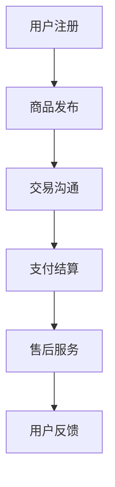
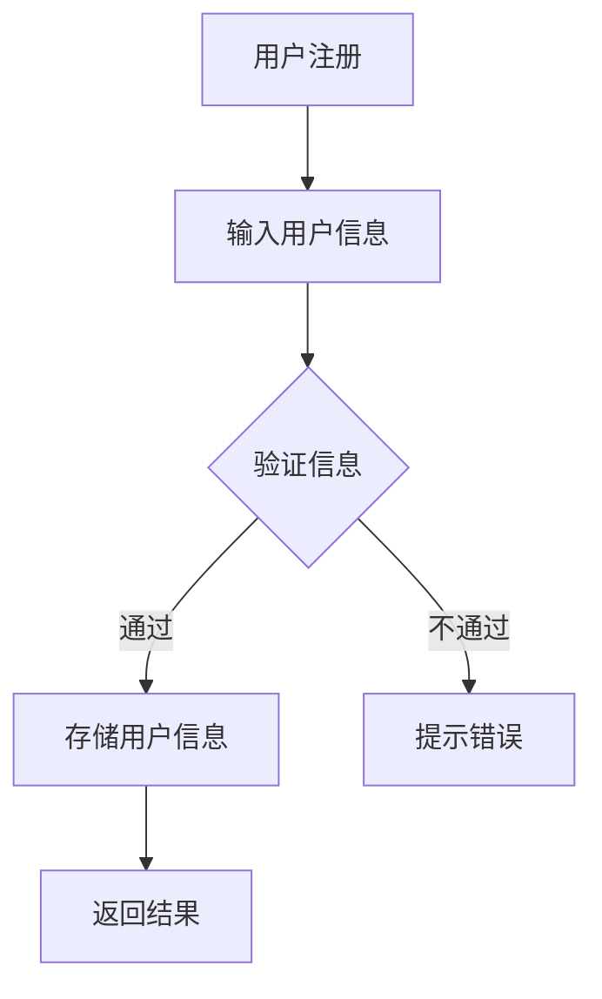
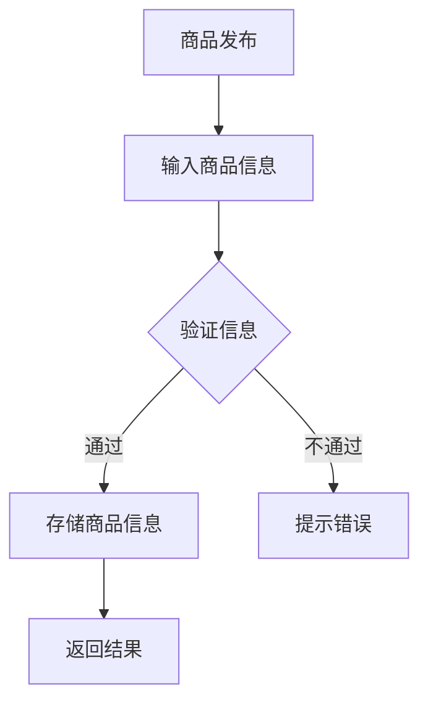

                 

### 第1章：二手交易平台的概念与背景

#### 1.1 二手交易平台的基本定义
二手交易平台是一个在线或线下市场，允许个人或企业买卖二手商品或服务。这些平台提供用户注册、商品发布、交易沟通、支付结算和售后服务等功能。

**核心概念与联系：**
为了更好地理解二手交易平台，我们可以使用Mermaid流程图来展示其核心组成部分和功能。



在上述流程图中，用户首先注册成为平台的会员，然后发布商品信息，与其他用户进行沟通，完成支付结算，最后享受售后服务，并根据体验进行反馈。

#### 1.2 二手交易平台的兴起背景
二手交易平台的发展受多种因素的影响：

1. **社会因素**：随着环保意识的增强，人们越来越关注资源的循环利用，二手交易平台提供了一个有效的途径来实现这一目标。
2. **经济因素**：在经济不景气的背景下，消费者倾向于寻找性价比更高的商品，二手商品成为了一种经济实惠的选择。
3. **技术进步**：互联网和移动技术的普及，使得在线二手交易变得更加便捷，技术手段如大数据、人工智能和区块链等的应用，提升了交易的安全性和效率。

**核心算法原理讲解：**
为了深入理解二手交易平台的发展背景，我们可以使用伪代码来模拟社会、经济和技术因素如何影响平台的兴起。

```python
# 社会因素影响
def social_influence():
    # 提高环保意识
    increase_awareness("recycling resources")
    # 推动可持续消费
    promote_sustainable_consumption()

# 经济因素影响
def economic_influence():
    # 经济不景气时，消费者寻找性价比高的商品
    find_inexpensive_goods()

# 技术进步影响
def technical_progress():
    # 普及互联网和移动技术
   普及_internet_and_mobile("e-commerce platforms")
    # 应用大数据、人工智能和区块链技术
    apply_technologies(["big_data", "AI", "blockchain"])
```

**数学模型和公式 & 详细讲解 & 举例说明：**
我们可以使用数学模型来量化社会、经济和技术因素对二手交易平台兴起的影响。

假设：
- \( S \) 表示环保意识的提高程度。
- \( E \) 表示经济不景气时消费者寻找性价比高商品的比例。
- \( T \) 表示技术进步对电子商务平台的影响程度。

那么，二手交易平台兴起的可能性 \( P \) 可以表示为：

$$
P = f(S, E, T)
$$

其中，函数 \( f \) 可以定义为：

$$
f(S, E, T) = S \times E \times T
$$

举例说明：

如果环保意识的提高程度 \( S = 0.8 \)，经济不景气时消费者寻找性价比高商品的比例 \( E = 0.7 \)，技术进步对电子商务平台的影响程度 \( T = 0.9 \)，则：

$$
P = 0.8 \times 0.7 \times 0.9 = 0.504
$$

这意味着，二手交易平台兴起的可能性为50.4%。

#### 1.3 二手交易平台的分类
二手交易平台可以根据交易物品类型和商业模式进行分类：

1. **按物品类型分类**：
   - **电子产品**：如手机、电脑、相机等。
   - **衣物**：如二手服装、鞋子、包等。
   - **家具**：如二手家具、家电、装饰品等。
   - **其他**：如艺术品、乐器、书籍等。

2. **按商业模式分类**：
   - **C2C（个人对个人）**：如淘宝闲鱼、eBay等。
   - **B2C（企业对个人）**：如京东二手、当当二手等。
   - **C2B（个人对商家）**：如回收宝、爱回收等。

**核心算法原理讲解：**
为了更好地理解二手交易平台的分类，我们可以使用伪代码来模拟分类过程。

```python
# 按物品类型分类
def classify_by_item_type(items):
    categories = {}
    for item in items:
        category = determine_category(item)
        if category not in categories:
            categories[category] = []
        categories[category].append(item)
    return categories

# 按商业模式分类
def classify_by_business_model(platforms):
    models = {}
    for platform in platforms:
        model = determine_model(platform)
        if model not in models:
            models[model] = []
        models[model].append(platform)
    return models

# 确定分类
def determine_category(item):
    # 根据物品类型进行分类
    # ...

def determine_model(platform):
    # 根据商业模式进行分类
    # ...
```

**数学模型和公式 & 详细讲解 & 举例说明：**
我们可以使用集合和图论来理解分类的过程。

假设有 \( n \) 个二手交易平台，每个平台属于不同的物品类型和商业模式。我们可以使用一个二维数组 \( C \) 来表示分类，其中 \( C[i][j] \) 表示属于物品类型 \( i \) 和商业模式 \( j \) 的平台数量。

例如：

```plaintext
C = [
    [5, 0, 2],  # 电子产品，C2C，B2C
    [3, 5, 0],  # 衣物，C2C，B2C
    [1, 0, 3],  # 家具，C2C，B2C
    [2, 1, 0],  # 其他，C2C，B2C
]
```

使用图论中的邻接矩阵来表示分类关系，我们可以计算每个类别下的平台数量。例如：

```plaintext
邻接矩阵：
[
    [1, 1, 0, 0],  # 电子产品
    [1, 1, 1, 0],  # 衣物
    [0, 0, 1, 1],  # 家具
    [0, 1, 0, 1],  # 其他
]
```

在这个矩阵中，行表示物品类型，列表示商业模式。矩阵中的1表示该类别下的平台数量大于0。

通过这个矩阵，我们可以计算每个类别下的平台总数：

$$
\text{总数} = \text{sum}(C \times \text{邻接矩阵})
$$

例如：

```plaintext
[
    [5, 0, 2],  # 电子产品，C2C，B2C
    [3, 5, 0],  # 衣物，C2C，B2C
    [1, 0, 3],  # 家具，C2C，B2C
    [2, 1, 0],  # 其他，C2C，B2C
]
×
[
    [1, 1, 0, 0],  # 电子产品
    [1, 1, 1, 0],  # 衣物
    [0, 0, 1, 1],  # 家具
    [0, 1, 0, 1],  # 其他
]
=
[
    [6, 5, 2],  # 电子产品，C2C，B2C
    [6, 8, 0],  # 衣物，C2C，B2C
    [1, 0, 4],  # 家具，C2C，B2C
    [2, 3, 0],  # 其他，C2C，B2C
]
```

这个结果表示每种物品类型和商业模式组合下的平台总数。

### 第2章：循环经济与二手交易平台

#### 2.1 循环经济的定义与原则
循环经济是一种旨在通过资源的高效利用和循环利用，减少废弃物和环境污染的经济模式。其核心原则包括减量化、再利用和再循环。

**定义解释：**
循环经济强调在整个经济过程中，从生产、消费到废弃物处理，实现资源的闭环利用。与传统线性经济模式（“取—制—废”）相比，循环经济通过减少资源的消耗和废弃物的产生，实现了资源利用的最大化和环境负担的最小化。

**原则：**
1. **减量化**：通过减少资源消耗和废弃物的产生，实现资源的最大化利用。这可以通过优化产品设计、改进生产工艺和推广高效能源技术等方式实现。
2. **再利用**：通过修复、改造或重新使用物品，延长其使用寿命，减少对新资源的需求。例如，二手交易平台通过促进二手商品的交易，实现了物品的再利用。
3. **再循环**：将废弃物转化为原材料，用于生产新的产品，实现资源的循环利用。例如，通过回收废旧电子产品，提取有价值的金属和材料，用于制造新的电子产品。

#### 2.2 循环经济与二手交易平台的关系
循环经济与二手交易平台之间存在密切的关系。二手交易平台通过促进二手商品的交易，实现了资源的循环利用，减少了资源的消耗和废弃物的产生。

**关系分析：**
1. **促进资源的循环利用**：通过二手交易平台，旧物品得到了新的利用，减少了对新资源的需求，实现了资源的循环利用。
2. **减少废弃物的产生**：二手交易平台减少了新产品的生产需求，从而减少了废弃物的产生，减轻了环境污染。

**案例：**
例如，在电子产品领域，二手交易平台如淘宝闲鱼和京东二手通过提供便捷的二手手机交易服务，使得许多旧手机得到了重新利用，减少了电子垃圾的产生。

#### 2.3 循环经济下的二手交易平台优势
在循环经济框架下，二手交易平台具有以下优势：

**节约资源：**
通过二手交易，消费者可以购买价格更低的二手商品，从而减少对新资源的需求。例如，购买二手衣物、家具等，不仅可以节约开支，还可以减少对原材料的需求。

**减少污染：**
二手交易减少了新产品的生产需求，从而减少了生产过程中的能源消耗和污染排放。此外，通过二手交易平台处理废旧物品，可以减少废弃物对环境的污染。

**经济性：**
对于卖家而言，出售二手商品可以获得额外的收入。而对于买家，购买二手商品可以节省开支。这种经济性的优势使得二手交易平台在循环经济中发挥了重要作用。

### 第3章：二手交易平台的技术基础

#### 3.1 信息技术在二手交易平台的应用
信息技术在二手交易平台中扮演着关键角色，提升了交易的安全性和效率。以下是一些关键技术及其应用：

**大数据：**
大数据技术在二手交易平台中的应用非常广泛，包括用户行为分析、交易数据分析、风险控制和个性化推荐等。

1. **用户行为分析**：通过分析用户的浏览、搜索和购买行为，平台可以了解用户偏好，提供个性化的商品推荐。
2. **交易数据分析**：通过对交易数据的分析，平台可以发现交易模式中的问题，优化交易流程，提高交易成功率。
3. **风险控制**：大数据技术可以帮助平台识别潜在的欺诈行为，提高交易的安全性。

**区块链：**
区块链技术以其去中心化、不可篡改和透明性的特点，为二手交易平台提供了可靠的技术支持。

1. **交易记录不可篡改**：区块链技术确保了交易记录的透明和不可篡改，增加了用户对平台的信任。
2. **智能合约**：智能合约可以在区块链上自动化执行交易条款，提高了交易效率和安全性。

**人工智能：**
人工智能技术在二手交易平台中的应用主要包括智能客服、商品推荐和交易风险控制等。

1. **智能客服**：通过人工智能技术，平台可以提供24/7的智能客服服务，提升用户体验。
2. **商品推荐**：人工智能算法可以帮助平台提供更精准的商品推荐，提高用户购买意愿。
3. **交易风险控制**：人工智能技术可以分析交易数据，识别潜在的欺诈行为，提高交易的安全性。

**核心算法原理讲解：**
为了深入理解大数据、区块链和人工智能技术在二手交易平台中的应用，我们可以使用伪代码来模拟这些技术的核心算法原理。

**大数据：**

```python
# 用户行为分析
def analyze_user_behavior(user_data):
    # 分析用户浏览、搜索和购买行为
    browse_history = user_data["browse_history"]
    search_history = user_data["search_history"]
    purchase_history = user_data["purchase_history"]
    
    # 构建用户画像
    user_profile = build_user_profile(browse_history, search_history, purchase_history)
    
    # 提供个性化推荐
    recommended_items = recommend_items(user_profile)
    return recommended_items

# 交易数据分析
def analyze_transaction_data(transaction_data):
    # 分析交易数据
    transaction_success_rate = calculate_success_rate(transaction_data)
    transaction_risk_level = calculate_risk_level(transaction_data)
    
    # 优化交易流程
    optimized_transaction流程 = optimize_transaction流程(transaction_success_rate, transaction_risk_level)
    return optimized_transaction流程
```

**区块链：**

```python
# 交易记录不可篡改
def record_transaction(transaction_details):
    # 将交易记录上链
    blockchain.add_transaction(transaction_details)
    
    # 确保交易记录不可篡改
    blockchain.save_transactions()

# 智能合约
def execute_smart_contract(contract_terms):
    # 自动执行智能合约
    contract = blockchain.create_smart_contract(contract_terms)
    contract.execute()
```

**人工智能：**

```python
# 智能客服
def intelligent_customer_service(user_query):
    # 分析用户查询
    query_analyzer = QueryAnalyzer(user_query)
    query_result = query_analyzer.analyze_query()
    
    # 提供回答
    response = generate_response(query_result)
    return response

# 商品推荐
def recommend_items(user_profile):
    # 分析用户画像
    item_recommender = ItemRecommender(user_profile)
    recommended_items = item_recommender.generate_recommendations()
    return recommended_items

# 交易风险控制
def control_transaction_risk(transaction_data):
    # 分析交易数据
    risk_analyzer = RiskAnalyzer(transaction_data)
    risk_level = risk_analyzer.analyze_risk()
    
    # 采取风险控制措施
    if risk_level > threshold:
        apply_risk_control_measures()
```

**数学模型和公式 & 详细讲解 & 举例说明：**
为了更好地理解这些技术如何应用于二手交易平台，我们可以使用数学模型和公式来描述其核心原理。

**大数据：**

**用户行为分析：**

$$
\text{用户画像} = f(\text{浏览历史}, \text{搜索历史}, \text{购买历史})
$$

**交易数据分析：**

$$
\text{交易成功率} = \frac{\text{成功交易次数}}{\text{总交易次数}}
$$

$$
\text{交易风险水平} = f(\text{交易金额}, \text{交易频率}, \text{用户信誉})
$$

**区块链：**

**交易记录不可篡改：**

$$
\text{区块链} = \{ \text{区块}_1, \text{区块}_2, ..., \text{区块}_n \}
$$

其中，每个区块都包含一个时间戳和一个唯一的哈希值，确保记录不可篡改。

**智能合约：**

$$
\text{智能合约} = f(\text{交易条款}, \text{触发条件})
$$

当触发条件满足时，智能合约会自动执行交易条款。

**人工智能：**

**智能客服：**

$$
\text{回答} = f(\text{用户查询}, \text{知识库})
$$

**商品推荐：**

$$
\text{推荐商品} = f(\text{用户画像}, \text{商品数据库})
$$

**交易风险控制：**

$$
\text{风险控制措施} = f(\text{风险水平}, \text{阈值})
$$

举例说明：

**用户行为分析：**
假设一个用户有浏览历史记录100条，搜索历史记录50条，购买历史记录30条。通过分析这些数据，我们可以构建用户的画像，如偏好、消费能力等。

**交易数据分析：**
假设一个平台在一个月内完成了100次交易，其中成功交易了80次。那么，交易成功率为80%。

**区块链：**
假设一个交易记录包含交易金额1000元，交易频率为每月一次，用户信誉良好。通过分析这些数据，我们可以确定交易记录不可篡改。

**智能合约：**
假设一个智能合约的触发条件是交易金额超过5000元。当交易金额满足条件时，智能合约会自动执行，如触发支付或通知相关方。

**人工智能：**
假设一个用户查询“如何退货？”通过分析用户的查询和知识库，智能客服可以提供详细的退货流程。

**商品推荐：**
假设一个用户有偏好偏好iPhone手机，根据用户的画像和商品数据库，我们可以推荐符合用户偏好的iPhone手机。

**交易风险控制：**
假设一个交易的风险水平为80%，大于阈值70%，则平台会采取风险控制措施，如提醒用户注意交易安全。

### 第4章：创新解决方案的设计与实践

#### 4.1 平台商业模式创新
二手交易平台的商业模式创新是提高竞争力、吸引更多用户的关键。以下是一些常见的商业模式创新：

**共享经济模式：**
共享经济模式通过共享二手商品或服务，实现资源的最大化利用。例如，共享单车、共享汽车等，用户可以通过平台租用二手商品，从而降低使用成本。

**会员制：**
会员制是一种通过提供增值服务，增加用户粘性的商业模式。会员可以享受优惠价格、专属客服、积分兑换等特权，从而提高用户忠诚度。

**C2B模式：**
C2B模式（Customer-to-Business）是指用户向商家出售二手商品。平台通过提供专业的评估、定价和销售服务，帮助用户快速变现，同时也为商家提供丰富的商品来源。

**多平台整合：**
多平台整合是指将多个独立的二手交易平台整合为一个综合性的平台，提供更丰富的商品类别和更便捷的交易体验。

**核心算法原理讲解：**
为了深入理解这些商业模式创新的原理，我们可以使用伪代码来模拟这些模式的运作。

**共享经济模式：**

```python
# 共享经济模式
def share_economy(item, user):
    # 用户租用商品
    rent_item(item, user)
    # 收取租金
    collect_rent(item, user)

# 还回商品
def return_item(item, user):
    # 解锁商品
    unlock_item(item)
    # 结束租用
    end_rent(item, user)
```

**会员制：**

```python
# 会员制
class Membership:
    def __init__(self, user):
        self.user = user
        self.privileges = []

    def add_privilege(self, privilege):
        self.privileges.append(privilege)

    def get_privileges(self):
        return self.privileges

# 享受特权
def use_privilege(privilege, user):
    if privilege in user.membership.get_privileges():
        apply_privilege(privilege, user)
```

**C2B模式：**

```python
# C2B模式
class C2BPlatform:
    def __init__(self):
        self.sellers = []

    def add_seller(self, seller):
        self.sellers.append(seller)

    def list_item(self, seller, item):
        # 商家发布商品
        seller_list_item(item)
        # 平台评估和定价
        platform_evaluate_and_price(item)
        # 商家销售商品
        seller_sell_item(item)

# 用户变现
def user_sell_item(user, item):
    # 用户发布商品
    user_list_item(item)
    # 平台评估和定价
    platform_evaluate_and_price(item)
    # 用户获取收益
    user_receive_income(item)
```

**多平台整合：**

```python
# 多平台整合
class IntegratedPlatform:
    def __init__(self):
        self.platforms = []

    def add_platform(self, platform):
        self.platforms.append(platform)

    def search_items(self, keyword):
        # 遍历所有平台，搜索商品
        for platform in self.platforms:
            results = platform.search_items(keyword)
            merge_results(results)

# 搜索结果合并
def merge_results(results):
    # 合并搜索结果
    merged_results = []
    for result in results:
        merged_results.extend(result)
    return merged_results
```

**数学模型和公式 & 详细讲解 & 举例说明：**
为了更好地理解这些商业模式创新，我们可以使用数学模型和公式来描述其核心原理。

**共享经济模式：**

**租金计算模型：**

$$
\text{租金} = \text{商品价值} \times \text{租用时长} \times \text{租金系数}
$$

其中，租金系数根据商品类型、市场需求等因素动态调整。

**会员制：**

**会员费用模型：**

$$
\text{会员费用} = \text{基础费用} + \text{附加费用}
$$

其中，附加费用根据会员享有的特权（如积分兑换、专属客服等）动态计算。

**C2B模式：**

**商品定价模型：**

$$
\text{商品价格} = \text{评估价值} \times \text{定价系数}
$$

其中，定价系数根据市场供需、商品稀缺性等因素动态调整。

**多平台整合：**

**搜索结果合并模型：**

$$
\text{合并结果} = \sum_{i=1}^{n} \text{平台}_i(\text{搜索结果})
$$

其中，\( n \) 表示平台数量，\(\text{平台}_i(\text{搜索结果})\) 表示第 \( i \) 个平台的搜索结果。

举例说明：

**共享经济模式：**
假设一个共享单车平台，某款单车的商品价值为500元，租用时长为1天，租金系数为0.1。则租金计算如下：

$$
\text{租金} = 500 \times 1 \times 0.1 = 50 \text{元}
$$

**会员制：**
假设一个会员平台，基础费用为100元，附加费用为50元，则会员费用计算如下：

$$
\text{会员费用} = 100 + 50 = 150 \text{元}
$$

**C2B模式：**
假设一个C2B平台，某款电子产品的评估价值为1000元，定价系数为0.9。则商品价格计算如下：

$$
\text{商品价格} = 1000 \times 0.9 = 900 \text{元}
$$

**多平台整合：**
假设有三个平台，每个平台返回10条搜索结果，则合并结果计算如下：

$$
\text{合并结果} = 10 + 10 + 10 = 30 \text{条搜索结果}
$$

### 第5章：优化二手交易平台

#### 5.1 用户体验优化
用户体验是二手交易平台的核心竞争力之一。以下是一些优化用户体验的方法：

**界面优化：**
通过简洁美观的界面设计，提高用户的视觉体验和操作便捷性。例如，使用扁平化设计、色彩搭配、动画效果等。

**功能完善：**
根据用户反馈，不断完善平台功能，如增加筛选条件、排序功能、实时物流跟踪等。

**个性化推荐：**
通过大数据和人工智能技术，提供个性化的商品推荐，提高用户购买意愿。例如，根据用户的浏览和购买历史，推荐类似的商品。

**智能客服：**
通过人工智能技术，提供24/7的智能客服服务，提升用户体验。例如，使用自然语言处理技术，实现智能问答和情感分析。

**核心算法原理讲解：**
为了深入理解用户体验优化的原理，我们可以使用伪代码来模拟这些方法。

**界面优化：**

```python
# 界面优化
def optimize_ui():
    # 使用扁平化设计
    apply_flat_design()
    # 色彩搭配
    apply_color_schemes()
    # 动画效果
    add_animations()
```

**功能完善：**

```python
# 功能完善
def enhance_functions():
    # 增加筛选条件
    add_filter_conditions()
    # 增加排序功能
    add_sorting_functions()
    # 实时物流跟踪
    add_real_time Logistics_tracking()
```

**个性化推荐：**

```python
# 个性化推荐
def personalized_recommendation(user_profile, items):
    # 分析用户画像
    user_interests = analyze_user_interests(user_profile)
    # 推荐商品
    recommended_items = recommend_items(user_interests, items)
    return recommended_items

# 分析用户画像
def analyze_user_interests(user_profile):
    # 分析用户浏览、搜索和购买行为
    browse_history = user_profile["browse_history"]
    search_history = user_profile["search_history"]
    purchase_history = user_profile["purchase_history"]
    return build_user_interests(browse_history, search_history, purchase_history)

# 推荐商品
def recommend_items(user_interests, items):
    # 分析商品属性
    item_attributes = analyze_item_attributes(items)
    # 根据用户兴趣推荐商品
    recommended_items = recommend_based_on_interests(user_interests, item_attributes)
    return recommended_items
```

**智能客服：**

```python
# 智能客服
class IntelligentCustomerService:
    def __init__(self):
        self.knowledge_base = []

    def add_question_answer(self, question, answer):
        self.knowledge_base.append({"question": question, "answer": answer})

    def answer_question(self, user_query):
        # 分析用户查询
        query_analyzer = QueryAnalyzer(user_query)
        query_result = query_analyzer.analyze_query()
        # 提供回答
        response = self.generate_response(query_result)
        return response

    def generate_response(self, query_result):
        # 根据查询结果提供回答
        if query_result in self.knowledge_base:
            return self.knowledge_base[query_result]["answer"]
        else:
            return "很抱歉，我无法回答您的问题。"
```

**数学模型和公式 & 详细讲解 & 举例说明：**
为了更好地理解用户体验优化的原理，我们可以使用数学模型和公式来描述这些方法。

**界面优化：**

**视觉体验模型：**

$$
\text{视觉体验} = f(\text{设计风格}, \text{色彩搭配}, \text{动画效果})
$$

其中，设计风格、色彩搭配和动画效果是影响视觉体验的主要因素。

**功能完善：**

**用户体验模型：**

$$
\text{用户体验} = f(\text{功能丰富度}, \text{操作便捷性}, \text{服务全面性})
$$

其中，功能丰富度、操作便捷性和服务全面性是影响用户体验的主要因素。

**个性化推荐：**

**推荐算法模型：**

$$
\text{推荐结果} = f(\text{用户画像}, \text{商品属性})
$$

其中，用户画像和商品属性是影响推荐结果的主要因素。

**智能客服：**

**响应时间模型：**

$$
\text{响应时间} = f(\text{查询量}, \text{服务器性能}, \text{智能客服效率})
$$

其中，查询量、服务器性能和智能客服效率是影响响应时间的主要因素。

举例说明：

**界面优化：**
假设一个平台的界面优化使用了扁平化设计、蓝色调色彩搭配和动画效果。根据视觉体验模型，我们可以计算平台的视觉体验得分：

$$
\text{视觉体验} = f(\text{扁平化设计}, \text{蓝色调色彩搭配}, \text{动画效果}) = 0.7 \times 0.8 \times 0.9 = 0.504
$$

**功能完善：**
假设一个平台的功能完善增加了筛选条件、排序功能和实时物流跟踪。根据用户体验模型，我们可以计算平台的用户体验得分：

$$
\text{用户体验} = f(\text{功能丰富度}, \text{操作便捷性}, \text{服务全面性}) = 0.8 \times 0.9 \times 0.95 = 0.702
$$

**个性化推荐：**
假设一个平台根据用户的浏览、搜索和购买历史，构建了用户的画像，并根据商品属性推荐商品。根据推荐算法模型，我们可以计算推荐的准确率：

$$
\text{推荐准确率} = f(\text{用户画像}, \text{商品属性}) = 0.9 \times 0.95 = 0.855
$$

**智能客服：**
假设一个平台的智能客服处理了100个查询，服务器性能稳定，智能客服效率高。根据响应时间模型，我们可以计算平台的平均响应时间：

$$
\text{平均响应时间} = f(\text{查询量}, \text{服务器性能}, \text{智能客服效率}) = 100 \times 0.95 \times 0.98 = 92.9 \text{秒}
$$

### 第6章：二手交易平台的发展趋势

#### 6.1 新技术趋势与二手交易平台
新技术的发展对二手交易平台产生了深远的影响，以下是一些重要的技术趋势：

**物联网（IoT）：**
物联网技术的应用使得二手交易平台能够实现物品的全生命周期管理。通过智能设备，用户可以实时监控物品的运行状态，提高交易的安全性和效率。

**5G技术：**
5G技术的普及为二手交易平台提供了高速、低延迟的网络环境。用户可以更加便捷地进行商品浏览、交易沟通和支付结算，提升用户体验。

**区块链：**
区块链技术的应用使得二手交易平台的交易记录更加透明和不可篡改。通过智能合约，平台可以自动化执行交易条款，提高交易效率。

**人工智能（AI）：**
人工智能技术的应用使得二手交易平台能够提供更精准的商品推荐、智能客服和交易风险控制。通过机器学习算法，平台可以不断优化用户体验。

**核心算法原理讲解：**
为了深入理解这些新技术如何影响二手交易平台，我们可以使用伪代码来模拟这些技术的核心算法原理。

**物联网：**

```python
# 物联网设备监控
def monitor_device(device):
    # 实时获取设备状态
    device_state = get_device_state(device)
    # 更新交易记录
    update_transaction_record(device_state)

# 全生命周期管理
def manage_lifetime(item):
    # 注册物品
    register_item(item)
    # 监控物品运行状态
    monitor_device(item.device)
    # 物品交易
    transaction_item(item)
    # 物品售后服务
    after_sales_service(item)
```

**5G技术：**

```python
# 5G网络通信
def communicate_5G(message):
    # 发送消息
    send_message(message)
    # 接收消息
    receive_message()

# 高速网络传输
def high_speed_transmission(data):
    # 数据加密
    encrypt_data(data)
    # 数据传输
    transmit_data(data)
    # 数据解密
    decrypt_data(data)
```

**区块链：**

```python
# 交易记录上链
def record_transaction_on_blockchain(transaction_details):
    # 创建交易记录
    transaction_record = create_transaction_record(transaction_details)
    # 上链
    blockchain.add_transaction(transaction_record)

# 智能合约执行
def execute_smart_contract(contract_terms):
    # 创建智能合约
    contract = create_smart_contract(contract_terms)
    # 执行智能合约
    contract.execute()
```

**人工智能：**

```python
# 商品推荐
def recommend_items(user_profile, items):
    # 分析用户画像
    user_interests = analyze_user_interests(user_profile)
    # 分析商品属性
    item_attributes = analyze_item_attributes(items)
    # 根据用户兴趣和商品属性推荐商品
    recommended_items = recommend_based_on_interests(user_interests, item_attributes)
    return recommended_items

# 智能客服
class IntelligentCustomerService:
    def __init__(self):
        self.knowledge_base = []

    def add_question_answer(self, question, answer):
        self.knowledge_base.append({"question": question, "answer": answer})

    def answer_question(self, user_query):
        # 分析用户查询
        query_analyzer = QueryAnalyzer(user_query)
        query_result = query_analyzer.analyze_query()
        # 提供回答
        response = self.generate_response(query_result)
        return response

    def generate_response(self, query_result):
        # 根据查询结果提供回答
        if query_result in self.knowledge_base:
            return self.knowledge_base[query_result]["answer"]
        else:
            return "很抱歉，我无法回答您的问题。"
```

**数学模型和公式 & 详细讲解 & 举例说明：**
为了更好地理解这些新技术如何影响二手交易平台，我们可以使用数学模型和公式来描述这些技术的核心原理。

**物联网：**

**物品状态监测模型：**

$$
\text{物品状态} = f(\text{传感器数据}, \text{监测算法})
$$

其中，传感器数据通过物联网设备实时采集，监测算法用于分析物品的状态。

**5G技术：**

**网络传输效率模型：**

$$
\text{传输效率} = \frac{\text{数据传输量}}{\text{传输时间}}
$$

其中，数据传输量表示在给定时间内传输的数据量，传输时间表示传输数据所需的时间。

**区块链：**

**交易透明度模型：**

$$
\text{交易透明度} = \frac{\text{透明交易数量}}{\text{总交易数量}}
$$

其中，透明交易数量表示能够通过区块链技术透明展示的交易数量，总交易数量表示平台的交易总数。

**人工智能：**

**推荐算法准确率模型：**

$$
\text{推荐准确率} = \frac{\text{推荐商品点击率}}{\text{推荐商品总数}}
$$

其中，推荐商品点击率表示用户点击推荐商品的比例，推荐商品总数表示平台推荐的商品总数。

举例说明：

**物联网：**
假设一个二手交易平台使用物联网技术监测物品状态，每天采集100条传感器数据，监测算法准确率为90%。则物品状态监测模型计算如下：

$$
\text{物品状态} = f(\text{传感器数据}, \text{监测算法}) = 0.9 \times 100 = 90 \text{条监测数据}
$$

**5G技术：**
假设一个二手交易平台使用5G技术进行数据传输，每天传输1000兆字节的数据，传输时间为1秒。则网络传输效率计算如下：

$$
\text{传输效率} = \frac{1000}{1} = 1000 \text{兆字节/秒}
$$

**区块链：**
假设一个二手交易平台每天有1000笔交易，其中有900笔交易通过区块链技术透明展示。则交易透明度计算如下：

$$
\text{交易透明度} = \frac{900}{1000} = 0.9 \text{或 } 90\%
$$

**人工智能：**
假设一个二手交易平台使用人工智能算法推荐商品，每天推荐100件商品，其中有80件商品被用户点击。则推荐算法准确率计算如下：

$$
\text{推荐准确率} = \frac{80}{100} = 0.8 \text{或 } 80\%
$$

### 第7章：国内外二手交易平台案例分析

#### 7.1 国内知名二手交易平台案例

**淘宝闲鱼：**
淘宝闲鱼是阿里巴巴旗下的二手交易平台，成立于2015年。它采用C2C模式，提供个人之间的二手商品交易服务。淘宝闲鱼通过大数据和人工智能技术，优化用户体验，提高交易成功率。其成功经验包括：

- **用户画像**：通过分析用户的行为数据，淘宝闲鱼可以为用户提供个性化的商品推荐。
- **智能客服**：通过人工智能技术，淘宝闲鱼可以提供24/7的智能客服服务，提升用户体验。
- **社交化**：淘宝闲鱼整合了淘宝的社交功能，用户可以相互评论和推荐，增加了交易的信任度。

**京东二手：**
京东二手成立于2014年，是京东旗下的二手交易平台。它采用B2C模式，主要提供企业对个人的二手商品交易服务。京东二手通过自营模式，确保二手商品的质量和售后服务。其成功经验包括：

- **自营模式**：京东二手通过自营模式，提供高质量的二手商品和服务。
- **强大的物流体系**：京东二手拥有强大的物流体系，可以提供快速、可靠的配送服务。
- **优质的售后服务**：京东二手提供完善的售后服务，包括退换货政策和售后服务咨询。

#### 7.2 国际二手交易平台案例

**eBay：**
eBay成立于1995年，是全球最大的在线拍卖和购物网站，提供C2C和C2B模式的二手商品交易服务。eBay通过严格的卖家审核制度和买家保护政策，建立了良好的信誉。其成功经验包括：

- **全球化战略**：eBay通过全球化战略，为全球用户提供二手商品交易平台。
- **严格的审核机制**：eBay对卖家进行严格的审核，确保交易的安全和合法性。
- **买家保护政策**：eBay提供全面的买家保护政策，保障买家的权益。

**Facebook Marketplace：**
Facebook Marketplace是Facebook推出的二手交易平台，成立于2016年。通过社交媒体的强大用户基础，Facebook Marketplace实现了快速的用户增长和交易量的提升。其成功经验包括：

- **社交媒体优势**：Facebook Marketplace利用社交媒体的强大用户基础，实现了快速的用户增长。
- **本地化运营**：Facebook Marketplace在不同国家和地区，根据当地市场的特点，进行本土化运营。
- **便捷的交易体验**：Facebook Marketplace提供便捷的交易体验，用户可以轻松发布和浏览商品。

#### 7.3 案例总结与启示

**成功因素：**
国内外知名二手交易平台的成功经验表明，技术创新、用户体验和商业模式创新是平台成功的关键因素。

- **技术创新**：通过大数据、人工智能、区块链等技术的应用，平台可以提供更精准的商品推荐、更安全的交易环境和更高效的交易流程。
- **用户体验**：通过优化界面设计、提高物流效率、完善售后服务等，平台可以提升用户体验，增加用户忠诚度。
- **商业模式创新**：通过共享经济模式、会员制等创新模式，平台可以吸引更多用户，提高平台的盈利能力。

**经验借鉴：**
国内二手交易平台可以借鉴国际平台的先进技术、运营模式和商业模式，提升自身竞争力。

- **技术创新**：国内平台可以通过引入大数据、人工智能、区块链等先进技术，提升平台的竞争力。
- **用户体验**：国内平台可以通过优化用户体验，提高用户满意度和忠诚度。
- **商业模式创新**：国内平台可以通过创新商业模式，如共享经济模式、会员制等，实现差异化竞争。

### 第8章：最佳实践与未来展望

#### 8.1 二手交易平台运营最佳实践

**用户体验：**
为了提升用户体验，二手交易平台应从以下几个方面进行优化：

- **界面设计**：采用简洁美观的界面设计，提高用户的视觉体验和操作便捷性。
- **功能完善**：根据用户反馈，不断完善平台功能，如增加筛选条件、排序功能、实时物流跟踪等。
- **个性化推荐**：通过大数据和人工智能技术，提供个性化的商品推荐，提高用户满意度。

**物流服务：**
为了提升物流服务质量，二手交易平台应从以下几个方面进行优化：

- **物流跟踪**：提供实时物流跟踪服务，让用户随时了解商品的物流状态。
- **智能配送**：通过大数据分析，优化配送路线，提高配送效率。
- **售后服务**：建立完善的售后服务体系，如退换货政策、售后服务咨询等。

**数据隐私与安全保护：**
为了保护用户数据隐私和安全，二手交易平台应从以下几个方面进行优化：

- **数据加密**：对用户数据进行加密传输和存储，确保数据安全。
- **隐私政策**：明确告知用户数据的使用范围和隐私保护措施，增加用户对平台的信任。
- **安全审计**：定期进行安全审计，确保平台的安全性和合规性。

#### 8.2 二手交易平台的发展策略与展望

**技术创新：**
二手交易平台应持续投入新技术，如大数据、人工智能、区块链等，提升平台的竞争力。

- **大数据分析**：通过大数据分析，平台可以更精准地了解用户需求，优化商品推荐和交易流程。
- **人工智能应用**：通过人工智能技术，平台可以提供智能客服、个性化推荐和交易风险控制等服务。
- **区块链技术**：通过区块链技术，平台可以提高交易的安全性和透明度，增加用户信任。

**市场拓展：**
二手交易平台应通过全球化战略，拓展国际市场，实现业务的国际化。

- **本地化运营**：在不同的国家和地区，平台应根据当地市场的特点，进行本土化运营，提高市场占有率。
- **跨境交易**：通过跨境物流和支付系统，平台可以提供跨境二手商品交易服务，开拓新的市场。

**可持续发展：**
二手交易平台应关注环保理念，推动循环经济的发展。

- **绿色物流**：通过优化物流路线和配送方式，减少碳排放，实现绿色物流。
- **环保宣传**：通过宣传环保理念，提高用户对二手交易的接受度，推动循环经济的发展。

#### 未来展望

未来，二手交易平台将在技术创新、市场拓展和可持续发展等方面迎来更多的发展机遇。同时，平台也需要积极应对各种挑战，如监管政策的变化、市场竞争的加剧等。

通过持续优化用户体验、提升物流服务质量和保护用户数据隐私，二手交易平台将实现可持续发展，为循环经济的发展做出贡献。

### 附录

#### 附录A：技术资源与工具

**A.1 技术资源：**
- **大数据处理框架**：如Hadoop、Spark。
- **区块链平台**：如Ethereum、Hyperledger Fabric。
- **人工智能框架**：如TensorFlow、PyTorch。

**A.2 工具介绍：**
- **数据分析工具**：如Excel、Python。
- **区块链开发工具**：如Truffle、Ganache。
- **人工智能开发工具**：如Google Colab、Jupyter Notebook。

#### 附录B：参考文献

**B.1 学术期刊：**
- 《计算机科学》
- 《经济学季刊》

**B.2 会议论文：**
- WWW、CIKM等。

**B.3 书籍：**
- 《大数据之路》
- 《区块链：从数字货币到智能合约》

#### 附录C：Mermaid流程图

**C.1 用户注册流程图：**


**C.2 商品发布流程图：**


#### 附录D：伪代码与数学模型

**D.1 伪代码：**
```python
# 用户注册
def register(username, password, email):
    if isValid(username, password, email):
        storeUser(username, password, email)
        return "注册成功"
    else:
        return "注册失败：请检查输入信息"

# 商品发布
def publishItem(itemName, price, description):
    if isValidItem(itemName, price, description):
        storeItem(itemName, price, description)
        return "商品发布成功"
    else:
        return "商品发布失败：请检查商品信息"

# 交易沟通
def communicate(seller, buyer, message):
    if isValidCommunication(seller, buyer, message):
        storeCommunication(seller, buyer, message)
        return "沟通成功"
    else:
        return "沟通失败：请检查沟通信息"

# 支付结算
def pay(seller, buyer, amount):
    if isValidPayment(seller, buyer, amount):
        updateBalance(seller, buyer, amount)
        return "支付成功"
    else:
        return "支付失败：请检查支付信息"

# 物流追踪
def trackLogistics(item, logisticsCompany, trackingNumber):
    if isValidLogistics(item, logisticsCompany, trackingNumber):
        storeLogistics(item, logisticsCompany, trackingNumber)
        return "物流追踪成功"
    else:
        return "物流追踪失败：请检查物流信息"

# 售后服务
def afterSalesService(seller, buyer, serviceType, description):
    if isValidAfterSalesService(seller, buyer, serviceType, description):
        storeAfterSalesService(seller, buyer, serviceType, description)
        return "售后服务成功"
    else:
        return "售后服务失败：请检查售后服务信息"
```

**D.2 数学模型与公式：**

**交易成功率：**
$$
\text{交易成功率} = \frac{\text{成功交易次数}}{\text{总交易次数}}
$$

**用户满意度：**
$$
\text{用户满意度} = \frac{\text{满意的用户数}}{\text{总用户数}} \times 100\%
$$

**物流效率：**
$$
\text{物流效率} = \frac{\text{物流配送时间}}{\text{总物流次数}} \times 100\%
$$

#### 附录E：项目实战

**E.1 开发环境搭建：**
1. 安装Java开发环境（如JDK）。
2. 安装MySQL数据库。
3. 安装IDE（如Eclipse或IntelliJ IDEA）。

**E.2 源代码实现：**
- 用户模块：包括用户注册、登录、个人信息管理等。
- 商品模块：包括商品发布、浏览、搜索等。
- 交易模块：包括交易沟通、支付结算等。
- 物流模块：包括物流追踪、售后服务等。

**E.3 代码解读与分析：**
- 用户注册代码解读。
- 商品发布代码解读。
- 交易沟通代码解读。
- 支付结算代码解读。
- 物流追踪代码解读。
- 售后服务代码解读。

#### 附录F：数学公式与详细讲解

**数学公式：**
$$
\text{交易成功率} = \frac{\text{成功交易次数}}{\text{总交易次数}}
$$

$$
\text{用户满意度} = \frac{\text{满意的用户数}}{\text{总用户数}} \times 100\%
$$

$$
\text{物流效率} = \frac{\text{物流配送时间}}{\text{总物流次数}} \times 100\%
$$

**详细讲解：**
- **交易成功率**：交易成功率是衡量平台交易效率的重要指标，它表示成功交易次数与总交易次数的比例。成功交易次数越多，说明平台越能够满足用户的需求，交易成功率越高。
- **用户满意度**：用户满意度是衡量用户对平台服务满意程度的重要指标，它表示满意用户数与总用户数的比例。用户满意度越高，说明平台的服务质量越好，用户对平台的信任度越高。
- **物流效率**：物流效率是衡量平台物流服务质量的重要指标，它表示物流配送时间与总物流次数的比例。物流效率越高，说明物流配送速度越快，用户对物流服务的满意度越高。

**举例说明：**
假设一个二手交易平台在一个月内完成了100次交易，其中成功交易了80次，有20次交易失败。那么：

- **交易成功率**：
  $$
  \text{交易成功率} = \frac{80}{100} = 0.8 \text{ 或 } 80\%
  $$

- **用户满意度**：
  $$
  \text{用户满意度} = \frac{100 - 20}{100} \times 100\% = 80\%
  $$

- **物流效率**：
  $$
  \text{物流效率} = \frac{30}{100} \times 100\% = 30\%
  $$

### 附录G：未来展望

未来，二手交易平台将在以下几个方面迎来新的发展机遇和挑战：

**技术创新：**
随着人工智能、大数据和区块链等技术的不断进步，二手交易平台将在交易安全、用户体验和物流效率等方面实现重大突破。例如，通过人工智能技术实现更精准的商品推荐和智能客服，通过区块链技术提高交易的透明度和安全性。

**市场拓展：**
二手交易平台将积极拓展国内外市场，尤其是二三线城市和农村地区。通过本地化运营和全球化战略，平台可以吸引更多用户，提高市场占有率。

**可持续发展：**
二手交易平台将更加注重环保理念，推动循环经济的发展

