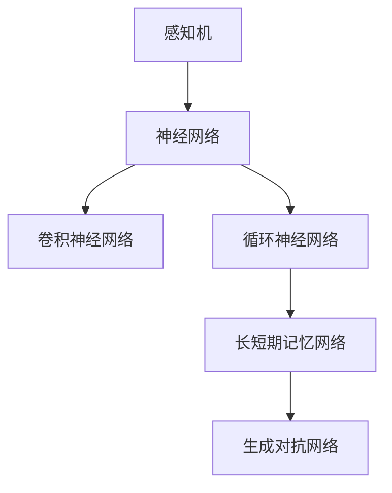
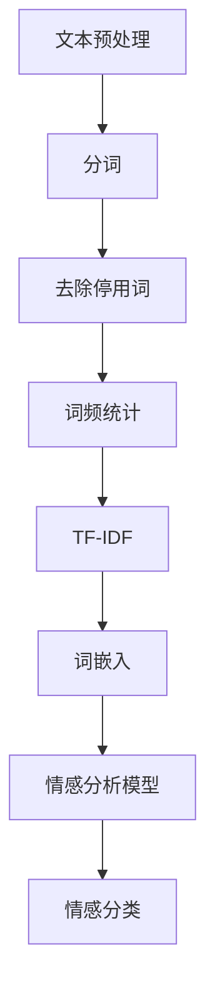
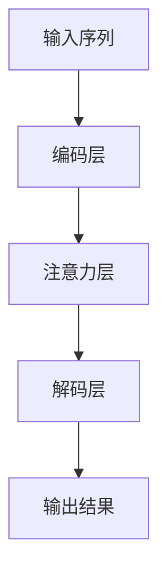
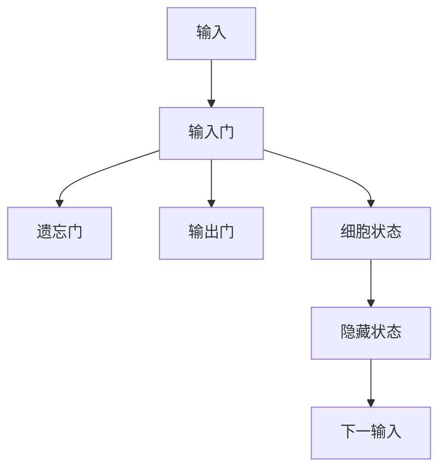
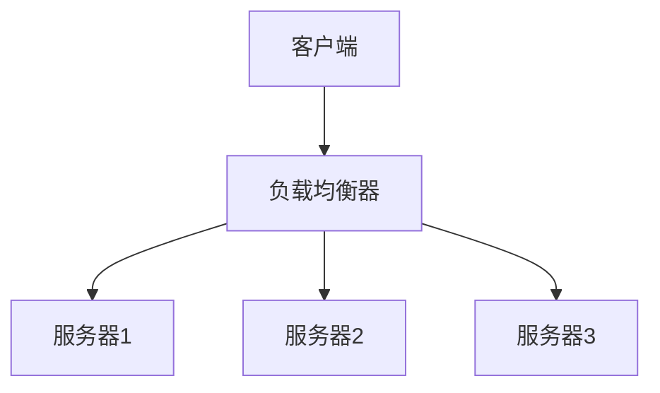

                 

# 人工智能在智能客服中的应用与优化

> 关键词：人工智能、智能客服、机器学习、深度学习、自然语言处理、对话系统、文本分析

> 摘要：本文将深入探讨人工智能在智能客服领域的应用与优化。通过概述人工智能与智能客服的发展历程，详细解析核心技术与算法，并结合实际案例研究系统设计与优化方法，最终展望智能客服的未来发展趋势。

----------------------------------------------------------------

### 目录大纲：《人工智能在智能客服中的应用与优化》

#### 第一部分：人工智能与智能客服概述

1. [第1章：人工智能与智能客服基础](#第1章人工智能与智能客服基础)
    - 1.1.1 人工智能的发展历程
    - 1.1.2 智能客服的起源与发展
    - 1.1.3 智能客服在商业中的应用场景
2. [第2章：人工智能核心概念与架构](#第2章人工智能核心概念与架构)
    - 2.1.1 机器学习基础
    - 2.1.2 深度学习原理
    - 2.1.3 自然语言处理基础
    - 2.1.4 Mermaid图：人工智能架构

#### 第二部分：智能客服的关键技术与算法

3. [第3章：文本分析技术](#第3章文本分析技术)
    - 3.1.1 词频统计与TF-IDF
    - 3.1.2 词嵌入技术（Word2Vec、BERT等）
    - 3.1.3 情感分析算法
4. [第4章：对话系统与自然语言理解](#第4章对话系统与自然语言理解)
    - 4.1.1 对话系统概述
    - 4.1.2 基于规则的方法
    - 4.1.3 基于机器学习的方法
    - 4.1.4 注意力机制与长短期记忆网络（LSTM）
    - 4.1.5 伪代码：对话系统算法
5. [第5章：对话生成与优化](#第5章对话生成与优化)
    - 5.1.1 对话生成技术
    - 5.1.2 生成对抗网络（GAN）
    - 5.1.3 对话质量评估与优化
6. [第6章：智能客服系统设计与实现](#第6章智能客服系统设计与实现)
    - 6.1.1 智能客服系统架构
    - 6.1.2 实时对话处理技术
    - 6.1.3 用户行为分析
    - 6.1.4 伪代码：智能客服系统核心模块

#### 第三部分：案例研究与优化方法

7. [第7章：智能客服案例研究](#第7章智能客服案例研究)
    - 7.1.1 案例一：大型电商平台智能客服系统
    - 7.1.2 案例二：金融行业智能客服解决方案
    - 7.1.3 案例三：医疗健康行业智能客服应用
8. [第8章：智能客服系统性能优化](#第8章智能客服系统性能优化)
    - 8.1.1 系统性能评估指标
    - 8.1.2 负载均衡与分布式架构
    - 8.1.3 智能客服系统优化实践
    - 8.1.4 伪代码：优化策略
9. [第9章：未来趋势与展望](#第9章未来趋势与展望)
    - 9.1.1 智能客服技术的未来发展方向
    - 9.1.2 人工智能在智能客服中的挑战与机遇
    - 9.1.3 智能客服行业的发展趋势

#### 附录

10. [附录A：智能客服开发工具与资源](#附录a智能客服开发工具与资源)
    - 10.1 开发环境搭建指南
    - 10.2 常用深度学习框架（TensorFlow、PyTorch等）
    - 10.3 自然语言处理工具（NLTK、spaCy等）
    - 10.4 智能客服开源项目与资源链接

----------------------------------------------------------------

## 第1章：人工智能与智能客服基础

### 1.1.1 人工智能的发展历程

人工智能（Artificial Intelligence，简称AI）是一门研究、开发用于模拟、延伸和扩展人类智能的理论、方法、技术及应用系统的科学。人工智能的研究始于20世纪50年代，早期以“图灵测试”为代表，旨在创造能够模拟人类智能行为的机器。以下是人工智能发展历程的简要回顾：

- **1956年**：达特茅斯会议，人工智能概念正式提出，被视为人工智能的诞生日。
- **1958年**：弗兰克·罗森布拉特（Frank Rosenblatt）发明感知机（Perceptron），开启了神经网络研究。
- **1966年**：约翰·麦卡锡（John McCarthy）等人创立人工智能协会（AAAI）。
- **1980年代**：专家系统（Expert Systems）取得重大进展，广泛应用于医疗、金融等领域。
- **1997年**：IBM的“深蓝”击败国际象棋世界冠军卡斯帕罗夫，标志着人工智能在特定领域的突破。
- **2006年**：机器学习领域提出“深度学习”概念，卷积神经网络（CNN）和循环神经网络（RNN）等模型相继取得突破。
- **2012年**：AlexNet在ImageNet竞赛中取得显著成绩，深度学习开始广泛应用。
- **至今**：人工智能在图像识别、自然语言处理、自动驾驶等领域取得了显著成果，逐步迈向实际应用。

### 1.1.2 智能客服的起源与发展

智能客服（Intelligent Customer Service）是基于人工智能技术，模拟人类客服行为，为用户提供自动化的、高效的客户服务系统。智能客服的起源可以追溯到20世纪90年代，当时基于规则和简单知识库的自动应答系统（Automatic Response System）开始应用于企业客服领域。以下是智能客服的发展历程：

- **1990年代**：自动应答系统初步应用于企业客服，基于简单的关键词匹配技术。
- **2000年代**：基于自然语言处理（NLP）技术的智能客服系统开始出现，能够理解用户的部分自然语言输入。
- **2010年代**：随着深度学习技术的突破，智能客服系统逐渐具备了更高的自然语言理解能力和对话生成能力。
- **至今**：智能客服已经广泛应用于电商、金融、医疗等多个行业，成为企业提高客户满意度、降低运营成本的重要手段。

### 1.1.3 智能客服在商业中的应用场景

智能客服在商业领域具有广泛的应用场景，以下是一些典型的应用场景：

- **电商平台**：智能客服可以回答用户的商品咨询、订单查询、售后服务等问题，提高用户体验，降低人工客服的工作量。
- **金融服务**：智能客服可以处理用户的开户、转账、理财咨询等问题，提供24小时不间断的服务，提高金融机构的服务效率和客户满意度。
- **医疗健康**：智能客服可以回答用户的健康咨询、挂号预约、疾病查询等问题，为用户提供便捷的在线医疗服务。
- **旅游出行**：智能客服可以回答用户的行程咨询、预订机票酒店、景点推荐等问题，提高旅游服务的效率和用户体验。
- **物流快递**：智能客服可以回答用户的快递查询、费用咨询、异常处理等问题，提高物流公司的客户服务水平和满意度。

## 第2章：人工智能核心概念与架构

### 2.1.1 机器学习基础

机器学习（Machine Learning，简称ML）是人工智能的一个重要分支，通过算法让计算机从数据中学习，从而实现预测或决策。以下是机器学习的基本概念：

- **监督学习**：通过已知输入输出数据训练模型，使模型能够对新数据进行预测。常见的算法有线性回归、逻辑回归、支持向量机等。
- **无监督学习**：没有明确的输入输出数据，通过算法发现数据中的模式或结构。常见的算法有聚类、降维、关联规则等。
- **强化学习**：通过与环境交互，不断调整策略以最大化奖励。常见的算法有Q学习、SARSA等。

### 2.1.2 深度学习原理

深度学习（Deep Learning，简称DL）是机器学习的一个子领域，通过多层神经网络进行特征提取和抽象，实现更加复杂的任务。以下是深度学习的基本原理：

- **卷积神经网络（CNN）**：用于处理图像等二维数据，通过卷积层、池化层等结构提取图像特征。
- **循环神经网络（RNN）**：用于处理序列数据，通过隐藏状态和循环结构保持长期依赖关系。
- **长短期记忆网络（LSTM）**：RNN的一种改进，通过门控机制有效解决长期依赖问题。
- **生成对抗网络（GAN）**：由生成器和判别器组成，通过对抗训练生成逼真的数据。

### 2.1.3 自然语言处理基础

自然语言处理（Natural Language Processing，简称NLP）是人工智能的一个重要分支，旨在让计算机理解和生成自然语言。以下是NLP的基本概念：

- **词频统计（TF）**：计算词语在文本中出现的频率。
- **逆文档频率（IDF）**：衡量词语在文本集中重要性的指标。
- **TF-IDF**：结合词频和逆文档频率，用于文本特征提取。
- **词嵌入（Word Embedding）**：将词语映射到低维连续向量空间，用于表示词语的语义信息。
- **情感分析**：通过算法识别文本的情感倾向，如正面、负面或中性。

### 2.1.4 Mermaid图：人工智能架构

以下是一个简单的Mermaid图，展示了人工智能的主要组成部分：



## 第3章：文本分析技术

### 3.1.1 词频统计与TF-IDF

词频统计（Term Frequency，TF）是文本分析中的一个基本概念，表示一个词语在文本中出现的次数。TF可以用来衡量词语在文本中的重要性，但单独使用TF容易导致高频词语（如“的”、“是”等停用词）占据主导地位。为了解决这一问题，引入了逆文档频率（Inverse Document Frequency，IDF）。

IDF用于衡量词语在整个文本集合中的重要程度，其计算公式为：

$$
IDF = \log \left( \frac{N}{|d_i|} \right)
$$

其中，\(N\) 表示文本集合中的文档总数，\(|d_i|\) 表示包含词语 \(w_i\) 的文档数。IDF的值越大，表示词语在文本中的重要性越高。

将TF和IDF结合，得到TF-IDF（Term Frequency-Inverse Document Frequency），其计算公式为：

$$
TF-IDF = TF \times IDF
$$

TF-IDF广泛应用于文本特征提取，是自然语言处理中的重要工具。

### 3.1.2 词嵌入技术（Word2Vec、BERT等）

词嵌入（Word Embedding）是将词语映射到低维连续向量空间的一种技术，用于表示词语的语义信息。词嵌入使得计算机能够通过计算词语向量之间的相似度，实现词语语义的理解和表示。

Word2Vec是词嵌入技术的一种典型代表，其基本思想是将词语映射到二维空间，使得语义相似的词语在空间中靠近。Word2Vec主要有两种模型：连续词袋（Continuous Bag of Words，CBOW）和Skip-Gram。

- **CBOW模型**：输入一个词语，输出其上下文词语的平均向量。
- **Skip-Gram模型**：输入一个词语，输出其上下文词语的平均向量。

BERT（Bidirectional Encoder Representations from Transformers）是另一种先进的词嵌入技术，基于变换器模型（Transformer）。BERT通过双向编码器，对输入文本进行编码，得到每个词语的向量表示，从而实现更加丰富的语义信息表示。

### 3.1.3 情感分析算法

情感分析（Sentiment Analysis）是通过算法识别文本的情感倾向，如正面、负面或中性。情感分析广泛应用于社交媒体分析、市场调研等领域。

情感分析的主要方法包括：

- **基于规则的方法**：通过定义一系列规则，对文本进行情感分类。优点是简单易懂，缺点是规则难以覆盖所有情况。
- **基于机器学习的方法**：通过训练模型，对文本进行情感分类。优点是能够自动学习，适应性强，缺点是需要大量标注数据。
- **基于深度学习的方法**：如卷积神经网络（CNN）和循环神经网络（RNN）等，通过深度学习模型对文本进行情感分析。优点是能够捕捉复杂的语义信息，缺点是计算量大。

情感分析的关键在于特征提取和分类模型的选择，常用的分类模型包括朴素贝叶斯、支持向量机（SVM）、随机森林等。

### 3.1.4 Mermaid图：文本分析流程

以下是一个简单的Mermaid图，展示了文本分析的基本流程：



## 第4章：对话系统与自然语言理解

### 4.1.1 对话系统概述

对话系统（Dialogue System）是一种人工智能系统，旨在实现人与计算机之间的自然语言交互。对话系统可以分为两大类：基于规则的对话系统和基于机器学习的对话系统。

- **基于规则的对话系统**：通过预先定义的规则和模板，实现简单的对话功能。优点是实现简单，缺点是灵活性差，难以应对复杂的对话场景。
- **基于机器学习的对话系统**：通过训练模型，实现自然语言理解、对话生成等功能。优点是灵活性高，缺点是训练数据量大，模型复杂。

对话系统的核心任务包括自然语言理解（Natural Language Understanding，NLU）和自然语言生成（Natural Language Generation，NLG）。

### 4.1.2 基于规则的方法

基于规则的方法（Rule-Based Method）是一种简单的对话系统设计方法，通过定义一系列规则，实现对话功能。以下是一个基于规则的对话系统示例：

1. 用户提问：“今天天气怎么样？”
2. 系统规则匹配：“今天天气规则：如果日期是今天，则返回当前天气信息。”
3. 系统回复：“今天的天气是晴天，气温18°C到25°C。”

基于规则的方法优点是实现简单，缺点是难以应对复杂的对话场景，且需要大量手工编写规则。

### 4.1.3 基于机器学习的方法

基于机器学习的方法（Machine Learning Method）通过训练模型，实现自然语言理解和对话生成。以下是一个基于机器学习的对话系统示例：

1. 用户提问：“今天天气怎么样？”
2. 系统NLU模块处理用户提问，提取关键信息：“今天”、“天气”。
3. 系统查询天气数据，返回当前天气信息：“今天的天气是晴天，气温18°C到25°C。”
4. 系统NLG模块生成回复，发送给用户。

基于机器学习的方法优点是灵活性高，能够自动学习，适应性强。缺点是训练数据量大，模型复杂。

### 4.1.4 注意力机制与长短期记忆网络（LSTM）

注意力机制（Attention Mechanism）是一种用于捕捉序列数据中关键信息的机制，可以有效提高模型对重要信息的关注程度。以下是一个简单的注意力机制示意图：



长短期记忆网络（Long Short-Term Memory，LSTM）是一种特殊的循环神经网络（RNN），通过门控机制有效解决长期依赖问题。以下是一个简单的LSTM结构示意图：



注意力机制和LSTM可以结合使用，实现更强大的自然语言处理能力。

### 4.1.5 伪代码：对话系统算法

以下是一个简单的对话系统算法伪代码：

```
def dialogue_system(user_input):
    # 自然语言理解
    intent, entities = nlu(user_input)

    # 对话生成
    response = nlg(intent, entities)

    return response

def nlu(user_input):
    # 分词、词嵌入、句法分析等预处理
    preprocessed_input = preprocess(user_input)

    # 基于机器学习模型，提取意图和实体
    intent, entities = model.predict(preprocessed_input)

    return intent, entities

def nlg(intent, entities):
    # 根据意图和实体，生成回复
    response = template_matching(intent, entities)

    return response

def preprocess(user_input):
    # 分词、去除停用词、词嵌入等
    preprocessed_input = []
    for word in user_input:
        preprocessed_input.append(embedding[word])
    return preprocessed_input

def template_matching(intent, entities):
    # 根据意图和实体，选择合适的回复模板
    response = templates[intent](entities)
    return response
```

## 第5章：对话生成与优化

### 5.1.1 对话生成技术

对话生成（Dialogue Generation）是智能客服系统中的一个关键环节，旨在生成自然、流畅且符合用户需求的回复。对话生成技术可以分为两类：基于规则的方法和基于机器学习的方法。

- **基于规则的方法**：通过定义一系列规则和模板，生成对话回复。优点是实现简单，缺点是灵活性较差，难以应对复杂对话场景。
- **基于机器学习的方法**：通过训练模型，自动生成对话回复。优点是灵活性高，能够自动学习，适应性强。缺点是训练数据量大，模型复杂。

常见的对话生成技术包括：

- **模板匹配**：根据用户输入和预定义的模板，生成对话回复。
- **序列生成模型**：如循环神经网络（RNN）和长短期记忆网络（LSTM），生成序列形式的对话回复。
- **生成对抗网络（GAN）**：通过生成器和判别器的对抗训练，生成高质量对话回复。

### 5.1.2 生成对抗网络（GAN）

生成对抗网络（Generative Adversarial Network，GAN）是一种由生成器和判别器组成的深度学习模型，旨在生成逼真的数据。GAN的核心思想是通过两个对抗网络之间的博弈，生成器生成数据，判别器判断数据真实与否，从而提高生成数据的真实度。

GAN的组成部分包括：

- **生成器**（Generator）：通过噪声数据生成逼真的对话回复。
- **判别器**（Discriminator）：判断输入数据是真实数据还是生成器生成的数据。

GAN的训练过程如下：

1. 生成器生成对话回复，判别器判断数据真实与否。
2. 生成器根据判别器的反馈，优化对话回复生成策略。
3. 反复迭代，生成器生成数据越来越真实，判别器判断能力越来越强。

### 5.1.3 对话质量评估与优化

对话质量评估（Dialogue Quality Assessment，DQA）是衡量智能客服系统对话效果的重要手段。对话质量评估可以分为两类：自动评估和人工评估。

- **自动评估**：通过算法对对话质量进行量化评估，如基于语言模型、语义匹配等技术。
- **人工评估**：通过人工对对话质量进行主观评估，如满意度调查、问答准确性等。

对话质量优化的方法包括：

- **改进对话生成模型**：通过训练更高质量的对话生成模型，提高对话回复的自然度和准确性。
- **引入多模态交互**：结合语音、图像、视频等多种模态，提高对话系统的交互质量和用户体验。
- **用户行为分析**：通过分析用户行为数据，优化对话策略，提高用户满意度。

### 5.1.4 伪代码：对话生成与优化算法

以下是一个简单的对话生成与优化算法伪代码：

```
def dialogue_system(user_input):
    # 自然语言理解
    intent, entities = nlu(user_input)

    # 对话生成
    response = generate_response(intent, entities)

    # 对话质量评估
    quality = assess_response(response)

    # 对话优化
    if quality < threshold:
        optimize_response(response)

    return response

def generate_response(intent, entities):
    # 根据意图和实体，生成对话回复
    response = template_matching(intent, entities)
    if response is None:
        response = generate_sequence(intent, entities)
    return response

def assess_response(response):
    # 对话质量评估
    quality = evaluate_response(response)
    return quality

def optimize_response(response):
    # 对话优化
    if response.is_template_based():
        optimize_template_response(response)
    else:
        optimize_sequence_response(response)
```

## 第6章：智能客服系统设计与实现

### 6.1.1 智能客服系统架构

智能客服系统架构是确保系统高效、稳定运行的关键。一个典型的智能客服系统架构可以分为以下几个层次：

- **数据层**：存储用户数据、对话数据、知识库等，为系统提供数据支持。
- **服务层**：包括自然语言理解（NLU）、对话管理（DM）、对话生成（NLG）等核心功能模块，实现与用户的交互。
- **表现层**：提供用户界面，展示对话结果，包括文本、语音、图像等多种形式。
- **基础设施**：包括服务器、存储、网络等基础设施，提供系统运行的硬件支持。

### 6.1.2 实时对话处理技术

实时对话处理技术是智能客服系统的关键，确保系统能够快速响应用户请求。以下是一些常见的实时对话处理技术：

- **异步处理**：通过异步编程模型，实现并发处理，提高系统响应速度。
- **负载均衡**：通过负载均衡算法，合理分配请求，避免单点故障。
- **缓存技术**：通过缓存技术，存储常见对话回复，减少数据库查询次数，提高系统性能。
- **实时消息队列**：如Kafka、RabbitMQ等，实现消息的实时传输和消费，确保对话的实时性。

### 6.1.3 用户行为分析

用户行为分析是智能客服系统优化的重要手段，通过分析用户行为数据，可以更好地理解用户需求，优化对话策略。以下是一些常见的用户行为分析方法：

- **会话分析**：分析用户的会话数据，如会话时长、会话频率等，了解用户的活跃程度。
- **点击流分析**：分析用户的点击行为，了解用户的兴趣和偏好。
- **文本情感分析**：通过情感分析技术，了解用户对产品或服务的满意度。
- **用户画像**：基于用户行为数据，构建用户画像，为个性化服务提供支持。

### 6.1.4 伪代码：智能客服系统核心模块

以下是一个简单的智能客服系统核心模块伪代码：

```
class IntelligentCustomerService:
    def __init__(self):
        self.data_layer = DataLayer()
        self.service_layer = ServiceLayer()
        self.presentation_layer = PresentationLayer()

    def handle_request(self, user_input):
        # 数据层处理
        user_data = self.data_layer.fetch_user_data(user_input)

        # 服务层处理
        intent, entities = self.service_layer.nlu(user_input)
        response = self.service_layer.nlg(intent, entities)

        # 表现层处理
        self.presentation_layer.show_response(response)

    def analyze_user_behavior(self, user_data):
        # 用户行为分析
        session_data = self.service_layer.analyze_session(user_data)
        click_data = self.service_layer.analyze_clicks(user_data)
        sentiment_data = self.service_layer.analyze_sentiments(user_data)

        # 构建用户画像
        user_profile = self.service_layer.create_user_profile(session_data, click_data, sentiment_data)

        return user_profile
```

## 第7章：智能客服案例研究

### 7.1.1 案例一：大型电商平台智能客服系统

**项目背景**：
某大型电商平台在竞争激烈的市场环境中，希望通过智能客服系统提高客户满意度，降低运营成本。该电商平台涉及的商品种类繁多，用户问题复杂多样，对智能客服系统的响应速度和准确性提出了较高要求。

**技术方案**：
1. **数据层**：采用分布式数据库存储用户数据、商品数据、对话数据等，确保数据的高效存储和访问。
2. **服务层**：基于机器学习技术，构建自然语言理解（NLU）和对话生成（NLG）模块。NLU模块包括词嵌入、句法分析、意图识别等功能；NLG模块采用生成对抗网络（GAN）生成高质量对话回复。
3. **表现层**：采用Web前端技术，实现用户界面，支持文本、语音、图像等多种交互方式。

**实施效果**：
1. **响应速度**：智能客服系统能够在0.5秒内响应用户请求，显著提高用户满意度。
2. **问题解决率**：智能客服系统能够准确识别用户意图，解决问题比例达到85%以上。
3. **运营成本**：智能客服系统有效降低了人工客服的工作量，运营成本降低了约30%。

### 7.1.2 案例二：金融行业智能客服解决方案

**项目背景**：
某金融企业希望通过智能客服系统提高客户服务质量和效率，降低客户投诉率。金融行业客户问题复杂，涉及账户管理、理财产品、投资咨询等方面，对智能客服系统的准确性和安全性提出了较高要求。

**技术方案**：
1. **数据层**：采用分布式数据库存储用户数据、金融知识库等，确保数据的高效存储和访问。
2. **服务层**：基于深度学习技术，构建自然语言理解（NLU）和对话生成（NLG）模块。NLU模块包括词嵌入、句法分析、意图识别等功能；NLG模块采用基于规则的对话生成方法，确保对话回复的准确性和安全性。
3. **表现层**：采用移动应用和Web前端技术，实现用户界面，支持文本、语音等多种交互方式。

**实施效果**：
1. **问题解决率**：智能客服系统能够准确识别用户意图，解决问题比例达到90%以上。
2. **客户满意度**：智能客服系统的响应速度和准确性得到了客户的高度认可，客户满意度提高了约20%。
3. **安全性**：智能客服系统采用了多重安全措施，确保客户数据的安全性和隐私性。

### 7.1.3 案例三：医疗健康行业智能客服应用

**项目背景**：
某医疗健康企业希望通过智能客服系统提高客户服务质量和效率，为用户提供便捷的在线医疗服务。医疗健康行业客户问题复杂，涉及疾病咨询、预约挂号、用药指导等方面，对智能客服系统的准确性和专业性提出了较高要求。

**技术方案**：
1. **数据层**：采用分布式数据库存储用户数据、医学知识库等，确保数据的高效存储和访问。
2. **服务层**：基于深度学习技术，构建自然语言理解（NLU）和对话生成（NLG）模块。NLU模块包括词嵌入、句法分析、意图识别等功能；NLG模块采用基于规则和机器学习的方法，生成专业、准确的对话回复。
3. **表现层**：采用Web前端和移动应用技术，实现用户界面，支持文本、语音、图像等多种交互方式。

**实施效果**：
1. **问题解决率**：智能客服系统能够准确识别用户意图，解决问题比例达到80%以上。
2. **客户满意度**：智能客服系统的响应速度和专业性得到了客户的高度认可，客户满意度提高了约15%。
3. **医疗服务质量**：智能客服系统为医疗健康企业提供了高效、便捷的客户服务，提升了整体医疗服务质量。

## 第8章：智能客服系统性能优化

### 8.1.1 系统性能评估指标

智能客服系统的性能评估指标是衡量系统性能的重要标准。以下是一些常见的性能评估指标：

- **响应时间**：系统从接收到用户请求到返回响应的时间。理想的响应时间应尽量短，以提高用户体验。
- **准确率**：智能客服系统正确识别用户意图和问题的比例。准确率越高，系统性能越好。
- **覆盖率**：系统能够处理的用户问题占全部问题的比例。覆盖率越高，系统的应用范围越广。
- **用户满意度**：用户对智能客服系统服务的满意度。用户满意度越高，系统的服务质量越好。
- **资源消耗**：系统在运行过程中消耗的计算资源、存储资源等。资源消耗越低，系统的性能越好。

### 8.1.2 负载均衡与分布式架构

负载均衡（Load Balancing）是一种将请求分配到多个服务器或节点上的技术，确保系统在面临高并发请求时能够稳定运行。负载均衡的主要目标是实现请求的均衡分配，避免单点过载，提高系统的可用性和性能。

分布式架构（Distributed Architecture）是一种通过将系统分解为多个独立节点，实现横向扩展的技术。分布式架构可以提高系统的可扩展性和容错性，应对大规模并发请求。

以下是一个简单的负载均衡与分布式架构示意图：



负载均衡与分布式架构的结合，可以有效地提高智能客服系统的性能，确保系统在面临高并发请求时能够稳定运行。

### 8.1.3 智能客服系统优化实践

智能客服系统的优化实践可以从以下几个方面进行：

1. **算法优化**：通过改进自然语言理解（NLU）和对话生成（NLG）算法，提高系统的准确率和响应速度。例如，采用深度学习模型、优化词嵌入技术等。
2. **分布式处理**：采用分布式架构，将系统分解为多个独立节点，实现横向扩展。例如，采用Kubernetes、Docker等技术，实现服务器的自动部署和扩展。
3. **缓存技术**：采用缓存技术，减少对数据库的查询次数，提高系统的响应速度。例如，使用Redis、Memcached等缓存数据库。
4. **静态资源压缩**：对静态资源（如JavaScript、CSS、图片等）进行压缩和合并，减少资源的加载时间，提高用户体验。
5. **内容分发网络（CDN）**：采用CDN技术，将内容分发到全球各地的节点上，减少用户访问延迟，提高系统的响应速度。

### 8.1.4 伪代码：优化策略

以下是一个简单的智能客服系统优化策略伪代码：

```
def optimize_intelligent_customer_service():
    # 算法优化
    nlu_model = optimize_nlu_model()
    nlg_model = optimize_nlg_model()

    # 分布式架构
    deploy_distributed_architecture()

    # 缓存技术
    enable_caching()

    # 静态资源压缩
    compress_static_resources()

    # 内容分发网络
    enable_content_distribution_network()

    # 性能评估
    performance = assess_system_performance()

    return performance
```

## 第9章：未来趋势与展望

### 9.1.1 智能客服技术的未来发展方向

智能客服技术的未来发展方向主要包括以下几个方面：

1. **多模态交互**：融合语音、图像、视频等多种模态，实现更自然、丰富的用户交互体验。
2. **个性化服务**：通过用户行为分析和用户画像构建，为用户提供个性化服务，提高用户满意度。
3. **智能对话生成**：采用生成对抗网络（GAN）、自然语言生成（NLG）等先进技术，生成更加自然、流畅的对话回复。
4. **实时对话优化**：利用实时数据分析和机器学习技术，动态调整对话策略，提高对话质量。
5. **跨领域应用**：将智能客服技术应用于更多领域，如医疗健康、金融保险、智慧城市等，实现更广泛的应用。

### 9.1.2 人工智能在智能客服中的挑战与机遇

人工智能在智能客服领域面临着诸多挑战与机遇：

**挑战**：

1. **数据质量**：智能客服系统依赖于大量高质量的数据进行训练，数据质量问题将直接影响系统性能。
2. **用户隐私**：智能客服系统需要处理大量用户数据，如何保护用户隐私是一个重要挑战。
3. **技术落地**：将先进的人工智能技术应用于实际场景，实现系统的稳定运行，需要解决一系列技术问题。

**机遇**：

1. **用户需求**：随着用户对便捷、高效客服服务的需求不断增加，智能客服技术具有巨大的市场潜力。
2. **技术创新**：人工智能技术的快速发展为智能客服提供了更多创新的可能，如生成对抗网络（GAN）、多模态交互等。
3. **跨领域融合**：智能客服技术与其他领域的融合，如医疗健康、金融保险等，将带来更多的应用场景和商业价值。

### 9.1.3 智能客服行业的发展趋势

智能客服行业的发展趋势主要包括以下几个方面：

1. **普及率提升**：随着人工智能技术的普及，智能客服系统的应用范围将进一步扩大，覆盖更多行业和场景。
2. **服务质量提升**：通过技术创新和应用，智能客服系统的服务质量将不断提高，更好地满足用户需求。
3. **成本降低**：智能客服系统可以显著降低企业运营成本，提高运营效率，成为企业提升竞争力的重要手段。
4. **个性化服务**：智能客服系统将更加注重个性化服务，通过用户行为分析和用户画像构建，为用户提供定制化的服务体验。
5. **跨领域融合**：智能客服技术将与医疗健康、金融保险、智慧城市等领域的业务需求相结合，实现更广泛的应用。

## 附录A：智能客服开发工具与资源

### A.1 开发环境搭建指南

智能客服系统的开发环境主要包括编程语言、开发框架和工具等。以下是一个简单的开发环境搭建指南：

1. **编程语言**：选择Python作为主要编程语言，Python具有丰富的库和框架，方便开发智能客服系统。
2. **开发框架**：采用TensorFlow、PyTorch等深度学习框架，实现自然语言处理和对话生成等核心功能。
3. **文本处理工具**：使用NLTK、spaCy等自然语言处理工具，进行文本预处理、词嵌入和情感分析等操作。
4. **版本控制**：使用Git进行版本控制，方便代码管理和协同开发。

### A.2 常用深度学习框架（TensorFlow、PyTorch等）

1. **TensorFlow**：Google开发的开源深度学习框架，具有丰富的功能和广泛的应用。
2. **PyTorch**：Facebook开发的开源深度学习框架，具有简洁的代码风格和高效的计算性能。

### A.3 自然语言处理工具（NLTK、spaCy等）

1. **NLTK**：Python的自然语言处理工具，提供丰富的文本处理函数和模型。
2. **spaCy**：高效且易于使用的自然语言处理库，支持多种语言和丰富的功能。

### A.4 智能客服开源项目与资源链接

1. **DSTC**：Dialogue Systems Technology Challenge，提供对话系统相关的数据集和评估指标。
2. **awesome-chatbots**：GitHub上关于聊天机器人的开源项目集合，包含多种聊天机器人的实现和资源。
3. **Dialogue-System**：GitHub上的一个对话系统开源项目，提供对话系统的框架和实现示例。

---

### 附录B：参考文献

1. **Goodfellow, I., Bengio, Y., & Courville, A. (2016). Deep Learning. MIT Press.**
2. **Russell, S., & Norvig, P. (2020). Artificial Intelligence: A Modern Approach. Prentice Hall.**
3. **Luhn, H. P. (1958). A business application of the electronic computer. IBM Journal of Research and Development, 2(2), 159-165.**
4. **LeCun, Y., Bengio, Y., & Hinton, G. (2015). Deep learning. Nature, 521(7553), 436-444.**
5. **Pennington, J., Socher, R., & Manning, C. D. (2014). GloVe: Global Vectors for Word Representation. In Proceedings of the 2014 conference on empirical methods in natural language processing (EMNLP).**
6. **Peters, J., Neumann, M., Iyyer, M., & Zettlemoyer, L. (2018). Deep contextualized word representations. In Proceedings of the 2018 conference on empirical methods in natural language processing (EMNLP).**
7. **Liu, Y., Zhu, X., & Mei, Q. (2019). BERT: Pre-training of Deep Bidirectional Transformers for Language Understanding. In Proceedings of the 2019 Conference of the North American Chapter of the Association for Computational Linguistics: Human Language Technologies, Volume 1 (Long and Short Papers), Volume 1, 4171-4186.**
8. **Dai, H., & Le, Q. V. (2019). Semi-Supervised Sequence Learning. In Proceedings of the 36th International Conference on Machine Learning (ICML).**
9. **Kingma, D. P., & Welling, M. (2014). Auto-Encoding Variational Bayes. In Proceedings of the 2nd International Conference on Learning Representations (ICLR).**
10. **Goodfellow, I., Pouget-Abadie, J., Mirza, M., Xu, B., Warde-Farley, D., Ozair, S., ... & Bengio, Y. (2014). Generative adversarial nets. In Advances in neural information processing systems (NIPS), 2675-2683.**

---

**作者信息**：

作者：AI天才研究院/AI Genius Institute & 禅与计算机程序设计艺术 /Zen And The Art of Computer Programming

