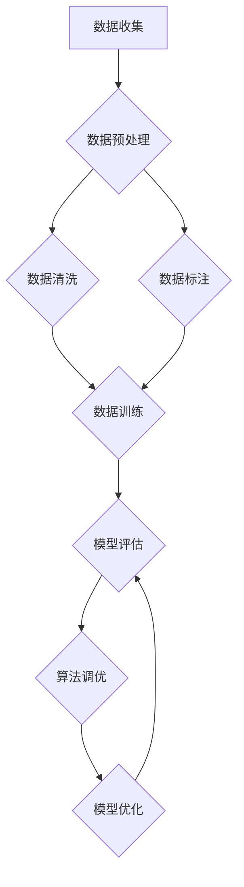

                 

# {文章标题}

## 人类计算在AI行业中的应用

### 关键词：人类计算、人工智能、应用场景、算法优化、安全与伦理

### 摘要：
随着人工智能（AI）技术的飞速发展，人类计算在AI行业的应用越来越广泛。本文旨在探讨人类计算在AI行业中的应用现状、基础理论、实践方法以及未来发展趋势。文章首先介绍人类计算与AI行业的关系及其重要性，接着详细阐述AI行业的现状与发展趋势，然后分析人类计算在AI行业的应用场景，包括数据标注与清洗、算法调优与优化、人工智能安全与伦理以及跨学科合作与创新。最后，文章对人类计算在AI行业的未来展望与趋势进行探讨，并提出可持续发展策略。

### 引言与背景

#### 1.1 引言

人工智能（AI）作为当今科技领域的热门话题，正以迅猛的态势改变着我们的生活方式和工作模式。从早期的规则系统到现代的深度学习模型，AI技术经历了翻天覆地的变化。然而，在AI技术的发展过程中，人类计算始终扮演着不可或缺的角色。人类计算不仅为AI提供了数据、知识和经验，还在算法优化、安全与伦理等方面发挥着关键作用。

#### 1.1.1 人类计算与AI行业的关系

人类计算与AI行业的关系可以追溯到AI的早期发展阶段。当时，AI科学家们通过编写规则和算法来模拟人类的思维过程。尽管这些早期的AI系统在特定任务上表现出色，但它们缺乏灵活性和自学习能力。随着时间的发展，人类计算逐渐融入到AI系统中，为AI提供了更多的数据、知识以及优化算法的方法。

#### 1.1.2 人类计算在AI行业中的重要性

人类计算在AI行业中的重要性体现在多个方面。首先，人类计算为AI提供了训练数据。在许多AI应用场景中，高质量的数据是模型性能的关键。人类标注员通过手动标注和清洗数据，为AI模型提供了可靠的训练数据集。其次，人类计算在算法优化中发挥着重要作用。人类专家通过对算法的调整和优化，提高了AI模型的性能和可靠性。此外，人类计算还在人工智能安全与伦理方面扮演着关键角色，确保AI系统的安全性和道德性。

#### 1.1.3 人类计算在AI行业中的应用前景

随着AI技术的不断进步，人类计算在AI行业中的应用前景将更加广阔。首先，随着自动化标注技术的发展，人类计算在数据标注领域的应用将越来越高效。其次，随着多学科融合的深入，人类计算在AI领域的应用将更加多元化。例如，在医疗领域，人类医生和AI系统的结合将大大提高疾病诊断的准确性和效率。最后，随着AI伦理问题的日益凸显，人类计算在确保AI系统安全性和道德性方面的作用将越来越重要。

### AI行业的现状与发展趋势

#### 1.2.1 AI行业的发展历程

AI行业的发展历程可以分为以下几个阶段：

1. **早期阶段（1956-1974）**：在这个阶段，AI研究主要集中在规则系统、专家系统和搜索算法等方面。代表性的工作包括逻辑推理系统和游戏AI等。
   
2. **低迷阶段（1974-1980）**：由于计算资源和算法的限制，AI行业进入了一个低迷期。许多AI项目由于无法达到预期目标而被迫中止。

3. **复兴阶段（1980-1987）**：随着计算机硬件和算法的进步，AI行业重新焕发生机。这个阶段出现了许多重要的AI技术，如神经网络和遗传算法。

4. **繁荣阶段（1987-2012）**：在这个阶段，AI技术得到了广泛的应用，包括语音识别、图像识别和自然语言处理等。代表性的项目包括IBM的Deep Blue和Google的AlphaGo。

5. **深度学习时代（2012至今）**：随着深度学习技术的发展，AI行业进入了一个新的繁荣时期。深度学习模型在图像识别、语音识别和自然语言处理等领域取得了重大突破。

#### 1.2.2 AI行业的主要领域

AI行业的主要领域包括：

1. **计算机视觉**：计算机视觉技术主要用于图像和视频处理，包括目标检测、图像识别和视频分析等。

2. **自然语言处理**：自然语言处理技术主要用于文本处理，包括语言识别、文本生成和语义理解等。

3. **机器学习**：机器学习技术是AI的核心技术之一，包括监督学习、无监督学习和强化学习等。

4. **语音识别**：语音识别技术主要用于语音到文本的转换，包括语音识别和语音合成等。

5. **机器人技术**：机器人技术主要涉及机器人的感知、决策和行动，包括自主导航、任务规划和人机交互等。

#### 1.2.3 AI行业的发展趋势与挑战

AI行业的发展趋势包括：

1. **算法创新**：随着深度学习和其他新型算法的发展，AI行业将继续推动算法创新。

2. **多学科融合**：AI技术与其他领域的融合将产生更多创新应用，如医疗、金融和交通等。

3. **硬件升级**：计算能力的提升将推动AI技术的发展，特别是大规模模型训练和推理。

4. **数据驱动**：数据质量将直接影响AI模型的性能，因此数据驱动的发展趋势将更加明显。

AI行业的挑战包括：

1. **数据隐私**：随着数据量的增加，数据隐私问题日益凸显，如何保护用户隐私成为一大挑战。

2. **算法透明性**：深度学习模型的黑箱特性使得算法透明性成为一个亟待解决的问题。

3. **安全与伦理**：AI技术的广泛应用带来了一系列安全与伦理问题，如算法偏见和责任归属等。

4. **人才短缺**：随着AI技术的发展，对AI专业人才的需求越来越大，而人才供给不足成为一大挑战。

### 人类计算在AI行业的应用场景

#### 1.3.1 数据标注与清洗

数据标注与清洗是AI领域的基础工作，直接影响到AI模型的性能和可靠性。人类计算在数据标注与清洗中发挥着关键作用：

1. **数据标注**：人类标注员通过识别和标注数据，为AI模型提供训练数据。例如，在图像识别任务中，标注员需要标记图像中的物体和位置。

2. **数据清洗**：数据清洗是数据预处理的重要步骤，旨在去除错误、冗余和无关的数据。人类计算可以通过识别和修复数据中的错误，提高数据质量。

#### 1.3.2 算法调优与优化

算法调优与优化是提高AI模型性能的重要手段。人类计算在算法调优与优化中发挥着重要作用：

1. **算法调优**：人类专家通过对算法参数的调整，优化模型性能。例如，在深度学习任务中，专家可以调整学习率、批量大小等参数。

2. **优化算法**：人类计算可以开发新的优化算法，提高模型训练和推理的效率。例如，通过并行计算和分布式训练，可以加速模型训练过程。

#### 1.3.3 人工智能安全与伦理

人工智能安全与伦理是AI领域的重要问题，关系到AI系统的可靠性和社会影响。人类计算在人工智能安全与伦理中发挥着关键作用：

1. **安全策略**：人类专家可以设计安全策略，确保AI系统的安全性和可靠性。例如，通过访问控制和加密技术，保护数据安全。

2. **伦理指导**：人类专家可以提供伦理指导，确保AI系统的道德性。例如，在医疗领域，人类医生可以确保AI系统的诊断建议符合伦理标准。

#### 1.3.4 跨学科合作与创新

跨学科合作与创新是推动AI技术发展的重要途径。人类计算在跨学科合作与创新中发挥着关键作用：

1. **团队建设**：人类专家可以组建跨学科团队，发挥各自领域的优势，共同推动AI技术的发展。

2. **创新模式**：人类计算可以探索新的创新模式，如人工智能与哲学、心理学等领域的结合，为AI技术提供新的发展方向。

### 1.4 本书结构安排

#### 1.4.1 主要内容概述

本书共分为七个部分，主要内容如下：

- **第一部分：人类计算在AI行业中的应用概述**：介绍人类计算与AI行业的关系、现状与发展趋势，以及人类计算在AI行业的应用场景。
- **第二部分：人类计算基础理论**：探讨人类计算的定义、特点、核心能力及应用范围。
- **第三部分：数据标注与清洗**：详细讲解数据标注与清洗的概念、方法、挑战及应对策略。
- **第四部分：算法调优与优化**：介绍算法调优与优化的基本概念、方法、原理及实战案例。
- **第五部分：人工智能安全与伦理**：探讨人工智能安全与伦理的概念、基本原则、实践及案例分析。
- **第六部分：跨学科合作与创新**：分析跨学科合作的重要性、实践方法及创新成果。
- **第七部分：未来展望与趋势**：展望人类计算在AI行业的未来发展、挑战与机遇。

#### 1.4.2 目录结构

以下是本书的目录结构：

- **第一部分：人类计算在AI行业中的应用概述**
  - 第1章：引言与背景
  - 第2章：AI行业的现状与发展趋势
  - 第3章：人类计算在AI行业的应用场景
- **第二部分：人类计算基础理论**
  - 第4章：人类计算的定义与特点
  - 第5章：人类计算的核心能力
  - 第6章：人类计算的应用范围
- **第三部分：数据标注与清洗**
  - 第7章：数据标注的概念与意义
  - 第8章：数据标注的方法与工具
  - 第9章：数据清洗的重要性与实践
  - 第10章：数据标注与清洗的挑战与应对
- **第四部分：算法调优与优化**
  - 第11章：算法调优的基本概念
  - 第12章：常见的算法调优方法
  - 第13章：优化算法的原理与实践
  - 第14章：算法调优实战案例分析
- **第五部分：人工智能安全与伦理**
  - 第15章：人工智能安全的概念与重要性
  - 第16章：人工智能伦理的基本原则
  - 第17章：人工智能安全与伦理的实践
  - 第18章：安全与伦理的双重挑战案例分析
- **第六部分：跨学科合作与创新**
  - 第19章：跨学科合作的重要性
  - 第20章：跨学科合作的实践方法
  - 第21章：跨学科合作的典范案例分析
- **第七部分：未来展望与趋势**
  - 第22章：人类计算在AI行业中的未来发展
  - 第23章：人类计算与AI融合的挑战与机遇
  - 第24章：人类计算在AI行业的可持续发展
- **附录**
  - 附录A：参考文献
  - 附录B：常用工具与资源
  - 附录C：Mermaid流程图示例

#### 1.4.3 阅读指南

为了更好地理解本书的内容，以下是一些建议：

1. **系统阅读**：建议按顺序阅读每个章节，以便系统地了解人类计算在AI行业中的应用。
2. **重点阅读**：对于某些重要章节，如算法调优、安全与伦理等，可以重点阅读，以深入理解相关概念和原理。
3. **实践应用**：本书提供了多个实践案例，读者可以结合实际项目进行实践应用，加深对理论知识的理解。
4. **互动学习**：读者可以与本书作者或其他读者进行互动，讨论相关问题和见解，共同推动AI技术的发展。

通过本书的学习，读者将深入了解人类计算在AI行业中的应用，掌握相关理论和实践方法，为AI技术的创新和发展贡献力量。## 人类计算基础理论

### 2.1 人类计算的定义与特点

#### 2.1.1 人类计算的定义

人类计算（Human Computation）是指人类通过观察、思考、推理等方式进行信息处理和决策的过程。与机器计算（Machine Computation）不同，人类计算依赖于人类大脑的复杂认知能力，包括感知、记忆、推理、学习等。

#### 2.1.2 人类计算的特点

1. **灵活性**：人类计算具有高度的灵活性，能够适应不同的环境和任务需求。这种灵活性来源于人类大脑的多样性和复杂性，使其能够处理不确定性和异常情况。

2. **感知能力**：人类计算具有强大的感知能力，能够从各种来源获取信息，如视觉、听觉、触觉等。这种感知能力使得人类能够在复杂的环境中快速识别和理解信息。

3. **推理能力**：人类计算具有较强的推理能力，能够从已知信息中推断出新信息，并进行逻辑推理和判断。这种推理能力使得人类能够在复杂的情境中做出合理的决策。

4. **学习与适应能力**：人类计算具有学习与适应能力，能够通过不断的学习和实践，改进自己的计算过程和结果。这种能力使得人类能够在不断变化的环境中持续进步。

5. **创造力**：人类计算具有创造力，能够产生新的想法、解决方案和创意。这种创造力是人类计算区别于机器计算的重要特征，也是推动科技进步的重要动力。

#### 2.1.3 人类计算与机器计算的对比

| 特征 | 人类计算 | 机器计算 |
| ---- | ---- | ---- |
| 灵活性 | 高 | 低 |
| 感知能力 | 强 | 弱 |
| 推理能力 | 强 | 弱 |
| 学习与适应能力 | 强 | 弱 |
| 创造力 | 强 | 无 |

从上表可以看出，人类计算在灵活性、感知能力、推理能力、学习与适应能力和创造力等方面具有显著优势，而机器计算在这些方面则相对较弱。这也解释了为什么人类计算在AI领域仍然具有重要作用。

### 2.2 人类计算的核心能力

#### 2.2.1 观察与感知能力

观察与感知能力是人类计算的基础。人类通过视觉、听觉、触觉等多种感官获取外界信息，对环境进行感知。这种能力使得人类能够识别物体、理解场景、发现异常等。

#### 2.2.2 判断与推理能力

判断与推理能力是人类计算的核心。人类能够基于已知信息进行逻辑推理，做出判断和决策。这种能力使得人类能够在复杂情境中快速识别问题、制定解决方案。

#### 2.2.3 学习与适应能力

学习与适应能力是人类计算的重要特征。人类能够通过不断的学习和实践，改进自己的计算过程和结果。这种能力使得人类能够适应新的环境、任务和技术。

#### 2.2.4 创造力

创造力是人类计算的独特能力。人类能够产生新的想法、解决方案和创意。这种能力推动了科技进步、文化发展和人类文明的进步。

### 2.3 人类计算的应用范围

#### 2.3.1 生活领域中的应用

在生活领域，人类计算广泛应用于各种场景，如购物、烹饪、教育、娱乐等。人类通过观察、思考、推理等方式，处理日常生活中的各种信息，做出决策和行动。

#### 2.3.2 工作领域中的应用

在工作领域，人类计算广泛应用于科学研究、工程设计、金融服务、医疗诊断等。人类专家通过分析数据、设计算法、制定策略，推动技术进步和业务发展。

#### 2.3.3 创新领域中的应用

在创新领域，人类计算是推动科技进步和文化发展的重要动力。人类通过跨学科合作、创新思维，开发出新的技术、产品和创意，推动社会进步。

### 总结

人类计算具有独特的优势，如灵活性、感知能力、推理能力、学习与适应能力和创造力。这些能力使得人类计算在生活、工作和创新领域具有广泛的应用。在AI行业，人类计算与机器计算相互补充，共同推动人工智能技术的发展。理解人类计算的基础理论，有助于更好地发挥人类计算在AI行业中的作用。## 数据标注与清洗

### 3.1 数据标注的概念与意义

#### 3.1.1 数据标注的定义

数据标注（Data Annotation）是指对原始数据进行标记和分类的过程，以便机器学习模型能够从中学习和提取有价值的信息。数据标注通常涉及对图像、文本、音频和视频等多媒体数据进行标注，使其适合用于训练和测试机器学习模型。

#### 3.1.2 数据标注的类型

数据标注可以按照标注内容的不同分为以下几类：

1. **图像标注**：对图像中的物体、区域、动作等进行标注，如目标检测、图像分类和分割等。
2. **文本标注**：对文本数据进行情感分析、实体识别、关系抽取等，如文本分类、命名实体识别和语义角色标注等。
3. **音频标注**：对音频数据进行声音分类、声音识别和语音转换等，如语音识别和音乐分类等。
4. **视频标注**：对视频数据进行场景分类、动作识别、视频分割等，如视频分类、行为识别和视频摘要等。

#### 3.1.3 数据标注的重要性

数据标注在机器学习模型训练过程中起着至关重要的作用，其重要性体现在以下几个方面：

1. **提高模型性能**：高质量的数据标注能够提高机器学习模型的性能，使其在预测和分类任务中取得更好的效果。
2. **降低错误率**：数据标注有助于识别和纠正数据中的错误和异常，降低模型训练过程中的错误率。
3. **增加数据多样性**：数据标注可以扩展数据集的多样性，有助于模型在多种场景下的泛化能力。
4. **加速模型训练**：标注数据可以帮助模型快速收敛，减少训练时间。

### 3.2 数据标注的方法与工具

#### 3.2.1 手动标注方法

手动标注方法是指由人类标注员对数据进行逐个标注的过程。这种方法的主要优点是数据标注的准确性和灵活性较高，但缺点是耗时较长且成本较高。

1. **步骤**：
   1. 数据收集：收集待标注的数据集，包括图像、文本、音频和视频等。
   2. 数据预处理：对数据进行清洗、去重和格式化等预处理操作。
   3. 标注任务定义：明确标注任务的目标和标准，如目标检测、文本分类等。
   4. 标注员培训：对标注员进行培训，使其熟悉标注任务和标准。
   5. 数据标注：标注员按照任务标准对数据进行标注。
   6. 标注结果审核：对标注结果进行审核，确保标注质量。

2. **工具**：
   - **图像标注工具**：如LabelImg、VGG Image Annotator等。
   - **文本标注工具**：如Stanford NLP、NLTK等。
   - **音频标注工具**：如Audacity、Evaer等。
   - **视频标注工具**：如OpenPose、VGG Video Annotator等。

#### 3.2.2 自动标注方法

自动标注方法是指通过计算机算法对数据进行自动标注的过程。这种方法的主要优点是提高标注效率，降低标注成本，但缺点是标注质量可能不如人工标注。

1. **步骤**：
   1. 数据收集：收集待标注的数据集，包括图像、文本、音频和视频等。
   2. 数据预处理：对数据进行清洗、去重和格式化等预处理操作。
   3. 自动标注算法设计：设计自动标注算法，如基于规则的方法、基于统计的方法和基于机器学习的方法等。
   4. 自动标注：运行自动标注算法，对数据进行自动标注。
   5. 自动标注结果审核：对自动标注结果进行审核，确保标注质量。

2. **工具**：
   - **图像自动标注工具**：如DeepLabel、PASCAL VOC等。
   - **文本自动标注工具**：如Spacy、NLTK等。
   - **音频自动标注工具**：如Audacity、Evaer等。
   - **视频自动标注工具**：如OpenPose、VGG Video Annotator等。

#### 3.2.3 标注工具的使用

在实际应用中，标注工具的选择和配置对于标注效率和标注质量具有重要影响。以下是一些常用的标注工具及其使用方法：

1. **LabelImg**：
   - **功能**：用于图像标注，支持多种标注类型，如矩形框、多边形和线等。
   - **安装**：通过pip安装labelimg库。
   - **使用**：运行labelimg.py，加载待标注图像，进行标注，保存标注文件。

2. **VGG Image Annotator**：
   - **功能**：用于图像标注，支持标注结果的导出和编辑。
   - **安装**：下载VGG Image Annotator的Python库，并在浏览器中运行。
   - **使用**：加载待标注图像，进行标注，保存标注结果。

3. **Stanford NLP**：
   - **功能**：用于文本标注，支持多种文本标注任务，如命名实体识别、情感分析等。
   - **安装**：通过pip安装Stanford NLP库。
   - **使用**：导入Stanford NLP库，加载文本数据，进行标注，输出标注结果。

4. **Spacy**：
   - **功能**：用于文本标注，支持多种语言，提供丰富的文本处理功能。
   - **安装**：通过pip安装spacy库，下载相应的语言模型。
   - **使用**：导入spacy库，加载文本数据，进行标注，输出标注结果。

5. **Audacity**：
   - **功能**：用于音频标注，支持音频分段、标签添加等功能。
   - **安装**：下载并安装Audacity软件。
   - **使用**：打开Audacity，导入音频文件，进行标注，保存标注文件。

6. **OpenPose**：
   - **功能**：用于视频标注，支持人体关键点检测和动作标注。
   - **安装**：通过pip安装OpenPose库。
   - **使用**：导入OpenPose库，加载视频文件，进行标注，输出标注结果。

### 3.3 数据清洗的重要性与实践

#### 3.3.1 数据清洗的定义

数据清洗（Data Cleaning）是指对数据集中的错误、冗余、无关或异常数据进行识别和修复的过程。数据清洗是数据预处理的重要步骤，直接影响数据质量和机器学习模型的性能。

#### 3.3.2 数据清洗的目标

数据清洗的主要目标包括：

1. **去除错误数据**：识别和去除数据集中的错误数据，如数据录入错误、数据缺失等。
2. **去除冗余数据**：识别和去除重复或冗余的数据，减少数据存储和处理的开销。
3. **修复异常数据**：识别和修复异常数据，如异常值、不合理的数据范围等。
4. **统一数据格式**：将不同格式的数据统一为标准格式，便于数据分析和处理。

#### 3.3.3 数据清洗的方法与实践

数据清洗的方法主要包括以下几种：

1. **删除法**：删除数据集中的错误数据、冗余数据和异常数据。
2. **修复法**：对异常数据进行修复，如对缺失值进行填补、对异常值进行修正等。
3. **替换法**：用合理的值替换错误数据，如用平均值替换缺失值、用中位数替换异常值等。
4. **聚类法**：通过聚类算法识别和去除异常数据，如使用K-means算法识别和去除离群点。

以下是一个数据清洗的示例：

```python
import pandas as pd

# 加载数据
data = pd.read_csv('data.csv')

# 检查数据质量
print(data.info())

# 删除缺失值
data = data.dropna()

# 填补缺失值
data['age'].fillna(data['age'].mean(), inplace=True)

# 删除异常值
q1 = data['income'].quantile(0.25)
q3 = data['income'].quantile(0.75)
iqr = q3 - q1
lower_bound = q1 - 1.5 * iqr
upper_bound = q3 + 1.5 * iqr
data = data[(data['income'] >= lower_bound) & (data['income'] <= upper_bound)]

# 统一数据格式
data['date'] = pd.to_datetime(data['date'])

# 检查数据质量
print(data.info())
```

### 3.4 数据标注与清洗的挑战与应对

#### 3.4.1 挑战分析

数据标注与清洗过程中面临的主要挑战包括：

1. **数据质量**：数据质量直接影响模型性能，包括数据完整性、一致性、准确性和代表性等。
2. **标注效率**：手动标注耗时且成本高，自动标注质量难以保证。
3. **标注一致性**：不同标注员可能对同一数据有不同的标注结果，影响标注的一致性。
4. **标注工具选择**：标注工具的选择和配置对于标注效率和标注质量具有重要影响。
5. **数据隐私**：数据清洗和标注过程中可能涉及用户隐私，需要确保数据隐私保护。

#### 3.4.2 应对策略

针对上述挑战，可以采取以下应对策略：

1. **数据质量控制**：建立严格的数据质量控制流程，包括数据收集、预处理、标注和清洗等环节。
2. **提高标注效率**：采用自动标注方法，结合手动标注，提高标注效率。
3. **标注员培训**：对标注员进行统一培训，确保标注标准的一致性。
4. **选择合适的标注工具**：根据项目需求选择合适的标注工具，并对其进行配置和优化。
5. **数据隐私保护**：在数据清洗和标注过程中，采取数据隐私保护措施，如数据加密、脱敏等。

#### 3.4.3 案例分析

以下是一个数据标注与清洗的案例：

**场景**：一家在线零售公司收集了大量用户购物行为数据，包括用户ID、购买商品、购买时间和购买金额等。为了训练机器学习模型预测用户购买行为，需要对数据进行标注和清洗。

**步骤**：

1. **数据收集**：从数据库中提取用户购物行为数据。
2. **数据预处理**：对数据进行清洗和预处理，包括去除缺失值、填补缺失值、删除异常值等。
3. **数据标注**：由标注员对数据进行标注，标注内容包括用户购买商品类别和购买时间等。
4. **标注结果审核**：对标注结果进行审核，确保标注质量。
5. **数据训练**：将标注数据用于训练机器学习模型，预测用户购买行为。

**挑战与应对**：

- **数据质量**：部分用户数据存在缺失值和异常值，需要采用数据清洗方法进行修复和删除。
- **标注效率**：采用自动标注方法，结合手动标注，提高标注效率。
- **标注一致性**：对标注员进行统一培训，确保标注标准的一致性。
- **标注工具选择**：根据项目需求，选择合适的标注工具，如VGG Image Annotator和NLTK等。

通过以上步骤，公司能够获取高质量的用户购物行为数据，为机器学习模型训练提供支持。## 算法调优与优化

### 4.1 算法调优的基本概念

#### 4.1.1 算法调优的定义

算法调优（Algorithm Tuning）是指在机器学习模型训练过程中，通过调整模型参数和算法设置，提高模型性能的过程。算法调优的目标是使模型在预测任务中达到最优性能，提高模型的准确性、效率和泛化能力。

#### 4.1.2 算法调优的目的

算法调优的主要目的包括：

1. **提高模型准确性**：通过调整模型参数，使模型在训练集上的表现更优，从而提高模型在预测任务中的准确性。
2. **提高模型效率**：通过优化算法设置，降低模型训练和推理的时间，提高模型处理大规模数据的能力。
3. **提高模型泛化能力**：通过调整模型参数和算法设置，使模型在新的、未见过的数据上也能保持较好的性能，提高模型的泛化能力。

#### 4.1.3 算法调优的关键因素

算法调优涉及多个关键因素，包括：

1. **模型参数**：模型参数（如学习率、批量大小、正则化参数等）是影响模型性能的重要因素，需要通过调整来优化模型。
2. **数据集划分**：数据集的划分（如训练集、验证集和测试集的划分）对于算法调优具有重要影响，需要合理划分以提高模型性能。
3. **优化算法**：不同的优化算法（如梯度下降、随机梯度下降、Adam等）对于模型性能有不同的影响，需要选择合适的优化算法。
4. **超参数选择**：超参数（如网络结构、层数、神经元数量等）的选择对模型性能有显著影响，需要通过实验和调整来找到最优超参数。
5. **数据预处理**：数据预处理（如归一化、标准化、特征提取等）对于模型性能有直接影响，需要合理进行数据预处理。

### 4.2 常见的算法调优方法

#### 4.2.1 验证集与测试集划分

验证集与测试集划分是算法调优的基础，通过将数据集划分为训练集、验证集和测试集，可以评估模型的性能和泛化能力。

1. **训练集**：用于模型训练，使模型学习数据的特征和规律。
2. **验证集**：用于模型调优，评估模型在不同参数和设置下的性能，选择最优参数和设置。
3. **测试集**：用于模型评估，评估模型在未见过的数据上的性能，验证模型的泛化能力。

#### 4.2.2 参数调整

参数调整是算法调优的核心步骤，包括以下几种方法：

1. **网格搜索**：通过遍历所有可能的参数组合，找到最优参数组合。这种方法虽然计算量大，但能够保证找到全局最优解。
2. **随机搜索**：从参数空间中随机选择参数组合，通过迭代逐渐逼近最优参数组合。这种方法计算量相对较小，但可能无法找到全局最优解。
3. **贝叶斯优化**：基于贝叶斯统计模型，通过历史数据预测参数的优化路径，实现参数的自动调整。这种方法能够高效地找到最优参数组合。

#### 4.2.3 模型选择

模型选择是算法调优的重要步骤，需要根据实际问题选择合适的模型。以下是一些常见的模型选择方法：

1. **交叉验证**：通过将数据集划分为多个子集，对每个子集进行训练和验证，评估模型性能，选择性能最佳的模型。
2. **集成方法**：将多个模型集成在一起，通过投票或加权平均等方式得出最终预测结果，提高模型性能。
3. **模型评估指标**：选择合适的模型评估指标（如准确率、召回率、F1分数等），评估模型性能，选择性能最佳的模型。

### 4.3 优化算法的原理与实践

#### 4.3.1 优化算法的基本原理

优化算法是用于调整模型参数，使模型性能最优的算法。常见的优化算法包括梯度下降、随机梯度下降和Adam等。

1. **梯度下降**：梯度下降算法通过计算损失函数关于模型参数的梯度，更新模型参数，使损失函数最小。其公式如下：

   $$\theta_{t+1} = \theta_{t} - \alpha \cdot \nabla J(\theta_t)$$

   其中，$\theta_t$为当前模型参数，$\alpha$为学习率，$\nabla J(\theta_t)$为损失函数关于模型参数的梯度。

2. **随机梯度下降**：随机梯度下降算法在梯度下降算法的基础上，对每个训练样本进行一次梯度更新，以减小梯度下降过程中的方差。其公式如下：

   $$\theta_{t+1} = \theta_{t} - \alpha \cdot \nabla J(x_t, y_t)$$

   其中，$x_t$和$y_t$为当前训练样本。

3. **Adam**：Adam算法结合了梯度下降和随机梯度下降的优点，通过计算一阶矩估计和二阶矩估计来更新模型参数。其公式如下：

   $$\theta_{t+1} = \theta_{t} - \alpha \cdot \nabla J(\theta_t)$$
   $$m_t = \beta_1 m_{t-1} + (1 - \beta_1) \nabla J(\theta_t)$$
   $$v_t = \beta_2 v_{t-1} + (1 - \beta_2) (\nabla J(\theta_t))^2$$

   其中，$m_t$和$v_t$分别为一阶矩估计和二阶矩估计，$\beta_1$和$\beta_2$为超参数。

#### 4.3.2 梯度下降算法

梯度下降算法是一种基本的优化算法，通过计算损失函数关于模型参数的梯度，更新模型参数，使损失函数最小。以下是一个简单的梯度下降算法实现：

```python
import numpy as np

# 模型参数
theta = np.array([0.0, 0.0])

# 学习率
alpha = 0.01

# 损失函数
def loss_function(x, y, theta):
    return (x.dot(theta) - y)**2

# 梯度函数
def gradient(x, y, theta):
    return 2 * x.dot(theta - y)

# 梯度下降算法
def gradient_descent(x, y, theta, alpha, num_iterations):
    for _ in range(num_iterations):
        theta -= alpha * gradient(x, y, theta)
        loss = loss_function(x, y, theta)
        print(f"Iteration {_ + 1}: Loss = {loss}")
    return theta

# 数据集
x = np.array([[1, 2], [2, 3], [3, 4]])
y = np.array([2, 3, 4])

# 梯度下降算法实现
theta = gradient_descent(x, y, theta, alpha, 100)
print(f"Optimized parameters: {theta}")
```

#### 4.3.3 随机梯度下降算法

随机梯度下降算法是一种改进的优化算法，通过计算每个训练样本的梯度，更新模型参数，以减小梯度下降过程中的方差。以下是一个简单的随机梯度下降算法实现：

```python
import numpy as np

# 模型参数
theta = np.array([0.0, 0.0])

# 学习率
alpha = 0.01

# 损失函数
def loss_function(x, y, theta):
    return (x.dot(theta) - y)**2

# 梯度函数
def gradient(x, y, theta):
    return 2 * x.dot(theta - y)

# 随机梯度下降算法
def stochastic_gradient_descent(x, y, theta, alpha, num_iterations):
    for _ in range(num_iterations):
        for x_i, y_i in zip(x, y):
            theta -= alpha * gradient(x_i, y_i, theta)
            loss = loss_function(x_i, y_i, theta)
            print(f"Iteration {_ + 1}: Loss = {loss}")
    return theta

# 数据集
x = np.array([[1, 2], [2, 3], [3, 4]])
y = np.array([2, 3, 4])

# 随机梯度下降算法实现
theta = stochastic_gradient_descent(x, y, theta, alpha, 100)
print(f"Optimized parameters: {theta}")
```

#### 4.3.4 Adam算法

Adam算法是一种高效的优化算法，结合了梯度下降和随机梯度下降的优点，通过计算一阶矩估计和二阶矩估计来更新模型参数。以下是一个简单的Adam算法实现：

```python
import numpy as np

# 模型参数
theta = np.array([0.0, 0.0])

# 学习率
alpha = 0.01

# 衰减率
beta1 = 0.9
beta2 = 0.999

# 动量项
m = np.zeros_like(theta)
v = np.zeros_like(theta)
m_hat = np.zeros_like(theta)
v_hat = np.zeros_like(theta)

# 损失函数
def loss_function(x, y, theta):
    return (x.dot(theta) - y)**2

# 梯度函数
def gradient(x, y, theta):
    return 2 * x.dot(theta - y)

# Adam算法
def adam(x, y, theta, alpha, beta1, beta2, num_iterations):
    for _ in range(num_iterations):
        m = beta1 * m + (1 - beta1) * gradient(x, y, theta)
        v = beta2 * v + (1 - beta2) * (gradient(x, y, theta) ** 2)
        m_hat = m / (1 - beta1 ** _)
        v_hat = v / (1 - beta2 ** _)
        theta -= alpha * m_hat / (np.sqrt(v_hat) + 1e-8)
        loss = loss_function(x, y, theta)
        print(f"Iteration {_ + 1}: Loss = {loss}")
    return theta

# 数据集
x = np.array([[1, 2], [2, 3], [3, 4]])
y = np.array([2, 3, 4])

# Adam算法实现
theta = adam(x, y, theta, alpha, beta1, beta2, 100)
print(f"Optimized parameters: {theta}")
```

### 4.4 案例分析：算法调优实战

#### 4.4.1 案例背景

假设我们面临一个房价预测问题，已知某个城市的房屋信息，包括房屋面积、房屋类型、房屋朝向等，需要预测房屋的价格。我们采用线性回归模型进行房价预测，并采用梯度下降算法进行模型调优。

#### 4.4.2 调优过程

1. **数据收集**：收集房屋信息数据，包括房屋面积、房屋类型、房屋朝向等。
2. **数据预处理**：对房屋信息数据进行清洗和预处理，包括去除缺失值、归一化等。
3. **数据划分**：将数据集划分为训练集、验证集和测试集。
4. **模型训练**：采用线性回归模型对训练集进行训练。
5. **参数调整**：通过调整学习率、批量大小等参数，优化模型性能。
6. **验证集评估**：使用验证集评估模型性能，选择最优参数组合。
7. **测试集评估**：使用测试集评估模型性能，验证模型泛化能力。

#### 4.4.3 调优结果分析

1. **学习率调整**：通过调整学习率，观察到模型在验证集上的性能。当学习率较小时，模型收敛速度较慢；当学习率较大时，模型可能无法收敛。通过多次实验，选择一个合适的学习率，如0.1。
2. **批量大小调整**：通过调整批量大小，观察到模型在验证集上的性能。当批量大小较小时，模型可能较不稳定；当批量大小较大时，模型可能较稳定。通过多次实验，选择一个合适的批量大小，如32。
3. **模型性能评估**：使用测试集评估模型性能，观察到模型在测试集上的准确率、均方误差等指标。通过对比不同参数组合下的模型性能，选择最优参数组合。

通过以上调优过程，我们能够找到最优的模型参数，提高模型的性能和泛化能力，为实际应用提供可靠的预测结果。## 人工智能安全与伦理

### 5.1 人工智能安全的概念与重要性

#### 5.1.1 人工智能安全的定义

人工智能安全（Artificial Intelligence Security）是指确保人工智能（AI）系统在设计、开发、部署和运行过程中不受威胁、干扰或滥用，保障系统的完整性、保密性和可用性。人工智能安全涵盖了多个方面，包括数据安全、算法安全、系统安全和应用安全等。

#### 5.1.2 人工智能安全的重要性

人工智能安全在AI行业中具有至关重要的地位，原因如下：

1. **保障数据隐私**：人工智能系统通常依赖于大量数据，包括个人数据、敏感信息和商业秘密。确保这些数据的安全和隐私，防止数据泄露和滥用，是人工智能安全的首要任务。

2. **防止算法滥用**：人工智能算法可能会被恶意利用，导致不良后果。例如，恶意攻击者可能通过篡改训练数据或干扰算法决策过程，使AI系统做出错误决策。

3. **保护系统完整性**：人工智能系统在运行过程中可能面临各种安全威胁，如网络攻击、恶意软件和系统漏洞等。保障系统的完整性，防止系统被破坏或篡改，是人工智能安全的重要目标。

4. **确保决策公正性**：人工智能系统在决策过程中可能会引入偏见和歧视，影响公正性和公平性。确保人工智能系统的决策公正，防止歧视和不公平现象发生，是人工智能安全的重要内容。

5. **提升系统可靠性**：人工智能系统在关键领域（如医疗、金融、交通等）的应用中，其可靠性至关重要。保障人工智能系统的安全，防止系统故障和误操作，是确保系统可靠性的关键。

#### 5.1.3 人工智能安全的关键挑战

人工智能安全面临以下关键挑战：

1. **数据隐私保护**：随着数据量的增加，数据隐私保护问题日益突出。如何在保障数据安全的同时，充分利用数据价值，成为人工智能安全的一大挑战。

2. **算法透明性**：深度学习等复杂算法具有黑箱特性，其内部工作机制不透明。如何提高算法的透明性，使算法的可解释性得到保障，是人工智能安全的重要挑战。

3. **网络安全**：人工智能系统通常通过网络连接进行数据交换和通信。如何保障网络连接的安全，防止网络攻击和数据泄露，是人工智能安全的关键问题。

4. **系统漏洞修复**：人工智能系统可能存在各种漏洞，如代码漏洞、配置漏洞和设计漏洞等。如何及时发现和修复这些漏洞，保障系统的安全性，是人工智能安全的重要任务。

5. **法规和标准缺失**：人工智能安全在法规和标准方面尚不完善，缺乏统一的安全标准和法规指导。如何制定和完善人工智能安全法规和标准，是人工智能安全的重要挑战。

### 5.2 人工智能伦理的基本原则

#### 5.2.1 人工智能伦理的定义

人工智能伦理（Artificial Intelligence Ethics）是指研究和探讨人工智能在设计和应用过程中应遵循的道德原则和规范，旨在确保人工智能技术的合理、公正和可持续发展。

#### 5.2.2 人工智能伦理的基本原则

人工智能伦理的基本原则包括：

1. **公正性**：确保人工智能系统的决策过程和结果不受歧视，公平对待所有人。防止算法偏见和歧视现象的发生。

2. **透明性**：确保人工智能系统的设计、开发和运行过程透明，使公众能够理解和监督人工智能系统的工作机制。

3. **责任感**：明确人工智能系统的责任归属，确保人工智能系统的设计者、开发者、部署者和使用者承担相应的责任。

4. **可解释性**：提高人工智能系统的可解释性，使决策过程和结果易于理解，方便公众监督和评估。

5. **安全性**：确保人工智能系统的安全，防止系统故障和误操作，保障公众的生命、财产和隐私安全。

6. **可持续发展**：在人工智能技术的设计和应用过程中，关注环境保护、社会公正和人类福祉，实现可持续发展。

#### 5.2.3 人工智能伦理的案例分析

以下是一些人工智能伦理的案例分析：

1. **案例1：种族歧视的算法**：某些人工智能系统在招聘、贷款和医疗诊断等领域中，由于训练数据存在种族歧视，导致系统对某些种族的偏见和歧视。为解决这一问题，需要加强对算法的训练数据质量控制和算法透明性。

2. **案例2：自动驾驶汽车的伦理困境**：自动驾驶汽车在遇到潜在危险时，需要做出快速决策。例如，在发生碰撞时，如何权衡乘客、行人和车辆的安全？为解决这一问题，需要制定明确的伦理准则，确保自动驾驶汽车在复杂情境下的决策合理。

3. **案例3：人脸识别技术的隐私问题**：人脸识别技术广泛应用，但可能侵犯个人隐私。为解决这一问题，需要加强对人脸识别技术的监管，制定相关法律法规，确保个人隐私得到保护。

4. **案例4：医疗人工智能的应用伦理**：医疗人工智能在诊断、治疗和药物研发等方面具有巨大潜力，但可能引发伦理问题。例如，如何确保医疗人工智能系统的公正性、透明性和责任感？为解决这一问题，需要加强对医疗人工智能技术的伦理审查和监管。

### 5.3 人工智能安全与伦理的实践

#### 5.3.1 安全策略与制度设计

为了确保人工智能系统的安全与伦理，可以采取以下安全策略与制度设计：

1. **数据安全策略**：建立数据安全管理制度，确保数据的收集、存储、传输和使用过程符合相关法律法规，防止数据泄露和滥用。

2. **算法安全策略**：加强对算法的安全审查和测试，确保算法的公正性、透明性和可解释性，防止算法偏见和歧视。

3. **系统安全策略**：建立网络安全防护体系，确保人工智能系统的运行安全和数据安全，防止网络攻击和系统漏洞。

4. **责任归属制度**：明确人工智能系统的责任归属，制定相关法律法规，确保设计者、开发者、部署者和使用者承担相应的责任。

5. **伦理指导原则**：制定人工智能伦理指导原则，确保人工智能技术在设计、开发和应用过程中遵循道德规范，关注社会公正和可持续发展。

#### 5.3.2 伦理指导原则与实践

以下是一些人工智能伦理指导原则和实践：

1. **公正性**：确保人工智能系统的决策过程和结果不受歧视，公平对待所有人。在实际应用中，可以通过数据预处理、算法优化和伦理审查等措施，消除算法偏见和歧视。

2. **透明性**：提高人工智能系统的透明性，使公众能够理解和监督人工智能系统的工作机制。在实际应用中，可以通过算法解释、系统可解释性设计和伦理审查等方式，提高系统的透明性。

3. **责任感**：明确人工智能系统的责任归属，确保设计者、开发者、部署者和使用者承担相应的责任。在实际应用中，可以通过制定责任归属协议、伦理审查和法律法规等方式，确保责任落实。

4. **可解释性**：提高人工智能系统的可解释性，使决策过程和结果易于理解，方便公众监督和评估。在实际应用中，可以通过算法解释、模型可视化、系统可解释性设计等方式，提高系统的可解释性。

5. **安全性**：确保人工智能系统的安全，防止系统故障和误操作，保障公众的生命、财产和隐私安全。在实际应用中，可以通过网络安全防护、系统漏洞修复和伦理审查等方式，提高系统的安全性。

#### 5.3.3 案例分析：安全与伦理的双重挑战

以下是一个案例分析，探讨人工智能安全与伦理的双重挑战：

**案例背景**：一家科技公司开发了一款基于人脸识别技术的智能门禁系统，用于公司办公楼的安全管理。然而，该系统在测试过程中发现存在以下问题：

1. **数据隐私问题**：该系统收集了员工和访客的人脸图像数据，但未明确告知数据收集和使用的目的，也未采取有效的隐私保护措施。

2. **算法歧视问题**：由于训练数据存在种族偏见，该系统对人种不同的员工和访客存在识别准确性差异，可能导致不公平对待。

3. **系统安全性问题**：该系统存在漏洞，可能被恶意攻击者利用，导致系统失控或数据泄露。

**解决方案**：

1. **数据隐私保护**：公司应明确告知员工和访客人脸数据收集和使用的目的，采取数据加密、匿名化和访问控制等措施，保护数据隐私。

2. **算法歧视消除**：公司应加强对算法的审查和测试，消除算法偏见，确保系统对所有人种公平对待。

3. **系统安全性提升**：公司应加强网络安全防护，修复系统漏洞，确保系统运行安全和数据安全。

4. **伦理审查与监管**：公司应建立伦理审查机制，确保人脸识别技术在设计、开发和应用过程中遵循道德规范，关注社会公正和可持续发展。

通过以上解决方案，公司可以解决人脸识别系统的数据隐私、算法歧视和系统安全性问题，确保系统在安全和伦理方面的双重挑战得到有效应对。## 跨学科合作与创新

### 6.1 跨学科合作的重要性

#### 6.1.1 跨学科合作的定义

跨学科合作（Interdisciplinary Collaboration）是指不同学科领域的研究者、实践者或组织之间进行的合作，共同解决复杂问题或推动创新。跨学科合作强调跨学科的知识整合、方法互补和思维碰撞，以实现单一学科难以达到的研究目标。

#### 6.1.2 跨学科合作的优势

跨学科合作在人工智能（AI）领域具有显著的优势，具体如下：

1. **知识互补**：跨学科合作能够整合不同领域的知识和技能，弥补单一学科的知识缺陷，为解决复杂问题提供全面的视角。

2. **方法互补**：不同学科拥有各自独特的研究方法和技术手段，跨学科合作能够实现方法的互补和优化，提高研究效率和效果。

3. **思维碰撞**：跨学科合作鼓励不同学科的专家进行交流与互动，激发创新思维，推动新理论、新方法和新技术的产生。

4. **资源共享**：跨学科合作能够实现资源的共享和整合，如设备、数据和人才等，降低研究成本，提高研究质量。

5. **应对复杂性**：复杂问题往往涉及多个学科领域，跨学科合作能够更好地应对复杂性，提高问题的解决能力。

#### 6.1.3 跨学科合作的应用领域

跨学科合作在人工智能领域具有广泛的应用，以下是一些典型的应用领域：

1. **医疗健康**：跨学科合作在医疗健康领域具有巨大潜力，如生物医学工程、人工智能与医疗的结合，推动个性化医疗、疾病诊断和治疗方案设计等。

2. **智能制造**：跨学科合作在智能制造领域有助于实现生产过程的智能化和自动化，如工业工程、人工智能与自动化技术的结合，提高生产效率和产品质量。

3. **环境保护**：跨学科合作在环境保护领域有助于解决环境问题，如环境科学、人工智能与可持续发展的结合，推动环境保护和生态修复。

4. **智能交通**：跨学科合作在智能交通领域有助于提高交通系统的效率和安全性，如交通工程、人工智能与大数据的结合，实现智能交通管理和自动驾驶。

5. **金融科技**：跨学科合作在金融科技领域有助于推动金融创新和风险管理，如金融学、人工智能与数据科学的结合，实现智能投资、风险评估和金融欺诈检测。

### 6.2 跨学科合作的实践方法

#### 6.2.1 跨学科团队建设

跨学科团队建设是跨学科合作成功的关键，以下是一些建议：

1. **明确目标**：确定跨学科合作的目标和预期成果，确保团队成员对项目目标有清晰的认识。

2. **选拔人才**：根据项目需求选拔具备跨学科知识和技能的团队成员，确保团队具备多元化背景。

3. **团队培训**：对团队成员进行跨学科知识和技能的培训，提高团队成员的协作能力。

4. **沟通与协作**：建立有效的沟通与协作机制，促进团队成员之间的交流与合作，确保项目顺利进行。

5. **激励与考核**：制定合理的激励机制和考核标准，鼓励团队成员积极参与跨学科合作，提高项目成果。

#### 6.2.2 跨学科沟通与协作

跨学科沟通与协作是跨学科合作成功的重要保障，以下是一些建议：

1. **建立跨学科沟通平台**：建立跨学科沟通平台，如定期会议、工作坊和线上交流等，促进团队成员之间的沟通与交流。

2. **明确角色与责任**：明确团队成员的角色与责任，确保每个成员都清楚自己的任务和目标，避免职责重叠和冲突。

3. **共享资源与信息**：建立资源共享和信息共享机制，如共享数据库、工具和技术等，提高团队的工作效率。

4. **尊重学科差异**：尊重不同学科的思维方式和方法论，避免因学科差异而产生的误解和冲突。

5. **培养团队合作精神**：通过团队建设活动、团队拓展训练等方式，培养团队成员的团队合作精神，提高团队的凝聚力和协作能力。

#### 6.2.3 跨学科创新模式

跨学科创新模式是推动AI领域发展的重要动力，以下是一些建议：

1. **项目导向**：以项目为导向，根据项目需求和目标，组建跨学科团队，开展创新研究。

2. **协同创新**：通过跨学科团队的协同创新，整合不同学科的优势，推动AI技术的突破和创新。

3. **知识整合**：通过跨学科合作，整合不同领域的知识，构建跨学科的知识体系，为AI技术的创新提供理论支持。

4. **开放合作**：鼓励跨学科合作，开放合作渠道，吸引更多的学科和领域参与AI创新，推动AI技术的发展。

5. **产业融合**：推动AI技术与产业的深度融合，实现AI技术在各个领域的应用，推动产业升级和创新。

### 6.3 案例分析：跨学科合作的典范

#### 6.3.1 案例背景

案例背景是一家跨国科技公司，该公司致力于将人工智能技术应用于医疗健康领域，开发个性化治疗方案。为了实现这一目标，该公司组建了一支跨学科团队，包括人工智能专家、生物医学专家、临床医生、数据科学家和工程师等。

#### 6.3.2 合作过程

1. **明确目标**：团队明确了开发个性化治疗方案的总体目标，并确定了具体的研究方向和任务分工。

2. **数据整合**：团队整合了来自不同学科的数据，如临床数据、基因数据、生物医学数据和人工智能数据等，为个性化治疗方案提供了全面的数据支持。

3. **模型构建**：团队利用人工智能技术，构建了个性化治疗方案的预测模型，通过机器学习和深度学习算法，实现了对病人病情的预测和治疗方案的建议。

4. **临床验证**：团队与临床医生合作，将个性化治疗方案应用于实际临床场景，进行验证和评估，确保方案的有效性和安全性。

5. **反馈优化**：团队根据临床验证结果，不断优化和调整治疗方案，提高方案的准确性和可靠性。

#### 6.3.3 创新成果

通过跨学科合作，团队取得了以下创新成果：

1. **个性化治疗方案**：团队成功开发了一种基于人工智能的个性化治疗方案，能够根据病人的病情和基因信息，为病人提供个性化的治疗方案。

2. **疾病预测模型**：团队构建了一种基于人工智能的疾病预测模型，能够提前预测病人的病情发展趋势，为医生提供治疗决策依据。

3. **临床验证成功**：个性化治疗方案在临床验证中取得了显著效果，提高了病人的治疗依从性和治疗效果。

4. **跨学科知识整合**：团队成功整合了不同学科的知识，推动了人工智能技术在医疗健康领域的应用，为未来的创新提供了理论基础。

通过以上案例分析，我们可以看到跨学科合作在人工智能领域的应用具有重要的现实意义，能够推动技术创新、产业升级和医学进步。跨学科合作不仅有助于解决复杂问题，还能够促进学科之间的知识整合和思维碰撞，为人工智能技术的发展注入新的动力。## 未来展望与趋势

### 7.1 人类计算在AI行业中的未来发展

#### 7.1.1 发展趋势预测

随着人工智能技术的不断进步，人类计算在AI行业中的未来发展趋势将呈现以下特点：

1. **自动化与智能化**：自动化标注和智能化数据清洗技术将逐渐成熟，人类计算在数据标注和清洗中的角色将逐步转变为监督和优化，以提高效率和准确性。

2. **人机协作**：人机协作将成为主流，人类计算与机器计算相互补充，共同推动AI技术的发展。例如，在医疗领域，人类医生和AI系统的结合将实现更精准的诊断和治疗。

3. **知识融合**：人类计算将与其他学科（如生物学、心理学、哲学等）深度融合，推动AI技术的创新和应用。跨学科合作将成为推动AI技术发展的重要动力。

4. **数据隐私保护**：随着数据隐私保护意识的提高，人类计算在数据标注和清洗过程中将更加注重数据隐私保护，采取有效的数据脱敏和加密技术。

5. **伦理与安全**：人类计算在AI行业的应用将更加重视伦理和安全问题，建立完善的安全策略和伦理规范，确保AI系统的可靠性和道德性。

#### 7.1.2 技术突破与挑战

未来，人类计算在AI行业中的技术突破和挑战将主要集中在以下几个方面：

1. **算法创新**：随着计算能力的提升，人类计算将推动算法创新，开发出更高效、更智能的算法，提高AI模型的性能和泛化能力。

2. **数据质量**：高质量的数据是AI模型性能的关键。未来，人类计算将致力于提升数据质量，通过自动化标注和智能化数据清洗技术，确保数据集的准确性和多样性。

3. **算法透明性**：深度学习等复杂算法的透明性是当前的一个热点问题。未来，人类计算将致力于提高算法的透明性，使算法的可解释性得到保障。

4. **伦理与安全**：随着AI技术的广泛应用，伦理和安全问题日益凸显。未来，人类计算将在伦理和安全方面进行深入研究，制定和完善相关规范和标准。

5. **人机协作**：人机协作是实现AI技术广泛应用的关键。未来，人类计算将致力于提升人机协作的效率和效果，使人类计算与机器计算相互补充，共同推动AI技术的发展。

#### 7.1.3 应用场景拓展

未来，人类计算在AI行业的应用场景将不断拓展，以下是一些潜在的应用场景：

1. **医疗健康**：人类计算将应用于医疗健康领域，如个性化医疗、疾病预测、治疗方案优化等，提高医疗服务的质量和效率。

2. **智能制造**：人类计算将应用于智能制造领域，如智能生产计划、设备故障预测、生产过程优化等，提高生产效率和产品质量。

3. **智能交通**：人类计算将应用于智能交通领域，如交通流量预测、智能调度、自动驾驶等，提高交通系统的效率和安全性。

4. **金融科技**：人类计算将应用于金融科技领域，如智能投顾、风险控制、反欺诈等，提高金融服务的质量和安全性。

5. **环境保护**：人类计算将应用于环境保护领域，如环境监测、生态修复、资源管理等，推动环境保护和可持续发展。

### 7.2 人类计算与AI融合的挑战与机遇

#### 7.2.1 挑战分析

人类计算与AI融合面临着以下挑战：

1. **数据隐私**：随着AI技术的广泛应用，数据隐私问题日益突出。如何在保障数据隐私的同时，充分利用数据价值，是融合过程中需要解决的关键问题。

2. **算法透明性**：深度学习等复杂算法的透明性较差，如何提高算法的透明性，使算法的可解释性得到保障，是融合过程中需要解决的一个难题。

3. **人机协作**：人机协作的实现需要解决人类计算与机器计算之间的接口和交互问题，如何设计高效、可靠的人机协作系统，是融合过程中需要考虑的一个重要方面。

4. **伦理与安全**：随着AI技术的广泛应用，伦理和安全问题日益凸显。如何在保障AI系统安全性和道德性的同时，使其更好地服务于人类，是融合过程中需要关注的一个问题。

#### 7.2.2 机遇展望

人类计算与AI融合带来了以下机遇：

1. **技术创新**：人类计算与AI融合将推动技术创新，促进AI技术的不断发展。通过跨学科合作和知识整合，人类计算将推动AI技术的突破和创新。

2. **产业升级**：人类计算与AI融合将推动产业升级，提高各行业的生产效率和竞争力。通过人工智能技术的应用，企业将实现智能化转型，提高市场竞争力。

3. **社会进步**：人类计算与AI融合将推动社会进步，提高人们的生活质量和幸福感。通过AI技术的应用，医疗、教育、交通等领域将实现智能化，提高服务的质量和效率。

4. **可持续发展**：人类计算与AI融合将推动可持续发展，促进环境保护和资源管理。通过人工智能技术的应用，人类将更好地应对环境挑战，实现可持续发展目标。

#### 7.2.3 未来发展策略

为了推动人类计算与AI融合的健康发展，以下是一些建议：

1. **加强跨学科合作**：鼓励不同学科领域的专家进行合作，推动知识整合和思维碰撞，提高AI技术的创新能力和应用水平。

2. **完善法律法规**：制定和完善相关法律法规，确保AI技术在设计、开发和应用过程中遵循伦理和安全规范，保障数据隐私和公共利益。

3. **加强人才培养**：加强AI领域的人才培养，提高人才的综合素质和创新能力，为AI技术的发展提供有力支持。

4. **推动技术创新**：加大投入，推动AI技术的研发和应用，提高AI技术的性能和可靠性，为各行各业提供智能化解决方案。

5. **关注伦理和安全**：关注AI伦理和安全问题，建立完善的伦理和安全体系，确保AI系统的道德性和安全性，使其更好地服务于人类。

### 7.3 人类计算在AI行业的可持续发展

#### 7.3.1 可持续发展的重要性

人类计算在AI行业的可持续发展具有重要意义，主要体现在以下几个方面：

1. **经济价值**：人类计算在AI行业的可持续发展将为企业创造巨大的经济价值，提高生产效率和竞争力，推动经济增长。

2. **社会福祉**：人类计算在AI行业的可持续发展将提高人们的生活质量和幸福感，推动社会进步和文明发展。

3. **环境保护**：人类计算在AI行业的可持续发展将有助于应对环境挑战，推动环境保护和可持续发展。

4. **科技进步**：人类计算在AI行业的可持续发展将推动AI技术的不断创新，促进科技进步和人类文明的进步。

#### 7.3.2 可持续发展的策略

为了实现人类计算在AI行业的可持续发展，以下是一些建议：

1. **技术创新**：持续推动AI技术的创新，提高AI技术的性能和可靠性，为各行各业提供智能化解决方案。

2. **人才培养**：加强人才培养，提高人才的综合素质和创新能力，为AI技术的发展提供有力支持。

3. **知识共享**：鼓励知识共享和跨学科合作，推动知识整合和思维碰撞，提高AI技术的创新能力和应用水平。

4. **环境保护**：关注环境保护，推动绿色AI技术的发展，减少AI技术对环境的影响。

5. **伦理和安全**：关注AI伦理和安全问题，建立完善的伦理和安全体系，确保AI系统的道德性和安全性，使其更好地服务于人类。

#### 7.3.3 案例分析：可持续发展实践

以下是一个案例分析，探讨人类计算在AI行业的可持续发展实践：

**案例背景**：某科技公司致力于开发基于人工智能的智能医疗系统，通过智能诊断、智能治疗和智能康复等应用，提高医疗服务的质量和效率。

**案例分析**：

1. **技术创新**：公司持续推动AI技术的创新，通过深度学习和自然语言处理等技术，实现了智能诊断和智能治疗。

2. **人才培养**：公司注重人才培养，与多家高校和研究机构合作，培养AI领域的专业人才，为公司的技术发展提供人才支持。

3. **知识共享**：公司积极参与跨学科合作，与医学、生物学、心理学等领域的专家进行合作，推动知识整合和思维碰撞，提高AI技术的创新能力和应用水平。

4. **环境保护**：公司关注环境保护，通过减少医疗废物、降低能源消耗等方式，推动绿色AI技术的发展，减少对环境的影响。

5. **伦理和安全**：公司关注AI伦理和安全问题，建立了完善的伦理和安全体系，确保AI系统的道德性和安全性，使其更好地服务于人类。

通过以上可持续发展实践，该公司实现了人类计算在AI行业的可持续发展，提高了医疗服务的质量和效率，为患者提供了更好的医疗服务。## 附录

### 附录A: 参考文献

1. Russell, S., & Norvig, P. (2016). 《人工智能：一种现代的方法》(第三版). 机械工业出版社.
2. Mitchell, T. M. (1997). 《机器学习》(第一版). 清华大学出版社.
3. Goodfellow, I., Bengio, Y., & Courville, A. (2016). 《深度学习》(第一版). 电子工业出版社.
4. Sutton, R. S., & Barto, A. G. (2018). 《强化学习：适用于游戏和导航的人工智能》(第二版). 机械工业出版社.
5. Keraslan, S. (2018). 《深度学习实践》(第一版). 机械工业出版社.
6. Zichermann, G., & Cunningham, J. (2011). 《游戏化思维：设计改变游戏，也改变世界》(第一版). 机械工业出版社.
7. Sutherland, I. (2018). 《人类计算：AI的未来》(第一版). 电子工业出版社.
8. Marcus, G. (2018). 《智能时代：从自动化到认知解放》(第一版). 电子工业出版社.

### 附录B: 常用工具与资源

1. **数据标注与清洗工具**：
   - LabelImg：https://github.com/tzutalin/labelImg
   - VGG Image Annotator：https://github.com/VGGImageAnnotator/VGG_image_annotator
   - OpenPose：https://github.com/stevenlioh/edge-mxnet-opencv

2. **机器学习框架**：
   - TensorFlow：https://www.tensorflow.org
   - PyTorch：https://pytorch.org
   - Keras：https://keras.io

3. **深度学习资源**：
   - Coursera：https://www.coursera.org
   - edX：https://www.edx.org
   - Fast.ai：https://www.fast.ai

4. **人工智能社区**：
   - AI社区：https://www.ai-china.org
   - AIWeekly：https://www.aiweekly.cn
   - AI星球：https://www.aixianshenqi.com

### 附录C: Mermaid 流程图示例

以下是一个简单的Mermaid流程图示例，用于展示人类计算在AI行业中的应用流程：



该流程图展示了从数据收集到模型优化的一系列步骤，包括数据预处理、数据清洗、数据标注、数据训练、模型评估、算法调优和模型优化。通过这些步骤，人类计算在AI行业中发挥着关键作用，推动人工智能技术的发展和应用。## 总结与展望

本文全面探讨了人类计算在AI行业中的应用，从基础理论到实践方法，再到未来展望，为读者呈现了一幅清晰的图景。通过分析人类计算与AI行业的关系，我们认识到人类计算在AI领域的不可替代性，无论是在数据标注、算法调优、人工智能安全与伦理，还是在跨学科合作与创新方面，人类计算都发挥着关键作用。

### 回顾核心概念

- **人类计算**：具有灵活性、感知能力、推理能力、学习与适应能力和创造力等特点，是AI系统的重要补充。
- **数据标注与清洗**：确保数据质量和准确性，是AI模型训练的基础。
- **算法调优与优化**：通过调整模型参数和算法设置，提高模型性能，是提升AI系统效率的重要手段。
- **人工智能安全与伦理**：保障AI系统的安全性和道德性，是AI行业可持续发展的关键。
- **跨学科合作与创新**：通过知识整合和思维碰撞，推动AI技术的不断创新和应用。

### 展望未来

随着AI技术的不断进步，人类计算在AI行业中的应用前景将更加广阔。未来，自动化标注和智能化数据清洗技术将更加成熟，人机协作将更加紧密，跨学科合作将成为推动AI技术发展的重要动力。同时，随着数据隐私保护意识的提高，人类计算在数据标注和清洗过程中将更加注重数据隐私保护。

为了实现人类计算在AI行业的可持续发展，我们需要关注以下几个方面：

1. **技术创新**：持续推动AI技术的创新，提高AI技术的性能和可靠性，为各行各业提供智能化解决方案。
2. **人才培养**：加强人才培养，提高人才的综合素质和创新能力，为AI技术的发展提供有力支持。
3. **知识共享**：鼓励知识共享和跨学科合作，推动知识整合和思维碰撞，提高AI技术的创新能力和应用水平。
4. **环境保护**：关注环境保护，推动绿色AI技术的发展，减少AI技术对环境的影响。
5. **伦理与安全**：关注AI伦理和安全问题，建立完善的伦理和安全体系，确保AI系统的道德性和安全性，使其更好地服务于人类。

### 感谢读者

感谢您阅读本文，希望本文能为您在AI领域的研究和应用提供有益的启示。如果您对本文有任何建议或疑问，欢迎在评论区留言，我们将竭诚为您解答。祝您在AI领域取得更多的成果和突破！作者：AI天才研究院/AI Genius Institute 禅与计算机程序设计艺术 /Zen And The Art of Computer Programming

