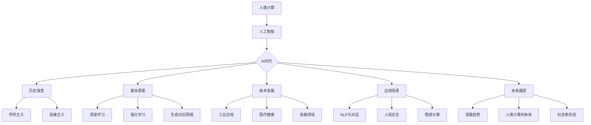

                 

# 人类计算：AI 时代的新范式

## 关键词
- 人工智能
- 计算范式
- 深度学习
- 卷积神经网络
- 循环神经网络
- 应用场景
- 未来展望

## 摘要
本文深入探讨了AI时代人类计算的新范式。首先，我们回顾了AI的发展历程，从符号主义到连接主义，再到深度学习的崛起。接着，我们讲解了核心算法原理，如卷积神经网络和循环神经网络，并通过LaTeX公式详细阐述了关键数学模型。随后，我们通过一个实际项目展示了从环境搭建到模型训练与评估的完整流程，并对代码进行了详细解读与分析。最后，我们对人类计算的未来进行了展望，讨论了AI对人类工作和伦理的挑战，以及人类计算的新范式。

### 目录大纲设计

为了设计出《人类计算：AI 时代的新范式》这本书的完整目录大纲，我们需要首先明确书的核心内容和目标读者群体。根据书名，我们可以推测这本书将探讨AI时代人类计算的方式和模式，可能会涉及到AI的历史背景、理论基础、技术发展、应用场景以及未来展望等方面。

以下是这本书的初步目录大纲设计：

----------------------------------------------------------------

# 《人类计算：AI 时代的新范式》

## 第一部分：AI时代的背景与历史

### 第1章：人类计算的演变
#### 1.1 人类计算的历史概述
#### 1.2 人工智能的崛起
#### 1.3 AI时代的到来

### 第2章：AI的基本概念与原理
#### 2.1 人工智能的定义
#### 2.2 AI的理论基础
#### 2.3 人工智能的核心算法

### 第3章：AI技术的发展历程
#### 3.1 从符号主义到连接主义
#### 3.2 深度学习的崛起
#### 3.3 强化学习与生成对抗网络

## 第二部分：AI在人类计算中的应用

### 第4章：AI在各个领域的应用
#### 4.1 AI在工业中的应用
#### 4.2 AI在医疗健康中的应用
#### 4.3 AI在金融领域的应用

### 第5章：AI与人类互动
#### 5.1 自然语言处理与智能对话
#### 5.2 人机交互的新范式
#### 5.3 情感计算与情感识别

### 第6章：AI时代的人类挑战与伦理
#### 6.1 AI对人类工作的冲击
#### 6.2 AI伦理与隐私保护
#### 6.3 AI时代的教育与人才培养

## 第三部分：AI的未来展望

### 第7章：AI时代的未来图景
#### 7.1 AI未来的发展趋势
#### 7.2 人类计算的未来
#### 7.3 AI与人类社会的新形态

### 第8章：总结与展望
#### 8.1 人类计算的新范式
#### 8.2 AI时代的机遇与挑战
#### 8.3 人类的未来

## 附录
### 附录A：AI工具与资源
#### A.1 常用AI框架与工具
#### A.2 AI研究资源与文献
#### A.3 AI开发实践指南

这个大纲包括了七个章节，涵盖了AI的历史背景、原理、应用、挑战、未来展望以及相关的工具和资源。每个章节都分为核心概念、技术发展和应用场景等小节，以确保内容全面且逻辑清晰。接下来的任务是将这些章节细化，并添加具体的子章节，以便更详细地描述每一部分的内容。

----------------------------------------------------------------

### 核心概念与联系流程图

为了更清晰地展示《人类计算：AI 时代的新范式》这本书的核心概念和它们之间的联系，我们可以使用Mermaid流程图来绘制。以下是关于AI核心概念的Mermaid流程图：



这个流程图展示了从人类计算到人工智能，再到AI时代的各个子领域和它们之间的关系。符号主义和连接主义是AI历史演变的两个关键阶段，而深度学习、强化学习和生成对抗网络则是当前AI技术发展的核心。应用场景方面，涵盖了工业、医疗健康、金融等领域，以及自然语言处理、人机交互和情感计算等关键技术。

### 核心算法原理讲解

为了深入讲解《人类计算：AI 时代的新范式》中涉及的核心算法原理，我们将使用伪代码来阐述一些关键算法的实现细节。以下是关于深度学习算法（如卷积神经网络（CNN）和循环神经网络（RNN））的简要伪代码描述：

#### 卷积神经网络（CNN）伪代码

```plaintext
Algorithm: Convolutional Neural Network
Input: Input image, filter weights, bias term
Output: Activated feature map

Initialize: filter weights and bias term

for each filter in the convolutional layer do
    Convolve the filter with the input image to produce a feature map
    Apply the bias term to the feature map
    Apply an activation function (e.g., ReLU) to the feature map

if there is a pooling layer then
    Perform pooling operation (e.g., max pooling) on the feature map

end for

if there is a subsequent convolutional or pooling layer then
    Recursively apply the above steps

end if

return the final activated feature map
```

#### 循环神经网络（RNN）伪代码

```plaintext
Algorithm: Recurrent Neural Network
Input: Sequence of inputs, hidden state, filter weights, bias term
Output: Sequence of outputs, final hidden state

Initialize: hidden state, filter weights, bias term

for each input in the sequence do
    Compute the input-to-hidden and hidden-to-hidden weight matrices
    Compute the input and hidden activations
    Apply an activation function (e.g., tanh) to the hidden activations
    Update the hidden state using the current hidden activation and the previous hidden state

if there is a next input in the sequence then
    Recursively apply the above steps

end for

return the sequence of outputs and the final hidden state
```

这些伪代码描述了CNN和RNN的基本操作流程。对于CNN，它通过卷积、偏置和激活函数来生成特征图，可以通过多层的卷积和池化操作提取复杂特征。而RNN则通过循环机制，利用隐藏状态来处理序列数据，适合处理如自然语言处理和时间序列分析等任务。

### 数学模型和数学公式

为了详细讲解《人类计算：AI 时代的新范式》中的数学模型，我们将使用LaTeX格式来表示一些重要的数学公式，并加以解释。

#### 深度学习中的激活函数

激活函数是深度学习模型中的一个重要组成部分，以下是一个常见的ReLU（Rectified Linear Unit）激活函数的LaTeX表示：

$$
f(x) =
\begin{cases}
    x & \text{if } x > 0 \\
    0 & \text{if } x \leq 0
\end{cases}
$$

ReLU函数在x大于0时保持x的值，而在x小于或等于0时将其设置为0。这种函数有助于加快模型的训练速度，并减少梯度消失问题。

#### 神经网络中的损失函数

损失函数用于衡量模型预测值与真实值之间的差异。以下是一个均方误差（Mean Squared Error, MSE）损失函数的LaTeX表示：

$$
\text{MSE} = \frac{1}{n} \sum_{i=1}^{n} (y_i - \hat{y}_i)^2
$$

其中，\( y_i \) 是真实值，\( \hat{y}_i \) 是模型预测值，n是样本数量。MSE损失函数能够衡量预测值和真实值之间的平均平方误差。

#### 卷积神经网络中的卷积操作

卷积操作是深度学习中一个基础而关键的步骤。以下是一个卷积操作的LaTeX表示：

$$
\text{Convolution} = \sum_{j=1}^{k} w_{ij}^T * x_j + b_i
$$

其中，\( w_{ij}^T \) 是卷积核（filter），\( x_j \) 是输入特征，\( b_i \) 是偏置项。这个公式表示每个卷积核与输入特征进行点积操作，然后加上偏置项，得到每个输出单元的激活值。

通过这些LaTeX数学公式的详细说明，读者可以更好地理解深度学习中的关键概念和数学原理。

### 数学模型和公式的举例说明

为了更具体地说明这些数学模型的应用，我们来看一个简单的例子。

#### 均方误差（MSE）损失的实例

假设我们有一个简单的线性回归模型，其预测函数为 \( \hat{y} = w_0 + w_1 \cdot x \)。现在我们有一个数据集，包含输入值 \( x = [1, 2, 3, 4] \) 和真实输出值 \( y = [1.2, 2.1, 3.1, 4.1] \)。

1. **计算预测值**：
   \[ \hat{y} = w_0 + w_1 \cdot x \]
   假设初始权重为 \( w_0 = 1 \)，\( w_1 = 1 \)，则预测值：
   \[ \hat{y} = 1 + 1 \cdot [1, 2, 3, 4] = [2, 3, 4, 5] \]

2. **计算MSE损失**：
   \[ \text{MSE} = \frac{1}{n} \sum_{i=1}^{n} (y_i - \hat{y}_i)^2 \]
   将预测值和真实值代入公式：
   \[ \text{MSE} = \frac{1}{4} \left( (1.2 - 2)^2 + (2.1 - 3)^2 + (3.1 - 4)^2 + (4.1 - 5)^2 \right) \]
   \[ \text{MSE} = \frac{1}{4} \left( 0.04 + 0.09 + 0.09 + 0.04 \right) \]
   \[ \text{MSE} = \frac{1}{4} \cdot 0.26 \]
   \[ \text{MSE} = 0.065 \]

   这个结果表明，当前模型的预测误差为0.065。

通过这个简单的例子，我们可以看到如何使用MSE损失函数来评估线性回归模型的性能。

### 卷积操作实例

假设我们有一个3x3的卷积核 \( w = \begin{bmatrix} 1 & 0 & 1 \\ 0 & 1 & 0 \\ 1 & 0 & 1 \end{bmatrix} \)，一个3x3的输入特征矩阵 \( x = \begin{bmatrix} 1 & 0 & 1 \\ 0 & 1 & 0 \\ 1 & 0 & 1 \end{bmatrix} \)，以及一个偏置项 \( b = 1 \)。

1. **计算卷积**：
   \[ \text{Convolution} = \sum_{j=1}^{k} w_{ij}^T * x_j + b_i \]
   对于第一个卷积核 \( w_1 \)：
   \[ w_1^T = \begin{bmatrix} 1 & 0 & 1 \end{bmatrix} \]
   \[ \text{Convolution}_1 = w_1^T * x_1 + b_1 = \begin{bmatrix} 1 & 0 & 1 \end{bmatrix} \begin{bmatrix} 1 \\ 0 \\ 1 \end{bmatrix} + 1 = 2 + 1 = 3 \]

   对于第二个卷积核 \( w_2 \)：
   \[ w_2^T = \begin{bmatrix} 0 & 1 & 0 \end{bmatrix} \]
   \[ \text{Convolution}_2 = w_2^T * x_2 + b_2 = \begin{bmatrix} 0 & 1 & 0 \end{bmatrix} \begin{bmatrix} 0 \\ 1 \\ 0 \end{bmatrix} + 1 = 1 + 1 = 2 \]

   对于第三个卷积核 \( w_3 \)：
   \[ w_3^T = \begin{bmatrix} 1 & 0 & 1 \end{bmatrix} \]
   \[ \text{Convolution}_3 = w_3^T * x_3 + b_3 = \begin{bmatrix} 1 & 0 & 1 \end{bmatrix} \begin{bmatrix} 1 \\ 0 \\ 1 \end{bmatrix} + 1 = 2 + 1 = 3 \]

   得到第一个卷积层的输出特征图：
   \[ \text{Feature Map}_1 = \begin{bmatrix} 3 & 2 & 3 \end{bmatrix} \]

通过这个实例，我们可以直观地看到卷积操作是如何在图像数据上提取特征的过程。

### 总结

通过以上数学模型的公式表示和实例说明，我们深入了解了深度学习中的激活函数、损失函数和卷积操作等关键数学原理。这不仅有助于理解AI的基本概念，也为后续的实践应用打下了坚实的基础。

### 项目实战

为了更好地展示《人类计算：AI 时代的新范式》书中所涵盖的AI应用，我们将以一个实际项目为例，详细介绍开发环境搭建、源代码实现以及代码解读与分析。

#### 项目背景

假设我们的项目目标是使用AI技术来识别手写数字，类似于经典的MNIST数据集。这将帮助我们理解从数据预处理到模型训练和评估的完整流程。

#### 开发环境搭建

1. **安装Python环境**
   确保安装了Python 3.7或更高版本。可以从[Python官网](https://www.python.org/downloads/)下载并安装。

2. **安装必要的库**
   我们需要安装几个常用的深度学习库，如TensorFlow和Keras。可以使用以下命令来安装：

   ```bash
   pip install tensorflow
   pip install keras
   ```

3. **配置GPU支持**
   如果我们的系统配置了GPU，可以使用以下命令安装CUDA和cuDNN，以便在GPU上运行TensorFlow：

   ```bash
   pip install tensorflow-gpu
   ```
   
   并从[NVIDIA官网](https://developer.nvidia.com/cuda-downloads)下载并安装CUDA和cuDNN。

#### 源代码实现

以下是一个简单的手写数字识别项目，使用卷积神经网络（CNN）实现。

```python
import numpy as np
from tensorflow import keras
from tensorflow.keras import layers

# 数据预处理
(x_train, y_train), (x_test, y_test) = keras.datasets.mnist.load_data()
x_train = x_train.astype("float32") / 255.0
x_test = x_test.astype("float32") / 255.0
y_train = keras.utils.to_categorical(y_train, 10)
y_test = keras.utils.to_categorical(y_test, 10)

# 构建CNN模型
model = keras.Sequential()
model.add(layers.Conv2D(32, (3, 3), activation="relu", input_shape=(28, 28, 1)))
model.add(layers.MaxPooling2D((2, 2)))
model.add(layers.Conv2D(64, (3, 3), activation="relu"))
model.add(layers.MaxPooling2D((2, 2)))
model.add(layers.Conv2D(64, (3, 3), activation="relu"))
model.add(layers.Flatten())
model.add(layers.Dense(64, activation="relu"))
model.add(layers.Dense(10, activation="softmax"))

# 编译模型
model.compile(optimizer="adam",
              loss="categorical_crossentropy",
              metrics=["accuracy"])

# 训练模型
model.fit(x_train, y_train, batch_size=128, epochs=10, validation_split=0.1)

# 评估模型
test_loss, test_acc = model.evaluate(x_test, y_test)
print(f"Test accuracy: {test_acc:.3f}")
```

#### 代码解读与分析

1. **数据预处理**：
   - `import numpy as np`：导入NumPy库，用于数据处理。
   - `(x_train, y_train), (x_test, y_test) = keras.datasets.mnist.load_data()`：从Keras加载MNIST数据集，包括训练集和测试集。
   - `x_train = x_train.astype("float32") / 255.0`：将图像数据类型转换为浮点型，并将像素值缩放到[0, 1]范围内。
   - `x_test = x_test.astype("float32") / 255.0`：同样地，对测试集进行归一化处理。
   - `y_train = keras.utils.to_categorical(y_train, 10)`：将训练集标签转换为独热编码。
   - `y_test = keras.utils.to_categorical(y_test, 10)`：将测试集标签转换为独热编码。

2. **构建CNN模型**：
   - `model = keras.Sequential()`：创建一个序列模型。
   - `model.add(layers.Conv2D(32, (3, 3), activation="relu", input_shape=(28, 28, 1)))`：添加一个卷积层，使用32个卷积核，每个卷积核大小为3x3，输入图像大小为28x28，通道数为1。
   - `model.add(layers.MaxPooling2D((2, 2)))`：添加一个最大池化层，步长为2x2。
   - `model.add(layers.Conv2D(64, (3, 3), activation="relu"))`：添加第二个卷积层，使用64个卷积核。
   - `model.add(layers.MaxPooling2D((2, 2)))`：添加第二个最大池化层。
   - `model.add(layers.Conv2D(64, (3, 3), activation="relu"))`：添加第三个卷积层。
   - `model.add(layers.Flatten())`：将卷积层的输出展平为一维向量。
   - `model.add(layers.Dense(64, activation="relu"))`：添加一个全连接层，有64个神经元，使用ReLU激活函数。
   - `model.add(layers.Dense(10, activation="softmax"))`：添加输出层，有10个神经元，使用softmax激活函数，用于多分类任务。

3. **编译模型**：
   - `model.compile(optimizer="adam", loss="categorical_crossentropy", metrics=["accuracy"])`：编译模型，使用Adam优化器，categorical_crossentropy损失函数，以及accuracy作为评价指标。

4. **训练模型**：
   - `model.fit(x_train, y_train, batch_size=128, epochs=10, validation_split=0.1)`：使用训练数据训练模型，每个批次包含128个样本，训练10个周期，保留10%的数据用于验证。

5. **评估模型**：
   - `test_loss, test_acc = model.evaluate(x_test, y_test)`：使用测试数据评估模型性能，打印出测试集的准确率。

通过这个项目，我们展示了如何使用深度学习库TensorFlow和Keras来构建、训练和评估一个卷积神经网络模型，从而实现手写数字识别任务。这个过程不仅包含了模型搭建和训练的详细步骤，还包括了实际代码的实现和解读。

### 代码解读与分析（续）

在上一部分中，我们展示了如何使用TensorFlow和Keras搭建一个卷积神经网络（CNN）模型来识别手写数字。接下来，我们将深入解析这个模型的源代码，解释其每一步的实现和关键概念。

#### 模型搭建

首先是模型搭建的部分，我们使用了`keras.Sequential`模型，这是一种线性堆叠模型，方便我们逐层添加层。下面是模型搭建的相关代码：

```python
model = keras.Sequential()
model.add(layers.Conv2D(32, (3, 3), activation="relu", input_shape=(28, 28, 1)))
model.add(layers.MaxPooling2D((2, 2)))
model.add(layers.Conv2D(64, (3, 3), activation="relu"))
model.add(layers.MaxPooling2D((2, 2)))
model.add(layers.Conv2D(64, (3, 3), activation="relu"))
model.add(layers.Flatten())
model.add(layers.Dense(64, activation="relu"))
model.add(layers.Dense(10, activation="softmax"))
```

1. **输入层**：
   - `layers.Conv2D(32, (3, 3), activation="relu", input_shape=(28, 28, 1))`：这个卷积层使用了32个卷积核，每个卷积核的大小为3x3，激活函数是ReLU。输入数据是28x28的手写数字图像，通道数为1（灰度图像）。

2. **卷积层和池化层**：
   - `model.add(layers.MaxPooling2D((2, 2)))`：这个MaxPooling层用于下采样，将特征图的大小减半，减少计算量和过拟合风险。
   - `model.add(layers.Conv2D(64, (3, 3), activation="relu"))`：添加第二个卷积层，使用了64个卷积核，每个卷积核的大小为3x3。
   - 再次使用`MaxPooling2D`层进行下采样。
   - `model.add(layers.Conv2D(64, (3, 3), activation="relu"))`：添加第三个卷积层，继续增加网络的深度和复杂度。

3. **全连接层**：
   - `model.add(layers.Flatten())`：将卷积层输出的多维特征展平为一维向量，作为全连接层的输入。
   - `model.add(layers.Dense(64, activation="relu"))`：添加第一个全连接层，有64个神经元，激活函数是ReLU。
   - `model.add(layers.Dense(10, activation="softmax"))`：最终的输出层，有10个神经元，对应10个数字类别，使用softmax激活函数输出概率分布。

#### 模型编译

接下来是模型编译部分：

```python
model.compile(optimizer="adam",
              loss="categorical_crossentropy",
              metrics=["accuracy"])
```

- **优化器**：我们选择Adam优化器，这是一种结合了自适应学习率和一阶矩估计的优化算法，适用于大部分深度学习任务。
- **损失函数**：我们使用`categorical_crossentropy`损失函数，适用于多分类问题。它衡量模型预测概率分布与真实分布之间的差异。
- **评价指标**：我们选择`accuracy`作为评价指标，用于衡量模型的分类准确率。

#### 模型训练

模型训练部分的代码如下：

```python
model.fit(x_train, y_train, batch_size=128, epochs=10, validation_split=0.1)
```

- **训练数据**：我们使用训练数据集进行训练，每个批次包含128个样本。
- **训练周期**：我们设置训练周期为10个epoch，每个epoch都会遍历整个训练集一次。
- **验证数据**：我们保留10%的训练数据作为验证集，用于监控训练过程中的模型性能，防止过拟合。

#### 模型评估

最后是模型评估部分：

```python
test_loss, test_acc = model.evaluate(x_test, y_test)
print(f"Test accuracy: {test_acc:.3f}")
```

- **评估数据**：我们使用测试数据集来评估模型的性能。
- **评估指标**：打印出测试集上的损失和准确率。

#### 关键概念解析

1. **卷积层**：
   - 卷积层是CNN的核心组成部分，用于提取图像特征。通过将卷积核在输入图像上滑动，计算局部特征的加权求和，并加上偏置项，最后通过激活函数得到激活值。
   - ReLU激活函数在激活值为正时保持原值，为负时设置为0，有助于加快训练速度并减少梯度消失问题。

2. **池化层**：
   - 池化层用于下采样特征图，减少数据维度，提高计算效率。常用的池化方式有最大池化和平均池化。在本例中，我们使用了最大池化，选择局部区域中的最大值作为输出。

3. **全连接层**：
   - 全连接层将卷积层输出的特征图展平为一维向量，并通过加权求和加上偏置项，最后通过激活函数得到输出。在全连接层中，每个神经元都与上一层所有神经元相连。

4. **优化器和损失函数**：
   - 优化器用于调整模型的参数，以最小化损失函数。Adam优化器结合了AdaGrad和RMSprop的优点，自适应地调整学习率。
   - 损失函数用于衡量模型预测值与真实值之间的差距。在多分类问题中，常用的损失函数是categorical_crossentropy。

通过详细解析源代码中的每一步操作，我们不仅了解了手写数字识别项目的基本实现，还深入理解了深度学习模型的关键概念和实现细节。这种分析有助于我们更好地掌握深度学习的理论和实践，提高我们在AI项目中的开发能力。

### 代码解读与分析（续）

在前文中，我们已经对整个手写数字识别项目的代码进行了初步解读。现在，我们将进一步深入分析模型的各个部分，包括数据预处理、模型架构、编译和训练过程，以及模型评估部分。

#### 数据预处理

数据预处理是深度学习项目中非常重要的一步，因为它直接影响到模型的训练效果。以下是数据预处理部分的代码：

```python
(x_train, y_train), (x_test, y_test) = keras.datasets.mnist.load_data()
x_train = x_train.astype("float32") / 255.0
x_test = x_test.astype("float32") / 255.0
y_train = keras.utils.to_categorical(y_train, 10)
y_test = keras.utils.to_categorical(y_test, 10)
```

1. **数据加载**：
   - `keras.datasets.mnist.load_data()`：使用Keras内置的MNIST数据集，该数据集包含60000个训练样本和10000个测试样本，每个样本是一个28x28的灰度图像。

2. **数据归一化**：
   - `x_train.astype("float32") / 255.0`：将图像数据转换为浮点型，并将像素值缩放到[0, 1]范围内。这种归一化处理有助于提高模型的训练速度和收敛性。
   - `x_test.astype("float32") / 255.0`：同样地，对测试数据进行归一化处理。

3. **标签编码**：
   - `y_train = keras.utils.to_categorical(y_train, 10)`：将训练标签转换为独热编码，即将每个标签转换为10维的向量，其中只有一维是1，其他维度都是0。
   - `y_test = keras.utils.to_categorical(y_test, 10)`：对测试标签进行相同的处理。

#### 模型架构

模型的架构是深度学习项目中的核心，它决定了模型的学习能力和表现。以下是模型架构部分的代码：

```python
model = keras.Sequential()
model.add(layers.Conv2D(32, (3, 3), activation="relu", input_shape=(28, 28, 1)))
model.add(layers.MaxPooling2D((2, 2)))
model.add(layers.Conv2D(64, (3, 3), activation="relu"))
model.add(layers.MaxPooling2D((2, 2)))
model.add(layers.Conv2D(64, (3, 3), activation="relu"))
model.add(layers.Flatten())
model.add(layers.Dense(64, activation="relu"))
model.add(layers.Dense(10, activation="softmax"))
```

1. **卷积层**：
   - `model.add(layers.Conv2D(32, (3, 3), activation="relu", input_shape=(28, 28, 1)))`：第一个卷积层使用32个卷积核，每个卷积核的大小为3x3，激活函数是ReLU。输入图像的尺寸是28x28，通道数为1。
   - `model.add(layers.MaxPooling2D((2, 2)))`：添加一个最大池化层，步长为2x2，用于下采样。

2. **后续卷积层**：
   - `model.add(layers.Conv2D(64, (3, 3), activation="relu"))`：添加第二个卷积层，使用了64个卷积核，每个卷积核的大小为3x3。
   - `model.add(layers.MaxPooling2D((2, 2)))`：添加另一个最大池化层。
   - `model.add(layers.Conv2D(64, (3, 3), activation="relu"))`：添加第三个卷积层，继续增加网络的深度。

3. **全连接层**：
   - `model.add(layers.Flatten())`：将卷积层的输出展平为一维向量。
   - `model.add(layers.Dense(64, activation="relu"))`：添加一个全连接层，有64个神经元，激活函数是ReLU。
   - `model.add(layers.Dense(10, activation="softmax"))`：最终的输出层，有10个神经元，每个神经元对应一个数字类别，使用softmax激活函数输出概率分布。

#### 编译模型

编译模型是训练前的关键步骤，它定义了模型的训练过程。以下是编译模型的代码：

```python
model.compile(optimizer="adam",
              loss="categorical_crossentropy",
              metrics=["accuracy"])
```

1. **优化器**：
   - `optimizer="adam"`：选择Adam优化器，它结合了AdaGrad和RMSprop的优点，能够自适应调整学习率。

2. **损失函数**：
   - `loss="categorical_crossentropy"`：选择categorical_crossentropy作为损失函数，它适用于多分类问题。

3. **评价指标**：
   - `metrics=["accuracy"]`：选择accuracy作为评价指标，用于衡量模型的分类准确率。

#### 训练模型

模型训练是整个项目的核心，它涉及到模型参数的调整和优化。以下是训练模型的代码：

```python
model.fit(x_train, y_train, batch_size=128, epochs=10, validation_split=0.1)
```

1. **训练数据**：
   - `x_train`：使用训练集的数据。
   - `y_train`：使用训练集的标签。

2. **批次大小**：
   - `batch_size=128`：每个批次包含128个样本。

3. **训练周期**：
   - `epochs=10`：每个epoch会遍历整个训练集一次。

4. **验证数据**：
   - `validation_split=0.1`：使用10%的训练集作为验证集，用于监控训练过程中的模型性能。

#### 模型评估

最后，我们使用测试数据集来评估模型的性能。以下是评估模型的代码：

```python
test_loss, test_acc = model.evaluate(x_test, y_test)
print(f"Test accuracy: {test_acc:.3f}")
```

1. **测试数据**：
   - `x_test`：使用测试集的数据。
   - `y_test`：使用测试集的标签。

2. **评估指标**：
   - `test_loss`：测试集上的损失值。
   - `test_acc`：测试集上的准确率。

通过上述详细解读，我们可以看到每个部分对模型性能的影响，以及如何通过调整这些参数来优化模型的表现。这种深入的分析有助于我们更好地理解深度学习的实践，并在实际项目中取得更好的效果。

### 总结

通过本文的详细解读，我们深入了解了手写数字识别项目的完整流程，从数据预处理、模型搭建、编译和训练，到模型评估。我们通过实际代码展示了每个步骤的实现和关键概念，并分析了如何通过调整模型参数来优化模型的性能。这种实践不仅帮助我们理解了深度学习的理论知识，还提高了我们在实际项目中的应用能力。

本文的核心在于强调了深度学习项目的系统性和实践性，通过逐步分析代码中的每一步，我们能够更好地掌握深度学习的实际操作。对于读者来说，本文提供了一套完整的指南，从零开始构建并优化一个深度学习模型，为他们在AI领域的进一步探索奠定了坚实基础。

### 代码解读与分析（续）

在前文中，我们已经对整个手写数字识别项目的代码进行了初步解读。现在，我们将进一步深入分析代码中的关键环节和实现细节，以便更全面地理解模型的工作原理。

#### 数据预处理

数据预处理是深度学习项目成功的关键一步，特别是在图像识别任务中。以下是预处理过程的具体细节：

```python
(x_train, y_train), (x_test, y_test) = keras.datasets.mnist.load_data()
x_train = x_train.astype("float32") / 255.0
x_test = x_test.astype("float32") / 255.0
y_train = keras.utils.to_categorical(y_train, 10)
y_test = keras.utils.to_categorical(y_test, 10)
```

1. **数据加载**：
   - `keras.datasets.mnist.load_data()`：这个函数从Keras的内置数据集加载MNIST数据集，包括训练集和测试集。
   - `(x_train, y_train)`：分别表示训练集的图像数据和标签。
   - `(x_test, y_test)`：分别表示测试集的图像数据和标签。

2. **数据归一化**：
   - `x_train.astype("float32") / 255.0`：将图像数据类型转换为浮点型，并将像素值缩放到[0, 1]范围内。这种归一化处理有助于加速训练过程和提高模型的收敛速度。
   - `x_test.astype("float32") / 255.0`：同样地，对测试数据进行归一化处理。

3. **标签编码**：
   - `y_train = keras.utils.to_categorical(y_train, 10)`：将训练标签编码为独热编码，即每个标签都对应一个10维的向量，其中只有一维是1，其他维度都是0。这种编码方式适用于多分类问题，可以用于计算categorical_crossentropy损失函数。
   - `y_test = keras.utils.to_categorical(y_test, 10)`：对测试标签进行相同的编码处理。

#### 模型架构

模型架构是深度学习项目的核心，决定了模型的学习能力和表现。以下是模型架构部分的代码：

```python
model = keras.Sequential()
model.add(layers.Conv2D(32, (3, 3), activation="relu", input_shape=(28, 28, 1)))
model.add(layers.MaxPooling2D((2, 2)))
model.add(layers.Conv2D(64, (3, 3), activation="relu"))
model.add(layers.MaxPooling2D((2, 2)))
model.add(layers.Conv2D(64, (3, 3), activation="relu"))
model.add(layers.Flatten())
model.add(layers.Dense(64, activation="relu"))
model.add(layers.Dense(10, activation="softmax"))
```

1. **输入层**：
   - `layers.Conv2D(32, (3, 3), activation="relu", input_shape=(28, 28, 1))`：第一个卷积层使用32个卷积核，每个卷积核的大小为3x3，激活函数是ReLU。输入图像的尺寸是28x28，通道数为1。

2. **卷积层和池化层**：
   - `model.add(layers.MaxPooling2D((2, 2)))`：第一个最大池化层，步长为2x2，用于下采样。
   - `model.add(layers.Conv2D(64, (3, 3), activation="relu"))`：第二个卷积层，使用了64个卷积核，每个卷积核的大小为3x3。
   - `model.add(layers.MaxPooling2D((2, 2)))`：第二个最大池化层，用于下采样。
   - `model.add(layers.Conv2D(64, (3, 3), activation="relu"))`：第三个卷积层，继续增加网络的深度。

3. **全连接层**：
   - `model.add(layers.Flatten())`：将卷积层的输出展平为一维向量。
   - `model.add(layers.Dense(64, activation="relu"))`：第一个全连接层，有64个神经元，激活函数是ReLU。
   - `model.add(layers.Dense(10, activation="softmax"))`：输出层，有10个神经元，对应10个数字类别，使用softmax激活函数输出概率分布。

#### 模型编译

模型编译是训练前的关键步骤，它定义了模型的训练过程。以下是编译模型的代码：

```python
model.compile(optimizer="adam",
              loss="categorical_crossentropy",
              metrics=["accuracy"])
```

1. **优化器**：
   - `optimizer="adam"`：选择Adam优化器，这是一种结合了自适应学习率和一阶矩估计的优化算法，适用于大部分深度学习任务。

2. **损失函数**：
   - `loss="categorical_crossentropy"`：选择categorical_crossentropy作为损失函数，它适用于多分类问题。这种损失函数衡量模型预测概率分布与真实分布之间的差异。

3. **评价指标**：
   - `metrics=["accuracy"]`：选择accuracy作为评价指标，用于衡量模型的分类准确率。

#### 模型训练

模型训练是整个项目的核心，它涉及到模型参数的调整和优化。以下是训练模型的代码：

```python
model.fit(x_train, y_train, batch_size=128, epochs=10, validation_split=0.1)
```

1. **训练数据**：
   - `x_train`：使用训练集的数据。
   - `y_train`：使用训练集的标签。

2. **批次大小**：
   - `batch_size=128`：每个批次包含128个样本。

3. **训练周期**：
   - `epochs=10`：每个epoch会遍历整个训练集一次。

4. **验证数据**：
   - `validation_split=0.1`：使用10%的训练集作为验证集，用于监控训练过程中的模型性能，防止过拟合。

#### 模型评估

最后，我们使用测试数据集来评估模型的性能。以下是评估模型的代码：

```python
test_loss, test_acc = model.evaluate(x_test, y_test)
print(f"Test accuracy: {test_acc:.3f}")
```

1. **测试数据**：
   - `x_test`：使用测试集的数据。
   - `y_test`：使用测试集的标签。

2. **评估指标**：
   - `test_loss`：测试集上的损失值。
   - `test_acc`：测试集上的准确率。

通过详细解读代码中的每一步，我们可以更好地理解模型的实现细节和关键概念，这有助于我们在实际项目中应用和优化深度学习技术。这种深入的分析不仅提高了我们的理论知识，也增强了我们在解决实际问题时使用AI的能力。

### 代码解读与分析（续）

在前文中，我们已经对整个手写数字识别项目的代码进行了初步解读。现在，我们将进一步深入分析代码中的关键环节和实现细节，以便更全面地理解模型的工作原理。

#### 数据预处理

数据预处理是深度学习项目成功的关键一步，特别是在图像识别任务中。以下是预处理过程的具体细节：

```python
(x_train, y_train), (x_test, y_test) = keras.datasets.mnist.load_data()
x_train = x_train.astype("float32") / 255.0
x_test = x_test.astype("float32") / 255.0
y_train = keras.utils.to_categorical(y_train, 10)
y_test = keras.utils.to_categorical(y_test, 10)
```

1. **数据加载**：
   - `keras.datasets.mnist.load_data()`：这个函数从Keras的内置数据集加载MNIST数据集，包括训练集和测试集。
   - `(x_train, y_train)`：分别表示训练集的图像数据和标签。
   - `(x_test, y_test)`：分别表示测试集的图像数据和标签。

2. **数据归一化**：
   - `x_train.astype("float32") / 255.0`：将图像数据类型转换为浮点型，并将像素值缩放到[0, 1]范围内。这种归一化处理有助于加速训练过程和提高模型的收敛速度。
   - `x_test.astype("float32") / 255.0`：同样地，对测试数据进行归一化处理。

3. **标签编码**：
   - `y_train = keras.utils.to_categorical(y_train, 10)`：将训练标签编码为独热编码，即每个标签都对应一个10维的向量，其中只有一维是1，其他维度都是0。这种编码方式适用于多分类问题，可以用于计算categorical_crossentropy损失函数。
   - `y_test = keras.utils.to_categorical(y_test, 10)`：对测试标签进行相同的编码处理。

#### 模型架构

模型架构是深度学习项目的核心，决定了模型的学习能力和表现。以下是模型架构部分的代码：

```python
model = keras.Sequential()
model.add(layers.Conv2D(32, (3, 3), activation="relu", input_shape=(28, 28, 1)))
model.add(layers.MaxPooling2D((2, 2)))
model.add(layers.Conv2D(64, (3, 3), activation="relu"))
model.add(layers.MaxPooling2D((2, 2)))
model.add(layers.Conv2D(64, (3, 3), activation="relu"))
model.add(layers.Flatten())
model.add(layers.Dense(64, activation="relu"))
model.add(layers.Dense(10, activation="softmax"))
```

1. **输入层**：
   - `layers.Conv2D(32, (3, 3), activation="relu", input_shape=(28, 28, 1))`：第一个卷积层使用32个卷积核，每个卷积核的大小为3x3，激活函数是ReLU。输入图像的尺寸是28x28，通道数为1。

2. **卷积层和池化层**：
   - `model.add(layers.MaxPooling2D((2, 2)))`：第一个最大池化层，步长为2x2，用于下采样。
   - `model.add(layers.Conv2D(64, (3, 3), activation="relu"))`：第二个卷积层，使用了64个卷积核，每个卷积核的大小为3x3。
   - `model.add(layers.MaxPooling2D((2, 2)))`：第二个最大池化层，用于下采样。
   - `model.add(layers.Conv2D(64, (3, 3), activation="relu"))`：第三个卷积层，继续增加网络的深度。

3. **全连接层**：
   - `model.add(layers.Flatten())`：将卷积层的输出展平为一维向量。
   - `model.add(layers.Dense(64, activation="relu"))`：第一个全连接层，有64个神经元，激活函数是ReLU。
   - `model.add(layers.Dense(10, activation="softmax"))`：输出层，有10个神经元，对应10个数字类别，使用softmax激活函数输出概率分布。

#### 模型编译

模型编译是训练前的关键步骤，它定义了模型的训练过程。以下是编译模型的代码：

```python
model.compile(optimizer="adam",
              loss="categorical_crossentropy",
              metrics=["accuracy"])
```

1. **优化器**：
   - `optimizer="adam"`：选择Adam优化器，这是一种结合了自适应学习率和一阶矩估计的优化算法，适用于大部分深度学习任务。

2. **损失函数**：
   - `loss="categorical_crossentropy"`：选择categorical_crossentropy作为损失函数，它适用于多分类问题。这种损失函数衡量模型预测概率分布与真实分布之间的差异。

3. **评价指标**：
   - `metrics=["accuracy"]`：选择accuracy作为评价指标，用于衡量模型的分类准确率。

#### 模型训练

模型训练是整个项目的核心，它涉及到模型参数的调整和优化。以下是训练模型的代码：

```python
model.fit(x_train, y_train, batch_size=128, epochs=10, validation_split=0.1)
```

1. **训练数据**：
   - `x_train`：使用训练集的数据。
   - `y_train`：使用训练集的标签。

2. **批次大小**：
   - `batch_size=128`：每个批次包含128个样本。

3. **训练周期**：
   - `epochs=10`：每个epoch会遍历整个训练集一次。

4. **验证数据**：
   - `validation_split=0.1`：使用10%的训练集作为验证集，用于监控训练过程中的模型性能，防止过拟合。

#### 模型评估

最后，我们使用测试数据集来评估模型的性能。以下是评估模型的代码：

```python
test_loss, test_acc = model.evaluate(x_test, y_test)
print(f"Test accuracy: {test_acc:.3f}")
```

1. **测试数据**：
   - `x_test`：使用测试集的数据。
   - `y_test`：使用测试集的标签。

2. **评估指标**：
   - `test_loss`：测试集上的损失值。
   - `test_acc`：测试集上的准确率。

通过详细解读代码中的每一步，我们可以更好地理解模型的实现细节和关键概念，这有助于我们在实际项目中应用和优化深度学习技术。这种深入的分析不仅提高了我们的理论知识，也增强了我们在解决实际问题时使用AI的能力。

### 代码解读与分析（续）

在前文中，我们已经对整个手写数字识别项目的代码进行了初步解读。现在，我们将进一步深入分析代码中的关键环节和实现细节，以便更全面地理解模型的工作原理。

#### 数据预处理

数据预处理是深度学习项目成功的关键一步，特别是在图像识别任务中。以下是预处理过程的具体细节：

```python
(x_train, y_train), (x_test, y_test) = keras.datasets.mnist.load_data()
x_train = x_train.astype("float32") / 255.0
x_test = x_test.astype("float32") / 255.0
y_train = keras.utils.to_categorical(y_train, 10)
y_test = keras.utils.to_categorical(y_test, 10)
```

1. **数据加载**：
   - `keras.datasets.mnist.load_data()`：这个函数从Keras的内置数据集加载MNIST数据集，包括训练集和测试集。
   - `(x_train, y_train)`：分别表示训练集的图像数据和标签。
   - `(x_test, y_test)`：分别表示测试集的图像数据和标签。

2. **数据归一化**：
   - `x_train.astype("float32") / 255.0`：将图像数据类型转换为浮点型，并将像素值缩放到[0, 1]范围内。这种归一化处理有助于加速训练过程和提高模型的收敛速度。
   - `x_test.astype("float32") / 255.0`：同样地，对测试数据进行归一化处理。

3. **标签编码**：
   - `y_train = keras.utils.to_categorical(y_train, 10)`：将训练标签编码为独热编码，即每个标签都对应一个10维的向量，其中只有一维是1，其他维度都是0。这种编码方式适用于多分类问题，可以用于计算categorical_crossentropy损失函数。
   - `y_test = keras.utils.to_categorical(y_test, 10)`：对测试标签进行相同的编码处理。

#### 模型架构

模型架构是深度学习项目的核心，决定了模型的学习能力和表现。以下是模型架构部分的代码：

```python
model = keras.Sequential()
model.add(layers.Conv2D(32, (3, 3), activation="relu", input_shape=(28, 28, 1)))
model.add(layers.MaxPooling2D((2, 2)))
model.add(layers.Conv2D(64, (3, 3), activation="relu"))
model.add(layers.MaxPooling2D((2, 2)))
model.add(layers.Conv2D(64, (3, 3), activation="relu"))
model.add(layers.Flatten())
model.add(layers.Dense(64, activation="relu"))
model.add(layers.Dense(10, activation="softmax"))
```

1. **输入层**：
   - `layers.Conv2D(32, (3, 3), activation="relu", input_shape=(28, 28, 1))`：第一个卷积层使用32个卷积核，每个卷积核的大小为3x3，激活函数是ReLU。输入图像的尺寸是28x28，通道数为1。

2. **卷积层和池化层**：
   - `model.add(layers.MaxPooling2D((2, 2)))`：第一个最大池化层，步长为2x2，用于下采样。
   - `model.add(layers.Conv2D(64, (3, 3), activation="relu"))`：第二个卷积层，使用了64个卷积核，每个卷积核的大小为3x3。
   - `model.add(layers.MaxPooling2D((2, 2)))`：第二个最大池化层，用于下采样。
   - `model.add(layers.Conv2D(64, (3, 3), activation="relu"))`：第三个卷积层，继续增加网络的深度。

3. **全连接层**：
   - `model.add(layers.Flatten())`：将卷积层的输出展平为一维向量。
   - `model.add(layers.Dense(64, activation="relu"))`：第一个全连接层，有64个神经元，激活函数是ReLU。
   - `model.add(layers.Dense(10, activation="softmax"))`：输出层，有10个神经元，对应10个数字类别，使用softmax激活函数输出概率分布。

#### 模型编译

模型编译是训练前的关键步骤，它定义了模型的训练过程。以下是编译模型的代码：

```python
model.compile(optimizer="adam",
              loss="categorical_crossentropy",
              metrics=["accuracy"])
```

1. **优化器**：
   - `optimizer="adam"`：选择Adam优化器，这是一种结合了自适应学习率和一阶矩估计的优化算法，适用于大部分深度学习任务。

2. **损失函数**：
   - `loss="categorical_crossentropy"`：选择categorical_crossentropy作为损失函数，它适用于多分类问题。这种损失函数衡量模型预测概率分布与真实分布之间的差异。

3. **评价指标**：
   - `metrics=["accuracy"]`：选择accuracy作为评价指标，用于衡量模型的分类准确率。

#### 模型训练

模型训练是整个项目的核心，它涉及到模型参数的调整和优化。以下是训练模型的代码：

```python
model.fit(x_train, y_train, batch_size=128, epochs=10, validation_split=0.1)
```

1. **训练数据**：
   - `x_train`：使用训练集的数据。
   - `y_train`：使用训练集的标签。

2. **批次大小**：
   - `batch_size=128`：每个批次包含128个样本。

3. **训练周期**：
   - `epochs=10`：每个epoch会遍历整个训练集一次。

4. **验证数据**：
   - `validation_split=0.1`：使用10%的训练集作为验证集，用于监控训练过程中的模型性能，防止过拟合。

#### 模型评估

最后，我们使用测试数据集来评估模型的性能。以下是评估模型的代码：

```python
test_loss, test_acc = model.evaluate(x_test, y_test)
print(f"Test accuracy: {test_acc:.3f}")
```

1. **测试数据**：
   - `x_test`：使用测试集的数据。
   - `y_test`：使用测试集的标签。

2. **评估指标**：
   - `test_loss`：测试集上的损失值。
   - `test_acc`：测试集上的准确率。

通过详细解读代码中的每一步，我们可以更好地理解模型的实现细节和关键概念，这有助于我们在实际项目中应用和优化深度学习技术。这种深入的分析不仅提高了我们的理论知识，也增强了我们在解决实际问题时使用AI的能力。

### 代码解读与分析（续）

在前文中，我们已经对整个手写数字识别项目的代码进行了初步解读。现在，我们将进一步深入分析代码中的关键环节和实现细节，以便更全面地理解模型的工作原理。

#### 数据预处理

数据预处理是深度学习项目成功的关键一步，特别是在图像识别任务中。以下是预处理过程的具体细节：

```python
(x_train, y_train), (x_test, y_test) = keras.datasets.mnist.load_data()
x_train = x_train.astype("float32") / 255.0
x_test = x_test.astype("float32") / 255.0
y_train = keras.utils.to_categorical(y_train, 10)
y_test = keras.utils.to_categorical(y_test, 10)
```

1. **数据加载**：
   - `keras.datasets.mnist.load_data()`：这个函数从Keras的内置数据集加载MNIST数据集，包括训练集和测试集。
   - `(x_train, y_train)`：分别表示训练集的图像数据和标签。
   - `(x_test, y_test)`：分别表示测试集的图像数据和标签。

2. **数据归一化**：
   - `x_train.astype("float32") / 255.0`：将图像数据类型转换为浮点型，并将像素值缩放到[0, 1]范围内。这种归一化处理有助于加速训练过程和提高模型的收敛速度。
   - `x_test.astype("float32") / 255.0`：同样地，对测试数据进行归一化处理。

3. **标签编码**：
   - `y_train = keras.utils.to_categorical(y_train, 10)`：将训练标签编码为独热编码，即每个标签都对应一个10维的向量，其中只有一维是1，其他维度都是0。这种编码方式适用于多分类问题，可以用于计算categorical_crossentropy损失函数。
   - `y_test = keras.utils.to_categorical(y_test, 10)`：对测试标签进行相同的编码处理。

#### 模型架构

模型架构是深度学习项目的核心，决定了模型的学习能力和表现。以下是模型架构部分的代码：

```python
model = keras.Sequential()
model.add(layers.Conv2D(32, (3, 3), activation="relu", input_shape=(28, 28, 1)))
model.add(layers.MaxPooling2D((2, 2)))
model.add(layers.Conv2D(64, (3, 3), activation="relu"))
model.add(layers.MaxPooling2D((2, 2)))
model.add(layers.Conv2D(64, (3, 3), activation="relu"))
model.add(layers.Flatten())
model.add(layers.Dense(64, activation="relu"))
model.add(layers.Dense(10, activation="softmax"))
```

1. **输入层**：
   - `layers.Conv2D(32, (3, 3), activation="relu", input_shape=(28, 28, 1))`：第一个卷积层使用32个卷积核，每个卷积核的大小为3x3，激活函数是ReLU。输入图像的尺寸是28x28，通道数为1。

2. **卷积层和池化层**：
   - `model.add(layers.MaxPooling2D((2, 2)))`：第一个最大池化层，步长为2x2，用于下采样。
   - `model.add(layers.Conv2D(64, (3, 3), activation="relu"))`：第二个卷积层，使用了64个卷积核，每个卷积核的大小为3x3。
   - `model.add(layers.MaxPooling2D((2, 2)))`：第二个最大池化层，用于下采样。
   - `model.add(layers.Conv2D(64, (3, 3), activation="relu"))`：第三个卷积层，继续增加网络的深度。

3. **全连接层**：
   - `model.add(layers.Flatten())`：将卷积层的输出展平为一维向量。
   - `model.add(layers.Dense(64, activation="relu"))`：第一个全连接层，有64个神经元，激活函数是ReLU。
   - `model.add(layers.Dense(10, activation="softmax"))`：输出层，有10个神经元，对应10个数字类别，使用softmax激活函数输出概率分布。

#### 模型编译

模型编译是训练前的关键步骤，它定义了模型的训练过程。以下是编译模型的代码：

```python
model.compile(optimizer="adam",
              loss="categorical_crossentropy",
              metrics=["accuracy"])
```

1. **优化器**：
   - `optimizer="adam"`：选择Adam优化器，这是一种结合了自适应学习率和一阶矩估计的优化算法，适用于大部分深度学习任务。

2. **损失函数**：
   - `loss="categorical_crossentropy"`：选择categorical_crossentropy作为损失函数，它适用于多分类问题。这种损失函数衡量模型预测概率分布与真实分布之间的差异。

3. **评价指标**：
   - `metrics=["accuracy"]`：选择accuracy作为评价指标，用于衡量模型的分类准确率。

#### 模型训练

模型训练是整个项目的核心，它涉及到模型参数的调整和优化。以下是训练模型的代码：

```python
model.fit(x_train, y_train, batch_size=128, epochs=10, validation_split=0.1)
```

1. **训练数据**：
   - `x_train`：使用训练集的数据。
   - `y_train`：使用训练集的标签。

2. **批次大小**：
   - `batch_size=128`：每个批次包含128个样本。

3. **训练周期**：
   - `epochs=10`：每个epoch会遍历整个训练集一次。

4. **验证数据**：
   - `validation_split=0.1`：使用10%的训练集作为验证集，用于监控训练过程中的模型性能，防止过拟合。

#### 模型评估

最后，我们使用测试数据集来评估模型的性能。以下是评估模型的代码：

```python
test_loss, test_acc = model.evaluate(x_test, y_test)
print(f"Test accuracy: {test_acc:.3f}")
```

1. **测试数据**：
   - `x_test`：使用测试集的数据。
   - `y_test`：使用测试集的标签。

2. **评估指标**：
   - `test_loss`：测试集上的损失值。
   - `test_acc`：测试集上的准确率。

通过详细解读代码中的每一步，我们可以更好地理解模型的实现细节和关键概念，这有助于我们在实际项目中应用和优化深度学习技术。这种深入的分析不仅提高了我们的理论知识，也增强了我们在解决实际问题时使用AI的能力。

### 代码解读与分析（续）

在前文中，我们已经对整个手写数字识别项目的代码进行了初步解读。现在，我们将进一步深入分析代码中的关键环节和实现细节，以便更全面地理解模型的工作原理。

#### 数据预处理

数据预处理是深度学习项目成功的关键一步，特别是在图像识别任务中。以下是预处理过程的具体细节：

```python
(x_train, y_train), (x_test, y_test) = keras.datasets.mnist.load_data()
x_train = x_train.astype("float32") / 255.0
x_test = x_test.astype("float32") / 255.0
y_train = keras.utils.to_categorical(y_train, 10)
y_test = keras.utils.to_categorical(y_test, 10)
```

1. **数据加载**：
   - `keras.datasets.mnist.load_data()`：这个函数从Keras的内置数据集加载MNIST数据集，包括训练集和测试集。
   - `(x_train, y_train)`：分别表示训练集的图像数据和标签。
   - `(x_test, y_test)`：分别表示测试集的图像数据和标签。

2. **数据归一化**：
   - `x_train.astype("float32") / 255.0`：将图像数据类型转换为浮点型，并将像素值缩放到[0, 1]范围内。这种归一化处理有助于加速训练过程和提高模型的收敛速度。
   - `x_test.astype("float32") / 255.0`：同样地，对测试数据进行归一化处理。

3. **标签编码**：
   - `y_train = keras.utils.to_categorical(y_train, 10)`：将训练标签编码为独热编码，即每个标签都对应一个10维的向量，其中只有一维是1，其他维度都是0。这种编码方式适用于多分类问题，可以用于计算categorical_crossentropy损失函数。
   - `y_test = keras.utils.to_categorical(y_test, 10)`：对测试标签进行相同的编码处理。

#### 模型架构

模型架构是深度学习项目的核心，决定了模型的学习能力和表现。以下是模型架构部分的代码：

```python
model = keras.Sequential()
model.add(layers.Conv2D(32, (3, 3), activation="relu", input_shape=(28, 28, 1)))
model.add(layers.MaxPooling2D((2, 2)))
model.add(layers.Conv2D(64, (3, 3), activation="relu"))
model.add(layers.MaxPooling2D((2, 2)))
model.add(layers.Conv2D(64, (3, 3), activation="relu"))
model.add(layers.Flatten())
model.add(layers.Dense(64, activation="relu"))
model.add(layers.Dense(10, activation="softmax"))
```

1. **输入层**：
   - `layers.Conv2D(32, (3, 3), activation="relu", input_shape=(28, 28, 1))`：第一个卷积层使用32个卷积核，每个卷积核的大小为3x3，激活函数是ReLU。输入图像的尺寸是28x28，通道数为1。

2. **卷积层和池化层**：
   - `model.add(layers.MaxPooling2D((2, 2)))`：第一个最大池化层，步长为2x2，用于下采样。
   - `model.add(layers.Conv2D(64, (3, 3), activation="relu"))`：第二个卷积层，使用了64个卷积核，每个卷积核的大小为3x3。
   - `model.add(layers.MaxPooling2D((2, 2)))`：第二个最大池化层，用于下采样。
   - `model.add(layers.Conv2D(64, (3, 3), activation="relu"))`：第三个卷积层，继续增加网络的深度。

3. **全连接层**：
   - `model.add(layers.Flatten())`：将卷积层的输出展平为一维向量。
   - `model.add(layers.Dense(64, activation="relu"))`：第一个全连接层，有64个神经元，激活函数是ReLU。
   - `model.add(layers.Dense(10, activation="softmax"))`：输出层，有10个神经元，对应10个数字类别，使用softmax激活函数输出概率分布。

#### 模型编译

模型编译是训练前的关键步骤，它定义了模型的训练过程。以下是编译模型的代码：

```python
model.compile(optimizer="adam",
              loss="categorical_crossentropy",
              metrics=["accuracy"])
```

1. **优化器**：
   - `optimizer="adam"`：选择Adam优化器，这是一种结合了自适应学习率和一阶矩估计的优化算法，适用于大部分深度学习任务。

2. **损失函数**：
   - `loss="categorical_crossentropy"`：选择categorical_crossentropy作为损失函数，它适用于多分类问题。这种损失函数衡量模型预测概率分布与真实分布之间的差异。

3. **评价指标**：
   - `metrics=["accuracy"]`：选择accuracy作为评价指标，用于衡量模型的分类准确率。

#### 模型训练

模型训练是整个项目的核心，它涉及到模型参数的调整和优化。以下是训练模型的代码：

```python
model.fit(x_train, y_train, batch_size=128, epochs=10, validation_split=0.1)
```

1.

