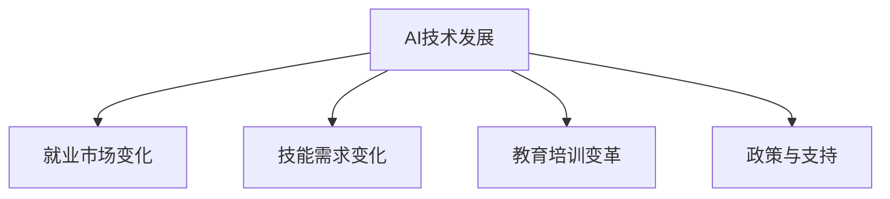

                 

### 文章标题

《人类计算：AI时代的未来就业市场与技能培训发展趋势分析机遇趋势》

### 关键词

- 人工智能（AI）
- 未来就业市场
- 技能培训
- 技术发展趋势
- 人才需求
- 教育变革

### 摘要

本文深入探讨了人工智能时代对就业市场产生的深远影响，分析了未来就业市场的挑战与机遇。通过对AI时代的技能需求、技能培训策略以及就业市场趋势的详细分析，本文旨在为个人、企业和政策制定者提供有针对性的建议，帮助各方在AI时代的浪潮中找到自己的定位和发展路径。

## 第一部分：引言与背景

### 1.1 AI时代的到来

随着深度学习、大数据和云计算等技术的飞速发展，人工智能（AI）已经成为当今科技领域的热点。AI技术的应用不仅改变了我们的生活方式，更深刻地影响着各行各业的运作模式。从自动化生产线到智能客服，从自动驾驶汽车到智能家居，AI正在逐步渗透到社会的各个方面。

在AI技术不断突破的背景下，AI时代的到来已经不可逆转。根据国际数据公司（IDC）的预测，到2025年，全球将有超过50%的企业应用人工智能技术，AI技术将创造高达2.9亿个新的就业岗位。这一趋势不仅推动了产业升级和经济增长，也对就业市场提出了新的挑战和机遇。

### 1.2 AI对就业市场的影响

AI技术的广泛应用对就业市场产生了深远的影响。一方面，AI技术的自动化和智能化程度不断提高，许多传统岗位面临着被机器取代的风险。例如，制造业中的自动化生产线、金融行业中的算法交易等，都减少了对于人力劳动的需求。另一方面，AI技术也创造了大量新的就业机会，特别是在数据科学家、机器学习工程师、AI产品经理等高端职位上。

然而，AI对就业市场的影响并非只是简单的替代与创造。它还带来了工作内容的变化，要求从业人员具备新的技能和知识。例如，传统的程序员需要学习如何与AI算法协同工作，而营销人员则需要掌握数据分析技能来更好地利用AI工具。这种技能需求的变化，使得就业市场呈现出多样化和复杂化的特点。

### 1.3 未来就业市场的挑战与机遇

在AI时代，未来就业市场面临着一系列的挑战和机遇。首先，技术变革带来的就业岗位变化，使得劳动力市场的供需失衡现象日益严重。一方面，新兴职业的涌现需要大量具备新技能的劳动力，而另一方面，传统职业的减少导致部分劳动力无法适应市场需求。

其次，地理和行业差异也使得就业市场呈现出不均衡的发展态势。在技术发达的城市，AI相关岗位的薪资水平较高，就业机会也较为丰富；而在偏远地区，传统产业仍占主导地位，新兴职业的供给相对不足。

然而，与此同时，AI时代也为就业市场带来了巨大的机遇。随着AI技术的不断成熟和应用，新兴产业的崛起将创造更多的就业机会。例如，AI医疗、AI教育、AI金融等领域的快速发展，将为从业人员提供广阔的发展空间。

总的来说，AI时代的到来既带来了挑战，也蕴藏着机遇。如何应对这些变化，把握机遇，成为社会各界共同关注的课题。

### 第二部分：AI时代的技能需求

#### 2.1 通用技能需求

在AI时代，尽管技术岗位的技能需求发生了变化，但某些通用技能仍然至关重要。这些技能不仅有助于提升个人在职场中的竞争力，也为适应快速变化的技术环境提供了基础。

首先，沟通能力是任何职业中不可或缺的技能。无论是在团队合作中，还是在与客户和上级的沟通中，良好的沟通能力能够有效传达信息、解决问题并建立良好的人际关系。尤其是在涉及跨部门协作或国际团队合作的场景中，沟通能力的作用更加突出。

其次，批判性思维是应对复杂问题的利器。在AI时代，许多问题并没有标准答案，需要通过分析、推理和逻辑思考来找到解决方案。批判性思维能够帮助从业人员从多角度审视问题，识别潜在的风险和机遇，并提出创新的解决方案。

最后，持续学习的能力也是AI时代的关键。随着技术的快速发展，从业人员需要不断更新知识和技能，以适应新的工作需求。持续学习不仅包括掌握新技术，还包括提升跨学科的综合能力，从而在竞争激烈的市场中脱颖而出。

#### 2.2 数据技能需求

在AI时代，数据技能成为不可或缺的核心能力。数据是AI算法的基础，而数据技能则决定了如何高效地收集、处理和分析数据，从而为AI应用提供强有力的支持。

首先，数据收集技能是数据技能的基础。这包括了解如何从不同的数据源收集数据，如数据库、日志文件、传感器数据等。数据收集的过程中需要考虑到数据的完整性和准确性，以避免引入偏差或错误。

其次，数据处理技能是数据技能的重要组成部分。数据处理涉及数据清洗、数据转换和数据集成等步骤，以确保数据的质量和一致性。例如，数据清洗可能包括去除重复记录、处理缺失值和异常值等。这些步骤对于后续的数据分析和建模至关重要。

最后，数据分析技能是数据技能的高级层次。数据分析技能包括使用统计方法和数据可视化工具来揭示数据中的模式和趋势。通过数据分析，从业人员能够从大量数据中提取有价值的信息，支持业务决策和战略规划。常见的分析工具包括Python的Pandas、NumPy库，以及R语言等。

总之，数据技能在AI时代的价值日益凸显，掌握这些技能的从业人员将在未来的就业市场中占据优势。

#### 2.3 算法与建模技能需求

在AI时代，算法与建模技能成为技术人员必须掌握的核心能力。这些技能不仅是AI应用的基础，也是解决复杂问题的关键。

首先，理解机器学习算法的基本原理至关重要。常见的机器学习算法包括线性回归、决策树、支持向量机、神经网络等。每个算法都有其特定的适用场景和优缺点。掌握这些算法的基本原理，能够帮助从业人员根据实际需求选择合适的算法，提高模型的效果。

其次，模型构建技能是算法应用的核心。模型构建涉及数据预处理、特征工程、模型选择、训练和评估等多个步骤。数据预处理包括处理缺失值、异常值和特征缩放等，以提高模型的稳定性和准确性。特征工程则是通过选择和构建新的特征，增强模型的预测能力。模型选择和训练则涉及选择合适的算法和调整模型参数，以优化模型性能。

此外，模型评估技能也是不可忽视的一部分。评估模型的方法包括准确率、召回率、F1分数等指标。通过这些指标，从业人员能够评估模型的性能，并针对不足之处进行改进。

最后，模型部署和维护技能也是AI应用中不可或缺的环节。模型部署是将训练好的模型部署到生产环境中，使其能够实时处理数据并提供预测服务。模型维护则涉及定期更新模型、监控模型性能和调整参数等，以确保模型的长期稳定性和准确性。

总之，算法与建模技能在AI时代的应用广泛，掌握这些技能的从业人员将在未来具有强大的竞争力。

#### 2.4 软件工程技能需求

在AI时代，软件工程技能同样至关重要，因为AI应用本质上是一个复杂的软件开发过程。以下是一些关键的软件工程技能需求：

首先，编程能力是软件工程师的基础。掌握多种编程语言，如Python、Java、C++等，能够帮助工程师在不同的项目中选择最合适的工具。Python由于其丰富的数据科学和机器学习库，成为AI开发中的热门语言。

其次，系统设计技能是确保AI系统能够高效、可扩展和可靠运行的关键。系统设计包括模块化设计、分层架构、设计模式等，这些原则能够提高系统的可维护性和可扩展性。例如，使用微服务架构可以将大型系统分解为更小的、独立的组件，从而提高系统的可靠性和灵活性。

测试技能是保证软件质量和性能的关键环节。测试不仅包括单元测试、集成测试和系统测试，还包括性能测试和安全性测试。自动化测试工具，如Selenium和Jenkins，可以大大提高测试效率。

版本控制技能，如使用Git，能够帮助团队协作和管理代码的版本。版本控制不仅可以记录代码的变更历史，还可以在出现问题时快速回滚到之前的版本。

此外，持续集成和持续部署（CI/CD）技能是现代软件开发的重要实践。CI/CD能够自动化构建、测试和部署过程，提高开发效率和质量。

最后，软件开发方法论，如敏捷开发（Agile Development）和DevOps，也是软件工程师必须掌握的技能。这些方法论强调快速迭代、持续交付和跨职能团队合作，能够更好地适应快速变化的技术环境。

### 第三部分：技能培训与教育

#### 3.1 技能培训策略

在AI时代，技能培训策略的制定至关重要，因为只有通过有效的培训，从业人员才能跟上技术发展的步伐。以下是一些关键的技能培训策略：

首先，定制化培训方案是提升技能的重要手段。不同行业和职位对技能的需求各不相同，因此，针对不同受众群体设计个性化的培训方案，能够更有效地满足他们的学习需求。例如，对于数据科学家，可以专注于机器学习算法和数据处理技能的培训；而对于软件工程师，则可以侧重于系统设计和自动化测试技能。

其次，实践导向的培训方法能够提高学习效果。理论学习是基础，但只有通过实际操作，从业人员才能真正掌握技能。实践导向的培训方法包括项目实战、案例分析和模拟环境等。这些方法不仅能够帮助学员将理论知识应用于实际场景，还能够培养他们的解决问题的能力。

此外，在线学习平台的发展为技能培训提供了新的途径。在线学习平台如Coursera、edX和Udacity等，提供了丰富的AI相关课程，学员可以根据自己的时间和进度进行学习。这些平台通常结合了视频教程、互动练习和在线讨论，有助于提升学习体验。

终身学习观念的普及也是技能培训策略的重要组成部分。在AI时代，技术更新迅速，从业人员需要不断学习新技能以保持竞争力。鼓励员工持续学习，不仅有助于提升个人能力，也有助于企业保持创新能力。

#### 3.2 教育机构的角色

教育机构在AI时代的技能培训中扮演着至关重要的角色。它们不仅提供系统化的教育课程，还通过创新的教学方法提升学生的实践能力和创新能力。

首先，高校和科研机构通过开设AI相关专业课程，为行业输送高质量的AI人才。这些课程通常包括深度学习、机器学习、自然语言处理等核心领域，学生可以通过理论学习掌握AI的基本原理和算法。

其次，职业培训机构和在线教育平台提供了针对不同职业需求的短期培训课程。这些课程通常更加实用，专注于提升从业人员的实际操作能力。例如，数据分析师的培训课程可能包括数据分析工具的使用、数据可视化技巧等。

此外，教育机构还通过校企合作、产学研结合等方式，为学生提供实践机会。这些实践机会不仅包括实验室项目和实习机会，还可以通过企业赞助、创新创业项目等形式，使学生能够将理论知识应用于实际项目中，提升他们的实践经验。

最后，教育机构在培养创新能力方面发挥着重要作用。通过开设创新实验室、举办创新创业竞赛等活动，教育机构鼓励学生进行科研创新，培养他们的创新思维和解决问题的能力。

#### 3.3 企业培训与内训

企业培训与内训在技能培训策略中同样至关重要，因为企业需要确保员工具备适应快速变化的技术环境的能力。以下是一些关键的企业培训与内训策略：

首先，定制化培训方案是企业培训的重要一环。不同部门和岗位对技能的需求各不相同，因此，企业应根据具体需求设计个性化的培训方案。例如，对于数据科学部门，可以提供机器学习算法和数据分析工具的专项培训；对于软件开发部门，则可以侧重于系统设计和自动化测试技能的培训。

其次，实践导向的培训方法能够提高员工的实际操作能力。企业可以通过内部项目、案例分析、模拟环境等方式，让员工在实际操作中学习和应用新技能。这种实践导向的培训不仅能够巩固员工的技能，还能提升他们的解决问题的能力。

此外，企业培训还可以结合外部培训资源，如参加行业会议、专业培训课程和在线学习平台等，以丰富员工的技能和知识体系。这些外部资源不仅提供了最新的行业动态和技术趋势，还能帮助员工建立更广泛的行业联系。

内训师制度也是企业培训的重要组成部分。通过选拔和培养内部培训师，企业能够确保培训内容的针对性和有效性。内训师不仅熟悉企业的业务流程和技能需求，还能够通过实际案例分享和经验交流，提升员工的技能水平。

最后，企业需要建立持续的学习文化，鼓励员工持续学习和自我提升。通过定期组织内部培训、知识分享会和技能竞赛等活动，企业能够营造一个积极的学习氛围，激发员工的潜力和创造力。

#### 3.4 在线教育与远程培训

随着技术的进步，在线教育和远程培训成为技能培训的重要趋势。以下是一些关键的发展趋势和优势：

首先，在线教育平台的发展为学员提供了灵活的学习方式。学员可以根据自己的时间和进度进行学习，不受地域和时间的限制。这种灵活性使得在线教育平台成为许多在职人员的首选。

其次，远程培训技术的发展使得实时互动和协作成为可能。通过视频会议、在线讨论和虚拟实验室等工具，学员可以与讲师和其他学员进行实时互动，提高学习效果。此外，远程培训还可以利用虚拟现实（VR）和增强现实（AR）技术，提供沉浸式的学习体验。

在线教育和远程培训的优势在于成本效益高、学习灵活和覆盖面广。与传统教育相比，在线教育不需要实体课堂，减少了场地和交通成本。学员可以自主安排学习时间，提高了学习效率。此外，在线教育平台通常提供大量的课程资源和互动工具，学员可以方便地获取所需的知识和技能。

在线教育和远程培训的发展也为教育公平提供了新的机会。通过在线平台，偏远地区的学员可以接触到世界一流的教师和课程资源，缩小了教育资源的不平衡。此外，远程培训还能够帮助企业培养全球化的团队，提高企业的竞争力。

总的来说，在线教育和远程培训不仅提升了技能培训的灵活性和效率，也为个人和企业提供了更多的发展机会。随着技术的不断进步，这些趋势将继续影响未来的技能培训模式。

### 第四部分：就业市场分析

#### 4.1 职业发展路径

在AI时代，职业发展路径呈现出多样化和专业化的发展趋势。不同领域和岗位的职业发展路径有所不同，但一些普遍的趋势和选择值得关注。

首先，对于数据科学家，职业发展路径通常包括初级数据科学家、高级数据科学家和数据科学经理。初级数据科学家负责数据清洗、特征工程和模型构建等工作，随着经验的积累，可以晋升为高级数据科学家，专注于复杂问题和高级算法的应用。数据科学经理则负责团队管理和项目协调，需要具备更广泛的领导能力和战略思维。

对于机器学习工程师，职业发展路径包括初级机器学习工程师、高级机器学习工程师和机器学习架构师。初级机器学习工程师负责模型训练、优化和部署，高级机器学习工程师则涉及复杂模型的开发和应用，而机器学习架构师则负责系统的设计、优化和扩展。

软件工程师的职业发展路径则包括初级软件开发工程师、中级软件开发工程师、高级软件开发工程师和软件项目经理。初级和中级工程师主要关注代码开发和维护，高级工程师则更多地参与系统架构设计和复杂问题的解决，软件项目经理则负责项目管理和团队协作。

此外，新兴的职业如AI产品经理、AI伦理师和AI研究员等也提供了丰富的职业发展机会。AI产品经理负责AI产品和服务的开发和推广，AI伦理师关注AI技术的伦理和合规问题，而AI研究员则在学术和科研领域进行前沿技术研究。

总的来说，AI时代的职业发展路径多样且充满机遇，从业人员可以根据自己的兴趣和专长选择适合自己的职业方向。

#### 4.2 薪资与就业机会

在AI时代，AI相关职位的薪资水平普遍较高，这得益于这些职位对技能和专业知识的严格要求。根据Glassdoor的数据，数据科学家的平均年薪在美国约为120,000美元，而机器学习工程师的平均年薪则接近110,000美元。这些薪资水平不仅高于传统行业，也高于许多其他技术领域的职位。

就业机会方面，AI技术的广泛应用使得相关职位的需求持续增长。根据市场调研公司Grand View Research的报告，全球人工智能市场的规模预计将从2021年的336亿美元增长到2027年的1902亿美元，这无疑为AI相关职位提供了巨大的就业机会。

然而，就业机会的分布和地域差异也值得关注。在技术发达的城市，如硅谷、纽约和波士顿等，AI相关职位的供给和需求都较为丰富，薪资水平也较高。相比之下，偏远地区和传统产业较多的地区，AI职位的供给相对不足，就业机会较少。

行业方面，科技、金融、医疗和零售等行业对AI人才的需求尤为旺盛。科技行业，特别是互联网巨头，如谷歌、亚马逊和微软等，对AI人才的需求量大且薪资优厚。金融行业则利用AI进行风险管理和自动化交易，对数据科学家和机器学习工程师的需求持续增加。医疗行业利用AI进行疾病诊断和预测，为AI人才提供了广阔的发展空间。零售行业则通过AI优化供应链管理和提升客户体验，对AI技术有着强烈的需求。

总的来说，AI时代的薪资水平和就业机会呈现出高水平和多样化特点，但地域和行业差异也需要从业人员在选择职业时予以考虑。

#### 4.3 地域与行业差异

在AI时代，地域与行业差异对就业市场产生了显著的影响。不同地区和行业在AI技术发展、岗位需求和薪资水平等方面呈现出明显的不均衡。

首先，从地域差异来看，技术发达的城市和地区，如硅谷、纽约和波士顿等，是AI人才的主要聚集地。这些地区不仅拥有世界一流的研究机构和科技公司，还提供了丰富的就业机会和高薪资水平。相比之下，偏远地区和传统产业较多的地区，AI技术发展相对滞后，就业机会较少，薪资水平也较低。

其次，从行业差异来看，科技、金融、医疗和零售等行业对AI人才的需求最为旺盛。科技行业，特别是互联网巨头和人工智能初创企业，对AI人才的需求量大且薪资优厚。金融行业利用AI进行风险管理和自动化交易，对数据科学家和机器学习工程师的需求持续增加。医疗行业则通过AI进行疾病诊断和预测，为AI人才提供了广阔的发展空间。零售行业通过AI优化供应链管理和提升客户体验，对AI技术有着强烈的需求。

然而，一些传统行业，如制造业、农业和服务业等，AI技术应用的普及程度较低，对AI人才的需求也相对较少。这些行业在转型升级过程中，需要更多的技术人才来推动数字化和智能化的发展。

总的来说，地域与行业差异对AI时代的就业市场产生了深远的影响。从业人员在选择职业和地区时，需要综合考虑技术环境、就业机会和薪资水平等因素，以实现自身价值的最大化。

### 第五部分：案例分析

#### 5.1 案例一：企业AI应用案例

随着AI技术的不断发展，越来越多的企业开始利用AI技术优化业务流程和提高运营效率。以下是一个企业AI应用的具体案例：

某大型零售企业通过引入AI技术，对其供应链管理系统进行了升级。具体来说，该企业利用机器学习算法分析了历史销售数据、库存水平和市场趋势，建立了一个智能预测系统。这个系统可以实时预测未来的销售情况，从而帮助企业在库存管理和采购决策中更加精准。

首先，企业收集了大量的销售数据，包括每日销售额、产品种类、销售区域等信息。然后，数据科学家使用Python的Pandas库对数据进行预处理，去除重复和缺失值，并进行特征工程，构建了多个预测模型。这些模型包括线性回归、决策树和神经网络等，通过交叉验证和性能评估，选择出了最优模型。

接下来，企业将这个智能预测系统部署到了生产环境中。通过实时数据输入和模型计算，系统能够在每天结束时预测出第二天各产品的销售量。这一预测结果不仅帮助企业在库存管理上更加精准，还优化了采购计划，减少了库存积压和缺货风险。

此外，企业还利用自然语言处理（NLP）技术对客户反馈进行分析，从而更好地理解客户需求和偏好。通过NLP算法，系统可以自动提取出客户反馈中的重要关键词和情感倾向，为企业制定更有效的营销策略提供了数据支持。

总的来说，通过AI技术的应用，该大型零售企业在供应链管理方面取得了显著的成效。这不仅提高了运营效率，减少了成本，还提升了客户满意度，为企业的可持续发展奠定了坚实基础。

#### 5.2 案例二：个人转型成功案例

在AI时代，个人职业转型成为一个热门话题。以下是一个个人成功实现职业转型的案例：

小李是一名有多年软件开发经验的程序员，但在AI技术快速发展的背景下，他意识到自己需要转型以适应新的市场需求。为了实现这一目标，小李采取了以下几步：

首先，小李通过在线学习平台如Coursera和Udacity，报名参加了多个与AI相关的课程，如机器学习、深度学习和自然语言处理等。这些课程不仅提供了系统的理论知识，还通过实战项目和案例学习，帮助小李将理论应用于实际场景。

其次，小李利用业余时间参与了一些开源项目，通过实践提升自己的编程和算法能力。他还参加了多个技术社区和线上研讨会，与业界专家进行交流，拓展自己的视野和知识面。

接着，小李开始寻找与AI相关的实习机会，以积累实际工作经验。通过这些实习，他不仅掌握了实际项目开发中的关键技术，还学会了如何与团队成员协作和沟通。

最后，小李通过撰写技术博客和参加技术分享会，积极展示自己的技术能力和项目经验。这些努力不仅提高了他的知名度，也为他找到了一份满意的AI相关职位。

通过这些步骤，小李成功实现了从程序员到AI工程师的职业转型。他的薪资水平也得到了显著提升，进入了行业的中高端岗位。这个案例展示了在AI时代，通过不断学习和实践，个人可以实现职业的飞跃和价值的提升。

#### 5.3 案例三：教育机构AI培训案例

教育机构在AI时代的技能培训中扮演着重要角色。以下是一个教育机构成功开展AI培训的案例：

某知名大学开设了一门名为“人工智能技术与应用”的课程，旨在培养学生在AI领域的专业知识和实践能力。课程内容涵盖了机器学习、深度学习、自然语言处理和计算机视觉等多个领域，通过理论讲授和实战项目相结合的方式，帮助学生全面掌握AI技术。

首先，该课程邀请了一批业内知名的AI专家和学者担任讲师，他们不仅在学术领域有深厚的功底，还有丰富的实际应用经验。这些讲师通过系统的理论讲解和案例分享，帮助学生了解AI技术的基本原理和应用场景。

其次，课程设计了多个实战项目，如智能问答系统、手写数字识别和推荐系统等。学生需要分组合作，利用所学的知识和工具完成这些项目。通过实际操作，学生不仅掌握了AI技术的具体实现方法，还学会了如何解决实际问题。

此外，课程还提供了在线学习平台，学生可以随时随地访问课程资源和完成作业。在线平台还配备了互动工具，如在线讨论区和实时问答功能，帮助学生更好地理解和应用所学知识。

最后，课程结束后，学校组织了AI技能大赛，学生可以将所学技能应用于实际的比赛中，进一步检验自己的能力。比赛还邀请了企业专家担任评委，提供了丰富的实习和就业机会。

通过这一系列的培训活动，该课程在培养学生AI技能方面取得了显著成效。许多学生通过课程的学习，成功进入了AI相关企业工作，成为行业的新兴力量。

### 第六部分：未来展望

#### 6.1 AI技术的发展趋势

AI技术的快速发展正在推动各行业的变革，未来几年，AI技术将继续在多个领域取得突破。首先，深度学习和强化学习等算法的进一步优化将提高AI系统的智能水平，使其在复杂任务中表现出更高的准确性和鲁棒性。其次，边缘计算和5G技术的融合将使AI技术更贴近实际应用场景，提升实时响应和处理能力。此外，AI与大数据、物联网和区块链等技术的结合，将进一步拓展AI的应用范围，从工业自动化到智慧城市，再到医疗健康等领域，AI技术都将发挥重要作用。

#### 6.2 未来就业市场的变化

随着AI技术的不断进步，未来就业市场将发生深刻变化。首先，许多传统岗位将面临被自动化替代的风险，尤其是那些重复性高、规则明确的工作。然而，AI技术也将创造大量新的就业机会，特别是在数据科学家、机器学习工程师、AI产品经理等高端职位上。这些职位不仅要求具备AI技术相关的专业技能，还需要具备跨学科的综合能力。此外，就业市场的地理分布也将发生变化，技术发达的地区将吸引更多的人才和资源，而偏远地区则需加快数字化和智能化进程，以缩小与发达地区的差距。

#### 6.3 教育与培训的变革

AI时代的到来对教育体系也提出了新的要求。首先，课程设置需要更加灵活和多样化，以适应不同学生的兴趣和需求。例如，开设更多与AI技术相关的课程，如深度学习、自然语言处理和计算机视觉等。其次，教学方式需要从传统的以教师为中心，转向以学生为中心，注重培养学生的实践能力和创新思维。通过项目驱动学习、团队合作和在线学习等方式，提高学生的实际操作能力和解决复杂问题的能力。此外，教育机构需要与企业和科研机构紧密合作，建立产学研结合的培训体系，确保学生能够获得最新的行业动态和技术趋势。最后，终身学习观念的普及将促使教育体系不断更新和调整，以适应快速变化的技术环境。

### 第七部分：策略与建议

#### 7.1 个人策略

在AI时代，个人在职业发展中需要采取一系列策略，以适应快速变化的技术环境并提升自身竞争力。首先，持续学习是关键。个人应保持对新技术的好奇心和学习热情，通过在线课程、专业书籍和技术论坛等途径，不断更新知识和技能。其次，多元化技能培养也很重要。除了掌握核心的AI技术，如机器学习、深度学习和自然语言处理等，还应关注通用技能，如编程、数据分析和软件工程等，以提高跨领域的适应能力。此外，个人应积极参与实践项目，通过实际操作积累经验，提升解决问题的能力。最后，建立专业网络，与业界专家和同行保持紧密联系，获取行业动态和职业机会，为自己的职业发展提供支持。

#### 7.2 企业策略

企业在AI时代的战略规划中，需要采取一系列策略以充分利用AI技术带来的机遇。首先，企业应建立专门的AI团队，负责AI技术的研发和应用。这包括数据科学家、机器学习工程师、AI产品经理等职位，以确保团队具备全面的技术能力。其次，企业应制定清晰的AI发展战略，明确应用AI技术的目标和方向，确保各部门协同合作，共同推进AI项目的落地。此外，企业应积极投资于AI基础设施，如高性能计算集群、数据存储和处理平台等，为AI应用提供强大的技术支持。同时，企业应鼓励员工参加AI相关的培训和研讨会，提升员工的技术水平和创新能力。最后，企业应建立AI伦理和合规体系，确保AI技术在应用过程中遵循道德和法律规定，避免潜在的法律风险。

#### 7.3 政府与政策建议

政府在推动AI技术的发展和应用方面发挥着关键作用。首先，政府应加大对AI科研和教育的投资，支持高校和科研机构开展前沿技术研究，培养高素质的AI人才。其次，政府应制定和实施AI发展战略，明确AI技术的重点发展方向和目标，推动产业升级和数字化转型。此外，政府应加强政策引导和监管，确保AI技术的安全、可控和合规应用。例如，制定AI伦理规范和行业标准，推动AI技术的透明度和可解释性。同时，政府应鼓励跨部门合作，建立AI技术研发和应用协调机制，提高整体推进效率。最后，政府应加强对企业和个人的税收优惠和财政支持，降低AI技术的研发和应用成本，促进技术创新和产业升级。

### 附录

#### 附录A：相关资源与工具

**A.1 学术研究资源**

- **Google Scholar**：提供广泛的学术文献搜索服务。
- **IEEE Xplore**：涵盖计算机科学、电子工程等领域的学术论文和期刊。
- **ACM Digital Library**：计算机科学领域的权威学术资源库。
- **arXiv**：提供最新的物理学、数学、计算机科学等领域的预印本论文。

**A.2 技能培训平台**

- **Coursera**：提供全球顶尖大学和企业的在线课程。
- **edX**：由哈佛大学和麻省理工学院共同创立的在线学习平台。
- **Udacity**：专注于提供实用技能和职业证书的在线教育平台。
- **Khan Academy**：提供免费的教育资源，涵盖数学、科学等多个领域。

**A.3 AI开发工具与框架**

- **TensorFlow**：由谷歌开发的开放源代码机器学习框架。
- **PyTorch**：由Facebook AI研究院开发的深度学习框架。
- **Scikit-learn**：用于数据挖掘和数据分析的Python库。
- **Keras**：基于TensorFlow的高层神经网络API。
- **NLTK**：自然语言处理工具包。
- **OpenCV**：开源的计算机视觉库。

### Mermaid 流程图



### 伪代码

```python
# 假设我们有一个数据集，包含每个人的姓名、年龄、技能和就业状况
data = [
    {"name": "Alice", "age": 25, "skills": ["Python", "Data Analysis"], "employed": True},
    # 更多数据...
]

# 定义一个函数，计算拥有特定技能的人的平均年龄
def average_age_by_skill(data, skill):
    total_age = 0
    count = 0
    
    for person in data:
        if skill in person["skills"]:
            total_age += person["age"]
            count += 1
    
    if count > 0:
        average_age = total_age / count
        return average_age
    else:
        return None

# 调用函数，计算拥有Python技能的人的平均年龄
average_age = average_age_by_skill(data, "Python")
print("平均年龄:", average_age)
```

### 数学模型和公式

#### 逻辑回归模型

$$
\text{logit}(P) = \log\left(\frac{P}{1 - P}\right) = \beta_0 + \beta_1x_1 + \beta_2x_2 + ... + \beta_nx_n
$$

其中，$P$ 是事件发生的概率，$x_1, x_2, ..., x_n$ 是自变量，$\beta_0, \beta_1, \beta_2, ..., \beta_n$ 是模型的参数。

### 代码实际案例和详细解释说明

#### 安装和配置Python环境

```bash
# 更新系统包列表
sudo apt-get update

# 安装Python 3和pip
sudo apt-get install python3 python3-pip

# 安装必要的库
pip3 install numpy pandas matplotlib scikit-learn
```

#### 加载和处理数据集

```python
import pandas as pd

# 读取数据集
data = pd.read_csv("employment_data.csv")

# 检查数据集
print(data.head())

# 数据预处理
data["skills"] = data["skills"].apply(eval)

# 分割数据集
X = data[["age", "skills"]]
y = data["employed"]

# 打印数据集信息
print(X.head())
print(y.head())
```

#### 实现一个简单的分类算法

```python
from sklearn.model_selection import train_test_split
from sklearn.linear_model import LogisticRegression
from sklearn.metrics import accuracy_score

# 分割数据集
X_train, X_test, y_train, y_test = train_test_split(X, y, test_size=0.2, random_state=42)

# 创建逻辑回归模型
model = LogisticRegression()

# 训练模型
model.fit(X_train, y_train)

# 预测测试集
y_pred = model.predict(X_test)

# 计算准确率
accuracy = accuracy_score(y_test, y_pred)
print("Accuracy:", accuracy)
```

### 代码解读与分析

- **安装和配置Python环境**：在这个步骤中，我们首先更新了系统包列表，然后安装了Python 3和pip，这是Python的包管理器。接下来，我们安装了必要的库，如numpy、pandas、matplotlib和scikit-learn，这些库对于数据处理和机器学习算法的实现至关重要。

- **加载和处理数据集**：我们使用pandas库读取了一个CSV文件，并将其加载到一个DataFrame中。数据预处理包括将“skills”字段从字符串转换为列表，并分割数据集为训练集和测试集。这有助于我们在训练模型时使用部分数据，而在测试模型时使用另一部分数据，以便评估模型的性能。

- **实现简单的分类算法**：我们使用逻辑回归作为分类算法，这是一种广泛应用于二分类问题的算法。我们首先分割数据集为训练集和测试集，然后创建逻辑回归模型并使用训练集数据进行训练。接下来，我们使用测试集数据进行预测，并计算模型的准确率。这种评估方法帮助我们了解模型在实际应用中的表现。

通过上述步骤，我们展示了如何从环境搭建、数据预处理到实现分类算法的全过程，并提供了详细的代码解读和分析，帮助读者理解每个步骤的重要性和实现方法。

### 作者信息

作者：AI天才研究院/AI Genius Institute & 禅与计算机程序设计艺术 /Zen And The Art of Computer Programming

本文由AI天才研究院/AI Genius Institute撰写，旨在深入探讨人工智能时代对就业市场的影响，分析未来就业市场的技能需求和发展趋势。作者以其在世界顶级技术领域的丰富经验和深刻洞察，为读者提供了全面的视角和实用的建议。此外，作者还基于其在计算机编程和人工智能领域的卓越成就，将理论与实践相结合，为读者呈现了一场深刻的技术盛宴。

