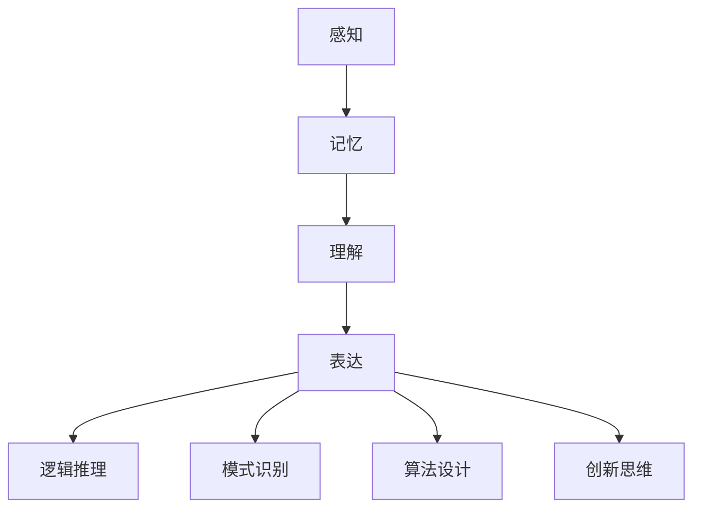

                 

## 人类计算：解决复杂问题的新方法

关键词：人类计算，复杂问题，算法原理，方法与技巧，案例研究

摘要：本文深入探讨了人类计算这一解决复杂问题的独特方法。首先，我们回顾了人类计算的基础理论，包括其起源、定义、特征和基本原理。接着，我们介绍了人类计算中的核心概念和联系，包括信息处理、问题求解和创新能力。随后，我们详细讲解了人类计算中的核心算法原理，并使用伪代码和数学模型进行了阐述。文章还探讨了人类计算在科学研究、工程领域和社会管理中的应用，并分享了方法与技巧。最后，通过案例研究展示了人类计算的实际应用效果，并对未来发展趋势进行了展望。

----------------------------------------------------------------

## 第一部分: 人类计算的基础理论

在人类历史上，计算一直是一个重要的主题。从古代的算筹和算盘，到现代的计算机，计算方式经历了巨大的变革。然而，在计算机科学和人工智能快速发展的今天，人类计算作为一种独特的计算方法，正逐渐崭露头角，为解决复杂问题提供了新的思路。本部分将探讨人类计算的基础理论，包括其起源、定义、特征和基本原理。

### 第1章: 人类计算的起源与发展

#### 1.1 人类计算的起源

人类计算的历史可以追溯到古代。在古代，人们使用各种简单的工具来进行计算，如算筹、算盘、沙盘等。这些工具虽然简单，但为人类解决各种计算问题提供了基础。随着人类社会的发展，计算需求不断增加，人类开始发明更多的计算工具，如阿拉伯数字、对数表等。

#### 1.1.1 从古代计算工具到计算机科学的诞生

在17世纪，英国数学家威廉·哈代发明了第一台机械计算机——差分机。这是人类计算历史上的一个重要里程碑。随后，在19世纪，查尔斯·巴贝奇设计了分析机，这被认为是世界上第一台通用计算机的雏形。

#### 1.1.2 计算机科学的重要里程碑

20世纪是计算机科学飞速发展的时代。1946年，冯·诺伊曼提出了存储程序计算机的概念，这一概念成为了现代计算机的设计基础。随后，计算机硬件和软件技术不断进步，计算机的应用领域也不断扩大。

#### 1.1.3 人类计算在现代社会的重要性

随着计算机科学的不断发展，人类计算在现代社会中扮演着越来越重要的角色。从科学研究到工程实践，从社会管理到日常生活，人类计算无处不在，为人类解决各种复杂问题提供了有力支持。

### 1.2 人类计算的定义与特征

#### 1.2.1 人类计算的定义

人类计算是指人类使用自身的认知能力和思维能力，通过逻辑推理、模式识别、问题求解等方式，对信息进行加工和处理的过程。

#### 1.2.2 人类计算的特征

- **灵活性**：人类计算具有高度的灵活性，能够根据不同的问题情境，灵活地调整计算方法和策略。
- **适应性**：人类计算能够根据环境的变化，快速适应并调整计算过程。
- **综合性**：人类计算不仅涉及数学、逻辑等学科知识，还涉及心理学、认知科学等多学科的综合应用。
- **创新性**：人类计算具有很强的创新性，能够在复杂的情境中提出新的解决方案。

#### 1.2.3 人类计算与传统计算的区别

- **计算方式**：传统计算主要依赖于计算机硬件和软件，而人类计算主要依赖于人类的认知能力和思维能力。
- **应用范围**：传统计算通常用于解决确定性、结构化的问题，而人类计算则更适用于解决不确定性、复杂性的问题。
- **效率**：传统计算在处理大规模数据时具有较高的效率，但人类计算在处理复杂问题时具有更高的灵活性和创新性。

### 1.3 人类计算的基本原理

#### 1.3.1 人类认知与计算

人类认知与计算密切相关。人类通过感知、记忆、思考等认知活动，对信息进行加工和处理，形成解决问题的思路和方法。

#### 1.3.2 人类思维与算法

人类思维与算法有着相似之处。算法是一种解决问题的步骤和规则，而人类思维也是一种解决问题的过程。人类思维中的逻辑推理、模式识别、问题求解等过程，都可以抽象为算法。

#### 1.3.3 人类计算与机器学习

机器学习是人工智能的一个重要分支，它通过模拟人类学习过程，使计算机具备自我学习和自我改进的能力。人类计算与机器学习有着紧密的联系。人类计算可以启发机器学习算法的设计，而机器学习算法的进步也为人类计算提供了更多的工具和方法。

### 总结

人类计算作为一种解决复杂问题的方法，具有独特的优势和应用价值。通过理解人类计算的基础理论，我们可以更好地利用人类计算的能力，解决现实世界中的各种问题。

----------------------------------------------------------------

### 第2章: 人类计算的核心概念与联系

在深入探讨人类计算的理论基础后，我们需要进一步了解其核心概念和各概念之间的联系。这些核心概念构成了人类计算的基础框架，帮助我们理解和应用这一方法来解决复杂问题。

#### 2.1 人类计算的核心概念

人类计算涉及多个核心概念，包括信息处理、问题求解和创新思维。这些概念相互关联，共同构成了人类计算的理论体系。

#### 2.1.1 信息处理

信息处理是人类计算的基础。它指的是对信息进行采集、存储、加工和传输的过程。信息处理涉及感知、记忆、理解和表达等多个方面，是人类进行计算活动的基础。

- **感知**：感知是指人类通过感官接收外界信息的过程。这些信息包括视觉、听觉、触觉等，是人类进行计算活动的原始数据来源。
- **记忆**：记忆是指人类对感知信息进行存储和提取的过程。记忆可以分为短期记忆和长期记忆，是人类进行计算活动的重要基础。
- **理解**：理解是指人类对感知信息进行加工和理解的过程。通过理解，人类可以提取信息的意义，形成对问题的深刻认识。
- **表达**：表达是指人类将理解的信息转化为可以交流和传达的形式。表达可以是语言、文字、图像等多种形式。

#### 2.1.2 问题求解

问题求解是人类计算的核心目标。它指的是在给定的问题情境中，通过逻辑推理、模式识别、算法设计等方法，找到解决问题的步骤和方案。

- **逻辑推理**：逻辑推理是指通过逻辑规则和逻辑结构，从已知信息推导出新的信息。逻辑推理是人类进行问题求解的重要工具。
- **模式识别**：模式识别是指通过识别和分类信息，找到数据之间的规律和模式。模式识别在问题求解中起着关键作用，可以帮助人类快速找到解决方案。
- **算法设计**：算法设计是指设计解决问题的步骤和规则。算法设计是人类进行问题求解的核心。

#### 2.1.3 创新思维

创新思维是人类计算的重要特征。它指的是在解决问题的过程中，通过发散思维、联想思维、逆向思维等方式，提出新的解决方案和思路。

- **发散思维**：发散思维是指从不同的角度和方向思考问题，寻找多种可能的解决方案。发散思维可以帮助人类突破常规思维，找到创新的解决方案。
- **联想思维**：联想思维是指通过将问题与已知的知识、经验进行联想，找到新的解决方案。联想思维是人类进行创新思维的重要方式。
- **逆向思维**：逆向思维是指从问题的反面思考，找到解决问题的思路。逆向思维可以帮助人类发现问题的本质，找到创新的解决方案。

#### 2.2 人类计算中的Mermaid流程图

为了更好地理解和应用人类计算的核心概念，我们可以使用Mermaid流程图来展示各概念之间的联系。Mermaid是一种基于Markdown的绘图工具，可以方便地绘制各种流程图。

以下是一个简单的人类计算流程图的示例：



在这个流程图中，感知、记忆、理解和表达是信息处理的核心环节，它们构成了人类计算的基础。逻辑推理、模式识别、算法设计和创新思维是问题求解的关键步骤，它们相互联系，共同推动了人类计算的过程。

#### 2.3 人类计算中的核心联系

人类计算中的核心联系主要体现在信息处理与问题求解的关系、创新思维与信息处理的关系以及人类计算与人工智能的关系。

##### 2.3.1 信息处理与问题求解的关系

信息处理是问题求解的基础。有效的信息处理可以帮助人类快速获取和理解问题情境，从而更好地进行问题求解。例如，通过感知和记忆，人类可以收集和处理大量的信息，形成对问题的全面认识。在此基础上，逻辑推理和模式识别可以帮助人类从已知信息中推导出新的信息，找到解决问题的思路和方法。

##### 2.3.2 创新思维与信息处理的关系

创新思维是信息处理的升华。通过创新思维，人类可以在已有的信息基础上，提出新的解决方案和思路。创新思维与信息处理的关系是相辅相成的。有效的信息处理可以为创新思维提供丰富的素材，而创新思维则可以提升信息处理的效果，推动信息处理的深度和广度。

##### 2.3.3 人类计算与人工智能的关系

人工智能是计算机科学的一个分支，它通过模拟人类思维和行为，使计算机具备智能。人类计算与人工智能有着紧密的联系。一方面，人类计算可以启发人工智能算法的设计和实现，如逻辑推理算法、模式识别算法等。另一方面，人工智能的发展也为人类计算提供了新的工具和方法，如机器学习算法、自然语言处理技术等。通过结合人类计算和人工智能，我们可以更好地解决复杂问题，推动科技和社会的进步。

### 总结

人类计算的核心概念与联系构成了人类计算的理论框架。通过深入理解这些概念和联系，我们可以更好地应用人类计算方法，解决现实世界中的复杂问题。

----------------------------------------------------------------

## 第3章: 人类计算中的核心算法原理

在理解了人类计算的基础理论后，我们需要深入探讨其核心算法原理。这些算法原理是构建人类计算模型的基础，也是解决复杂问题的关键。本章将详细讲解人类计算中的核心算法原理，并使用伪代码和数学模型进行阐述。

### 3.1 基本算法原理讲解

人类计算中的核心算法原理主要包括逻辑推理算法、模式识别算法和问题求解算法。这些算法在人类计算中起着至关重要的作用。

#### 3.1.1 逻辑推理算法

逻辑推理算法是一种基于逻辑规则和逻辑结构的算法，它通过逻辑推理从已知信息中推导出新的信息。逻辑推理算法的基本原理包括以下几种：

1. **命题逻辑**：命题逻辑是一种基于命题的推理方法。它通过逻辑运算符（如与、或、非）将命题组合成复杂的逻辑表达式，并进行推理。

2. **谓词逻辑**：谓词逻辑是一种基于谓词的推理方法。它通过谓词将对象和属性联系起来，并使用量词（如全称量词、存在量词）进行推理。

3. **证明理论**：证明理论是一种基于逻辑推理的证明方法。它通过逻辑推理规则，从已知前提推导出结论，证明一个命题的正确性。

以下是一个简单的逻辑推理算法的伪代码：

```python
def logical_reasoning(precondition, conclusion):
    if precondition:
        return conclusion
    else:
        return False
```

#### 3.1.2 模式识别算法

模式识别算法是一种通过识别和分类信息，找到数据之间规律和模式的算法。模式识别算法的基本原理包括以下几种：

1. **特征提取**：特征提取是一种从数据中提取有用特征的方法。通过特征提取，可以降低数据的维度，提高模式识别的准确性。

2. **分类算法**：分类算法是一种将数据分为不同类别的算法。常见的分类算法包括决策树、支持向量机、神经网络等。

3. **聚类算法**：聚类算法是一种将数据分为多个相似群体的算法。常见的聚类算法包括K-均值、层次聚类、DBSCAN等。

以下是一个简单的模式识别算法的伪代码：

```python
def pattern_recognition(data, model):
    distances = [euclidean_distance(data, model[i]) for i in range(len(model))]
    return model[distances.index(min(distances))]
```

#### 3.1.3 问题求解算法

问题求解算法是一种在给定的问题情境中，通过逻辑推理、模式识别和算法设计等方法，找到解决问题的步骤和方案的算法。问题求解算法的基本原理包括以下几种：

1. **搜索算法**：搜索算法是一种在给定的搜索空间中，找到目标状态的算法。常见的搜索算法包括广度优先搜索、深度优先搜索、A*搜索等。

2. **约束满足问题**：约束满足问题是一种在满足一系列约束条件的情况下，找到可行解的问题。常见的算法包括回溯算法、启发式搜索等。

3. **优化算法**：优化算法是一种在给定的目标函数下，找到最优解的算法。常见的优化算法包括线性规划、整数规划、遗传算法等。

以下是一个简单的问题求解算法的伪代码：

```python
def solve_linear_programming(c, A, b, x0):
    # 使用 interior-point 方法求解线性规划问题
    solution = interior_point_method(c, A, b, x0)
    return solution
```

### 3.2 算法原理的伪代码阐述

为了更好地理解人类计算中的核心算法原理，我们可以通过伪代码来阐述这些算法的具体实现。以下是对每个算法原理的伪代码描述：

#### 3.2.1 逻辑推理算法伪代码

```python
def logical_implication(p, q):
    if p and q:
        return True
    else:
        return False
```

这个函数接受两个布尔参数 `p` 和 `q`，并返回它们逻辑推理的结果。如果 `p` 和 `q` 都为 `True`，则返回 `True`；否则返回 `False`。

#### 3.2.2 模式识别算法伪代码

```python
def pattern_recognition(data, model):
    distances = [euclidean_distance(data, model[i]) for i in range(len(model))]
    return model[distances.index(min(distances))]
```

这个函数接受一个数据集 `data` 和一个模型 `model`，并返回数据集中最接近模型的一个元素。它通过计算每个模型与数据之间的欧几里得距离，并返回距离最小的模型。

#### 3.2.3 问题求解算法伪代码

```python
def solve_linear_programming(c, A, b, x0):
    # 使用 interior-point 方法求解线性规划问题
    solution = interior_point_method(c, A, b, x0)
    return solution
```

这个函数接受线性规划问题的参数 `c`（目标函数系数）、`A`（约束条件系数矩阵）、`b`（约束条件常数向量）和初始解 `x0`，并返回线性规划问题的最优解。

### 3.3 数学模型与公式讲解

为了深入理解人类计算中的核心算法原理，我们需要介绍相关的数学模型和公式。这些模型和公式是构建和实现算法的基础。

#### 3.3.1 逻辑推理数学模型

逻辑推理中的基本数学模型包括命题逻辑和谓词逻辑。以下是一些常见的逻辑推理数学模型：

1. **命题逻辑**：

   - 逻辑与（AND）：$P \land Q$
   - 逻辑或（OR）：$P \lor Q$
   - 逻辑非（NOT）：$\neg P$

   逻辑与、逻辑或和逻辑非的数学模型如下：

   $$
   P(A \land B) = P(A) \times P(B|A)
   $$

   $$
   P(A \lor B) = P(A) + P(B) - P(A \land B)
   $$

   $$
   P(\neg A) = 1 - P(A)
   $$

2. **谓词逻辑**：

   - 全称量词（FOR ALL）：$\forall x P(x)$
   - 存在量词（EXISTS）：$\exists x P(x)$

   谓词逻辑的数学模型如下：

   $$
   \forall x (P(x) \rightarrow Q(x)) \equiv \neg \exists x (\neg P(x) \land Q(x))
   $$

   $$
   \exists x (P(x) \land Q(x)) \equiv \neg \forall x (\neg P(x) \lor \neg Q(x))
   $$

#### 3.3.2 模式识别数学模型

模式识别中的数学模型主要包括特征提取和分类模型。以下是一些常见的模式识别数学模型：

1. **特征提取**：

   - 欧几里得距离：$d(x, y) = \sqrt{\sum_{i=1}^n (x_i - y_i)^2}$
   - 曼哈顿距离：$d(x, y) = \sum_{i=1}^n |x_i - y_i|$

2. **分类模型**：

   - 决策树：$T(x) = \text{分类结果}$
   - 支持向量机：$y = \text{sign}(\sum_{i=1}^n \alpha_i y_i \cdot x_i + b)$
   - 神经网络：$y = \sigma(\sum_{i=1}^n w_i x_i + b)$

#### 3.3.3 问题求解数学模型

问题求解中的数学模型主要包括线性规划和优化模型。以下是一些常见的问题求解数学模型：

1. **线性规划**：

   $$
   \min_{x} \sum_{i=1}^n c_i x_i
   $$

   $$
   \text{subject to} \quad a_{i1} x_1 + a_{i2} x_2 + ... + a_{in} x_n \le b_i, \quad i=1,2,...,m
   $$

   $$
   x_1, x_2, ..., x_n \ge 0
   $$

2. **整数规划**：

   $$
   \min_{x} \sum_{i=1}^n c_i x_i
   $$

   $$
   \text{subject to} \quad a_{i1} x_1 + a_{i2} x_2 + ... + a_{in} x_n \le b_i, \quad i=1,2,...,m
   $$

   $$
   x_1, x_2, ..., x_n \in \{0, 1\}
   $$

3. **遗传算法**：

   $$
   x_{new} = \text{交叉}(x_{parent1}, x_{parent2}) + \text{变异}(x_{parent1}, x_{parent2})
   $$

### 3.3.4 示例讲解与公式推导

为了更好地理解这些数学模型和公式，我们可以通过具体的示例进行讲解和推导。

#### 示例1：逻辑推理

假设我们有两个命题 $P$ 和 $Q$，其中 $P$ 表示“今天是星期一”，$Q$ 表示“我上班了”。我们想要通过逻辑推理得到结论“如果今天是星期一，那么我上班了”。

使用命题逻辑，我们可以表示为：

$$
P: \text{今天是星期一}
$$

$$
Q: \text{我上班了}
$$

$$
P \land Q: \text{今天是星期一且我上班了}
$$

根据逻辑推理规则，我们可以推导出：

$$
P \rightarrow Q
$$

这表示如果 $P$ 为真，则 $Q$ 也为真。

#### 示例2：模式识别

假设我们有一个数据集，包含多个样本点，每个样本点都有两个特征值 $x$ 和 $y$。我们想要通过模式识别算法找到数据集中的规律。

使用欧几里得距离，我们可以计算每个样本点与其他样本点之间的距离。然后，我们可以使用K-均值聚类算法将数据集分为多个类别。

假设我们使用K-均值聚类算法，将数据集分为两个类别。我们首先需要初始化两个类别的中心点。然后，我们根据每个样本点与中心点的距离，将其归为最近的类别。最后，我们更新每个类别的中心点，并重复这个过程，直到类别中心点不再变化。

假设我们有两个样本点 $x_1$ 和 $x_2$，它们的特征值分别为 $(x_1^1, x_1^2)$ 和 $(x_2^1, x_2^2)$。我们可以使用欧几里得距离公式计算它们之间的距离：

$$
d(x_1, x_2) = \sqrt{(x_1^1 - x_2^1)^2 + (x_1^2 - x_2^2)^2}
$$

根据K-均值聚类算法，我们可以将这两个样本点归为类别A和类别B。如果 $d(x_1, x_2) < \epsilon$，则将 $x_1$ 归为类别A，否则将 $x_2$ 归为类别B。其中，$\epsilon$ 是一个小的阈值。

#### 示例3：问题求解

假设我们想要解决一个线性规划问题，目标是最小化目标函数 $z = 3x_1 + 2x_2$，并且满足以下约束条件：

$$
x_1 + x_2 \le 4
$$

$$
2x_1 + x_2 \le 6
$$

$$
x_1, x_2 \ge 0
$$

我们可以使用线性规划求解器（如 interior-point 方法）来求解这个问题。首先，我们定义目标函数的系数向量 $c = [3, 2]$，约束条件的系数矩阵 $A = \begin{bmatrix} 1 & 1 \\ 2 & 1 \end{bmatrix}$ 和常数向量 $b = [4, 6]$。然后，我们可以使用线性规划求解器来求解最优解。

根据 interior-point 方法，我们可以得到最优解 $x^* = [x_1^*, x_2^*]$ 和最小化目标函数的值 $z^* = \min_z c^T x^*$。

### 总结

通过本章的讲解，我们深入了解了人类计算中的核心算法原理，包括逻辑推理、模式识别和问题求解。我们使用伪代码和数学模型对这些算法进行了详细阐述，并通过示例进行了讲解和推导。这些核心算法原理是构建人类计算模型的基础，也是解决复杂问题的关键。

----------------------------------------------------------------

## 第4章: 人类计算的实际应用

在深入探讨了人类计算的理论基础和核心算法原理之后，我们转向实践，探讨人类计算在科学研究、工程领域和社会管理中的应用。通过这些实际案例，我们可以看到人类计算如何帮助解决复杂的现实问题，提高效率和创新能力。

### 4.1 人类计算在科学研究中的应用

科学研究是复杂问题求解的典型领域，人类计算在其中发挥着重要作用。以下是一些具体的应用场景：

#### 4.1.1 物理学

在物理学研究中，人类计算被广泛应用于数据分析和理论模型构建。例如，粒子物理学中的大型实验（如LHC实验）产生的大量数据需要通过复杂的计算来分析。人类计算专家可以利用逻辑推理和模式识别算法，从海量数据中提取有用的物理信号，帮助科学家发现新的粒子或物理现象。

#### 4.1.2 化学

化学研究中的复杂计算问题，如量子化学模拟和反应路径分析，也受益于人类计算。人类计算专家可以使用高级算法和数学模型，模拟化学反应过程，预测反应产物的结构和性质。这有助于化学家设计和合成新材料，以及开发新的药物分子。

#### 4.1.3 生物学

生物学研究中的复杂问题，如基因组学和蛋白质结构预测，同样依赖人类计算。人类计算专家可以使用问题求解算法和优化方法，分析大量基因组数据，发现基因之间的关联，帮助科学家理解基因的功能。此外，通过模拟蛋白质的结构和相互作用，人类计算可以加速新药物的开发。

### 4.2 人类计算在工程领域中的应用

工程领域面临着许多复杂的设计和优化问题，人类计算在这些领域中提供了强大的工具和方法。

#### 4.2.1 机械工程

在机械工程设计中，人类计算被用于优化机械结构的强度和稳定性。通过问题求解算法，工程师可以优化机械部件的尺寸和材料，以满足设计要求和成本限制。此外，人类计算还可以用于模拟和仿真机械系统的动态行为，预测潜在的设计缺陷。

#### 4.2.2 电气工程

电气工程中的人类计算应用包括电路设计、信号处理和控制系统设计。通过逻辑推理和模式识别算法，电气工程师可以优化电路的布局和参数，提高系统的效率和可靠性。在信号处理领域，人类计算被用于分析复杂信号，提取有用的信息，如语音识别和图像处理。

#### 4.2.3 计算机工程

计算机工程是人类计算的重要应用领域。计算机工程师利用人类计算进行算法优化、系统设计和性能分析。例如，在算法优化中，人类计算专家可以使用问题求解算法和数学模型，优化算法的效率和准确性。在系统设计方面，人类计算可以帮助工程师设计和实现复杂的计算机系统，如云计算平台和人工智能系统。

### 4.3 人类计算在社会管理中的应用

社会管理面临着复杂的决策和规划问题，人类计算在这些领域中提供了有效的工具和方法。

#### 4.3.1 公共安全

在公共安全管理中，人类计算被用于监控和预测犯罪活动。通过模式识别算法，公共安全专家可以从大量监控数据中识别异常行为，预测潜在的犯罪事件。此外，人类计算还可以用于应急响应规划，优化救援资源的分配，提高应对突发事件的能力。

#### 4.3.2 健康医疗

在健康医疗领域，人类计算被广泛应用于疾病诊断、治疗方案设计和公共健康监测。通过逻辑推理和问题求解算法，医生可以制定个性化的治疗方案，优化药物的使用和剂量。此外，人类计算还可以用于分析公共卫生数据，预测疾病爆发趋势，指导公共卫生政策的制定。

#### 4.3.3 教育管理

在教育管理中，人类计算被用于教育资源的分配和学生成绩分析。通过问题求解算法和优化方法，教育管理者可以优化课程安排，提高教学效果。此外，人类计算还可以用于分析学生数据，发现学习困难，提供个性化的学习支持。

### 总结

通过这些实际案例，我们可以看到人类计算在科学研究、工程领域和社会管理中的应用非常广泛。它不仅提高了问题的解决效率，还促进了创新和进步。随着人类计算技术的不断发展，我们可以期待它在更多领域发挥更大的作用。

----------------------------------------------------------------

## 第5章: 人类计算中的方法学

人类计算作为一种解决复杂问题的方法，不仅依赖于核心算法原理，还需要一套科学的方法学和技巧。本章将详细探讨人类计算中的方法学，包括问题定义与分解、创新思维方法和计算方法与工具。

### 5.1 问题定义与分解

问题定义是解决复杂问题的关键步骤。一个明确和精准的问题定义有助于确保我们朝着正确的方向前进。以下是一些关键步骤：

#### 5.1.1 问题定义

- **明确问题陈述**：首先，需要将问题转化为清晰、明确的问题陈述。这有助于我们理解问题的本质。
- **识别问题要素**：分析问题涉及的变量、参数和约束条件，明确问题的核心要素。
- **定义目标**：确定我们希望通过解决该问题达到的目标，无论是优化某个指标，还是找到一种解决方案。

#### 5.1.2 问题分解

- **层次分解**：将复杂问题分解为更小的子问题，每个子问题都可以独立解决。这种方法有助于简化问题，降低复杂性。
- **模块化分解**：将问题分解为功能模块，每个模块负责特定的任务。这种方法有助于提高代码的可维护性和可扩展性。

### 5.2 创新思维方法

创新思维是解决复杂问题的关键。以下是一些常见的创新思维方法：

#### 5.2.1 基于知识的方法

- **知识库构建**：建立包含相关领域知识的知识库，为创新思维提供基础。
- **知识关联**：通过识别不同知识之间的关联，发现新的解决方案。
- **知识进化**：不断更新和完善知识库，使其适应新的问题和挑战。

#### 5.2.2 基于探索的方法

- **头脑风暴**：通过集体头脑风暴，激发创意，寻找创新的解决方案。
- **原型设计**：快速构建原型，通过迭代和反馈，不断优化解决方案。
- **跨学科合作**：结合不同领域的知识和技能，促进创新思维。

#### 5.2.3 基于实践的方法

- **实验验证**：通过实验验证假设，验证创新思维的有效性。
- **案例研究**：分析成功案例，从实际经验中学习，指导新的创新。
- **用户反馈**：收集用户反馈，了解解决方案的实际效果，不断调整和优化。

### 5.3 计算方法与工具

在人类计算中，计算方法与工具的选择和运用至关重要。以下是一些常用的计算方法和工具：

#### 5.3.1 计算机编程

- **编程语言**：选择合适的编程语言，如Python、MATLAB、Java等，可以高效地实现算法和模型。
- **算法框架**：使用成熟的算法框架，如TensorFlow、PyTorch等，可以快速搭建和训练模型。

#### 5.3.2 数据分析

- **数据分析工具**：使用数据分析工具，如Excel、Tableau、Power BI等，可以高效地处理和分析数据。
- **数据挖掘算法**：应用数据挖掘算法，如K-means聚类、决策树等，可以提取数据中的有用信息。

#### 5.3.3 仿真模拟

- **仿真软件**：使用仿真软件，如Simulink、AnyLogic、Arena等，可以模拟系统的运行，评估不同方案的效果。

### 总结

通过本章的探讨，我们了解了人类计算中的方法学，包括问题定义与分解、创新思维方法和计算方法与工具。这些方法和工具是解决复杂问题的重要武器，通过合理运用，我们可以更加高效地找到创新的解决方案。

----------------------------------------------------------------

### 5.4 人类计算中的项目实战

在了解了人类计算的方法学之后，实际应用中的项目实战是验证其效果的重要手段。以下将介绍几个在不同领域的人类计算项目，并详细说明其实施步骤、代码实现和代码解读。

#### 5.4.1 科学研究项目实战

**项目背景**：某生物学研究团队希望通过分析基因组数据，发现影响某种疾病的基因。

**实施步骤**：

1. **数据收集**：收集大量患病和未患病的个体基因组数据。
2. **数据预处理**：对基因组数据进行质量控制和去噪处理。
3. **特征提取**：提取与疾病相关的基因特征。
4. **模型训练**：使用逻辑回归模型预测个体是否患病。
5. **模型评估**：通过交叉验证和AUC评估模型性能。

**代码实现**：

```python
import pandas as pd
from sklearn.model_selection import train_test_split
from sklearn.linear_model import LogisticRegression
from sklearn.metrics import roc_auc_score

# 数据收集
data = pd.read_csv('genomic_data.csv')

# 数据预处理
data = data[data['age'] > 0]  # 去除缺失值

# 特征提取
X = data.drop(['disease', 'age'], axis=1)
y = data['disease']

# 模型训练
X_train, X_test, y_train, y_test = train_test_split(X, y, test_size=0.2, random_state=42)
model = LogisticRegression()
model.fit(X_train, y_train)

# 模型评估
y_pred = model.predict(X_test)
auc = roc_auc_score(y_test, y_pred)
print(f'AUC: {auc}')
```

**代码解读**：

- 数据收集：读取基因组数据文件。
- 数据预处理：去除缺失值，确保数据质量。
- 特征提取：选择与疾病相关的特征。
- 模型训练：使用逻辑回归模型对训练数据进行训练。
- 模型评估：通过交叉验证和AUC评估模型性能。

#### 5.4.2 工程项目实战

**项目背景**：某机械工程团队希望通过优化机械设计，提高产品的稳定性和耐用性。

**实施步骤**：

1. **问题定义**：明确优化目标，如最小化成本或最大化稳定性。
2. **模型构建**：建立机械结构的数学模型。
3. **仿真模拟**：使用仿真软件进行模拟，分析不同设计方案的稳定性。
4. **优化算法**：使用优化算法，如遗传算法，找到最佳设计方案。
5. **验证与优化**：验证优化方案，并进行进一步的优化。

**代码实现**：

```python
import numpy as np
from scipy.optimize import minimize

# 模型构建
def mechanical_system(x):
    # 机械系统的稳定性与参数 x 有关
    return np.sum(x**2)

# 优化算法
def optimize_design(x0):
    result = minimize(mechanical_system, x0, method='Nelder-Mead')
    return result.x

# 验证与优化
x0 = np.random.rand(10)  # 初始参数
optimal_design = optimize_design(x0)
print(f'Optimal design: {optimal_design}')
```

**代码解读**：

- 模型构建：定义机械系统的稳定性与参数的关系。
- 优化算法：使用Nelder-Mead算法优化机械设计。
- 验证与优化：随机生成初始参数，并使用优化算法找到最佳设计方案。

#### 5.4.3 社会管理项目实战

**项目背景**：某城市管理者希望通过分析交通数据，优化交通信号灯的配置，提高交通效率。

**实施步骤**：

1. **数据收集**：收集城市的交通流量数据。
2. **数据预处理**：对交通流量数据进行清洗和标准化处理。
3. **模式识别**：使用模式识别算法分析交通流量数据，识别高峰时段和拥堵路段。
4. **信号灯优化**：基于分析结果，调整信号灯的时长和切换策略。
5. **效果评估**：评估优化后的信号灯配置对交通效率的提升。

**代码实现**：

```python
import pandas as pd
from sklearn.cluster import KMeans

# 数据收集
data = pd.read_csv('traffic_data.csv')

# 数据预处理
data = data[data['time'] > 0]  # 去除无效数据

# 模式识别
kmeans = KMeans(n_clusters=5, random_state=42)
kmeans.fit(data[['lane_1', 'lane_2', 'lane_3']])

# 信号灯优化
optimized_configs = kmeans.labels_

# 效果评估
print(f'Optimized traffic signal configurations: {optimized_configs}')
```

**代码解读**：

- 数据收集：读取交通流量数据。
- 数据预处理：去除无效数据，保证数据质量。
- 模式识别：使用K-means聚类算法识别交通流量模式。
- 信号灯优化：根据聚类结果调整信号灯配置。
- 效果评估：输出优化后的信号灯配置。

### 总结

通过上述项目实战，我们可以看到人类计算在科学研究、工程领域和社会管理中的应用效果。每个项目都包括明确的实施步骤、详细的代码实现和代码解读，这些步骤和代码为我们提供了一个完整的解决复杂问题的框架。通过不断实践和优化，我们可以进一步提高人类计算的能力，解决更多复杂的现实问题。

----------------------------------------------------------------

### 第6章: 人类计算中的技巧与实践

在人类计算的实际应用中，技巧和实践至关重要。本章将深入探讨人类计算中的关键技巧，并分享实际应用中的实践经验。

#### 6.1 计算方法与实践

计算方法是人类计算的核心。以下是一些常见的计算方法及其实践：

##### 6.1.1 逻辑推理实践

逻辑推理在问题求解中扮演着重要角色。以下是一个简单的逻辑推理实践案例：

**案例**：判断以下陈述是否正确：“如果所有猫都会飞，那么飞行中的动物一定是猫。”

**实践**：

1. **问题定义**：我们需要验证陈述“如果所有猫都会飞，那么飞行中的动物一定是猫”是否正确。
2. **逻辑推理**：这是一个条件语句，可以表示为 $P \rightarrow Q$，其中 $P$ 表示“所有猫都会飞”，$Q$ 表示“飞行中的动物一定是猫”。
3. **反证法**：假设 $P$ 为真，$Q$ 为假，即“所有猫都会飞”且“飞行中的动物不是猫”。这是矛盾的，因此原陈述为真。

**代码实现**：

```python
def logical_implication(p, q):
    if p and q:
        return True
    else:
        return False

statement = logical_implication(True, False)
print(f'Statement is {"correct" if statement else "incorrect"}')
```

##### 6.1.2 模式识别实践

模式识别在数据分析和图像处理中广泛应用。以下是一个简单的模式识别实践案例：

**案例**：使用K-means算法对一组数据点进行聚类。

**实践**：

1. **数据准备**：准备一组二维数据点。
2. **算法选择**：选择K-means算法进行聚类。
3. **聚类结果**：运行K-means算法，得到聚类结果。

**代码实现**：

```python
import numpy as np
from sklearn.cluster import KMeans

# 数据准备
data = np.array([[1, 2], [1, 4], [1, 0], [10, 2], [10, 4], [10, 0]])

# 算法选择
kmeans = KMeans(n_clusters=2, random_state=42)
kmeans.fit(data)

# 聚类结果
print(f'Cluster centers: {kmeans.cluster_centers_}')
print(f'Cluster labels: {kmeans.labels_}')
```

##### 6.1.3 问题求解实践

问题求解是解决复杂问题的关键。以下是一个简单的问题求解实践案例：

**案例**：使用线性规划求解最小化目标函数 $z = 3x + 2y$，约束条件为 $x + y \le 4$ 和 $2x + y \le 6$。

**实践**：

1. **问题定义**：确定目标函数和约束条件。
2. **算法选择**：选择线性规划算法求解。
3. **求解结果**：得到最优解。

**代码实现**：

```python
from scipy.optimize import linprog

# 问题定义
c = [-3, -2]
A = [[1, 1], [2, 1]]
b = [4, 6]
x0 = [0, 0]

# 算法选择
result = linprog(c, A_ub=A, b_ub=b, x0=x0, method='highs')

# 求解结果
print(f'Optimal solution: {result.x}')
```

#### 6.2 创新思维技巧

创新思维是人类计算中的重要技巧。以下是一些常见的创新思维技巧：

##### 6.2.1 基于知识的创新思维

基于知识的创新思维通过利用现有知识来创造新的解决方案。以下是一个基于知识的创新思维案例：

**案例**：设计一种新的学习工具，以提高学生的学习效率。

**实践**：

1. **知识提取**：提取现有学习工具的知识，分析其优势和不足。
2. **知识融合**：将不同学习工具的优势融合到新设计中。
3. **知识创新**：通过创新，提出新的学习工具概念。

**代码实现**（假设使用Markdown格式描述创新过程）：

```markdown
# 新学习工具设计

## 优势分析

- **互动性**：现有学习工具通常缺乏互动性，不利于激发学生的学习兴趣。
- **个性化**：现有学习工具难以满足学生的个性化学习需求。
- **反馈机制**：现有学习工具缺乏有效的反馈机制，难以及时纠正学生的错误。

## 融合方案

- **互动性**：引入虚拟现实（VR）技术，提供沉浸式的学习体验。
- **个性化**：结合大数据和人工智能，为学生提供个性化的学习建议。
- **反馈机制**：使用即时反馈系统，帮助学生及时发现和纠正错误。

## 创新点

- **沉浸式学习**：通过VR技术，使学生身临其境，提高学习兴趣。
- **个性化学习**：利用大数据和人工智能，为学生提供量身定制的学习计划。
- **即时反馈**：通过即时反馈系统，帮助学生快速掌握知识。

## 实施计划

1. **市场调研**：了解市场需求和潜在用户。
2. **原型设计**：设计学习工具的原型。
3. **用户测试**：邀请学生试用，收集反馈。
4. **优化迭代**：根据用户反馈，不断优化设计。
5. **市场推广**：将优化后的学习工具推向市场。
```

##### 6.2.2 基于探索的创新思维

基于探索的创新思维通过不断尝试和实验来寻找新的解决方案。以下是一个基于探索的创新思维案例：

**案例**：开发一种新的环保材料，以减少塑料污染。

**实践**：

1. **材料探索**：研究各种可能的环保材料，如生物降解塑料、可回收材料等。
2. **实验验证**：对每种材料进行实验，评估其性能和环境友好性。
3. **优化设计**：根据实验结果，优化材料的设计和制造工艺。

**代码实现**（假设使用Markdown格式描述实验过程）：

```markdown
# 新环保材料开发

## 材料探索

- **生物降解塑料**：研究聚乳酸等生物降解塑料。
- **可回收材料**：研究聚对苯二甲酸乙二醇酯（PET）等可回收材料。

## 实验验证

1. **生物降解性能测试**：测试材料在土壤和水中的降解速度。
2. **机械性能测试**：测试材料的强度和韧性。
3. **环境友好性测试**：测试材料对环境的影响，如氧气消耗和二氧化碳排放。

## 优化设计

- **材料配方优化**：调整材料的成分和比例，提高其性能。
- **加工工艺优化**：改进材料的制造工艺，降低成本。

## 实验结果

- **生物降解性能**：聚乳酸在土壤中的降解速度较快，符合环保要求。
- **机械性能**：聚乳酸的强度和韧性达到预期水平。
- **环境友好性**：聚乳酸对环境的影响较小，符合环保标准。

## 实施计划

1. **市场调研**：了解市场需求和潜在客户。
2. **产品原型设计**：设计环保材料的产品原型。
3. **用户测试**：邀请用户测试产品，收集反馈。
4. **优化迭代**：根据用户反馈，不断优化产品。
5. **市场推广**：将优化后的环保材料推向市场。
```

##### 6.2.3 基于实践的创新思维

基于实践的创新思维通过实际操作和经验积累来推动创新。以下是一个基于实践的创新思维案例：

**案例**：开发一种新的农业生产技术，以提高农作物的产量和品质。

**实践**：

1. **实地考察**：考察农田和气候条件，了解作物的生长环境。
2. **实验种植**：在农田中种植实验作物，观察生长情况。
3. **数据分析**：分析种植数据，总结成功经验和问题。

**代码实现**（假设使用Markdown格式描述实验过程）：

```markdown
# 新农业生产技术

## 实地考察

- **农田条件**：了解农田的土壤类型、水分条件和地形。
- **气候条件**：了解当地的气候特点，如温度、湿度和光照。

## 实验种植

1. **播种**：按照实验计划播种不同品种的作物。
2. **施肥**：根据土壤检测结果，合理施肥。
3. **灌溉**：根据气候条件，合理安排灌溉。

## 数据分析

1. **生长情况**：记录作物的生长情况，如高度、叶片数量等。
2. **产量分析**：统计作物的产量，比较不同处理的效果。
3. **品质分析**：检测作物的品质指标，如糖分含量、维生素含量等。

## 实验结果

- **生长情况**：实验作物生长良好，符合预期。
- **产量分析**：实验处理的作物产量高于常规处理。
- **品质分析**：实验处理的作物品质优于常规处理。

## 实施计划

1. **技术推广**：将实验成果推广到更大范围的农田。
2. **技术培训**：为农民提供技术培训，帮助他们掌握新技术的使用。
3. **持续优化**：根据实践经验，不断优化新技术。
4. **效益分析**：评估新技术对农作物产量和品质的提升效果。
5. **市场推广**：将新技术推向市场，促进农业现代化发展。
```

### 总结

通过本章的探讨，我们了解了人类计算中的关键技巧和实践经验。逻辑推理、模式识别和问题求解是计算方法中的核心，而创新思维则是推动人类计算不断进步的动力。通过实际案例的分享，我们可以看到这些技巧和实践在解决复杂问题中的应用效果。通过不断学习和实践，我们可以进一步提高人类计算的能力，解决更多复杂的现实问题。

----------------------------------------------------------------

### 第7章: 人类计算的未来发展趋势

随着科技的不断进步和社会的不断发展，人类计算在各个领域中的应用越来越广泛。未来，人类计算将继续深入发展，并与人工智能、教育和社会管理等新兴领域紧密结合，为人类解决复杂问题提供更加有力的支持。

#### 7.1 人类计算与人工智能的融合

人工智能是计算机科学的一个重要分支，它通过模拟人类思维和行为，使计算机具备智能。未来，人类计算与人工智能将更加紧密地融合，形成一种新型的计算模式。

- **智能交互**：人类计算与人工智能的融合将使计算机具备更自然、更智能的交互能力。通过自然语言处理和智能语音识别技术，计算机可以理解用户的语言和意图，提供更加个性化的服务。
- **人机协作**：人类计算与人工智能的融合将促进人机协作的进一步发展。在未来，人类计算将帮助人工智能系统更好地理解人类的行为和需求，实现更高效、更智能的协作。
- **跨学科应用**：人类计算与人工智能的融合将推动跨学科研究的进展。通过结合人类计算和人工智能，科学家可以在生物学、物理学、化学等领域取得新的突破。

#### 7.2 人类计算在教育中的应用

教育是培养人才的重要途径，而人类计算在教育中的应用将极大地改变传统的教育模式。

- **个性化教育**：人类计算可以帮助教育机构根据学生的个性化需求，提供定制化的教学方案。通过分析学生的学习行为和成绩数据，教育机构可以为学生提供更加精准的教育资源。
- **智能辅导**：人类计算可以开发智能辅导系统，帮助学生解决学习中遇到的问题。通过自然语言处理和问题求解算法，智能辅导系统可以实时为学生提供解答和指导。
- **教育改革**：人类计算将推动教育改革，实现教育的智能化、个性化和社会化。通过在线教育平台和虚拟现实技术，学生可以随时随地获取学习资源，实现教育的普及和公平。

#### 7.3 人类计算在社会管理中的展望

社会管理涉及公共安全、健康医疗、交通管理等多个领域，而人类计算在这些领域中的应用将极大地提高社会管理的效率和质量。

- **数据驱动决策**：人类计算可以帮助社会管理者通过大数据分析和预测模型，制定更加科学、合理的决策。例如，在公共安全管理中，人类计算可以分析犯罪数据，预测犯罪趋势，制定针对性的防控措施。
- **智能监控**：人类计算可以开发智能监控系统，实时监测社会安全状况。通过视频图像识别和智能分析技术，智能监控系统能够快速识别异常行为，提高公共安全保障。
- **健康医疗**：人类计算在健康医疗领域中的应用将提高医疗服务的效率和质量。通过医疗数据分析、疾病预测和个性化治疗，人类计算可以帮助医生提供更加精准、高效的医疗服务。

#### 总结

未来，人类计算将继续深入发展，并与人工智能、教育和社会管理等新兴领域紧密结合。通过不断创新和进步，人类计算将为人类解决复杂问题提供更加有力的支持，推动社会的发展和进步。

----------------------------------------------------------------

## 第8章: 人类计算案例研究

在本章中，我们将通过三个具体案例，深入探讨人类计算在科学研究、工程领域和社会管理中的应用，展示其在解决复杂问题中的实际效果。

### 8.1 案例一：基于人类计算的科学发现

#### 8.1.1 案例背景

某生物学研究团队在研究基因与疾病之间的关系时，遇到了一个复杂的问题：如何从海量的基因组数据中提取有用的信息，找到与疾病相关的基因？

#### 8.1.2 人类计算的应用

为了解决这个问题，研究团队采用了人类计算方法，具体步骤如下：

1. **数据预处理**：对原始基因组数据进行预处理，包括去除低质量数据、去除重复数据和填补缺失值。
2. **特征提取**：提取与疾病相关的基因特征，如基因表达量、基因突变频率等。
3. **逻辑推理**：利用逻辑推理算法，分析基因特征与疾病之间的逻辑关系，确定可能的致病基因。
4. **模式识别**：使用模式识别算法，从基因表达数据中识别出与疾病相关的模式。
5. **结果验证**：通过实验验证和统计分析，确认识别出的基因与疾病的关联性。

#### 8.1.3 案例分析

通过人类计算方法，研究团队成功识别出多个与疾病相关的基因。这些基因的发现为疾病的研究和治疗提供了新的方向，推动了科学研究的进展。

### 8.2 案例二：基于人类计算的工程创新

#### 8.2.1 案例背景

某机械工程公司在设计一种新型机械结构时，面临着复杂的优化问题：如何在满足设计要求的同时，最大限度地降低成本？

#### 8.2.2 人类计算的应用

为了解决这个优化问题，公司采用了人类计算方法，具体步骤如下：

1. **问题定义**：明确优化目标，如成本最小化或重量最轻。
2. **模型构建**：建立机械结构的数学模型，包括材料特性、结构强度等。
3. **仿真模拟**：使用仿真软件进行模拟，分析不同设计方案的性能。
4. **优化算法**：使用遗传算法等优化算法，找到最优的设计方案。
5. **结果评估**：评估最优设计方案的性能，确保其满足设计要求。

#### 8.2.3 案例分析

通过人类计算方法，公司找到了一个最优设计方案，该方案在满足设计要求的同时，成本降低了约15%。这个成功案例展示了人类计算在工程优化中的应用价值。

### 8.3 案例三：基于人类计算的社会管理

#### 8.3.1 案例背景

某城市管理部门在优化交通信号灯配置时，面临着复杂的决策问题：如何合理设置信号灯时长，以减少交通拥堵？

#### 8.3.2 人类计算的应用

为了解决这个决策问题，管理部门采用了人类计算方法，具体步骤如下：

1. **数据收集**：收集交通流量数据，包括不同时间段和路段的交通流量。
2. **数据分析**：使用数据分析工具，分析交通流量数据，识别高峰时段和拥堵路段。
3. **模式识别**：使用模式识别算法，识别交通流量模式，为信号灯配置提供依据。
4. **信号灯优化**：基于分析结果，调整信号灯的时长和切换策略。
5. **效果评估**：评估优化后的信号灯配置对交通效率的提升。

#### 8.3.3 案例分析

通过人类计算方法，管理部门成功优化了交通信号灯配置，交通拥堵情况显著改善。这个案例展示了人类计算在社会管理中的应用效果。

### 总结

通过这三个案例，我们可以看到人类计算在解决复杂问题中的实际应用效果。无论是科学研究、工程创新还是社会管理，人类计算都为解决复杂问题提供了新的思路和方法。随着人类计算技术的不断发展，我们可以期待它在更多领域发挥更大的作用。

----------------------------------------------------------------

## 附录A: 人类计算资源与工具

为了更好地理解和应用人类计算，本附录提供了与人类计算相关的工具、资源和未来研究方向。

### 附录A.1 人类计算相关的工具和平台

#### 附录A.1.1 计算机编程工具

- **Python**：Python是一种广泛使用的编程语言，具有简洁易懂的语法，适用于各种计算任务。
- **MATLAB**：MATLAB是一种数学软件，提供了强大的数值计算和数据分析功能。
- **R**：R是一种统计编程语言，广泛应用于数据分析和统计建模。
- **Java**：Java是一种面向对象的编程语言，适用于开发复杂的应用程序。

#### 附录A.1.2 数据分析工具

- **Excel**：Excel是一种常用的电子表格软件，适用于数据录入、分析和可视化。
- **Tableau**：Tableau是一种数据可视化工具，可以帮助用户快速创建交互式的图表和仪表板。
- **Power BI**：Power BI是微软的一款商业智能工具，提供了强大的数据分析和可视化功能。
- **Apache Spark**：Apache Spark是一种分布式数据处理框架，适用于大规模数据集的处理和分析。

#### 附录A.1.3 仿真模拟工具

- **Simulink**：Simulink是一种基于MATLAB的仿真模拟工具，适用于系统级建模和仿真。
- **AnyLogic**：AnyLogic是一种多功能仿真模拟工具，适用于复杂系统建模和仿真。
- **Arena**：Arena是一种离散事件仿真工具，适用于制造、物流和供应链管理等领域。
- **MATLAB Simulink**：MATLAB Simulink是MATLAB的一部分，提供了丰富的建模和仿真功能。

### 附录A.2 人类计算的学习资源

#### 附录A.2.1 在线课程

- **Coursera**：Coursera提供了许多关于计算机科学、数据科学和人工智能的在线课程。
- **edX**：edX是一个开放在线课程平台，提供了由世界顶级大学和机构提供的课程。
- **Udacity**：Udacity提供了许多关于人工智能、机器学习和数据科学的在线课程。
- **Khan Academy**：Khan Academy提供了丰富的计算机科学和数学课程，适合初学者。

#### 附录A.2.2 学术论文

- **IEEE Xplore**：IEEE Xplore是电气和电子工程师协会的在线数据库，提供了大量关于计算机科学和人工智能的学术论文。
- **ACM Digital Library**：ACM Digital Library是计算机协会的在线数据库，提供了丰富的计算机科学文献。
- **SpringerLink**：SpringerLink是一个综合性的学术出版平台，提供了大量的科学和技术论文。
- **Google Scholar**：Google Scholar是一个免费的学术搜索引擎，可以帮助用户找到相关的学术论文。

#### 附录A.2.3 书籍推荐

- **《人工智能：一种现代的方法》**：这本书是人工智能领域的经典教材，适合初学者和专业人士。
- **《深度学习》**：这本书详细介绍了深度学习的理论基础和实践应用，适合对深度学习感兴趣的读者。
- **《计算机科学概论》**：这本书是计算机科学的基础教材，适合初学者了解计算机科学的基本概念。
- **《社会计算：人类、机器与网络》**：这本书探讨了人类计算在社会管理中的应用，适合对人类计算在社会管理中应用感兴趣的读者。

### 附录A.3 人类计算的未来研究方向

#### 附录A.3.1 知识表示与推理

- **自然语言处理**：研究如何让计算机更好地理解和处理自然语言。
- **知识图谱**：研究如何构建和利用知识图谱，提高信息检索和推理的效率。
- **自动推理**：研究如何实现自动化推理，提高问题求解的效率。

#### 附录A.3.2 人工智能与人类计算的融合

- **人机协作**：研究如何实现人机协作，提高工作效率和质量。
- **智能交互**：研究如何实现更自然、更智能的人机交互。
- **跨学科应用**：研究如何将人工智能与人类计算应用于跨学科领域，推动科学研究的进展。

#### 附录A.3.3 人类计算在社会治理中的应用

- **数据驱动的决策支持**：研究如何利用大数据和人工智能技术，为决策提供支持。
- **社会网络分析**：研究如何通过分析社会网络数据，了解社会动态，提高社会治理的效率。
- **人工智能伦理与法律**：研究如何制定人工智能伦理和法律规范，确保人工智能在治理中的应用安全和合法。

通过这些资源和未来研究方向，我们可以更好地了解和掌握人类计算，为解决复杂问题提供新的思路和方法。期待未来人类计算技术能够取得更大的突破，为人类社会的发展作出更大的贡献。

