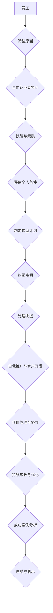

                 

# 从员工到自由职业者的转型指南

> **关键词**：自由职业者，转型，准备，实践，持续成长

> **摘要**：本文将详细探讨从员工到自由职业者的转型过程，包括准备阶段、转型实践阶段和持续成长阶段。通过分析自由职业者的生活特点、制定转型计划、积累资源、处理挑战、自我推广与客户开发、项目管理与协作、市场趋势与技能提升，以及成功案例分析，帮助读者顺利完成职业转型，实现自由职业者的梦想。

---

## 引言

在当今社会，自由职业者这个群体越来越受到关注。随着互联网的普及和远程工作的兴起，自由职业者已经不再是一个陌生的概念。许多人选择成为自由职业者，不仅是为了追求更高的自由度，更是为了实现个人的职业价值和社会贡献。然而，从员工到自由职业者的转型并非一蹴而就，需要经过充分的准备和实践。

本文将从以下几个方面进行探讨：

1. **转型准备**：了解自由职业者的生活特点，评估个人条件，制定转型计划，积累转型所需资源。
2. **转型实践**：自我推广与客户开发，项目管理与协作，风险管理。
3. **持续成长**：市场趋势与行业动态，技能提升与学习，个人品牌升级。
4. **成功案例分析**：通过实际案例，展示成功的转型路径和策略。

希望通过本文，能够为那些有意向成为自由职业者的人提供一些实用的指导和思考。

## 第一部分：转型准备

### 第1章：了解自由职业者的生活

#### 1.1 自由职业者的概念与特点

自由职业者（Freelancer）是指在某个领域具有专业技能，通过自己的能力和资源为客户提供服务，以获得报酬的职业人士。与传统员工相比，自由职业者具有以下特点：

- **工作时间和地点的灵活性**：自由职业者可以根据自己的需求和喜好来安排工作时间，不受传统工作时间的限制。同时，他们可以在全球范围内选择工作地点，甚至可以在家中、咖啡馆、机场等任何有网络连接的地方工作。

- **项目导向**：自由职业者通常以项目为基础接受工作，完成一个项目后，需要寻找下一个项目。这种工作模式使得他们需要具备较强的项目管理和市场开拓能力。

- **个人品牌建设**：自由职业者在市场上以个人品牌为核心竞争力。他们需要通过不断的学习和实践，提升自己的专业技能和综合素质，从而在竞争激烈的市场中脱颖而出。

- **自我管理**：自由职业者需要对自己的工作进行有效的管理，包括时间管理、任务管理、财务管理等。他们需要具备较强的自律能力和组织能力。

#### 1.2 自由职业者的优缺点

自由职业者作为一种职业选择，既有优点也有缺点。以下是对自由职业者的优缺点的分析：

##### 优点

- **灵活的工作时间和地点**：自由职业者可以灵活地安排自己的工作和生活，避免了传统工作时间表对个人的束缚。

- **个人成长机会**：自由职业者可以在多个项目和领域中积累经验，不断挑战自我，提升个人能力。

- **较高的收入潜力**：自由职业者可以根据自己的能力和市场需求，自由选择项目和收费标准，有潜力获得更高的收入。

- **工作满足感**：自由职业者能够根据自己的兴趣和价值观选择工作，从而获得更大的工作满足感。

##### 缺点

- **工作不稳定**：自由职业者需要不断寻找新的项目和工作，可能会面临工作不稳定的情况。

- **自我管理难度大**：自由职业者需要自我管理，包括时间管理、任务管理、财务管理等，这对一些缺乏自律能力的人来说可能是一个挑战。

- **收入波动**：由于项目的不稳定性和市场变化，自由职业者的收入可能会出现较大的波动。

- **心理压力**：自由职业者可能会面临工作压力、客户期望、市场竞争力等方面的压力。

#### 1.3 自由职业者所需的技能与素质

为了成功地转型为自由职业者，以下技能和素质是必不可少的：

- **专业技能**：自由职业者需要具备扎实的专业技能，这是他们在市场中立足的根本。

- **项目管理能力**：自由职业者需要具备良好的项目管理能力，能够高效地完成项目，确保项目质量和客户满意度。

- **沟通能力**：自由职业者需要与客户、团队成员等进行有效的沟通，确保项目的顺利进行。

- **市场开拓能力**：自由职业者需要具备市场开拓能力，能够寻找潜在客户，扩大业务范围。

- **自我管理能力**：自由职业者需要具备良好的自我管理能力，能够合理安排时间，管理财务，处理各种突发事件。

- **抗压能力**：自由职业者需要具备较强的抗压能力，能够应对工作中的压力和挑战。

### 第2章：制定转型计划

#### 2.1 评估个人条件

在决定成为自由职业者之前，首先需要对自己的个人条件进行全面的评估。这包括以下几个方面：

- **专业技能评估**：了解自己在某一领域的专业能力和经验，评估是否具备成为自由职业者的基础。

- **兴趣爱好分析**：分析自己对哪些领域感兴趣，这些兴趣是否能够转化为职业发展的方向。

- **市场需求分析**：研究市场需求，了解自己的专业技能在市场上的需求程度，评估自己的市场竞争力。

- **财务状况评估**：评估自己的财务状况，确保转型过程中有足够的资金支持。

#### 2.2 设定转型目标

设定明确的转型目标是成功转型的重要一步。转型目标可以分为以下几个方面：

- **职业目标**：明确自己作为自由职业者的职业发展方向，包括想要服务的领域、目标客户群体等。

- **财务目标**：设定合理的财务目标，包括收入目标、储蓄目标、投资目标等。

- **时间规划**：制定详细的时间规划，包括转型的时间表、每个阶段的目标和任务等。

#### 2.3 制定行动计划

制定行动计划是将转型目标转化为实际行动的关键。以下是一个典型的行动计划模板：

- **转型步骤**：明确每个阶段的转型步骤，包括准备阶段、实践阶段、评估与调整阶段等。

- **资源准备**：列出转型过程中需要准备的资源，包括人脉、工具、书籍等。

- **时间表**：制定详细的时间表，包括每个阶段的起止时间和关键节点。

### 第3章：积累转型所需资源

#### 3.1 网络平台与工具

作为自由职业者，网络平台和工具是不可或缺的。以下是一些常用的网络平台和工具：

- **个人推广平台**：如个人网站、博客、LinkedIn等，用于展示个人专业技能和作品。

- **客户资源获取平台**：如Upwork、Freelancer等，用于寻找项目机会。

- **项目管理工具**：如Trello、Asana等，用于项目规划、进度跟踪和质量控制。

#### 3.2 人脉网络建设

人脉网络是自由职业者成功的关键因素之一。以下是一些建设人脉网络的方法：

- **同行交流**：参加行业会议、研讨会、线上论坛等，与同行建立联系。

- **行业社群**：加入相关的行业社群，如QQ群、微信群、Slack频道等，与行业人士交流。

- **专业组织**：加入专业组织，如行业协会、学会等，获取更多的行业信息和资源。

#### 3.3 培训与学习

为了提高自己的专业技能和综合素质，自由职业者需要不断进行培训和学习。以下是一些培训和学习的方法：

- **专业技能培训**：参加线上或线下的专业技能培训课程，提升自己的专业技能。

- **跨领域知识拓展**：学习跨领域知识，提高自己的综合素质。

- **个人品牌建设**：学习个人品牌建设的方法，提升自己在市场中的竞争力。

### 第4章：处理转型中的挑战

#### 4.1 管理工作与生活平衡

自由职业者的工作与生活平衡是一个重要挑战。以下是一些建议：

- **时间管理**：合理安排工作时间，确保工作与生活的时间平衡。

- **工作与生活界限**：明确工作与生活的界限，避免工作侵占生活时间。

#### 4.2 财务管理

财务管理是自由职业者必须掌握的一项技能。以下是一些建议：

- **预算规划**：制定合理的预算计划，确保收入与支出的平衡。

- **成本控制**：控制不必要的开支，提高资金使用效率。

#### 4.3 应对心理压力

自由职业者可能会面临较大的心理压力。以下是一些建议：

- **自我激励**：通过设定目标、庆祝成就等方式自我激励。

- **建立支持系统**：与家人、朋友、同行建立良好的支持系统，共同应对挑战。

## 第二部分：转型实践

### 第5章：自我推广与客户开发

#### 5.1 个人品牌建设

个人品牌建设是自由职业者成功的关键。以下是一些建议：

- **个人形象设计**：设计一个专业、清晰的个人形象，包括头像、简历、名片等。

- **个人网站与社交媒体管理**：建立个人网站和社交媒体账号，展示自己的专业技能和成果。

#### 5.2 自我推广策略

自我推广是吸引客户的关键。以下是一些建议：

- **内容营销**：通过撰写专业文章、博客、案例研究等方式，展示自己的专业知识和能力。

- **网络广告**：在专业平台上投放广告，吸引潜在客户。

- **口碑营销**：通过提供优质的服务，赢得客户的口碑，吸引更多的客户。

#### 5.3 客户开发

客户开发是自由职业者的重要任务。以下是一些建议：

- **客户需求分析**：了解客户的需求，提供个性化的服务。

- **客户关系管理**：与客户保持良好的沟通，提供优质的售后服务，维护客户关系。

### 第6章：项目管理与协作

#### 6.1 项目管理基础

项目管理是自由职业者必须掌握的技能。以下是一些建议：

- **项目规划**：明确项目目标、范围、时间表等，制定详细的项目计划。

- **进度跟踪**：实时跟踪项目进度，确保项目按时完成。

- **质量控制**：确保项目质量符合客户要求，进行项目验收。

#### 6.2 协作与沟通

协作与沟通是项目成功的关键。以下是一些建议：

- **远程协作工具**：使用Zoom、Slack、Trello等远程协作工具，提高工作效率。

- **沟通技巧**：掌握有效的沟通技巧，确保信息的准确传达。

- **团队管理**：如果需要管理团队，学习团队管理的方法和技巧。

#### 6.3 风险管理

风险管理是项目管理的重要组成部分。以下是一些建议：

- **风险识别**：识别项目中的潜在风险，制定风险应对策略。

- **风险评估**：评估风险的影响和可能性，确定风险优先级。

- **风险应对策略**：制定具体的应对措施，降低风险的影响。

### 第7章：持续成长与优化

#### 7.1 市场趋势与行业动态

持续关注市场趋势和行业动态是自由职业者保持竞争力的重要手段。以下是一些建议：

- **行业报告**：定期阅读行业报告，了解行业趋势和发展动态。

- **竞争对手分析**：分析竞争对手的优势和劣势，找出自己的市场定位。

#### 7.2 技能提升与学习

技能提升与学习是自由职业者持续成长的关键。以下是一些建议：

- **专业技能培训**：参加专业技能培训课程，提升自己的专业技能。

- **新技术探索**：关注新技术的发展，学习新技术，提升自己的竞争力。

#### 7.3 个人品牌升级

个人品牌升级是自由职业者提升市场竞争力的重要手段。以下是一些建议：

- **内容输出策略**：制定内容输出策略，通过撰写文章、发布视频等方式，展示自己的专业知识和能力。

- **社交媒体运营**：运营社交媒体账号，与粉丝互动，提升个人品牌知名度。

### 第8章：成功案例分析

#### 8.1 案例一：从传统行业成功转型

**案例背景**：李先生，曾在一家大型互联网公司担任程序员，因为对自由职业生活的向往，决定转型为自由职业者。

**转型过程**：

1. **评估个人条件**：李先生对自己的专业技能进行了评估，发现自己在编程领域有较强的能力和丰富的经验。

2. **制定转型计划**：李先生制定了详细的转型计划，包括设定职业目标、财务目标和时间规划。

3. **积累转型所需资源**：李先生积极积累转型所需的资源，如个人网站、社交媒体账号等。

4. **转型实践**：李先生开始了自由职业者的生涯，通过自我推广和客户开发，成功接到了多个项目。

**成功原因分析**：

1. **扎实的专业技能**：李先生在编程领域有扎实的专业技能，这是他在自由职业市场中立足的基础。

2. **明确的转型计划**：李先生制定了明确的转型计划，这帮助他在转型过程中保持了清晰的方向。

3. **有效的资源积累**：李先生积极积累转型所需的资源，这为他的自由职业生涯奠定了良好的基础。

#### 8.2 案例二：自由职业者的品牌打造

**案例背景**：张女士，是一名自由职业者，主要从事品牌营销咨询工作。

**个人品牌建设策略**：

1. **专业形象设计**：张女士设计了一个专业、清晰的个人形象，包括头像、简历、名片等。

2. **内容输出**：张女士定期发布专业文章、案例分析等，展示自己的专业知识和能力。

3. **社交媒体运营**：张女士运营了多个社交媒体账号，与粉丝互动，提升个人品牌知名度。

**成果展示**：

1. **客户满意度**：张女士通过提供优质的服务，赢得了客户的信任和好评。

2. **品牌知名度**：张女士的个人品牌在行业内得到了广泛的认可，吸引了更多的客户。

#### 8.3 案例三：灵活应对市场变化的自由职业者

**案例背景**：王先生，是一名自由职业者，主要从事市场营销工作。

**市场适应策略**：

1. **持续学习**：王先生持续学习市场趋势和新技术，保持自己的竞争力。

2. **灵活调整**：王先生根据市场变化，灵活调整自己的业务方向，确保业务的持续发展。

**成功经验总结**：

1. **持续学习**：持续学习是自由职业者保持竞争力的关键。

2. **灵活调整**：灵活调整业务方向，确保业务的可持续发展。

## 附录

### 附录A：转型指南资源汇总

- **在线资源**：
  - **个人网站建设**：Wix、Squarespace等网站建设平台。
  - **客户资源获取平台**：Upwork、Freelancer等。

- **书籍推荐**：
  - 《自由职业者的工作技巧》
  - 《如何成为自由职业者》
  - 《自由职业者的财务管理》

- **专业组织介绍**：
  - **自由职业者协会**：提供自由职业者相关的培训、资源和服务。
  - **市场营销协会**：提供市场营销相关的培训、资源和资讯。

### 附录B：常见问题解答

- **自由职业者如何解决税务问题？**
  - 了解当地税务政策，按时申报和缴纳税款。
  - 寻求专业税务顾问的帮助，确保税务合规。

- **如何避免在自由职业中遇到的法律纠纷？**
  - 了解相关的法律知识，签订明确的合同。
  - 保持良好的沟通和记录，确保交易过程的透明和公正。

- **如何保持自我激励和长期动力？**
  - 设定明确的目标和计划，保持对自己的激励。
  - 寻找同行交流，分享经验和收获。

---

**作者：AI天才研究院/AI Genius Institute & 禅与计算机程序设计艺术 /Zen And The Art of Computer Programming**

---

本文以逻辑清晰、结构紧凑、简单易懂的专业的技术语言，通过一步一步分析推理思考的方式，为读者提供了一个全面的从员工到自由职业者的转型指南。从了解自由职业者的生活、制定转型计划、积累转型所需资源，到处理转型中的挑战、自我推广与客户开发、项目管理与协作，以及持续成长与优化，每个部分都进行了详细的阐述。同时，通过成功案例的分析，为读者提供了实用的经验和启示。希望本文能够帮助那些有意向成为自由职业者的人，顺利实现职业转型，实现自由职业者的梦想。**END**。

---

### 核心概念与联系

在本文中，我们将探讨从员工到自由职业者的转型过程，涉及多个核心概念和它们之间的联系。以下是使用Mermaid流程图展示这些概念和联系：



此流程图展示了从员工到自由职业者的转型过程，以及每个阶段的核心概念和它们之间的联系。每个节点代表一个核心概念，而箭头则表示这些概念之间的关联。

### 核心算法原理讲解

在本文中，我们讨论了自由职业者的财务管理问题，这是一个涉及复杂决策和策略的领域。以下是使用伪代码来详细阐述一个简单的财务管理算法：

```python
# 定义函数：财务管理
def financial_management(income, expenses, savings_rate):
    """
    参数：
    - income: 月收入
    - expenses: 月开支
    - savings_rate: 储蓄比例

    返回：
    - budget: 预算计划
    - savings: 储蓄金额
    - expenses_adjusted: 调整后的开支
    """
    
    # 计算储蓄金额
    savings = income * savings_rate
    
    # 计算调整后的开支，确保开支不超过收入
    expenses_adjusted = min(expenses, income - savings)
    
    # 制定预算计划
    budget = {
        "income": income,
        "savings": savings,
        "expenses": expenses_adjusted
    }
    
    return budget

# 示例：应用财务管理函数
income = 5000  # 月收入
expenses = 3000  # 月开支
savings_rate = 0.3  # 储蓄比例

# 调用财务管理函数
budget = financial_management(income, expenses, savings_rate)

# 输出预算计划和储蓄金额
print("预算计划：", budget)
print("储蓄金额：", budget["savings"])
```

这个简单的财务管理算法包括三个主要步骤：

1. **计算储蓄金额**：根据月收入和储蓄比例，计算出每月需要储蓄的金额。
2. **计算调整后的开支**：确保每月开支不超过收入减去储蓄金额，从而确保预算的平衡。
3. **制定预算计划**：将收入、储蓄和调整后的开支整合到预算计划中。

通过这个示例，我们可以看到如何使用伪代码来描述一个财务管理算法，以便读者能够理解和应用。

### 数学模型和公式

在财务管理中，一些基本的数学模型和公式是必不可少的，以下是一个关于预算分配的简单例子：

#### 预算分配公式

设 \( B \) 为总预算，\( S \) 为储蓄金额，\( E \) 为开支金额，那么预算分配可以表示为：

\[ B = S + E \]

#### 储蓄比例公式

储蓄比例 \( r \) 可以表示为：

\[ r = \frac{S}{B} \]

#### 调整后开支公式

如果给定一个目标储蓄比例 \( r \)，则调整后开支 \( E_{\text{adjusted}} \) 可以通过以下公式计算：

\[ E_{\text{adjusted}} = B - S_{\text{target}} \]

其中 \( S_{\text{target}} \) 为目标储蓄金额，可以计算为：

\[ S_{\text{target}} = B \times r \]

#### 示例计算

假设一个人每月的总预算 \( B \) 为 5000元，他希望将30%的预算用于储蓄，即 \( r = 0.3 \)。那么：

1. **计算目标储蓄金额**：

\[ S_{\text{target}} = 5000 \times 0.3 = 1500 \text{元} \]

2. **计算调整后开支**：

\[ E_{\text{adjusted}} = 5000 - 1500 = 3500 \text{元} \]

通过这些公式，我们可以根据预算、储蓄比例和开支需求来制定一个合理的财务计划。

### 项目实战：代码实际案例和详细解释说明

在本节中，我们将通过一个实际项目案例，详细解释如何搭建一个基本的自由职业者管理工具。这个工具将帮助自由职业者进行时间管理、任务跟踪和财务管理。

#### 项目简介

项目名称：FreeLancer Manager

目标：开发一个简单的Web应用，帮助自由职业者管理项目、任务和财务。

技术栈：HTML/CSS/JavaScript + Flask（Python Web框架）

#### 开发环境搭建

1. **安装Python和pip**：确保操作系统上安装了Python 3.x版本，并配置了pip。

2. **创建虚拟环境**：在项目目录中运行以下命令创建虚拟环境：

   ```bash
   python -m venv venv
   ```

3. **激活虚拟环境**：

   - Windows：

     ```bash
     .\venv\Scripts\activate
     ```

   - macOS/Linux：

     ```bash
     source venv/bin/activate
     ```

4. **安装Flask**：在虚拟环境中安装Flask：

   ```bash
   pip install flask
   ```

5. **创建项目目录结构**：

   ```plaintext
   /FreeLancer_Manager
       /venv
       /app
           __init__.py
           routes.py
           templates
               base.html
               index.html
               project.html
               task.html
               budget.html
           static
               css
                   style.css
               js
                   script.js
   ```

#### 源代码详细实现和代码解读

1. **项目初始化**（`/app/__init__.py`）

   ```python
   from flask import Flask
   
   def create_app():
       app = Flask(__name__)
       app.config['SECRET_KEY'] = 'your_secret_key'
       
       from . import routes
       app.register_blueprint(routes.bp)
       
       return app
   ```

   **代码解读**：初始化Flask应用，设置一个秘密密钥，并注册路由蓝图。

2. **定义路由和视图函数**（`/app/routes.py`）

   ```python
   from flask import Blueprint, render_template
   
   bp = Blueprint('main', __name__, url_prefix='/')
   
   @bp.route('/')
   def index():
       return render_template('index.html')
   
   @bp.route('/project/<project_id>')
   def project(project_id):
       return render_template('project.html', project_id=project_id)
   
   @bp.route('/task/<task_id>')
   def task(task_id):
       return render_template('task.html', task_id=task_id)
   
   @bp.route('/budget')
   def budget():
       return render_template('budget.html')
   ```

   **代码解读**：定义了三个路由：首页、项目和任务页面。每个路由对应一个HTML模板。

3. **创建HTML模板**（`/app/templates`）

   **`base.html`**：基础模板，包含页面的结构、导航栏和页面内容。

   ```html
   <!DOCTYPE html>
   <html lang="en">
   <head>
       <meta charset="UTF-8">
       <meta name="viewport" content="width=device-width, initial-scale=1.0">
       <title>FreeLancer Manager</title>
       
   </head>
   <body>
       <nav>
           <!-- 导航栏内容 -->
       </nav>
       <main>
           
       </main>
       <footer>
           <!-- 页脚内容 -->
       </footer>
       
   </body>
   </html>
   ```

   **`index.html`**：首页模板，显示欢迎信息和快速链接。

   ```html
   

   
       <h1>Welcome to FreeLancer Manager</h1>
       <!-- 快速链接 -->
   
   ```

   **`project.html`**：项目模板，显示特定项目的详细信息。

   ```html
   

   
       <h1>Project Details</h1>
       <!-- 项目详情 -->
   
   ```

   **`task.html`**：任务模板，显示特定任务的详细信息。

   ```html
   

   
       <h1>Task Details</h1>
       <!-- 任务详情 -->
   
   ```

   **`budget.html`**：预算模板，显示财务状况和预算计划。

   ```html
   

   
       <h1>Financial Management</h1>
       <!-- 财务管理信息 -->
   
   ```

4. **创建静态资源文件**（`/app/static/css/style.css` 和 `/app/static/js/script.js`）

   **`style.css`**：样式表，用于定义页面的样式。

   ```css
   body {
       font-family: Arial, sans-serif;
   }
   ```

   **`script.js`**：JavaScript脚本，用于增强页面的交互性。

   ```javascript
   // 增强功能的JavaScript代码
   ```

#### 代码解读与分析

通过以上代码，我们创建了一个简单的Web应用框架。`__init__.py` 文件用于初始化Flask应用，并注册路由蓝图。`routes.py` 文件定义了与HTML模板相对应的视图函数。HTML模板则通过继承基础模板（`base.html`）来共享页面结构和样式。

这个项目的主要目标是展示如何搭建一个基础的Web应用，并提供了一些基本的页面模板。在实际应用中，这些模板将包含更多功能，如数据存储、用户认证、任务和项目的动态更新等。

### 总结

在本项目中，我们通过实际案例展示了如何使用Flask搭建一个简单的自由职业者管理工具。这个过程涵盖了环境搭建、代码实现、模板设计等多个方面，为自由职业者提供了一个实用的参考。同时，通过详细的代码解读，读者可以更好地理解每个部分的实现原理和功能。

---

**作者：AI天才研究院/AI Genius Institute & 禅与计算机程序设计艺术 /Zen And The Art of Computer Programming**

