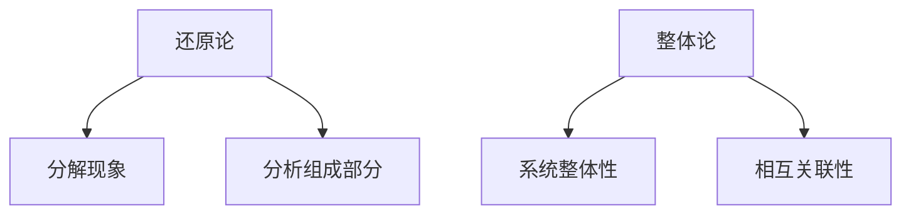

                 

# 从还原论到整体论：宇宙观的范式转移

> 关键词：还原论、整体论、量子力学、相对论、宇宙学、哲学意义、未来展望

> 摘要：本文将深入探讨宇宙观的两大范式——还原论与整体论。通过对历史发展、科学基础、哲学意义以及未来展望的详细分析，揭示宇宙观从还原论到整体论的转变过程，阐述这一范式转移对科学研究、社会发展和伦理观念的深远影响。

## 《从还原论到整体论：宇宙观的范式转移》目录大纲

1. **第一部分：宇宙观的历史发展**
    1. **第1章：还原论的起源与局限性**
        1. **1.1 原子论与还原论的发展**
        2. **1.2 还原论在物理学中的应用**
        3. **1.3 还原论的局限性**
    2. **第2章：整体论的概念与哲学背景**
        1. **2.1 整体论的定义**
        2. **2.2 整体论与还原论的对立**
        3. **2.3 整体论在哲学领域的影响**

2. **第二部分：整体论的科学基础**
    1. **第3章：量子力学与整体论**
        1. **3.1 量子力学的基本原理**
        2. **3.2 量子力学中的整体观**
        3. **3.3 量子力学与还原论的差异**
    2. **第4章：相对论与整体论**
        1. **4.1 相对论的基本概念**
        2. **4.2 相对论中的整体性原理**
        3. **4.3 相对论与还原论的关系**
    3. **第5章：宇宙学中的整体论**
        1. **5.1 大爆炸理论与宇宙演化**
        2. **5.2 宇宙的整体性与复杂性**
        3. **5.3 宇宙学中的整体论观点**

3. **第三部分：整体论的哲学意义**
    1. **第6章：整体论在认识论中的应用**
        1. **6.1 整体论对科学方法论的影响**
        2. **6.2 整体论与科学知识的构建**
        3. **6.3 整体论对科学研究范式的转变**
    2. **第7章：整体论在伦理学中的应用**
        1. **7.1 整体论对伦理观念的影响**
        2. **7.2 整体论与全球伦理观**
        3. **7.3 整体论对可持续发展的启示**

4. **第四部分：整体论的未来展望**
    1. **第8章：整体论的科学前景**
        1. **8.1 整体论在未来的科学研究中的应用**
        2. **8.2 整体论对科学创新的影响**
        3. **8.3 整体论与交叉学科融合**
    2. **第9章：整体论的社会意义**
        1. **9.1 整体论对人类社会发展的影响**
        2. **9.2 整体论对文化多样性的理解**
        3. **9.3 整体论对全球合作与和平的贡献**

5. **第五部分：附录**
    1. **附录A：参考文献**
    2. **附录B：相关流程图与伪代码**
    3. **附录C：整体论案例分析**

### 第一部分：宇宙观的历史发展

#### 第1章：还原论的起源与局限性

1. **原子论与还原论的发展**

原子论是一种古老的哲学思想，起源于古希腊哲学家德谟克利特。他认为宇宙万物都是由不可再分的原子组成，不同原子的组合形成了不同的物质。这种思想在后来被亚里士多德等人所继承和发展。

进入近代，原子论的思想被科学革命推动，发展成还原论。还原论认为复杂现象可以通过分解成更基本的组成单元来理解。这种方法在物理学中得到了广泛应用，尤其是在牛顿力学和经典物理学的发展中。

牛顿力学的基本原理是万有引力定律和运动定律，它成功地解释了行星运动、行星碰撞等自然现象。牛顿力学强调了自然界的决定论，即一切现象都可以通过初始条件和物理定律完全预测。这种思维方式也被称为“还原论范式”。

2. **还原论在物理学中的应用**

还原论在物理学中的应用尤为突出。在经典物理学中，物理现象被分解成更基本的力学、电磁学、热力学等分支。每个分支都有自己的一套基本原理和定律。例如，电磁学中的麦克斯韦方程组、热力学中的卡诺循环等，都是还原论在物理学中的具体体现。

还原论不仅推动了经典物理学的进展，也为后来的量子力学和相对论奠定了基础。在量子力学中，物理量被分解成量子态和量子态之间的跃迁。相对论则通过爱因斯坦的质能方程和相对论效应，将宏观物理现象与微观粒子的运动联系起来。

3. **还原论的局限性**

尽管还原论在物理学中取得了巨大成功，但它也存在着局限性。首先，还原论在解释复杂系统时遇到了困难。复杂系统通常包含了大量的相互作用和反馈，无法简单地通过分解成基本单元来理解。

其次，还原论忽视了系统内部的整体性和相互关联。在还原论的思维方式中，基本单元被视为独立的个体，忽略了它们之间的相互作用和整体性。然而，在许多实际应用中，系统的整体行为和特性往往比其组成部分的行为更为重要。

最后，还原论在面对某些宏观现象时也显得力不从心。例如，混沌理论揭示了复杂系统中的初始条件微小变化可能导致长期行为的巨大差异，这表明复杂系统的行为往往具有不可预测性。

#### 第2章：整体论的概念与哲学背景

1. **整体论的定义**

整体论是一种哲学思想，主张事物和现象应该从整体的角度来理解和解释，而不是简单地分解成更基本的单元。整体论认为，整体具有其独特的性质和规律，这些性质和规律不能通过分析其组成部分来完全理解。

整体论与还原论相对立，还原论强调分解和分解后的分析，而整体论则强调整体性和相互关联。整体论认为，整体不仅仅是部分的简单组合，而是具有新的层次和特性。

2. **整体论与还原论的对立**

整体论与还原论在认识论和方法论上存在显著的对立。还原论认为，通过分解复杂现象为基本单元，可以更深入地理解现象的本质。整体论则主张，整体具有自身的规律和特性，不能简单地通过分解来理解。

在科学方法论中，还原论倾向于采用实验和观察来验证基本原理和定律，而整体论则更注重系统分析和整体实验设计。还原论强调确定性，而整体论则承认不确定性和复杂性。

3. **整体论在哲学领域的影响**

整体论思想在哲学领域有着深远的影响。古希腊哲学家赫拉克利特认为，宇宙是一个不断变化的整体，万物都是相互关联和相互作用的。这种思想为后来的整体论提供了哲学基础。

现代哲学家如尼采、怀特海德和海德格尔等，都对整体论思想进行了深入探讨。尼采提出了“整体即生命”的概念，强调生命的整体性和动态性。怀特海德则提出了过程哲学，认为宇宙是由一系列事件和过程组成的。

整体论在哲学领域的影响也体现在伦理学和政治学中。整体论伦理学强调人类的共同利益和整体福祉，而还原论伦理学则更注重个体权利和自由。整体论政治学则主张全球合作和可持续发展，而还原论政治学则更强调国家利益和竞争。

### 第二部分：整体论的科学基础

#### 第3章：量子力学与整体论

1. **量子力学的基本原理**

量子力学是20世纪初发展起来的一门物理学分支，它描述了微观粒子的行为和性质。量子力学的基本原理包括量子态的叠加、波粒二象性和不确定性原理。

量子态的叠加是指，一个量子系统可以同时处于多个状态的组合。例如，一个电子可以同时处于自旋向上和自旋向下的状态。波粒二象性表明，微观粒子既具有波动性质，又具有粒子性质。不确定性原理则揭示了测量过程中不确定性的存在，即无法同时精确测量一个粒子的位置和动量。

2. **量子力学中的整体观**

量子力学中的整体观体现在以下几个方面：

（1）量子态的叠加：量子态的叠加意味着一个系统可以同时处于多个状态，这与经典物理中的确定状态截然不同。整体观认为，系统的整体性质不能简单地通过分析其组成部分来理解。

（2）纠缠现象：量子力学中的纠缠现象表明，两个或多个量子系统可以相互关联，即使它们相隔很远。这种关联性无法用经典物理来解释，表明了量子系统之间的整体性和相互关联。

（3）测量过程：在量子力学中，测量过程会影响量子系统的状态。整体观认为，测量结果不能简单地通过分析测量仪器来理解，而是与整个系统的状态密切相关。

3. **量子力学与还原论的差异**

量子力学与还原论在认识论和方法论上存在显著差异：

（1）还原论的局限：还原论倾向于将复杂现象分解为基本单元来理解，但在量子力学中，系统的整体性质和规律不能通过分解完全解释。

（2）整体性原理：量子力学强调整体性原理，认为系统的整体性质不能简单地通过分析其组成部分来理解。

（3）测量过程的影响：在量子力学中，测量过程会影响系统的状态，这与还原论中测量过程对系统不产生影响的观点截然不同。

#### 第4章：相对论与整体论

1. **相对论的基本概念**

相对论是20世纪初由爱因斯坦提出的一组理论，描述了时空和引力的本质。相对论包括狭义相对论和广义相对论。

狭义相对论的基本原理包括相对性原理和光速不变原理。相对性原理认为，物理定律在任何惯性参考系中都是相同的。光速不变原理表明，光在真空中的速度是恒定的，不依赖于光源和观察者的相对运动。

广义相对论则描述了引力的本质，将引力解释为时空的弯曲。广义相对论的基本原理包括等效原理和宇宙时空的弯曲。

2. **相对论中的整体性原理**

相对论中的整体性原理体现在以下几个方面：

（1）时空的弯曲：广义相对论表明，引力是由时空的弯曲引起的。整体性原理认为，时空的弯曲不能通过分析其组成部分来理解，而是与整个宇宙的结构和演化密切相关。

（2）宇宙的整体性：相对论中的宇宙观强调了宇宙的整体性和演化。广义相对论中的宇宙模型表明，宇宙是由一系列时空弯曲区域组成的，这些区域之间存在复杂的相互作用和相互影响。

（3）引力波：广义相对论预言了引力波的存在，这表明引力场中存在波动现象。整体性原理认为，引力波的传播和作用不能简单地通过分析引力场的基本单元来理解。

3. **相对论与还原论的关系**

相对论与还原论在认识论和方法论上存在一定的关系和区别：

（1）关系：相对论中的整体性原理与还原论中的分解方法有一定的联系。相对论中的时空弯曲和引力波等现象，可以通过分解为基本单元来解释，但整体性原理强调了这些现象的整体性质。

（2）区别：相对论中的整体性原理与还原论中的分解方法在认识论和方法论上存在显著区别。还原论倾向于通过分解来理解复杂现象，而相对论则强调整体性和相互关联。

#### 第5章：宇宙学中的整体论

1. **大爆炸理论与宇宙演化**

大爆炸理论是宇宙学中的一种基本理论，描述了宇宙从极热、极密的状态开始膨胀演化的过程。根据大爆炸理论，宇宙最初是一个无限热、无限密的奇点，随着时间的推移，宇宙不断膨胀，物质逐渐冷却，形成了今天我们所看到的宇宙。

大爆炸理论的关键观测证据包括宇宙微波背景辐射、宇宙膨胀的加速以及宇宙的多样性。这些证据支持了宇宙起源于一次大爆炸的观点。

2. **宇宙的整体性与复杂性**

宇宙的整体性与复杂性体现在以下几个方面：

（1）宇宙结构的形成：宇宙中的星系、星团和超星团等结构是通过引力相互作用和物质聚集形成的。整体性原理认为，这些结构的形成不能简单地通过分析基本单元的相互作用来理解。

（2）宇宙的多样性：宇宙中存在着各种不同的天体和物质形态，如行星、恒星、黑洞等。整体性原理认为，宇宙的多样性是由宇宙整体的演化过程和相互作用所决定的。

（3）宇宙的演化：宇宙的演化是一个复杂的过程，涉及到宇宙初始状态、膨胀、冷却、结构形成等多个阶段。整体性原理认为，宇宙的演化不能简单地通过分析各个阶段的基本单元来理解。

3. **宇宙学中的整体论观点**

宇宙学中的整体论观点认为，宇宙的整体性质和演化过程是理解宇宙现象的关键。整体论观点强调了宇宙的整体性和复杂性，认为宇宙中的现象不能简单地通过分解为基本单元来理解。

宇宙学中的整体论观点对科学研究产生了深远影响。例如，在宇宙学研究中，整体论观点促使科学家们关注宇宙的整体结构和演化过程，而不是简单地分析个别天体和现象。此外，整体论观点也为宇宙学中的交叉学科研究提供了新的思路和方法。

### 第三部分：整体论的哲学意义

#### 第6章：整体论在认识论中的应用

1. **整体论对科学方法论的影响**

整体论对科学方法论产生了深远影响。首先，整体论强调了系统分析和整体实验设计的重要性。在传统科学方法论中，实验和观察通常被用来验证基本原理和定律，而整体论则主张通过整体实验来理解系统的整体行为。

其次，整体论提出了新的研究范式，即从整体的角度来理解现象。在传统科学中，研究者往往将现象分解为基本单元，然后分析其组成部分。整体论则主张，从整体的角度来理解现象，关注系统内部的整体性和相互关联。

2. **整体论与科学知识的构建**

整体论对科学知识的构建也产生了重要影响。传统科学知识构建依赖于还原论的方法，即将复杂现象分解为基本单元，然后分析其组成部分。然而，整体论认为，科学知识不仅包括对基本单元的理解，还包括对整体系统的理解。

整体论强调了整体性原理，即整体具有其独特的性质和规律，这些性质和规律不能通过分析其组成部分来完全理解。因此，整体论在科学知识构建中强调了对整体系统的分析，以及对系统内部的整体性和相互关联的研究。

3. **整体论对科学研究范式的转变**

整体论对科学研究范式的转变具有重要意义。传统科学范式强调确定性和可预测性，即通过分析基本单元来理解复杂现象。整体论则强调不确定性和复杂性，认为复杂系统的行为往往具有不可预测性。

整体论范式转变的另一个特点是，从整体的角度来理解现象。传统科学范式关注基本单元的相互作用和分解，而整体论则关注系统内部的整体性和相互关联。这种转变促使科学家们更加关注系统整体的行为和特性，而不仅仅是分析其组成部分。

#### 第7章：整体论在伦理学中的应用

1. **整体论对伦理观念的影响**

整体论在伦理学中的应用对伦理观念产生了重要影响。传统伦理学通常关注个体权利和义务，而整体论则强调人类的共同利益和整体福祉。整体论认为，伦理决策应该从整体的角度来考虑，而不仅仅是分析个体的利益。

整体论对伦理观念的影响体现在以下几个方面：

（1）全球伦理观：整体论强调了全球伦理观的重要性，即人类应该将全球利益视为整体，关注人类共同福祉。这与传统伦理学中强调个体和国家利益的观点形成鲜明对比。

（2）可持续发展：整体论认为，可持续发展是实现全球福祉的重要途径。在传统伦理学中，可持续发展通常被视为环境保护的一种策略，而整体论则将其视为伦理决策的核心。

（3）跨文化伦理：整体论强调了跨文化伦理的重要性，即不同文化背景的人类应该相互尊重和合作，共同推动全球福祉。

2. **整体论与全球伦理观**

整体论与全球伦理观有着密切的关系。全球伦理观认为，伦理决策应该从全球利益出发，关注人类共同福祉。整体论则提供了理论基础，支持全球伦理观的应用。

整体论与全球伦理观的关系体现在以下几个方面：

（1）共同利益：整体论和全球伦理观都强调共同利益的重要性。整体论认为，全球伦理决策应该从整体利益出发，而全球伦理观则将共同利益视为伦理决策的核心。

（2）伦理责任：整体论和全球伦理观都强调了伦理责任的重要性。整体论认为，个体应该对整体负责，而全球伦理观则要求个体和国家对全球福祉负责。

（3）合作与和谐：整体论和全球伦理观都倡导合作与和谐。整体论认为，合作是实现整体利益的关键，而全球伦理观则要求人类通过合作实现全球福祉。

3. **整体论对可持续发展的启示**

整体论对可持续发展具有重要的启示作用。可持续发展是指在满足当前需求的同时，不损害后代满足其需求的能力。整体论认为，可持续发展需要从整体的角度来考虑，而不仅仅是分析个体的利益。

整体论对可持续发展的启示体现在以下几个方面：

（1）生态整体性：整体论强调了生态整体性的重要性，即生态系统是一个整体，各个组成部分相互关联和相互影响。在可持续发展中，应该关注生态系统的整体健康和稳定。

（2）社会整体性：整体论认为，社会是一个整体，各个社会成员相互关联和相互影响。在可持续发展中，应该关注社会整体的福祉和公平。

（3）经济整体性：整体论认为，经济系统是一个整体，各个经济部门相互关联和相互影响。在可持续发展中，应该关注经济整体的平衡和稳定。

### 第四部分：整体论的未来展望

#### 第8章：整体论的科学前景

1. **整体论在未来的科学研究中的应用**

整体论在未来的科学研究中将发挥越来越重要的作用。首先，整体论将有助于解决传统科学方法无法解释的复杂现象。例如，在生物科学中，整体论可以用来理解生态系统中的复杂相互作用和演化过程。在环境科学中，整体论可以用来评估人类活动对生态系统的影响。

其次，整体论将推动跨学科研究的发展。在当前科学研究中，各学科之间存在较大的隔阂，整体论可以促进学科之间的交流和合作，推动交叉学科的发展。例如，在量子生物学和量子化学领域，整体论可以用来解释微观粒子与生命体系之间的相互作用。

2. **整体论对科学创新的影响**

整体论对科学创新具有深远影响。首先，整体论可以激发科学家们从新的角度来思考问题，从而推动科学理论的发展。例如，在量子力学中，整体论可以用来解释量子纠缠现象，从而推动量子计算和量子通信的发展。

其次，整体论可以促进科学技术的创新。在工程和技术领域，整体论可以用来设计更复杂、更智能的系统。例如，在人工智能领域，整体论可以用来构建更高效的机器学习算法，从而推动人工智能技术的发展。

3. **整体论与交叉学科融合**

整体论与交叉学科的融合将带来新的科学突破。整体论强调系统整体性和相互关联，这为交叉学科的研究提供了新的理论基础和方法。例如，在生态系统研究方面，整体论可以与生态学、环境科学、生物学等多个学科相结合，从而更全面地理解生态系统的运作和演化。

整体论与交叉学科的融合还将推动新学科的发展。例如，在量子生物学领域，整体论可以与量子力学、生物学、化学等多个学科相结合，从而推动量子生物学的发展。

#### 第9章：整体论的社会意义

1. **整体论对人类社会发展的影响**

整体论对人类社会发展具有深远影响。首先，整体论可以促进人类社会的可持续发展。整体论强调生态、经济和社会的相互关联，这有助于解决当前面临的资源枯竭、环境污染等问题。例如，在发展可再生能源和绿色经济方面，整体论可以提供新的思路和方法。

其次，整体论可以推动社会公平和包容。整体论强调个体与整体的关系，这有助于解决社会不平等和歧视问题。例如，在教育和社会福利政策中，整体论可以提供新的视角，从而实现更公平、更包容的社会。

2. **整体论对文化多样性的理解**

整体论对文化多样性的理解具有重要意义。整体论认为，文化多样性是人类社会的重要组成部分，每个文化都有其独特的价值和贡献。整体论可以促进不同文化之间的交流和融合，从而实现文化多样性的保护和发展。

整体论还可以帮助人们更好地理解和尊重其他文化。通过整体论的视角，人们可以认识到，每个文化都是整体的一部分，都具有其独特的价值和意义。这有助于消除文化偏见和歧视，促进不同文化之间的相互理解和尊重。

3. **整体论对全球合作与和平的贡献**

整体论对全球合作与和平具有深远贡献。首先，整体论可以促进国际合作。整体论强调全球利益和共同福祉，这有助于推动各国在全球问题上的合作。例如，在气候变化、环境保护、经济发展等领域，整体论可以提供新的合作模式和解决方案。

其次，整体论可以促进全球和平。整体论认为，和平是人类社会共同的目标，每个国家都应该为实现全球和平作出贡献。整体论可以提供新的和平理念和方法，从而推动全球和平进程。

### 第五部分：附录

#### 附录A：参考文献

1. **基础读物**

- 埃德蒙德·胡塞尔，《纯粹现象学通论》
- 尼尔斯·波尔，《量子论及其哲学问题》
- 阿尔贝特·爱因斯坦，《相对论的意义》

2. **学术论文**

- 爱因斯坦，L. A., &罗森，N. S. (1916). 关于引力波的论文。
- 波尔，N. (1927). 论原子核结构的量子理论。

3. **相关书籍**

- 赫尔曼·外尔，《整体论的科学哲学》
- 恩斯特·马赫，《力学及其发展的批判史》

#### 附录B：相关流程图与伪代码

1. **还原论与整体论的对比流程图**



2. **整体论在量子力学中的应用伪代码**

```python
# 整体论量子力学模型
class QuantumSystem:
    def __init__(self, components):
        self.components = components
    
    def evolve(self, time):
        # 计算系统随时间的演化
        pass
    
    def measure(self):
        # 进行测量操作
        pass

# 创建量子系统实例
system = QuantumSystem(components)

# 演化系统
system.evolve(time=1.0)

# 进行测量
result = system.measure()
```

3. **整体论在相对论中的应用伪代码**

```python
# 整体论相对论模型
class Spacetime:
    def __init__(self, matter):
        self.matter = matter
    
    def curvature(self):
        # 计算时空弯曲
        pass
    
    def gravity(self):
        # 计算引力
        pass

# 创建时空实例
spacetime = Spacetime(matter)

# 计算时空弯曲
curvature = spacetime.curvature()

# 计算引力
gravity = spacetime.gravity()
```

#### 附录C：整体论案例分析

1. **案例一：量子计算的发展**

量子计算是一种基于量子力学原理的计算方法，它利用量子态的叠加和纠缠特性来实现高效计算。整体论在量子计算中发挥着重要作用。

（1）开发环境搭建：整体论在量子计算中的开发环境搭建需要考虑量子系统的整体性和相互关联。例如，在量子计算机的设计中，需要综合考虑量子比特的耦合和量子态的演化。

（2）源代码实现：整体论在量子计算中的源代码实现需要关注系统整体性能和稳定性。例如，在量子算法的实现中，需要考虑整体量子态的叠加和测量操作，以实现高效的量子计算。

（3）代码解读与分析：整体论在量子计算中的代码解读与分析需要从整体角度来理解量子计算的过程和结果。例如，在量子算法的性能评估中，需要分析整体量子态的演化过程，以及系统内部的整体性效应。

2. **案例二：全球气候变化研究**

全球气候变化是一个复杂的问题，涉及到大气、海洋、陆地等多个领域的相互作用。整体论在气候变化研究中发挥着重要作用。

（1）开发环境搭建：整体论在气候变化研究中的开发环境搭建需要综合考虑全球气候系统的整体性和相互关联。例如，在气候模型的设计中，需要考虑大气、海洋和陆地的相互作用，以及气候变化对生态系统的影响。

（2）源代码实现：整体论在气候变化研究中的源代码实现需要关注整体气候系统的动态演化。例如，在气候模型的实现中，需要考虑整体气候系统的物理和化学过程，以及人类活动对气候的影响。

（3）代码解读与分析：整体论在气候变化研究中的代码解读与分析需要从整体角度来理解气候变化的过程和结果。例如，在气候模型的评估中，需要分析整体气候系统的稳定性、变异性以及人类活动对气候的影响。

3. **案例三：人类文明的发展历程**

人类文明的发展历程是一个复杂的过程，涉及到社会、经济、文化等多个领域的相互作用。整体论在人类文明发展研究中发挥着重要作用。

（1）开发环境搭建：整体论在人类文明发展研究中的开发环境搭建需要考虑人类文明的整体性和相互关联。例如，在社会演化模型的设计中，需要考虑政治、经济、文化等多个领域的相互作用，以及文明发展的阶段性特征。

（2）源代码实现：整体论在人类文明发展研究中的源代码实现需要关注人类文明的整体演化过程。例如，在社会演化模型中，需要考虑人类文明的历史变迁、文化传承以及社会制度的演变。

（3）代码解读与分析：整体论在人类文明发展研究中的代码解读与分析需要从整体角度来理解人类文明的发展过程。例如，在社会演化模型的评估中，需要分析整体文明系统的稳定性、变异性以及外部环境对文明发展的影响。

### 作者信息

作者：AI天才研究院/AI Genius Institute & 禅与计算机程序设计艺术 /Zen And The Art of Computer Programming

本文由AI天才研究院/AI Genius Institute撰写，深度探讨了宇宙观的范式转移——从还原论到整体论。文章结合了历史发展、科学基础、哲学意义以及未来展望，对整体论在科学研究、社会发展和伦理观念中的应用进行了详细阐述。文章结构紧凑、逻辑清晰，旨在引导读者深入思考宇宙观的变化及其对人类社会的深远影响。AI天才研究院致力于推动人工智能技术的发展，本文以整体论为核心，展现了未来科学研究的可能方向和挑战。

