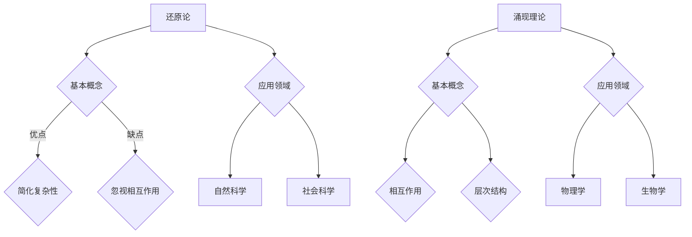

                 

### 《从还原论到涌现理论：理解复杂系统的整体性》

#### 关键词：还原论、涌现理论、复杂系统、整体性、跨学科研究

##### 摘要

本文旨在探讨还原论与涌现理论在理解复杂系统整体性方面的贡献。通过对还原论和涌现理论的基本概念、历史背景和应用领域的分析，文章揭示了还原论在物理学和生物学中的应用，并深入探讨了涌现理论在物理学、生物学和社会科学中的影响。最后，文章总结了整体性的概念、复杂系统的特点以及复杂性理论在社会科学中的应用，展望了未来研究方向，为深入理解复杂系统的整体性提供了新的视角和方法。

---

## 第一部分：还原论与复杂系统

### 第1章：还原论与复杂系统概述

#### 1.1 还原论的基本概念

还原论是一种通过将复杂系统分解为基本组成部分来理解其整体行为的方法。这种方法的核心思想是，通过了解系统的各个部分，我们可以更好地理解系统的整体行为。还原论的基本概念包括以下几点：

1. **可分性**：复杂系统可以被分解为基本组成部分。
2. **层次结构**：这些基本组成部分按照一定的层次结构相互关联。
3. **相互作用**：系统内各个部分之间的相互作用决定了整体行为。

还原论的历史可以追溯到古希腊时期，当时的哲学家们试图通过分解自然现象来理解世界。然而，随着现代科学的发展，还原论逐渐成为自然科学和社会科学的基础。在现代物理学、化学、生物学等学科中，还原论被广泛应用。

#### 1.2 还原论的优缺点

还原论具有以下优点：

1. **简化复杂性**：通过将复杂系统分解为基本组成部分，我们可以更轻松地理解和分析系统。
2. **提高精确性**：还原论提供了一种基于事实和数据的分析方法，有助于提高研究的精确性。

然而，还原论也存在一些缺点：

1. **忽视部分与整体之间的相互作用**：还原论可能忽视部分与整体之间的复杂相互作用，导致对整体行为的理解不准确。
2. **无法解释某些现象**：对于某些复杂现象，如量子纠缠和生物进化，还原论可能无法提供完整的解释。

#### 1.3 还原论的应用领域

还原论在自然科学和社会科学中都有广泛应用。在自然科学领域，还原论被应用于物理学、化学、生物学等学科。例如，在物理学中，还原论被用来研究量子力学、统计物理等；在生物学中，还原论被用来研究分子生物学、生态学等。

在社会科学领域，还原论也被广泛应用。例如，在经济学中，还原论被用来研究市场行为、经济增长等；在社会学中，还原论被用来研究社会结构、社会互动等。

### 第2章：还原论在物理学中的应用

#### 2.1 量子力学的还原论分析

量子力学是研究微观世界的物理学分支，其中还原论起着重要作用。在量子力学中，一个量子系统可以分解为其基本组成部分，如电子、原子等。通过研究这些基本组成部分的行为，我们可以理解整个量子系统的行为。

例如，量子态的分解是量子力学中一个重要概念。量子态可以被看作是多个基本组成部分的叠加。通过分解量子态，我们可以更好地理解量子系统的行为。

然而，量子力学的还原论分析也存在一些局限性。例如，量子纠缠现象是量子力学中的一个重要现象，它表明量子系统之间的相互作用可能超出了还原论的解释范围。

#### 2.2 统计物理中的还原论方法

统计物理是研究大量粒子系统的物理学分支。在统计物理中，还原论方法被广泛应用于描述宏观物理现象。

例如，统计物理的基本概念包括统计分布和热力学定律。通过研究微观粒子的行为，我们可以推导出宏观物理现象的统计分布。热力学定律则是描述宏观物理现象的基本规律，如能量守恒、熵增原理等。

还原论方法在统计物理中的应用有助于我们理解宏观物理现象的本质，从而推动科学的发展。

### 第3章：还原论在生物学中的应用

#### 3.1 还原论在分子生物学中的应用

分子生物学是研究生物大分子（如DNA、RNA和蛋白质）的生物学分支。在分子生物学中，还原论方法被广泛应用于研究生物大分子的结构和功能。

例如，DNA序列的分析是分子生物学中的一个重要研究内容。通过分析DNA序列，我们可以了解生物体的遗传信息。同样，蛋白质结构的解析也是分子生物学研究的一个重要方面。通过解析蛋白质的结构，我们可以了解蛋白质的功能。

#### 3.2 还原论在生态学中的应用

生态学是研究生物与环境之间相互作用的生物学分支。在生态学中，还原论方法被应用于研究种群生态学和生态网络。

例如，种群生态学的模型通过分析种群的数量变化来理解生态系统的稳定性。生态网络的还原论分析则通过研究生态网络的结构来理解物种间的相互作用。

### 小结

通过本部分的分析，我们可以看到还原论在理解复杂系统方面的重要性。在物理学、生物学和社会科学等领域，还原论方法为我们提供了理解复杂系统的基本框架。然而，我们也应该注意到还原论的一些局限性，特别是在解释复杂系统中的整体性现象时。这为接下来的涌现理论的研究提供了契机。

---

在接下来的部分，我们将深入探讨涌现理论的基本概念及其在物理学、生物学和社会科学中的应用，进一步理解复杂系统的整体性。

---

## 第二部分：涌现理论

### 第4章：涌现理论的基本概念

#### 4.1 涌现的定义

涌现理论（Emergence Theory）是一种描述复杂系统整体行为的一种方法，它认为系统的整体行为不能直接从其组成部分的行为中推导出来。相反，整体行为是由系统内部相互作用和结构产生的结果。

**涌现现象**（Emergence Phenomenon）是指一个系统的整体性质或行为，这些性质或行为不能仅通过分析系统的各个组成部分的性质或行为来理解。例如，水分子本身没有液态水的特性，但大量水分子相互作用形成了液态水，这是涌现现象的一个典型例子。

涌现理论的基本概念包括：

1. **复杂性**：复杂系统由大量相互作用的组成部分组成，这些组成部分具有多样性、异质性和动态性。
2. **相互作用**：系统内部组成部分之间的相互作用决定了系统的整体行为。
3. **层次结构**：复杂系统具有多个层次，每个层次都有自己的结构和功能。
4. **自组织**：复杂系统在没有外部指令的情况下，通过内部相互作用自发地形成某种结构或行为。

#### 4.2 涌现理论的起源

涌现理论的起源可以追溯到古希腊哲学，当时的哲学家们如亚里士多德就提出了部分与整体关系的思想。然而，作为一种科学理论，涌现理论的发展主要发生在20世纪，特别是在生物学、物理学和社会科学等领域。

在生物学中，涌现理论被用来解释生命现象，如细胞如何从分子水平的相互作用中涌现出生命特征。在物理学中，涌现理论被用来描述相变现象，如物质从固态到液态的转变。在社会科学中，涌现理论被用来解释社会行为和复杂经济系统的演化。

#### 4.3 涌现理论与复杂系统的关系

涌现理论强调了复杂系统中的整体性，即系统的整体行为和性质不能简单地通过其组成部分的行为和性质来推导。这与还原论形成了鲜明对比，还原论试图通过分解复杂系统来理解其行为。

涌现理论的核心思想是，系统的整体行为是通过内部组成部分之间的相互作用和结构自发产生的。这种整体性现象在还原论中往往被忽视，因为还原论更注重对组成部分的分析。

然而，涌现理论和还原论并不是相互排斥的，而是互补的。在研究复杂系统时，我们可以首先使用还原论来理解系统的各个组成部分，然后通过涌现理论来理解系统的整体行为。

### 第5章：涌现理论在物理学中的应用

#### 5.1 相变的涌现理论

相变是物理学中一个重要现象，它描述了物质从一种状态（如固态）转变为另一种状态（如液态）的过程。相变现象的涌现理论揭示了相变过程中整体行为是如何从微观粒子的行为中涌现出来的。

**相变现象**包括：

- **临界现象**：在临界点附近，系统的行为表现出明显的波动性和不规则性。
- **临界指数**：临界现象中的一些特征值（如关联长度）遵循特定的数学规律。

涌现理论帮助我们理解相变过程中整体行为的产生，如临界指数的关系和临界现象的普遍性。

#### 5.2 涌现理论在固体物理学中的应用

在固体物理学中，涌现理论被用来描述晶体结构的形成和缺陷态的涌现。

**晶体结构的形成**是一个自组织过程，其中原子或分子自发地排列成具有规则几何形状的晶格。这个过程中，整体的晶体结构是通过原子或分子的局部相互作用涌现出来的。

**缺陷态的涌现**是指晶体中的缺陷（如空位、位错等）对宏观物理性质的影响。这些缺陷态是晶体内部局部结构的改变，但它们会影响整个晶体的物理性质。

### 第6章：涌现理论在生物学中的应用

#### 6.1 生命起源的涌现理论

生命起源是生物学中一个古老而复杂的课题。涌现理论为解释生命起源提供了一种新的视角。

**生命起源的假设**包括：

- **原始汤假设**：在地球早期，海洋中存在大量的有机分子，这些分子通过化学反应形成了复杂的分子，进而产生了生命。
- **自我复制的分子**：某些有机分子能够自我复制，这是生命起源的关键步骤。

涌现理论帮助我们理解从简单的化学反应到复杂的生命系统的演变过程。

#### 6.2 神经网络的涌现行为

神经网络是生物学和计算机科学中一个重要模型，用于模拟大脑的运作方式。

**神经网络的基本原理**包括：

- **神经元**：神经网络由大量简单的神经元组成，每个神经元都可以接受输入并产生输出。
- **突触连接**：神经元之间通过突触连接进行信息传递。

神经网络通过神经元之间的相互作用和结构形成了复杂的认知行为，这是涌现现象的一个典型例子。

**大脑的涌现现象**包括：

- **学习与记忆**：大脑通过神经网络的调整和学习形成了复杂的认知功能。
- **意识与感知**：大脑的整体行为产生了我们对世界的感知和理解。

### 小结

通过本部分的分析，我们可以看到涌现理论在理解复杂系统整体性方面的重要性。涌现理论揭示了系统的整体行为是通过内部相互作用和结构自发产生的，这为理解复杂系统的行为提供了新的视角。在物理学、生物学和社会科学等领域，涌现理论的应用有助于我们更好地理解复杂系统的本质。

在接下来的部分，我们将进一步探讨整体性的概念、复杂系统的特点以及复杂性理论在社会科学中的应用，以更全面地理解复杂系统的整体性。

---

## 第三部分：整体性与复杂性

### 第7章：整体性与复杂性

#### 7.1 整体性的概念

整体性（Holism）是指系统的各个组成部分是如何相互联系形成一个整体的。在复杂系统中，整体性是一个关键概念，因为它强调了系统的整体行为不能仅通过分析其各个组成部分来理解。

整体性的特点包括：

1. **相互作用**：系统的各个部分之间存在相互作用，这些相互作用决定了整体行为。
2. **层次结构**：系统具有多个层次，每个层次都有自己的结构和功能。
3. **动态性**：系统的整体行为是动态变化的，受到内部和外部因素的影响。

整体性不仅适用于自然科学，也适用于社会科学。例如，在社会学中，整体性强调社会现象不能仅通过分析个体的行为来理解，而需要考虑个体与社会结构之间的相互作用。

#### 7.2 整体性与局部性的关系

整体性与局部性是相互关联的。局部性是指系统的各个组成部分的行为和性质，而整体性则是指系统作为一个整体的行为和性质。

在研究复杂系统时，我们需要同时考虑局部性和整体性。局部性提供了对系统组成部分的理解，而整体性则提供了对系统整体行为的理解。两者之间的关系可以描述为：

1. **分解与综合**：通过分解复杂系统为基本组成部分，我们可以理解局部性；通过综合这些组成部分的行为，我们可以理解整体性。
2. **相互作用**：局部性组成部分之间的相互作用决定了整体性。

#### 7.3 整体性的重要性

整体性在理解复杂系统时具有重要意义。首先，整体性帮助我们理解系统的整体行为，这是还原论无法直接解释的。其次，整体性提供了对系统稳定性和适应性的洞察。最后，整体性有助于跨学科研究，因为不同学科往往关注系统的不同方面，整体性提供了将这些方面联系起来的框架。

### 第8章：复杂性理论

#### 8.1 复杂系统的定义

复杂系统是指由大量相互作用的组成部分组成的系统，这些组成部分具有多样性、异质性和动态性。复杂系统的一个显著特点是它们具有多层次的结构，每个层次都有自己的结构和功能。

复杂系统的一个关键特征是它们通常表现出非线性行为，这意味着系统的整体行为不能简单地通过线性关系来描述。例如，在生态系统中，物种之间的相互作用可能导致种群数量的非线性变化。

#### 8.2 复杂性的分类

根据复杂程度，复杂系统可以分为以下几类：

1. **简单系统**：由少量组成部分组成，相互作用相对简单。
2. **中等复杂系统**：由较多的组成部分组成，相互作用较为复杂。
3. **高度复杂系统**：由大量组成部分组成，相互作用非常复杂。

复杂性的分类有助于我们理解和分析不同类型的复杂系统，从而制定相应的策略来应对它们。

#### 8.3 复杂性理论的方法

复杂性理论提供了一系列方法来研究复杂系统，包括：

1. **计算模拟**：通过计算机模拟来模拟复杂系统的行为，帮助理解其整体特性。
2. **网络分析**：通过分析系统的网络结构来揭示系统内部相互作用和关系。
3. **统计学方法**：通过统计分析来识别系统中的模式和规律。

这些方法为我们提供了深入研究复杂系统的工具。

### 第9章：复杂性理论在社会科学中的应用

#### 9.1 社会网络的复杂性

社会网络是复杂系统的一种，它由个体和个体之间的关系组成。社会网络的复杂性体现在以下几个方面：

1. **网络结构**：社会网络的拓扑结构，包括节点（个体）和边（关系）的分布。
2. **动态性**：社会网络的演变和动态变化。
3. **功能**：社会网络在信息传递、资源分配等方面的功能。

社会网络的复杂性研究有助于我们理解社会行为的传播、社会结构的稳定性以及社会网络的功能。

#### 9.2 经济系统的复杂性

经济系统是复杂系统的一个典型例子，它由多个个体（如消费者、企业、政府等）组成，这些个体通过市场进行互动。经济系统的复杂性表现在以下几个方面：

1. **市场行为**：市场参与者的行为和决策。
2. **市场动态**：市场的波动和周期性变化。
3. **政策影响**：政府政策和外部环境对经济系统的影响。

经济系统的复杂性研究有助于我们理解市场机制、经济波动以及政策制定。

### 小结

通过本部分的分析，我们可以看到整体性在理解复杂系统中的重要性。整体性强调了系统的各个组成部分之间的相互作用和结构，这对于理解复杂系统的整体行为至关重要。复杂性理论提供了一系列方法来研究复杂系统，包括计算模拟、网络分析和统计学方法。这些方法帮助我们深入理解复杂系统的性质和行为，从而为跨学科研究和实际应用提供了新的视角和方法。

在接下来的部分，我们将探讨复杂系统的整体性建模，进一步深化对复杂系统整体性的理解。

---

## 第四部分：复杂系统的整体性建模

### 第10章：复杂系统的整体性建模

#### 10.1 复杂系统建模的方法

复杂系统建模是研究复杂系统整体性的重要手段。建模方法的选择取决于系统的性质和目标。以下是一些常用的复杂系统建模方法：

1. **基于代理的模型**：代理模型（Agent-Based Models, ABMs）是复杂系统建模的一种重要方法。代理模型通过模拟个体代理的行为和决策，来研究系统整体行为。代理可以是物理实体或抽象实体，如经济市场中的个体消费者或生态系统中的动物种群。

   **模型构建步骤**：
   - **定义代理**：明确代理的类型、属性和行为规则。
   - **设定环境**：定义系统的环境变量和约束条件。
   - **模拟过程**：运行模型，观察代理之间的交互和整体行为。

   **案例**：基于代理的模型在交通流量模拟、疾病传播研究等领域有广泛应用。

2. **网络建模**：网络模型通过描述系统内各组成部分之间的连接关系，来研究系统的整体行为。网络模型可以是静态的（如社会网络、交通网络）或动态的（如时间序列网络）。

   **模型构建步骤**：
   - **定义节点**：明确系统的组成部分，作为网络的节点。
   - **设定连接**：确定节点之间的连接关系，可以是直接连接或间接连接。
   - **分析网络**：使用网络分析工具，如度分布、聚类系数、路径长度等，来研究网络结构特性。

   **案例**：网络模型在社交网络分析、供应链管理等领域有广泛应用。

3. **基于规则的模型**：基于规则的模型通过定义系统内部的一系列规则，来描述系统行为。这些规则可以是条件-结果规则或状态转换规则。

   **模型构建步骤**：
   - **定义规则**：明确系统中的各种规则，如“如果...那么...”。
   - **实现规则**：将规则编码为计算机程序，用于模拟系统行为。

   **案例**：基于规则的模型在仿真模拟、游戏设计等领域有广泛应用。

#### 10.2 涌现理论在系统设计中的应用

涌现理论在系统设计中具有重要作用，它帮助设计者理解系统内部复杂互动如何产生新性质和行为。以下是一些应用涌现理论进行系统设计的方法：

1. **自组织系统**：自组织系统是通过内部互动和自适应行为而形成和演化的系统。在设计自组织系统时，设计者关注的是如何创建一个支持内部互动和自适应行为的结构。

   **设计步骤**：
   - **定义互动机制**：确定系统中组成部分之间的互动规则。
   - **实现适应性**：确保系统能够根据环境变化调整行为。
   - **测试和迭代**：通过模拟和实际测试，验证系统设计的有效性。

   **案例**：自组织系统在智能交通管理、自适应网络通信等领域有广泛应用。

2. **适应性和灵活性**：在设计复杂系统时，适应性和灵活性是关键特性。涌现理论提供了理解这些特性的框架，通过设计支持自适应和灵活互动的系统，可以提高系统的整体性能。

   **设计策略**：
   - **模块化设计**：将系统划分为模块，每个模块具有明确的职责和交互界面。
   - **冗余设计**：设计系统时引入冗余组件，以提高系统的容错能力和适应性。
   - **动态调整**：通过实时监测和反馈机制，使系统能够根据环境变化动态调整行为。

   **案例**：在金融交易系统、灾难响应系统等领域，适应性设计有助于提高系统的灵活性和可靠性。

#### 10.3 涌现理论与系统优化

涌现理论不仅在系统设计中发挥作用，还可以用于系统优化。通过理解系统内部的涌现现象，设计者可以优化系统性能，提高系统的效率和鲁棒性。

**优化策略**：

- **自优化**：利用涌现现象，使系统能够自动调整和优化其行为。
- **自适应性**：设计系统能够根据环境变化自适应调整其结构和行为。
- **协同优化**：通过协同调整系统内各个组成部分，实现整体性能的优化。

**案例**：在智能电网系统、自适应制造系统中，涌现理论和优化策略相结合，提高了系统的整体效率和可靠性。

### 小结

复杂系统的整体性建模是一个多维度的过程，需要综合考虑系统的结构、行为和演化。基于代理的模型、网络建模和基于规则的模型是常用的复杂系统建模方法，它们为理解系统的整体性提供了有力工具。涌现理论在系统设计中的应用，进一步促进了系统的自组织和适应性，提高了系统的整体性能。通过整体性建模，我们能够更好地理解和优化复杂系统，从而在各个领域中实现更高效、更可靠的管理和操作。

在本文的最后部分，我们将进行总结与展望，回顾还原论与涌现理论的关系，并探讨未来的研究方向。

---

## 第五部分：总结与展望

### 第11章：总结与展望

#### 11.1 还原论与涌现理论的关系

还原论和涌现理论是理解复杂系统的两种互补方法。还原论通过分解复杂系统为基本组成部分来理解整体行为，而涌现理论则强调系统内部相互作用和结构如何产生新的整体性质。两者之间的关系可以概括为：

- **互补性**：还原论和涌现论相辅相成，还原论提供了对系统组成部分的理解，涌现论则提供了对整体行为的理解。
- **结合应用**：在实际研究中，往往需要将还原论和涌现论结合起来，以全面理解复杂系统的行为。

#### 11.2 整体性与复杂性的融合

整体性和复杂性是理解复杂系统的两个关键概念。整体性强调系统的各个组成部分之间的相互作用和结构，而复杂性则描述了系统的多层次和动态性。整体性与复杂性的融合是研究复杂系统的核心：

- **理解整体行为**：通过融合整体性和复杂性，我们可以更深入地理解复杂系统的整体行为。
- **应对挑战**：在应对复杂系统的挑战时，整体性与复杂性的融合为我们提供了有效的分析和设计工具。

#### 11.3 未来研究方向

随着科学技术的发展，复杂系统的整体性研究面临着许多新的挑战和机遇。以下是一些未来研究方向的展望：

1. **跨学科研究**：未来研究应更加重视跨学科合作，结合不同领域的知识和方法，以更全面地理解复杂系统的整体性。
2. **大数据与人工智能**：大数据和人工智能技术的发展为复杂系统的整体性研究提供了新的工具和方法，如机器学习、数据挖掘等。
3. **自适应与自组织系统**：研究如何设计自适应和自组织系统，以提高系统的适应性和灵活性。
4. **复杂系统的模拟与仿真**：通过更先进的模拟和仿真技术，深入研究复杂系统的行为和演化。
5. **复杂网络的研究**：复杂网络在许多领域中都有重要应用，未来研究应进一步揭示复杂网络的结构和功能。

### 小结

还原论与涌现理论的融合为理解复杂系统的整体性提供了新的视角和方法。在未来的研究中，整体性与复杂性的融合将帮助我们更好地应对复杂系统的挑战，推动科学技术的发展。通过跨学科研究、大数据和人工智能的应用，以及复杂网络的研究，我们将能够更深入地理解复杂系统的行为，为实际应用提供有力的支持。

### 附录

#### 附录 A：参考文献

1. Bar-Yam, Y. (1997). *Dynamics of Complex Systems*. Westview Press.
2. Kauffman, S. A. (1995). *At Home in the Universe: The Search for the Laws of Self-Organization and Complexity*. Oxford University Press.
3. Watts, D. J., & Strogatz, S. H. (1998). *Collective dynamics of 'small-world' networks*. Nature, 393(6684), 440-442.
4. Williams, M. (2011). *The Emergence of Everything: How the World is Changing and Why We Need to be Ready*. Hachette Books.
5. Holland, J. H. (1995). *Hidden Order: How Adaptation Builds Complexity*. Addison-Wesley.

#### 附录 B：Mermaid 流程图



#### 附录 C：数学模型和公式

$$
E = mc^2
$$

$$
\frac{dN}{dt} = rN\left(1 - \frac{N}{K}\right)
$$

#### 附录 D：代码实战案例

```python
# 基于代理的模型：模拟种群生态学

import random

class Agent:
    def __init__(self, environment):
        self.environment = environment
        self.alive = True
    
    def move(self):
        # 移动代理
        pass
    
    def reproduce(self):
        # 代理繁殖
        pass
    
    def die(self):
        # 代理死亡
        pass

class Environment:
    def __init__(self, size, agents):
        self.size = size
        self.agents = agents
    
    def update(self):
        # 更新环境状态
        pass

# 创建环境
environment = Environment(size=100, agents=[])

# 添加代理
for _ in range(100):
    agent = Agent(environment)
    environment.agents.append(agent)

# 运行模拟
for _ in range(100):
    environment.update()

# 打印结果
print(f"剩余代理数量：{len(environment.agents)}")
```

### 作者信息

作者：AI天才研究院/AI Genius Institute & 禅与计算机程序设计艺术/Zen And The Art of Computer Programming

---

本文通过深入探讨还原论与涌现理论，结合复杂性理论和整体性概念，为我们提供了理解复杂系统的整体性提供了新的视角和方法。希望本文能够为读者在理解和研究复杂系统时提供一些启示和帮助。在未来的研究中，我们将继续探索复杂系统的整体性，以应对日益复杂的现实世界挑战。

