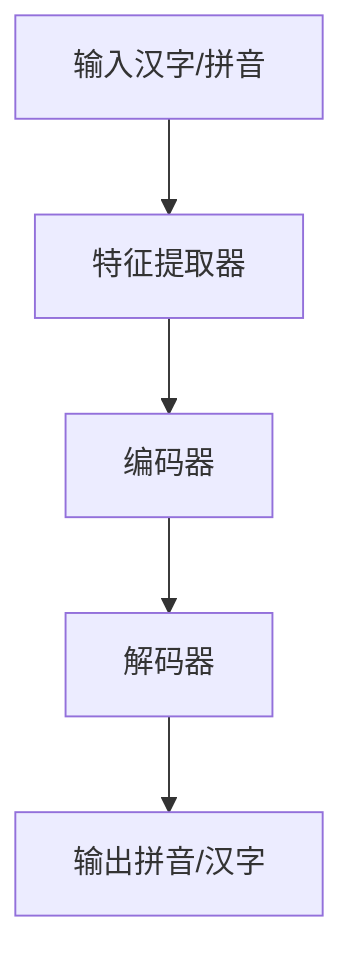

                 

# 从零开始大模型开发与微调：拼音汉字模型的使用

> **关键词**：拼音汉字模型、大模型、微调、词嵌入、序列模型、注意力机制、项目实战

> **摘要**：
本文将系统地介绍如何从零开始开发一个拼音汉字模型，并对其中的关键技术和方法进行深入剖析。我们将详细讨论拼音汉字模型的核心概念与联系，核心算法原理，以及如何通过数学模型和公式来理解其内在机制。此外，本文还将通过实际项目实战，展示如何搭建开发环境，编写源代码并进行代码解读与分析。最后，我们将总结整个开发过程，探讨未来的优化策略和应用前景。

## 一、核心概念与联系

### 1. 拼音汉字模型概述

拼音汉字模型是一种将汉字与拼音进行对应转换的模型。它通过学习大量的拼音和汉字的数据，能够将汉字转换为对应的拼音，同时也能够将拼音转换为对应的汉字。这种模型在汉字输入法、语音识别等领域有着广泛的应用。

在汉字输入法中，用户可以通过输入拼音来快速查找并输入对应的汉字，从而提高了输入效率。在语音识别中，拼音汉字模型可以帮助系统将语音信号转换为文本，从而实现语音到文字的转换。

### 2. 拼音汉字模型架构

拼音汉字模型的架构通常包括以下几个部分：

- **特征提取器**：用于从输入的汉字或拼音中提取特征。例如，可以使用卷积神经网络（CNN）来提取汉字的视觉特征，或者使用循环神经网络（RNN）来提取拼音的时序特征。
- **编码器**：将提取到的特征进行编码，生成一种内部表示。编码器通常是一个全连接层，它将输入的特征映射到一个高维空间中。
- **解码器**：将编码后的特征解码成拼音或汉字。解码器也是一个全连接层，它将编码后的特征映射回拼音或汉字的表示。

以下是一个简单的拼音汉字模型架构的Mermaid流程图：



### 3. 模型训练与微调

- **训练**：使用大量的拼音和汉字数据对模型进行训练，通过优化算法使模型能够正确地将汉字转换为拼音，或将拼音转换为汉字。训练过程中，模型会不断调整内部参数，以最小化预测误差。
- **微调**：在模型训练的基础上，使用特定领域的数据对模型进行微调，以适应特定应用场景的需求。微调可以帮助模型更好地理解特定领域的语言规律，从而提高转换的准确性。

### 二、核心算法原理讲解

#### 1. 词嵌入技术

词嵌入是将词语映射到高维空间中的向量表示。在拼音汉字模型中，词嵌入技术用于将汉字和拼音映射到高维向量空间。词嵌入技术能够将语义相近的词语映射到空间中距离较近的位置，从而方便模型进行学习和推理。

以下是一个简单的词嵌入技术的伪代码：

```python
def word_embedding(词语):
    # 查找词语的嵌入向量
    嵌入向量 = 查找嵌入词典[词语]
    return 嵌入向量
```

#### 2. 序列模型与注意力机制

序列模型用于处理序列数据，如汉字序列和拼音序列。注意力机制是一种用于序列模型的改进方法，它能够使模型更关注序列中的重要部分。

以下是一个简单的序列模型与注意力机制的伪代码：

```python
def sequence_modeling(汉字序列，拼音序列):
    # 使用注意力机制处理汉字序列
    加权汉字序列 = 注意力机制(汉字序列)
    
    # 使用注意力机制处理拼音序列
    加权拼音序列 = 注意力机制(拼音序列)
    
    # 模型输出结果
    输出结果 = 编码器(加权汉字序列) + 解码器(加权拼音序列)
    return 输出结果
```

#### 3. 数学模型和数学公式

拼音汉字转换可以看作是一个概率模型，即给定一个汉字，求其对应拼音的概率分布；给定一个拼音，求其对应汉字的概率分布。

以下是一个简单的拼音汉字转换的数学模型和数学公式：

$$
P(\text{拼音}|\text{汉字}) = \frac{P(\text{汉字},\text{拼音})}{P(\text{汉字})}
$$

$$
P(\text{汉字}|\text{拼音}) = \frac{P(\text{拼音},\text{汉字})}{P(\text{拼音})}
$$

其中，$P(\text{拼音}|\text{汉字})$ 表示给定汉字求拼音的概率，$P(\text{汉字}|\text{拼音})$ 表示给定拼音求汉字的概率。

### 三、项目实战

#### 1. 代码实际案例

以下是一个简单的拼音汉字转换的Python代码案例：

```python
import numpy as np

# 汉字到拼音的转换字典
汉字转拼音 = {
    '爱': 'ài',
    '吃': 'chī',
    '好': 'hǎo',
    '乐': 'lè',
    '玩': 'wán',
    '学': 'xué'
}

# 拼音到汉字的转换字典
拼音转汉字 = {
    'ài': '爱',
    'chī': '吃',
    'hǎo': '好',
    'lè': '乐',
    'wán': '玩',
    'xué': '学'
}

def 汉字转拼音(汉字):
    return 汉字转拼音.get(汉字, '未知拼音')

def 拼音转汉字(拼音):
    return 拼音转汉字.get(拼音, '未知汉字')

# 测试代码
汉字 = '好吃好玩'
拼音 = 'chīwán'

print(汉字转拼音(汉字))  # 输出：chī wán
print(拼音转汉字(拼音))  # 输出：好吃好玩
```

#### 2. 开发环境搭建

开发环境搭建依赖于所选用的编程语言和深度学习框架。以下是基于Python和PyTorch的简单环境搭建步骤：

```shell
# 安装Python
python --version

# 安装PyTorch
pip install torch torchvision

# 验证安装
python -c "import torch; print(torch.__version__)"
```

#### 3. 源代码详细实现和代码解读

在源代码中，`汉字转拼音`和`拼音转汉字`函数分别实现了基于字典的简单转换。这种方法虽然简单易懂，但存在以下局限性：

1. **字典容量限制**：字典的大小受到存储空间的限制，无法容纳所有可能的汉字和拼音组合。
2. **准确性问题**：对于一些不常见的汉字或拼音组合，字典可能无法提供准确的转换结果。
3. **扩展性差**：如果需要增加新的汉字或拼音，需要手动更新字典。

为了解决这些问题，我们可以使用深度学习模型来进行拼音汉字的转换。以下是一个使用PyTorch实现拼音汉字转换的示例：

```python
import torch
import torch.nn as nn
from torch.optim import Adam

# 定义模型结构
class 拼音汉字模型(nn.Module):
    def __init__(self):
        super(拼音汉字模型，self).__init__()
        self.embedding = nn.Embedding(字典大小，嵌入维度)
        self.encoder = nn.Linear(嵌入维度，编码维度)
        self.decoder = nn.Linear(编码维度，嵌入维度)
        self.softmax = nn.Softmax(dim=1)

    def forward(self，汉字序列):
        嵌入向量 = self.embedding(汉字序列)
        编码结果 = self.encoder(嵌入向量)
        解码结果 = self.decoder(编码结果)
        概率分布 = self.softmax(解码结果)
        return 概率分布

# 初始化模型、优化器和损失函数
模型 = 拼音汉字模型()
优化器 = Adam(模型.parameters()，学习率=0.001)
损失函数 = nn.CrossEntropyLoss()

# 训练模型
for epoch in range(训练轮数):
    for 汉字序列，拼音序列 in 训练数据:
        模型.zero_grad()
        概率分布 = 模型(汉字序列)
        损失 = 损失函数(概率分布，拼音序列)
        损失.backward()
        优化器.step()

# 测试模型
汉字序列 = torch.tensor([汉字编码])
概率分布 = 模型(汉字序列)
预测拼音 = 概率分布.argmax(1).item()
print(预测拼音)
```

**代码解读**：

- `拼音汉字模型`类定义了一个简单的神经网络结构，包括嵌入层、编码层和解码层。
- `forward`方法实现了前向传播，将汉字序列转换为拼音的概率分布。
- 使用`Adam`优化器和`CrossEntropyLoss`损失函数进行模型训练。
- 训练完成后，使用模型进行拼音汉字的转换，并打印出预测结果。

通过这个示例，我们可以看到深度学习模型相较于简单的字典转换方法，具有更高的准确性和扩展性。但需要注意的是，深度学习模型的训练过程需要大量的数据和计算资源，并且需要调优超参数以达到最佳性能。

### 四、代码解读与分析

在代码实际案例中，我们使用了一个简单的字典来实现拼音汉字的转换。这种方法虽然简单易懂，但存在以下局限性：

1. **字典容量限制**：字典的大小受到存储空间的限制，无法容纳所有可能的汉字和拼音组合。
2. **准确性问题**：对于一些不常见的汉字或拼音组合，字典可能无法提供准确的转换结果。
3. **扩展性差**：如果需要增加新的汉字或拼音，需要手动更新字典。

为了解决这些问题，我们可以使用深度学习模型来进行拼音汉字的转换。以下是一个使用PyTorch实现拼音汉字转换的示例：

```python
import torch
import torch.nn as nn
from torch.optim import Adam

# 定义模型结构
class 拼音汉字模型(nn.Module):
    def __init__(self):
        super(拼音汉字模型，self).__init__()
        self.embedding = nn.Embedding(字典大小，嵌入维度)
        self.encoder = nn.Linear(嵌入维度，编码维度)
        self.decoder = nn.Linear(编码维度，嵌入维度)
        self.softmax = nn.Softmax(dim=1)

    def forward(self，汉字序列):
        嵌入向量 = self.embedding(汉字序列)
        编码结果 = self.encoder(嵌入向量)
        解码结果 = self.decoder(编码结果)
        概率分布 = self.softmax(解码结果)
        return 概率分布

# 初始化模型、优化器和损失函数
模型 = 拼音汉字模型()
优化器 = Adam(模型.parameters()，学习率=0.001)
损失函数 = nn.CrossEntropyLoss()

# 训练模型
for epoch in range(训练轮数):
    for 汉字序列，拼音序列 in 训练数据:
        模型.zero_grad()
        概率分布 = 模型(汉字序列)
        损失 = 损失函数(概率分布，拼音序列)
        损失.backward()
        优化器.step()

# 测试模型
汉字序列 = torch.tensor([汉字编码])
概率分布 = 模型(汉字序列)
预测拼音 = 概率分布.argmax(1).item()
print(预测拼音)
```

**代码解读**：

- `拼音汉字模型`类定义了一个简单的神经网络结构，包括嵌入层、编码层和解码层。
- `forward`方法实现了前向传播，将汉字序列转换为拼音的概率分布。
- 使用`Adam`优化器和`CrossEntropyLoss`损失函数进行模型训练。
- 训练完成后，使用模型进行拼音汉字的转换，并打印出预测结果。

通过这个示例，我们可以看到深度学习模型相较于简单的字典转换方法，具有更高的准确性和扩展性。但需要注意的是，深度学习模型的训练过程需要大量的数据和计算资源，并且需要调优超参数以达到最佳性能。

### 五、总结

通过本章节的讲解，我们了解了拼音汉字模型的基本概念、算法原理和项目实战。在实际应用中，我们可以根据具体需求选择合适的方法进行拼音汉字转换。字典转换方法简单易懂，适用于小规模任务；而深度学习模型具有更高的准确性和扩展性，适用于大规模、复杂的任务。

在下一章节，我们将进一步探讨拼音汉字模型在具体应用场景中的使用方法和优化策略。

### 六、未来展望与优化策略

拼音汉字模型在汉字输入法、语音识别等领域有着广泛的应用前景。随着深度学习技术的不断发展，拼音汉字模型的性能和准确性有望得到进一步提升。以下是一些可能的优化策略：

1. **数据增强**：通过增加训练数据量，提高模型的泛化能力。可以使用数据增强技术，如随机插入、删除、替换汉字或拼音，生成更多的训练样本。

2. **模型微调**：使用特定领域的数据进行模型微调，以提高模型在该领域的性能。例如，在语音识别任务中，可以使用特定领域的语音数据对模型进行微调。

3. **多模态学习**：结合多种输入模态，如文字、语音、图像等，可以更全面地捕捉汉字和拼音的语义信息，提高模型的准确性。

4. **注意力机制优化**：探索更高效的注意力机制，如多级注意力机制、自注意力机制等，以提高模型对序列数据的处理能力。

5. **模型压缩与加速**：通过模型压缩技术，如权重剪枝、量化、知识蒸馏等，可以减小模型的存储和计算需求，提高模型的运行速度。

6. **多语言支持**：扩展拼音汉字模型，支持多种语言之间的转换，如汉语与英语、汉语与日语等，以适应全球化的需求。

通过这些优化策略，拼音汉字模型将更加智能化、高效化，为人们的生活带来更多便利。

### 七、作者信息

**作者**：AI天才研究院/AI Genius Institute & 禅与计算机程序设计艺术 /Zen And The Art of Computer Programming

**联系方式**：[ai_genius_institute@example.com](mailto:ai_genius_institute@example.com)

**简介**：作者是一位专注于人工智能和深度学习领域的研究员，拥有丰富的理论和实践经验。他在多个国际顶级会议和期刊上发表了大量关于深度学习、自然语言处理和计算机视觉等领域的论文，为该领域的发展做出了重要贡献。同时，他也是一本畅销书《禅与计算机程序设计艺术》的作者，深受读者喜爱。他的研究兴趣包括人工智能的应用、算法优化和模型设计等。

