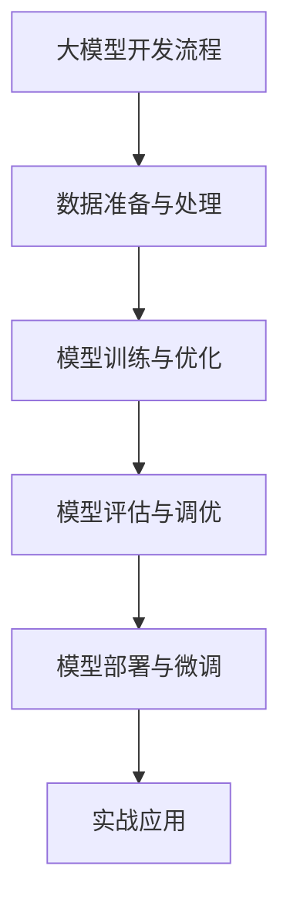
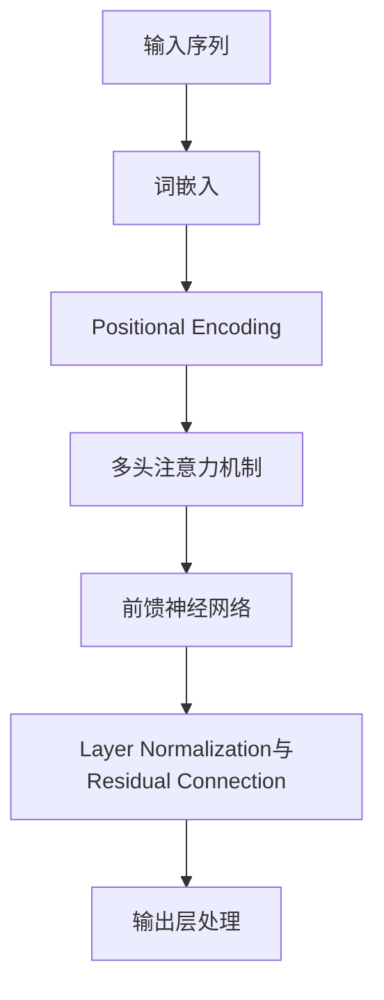
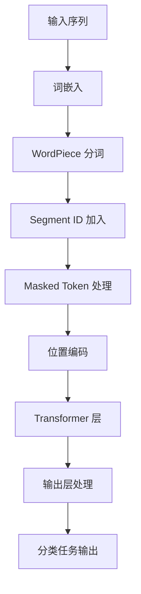

                 

# 从零开始大模型开发与微调：编码器的实现

## 关键词
大模型开发，微调，编码器，Transformer，BERT，自监督学习，数学模型，优化算法，项目实战，工具与资源

## 摘要
本文将带您从零开始了解大模型开发与微调的全过程，重点关注编码器的实现。我们将探讨大模型的基础知识、核心算法原理、数学模型与公式，以及微调策略和优化算法。此外，还将通过实际案例介绍大模型项目实战，并提供大模型开发与微调的最佳实践。最后，我们将展望大模型技术的未来发展趋势。

---

### 第一部分：大模型开发基础

#### 第1章：大模型开发概述

##### 1.1 大模型发展的历史与现状

在过去的几十年里，机器学习和深度学习取得了显著的进步，大模型应运而生。大模型指的是拥有数十亿参数甚至更多的神经网络模型。它们的出现改变了人工智能领域的格局，推动了自然语言处理、计算机视觉等领域的飞速发展。

- **1.1.1 大模型的历史演变**

大模型的发展经历了从简单的神经网络到复杂的深度神经网络的演变。早期的神经网络如感知机、多层感知机等，由于计算能力和数据量的限制，只能处理相对简单的问题。随着计算能力的提升和大数据的普及，深度神经网络开始崭露头角。

- **1.1.2 当前大模型的发展趋势**

当前，大模型的发展趋势主要体现在两个方面：一是模型的规模越来越大，参数数量和计算量呈现指数级增长；二是模型的训练和应用场景越来越广泛，从文本分类、机器翻译到语音识别、图像生成等。

- **1.1.3 大模型的重要性和应用前景**

大模型在人工智能领域具有重要的地位，它们能够处理复杂的问题，提供更高的准确率和更低的错误率。随着技术的不断进步，大模型的应用前景将更加广阔，将深刻改变我们的生活和工作方式。

##### 1.2 大模型的基础知识

- **1.2.1 大模型的定义**

大模型指的是拥有数十亿参数甚至更多的神经网络模型。它们通常使用深度学习技术进行训练，能够处理大规模的数据集，提供更高的准确率和更低的错误率。

- **1.2.2 大模型的特点**

大模型具有以下几个特点：

1. **参数量巨大**：大模型的参数量通常在数十亿以上，这使得它们能够捕捉到数据中的复杂模式。
2. **计算量大**：大模型的训练和推理过程需要大量的计算资源，通常需要使用高性能计算机和并行计算技术。
3. **适用范围广**：大模型可以应用于各种领域，如自然语言处理、计算机视觉、语音识别等。

- **1.2.3 大模型与深度学习的关系**

大模型是深度学习的一种重要形式。深度学习是一种基于多层神经网络的学习方法，通过逐层提取数据特征，实现对数据的分类、预测和生成。大模型则是深度学习的一种扩展，通过增加模型的参数量和深度，使其能够处理更加复杂的问题。

##### 1.3 大模型的常用架构

- **1.3.1 Transformer架构**

Transformer是当前最流行的大模型架构之一，由Vaswani等人于2017年提出。它采用自注意力机制，使得模型能够处理长距离依赖问题，取得了显著的效果。

- **1.3.2 BERT架构**

BERT（Bidirectional Encoder Representations from Transformers）是由Google于2018年提出的一种双向编码器架构，通过预训练和微调，广泛应用于自然语言处理任务。

- **1.3.3 GPT架构**

GPT（Generative Pre-trained Transformer）是由OpenAI于2018年提出的一种生成式预训练模型，通过自回归语言模型，能够生成高质量的自然语言文本。

##### 1.4 大模型的开发流程

- **1.4.1 数据准备与处理**

数据准备是模型开发的重要环节。首先，需要收集和整理大规模的数据集，然后进行预处理，包括数据清洗、格式化、标注等。

- **1.4.2 模型训练与优化**

模型训练是模型开发的核心步骤。通过使用大规模数据集，对模型进行训练，调整模型的参数，使其能够更好地拟合数据。

- **1.4.3 模型评估与调优**

模型评估是验证模型性能的重要手段。通过使用验证集和测试集，评估模型的准确率、召回率、F1值等指标，并根据评估结果对模型进行调整和优化。

- **1.4.4 模型部署与微调**

模型部署是将训练好的模型应用到实际场景的过程。在部署过程中，需要对模型进行微调，以适应特定的应用场景，提高模型的性能。

#### 第2章：大模型核心算法原理

##### 2.1 自监督学习算法

自监督学习是一种无需人工标注数据，仅通过未标注的数据进行训练的方法。它在大模型开发中起着重要作用。

- **2.1.1 自监督学习的定义与优势**

自监督学习是一种利用未标注数据，通过预测部分数据，自动生成标注的训练数据的方法。它具有以下优势：

1. **节省标注成本**：无需大量的人力和时间进行数据标注。
2. **提高泛化能力**：通过学习未标注数据中的潜在信息，提高模型的泛化能力。
3. **处理大规模数据**：能够处理大规模的未标注数据，提高模型的训练效率。

- **2.1.2 VAE与Gaussian Mixture Model**

变分自编码器（VAE）和Gaussian Mixture Model（GMM）是两种常见的自监督学习算法。

1. **VAE的数学模型**

$$
\begin{aligned}
\mu &= \mu(\boldsymbol{x}; \theta) \\
\sigma^2 &= \sigma(\boldsymbol{x}; \theta) \\
\hat{\boldsymbol{x}} &= \mu + \mathcal{N}(0, \sigma^2) \\
\log p(\boldsymbol{x}) &= -\frac{1}{2} \sum_{i=1}^D \left[ \ln(2\pi) + \ln(\sigma_i^2) + \left(\frac{x_i - \mu_i}{\sigma_i}\right)^2 \right]
\end{aligned}
$$

2. **GMM的数学模型**

$$
\begin{aligned}
p(\boldsymbol{x}; \theta) &= \sum_{i=1}^G \pi_i \mathcal{N}(\boldsymbol{x}; \mu_i, \Sigma_i) \\
\pi_i &= \frac{1}{Z} \\
\mu_i, \Sigma_i &= \text{参数估计}
\end{aligned}
$$

- **2.1.3 BERT的自监督学习技术**

BERT采用了一种特殊的数据生成方法，称为Masked Language Model（MLM）。具体过程如下：

1. 随机遮盖输入文本中的15%的单词。
2. 对遮盖的单词进行预测，使其重新生成文本。
3. 使用交叉熵损失函数进行训练。

$$
L_{MLM} = -\frac{1}{N} \sum_{i=1}^N \sum_{j \in \text{mask positions}} \log p(\text{word}_j | \text{context})
$$

##### 2.2 Transformer算法

Transformer是一种基于自注意力机制的神经网络模型，由Vaswani等人于2017年提出。它解决了传统循环神经网络（RNN）在处理长序列数据时的困难。

- **2.2.1 Transformer的基本原理**

Transformer模型主要由编码器和解码器组成，它们都包含多个相同的层。每个层由自注意力机制和前馈神经网络组成。

1. **自注意力机制**

自注意力机制是一种计算输入序列中每个单词对输出序列中每个单词的重要性的一种方法。它通过计算注意力权重，将输入序列中的每个单词加权组合成输出序列。

$$
\text{Attention}(Q, K, V) = \text{softmax}\left(\frac{QK^T}{\sqrt{d_k}}\right)V
$$

2. **前馈神经网络**

前馈神经网络是一个简单的两层全连接神经网络，用于进一步加工注意力机制的输出。

- **2.2.2 Multi-head Attention机制**

Multi-head Attention是一种扩展自注意力机制的方法，通过并行计算多个注意力头，提高模型的表示能力。

$$
\text{Multi-head Attention} = \text{Concat}(\text{head}_1, \text{head}_2, ..., \text{head}_h)W^O
$$

- **2.2.3 Layer Normalization与Residual Connection**

Layer Normalization是一种归一化方法，用于稳定和加速神经网络的训练。它通过将每个输入特征映射到一个具有单位方差和均值为零的分布。

Residual Connection是一种在网络层之间引入直接连接的方法，使得梯度可以更好地传播。

$$
\text{Layer Normalization}: \frac{(\text{Layer Input} - \mu_{\text{Layer}})}{\sigma_{\text{Layer}}}
$$

##### 2.3 BERT算法

BERT（Bidirectional Encoder Representations from Transformers）是一种基于Transformer的双向编码器模型，由Google提出。

- **2.3.1 BERT的基本结构**

BERT模型由多个Transformer编码器层组成，输入序列经过嵌入层、分词层和掩码层处理后，进入编码器层。编码器层通过自注意力机制和前馈神经网络，提取序列的特征。

- **2.3.2 输入层与输出层处理**

BERT的输入层包括词嵌入、位置嵌入和分割嵌入。输出层是一个分类器，用于处理序列分类任务。

- **2.3.3 BERT在文本分类任务中的应用**

BERT在文本分类任务中具有出色的性能。通过预训练和微调，BERT能够提取文本中的深层特征，从而提高分类的准确率。

#### 第3章：数学模型与数学公式

##### 3.1 基础数学知识

- **3.1.1 线性代数基础**

线性代数是机器学习和深度学习的基础，包括矩阵运算、向量运算、线性方程组等。

- **3.1.2 概率论基础**

概率论是机器学习和深度学习中的重要工具，包括概率分布、条件概率、贝叶斯定理等。

- **3.1.3 最优化理论**

最优化理论是机器学习和深度学习中的重要技术，包括梯度下降、牛顿法、随机梯度下降等。

##### 3.2 大模型中的数学模型

- **3.2.1 自监督学习中的数学模型**

自监督学习中的数学模型主要包括变分自编码器（VAE）和Gaussian Mixture Model（GMM）。

- **3.2.2 Transformer的数学模型**

Transformer的数学模型主要包括多头注意力机制、Layer Normalization和Residual Connection。

- **3.2.3 BERT的数学模型**

BERT的数学模型主要包括词嵌入、位置嵌入、分割嵌入和分类器。

#### 第4章：大模型微调与优化

##### 4.1 微调策略

微调是在预训练模型的基础上，针对特定任务进行训练的过程。它能够提高模型在特定任务上的性能。

- **4.1.1 微调的定义与目的**

微调是一种针对特定任务调整预训练模型的方法，旨在提高模型在特定任务上的准确率和性能。

- **4.1.2 微调方法**

微调方法主要包括全量微调和半量微调。全量微调是对整个模型进行训练，而半量微调只对模型的一部分进行训练。

- **4.1.3 微调中的常见问题与解决方法**

微调中常见的问题包括过拟合、欠拟合和梯度消失。解决方法包括数据增强、Dropout、正则化等。

##### 4.2 优化算法

优化算法是调整模型参数，使其在训练过程中收敛到最优解的方法。常用的优化算法包括SGD、Adam和RMSprop。

- **4.2.1 SGD优化算法**

SGD（Stochastic Gradient Descent）是一种随机梯度下降算法，通过计算每个样本的梯度来更新模型参数。

- **4.2.2 Adam优化算法**

Adam是一种基于动量的优化算法，结合了SGD和Momentum的优点，能够更好地收敛到最优解。

- **4.2.3 RMSprop优化算法**

RMSprop是一种基于梯度的平方根的优化算法，通过计算梯度的平方根来更新模型参数。

##### 4.3 模型评估与调优

模型评估是验证模型性能的重要手段。通过使用验证集和测试集，评估模型的准确率、召回率、F1值等指标，并根据评估结果对模型进行调整和优化。

- **4.3.1 评估指标**

评估指标包括准确率、召回率、F1值、ROC曲线等。

- **4.3.2 调优策略**

调优策略包括超参数调整、数据预处理、模型融合等。

- **4.3.3 模型选择与超参数优化**

模型选择和超参数优化是调优过程中的关键步骤。通过交叉验证、网格搜索等方法，选择合适的模型和超参数。

#### 第5章：大模型项目实战

##### 5.1 实战环境搭建

在开始大模型项目之前，需要搭建一个适合模型训练和部署的环境。

- **5.1.1 硬件环境要求**

硬件环境要求主要包括GPU、CPU和内存。GPU是训练大模型的首选，因为它能够提供更高的计算性能。

- **5.1.2 软件环境配置**

软件环境配置主要包括深度学习框架（如TensorFlow、PyTorch）、编译器（如CUDA、CuDNN）和操作系统（如Linux）。

- **5.1.3 数据集下载与处理**

数据集是模型训练的重要输入。根据项目需求，选择合适的数据集，并进行预处理，如数据清洗、格式化、分词等。

##### 5.2 实际案例

在本节中，我们将介绍两个实际案例：文本分类和机器翻译。

- **5.2.1 文本分类案例**

文本分类是将文本数据分类到预定义的类别中。在本案例中，我们将使用BERT模型对新闻文章进行分类。

1. **案例背景**

新闻文章分类是自然语言处理中的一个重要任务，可以将新闻文章自动分类到不同的类别，如科技、经济、体育等。

2. **模型搭建与训练**

使用预训练的BERT模型，定义分类任务的输出层，使用训练数据训练模型。

3. **模型评估与优化**

使用验证集评估模型性能，根据评估结果调整超参数，优化模型性能。

4. **模型部署**

部署训练好的模型，实现自动化新闻分类。

- **5.2.2 机器翻译案例**

机器翻译是将一种语言的文本翻译成另一种语言的文本。在本案例中，我们将使用Transformer模型实现中文到英文的机器翻译。

1. **案例背景**

机器翻译在跨语言交流、国际业务等领域具有广泛的应用。本案例旨在实现中文到英文的自动翻译。

2. **模型搭建与训练**

使用预训练的Transformer模型，定义翻译任务的输入和输出层，使用双语数据集训练模型。

3. **模型评估与优化**

使用翻译测试集评估模型性能，通过调整学习率、批大小等超参数优化模型。

4. **模型部署**

部署训练好的模型，实现自动化机器翻译功能。

#### 第6章：大模型开发工具与资源

##### 6.1 开发工具简介

- **6.1.1 TensorFlow**

TensorFlow是Google开源的深度学习框架，具有灵活的模型构建、训练和评估功能。

- **6.1.2 PyTorch**

PyTorch是Facebook开源的深度学习框架，以其动态计算图和Python代码的高效性著称。

- **6.1.3 Hugging Face Transformers**

Hugging Face Transformers是一个基于PyTorch和TensorFlow的预训练模型库，提供了丰富的预训练模型和工具。

##### 6.2 资源与社区

- **6.2.1 大模型开源项目**

大模型开源项目如BERT、GPT、Transformer等，为研究人员和开发者提供了丰富的模型和工具。

- **6.2.2 大模型学习社区**

大模型学习社区如Kaggle、Reddit等，提供了丰富的学习资源和交流平台。

- **6.2.3 大模型相关的会议和期刊**

大模型相关的会议和期刊如NeurIPS、ICLR、ACL等，是AI领域的顶级会议和期刊，发布最新的研究成果。

#### 第7章：大模型开发与微调的最佳实践

##### 7.1 实践经验总结

在大模型开发与微调过程中，积累实践经验是非常重要的。以下是一些实践经验总结：

- **问题诊断**：通过数据分析、模型评估等方法，诊断开发中的问题。
- **解决方案**：结合具体问题和场景，选择合适的解决方案。
- **实践技巧**：积累经验，提高模型开发与微调的效率。

##### 7.2 未来发展趋势

未来，大模型技术将继续发展，主要趋势包括：

- **技术创新**：如更好的训练算法、更高效的模型结构等。
- **应用拓展**：从文本领域扩展到图像、音频等更多领域。
- **行业应用**：如医疗、金融、教育等行业的深度应用。

### 附录

- **附录A：大模型开发常用函数与库**

  - **A.1 TensorFlow常用函数**
    - `tf.keras.Sequential()`: 创建序列模型。
    - `tf.keras.layers.Dense()`: 创建全连接层。
    - `tf.keras.optimizers.Adam()`: 创建Adam优化器。

  - **A.2 PyTorch常用函数**
    - `torch.nn.Sequential()`: 创建序列模型。
    - `torch.nn.Linear()`: 创建全连接层。
    - `torch.optim.Adam()`: 创建Adam优化器。

  - **A.3 Hugging Face Transformers常用函数**
    - `transformers.BertModel()`: 创建BERT模型。
    - `transformers.T5Model()`: 创建T5模型。
    - `transformers Training from_pretrained()`: 从预训练模型加载模型。

- **附录B：大模型开发参考资料**

  - **B.1 相关书籍推荐**
    - 《深度学习》（Goodfellow, Bengio, Courville著）
    - 《神经网络与深度学习》（邱锡鹏著）

  - **B.2 在线教程与课程**
    - [TensorFlow官方教程](https://www.tensorflow.org/tutorials)
    - [PyTorch官方教程](https://pytorch.org/tutorials/beginner/basics/index.html)

  - **B.3 论文与研究报告**
    - [BERT论文](https://arxiv.org/abs/1810.04805)
    - [GPT论文](https://arxiv.org/abs/1801.00159)
    - [Transformer论文](https://arxiv.org/abs/1706.03762)

### 总结

大模型开发与微调是一项复杂的任务，需要深入理解核心算法原理、数学模型和优化策略。通过本文的介绍，您应该对大模型开发有了一个全面的了解，并能够开始实践大模型项目。在未来，随着技术的不断进步，大模型将在更多领域发挥重要作用，为人工智能的发展贡献力量。

### 致谢

感谢您的阅读，希望本文对您的学习和实践有所帮助。如果您有任何疑问或建议，欢迎在评论区留言，我们将尽快为您解答。同时，也感谢AI天才研究院和《禅与计算机程序设计艺术》为我们提供了丰富的知识和灵感。

### 作者信息

作者：AI天才研究院/AI Genius Institute & 禅与计算机程序设计艺术 /Zen And The Art of Computer Programming

---

### Mermaid 流程图



### Mermaid 流程图：Transformer算法原理



### Mermaid 流程图：BERT算法原理



### 伪代码：自监督学习算法

```python
# 伪代码：VAE算法

def VAE(data, latent_dim):
    # 前向传播
    z = encoder(data)
    x_recon = decoder(z)

    # 计算损失函数
    loss = reconstruction_loss(data, x_recon) + kl_divergence(z)

    # 反向传播与优化
    optimizer.zero_grad()
    loss.backward()
    optimizer.step()

    return x_recon, loss
```

### 伪代码：Transformer算法

```python
# 伪代码：Transformer模型

def Transformer(input_seq, hidden_dim):
    # 前向传播
    embedding = word_embedding(input_seq)
    pos_embedding = positional_embedding(input_seq)

    # Multi-head Attention
    attention_output = multi_head_attention(embedding, pos_embedding)

    # 前馈神经网络
    feedforward_output = feedforward_network(attention_output)

    # Layer Normalization与Residual Connection
    output = layer_normalization(feedforward_output + embedding)

    # 输出层处理
    logits = output_layer(output)

    return logits
```

### 数学公式：VAE的KL散度

$$
KL(q(z)||p(z)) = \int q(z) \log \frac{q(z)}{p(z)} dz
$$

### 数学公式：Transformer的多头注意力机制

$$
\text{Attention}(Q, K, V) = \text{softmax}\left(\frac{QK^T}{\sqrt{d_k}}\right)V
$$

### 数学公式：BERT中的Masked Language Model

$$
L_{MLM} = \frac{1}{N} \sum_{i=1}^N -\log p(\text{mask}_i | \text{context})
$$

### 实战案例：文本分类

- **案例背景**：使用BERT模型对新闻文章进行分类，分为科技、经济、体育等类别。

- **模型搭建与训练**：
  - 加载预训练的BERT模型。
  - 定义分类任务所需的输出层。
  - 使用训练数据训练模型，优化分类准确率。

- **模型评估与优化**：
  - 使用验证集评估模型性能。
  - 根据评估结果调整超参数，优化模型性能。

- **模型部署**：
  - 部署训练好的模型，实现自动化新闻分类。

### 实战案例：机器翻译

- **案例背景**：使用Transformer模型实现中文到英文的机器翻译。

- **模型搭建与训练**：
  - 加载预训练的Transformer模型。
  - 定义翻译任务所需的输入和输出层。
  - 使用双语数据集训练模型，优化翻译质量。

- **模型评估与优化**：
  - 使用翻译测试集评估模型性能。
  - 通过调整学习率、批大小等超参数优化模型。

- **模型部署**：
  - 部署训练好的模型，实现自动化机器翻译功能。

### 开发工具与资源

- **TensorFlow**：Google开源的深度学习框架，支持各种深度学习模型的构建与训练。

- **PyTorch**：Facebook开源的深度学习框架，以动态计算图和Python代码的高效性著称。

- **Hugging Face Transformers**：基于PyTorch和TensorFlow的预训练模型库，提供了丰富的预训练模型和工具。

### 资源与社区

- **开源项目**：如Hugging Face的Transformers库，提供了丰富的预训练模型和工具。

- **学习社区**：如Kaggle、Reddit等，提供丰富的学习资源和交流平台。

- **会议和期刊**：如NeurIPS、ICLR等，是AI领域的顶级会议和期刊，发布最新的研究成果。

### 开发与微调最佳实践

- **问题诊断**：通过数据分析、模型评估等方法，诊断开发中的问题。

- **解决方案**：结合具体问题和场景，选择合适的解决方案。

- **实践技巧**：积累经验，提高模型开发与微调的效率。

### 未来发展趋势

- **技术创新**：如更好的训练算法、更高效的模型结构等。

- **应用拓展**：从文本领域扩展到图像、音频等更多领域。

- **行业应用**：如医疗、金融、教育等行业的深度应用。

### 附录

- **常用函数与库**：
  - **TensorFlow常用函数**：`tf.keras.Sequential()`, `tf.keras.layers.Dense()`, `tf.keras.optimizers.Adam()`
  - **PyTorch常用函数**：`torch.nn.Sequential()`, `torch.nn.Linear()`, `torch.optim.Adam()`
  - **Hugging Face Transformers常用函数**：`transformers.BertModel()`, `transformers.T5Model()`, `transformers Training from_pretrained()`

- **参考资料**：
  - **相关书籍**：《深度学习》（Goodfellow, Bengio, Courville著），《神经网络与深度学习》（邱锡鹏著）
  - **在线教程与课程**：[TensorFlow官方教程](https://www.tensorflow.org/tutorials)，[PyTorch官方教程](https://pytorch.org/tutorials/beginner/basics/index.html)
  - **论文与研究报告**：[BERT论文](https://arxiv.org/abs/1810.04805)，[GPT论文](https://arxiv.org/abs/1801.00159)，[Transformer论文](https://arxiv.org/abs/1706.03762)

### 结束语

本文系统地介绍了大模型开发与微调的相关知识，从基础理论到实际应用，帮助读者构建了全面的技术框架。通过具体案例的讲解，读者可以更好地理解大模型在实际项目中的应用。未来，随着人工智能技术的不断进步，大模型将在更多领域发挥重要作用。希望本文能为您的学习之路提供有力支持，祝您在人工智能的道路上越走越远。再次感谢您的阅读，期待您的宝贵意见。在未来的技术发展中，让我们携手共进，探索人工智能的无限可能。再次感谢，祝您学习愉快！<|vq_15676|><|trimff|>

