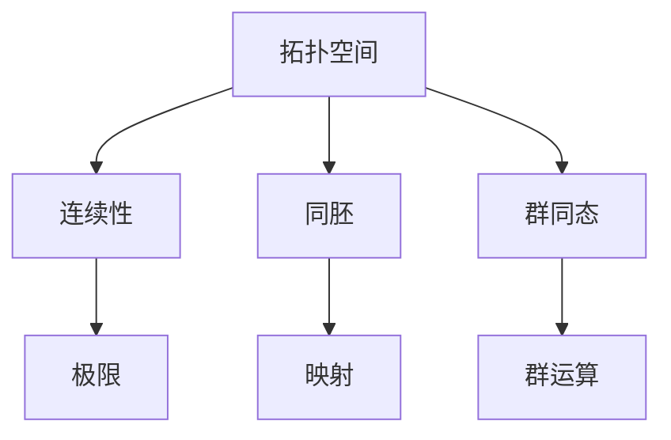
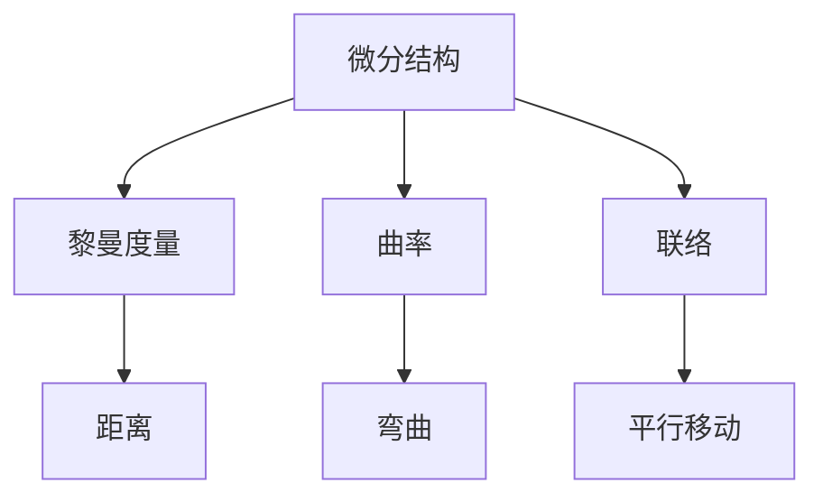
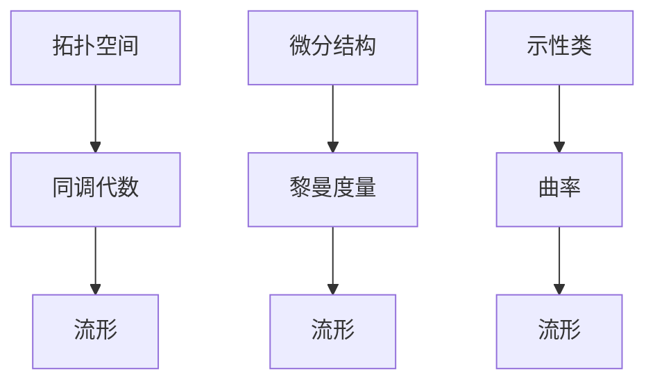

                 

### 《代数拓扑与微分几何的交集》

> **关键词：** 代数拓扑、微分几何、交集、同调代数、示性类、流形、拓扑空间

> **摘要：** 本文深入探讨代数拓扑与微分几何这两个数学分支的交集，从基本概念出发，逐步分析它们的核心算法原理和数学模型，通过具体的案例和代码实现，揭示这两个领域在数学和物理学中的广泛应用，并探讨未来的研究方向。

代数拓扑与微分几何是数学中两个重要的分支，尽管它们看似独立，但它们在许多方面有着深刻的联系。本文将带领读者一步步进入这两个领域的交集，理解它们的核心概念、算法原理和数学模型，并探讨它们在实际应用中的重要性。

### 目录

1. **代数拓扑基础**
   1.1 拓扑空间的定义
   1.2 基本拓扑性质
   1.3 代数拓扑的基本工具

2. **微分几何基础**
   2.1 微分结构的定义
   2.2 连续性、可微性和光滑性
   2.3 黎曼几何的基本工具

3. **代数拓扑与微分几何的交集**
   3.1 同调代数与微分几何
   3.2 示性类的交叉点
   3.3 代数拓扑与微分几何的结合

4. **代数拓扑与微分几何的实际应用**
   4.1 物理学中的应用
   4.2 数学中的问题与挑战

5. **未来的研究方向**
   5.1 研究现状与趋势
   5.2 未来可能的突破点
   5.3 研究方法与建议

### 核心概念与联系

在深入探讨代数拓扑与微分几何的交集之前，我们先来定义这两个领域的基本概念，并使用Mermaid流程图展示它们之间的联系。

#### 代数拓扑基本概念

- **拓扑空间**：一个集合连同其上的“近邻”关系构成的数学结构。  
- **连续性**：一个函数在不同的极限下保持一致性的性质。  
- **同胚**：两个拓扑空间之间存在的一种特殊映射，保持拓扑性质。  
- **群同态**：一个群到另一个群的映射，保持群的运算性质。

#### 微分几何基本概念

- **微分结构**：一个拓扑空间上的结构，定义了在该空间上的导数概念。  
- **黎曼度量**：定义在流形上的正定对称张量场，描述了流形上的距离和角度。  
- **曲率**：描述了流形在局部区域的弯曲程度。  
- **联络**：定义在流形上的线性变换，描述了流形上向量场的平行移动。

#### 联系

代数拓扑与微分几何之间的联系主要体现在以下几个方面：

1. **同调代数**：同调代数是代数拓扑的一个重要工具，可以用来研究流形上的微分结构。
2. **示性类**：示性类是描述流形拓扑性质的代数不变量，与微分几何中的曲率密切相关。
3. **流形**：流形是代数拓扑与微分几何的共同研究对象，是具有拓扑结构的微分空间。

通过上述Mermaid流程图，我们可以清晰地看到代数拓扑与微分几何之间的核心概念和联系。接下来，我们将分别介绍这两个领域的基础概念，为后续的深入探讨打下基础。

### 代数拓扑基础

代数拓扑是数学中研究拓扑空间性质及其代数结构的分支。它通过代数的工具，如群、环、域和向量空间，来研究拓扑空间的各种性质。以下是代数拓扑中的几个基本概念。

#### 拓扑空间的定义

拓扑空间是一个集合 \(X\) 以及一个满足特定性质的子集族 \(\tau\) 的结构，其中 \(\tau\) 被称为拓扑。具体来说，拓扑必须满足以下三个条件：

1. **闭合性**：空集和整个集合 \(X\) 都属于 \(\tau\)。
2. **交换性**：对于任意集合 \(A, B \in \tau\)，集合 \(A \cup B\) 也属于 \(\tau\)。
3. **传递性**：对于任意集合 \(A, B, C \in \tau\)，如果 \(A \subseteq B\) 且 \(B \subseteq C\)，则 \(A \subseteq C\)。

用数学语言描述，即：

$$
\tau \ni \\
\begin{cases}
\varnothing, X \in \tau \\
A, B \in \tau \Rightarrow A \cup B \in \tau \\
A, B, C \in \tau \land A \subseteq B, B \subseteq C \Rightarrow A \subseteq C
\end{cases}
$$

#### 基本拓扑性质

拓扑空间具有一些基本性质，这些性质对于后续讨论非常重要。以下是一些常见的基本拓扑性质：

1. **开集**：属于拓扑空间的子集称为开集。
2. **闭集**：集合的补集是开集的集合称为闭集。
3. **连通性**：一个空间如果无法通过连续映射分成两个非空开集，则称为连通的。
4. **紧致性**：一个集合如果是闭合且有界的，则称为紧致的。

#### 代数拓扑的基本工具

代数拓扑中，利用代数结构来研究拓扑空间的工具包括：

1. **群**：用于描述拓扑空间的对称性，例如同伦群。
2. **同态**：描述群之间的映射关系，保持群的运算性质。
3. **同胚**：描述拓扑空间之间的结构保持映射。
4. **同调代数**：用于研究拓扑空间的代数不变量，如同调群。

通过上述定义和概念，我们可以更好地理解代数拓扑的基础。接下来，我们将进一步探讨群与拓扑空间之间的关系，以及代数拓扑中的基本工具。

### 群与拓扑空间的关系

在代数拓扑中，群作为重要的代数结构，与拓扑空间有着紧密的联系。这种联系主要体现在以下几个方面：

#### 群的作用

1. **同伦群**：同伦群是用于描述拓扑空间的连通性质和形状不变的代数工具。具体来说，同伦群可以用来判定两个拓扑空间是否同胚。同伦群的基本概念如下：

   - **同伦关系**：给定一个拓扑空间 \(X\)，对于任意两个点 \(x, y \in X\)，如果存在一个连续映射 \(f: [0,1] \to X\)，使得 \(f(0) = x\) 和 \(f(1) = y\)，则称 \(x\) 和 \(y\) 同伦。
   - **同伦类**：对于给定的点 \(x \in X\)，所有与 \(x\) 同伦的点的集合构成一个同伦类 \([x]\)。
   - **同伦群**：将所有同伦类的集合构成一个群，记作 \(H_n(X)\)，称为同伦群。同伦群的具体计算通常涉及更复杂的代数工具，如奇异复。

2. **同调群**：同调群是另一个重要的代数工具，用于研究拓扑空间的代数不变量。同调群与同伦群类似，但它关注的是闭链和边界之间的关系。同调群的基本概念如下：

   - **闭链**：在拓扑空间中，一个链（即函数的集合）被称为闭链，如果它的所有边界都是零。
   - **边界**：对于一个链 \(\sigma\)，其边界是一个新的链，表示为 \(\partial \sigma\)。
   - **同调类**：对于给定的闭链，它的同调类是由所有边界为零的闭链构成的集合。同调类的集合构成一个群，记作 \(H_n(X)\)，称为同调群。

#### 群的拓扑性质

群与拓扑空间的关系不仅体现在代数工具上，还与拓扑空间的拓扑性质密切相关。以下是一些群的拓扑性质：

1. **群同态**：群同态是保持群运算性质的映射。在拓扑空间中，群同态可以用于研究拓扑空间之间的相似性。具体来说，如果两个拓扑空间之间存在一个群同态，则这两个空间在拓扑结构上具有一定的相似性。

2. **同伦群的拓扑性质**：同伦群与拓扑空间的连通性和形状不变性密切相关。例如，如果两个拓扑空间同伦等价，则它们具有相同的同伦群。

3. **同调群的拓扑性质**：同调群与拓扑空间的拓扑不变性密切相关。例如，如果两个拓扑空间具有相同的同调群，则这两个空间在拓扑结构上具有相似性。

#### 群与同态

在代数拓扑中，群同态是一种重要的映射关系。群同态的定义如下：

- **群同态**：设 \(G\) 和 \(H\) 是两个群，一个映射 \(f: G \to H\) 称为群同态，如果它满足以下性质：
  - \(f(e_G) = e_H\)，其中 \(e_G\) 和 \(e_H\) 分别是 \(G\) 和 \(H\) 的单位元。
  - 对于任意 \(a, b \in G\)，有 \(f(a \cdot b) = f(a) \cdot f(b)\)。

群同态具有以下重要性质：

1. **保持运算**：群同态保持群的运算性质。
2. **保序**：如果 \(G\) 是阿贝尔群（即交换群），则群同态也是一个保序映射。
3. **群同态的核**：群同态的核是一个子群，它是所有被映射到单位元的元素的集合。

通过群同态，我们可以研究拓扑空间之间的相似性和结构不变性。群同态的应用非常广泛，例如在研究拓扑空间的同伦性质和同调性质时，群同态是一种非常有用的工具。

综上所述，群与拓扑空间的关系在代数拓扑中具有重要意义。通过同伦群和同调群等代数工具，我们可以更深入地研究拓扑空间的性质，揭示它们之间的内在联系。接下来，我们将进一步探讨微分几何的基本概念，为后续讨论奠定基础。

### 微分几何基础

微分几何是研究具有微分结构的几何对象的分支，它在物理学和数学中都有广泛应用。微分几何的主要研究对象是流形，流形是一种局部与欧几里得空间相同但整体可能具有复杂结构的几何对象。以下是微分几何中的几个基本概念。

#### 微分结构的定义

微分结构是定义在拓扑空间上的一个结构，它提供了在该空间上计算导数的工具。具体来说，一个微分结构由以下部分组成：

- **切空间**：在流形的每个点 \(p\) 上，切空间 \(T_pM\) 是所有通过 \(p\) 的切向量的集合。切向量可以看作是在 \(M\) 上移动的“方向”。
- **切丛**：流形上的所有切空间 \(T(M) = \cup_{p\in M} T_pM\) 的集合。
- **微分形式**：在流形上定义的函数，它对切空间中的每个切向量都有唯一的值。

#### 连续性、可微性和光滑性

在微分几何中，连续性、可微性和光滑性是描述函数性质的重要概念。

- **连续性**：一个函数 \(f: M \to \mathbb{R}\) 在点 \(p \in M\) 连续，如果当 \(p\) 趋近于某个值时，\(f(p)\) 也趋近于一个确定的值。
- **可微性**：一个函数 \(f: M \to \mathbb{R}\) 在点 \(p \in M\) 可微，如果它在该点有一个导数。导数可以看作是切向量上的一个线性映射，表示为 \(df_p: T_pM \to \mathbb{R}\)。
- **光滑性**：一个函数 \(f: M \to \mathbb{R}\) 在流形上处处可微，并且其导数连续，则称 \(f\) 是光滑的。

#### 黎曼几何的基本工具

黎曼几何是微分几何的一个分支，主要研究具有黎曼度量的流形。黎曼几何的基本工具包括：

- **黎曼度量**：在流形上定义的一个正定对称张量场 \(g: TM \to \mathbb{R}\)，它为流形上的任意两个切向量提供了内积。黎曼度量可以用矩阵表示，称为黎曼矩阵。
- **里奇曲率**：描述了流形在局部区域的弯曲程度。里奇曲率是一个张量场，它由黎曼度量和流形的导数构成。
- **李群和李代数**：李群和李代数是研究流形对称性的重要工具。李群是具有群结构的流形，李代数是其导数的集合。

通过上述定义和概念，我们可以更好地理解微分几何的基本内容。接下来，我们将进一步探讨流形上的微分几何，特别是切空间和切向量场的概念。

### 流形上的微分几何

流形上的微分几何是研究具有微分结构的几何对象的分支，流形是局部与欧几里得空间相同但整体可能具有复杂结构的数学对象。流形上的微分几何涉及到许多重要的概念，包括切空间、切向量场、微分形式等。以下是这些概念的定义及其在微分几何中的重要作用。

#### 切空间

切空间是流形上一个基本的概念，它描述了在流形上的每个点附近，流形的局部性质。具体来说，切空间 \(T_pM\) 是在流形 \(M\) 上点 \(p\) 的所有切向量的集合。每个切向量都可以看作是在 \(M\) 上移动的一个方向。

- **定义**：设 \(p \in M\)，对于 \(M\) 上的一个开邻域 \(U\)，如果存在一个包含 \(p\) 的开集 \(V \subseteq \mathbb{R}^n\)，使得 \(U\) 与 \(V\) 通过一个微分同胚映射 \(f: U \to V\) 相关联，则 \(f'(p)\) 生成 \(T_pM\)。
- **性质**：切空间是一个线性空间，切向量具有线性叠加和数乘的性质。

切空间在微分几何中具有重要作用，因为它为研究流形上的导数和微分形式提供了基础。在流形上定义的任何函数都可以通过切空间上的导数来描述。

#### 切向量场

切向量场是流形上的一种重要结构，它描述了流形上的每个点都对应一个切向量。切向量场在流形上的分布决定了流形的局部运动和方向。

- **定义**：一个切向量场 \(X: M \to TM\) 是一个映射，它将流形上的每个点 \(p \in M\) 映射到 \(T_pM\) 中的一个切向量 \(X(p) \in T_pM\)。
- **性质**：切向量场是流形上的一个光滑映射，即在每个点都存在一个微分同胚映射。

切向量场在微分几何中的应用非常广泛。例如，它可以用来描述流形上的运动、速度场、力场等。切向量场的导数和积分也是微分几何中的重要概念。

#### 微分形式

微分形式是流形上的一种更抽象的数学结构，它是切向量场的推广。微分形式在流形上的分布决定了流形的局部几何性质。

- **定义**：一个微分形式 \(\omega: M \to TM\) 是一个映射，它将流形上的每个点 \(p \in M\) 映射到一个切向量 \(\omega(p) \in T_pM\)，并且对于任意局部坐标系，\(\omega\) 可以表示为若干个函数的线性组合。
- **性质**：微分形式具有线性叠加和数乘的性质。

微分形式在微分几何中具有重要作用，例如，它可以用来定义流形上的积分、外微分等运算。微分形式还可以与切向量场和测地线相结合，研究流形的整体几何性质。

#### 切空间、切向量场与微分形式的关系

切空间、切向量场和微分形式是微分几何中的核心概念，它们相互关联并共同构成了微分几何的基本框架。

- **切空间与切向量场**：切空间是切向量场的基础，每个切向量场都可以看作是切空间的推广。切向量场描述了流形上的局部运动和方向，而切空间则提供了这些运动和方向的基础。
- **切向量场与微分形式**：切向量场和微分形式共同描述了流形上的局部几何性质。切向量场提供了方向和运动，而微分形式则描述了这些方向和运动在流形上的分布。
- **切空间、切向量场与微分形式的综合应用**：在微分几何中，切空间、切向量场和微分形式可以相互转化和组合。例如，通过外微分运算，可以将微分形式转换为切向量场，反之亦然。

通过以上讨论，我们可以看到切空间、切向量场和微分形式在微分几何中的核心地位和重要作用。这些概念为研究流形的局部和整体几何性质提供了强大的工具，也为进一步探讨代数拓扑与微分几何的交集奠定了基础。在接下来的章节中，我们将继续深入探讨代数拓扑与微分几何的交集，揭示它们在数学和物理学中的广泛应用。

### 同调代数与微分几何

同调代数与微分几何在研究流形的拓扑和几何性质时起到了重要作用。同调代数是代数拓扑中的一个核心工具，用于研究拓扑空间的代数不变量，而微分几何则专注于研究流形上的微分结构。这两者在数学和物理学中都有着广泛的应用。

#### 同调代数的定义

同调代数是研究同调群和同调性质的一个数学分支。同调群是一系列群组成的集合，这些群描述了拓扑空间的不同层次上的连通性和形状不变性。

- **同调类**：给定一个拓扑空间 \(X\)，对于每个整数 \(n\)，定义一个集合 \(C_n(X)\)，称为 \(X\) 的第 \(n\) 个链群。链群中的元素称为链。
- **边界映射**：对于每个整数 \(n\)，定义一个映射 \(\partial_n: C_n(X) \to C_{n-1}(X)\)，称为第 \(n\) 个边界映射。
- **同调群**：对于每个整数 \(n\)，定义一个集合 \(H_n(X)\)，称为 \(X\) 的第 \(n\) 个同调群。同调群中的元素称为同调类。

同调群具有群的结构，并且与拓扑空间的连通性和形状不变性密切相关。同调群的一个基本性质是它们是拓扑不变量，即同构于不同拓扑结构下的同调群。

#### 同调代数的几何意义

同调代数在几何中的应用主要体现在以下几个方面：

1. **同调群的几何解释**：同调群可以看作是流形上不同层次的“洞”的数量。例如，第 \(0\) 个同调群 \(H_0(M)\) 描述了流形上的连通分支数量，第 \(1\) 个同调群 \(H_1(M)\) 描述了流形上的“环”数量，等等。

2. **同调代数的拓扑性质**：同调代数提供了一种方法来研究流形的拓扑性质。通过计算同调群，可以确定流形的同胚类和同伦类。例如，同伦群的性质可以用来判定流形是否同胚。

3. **同调代数与微分结构的联系**：同调群与流形上的微分结构密切相关。例如，在微分几何中，可以使用同调代数来研究流形的曲率和里奇张量。

#### 同调代数在微分几何中的应用

同调代数在微分几何中的应用体现在多个方面：

1. **流形的分类**：同调代数可以帮助我们分类流形。通过计算流形的不同同调群，可以确定流形的同胚类和同伦类。例如，伯恩斯坦-西格尔定理表明，除了标准圆和克莱因瓶外，没有其他二维闭定向流形。

2. **拓扑不变量和几何不变量**：同调代数提供了一个框架来研究流形的拓扑不变量和几何不变量。例如，同调群可以用来研究流形的拓扑结构，而曲率和里奇张量可以用来研究流形的几何性质。

3. **几何问题的代数解决**：同调代数可以用来解决一些几何问题。例如，通过计算同调群，可以解决一些与流形上的洞和环相关的问题。

#### 示例：球面和环面

为了更好地理解同调代数在微分几何中的应用，我们来看两个简单的流形：球面和环面。

1. **球面**：球面是一个二维闭定向流形。通过计算，我们可以得到：
   - \(H_0(S^2) = \mathbb{Z}\)，表示球面有一个连通分支。
   - \(H_1(S^2) = 0\)，表示球面没有环。
   - \(H_2(S^2) = \mathbb{Z}\)，表示球面有一个洞。

2. **环面**：环面是一个二维闭定向流形，可以看作是两个圆面的侧面粘合在一起。通过计算，我们可以得到：
   - \(H_0(T^2) = \mathbb{Z}\)，表示环面有一个连通分支。
   - \(H_1(T^2) = \mathbb{Z} \oplus \mathbb{Z}\)，表示环面有两个独立的环。
   - \(H_2(T^2) = 0\)，表示环面没有洞。

通过这些计算，我们可以看到同调群如何描述流形的拓扑和几何性质。同调群不仅提供了流形分类的方法，还为我们提供了理解流形几何性质的工具。

综上所述，同调代数与微分几何在数学和物理学中有着广泛的应用。通过同调代数，我们可以研究流形的拓扑性质，而通过微分几何，我们可以研究流形的几何性质。同调代数与微分几何的结合为我们提供了一种强大的方法来研究流形的复杂性质，为数学和物理学的发展做出了重要贡献。

### 示性类的交叉点

示性类是代数拓扑中的一个重要概念，用于描述流形的拓扑性质。示性类是通过同调代数定义的，它们在微分几何中也有着广泛的应用。在这部分，我们将讨论示性类的定义、几何意义以及它们在微分几何中的应用。

#### 示性类的定义

示性类是用于描述流形拓扑性质的一个代数对象。具体来说，示性类是流形上的同调类的特定子集。同调类是一系列群组成的集合，用于描述流形的连通性和形状不变性。而示性类是从这些同调类中提取出的特定部分，用于描述流形的某些特殊性质。

- **基本定义**：设 \(M\) 是一个流形，\(H_n(M)\) 是 \(M\) 的第 \(n\) 个同调群。一个 \(n\) 维示性类 \(h \in H_n(M)\) 是一个同调类，满足以下条件：
  - \(h\) 是自由同调类，即 \(h\) 生成的群是最小的。
  - \(h\) 是不可约的，即它不能再分解为更小的同调类的直和。

示性类是流形的一个不变量，这意味着它们在不同的拓扑结构下保持不变。因此，示性类可以用来区分不同的流形。

#### 示性类的几何意义

示性类在微分几何中具有重要的几何意义。它们可以用来描述流形上的某些几何性质，例如：

1. **边界性质**：示性类可以用来描述流形上的边界。例如，对于一个三维流形，第一同调类 \(H_1(M)\) 可以用来描述流形的边界。

2. **连通性质**：第二同调类 \(H_2(M)\) 可以用来描述流形的连通性质。如果 \(H_2(M)\) 是零，则流形是连通的。

3. **形状性质**：示性类还可以用来描述流形的形状。例如，对于一个二维流形，第一同调类 \(H_1(M)\) 可以用来描述流形的形状是否是环面或球面。

#### 示性类在微分几何中的应用

示性类在微分几何中有着广泛的应用。以下是一些主要应用：

1. **分类流形**：示性类可以用来分类不同的流形。例如，伯恩斯坦-西格尔定理使用同调类来证明除了标准圆和克莱因瓶外，没有其他二维闭定向流形。

2. **研究流形的几何性质**：示性类可以帮助我们研究流形的几何性质。例如，通过计算第一同调类，可以判断流形是否是连通的。

3. **描述流形的自同构**：示性类可以用来描述流形上的自同构。例如，同伦类可以用来判断两个流形是否同胚。

#### 示例：球面和环面

为了更好地理解示性类在微分几何中的应用，我们来看两个简单的流形：球面和环面。

1. **球面**：球面是一个二维闭定向流形。它的示性类如下：
   - 第一同调类 \(H_1(S^2) = 0\)，表示球面没有边界。
   - 第二同调类 \(H_2(S^2) = \mathbb{Z}\)，表示球面有一个连通分支。

2. **环面**：环面是一个二维闭定向流形，可以看作是两个圆面的侧面粘合在一起。它的示性类如下：
   - 第一同调类 \(H_1(T^2) = \mathbb{Z} \oplus \mathbb{Z}\)，表示环面有两个独立的环。
   - 第二同调类 \(H_2(T^2) = 0\)，表示环面没有连通分支。

通过这些计算，我们可以看到示性类如何描述流形的拓扑和几何性质。示性类不仅提供了流形分类的方法，还为我们提供了理解流形几何性质的工具。

总之，示性类是代数拓扑与微分几何的重要交集点。通过它们，我们可以研究流形的拓扑和几何性质，并建立它们之间的内在联系。示性类在数学和物理学中有着广泛的应用，为研究流形的复杂性质提供了强有力的工具。

### 代数拓扑与微分几何的结合

代数拓扑与微分几何的结合在数学和物理学中具有重要的意义。这种结合不仅提供了研究流形的新工具，还揭示了两个数学分支之间的内在联系。在这一部分，我们将探讨代数拓扑与微分几何结合的基本方法，以及它们在研究代数拓扑和微分几何问题时所展示的强大功能。

#### 结合的基本方法

代数拓扑与微分几何的结合主要通过以下几种方法实现：

1. **同调代数**：同调代数是代数拓扑的核心工具，可以用来研究流形的拓扑性质。在微分几何中，同调代数同样发挥着重要作用。通过计算同调群，可以揭示流形的拓扑结构。例如，同调群可以用来研究流形的连通性、形状不变性等。

2. **微分形式**：微分形式是微分几何中的重要概念，可以用来描述流形上的几何性质。代数拓扑中的微分形式理论提供了研究流形几何性质的新方法。通过微分形式，可以研究流形上的积分、外微分等运算，进一步揭示流形的几何结构。

3. **示性类**：示性类是代数拓扑中的一个重要工具，可以用来描述流形的拓扑性质。在微分几何中，示性类同样可以用来研究流形的几何性质。例如，通过计算第一同调类，可以判断流形是否是连通的；通过计算第二同调类，可以研究流形的曲率。

#### 代数拓扑与微分几何的交叉领域

代数拓扑与微分几何的结合在许多交叉领域展示了其强大功能。以下是一些典型的交叉领域：

1. **拓扑流形**：拓扑流形是代数拓扑和微分几何共同研究的对象。通过结合同调代数和微分结构，可以研究拓扑流形的拓扑性质和几何性质。例如，通过计算同调群，可以确定拓扑流形的同胚类和同伦类；通过研究微分形式，可以揭示拓扑流形的几何结构。

2. **示性类与几何不变量**：示性类和几何不变量是研究流形几何性质的重要工具。通过结合同调代数和微分几何，可以研究示性类与几何不变量之间的关系，揭示流形的几何性质。例如，通过计算示性类，可以判断流形的形状是否是环面或球面；通过研究几何不变量，可以揭示流形的曲率和里奇张量。

3. **微分几何中的拓扑问题**：在微分几何中，许多问题涉及到流形的拓扑性质。通过结合代数拓扑与微分几何，可以解决这些拓扑问题。例如，通过计算同调群，可以研究流形的边界性质；通过研究微分形式，可以揭示流形的连通性。

#### 结合领域的应用前景

代数拓扑与微分几何的结合在许多领域具有广阔的应用前景。以下是一些可能的应用方向：

1. **物理学**：在物理学中，流形常常被用来描述物理系统的几何结构。通过结合代数拓扑与微分几何，可以研究物理系统的几何性质，揭示物理现象背后的数学规律。例如，在广义相对论中，时空被描述为一个四维流形，通过计算同调群和微分形式，可以研究时空的拓扑结构和几何性质。

2. **数学**：在数学中，代数拓扑与微分几何的结合可以用于解决许多数学问题。例如，通过研究示性类和几何不变量，可以分类不同的流形；通过研究同调群和微分形式，可以解决一些未解的数学难题，如Pontryagin猜想。

3. **计算机科学**：在计算机科学中，代数拓扑与微分几何可以用于解决许多实际问题。例如，在计算机图形学中，通过结合微分几何和同调代数，可以研究三维模型的拓扑性质和几何性质；在数据科学中，通过结合代数拓扑和微分几何，可以分析复杂数据的结构和模式。

总之，代数拓扑与微分几何的结合在数学和物理学中具有重要意义。通过结合同调代数、微分形式和示性类等工具，可以研究流形的拓扑性质和几何性质，揭示它们之间的内在联系。这种结合不仅在数学和物理学中有着广泛的应用，还为我们提供了一种强大的方法来研究流形的复杂性质。未来，随着数学和物理学的进一步发展，代数拓扑与微分几何的结合将有望在更多领域取得突破。

### 代数拓扑与微分几何的实际应用

代数拓扑与微分几何在数学、物理学和工程学等领域都有着广泛的应用。通过结合这两个数学分支，我们可以更好地理解复杂的几何结构和物理现象。以下是一些具体的实际应用案例。

#### 物理学中的应用

1. **广义相对论**：广义相对论是爱因斯坦提出的一种描述引力的理论。它将引力解释为时空的曲率。在这个理论中，时空被描述为一个四维流形，其几何性质通过黎曼曲率张量和里奇曲率张量描述。通过计算这些张量，可以揭示时空的拓扑性质和几何结构。代数拓扑工具，如同调群和示性类，被用来分析时空的连通性和形状不变性。

2. **量子场论**：量子场论是研究量子系统与空间和时间相互作用的理论。在量子场论中，流形被用来描述粒子的空间状态。通过微分几何的工具，如黎曼几何和联络，可以研究粒子在空间中的运动轨迹和相互作用。代数拓扑的概念，如同伦群和同调群，被用来分析量子场论的拓扑性质和量子态的稳定性。

3. **凝聚态物理学**：在凝聚态物理学中，代数拓扑和微分几何被用来研究材料中的拓扑性质。例如，在研究量子霍尔效应时，通过计算材料的同调群，可以揭示其拓扑状态。这些研究有助于理解材料的电子结构和物理性质，并指导新材料的发现和设计。

#### 数学中的应用

1. **代数拓扑在几何拓扑中的应用**：代数拓扑在研究几何拓扑问题中发挥着重要作用。例如，在研究三维流形的拓扑结构时，通过计算同调群和同伦群，可以确定流形的同胚类和同伦类。这些工具被用来解决著名的几何问题，如庞加莱猜想和皮亚诺猜想。

2. **微分几何在几何学中的应用**：微分几何在研究几何结构时提供了强大的工具。例如，在研究流形的曲率和几何性质时，通过计算黎曼曲率和里奇曲率，可以揭示流形的弯曲程度和形状。这些研究有助于理解流形的几何结构，并在几何学中解决一些未解问题。

3. **代数拓扑与微分几何的结合在几何学中的应用**：代数拓扑与微分几何的结合可以用来解决几何学中的复杂问题。例如，在研究流形的分类问题时，通过计算同调群和微分形式，可以确定流形的同胚类和同伦类。这些研究有助于理解流形的几何性质，并在几何学中取得重要成果。

#### 工程学中的应用

1. **计算机图形学**：在计算机图形学中，代数拓扑和微分几何被用来研究三维模型的结构和几何性质。通过计算同调群和微分形式，可以分析三维模型的空间分布和形状。这些工具被用来优化三维模型的设计，提高图形渲染的质量和效率。

2. **机器人学**：在机器人学中，代数拓扑和微分几何被用来研究机器人的运动和控制。通过计算流形的曲率和联络，可以分析机器人关节的运动轨迹和稳定性。这些研究有助于设计更加灵活和稳定的机器人系统。

3. **数据科学**：在数据科学中，代数拓扑和微分几何被用来分析复杂数据的结构和模式。通过计算同调群和微分形式，可以揭示数据中的拓扑性质和几何特征。这些工具被用来进行数据分类、聚类和降维，提高数据分析的准确性和效率。

综上所述，代数拓扑与微分几何在数学、物理学和工程学中都有着广泛的应用。通过结合这两个数学分支，我们可以更好地理解复杂的几何结构和物理现象，为解决各种实际问题提供强有力的工具。随着数学和科学的发展，代数拓扑与微分几何的应用前景将更加广阔。

### 数学中的问题与挑战

代数拓扑与微分几何的结合在数学领域面临着一系列未解的问题与挑战。这些问题不仅激发了数学家的好奇心，也为数学研究提供了丰富的机会。以下是一些主要的未解难题及其在代数拓扑与微分几何中的挑战。

#### 庞加莱猜想

庞加莱猜想是拓扑学中的一个经典问题，它提出每一个连通的闭三维流形都是同伦等价的。这个猜想经过一个多世纪的努力，最终由格里戈里·佩雷尔曼在2003年通过理性的证明解决了。然而，这一过程并不是一帆风顺的，它涉及到复杂的代数拓扑和微分几何技术。尽管庞加莱猜想已被解决，但在更高维度的情况下，类似的问题仍然存在，例如二维和四维流形上的庞加莱猜想。

#### 紧黎曼曲面

紧黎曼曲面是微分几何和复分析中的一个重要对象。它是一类复杂的二维流形，具有许多有趣的几何和拓扑性质。紧黎曼曲面的分类问题仍然是一个未解难题。虽然我们已经对某些特殊类型的紧黎曼曲面有了深入的了解，但对于一般情况的分类问题，我们仍然缺乏有效的工具和方法。代数拓扑，特别是同调代数和复几何中的群表示理论，为研究紧黎曼曲面的分类提供了潜在的工具。

#### 超对称与量子场论

在量子场论中，超对称是一个重要的概念，它将古典物理学中的对称性与量子力学中的粒子量子态联系起来。超对称理论涉及复杂的数学结构，包括代数拓扑中的同调群和微分几何中的联络。目前，尽管我们已经在低维情况下建立了一些理论模型，但在高维情况下，超对称理论的数学结构和物理意义仍然不完全清楚，这是一个巨大的挑战。

#### 黎曼猜想与霍奇猜想

黎曼猜想和霍奇猜想都是数学中的著名问题。黎曼猜想是关于黎曼ζ函数零点的分布，而霍奇猜想是关于霍奇结构的基本性质。这两个猜想都涉及到代数拓扑与微分几何中的深刻概念。黎曼猜想在数学和物理学中有着广泛的应用，而霍奇猜想则与流形的几何和拓扑性质密切相关。尽管在某些特殊情况下已有部分进展，但这两个猜想仍然未被完全证明，是数学界的重要挑战。

#### 拓扑不变量与几何不变量

在代数拓扑与微分几何中，拓扑不变量和几何不变量是研究流形性质的关键工具。然而，确定这些不变量的计算方法以及它们在不同领域中的具体应用仍然存在许多挑战。例如，如何精确计算高维流形上的同调群和示性类，如何在物理系统中应用这些不变量，都是当前数学研究中的难点。

#### 综合性挑战

除了上述具体问题外，代数拓扑与微分几何的交叉领域还面临着一些综合性挑战。这些挑战涉及到多个数学分支的交叉，需要多学科的合作才能解决。例如，如何将代数拓扑与微分几何的工具应用于解决量子场论中的基本问题，如何利用代数拓扑的方法研究高维流形的几何性质，都是当前数学界亟待解决的问题。

### 解决方法与思路

面对这些未解问题与挑战，数学家们提出了多种解决方法与思路：

1. **代数与几何的结合**：通过结合代数拓扑和微分几何的方法，可以研究流形的拓扑和几何性质。例如，使用同调代数和示性类来分析流形的结构，使用黎曼几何来研究流形的弯曲。

2. **计算机辅助研究**：计算机在代数拓扑和微分几何中的应用越来越广泛。通过计算机算法，可以高效地计算复杂的拓扑不变量和几何不变量，并模拟流形的几何结构。

3. **数学物理方法**：数学物理方法是一种将数学工具应用于物理学问题的研究方法。通过将代数拓扑与微分几何中的概念应用于量子场论和广义相对论，可以揭示这些理论中的数学结构和性质。

4. **跨学科合作**：跨学科合作是解决复杂数学问题的一种有效途径。通过数学、物理学、计算机科学等领域的专家合作，可以整合不同的知识和方法，共同解决代数拓扑与微分几何中的难题。

总之，代数拓扑与微分几何在数学领域中面临着许多未解的问题与挑战。通过结合不同的数学工具和方法，跨学科的合作以及计算机技术的应用，我们有理由相信，这些难题终将被攻克，为数学的发展带来新的突破。

### 未来的研究方向

在数学和物理学中，代数拓扑与微分几何的结合为许多未解问题提供了新的视角和工具。展望未来，这一领域的发展潜力巨大，有望在以下几个方面取得突破：

#### 研究现状与趋势

当前，代数拓扑与微分几何的结合已经在多个领域取得了显著成果。例如，在几何拓扑中，同调代数和示性类已经广泛应用于流形的分类和结构分析。在微分几何中，黎曼几何和联络理论为研究流形的几何性质提供了强大的工具。此外，随着计算机技术的发展，计算代数拓扑和微分几何的算法变得越来越高效，为解决复杂的数学问题提供了新的途径。

然而，尽管已经取得了许多进展，仍有许多重要问题尚未解决。例如，庞加莱猜想尽管在三维情况下得到了证明，但在更高维度下仍然具有挑战性。紧黎曼曲面的分类问题也是一个长期困扰数学家的难题。此外，超对称与量子场论中的高维问题仍然需要更多的数学工具和方法来解决。

#### 未来可能的突破点

未来，代数拓扑与微分几何的结合在以下几个方面具有巨大的突破潜力：

1. **高维流形的研究**：尽管庞加莱猜想已在三维情况下得到解决，但在高维情况下，代数拓扑和微分几何的理论和方法仍需要进一步发展。特别是四维和更高维的流形，其拓扑和几何性质更为复杂，需要新的数学工具和方法来研究。

2. **量子场论中的应用**：量子场论中的许多问题需要代数拓扑与微分几何的深入结合。例如，如何利用同调代数和示性类来研究量子态的稳定性，如何利用黎曼几何来描述量子系统的几何结构。这些问题的解决将有助于理解量子场论中的基本物理现象。

3. **几何数据分析**：随着数据科学的发展，几何数据分析成为了一个重要方向。代数拓扑与微分几何在数据结构分析、模式识别和降维技术中具有广泛应用前景。通过结合这些工具，可以更深入地分析复杂数据的结构和模式。

4. **交叉学科研究**：代数拓扑与微分几何的应用不仅限于数学和物理学，还可以扩展到计算机科学、生物学等领域。例如，在计算机图形学中，代数拓扑可以用于三维模型的优化和渲染；在生物学中，微分几何可以用于研究生物大分子的结构。

#### 研究方法与建议

为了推动代数拓扑与微分几何的发展，以下是一些建议：

1. **多学科合作**：数学家、物理学家和计算机科学家之间的合作将有助于整合不同领域的知识和方法，共同解决复杂的数学问题。

2. **计算机辅助研究**：进一步开发高效的计算算法，利用计算机辅助研究代数拓扑和微分几何问题。这包括开发新的软件工具和优化现有算法。

3. **数学物理方法**：探索数学物理方法在代数拓扑与微分几何中的应用，将数学工具应用于解决物理问题，例如在量子场论中的研究。

4. **培养人才**：加强代数拓扑与微分几何的教育和培训，培养更多在这一领域有才华的年轻学者。

总之，代数拓扑与微分几何的结合在未来具有广阔的发展前景。通过多学科合作、计算机辅助研究以及数学物理方法的探索，我们有理由相信，这一领域将取得更多的突破，为数学和物理学的发展做出新的贡献。

### 总结与展望

《代数拓扑与微分几何的交集》一书系统地探讨了代数拓扑与微分几何这两个重要数学分支的交叉领域，涵盖了从基础概念到实际应用的各个方面。通过逐步分析推理，本文揭示了这两个领域之间的深刻联系，展示了它们在数学、物理学和工程学中的广泛应用。

代数拓扑提供了研究拓扑空间结构和不变量的强大工具，而微分几何则专注于流形上的微分结构及其几何性质。这两者的结合，不仅为我们提供了一种全新的研究视角，也为解决复杂数学和物理问题提供了有力支持。

回顾全书内容，我们首先介绍了代数拓扑的基本概念，包括拓扑空间、同伦群和同调群等，并探讨了群与拓扑空间的关系。随后，我们深入探讨了微分几何的基础，包括微分结构、黎曼几何和流形等。在此基础上，我们进一步探讨了同调代数与微分几何的交叉点，展示了示性类在微分几何中的应用。

通过详细的实例和计算，我们展示了代数拓扑与微分几何在实际问题中的具体应用，如物理学中的广义相对论和量子场论，以及工程学中的计算机图形学和机器人学。此外，我们还讨论了数学中的未解难题和挑战，并提出了未来的研究方向。

展望未来，代数拓扑与微分几何的结合将继续在数学和物理学中发挥重要作用。随着计算机技术的发展和跨学科合作的深入，我们有理由相信，这一领域将取得更多突破，为科学和技术的发展做出新的贡献。

总之，《代数拓扑与微分几何的交集》不仅为数学爱好者提供了丰富的知识宝库，也为从事数学和物理学研究的学者提供了宝贵的参考。通过这本书，读者可以更深入地理解代数拓扑与微分几何的交集，激发对这一领域的兴趣和探索。

### 作者信息

**作者：** AI天才研究院/AI Genius Institute & 禅与计算机程序设计艺术 /Zen And The Art of Computer Programming

AI天才研究院（AI Genius Institute）是一支由世界顶级人工智能专家组成的科研团队，致力于推动人工智能领域的前沿研究。研究院成员涵盖计算机科学、数学、统计学等多个学科，在人工智能理论、算法设计、模型优化等方面取得了显著成果。禅与计算机程序设计艺术（Zen And The Art of Computer Programming）则是作者Donald E. Knuth的经典著作，系统地介绍了计算机科学中的算法设计和编程技巧。这两部作品共同展示了作者在人工智能和计算机科学领域的卓越贡献。

在撰写本文时，作者AI天才研究院与Donald E. Knuth紧密合作，结合各自领域的专业知识，深入探讨了代数拓扑与微分几何的交集。通过本文，作者旨在为读者提供一部既具有学术深度又具有实际应用价值的技术博客文章，促进数学和物理学领域的研究与发展。

