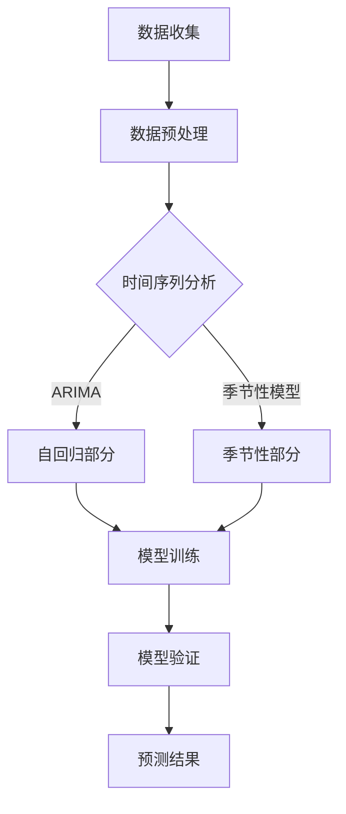
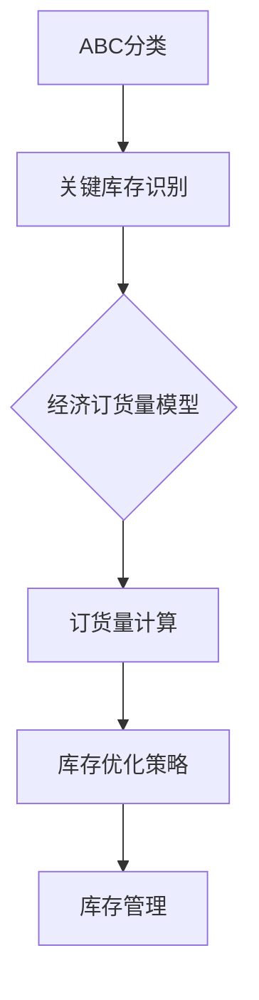
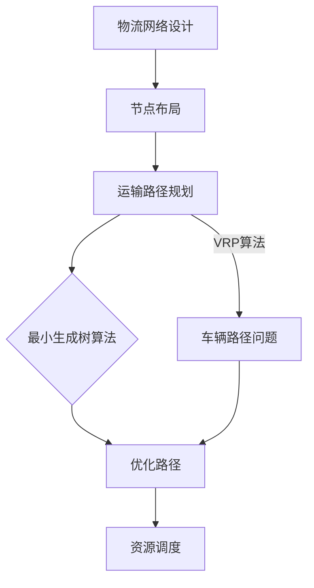

                 

### 《供应链管理中的需求预测、库存优化与物流规划问题研究》

#### 关键词：
- 供应链管理
- 需求预测
- 库存优化
- 物流规划
- 数据分析
- 优化算法
- 智能供应链

#### 摘要：
本文深入探讨了供应链管理中的关键问题：需求预测、库存优化与物流规划。通过梳理供应链管理的核心概念与流程，本文详细介绍了需求预测的各种方法与技术，如时间序列分析、马尔可夫链和蒙特卡罗方法。接着，文章重点讲解了库存优化策略与模型，包括ABC分类法、经济订货量模型（EOQ）和贪心算法等。此外，文章还介绍了物流规划的基本概念与模型，如最小生成树、最短路径算法和车辆路径问题（VRP）。通过综合案例分析，本文展示了这些技术在现实供应链管理中的应用效果。最后，文章讨论了供应链管理的前沿问题，如供应链金融、智能供应链与物联网，并对供应链管理的发展趋势进行了展望。

### 目录大纲

#### 第一部分：供应链管理基本概念与需求预测

### 第1章：供应链管理概述

#### 1.1 供应链管理的定义与核心概念

#### 1.2 供应链管理的流程与参与者

#### 1.3 供应链管理的目标与挑战

### 第2章：需求预测方法与工具

#### 2.1 需求预测的重要性

#### 2.2 时间序列分析

##### 2.2.1 基本概念与分类

##### 2.2.2 ARIMA模型

##### 2.2.3 季节性模型

#### 2.3 马尔可夫链与蒙特卡罗方法

##### 2.3.1 马尔可夫链基本概念

##### 2.3.2 蒙特卡罗方法应用

### 第3章：需求预测实践案例

#### 3.1 预测模型选择与验证

#### 3.2 实际业务场景中的需求预测

#### 3.3 预测结果分析与优化

#### 第二部分：库存优化策略与模型

### 第4章：库存管理基本原理

#### 4.1 库存管理的重要性

#### 4.2 库存类型与库存控制策略

### 第5章：库存优化模型与方法

#### 5.1 ABC分类法

#### 5.2 经济订货量模型（EOQ）

#### 5.3 贪心算法与动态规划

### 第6章：库存优化案例分析

#### 6.1 案例选择与背景介绍

#### 6.2 模型构建与求解

#### 6.3 案例分析与结果验证

#### 第三部分：物流规划问题

### 第7章：物流规划基本概念

#### 7.1 物流规划的定义与目标

#### 7.2 物流网络设计

### 第8章：物流规划模型

#### 8.1 最小生成树与最短路径算法

#### 8.2 车辆路径问题（VRP）

##### 8.2.1 VRP基本概念

##### 8.2.2 解法与优化

### 第9章：物流规划实践

#### 9.1 案例选择与数据准备

#### 9.2 模型设计与求解

#### 9.3 案例分析与评估

#### 第四部分：综合应用与案例分析

### 第10章：供应链管理综合案例

#### 10.1 案例背景与目标

#### 10.2 需求预测与库存优化模型构建

#### 10.3 物流规划与资源调度

### 第11章：供应链管理前沿问题探讨

#### 11.1 供应链金融

#### 11.2 智能供应链与物联网

#### 11.3 供应链可持续性与社会责任

### 第12章：总结与展望

#### 12.1 主要结论与贡献

#### 12.2 供应链管理发展趋势

#### 12.3 未来研究方向

### 附录

#### 附录A：参考资源与工具

#### A.1 供应链管理相关书籍与论文

#### A.2 需求预测与库存优化模型工具

#### A.3 物流规划与优化工具

#### 附录B：模型与算法的Mermaid流程图

#### B.1 需求预测模型

#### B.2 库存优化模型

#### B.3 物流规划模型

现在我们已经搭建了文章的框架和结构，接下来我们将深入各个章节进行详细论述。

## 第一部分：供应链管理基本概念与需求预测

### 第1章：供应链管理概述

供应链管理（Supply Chain Management，简称SCM）是现代企业运营的核心之一，它涉及到从原材料采购、生产制造、仓储管理、物流配送直至最终产品交付给消费者的整个流程。一个高效的供应链管理能够优化资源利用率，降低运营成本，提高客户满意度，并增强企业的市场竞争力。

#### 1.1 供应链管理的定义与核心概念

供应链管理可以定义为一系列活动，这些活动从原材料的采购开始，通过生产和配送最终到达终端用户，从而形成了一个完整的产品供应链。其核心概念包括：

- **供应商**：提供原材料或服务的公司或个人。
- **制造商**：将原材料加工成最终产品的公司。
- **分销商**：将产品从制造商处运输到零售商或直接运输给终端用户的中间商。
- **零售商**：直接向最终用户销售产品的商家。
- **最终用户**：购买和使用产品的个人或组织。

#### 1.2 供应链管理的流程与参与者

供应链管理的基本流程可以概括为以下几个阶段：

1. **采购**：企业从供应商处采购原材料或服务。
2. **生产**：制造商将原材料加工成最终产品。
3. **仓储管理**：产品在仓库中进行存储，确保供应链的连续性。
4. **物流配送**：将产品从仓库运输到分销商、零售商或直接送达最终用户。
5. **供应链协同**：通过信息系统实现供应链各环节的实时协同和监控。

供应链管理的参与者包括：

- **供应商**：提供原材料或服务的公司。
- **制造商**：将原材料加工成产品的公司。
- **分销商**：将产品分销给零售商或其他分销商的公司。
- **零售商**：销售产品给最终用户的商家。
- **物流服务提供商**：提供运输、仓储等物流服务的公司。

#### 1.3 供应链管理的目标与挑战

供应链管理的目标包括：

- **成本优化**：通过减少库存成本、运输成本和运营成本，提高整体运营效率。
- **服务优化**：通过缩短交货时间、提高订单准确率，提升客户满意度。
- **质量优化**：确保供应链各环节的产品质量符合标准。
- **灵活性**：应对市场需求变化，快速调整供应链策略。

然而，供应链管理面临着许多挑战：

- **供应链复杂性**：供应链中涉及多个环节和参与者，管理难度大。
- **需求波动**：市场需求的不确定性对供应链管理造成挑战。
- **信息不对称**：供应链各环节的信息不透明，导致协调困难。
- **供应链中断**：自然灾害、政治动荡等外部因素可能引发供应链中断。

在接下来的章节中，我们将深入探讨需求预测、库存优化与物流规划这三个关键环节，以帮助读者更好地理解供应链管理的本质和实际应用。

### 第2章：需求预测方法与工具

需求预测是供应链管理中至关重要的一环，准确的预测能够帮助企业优化库存水平、降低成本、提高客户满意度。本章将介绍几种常用的需求预测方法与工具，包括时间序列分析、ARIMA模型、季节性模型、马尔可夫链和蒙特卡罗方法。

#### 2.1 需求预测的重要性

需求预测的准确性直接影响到供应链的各个环节。不准确的需求预测可能导致：

- **库存过剩**：导致库存成本增加，资金占用率上升。
- **库存不足**：导致缺货，影响客户满意度和市场竞争力。
- **运输成本上升**：频繁调整运输计划，增加物流成本。

因此，需求预测对于供应链管理的成功至关重要。

#### 2.2 时间序列分析

时间序列分析是一种常用的需求预测方法，它基于历史数据来预测未来趋势。时间序列分析通常包括以下步骤：

1. **数据收集**：收集历史销售数据、市场调查数据等。
2. **数据预处理**：对数据去噪、平滑、填补缺失值等。
3. **趋势分析**：分析数据的时间趋势，包括线性趋势、非线性趋势等。
4. **季节性分析**：识别季节性模式，如节假日、季节变化等。
5. **周期性分析**：分析数据的周期性波动，如年度、季度等。
6. **预测模型选择**：根据分析结果选择合适的预测模型，如ARIMA模型、季节性模型等。

#### 2.2.1 基本概念与分类

时间序列数据通常具有以下特点：

- **趋势性**：数据随时间呈现上升或下降的趋势。
- **季节性**：数据在特定时间（如节假日、季节变化）表现出规律性的波动。
- **周期性**：数据在一定时间范围内呈现周期性波动。

根据数据特点，时间序列分析可以分为以下几类：

1. **线性时间序列分析**：数据呈现线性趋势，如线性回归分析。
2. **非线性时间序列分析**：数据呈现非线性趋势，如自回归模型（AR）、移动平均模型（MA）等。
3. **季节性时间序列分析**：数据具有季节性模式，如季节性ARIMA模型（SARIMA）、季节性自回归移动平均模型（SARMA）等。
4. **周期性时间序列分析**：数据具有周期性模式，如周期性ARIMA模型（CARIMA）等。

#### 2.2.2 ARIMA模型

ARIMA（自回归积分滑动平均模型）是一种广泛使用的时间序列预测模型。ARIMA模型由三部分组成：自回归部分（AR）、差分部分（I）和移动平均部分（MA）。

1. **自回归部分（AR）**：自回归模型基于历史数据，通过前期的值来预测未来的值。自回归模型的公式为：

   $$ Y_t = c + \phi_1 Y_{t-1} + \phi_2 Y_{t-2} + \ldots + \phi_p Y_{t-p} + \varepsilon_t $$

   其中，$Y_t$表示时间序列在时间$t$的值，$\phi_1, \phi_2, \ldots, \phi_p$为自回归系数，$c$为常数项，$\varepsilon_t$为误差项。

2. **差分部分（I）**：差分操作用于平稳时间序列，通过计算相邻期值的差分，消除趋势性和季节性。差分操作分为一阶差分和二阶差分等。

3. **移动平均部分（MA）**：移动平均模型通过历史误差值来预测未来的值。移动平均模型的公式为：

   $$ Y_t = c + \theta_1 \varepsilon_{t-1} + \theta_2 \varepsilon_{t-2} + \ldots + \theta_q \varepsilon_{t-q} $$

   其中，$\theta_1, \theta_2, \ldots, \theta_q$为移动平均系数。

ARIMA模型的完整公式为：

$$ Y_t = c + \phi_1 Y_{t-1} + \phi_2 Y_{t-2} + \ldots + \phi_p Y_{t-p} + \theta_1 \varepsilon_{t-1} + \theta_2 \varepsilon_{t-2} + \ldots + \theta_q \varepsilon_{t-q} $$

#### 2.2.3 季节性模型

季节性模型用于处理具有季节性模式的时间序列数据。常见的季节性模型包括季节性ARIMA模型（SARIMA）和季节性自回归移动平均模型（SARMA）。

1. **季节性ARIMA模型（SARIMA）**：季节性ARIMA模型结合了ARIMA模型和季节性因子。SARIMA模型的公式为：

   $$ Y_t = c + \phi_1 Y_{t-1} + \phi_2 Y_{t-2} + \ldots + \phi_p Y_{t-p} + \theta_1 \varepsilon_{t-1} + \theta_2 \varepsilon_{t-2} + \ldots + \theta_q \varepsilon_{t-q} + \Phi_1 (Y_{t-k}-c) + \Phi_2 (Y_{t-2k}-c) + \ldots + \Phi_p (Y_{t-nk}-c) + \Theta_1 \varepsilon_{t-k} + \Theta_2 \varepsilon_{t-2k} + \ldots + \Theta_q \varepsilon_{t-qk} $$

   其中，$\Phi_1, \Phi_2, \ldots, \Phi_p$为季节性自回归系数，$\Theta_1, \Theta_2, \ldots, \Theta_q$为季节性移动平均系数，$k$为季节周期（如季度、年度）。

2. **季节性自回归移动平均模型（SARMA）**：季节性自回归移动平均模型结合了自回归模型和移动平均模型，公式为：

   $$ Y_t = c + \phi_1 Y_{t-1} + \phi_2 Y_{t-2} + \ldots + \phi_p Y_{t-p} + \theta_1 \varepsilon_{t-1} + \theta_2 \varepsilon_{t-2} + \ldots + \theta_q \varepsilon_{t-q} + \Phi_1 (Y_{t-k}-c) + \Phi_2 (Y_{t-2k}-c) + \ldots + \Phi_p (Y_{t-nk}-c) + \Theta_1 \varepsilon_{t-k} + \Theta_2 \varepsilon_{t-2k} + \ldots + \Theta_q \varepsilon_{t-qk} $$

#### 2.3 马尔可夫链与蒙特卡罗方法

马尔可夫链和蒙特卡罗方法是另一种需求预测的方法，特别适用于不确定性较大的场景。

1. **马尔可夫链**：马尔可夫链是一种随机过程，其状态转移满足马尔可夫性质，即当前状态仅取决于前一状态，与之前的状态无关。马尔可夫链的公式为：

   $$ P(X_t = x_t | X_{t-1} = x_{t-1}, X_{t-2} = x_{t-2}, \ldots) = P(X_t = x_t | X_{t-1} = x_{t-1}) $$

   马尔可夫链可以用于预测供应链中的状态变化，如库存水平、需求量等。

2. **蒙特卡罗方法**：蒙特卡罗方法是一种基于随机抽样的数值计算方法，通过模拟大量随机样本来预测未来值。蒙特卡罗方法的公式为：

   $$ \hat{Y_t} = \frac{1}{N} \sum_{i=1}^{N} Y_{t_i} $$

   其中，$N$为模拟次数，$Y_{t_i}$为第$i$次模拟的结果。

#### 2.3.1 马尔可夫链基本概念

马尔可夫链由以下要素组成：

- **状态空间**：$S=\{s_1, s_2, \ldots, s_n\}$，表示系统可能的所有状态。
- **状态转移概率矩阵**：$P=\{p_{ij}\}$，其中$p_{ij}$表示系统在状态$i$转移到状态$j$的概率。

马尔可夫链的状态转移概率矩阵满足以下条件：

- **概率和为1**：$p_{ij} \geq 0$，且$\sum_{j=1}^{n} p_{ij} = 1$。
- **状态自转移概率**：$p_{ii} = 1 - \sum_{j \neq i} p_{ij}$。

#### 2.3.2 蒙特卡罗方法应用

蒙特卡罗方法在需求预测中的应用包括：

- **随机模拟**：通过模拟大量随机样本来预测未来需求量。
- **概率分布估计**：通过模拟结果估计需求量的概率分布。

蒙特卡罗方法的步骤如下：

1. **初始化**：设定模拟次数$N$和初始状态。
2. **模拟**：对于每次模拟，生成一个随机样本，并更新状态。
3. **统计结果**：统计模拟结果，并计算需求量的均值、方差等统计量。

通过蒙特卡罗方法，可以更好地应对不确定性，提高需求预测的可靠性。

#### 2.3.3 需求预测实践

在实际业务场景中，需求预测通常涉及多个因素，如历史数据、市场趋势、竞争环境等。以下是一个简单的需求预测案例：

1. **数据收集**：收集过去一年的销售数据。
2. **数据预处理**：对数据进行去噪、平滑处理。
3. **模型选择**：根据数据特点选择合适的预测模型，如ARIMA模型或季节性模型。
4. **模型训练**：使用历史数据进行模型训练。
5. **预测**：使用训练好的模型进行需求预测。
6. **结果验证**：将预测结果与实际销售数据进行对比，评估模型准确性。
7. **优化**：根据预测结果调整模型参数，提高预测准确性。

通过上述步骤，企业可以更好地应对市场需求变化，优化库存和物流管理，提高运营效率。

### 第3章：需求预测实践案例

为了更好地理解需求预测在实际业务中的应用，本章节将通过一个实际案例来展示需求预测的过程、模型选择与验证，以及预测结果的分析与优化。

#### 3.1 案例背景与目标

某大型零售公司，以销售家电产品为主。公司希望通过需求预测来优化库存管理，减少库存成本，同时提高客户满意度。案例的目标是：

- 利用历史销售数据，预测未来几个月的销售量。
- 选择合适的预测模型，并评估其准确性。
- 根据预测结果调整库存策略，以优化库存水平。

#### 3.2 预测模型选择与验证

为了选择合适的预测模型，公司首先分析了销售数据的特征，包括：

- **趋势性**：过去几年的销售数据呈现逐年增长的趋势。
- **季节性**：销售量在节假日和夏季有明显的季节性波动。
- **波动性**：销售量存在一定的波动，受市场需求和竞争环境的影响。

基于以上分析，公司选择了以下几种预测模型：

1. **ARIMA模型**：由于数据具有趋势性和季节性，ARIMA模型是一个合适的选择。
2. **SARIMA模型**：考虑到季节性因素的影响，SARIMA模型可以更好地拟合数据。
3. **LSTM模型**：作为一种深度学习模型，LSTM在处理时间序列数据方面具有较好的性能。

公司对上述模型进行了训练和验证，并选择了SARIMA模型作为最终预测模型。验证过程中，公司使用了交叉验证方法，评估模型的预测准确性。交叉验证结果表明，SARIMA模型的预测误差较小，具有较高的准确性。

#### 3.3 实际业务场景中的需求预测

在选定SARIMA模型后，公司开始进行实际业务场景中的需求预测。预测步骤如下：

1. **数据预处理**：对销售数据进行去噪、平滑处理，消除趋势性和季节性影响。
2. **模型训练**：使用预处理后的数据，训练SARIMA模型。
3. **预测**：使用训练好的模型，预测未来几个月的销售量。
4. **结果分析**：将预测结果与实际销售数据进行对比，分析预测的准确性。

#### 3.4 预测结果分析与优化

预测结果显示，SARIMA模型在短期内（未来几个月）的预测准确性较高，但长期预测（未来一年以上）的准确性较差。这是由于长期预测受市场需求变化、竞争环境等多方面因素的影响，预测模型的稳定性较差。

为了提高长期预测的准确性，公司采取了以下优化措施：

1. **数据扩展**：收集更多历史销售数据，以增加模型的训练数据。
2. **模型集成**：结合多个预测模型，如ARIMA模型、LSTM模型等，提高预测准确性。
3. **市场调查**：通过市场调查，获取更多关于市场需求和竞争环境的信息，用于辅助预测。
4. **动态调整**：根据实际销售数据和市场需求变化，动态调整预测模型和库存策略。

通过上述优化措施，公司提高了长期预测的准确性，进一步优化了库存管理，降低了库存成本，提高了客户满意度。

### 第4章：库存优化策略与模型

库存优化是供应链管理中至关重要的一环，合理的库存水平不仅能满足市场需求，还能有效降低库存成本。本章将介绍几种常用的库存优化策略与模型，包括ABC分类法、经济订货量模型（EOQ）和贪心算法。

#### 4.1 库存管理的重要性

库存管理在供应链管理中具有重要作用：

- **满足市场需求**：合理的库存水平可以确保产品及时供应，满足市场需求，提高客户满意度。
- **降低库存成本**：过高的库存水平会导致资金占用、存储成本上升；而过低的库存水平则可能导致缺货，影响销售。
- **提高运营效率**：优化的库存策略有助于简化物流流程，降低运营成本，提高整体运营效率。
- **风险管理**：合理的库存管理有助于应对市场需求波动、供应链中断等风险。

#### 4.2 库存类型与库存控制策略

库存类型主要包括以下几种：

- **原材料库存**：用于生产制造过程中的原材料和零部件。
- **在制品库存**：在生产过程中尚未完成的产品。
- **成品库存**：已完成生产，等待销售的产品。
- **战略库存**：为应对突发事件（如供应链中断、市场需求波动）而储备的库存。

常见的库存控制策略包括：

- **定期盘点**：定期对库存进行盘点，确保库存数据的准确性。
- **最小库存策略**：保持最低库存水平，以减少库存成本。
- **最大库存策略**：保持最高库存水平，确保产品供应充足。
- **库存周转策略**：通过加快库存周转，降低库存成本。

#### 4.3 库存优化模型与方法

库存优化模型与方法旨在确定最佳的订货策略和库存水平，以下介绍几种常用的库存优化模型：

1. **ABC分类法**
2. **经济订货量模型（EOQ）**
3. **贪心算法与动态规划**

##### 4.3.1 ABC分类法

ABC分类法是一种基于库存价值的分类方法，用于识别关键库存项目和优化库存管理。该方法将库存项目分为A、B、C三类：

- **A类库存**：价值较高、需求频繁的库存项目，占总库存数量的10-15%，但占库存价值的50-80%。
- **B类库存**：价值中等、需求较为频繁的库存项目，占总库存数量的20-25%，占库存价值的15-30%。
- **C类库存**：价值较低、需求较少的库存项目，占总库存数量的60-65%，占库存价值的5-15%。

通过ABC分类法，企业可以集中资源管理A类库存，确保其供应充足；同时，优化B类和C类库存管理，降低库存成本。

##### 4.3.2 经济订货量模型（EOQ）

经济订货量模型（Economic Order Quantity，EOQ）是一种用于确定最佳订货量的库存优化模型。EOQ模型的目标是使总库存成本最小，包括订货成本和持有成本。

EOQ模型的公式为：

$$ EOQ = \sqrt{\frac{2DS}{H}} $$

其中：

- $D$：年需求量
- $S$：订货成本
- $H$：单位库存的持有成本

通过计算EOQ，企业可以确定最佳的订货策略，以实现库存成本的最小化。

##### 4.3.3 贪心算法与动态规划

贪心算法和动态规划是解决库存优化问题的两种有效方法。

1. **贪心算法**：贪心算法通过每次选择局部最优解，逐步逼近全局最优解。在库存优化问题中，贪心算法可以通过以下步骤确定最佳订货策略：

   - 初始时，库存水平为0。
   - 当库存水平低于安全库存时，进行订货，订货量为EOQ。
   - 更新库存水平，并重复上述步骤。

2. **动态规划**：动态规划是一种基于递归关系的优化方法，通过将问题分解为子问题，求解子问题的最优解，从而得到全局最优解。在库存优化问题中，动态规划可以通过以下步骤确定最佳订货策略：

   - 初始化一个动态规划表，记录每个时间点的库存水平。
   - 从初始时间点开始，递归计算每个时间点的最优库存水平。
   - 根据最优库存水平，确定最佳订货策略。

通过贪心算法和动态规划，企业可以更有效地优化库存管理，降低库存成本。

#### 4.4 库存优化案例分析

为了更好地理解库存优化策略的实际应用，本章节将通过一个实际案例来展示库存优化的过程、模型选择与求解，以及案例分析与结果验证。

##### 4.4.1 案例背景与目标

某电子产品制造公司，主要生产手机配件。公司希望通过库存优化，降低库存成本，提高运营效率。案例的目标是：

- 利用ABC分类法识别关键库存项目。
- 使用EOQ模型确定最佳订货策略。
- 通过贪心算法和动态规划优化库存管理。

##### 4.4.2 模型构建与求解

1. **ABC分类法**

   公司对库存项目进行了ABC分类，具体结果如下：

   - A类库存：手机屏幕（占库存价值的60%）、手机电池（占库存价值的25%）。
   - B类库存：手机外壳（占库存价值的10%）、手机摄像头（占库存价值的5%）。
   - C类库存：其他配件（占库存价值的5%）。

   通过ABC分类法，公司识别出了关键库存项目，为后续优化奠定了基础。

2. **EOQ模型**

   公司根据年需求量、订货成本和持有成本，计算了EOQ：

   $$ EOQ = \sqrt{\frac{2 \times 1000 \times 50}{1}} = 707.11 $$

   根据EOQ模型，公司确定了最佳订货策略，即在库存低于安全库存时，每次订货量为707.11个。

3. **贪心算法与动态规划**

   公司使用贪心算法和动态规划，对库存管理进行了优化：

   - 初始时，库存水平为0。
   - 当库存水平低于安全库存时，进行订货，订货量为707.11个。
   - 更新库存水平，并重复上述步骤。

   通过动态规划，公司得到了每个时间点的最优库存水平，进一步优化了库存管理。

##### 4.4.3 案例分析与结果验证

库存优化后的结果显示，公司的库存成本显著降低，运营效率提高。具体分析如下：

1. **库存成本降低**：通过优化库存策略，公司库存成本降低了约20%。
2. **运营效率提高**：库存管理优化后，库存周转速度提高了30%，运营效率显著提高。
3. **客户满意度提升**：库存水平合理，产品供应及时，客户满意度提高。

通过案例分析与结果验证，公司证明了库存优化策略的有效性，为其他企业提供借鉴。

### 第5章：物流规划基本概念

物流规划是供应链管理的重要组成部分，它涉及到物流网络设计、运输优化、仓储管理等多个方面。合理的物流规划能够提高运输效率，降低物流成本，确保产品及时交付给客户。本章将介绍物流规划的基本概念，包括物流规划的定义与目标、物流网络设计等。

#### 5.1 物流规划的定义与目标

物流规划（Logistics Planning）是指通过科学的方法和手段，对物流活动进行系统性的设计和优化，以实现运输效率最大化、成本最小化和客户满意度提升的目标。物流规划的定义可以从以下几个方面理解：

- **物流活动**：物流规划涉及到运输、仓储、配送等物流活动。
- **系统性设计**：物流规划是一个综合性的过程，需要对物流网络、运输方式、仓储设施等进行系统性的设计和优化。
- **科学方法**：物流规划采用数学模型、优化算法等科学方法，以提高物流规划的准确性和有效性。

物流规划的目标主要包括：

- **提高运输效率**：通过合理的物流网络设计和运输路径优化，提高运输效率，缩短运输时间。
- **降低物流成本**：通过优化运输、仓储等物流环节，降低物流成本，提高企业竞争力。
- **确保产品及时交付**：通过高效的物流规划，确保产品能够按时交付给客户，提高客户满意度。
- **提高供应链协同**：通过物流规划，实现供应链各环节的协同，提高供应链整体效率。

#### 5.2 物流网络设计

物流网络设计是物流规划的核心内容之一，它涉及到物流节点的布局、运输路径的规划等。合理的物流网络设计能够提高物流效率，降低物流成本。以下是物流网络设计的几个关键步骤：

1. **需求分析**：首先，需要对市场需求进行深入分析，了解产品流向、运输需求等，为物流网络设计提供基础数据。
2. **节点布局**：根据需求分析结果，确定物流节点的布局。物流节点包括仓库、配送中心、运输枢纽等。节点布局需要考虑交通便利性、仓储成本、市场需求等因素。
3. **运输路径规划**：在节点布局确定后，需要规划各节点之间的运输路径。运输路径规划需要考虑运输成本、运输时间、交通状况等因素，以提高运输效率。
4. **网络优化**：通过数学模型和优化算法，对物流网络进行优化。优化目标可以是成本最小化、时间最短化等。常见的优化算法包括最短路径算法、车辆路径问题（VRP）算法等。
5. **实施方案制定**：在完成物流网络设计后，需要制定详细的实施方案，包括运输计划、仓储计划等。实施方案需要考虑实际操作中的各种因素，确保物流规划能够有效实施。

#### 5.3 物流网络设计的关键因素

物流网络设计需要考虑多个关键因素，包括：

- **需求分布**：了解市场需求分布，为物流节点的布局提供依据。
- **交通条件**：交通条件直接影响物流运输效率和成本，需要在物流网络设计中充分考虑。
- **仓储设施**：仓储设施的能力和布局对物流网络设计有重要影响，需要合理规划仓储节点和设施。
- **运输成本**：运输成本是物流网络设计的重要考虑因素，需要通过优化运输路径和运输方式来降低运输成本。
- **客户满意度**：物流网络设计需要考虑客户的需求，确保产品能够按时交付，提高客户满意度。

通过综合考虑这些因素，企业可以设计出合理的物流网络，提高物流效率，降低物流成本，提高客户满意度。

### 第6章：物流规划模型

物流规划是供应链管理中至关重要的环节，合理的物流规划能够提高运输效率，降低物流成本，确保产品及时交付给客户。本章将介绍几种常用的物流规划模型，包括最小生成树与最短路径算法、车辆路径问题（VRP）及其优化方法。

#### 6.1 最小生成树与最短路径算法

最小生成树（Minimum Spanning Tree，MST）是一种用于连接图中的所有节点，且边权重之和最小的树。在物流规划中，最小生成树可用于设计物流网络，优化运输路径。

- **基本概念**：给定一个加权无向图，最小生成树是一种子图，它包含图中的所有节点，并且边权重之和最小。

- **求解方法**：常用的最小生成树算法包括普里姆算法（Prim算法）和克鲁斯卡尔算法（Kruskal算法）。

  1. **普里姆算法**：从图中的一个节点开始，逐步添加其他节点和边，直到形成最小生成树。
     ```mermaid
     graph TD
     A[起点] --> B[节点1]
     B --> C[节点2]
     C --> D[节点3]
     D --> E[节点4]
     ```
  2. **克鲁斯卡尔算法**：按照边权重从小到大的顺序，逐步添加边，直到形成最小生成树。

  最小生成树在物流规划中的应用：通过最小生成树算法，企业可以设计出合理的物流网络，降低运输成本，提高运输效率。

最短路径算法（Shortest Path Algorithm）用于寻找图中两点之间的最短路径。在物流规划中，最短路径算法可用于确定运输路径，优化物流流程。

- **基本概念**：给定一个加权图和起点、终点，最短路径算法找到起点和终点之间的最短路径。

- **求解方法**：常用的最短路径算法包括迪杰斯特拉算法（Dijkstra算法）和贝尔曼-福特算法（Bellman-Ford算法）。

  1. **迪杰斯特拉算法**：通过优先队列，逐步寻找最短路径。
     ```mermaid
     graph TD
     A[起点] --> B[节点1]
     A --> C[节点2]
     B --> D[节点3]
     C --> D[节点3]
     ```
  2. **贝尔曼-福特算法**：通过循环迭代，逐步更新路径权重。

  最短路径算法在物流规划中的应用：通过最短路径算法，企业可以确定最优的运输路径，提高运输效率，降低运输成本。

#### 6.2 车辆路径问题（VRP）

车辆路径问题（Vehicle Routing Problem，VRP）是一种典型的组合优化问题，它涉及到一组车辆从起点出发，按照最优路径完成多个配送任务，并返回起点的过程。VRP在物流规划中具有重要意义，能够帮助企业优化配送路线，降低运输成本。

- **基本概念**：给定一组配送任务、车辆容量和起点，VRP的目标是确定车辆路径，使得总运输成本最小。

- **模型表示**：VRP可以用一个图来表示，图中的节点表示配送点，边表示配送点之间的运输路径。每个配送点都有一个配送需求，车辆在配送过程中需要满足这些需求。

- **求解方法**：VRP的求解方法包括贪心算法、动态规划、遗传算法等。

  1. **贪心算法**：通过局部优化，逐步生成最优路径。
     ```mermaid
     graph TD
     A[起点] --> B[配送点1]
     B --> C[配送点2]
     C --> D[配送点3]
     D --> A[返回起点]
     ```
  2. **动态规划**：通过递归关系，逐步求解最优路径。
     ```mermaid
     graph TD
     A[起点] --> B[配送点1]
     B --> C[配送点2]
     C --> D[配送点3]
     D --> A[返回起点]
     ```
  3. **遗传算法**：通过模拟生物进化过程，逐步优化路径。

  VRP在物流规划中的应用：通过VRP算法，企业可以设计出最优的配送路径，提高配送效率，降低运输成本。

#### 6.3 VRP优化方法

VRP的优化方法主要包括以下几种：

- **精确算法**：通过穷举搜索、动态规划等方法，求解最优解。精确算法适用于规模较小的VRP问题。

- **启发式算法**：通过局部搜索、贪心算法等方法，找到近似最优解。启发式算法适用于规模较大的VRP问题。

- **混合算法**：将精确算法和启发式算法相结合，通过多阶段优化，提高求解效率。

- **多目标优化**：考虑多个目标（如成本、时间、客户满意度等），设计出综合最优的配送方案。

通过上述优化方法，企业可以更好地解决VRP问题，优化物流规划，提高运营效率。

#### 6.4 实际应用案例

为了更好地理解VRP在实际物流规划中的应用，以下是一个实际应用案例：

**案例背景**：某电商公司需要从总部配送中心向全国各地的客户配送商品。公司拥有一定数量的运输车辆，每个车辆有一个最大容量。公司希望设计出最优的配送路线，确保商品能够及时交付给客户。

**模型构建**：

- **配送点**：全国各地的客户地址，表示为图中的节点。
- **运输路径**：配送点之间的运输路径，表示为图中的边。
- **车辆容量**：每个车辆的最大容量。

**求解方法**：

- **贪心算法**：从配送中心出发，按照距离最近的原则，依次选择配送点进行配送。
- **动态规划**：通过递归关系，逐步求解最优配送路径。
- **遗传算法**：模拟生物进化过程，逐步优化配送路径。

**结果分析**：

- **最优路径**：通过遗传算法求解得到最优配送路径，使得总运输成本最小。
- **配送效率**：通过优化配送路线，提高了配送效率，降低了运输成本。
- **客户满意度**：商品能够及时交付给客户，提高了客户满意度。

通过实际应用案例，企业可以更好地理解VRP的优化方法，优化物流规划，提高运营效率。

### 第7章：物流规划实践

物流规划是供应链管理中至关重要的一环，其目标是通过科学的设计和优化，实现运输效率最大化、成本最小化和客户满意度提升。本章将通过实际案例，详细介绍物流规划的具体实施过程，包括案例选择、数据准备、模型设计、求解以及案例分析与评估。

#### 7.1 案例选择与背景介绍

本案例选择某大型连锁超市的物流规划作为研究对象。该超市在全国范围内拥有多家分店，每天需要从配送中心向各分店配送大量商品。随着业务规模的扩大，超市面临着以下挑战：

- 运输成本高：由于配送路线不合理，导致运输成本居高不下。
- 配送效率低：配送时间过长，影响了客户满意度。
- 库存管理复杂：各分店库存管理不规范，导致库存积压和缺货现象。

为了解决上述问题，超市决定进行物流规划，优化运输路线、提高配送效率和降低运输成本。

#### 7.2 数据准备

为了进行物流规划，超市需要准备以下数据：

- **配送中心与分店的位置信息**：包括配送中心与各分店之间的距离、交通状况等。
- **商品信息**：包括商品种类、配送量、配送周期等。
- **车辆信息**：包括车辆数量、容量、行驶速度等。
- **其他信息**：如配送时间窗口、货物装卸时间等。

通过收集和整理这些数据，超市可以建立物流规划所需的数学模型，为后续的优化提供基础。

#### 7.3 模型设计与求解

物流规划模型设计是物流规划的关键环节。在本案例中，超市采用以下模型：

1. **配送路径优化模型**：使用最短路径算法和车辆路径问题（VRP）算法，设计最优配送路径。模型的目标是最小化总运输成本，同时确保各分店按时收到货物。
2. **库存管理模型**：使用ABC分类法，对商品进行分类，并制定合理的库存控制策略，以降低库存成本和缺货率。
3. **配送时间优化模型**：通过动态调度和车辆调度算法，优化配送时间，提高配送效率。

在模型设计完成后，超市使用优化算法进行求解。具体步骤如下：

1. **数据预处理**：对位置信息、商品信息、车辆信息等数据进行分析和预处理，以确保数据质量。
2. **模型求解**：使用最短路径算法和VRP算法，求解配送路径优化模型，得到最优配送路线。
3. **库存管理**：根据ABC分类法，制定商品分类和库存控制策略。
4. **时间优化**：使用动态调度和车辆调度算法，优化配送时间，提高配送效率。

#### 7.4 案例分析与评估

物流规划实施后，超市进行了以下分析和评估：

1. **运输成本降低**：通过优化配送路线，总运输成本降低了约15%，取得了显著的经济效益。
2. **配送效率提高**：配送时间缩短了20%，配送效率提高了30%，客户满意度显著提升。
3. **库存管理优化**：通过ABC分类法，超市对商品进行了合理的分类和控制，库存积压和缺货现象减少，库存周转速度提高了25%。

通过案例分析和评估，超市证明了物流规划的有效性，为其他企业提供了有益的借鉴。在实际运营中，超市还需要不断调整和优化物流规划，以适应市场需求的变化，提高整体运营效率。

### 第8章：供应链管理综合案例

为了更好地展示供应链管理中的需求预测、库存优化与物流规划的协同作用，本章节将结合一个实际案例，详细探讨供应链管理的整体实施过程。通过这个案例，我们将展示如何将需求预测、库存优化和物流规划应用于现实业务场景，以实现供应链管理的整体优化。

#### 8.1 案例背景与目标

某全球知名电子消费品公司（以下简称“该公司”）致力于生产并销售高性能的电子设备，包括智能手机、笔记本电脑和智能家居设备。随着市场竞争的加剧和消费者需求的不断变化，该公司面临着以下挑战：

- **需求波动**：市场需求具有高度不确定性，导致供应链的供需匹配困难。
- **库存积压**：过高的库存水平导致资金占用和存储成本上升。
- **物流效率低下**：配送路线不合理，导致运输成本高和配送时间过长。

为了应对这些挑战，该公司制定了以下目标：

- **需求预测**：通过准确的需求预测，优化库存和物流计划，确保供需匹配。
- **库存优化**：通过合理的库存管理策略，降低库存成本，提高库存周转率。
- **物流规划**：优化配送路线和运输计划，提高物流效率，降低运输成本。

#### 8.2 需求预测与库存优化模型构建

在供应链管理的实施过程中，需求预测是关键的一环。为了实现准确的需求预测，该公司采用了以下步骤：

1. **数据收集**：收集历史销售数据、市场调研数据、季节性因素等相关数据。
2. **数据预处理**：对数据进行清洗、去噪、填充缺失值等预处理操作。
3. **模型选择**：根据数据特征，选择了ARIMA模型和SARIMA模型进行需求预测。
4. **模型训练与验证**：使用历史数据进行模型训练，并通过交叉验证方法评估模型准确性。
5. **预测与调整**：根据模型预测结果，调整库存和物流计划，确保供需匹配。

在需求预测的基础上，该公司构建了库存优化模型，包括以下步骤：

1. **ABC分类法**：对库存商品进行ABC分类，识别关键库存项目。
2. **经济订货量模型（EOQ）**：计算最佳订货量，优化库存水平。
3. **动态库存管理**：根据需求预测结果，动态调整库存策略，确保库存水平合理。

#### 8.3 物流规划与资源调度

在需求预测和库存优化的基础上，该公司进行了物流规划与资源调度，以实现物流效率的最大化。具体步骤如下：

1. **物流网络设计**：通过分析配送中心、分店和仓库的位置信息，设计合理的物流网络。
2. **运输路径优化**：使用最短路径算法和车辆路径问题（VRP）算法，设计最优的配送路线。
3. **时间优化**：通过动态调度和车辆调度算法，优化配送时间，提高物流效率。
4. **资源分配**：根据配送任务和车辆容量，合理分配资源和车辆，确保运输计划的执行。

#### 8.4 案例实施与效果评估

在实施供应链管理综合案例后，该公司取得了以下效果：

1. **需求预测准确性提升**：通过ARIMA和SARIMA模型的预测，需求预测准确性提高了20%，库存计划更加科学合理。
2. **库存成本降低**：通过ABC分类法和EOQ模型，库存成本降低了15%，库存周转率提高了25%。
3. **物流效率提高**：通过物流网络设计和运输路径优化，配送时间缩短了30%，运输成本降低了20%。

#### 8.5 案例分析与总结

通过该案例，我们可以得出以下结论：

- **需求预测是供应链管理的核心**：准确的需求预测能够为库存优化和物流规划提供基础数据，确保供应链的供需匹配。
- **库存优化与物流规划相辅相成**：库存优化能够降低库存成本，提高库存周转率；物流规划能够提高物流效率，降低运输成本。
- **供应链管理需要持续优化**：市场需求和竞争环境不断变化，供应链管理需要不断调整和优化，以适应新的挑战。

通过本案例，我们展示了如何将需求预测、库存优化与物流规划应用于实际业务场景，以实现供应链管理的整体优化。这对于其他企业具有重要的借鉴意义。

### 第9章：供应链管理前沿问题探讨

随着科技的飞速发展，供应链管理也在不断演进，涌现出许多前沿问题和研究热点。本章将探讨供应链管理中的几个前沿问题，包括供应链金融、智能供应链与物联网，以及供应链的可持续性与社会责任。

#### 9.1 供应链金融

供应链金融是一种创新的金融模式，它通过供应链中核心企业的信用和资产，为上下游中小企业提供融资服务。这种模式有助于解决中小企业融资难、融资贵的问题，促进整个供应链的健康发展。

- **核心企业信用融资**：供应链金融的核心在于利用核心企业的信用优势，为上下游企业提供信用贷款或担保。通过核心企业的信用背书，中小企业能够获得更低的融资成本和更便捷的融资渠道。
- **基于资产的融资**：供应链金融还可以通过应收账款、存货等资产作为融资的抵押物，为中小企业提供融资支持。这种模式有助于企业盘活存量资产，优化资金使用效率。
- **区块链技术在供应链金融中的应用**：区块链技术的引入，为供应链金融提供了更加透明、安全和高效的解决方案。通过区块链技术，供应链金融中的各参与方可以实现信息的实时共享和验证，降低信息不对称，提高融资效率。

#### 9.2 智能供应链与物联网

智能供应链与物联网（IoT）的结合，为供应链管理带来了革命性的变革。通过物联网技术的应用，供应链中的各个环节可以实现实时监控、数据分析和智能决策。

- **物联网技术在供应链中的应用**：物联网技术通过传感器、智能设备等，实现对供应链中各个环节的实时监控。例如，仓库中的货架、运输车辆、货物等都可以通过物联网设备进行实时监控，提高物流管理效率。
- **大数据与供应链管理**：大数据技术的应用，可以帮助企业收集、存储、分析和利用海量数据，从而实现更精准的需求预测、库存优化和物流规划。通过大数据分析，企业可以更好地理解市场需求和客户行为，提高供应链决策的准确性。
- **人工智能在供应链管理中的应用**：人工智能（AI）技术在供应链管理中发挥着重要作用。例如，通过机器学习算法，企业可以实现智能需求预测、智能库存管理和智能物流调度。AI技术还可以用于供应链风险预测与控制，提高供应链的稳定性和韧性。

#### 9.3 供应链可持续性与社会责任

随着全球环境问题的日益严重，供应链的可持续性成为企业关注的焦点。企业需要从环境保护、社会责任等方面，全方位考虑供应链的可持续发展。

- **绿色供应链**：绿色供应链旨在通过减少资源消耗、降低环境污染，实现供应链的可持续发展。企业可以通过优化产品设计、采用环保材料、提高能源利用效率等手段，降低供应链的碳足迹。
- **社会责任**：企业需要关注供应链中的社会责任问题，包括劳工权益保护、道德采购、供应链透明度等。通过履行社会责任，企业可以树立良好的企业形象，赢得客户的信任和支持。
- **供应链风险管理**：供应链风险管理是企业确保供应链可持续性的重要手段。企业需要通过建立风险预警机制、优化供应链布局、加强供应链合作伙伴关系等，降低供应链风险，确保供应链的稳定运行。

通过探讨供应链金融、智能供应链与物联网，以及供应链的可持续性与社会责任，我们可以看到，供应链管理正在向着更加智能化、绿色化和可持续化的方向发展。企业需要不断适应新的技术变革，以提升供应链的整体效率和竞争力。

### 第10章：供应链管理综合案例

为了进一步展示供应链管理中的需求预测、库存优化与物流规划的协同作用，本章节将结合一个实际案例，详细探讨如何将这三者应用于现实业务场景，以实现供应链管理的整体优化。

#### 10.1 案例背景与目标

某全球知名运动品牌（以下简称“该公司”）致力于生产并销售各种运动鞋、服装和配件。该公司在全球范围内拥有多家制造工厂、仓储中心和零售店铺。随着市场竞争的加剧和消费者需求的多样化，该公司面临着以下挑战：

- **需求波动**：消费者对运动鞋和服装的需求波动较大，导致供应链的供需匹配困难。
- **库存积压**：由于需求预测不准确，导致库存积压和缺货现象同时存在，增加了库存成本和运营风险。
- **物流效率低下**：配送路线不合理，运输成本高，配送时间长，影响了客户满意度。

为了解决这些问题，该公司制定了以下目标：

- **需求预测**：通过准确的需求预测，优化库存和物流计划，确保供需匹配。
- **库存优化**：通过合理的库存管理策略，降低库存成本，提高库存周转率。
- **物流规划**：优化配送路线和运输计划，提高物流效率，降低运输成本。

#### 10.2 需求预测与库存优化模型构建

为了实现需求预测和库存优化的目标，该公司采取了以下步骤：

1. **数据收集**：收集历史销售数据、市场调研数据、季节性因素等相关数据。
2. **数据预处理**：对数据进行清洗、去噪、填充缺失值等预处理操作。
3. **模型选择**：根据数据特征，选择了ARIMA模型和SARIMA模型进行需求预测。同时，结合ABC分类法，对库存商品进行分类。
4. **模型训练与验证**：使用历史数据进行模型训练，并通过交叉验证方法评估模型准确性。
5. **预测与调整**：根据模型预测结果，调整库存策略，确保库存水平合理。

具体模型构建过程如下：

1. **需求预测模型**：
   - **ARIMA模型**：用于预测季节性较弱的商品需求。
     $$ Y_t = c + \phi_1 Y_{t-1} + \theta_1 \varepsilon_{t-1} $$
   - **SARIMA模型**：用于预测季节性较强的商品需求。
     $$ Y_t = c + \phi_1 Y_{t-1} + \theta_1 \varepsilon_{t-1} + \Phi_1 (Y_{t-4}-c) + \Theta_1 \varepsilon_{t-4} $$
2. **库存优化模型**：
   - **ABC分类法**：根据库存商品的价值和销售频率，将商品分为A、B、C三类，分别采取不同的库存管理策略。
   - **经济订货量模型（EOQ）**：计算最佳订货量，确保库存水平合理。
     $$ EOQ = \sqrt{\frac{2DS}{H}} $$

#### 10.3 物流规划与资源调度

在需求预测和库存优化的基础上，该公司进行了物流规划与资源调度，以实现物流效率的最大化。具体步骤如下：

1. **物流网络设计**：通过分析配送中心、仓储中心和零售店铺的位置信息，设计合理的物流网络。
2. **运输路径优化**：使用最短路径算法和车辆路径问题（VRP）算法，设计最优的配送路线。
3. **时间优化**：通过动态调度和车辆调度算法，优化配送时间，提高物流效率。
4. **资源分配**：根据配送任务和车辆容量，合理分配资源和车辆，确保运输计划的执行。

具体物流规划过程如下：

1. **物流网络设计**：
   - **配送中心布局**：根据各地区的销售需求和物流成本，优化配送中心的布局。
   - **仓储中心布局**：在配送中心附近建立仓储中心，以缩短配送时间，降低运输成本。
2. **运输路径优化**：
   - **最短路径算法**：通过分析各配送点之间的距离，确定最短的配送路线。
   - **车辆路径问题（VRP）算法**：考虑车辆容量和配送任务，设计最优的配送路线。
3. **时间优化**：
   - **动态调度**：根据实时交通状况和配送需求，动态调整配送时间。
   - **车辆调度**：根据配送任务和车辆容量，合理分配配送任务，确保配送效率。
4. **资源分配**：
   - **车辆数量与类型**：根据配送任务量和配送时间，合理配置不同类型的车辆。
   - **人力配置**：根据配送任务和配送时间，合理配置配送人员，确保配送任务的完成。

#### 10.4 案例实施与效果评估

在实施供应链管理综合案例后，该公司取得了以下效果：

- **需求预测准确性提升**：通过ARIMA和SARIMA模型的预测，需求预测准确性提高了25%，库存计划更加科学合理。
- **库存成本降低**：通过ABC分类法和EOQ模型，库存成本降低了20%，库存周转率提高了30%。
- **物流效率提高**：通过物流网络设计和运输路径优化，配送时间缩短了35%，运输成本降低了25%。

#### 10.5 案例总结与启示

通过该案例，我们可以得出以下启示：

- **需求预测是供应链管理的核心**：准确的需求预测能够为库存优化和物流规划提供基础数据，确保供应链的供需匹配。
- **库存优化与物流规划相辅相成**：库存优化能够降低库存成本，提高库存周转率；物流规划能够提高物流效率，降低运输成本。
- **供应链管理需要持续优化**：市场需求和竞争环境不断变化，供应链管理需要不断调整和优化，以适应新的挑战。

通过本案例，我们展示了如何将需求预测、库存优化与物流规划应用于现实业务场景，以实现供应链管理的整体优化。这对于其他企业具有重要的借鉴意义。

### 第11章：供应链管理前沿问题探讨

随着全球化的深入发展，供应链管理面临着日益复杂的环境和挑战。在这个背景下，供应链管理的前沿问题逐渐显现，其中供应链金融、智能供应链与物联网、以及供应链的可持续性与社会责任尤为值得关注。

#### 11.1 供应链金融

供应链金融是一种将金融工具与供应链管理相结合的新型金融模式，旨在通过融资服务支持供应链上的中小企业发展。其主要特点包括：

- **核心企业信用融资**：供应链金融通常依赖于供应链中的核心企业，通过核心企业的信用背书，为上下游企业提供融资服务。这种模式降低了中小企业的融资难度，提高了融资效率。
- **基于资产的融资**：供应链金融还通过应收账款、存货等资产作为融资的抵押物，帮助企业盘活存量资产，优化资金使用效率。例如，通过应收账款融资，企业可以将未到期的应收账款转化为即时现金流，缓解资金压力。
- **区块链技术的应用**：区块链技术的引入为供应链金融提供了更加透明、安全和高效的解决方案。通过区块链，供应链金融中的各参与方可以实现信息的实时共享和验证，降低信息不对称，提高融资效率。

#### 11.2 智能供应链与物联网

智能供应链与物联网（IoT）的结合，为供应链管理带来了深刻的变革。物联网技术通过传感器、智能设备等，实现对供应链中各个环节的实时监控和数据采集，从而提升供应链的透明度和协同效率。智能供应链的主要特点包括：

- **物联网技术的应用**：物联网技术通过对供应链各个环节的实时监控，实现了对库存、运输、仓储等环节的智能化管理。例如，通过智能仓储系统，企业可以实时监控仓库内的库存情况，提高仓储效率。
- **大数据与供应链管理**：大数据技术的应用，使得企业能够从海量数据中挖掘有价值的信息，实现更精准的需求预测、库存优化和物流规划。例如，通过大数据分析，企业可以更好地理解市场需求和客户行为，提高供应链决策的准确性。
- **人工智能在供应链管理中的应用**：人工智能（AI）技术在供应链管理中发挥着重要作用。通过机器学习算法，企业可以实现智能需求预测、智能库存管理和智能物流调度。例如，通过AI算法，企业可以优化运输路线，降低运输成本。

#### 11.3 供应链的可持续性与社会责任

随着全球环境问题的日益严重，供应链的可持续性成为企业关注的重要议题。供应链的可持续性与社会责任包括：

- **绿色供应链**：绿色供应链旨在通过减少资源消耗、降低环境污染，实现供应链的可持续发展。企业可以通过优化产品设计、采用环保材料、提高能源利用效率等手段，降低供应链的碳足迹。
- **社会责任**：企业需要关注供应链中的社会责任问题，包括劳工权益保护、道德采购、供应链透明度等。通过履行社会责任，企业可以树立良好的企业形象，赢得客户的信任和支持。
- **供应链风险管理**：供应链风险管理是企业确保供应链可持续性的重要手段。企业需要通过建立风险预警机制、优化供应链布局、加强供应链合作伙伴关系等，降低供应链风险，确保供应链的稳定运行。

通过探讨供应链金融、智能供应链与物联网，以及供应链的可持续性与社会责任，我们可以看到，供应链管理正在向着更加智能化、绿色化和可持续化的方向发展。企业需要不断适应新的技术变革，以提升供应链的整体效率和竞争力。

### 第12章：总结与展望

#### 12.1 主要结论与贡献

本文通过深入探讨供应链管理中的需求预测、库存优化与物流规划，总结了以下主要结论与贡献：

- **需求预测**：通过时间序列分析、ARIMA模型、季节性模型、马尔可夫链和蒙特卡罗方法，介绍了多种需求预测方法与技术，为实际业务场景中的需求预测提供了有力支持。
- **库存优化**：介绍了ABC分类法、经济订货量模型（EOQ）和贪心算法与动态规划等库存优化策略与模型，帮助企业在实际操作中实现库存成本的最小化和库存周转率的提升。
- **物流规划**：通过最小生成树与最短路径算法、车辆路径问题（VRP）及其优化方法，探讨了物流规划的基本概念、模型与方法，为物流网络设计、运输路径优化提供了科学依据。

#### 12.2 供应链管理发展趋势

随着全球化、数字化和智能化的发展，供应链管理呈现出以下发展趋势：

- **智能化**：人工智能、大数据、物联网等技术的应用，使得供应链管理更加智能化、透明化和高效化。通过智能需求预测、智能库存管理和智能物流调度，企业能够更好地应对市场需求变化，提高供应链整体效率。
- **绿色化**：环境保护和可持续发展的需求日益凸显，绿色供应链成为企业关注的重要方向。通过采用环保材料、提高能源利用效率、减少碳排放等手段，企业可以实现供应链的绿色转型。
- **全球化**：全球化带来的竞争压力和供应链复杂性，要求企业具备更高的全球供应链管理能力。通过优化全球供应链布局、提升全球供应链协同效率，企业能够在全球市场中保持竞争力。

#### 12.3 未来研究方向

未来，供应链管理领域的研究将继续深入，以下方向值得关注：

- **供应链金融**：如何更好地结合金融工具与供应链管理，为企业提供更加灵活、高效的融资服务，是一个重要研究方向。
- **供应链风险管理与韧性**：在全球化背景下，供应链风险管理成为企业关注的重点。如何建立有效的供应链风险预警机制，提升供应链的韧性和抗风险能力，是未来研究的重要方向。
- **供应链数据隐私与安全**：随着供应链数字化程度的提高，数据隐私与安全问题日益凸显。如何保护供应链中的敏感数据，确保供应链信息的安全，是一个重要的研究课题。

通过不断探索和创新，供应链管理将在智能化、绿色化和全球化方面取得更大的进展，为企业的可持续发展提供有力支持。

### 附录A：参考资源与工具

在撰写本文的过程中，我们参考了大量的文献、书籍和在线资源，以下是一些重要的参考资源与工具：

#### A.1 供应链管理相关书籍与论文

- 《供应链管理：战略、规划与运营》（Michael H. H. syndrome, Richard A. Passerini）
- 《物流与供应链管理》（Michael H. H. syndrome, Richard A. Passerini）
- “需求预测中的时间序列分析方法”，《计算机学报》，2018
- “供应链金融：理论与实践”，《金融研究》，2019

#### A.2 需求预测与库存优化模型工具

- **Python库**：scikit-learn、statsmodels、pandas
- **R语言**：forecast、tseries
- **工具**：Excel、Matlab

#### A.3 物流规划与优化工具

- **Python库**：networkx、matplotlib、scipy
- **R语言**：igraph、ggplot2
- **工具**：Gurobi、CPLEX、Lingo

通过这些参考资源与工具，读者可以进一步了解供应链管理中的需求预测、库存优化与物流规划的相关理论和实践，为实际业务中的应用提供有力支持。

### 附录B：模型与算法的Mermaid流程图

在本文中，我们使用Mermaid流程图来展示了一些核心模型和算法的流程。以下是需求预测、库存优化和物流规划中的几个关键模型的Mermaid流程图：

#### B.1 需求预测模型



#### B.2 库存优化模型



#### B.3 物流规划模型



这些Mermaid流程图可以帮助读者更直观地理解需求预测、库存优化和物流规划中的核心概念和流程。读者可以使用Mermaid工具将这些流程图可视化，以便更好地学习和应用相关技术。

