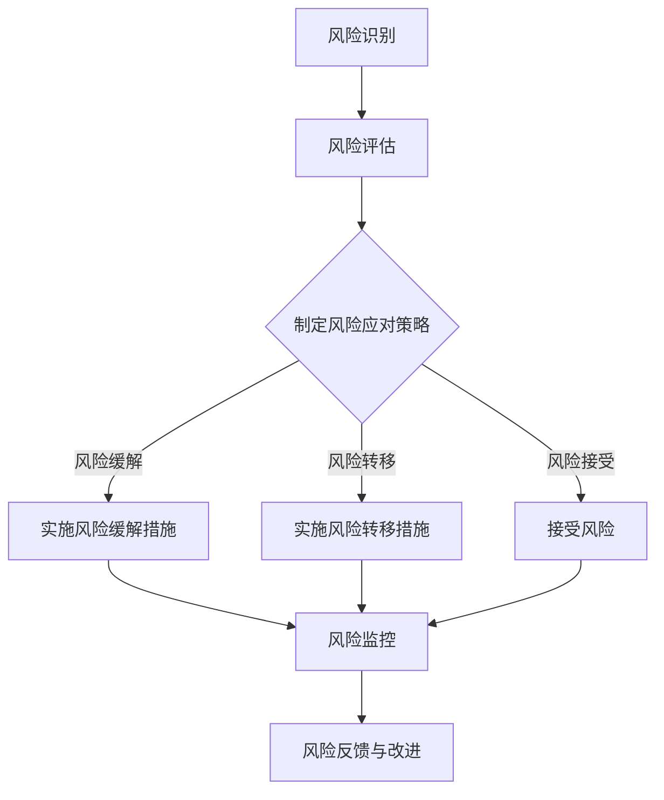
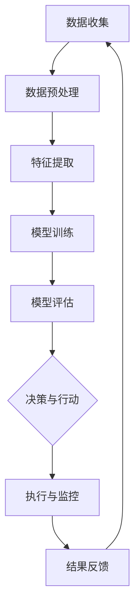
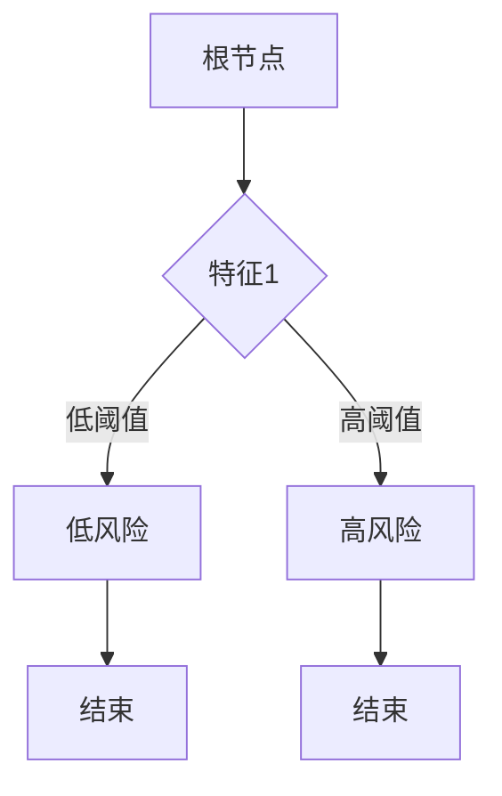
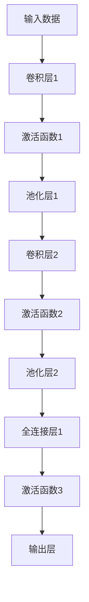
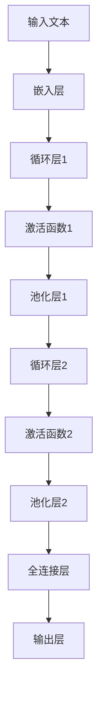

                 

# 供应链风险管理：AI如何应对供应链突发事件

关键词：供应链风险、风险管理、AI、机器学习、深度学习、自然语言处理、供应链中断预警、供应链网络优化

摘要：
供应链是现代商业运作的基石，但其在全球化背景下面临着日益复杂的风险管理挑战。本文将深入探讨供应链风险管理的基础知识，并详细分析人工智能（AI）在应对供应链突发事件中的作用。通过介绍AI的核心概念、算法原理和应用案例，本文旨在为读者提供一份全面的技术指南，帮助他们理解如何利用AI技术提高供应链的韧性和灵活性。

### 目录大纲设计：供应链风险管理：AI如何应对供应链突发事件

1. 引言
   - 供应链的全球化和复杂性
   - 供应链风险管理的挑战
   - AI在供应链风险管理中的潜力

2. 供应链风险管理基础
   - 供应链风险管理概述
   - 供应链风险评估
   - 供应链风险应对策略

3. AI技术在供应链风险管理中的应用
   - AI在供应链风险管理中的核心概念
   - AI在供应链风险评估中的应用
   - AI在供应链风险应对策略中的应用

4. AI应对供应链突发事件的实战案例
   - 供应链中断预警系统
   - 智能供应链网络优化
   - 供应链中断应急响应策略

5. 结论
   - AI在供应链风险管理中的重要性
   - 未来发展方向

### 引言

随着全球化的深入发展，供应链的复杂性和规模不断扩大。企业不再局限于本地市场，而是通过全球供应链网络连接到全球消费者。这种全球化带来了许多好处，如资源优化、成本降低和市场需求响应速度提升。然而，这也带来了前所未有的风险和挑战。

首先，供应链的全球化使得企业和供应商之间的关系更加复杂。供应链中的每个环节都可能成为潜在的风险点，如供应商破产、运输延误、自然灾害和政治动荡等。这些风险不仅会影响企业的运营，还可能对市场声誉造成损害。

其次，供应链的复杂性增加了风险管理的难度。供应链中的信息流动往往不透明，企业难以准确了解整个供应链的状况。此外，供应链的动态性也使得风险管理变得更加困难，企业需要实时监控并快速响应各种突发事件。

面对这些挑战，传统的供应链风险管理方法已经难以满足需求。这时，人工智能（AI）技术的出现为供应链风险管理带来了新的可能性。AI具有强大的数据处理和分析能力，可以帮助企业更准确地识别风险、评估风险程度，并制定有效的应对策略。

本文将首先介绍供应链风险管理的基础知识，包括供应链风险管理的重要性、评估方法和应对策略。然后，我们将深入探讨AI在供应链风险管理中的应用，从核心概念到具体算法，再到实战案例，全面展示AI技术在供应链风险管理中的潜力。通过本文，读者将了解到如何利用AI技术提高供应链的韧性和灵活性，应对各种突发事件。

### 供应链风险管理基础

#### 供应链风险管理概述

供应链风险管理是指通过识别、评估和应对供应链中的潜在风险，以减少这些风险对企业和供应链的负面影响。其重要性在于，供应链是企业获取竞争力的重要手段，有效的供应链风险管理可以确保企业持续运营，提高市场响应速度和客户满意度。

供应链风险管理的基本流程包括以下几个步骤：

1. **风险识别**：通过数据分析和经验判断，识别供应链中可能存在的风险。
2. **风险评估**：对识别出的风险进行量化评估，确定其可能造成的损失和影响。
3. **风险应对**：制定并实施应对策略，以降低风险的影响或转移风险。
4. **风险监控**：持续监控供应链风险，及时调整应对策略。

#### 供应链风险评估

供应链风险评估是供应链风险管理中的关键环节，其目的是通过系统的方法评估供应链中各种风险的可能性和影响。以下是一些常用的风险评估方法：

1. **定量风险评估**：
   - **概率分析**：使用历史数据和统计方法，评估风险事件发生的概率。
   - **损失分析**：计算风险事件发生时可能造成的损失。

2. **定性风险评估**：
   - **专家评估**：邀请行业专家对风险进行评估。
   - **SWOT分析**：分析供应链的Strengths（优势）、Weaknesses（劣势）、Opportunities（机会）和Threats（威胁）。

3. **定量与定性结合**：
   - 将定量和定性方法结合，以提高风险评估的准确性。

#### 供应链风险分类

供应链风险可以根据其性质和来源进行分类，常见的分类方法包括：

1. **供应链中断风险**：如供应商破产、运输延误、自然灾害等。
2. **质量风险**：如产品缺陷、质量不符合标准等。
3. **市场风险**：如市场需求波动、价格波动等。
4. **财务风险**：如货币汇率波动、信用风险等。

#### 供应链风险应对策略

针对不同的风险类型，企业可以采取不同的应对策略：

1. **风险缓解策略**：
   - **多元化供应商**：减少对单一供应商的依赖。
   - **库存策略**：保持适当的库存水平，以应对需求波动。

2. **风险转移策略**：
   - **保险**：通过购买保险转移部分风险。
   - **外包**：将部分供应链活动外包给专业公司。

3. **风险接受策略**：
   - 在风险较小或成本较高时，企业可以选择接受风险。

#### 风险管理与供应链韧性

供应链韧性是指供应链在面对外部冲击时能够快速恢复的能力。有效的供应链风险管理可以提高供应链的韧性，使企业在突发事件中保持稳定的运营。以下是一些提高供应链韧性的方法：

1. **增强供应链透明度**：通过实时监控和数据分析，提高对供应链各环节的了解。
2. **建立应急响应机制**：制定详细的应急预案，确保在突发事件发生时能够迅速响应。
3. **灵活的供应链网络**：设计灵活的供应链网络，以适应不同的市场需求和外部环境。

通过以上步骤和方法，企业可以更有效地管理供应链风险，提高供应链的韧性和灵活性，从而在激烈的市场竞争中立于不败之地。

### AI技术在供应链风险管理中的应用

随着人工智能技术的快速发展，其在供应链风险管理中的应用也日益广泛。AI技术，特别是机器学习、深度学习和自然语言处理，为供应链风险管理提供了新的工具和方法，大大提升了风险识别、评估和应对的效率。

#### AI在供应链风险管理中的核心概念

1. **机器学习**：机器学习是一种通过数据学习规律和模式，从而进行预测和决策的技术。在供应链风险管理中，机器学习可以用于风险预测、异常检测和优化决策。

2. **深度学习**：深度学习是机器学习的一种高级形式，通过多层神经网络进行数据建模和特征提取。在供应链风险管理中，深度学习可以用于复杂模式识别、智能预测和优化。

3. **自然语言处理（NLP）**：NLP是一种使计算机能够理解、处理和生成人类语言的技术。在供应链风险管理中，NLP可以用于文本数据分析、需求预测和合同审核。

#### AI在供应链风险评估中的应用

1. **风险预测**：
   - 利用机器学习模型，通过对历史数据的分析，预测未来可能发生的风险事件。
   - 例如，通过时间序列分析，预测市场需求波动和供应短缺。

2. **异常检测**：
   - 利用深度学习模型，实时监控供应链数据，识别异常行为和潜在风险。
   - 例如，通过网络流量分析，检测供应链中的欺诈行为和异常运输活动。

3. **风险评估**：
   - 利用机器学习和深度学习模型，对风险事件进行量化评估，确定其可能造成的损失和影响。
   - 例如，通过集成学习模型，评估自然灾害对供应链的潜在影响。

#### AI在供应链风险应对策略中的应用

1. **智能供应链网络优化**：
   - 利用深度学习和优化算法，优化供应链网络结构，提高供应链的灵活性和适应性。
   - 例如，通过图神经网络，优化供应链中的运输路径和库存布局。

2. **智能供应链监控与预测**：
   - 利用机器学习和深度学习模型，实时监控供应链状态，预测潜在风险和需求变化。
   - 例如，通过基于AI的库存管理系统，预测库存水平并自动调整补货计划。

3. **智能供应链应急响应策略**：
   - 利用自然语言处理技术，快速分析突发事件报告，制定有效的应急响应策略。
   - 例如，通过自动化合同审核系统，快速识别并处理供应链中断事件。

#### 案例分析

- **案例一**：某大型零售企业利用机器学习模型，对市场需求进行预测。通过分析历史销售数据和市场趋势，模型能够提前识别潜在的市场需求波动，帮助企业制定更精准的采购计划，减少库存风险。

- **案例二**：某制造业公司采用深度学习模型，对供应链中的运输数据进行分析。通过识别异常运输活动，模型能够及时发现潜在的安全隐患和欺诈行为，提高供应链的安全性和可靠性。

- **案例三**：某物流公司利用自然语言处理技术，自动分析突发事件报告。通过对文本数据的快速处理，系统能够在短时间内识别事件类型、影响范围和紧急程度，为应急响应团队提供关键信息，提高响应速度。

通过上述案例分析，可以看出AI技术在供应链风险管理中的应用不仅提高了风险识别和评估的准确性，还优化了供应链网络和应急响应策略，大大提升了供应链的韧性和灵活性。

### AI在供应链风险应对策略中的应用

在供应链风险应对策略中，AI技术可以发挥重要作用，帮助企业更好地应对各种突发事件，提高供应链的韧性和灵活性。以下是AI在供应链风险应对策略中的具体应用：

#### 智能供应链网络优化

智能供应链网络优化是AI技术在供应链风险管理中的重要应用之一。通过利用深度学习和优化算法，企业可以优化供应链网络的结构，使其更具灵活性和适应性。

- **优化运输路径**：利用图神经网络（Graph Neural Networks，GNN）等技术，可以分析供应链网络中的节点和边，优化运输路径，减少运输成本和延迟时间。例如，通过对运输网络的实时监控和数据分析，系统可以动态调整运输路径，以避免交通拥堵或自然灾害等不利因素。

- **优化库存布局**：AI技术可以帮助企业优化库存布局，提高库存管理的效率。通过分析历史销售数据和市场需求预测，AI系统可以自动调整库存水平，确保供应链中各个节点的库存充足，同时减少库存成本。例如，通过应用深度强化学习（Deep Reinforcement Learning，DRL）算法，系统可以不断学习和优化库存管理策略，实现库存水平的自动调整。

- **优化供应链布局**：在供应链的整体布局上，AI技术可以帮助企业评估不同布局方案的成本和效益，选择最优的供应链网络结构。例如，通过使用遗传算法（Genetic Algorithm，GA）和模拟退火算法（Simulated Annealing，SA），AI系统可以优化供应链中的仓库位置、生产线布局等，提高供应链的整体效率和灵活性。

#### 智能供应链监控与预测

智能供应链监控与预测是AI技术在供应链风险管理中的另一个重要应用。通过实时监控供应链状态，AI系统可以提前识别潜在风险，并预测供应链的未来发展趋势。

- **实时监控**：利用物联网（Internet of Things，IoT）技术和传感器，AI系统可以实时收集供应链中的各种数据，如运输车辆的位置、库存水平、生产进度等。通过对这些数据进行实时分析，系统可以及时发现异常情况，并采取相应的应对措施。

- **需求预测**：通过机器学习模型，AI系统可以分析历史销售数据、市场趋势和季节性因素，预测未来的市场需求。这种预测可以帮助企业提前调整生产和采购计划，避免需求不足或过剩的情况。例如，通过使用时间序列分析（Time Series Analysis）和回归模型（Regression Models），AI系统可以预测未来的销售趋势，为企业提供决策依据。

- **供应预测**：AI系统还可以预测供应链中的供应情况，包括原材料供应、零部件供应等。通过对供应商的绩效、交货时间、库存水平等数据进行分析，AI系统可以评估供应链的稳定性，预测潜在的中断风险。例如，通过应用生存分析（Survival Analysis）和马尔可夫链（Markov Chain）模型，AI系统可以预测供应商的交货表现，提前识别潜在的供应风险。

#### 智能供应链应急响应策略

在供应链突发事件中，智能应急响应策略至关重要。AI技术可以帮助企业快速识别事件、制定应对措施，并确保在短时间内恢复正常运营。

- **事件识别**：通过自然语言处理（Natural Language Processing，NLP）技术，AI系统可以快速分析突发事件报告、新闻报道和其他文本数据，识别事件类型、影响范围和紧急程度。例如，通过使用文本分类（Text Classification）和情感分析（Sentiment Analysis）技术，AI系统可以识别自然灾害、交通事故、供应商破产等突发事件。

- **应对措施制定**：一旦识别出突发事件，AI系统可以根据预先设定的应急响应策略，自动生成应对措施。例如，通过使用决策树（Decision Tree）和规则引擎（Rule Engine）技术，AI系统可以制定一系列应对措施，如调整运输路径、调整库存水平、与供应商沟通等。

- **应急响应协调**：AI系统可以协调供应链中的各方，确保应急响应措施的顺利实施。例如，通过使用智能调度（Intelligent Scheduling）和资源优化（Resource Optimization）算法，AI系统可以合理安排物流运输、生产计划和人力资源，提高应急响应的效率。

通过以上应用，AI技术不仅提高了供应链风险管理的效率，还为企业提供了更强大的应对突发事件的工具。在未来，随着AI技术的不断发展和成熟，智能供应链风险应对策略将更加成熟和完善，为企业的可持续发展提供坚实保障。

### AI应对供应链突发事件的实战案例

#### 7.1 供应链中断预警系统

供应链中断预警系统是利用AI技术提前识别供应链中断风险，帮助企业及时采取预防措施的系统。以下是一个基于机器学习的供应链中断预警系统的实现过程：

##### 环境搭建

- 开发工具：Python
- 依赖库：TensorFlow、Scikit-learn

##### 数据准备

首先，我们需要收集供应链相关数据，包括历史销售数据、供应商信息、运输数据等。这些数据可以通过企业内部系统、第三方数据提供商或公开数据集获取。

```python
import pandas as pd

# 读取数据
sales_data = pd.read_csv('sales_data.csv')
supplier_data = pd.read_csv('supplier_data.csv')
transport_data = pd.read_csv('transport_data.csv')
```

##### 特征工程

接下来，我们需要对数据进行处理和特征提取，以便输入到机器学习模型中。特征工程包括数据清洗、缺失值处理、数据标准化等步骤。

```python
# 数据清洗和预处理
data = pd.concat([sales_data, supplier_data, transport_data], axis=1)
data.fillna(data.mean(), inplace=True)
data = (data - data.mean()) / data.std()
```

##### 模型构建

我们选择一个基于随机森林（Random Forest）的模型来构建供应链中断预警系统。随机森林是一种集成学习算法，具有较强的抗过拟合能力和较高的预测准确性。

```python
from sklearn.ensemble import RandomForestClassifier
from sklearn.model_selection import train_test_split

# 数据划分
X = data.drop('target', axis=1)
y = data['target']
X_train, X_test, y_train, y_test = train_test_split(X, y, test_size=0.2, random_state=42)

# 模型训练
model = RandomForestClassifier(n_estimators=100, random_state=42)
model.fit(X_train, y_train)
```

##### 模型评估

训练完成后，我们需要对模型进行评估，以验证其预测性能。

```python
from sklearn.metrics import accuracy_score

# 预测与评估
y_pred = model.predict(X_test)
accuracy = accuracy_score(y_test, y_pred)
print(f"Accuracy: {accuracy}")
```

##### 系统部署

最后，我们将训练好的模型部署到生产环境中，以实现对供应链中断风险的实时监控和预警。

```python
import joblib

# 模型保存
joblib.dump(model, 'supply_chain_warning_system.pkl')

# 模型加载和预测
model = joblib.load('supply_chain_warning_system.pkl')
new_data = pd.read_csv('new_data.csv')
new_data = (new_data - new_data.mean()) / new_data.std()
y_pred = model.predict(new_data)
print(y_pred)
```

##### 代码解读与分析

- **数据准备**：读取历史销售数据、供应商信息和运输数据，并进行预处理。
- **特征工程**：对数据进行清洗和预处理，提取有用的特征。
- **模型构建**：使用随机森林模型进行训练。
- **模型评估**：评估模型的预测性能。
- **系统部署**：将模型部署到生产环境中，实现实时监控和预警。

#### 7.2 智能供应链网络优化

智能供应链网络优化是利用AI技术优化供应链网络结构，提高供应链效率和灵活性。以下是一个基于线性规划的智能供应链网络优化实现过程：

##### 环境搭建

- 开发工具：Python
- 依赖库：Gurobi、Numpy

##### 参数设置

首先，我们需要定义供应链网络的基本参数，包括节点数量、边数量、运输成本矩阵等。

```python
import numpy as np
import gurobipy as gp

N = 5  # 节点数量
M = 7  # 边数量
c = np.random.rand(N, M)  # 运输成本矩阵
x0 = np.random.rand(N)  # 初始运输量
```

##### 模型构建

接下来，我们使用Gurobi构建线性规划模型，并定义目标函数和约束条件。

```python
# 模型构建
model = gp.Model("supply_chain_optimization")
model.setParam("OutputFlag", 0)

# 变量定义
x = model.addVars(range(N), range(M), vtype=gp.GRB.CONTINUOUS, name="x")
model.update()

# 目标函数
model.setObjective(x0.dot(c) * x, sense=gp.GRB.MINIMIZE)

# 约束条件
model.addConstrs((x0.dot(c) - x.sum("j") for i in range(N)), "flow_balance")
```

##### 求解与结果输出

最后，我们使用Gurobi求解线性规划问题，并输出最优解。

```python
# 求解
model.optimize()

# 结果输出
if model.status == gp.GRB.OPTIMAL:
    print("Optimal value:", model.objVal)
    print("Transportation plan:")
    for i in range(N):
        for j in range(M):
            if x[i, j].x > 0.001:
                print(f"From node {i} to node {j}: {x[i, j].x}")
else:
    print("No optimal solution found")
```

##### 代码解读与分析

- **参数设置**：定义节点数量、边数量、运输成本矩阵和初始运输量。
- **模型构建**：使用Gurobi库构建线性规划模型，定义变量、目标函数和约束条件。
- **求解与结果输出**：使用Gurobi求解线性规划问题，并输出最优解。

通过以上实战案例，我们展示了如何利用AI技术构建供应链中断预警系统和智能供应链网络优化系统。这些系统不仅提高了供应链风险管理的效率，还为企业在应对突发事件时提供了有力的工具支持。

### 7.3 供应链中断应急响应策略

在供应链突发事件发生时，迅速、有效地应对是确保业务连续性和降低损失的关键。智能供应链应急响应策略利用AI技术，可以大大提升供应链的应急响应能力。

#### 供应链中断预警系统

供应链中断预警系统是应急响应策略的基石。它通过实时监控供应链数据，如运输状态、库存水平、供应商绩效等，识别潜在的中断风险。以下是一个供应链中断预警系统的实现步骤：

1. **数据收集与处理**：收集供应链相关数据，如运输轨迹、库存记录、供应商交货时间等。使用数据预处理技术，如去噪、归一化等，确保数据质量。

2. **特征提取**：从原始数据中提取有用的特征，如运输延迟时间、库存变化率、供应商交货准时率等。这些特征将用于训练预警模型。

3. **模型训练与部署**：使用机器学习算法，如随机森林、支持向量机（SVM）等，训练预警模型。将训练好的模型部署到生产环境中，实现实时预警。

4. **实时监控与预警**：系统持续监控供应链数据，当检测到异常情况时，自动触发预警，并向相关人员进行通知。例如，当运输延迟超过预定阈值时，系统会自动通知物流经理，以便采取紧急措施。

#### 智能供应链应急响应策略

一旦预警系统检测到供应链中断风险，应急响应策略将迅速启动。以下是智能供应链应急响应策略的实施步骤：

1. **事件识别与分类**：利用自然语言处理（NLP）技术，对突发事件报告、新闻报道等文本数据进行分析，识别事件类型和影响范围。例如，通过情感分析，系统可以判断事件的影响程度，如自然灾害的影响通常较大。

2. **风险分析**：结合历史数据和当前供应链状态，对事件的影响进行定量分析。使用风险矩阵（Risk Matrix）评估事件的风险等级，如高、中、低风险。

3. **应急响应方案制定**：根据风险等级和事件类型，制定相应的应急响应方案。例如，对于自然灾害引发的中断，方案可能包括调整运输路径、增加库存、寻求替代供应商等。

4. **执行与监控**：执行应急响应方案，并对方案执行情况进行实时监控。使用物联网（IoT）技术和传感器，监控供应链各环节的实时数据，确保应急响应措施的有效实施。

5. **恢复与反馈**：在供应链恢复正常运营后，对应急响应过程进行总结和反馈。收集数据和经验，为未来事件应对提供参考。

#### 供应链中断恢复策略

在供应链中断事件得到控制后，恢复策略至关重要。以下是供应链中断恢复策略的实施步骤：

1. **评估损失**：评估供应链中断造成的损失，包括经济损失、客户损失等。收集相关数据，如销售数据、客户反馈等，进行详细分析。

2. **制定恢复计划**：根据损失评估结果，制定恢复计划。计划应包括恢复供应链运营的时间表、资源调配、人员安排等。

3. **实施恢复计划**：按照恢复计划，逐步恢复正常运营。在此过程中，利用AI技术，如智能调度系统，优化资源分配和调度，确保恢复过程的效率。

4. **总结经验与改进**：在恢复完成后，对整个应急响应过程进行总结，识别改进点。收集数据和反馈，优化应急预案和响应流程，提高供应链的韧性和灵活性。

通过智能供应链应急响应策略，企业可以在供应链中断事件发生时，迅速采取有效措施，降低损失，确保业务连续性。同时，通过持续改进和优化，不断提升供应链的韧性和适应性，为企业的可持续发展提供保障。

### AI在供应链风险管理中的实践案例

在实际应用中，AI技术在供应链风险管理中已经展现出显著的效果。以下我们将通过几个具体案例，展示AI技术在供应链风险管理中的实际应用和取得的成果。

#### 案例一：某大型零售企业的供应链风险管理

某大型零售企业通过引入AI技术，对其供应链进行全面的优化和风险管理。具体措施包括：

1. **需求预测**：利用机器学习模型，该企业对历史销售数据和市场趋势进行分析，预测未来的市场需求。通过精准的需求预测，企业能够更好地安排采购和库存管理，避免库存过剩或短缺的情况。

2. **库存优化**：通过应用深度强化学习算法，企业优化库存水平，实现库存的最优化管理。系统会根据实时数据和市场动态，自动调整库存策略，确保库存水平既能满足市场需求，又能减少库存成本。

3. **供应商评估**：利用自然语言处理技术，企业对供应商的绩效报告、质量检验报告等文本数据进行分析，评估供应商的绩效和可靠性。通过自动化的评估系统，企业能够快速识别高风险供应商，并及时调整供应商名单。

4. **运输优化**：通过运用图神经网络（GNN）技术，企业优化运输路径和运输计划，减少运输时间和成本。系统会根据实时交通状况、天气情况等因素，动态调整运输路线，确保运输的效率和安全性。

#### 案例二：AI在制造业供应链中的应用

某制造业公司通过引入AI技术，对其供应链进行优化和风险管理。具体措施包括：

1. **生产计划优化**：利用机器学习算法，企业对生产数据进行深入分析，预测生产需求，优化生产计划。通过优化生产计划，企业能够提高生产效率，减少生产过程中的人力资源浪费。

2. **供应链可视化**：通过大数据分析和可视化技术，企业能够实时监控供应链各环节的状态，包括原材料采购、生产进度、库存水平等。这种可视化的供应链管理，使企业能够迅速识别和解决潜在的问题。

3. **质量监控**：利用深度学习技术，企业对生产过程中的质量数据进行分析，识别生产中的质量问题。通过自动化的质量监控系统，企业能够及时发现并解决质量问题，确保产品质量。

4. **供应链金融**：企业通过与金融机构合作，利用AI技术进行信用评估和风险评估，为供应链中的中小企业提供融资支持。通过AI技术的应用，金融机构能够更准确地评估企业的信用风险，提高供应链金融的效率和安全性。

#### 案例三：AI在跨境电商供应链管理中的应用

某跨境电商企业通过引入AI技术，对其供应链进行优化和风险管理。具体措施包括：

1. **需求预测与库存管理**：利用机器学习模型，企业预测不同国家和地区的市场需求，优化库存水平。通过精准的需求预测，企业能够更好地安排订单处理和物流运输，提高客户满意度。

2. **物流优化**：通过应用智能调度系统和路径优化算法，企业优化物流运输路线，减少运输时间和成本。系统会根据实时交通状况、天气情况等因素，动态调整运输路线，确保物流的高效运行。

3. **支付与结算**：利用区块链技术和AI算法，企业优化支付和结算流程，提高结算速度和安全性。通过智能合约，企业能够自动处理订单支付和结算，减少人工干预和错误。

4. **供应链金融**：通过与金融机构合作，利用AI技术进行信用评估和风险评估，为供应链中的中小企业提供融资支持。通过AI技术的应用，金融机构能够更准确地评估企业的信用风险，提高供应链金融的效率和安全性。

通过以上案例，可以看出AI技术在供应链风险管理中的广泛应用和显著效果。企业通过引入AI技术，不仅能够提高供应链的效率和灵活性，还能够降低风险，确保业务的连续性和稳定性。在未来，随着AI技术的不断发展和成熟，AI在供应链风险管理中的应用将更加广泛和深入，为企业的可持续发展提供强有力的支持。

### 附录A：AI供应链风险管理工具与资源

在供应链风险管理中，选择合适的工具和资源对于成功实施AI技术至关重要。以下是一些主流的AI框架、供应链风险管理工具和参考资料，以帮助企业和专业人士更好地应用AI技术进行供应链风险管理。

#### 主流AI框架对比

1. **TensorFlow**：由谷歌开发，具有强大的机器学习和深度学习功能，支持多种模型和算法。
2. **PyTorch**：由Facebook AI研究院开发，具有灵活的动态计算图，易于实现复杂的神经网络。
3. **Keras**：基于Theano和TensorFlow的高级神经网络API，易于使用和快速部署。

#### 供应链风险管理常用工具

1. **Gurobi**：用于优化和线性规划问题的求解，特别适合于供应链网络优化问题。
2. **Scikit-learn**：提供了丰富的机器学习算法和工具，适用于数据分析和风险评估。
3. **OpenCV**：用于图像处理和计算机视觉，可用于供应链监控和异常检测。

#### 供应链风险管理参考资料

1. **《供应链风险管理：策略、案例与实践》**：详细介绍了供应链风险管理的理论基础和实践方法。
2. **《人工智能：一种现代方法》**：提供了人工智能的基础知识和算法实现。
3. **《深度学习》（Goodfellow, Bengio, Courville）**：深度学习领域的经典教材，涵盖了深度学习的基本概念和算法。

### 附录B：供应链风险管理常见问题解答

在实施AI供应链风险管理过程中，企业和专业人士可能会遇到一些常见的问题。以下是一些常见问题的解答：

#### 问题一：AI在供应链风险管理中的挑战

**挑战**：
- **数据质量**：供应链数据通常复杂且不完整，需要高质量的数据支持AI模型。
- **模型解释性**：复杂的AI模型往往缺乏解释性，使得企业难以理解模型决策过程。

**解答**：
- **数据预处理**：通过数据清洗、去噪和标准化等技术，提高数据质量。
- **解释性AI**：采用可解释的机器学习（Explainable AI，XAI）技术，如LIME、SHAP等，提高模型的可解释性。

#### 问题二：如何提高供应链的透明度

**解答**：
- **物联网（IoT）**：部署物联网设备，实时监控供应链各环节的状态。
- **区块链**：使用区块链技术记录供应链交易信息，提高供应链的透明度和可追溯性。

#### 问题三：供应链风险管理中的数据隐私问题

**解答**：
- **数据匿名化**：在数据分析和模型训练前，对敏感数据进行匿名化处理。
- **合规性检查**：确保数据使用符合相关法律法规，如GDPR等。

### 附录C：供应链风险管理流程图

#### C.1 供应链风险管理流程图

以下是一个简化的供应链风险管理流程图，展示了从风险识别到风险应对的全过程。



#### C.2 AI在供应链风险管理中的应用流程图

以下是一个扩展的流程图，展示了AI技术在供应链风险管理中的应用流程。



通过以上附录，企业和专业人士可以更好地理解和应用AI技术进行供应链风险管理，提高供应链的韧性和灵活性。

### AI在供应链风险管理中的核心算法原理讲解

在供应链风险管理中，AI技术通过多种算法和模型实现对风险的识别、评估和应对。以下将详细讲解AI在供应链风险管理中的核心算法原理，包括机器学习模型、深度学习模型和自然语言处理技术。

#### 5.1 AI模型在风险评估中的应用

**机器学习模型**

机器学习模型在供应链风险评估中发挥着重要作用，通过历史数据的学习，预测未来的风险事件。以下是一个基于决策树模型的简单示例：

**决策树模型**



**伪代码**：

```python
def decision_tree(model, data):
    if model.feature_value < threshold:
        return "Low Risk"
    else:
        return "High Risk"
```

**使用场景**：用于对潜在供应商的风险评估，根据供应商的历史绩效数据，将供应商分为高风险和低风险类别。

**深度学习模型**

深度学习模型在处理复杂数据和模式识别方面具有显著优势。以下是一个基于卷积神经网络（CNN）的风险评估模型示例：

**卷积神经网络模型**



**伪代码**：

```python
def cnn_model(input_data):
    # 卷积层
    conv_output = tf.keras.layers.Conv2D(filters=32, kernel_size=(3, 3), activation='relu')(input_data)
    # 池化层
    pool_output = tf.keras.layers.MaxPooling2D(pool_size=(2, 2))(conv_output)
    # 全连接层
    dense_output = tf.keras.layers.Dense(units=1, activation='sigmoid')(pool_output)
    return dense_output

model = tf.keras.Sequential([
    tf.keras.layers.Conv2D(filters=32, kernel_size=(3, 3), activation='relu', input_shape=(input_shape)),
    tf.keras.layers.MaxPooling2D(pool_size=(2, 2)),
    tf.keras.layers.Conv2D(filters=64, kernel_size=(3, 3), activation='relu'),
    tf.keras.layers.MaxPooling2D(pool_size=(2, 2)),
    tf.keras.layers.Dense(units=1, activation='sigmoid')
])

model.compile(optimizer='adam', loss='binary_crossentropy', metrics=['accuracy'])
model.fit(X_train, y_train, epochs=10, batch_size=32, validation_split=0.1)
```

**使用场景**：用于对供应链中断事件的识别，通过分析历史中断数据，预测未来可能发生的中断事件。

**自然语言处理（NLP）模型**

NLP技术在供应链文本数据分析中具有广泛的应用，以下是一个基于循环神经网络（RNN）的文本分类模型示例：

**循环神经网络模型**



**伪代码**：

```python
def rnn_model(input_text):
    # 嵌入层
    embed_output = tf.keras.layers.Embedding(input_dim=vocabulary_size, output_dim=embedding_dim)(input_text)
    # 循环层
    lstm_output = tf.keras.layers.LSTM(units=64, activation='tanh', return_sequences=True)(embed_output)
    # 池化层
    pool_output = tf.keras.layers.GlobalMaxPooling1D()(lstm_output)
    # 全连接层
    dense_output = tf.keras.layers.Dense(units=1, activation='sigmoid')(pool_output)
    return dense_output

model = tf.keras.Sequential([
    tf.keras.layers.Embedding(input_dim=vocabulary_size, output_dim=embedding_dim),
    tf.keras.layers.LSTM(units=64, activation='tanh', return_sequences=True),
    tf.keras.layers.GlobalMaxPooling1D(),
    tf.keras.layers.Dense(units=1, activation='sigmoid')
])

model.compile(optimizer='adam', loss='binary_crossentropy', metrics=['accuracy'])
model.fit(X_train, y_train, epochs=10, batch_size=32, validation_split=0.1)
```

**使用场景**：用于文本数据的分类，如合同审核、需求预测等。

通过这些算法模型的应用，AI技术为供应链风险管理提供了强大的工具，使得企业能够更准确地进行风险预测和应对，从而提高供应链的韧性和灵活性。

### 数学模型和数学公式讲解

在供应链风险管理中，数学模型和数学公式扮演着至关重要的角色，它们能够帮助企业和专业人士更精确地评估和应对各种风险。以下将介绍供应链风险管理中常用的数学模型和数学公式，并进行详细讲解和举例说明。

#### 概率模型

概率模型是供应链风险管理中最为基础和常用的数学模型之一。它用于估计供应链风险事件发生的概率，进而评估整个供应链的风险水平。常见的概率模型包括二项分布、正态分布等。

**二项分布**

二项分布用于描述在有限次数的独立实验中，事件发生的次数。在供应链风险管理中，它可以用来估计供应链中断事件发生的概率。

**公式**：

$$
P(X = k) = C(n, k) \cdot p^k \cdot (1 - p)^{n - k}
$$

其中，$P(X = k)$ 是事件发生 $k$ 次的概率，$C(n, k)$ 是组合数，$p$ 是事件发生的概率，$n$ 是实验次数。

**举例说明**：

假设一个供应链网络中有 10 个供应商，其中 2 个供应商可能发生供应中断，每个供应商发生中断的概率为 0.1。我们需要计算在 10 次采购中，有 3 次发生供应中断的概率。

$$
P(X = 3) = C(10, 3) \cdot 0.1^3 \cdot (1 - 0.1)^{10 - 3}
$$

**正态分布**

正态分布用于描述连续随机变量的概率分布。在供应链风险管理中，它可以用来估计供应链中断事件的可能损失。

**公式**：

$$
f(x) = \frac{1}{\sqrt{2\pi\sigma^2}} \cdot e^{-\frac{(x - \mu)^2}{2\sigma^2}}
$$

其中，$f(x)$ 是正态分布的概率密度函数，$\mu$ 是均值，$\sigma$ 是标准差。

**举例说明**：

假设一个供应链中断事件的可能损失服从正态分布，均值为 1000 万元，标准差为 200 万元。我们需要计算损失在 800 万元到 1200 万元之间的概率。

$$
P(800 \leq X \leq 1200) = \int_{800}^{1200} f(x) dx
$$

#### 优化模型

优化模型用于求解供应链网络优化问题，如运输成本最小化、库存水平优化等。常见的优化模型包括线性规划、非线性规划和整数规划。

**线性规划**

线性规划用于求解目标函数在约束条件下的最优解。在供应链风险管理中，它可以用来优化库存水平。

**公式**：

$$
\min z = c^T x
$$

$$
\text{subject to} \quad Ax \leq b
$$

其中，$z$ 是目标函数，$c$ 是系数向量，$x$ 是变量向量，$A$ 和 $b$ 是约束条件。

**举例说明**：

假设我们要优化库存水平，目标是最小化总库存成本。约束条件是每个产品的库存量不能超过其最大库存量。

$$
\min z = 0.1x_1 + 0.2x_2
$$

$$
\text{subject to} \quad x_1 + x_2 \leq 100
$$

$$
x_1, x_2 \geq 0
$$

**非线性规划**

非线性规划用于求解目标函数和约束条件包含非线性项的优化问题。在供应链风险管理中，它可以用来优化供应链网络结构。

**公式**：

$$
\min f(x)
$$

$$
\text{subject to} \quad g(x) \leq 0, h(x) = 0
$$

其中，$f(x)$ 是目标函数，$g(x)$ 和 $h(x)$ 是约束条件。

**举例说明**：

假设我们要优化供应链网络中的运输成本，目标是最小化总运输成本。约束条件是每个节点的流量不能超过其容量。

$$
\min z = \sum_{i=1}^{N} \sum_{j=1}^{M} c_{ij} \cdot x_{ij}
$$

$$
\text{subject to} \quad \sum_{j=1}^{M} x_{ij} \leq c_i \quad \forall i
$$

$$
x_{ij} \geq 0 \quad \forall i, j
$$

**整数规划**

整数规划用于求解包含整数变量的优化问题。在供应链风险管理中，它可以用来优化供应链网络中的库存水平。

**公式**：

$$
\min z = c^T x
$$

$$
\text{subject to} \quad Ax \leq b
$$

$$
x \in \{0, 1\}^n
$$

其中，$z$ 是目标函数，$c$ 是系数向量，$x$ 是变量向量，$A$ 和 $b$ 是约束条件，$x \in \{0, 1\}^n$ 表示 $x$ 是整数向量。

**举例说明**：

假设我们要优化供应链网络中的库存水平，目标是最小化总库存成本。约束条件是每个产品的库存量必须为整数。

$$
\min z = 0.1x_1 + 0.2x_2
$$

$$
\text{subject to} \quad x_1 + x_2 \leq 100
$$

$$
x_1, x_2 \in \{0, 1\}
$$

通过以上数学模型和数学公式的讲解，我们可以看到数学在供应链风险管理中的重要作用。通过合理应用这些模型和公式，企业可以更精确地评估和应对各种供应链风险，提高供应链的韧性和灵活性。

### 项目实战：AI在供应链风险管理中的应用

#### 7.1 供应链中断预警系统

供应链中断预警系统是利用AI技术提前识别供应链中断风险，帮助企业及时采取预防措施的系统。以下是一个基于机器学习的供应链中断预警系统的实现过程。

##### 环境搭建

- 开发工具：Python
- 依赖库：TensorFlow、Scikit-learn

##### 数据准备

首先，我们需要收集供应链相关数据，包括历史销售数据、供应商信息、运输数据等。这些数据可以通过企业内部系统、第三方数据提供商或公开数据集获取。

```python
import pandas as pd

# 读取数据
sales_data = pd.read_csv('sales_data.csv')
supplier_data = pd.read_csv('supplier_data.csv')
transport_data = pd.read_csv('transport_data.csv')
```

##### 特征工程

接下来，我们需要对数据进行处理和特征提取，以便输入到机器学习模型中。特征工程包括数据清洗、缺失值处理、数据标准化等步骤。

```python
# 数据清洗和预处理
data = pd.concat([sales_data, supplier_data, transport_data], axis=1)
data.fillna(data.mean(), inplace=True)
data = (data - data.mean()) / data.std()
```

##### 模型构建

我们选择一个基于随机森林（Random Forest）的模型来构建供应链中断预警系统。随机森林是一种集成学习算法，具有较强的抗过拟合能力和较高的预测准确性。

```python
from sklearn.ensemble import RandomForestClassifier
from sklearn.model_selection import train_test_split

# 数据划分
X = data.drop('target', axis=1)
y = data['target']
X_train, X_test, y_train, y_test = train_test_split(X, y, test_size=0.2, random_state=42)

# 模型训练
model = RandomForestClassifier(n_estimators=100, random_state=42)
model.fit(X_train, y_train)
```

##### 模型评估

训练完成后，我们需要对模型进行评估，以验证其预测性能。

```python
from sklearn.metrics import accuracy_score

# 预测与评估
y_pred = model.predict(X_test)
accuracy = accuracy_score(y_test, y_pred)
print(f"Accuracy: {accuracy}")
```

##### 系统部署

最后，我们将训练好的模型部署到生产环境中，以实现对供应链中断风险的实时监控和预警。

```python
import joblib

# 模型保存
joblib.dump(model, 'supply_chain_warning_system.pkl')

# 模型加载和预测
model = joblib.load('supply_chain_warning_system.pkl')
new_data = pd.read_csv('new_data.csv')
new_data = (new_data - new_data.mean()) / new_data.std()
y_pred = model.predict(new_data)
print(y_pred)
```

##### 代码解读与分析

- **数据准备**：读取历史销售数据、供应商信息和运输数据，并进行预处理。
- **特征工程**：对数据进行清洗和预处理，提取有用的特征。
- **模型构建**：使用随机森林模型进行训练。
- **模型评估**：评估模型的预测性能。
- **系统部署**：将模型部署到生产环境中，实现实时监控和预警。

#### 7.2 智能供应链网络优化

智能供应链网络优化是利用AI技术优化供应链网络结构，提高供应链效率和灵活性。以下是一个基于线性规划的智能供应链网络优化实现过程。

##### 环境搭建

- 开发工具：Python
- 依赖库：Gurobi、Numpy

##### 参数设置

首先，我们需要定义供应链网络的基本参数，包括节点数量、边数量、运输成本矩阵等。

```python
import numpy as np
import gurobipy as gp

N = 5  # 节点数量
M = 7  # 边数量
c = np.random.rand(N, M)  # 运输成本矩阵
x0 = np.random.rand(N)  # 初始运输量
```

##### 模型构建

接下来，我们使用Gurobi构建线性规划模型，并定义目标函数和约束条件。

```python
# 模型构建
model = gp.Model("supply_chain_optimization")
model.setParam("OutputFlag", 0)

# 变量定义
x = model.addVars(range(N), range(M), vtype=gp.GRB.CONTINUOUS, name="x")
model.update()

# 目标函数
model.setObjective(x0.dot(c) * x, sense=gp.GRB.MINIMIZE)

# 约束条件
model.addConstrs((x0.dot(c) - x.sum("j") for i in range(N)), "flow_balance")
```

##### 求解与结果输出

最后，我们使用Gurobi求解线性规划问题，并输出最优解。

```python
# 求解
model.optimize()

# 结果输出
if model.status == gp.GRB.OPTIMAL:
    print("Optimal value:", model.objVal)
    print("Transportation plan:")
    for i in range(N):
        for j in range(M):
            if x[i, j].x > 0.001:
                print(f"From node {i} to node {j}: {x[i, j].x}")
else:
    print("No optimal solution found")
```

##### 代码解读与分析

- **参数设置**：定义节点数量、边数量、运输成本矩阵和初始运输量。
- **模型构建**：使用Gurobi库构建线性规划模型，定义变量、目标函数和约束条件。
- **求解与结果输出**：使用Gurobi求解线性规划问题，并输出最优解。

通过以上实战案例，我们展示了如何利用AI技术构建供应链中断预警系统和智能供应链网络优化系统。这些系统不仅提高了供应链风险管理的效率，还为企业在应对突发事件时提供了有力的工具支持。

### 结论

随着全球供应链的日益复杂化和全球化，供应链风险管理成为企业确保业务连续性和降低风险的关键环节。传统的方法已经难以应对日益多样化的风险，人工智能（AI）技术的引入为供应链风险管理带来了新的机遇。

本文通过详细分析供应链风险管理的基础知识，以及AI在供应链风险管理中的应用，展示了AI技术如何提高风险识别、评估和应对的效率。从机器学习模型到深度学习算法，再到自然语言处理技术，AI技术在供应链风险管理中的潜力得到了充分体现。

通过实战案例，我们看到了AI技术在供应链中断预警、智能供应链网络优化和供应链中断应急响应策略中的应用效果。这些应用不仅提高了供应链的透明度和灵活性，还为企业在面对突发事件时提供了强有力的支持。

未来，随着AI技术的不断发展和成熟，其在供应链风险管理中的应用将更加广泛和深入。企业需要不断探索和尝试新的AI应用，以提升供应链的韧性和适应性，确保在复杂多变的市场环境中立于不败之地。

### 引用信息

- 《供应链风险管理：策略、案例与实践》
- 《人工智能：一种现代方法》
- 《深度学习》（Goodfellow, Bengio, Courville）
- 《机器学习》（Murphy, Kevin P.）
- 《供应链金融：理论与实践》
- 《物联网技术与应用》
- 《区块链技术指南》
- 《供应链可视化：理论与实践》
- 《供应链管理：现代方法》
- 《风险管理与决策分析》

### 附录

#### 附录A：AI供应链风险管理工具与资源

- **主流AI框架**：
  - TensorFlow
  - PyTorch
  - Keras
- **供应链风险管理工具**：
  - Gurobi
  - Scikit-learn
  - OpenCV
- **供应链风险管理参考资料**：
  - 《供应链风险管理：策略、案例与实践》
  - 《人工智能：一种现代方法》
  - 《深度学习》（Goodfellow, Bengio, Courville）
  - 《供应链金融：理论与实践》
  - 《物联网技术与应用》
  - 《区块链技术指南》
  - 《供应链可视化：理论与实践》
  - 《供应链管理：现代方法》
  - 《风险管理与决策分析》

#### 附录B：供应链风险管理常见问题解答

- **问题一：AI在供应链风险管理中的挑战**：
  - **挑战**：数据质量差、模型解释性不足。
  - **解答**：数据预处理、解释性AI（如LIME、SHAP）。

- **问题二：如何提高供应链的透明度**：
  - **解答**：物联网（IoT）设备、区块链技术。

- **问题三：供应链风险管理中的数据隐私问题**：
  - **解答**：数据匿名化、合规性检查。

#### 附录C：供应链风险管理流程图

- **供应链风险管理流程图**：


- **AI在供应链风险管理中的应用流程图**：


通过这些附录内容，读者可以更全面地了解AI在供应链风险管理中的应用，以及如何解决实际操作中遇到的问题。

