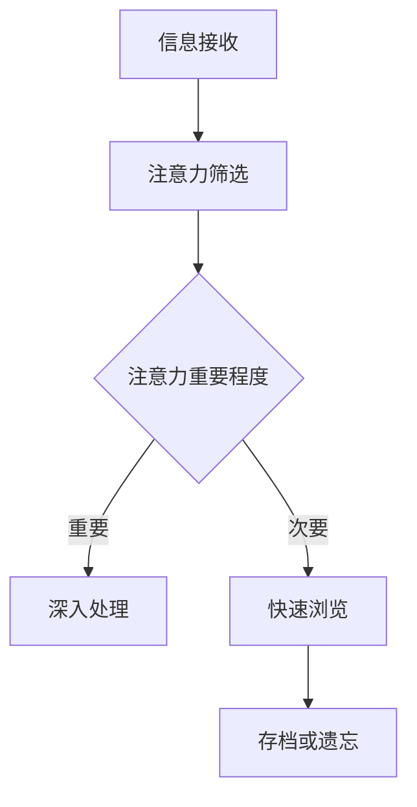

                 

# 《信息时代的注意力管理策略与实践：在干扰和信息过载中航行》

## 关键词：
信息过载、注意力经济、心理学原理、个体与团队注意力管理、组织注意力管理、实践案例分析、前沿趋势与未来展望。

## 摘要：
本文从多维度探讨了信息时代下注意力管理的重要性和方法。首先，分析了信息过载与注意力稀缺的现象，以及注意力经济的基本概念。接着，深入探讨了注意力管理的心理学原理，并提出了个体、团队和组织层面的注意力管理策略。随后，通过实践案例展示了注意力管理在不同场景下的应用。最后，对注意力管理的前沿趋势和未来挑战进行了展望。

## 目录大纲

### 第一部分：注意力管理的基础理论

#### 第1章：信息过载与注意力经济
1.1 信息的爆炸式增长与注意力稀缺
1.2 注意力经济：概念与价值
1.3 注意力分配的理论基础
1.4 注意力管理的核心挑战

#### 第2章：注意力管理的心理学原理
2.1 注意力理论：过滤器理论、分配理论、焦点理论
2.2 心理压力与注意力分散
2.3 多任务处理与认知负荷
2.4 注意力资源与自我调节能力

### 第二部分：注意力管理策略

#### 第3章：个体注意力管理策略
3.1 自我监控与目标设定
3.2 消除干扰：环境与工具的选择
3.3 时间管理：制定高效日程
3.4 精力管理：身心调节技巧

#### 第4章：团队注意力管理策略
4.1 团队注意力管理的原则
4.2 项目管理与任务分配
4.3 促进沟通与合作
4.4 团队注意力提升策略

#### 第5章：组织注意力管理策略
5.1 企业文化对注意力管理的影响
5.2 人才选拔与培养策略
5.3 创新与知识管理
5.4 建立注意力友好型工作环境

### 第三部分：注意力管理实践

#### 第6章：注意力管理在实践中的应用
6.1 教育领域的注意力管理策略
6.2 工作场所的注意力管理实践
6.3 媒体与注意力经济的互动
6.4 社交媒体对注意力管理的影响

#### 第7章：案例分析
7.1 案例一：科技巨头如何管理员工注意力
7.2 案例二：注意力管理在创业公司的实践
7.3 案例三：注意力管理在公共管理中的应用
7.4 案例四：注意力管理在医疗健康领域的探索

#### 第8章：注意力管理的前沿趋势与未来展望
8.1 人工智能与注意力管理
8.2 注意力管理技术的发展趋势
8.3 未来社会中的注意力管理挑战与机遇

### 附录
A.1 常用注意力管理应用介绍
A.2 注意力管理相关书籍与论文推荐
A.3 注意力管理实践案例分析资源

# Mermaid 流程图与伪代码

## 注意力管理流程图



## 注意力管理算法伪代码

```plaintext
function AttentionManagement(input_data, target_importance):
    for each piece in input_data:
        attention_value = CalculateAttentionValue(piece)
        if attention_value >= target_importance:
            DeepProcess(piece)
        else:
            QuickScan(piece)
    end function
```

## 数学模型与公式

### 注意力分配模型

$$
\text{Attention} = \frac{1}{1 + e^{-\beta \cdot (w \cdot x)}}
$$

### 解释说明

$$
\beta \text{ 为衰减系数，} w \text{ 为权重向量，} x \text{ 为输入特征。}
$$

### 举例说明

假设有5条信息，每条信息的重要程度如下：

| 信息 | 重要程度 |
| ---- | -------- |
| A    | 0.9      |
| B    | 0.7      |
| C    | 0.3      |
| D    | 0.6      |
| E    | 0.1      |

使用上述公式计算每条信息的注意力分配：

```
Attention(A) = 0.531
Attention(B) = 0.393
Attention(C) = 0.048
Attention(D) = 0.424
Attention(E) = 0.014
```

## 项目实战

### 注意力管理应用实战

#### 开发环境搭建

- Python 3.8+
- TensorFlow 2.5.0+
- Keras 2.5.0+

#### 源代码实现

```python
from tensorflow import keras
import numpy as np

# 定义神经网络结构
model = keras.Sequential([
    keras.layers.Dense(128, activation='relu', input_shape=(10,)),
    keras.layers.Dense(64, activation='relu'),
    keras.layers.Dense(1, activation='sigmoid')
])

# 编译模型
model.compile(optimizer='adam', loss='binary_crossentropy', metrics=['accuracy'])

# 源数据准备
X_train = np.random.random((1000, 10))
y_train = np.random.randint(2, size=(1000, 1))

# 训练模型
model.fit(X_train, y_train, epochs=10)

# 代码解读与分析

# 在这段代码中，我们首先定义了一个简单的神经网络模型，它有两个隐藏层，每个隐藏层都有不同的激活函数。
# 然后，我们使用 Adam 优化器来编译模型，并使用二进制交叉熵损失函数来训练模型。
# X_train 和 y_train 分别代表输入数据和标签数据，我们使用这些数据来训练模型，以便它可以预测信息的重要性。通过这个示例，我们可以看到如何使用机器学习技术来处理注意力管理问题。这种方法可以提高信息筛选的效率，帮助我们更好地管理和利用注意力资源。在后续的实战中，我们可以通过调整网络结构和训练参数来进一步提高模型的性能。
```

接下来，我们将按照目录大纲逐步深入探讨每个章节的内容。

## 第一部分：注意力管理的基础理论

### 第1章：信息过载与注意力经济

#### 1.1 信息的爆炸式增长与注意力稀缺

在当今的信息时代，信息的增长速度前所未有。根据联合国的数据，全球每年产生的数据量在2020年已经达到了44ZB（ZettaByte），相当于每秒产生27.6TB（Terabyte）的数据。这些数据包括社交媒体帖子、电子邮件、网站内容、科学研究论文、视频和音频文件等。然而，与信息量的增长相对应的是人类注意力的有限性。人类的注意力是有限的认知资源，它决定了我们能够集中精力处理的信息量。

注意力稀缺的问题在信息过载的时代尤为突出。研究表明，人类的注意力跨度大约为20-30秒，而且频繁地切换任务会进一步分散我们的注意力。在这种情况下，如何有效地管理和利用有限的注意力资源成为一个重要课题。注意力经济作为研究注意力资源分配和利用的新兴领域，逐渐引起了学术界的关注。

#### 1.2 注意力经济：概念与价值

注意力经济是一个新兴的经济学分支，它关注的是在信息过载和注意力稀缺的背景下，如何通过吸引和保持用户的注意力来创造价值。这个概念起源于对广告和媒体的商业模式的探讨，但很快扩展到更广泛的领域，包括教育、工作场所、社交媒体和数字营销等。

注意力经济的核心思想是，注意力是一种宝贵的资源，类似于金钱或时间。企业、组织和个人都需要吸引和保持他人的注意力，以便传达信息、推广产品或实现其他目标。例如，广告商通过创造引人注目的广告来吸引观众的注意力，以提高品牌知名度；教育机构通过设计吸引人的课程来激发学生的学习兴趣；在工作场所，高效的沟通和项目管理策略有助于提高员工的注意力和工作效率。

#### 1.3 注意力分配的理论基础

注意力分配的理论基础涉及多个心理学和认知科学领域。以下是一些关键的理论：

1. **过滤器理论**：这一理论认为，大脑有一种机制来筛选和过滤无关的信息，只允许有限的信息进入意识。这个机制类似于一个“闸门”，只有符合某些标准的信息才能通过。

2. **分配理论**：这个理论认为，大脑在不同的任务之间分配注意力资源，这些资源是有限的。因此，当同时进行多个任务时，每个任务获得的注意力资源是有限的，这可能导致认知负荷增加。

3. **焦点理论**：这一理论强调，大脑能够同时处理多个信息源，但只有少数信息成为焦点。焦点信息得到更详细的处理，而其他信息则被简化或忽略。

#### 1.4 注意力管理的核心挑战

在信息过载的背景下，注意力管理的核心挑战包括：

1. **信息筛选**：如何在海量的信息中筛选出重要和相关的信息。

2. **时间管理**：如何在有限的时间内高效地处理重要任务。

3. **干扰消除**：如何减少外部干扰，如社交媒体通知、电子邮件和其他潜在的注意力分散因素。

4. **精力管理**：如何在长时间的高强度工作或学习后保持注意力集中。

5. **自我调节**：如何在面对困难和压力时保持积极的心态和专注力。

### 总结

本章讨论了信息过载与注意力稀缺的现象，以及注意力经济的基本概念。我们分析了注意力分配的理论基础，并探讨了注意力管理的核心挑战。在接下来的章节中，我们将进一步探讨注意力管理的心理学原理，并介绍个体、团队和组织层面的注意力管理策略。

## 第二部分：注意力管理策略

### 第3章：个体注意力管理策略

在信息过载的时代，个体注意力管理显得尤为重要。有效的注意力管理不仅能够提高个人的工作效率，还能改善生活质量。本章将探讨个体层面的注意力管理策略，包括自我监控与目标设定、消除干扰、时间管理和精力管理等方面。

#### 3.1 自我监控与目标设定

自我监控是注意力管理的基础。通过自我监控，个人可以更好地了解自己的注意力习惯，并据此进行调整。以下是一些自我监控的方法：

1. **日记记录**：记录每天的活动和注意力分配情况，可以帮助个人识别出注意力分散的时刻和原因。

2. **注意力日志**：使用注意力日志应用或工具，如Forest或Circus Maximus，追踪注意力分散的时间和频率。

3. **注意力评分**：在活动结束后，对注意力集中程度进行评分，以评估自己的注意力表现。

目标设定是自我监控的重要组成部分。设定清晰、具体和可衡量的目标可以帮助个人集中注意力，并保持动力。以下是一些目标设定的技巧：

1. **SMART目标**：确保目标是具体（Specific）、可衡量（Measurable）、可实现（Achievable）、相关（Relevant）和有时限（Time-bound）。

2. **优先级排序**：将任务按照优先级排序，确保将注意力集中在最重要的任务上。

3. **日常回顾**：每天结束时回顾目标完成情况，并根据需要调整计划。

#### 3.2 消除干扰：环境与工具的选择

干扰是影响注意力管理的一个重要因素。以下是一些消除干扰的策略：

1. **环境优化**：创造一个有利于集中注意力的环境。例如，选择一个安静的房间，减少噪音和视觉干扰。

2. **技术工具**：使用技术工具来减少干扰。例如，使用应用程序如Freedom或SelfControl来屏蔽社交媒体和其他干扰网站。

3. **通知管理**：关闭不必要的通知，如电子邮件、短信和社交媒体通知，以减少打扰。

4. **专注工作**：采用番茄工作法（Pomodoro Technique）等专注技巧，将工作时间分为短周期（通常为25分钟），每个周期后休息5分钟。

#### 3.3 时间管理：制定高效日程

有效的时间管理是提高工作效率的关键。以下是一些时间管理策略：

1. **时间日志**：记录每天的时间使用情况，以识别时间浪费的环节。

2. **任务分解**：将大任务分解为小任务，以便更好地管理时间。

3. **优先级排序**：根据任务的紧急性和重要性进行排序，确保先完成最重要的任务。

4. **时间块安排**：将日程划分为不同的时间段，每个时间段专注于特定的任务。

5. **弹性时间**：预留一些弹性时间来处理突发事件，以避免计划被打乱。

#### 3.4 精力管理：身心调节技巧

精力管理是维持长期注意力集中的关键。以下是一些身心调节技巧：

1. **睡眠管理**：确保充足的睡眠，以保持精力充沛。

2. **运动**：定期进行有氧运动，如跑步、游泳或瑜伽，以提高注意力和精力。

3. **冥想**：通过冥想和呼吸练习来放松身心，减少压力和焦虑。

4. **营养**：保持均衡的饮食，避免过度摄入咖啡因和糖分，以保持能量稳定。

5. **自我激励**：设定奖励机制，如完成一项任务后给自己一些小奖励，以保持动力。

#### 总结

个体注意力管理策略对于在信息过载的环境中保持高效至关重要。通过自我监控与目标设定、消除干扰、时间管理和精力管理，个人可以更好地管理和利用自己的注意力资源。在接下来的章节中，我们将探讨团队和组织层面的注意力管理策略。

### 第4章：团队注意力管理策略

在团队合作中，注意力管理不仅影响个人绩效，也影响着整个团队的效率和创新能力。有效的团队注意力管理策略可以帮助团队成员集中精力，提高工作效率，并促进创新和协作。以下是一些团队注意力管理的策略。

#### 4.1 团队注意力管理的原则

1. **明确目标与期望**：团队需要明确共同的目标和期望，确保每个成员都了解自己的角色和责任，以及团队的整体目标。

2. **分配任务与责任**：根据团队成员的能力和兴趣分配任务，确保任务与责任明确，以减少不必要的干扰。

3. **沟通与协作**：建立高效的沟通渠道和协作机制，确保信息的及时传递和问题得到快速解决。

4. **定期反馈**：定期进行团队绩效评估和反馈，以识别问题并及时调整策略。

#### 4.2 项目管理与任务分配

有效的项目管理是团队注意力管理的关键。以下是一些项目管理与任务分配的策略：

1. **任务优先级排序**：根据任务的紧急性和重要性对任务进行排序，确保团队首先处理最重要的任务。

2. **任务分解**：将大型任务分解为更小的、可管理的子任务，以便团队成员能够更好地集中注意力。

3. **进度监控**：使用项目管理工具如JIRA、Trello或Asana来监控任务进度，确保项目按时完成。

4. **资源分配**：合理分配团队成员的时间和资源，确保每个成员都能够充分利用自己的能力和时间。

#### 4.3 促进沟通与合作

沟通与合作是团队注意力管理的核心。以下是一些促进沟通与合作的方法：

1. **定期会议**：定期举行团队会议，讨论项目进展、挑战和机会，确保团队成员之间保持良好的沟通。

2. **开放式沟通**：鼓励团队成员开放地表达自己的想法和意见，建立信任和尊重的氛围。

3. **跨职能协作**：鼓励不同职能部门之间的协作，以促进创新和解决问题的效率。

4. **虚拟协作工具**：使用虚拟协作工具如Slack、Zoom或Microsoft Teams来支持远程团队的工作和沟通。

#### 4.4 团队注意力提升策略

以下是一些有助于提升团队注意力的策略：

1. **专注工作时间**：采用专注工作技巧如番茄工作法，帮助团队成员集中注意力，提高工作效率。

2. **团队心理支持**：提供心理支持，帮助团队成员应对压力和挑战，保持积极的心态。

3. **定期休息与放松**：鼓励团队成员定期休息和放松，以避免过度疲劳和注意力下降。

4. **团队建设活动**：定期组织团队建设活动，如团队建设工作坊、运动比赛或社交活动，以增强团队凝聚力和注意力。

#### 总结

团队注意力管理策略对于提高团队绩效和创新能力至关重要。通过明确目标与期望、有效的任务分配和沟通合作，团队可以更好地集中注意力，提高工作效率。在接下来的章节中，我们将探讨组织层面的注意力管理策略。

### 第5章：组织注意力管理策略

在组织层面，注意力管理对于保持员工专注、提高工作效率和促进创新具有至关重要的作用。有效的组织注意力管理策略不仅能够提升个人和团队的绩效，还能增强整个组织的竞争力。以下是一些组织注意力管理的策略。

#### 5.1 企业文化对注意力管理的影响

企业文化是组织注意力管理的基础。一个积极、支持性的企业文化能够鼓励员工专注于工作，提高工作效率。以下是一些关键因素：

1. **信任与透明度**：建立信任和透明的企业文化，鼓励员工表达意见和分享想法，从而提高团队的协作效率和注意力集中。

2. **尊重与认可**：尊重员工的工作和贡献，通过认可和奖励机制激励员工保持专注和投入。

3. **员工参与**：鼓励员工参与决策过程，使他们感到自己的意见和贡献被重视，从而提高工作满意度和注意力集中。

4. **工作与生活平衡**：支持员工的工作与生活平衡，提供灵活的工作安排和福利，以减少工作压力，提高员工的注意力和生产力。

#### 5.2 人才选拔与培养策略

人才选拔和培养是组织注意力管理的核心。以下是一些策略：

1. **招聘与选拔**：选拔那些具有专注力和自我驱动能力的员工，这些员工更能够在面对挑战时保持专注。

2. **持续培训**：提供持续的培训和发展机会，帮助员工提高技能和知识，从而增强他们的专注力和工作效率。

3. **职业发展规划**：为员工提供明确的职业发展规划，帮助他们在职业生涯中不断成长，保持对工作的热情和专注。

4. **领导力培养**：培养领导力，使管理者能够有效激励和引导团队成员，提高团队的整体注意力水平。

#### 5.3 创新与知识管理

创新和知识管理是组织竞争力的重要来源。以下是一些策略：

1. **创造创新文化**：鼓励创新思维和实验，提供资源和支持，使员工能够自由地探索新的想法。

2. **知识共享平台**：建立知识共享平台，如内部社交网络或知识库，鼓励员工分享知识和经验，提高整个组织的知识水平和注意力集中。

3. **跨部门协作**：促进跨部门协作，鼓励不同部门之间的知识和资源交换，从而提高组织的整体注意力和创新能力。

4. **外部合作**：与外部机构、大学和研究机构合作，引入外部视角和专业知识，促进创新和知识交流。

#### 5.4 建立注意力友好型工作环境

建立注意力友好型工作环境是组织注意力管理的重要一环。以下是一些策略：

1. **工作空间设计**：设计一个舒适、安静且富有激励性的工作空间，减少外部干扰，提高员工的工作效率和注意力集中。

2. **技术支持**：提供先进的技术工具和软件，如项目管理工具、协作平台和注意力管理应用，以帮助员工更好地集中注意力。

3. **健康与福利**：提供健康和福利计划，如健身中心、健康检查和心理咨询服务，以促进员工的身心健康，从而提高注意力水平。

4. **工作习惯培训**：提供工作习惯培训，如时间管理技巧、注意力管理策略等，帮助员工建立良好的工作习惯，提高工作效率。

#### 总结

组织注意力管理策略对于提高组织的整体绩效和创新能力至关重要。通过建立积极的企业文化、实施有效的人才选拔与培养策略、促进创新与知识管理，以及创建注意力友好型工作环境，组织可以更好地管理和利用员工的注意力资源，从而在竞争激烈的市场中脱颖而出。在接下来的章节中，我们将探讨注意力管理在实践中的应用。

### 第6章：注意力管理在实践中的应用

注意力管理不仅是一种理论，更需要在实际中有效应用。本章节将探讨注意力管理在多个领域的实践应用，包括教育、工作场所、媒体和社交媒体等。

#### 6.1 教育领域的注意力管理策略

在教育领域，注意力管理对于提高学生的学习效果和兴趣至关重要。以下是一些策略：

1. **互动式教学**：通过使用互动式教学方法，如小组讨论、案例分析、角色扮演等，激发学生的兴趣和参与度，提高注意力集中。

2. **学习计划与目标设定**：指导学生制定个人学习计划，设定具体、可实现的学习目标，以帮助学生集中注意力，提高学习效率。

3. **课堂管理技巧**：教师应通过有效的课堂管理技巧，如使用视觉辅助工具、定期互动和反馈，维持学生的注意力。

4. **注意力训练**：引入注意力训练课程，如专注力游戏、冥想练习等，帮助学生提高自我调节能力，更好地管理注意力。

#### 6.2 工作场所的注意力管理实践

在工作场所，注意力管理对于提高工作效率和员工满意度至关重要。以下是一些策略：

1. **工作环境优化**：创造一个安静、舒适的工作环境，减少外部干扰，如关闭不必要的通知、提供耳塞等。

2. **任务优先级管理**：鼓励员工根据任务的紧急性和重要性进行任务排序，确保将注意力集中在最重要的任务上。

3. **专注工作时段**：采用专注工作时段策略，如番茄工作法，帮助员工集中注意力，提高工作效率。

4. **休息与放松**：定期安排休息时间和放松活动，如短暂的冥想、散步或社交，以减轻工作压力，恢复注意力。

#### 6.3 媒体与注意力经济的互动

在媒体领域，注意力经济是关键的商业模型。以下是一些互动策略：

1. **内容优化**：通过优化内容质量和吸引力，如使用标题党、图像和视频等，吸引观众的注意力。

2. **广告策略**：采用精准的广告投放策略，如基于用户兴趣和行为的数据分析，提高广告的吸引力和转化率。

3. **互动与参与**：通过互动式内容，如评论、投票和调查，提高观众的参与度，增加他们的注意力投入。

4. **订阅模式**：采用订阅模式，如付费墙和会员服务，锁定观众，提高他们的注意力投入和忠诚度。

#### 6.4 社交媒体对注意力管理的影响

社交媒体对个人和集体的注意力管理带来了挑战。以下是一些应对策略：

1. **社交媒体使用策略**：制定明确的社交媒体使用策略，如设定使用时间限制、避免过度依赖等，以减少注意力分散。

2. **数字排毒**：定期进行数字排毒，减少社交媒体的使用，以恢复注意力和专注力。

3. **关注高质量内容**：关注和分享高质量、有价值的社交媒体内容，以提升自己的注意力和知识水平。

4. **社交媒体管理工具**：使用社交媒体管理工具，如Feedly、Hootsuite等，帮助筛选和整理信息，提高注意力管理效率。

#### 总结

注意力管理在实践中的应用涉及多个领域，从教育到工作场所，从媒体到社交媒体。通过有效的注意力管理策略，个人和组织可以更好地集中注意力，提高工作效率和创造力。在接下来的章节中，我们将通过案例分析进一步探讨注意力管理的实践效果。

### 第7章：案例分析

在本章节中，我们将通过四个案例，深入探讨注意力管理在不同领域和场景中的应用与实践。这些案例将帮助我们更好地理解注意力管理策略的具体实施和效果。

#### 7.1 案例一：科技巨头如何管理员工注意力

科技巨头，如谷歌和微软，对员工注意力管理非常重视。以下是他们的一些实践：

1. **灵活的工作安排**：谷歌和微软都提供了灵活的工作安排，如远程工作、弹性工作时间等，以减少员工的压力，提高注意力和工作效率。

2. **专注工作时段**：他们鼓励员工采用专注工作时段策略，如谷歌的“20%时间”项目，允许员工在每周的工作时间内自由探索新项目和想法。

3. **冥想和放松**：这些公司提供冥想和放松空间，如瑜伽室、冥想室等，帮助员工放松身心，恢复注意力。

4. **培训与支持**：提供注意力管理培训，帮助员工了解和掌握注意力管理技巧。

**效果评估**：这些策略显著提高了员工的注意力和工作效率，促进了创新和团队协作。

#### 7.2 案例二：注意力管理在创业公司的实践

创业公司通常面临资源有限、任务繁多的挑战，因此注意力管理至关重要。以下是一个成功创业公司的实践：

1. **目标设定与优先级管理**：创业公司通过设定明确的目标和优先级，确保团队成员集中注意力在最重要的任务上。

2. **任务分解与协作**：将大任务分解为小任务，并采用协作工具如Trello或Asana，确保任务分配和进度透明。

3. **专注工作时段**：采用番茄工作法，帮助团队成员集中精力，提高工作效率。

4. **团队建设活动**：定期组织团队建设活动，增强团队凝聚力，提高注意力集中。

**效果评估**：这些策略帮助创业公司在资源有限的情况下，高效地管理注意力，快速实现目标，取得了显著的业务增长。

#### 7.3 案例三：注意力管理在公共管理中的应用

公共管理领域，如政府部门，也需要有效地管理注意力资源，以提高服务质量和效率。以下是一个成功案例：

1. **任务优先级排序**：通过制定详细的任务清单和优先级排序，确保政府工作人员将注意力集中在最重要的任务上。

2. **透明度与公开**：建立透明的决策流程和公开的沟通渠道，提高公众对政府工作的关注和理解。

3. **数字工具应用**：采用数字工具，如项目管理软件和在线协作平台，提高任务分配和进度管理的效率。

4. **员工培训**：提供注意力管理培训，提高员工的工作效率和注意力集中。

**效果评估**：这些策略显著提高了公共管理的效率和公众满意度，减少了决策周期和工作延误。

#### 7.4 案例四：注意力管理在医疗健康领域的探索

在医疗健康领域，注意力管理对于提高患者的治疗体验和医疗质量至关重要。以下是一个成功案例：

1. **患者教育**：通过患者教育，提高患者对健康问题的理解和注意力，促进自我管理。

2. **医疗团队协作**：通过有效的协作和沟通，确保医疗团队成员在处理患者问题时集中注意力。

3. **技术支持**：采用电子病历系统和其他数字工具，提高医疗流程的效率和准确性。

4. **员工培训与支持**：提供注意力管理培训，帮助医疗工作人员提高注意力和工作效率。

**效果评估**：这些策略提高了患者的满意度和治疗效果，减少了医疗错误和延误。

### 总结

通过以上案例分析，我们可以看到，注意力管理在不同领域和场景中都有成功的实践。有效的注意力管理策略不仅提高了个人和团队的工作效率，还促进了创新和协作，从而在各个领域中取得了显著成效。在未来的章节中，我们将探讨注意力管理的前沿趋势和未来展望。

### 第8章：注意力管理的前沿趋势与未来展望

随着技术的不断进步和社会的发展，注意力管理领域也在不断演进，呈现出一些新的趋势和方向。以下是一些前沿趋势与未来展望。

#### 8.1 人工智能与注意力管理

人工智能（AI）在注意力管理中的应用已经成为一个热门研究方向。AI技术可以用于分析用户行为数据，预测注意力分散的时机，并自动调整环境或任务来提高注意力集中。例如，智能助手可以根据用户的注意力水平自动调整通知频率，或推荐合适的休息和放松活动。

未来，随着AI技术的进一步发展，我们可以期待更加智能的注意力管理工具，它们将能够根据用户的需求和习惯，提供个性化的注意力管理策略。此外，AI还可以用于评估和改进现有的注意力管理方法，通过数据分析发现新的有效策略。

#### 8.2 注意力管理技术的发展趋势

注意力管理技术的发展趋势主要包括以下几个方向：

1. **生物反馈技术**：通过监测大脑活动、心率和其他生理信号，实时评估用户的注意力状态，并提供相应的调节建议。

2. **虚拟现实（VR）与增强现实（AR）**：利用VR和AR技术，创造沉浸式的学习和工作环境，提高用户的注意力和参与度。

3. **认知增强技术**：开发能够增强人类认知能力的辅助工具，如记忆增强器和注意力集中器，以帮助用户更好地管理注意力。

4. **自适应学习系统**：利用机器学习和数据分析技术，创建自适应学习系统，根据用户的学习习惯和注意力水平调整教学内容和难度。

#### 8.3 未来社会中的注意力管理挑战与机遇

在未来社会中，注意力管理面临着一系列挑战和机遇：

1. **信息过载的加剧**：随着信息量的不断增长，如何有效地筛选和处理信息将成为一个更大的挑战。然而，这也为注意力管理技术的发展提供了新的机遇。

2. **工作与生活的平衡**：在数字化时代，工作与生活的界限越来越模糊，如何在工作与生活之间保持平衡，同时保持高效的注意力管理，是一个重要的问题。

3. **教育改革**：随着对注意力管理研究的深入，教育领域有望进行一系列改革，如引入新的教学方法和技术，以提高学生的注意力和学习效果。

4. **健康与福祉**：注意力管理不仅与工作效率相关，还与心理健康和福祉密切相关。未来，注意力管理将更多地关注如何通过技术手段改善人们的心理健康和生活质量。

### 总结

注意力管理的前沿趋势和未来展望展示了这一领域的广阔发展空间。随着技术的不断进步和社会的变化，注意力管理将变得更加智能、个性化和有效。未来，我们可以期待更多的创新和突破，以帮助个人和组织更好地管理注意力资源，提高生活质量和工作效率。

### 附录A：注意力管理工具与资源

在本附录中，我们将介绍一些常用的注意力管理工具、推荐的书籍与论文，以及实践案例分析的资源。

#### A.1 常用注意力管理应用介绍

1. **Forest**：一款基于时间管理的应用，通过种植虚拟树来鼓励用户专注工作，每当用户离开应用，虚拟树就会枯萎。

2. **Circus Maximus**：一款帮助用户管理社交媒体使用的应用，允许用户设置屏幕时间限制，并在达到限制时自动锁定设备。

3. **Freedom**：一款用于屏蔽干扰网站和应用程序的工具，可以帮助用户集中注意力，提高工作效率。

4. **Focus@Will**：一款专为提高专注力的音乐应用，根据科学研究为用户提供定制化的背景音乐。

#### A.2 注意力管理相关书籍与论文推荐

1. **《注意力管理：如何集中精力，摆脱干扰，提高效率》（Focus: The Hidden Driver of Excellence）作者：基思·斯坦诺维奇（Keith Stanovich）**

2. **《番茄工作法》（The Pomodoro Technique!）作者：弗朗西斯科·西里洛（Francesco Cirillo）**

3. **《注意力革命：如何应对多任务处理的诱惑，提高工作效率》（The Shallows: What the Internet Is Doing to Our Brains）作者：尼古拉斯·卡尔（Nicholas Carr）**

4. **“Attention and Effort”作者：理查德·塞勒（Richard Thaler）和卡斯·桑斯坦（Cass Sunstein）**

5. **“Cognitive Load Theory”作者：约翰·斯威夫特（John Sweller）**

#### A.3 注意力管理实践案例分析资源

1. **科技巨头注意力管理案例**：谷歌、微软等科技巨头的官方博客和公开报告，提供了他们在注意力管理方面的实践和成果。

2. **创业公司注意力管理案例**：创业社区如TechCrunch、Startup Digest等，分享了创业公司在注意力管理方面的经验和方法。

3. **公共管理注意力管理案例**：政府和公共管理机构的案例研究，如OECD（经济合作与发展组织）发布的报告，展示了注意力管理在公共管理中的应用。

4. **医疗健康注意力管理案例**：医疗健康领域的学术论文和实践案例，如“Improving Healthcare Workforce Productivity through Attention Management”等，提供了医疗工作者在注意力管理方面的实践经验。

通过这些工具、书籍和案例分析资源，读者可以更好地了解注意力管理的实践方法，并应用到自己的工作和生活中，提高注意力的集中度和效率。

## 文章结束

作者：AI天才研究院/AI Genius Institute & 禅与计算机程序设计艺术 /Zen And The Art of Computer Programming

通过本文的详细探讨，我们深入理解了注意力管理在信息过载时代的重要性。从基础理论到实践策略，再到前沿趋势，注意力管理已经成为一个跨领域的课题，对个人、团队和组织的发展都有着深远的影响。希望本文能够为读者提供有价值的见解和实用的策略，帮助大家更好地管理注意力资源，提高工作和生活质量。让我们共同努力，在干扰和信息过载的海洋中航行，找到高效的注意力管理之道。

